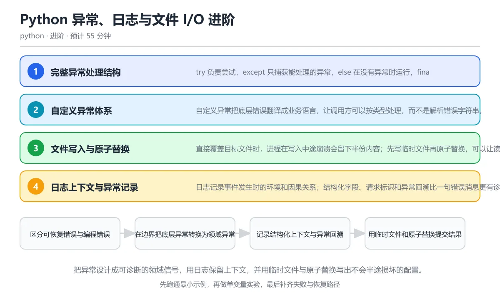

# Python 异常、日志与文件 I/O 进阶

> 内容更新时间：2026-10-06 · 学习阶段：进阶 · 预计用时：45 分钟

分类：python。关键词：异常链、自定义异常、日志、原子写、ExceptionGroup。把异常设计成可诊断的领域信号，用日志保留上下文，并用临时文件与原子替换写出不会半途损坏的配置。

学习建议：先通读《Python 异常、日志与文件 I/O 进阶》的核心知识与关键流程，再运行可运行练习并完成测验；遇到不确定的结论，回到「故障现场」按症状、根因、修复、验证四步核对。



## 本节知识框架

**课程定位**：所属分类为「Python」，课程主题为「Python 异常、日志与文件 I/O 进阶」，学习阶段为「进阶」，建议用时 45 分钟。

**本课要解决的主问题**：把异常设计成可诊断的领域信号，用日志保留上下文，并用临时文件与原子替换写出不会半途损坏的配置。

| 学习层次 | 要回答的问题 | 完成判据 |
| --- | --- | --- |
| 概念层 | 「Python 异常、日志与文件 I/O 进阶」有哪些必须区分的对象与术语？ | 能用自己的话定义核心术语，并各举一个正例和一个反例。 |
| 机制层 | 这些对象按什么顺序发生作用，输入如何变成输出？ | 能画出或写出机制步骤，并说明每一步的失败条件。 |
| 应用层 | 什么场景适合使用「Python 异常、日志与文件 I/O 进阶」，什么场景不适合？ | 能给出一个真实场景、一个最小示例和一个边界案例。 |
| 性能层 | 时间、空间、吞吐或延迟受哪些量影响？ | 能说出复杂度或性能瓶颈的证据来源；没有证据时明确写“材料未提供”。 |
| 复习层 | 怎样确认自己不是只记住了结论？ | 能独立完成本课自测，并把错误定位到概念、机制、示例或边界。 |

### 阅读路线

1. 先读「核心概念定义」，建立「异常链」等对象的精确定义。
2. 再读「原理与运行机制」，把定义串成可重复的过程。
3. 用「代码/协议/SQL 示例」验证过程，并只改一个条件观察结果变化。
4. 最后检查性能、易错点、知识关系与自测题，形成可复习的证据链。

**前置知识**：《异常处理与文件操作》

**学习位置**：本课位于《Python 标准库实战工具箱》之后；如果前一课的自测不能通过，应先回补再继续。

**后续衔接**：下一课《Python pytest 测试实战》会继续使用本课术语，学完后建议立即完成一次自测。

**教材衔接：学习目标**

- 能设计带上下文的领域异常，并保留原始异常链。
- 能写出可诊断、可轮转且不泄露敏感信息的日志。
- 能用临时文件与原子替换保证配置写入的完整性。

**教材衔接：前置知识**

- 会使用 try/except 捕获常见异常。
- 能用 open 或 Path 读取和写入文本文件。
- 知道日志级别和基本格式化输出。

**教材衔接：本课小结**

- Python 异常、日志与文件 I/O 进阶围绕异常链、自定义异常、日志展开，先建立基线再讨论优化。
- try 负责尝试，except 只捕获能处理的异常，else 在没有异常时运行，finally 无论成功失败都会清理资源。
- 遇到问题时按「症状 → 根因 → 修复 → 验证」的顺序处理，不跳过验证。

## 核心概念定义

> 阅读约定：本课先给「Python 异常、日志与文件 I/O 进阶」相关术语的操作性定义与适用边界；正文里的口语化说法与定义冲突时，以定义和可复现示例为准。

| 术语 | 操作性定义 | 本课中的边界 |
| --- | --- | --- |
| 异常链 | 通过 raise from 或隐式上下文把新异常与原始异常关联起来的因果结构。 | 仅在「Python 异常、日志与文件 I/O 进阶」明确给出的输入、版本与资源条件下成立。 |
| 上下文管理器 | 实现 __enter__ 与 __exit__ 的对象，可保证代码块结束后自动释放资源。 | 仅在「Python 异常、日志与文件 I/O 进阶」明确给出的输入、版本与资源条件下成立。 |
| 原子替换 | 通过重命名操作把完整的新文件一次性替换到目标路径，让读者看不到中间状态。 | 仅在「Python 异常、日志与文件 I/O 进阶」明确给出的输入、版本与资源条件下成立。 |
| fsync | 要求操作系统把文件缓冲区写入持久存储的系统调用。 | 仅在「Python 异常、日志与文件 I/O 进阶」明确给出的输入、版本与资源条件下成立。 |
| 领域异常 | 用业务语言描述失败原因的异常类型，通常由底层技术异常转换而来。 | 仅在「Python 异常、日志与文件 I/O 进阶」明确给出的输入、版本与资源条件下成立。 |
| ExceptionGroup | 把多个子异常打包在一起的异常类型，适合表示并发任务的部分失败。 | 仅在「Python 异常、日志与文件 I/O 进阶」明确给出的输入、版本与资源条件下成立。 |

### 定义如何使用

在「Python 异常、日志与文件 I/O 进阶」中判断一个说法是否成立，先确认它使用的是哪个对象的定义，再检查输入规模、运行环境与失败路径。定义不是口号，而是后续推导、代码示例和自测题共享的约束。

## 原理与运行机制

### 机制总览

1. **建立输入**：把「异常链」按本课定义整理成可观察、可重复的输入条件。
2. **执行转换**：围绕「上下文管理器」执行本课的核心步骤；每一步都记录中间状态，避免只看最终输出。
3. **产生输出**：得到「原子替换」后，用正文示例或协议/SQL 结果核对输出是否符合预期。
4. **改变一个条件**：只替换一个边界条件或环境参数，观察「Python 异常、日志与文件 I/O 进阶」的结论是否仍然成立。

| 阶段 | 关注对象 | 失败时应检查 |
| --- | --- | --- |
| 输入 | 异常链 | 类型、范围、编码、版本或前置状态是否满足定义。 |
| 处理 | 上下文管理器 | 顺序、可见性、锁、路由、事务或调度规则是否被破坏。 |
| 输出 | 原子替换 | 结果是否可复现，错误是否被正确传播而不是被吞掉。 |

本课的机制结论要用「Python 异常、日志与文件 I/O 进阶」自己的示例验证。「Python 异常、日志与文件 I/O 进阶」没有给出某个数量级、吞吐或内存数据时，本课把该判断标为“材料未提供”，不从相邻主题外推。

**教材衔接：核心知识**

### 1. 完整异常处理结构

try 负责尝试，except 只捕获能处理的异常，else 在没有异常时运行，finally 无论成功失败都会清理资源。

异常沿调用栈向上传播，除非遇到匹配的处理器；捕获后可以用裸 raise 重新抛出，也可以 raise 新异常 from 原异常建立因果链。EAFP 鼓励先尝试再处理异常，LBYL 则先检查条件再行动。

在Python 异常、日志与文件 I/O 进阶里可以这样验证：读取配置时把文件不存在与 JSON 格式错误分别转换为领域异常，再用 from 保留原始回溯。

边界：捕获范围过宽会把编程错误也吞掉；except 块里的 return 会覆盖异常语义，finally 里的 return 甚至会吞掉未处理异常。

工程视角：只在能恢复或能补充上下文的地方捕获异常，边界层统一转换成对外错误，内部保留完整异常链。

### 2. 自定义异常体系

自定义异常把底层错误翻译成业务语言，让调用方可以按类型处理，而不是解析错误字符串。

领域模块定义统一根异常，再按失败原因派生子类；异常对象可以携带字段、错误码和原始输入，抛出时用 from 关联底层异常，既方便程序判断也方便人阅读。

在Python 异常、日志与文件 I/O 进阶里可以这样验证：定义 ConfigError，把 FileNotFoundError 与 JSONDecodeError 都转换成该异常，同时在消息中保留路径。

边界：不要为每个小分支都建异常类，也不要滥用异常做正常流程控制；异常要能回答发生了什么、在哪里、如何恢复三个问题。

工程视角：异常层级作为模块公开接口的一部分，版本升级时保持兼容；上层只捕获真正理解的类型，其他异常继续向外传播。

### 3. 文件写入与原子替换

直接覆盖目标文件时，进程在写入中途崩溃会留下半份内容；先写临时文件再原子替换，可以让读者只看到旧版本或新版本。

tempfile.mkstemp 在同一目录创建唯一临时文件，写入后 flush 并 fsync 落盘，再用 os.replace 原子替换目标；失败路径负责删除临时文件。

在Python 异常、日志与文件 I/O 进阶里可以这样验证：实现 write_atomic 函数写入 JSON 配置，并在异常时清理临时文件，验证目标文件始终是合法 JSON。

边界：原子替换只能保证单机单文件语义，跨多个文件或分布式系统仍需事务或版本标记；fsync 会带来性能成本，要按数据重要性选择。

工程视角：配置、索引和状态文件使用原子写，临时文件与目标放在同一文件系统；为崩溃恢复写测试，而不只测试正常路径。

### 4. 日志上下文与异常记录

日志记录事件发生时的环境和因果关系；结构化字段、请求标识和异常回溯比一句错误消息更有诊断价值。

logger.exception 在异常处理块中同时记录消息和回溯，extra 可以附加请求编号与用户标识，handler 决定输出位置，formatter 决定字段布局。

在Python 异常、日志与文件 I/O 进阶里可以这样验证：在捕获异常后用 logger.exception 记录一次失败，并在结构化字段里带上配置路径，避免只打印一句失败的字符串。

边界：日志不能记录密码、令牌和完整个人信息；高频路径大量记录调试日志会带来磁盘与性能开销。

工程视角：日志级别按环境配置，关键事件带稳定字段名，错误日志附带可检索的请求标识与版本号。

### 5. ExceptionGroup 与 except*

并发任务可能同时产生多个错误，ExceptionGroup 把它们打包成一个异常，except 星号语法可以按类型拆分处理。

ExceptionGroup 保存子异常列表和统一消息，except* 会匹配组内每个分支并重新组合未处理的异常；普通 except 只能整体捕获，无法分别处理不同子类型。

在Python 异常、日志与文件 I/O 进阶里可以这样验证：用 ExceptionGroup 同时承载超时与格式错误，再用 except* 分别记录两类问题，观察剩余异常如何继续抛出。

边界：异常组适合天然并行的任务集合，不应为了炫技把互不相关的错误强行打包；异常组不能与普通 except 混用于同一 try 块。

工程视角：每个子任务在异常中带上任务标识，处理端按类别汇总并保证未处理异常不会被悄悄丢失。

**教材衔接：关键流程**

```text
区分可恢复错误与编程错误 → 在边界把底层异常转换为领域异常 → 记录结构化上下文与异常回溯 → 用临时文件和原子替换提交结果 → 为失败路径与部分成功补测试
```

1. 区分可恢复错误与编程错误
2. 在边界把底层异常转换为领域异常
3. 记录结构化上下文与异常回溯
4. 用临时文件和原子替换提交结果
5. 为失败路径与部分成功补测试

## 典型应用场景

| 场景 | 典型输入或前提 | 期望产物 |
| --- | --- | --- |
| 学习验证 | 使用本课最小示例和 异常链、自定义异常 | 能复现正文结论，并解释每一步。 |
| 工程落地 | 把「Python 异常、日志与文件 I/O 进阶」放入真实模块或服务边界 | 输出可观测、失败可定位、参数可配置。 |
| 故障排查 | 只改一个版本、规模、输入或依赖条件 | 能区分概念错误、实现错误和环境差异。 |

判断「Python 异常、日志与文件 I/O 进阶」的场景是否成立，标准是能否写出输入、处理、输出和失败路径；材料中没有出现的数据在本课标注为“材料未提供”，不用推测替代证据。

**课程内置实验入口**：`sandbox:python`，用于动手验证《Python 异常、日志与文件 I/O 进阶》的机制；实验结论不替代概念定义与复杂度分析。

## 代码/协议/SQL 示例

### 最小可验证示例

下面保留《Python 异常、日志与文件 I/O 进阶》原文中的最小示例。先预测《Python 异常、日志与文件 I/O 进阶》示例的输出，再按正文步骤运行或推演；示例依赖外部环境时，同时记录版本与输入。

```text
区分可恢复错误与编程错误 → 在边界把底层异常转换为领域异常 → 记录结构化上下文与异常回溯 → 用临时文件和原子替换提交结果 → 为失败路径与部分成功补测试
```

**教材衔接：原文最小示例**

```text
区分可恢复错误与编程错误 → 在边界把底层异常转换为领域异常 → 记录结构化上下文与异常回溯 → 用临时文件和原子替换提交结果 → 为失败路径与部分成功补测试
```

## 时间/空间复杂度或性能分析

**复杂度证据**：「Python 异常、日志与文件 I/O 进阶」的现有材料没有给出渐近时间或空间复杂度的明确结论，本课只做定性检查，不补写未经验证的 $O$ 记号。

| 维度 | 本课关注点 | 判断依据 |
| --- | --- | --- |
| 时间/延迟 | 「Python 异常、日志与文件 I/O 进阶」的主要步骤是否会随输入规模、并发度或网络往返增长。 | 以正文复杂度、基准数据或可重复测量为准。 |
| 空间/内存 | 中间状态、缓存、副本、连接或索引是否随规模增长。 | 记录峰值内存与数据副本，不只看最终结果。 |
| 吞吐/资源 | 版本、调度、锁、IO、序列化或协议开销是否成为瓶颈。 | 固定环境做对照实验，改变一个变量。 |

评估「Python 异常、日志与文件 I/O 进阶」时要区分“正确性成立”和“性能达标”两件事；材料没有给出基准时，本课只保留量级来源与测量方法，不写不可验证的绝对数字。

## 常见误区与易错点

> 复核《Python 异常、日志与文件 I/O 进阶》的易错点时，优先保留原文的错误表、故障现场与排错路径；每条修正都要能用本课示例复验。

| 易错点 | 常见表现 | 正确做法 |
| --- | --- | --- |
| 只背结论 | 能复述「Python 异常、日志与文件 I/O 进阶」的定义，却说不清输入、输出与边界。 | 回到机制步骤，用最小示例逐一验证。 |
| 混淆相邻概念 | 把本课对象与相邻主题的对象当成同一类。 | 先比较定义、资源归属、生命周期和失败模式。 |
| 忽略版本与环境 | 在开发机通过后直接外推到生产环境。 | 固定版本、输入和资源条件，再记录可复现结果。 |

**教材衔接：常见错误与排查**

> 说明：本表由《Python 异常、日志与文件 I/O 进阶》的核心知识整理（2026-10-06），人工复核进度见 docs/content_review_batches.md。

| 易错点 | 容易踩的做法 | 正确结论 |
| --- | --- | --- |
| 捕获后静默跳过 | 写 except Exception: pass，把真正的程序错误和外部故障一起吞掉 | 只捕获预期异常并记录上下文，其他异常继续向外传播 |
| 重新抛异常时丢失原因 | 捕获底层异常后直接 raise ConfigError('失败')，原始回溯和原因全部消失 | 使用 raise ConfigError('...') from exc 建立异常链 |
| 直接覆盖重要文件 | 打开目标文件反复写入，中途崩溃后留下不完整内容 | 写临时文件并 fsync，成功后用 os.replace 原子替换，失败时清理临时文件 |
| 日志泄露敏感信息 | 把令牌、密码和完整身份证号写进日志，或在调试级别记录请求体全文 | 脱敏后再记录，使用稳定字段与摘要，敏感值只保留不可逆标识 |

**教材衔接：故障现场**

### 现场 1：捕获后静默跳过

**症状**：在《Python 异常、日志与文件 I/O 进阶》里采用「写 except Exception: pass，把真正的程序错误和外部故障一起吞掉」时，捕获后静默跳过会表现为错误结果、异常中断或状态不一致。

**根因**：这个做法没有执行与「捕获后静默跳过」对应的检查，问题被带到了后续步骤。

**修复**：只捕获预期异常并记录上下文，其他异常继续向外传播

**验证**：为「捕获后静默跳过」准备一个最小输入，确认修复前的失败可以复现，修复后的输出与本课示例一致，再补一个边界输入。

### 现场 2：重新抛异常时丢失原因

**症状**：在《Python 异常、日志与文件 I/O 进阶》里采用「捕获底层异常后直接 raise ConfigError('失败')，原始回溯和原因全部消失」时，重新抛异常时丢失原因会表现为错误结果、异常中断或状态不一致。

**根因**：这个做法没有执行与「重新抛异常时丢失原因」对应的检查，问题被带到了后续步骤。

**修复**：使用 raise ConfigError('...') from exc 建立异常链

**验证**：为「重新抛异常时丢失原因」准备一个最小输入，确认修复前的失败可以复现，修复后的输出与本课示例一致，再补一个边界输入。

### 现场 3：直接覆盖重要文件

**症状**：在《Python 异常、日志与文件 I/O 进阶》里采用「打开目标文件反复写入，中途崩溃后留下不完整内容」时，直接覆盖重要文件会表现为错误结果、异常中断或状态不一致。

**根因**：这个做法没有执行与「直接覆盖重要文件」对应的检查，问题被带到了后续步骤。

**修复**：写临时文件并 fsync，成功后用 os.replace 原子替换，失败时清理临时文件

**验证**：为「直接覆盖重要文件」准备一个最小输入，确认修复前的失败可以复现，修复后的输出与本课示例一致，再补一个边界输入。

### 现场 4：日志泄露敏感信息

**症状**：在《Python 异常、日志与文件 I/O 进阶》里采用「把令牌、密码和完整身份证号写进日志，或在调试级别记录请求体全文」时，日志泄露敏感信息会表现为错误结果、异常中断或状态不一致。

**根因**：这个做法没有执行与「日志泄露敏感信息」对应的检查，问题被带到了后续步骤。

**修复**：脱敏后再记录，使用稳定字段与摘要，敏感值只保留不可逆标识

**验证**：为「日志泄露敏感信息」准备一个最小输入，确认修复前的失败可以复现，修复后的输出与本课示例一致，再补一个边界输入。

## 与其他知识点的关系

| 关系 | 课程 | 为什么 |
| --- | --- | --- |
| 先修 | 《异常处理与文件操作》 | 本课会直接使用它的概念或操作前提。 |
| 关联 | 《Python 标准库实战工具箱》 | 用于横向比较或把本课结论迁移到相邻主题。 |
| 关联 | 《Python 项目架构：分层、配置与依赖注入》 | 用于横向比较或把本课结论迁移到相邻主题。 |
| 前置顺序 | 《Python 标准库实战工具箱》 | 同分类中安排在本课之前，建议先完成其自测。 |
| 后续顺序 | 《Python pytest 测试实战》 | 同分类中安排在本课之后，会继续使用本课术语。 |

把「Python 异常、日志与文件 I/O 进阶」放回知识体系时，不只要记住“前面学过什么”，还要说明两个主题在输入、机制、资源边界和失败模式上的差异。这样才能把单课知识迁移到项目、排障和后续课程。

**教材衔接：复习与迁移**

### 概念复述

不看正文，把Python 异常、日志与文件 I/O 进阶讲给一个没学过的同事：先讲它解决什么问题，再讲一个最小例子，最后说明一个不适用场景。

### 测验回顾

回到《Python 异常、日志与文件 I/O 进阶》测验，只重做答错或犹豫的题；对每道题写一句「我为什么改选这个答案」，写不出理由就回到对应小节。

### 迁移练习

把《Python 异常、日志与文件 I/O 进阶》的方法用到一个你自己的真实场景：说明输入、约束与验证方式，并列出仍然不确定、需要下一次实验回答的问题。

## 自测题与参考答案

> 先独立作答《Python 异常、日志与文件 I/O 进阶》的自测题，再对照答案与解析；每处判断都要能在本课正文或示例中找到依据。

### 自测 1

raise ConfigError('找不到配置') from exc 的作用是什么？

A. 把原始异常保存为 __cause__，异常链保留完整因果
B. 隐藏所有异常信息
C. 让程序忽略 ConfigError
D. 自动重试失败的读取

**参考答案**：把原始异常保存为 __cause__，异常链保留完整因果

**解析**：from 会把原始异常写入新异常的 __cause__ 属性，回溯中会显示直接原因，调试和日志都能看到底层失败链。省略 from 时 Python 仍可能记录隐式上下文，但语义不如显式异常链清楚；直接吞掉原始异常会让定位问题变得非常困难。 正确选项「把原始异常保存为 __cause__，异常链保留完整因果」对应《Python 异常、日志与文件 I/O 进阶》的要点「完整异常处理结构」：try 负责尝试，except 只捕获能处理的异常，else 在没有异常时运行，finally 无论成功失败都会清理资源。判断「完整异常处理结构」时先确认前提是否成立，再回到《Python 异常、日志与文件 I/O 进阶》的示例核对一次；把别的语言或框架的默认做法直接搬到完整异常处理结构上，往往会在本课的边界条件里失效。

### 自测 2

日志中应该避免出现哪些内容？（多选）

A. 用户密码与访问令牌
B. 完整身份证号或银行卡号
C. 可定位请求的随机请求编号
D. 未脱敏的完整请求体

**参考答案**：用户密码与访问令牌；完整身份证号或银行卡号；未脱敏的完整请求体

**解析**：密码、令牌、身份证号、银行卡号和未脱敏请求体都可能造成泄露，日志系统往往被更多人访问且长期保留。随机请求编号是安全且有用的关联字段，应当保留；对敏感值可以记录哈希、长度或掩码后的片段，同时限制日志访问权限。 正确选项「用户密码与访问令牌；完整身份证号或银行卡号；未脱敏的完整请求体」对应《Python 异常、日志与文件 I/O 进阶》的要点「文件写入与原子替换」：直接覆盖目标文件时，进程在写入中途崩溃会留下半份内容；先写临时文件再原子替换，可以让读者只看到旧版本或新版本。判断「文件写入与原子替换」时先确认前提是否成立，再回到《Python 异常、日志与文件 I/O 进阶》的示例核对一次；记住文件写入与原子替换的结论之外还要记住适用条件，换一个输入往往就不成立了。

### 自测 3

阅读代码，输出中 __cause__ 的类型是什么？

try:
    open('missing.json')
except FileNotFoundError as exc:
    try:
        raise RuntimeError('加载失败') from exc
    except RuntimeError as error:
        print(type(error.__cause__).__name__)

```python
try:
    open('missing.json')
except FileNotFoundError as exc:
    try:
        raise RuntimeError('加载失败') from exc
    except RuntimeError as error:
        print(type(error.__cause__).__name__)
```

A. FileNotFoundError
B. RuntimeError
C. KeyError
D. NoneType

**参考答案**：FileNotFoundError

**解析**：raise from 会把捕获到的 FileNotFoundError 绑定为 RuntimeError 的 __cause__，因此输出 FileNotFoundError。异常链既保留面向业务的新消息，也保留底层失败原因；记录日志时应使用 exc_info 或 exception 方法，把完整链写进诊断信息。

**教材衔接：动手练习**

1. 为一个配置加载模块设计异常层级，覆盖文件不存在、权限不足、格式错误和字段缺失四类失败。
2. 实现带原子替换的 JSON 写入函数，再模拟写入中途异常，验证目标文件仍然是上一版完整内容。
3. 配置一个日志 handler，输出时间、级别、模块和请求编号，并对密码字段做脱敏。
4. 用 ExceptionGroup 模拟三个并发任务的部分失败，分别统计成功、超时和格式错误数量。

**验收标准**：留下输入、命令、输出和结论，能让别人按记录复现。

**教材衔接：可运行练习**

### 任务 1：先跑通，再解释

```python
import json
import os
import tempfile
from pathlib import Path

class ConfigError(Exception):
    """配置读取失败的领域异常。"""

def load_config(path: Path):
    try:
        text = path.read_text(encoding="utf-8")
        return json.loads(text)
    except FileNotFoundError as exc:
        raise ConfigError(f"找不到配置文件: {path}") from exc
    except json.JSONDecodeError as exc:
        raise ConfigError(f"配置不是合法 JSON: {path}") from exc

def write_atomic(path: Path, payload: dict) -> None:
    path.parent.mkdir(parents=True, exist_ok=True)
    fd, temp_name = tempfile.mkstemp(dir=path.parent, prefix=path.name, suffix=".tmp")
    try:
        with os.fdopen(fd, "w", encoding="utf-8") as handle:
            json.dump(payload, handle, ensure_ascii=False)
            handle.flush()
            os.fsync(handle.fileno())
        os.replace(temp_name, path)
    except BaseException:
        Path(temp_name).unlink(missing_ok=True)
        raise

target = Path("demo_config.json")
write_atomic(target, {"name": "学习助手", "version": 2})
print("写入成功:", load_config(target))
try:
    load_config(Path("missing.json"))
except ConfigError as exc:
    print("领域异常:", type(exc).__name__, "原因:", type(exc.__cause__).__name__)
```

配置读取函数只捕获两类可解释的底层异常，并把它们转换成 ConfigError，同时用 from 保留 FileNotFoundError 或 JSONDecodeError 作为原因。原子写函数在同一目录创建临时文件，写完并落盘后调用 os.replace，异常时删除临时文件，因此目标路径永远不会出现半份 JSON。

### 任务 2：只改一个条件

复制上面的示例，只改一个输入或参数再跑一次；先写下预测，再和真实输出对照，并说明差异来自Python 异常、日志与文件 I/O 进阶的哪条机制。

### 任务 3：迁移到自己的数据

把《Python 异常、日志与文件 I/O 进阶》里的示例换成你自己的一小段数据或场景，保持结构不变；如果换不动，说明还有哪条前提没有理解，回到核心知识对应小节。

**教材衔接：本课复习清单**

离开本课前，逐项确认：

- [ ] 能用 raise from 保留完整异常链。
- [ ] 能解释原子替换为什么不会暴露半写文件。
- [ ] 能区分可恢复异常与应继续传播的程序错误。
- [ ] 至少运行一次本课示例，记录输入、输出和一个边界情况。
- [ ] 把本课最容易混淆的两个概念写成一句话对照。

| 复盘项 | 记录 |
| --- | --- |
| 已经能独立解释的考点 |  |
| 仍然说不清的概念 |  |
| 下一步验证动作 |  |

**教材衔接：复习与自测**

### 核心知识

遮住正文回答：Python 异常、日志与文件 I/O 进阶解决什么问题、依赖哪些前提、失败时先看哪个信号？三问都能答清楚，再进入下一节。

### 动手练习

把《Python 异常、日志与文件 I/O 进阶》里「只改一个条件」的练习再做一遍，这次先写预测再运行；预测和结果不一致的地方，就是需要回读的章节。

### 最小可运行示例

```python
import json
import os
import tempfile
from pathlib import Path

class ConfigError(Exception):
    """配置读取失败的领域异常。"""

def load_config(path: Path):
    try:
        text = path.read_text(encoding="utf-8")
        return json.loads(text)
    except FileNotFoundError as exc:
        raise ConfigError(f"找不到配置文件: {path}") from exc
    except json.JSONDecodeError as exc:
        raise ConfigError(f"配置不是合法 JSON: {path}") from exc

def write_atomic(path: Path, payload: dict) -> None:
    path.parent.mkdir(parents=True, exist_ok=True)
    fd, temp_name = tempfile.mkstemp(dir=path.parent, prefix=path.name, suffix=".tmp")
    try:
        with os.fdopen(fd, "w", encoding="utf-8") as handle:
            json.dump(payload, handle, ensure_ascii=False)
            handle.flush()
            os.fsync(handle.fileno())
        os.replace(temp_name, path)
    except BaseException:
        Path(temp_name).unlink(missing_ok=True)
        raise

target = Path("demo_config.json")
write_atomic(target, {"name": "学习助手", "version": 2})
print("写入成功:", load_config(target))
try:
    load_config(Path("missing.json"))
except ConfigError as exc:
    print("领域异常:", type(exc).__name__, "原因:", type(exc.__cause__).__name__)
```

### 预期输出

```text
写入成功: {'name': '学习助手', 'version': 2}
领域异常: ConfigError 原因: FileNotFoundError
```

### 验证步骤

1. 确认输入数据与运行环境和示例一致。
2. 运行示例，记录输出与耗时等可观测指标。
3. 换一个边界输入重跑，确认结论仍然成立。
4. 把两次结果写成一句话结论，注明前提与局限。

---

## 术语速查

先遮住右列，尝试用自己的话解释，再回到正文核对。

| 术语 | 一句话说明 |
| --- | --- |
| `异常链` | 通过 raise from 或隐式上下文把新异常与原始异常关联起来的因果结构。 |
| `上下文管理器` | 实现 __enter__ 与 __exit__ 的对象，可保证代码块结束后自动释放资源。 |
| `原子替换` | 通过重命名操作把完整的新文件一次性替换到目标路径，让读者看不到中间状态。 |
| `fsync` | 要求操作系统把文件缓冲区写入持久存储的系统调用。 |
| `领域异常` | 用业务语言描述失败原因的异常类型，通常由底层技术异常转换而来。 |
| `ExceptionGroup` | 把多个子异常打包在一起的异常类型，适合表示并发任务的部分失败。 |

## 考点精讲

### 考点 1：raise ConfigError('找

题型：概念判断。题干：raise ConfigError('找不到配置') from exc 的作用是什么？

判断要点：把原始异常保存为 __cause__，异常链保留完整因果。from 会把原始异常写入新异常的 __cause__ 属性，回溯中会显示直接原因，调试和日志都能看到底层失败链。省略 from 时 Python 仍可能记录隐式上下文，但语义不如显式异常链清楚；直接吞掉原始异常会让定位问题变得非常困难。 正确选项「把原始异常保存为 __cause__，异常链保留完整因果」对应《Python 异常、日志与文件 I/O 进阶》的要点「完整异常处理结构」：try 负责尝试，except 只捕获能处理的异常，else 在没有异常时运行，finally 无论成功失败都会清理资源。判断「完整异常处理结构」时先确认前提是否成立，再回到《Python 异常、日志与文件 I/O 进阶》的示例核对一次；把别的语言或框架的默认做法直接搬到完整异常处理结构上，往往会在本课的边界条件里失效。

### 考点 2：为什么写入重要配置时先写临时文件再 os

题型：概念判断。题干：为什么写入重要配置时先写临时文件再 os.replace？

判断要点：读者只会看到完整的旧版本或新版本，不会读到半写内容。同名替换在同一文件系统内具有原子性，所以目标路径在任意时刻都指向完整文件，不会出现写到一半的 JSON。速度不是主要目的，编码仍然必须显式指定；如果崩溃发生在替换前，最多遗留一个临时文件，恢复逻辑可以安全清理。 正确选项「读者只会看到完整的旧版本或新版本，不会读到半写内容」对应《Python 异常、日志与文件 I/O 进阶》的要点「自定义异常体系」：自定义异常把底层错误翻译成业务语言，让调用方可以按类型处理，而不是解析错误字符串。判断「自定义异常体系」时先确认前提是否成立，再回到《Python 异常、日志与文件 I/O 进阶》的示例核对一次；借鉴相邻主题的经验之前，先核对自定义异常体系的前提是否成立。

### 考点 3：日志中应该避免出现哪些内容？（多选）

题型：多选辨析。题干：日志中应该避免出现哪些内容？（多选）

判断要点：用户密码与访问令牌；完整身份证号或银行卡号；未脱敏的完整请求体。密码、令牌、身份证号、银行卡号和未脱敏请求体都可能造成泄露，日志系统往往被更多人访问且长期保留。随机请求编号是安全且有用的关联字段，应当保留；对敏感值可以记录哈希、长度或掩码后的片段，同时限制日志访问权限。 正确选项「用户密码与访问令牌；完整身份证号或银行卡号；未脱敏的完整请求体」对应《Python 异常、日志与文件 I/O 进阶》的要点「文件写入与原子替换」：直接覆盖目标文件时，进程在写入中途崩溃会留下半份内容；先写临时文件再原子替换，可以让读者只看到旧版本或新版本。判断「文件写入与原子替换」时先确认前提是否成立，再回到《Python 异常、日志与文件 I/O 进阶》的示例核对一次；记住文件写入与原子替换的结论之外还要记住适用条件，换一个输入往往就不成立了。

### 考点 4：阅读代码，输出中 __cause__ 的

题型：代码阅读。题干：阅读代码，输出中 __cause__ 的类型是什么？

try:
    open('missing.json')
except FileNotFoundError as exc:
    try:
        raise RuntimeError('加载失败') from exc
    except RuntimeError as error:
        print(type(error.__cause__).__name__)

判断要点：FileNotFoundError。raise from 会把捕获到的 FileNotFoundError 绑定为 RuntimeError 的 __cause__，因此输出 FileNotFoundError。异常链既保留面向业务的新消息，也保留底层失败原因；记录日志时应使用 exc_info 或 exception 方法，把完整链写进诊断信息。

### 考点 5：下面异常处理有什么缺陷？

try:
 

题型：排错。题干：下面异常处理有什么缺陷？

try:
    value = int(text)
except Exception:
    pass

判断要点：捕获范围过宽且静默忽略，会掩盖输入错误和真正的程序缺陷。except Exception 会捕获大量并非预期的错误，pass 又让失败完全不可见，后续代码可能在 value 未定义或数据错误的状态下继续运行。应只捕获 ValueError 并给出可执行的错误信息，或者记录日志后重新抛出；裸 except 比 except Exception 更危险，因为连系统退出类异常都会被吞掉。 正确选项「捕获范围过宽且静默忽略，会掩盖输入错误和真正的程序缺陷」对应《Python 异常、日志与文件 I/O 进阶》的要点「ExceptionGroup 与 except*」：并发任务可能同时产生多个错误，ExceptionGroup 把它们打包成一个异常，except 星号语法可以按类型拆分处理。判断「ExceptionGroup 与 except*」时先确认前提是否成立，再回到《Python 异常、日志与文件 I/O 进阶》的示例核对一次；把ExceptionGroup 与 except*的做法换到别的约束下未必成立，先确认边界再决定答案。

## English Overview

Advanced Exceptions, Logging and File I/O in Python

This lesson builds a reliable failure path in Python: precise try, except, else and finally structure, domain exceptions with raise from, structured logging with context and tracebacks, atomic file replacement with temporary files and fsync, and ExceptionGroup for concurrent partial failures.

## 内容元数据

- 内容版本：v2.0
- 最后更新：2026-10-06
- 学习阶段：进阶

| 字段 | 值 |
| --- | --- |
| 课程 ID | `python_errors_logging_files` |
| 所属分类 | `python` |
| 难度 | 进阶 |
| 预计用时 | 55 分钟 |
| 关键词 | 异常链、自定义异常、日志、原子写、ExceptionGroup |
| 配图 | `images/lesson_python_errors_logging_files.webp` |
| 参考资料 | 4 条 |
| 内容更新时间 | 2026-10-06 |

## 参考资料与复核

- 最后复核：2026-10-04
- 下次复核：2026-11-10
- 复核范围：版本兼容、API 行为与工程实践

下面列出的资料用于核对本课结论，复习时可以对照阅读：
- [Python 错误与异常教程](https://docs.python.org/3/tutorial/errors.html)
- [Python logging 使用手册](https://docs.python.org/3/howto/logging.html)
- [PEP 654：Exception Groups](https://peps.python.org/pep-0654/)
- [Python os.replace 文档](https://docs.python.org/3/library/os.html#os.replace)

> 复核提示：《Python 异常、日志与文件 I/O 进阶》的结论如与资料冲突，以资料中的规范文本为准，并在笔记里记录差异与日期。
