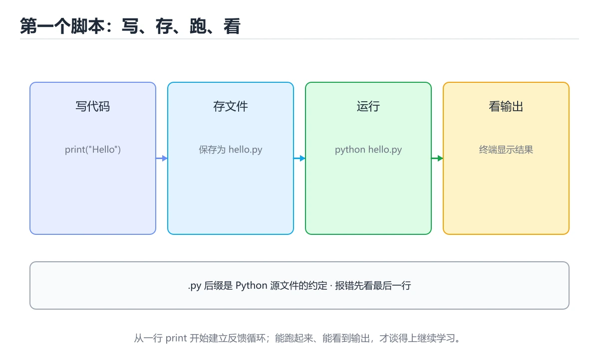
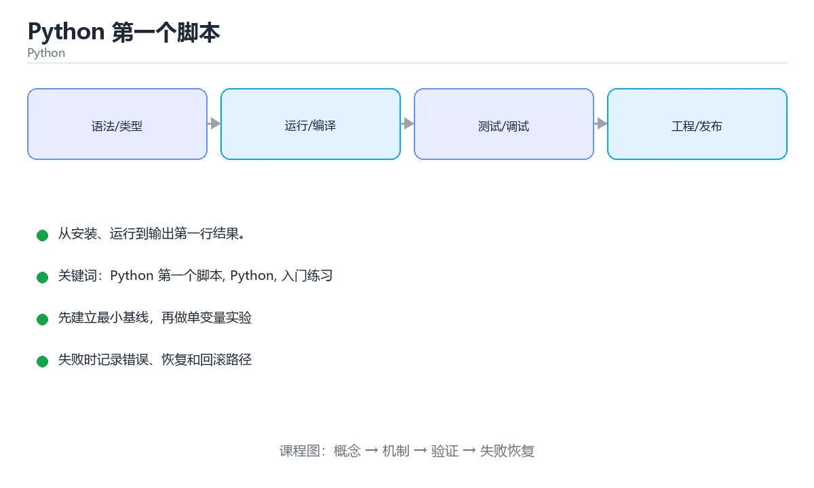

# Python 第一个脚本





> 内容更新时间：2026-10-03 · 学习阶段：入门 · 预计用时：15 分钟

## 学习目标

- 先认识「Python 第一个脚本」需要的工具、输入和输出。
- 按步骤运行最小示例，并记录结果与错误。
- 用一个边界输入验证自己是否真正掌握。

## 前置知识

- 会进行基本的文件或命令行操作。
- 不需要预先掌握「Python」的高级知识。

## 一句话入门

从安装、运行到输出第一行结果。

## 最小示例

```python
print("hello from Python")
```

## 预期输出

```text
hello from Python
```

## 常见错误

- 忘记转换 input() 返回的字符串，直接参与算术会抛 TypeError。
- 复制命令时遗漏空格、引号或必要参数。

## 动手练习

1. 原样运行最小示例，保存命令和输出。
2. 把数字 2 改成 10，预测并验证新结果。
3. 制造一个错误输入，写出错误信息和修复方法。

## 本课小结

- 入门阶段先保证能运行、能观察、能解释，再追求复杂功能。
- 每次只改一个变量，记录预测与实际结果。
- 遇到错误先看第一条错误信息，再回到最小示例。


## 代码实验：把示例跑成证据

这一节不引入新语法，而是把「Python 第一个脚本」的最小示例变成可以复现、可以对照的实验。每次只改变一个条件，先写预测，再运行，最后解释差异。

### 实验一：建立基线

```python
print("hello from Python")
```

先原样运行上面的代码，记录命令、完整输出和退出状态。然后把输出与正文的预期输出逐字对照，不要用“看起来差不多”代替核对；空格、大小写、换行和错误流向都可能暴露环境差异。

### 实验二：只改一个输入

从代码中选一个会影响结果的字面量、参数或输入，把它替换成边界值：数值可尝试 0、1、最大值和最小值，字符串可尝试空串和超长文本，集合可尝试空集合、单元素和重复元素。先写出预测，再运行并记录实际结果。

### 实验三：制造一个可控错误

把复合语句末尾的冒号删掉，或者把字符串直接参与数值运算。先记录解释器报出的第一行错误和行号，再修复并重跑基线。

| 实验 | 改动 | 预测 | 实际 | 结论 |
| --- | --- | --- | --- | --- |
| 基线 | 保持原样 |  |  |  |
| 边界 |  |  |  |  |
| 失败 |  |  |  |  |

### 实验四：用三句话复述

1. 输入是什么，哪些输入属于合法范围，哪些属于边界或非法范围？
2. 程序按什么顺序处理输入，在哪一步产生了状态变化或副作用？
3. 输出如何验证，失败时第一条可观察证据是什么？

## Python 基础机制速览

### 解释器、模块与虚拟环境

Python 源码由解释器编译成字节码再执行，`.py` 文件可以直接运行或作为模块导入。`if __name__ == "__main__":` 用来区分“直接运行”和“被导入”，让模块既提供函数又保留命令行入口。虚拟环境隔离项目依赖，`requirements.txt`、`pyproject.toml` 和锁文件记录依赖版本；不要依赖全局环境中的隐式包。

### 动态类型、真值与对象模型

变量名只是对象的引用，类型属于对象而不是变量，因此同一个名字可以先后指向不同类型的对象。真值判断把空容器、0、空字符串和 None 视为假；需要区分 None 与空值时使用 `is None`。`is` 比较对象身份，`==` 比较值。整数、字符串和元组不可变，列表、字典和集合可变；可变对象作为默认参数会在多次调用间共享，应使用 None 作为占位再在函数内创建。

### 容器、切片与推导式

列表适合有序可变序列，元组适合固定结构，字典保存键值映射，集合用于去重和成员检查。切片 `start:stop:step` 产生新对象，负下标从末尾计数，越界切片通常不会报错但单个下标会抛 IndexError。推导式适合“从可迭代对象生成新容器”，但多层嵌套或带副作用的推导式会降低可读性，应改回普通循环。

### 函数、作用域与迭代

函数参数支持位置、关键字、默认值、`*args` 和 `**kwargs`，调用方要避免可变默认值陷阱。局部变量在函数内赋值后不会自动修改全局变量，需要 `global` 或 `nonlocal` 显式声明。生成器用 `yield` 惰性产生值，迭代器和 `itertools` 能处理大数据流。装饰器在不修改原函数签名的前提下增加日志、缓存、权限或重试逻辑。

### 异常、上下文管理与打包

异常用于表达无法正常继续的情况，使用 `try/except/else/finally` 精确包住可能失败的操作，避免捕获过宽。`with` 通过上下文管理器保证资源释放，文件、锁和数据库连接都应使用它。发布代码时要考虑包结构、入口点、类型标注、测试和性能分析；先用 profiler 找到瓶颈，再决定是优化算法、数据结构还是 I/O。

## 本课自测清单与错误对照

下面把「Python 第一个脚本」最容易混淆的选项集中起来。不要只记正确答案，要能说明错误选项在什么条件下看似合理、又为什么不能满足题干。

本课测验以直接定义和步骤判断为主。请把每个错误选项改写成一句反例，
说明它在哪个输入、边界或前提变化下会失败。

### 完成标准

- [ ] 能用具体输入复现最小示例，并逐行解释输入、处理与输出。
- [ ] 能只改一个值完成边界实验，并让预测与实际结果一致。
- [ ] 能制造一个可控错误，读出第一条错误信息并完成修复。
- [ ] 能不看书说出本课至少两个易错点和对应的验证方法。

### 复盘记录

| 项目 | 记录 |
| --- | --- |
| 学到的核心机制 |  |
| 仍然不确定的问题 |  |
| 下一步验证动作 |  |


## 可运行练习

下面 3 个任务围绕“Python 第一个脚本”展开，代码可以直接粘贴到 App 的离线沙箱里运行；如果示例会读取标准输入，请按代码注释在沙箱的 stdin 区域填入同样格式的数据。

### 任务 1：先跑通，再解释

```python
total = 0
for i in range(1, 7):
    total += i
print(total)
```

**预期输出**：运行后会输出与“Python 第一个脚本”相关的关键结果；请重点核对输出行数、最后一个数值和异常提示。

**验收标准**：代码能正常运行；逐行解释每个变量的值如何变化，并指出哪一行决定了最终结果。

### 任务 2：只改一个条件

复制上面的代码，只修改一个输入、边界或参数（例如空值、最大值、循环次数、过滤条件），先写出你的预测，再实际运行。

**验收标准**：留下“原结果 → 改动 → 预测 → 实际结果 → 差异原因”五步记录；如果预测错误，要写出修正后的心智模型。

### 任务 3：迁移到自己的数据

用同一套思路处理一组你自己的数据或场景，保持输出格式与任务 1 一致。

**验收标准**：代码不少于 10 行，至少包含 1 个边界检查；把代码和运行结果保存到笔记或片段库。


## 故障现场

这一节把“Python 第一个脚本”最常见的失败方式还原成现场记录，练习时按“症状 → 复现 → 定位 → 修复 → 预防”的顺序排查。

### 现场 1：“Python 第一个脚本”的 Python 第一个脚本 常规用例通过，但边界用例失败

**症状**：在“Python 第一个脚本”的练习或生产场景里出现““Python 第一个脚本”的 Python 第一个脚本 常规用例通过，但边界用例失败”。

**复现**：准备一组最小输入，只保留触发““Python 第一个脚本”的 Python 第一个脚本 常规用例通过，但边界用例失败”的必要条件，连续运行两次确认结果稳定。

**定位**：围绕“Python 第一个脚本 的前置条件与取值边界没有写进代码，默认值掩盖了空值和极值”检查调用链、输入数据和环境配置，先验证假设再改代码。

**修复**：为“Python 第一个脚本”补一条空值或极值用例，把前置条件写成断言，并让失败信息直接指出是哪个输入越界

**预防**：把““Python 第一个脚本”的 Python 第一个脚本 常规用例通过，但边界用例失败”写成一条自动化用例，并在“Python 第一个脚本”的验收清单里保留对应检查项。


### 现场 2：“Python 第一个脚本”的 Python 结果在两次运行之间不一致

**症状**：在“Python 第一个脚本”的练习或生产场景里出现““Python 第一个脚本”的 Python 结果在两次运行之间不一致”。

**复现**：准备一组最小输入，只保留触发““Python 第一个脚本”的 Python 结果在两次运行之间不一致”的必要条件，连续运行两次确认结果稳定。

**定位**：围绕“Python 依赖了当前版本、执行顺序或共享状态，单次运行无法暴露差异”检查调用链、输入数据和环境配置，先验证假设再改代码。

**修复**：固定“Python 第一个脚本”使用的版本与随机种子，记录两次运行的完整输入和输出，再逐项消除非确定性来源

**预防**：把““Python 第一个脚本”的 Python 结果在两次运行之间不一致”写成一条自动化用例，并在“Python 第一个脚本”的验收清单里保留对应检查项。


### 现场 3：“Python 第一个脚本”的验证只在开发机通过

**症状**：在“Python 第一个脚本”的练习或生产场景里出现““Python 第一个脚本”的验证只在开发机通过”。

**复现**：准备一组最小输入，只保留触发““Python 第一个脚本”的验证只在开发机通过”的必要条件，连续运行两次确认结果稳定。

**定位**：围绕“环境版本、配置和输入规模与目标环境不同，Python 第一个脚本 缺少可重复的验证记录”检查调用链、输入数据和环境配置，先验证假设再改代码。

**修复**：把“Python 第一个脚本”的运行环境、输入样本和预期输出写成清单，并在另一套环境复跑同一条命令

**预防**：把““Python 第一个脚本”的验证只在开发机通过”写成一条自动化用例，并在“Python 第一个脚本”的验收清单里保留对应检查项。


## 版本与时效

这一节记录“Python 第一个脚本”涉及的版本基线与升级检查点，避免把某个版本的默认行为当成永久结论。

- Python 3.14 为当前主线，3.15 处于预发布阶段；生产环境锁定 3.13/3.14 的补丁版本
- 自由线程（no-GIL）与实验性 JIT 仍在演进，升级前先跑并发与 C 扩展兼容测试
- 类型标注、tomllib、pathlib 与 asyncio 是近年变化最集中的区域
- 官方发布说明：https://docs.python.org/3/whatsnew/

### 升级检查清单

- 先固定当前版本，跑通全部示例与测验，再升级工具链。
- 只改一个版本变量，记录编译、测试、性能与产物体积的变化。
- 重点回归默认值、弃用警告、序列化格式、并发语义和错误信息。
- 升级完成后更新本课的“最后复核 / 下次复核”日期与版本说明。


## 考点精讲：把测验题还原成判断过程

本课有 4 个判断点。先自己作答，再看「判断依据」；如果结论正确但理由不完整，回到正文对应章节补足概念。

### 考点 1：运行 print("hello from Python") 后，控制台会输出什么？

- **正确判断**：一行文本 hello from Python，并换行
- **判断依据**：正确答案是「一行文本 hello from Python，并换行」，这道题在问运行print("hellofromPython")后，控制台会输出什么，判断时要把题干限定的输入、边界与目标逐项对齐。print() 会把参数转换成文本写入标准输出，并在末尾追加换行符，所以运行脚本后控制台只会看到结果文本，而不是源码。
- **迁移检查**：遮住选项，只根据定义复述一次答案，再回来看哪个选项与复述一致。

### 考点 2：把代码保存为 hello.py 后，在命令行运行它的正确方式是？

- **正确判断**：执行 python hello.py，由解释器读取并运行脚本
- **判断依据**：正确答案是「执行 python hello.py，由解释器读取并运行脚本」，这道题在问把代码保存为hello.py后，在命令行运行它的正确方式是，判断时要把题干限定的输入、边界与目标逐项对齐。Python 是解释型语言，需要由解释器读取源文件再执行，因此常见做法是 python hello.py。
- **迁移检查**：把题干里的一个条件换成边界值，原来的结论还成立吗？写出判断过程。

### 考点 3：关于 Python 的缩进，下列说法正确的是？

- **正确判断**：缩进决定代码块的层级，混用空格和制表符容易报错
- **判断依据**：正确答案是「缩进决定代码块的层级，混用空格和制表符容易报错」，这道题在问关于Python的缩进，下列说法正确的是，判断时要把题干限定的输入、边界与目标逐项对齐。Python 用缩进表示代码块，同一代码块内的语句必须保持一致的缩进宽度，混用空格和制表符会触发 TabError 或逻辑错误。
- **迁移检查**：遮住选项，只根据定义复述一次答案，再回来看哪个选项与复述一致。

### 考点 4：补全代码：在 Python 中，要把文字输出到控制台，应使用 ____("Hello")。

- **正确判断**：print
- **判断依据**：Python 使用内置函数 print() 把对象转换成文本并输出到标准输出。字符串、数字、列表等都可以作为参数传入。本课示例中还能看到 `print("hello from Python")` 这样的用法，说明该关键字在本课代码中承担实际功能。
- **迁移检查**：把答案换成另一种等价写法，是否仍然正确？说明依据。

### 补充自测（2 题）

1. 围绕“Python 第一个脚本”中的 Python 第一个脚本、Python、入门练习，下列哪两项是本课强调的实践判断？
2. 下面这段 Python 代码复现了“Python 第一个脚本”中 Python 第一个脚本、Python、入门练习 相关的一个常见故障，哪一项最准确地解释了问题？

这些题按“先定位概念、再排除边界错误、最后核对答案”的顺序作答；每题解析都给出了判断依据。


## 本课复习清单

离开本课前，逐项确认：

- [ ] 不看解析，能说出「运行 print("hello from Python") 后，控制台会输出什么…」的判断依据。
- [ ] 不看解析，能说出「把代码保存为 hello.py 后，在命令行运行它的正确方式是？」的判断依据。
- [ ] 不看解析，能说出「关于 Python 的缩进，下列说法正确的是？」的判断依据。
- [ ] 不看解析，能说出「补全代码：在 Python 中，要把文字输出到控制台，应使用 ____("Hel…」的判断依据。
- [ ] 至少运行一次本课示例，记录输入、输出和一个边界情况。
- [ ] 把本课最容易混淆的两个概念写成一句话对照。

| 复盘项 | 记录 |
| --- | --- |
| 已经能独立解释的考点 |  |
| 仍然说不清的概念 |  |
| 下一步验证动作 |  |

## 逐节复习与自检

下面按正文顺序回顾每一节，并给出一个自检问题；说不清的地方回到原章节补课。

### 最小示例

```python
print("hello from Python")
```

自检：这一节与相邻主题的边界在哪里？

### 预期输出

```text
hello from Python
```

自检：这一节与相邻主题的边界在哪里？

### 常见错误

忘记转换 input() 返回的字符串，直接参与算术会抛 TypeError。

自检：把这一节讲给没学过的人，最需要强调哪一点？

### 动手练习

把数字 2 改成 10，预测并验证新结果。制造一个错误输入，写出错误信息和修复方法。

自检：如果去掉这一节里的一个前提，结论会怎样变化？

## 术语速查

把本课反复出现的术语集中放在一起。复习时先遮住右列，尝试用自己的话解释，再回到正文核对。

| 术语 | 本课语境 |
| --- | --- |
| `.py` | Python 源码由解释器编译成字节码再执行，`.py` 文件可以直接运行或作为模块导入。`if __name__ == "__main__":` 用来区分“直接运行”和“被导入”，让模块既提供函数又保留命令行入口。虚拟… |
| `if __name__ == "__main__":` | Python 源码由解释器编译成字节码再执行，`.py` 文件可以直接运行或作为模块导入。`if __name__ == "__main__":` 用来区分“直接运行”和“被导入”，让模块既提供函数又保留命令行入口。虚拟… |
| `requirements.txt` | Python 源码由解释器编译成字节码再执行，`.py` 文件可以直接运行或作为模块导入。`if __name__ == "__main__":` 用来区分“直接运行”和“被导入”，让模块既提供函数又保留命令行入口。虚拟… |
| `pyproject.toml` | Python 源码由解释器编译成字节码再执行，`.py` 文件可以直接运行或作为模块导入。`if __name__ == "__main__":` 用来区分“直接运行”和“被导入”，让模块既提供函数又保留命令行入口。虚拟… |
| `is None` | 变量名只是对象的引用，类型属于对象而不是变量，因此同一个名字可以先后指向不同类型的对象。真值判断把空容器、0、空字符串和 None 视为假；需要区分 None 与空值时使用 `is None`。`is` 比较对象身份，`… |
| `is` | 变量名只是对象的引用，类型属于对象而不是变量，因此同一个名字可以先后指向不同类型的对象。真值判断把空容器、0、空字符串和 None 视为假；需要区分 None 与空值时使用 `is None`。`is` 比较对象身份，`… |
| `==` | 变量名只是对象的引用，类型属于对象而不是变量，因此同一个名字可以先后指向不同类型的对象。真值判断把空容器、0、空字符串和 None 视为假；需要区分 None 与空值时使用 `is None`。`is` 比较对象身份，`… |
| `start:stop:step` | 列表适合有序可变序列，元组适合固定结构，字典保存键值映射，集合用于去重和成员检查。切片 `start:stop:step` 产生新对象，负下标从末尾计数，越界切片通常不会报错但单个下标会抛 IndexError。推导式适… |
| `*args` | 函数参数支持位置、关键字、默认值、`*args` 和 `**kwargs`，调用方要避免可变默认值陷阱。局部变量在函数内赋值后不会自动修改全局变量，需要 `global` 或 `nonlocal` 显式声明。生成器用 `… |
| `**kwargs` | 函数参数支持位置、关键字、默认值、`*args` 和 `**kwargs`，调用方要避免可变默认值陷阱。局部变量在函数内赋值后不会自动修改全局变量，需要 `global` 或 `nonlocal` 显式声明。生成器用 `… |
| `global` | 函数参数支持位置、关键字、默认值、`*args` 和 `**kwargs`，调用方要避免可变默认值陷阱。局部变量在函数内赋值后不会自动修改全局变量，需要 `global` 或 `nonlocal` 显式声明。生成器用 `… |
| `nonlocal` | 函数参数支持位置、关键字、默认值、`*args` 和 `**kwargs`，调用方要避免可变默认值陷阱。局部变量在函数内赋值后不会自动修改全局变量，需要 `global` 或 `nonlocal` 显式声明。生成器用 `… |

## 面试问答与自测

下面把本课考点换成面试追问。先口述自己的答案，
再对照参考回答检查是否遗漏了前提、边界或失败路径。

### 追问 1：运行 print("hello from Python") 后，控制台会输出什么？

**参考回答**：正确答案是「一行文本 hello from Python，并换行」，这道题在问运行print("hellofromPython")后，控制台会输出什么，判断时要把题干限定的输入、边界与目标逐项对齐。print() 会把参数转换成文本写入标准输出，并在末尾追加换行符，所以运行脚本后控制台只会看到结果文本，而不是源码。

### 追问 2：把代码保存为 hello.py 后，在命令行运行它的正确方式是？

**参考回答**：正确答案是「执行 python hello.py，由解释器读取并运行脚本」，这道题在问把代码保存为hello.py后，在命令行运行它的正确方式是，判断时要把题干限定的输入、边界与目标逐项对齐。Python 是解释型语言，需要由解释器读取源文件再执行，因此常见做法是 python hello.py。

### 追问 3：关于 Python 的缩进，下列说法正确的是？

**参考回答**：正确答案是「缩进决定代码块的层级，混用空格和制表符容易报错」，这道题在问关于Python的缩进，下列说法正确的是，判断时要把题干限定的输入、边界与目标逐项对齐。Python 用缩进表示代码块，同一代码块内的语句必须保持一致的缩进宽度，混用空格和制表符会触发 TabError 或逻辑错误。

### 追问 4：补全代码：在 Python 中，要把文字输出到控制台，应使用 ____("Hello")。

**参考回答**：Python 使用内置函数 print() 把对象转换成文本并输出到标准输出。字符串、数字、列表等都可以作为参数传入。本课示例中还能看到 `print("hello from Python")` 这样的用法，说明该关键字在本课代码中承担实际功能。

<!-- p0-depth-v2:start -->
## 零基础精讲：把「Python 第一个脚本」真正讲透

### 先建立一个直觉

把「Python 第一个脚本」看成一个有输入、处理、输出和失败边界的工程问题。先定义什么叫正确，再讨论性能和扩展。

本课的摘要可以当作一张地图：从安装、运行到输出第一行结果。

阅读时不要只记结论，先问三个问题：它解决什么问题？依赖哪些前提？在什么条件下会失效？

### 逐步拆解

1. 识别输入。先写清数据类型、取值范围、空值策略，以及输入来自用户、文件还是另一个服务。
2. 描述处理过程。把「Python 第一个脚本、Python、入门练习」映射到具体步骤，每步都要求能单独验证。
3. 定义输出。输出不仅包括正常结果，还包括错误码、日志、指标和资源释放状态。
4. 找出一条失败路径。让错误尽早暴露，并说明重试、降级、回滚或人工处理的边界。
5. 用一个小例子贯穿全过程。先手算或预测结果，再运行代码或实验，最后解释差异。

### 把正文串成一条执行链

- **实验一：建立基线**：先原样运行上面的代码，记录命令、完整输出和退出状态
- **实验二：只改一个输入**：从代码中选一个会影响结果的字面量、参数或输入，把它替换成边界值：数值可尝试 0、1、最大值和最小值，字符串可尝试空串和超长文本，集合可尝试空集合、单元素和重复元素
- **实验三：制造一个可控错误**：实验三：制造一个可控错误
- **实验四：用三句话复述**：1. 输入是什么，哪些输入属于合法范围，哪些属于边界或非法范围
- **解释器、模块与虚拟环境**：Python 源码由解释器编译成字节码再执行，`.py` 文件可以直接运行或作为模块导入
- **动态类型、真值与对象模型**：动态类型、真值与对象模型

### 从测验反推易错点

**检查点 1：运行 print("hello from Python") 后，控制台会输出什么？**

- 参考判断：一行文本 hello from Python，并换行
- 解析：正确答案是「一行文本 hello from Python，并换行」，这道题在问运行print("hellofromPython")后，控制台会输出什么，判断时要把题干限定的输入、边界与目标逐项对齐。print() 会把参数转换成文本写入标准输出，并在末尾追加换行符，所以运行脚本后控制台只会看到结果文本，而不是源码。
- 自问：如果去掉题干里的一个限定词，结论还成立吗？

**检查点 2：把代码保存为 hello.py 后，在命令行运行它的正确方式是？**

- 参考判断：执行 python hello.py，由解释器读取并运行脚本
- 解析：正确答案是「执行 python hello.py，由解释器读取并运行脚本」，这道题在问把代码保存为hello.py后，在命令行运行它的正确方式是，判断时要把题干限定的输入、边界与目标逐项对齐。Python 是解释型语言，需要由解释器读取源文件再执行，因此常见做法是 python hello.py。
- 自问：如果去掉题干里的一个限定词，结论还成立吗？

**检查点 3：关于 Python 的缩进，下列说法正确的是？**

- 参考判断：缩进决定代码块的层级，混用空格和制表符容易报错
- 解析：正确答案是「缩进决定代码块的层级，混用空格和制表符容易报错」，这道题在问关于Python的缩进，下列说法正确的是，判断时要把题干限定的输入、边界与目标逐项对齐。Python 用缩进表示代码块，同一代码块内的语句必须保持一致的缩进宽度，混用空格和制表符会触发 TabError 或逻辑错误。
- 自问：如果去掉题干里的一个限定词，结论还成立吗？

**检查点 4：补全代码：在 Python 中，要把文字输出到控制台，应使用 ____("Hello")。**

- 参考判断：print
- 解析：Python 使用内置函数 print() 把对象转换成文本并输出到标准输出。字符串、数字、列表等都可以作为参数传入。本课示例中还能看到 `print("hello from Python")` 这样的用法，说明该关键字在本课代码中承担实际功能。
- 自问：如果去掉题干里的一个限定词，结论还成立吗？

### 工程排错顺序

| 先查什么 | 要得到的证据 | 判断标准 |
| --- | --- | --- |
| 输入与前提是否满足 | 日志、输入样例、测试或指标 | 能复现并解释，才算定位 |
| 核心步骤是否产生了预期中间结果 | 日志、输入样例、测试或指标 | 能复现并解释，才算定位 |
| 失败路径是否可观测、可恢复 | 日志、输入样例、测试或指标 | 能复现并解释，才算定位 |
| 资源、权限与成本是否在预算内 | 日志、输入样例、测试或指标 | 能复现并解释，才算定位 |

排查顺序应遵循「先复现、再缩小范围、再验证假设、最后修改」。不要同时改多个变量，否则即使问题消失，也无法知道真正原因。

### 变式训练

1. 把它放进一个只有单机、没有额外依赖的小项目，先保证正确，再考虑扩展。
2. 把输入规模扩大十倍，记录时间、内存和失败路径，找出第一个真正瓶颈。
3. 制造一次依赖超时或错误输入，要求系统给出可解释错误并且不留下半完成状态。
4. 让另一个同学只读接口说明和测试用例，复现你的结论；无法复现的部分继续补文档或测试。
5. 删掉一个看似必要的步骤，观察哪个测试或指标先失败，用证据说明它为什么必要。
6. 把方案切换到低资源设备，重新评估默认参数、超时和降级策略。

每道变式都写下：预测、实际结果、差异、下一步。没有留下证据的练习，很难迁移到真实项目。

### 本课自测

- [ ] 能用一句话解释「Python 第一个脚本」在本课中的角色与边界。
- [ ] 能举出一个正常例子和一个失败例子。
- [ ] 能说出最小验证步骤，以及需要记录的证据。
- [ ] 能用一句话解释「Python」在本课中的角色与边界。
- [ ] 能举出一个正常例子和一个失败例子。
- [ ] 能说出最小验证步骤，以及需要记录的证据。
- [ ] 能用一句话解释「入门练习」在本课中的角色与边界。
- [ ] 能举出一个正常例子和一个失败例子。
- [ ] 能说出最小验证步骤，以及需要记录的证据。
- [ ] 能用一句话解释「Python 第一个脚本」在本课中的角色与边界。
- [ ] 能举出一个正常例子和一个失败例子。
- [ ] 能说出最小验证步骤，以及需要记录的证据。
- [ ] 能用一句话解释「Python」在本课中的角色与边界。
- [ ] 能举出一个正常例子和一个失败例子。
- [ ] 能说出最小验证步骤，以及需要记录的证据。

### 迁移案例库

下面用不同约束重复同一套方法。每完成一轮，都把结论写进笔记，并只改变一个变量。

#### 迁移案例 1：围绕「Python 第一个脚本」做一次小实验

**目标**：在不改变课程主体的前提下，验证「Python 第一个脚本」中的一个关键判断。

**步骤**：
1. 复述当前方案对「Python 第一个脚本」的假设，写成一句可证伪的话。
2. 设计一个正常输入和一个边界输入，分别预测输出。
3. 运行或逐步演算，记录实际输出、耗时和失败信息。
4. 只调整一个参数，比较前后差异并解释原因。
5. 补充一条测试或复习卡，确保下次能更快复现。

**验收**：结论有证据、差异可解释、失败可恢复；如果做不到，说明还需要缩小问题范围。

#### 迁移案例 2：围绕「Python」做一次小实验

**目标**：在不改变课程主体的前提下，验证「Python 第一个脚本」中的一个关键判断。

**步骤**：
1. 复述当前方案对「Python」的假设，写成一句可证伪的话。
2. 设计一个正常输入和一个边界输入，分别预测输出。
3. 运行或逐步演算，记录实际输出、耗时和失败信息。
4. 只调整一个参数，比较前后差异并解释原因。
5. 补充一条测试或复习卡，确保下次能更快复现。

**验收**：结论有证据、差异可解释、失败可恢复；如果做不到，说明还需要缩小问题范围。

#### 迁移案例 3：围绕「入门练习」做一次小实验

**目标**：在不改变课程主体的前提下，验证「Python 第一个脚本」中的一个关键判断。

**步骤**：
1. 复述当前方案对「入门练习」的假设，写成一句可证伪的话。
2. 设计一个正常输入和一个边界输入，分别预测输出。
3. 运行或逐步演算，记录实际输出、耗时和失败信息。
4. 只调整一个参数，比较前后差异并解释原因。
5. 补充一条测试或复习卡，确保下次能更快复现。

**验收**：结论有证据、差异可解释、失败可恢复；如果做不到，说明还需要缩小问题范围。

#### 迁移案例 4：围绕「Python 第一个脚本」做一次小实验

**目标**：在不改变课程主体的前提下，验证「Python 第一个脚本」中的一个关键判断。

**步骤**：
1. 复述当前方案对「Python 第一个脚本」的假设，写成一句可证伪的话。
2. 设计一个正常输入和一个边界输入，分别预测输出。
3. 运行或逐步演算，记录实际输出、耗时和失败信息。
4. 只调整一个参数，比较前后差异并解释原因。
5. 补充一条测试或复习卡，确保下次能更快复现。

**验收**：结论有证据、差异可解释、失败可恢复；如果做不到，说明还需要缩小问题范围。

#### 迁移案例 5：围绕「Python」做一次小实验

**目标**：在不改变课程主体的前提下，验证「Python 第一个脚本」中的一个关键判断。

**步骤**：
1. 复述当前方案对「Python」的假设，写成一句可证伪的话。
2. 设计一个正常输入和一个边界输入，分别预测输出。
3. 运行或逐步演算，记录实际输出、耗时和失败信息。
4. 只调整一个参数，比较前后差异并解释原因。
5. 补充一条测试或复习卡，确保下次能更快复现。

**验收**：结论有证据、差异可解释、失败可恢复；如果做不到，说明还需要缩小问题范围。

#### 迁移案例 6：围绕「入门练习」做一次小实验

**目标**：在不改变课程主体的前提下，验证「Python 第一个脚本」中的一个关键判断。

**步骤**：
1. 复述当前方案对「入门练习」的假设，写成一句可证伪的话。
2. 设计一个正常输入和一个边界输入，分别预测输出。
3. 运行或逐步演算，记录实际输出、耗时和失败信息。
4. 只调整一个参数，比较前后差异并解释原因。
5. 补充一条测试或复习卡，确保下次能更快复现。

**验收**：结论有证据、差异可解释、失败可恢复；如果做不到，说明还需要缩小问题范围。

#### 迁移案例 7：围绕「Python 第一个脚本」做一次小实验

**目标**：在不改变课程主体的前提下，验证「Python 第一个脚本」中的一个关键判断。

**步骤**：
1. 复述当前方案对「Python 第一个脚本」的假设，写成一句可证伪的话。
2. 设计一个正常输入和一个边界输入，分别预测输出。
3. 运行或逐步演算，记录实际输出、耗时和失败信息。
4. 只调整一个参数，比较前后差异并解释原因。
5. 补充一条测试或复习卡，确保下次能更快复现。

**验收**：结论有证据、差异可解释、失败可恢复；如果做不到，说明还需要缩小问题范围。

#### 迁移案例 8：围绕「Python」做一次小实验

**目标**：在不改变课程主体的前提下，验证「Python 第一个脚本」中的一个关键判断。

**步骤**：
1. 复述当前方案对「Python」的假设，写成一句可证伪的话。
2. 设计一个正常输入和一个边界输入，分别预测输出。
3. 运行或逐步演算，记录实际输出、耗时和失败信息。
4. 只调整一个参数，比较前后差异并解释原因。
5. 补充一条测试或复习卡，确保下次能更快复现。

**验收**：结论有证据、差异可解释、失败可恢复；如果做不到，说明还需要缩小问题范围。

#### 迁移案例 9：围绕「入门练习」做一次小实验

**目标**：在不改变课程主体的前提下，验证「Python 第一个脚本」中的一个关键判断。

**步骤**：
1. 复述当前方案对「入门练习」的假设，写成一句可证伪的话。
2. 设计一个正常输入和一个边界输入，分别预测输出。
3. 运行或逐步演算，记录实际输出、耗时和失败信息。
4. 只调整一个参数，比较前后差异并解释原因。
5. 补充一条测试或复习卡，确保下次能更快复现。

**验收**：结论有证据、差异可解释、失败可恢复；如果做不到，说明还需要缩小问题范围。

#### 迁移案例 10：围绕「Python 第一个脚本」做一次小实验

**目标**：在不改变课程主体的前提下，验证「Python 第一个脚本」中的一个关键判断。

**步骤**：
1. 复述当前方案对「Python 第一个脚本」的假设，写成一句可证伪的话。
2. 设计一个正常输入和一个边界输入，分别预测输出。
3. 运行或逐步演算，记录实际输出、耗时和失败信息。
4. 只调整一个参数，比较前后差异并解释原因。
5. 补充一条测试或复习卡，确保下次能更快复现。

**验收**：结论有证据、差异可解释、失败可恢复；如果做不到，说明还需要缩小问题范围。

#### 迁移案例 11：围绕「Python」做一次小实验

**目标**：在不改变课程主体的前提下，验证「Python 第一个脚本」中的一个关键判断。

**步骤**：
1. 复述当前方案对「Python」的假设，写成一句可证伪的话。
2. 设计一个正常输入和一个边界输入，分别预测输出。
3. 运行或逐步演算，记录实际输出、耗时和失败信息。
4. 只调整一个参数，比较前后差异并解释原因。
5. 补充一条测试或复习卡，确保下次能更快复现。

**验收**：结论有证据、差异可解释、失败可恢复；如果做不到，说明还需要缩小问题范围。

#### 迁移案例 12：围绕「入门练习」做一次小实验

**目标**：在不改变课程主体的前提下，验证「Python 第一个脚本」中的一个关键判断。

**步骤**：
1. 复述当前方案对「入门练习」的假设，写成一句可证伪的话。
2. 设计一个正常输入和一个边界输入，分别预测输出。
3. 运行或逐步演算，记录实际输出、耗时和失败信息。
4. 只调整一个参数，比较前后差异并解释原因。
5. 补充一条测试或复习卡，确保下次能更快复现。

**验收**：结论有证据、差异可解释、失败可恢复；如果做不到，说明还需要缩小问题范围。

#### 迁移案例 13：围绕「Python 第一个脚本」做一次小实验

**目标**：在不改变课程主体的前提下，验证「Python 第一个脚本」中的一个关键判断。

**步骤**：
1. 复述当前方案对「Python 第一个脚本」的假设，写成一句可证伪的话。
2. 设计一个正常输入和一个边界输入，分别预测输出。
3. 运行或逐步演算，记录实际输出、耗时和失败信息。
4. 只调整一个参数，比较前后差异并解释原因。
5. 补充一条测试或复习卡，确保下次能更快复现。

**验收**：结论有证据、差异可解释、失败可恢复；如果做不到，说明还需要缩小问题范围。

#### 迁移案例 14：围绕「Python」做一次小实验

**目标**：在不改变课程主体的前提下，验证「Python 第一个脚本」中的一个关键判断。

**步骤**：
1. 复述当前方案对「Python」的假设，写成一句可证伪的话。
2. 设计一个正常输入和一个边界输入，分别预测输出。
3. 运行或逐步演算，记录实际输出、耗时和失败信息。
4. 只调整一个参数，比较前后差异并解释原因。
5. 补充一条测试或复习卡，确保下次能更快复现。

**验收**：结论有证据、差异可解释、失败可恢复；如果做不到，说明还需要缩小问题范围。

#### 迁移案例 15：围绕「入门练习」做一次小实验

**目标**：在不改变课程主体的前提下，验证「Python 第一个脚本」中的一个关键判断。

**步骤**：
1. 复述当前方案对「入门练习」的假设，写成一句可证伪的话。
2. 设计一个正常输入和一个边界输入，分别预测输出。
3. 运行或逐步演算，记录实际输出、耗时和失败信息。
4. 只调整一个参数，比较前后差异并解释原因。
5. 补充一条测试或复习卡，确保下次能更快复现。

**验收**：结论有证据、差异可解释、失败可恢复；如果做不到，说明还需要缩小问题范围。

#### 迁移案例 16：围绕「Python 第一个脚本」做一次小实验

**目标**：在不改变课程主体的前提下，验证「Python 第一个脚本」中的一个关键判断。

**步骤**：
1. 复述当前方案对「Python 第一个脚本」的假设，写成一句可证伪的话。
2. 设计一个正常输入和一个边界输入，分别预测输出。
3. 运行或逐步演算，记录实际输出、耗时和失败信息。
4. 只调整一个参数，比较前后差异并解释原因。
5. 补充一条测试或复习卡，确保下次能更快复现。

**验收**：结论有证据、差异可解释、失败可恢复；如果做不到，说明还需要缩小问题范围。

<!-- p0-depth-v2:end -->

## English Overview

**Title:** Python First Script

**Summary:** Install, run and print your first result.

**Category:** Python  
**Level:** 入门  
**Key terms:** Python 第一个脚本, Python, 入门练习

> The full tutorial is written in Chinese. This bilingual overview helps English readers identify the topic, scope and key terms before studying the detailed examples.

## 内容元数据

- 内容版本：v2.0
- 最后更新：2026-10-03
- 学习阶段：入门
- 适用环境：Python 3.12+
- 内容来源：内置结构化课程与工程实践整理
- 相关主题：Python 第一个脚本、Python、入门练习
- 质量版本：P0 测验标准 + P1 覆盖扩展 + P2 体验补全


## 参考资料与复核

- 最后复核：2026-10-04
- 下次复核：2027-04-04
- 复核范围：版本兼容、API 行为、安全建议与工程实践
- 来源性质：官方文档与标准；本课正文为离线教学重组，不复制原文

| 参考资料 | 本课用途 |
| --- | --- |
| [Python 官方文档](https://docs.python.org/3/) | 语言、标准库与版本行为 |
| [Python Packaging](https://packaging.python.org/) | 包管理与发布 |

> 本课主题：从安装、运行到输出第一行结果。

> App 完全离线展示文字链接，不会自动联网；需要延伸阅读时可复制链接到浏览器。

<!-- code-practice:v1:start -->

## 代码练习（6 题）

下面题目与课程测验同源：覆盖代码输出、排错与场景判断。建议先自己写出答案，再到「测验」里核对成绩。

### 练习 1 · 代码输出

在 Python 课程“Python 第一个脚本”的函数实验里，这段代码运行后输出什么？

```python
x = 5
print(x)
```

- A. 10
- B. 6
- C. 4
- D. 5

**参考答案**：D. 5
**参考输出**：`5`

**解析**

在 Python 课程“Python 第一个脚本”的函数代码实验里，程序先完成赋值、循环或函数调用，再把结果写到标准输出，因此正确结果是 5。
判断 Python 课程“Python 第一个脚本”的代码输出时，要把“源码写了什么”和“运行时实际打印什么”分开；变量值和循环边界都会直接改变最终结果。
把 5 当作基线后，可以只改一个输入或一个边界，再观察 Python 课程“Python 第一个脚本”的输出如何变化，这就是验证掌握程度的方法。

### 练习 2 · 代码输出

在 Python 课程“Python 第一个脚本”的集合实验里，这段代码运行后输出什么？

```python
total = 0
for i in range(1, 7):
    total += i
print(total)
```

- A. 22
- B. 42
- C. 20
- D. 21

**参考答案**：D. 21
**参考输出**：`21`

**解析**

在 Python 课程“Python 第一个脚本”的集合代码实验里，程序先完成赋值、循环或函数调用，再把结果写到标准输出，因此正确结果是 21。
判断 Python 课程“Python 第一个脚本”的代码输出时，要把“源码写了什么”和“运行时实际打印什么”分开；变量值和循环边界都会直接改变最终结果。
把 21 当作基线后，可以只改一个输入或一个边界，再观察 Python 课程“Python 第一个脚本”的输出如何变化，这就是验证掌握程度的方法。

### 练习 3 · 代码输出

在 Python 课程“Python 第一个脚本”的条件实验里，这段代码运行后输出什么？

```python
def double(value):
    return value * 2

print(double(6))
```

- A. 11
- B. 24
- C. 13
- D. 12

**参考答案**：D. 12
**参考输出**：`12`

**解析**

在 Python 课程“Python 第一个脚本”的条件代码实验里，程序先完成赋值、循环或函数调用，再把结果写到标准输出，因此正确结果是 12。
判断 Python 课程“Python 第一个脚本”的代码输出时，要把“源码写了什么”和“运行时实际打印什么”分开；变量值和循环边界都会直接改变最终结果。
把 12 当作基线后，可以只改一个输入或一个边界，再观察 Python 课程“Python 第一个脚本”的输出如何变化，这就是验证掌握程度的方法。

### 练习 4 · 代码排错

Python 课程“Python 第一个脚本”的下面这段代码无法运行，最可能的修复是什么？

```python
score = 5
if score > 0
    print("positive")
```

- A. 把变量名改成另一个单词即可
- B. 重新安装运行时并清空所有缓存
- C. 把输出语句整段删除，代码就会自动修复
- D. 在 if 条件行末尾补上冒号

**参考答案**：D. 在 if 条件行末尾补上冒号

**解析**

Python 课程“Python 第一个脚本”里的这段代码无法通过编译或解析，关键原因是缺少了必要语法结构，正确修复是在 if 条件行末尾补上冒号。
在 Python 课程“Python 第一个脚本”中，错误信息通常会指出出错行和期望符号；先读第一条错误，再检查这一行的括号、冒号、分号或花括号。
修复后还要重新运行 Python 课程“Python 第一个脚本”的最小示例，确认输出恢复，并记录这次问题属于语法错误而不是逻辑错误。

### 练习 5 · 代码排错

Python 课程“Python 第一个脚本”的这段代码结果偏小，应该怎样修改？

```python
total = 0
for i in range(1, 6):
    total += i
print(total)
```

- A. 把输出语句移到循环体内部
- B. 把循环变量从 1 改成 0，其余保持不变
- C. 把 range(1, 6) 改成 range(1, 7)
- D. 把累加操作改成减法操作

**参考答案**：C. 把 range(1, 6) 改成 range(1, 7)
**修复后输出**：`21`

**解析**

Python 课程“Python 第一个脚本”里的循环边界少算了最后一项，当前输出是 15，而完整求和应为 21。
正确修复是把 range(1, 6) 改成 range(1, 7)；这类错误属于边界问题，代码能运行但结果偏离，所以比语法错误更隐蔽。
验证 Python 课程“Python 第一个脚本”时至少选择首项、中间值和末尾值三个输入，比较手算结果与程序输出，才能发现类似偏差。

### 练习 6 · 概念判断

在 Python 课程“Python 第一个脚本”的学习或项目场景中，哪种做法最有助于得到可验证、可迁移的结果？

- A. 跳过错误信息，直接复制另一段代码直到能运行
- B. 只背下「Python 第一个脚本」的结论，遇到新输入时凭感觉修改代码
- C. 先围绕「Python 第一个脚本」写最小可运行示例，再用边界输入验证“Python 第一个脚本”的结果
- D. 一次改完所有变量和依赖，再统一观察是否报错

**参考答案**：C. 先围绕「Python 第一个脚本」写最小可运行示例，再用边界输入验证“Python 第一个脚本”的结果

**解析**

在 Python 课程“Python 第一个脚本”里，Python 第一个脚本不是孤立的名词，而是一组可以用输入、过程、输出和边界验证的行为。
对 Python 课程“Python 第一个脚本”来说，先写最小可运行示例，再逐步增加边界输入，能把“感觉会了”转化成可以重复的证据。
如果只背结论或一次改很多变量，出错时就无法判断是哪一步破坏了 Python 课程“Python 第一个脚本”的预期；先把变化隔离出来才容易定位。

<!-- code-practice:v1:end -->
