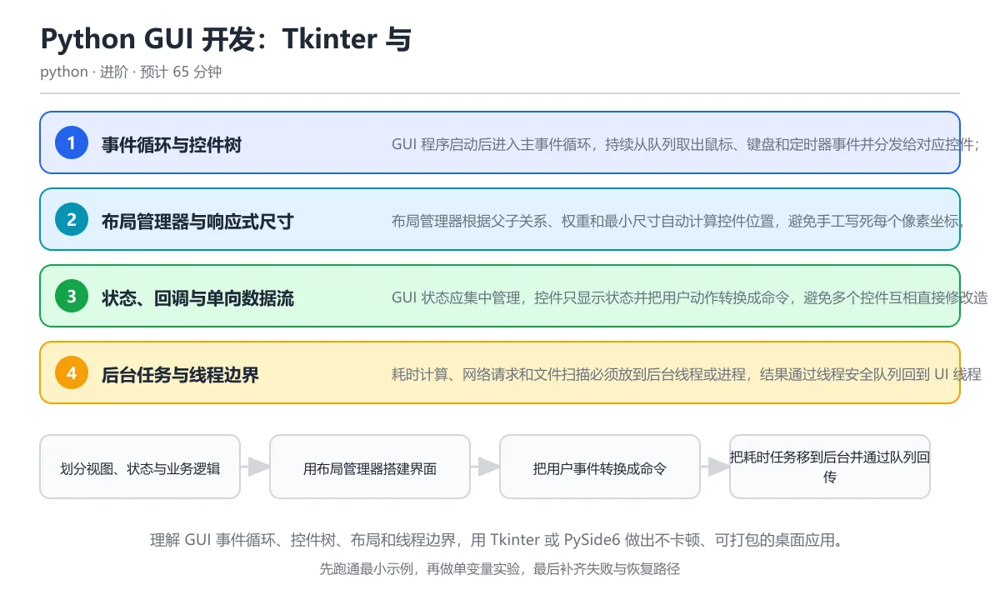

# Python GUI 开发：Tkinter 与 PySide6

> 内容更新时间：2026-10-06 · 学习阶段：进阶 · 预计用时：55 分钟

分类：python。关键词：Tkinter、PySide6、事件循环、布局、后台线程。理解 GUI 事件循环、控件树、布局和线程边界，用 Tkinter 或 PySide6 做出不卡顿、可打包的桌面应用。



## 本节知识框架

**课程定位**：所属分类 `python`（Python），课程主题 `Python GUI 开发：Tkinter 与 PySide6`，学习阶段 进阶，建议用时 50 分钟。

本课主线：理解 GUI 事件循环、控件树、布局和线程边界，用 Tkinter 或 PySide6 做出不卡顿、可打包的桌面应用。

**学完本课应当能够**
- 说清 `事件循环` 与 `控件树` 的含义与区别，并各举一个正例和一个反例。
- 用本课示例验证 `布局管理器` 的行为，记录输入、输出与失败条件。
- 遇到「在 UI 回调中执行耗时任务」这类问题时，能说出触发条件与修复顺序。

### 从概念到验证的学习链条

1. `事件循环`：先掌握 持续获取并分发用户输入、定时器和系统消息的 GUI 主循环，再用它解释 `控件树` 为什么会出现。
2. `控件树`：先掌握 窗口、容器和子控件组成的父子层次结构，再用它解释 `布局管理器` 为什么会出现。
3. `布局管理器`：先掌握 根据权重、边距和最小尺寸自动计算控件位置的机制，再用它解释 `主线程` 为什么会出现。
4. `主线程`：先掌握 运行 GUI 事件循环并允许修改控件的线程，再用它解释 `DPI` 为什么会出现。
5. `DPI`：先掌握 屏幕每英寸像素数，影响字体与控件的实际显示尺寸，再用它解释 `PyInstaller` 为什么会出现。
6. `PyInstaller`：先掌握 把 Python 程序和依赖打包成桌面可执行文件的常用工具，再用它解释 本课示例的观察结果 为什么会出现。

**先修与衔接**：本课是「Python」分类的第 23 课。先修内容：《Python 面向对象进阶：继承、组合与魔术方法》。《Python 面向对象进阶：继承、组合与魔术方法》里的 `MRO`、`super` 是本课的前提。相关或后续课程：《Python CLI 与自动化实战》、《Python 打包、发布与性能》。

### 完成判据

- **定义关**：不看正文也能说明 `事件循环` 是 持续获取并分发用户输入、定时器和系统消息的 GUI 主循环，并指出一个反例。
- **机制关**：能按“输入 → 转换 → 输出 → 验证”复述 `Python GUI 开发：Tkinter 与 PySide6`，而不是只背结论。
- **示例关**：能运行或推演 `Python GUI 开发：Tkinter 与 PySide6` 的 `text` 示例，并说明一个真实出现的标识符或字面量。
- **证据关**：能从 `Python GUI 开发：Tkinter 与 PySide6` 的示例写出一个输入、处理、输出三元组，并说明它支持或反驳了本课的哪一条结论。
- **排错关**：能复现 在 UI 回调中执行耗时任务，记录现象并按 把任务移到线程池或进程，回调只负责启动、显示进度和处理完成事件 修复。
- **迁移关**：能把 `Tkinter`、`PySide6`、`事件循环`、`布局` 放进一个与 `Python GUI 开发：Tkinter 与 PySide6` 不同的项目场景，并保持输入与验证条件可追踪。
- **复盘关**：学完 `Python GUI 开发：Tkinter 与 PySide6` 后，用一句话写下仍然不确定的结论，并列出下一次验证需要的输入、环境和成功判据。

### 复习清单

- [ ] 能不看正文复述本课核心术语，并指出一个边界或反例。
- [ ] 能运行或推演本课示例，记录输入、输出与失败现象。
- [ ] 能完成一次自测，并把错题对照错误表定位原因。

## 核心概念定义

| 术语 | 操作性定义 | 常见边界与风险 |
| --- | --- | --- |
| 事件循环 | 持续获取并分发用户输入、定时器和系统消息的 GUI 主循环。 | 只在「持续获取并分发用户输入、定时器和系统消息的 GUI 主循环」这一前提下成立，换输入或换环境要重新验证。 |
| 控件树 | 窗口、容器和子控件组成的父子层次结构。 | 容器与集群环境差异会改变行为，本地通过后仍需在目标编排环境复验。 |
| 布局管理器 | 根据权重、边距和最小尺寸自动计算控件位置的机制。 | 易错：在《Python GUI 开发：Tkinter 与 PySide6》里采用「按固定分辨率写死窗口和控件坐标，高分屏字体放大后内容被截断」时，硬编码像素尺寸会表现为错误结果、异常中断或状态不一致；正确做法是使用布局管理器和相对权重，设置最小尺寸并验证不同 DPI。 |
| 主线程 | 运行 GUI 事件循环并允许修改控件的线程。 | 易错：在《Python GUI 开发：Tkinter 与 PySide6》里采用「工作线程调用 label.setText 或修改 Tk 控件，运行时随机崩溃」时，后台线程直接修改控件会表现为错误结果、异常中断或状态不一致；正确做法是后台线程只写线程安全队列，所有控件更新回到 UI 主线程执行。 |
| DPI | 屏幕每英寸像素数，影响字体与控件的实际显示尺寸。 | 易错：在《Python GUI 开发：Tkinter 与 PySide6》里采用「按固定分辨率写死窗口和控件坐标，高分屏字体放大后内容被截断」时，硬编码像素尺寸会表现为错误结果、异常中断或状态不一致；正确做法是使用布局管理器和相对权重，设置最小尺寸并验证不同 DPI。 |
| PyInstaller | 把 Python 程序和依赖打包成桌面可执行文件的常用工具。 | 不同版本与依赖组合的行为可能不同，升级或换环境前要按官方变更说明重新验证。 |

## 原理与运行机制

### 机制总览

**教材衔接：核心知识**

### 1. 事件循环与控件树

GUI 程序启动后进入主事件循环，持续从队列取出鼠标、键盘和定时器事件并分发给对应控件；控件按父子关系组成树。

每个窗口拥有消息队列，事件循环按顺序处理回调，回调执行期间界面无法重绘；控件树决定生命周期、坐标和事件冒泡。

在Python GUI 开发：Tkinter 与 PySide6里可以这样验证：用队列模拟点击事件的生产与消费，观察事件按先进先出顺序被处理。

边界：回调中执行耗时操作会冻结界面，用户看到无响应窗口；对话框和模态循环也会嵌套事件处理，需要避免重入。

工程视角：回调只做状态转换和轻量刷新，复杂任务交给后台执行器，退出时正确停止事件循环和定时器。

### 2. 布局管理器与响应式尺寸

布局管理器根据父子关系、权重和最小尺寸自动计算控件位置，避免手工写死每个像素坐标。

Tkinter 的 grid、pack 与 place 负责不同布局策略，PySide6 使用布局类和 sizePolicy；行列权重决定窗口缩放时哪些区域吸收额外空间。

在Python GUI 开发：Tkinter 与 PySide6里可以这样验证：设计一个顶部工具栏加中间列表加底部状态栏的网格布局，并说明每行每列的权重。

边界：在同一个父容器混用 grid 与 pack 会冲突，固定像素尺寸在高分屏上会过小；文本长度变化需要设置最小宽度和省略策略。

工程视角：布局按比例和最小尺寸设计，支持窗口缩放与字体放大，关键控件保留键盘访问顺序。

### 3. 状态、回调与单向数据流

GUI 状态应集中管理，控件只显示状态并把用户动作转换成命令，避免多个控件互相直接修改造成不一致。

回调把事件转换为状态更新，观察者或信号槽通知视图刷新；单向数据流让状态变化可追踪，也便于测试业务逻辑。

在Python GUI 开发：Tkinter 与 PySide6里可以这样验证：用服务类保存计数状态，让按钮回调调用服务并通过观察者更新标签，而不是直接修改另一个控件。

边界：绑定回调时要防止重复注册和对象已被销毁后仍被通知；循环更新可能触发无限刷新。

工程视角：视图与业务逻辑分离，状态变化集中记录，长列表使用虚拟化或分页刷新。

### 4. 后台任务与线程边界

耗时计算、网络请求和文件扫描必须放到后台线程或进程，结果通过线程安全队列回到 UI 线程更新控件。

UI 工具包通常要求所有控件操作发生在主线程，后台线程只处理数据和发送消息；定时轮询队列或使用信号槽把结果投递回主线程。

在Python GUI 开发：Tkinter 与 PySide6里可以这样验证：后台线程产生多个进度事件并放入队列，主循环定时取出并打印当前进度。

边界：后台线程直接调用控件方法可能导致崩溃或随机错误；退出时必须取消任务并等待线程结束。

工程视角：任务有取消标志和超时，进度回调频率受控，错误统一显示在界面并记录日志。

### 5. 打包、资源与平台差异

桌面应用需要把 Python 解释器、依赖、图标和资源一起打包，并处理不同操作系统的路径、DPI 和签名要求。

PyInstaller 分析导入并生成单文件或目录应用，资源通过运行时路径读取；macOS 与 Windows 对签名、权限和安装格式的要求不同。

在Python GUI 开发：Tkinter 与 PySide6里可以这样验证：列出应用需要打包的资源目录、图标和运行入口，检查路径在开发与打包后是否一致。

边界：动态导入的模块可能不会被自动收集，缺少平台运行库会导致启动失败；单文件包启动时解压会较慢。

工程视角：冻结环境构建并在目标系统冒烟测试，版本号、图标和更新说明随安装包发布。

**教材衔接：关键流程**

```text
划分视图、状态与业务逻辑 → 用布局管理器搭建界面 → 把用户事件转换成命令 → 把耗时任务移到后台并通过队列回传 → 在目标平台打包并冒烟测试
```

1. 划分视图、状态与业务逻辑
2. 用布局管理器搭建界面
3. 把用户事件转换成命令
4. 把耗时任务移到后台并通过队列回传
5. 在目标平台打包并冒烟测试

### 机制拆解：每一步的输入、动作与输出

#### 1. `事件循环`
- 输入：`Tkinter`；本步把 持续获取并分发用户输入、定时器和系统消息的 GUI 主循环 当作判断规则。
- 动作：围绕 `事件循环` 保留中间状态，并记录它与 `控件树` 的对应关系。
- 输出：`控件树`，它可以被下一段代码、测试或记录继续使用。
- `事件循环` 的失败条件：只在「持续获取并分发用户输入、定时器和系统消息的 GUI 主循环」这一前提下成立，换输入或换环境要重新验证。

#### 2. `控件树`
- 输入：`事件循环`；本步把 窗口、容器和子控件组成的父子层次结构 当作判断规则。
- 动作：围绕 `控件树` 保留中间状态，并记录它与 `布局管理器` 的对应关系。
- 输出：`布局管理器`，它可以被下一段代码、测试或记录继续使用。
- `控件树` 的失败条件：容器与集群环境差异会改变行为，本地通过后仍需在目标编排环境复验。

#### 3. `布局管理器`
- 输入：`控件树`；本步把 根据权重、边距和最小尺寸自动计算控件位置的机制 当作判断规则。
- 动作：围绕 `布局管理器` 保留中间状态，并记录它与 `主线程` 的对应关系。
- 输出：`主线程`，它可以被下一段代码、测试或记录继续使用。
- `布局管理器` 的失败条件：当硬编码像素尺寸时，会出现在《Python GUI 开发：Tkinter 与 PySide6》里采用「按固定分辨率写死窗口和控件坐标，高分屏字体放大后内容被截断」时，硬编码像素尺寸会表现为错误结果、异常中断或状态不一致。

#### 4. `主线程`
- 输入：`布局管理器`；本步把 运行 GUI 事件循环并允许修改控件的线程 当作判断规则。
- 动作：围绕 `主线程` 保留中间状态，并记录它与 `DPI` 的对应关系。
- 输出：`DPI`，它可以被下一段代码、测试或记录继续使用。
- `主线程` 的失败条件：当后台线程直接修改控件时，会出现在《Python GUI 开发：Tkinter 与 PySide6》里采用「工作线程调用 label.setText 或修改 Tk 控件，运行时随机崩溃」时，后台线程直接修改控件会表现为错误结果、异常中断或状态不一致。

#### 5. `DPI`
- 输入：`主线程`；本步把 屏幕每英寸像素数，影响字体与控件的实际显示尺寸 当作判断规则。
- 动作：围绕 `DPI` 保留中间状态，并记录它与 `PyInstaller` 的对应关系。
- 输出：`PyInstaller`，它可以被下一段代码、测试或记录继续使用。
- `DPI` 的失败条件：当硬编码像素尺寸时，会出现在《Python GUI 开发：Tkinter 与 PySide6》里采用「按固定分辨率写死窗口和控件坐标，高分屏字体放大后内容被截断」时，硬编码像素尺寸会表现为错误结果、异常中断或状态不一致。

#### 6. `PyInstaller`
- 输入：`DPI`；本步把 把 Python 程序和依赖打包成桌面可执行文件的常用工具 当作判断规则。
- 动作：围绕 `PyInstaller` 保留中间状态，并记录它与 `本课示例的最终结果` 的对应关系。
- 输出：`本课示例的最终结果`，它可以被下一段代码、测试或记录继续使用。
- `PyInstaller` 的失败条件：不同版本与依赖组合的行为可能不同，升级或换环境前要按官方变更说明重新验证。

### 复现实验记录

- 环境：`Python GUI 开发：Tkinter 与 PySide6` 使用 `text` 示例，固定 `Tkinter`、`PySide6`、`事件循环`、`布局` 作为第一组条件。
- 首轮输入：从示例中的第一个输入开始，预测 `事件循环` 会怎样变化。
- 基线观察：记录命令、输入、输出和错误原文，不用截图代替可复制的文本。
- 单变量修改：只改变 `Tkinter`，观察 `PyInstaller` 是否仍满足定义。
- 失败注入：复现 在 UI 回调中执行耗时任务，确认现象是 在《Python GUI 开发：Tkinter 与 PySide6》里采用「按钮回调里直接下载大文件或训练模型，窗口长时间无响应」时，在 UI 回调中执行耗时任务会表现为错误结果、异常中断或状态不一致。
- 记录结论：把“修改前、修改后、预期变化、实际变化”写成四列表，这样复盘 `Python GUI 开发：Tkinter 与 PySide6` 时才能区分概念错误与实现错误。

## 典型应用场景

**教材衔接：深度拓展与实战**

### 机制拆解 1：事件循环与控件树

每个窗口拥有消息队列，事件循环按顺序处理回调，回调执行期间界面无法重绘；控件树决定生命周期、坐标和事件冒泡。

落地时先确认前提：回调中执行耗时操作会冻结界面，用户看到无响应窗口；对话框和模态循环也会嵌套事件处理，需要避免重入。再把结论写进检查表，让下一位同学可以按同样的输入复现。

工程做法：回调只做状态转换和轻量刷新，复杂任务交给后台执行器，退出时正确停止事件循环和定时器。

### 机制拆解 2：布局管理器与响应式尺寸

落地时先确认前提：在同一个父容器混用 grid 与 pack 会冲突，固定像素尺寸在高分屏上会过小；文本长度变化需要设置最小宽度和省略策略。再把结论写进检查表，让下一位同学可以按同样的输入复现。

工程做法：布局按比例和最小尺寸设计，支持窗口缩放与字体放大，关键控件保留键盘访问顺序。

### 机制拆解 3：状态、回调与单向数据流

回调把事件转换为状态更新，观察者或信号槽通知视图刷新；单向数据流让状态变化可追踪，也便于测试业务逻辑。

落地时先确认前提：绑定回调时要防止重复注册和对象已被销毁后仍被通知；循环更新可能触发无限刷新。再把结论写进检查表，让下一位同学可以按同样的输入复现。

工程做法：视图与业务逻辑分离，状态变化集中记录，长列表使用虚拟化或分页刷新。

### 机制拆解 4：后台任务与线程边界

UI 工具包通常要求所有控件操作发生在主线程，后台线程只处理数据和发送消息；定时轮询队列或使用信号槽把结果投递回主线程。

落地时先确认前提：后台线程直接调用控件方法可能导致崩溃或随机错误；退出时必须取消任务并等待线程结束。再把结论写进检查表，让下一位同学可以按同样的输入复现。

工程做法：任务有取消标志和超时，进度回调频率受控，错误统一显示在界面并记录日志。

### 机制拆解 5：打包、资源与平台差异

PyInstaller 分析导入并生成单文件或目录应用，资源通过运行时路径读取；macOS 与 Windows 对签名、权限和安装格式的要求不同。

落地时先确认前提：动态导入的模块可能不会被自动收集，缺少平台运行库会导致启动失败；单文件包启动时解压会较慢。再把结论写进检查表，让下一位同学可以按同样的输入复现。

工程做法：冻结环境构建并在目标系统冒烟测试，版本号、图标和更新说明随安装包发布。

### 机制对照表

| 概念 | 解决什么问题 | 关键前提 | 失败信号 |
| --- | --- | --- | --- |
| 事件循环与控件树 | GUI 程序启动后进入主事件循环，持续从队列取出鼠标、键盘和定时器事件并分发给对 | 回调中执行耗时操作会冻结界面，用户看到无响应窗口；对话框和模态循环也会嵌 | 回调只做状态转换和轻量刷新，复杂任务交给后台执行器，退出时正确停止事件循 |
| 布局管理器与响应式尺寸 | 布局管理器根据父子关系、权重和最小尺寸自动计算控件位置，避免手工写死每个像素坐标 | 在同一个父容器混用 grid 与 pack 会冲突，固定像素尺寸在高分屏 | 布局按比例和最小尺寸设计，支持窗口缩放与字体放大，关键控件保留键盘访问顺 |
| 状态、回调与单向数据流 | GUI 状态应集中管理，控件只显示状态并把用户动作转换成命令，避免多个控件互相直 | 绑定回调时要防止重复注册和对象已被销毁后仍被通知；循环更新可能触发无限刷 | 视图与业务逻辑分离，状态变化集中记录，长列表使用虚拟化或分页刷新。 |
| 后台任务与线程边界 | 耗时计算、网络请求和文件扫描必须放到后台线程或进程，结果通过线程安全队列回到 U | 后台线程直接调用控件方法可能导致崩溃或随机错误；退出时必须取消任务并等待 | 任务有取消标志和超时，进度回调频率受控，错误统一显示在界面并记录日志。 |
| 打包、资源与平台差异 | 桌面应用需要把 Python 解释器、依赖、图标和资源一起打包，并处理不同操作系 | 动态导入的模块可能不会被自动收集，缺少平台运行库会导致启动失败；单文件包 | 冻结环境构建并在目标系统冒烟测试，版本号、图标和更新说明随安装包发布。 |

### 自测问答

**问 1**：GUI 回调中执行点击按钮后的网络下载，最可能的后果是什么？

**答**：事件循环被占用，窗口无响应且无法重绘。事件循环在主线程中逐个执行回调，耗时操作会让它无法处理重绘、关闭和其他输入，用户看到假死窗口。应把下载放到后台线程或进程，通过队列或信号槽把进度和结果送回 UI 线程更新界面。 正确选项「事件循环被占用，窗口无响应且无法重绘」对应《Python GUI 开发：Tkinter 与 PySide6》的要点「事件循环与控件树」：GUI 程序启动后进入主事件循环，持续从队列取出鼠标、键盘和定时器事件并分发给对应控件；控件按父子关系组成树。判断「事件循环与控件树」时先确认前提是否成立，再回到《Python GUI 开发：Tkinter 与 PySide6》的示例核对一次；把别的语言或框架的默认做法直接搬到事件循环与控件树上，往往会在本课的边界条件里失效。

**问 2**：后台线程完成计算后，正确更新控件的方式是？

**答**：把结果放入线程安全队列，由 UI 线程取出后更新。大多数 GUI 工具包要求控件只由创建它的 UI 线程访问，后台线程直接修改控件会导致随机崩溃或渲染错误。队列、信号槽和回调投递都能把结果安全送回主线程，同时要处理任务取消和窗口关闭。 正确选项「把结果放入线程安全队列，由 UI 线程取出后更新」对应《Python GUI 开发：Tkinter 与 PySide6》的要点「布局管理器与响应式尺寸」：布局管理器根据父子关系、权重和最小尺寸自动计算控件位置，避免手工写死每个像素坐标。判断「布局管理器与响应式尺寸」时先确认前提是否成立，再回到《Python GUI 开发：Tkinter 与 PySide6》的示例核对一次；借鉴相邻主题的经验之前，先核对布局管理器与响应式尺寸的前提是否成立。

**问 3**：设计可缩放 GUI 布局时应该注意什么？（多选）

**答**：使用布局权重分配额外空间；设置合理的最小尺寸；支持字体放大和键盘访问。布局权重、最小尺寸和可访问性让界面在不同分辨率、DPI 和输入方式下都可用；写死坐标在屏幕尺寸或字体变化时会重叠或截断。还要检查长文本换行、滚动区域和窗口缩放到极小时的可用性。 正确选项「使用布局权重分配额外空间；设置合理的最小尺寸；支持字体放大和键盘访问」对应《Python GUI 开发：Tkinter 与 PySide6》的要点「状态、回调与单向数据流」：GUI 状态应集中管理，控件只显示状态并把用户动作转换成命令，避免多个控件互相直接修改造成不一致。判断「状态、回调与单向数据流」时先确认前提是否成立，再回到《Python GUI 开发：Tkinter 与 PySide6》的示例核对一次；记住状态、回调与单向数据流的结论之外还要记住适用条件，换一个输入往往就不成立了。

**问 4**：阅读事件队列代码，两次 drain 之间不清空队列会发生什么？

**答**：每次 drain 会按先进先出顺序产出剩余事件，直到队列为空。drain 是生成器，循环从左侧弹出元素直到队列为空，因此每次调用都会按先进先出顺序处理当前剩余事件；再次调用时只处理新加入的事件。GUI 定时器可以周期性 drain，但要限制单次处理数量，避免大量事件占满主线程。 正确选项「每次 drain 会按先进先出顺序产出剩余事件，直到队列为空」对应《Python GUI 开发：Tkinter 与 PySide6》的要点「后台任务与线程边界」：耗时计算、网络请求和文件扫描必须放到后台线程或进程，结果通过线程安全队列回到 UI 线程更新控件。判断「后台任务与线程边界」时先确认前提是否成立，再回到《Python GUI 开发：Tkinter 与 PySide6》的示例核对一次；干扰项常常是相邻主题里成立的结论，只有按后台任务与线程边界的输入与约束判断才能排除。

**问 5**：桌面应用打包后在开发机正常、目标机器启动即崩溃，优先检查什么？

**答**：目标系统缺少运行库、资源路径或动态导入模块。打包结果依赖目标系统的图形库、运行库和资源路径，动态导入的插件也可能未被收集。应在干净的目标系统上运行冒烟测试，检查资源路径使用运行时目录、图标和提示信息，并把启动日志写入可访问位置。这道题对应 GUI 打包与资源路径：Tkinter 或 PySide6 应用要在目标系统验证图标、运行库和事件循环。 正确选项「目标系统缺少运行库、资源路径或动态导入模块」对应《Python GUI 开发：Tkinter 与 PySide6》的要点「打包、资源与平台差异」：桌面应用需要把 Python 解释器、依赖、图标和资源一起打包，并处理不同操作系统的路径、DPI 和签名要求。判断「打包、资源与平台差异」时先确认前提是否成立，再回到《Python GUI 开发：Tkinter 与 PySide6》的示例核对一次；把打包、资源与平台差异的做法换到别的约束下未必成立，先确认边界再决定答案。

### 排错速查

- 看到「按钮回调里直接下载大文件或训练模型，窗口长时间无响应」时，先按「把任务移到线程池或进程，回调只负责启动、显示进度和处理完成事件」处理，再用Python GUI 开发：Tkinter 与 PySide6的最小示例确认结论是否恢复。
- 看到「工作线程调用 label.setText 或修改 Tk 控件，运行时随机崩溃」时，先按「后台线程只写线程安全队列，所有控件更新回到 UI 主线程执行」处理，再用Python GUI 开发：Tkinter 与 PySide6的最小示例确认结论是否恢复。
- 看到「按固定分辨率写死窗口和控件坐标，高分屏字体放大后内容被截断」时，先按「使用布局管理器和相对权重，设置最小尺寸并验证不同 DPI」处理，再用Python GUI 开发：Tkinter 与 PySide6的最小示例确认结论是否恢复。
- 看到「开发环境正常，打包后图标、模板或插件缺失导致启动失败」时，先按「显式声明数据文件和隐藏导入，在干净目标系统运行冒烟测试」处理，再用Python GUI 开发：Tkinter 与 PySide6的最小示例确认结论是否恢复。

### 工程检查表

- [ ] 划分视图、状态与业务逻辑
- [ ] 用布局管理器搭建界面
- [ ] 把用户事件转换成命令
- [ ] 把耗时任务移到后台并通过队列回传
- [ ] 在目标平台打包并冒烟测试
- [ ] 【事件循环与控件树】回调只做状态转换和轻量刷新，复杂任务交给后台执行器，退出时正确停止事件循环和定时器。
- [ ] 【布局管理器与响应式尺寸】布局按比例和最小尺寸设计，支持窗口缩放与字体放大，关键控件保留键盘访问顺序。
- [ ] 【状态、回调与单向数据流】视图与业务逻辑分离，状态变化集中记录，长列表使用虚拟化或分页刷新。
- [ ] 【后台任务与线程边界】任务有取消标志和超时，进度回调频率受控，错误统一显示在界面并记录日志。
- [ ] 【打包、资源与平台差异】冻结环境构建并在目标系统冒烟测试，版本号、图标和更新说明随安装包发布。


### 结论与下一步

- **在 UI 回调中执行耗时任务**：典型现象是在《Python GUI 开发：Tkinter 与 PySide6》里采用「按钮回调里直接下载大文件或训练模型，窗口长时间无响应」时，在 UI 回调中执行耗时任务会表现为错误结果、异常中断或状态不一致；正确做法是把任务移到线程池或进程，回调只负责启动、显示进度和处理完成事件。
- **后台线程直接修改控件**：典型现象是在《Python GUI 开发：Tkinter 与 PySide6》里采用「工作线程调用 label.setText 或修改 Tk 控件，运行时随机崩溃」时，后台线程直接修改控件会表现为错误结果、异常中断或状态不一致；正确做法是后台线程只写线程安全队列，所有控件更新回到 UI 主线程执行。
- **硬编码像素尺寸**：典型现象是在《Python GUI 开发：Tkinter 与 PySide6》里采用「按固定分辨率写死窗口和控件坐标，高分屏字体放大后内容被截断」时，硬编码像素尺寸会表现为错误结果、异常中断或状态不一致；正确做法是使用布局管理器和相对权重，设置最小尺寸并验证不同 DPI。
- **打包时遗漏资源与动态模块**：典型现象是在《Python GUI 开发：Tkinter 与 PySide6》里采用「开发环境正常，打包后图标、模板或插件缺失导致启动失败」时，打包时遗漏资源与动态模块会表现为错误结果、异常中断或状态不一致；正确做法是显式声明数据文件和隐藏导入，在干净目标系统运行冒烟测试。

### 最小验证场景

- 准备：保留 `text` 示例的原始输入，先记录 `Python GUI 开发：Tkinter 与 PySide6` 的基线输出和完整运行命令。
- 判定：新结果与 `Python GUI 开发：Tkinter 与 PySide6` 的基线不同不等于错误；只有当差异破坏了 `事件循环` 的定义或错误表中的约束，才判定为失败。

### 选择与边界

- 使用 `事件循环` 时，先满足它的定义：持续获取并分发用户输入、定时器和系统消息的 GUI 主循环；只在「持续获取并分发用户输入、定时器和系统消息的 GUI 主循环」这一前提下成立，换输入或换环境要重新验证。
- 使用 `控件树` 时，先满足它的定义：窗口、容器和子控件组成的父子层次结构；容器与集群环境差异会改变行为，本地通过后仍需在目标编排环境复验。
- 使用 `布局管理器` 时，先满足它的定义：根据权重、边距和最小尺寸自动计算控件位置的机制；易错：在《Python GUI 开发：Tkinter 与 PySide6》里采用「按固定分辨率写死窗口和控件坐标，高分屏字体放大后内容被截断」时，硬编码像素尺寸会表现为错误结果、异常中断或状态不一致；正确做法是使用布局管理器和相对权重，设置最小尺寸并验证不同 DPI。
- 使用 `主线程` 时，先满足它的定义：运行 GUI 事件循环并允许修改控件的线程；易错：在《Python GUI 开发：Tkinter 与 PySide6》里采用「工作线程调用 label.setText 或修改 Tk 控件，运行时随机崩溃」时，后台线程直接修改控件会表现为错误结果、异常中断或状态不一致；正确做法是后台线程只写线程安全队列，所有控件更新回到 UI 主线程执行。
- 使用 `DPI` 时，先满足它的定义：屏幕每英寸像素数，影响字体与控件的实际显示尺寸；易错：在《Python GUI 开发：Tkinter 与 PySide6》里采用「按固定分辨率写死窗口和控件坐标，高分屏字体放大后内容被截断」时，硬编码像素尺寸会表现为错误结果、异常中断或状态不一致；正确做法是使用布局管理器和相对权重，设置最小尺寸并验证不同 DPI。

## 代码/协议/SQL 示例

### 最小可验证示例

**教材衔接：原文最小示例**

```python
def drain(self):
    while self._items:
        yield self._items.popleft()
```

```python
from collections import deque
from dataclasses import dataclass

@dataclass
class Click:
    x: int
    y: int

class EventQueue:
    def __init__(self):
        self._items = deque()

    def push(self, event):
        self._items.append(event)

    def drain(self):
        while self._items:
            yield self._items.popleft()

queue = EventQueue()
queue.push(Click(10, 20))
queue.push(Click(30, 40))
for event in queue.drain():
    print("处理点击:", event.x, event.y)
```

### 示例精读：先找证据，再改一个条件

- 在 `Python GUI 开发：Tkinter 与 PySide6` 中与 `事件循环` 对照：示例必须能支持 持续获取并分发用户输入、定时器和系统消息的 GUI 主循环，否则说明这一段还缺少实现或验证步骤。
- 在 `Python GUI 开发：Tkinter 与 PySide6` 中与 `控件树` 对照：示例必须能支持 窗口、容器和子控件组成的父子层次结构，否则说明这一段还缺少实现或验证步骤。
- 在 `Python GUI 开发：Tkinter 与 PySide6` 中与 `布局管理器` 对照：示例必须能支持 根据权重、边距和最小尺寸自动计算控件位置的机制，否则说明这一段还缺少实现或验证步骤。
- 在 `Python GUI 开发：Tkinter 与 PySide6` 中与 `主线程` 对照：示例必须能支持 运行 GUI 事件循环并允许修改控件的线程，否则说明这一段还缺少实现或验证步骤。
- `Python GUI 开发：Tkinter 与 PySide6` 的示例没有抽取到函数调用或字面量；按行记录输入、控制流和输出，避免只背代码外形。

## 时间/空间复杂度或性能分析

**性能关注点（Python GUI 开发：Tkinter 与 PySide6）**：解释执行与对象分配是主要成本：记录执行时间、内存峰值与 GC 次数，必要时对比其他实现。

**本课特有开销（Python GUI 开发：Tkinter 与 PySide6 · Tkinter）**：并发度提高后要观察是否出现拐点：延迟上升而吞吐不增，说明瓶颈已转移。

**测量方法**：以 `Python GUI 开发：Tkinter 与 PySide6` 的 `Tkinter` 场景为对象，固定输入跑一遍记录基线，再把规模或并发度提高一个数量级复测；两次结果的差值与波动范围才是结论依据。

### 需要控制的变量与记录项

- `Python GUI 开发：Tkinter 与 PySide6` 的 `Tkinter`：固定它的版本、输入范围和资源上限，分别记录速度、内存与失败率的变化。
- `Python GUI 开发：Tkinter 与 PySide6` 的 `PySide6`：固定它的版本、输入范围和资源上限，分别记录速度、内存与失败率的变化。
- `Python GUI 开发：Tkinter 与 PySide6` 的 `事件循环`：固定它的版本、输入范围和资源上限，分别记录速度、内存与失败率的变化。
- `Python GUI 开发：Tkinter 与 PySide6` 的 `布局`：固定它的版本、输入范围和资源上限，分别记录速度、内存与失败率的变化。
- `Python GUI 开发：Tkinter 与 PySide6` 的 `后台线程`：固定它的版本、输入范围和资源上限，分别记录速度、内存与失败率的变化。
- `Python GUI 开发：Tkinter 与 PySide6` 中 `事件循环` 的边界：只在「持续获取并分发用户输入、定时器和系统消息的 GUI 主循环」这一前提下成立，换输入或换环境要重新验证。达到边界时不要外推，必须重新测量。
- `Python GUI 开发：Tkinter 与 PySide6` 中 `控件树` 的边界：容器与集群环境差异会改变行为，本地通过后仍需在目标编排环境复验。达到边界时不要外推，必须重新测量。
- `Python GUI 开发：Tkinter 与 PySide6` 中 `布局管理器` 的边界：易错：在《Python GUI 开发：Tkinter 与 PySide6》里采用「按固定分辨率写死窗口和控件坐标，高分屏字体放大后内容被截断」时，硬编码像素尺寸会表现为错误结果、异常中断或状态不一致；正确做法是使用布局管理器和相对权重，设置最小尺寸并验证不同 DPI。达到边界时不要外推，必须重新测量。
- `Python GUI 开发：Tkinter 与 PySide6` 中 `主线程` 的边界：易错：在《Python GUI 开发：Tkinter 与 PySide6》里采用「工作线程调用 label.setText 或修改 Tk 控件，运行时随机崩溃」时，后台线程直接修改控件会表现为错误结果、异常中断或状态不一致；正确做法是后台线程只写线程安全队列，所有控件更新回到 UI 主线程执行。达到边界时不要外推，必须重新测量。
- `Python GUI 开发：Tkinter 与 PySide6` 中 `DPI` 的边界：易错：在《Python GUI 开发：Tkinter 与 PySide6》里采用「按固定分辨率写死窗口和控件坐标，高分屏字体放大后内容被截断」时，硬编码像素尺寸会表现为错误结果、异常中断或状态不一致；正确做法是使用布局管理器和相对权重，设置最小尺寸并验证不同 DPI。达到边界时不要外推，必须重新测量。

## 常见误区与易错点

| 容易写错的做法 | 实际现象 | 原因与正确做法 |
| --- | --- | --- |
| 在 UI 回调中执行耗时任务 | 在《Python GUI 开发：Tkinter 与 PySide6》里采用「按钮回调里直接下载大文件或训练模型，窗口长时间无响应」时，在 UI 回调中执行耗时任务会表现为错误结果、异常中断或状态不一致。 | 把任务移到线程池或进程，回调只负责启动、显示进度和处理完成事件 |
| 后台线程直接修改控件 | 在《Python GUI 开发：Tkinter 与 PySide6》里采用「工作线程调用 label.setText 或修改 Tk 控件，运行时随机崩溃」时，后台线程直接修改控件会表现为错误结果、异常中断或状态不一致。 | 后台线程只写线程安全队列，所有控件更新回到 UI 主线程执行 |
| 硬编码像素尺寸 | 在《Python GUI 开发：Tkinter 与 PySide6》里采用「按固定分辨率写死窗口和控件坐标，高分屏字体放大后内容被截断」时，硬编码像素尺寸会表现为错误结果、异常中断或状态不一致。 | 使用布局管理器和相对权重，设置最小尺寸并验证不同 DPI |
| 打包时遗漏资源与动态模块 | 在《Python GUI 开发：Tkinter 与 PySide6》里采用「开发环境正常，打包后图标、模板或插件缺失导致启动失败」时，打包时遗漏资源与动态模块会表现为错误结果、异常中断或状态不一致。 | 显式声明数据文件和隐藏导入，在干净目标系统运行冒烟测试 |

### 现场 1：在 UI 回调中执行耗时任务

**症状**：在《Python GUI 开发：Tkinter 与 PySide6》里采用「按钮回调里直接下载大文件或训练模型，窗口长时间无响应」时，在 UI 回调中执行耗时任务会表现为错误结果、异常中断或状态不一致。

**根因与修复**：把任务移到线程池或进程，回调只负责启动、显示进度和处理完成事件。

**自检**：在本课示例里复现「在 UI 回调中执行耗时任务」，改成把任务移到线程池或进程，回调只负责启动、显示进度和处理完成事件后重跑；如果症状消失且失败路径按预期变化，说明定位正确。

### 现场 2：后台线程直接修改控件

**症状**：在《Python GUI 开发：Tkinter 与 PySide6》里采用「工作线程调用 label.setText 或修改 Tk 控件，运行时随机崩溃」时，后台线程直接修改控件会表现为错误结果、异常中断或状态不一致。

**根因与修复**：后台线程只写线程安全队列，所有控件更新回到 UI 主线程执行。

**自检**：在本课示例里复现「后台线程直接修改控件」，改成后台线程只写线程安全队列，所有控件更新回到 UI 主线程执行后重跑；如果症状消失且失败路径按预期变化，说明定位正确。

### 现场 3：硬编码像素尺寸

**症状**：在《Python GUI 开发：Tkinter 与 PySide6》里采用「按固定分辨率写死窗口和控件坐标，高分屏字体放大后内容被截断」时，硬编码像素尺寸会表现为错误结果、异常中断或状态不一致。

**根因与修复**：使用布局管理器和相对权重，设置最小尺寸并验证不同 DPI。

**自检**：在本课示例里复现「硬编码像素尺寸」，改成使用布局管理器和相对权重，设置最小尺寸并验证不同 DPI后重跑；如果症状消失且失败路径按预期变化，说明定位正确。

### 现场 4：打包时遗漏资源与动态模块

**症状**：在《Python GUI 开发：Tkinter 与 PySide6》里采用「开发环境正常，打包后图标、模板或插件缺失导致启动失败」时，打包时遗漏资源与动态模块会表现为错误结果、异常中断或状态不一致。

**根因与修复**：显式声明数据文件和隐藏导入，在干净目标系统运行冒烟测试。

**自检**：在本课示例里复现「打包时遗漏资源与动态模块」，改成显式声明数据文件和隐藏导入，在干净目标系统运行冒烟测试后重跑；如果症状消失且失败路径按预期变化，说明定位正确。

## 与其他知识点的关系

**教材衔接：复习与迁移**


### 迁移练习

- **先修**：`Python 面向对象进阶：继承、组合与魔术方法`。本课默认这些内容已经掌握。
- **相关或后续**：`Python CLI 与自动化实战`、`Python 打包、发布与性能`。本课术语会在这些课程里继续使用。
- **术语归属**：`事件循环`、`控件树`、`布局管理器` 的定义以本课「核心概念定义」为准，换到其他课程时先确认定义是否被改写。

### 先修与后续术语接口

- `Python 面向对象进阶：继承、组合与魔术方法`：两者通过本分类的学习顺序衔接，阅读时重点比较各自的输入与失败条件。
- `Python CLI 与自动化实战`：两者通过本分类的学习顺序衔接，阅读时重点比较各自的输入与失败条件。
- `Python 打包、发布与性能`：两者通过本分类的学习顺序衔接，阅读时重点比较各自的输入与失败条件。

### 容易混淆的相邻概念

- `事件循环` 与 `控件树`：前者强调 持续获取并分发用户输入、定时器和系统消息的 GUI 主循环；后者强调 窗口、容器和子控件组成的父子层次结构。判断时分别检查两条定义的适用范围，不要只看名称相似就互换。
- `控件树` 与 `布局管理器`：前者强调 窗口、容器和子控件组成的父子层次结构；后者强调 根据权重、边距和最小尺寸自动计算控件位置的机制。判断时分别检查两条定义的适用范围，不要只看名称相似就互换。
- `布局管理器` 与 `主线程`：前者强调 根据权重、边距和最小尺寸自动计算控件位置的机制；后者强调 运行 GUI 事件循环并允许修改控件的线程。判断时分别检查两条定义的适用范围，不要只看名称相似就互换。
- `主线程` 与 `DPI`：前者强调 运行 GUI 事件循环并允许修改控件的线程；后者强调 屏幕每英寸像素数，影响字体与控件的实际显示尺寸。判断时分别检查两条定义的适用范围，不要只看名称相似就互换。
- `DPI` 与 `PyInstaller`：前者强调 屏幕每英寸像素数，影响字体与控件的实际显示尺寸；后者强调 把 Python 程序和依赖打包成桌面可执行文件的常用工具。判断时分别检查两条定义的适用范围，不要只看名称相似就互换。

## 自测题与参考答案

> 先独立作答，再对照参考答案；答案都能在本课正文、术语表或错误表里找到依据。

### 自测 1（概念复述）

不看正文，写出 `事件循环` 的操作性定义，并说明它与 `控件树` 的区别。

**参考答案**：持续获取并分发用户输入、定时器和系统消息的 GUI 主循环。

`控件树` 的定位是：窗口、容器和子控件组成的父子层次结构；两者的差别要从适用对象与失败模式上说明。

### 自测 2（排错）

本课错误表记录了「在 UI 回调中执行耗时任务」这类做法。请写出它会出现的现象、根因，以及修复顺序。

**参考答案**：现象是在《Python GUI 开发：Tkinter 与 PySide6》里采用「按钮回调里直接下载大文件或训练模型，窗口长时间无响应」时，在 UI 回调中执行耗时任务会表现为错误结果、异常中断或状态不一致；正确做法是把任务移到线程池或进程，回调只负责启动、显示进度和处理完成事件。修复时先复现现象并保留证据，再改动一处假设重跑，确认现象消失。

### 自测 3（动手验证）

运行本课的 `text` 示例，改动其中一个输入后重新运行，记录输出与错误信息。

**参考答案**：正常输入下 `text` 示例应当复现正文给出的结果；改动输入后，如果结果改变或报错，先核对它是否满足 `Python GUI 开发：Tkinter 与 PySide6` 中`事件循环` 的适用范围，再检查错误表里是否有同类现象。

### 自测 4（代码阅读）

阅读本课开头的 `text` 示例，说明它体现了`事件循环` 的哪一条性质，并指出改动哪个输入会让这条性质不再成立。

**参考答案**：`事件循环` 的定义是 持续获取并分发用户输入、定时器和系统消息的 GUI 主循环，示例正是在实现这条定义。改动与 `事件循环` 有关的一个输入后，如果结果不再符合 `Python GUI 开发：Tkinter 与 PySide6` 的正文描述，就说明该性质只在当前前提成立。

### 自测 5（迁移）

把 `Python GUI 开发：Tkinter 与 PySide6` 的方法迁移到自己的项目：围绕 `事件循环` 写出一个与错误表同类的风险点，并说明触发条件和检验方式。

**参考答案**：例如「打包时遗漏资源与动态模块」，它会导致在《Python GUI 开发：Tkinter 与 PySide6》里采用「开发环境正常，打包后图标、模板或插件缺失导致启动失败」时，打包时遗漏资源与动态模块会表现为错误结果、异常中断或状态不一致；检验方式是按显式声明数据文件和隐藏导入，在干净目标系统运行冒烟测试改一处再复现，确认现象消失且没有引入新的失败分支。

### 自测 6（对比）

用一个表格对比 `事件循环` 与 `控件树`：各写一行适用场景、一行失败表现。

**参考答案**：`事件循环` 的定义是持续获取并分发用户输入、定时器和系统消息的 GUI 主循环；`控件树` 的定义是窗口、容器和子控件组成的父子层次结构。两者的失败表现分别对应本课错误表里与本术语相关的行。

### 自测 7（排错顺序）

面对「在 UI 回调中执行耗时任务」引发的问题，请把“复现 在《Python GUI 开发：Tkinter 与 PySide6》里采用「按钮回调里直接下载大文件或训练模型，窗口长时间无响应」时，在 UI 回调中执行耗时任务会表现为错误结果、异常中断或状态不一致 → 保留证据 → 把任务移到线程池或进程，回调只负责启动、显示进度和处理完成事件 → 回归验证”四步写成可执行的检查清单。

**参考答案**：第一步按在《Python GUI 开发：Tkinter 与 PySide6》里采用「按钮回调里直接下载大文件或训练模型，窗口长时间无响应」时，在 UI 回调中执行耗时任务会表现为错误结果、异常中断或状态不一致复现；第二步记录输入、版本与完整报错；第三步按把任务移到线程池或进程，回调只负责启动、显示进度和处理完成事件只改一处；第四步重跑并确认失败路径也按预期变化。

### 自测 8（边界判断）

针对 `PyInstaller`，分别写出“可以使用”的条件和“结论不再成立”的条件。

**参考答案**：不同版本与依赖组合的行为可能不同，升级或换环境前要按官方变更说明重新验证。 同时要把 `PyInstaller` 的定义 把 Python 程序和依赖打包成桌面可执行文件的常用工具 与实际输入逐项对照。

### 自测 9（机制重建）

不看正文，按输入、转换、输出、验证四段重建 `事件循环` → `控件树` → `布局管理器` → `主线程` 的作用链。

**参考答案**：起点是 `事件循环` 的定义 持续获取并分发用户输入、定时器和系统消息的 GUI 主循环；中间每一步都保留可观察状态；终点由 `PyInstaller` 检查，失败时回到错误表定位第一个偏离定义的步骤。

### 自测 10（综合排错）

在 `Python GUI 开发：Tkinter 与 PySide6` 中，现象是 在《Python GUI 开发：Tkinter 与 PySide6》里采用「开发环境正常，打包后图标、模板或插件缺失导致启动失败」时，打包时遗漏资源与动态模块会表现为错误结果、异常中断或状态不一致。请围绕 打包时遗漏资源与动态模块 写出最小复现、关键证据、修复动作和回归验证，并说明为什么不能只凭一次运行下结论。

**参考答案**：先复现 打包时遗漏资源与动态模块，记录输入与完整错误；再按 显式声明数据文件和隐藏导入，在干净目标系统运行冒烟测试 只改一处。回归时同时跑正常路径和边界路径，只有两次结果都可解释，才把修复视为完成。

### 自测 11（一分钟复述）

用每分钟约 200 字的速度复述 `Python GUI 开发：Tkinter 与 PySide6`：先给主问题，再按顺序说出 `事件循环`、`控件树`、`布局管理器`、`主线程`，最后给一个失败案例。

**自评标准**：主问题必须对应 理解 GUI 事件循环、控件树、布局和线程边界，用 Tkinter 或 PySide6 做出不卡顿、可打包的桌面应用；每个术语都要能接上一句定义或边界；失败案例必须写成可观察现象，不能用“可能有风险”代替证据。

## 术语速查

| 术语 | 一句话说明 |
| --- | --- |
| `事件循环` | 持续获取并分发用户输入、定时器和系统消息的 GUI 主循环。 |
| `控件树` | 窗口、容器和子控件组成的父子层次结构。 |
| `布局管理器` | 根据权重、边距和最小尺寸自动计算控件位置的机制。 |
| `主线程` | 运行 GUI 事件循环并允许修改控件的线程。 |
| `DPI` | 屏幕每英寸像素数，影响字体与控件的实际显示尺寸。 |
| `PyInstaller` | 把 Python 程序和依赖打包成桌面可执行文件的常用工具。 |

**术语关系**：`事件循环`（持续获取并分发用户输入、定时器和系统消息的 GUI 主循环） → `控件树`（窗口、容器和子控件组成的父子层次结构） → `布局管理器`（根据权重、边距和最小尺寸自动计算控件位置的机制） → `主线程`（运行 GUI 事件循环并允许修改控件的线程）。

## 考点精讲

`Python GUI 开发：Tkinter 与 PySide6` 的题库有 5 道题，下面逐题给出题干、正确项与判断依据：先自己作答，再核对正确项，最后回到正文对应小节复核。

### 考点 1：第 1 题

- **题目**：GUI 回调中执行点击按钮后的网络下载，最可能的后果是什么？
- **正确项**：事件循环被占用，窗口无响应且无法重绘
- **判断依据**：这道题落在术语 `事件循环` 上：持续获取并分发用户输入、定时器和系统消息的 GUI 主循环。复习时把 `事件循环` 的定义、适用边界和一个反例一起说清楚，再回到「核心概念定义」核对原文。

### 考点 2：第 2 题

- **题目**：后台线程完成计算后，正确更新控件的方式是？
- **正确项**：把结果放入线程安全队列，由 UI 线程取出后更新
- **判断依据**：这道题检验本课主问题：理解 GUI 事件循环、控件树、布局和线程边界，用 Tkinter 或 PySide6 做出不卡顿、可打包的桌面应用。复习时先复述本课主问题，再举一个会让结论失效的输入。

### 考点 3：第 3 题

- **题目**：设计可缩放 GUI 布局时应该注意什么？（多选）
- **正确项**：使用布局权重分配额外空间；设置合理的最小尺寸；支持字体放大和键盘访问
- **判断依据**：这道题检验本课主问题：理解 GUI 事件循环、控件树、布局和线程边界，用 Tkinter 或 PySide6 做出不卡顿、可打包的桌面应用。复习时先复述本课主问题，再举一个会让结论失效的输入。

### 考点 4：第 4 题

- **题目**：阅读事件队列代码，两次 drain 之间不清空队列会发生什么？
- **正确项**：每次 drain 会按先进先出顺序产出剩余事件，直到队列为空
- **判断依据**：这道题检验本课主问题：理解 GUI 事件循环、控件树、布局和线程边界，用 Tkinter 或 PySide6 做出不卡顿、可打包的桌面应用。复习时先复述本课主问题，再举一个会让结论失效的输入。

### 考点 5：第 5 题

- **题目**：桌面应用打包后在开发机正常、目标机器启动即崩溃，优先检查什么？
- **正确项**：目标系统缺少运行库、资源路径或动态导入模块
- **判断依据**：这道题检验本课主问题：理解 GUI 事件循环、控件树、布局和线程边界，用 Tkinter 或 PySide6 做出不卡顿、可打包的桌面应用。复习时先复述本课主问题，再举一个会让结论失效的输入。

### 考点 6：`事件循环`

- **要点**：持续获取并分发用户输入、定时器和系统消息的 GUI 主循环。
- **事件循环 的边界**：只在「持续获取并分发用户输入、定时器和系统消息的 GUI 主循环」这一前提下成立，换输入或换环境要重新验证。

### 考点 7：`控件树`

- **要点**：窗口、容器和子控件组成的父子层次结构。
- **控件树 的边界**：容器与集群环境差异会改变行为，本地通过后仍需在目标编排环境复验。

### 考点 8：`布局管理器`

- **要点**：根据权重、边距和最小尺寸自动计算控件位置的机制。
- **布局管理器 的边界**：易错：在《Python GUI 开发：Tkinter 与 PySide6》里采用「按固定分辨率写死窗口和控件坐标，高分屏字体放大后内容被截断」时，硬编码像素尺寸会表现为错误结果、异常中断或状态不一致；正确做法是使用布局管理器和相对权重，设置最小尺寸并验证不同 DPI。

### 考点 9：`主线程`

- **要点**：运行 GUI 事件循环并允许修改控件的线程。
- **主线程 的边界**：易错：在《Python GUI 开发：Tkinter 与 PySide6》里采用「工作线程调用 label.setText 或修改 Tk 控件，运行时随机崩溃」时，后台线程直接修改控件会表现为错误结果、异常中断或状态不一致；正确做法是后台线程只写线程安全队列，所有控件更新回到 UI 主线程执行。

### 考点 10：`DPI`

- **要点**：屏幕每英寸像素数，影响字体与控件的实际显示尺寸。
- **DPI 的边界**：易错：在《Python GUI 开发：Tkinter 与 PySide6》里采用「按固定分辨率写死窗口和控件坐标，高分屏字体放大后内容被截断」时，硬编码像素尺寸会表现为错误结果、异常中断或状态不一致；正确做法是使用布局管理器和相对权重，设置最小尺寸并验证不同 DPI。

### 考点 11：`PyInstaller`

- **要点**：把 Python 程序和依赖打包成桌面可执行文件的常用工具。
- **PyInstaller 的边界**：不同版本与依赖组合的行为可能不同，升级或换环境前要按官方变更说明重新验证。

### 考点 12：排错——在 UI 回调中执行耗时任务

- **现象**：在《Python GUI 开发：Tkinter 与 PySide6》里采用「按钮回调里直接下载大文件或训练模型，窗口长时间无响应」时，在 UI 回调中执行耗时任务会表现为错误结果、异常中断或状态不一致。
- **处理**：把任务移到线程池或进程，回调只负责启动、显示进度和处理完成事件。

### 考点 13：排错——后台线程直接修改控件

- **现象**：在《Python GUI 开发：Tkinter 与 PySide6》里采用「工作线程调用 label.setText 或修改 Tk 控件，运行时随机崩溃」时，后台线程直接修改控件会表现为错误结果、异常中断或状态不一致。
- **处理**：后台线程只写线程安全队列，所有控件更新回到 UI 主线程执行。

### 考点 14：综合辨析——`事件循环` 与 `PyInstaller`

- **辨析点**：`事件循环` 的定义是 持续获取并分发用户输入、定时器和系统消息的 GUI 主循环；`PyInstaller` 的定义是 把 Python 程序和依赖打包成桌面可执行文件的常用工具。
- **答题要求**：面对 `Python GUI 开发：Tkinter 与 PySide6` 的题目，先判断描述的是 `事件循环` 还是 `PyInstaller`，再归到对应定义，最后写出一个会让该定义失效的边界输入。

### 考点 15：排错评分点

- **现象分**：能写出 在《Python GUI 开发：Tkinter 与 PySide6》里采用「按钮回调里直接下载大文件或训练模型，窗口长时间无响应」时，在 UI 回调中执行耗时任务会表现为错误结果、异常中断或状态不一致，而不是只写“程序有错”。
- **证据分**：保留触发 在 UI 回调中执行耗时任务 的输入、版本和错误原文。
- **修复分**：按 把任务移到线程池或进程，回调只负责启动、显示进度和处理完成事件 只改一处，并同时回归正常路径与边界路径。

## 内容元数据

- 内容版本：v2.0
- 最后更新：2026-10-06
- 学习阶段：进阶

| 字段 | 值 |
| --- | --- |
| 课程 ID | `python_gui` |
| 所属分类 | `python` |
| 难度 | 进阶 |
| 预计用时 | 65 分钟 |
| 关键词 | Tkinter、PySide6、事件循环、布局、后台线程 |
| 配图 | `images/lesson_python_gui.webp` |
| 参考资料 | 4 条 |
| 内容更新时间 | 2026-10-06 |

## 参考资料与复核

- 来源性质：官方文档、标准或权威教材；本课核对关键词：Tkinter、PySide6、事件循环、布局、后台线程。
- 最后复核：2026-10-04
- 下次复核：2026-11-10
- 复核范围：版本兼容、API 行为与工程实践

下面列出的资料用于核对本课结论，复习时可以对照阅读：
- [Python Tkinter 文档](https://docs.python.org/3/library/tkinter.html)
- [PySide6 官方文档](https://doc.qt.io/qtforpython-6/)
- [Python threading 文档](https://docs.python.org/3/library/threading.html)
- [PyInstaller 文档](https://pyinstaller.org/en/stable/)

| [本课术语索引：Python GUI 开发：Tkinter 与 PySide6](#核心概念定义) | 按本课输入、术语边界和错误表现逐项核对 |
> 复核提示：《Python GUI 开发：Tkinter 与 PySide6》的结论如与资料冲突，以资料中的规范文本为准，并在笔记里记录差异与日期。