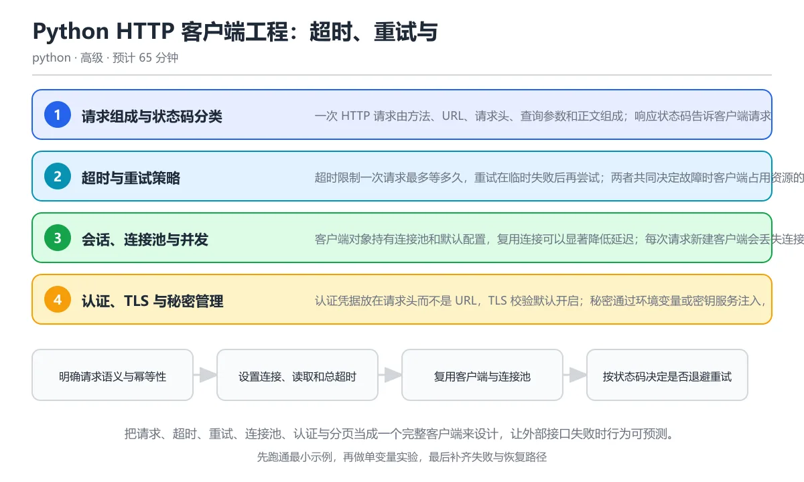

# Python HTTP 客户端工程：超时、重试与认证

> 内容更新时间：2026-10-06 · 学习阶段：高级 · 预计用时：40 分钟

分类：python。关键词：httpx、超时、重试、幂等性、限流。把请求、超时、重试、连接池、认证与分页当成一个完整客户端来设计，让外部接口失败时行为可预测。

学习建议：先通读《Python HTTP 客户端工程：超时、重试与认证》的核心知识与关键流程，再运行可运行练习并完成测验；遇到不确定的结论，回到「故障现场」按症状、根因、修复、验证四步核对。



## 学习目标

- 能区分连接、读取、写入和池等待超时并设置合理预算。
- 能只对可安全重试的请求进行指数退避并加入抖动。
- 能复用客户端、处理认证与分页，并避免常见安全事故。

## 前置知识

- 知道 HTTP 方法、状态码和请求头的基本含义。
- 会用 JSON 解析响应并处理异常。
- 理解连接复用和并发的基本概念。

## 核心知识

### 1. 请求组成与状态码分类

一次 HTTP 请求由方法、URL、请求头、查询参数和正文组成；响应状态码告诉客户端请求是否成功以及是否值得重试。

2xx 表示成功，3xx 表示重定向，4xx 通常是客户端错误，5xx 表示服务端错误；429 表示被限流，具体语义还要结合响应体和接口文档。

在Python HTTP 客户端工程：超时、重试与认证里可以这样验证：用 MockTransport 返回 503 和 200，打印每次请求的状态码与响应体，观察分支逻辑。

边界：不能只看状态码判断业务结果，很多接口在 200 中返回错误码；也不能把 404 当成可重试错误无限请求。

工程视角：状态码分类集中在客户端层，业务层只处理解析后的结果或领域异常；每个错误附带请求编号和时间戳。

### 2. 超时与重试策略

超时限制一次请求最多等多久，重试在临时失败后再尝试；两者共同决定故障时客户端占用资源的时间上限。

连接超时针对建立连接，读取超时针对等待响应数据，写入超时针对发送正文，池超时针对等待空闲连接；指数退避让等待时间逐次增长，抖动避免大量客户端同时重试。

在Python HTTP 客户端工程：超时、重试与认证里可以这样验证：对返回 503 的模拟接口只在 429 与 5xx 时重试，最多三次，并打印每次退避时间。

边界：只应重试幂等或带幂等键的操作；重试次数过多会放大故障，银行扣款、下单等操作必须有服务端幂等保证。

工程视角：超时预算从用户请求总时长反推，重试次数与退避上限写进配置，记录每次尝试和最终结果。

### 3. 会话、连接池与并发

客户端对象持有连接池和默认配置，复用连接可以显著降低延迟；每次请求新建客户端会丢失连接复用优势。

连接池按主机复用 TCP 连接，池大小限制并发请求；会话还能统一管理请求头、认证、Cookie 和重定向策略。

在Python HTTP 客户端工程：超时、重试与认证里可以这样验证：在 with 语句中创建一个客户端并连续发送多次请求，确认退出时连接被关闭。

边界：同一个客户端可以被多个线程共享，但配置不可在请求期间随意修改；异步客户端要放在异步上下文中使用。

工程视角：应用生命周期内复用一个客户端，按依赖注入传入业务服务；关闭钩子负责释放连接池。

### 4. 认证、TLS 与秘密管理

认证凭据放在请求头而不是 URL，TLS 校验默认开启；秘密通过环境变量或密钥服务注入，不能写进代码和日志。

Bearer 令牌放入 Authorization 头，Basic 认证把用户名密码编码后放入头部；OAuth2 需要获取、刷新和过期处理，TLS 证书验证防止中间人攻击。

在Python HTTP 客户端工程：超时、重试与认证里可以这样验证：创建带默认 Authorization 头的客户端，并让日志只记录令牌前缀和哈希，不输出完整值。

边界：关闭证书校验会让 HTTPS 失去防篡改能力；把令牌放在查询参数会进入代理和访问日志。

工程视角：凭据轮换有明确流程，测试使用假令牌，生产日志脱敏；重定向到其他域时避免自动携带敏感头部。

### 5. 分页、限流与流式响应

列表接口通常分页返回，客户端要按游标或页码持续请求；限流和流式响应要求客户端控制速率与内存。

游标分页使用下一页标记，页码分页依赖页大小和总数；429 响应通常带 Retry-After，客户端应尊重等待时间；流式响应按块读取，避免把大文件全部放进内存。

在Python HTTP 客户端工程：超时、重试与认证里可以这样验证：读取分页响应直到下一页为空，并在收到 429 时根据 Retry-After 暂停。

边界：分页期间数据可能变化，结果不一定是一致快照；无限循环的分页接口要有最大页数和总大小保护。

工程视角：分页器封装成生成器，下载设置大小上限和校验和，限流状态纳入监控。

## 关键流程

```text
明确请求语义与幂等性 → 设置连接、读取和总超时 → 复用客户端与连接池 → 按状态码决定是否退避重试 → 解析响应并处理分页与限流
```

1. 明确请求语义与幂等性
2. 设置连接、读取和总超时
3. 复用客户端与连接池
4. 按状态码决定是否退避重试
5. 解析响应并处理分页与限流

## 动手练习

1. 用 MockTransport 模拟 429、503 和 200，实现带退避上限的有限重试并记录每次等待时间。
2. 写一个分页生成器，处理游标分页、最大页数和重复游标保护。
3. 为客户端设计连接池与超时配置，说明每个参数的取值依据。
4. 给一个需要认证的接口实现令牌刷新流程，确保日志中不出现完整令牌。

**验收标准**：留下输入、命令、输出和结论，能让别人按记录复现。

## 常见错误与排查

> 说明：本表由《Python HTTP 客户端工程：超时、重试与认证》的核心知识整理（2026-10-06），人工复核进度见 docs/content_review_batches.md。

| 易错点 | 容易踩的做法 | 正确结论 |
| --- | --- | --- |
| 请求不设置超时 | 调用外部接口不传 timeout，连接或读取一直等待，线程和连接池被占满 | 为连接、读取、写入和池等待设置明确预算，并设置总超时 |
| 对非幂等操作盲目重试 | 下单请求超时后自动重复提交，用户被扣款两次 | 只重试安全方法，写操作要求服务端支持幂等键并保证幂等 |
| 每次请求新建客户端 | 在循环里创建新 Client 或 Session，连接无法复用且资源反复建立 | 应用级复用一个客户端，通过依赖注入传入业务层，退出时关闭 |
| 把令牌放在 URL 中 | 用查询参数传递访问令牌，令牌进入代理、浏览器历史和访问日志 | 使用 Authorization 请求头，日志只保留脱敏后的凭据标识 |

## 可运行练习

### 任务 1：先跑通，再解释

```python
import httpx

calls = {"count": 0}

def handler(request: httpx.Request) -> httpx.Response:
    calls["count"] += 1
    if calls["count"] < 3:
        return httpx.Response(503, text="busy", request=request)
    return httpx.Response(200, json={"ok": True}, request=request)

transport = httpx.MockTransport(handler)
with httpx.Client(transport=transport, base_url="https://api.test") as client:
    for attempt in range(3):
        response = client.get("/health", timeout=2.0)
        print("尝试", attempt + 1, "状态", response.status_code)
        if response.status_code == 200:
            print("结果:", response.json())
            break
    else:
        print("三次后仍失败")

print("请求次数:", calls["count"])
```

MockTransport 模拟前两次返回 503、第三次返回 200 的接口；客户端在 with 中复用连接配置，每次请求都带超时，按状态码决定继续或结束。真实工程中应把固定三次循环换成带指数退避和抖动的重试策略，并记录每次尝试。

### 任务 2：只改一个条件

复制上面的示例，只改一个输入或参数再跑一次；先写下预测，再和真实输出对照，并说明差异来自Python HTTP 客户端工程：超时、重试与认证的哪条机制。

### 任务 3：迁移到自己的数据

把《Python HTTP 客户端工程：超时、重试与认证》里的示例换成你自己的一小段数据或场景，保持结构不变；如果换不动，说明还有哪条前提没有理解，回到核心知识对应小节。

## 故障现场

### 现场 1：请求不设置超时

**症状**：在《Python HTTP 客户端工程：超时、重试与认证》里采用「调用外部接口不传 timeout，连接或读取一直等待，线程和连接池被占满」时，请求不设置超时会表现为错误结果、异常中断或状态不一致。

**根因**：这个做法没有执行与「请求不设置超时」对应的检查，问题被带到了后续步骤。

**修复**：为连接、读取、写入和池等待设置明确预算，并设置总超时

**验证**：为「请求不设置超时」准备一个最小输入，确认修复前的失败可以复现，修复后的输出与本课示例一致，再补一个边界输入。

### 现场 2：对非幂等操作盲目重试

**症状**：在《Python HTTP 客户端工程：超时、重试与认证》里采用「下单请求超时后自动重复提交，用户被扣款两次」时，对非幂等操作盲目重试会表现为错误结果、异常中断或状态不一致。

**根因**：这个做法没有执行与「对非幂等操作盲目重试」对应的检查，问题被带到了后续步骤。

**修复**：只重试安全方法，写操作要求服务端支持幂等键并保证幂等

**验证**：为「对非幂等操作盲目重试」准备一个最小输入，确认修复前的失败可以复现，修复后的输出与本课示例一致，再补一个边界输入。

### 现场 3：每次请求新建客户端

**症状**：在《Python HTTP 客户端工程：超时、重试与认证》里采用「在循环里创建新 Client 或 Session，连接无法复用且资源反复建立」时，每次请求新建客户端会表现为错误结果、异常中断或状态不一致。

**根因**：这个做法没有执行与「每次请求新建客户端」对应的检查，问题被带到了后续步骤。

**修复**：应用级复用一个客户端，通过依赖注入传入业务层，退出时关闭

**验证**：为「每次请求新建客户端」准备一个最小输入，确认修复前的失败可以复现，修复后的输出与本课示例一致，再补一个边界输入。

### 现场 4：把令牌放在 URL 中

**症状**：在《Python HTTP 客户端工程：超时、重试与认证》里采用「用查询参数传递访问令牌，令牌进入代理、浏览器历史和访问日志」时，把令牌放在 URL 中会表现为错误结果、异常中断或状态不一致。

**根因**：这个做法没有执行与「把令牌放在 URL 中」对应的检查，问题被带到了后续步骤。

**修复**：使用 Authorization 请求头，日志只保留脱敏后的凭据标识

**验证**：为「把令牌放在 URL 中」准备一个最小输入，确认修复前的失败可以复现，修复后的输出与本课示例一致，再补一个边界输入。

## 本课复习清单

离开本课前，逐项确认：

- [ ] 能区分连接超时、读取超时与池等待超时。
- [ ] 能判断哪些请求可以安全重试。
- [ ] 能在不泄露秘密的前提下记录请求诊断信息。
- [ ] 至少运行一次本课示例，记录输入、输出和一个边界情况。
- [ ] 把本课最容易混淆的两个概念写成一句话对照。

| 复盘项 | 记录 |
| --- | --- |
| 已经能独立解释的考点 |  |
| 仍然说不清的概念 |  |
| 下一步验证动作 |  |

## 复习与自测

### 核心知识

遮住正文回答：Python HTTP 客户端工程：超时、重试与认证解决什么问题、依赖哪些前提、失败时先看哪个信号？三问都能答清楚，再进入下一节。

### 动手练习

把《Python HTTP 客户端工程：超时、重试与认证》里「只改一个条件」的练习再做一遍，这次先写预测再运行；预测和结果不一致的地方，就是需要回读的章节。

### 最小可运行示例

```python
import httpx

calls = {"count": 0}

def handler(request: httpx.Request) -> httpx.Response:
    calls["count"] += 1
    if calls["count"] < 3:
        return httpx.Response(503, text="busy", request=request)
    return httpx.Response(200, json={"ok": True}, request=request)

transport = httpx.MockTransport(handler)
with httpx.Client(transport=transport, base_url="https://api.test") as client:
    for attempt in range(3):
        response = client.get("/health", timeout=2.0)
        print("尝试", attempt + 1, "状态", response.status_code)
        if response.status_code == 200:
            print("结果:", response.json())
            break
    else:
        print("三次后仍失败")

print("请求次数:", calls["count"])
```

### 预期输出

```text
尝试 1 状态 503
尝试 2 状态 503
尝试 3 状态 200
结果: {'ok': True}
请求次数: 3
```

### 验证步骤

1. 确认输入数据与运行环境和示例一致。
2. 运行示例，记录输出与耗时等可观测指标。
3. 换一个边界输入重跑，确认结论仍然成立。
4. 把两次结果写成一句话结论，注明前提与局限。

## 术语速查

先遮住右列，尝试用自己的话解释，再回到正文核对。

| 术语 | 一句话说明 |
| --- | --- |
| `连接超时` | 客户端等待与目标建立连接的最长时间。 |
| `读取超时` | 连接建立后等待响应数据的单次最长时间。 |
| `幂等性` | 同一请求执行多次产生与执行一次相同结果的语义。 |
| `连接池` | 复用已建立连接并限制并发数量的资源池。 |
| `指数退避` | 每次重试按指数增长等待时间，并常加入随机抖动避免同时重试。 |
| `限流` | 服务端按时间窗口限制请求速率或并发量，客户端需要识别并配合等待。 |

## 考点精讲

### 考点 1：为什么 HTTP 请求必须设置超时？

题型：概念判断。题干：为什么 HTTP 请求必须设置超时？

判断要点：防止连接或读取无限等待，避免线程和连接池被耗尽。外部服务可能因为网络中断、过载或错误配置长时间不返回，没有超时的请求会占住线程、连接和内存，最终拖垮整条调用链。超时应该覆盖连接、读取、写入和等待连接池的各个阶段，并由总请求预算统一约束。 正确选项「防止连接或读取无限等待，避免线程和连接池被耗尽」对应《Python HTTP 客户端工程：超时、重试与认证》的要点「请求组成与状态码分类」：一次 HTTP 请求由方法、URL、请求头、查询参数和正文组成；响应状态码告诉客户端请求是否成功以及是否值得重试。判断「请求组成与状态码分类」时先确认前提是否成立，再回到《Python HTTP 客户端工程：超时、重试与认证》的示例核对一次；把别的语言或框架的默认做法直接搬到请求组成与状态码分类上，往往会在本课的边界条件里失效。

### 考点 2：以下哪种请求最适合自动重试？

题型：概念判断。题干：以下哪种请求最适合自动重试？

判断要点：幂等的 GET 查询在 503 后重试。幂等的 GET 在服务端临时过载时重试通常是安全的，配合指数退避和抖动即可。支付请求如果没有服务端幂等保证可能重复扣款；404 和 401 是确定性错误，重试不会改变结果，只会放大流量和延迟。 正确选项「幂等的 GET 查询在 503 后重试」对应《Python HTTP 客户端工程：超时、重试与认证》的要点「超时与重试策略」：超时限制一次请求最多等多久，重试在临时失败后再尝试；两者共同决定故障时客户端占用资源的时间上限。判断「超时与重试策略」时先确认前提是否成立，再回到《Python HTTP 客户端工程：超时、重试与认证》的示例核对一次；借鉴相邻主题的经验之前，先核对超时与重试策略的前提是否成立。

### 考点 3：关于客户端与认证，哪些做法正确？（多选）

题型：多选辨析。题干：关于客户端与认证，哪些做法正确？（多选）

判断要点：应用级复用客户端以利用连接池；把访问令牌放在 Authorization 头；默认开启 TLS 证书校验。复用客户端、把令牌放在认证头并保持 TLS 校验都是基本安全实践。完整令牌绝不应进入日志，因为日志通常被多人访问且长期保存；需要排查时可以记录令牌的哈希前缀、请求编号和过期时间等脱敏信息。 正确选项「应用级复用客户端以利用连接池；把访问令牌放在 Authorization 头；默认开启 TLS 证书校验」对应《Python HTTP 客户端工程：超时、重试与认证》的要点「会话、连接池与并发」：客户端对象持有连接池和默认配置，复用连接可以显著降低延迟；每次请求新建客户端会丢失连接复用优势。判断「会话、连接池与并发」时先确认前提是否成立，再回到《Python HTTP 客户端工程：超时、重试与认证》的示例核对一次；记住会话、连接池与并发的结论之外还要记住适用条件，换一个输入往往就不成立了。

### 考点 4：阅读重试片段，最大等待时间是多少秒？


题型：代码阅读。题干：阅读重试片段，最大等待时间是多少秒？

def delay(attempt):
    return min(0.2 * (2 ** attempt), 5.0)
print(delay(5))

判断要点：5.0。计算 0.2 乘以 2 的 5 次方得到 6.4，再由 min 与上限 5.0 比较，因此结果是 5.0。指数退避必须设置上限，否则重试次数增加后等待时间会迅速膨胀；实际实现还要加入随机抖动，避免多个客户端同时恢复造成惊群。 正确选项「5.0」对应《Python HTTP 客户端工程：超时、重试与认证》的要点「认证、TLS 与秘密管理」：认证凭据放在请求头而不是 URL，TLS 校验默认开启；秘密通过环境变量或密钥服务注入，不能写进代码和日志。判断「认证、TLS 与秘密管理」时先确认前提是否成立，再回到《Python HTTP 客户端工程：超时、重试与认证》的示例核对一次；干扰项常常是相邻主题里成立的结论，只有按认证、TLS 与秘密管理的输入与约束判断才能排除。

### 考点 5：分页循环可能存在什么风险？

题型：排错。题干：分页循环可能存在什么风险？

判断要点：没有最大页数和退出条件，服务端游标异常时可能无限请求。循环依赖 next 字段结束，如果服务端重复返回同一个游标、字段缺失或网络重试导致状态错乱，客户端会无限请求并消耗配额。应设置最大页数、总条数或总时长上限，校验游标变化，并对分页结果去重和记录进度。这道题对应 HTTP 客户端的重试与分页保护：任何循环都要有上限，避免无限请求和限流惩罚。 正确选项「没有最大页数和退出条件，服务端游标异常时可能无限请求」对应《Python HTTP 客户端工程：超时、重试与认证》的要点「分页、限流与流式响应」：列表接口通常分页返回，客户端要按游标或页码持续请求；限流和流式响应要求客户端控制速率与内存。判断「分页、限流与流式响应」时先确认前提是否成立，再回到《Python HTTP 客户端工程：超时、重试与认证》的示例核对一次；把分页、限流与流式响应的做法换到别的约束下未必成立，先确认边界再决定答案。

## English Overview

Engineering Python HTTP Clients: Timeouts, Retries and Auth

This lesson builds production-ready Python HTTP clients with explicit timeouts, idempotent retry policies, exponential backoff with jitter, reusable connection pools, safe authentication and pagination. It also covers rate limiting, streaming responses and secret handling.

## 本课小结

- Python HTTP 客户端工程：超时、重试与认证围绕httpx、超时、重试展开，先建立基线再讨论优化。
- 一次 HTTP 请求由方法、URL、请求头、查询参数和正文组成；响应状态码告诉客户端请求是否成功以及是否值得重试。
- 遇到问题时按「症状 → 根因 → 修复 → 验证」的顺序处理，不跳过验证。

## 内容元数据

- 内容版本：v2.0
- 最后更新：2026-10-06
- 学习阶段：高级

| 字段 | 值 |
| --- | --- |
| 课程 ID | `python_http_clients` |
| 所属分类 | `python` |
| 难度 | 高级 |
| 预计用时 | 65 分钟 |
| 关键词 | httpx、超时、重试、幂等性、限流 |
| 配图 | `images/lesson_python_http_clients.webp` |
| 参考资料 | 4 条 |
| 内容更新时间 | 2026-10-06 |

## 参考资料与复核

- 最后复核：2026-10-04
- 下次复核：2026-11-10
- 复核范围：版本兼容、API 行为与工程实践

下面列出的资料用于核对本课结论，复习时可以对照阅读：
- [HTTPX 官方文档](https://www.python-httpx.org/)
- [Requests 官方文档](https://requests.readthedocs.io/)
- [RFC 9110：HTTP 语义](https://www.rfc-editor.org/rfc/rfc9110.html)
- [MDN Retry-After 响应头](https://developer.mozilla.org/docs/Web/HTTP/Headers/Retry-After)

> 复核提示：《Python HTTP 客户端工程：超时、重试与认证》的结论如与资料冲突，以资料中的规范文本为准，并在笔记里记录差异与日期。

## 复习与迁移

### 概念复述

不看正文，把Python HTTP 客户端工程：超时、重试与认证讲给一个没学过的同事：先讲它解决什么问题，再讲一个最小例子，最后说明一个不适用场景。

### 测验回顾

回到《Python HTTP 客户端工程：超时、重试与认证》测验，只重做答错或犹豫的题；对每道题写一句「我为什么改选这个答案」，写不出理由就回到对应小节。

### 迁移练习

把《Python HTTP 客户端工程：超时、重试与认证》的方法用到一个你自己的真实场景：说明输入、约束与验证方式，并列出仍然不确定、需要下一次实验回答的问题。

## 深度拓展与实战

这一节把Python HTTP 客户端工程：超时、重试与认证的机制拆开验证：每一步都给出输入、判断标准和失败信号，便于在真实项目里复用。

### 机制拆解 1：请求组成与状态码分类

2xx 表示成功，3xx 表示重定向，4xx 通常是客户端错误，5xx 表示服务端错误；429 表示被限流，具体语义还要结合响应体和接口文档。

落地时先确认前提：不能只看状态码判断业务结果，很多接口在 200 中返回错误码；也不能把 404 当成可重试错误无限请求。；再把结论写进检查表，让下一位同学可以按同样的输入复现。

工程做法：状态码分类集中在客户端层，业务层只处理解析后的结果或领域异常；每个错误附带请求编号和时间戳。

### 机制拆解 2：超时与重试策略

连接超时针对建立连接，读取超时针对等待响应数据，写入超时针对发送正文，池超时针对等待空闲连接；指数退避让等待时间逐次增长，抖动避免大量客户端同时重试。

落地时先确认前提：只应重试幂等或带幂等键的操作；重试次数过多会放大故障，银行扣款、下单等操作必须有服务端幂等保证。；再把结论写进检查表，让下一位同学可以按同样的输入复现。

工程做法：超时预算从用户请求总时长反推，重试次数与退避上限写进配置，记录每次尝试和最终结果。

### 机制拆解 3：会话、连接池与并发

连接池按主机复用 TCP 连接，池大小限制并发请求；会话还能统一管理请求头、认证、Cookie 和重定向策略。

落地时先确认前提：同一个客户端可以被多个线程共享，但配置不可在请求期间随意修改；异步客户端要放在异步上下文中使用。；再把结论写进检查表，让下一位同学可以按同样的输入复现。

工程做法：应用生命周期内复用一个客户端，按依赖注入传入业务服务；关闭钩子负责释放连接池。

### 机制拆解 4：认证、TLS 与秘密管理

Bearer 令牌放入 Authorization 头，Basic 认证把用户名密码编码后放入头部；OAuth2 需要获取、刷新和过期处理，TLS 证书验证防止中间人攻击。

落地时先确认前提：关闭证书校验会让 HTTPS 失去防篡改能力；把令牌放在查询参数会进入代理和访问日志。；再把结论写进检查表，让下一位同学可以按同样的输入复现。

工程做法：凭据轮换有明确流程，测试使用假令牌，生产日志脱敏；重定向到其他域时避免自动携带敏感头部。

### 机制拆解 5：分页、限流与流式响应

游标分页使用下一页标记，页码分页依赖页大小和总数；429 响应通常带 Retry-After，客户端应尊重等待时间；流式响应按块读取，避免把大文件全部放进内存。

落地时先确认前提：分页期间数据可能变化，结果不一定是一致快照；无限循环的分页接口要有最大页数和总大小保护。；再把结论写进检查表，让下一位同学可以按同样的输入复现。

工程做法：分页器封装成生成器，下载设置大小上限和校验和，限流状态纳入监控。

### 机制对照表

| 概念 | 解决什么问题 | 关键前提 | 失败信号 |
| --- | --- | --- | --- |
| 请求组成与状态码分类 | 一次 HTTP 请求由方法、URL、请求头、查询参数和正文组成；响应状态码告诉客 | 不能只看状态码判断业务结果，很多接口在 200 中返回错误码；也不能把  | 状态码分类集中在客户端层，业务层只处理解析后的结果或领域异常；每个错误附 |
| 超时与重试策略 | 超时限制一次请求最多等多久，重试在临时失败后再尝试；两者共同决定故障时客户端占用 | 只应重试幂等或带幂等键的操作；重试次数过多会放大故障，银行扣款、下单等操 | 超时预算从用户请求总时长反推，重试次数与退避上限写进配置，记录每次尝试和 |
| 会话、连接池与并发 | 客户端对象持有连接池和默认配置，复用连接可以显著降低延迟；每次请求新建客户端会丢 | 同一个客户端可以被多个线程共享，但配置不可在请求期间随意修改；异步客户端 | 应用生命周期内复用一个客户端，按依赖注入传入业务服务；关闭钩子负责释放连 |
| 认证、TLS 与秘密管理 | 认证凭据放在请求头而不是 URL，TLS 校验默认开启；秘密通过环境变量或密钥服 | 关闭证书校验会让 HTTPS 失去防篡改能力；把令牌放在查询参数会进入代 | 凭据轮换有明确流程，测试使用假令牌，生产日志脱敏；重定向到其他域时避免自 |
| 分页、限流与流式响应 | 列表接口通常分页返回，客户端要按游标或页码持续请求；限流和流式响应要求客户端控制 | 分页期间数据可能变化，结果不一定是一致快照；无限循环的分页接口要有最大页 | 分页器封装成生成器，下载设置大小上限和校验和，限流状态纳入监控。 |

### 自测问答

**问 1**：为什么 HTTP 请求必须设置超时？

**答**：防止连接或读取无限等待，避免线程和连接池被耗尽。外部服务可能因为网络中断、过载或错误配置长时间不返回，没有超时的请求会占住线程、连接和内存，最终拖垮整条调用链。超时应该覆盖连接、读取、写入和等待连接池的各个阶段，并由总请求预算统一约束。 正确选项「防止连接或读取无限等待，避免线程和连接池被耗尽」对应《Python HTTP 客户端工程：超时、重试与认证》的要点「请求组成与状态码分类」：一次 HTTP 请求由方法、URL、请求头、查询参数和正文组成；响应状态码告诉客户端请求是否成功以及是否值得重试。判断「请求组成与状态码分类」时先确认前提是否成立，再回到《Python HTTP 客户端工程：超时、重试与认证》的示例核对一次；把别的语言或框架的默认做法直接搬到请求组成与状态码分类上，往往会在本课的边界条件里失效。

**问 2**：以下哪种请求最适合自动重试？

**答**：幂等的 GET 查询在 503 后重试。幂等的 GET 在服务端临时过载时重试通常是安全的，配合指数退避和抖动即可。支付请求如果没有服务端幂等保证可能重复扣款；404 和 401 是确定性错误，重试不会改变结果，只会放大流量和延迟。 正确选项「幂等的 GET 查询在 503 后重试」对应《Python HTTP 客户端工程：超时、重试与认证》的要点「超时与重试策略」：超时限制一次请求最多等多久，重试在临时失败后再尝试；两者共同决定故障时客户端占用资源的时间上限。判断「超时与重试策略」时先确认前提是否成立，再回到《Python HTTP 客户端工程：超时、重试与认证》的示例核对一次；借鉴相邻主题的经验之前，先核对超时与重试策略的前提是否成立。

**问 3**：关于客户端与认证，哪些做法正确？（多选）

**答**：应用级复用客户端以利用连接池；把访问令牌放在 Authorization 头；默认开启 TLS 证书校验。复用客户端、把令牌放在认证头并保持 TLS 校验都是基本安全实践。完整令牌绝不应进入日志，因为日志通常被多人访问且长期保存；需要排查时可以记录令牌的哈希前缀、请求编号和过期时间等脱敏信息。 正确选项「应用级复用客户端以利用连接池；把访问令牌放在 Authorization 头；默认开启 TLS 证书校验」对应《Python HTTP 客户端工程：超时、重试与认证》的要点「会话、连接池与并发」：客户端对象持有连接池和默认配置，复用连接可以显著降低延迟；每次请求新建客户端会丢失连接复用优势。判断「会话、连接池与并发」时先确认前提是否成立，再回到《Python HTTP 客户端工程：超时、重试与认证》的示例核对一次；记住会话、连接池与并发的结论之外还要记住适用条件，换一个输入往往就不成立了。

**问 4**：阅读重试片段，最大等待时间是多少秒？

def delay(attempt):
    return min(0.2 * (2 ** attempt), 5.0)
print(delay(5))

**答**：5.0。计算 0.2 乘以 2 的 5 次方得到 6.4，再由 min 与上限 5.0 比较，因此结果是 5.0。指数退避必须设置上限，否则重试次数增加后等待时间会迅速膨胀；实际实现还要加入随机抖动，避免多个客户端同时恢复造成惊群。 正确选项「5.0」对应《Python HTTP 客户端工程：超时、重试与认证》的要点「认证、TLS 与秘密管理」：认证凭据放在请求头而不是 URL，TLS 校验默认开启；秘密通过环境变量或密钥服务注入，不能写进代码和日志。判断「认证、TLS 与秘密管理」时先确认前提是否成立，再回到《Python HTTP 客户端工程：超时、重试与认证》的示例核对一次；干扰项常常是相邻主题里成立的结论，只有按认证、TLS 与秘密管理的输入与约束判断才能排除。

**问 5**：分页循环可能存在什么风险？

**答**：没有最大页数和退出条件，服务端游标异常时可能无限请求。循环依赖 next 字段结束，如果服务端重复返回同一个游标、字段缺失或网络重试导致状态错乱，客户端会无限请求并消耗配额。应设置最大页数、总条数或总时长上限，校验游标变化，并对分页结果去重和记录进度。这道题对应 HTTP 客户端的重试与分页保护：任何循环都要有上限，避免无限请求和限流惩罚。 正确选项「没有最大页数和退出条件，服务端游标异常时可能无限请求」对应《Python HTTP 客户端工程：超时、重试与认证》的要点「分页、限流与流式响应」：列表接口通常分页返回，客户端要按游标或页码持续请求；限流和流式响应要求客户端控制速率与内存。判断「分页、限流与流式响应」时先确认前提是否成立，再回到《Python HTTP 客户端工程：超时、重试与认证》的示例核对一次；把分页、限流与流式响应的做法换到别的约束下未必成立，先确认边界再决定答案。

### 排错速查

- 看到「调用外部接口不传 timeout，连接或读取一直等待，线程和连接池被占满」时，先按「为连接、读取、写入和池等待设置明确预算，并设置总超时」处理，再用Python HTTP 客户端工程：超时、重试与认证的最小示例确认结论是否恢复。
- 看到「下单请求超时后自动重复提交，用户被扣款两次」时，先按「只重试安全方法，写操作要求服务端支持幂等键并保证幂等」处理，再用Python HTTP 客户端工程：超时、重试与认证的最小示例确认结论是否恢复。
- 看到「在循环里创建新 Client 或 Session，连接无法复用且资源反复建立」时，先按「应用级复用一个客户端，通过依赖注入传入业务层，退出时关闭」处理，再用Python HTTP 客户端工程：超时、重试与认证的最小示例确认结论是否恢复。
- 看到「用查询参数传递访问令牌，令牌进入代理、浏览器历史和访问日志」时，先按「使用 Authorization 请求头，日志只保留脱敏后的凭据标识」处理，再用Python HTTP 客户端工程：超时、重试与认证的最小示例确认结论是否恢复。

### 工程检查表

- [ ] 明确请求语义与幂等性
- [ ] 设置连接、读取和总超时
- [ ] 复用客户端与连接池
- [ ] 按状态码决定是否退避重试
- [ ] 解析响应并处理分页与限流
- [ ] 【请求组成与状态码分类】状态码分类集中在客户端层，业务层只处理解析后的结果或领域异常；每个错误附带请求编号和时间戳。
- [ ] 【超时与重试策略】超时预算从用户请求总时长反推，重试次数与退避上限写进配置，记录每次尝试和最终结果。
- [ ] 【会话、连接池与并发】应用生命周期内复用一个客户端，按依赖注入传入业务服务；关闭钩子负责释放连接池。
- [ ] 【认证、TLS 与秘密管理】凭据轮换有明确流程，测试使用假令牌，生产日志脱敏；重定向到其他域时避免自动携带敏感头部。
- [ ] 【分页、限流与流式响应】分页器封装成生成器，下载设置大小上限和校验和，限流状态纳入监控。

### 迁移练习

把Python HTTP 客户端工程：超时、重试与认证的方法用到一个真实场景：写下httpx、超时、重试在你的场景里分别对应什么，再记录一次失败尝试和它的恢复步骤。

### 延伸阅读与下一步

- 复习httpx、超时、重试、幂等性、限流时，优先回看「请求组成与状态码分类」与「分页、限流与流式响应」两节。
- 把从「明确请求语义与幂等性」到「解析响应并处理分页与限流」的流程画成一张图，放进自己的笔记。
- 一周后重做本课测验，只把答错的题留到下一轮复习。

### 结论与下一步

学完Python HTTP 客户端工程：超时、重试与认证，应该能独立完成三件事：先用最小示例确认httpx的行为，再用一个边界输入验证结论，最后把失败路径写成可重复的检查。下一步把本课术语加入复习清单，并在两周内用一次真实任务检验记忆是否牢固。
