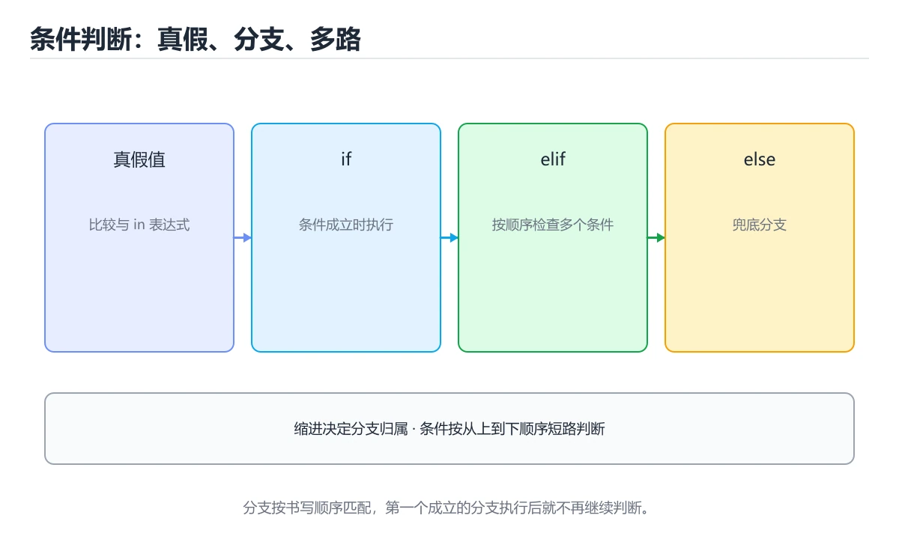
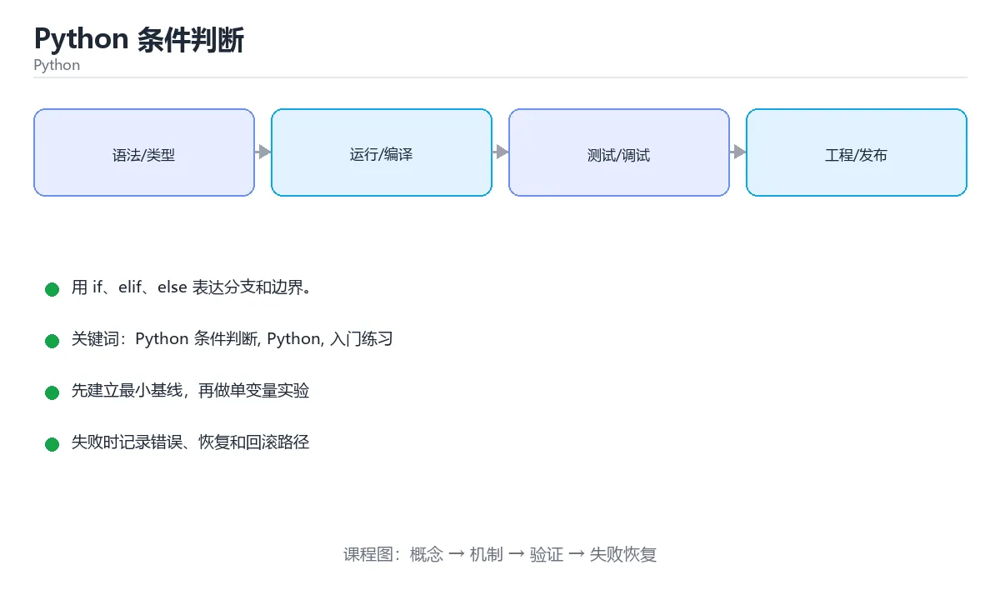

# Python 条件判断

> 内容更新时间：2026-10-06 · 学习阶段：入门 · 预计用时：30 分钟





## 学习目标

- 先认识Python 条件判断需要的工具、输入和输出。
- 按步骤运行最小示例，并记录结果与错误。
- 用一个边界输入验证自己是否真正掌握。

## 前置知识

- 会进行基本的文件或命令行操作。
- 不需要预先掌握「Python」的高级知识。

## 一句话入门

用 if、elif、else 表达分支和边界。

## 最小示例

```python
score = 72
if score >= 60:
    print("pass")
else:
    print("fail")
```

## 预期输出

```text
pass
```

## 常见错误与排查

> 说明：本表由《Python 条件判断》的核心知识整理（2026-10-07），人工复核进度见 docs/content_review_batches.md。

| 易错点 | 容易踩的做法 | 正确结论 |
| --- | --- | --- |
| 用单个等号做比较 | 条件恒真，分支永远走同一条 | 用双等号比较并接入静态检查 |
| 忽略缩进层级 | 逻辑与书写意图不符 | 统一缩进并保持分支层级清晰 |
| 条件顺序写反 | 具体条件被宽泛条件吞掉 | 从具体到宽泛排列条件 |

## 动手练习

1. 原样运行最小示例，保存命令和输出。
2. 把数字 2 改成 10，预测并验证新结果。
3. 制造一个错误输入，写出错误信息和修复方法。

## 本课小结

- 入门阶段先保证能运行、能观察、能解释，再追求复杂功能。
- 每次只改一个变量，记录预测与实际结果。
- 遇到错误先看第一条错误信息，再回到最小示例。

## Python 条件的真值与缩进

Python 的条件表达式会调用对象的真值判断：`False`、`None`、数值 0、空字符串、空列表、空字典和空集合为假，其他对象通常为真。这意味着 `if items:` 与 `if len(items) > 0:` 等价，但前者更 Pythonic；前提是调用方确实接受“空容器为假”的语义。如果要区分 `None` 和空列表，应显式写 `if items is None`，不要把两种状态混在一起。

缩进是语法的一部分，同一个代码块必须使用一致的缩进层级。混用空格和制表符会触发 `TabError`，所以整个项目应统一使用空格。`if/elif/else` 从上到下匹配，第一个为真的分支执行后其余分支跳过；条件重叠时要按优先级排列。三元表达式 `a if condition else b` 适合短小赋值，嵌套多层会降低可读性，应改用普通分支。

`and` 和 `or` 会短路并返回参与运算的对象，而不一定返回布尔值，例如 `name or "anonymous"` 会返回第一个真值。这个特性适合提供默认值，但要注意 0、空字符串和空列表也会触发回退。`is` 比较对象身份，`==` 比较值相等；判断 `None` 应使用 `is None`，不要用 `== None`。

## 短路、海象运算符与异常边界

Python 3.8 引入的海象运算符 `:=` 允许在表达式里赋值，常用于“先计算再判断”的场景，例如 `if (match := pattern.search(text)) is not None:`。它能减少重复计算，但滥用会降低可读性，尤其在推导式和复杂条件中。推导式里的条件用于筛选，不能替代完整的控制流；需要多分支或多步副作用时，普通循环更清楚。

用户输入默认是字符串，参与数值计算前必须转换。`int()` 和 `float()` 在格式非法时抛出 `ValueError`，应捕获并给出明确提示，而不是让程序崩溃。除零会抛 `ZeroDivisionError`，访问不存在的字典键会抛 `KeyError`，这些都可以通过前置检查或 `try/except` 处理。异常的边界要尽量小，只包住可能失败的操作，并在错误信息里保留原始输入。

验证条件逻辑时，覆盖真值、假值、None、空容器、边界数值、非法输入和多个分支同时满足的情况。为每个分支写出预期结果，再用参数化测试批量运行。特别注意短路副作用、缩进层级和 `is` 与 `==` 的误用，这三类问题在真实项目中非常常见。

## 可运行练习

### 任务 1：先跑通，再解释

```python
score = 72
if score >= 60:
    print("pass")
else:
    print("fail")
```

**预期输出**：fail

### 任务 2：只改一个条件

把「Python 条件判断」的最小示例复制一份，只改一个条件再跑一次：

- 改动点：把 Python 换成边界值，其他输入保持原样。
- 预测：先写下「Python 条件判断」在改动后的输出或错误信息，再运行。
- 记录：对照改动前后的结果，指出差异出在哪一步。
- 验收：换回原条件能复现原结果，改动只影响Python 条件判断。

### 任务 3：迁移到自己的数据

把 score 换成你自己的输入，先保持步骤不变，再比较输出差异。

## 故障现场

### 现场 1：用单个等号做比较

**症状**：在《Python 条件判断》的复现场景中，条件恒真，分支永远走同一条。

**根因**：当出现“用单个等号做比较”时，执行路径已经绕过了《Python 条件判断》的关键约束，最终以“条件恒真，分支永远走同一条”暴露出来；修复前必须先确认约束在哪里失效。

**修复**：针对《Python 条件判断》的问题，用双等号比较并接入静态检查。

**验证**：在《Python 条件判断》中按“用双等号比较并接入静态检查”调整后，从“用单个等号做比较”的触发条件重放同一条路径，确认“条件恒真，分支永远走同一条”不再出现，并补一个相邻边界用例检查没有引入新问题。

### 现场 2：忽略缩进层级

**症状**：在《Python 条件判断》的复现场景中，逻辑与书写意图不符。

**根因**：“逻辑与书写意图不符”只是表层结果。向上追溯会落到“忽略缩进层级”这一步，因为它省略了《Python 条件判断》的约束，使实现行为和预期模型发生了偏离。

**修复**：针对《Python 条件判断》的问题，统一缩进并保持分支层级清晰。

**验证**：保留《Python 条件判断》里触发“逻辑与书写意图不符”的输入、版本和日志，按“统一缩进并保持分支层级清晰”完成修改后原样重放；只有失败现象消失且相邻场景仍可解释，才保留改动。

### 现场 3：条件顺序写反

**症状**：在《Python 条件判断》的复现场景中，具体条件被宽泛条件吞掉。

**根因**：“具体条件被宽泛条件吞掉”只是表层结果。向上追溯会落到“条件顺序写反”这一步，因为它省略了《Python 条件判断》的约束，使实现行为和预期模型发生了偏离。

**修复**：针对《Python 条件判断》的问题，从具体到宽泛排列条件。

**验证**：保留《Python 条件判断》里触发“具体条件被宽泛条件吞掉”的输入、版本和日志，按“从具体到宽泛排列条件”完成修改后原样重放；只有失败现象消失且相邻场景仍可解释，才保留改动。

## 版本与时效

### 升级检查清单

- 先固定当前版本，跑通全部示例与测验，再升级工具链。
- 只改 Python 条件判断 的版本变量，记录编译、测试与产物体积的变化。
- 先回归 Python 条件判断 与 Python 的默认行为和错误信息，再扩大测试范围。
- 升级完成后更新本课「最后复核 / 下次复核」日期，并记录 Python 条件判断 的版本变化。

## 本课复习清单

离开本课前，逐项确认：

- [ ] 不看解析，能说出「在 Python 中，下列哪一组值在条件判断里都为假？」的判断依据。
- [ ] 不看解析，能说出「下面代码中，score 等于 72，会输出什么？」的判断依据。
- [ ] 不看解析，能说出「需要依次判断多个互斥条件时，应该使用哪个关键字？」的判断依据。
- [ ] 不看解析，能说出「下面代码想判断 a 是否大于 b，但会报语法错误。缺少了什么？」的判断依据。
- [ ] 用 Python 条件判断 构造一个正常输入和一个边界输入，分别记录输出与判断依据。
- [ ] 把本课最容易混淆的两个概念写成一句话对照。

| 复盘项 | 记录 |
| --- | --- |
| 已经能独立解释的考点 |  |
| 仍然说不清的概念 |  |
| 下一步验证动作 |  |

## 复习与自测

对照 Python 条件的真值与缩进 复述本课结论，答不上来的部分回到 score 的示例重跑一次。

### 一句话入门

自检：这一节的关键输入与输出分别是什么？

### 最小示例

```python
score = 72
if score >= 60:
    print("pass")
else:
    print("fail")
```

自检：这一节与相邻主题的边界在哪里？

### 预期输出

```text
pass
```

### 常见错误

自检：把这一节讲给没学过的人，最需要强调哪一点？

### 动手练习

自检：如果去掉这一节里的一个前提，结论会怎样变化？

### Python 条件的真值与缩进

Python 的条件表达式会调用对象的真值判断：`False`、`None`、数值 0、空字符串、空列表、空字典和空集合为假，其他对象通常为真。这意味着 `if items:` 与 `if len(items) > 0:` 等价，但前者更 Pythonic；前提是调用方确实接受“空容器为假”的语义。

### 短路、海象运算符与异常边界

Python 3.8 引入的海象运算符 `:=` 允许在表达式里赋值，常用于“先计算再判断”的场景，例如 `if (match := pattern.search(text)) is not None:`。它能减少重复计算，但滥用会降低可读性，尤其在推导式和复杂条件中。

## 术语速查

把「Python 条件判断」里反复出现的术语集中放在一起。复习时先遮住右列，尝试用自己的话解释，再回到正文核对。

| 术语 | 一句话说明 |
| --- | --- |
| `布尔值` | 只有 True 与 False 两个取值，是条件判断的结果类型。 |
| `if-elif-else` | 从上到下判断条件，命中第一个为真的分支后跳过其余分支。 |
| `真值判断` | 空列表、0、None 等在条件里等价于假，其余多数对象为真。 |
| `逻辑运算符` | and、or、not 用来组合或取反条件。 |
| `Python` | 一种解释型通用编程语言，用缩进划分代码块，标准库覆盖面广 |

## 零基础精讲：把Python 条件判断真正讲透

### 先建立一个直觉

本课的摘要可以当作一张地图：用 if、elif、else 表达分支和边界。

### 逐步拆解

1. 澄清输入与目标。先写清「Python 条件判断」要解决的问题、合法输入范围和成功标准，再进入后续步骤。
2. 描述处理过程。把「Python 条件判断、Python、入门练习」映射到具体步骤，每步都要求能单独验证。
3. 定义输出。明确 Python 条件判断 与 Python 各自的产物，以及失败时留下什么证据。
4. 制造一次Python的失败输入，确认错误出现在「Python 条件的真值与缩进」的哪一步，并写下恢复后如何验证状态已回到一致。
5. 把「Python 条件的真值与缩进」里的最小示例抄成 score 一行的输入，先手算结果再执行，确认两者一致。

### 把正文串成一条执行链

- **考点 1：在 Python 中，下列哪一组值在条件判断里都为假？**：针对「Python 条件判断」，先自问「在 Python 中，下列哪一组值在条件判断里都为假」；作答后回到对应考点核对判断依据。
- **考点 2：下面代码中，score 等于 72，会输出什么？**：针对「Python 条件判断」，先自问「下面代码中，score 等于 72，会输出什么」；作答后回到对应考点核对判断依据。
- **考点 3：需要依次判断多个互斥条件时，应该使用哪个关键字？**：针对「Python 条件判断」，先自问「需要依次判断多个互斥条件时，应该使用哪个关键字」；作答后回到对应考点核对判断依据。
- **考点 4：下面代码想判断 a 是否大于 b，但会报语法错误。缺少了什么？**：考点 4：下面代码想判断 a 是否大于 b，但会报语法错误
- **一句话入门**：用 if、elif、else 表达分支和边界
- **最小示例**：自检：这一节与相邻主题的边界在哪里

### 从测验反推易错点

**检查点 1：在 Python 中，下列哪一组值在条件判断里都为假？**

- 参考判断：0、空字符串、空列表和 None
- 自问：如果去掉题干里的一个限定词，结论还成立吗？

**检查点 2：下面代码中，score 等于 72，会输出什么？**

- 参考判断：输出 pass，因为条件 score >= 60 成立

**检查点 3：需要依次判断多个互斥条件时，应该使用哪个关键字？**

- 参考判断：elif，它会按顺序检查前一个条件不成立后的新条件

**检查点 4：下面代码想判断 a 是否大于 b，但会报语法错误。缺少了什么？**

- 参考判断：if 条件末尾的冒号

### 工程排错顺序

| 先查什么 | 要得到的证据 | 判断标准 |
| --- | --- | --- |
| 输入与前提是否满足 | 日志、输入样例、测试或指标 | 能复现并解释，才算定位 |
| 核心步骤是否产生了预期中间结果 | 日志、输入样例、测试或指标 | 能复现并解释，才算定位 |
| 失败路径是否可观测、可恢复 | 日志、输入样例、测试或指标 | 能复现并解释，才算定位 |
| 资源、权限与成本是否在预算内 | 日志、输入样例、测试或指标 | 能复现并解释，才算定位 |

### 变式训练

1. 把 Python 条件判断 的实现压缩到一个进程内，去掉所有外部依赖后再谈扩展。
2. 把 score 的数据量提高一个数量级，观察延迟与内存的变化拐点。
3. 让 score 的外部依赖超时，确认系统能回滚或补偿，而不是留下脏数据。
5. 故意跳过 Python 的检查再运行，比较与正常流程的差异，并说明这个检查挡住的到底是哪一类失败。
6. 把 Python 条件判断 的方案切换到低资源设备，重新评估默认参数、超时和降级策略。

### 本课自测

- [ ] 能用一句话解释Python 条件判断在本课中的角色与边界。
- [ ] 能举出一个正常例子和一个失败例子。
- [ ] 能说出最小验证步骤，以及需要记录的证据。
- [ ] 能用一句话解释「Python」在本课中的角色与边界。
- [ ] 能说明 score 负责什么、不负责什么。

### 迁移案例库

下面用不同约束重复同一套方法，每轮只改变 Python 条件判断 的一个取值并记录结论。

#### 迁移案例 1：围绕Python 条件判断做一次小实验

**目标**：在不改变课程主体的前提下，验证Python 条件判断中的一个关键判断。

**步骤**：
1. 复述当前方案对本课的假设，写成一句可证伪的话。
2. 设计一个正常输入和一个边界输入，分别预测输出。
3. 运行或逐步演算，记录实际输出、耗时和失败信息。
4. 只调整一个参数，比较前后差异并解释原因。
5. 补充一条测试或复习卡，确保下次能更快复现。

**验收**：结论要能追溯到正文的具体小节与代码位置，并记录Python相关的指标变化。

#### 迁移案例 2：围绕「Python」做一次小实验

**步骤**：
1. 复述当前方案对「Python」的假设，写成一句可证伪的话。

#### 迁移案例 3：围绕「入门练习」做一次小实验

**步骤**：
1. 把 score 依赖的前提写成一句可以被反例推翻的陈述。

#### 迁移案例 4：围绕Python 条件判断做一次小实验

**步骤**：

#### 迁移案例 5：围绕「Python」做一次小实验

**步骤**：

#### 迁移案例 6：围绕「入门练习」做一次小实验

**步骤**：

#### 迁移案例 7：围绕Python 条件判断做一次小实验

**步骤**：

#### 迁移案例 8：围绕「Python」做一次小实验

**步骤**：

#### 迁移案例 9：围绕「入门练习」做一次小实验

**步骤**：

#### 迁移案例 10：围绕Python 条件判断做一次小实验

**步骤**：

#### 迁移案例 11：围绕「Python」做一次小实验

**步骤**：

#### 迁移案例 12：围绕「入门练习」做一次小实验

**步骤**：

#### 迁移案例 13：围绕Python 条件判断做一次小实验

**步骤**：

#### 迁移案例 14：围绕「Python」做一次小实验

**步骤**：

#### 迁移案例 15：围绕「入门练习」做一次小实验

**步骤**：

#### 迁移案例 16：围绕Python 条件判断做一次小实验

**步骤**：

<!-- p0-depth-v2:end -->

## 考点精讲

### 考点 1：顺序排列·Python 条件判断

- **题目**：按“Python 条件判断”中 Python 条件判断、Python、入门练习 的实践顺序，把四个步骤排成从准备到复盘的合理顺序。
- **判断依据**：在「Python 条件判断」里，题干的正确项是写出最小示例并核对 Python 的基线结果。这个顺序把 Python 条件判断 的输入、输出和约束放在最前面，在Python 条件判断里避免概念没对齐就开始调参。第二步用 Python 建立可核对的基线，在Python 条件判断里第三步才允许改变一个变量并观察失败路径。

### 考点 2：多选辨析·Python 条件判断

- **题目**：围绕“Python 条件判断”中的 Python 条件判断、Python、入门练习，下列哪两项是本课强调的实践判断？
- **判断依据**：题干的正确项是验证 Python 时要固定版本并覆盖边界输入，结论才可复现。学习 Python 条件判断 时要同时说明输入、输出和失败路径，不能只看正常流程。「Python 条件判断」要求先交代Python 条件判断、Python、入门练习的前提再下结论，所以“验证 Python 时要固定版本并覆盖边”只在题干“围绕Python 条件判断中的 Python 条件判断、Py”给定的条件下成立。

### 考点 3：概念判断·Python 条件判断

- **题目**：需要依次判断多个互斥条件时，应该使用哪个关键字？
- **判断依据**：在「Python 条件判断」里，elif，它会按顺序检查前一个条件不成立后的新条件。Python 用 elif 表示「否则如果」，可以连续书写多条分支，执行时自上而下找到第一条成立的条件，其余分支不再判断。这道题的关键在「Python 条件判断」的Python 条件判断、Python、入门练习：先确认题干“需要依次判断多个互斥条件时”问的是哪一步，再排除偷换前提的选项。

### 考点 4：排错·Python 条件判断

- **题目**：下面代码想判断 a 是否大于 b，但会报语法错误。缺少了什么？
- **判断依据**：在「Python 条件判断」里，结论应落在「if 条件末尾的冒号」。Python 的 if、elif、else、for、while 等复合语句头必须以冒号结束，冒号后面的代码块还要保持统一缩进。在「Python 条件判断」里，这道题要求区分概念与边界，「if 条件末尾的冒号」只有在题干给出的前提下才成立，而「print 函数名」、「缩进层级」缺少同一组条件。

### 考点 5：填空·Python 条件判断

- **题目**：补全代码：需要按顺序判断多个互斥条件时，应在 if 与 else 之间使用 ____ 分支。
- **判断依据**：elif 是 else if 的缩写，只有前面的 if 条件为假时才会继续判断它。Python 条件判断 的正文说明，多个互斥条件应该写成 if、elif、else 链，从上到下命中第一个为真的分支后就不再检查后面的条件；如果连续写多个独立的 if，所有条件都会被依次检查，可能同时命中多个分支。

## English Overview

**Title:** Python Conditionals

**Summary:** Use if, elif and else for decisions.

**Category:** Python
**Level:** 入门
**Key terms:** Python 条件判断, Python, 入门练习

## 内容元数据

- 内容版本：v2.0
- 最后更新：2026-10-06
- 学习阶段：入门
- 适用环境：Python 3.12+
；本课聚焦 Python 条件判断。
- 内容来源：内置结构化课程与工程实践整理
- 相关主题：Python 条件判断、Python、入门练习
- 质量版本：P0 测验标准 + P1 覆盖扩展 + P2 体验补全

## 参考资料与复核

- 最后复核：2026-10-04
- 下次复核：2027-04-24
- 复核范围：版本兼容、API 行为、安全建议与工程实践
- 来源性质：官方文档、标准或权威教材；正文为离线教学重组

| 参考资料 | 本课用途 |
| --- | --- |
| [Python 性能分析](https://docs.python.org/3/library/profile.html) | cProfile 与性能分析 |
| [asyncio 文档](https://docs.python.org/3/library/asyncio.html) | 异步 I/O 与并发任务 |
| [sqlite3 文档](https://docs.python.org/3/library/sqlite3.html) | SQLite 持久化与事务 |

> 「Python 条件判断」的链接用于离线阅读后的延伸核对；App 不会自动联网。

## 复习与迁移

复习目标：把「Python 条件判断」的判断标准放回可复现的例子里。先自己作答，再对照依据；如果结论正确但理由不完整，回到正文补足前提。

### 概念复述

- 用一句话说明「Python 条件判断」解决什么问题：用 if、elif、else 表达分支和边界。
- 写出Python 条件判断、Python、入门练习之间的关系，并各举一个例子。
- 说出本课最容易混淆的两个概念，以及区分它们的判据。

### 正文逐节复核

- **Python 条件的真值与缩进**：Python 的条件表达式会调用对象的真值判断：`False`、`None`、数值 0、空字符串、空列表、空字典和空集合为假，其他对象通常为真。
- **短路、海象运算符与异常边界**：Python 3.8 引入的海象运算符 `:=` 允许在表达式里赋值，常用于“先计算再判断”的场景，例如 `if (match := pattern.search(text)) is not None:`。
- **逐节复习与自检**：Python 的条件表达式会调用对象的真值判断：`False`、`None`、数值 0、空字符串、空列表、空字典和空集合为假，其他对象通常为真。

### 测验回顾

1. 按“Python 条件判断”中 Python 条件判断、Python、入门练习 的实践顺序，把四个步骤排成从准备到复盘的合理顺序。
   - 依据：在「Python 条件判断」里，题干的正确项是写出最小示例并核对 Python 的基线结果。这个顺序把 Python 条件判断 的输入、输出和约束放在最前面，在Python 条件判断里避免概念没对齐就开始调参。第二步用 Python 建立可核对的基线，在Python 条件判断里第三步才允许改变一个变量并观察失败路径。
2. 围绕“Python 条件判断”中的 Python 条件判断、Python、入门练习，下列哪两项是本课强调的实践判断？
   - 依据：题干的正确项是验证 Python 时要固定版本并覆盖边界输入，结论才可复现。学习 Python 条件判断 时要同时说明输入、输出和失败路径，不能只看正常流程。「Python 条件判断」要求先交代Python 条件判断、Python、入门练习的前提再下结论，所以“验证 Python 时要固定版本并覆盖边”只在题干“围绕Python 条件判断中的 Python 条件判断、Py”给定的条件下成立。
3. 需要依次判断多个互斥条件时，应该使用哪个关键字？
   - 依据：在「Python 条件判断」里，elif，它会按顺序检查前一个条件不成立后的新条件。Python 用 elif 表示「否则如果」，可以连续书写多条分支，执行时自上而下找到第一条成立的条件，其余分支不再判断。这道题的关键在「Python 条件判断」的Python 条件判断、Python、入门练习：先确认题干“需要依次判断多个互斥条件时”问的是哪一步，再排除偷换前提的选项。
4. 下面代码想判断 a 是否大于 b，但会报语法错误。缺少了什么？
   - 依据：在「Python 条件判断」里，结论应落在「if 条件末尾的冒号」。Python 的 if、elif、else、for、while 等复合语句头必须以冒号结束，冒号后面的代码块还要保持统一缩进。在「Python 条件判断」里，这道题要求区分概念与边界，「if 条件末尾的冒号」只有在题干给出的前提下才成立，而「print 函数名」、「缩进层级」缺少同一组条件。

### 迁移练习

把「Python 条件判断」的结论迁移到相邻主题，每次迁移都写清预测与证据：

1. 换输入：用Python 条件判断处理一组你自己的数据，对比教材示例的结果差异。
2. 换失败条件：制造一个Python相关的错误，说明如何从错误信息定位根因。
3. 换规模：把数据量或并发度提高一个数量级，说明「Python 条件判断」的结论是否仍成立。

