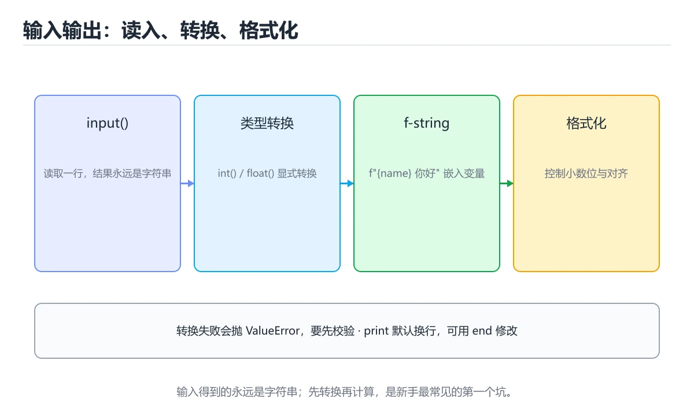

# Python 输入与输出

> 内容更新时间：2026-10-06 · 学习阶段：入门 · 预计用时：40 分钟




## 学习目标

- 先认识Python 输入与输出需要的工具、输入和输出。
- 按步骤运行最小示例，并记录结果与错误。
- 用一个边界输入验证自己是否真正掌握。

## 前置知识

- 会进行基本的文件或命令行操作。
- 不需要预先掌握「Python」的高级知识。

## 一句话入门

读取用户输入、转换类型并格式化输出。

## 最小示例

```python
name = input("名字：").strip() or "world"
print(f"hello, {name}")
```

## 预期输出

```text
（运行后输入 Ada）
名字：Ada
hello, Ada
```

## 常见错误与排查

> 说明：本表由《Python 输入与输出》的核心知识整理（2026-10-07），人工复核进度见 docs/content_review_batches.md。

| 易错点 | 容易踩的做法 | 正确结论 |
| --- | --- | --- |
| 忘记转换输入类型 | 字符串参与运算直接报错 | 转换类型并处理转换失败 |
| 格式化与类型不匹配 | 输出不是期望的结果 | 用格式化字符串明确类型与精度 |
| 输入空白与换行未处理 | 比较与转换意外失败 | 先去掉首尾空白，再按需分割 |

## 动手练习

1. 原样运行最小示例，保存命令和输出。
2. 把数字 2 改成 10，预测并验证新结果。
3. 制造一个错误输入，写出错误信息和修复方法。

## 本课小结

- 入门阶段先保证能运行、能观察、能解释，再追求复杂功能。
- 每次只改一个变量，记录预测与实际结果。
- 遇到错误先看第一条错误信息，再回到最小示例。

## 代码实验：把示例跑成证据

### 实验一：建立基线

```python
name = input("名字：").strip() or "world"
print(f"hello, {name}")
```

### 实验二：只改一个输入

沿用「Python 输入与输出」的最小示例做一次单变量实验：

| 实验 | 改动 | 预测 | 实际 | 结论 |
| --- | --- | --- | --- | --- |
| 基线 | 保持「Python 输入与输出」示例原样 |  |  |  |
| 边界 | 把Python 输入与输出换成空值或极值 |  |  |  |
| 失败 | 给Python传入非法输入 |  |  |  |

做完后用一句话写出「Python 输入与输出」的结论：输入怎么变，结果才怎么变。

### 实验三：制造一个可控错误

删掉 Python 相关的一处必要写法，观察错误在哪一层出现，再恢复代码确认基线仍然可运行。

| 实验 | 改动 | 预测 | 实际 | 结论 |
| --- | --- | --- | --- | --- |
| 基线 | 保持原样 |  |  |  |
| 边界 |  |  |  |  |
| 失败 |  |  |  |  |

### 实验四：用三句话复述

1. Python 输入与输出 的输入是什么，哪些取值合法，哪些属于边界或非法范围？
2. input 的执行顺序里，哪一步会写数据或产生外部副作用？
3. 输出如何验证，失败时第一条可观察证据是什么？

## Python 基础机制速览

### 解释器、模块与虚拟环境

Python 源码由解释器编译成字节码再执行，`.py` 文件可以直接运行或作为模块导入。`if __name__ == "__main__":` 用来区分“直接运行”和“被导入”，让模块既提供函数又保留命令行入口。虚拟环境隔离项目依赖，`requirements.txt`、`pyproject.toml` 和锁文件记录依赖版本；不要依赖全局环境中的隐式包。

### 动态类型、真值与对象模型

变量名只是对象的引用，类型属于对象而不是变量，因此同一个名字可以先后指向不同类型的对象。真值判断把空容器、0、空字符串和 None 视为假；需要区分 None 与空值时使用 `is None`。`is` 比较对象身份，`==` 比较值。整数、字符串和元组不可变，列表、字典和集合可变；可变对象作为默认参数会在多次调用间共享，应使用 None 作为占位再在函数内创建。

### 容器、切片与推导式

列表适合有序可变序列，元组适合固定结构，字典保存键值映射，集合用于去重和成员检查。切片 `start:stop:step` 产生新对象，负下标从末尾计数，越界切片通常不会报错但单个下标会抛 IndexError。推导式适合“从可迭代对象生成新容器”，但多层嵌套或带副作用的推导式会降低可读性，应改回普通循环。

### 函数、作用域与迭代

函数参数支持位置、关键字、默认值、`*args` 和 `**kwargs`，调用方要避免可变默认值陷阱。局部变量在函数内赋值后不会自动修改全局变量，需要 `global` 或 `nonlocal` 显式声明。生成器用 `yield` 惰性产生值，迭代器和 `itertools` 能处理大数据流。装饰器在不修改原函数签名的前提下增加日志、缓存、权限或重试逻辑。

### 异常、上下文管理与打包

异常用于表达无法正常继续的情况，使用 `try/except/else/finally` 精确包住可能失败的操作，避免捕获过宽。`with` 通过上下文管理器保证资源释放，文件、锁和数据库连接都应使用它。发布代码时要考虑包结构、入口点、类型标注、测试和性能分析；先用 profiler 找到瓶颈，再决定是优化算法、数据结构还是 I/O。

## 复习与自测

本课测验检验 input 的判断依据。请把每个错误选项改写成一句反例，
说明它在哪个输入、边界或前提变化下会失败。

### 完成标准

- [ ] 能用具体输入复现 Python 输入与输出 的最小示例，并逐行解释输入、处理与输出。
- [ ] 能说明 Python 在哪一个取值上开始失效。
- [ ] 能制造一个 Python 输入与输出 相关的可控错误，读出第一条错误信息并完成修复。
- [ ] 能说出 input 的两个常见误用，并各配一个检查方法。

### 复盘记录

| 项目 | 记录 |
| --- | --- |
| 学到的核心机制 |  |
| 仍然不确定的问题 |  |
| 下一步验证动作 |  |
下面按正文顺序回顾「Python 输入与输出」的每一节；说不清的地方回到 代码实验：把示例跑成证据 补课。

### 最小示例

```python
name = input("名字：").strip() or "world"
print(f"hello, {name}")
```

自检：这一节与相邻主题的边界在哪里？

### 预期输出

```text
（运行后输入 Ada）
名字：Ada
hello, Ada
```

### 常见错误

自检：把这一节讲给没学过的人，最需要强调哪一点？

### 动手练习

自检：如果去掉这一节里的一个前提，结论会怎样变化？

## 可运行练习

### 任务 1：先跑通，再解释

```python
total = 0
for i in range(1, 7):
    total += i
print(total)
```

### 任务 2：只改一个条件

把「Python 输入与输出」的最小示例复制一份，只改一个条件再跑一次：

- 改动点：把 Python 换成边界值，其他输入保持原样。
- 预测：先写下「Python 输入与输出」在改动后的输出或错误信息，再运行。
- 记录：对照改动前后的结果，指出差异出在哪一步。
- 验收：换回原条件能复现原结果，改动只影响Python 输入与输出。

### 任务 3：迁移到自己的数据

换一个 Python 场景重做一次，确认结论不是只对示例数据成立。

## 故障现场

### 现场 1：忘记转换输入类型

**症状**：在《Python 输入与输出》的复现场景中，字符串参与运算直接报错。

**根因**：触发点是把“忘记转换输入类型”当成安全做法。它没有满足《Python 输入与输出》要求的前提，因此先表现为“字符串参与运算直接报错”；排查时先完整复现这一段，再核对输入、配置与依赖。

**修复**：针对《Python 输入与输出》的问题，转换类型并处理转换失败。

**验证**：先在《Python 输入与输出》中记录“忘记转换输入类型”留下的失败证据，再执行“转换类型并处理转换失败”并重放；确认错误路径变为明确结果，且修复没有掩盖同类故障。

### 现场 2：格式化与类型不匹配

**症状**：在《Python 输入与输出》的复现场景中，输出不是期望的结果。

**根因**：“输出不是期望的结果”只是表层结果。向上追溯会落到“格式化与类型不匹配”这一步，因为它省略了《Python 输入与输出》的约束，使实现行为和预期模型发生了偏离。

**修复**：针对《Python 输入与输出》的问题，用格式化字符串明确类型与精度。

**验证**：保留《Python 输入与输出》里触发“输出不是期望的结果”的输入、版本和日志，按“用格式化字符串明确类型与精度”完成修改后原样重放；只有失败现象消失且相邻场景仍可解释，才保留改动。

### 现场 3：输入空白与换行未处理

**症状**：在《Python 输入与输出》的复现场景中，比较与转换意外失败。

**根因**：触发点是把“输入空白与换行未处理”当成安全做法。它没有满足《Python 输入与输出》要求的前提，因此先表现为“比较与转换意外失败”；排查时先完整复现这一段，再核对输入、配置与依赖。

**修复**：针对《Python 输入与输出》的问题，先去掉首尾空白，再按需分割。

**验证**：在《Python 输入与输出》中按“先去掉首尾空白，再按需分割”调整后，从“输入空白与换行未处理”的触发条件重放同一条路径，确认“比较与转换意外失败”不再出现，并补一个相邻边界用例检查没有引入新问题。

## 版本与时效

### 升级检查清单

- 先固定当前版本，跑通全部示例与测验，再升级工具链。
- 升级时只动一个依赖版本，用 input 记录构建与运行结果。
- 先回归 Python 输入与输出 与 Python 的默认行为和错误信息，再扩大测试范围。
- 升级完成后更新本课「最后复核 / 下次复核」日期，并记录 Python 输入与输出 的版本变化。

## 本课复习清单

离开本课前，逐项确认：

- [ ] 不看解析，能说出「input() 函数的返回值默认是什么类型？」的判断依据。
- [ ] 不看解析，能说出「f"hello, {name}" 这种写法的好处是？」的判断依据。
- [ ] 不看解析，能说出「示例运行后用户输入 Ada，控制台会看到什么？」的判断依据。
- [ ] 不看解析，能说出「填空：Python 输入与输出术语速查中，表示的判断依据。
- [ ] 用 Python 输入与输出 构造一个正常输入和一个边界输入，分别记录输出与判断依据。
- [ ] 把本课最容易混淆的两个概念写成一句话对照。

| 复盘项 | 记录 |
| --- | --- |
| 已经能独立解释的考点 |  |
| 仍然说不清的概念 |  |
| 下一步验证动作 |  |

## 术语速查

把「Python 输入与输出」里反复出现的术语集中放在一起。复习时先遮住右列，尝试用自己的话解释，再回到正文核对。

| 术语 | 一句话说明 |
| --- | --- |
| `input` | 从标准输入读入一行文本，返回值始终是字符串。 |
| `类型转换` | 用 int()、float() 把输入的字符串转成需要参与计算的数据类型。 |
| `标准输入输出` | 程序与终端交换数据的默认通道，对应 input 与 print。 |
| `格式化输出` | 控制小数位、宽度与对齐，让结果更易读。 |
| `虚拟环境` | 虚拟环境隔离项目依赖，requirements.txt、pyproject.toml 和锁文件记录依赖版本；不要依赖全局环境中的隐式包 |
| `真值` | 真值判断把空容器、0、空字符串和 None 视为假；需要区分 None 与空值时使用 is None |

## 考点精讲

### 考点 1：概念判断·Python 输入与输出

- **题目**：input 函数的返回值默认是什么类型？
- **判断依据**：在「Python 输入与输出」里，字符串 str，需要手动转换成数字才能参与算术。input 读取一行文本并去掉末尾换行，返回的始终是 str。“input”与「Python 输入与输出」的术语表相呼应，只有符合Python 输入与输出、Python、入门练习约束的“字符串 str”才是正文支持的结论。

### 考点 2：概念判断·Python 输入与输出

- **题目**：在 name = input("名字：").strip or "world" 中，strip 的作用是？
- **判断依据**：在「Python 输入与输出」里，去掉输入首尾的空白字符，避免误判为空输入。strip 返回去掉首尾空白后的新字符串，用户只敲了空格时结果会变成空串，随后 or 会返回默认值 world。回到「Python 输入与输出」的正文示例，用“在 name = input("名字”走一遍Python 输入与输出、Python、入门练习的完整流程，能复现的结论才可以保留。

### 考点 3：多选辨析·Python 输入与输出

- **题目**：围绕“Python 输入与输出”中的 Python 输入与输出、Python、入门练习，下列哪两项是本课强调的实践判断？
- **判断依据**：题干的正确项是学习 Python 输入与输出 时要同时说明输入、输出和失败路径，不能只看正常流程；在「Python 输入与输出」里，验证 Python 时要固定版本并覆盖边界输入，结论才可复现。回到「Python 输入与输出」的正文示例，用“围绕Python 输入与输出中的 P”走一遍Python 输入与输出、Python、入门练习的完整流程，能复现的结论才可以保留。

### 考点 4：代码补全·Python 输入与输出

- **题目**：阅读「Python 输入与输出」正文里的这段 Python 代码，下面哪一项判断是正确的？
- **判断依据**：在「Python 输入与输出」里，题干的正确项是这段代码会产生可观察的输出，运行后能看到结果，在「Python 输入与输出」里要结合Python 输入与输出核对输出是否符合预期。这段代码出自「Python 输入与输出」的正文示例，围绕Python 输入与输出、Python、入门练习展开；把输入或边界换成空值、极值或失败情况后，结论要以「Python 输入与输出」的实际运行结果为准。判断这道题时，要把Python 输入与输出、Python、入门练习的条件、过程与失败路径逐项对齐，换成“阅读Python”这个场景，只有满足前提的结论才成立。

### 考点 5：填空·____

- **题目**：填空：在「Python 输入与输出」的术语速查里，「Python 源码由解释器编译成字节码再执行，`____` 文件可以直接运行或作为模块导入。`if __name__ == "__main__":` 用来区分“直接运行”和“被导入”，让模块既提供函数又保留命令行入口。虚拟环境隔离项目依赖，`」描述的是哪个术语？
- **判断依据**：空格应填写「.py」。if name == "main": 用来区分“直接运行”和“被导入”，让模块既提供函数又保留命令行入口。回到「Python 输入与输出」的正文示例，用“填空”走一遍Python 输入与输出、Python、入门练习的完整流程，能复现的结论才可以保留。

## English Overview

**Title:** Python Input and Output

**Summary:** Read input, convert types and format output.

**Category:** Python
**Level:** 入门
**Key terms:** Python 输入与输出, Python, 入门练习

## 内容元数据

- 内容版本：v2.0
- 最后更新：2026-10-06
- 学习阶段：入门
- 适用环境：Python 3.12+；本课聚焦 Python 输入与输出。
- 内容来源：内置结构化课程与工程实践整理
- 相关主题：Python 输入与输出、Python、入门练习
- 质量版本：P0 测验标准 + P1 覆盖扩展 + P2 体验补全

## 参考资料与复核

- 最后复核：2026-10-04
- 下次复核：2027-04-24
- 复核范围：版本兼容、API 行为、安全建议与工程实践
- 来源性质：官方文档、标准或权威教材；正文为离线教学重组

| 参考资料 | 本课用途 |
| --- | --- |
| [Python 语言参考](https://docs.python.org/3/reference/) | 语言语义与数据模型 |
| [typing 文档](https://docs.python.org/3/library/typing.html) | 类型标注与泛型 |
| [Python 性能分析](https://docs.python.org/3/library/profile.html) | cProfile 与性能分析 |

> 「Python 输入与输出」的链接用于离线阅读后的延伸核对；App 不会自动联网。

## 复习与迁移

复习目标：把「Python 输入与输出」的判断标准放回可复现的例子里。先自己作答，再对照依据；如果结论正确但理由不完整，回到正文补足前提。

### 概念复述

- 用一句话说明「Python 输入与输出」解决什么问题：读取用户输入、转换类型并格式化输出。
- 写出Python 输入与输出、Python、入门练习之间的关系，并各举一个例子。
- 说出本课最容易混淆的两个概念，以及区分它们的判据。

### 正文逐节复核

- **Python 基础机制速览**：Python 源码由解释器编译成字节码再执行，`.py` 文件可以直接运行或作为模块导入。

### 测验回顾

1. input 函数的返回值默认是什么类型？
   - 依据：在「Python 输入与输出」里，字符串 str，需要手动转换成数字才能参与算术。input 读取一行文本并去掉末尾换行，返回的始终是 str。“input”与「Python 输入与输出」的术语表相呼应，只有符合Python 输入与输出、Python、入门练习约束的“字符串 str”才是正文支持的结论。
2. 在 name = input("名字：").strip or "world" 中，strip 的作用是？
   - 依据：在「Python 输入与输出」里，去掉输入首尾的空白字符，避免误判为空输入。strip 返回去掉首尾空白后的新字符串，用户只敲了空格时结果会变成空串，随后 or 会返回默认值 world。回到「Python 输入与输出」的正文示例，用“在 name = input("名字”走一遍Python 输入与输出、Python、入门练习的完整流程，能复现的结论才可以保留。
3. 围绕“Python 输入与输出”中的 Python 输入与输出、Python、入门练习，下列哪两项是本课强调的实践判断？
   - 依据：题干的正确项是学习 Python 输入与输出 时要同时说明输入、输出和失败路径，不能只看正常流程；在「Python 输入与输出」里，验证 Python 时要固定版本并覆盖边界输入，结论才可复现。回到「Python 输入与输出」的正文示例，用“围绕Python 输入与输出中的 P”走一遍Python 输入与输出、Python、入门练习的完整流程，能复现的结论才可以保留。
4. 阅读「Python 输入与输出」正文里的这段 Python 代码，下面哪一项判断是正确的？
   - 依据：在「Python 输入与输出」里，题干的正确项是这段代码会产生可观察的输出，运行后能看到结果，在「Python 输入与输出」里要结合Python 输入与输出核对输出是否符合预期。这段代码出自「Python 输入与输出」的正文示例，围绕Python 输入与输出、Python、入门练习展开；把输入或边界换成空值、极值或失败情况后，结论要以「Python 输入与输出」的实际运行结果为准。判断这道题时，要把Python 输入与输出、Python、入门练习的条件、过程与失败路径逐项对齐，换成“阅读Python”这个场景，只有满足前提的结论才成立。
5. 填空：在「Python 输入与输出」的术语速查里，「Python 源码由解释器编译成字节码再执行，`____` 文件可以直接运行或作为模块导入。`if __name__ == "__main__":` 用来区分“直接运行”和“被导入”，让模块既提供函数又保留命令行入口。虚拟环境隔离项目依赖，`」描述的是哪个术语？
   - 依据：空格应填写「.py」。if name == "main": 用来区分“直接运行”和“被导入”，让模块既提供函数又保留命令行入口。回到「Python 输入与输出」的正文示例，用“填空”走一遍Python 输入与输出、Python、入门练习的完整流程，能复现的结论才可以保留。

### 迁移练习

把「Python 输入与输出」的结论迁移到相邻主题，每次迁移都写清预测与证据：

1. 换输入：用Python 输入与输出处理一组你自己的数据，对比教材示例的结果差异。
2. 换失败条件：制造一个Python相关的错误，说明如何从错误信息定位根因。
3. 换规模：把数据量或并发度提高一个数量级，说明「Python 输入与输出」的结论是否仍成立。

## 工程化精练：决策、失败与验证

这一章把「Python 输入与输出」从“看懂”推进到“能判断、能验证、能排错”。所有判断都围绕Python 输入与输出、Python与入门练习展开，并与前文的示例、测验和失败现场互相对照。

### 一、Python 输入与输出 的判断算法

| 步骤 | 要回答的问题 | 判断依据 | 记录什么 |
| --- | --- | --- | --- |
| 1. 定目标 | 「Python 输入与输出」这一步要解决什么问题？ | 把Python 输入与输出的目标写成一句可验证的结论 | 输入、约束、成功标准 |
| 2. 找边界 | Python在什么条件下失效？ | 先列空值、极值、重复和失败路径 | 反例与触发条件 |
| 3. 跑基线 | 原始示例的真实输出是什么？ | 命令、版本和环境必须可复现 | 命令、输出、耗时 |
| 4. 只改一处 | 把入门练习换成另一种取值会怎样？ | 预测写在运行之前 | 预测与实际的差异 |
| 5. 回写结论 | 结论能否被他人复现？ | 把判断写成清单或测试 | 结论、证据、遗留问题 |

这张表的用法不是从上到下浏览，而是每次只填一行：先用「Python 输入与输出」前文的示例验证第 3 行，再故意破坏一个条件验证第 2 行。当你能在不看解析的情况下说出Python 输入与输出的判断依据，才算真正掌握本课。

- 先从Python 输入与输出入手：把它写成“输入是什么、输出是什么、哪一步最容易出错”。如果这三句话中有一句说不清，说明对「Python 输入与输出」的理解还停留在术语层面，需要回到正文的最小示例重新观察一次。

- 再把Python当成对照实验的变量：固定其他条件，只改变它的取值，记录输出是否变化。结论“变”或“不变”都要写出理由，并说明这个理由能否被他人独立复现。

- 针对入门练习做一次失败演练：故意给出空值、极值或错误类型，观察「Python 输入与输出」的报错位置和处理方式。错误信息只是入口，真正要定位的是哪一层假设被破坏。

- 把「Python 输入与输出」的结论压缩成一条可执行清单：先检查输入，再检查版本与环境，然后跑最小用例，最后才扩大规模。顺序颠倒会让排错范围成倍增加。

- 如果结论依赖时间或规模，就把数据量提高一个数量级再跑一次。在「Python 输入与输出」里，小样本成立不代表大样本成立，复杂度、资源占用和失败率都要重新记录。

- 如果结论依赖并发或共享状态，就固定输入并连续运行多次。结果不一致时，优先怀疑「Python 输入与输出」中Python 输入与输出相关步骤的隐藏状态，而不是先改代码。

- 把「Python 输入与输出」的判断写成测试：一个正常用例、一个边界用例、一个失败用例。测试通过只是起点，还要确认失败用例确实以预期方式失败。

- 把本课与相邻主题连起来：Python 输入与输出解决的是“怎么做”，Python回答“什么时候不适用”。两者都答得出来，迁移才算完成。

> 第 2 轮复核「Python 输入与输出」：把上面的结论逐条改写为可验证的问题，并记录仍不确定的部分。

- 先从Python 输入与输出入手：把它写成“输入是什么、输出是什么、哪一步最容易出错”。如果这三句话中有一句说不清，说明对「Python 输入与输出」的理解还停留在术语层面，需要回到正文的最小示例重新观察一次。

- 再把Python当成对照实验的变量：固定其他条件，只改变它的取值，记录输出是否变化。结论“变”或“不变”都要写出理由，并说明这个理由能否被他人独立复现。

- 针对入门练习做一次失败演练：故意给出空值、极值或错误类型，观察「Python 输入与输出」的报错位置和处理方式。错误信息只是入口，真正要定位的是哪一层假设被破坏。

- 把「Python 输入与输出」的结论压缩成一条可执行清单：先检查输入，再检查版本与环境，然后跑最小用例，最后才扩大规模。顺序颠倒会让排错范围成倍增加。

- 如果结论依赖时间或规模，就把数据量提高一个数量级再跑一次。在「Python 输入与输出」里，小样本成立不代表大样本成立，复杂度、资源占用和失败率都要重新记录。

- 如果结论依赖并发或共享状态，就固定输入并连续运行多次。结果不一致时，优先怀疑「Python 输入与输出」中Python 输入与输出相关步骤的隐藏状态，而不是先改代码。

- 把「Python 输入与输出」的判断写成测试：一个正常用例、一个边界用例、一个失败用例。测试通过只是起点，还要确认失败用例确实以预期方式失败。

- 把本课与相邻主题连起来：Python 输入与输出解决的是“怎么做”，Python回答“什么时候不适用”。两者都答得出来，迁移才算完成。

> 第 3 轮复核「Python 输入与输出」：把上面的结论逐条改写为可验证的问题，并记录仍不确定的部分。

- 先从Python 输入与输出入手：把它写成“输入是什么、输出是什么、哪一步最容易出错”。如果这三句话中有一句说不清，说明对「Python 输入与输出」的理解还停留在术语层面，需要回到正文的最小示例重新观察一次。

- 再把Python当成对照实验的变量：固定其他条件，只改变它的取值，记录输出是否变化。结论“变”或“不变”都要写出理由，并说明这个理由能否被他人独立复现。

- 针对入门练习做一次失败演练：故意给出空值、极值或错误类型，观察「Python 输入与输出」的报错位置和处理方式。错误信息只是入口，真正要定位的是哪一层假设被破坏。

- 把「Python 输入与输出」的结论压缩成一条可执行清单：先检查输入，再检查版本与环境，然后跑最小用例，最后才扩大规模。顺序颠倒会让排错范围成倍增加。

- 如果结论依赖时间或规模，就把数据量提高一个数量级再跑一次。在「Python 输入与输出」里，小样本成立不代表大样本成立，复杂度、资源占用和失败率都要重新记录。

- 如果结论依赖并发或共享状态，就固定输入并连续运行多次。结果不一致时，优先怀疑「Python 输入与输出」中Python 输入与输出相关步骤的隐藏状态，而不是先改代码。

- 把「Python 输入与输出」的判断写成测试：一个正常用例、一个边界用例、一个失败用例。测试通过只是起点，还要确认失败用例确实以预期方式失败。

- 把本课与相邻主题连起来：Python 输入与输出解决的是“怎么做”，Python回答“什么时候不适用”。两者都答得出来，迁移才算完成。

### 二、Python 输入与输出 的机制拆解与自测

把本课考点还原成可回答的问题，再逐题写出依据：

**问题 1**：input 函数的返回值默认是什么类型？

- 关联术语：Python 输入与输出
- 判断依据：字符串 str，需要手动转换成数字才能参与算术
- 追问：如果把Python 输入与输出的条件换成边界值，这个结论是否仍然成立？

**问题 2**：在 name = input("名字：").strip or "world" 中，strip 的作用是？

- 关联术语：Python
- 判断依据：去掉输入首尾的空白字符，避免误判为空输入
- 追问：如果把Python的条件换成边界值，这个结论是否仍然成立？

**问题 3**：围绕“Python 输入与输出”中的 Python 输入与输出、Python、入门练习，下列哪两项是本课强调的实践判断？

- 关联术语：入门练习
- 判断依据：学习 Python 输入与输出 时要同时说明输入、输出和失败路径，不能只看正常流程
- 追问：Python 的条件变化到什么程度时，需要换一种做法？

**问题 4**：阅读「Python 输入与输出」正文里的这段 Python 代码，下面哪一项判断是正确的？

- 关联术语：Python 输入与输出
- 判断依据：回到「Python 输入与输出」正文对应小节，先用最小示例验证再下结论。
- 追问：如果把Python 输入与输出的条件换成边界值，这个结论是否仍然成立？

**问题 5**：填空：在「Python 输入与输出」的术语速查里，「Python 源码由解释器编译成字节码再执行，`____` 文件可以直接运行或作为模块导入。`if __name__ == "__main__":` 用来区分“直接运行”和“被导入”，让模块既提供函数又保留命令行入口。虚拟环境隔离项目依赖，`」描述的是哪个术语？

- 关联术语：Python
- 判断依据：回到「Python 输入与输出」正文对应小节，先用最小示例验证再下结论。
- 追问：如果把Python的条件换成边界值，这个结论是否仍然成立？

### 三、失败模式与修复顺序

| 失败信号 | 常见根因 | 先做什么 | 修复后如何确认 |
| --- | --- | --- | --- |
| 「Python 输入与输出」中 Python 输入与输出 相关步骤报错 | 输入、版本或前置条件与示例不一致 | 保留第一条错误信息，回到最小输入 | 用字符串 str，需要手动转换成数字才能参与算术复跑，确认输出可复现 |
| 「Python 输入与输出」中 Python 相关步骤报错 | 输入、版本或前置条件与示例不一致 | 保留第一条错误信息，回到最小输入 | 用去掉输入首尾的空白字符，避免误判为空输入复跑，确认输出可复现 |
| 「Python 输入与输出」中 入门练习 相关步骤报错 | 输入、版本或前置条件与示例不一致 | 保留第一条错误信息，回到最小输入 | 用学习 Python 输入与输出 时要同时说明输入、输出和失败路径，不能只看正常流程复跑，确认输出可复现 |
- 检查点：固定版本与输入重跑《Python 输入与输出》，记录两次差异并定位不稳定条件。
| 单次结果正确但规模一大就失效 | 只测了正常路径，没有覆盖边界 | 把数据量或并发度提高一个数量级 | 记录边界值、耗时与失败率 |

排错顺序固定为：先复现，再缩小输入，然后只改一个条件，最后把结论写成回归用例。对「Python 输入与输出」来说，任何不能复现的“修好了”都不算完成。

### 四、离开本课前的验证清单

| 检查项 | 通过标准 | 证据 |
| --- | --- | --- |
| 能复述 | 用三句话说明「Python 输入与输出」解决什么问题、边界在哪 | 不看解析写出的结论 |
| 能运行 | 最小示例在本机跑通 | 命令、输出与版本 |
| 能改条件 | 只改一个输入并解释差异 | 预测与实际的对照 |
| 能排错 | 至少制造并修复一个失败 | 错误信息与修复步骤 |
| 能迁移 | 把Python 输入与输出、Python、入门练习用到新场景 | 一个自选练习的结论 |

完成标准：能不看解析说清「Python 输入与输出」全部自测题的依据，并且至少有一条Python 输入与输出相关的结论经过真实运行验证。如果某一步只停留在“感觉懂了”，就把它写成下一轮针对「Python 输入与输出」的最小验证任务。

### 五、把结论写成可检查的证据

学习「Python 输入与输出」时，最容易出现的情况是“听过、看懂了，但换一个输入就说不清”。下面把Python 输入与输出与Python放进一条可检查的证据链：每一句结论都要能回答“从哪里来、在什么条件下成立、失败时怎么发现”。

| 证据类型 | 本课要求 | 不合格的表现 |
| --- | --- | --- |
| 概念证据 | 用一句话说明Python 输入与输出的定义与适用场景 | 只背术语，说不出它解决什么问题 |
| 运行证据 | 能复现「Python 输入与输出」的最小示例 | 输出与记录对不上，或换机器就不一致 |
| 对照证据 | 只改一个条件，说明差异来自哪里 | 一次改多个变量，无法归因 |
| 失败证据 | 故意制造错误并记录恢复步骤 | 只测正常路径，失败时靠猜 |
| 迁移证据 | 把Python用到自选场景 | 换一个例子就完全套不上 |

举例：字符串 str，需要手动转换成数字才能参与算术。把这个结论代回「Python 输入与输出」的正文，找出它对应的输入、处理步骤与输出；再换掉其中一个条件，观察结论是否仍然成立。能完成这一步，才说明这条知识已经从“记忆”变成“可用的判断”。

最后留一个自检问题：如果只能保留三条笔记，你会写下哪三句？把答案限定为「Python 输入与输出」中的可验证结论，并给每条结论配一个反例。这三句加上对应反例，就是本课最值得带入后续课程的复习材料。

<!-- language-intro-deep-dive:start -->

## 零基础通俗讲：Python 输入与输出

### 一句话说清它是什么

input() 负责把用户在键盘上敲的内容读进程序，而且读回来的一定是字符串；想参与计算就要先用 int() 或 float() 转换类型。

### 用生活比喻理解

把 input() 想成餐厅点单：服务员把客人说的话原样记在纸上交给你，纸条上写的是「3」，但那是一段文字，不是数字三；想拿这三个菜去结账，你得先把纸条上的内容翻译成真正的数量。

### 完整可运行代码

```python
name = input("请输入你的名字：")
age_text = input("请输入你的年龄：")

# input 拿回来的永远是文字，要算数就得先转成整数
age = int(age_text)
next_year = age + 1

print(f"{name}，你明年 {next_year} 岁")
```

### 逐行拆开看

- `input("请输入你的名字：")` 先把提示语打印出来，然后暂停程序，等用户敲完回车，再把输入内容作为字符串返回并存入 `name`。
- 第二行同样读入年龄，但此时 `age_text` 的类型是字符串。哪怕用户输入 `18`，程序拿到的也是「由 1 和 8 两个字符组成的文本」。
- `int(age_text)` 把字符串翻译成整数，赋给 `age`；如果用户输入了 `十八` 或 `18岁`，这一步会立刻抛出 `ValueError`。
- `age + 1` 此时做的是整数加法，得到 19。
- 最后一行是 f-string：字符串前面的 `f` 表示里面 `{}` 包起来的表达式会被替换成实际的值。


### 把程序跑一遍

- 程序执行到第一个 `input` 时停住，屏幕显示提示语并等待键盘输入。假设输入 `小明`。
- 第二个 `input` 收到 `18` 这个字符串，`int` 把它变成整数 18。
- `next_year` 计算得到 19。
- `print` 把占位符 `{name}` 换成 `小明`、`{next_year}` 换成 `19`，输出「小明，你明年 19 岁」。


### 新手最容易踩的坑

- 直接写 `age + 1` 而不转换：会看到 `TypeError: can only concatenate str` 这类错误，因为字符串不能和整数相加。
- 把数字提示写成 `input(18)`：`input` 的参数必须是字符串，写数字会报 `TypeError`。
- 忘记处理非法输入：用户输入空行或乱码时 `int()` 直接崩溃，正式程序要配合 `try/except`。
- 用 `+` 拼接数字时会报错，正确写法是 f-string，例如 `f"明年 {next_year} 岁"`。
- 把 `print` 写进 `input` 里造成重复输出，例如 `input(print("提示"))`，先打印再读取，提示语会跑两遍。


### 动手练一练

- 运行原程序，分别输入 `18`、`18.5`、`十八`，记录三次结果有什么不同。
- 把 `int` 换成 `float`，再输入 `18.5`，观察程序是否能正常算下去。
- 增加一行，询问用户所在城市，并把它拼进最后的输出里。


### 本课速查卡

把下面八行抄进自己的笔记，复习时只看这一页就能回忆整课：

| 复习项 | 本课要点 |
| --- | --- |
| 核心结论 | input() 负责把用户在键盘上敲的内容读进程序，而且读回来的一定是字符串；想参与计算就要先用 int() 或 float() 转换类型。 |
| 最少要写的代码 | `name = input("请输入你的名字：")` |
| 正确做法 | 程序执行到第一个 `input` 时停住，屏幕显示提示语并等待键盘输入。假设输入 `小明`。 |
| 最常见的错误 | 直接写 `age + 1` 而不转换：会看到 `TypeError: can only concatenate str` 这类错误，因为字符串不能和整数相加。 |
| 出错先查什么 | 先读第一条报错信息，再回到最小示例只改一个地方 |
| 怎么确认学会了 | 运行原程序，分别输入 `18`、`18.5`、`十八`，记录三次结果有什么不同。 |
| 和别的知识点的关系 | 本课打下的语法与思维方式会被后面每一课反复用到 |
| 接下来做什么 | 合上教程，凭记忆把上面的最小代码重写一遍再运行 |
