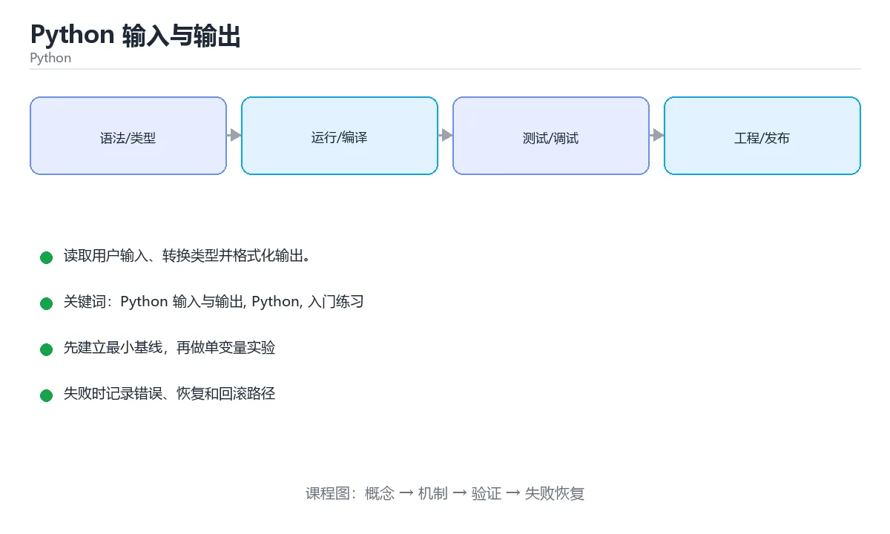

# Python 输入与输出



> 内容更新时间：2026-10-03 · 学习阶段：入门 · 预计用时：15 分钟

## 学习目标

- 先认识「Python 输入与输出」需要的工具、输入和输出。
- 按步骤运行最小示例，并记录结果与错误。
- 用一个边界输入验证自己是否真正掌握。

## 前置知识

- 会进行基本的文件或命令行操作。
- 不需要预先掌握「Python」的高级知识。

## 一句话入门

读取用户输入、转换类型并格式化输出。

## 最小示例

```python
value = 2 + 3
print(f"result={value}")
```

## 预期输出

```text
result=5
```

## 常见错误

- 忘记转换 input() 返回的字符串，直接参与算术会抛 TypeError。
- 复制命令时遗漏空格、引号或必要参数。

## 动手练习

1. 原样运行最小示例，保存命令和输出。
2. 把数字 2 改成 10，预测并验证新结果。
3. 制造一个错误输入，写出错误信息和修复方法。

## 本课小结

- 入门阶段先保证能运行、能观察、能解释，再追求复杂功能。
- 每次只改一个变量，记录预测与实际结果。
- 遇到错误先看第一条错误信息，再回到最小示例。

<!-- p2-enrichment:v1 -->

## English Overview

**Title:** Python Input and Output

**Summary:** Read input, convert types and format output.

**Category:** Python  
**Level:** 入门  
**Key terms:** Python 输入与输出, Python, 入门练习

> The full tutorial is written in Chinese. This bilingual overview helps English readers identify the topic, scope and key terms before studying the detailed examples.

## 内容元数据

- 内容版本：v2.0
- 最后更新：2026-10-03
- 学习阶段：入门
- 适用环境：Python 3.12+
- 内容来源：内置结构化课程与工程实践整理
- 相关主题：Python 输入与输出、Python、入门练习
- 质量版本：P0 测验标准 + P1 覆盖扩展 + P2 体验补全

<!-- top50-rewrite:v1 -->

## 课程专属精读：Python 输入与输出

### 一、知识地图

- **一句话入门**：读取用户输入、转换类型并格式化输出。
- **最小示例**：value = 2 + 3
- **常见错误**：1. 原样运行最小示例，保存命令和输出。
- **适用边界**：说明「Python 输入与输出」在哪些输入、规模和环境下适用，什么时候应该换方案。
- **常见错误**：记录一个最容易犯的错误、错误信息和修复方式。
- **测试与验证**：用正常、边界、失败和恢复四类路径验证结果。

### 二、机制与验证

| 主题 | 需要回答的问题 | 验证方式 |
| --- | --- | --- |
| 一句话入门 | 它解决什么问题，输入和输出是什么？ | 最小示例、边界输入、日志或指标 |
| 最小示例 | 它解决什么问题，输入和输出是什么？ | 最小示例、边界输入、日志或指标 |
| 常见错误 | 它解决什么问题，输入和输出是什么？ | 最小示例、边界输入、日志或指标 |
| 适用边界 | 它解决什么问题，输入和输出是什么？ | 最小示例、边界输入、日志或指标 |
| 常见错误 | 它解决什么问题，输入和输出是什么？ | 最小示例、边界输入、日志或指标 |
| 测试与验证 | 它解决什么问题，输入和输出是什么？ | 最小示例、边界输入、日志或指标 |

### 三、专属检查问题

1. 一句话入门 与相邻主题的边界是什么？
2. 最小示例 与相邻主题的边界是什么？
3. 常见错误 与相邻主题的边界是什么？
4. 适用边界 与相邻主题的边界是什么？
5. 常见错误 与相邻主题的边界是什么？
6. 测试与验证 与相邻主题的边界是什么？

### 四、故障排查

1. 固定输入和环境，确认问题能复现。
2. 找到第一个异常状态，不从最终错误倒猜。
3. 只改变一个变量，记录预测和真实结果。
4. 修复后补边界、失败和重复执行测试。

## 专属复习题库

**问：一句话入门 的关键点是什么？**

答：读取用户输入、转换类型并格式化输出。 复习时要能用自己的话复述，并给出一个失败场景。

**问：最小示例 的关键点是什么？**

答：value = 2 + 3 复习时要能用自己的话复述，并给出一个失败场景。

**问：常见错误 的关键点是什么？**

答：1. 原样运行最小示例，保存命令和输出。 复习时要能用自己的话复述，并给出一个失败场景。

**问：适用边界 的关键点是什么？**

答：说明「Python 输入与输出」在哪些输入、规模和环境下适用，什么时候应该换方案。 复习时要能用自己的话复述，并给出一个失败场景。

**问：常见错误 的关键点是什么？**

答：记录一个最容易犯的错误、错误信息和修复方式。 复习时要能用自己的话复述，并给出一个失败场景。

**问：测试与验证 的关键点是什么？**

答：用正常、边界、失败和恢复四类路径验证结果。 复习时要能用自己的话复述，并给出一个失败场景。

## 逐步练习：Python 输入与输出

### 练习 1：一句话入门

先复述：读取用户输入、转换类型并格式化输出。

再完成：运行最小示例 → 改变一个输入 → 记录差异 → 补一条测试。

### 练习 2：最小示例

先复述：value = 2 + 3

再完成：运行最小示例 → 改变一个输入 → 记录差异 → 补一条测试。

### 练习 3：常见错误

先复述：1. 原样运行最小示例，保存命令和输出。

再完成：运行最小示例 → 改变一个输入 → 记录差异 → 补一条测试。

### 练习 4：适用边界

先复述：说明「Python 输入与输出」在哪些输入、规模和环境下适用，什么时候应该换方案。

再完成：运行最小示例 → 改变一个输入 → 记录差异 → 补一条测试。

### 练习 5：常见错误

先复述：记录一个最容易犯的错误、错误信息和修复方式。

再完成：运行最小示例 → 改变一个输入 → 记录差异 → 补一条测试。

### 练习 6：测试与验证

先复述：用正常、边界、失败和恢复四类路径验证结果。

再完成：运行最小示例 → 改变一个输入 → 记录差异 → 补一条测试。

## 故障排查手册：Python 输入与输出

| 现象 | 优先检查 | 修复动作 |
| --- | --- | --- |
| 一句话入门 的结果与预期不符 | 输入、环境、依赖版本、日志第一条错误 | 固定最小复现，只改一个变量并回归 |
| 最小示例 的结果与预期不符 | 输入、环境、依赖版本、日志第一条错误 | 固定最小复现，只改一个变量并回归 |
| 常见错误 的结果与预期不符 | 输入、环境、依赖版本、日志第一条错误 | 固定最小复现，只改一个变量并回归 |
| 适用边界 的结果与预期不符 | 输入、环境、依赖版本、日志第一条错误 | 固定最小复现，只改一个变量并回归 |
| 常见错误 的结果与预期不符 | 输入、环境、依赖版本、日志第一条错误 | 固定最小复现，只改一个变量并回归 |
| 测试与验证 的结果与预期不符 | 输入、环境、依赖版本、日志第一条错误 | 固定最小复现，只改一个变量并回归 |

> 排查原则：先复现，再定位第一个异常状态，最后用边界和失败测试证明修复有效。

## 自测与面试：Python 输入与输出

**问：一句话入门 在实际项目中如何使用？**

答：先说明目标和边界，再给出最小实现、验证方式和失败恢复方案。

**问：最小示例 在实际项目中如何使用？**

答：先说明目标和边界，再给出最小实现、验证方式和失败恢复方案。

**问：常见错误 在实际项目中如何使用？**

答：先说明目标和边界，再给出最小实现、验证方式和失败恢复方案。

**问：适用边界 在实际项目中如何使用？**

答：先说明目标和边界，再给出最小实现、验证方式和失败恢复方案。

**问：常见错误 在实际项目中如何使用？**

答：先说明目标和边界，再给出最小实现、验证方式和失败恢复方案。

**问：测试与验证 在实际项目中如何使用？**

答：先说明目标和边界，再给出最小实现、验证方式和失败恢复方案。

## 专属进阶任务 5：Python 输入与输出

- 围绕「一句话入门」完成一个可复现实验，记录输入、输出、指标和失败恢复。
- 围绕「最小示例」完成一个可复现实验，记录输入、输出、指标和失败恢复。
- 围绕「常见错误」完成一个可复现实验，记录输入、输出、指标和失败恢复。
- 围绕「适用边界」完成一个可复现实验，记录输入、输出、指标和失败恢复。
- 围绕「常见错误」完成一个可复现实验，记录输入、输出、指标和失败恢复。
- 围绕「测试与验证」完成一个可复现实验，记录输入、输出、指标和失败恢复。

### 验收标准

- [ ] 能复现正文中的最小示例。
- [ ] 能解释该主题的正常、边界和失败路径。
- [ ] 能用测试、日志或指标证明结果。
- [ ] 能把结论放回「python_input_output」所属的学习路径。

<!-- top50-rewrite:v1 -->

## 课程专属精读：Python 输入与输出

### 一、知识地图

- **一句话入门**：读取用户输入、转换类型并格式化输出。
- **最小示例**：value = 2 + 3
- **常见错误**：1. 原样运行最小示例，保存命令和输出。
- **适用边界**：说明「Python 输入与输出」在哪些输入、规模和环境下适用，什么时候应该换方案。
- **常见错误**：记录一个最容易犯的错误、错误信息和修复方式。
- **测试与验证**：用正常、边界、失败和恢复四类路径验证结果。

### 二、机制与验证

| 主题 | 需要回答的问题 | 验证方式 |
| --- | --- | --- |
| 一句话入门 | 它解决什么问题，输入和输出是什么？ | 最小示例、边界输入、日志或指标 |
| 最小示例 | 它解决什么问题，输入和输出是什么？ | 最小示例、边界输入、日志或指标 |
| 常见错误 | 它解决什么问题，输入和输出是什么？ | 最小示例、边界输入、日志或指标 |
| 适用边界 | 它解决什么问题，输入和输出是什么？ | 最小示例、边界输入、日志或指标 |
| 常见错误 | 它解决什么问题，输入和输出是什么？ | 最小示例、边界输入、日志或指标 |
| 测试与验证 | 它解决什么问题，输入和输出是什么？ | 最小示例、边界输入、日志或指标 |

### 三、专属检查问题

1. 一句话入门 与相邻主题的边界是什么？
2. 最小示例 与相邻主题的边界是什么？
3. 常见错误 与相邻主题的边界是什么？
4. 适用边界 与相邻主题的边界是什么？
5. 常见错误 与相邻主题的边界是什么？
6. 测试与验证 与相邻主题的边界是什么？

### 四、故障排查

1. 固定输入和环境，确认问题能复现。
2. 找到第一个异常状态，不从最终错误倒猜。
3. 只改变一个变量，记录预测和真实结果。
4. 修复后补边界、失败和重复执行测试。

## 专属复习题库

**问：一句话入门 的关键点是什么？**

答：读取用户输入、转换类型并格式化输出。 复习时要能用自己的话复述，并给出一个失败场景。

**问：最小示例 的关键点是什么？**

答：value = 2 + 3 复习时要能用自己的话复述，并给出一个失败场景。

**问：常见错误 的关键点是什么？**

答：1. 原样运行最小示例，保存命令和输出。 复习时要能用自己的话复述，并给出一个失败场景。

**问：适用边界 的关键点是什么？**

答：说明「Python 输入与输出」在哪些输入、规模和环境下适用，什么时候应该换方案。 复习时要能用自己的话复述，并给出一个失败场景。

**问：常见错误 的关键点是什么？**

答：记录一个最容易犯的错误、错误信息和修复方式。 复习时要能用自己的话复述，并给出一个失败场景。

**问：测试与验证 的关键点是什么？**

答：用正常、边界、失败和恢复四类路径验证结果。 复习时要能用自己的话复述，并给出一个失败场景。

## 逐步练习：Python 输入与输出

### 练习 1：一句话入门

先复述：读取用户输入、转换类型并格式化输出。

再完成：运行最小示例 → 改变一个输入 → 记录差异 → 补一条测试。

### 练习 2：最小示例

先复述：value = 2 + 3

再完成：运行最小示例 → 改变一个输入 → 记录差异 → 补一条测试。

### 练习 3：常见错误

先复述：1. 原样运行最小示例，保存命令和输出。

再完成：运行最小示例 → 改变一个输入 → 记录差异 → 补一条测试。

### 练习 4：适用边界

先复述：说明「Python 输入与输出」在哪些输入、规模和环境下适用，什么时候应该换方案。

再完成：运行最小示例 → 改变一个输入 → 记录差异 → 补一条测试。

### 练习 5：常见错误

先复述：记录一个最容易犯的错误、错误信息和修复方式。

再完成：运行最小示例 → 改变一个输入 → 记录差异 → 补一条测试。

### 练习 6：测试与验证

先复述：用正常、边界、失败和恢复四类路径验证结果。

再完成：运行最小示例 → 改变一个输入 → 记录差异 → 补一条测试。

## 故障排查手册：Python 输入与输出

| 现象 | 优先检查 | 修复动作 |
| --- | --- | --- |
| 一句话入门 的结果与预期不符 | 输入、环境、依赖版本、日志第一条错误 | 固定最小复现，只改一个变量并回归 |
| 最小示例 的结果与预期不符 | 输入、环境、依赖版本、日志第一条错误 | 固定最小复现，只改一个变量并回归 |
| 常见错误 的结果与预期不符 | 输入、环境、依赖版本、日志第一条错误 | 固定最小复现，只改一个变量并回归 |
| 适用边界 的结果与预期不符 | 输入、环境、依赖版本、日志第一条错误 | 固定最小复现，只改一个变量并回归 |
| 常见错误 的结果与预期不符 | 输入、环境、依赖版本、日志第一条错误 | 固定最小复现，只改一个变量并回归 |
| 测试与验证 的结果与预期不符 | 输入、环境、依赖版本、日志第一条错误 | 固定最小复现，只改一个变量并回归 |

> 排查原则：先复现，再定位第一个异常状态，最后用边界和失败测试证明修复有效。

<!-- p2-references:v1 -->

## 参考资料与复核

- 最后复核：2026-10-04
- 下次复核：2027-04-04
- 复核范围：版本兼容、API 行为、安全建议与工程实践
- 来源性质：官方文档与标准；本课正文为离线教学重组，不复制原文

| 参考资料 | 本课用途 |
| --- | --- |
| [Python 官方文档](https://docs.python.org/3/) | 语言、标准库与版本行为 |
| [Python Packaging](https://packaging.python.org/) | 包管理与发布 |

> 本课主题：读取用户输入、转换类型并格式化输出。

> App 完全离线展示文字链接，不会自动联网；需要延伸阅读时可复制链接到浏览器。

