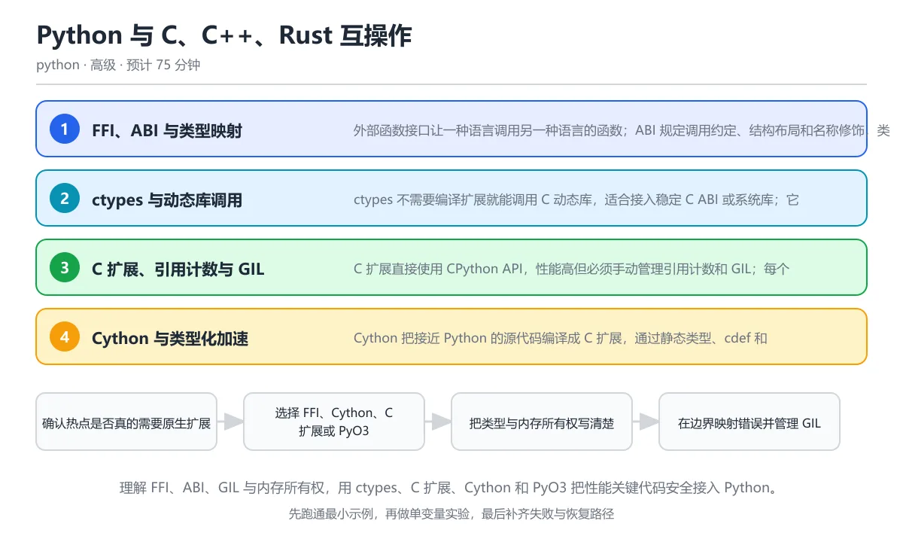

# Python 与 C、C++、Rust 互操作

> 内容更新时间：2026-10-06 · 学习阶段：高级 · 预计用时：55 分钟

分类：python。关键词：ctypes、C 扩展、Cython、PyO3、ABI。理解 FFI、ABI、GIL 与内存所有权，用 ctypes、C 扩展、Cython 和 PyO3 把性能关键代码安全接入 Python。



## 本节知识框架

**课程定位**：所属分类 `python`（Python），课程主题 `Python 与 C、C++、Rust 互操作`，学习阶段 高级，建议用时 50 分钟。

本课主线：理解 FFI、ABI、GIL 与内存所有权，用 ctypes、C 扩展、Cython 和 PyO3 把性能关键代码安全接入 Python。

**学完本课应当能够**
- 说清 `FFI` 与 `ABI` 的含义与区别，并各举一个正例和一个反例。
- 用本课示例验证 `ctypes` 的行为，记录输入、输出与失败条件。
- 遇到「ctypes 参数类型声明错误」这类问题时，能说出触发条件与修复顺序。

### 从概念到验证的学习链条

1. `FFI`：先掌握 不同编程语言之间调用函数和交换数据的接口机制，再用它解释 `ABI` 为什么会出现。
2. `ABI`：先掌握 二进制层面的调用约定、数据类型布局与符号规则，再用它解释 `ctypes` 为什么会出现。
3. `ctypes`：先掌握 Python 标准库中通过 C ABI 调用动态库的模块，再用它解释 `GIL` 为什么会出现。
4. `GIL`：先掌握 CPython 传统构建中保护解释器状态并限制同进程字节码并行的全局锁，再用它解释 `Cython` 为什么会出现。
5. `Cython`：先掌握 把带静态类型的 Python 风格代码编译成 C 扩展的工具，再用它解释 `PyO3` 为什么会出现。
6. `PyO3`：先掌握 用于编写 Python 扩展模块和绑定 Rust 代码的 Rust 框架，再用它解释 本课示例的观察结果 为什么会出现。

**先修与衔接**：本课是「Python」分类的第 39 课。先修内容：《Python 内存、性能与解释器原理》。《Python 内存、性能与解释器原理》里的 `引用计数`、`循环垃圾回收` 是本课的前提。相关或后续课程：《Python 打包、发布与性能》、《Python 项目架构：分层、配置与依赖注入》。

### 完成判据

- **定义关**：不看正文也能说明 `FFI` 是 不同编程语言之间调用函数和交换数据的接口机制，并指出一个反例。
- **机制关**：能按“输入 → 转换 → 输出 → 验证”复述 `Python 与 C、C++、Rust 互操作`，而不是只背结论。
- **示例关**：能运行或推演 `Python 与 C、C++、Rust 互操作` 的 `text` 示例，并说明一个真实出现的标识符或字面量。
- **证据关**：能从 `Python 与 C、C++、Rust 互操作` 的示例写出一个输入、处理、输出三元组，并说明它支持或反驳了本课的哪一条结论。
- **排错关**：能复现 ctypes 参数类型声明错误，记录现象并按 显式设置 argtypes、restype 和固定宽度字段，并用边界值测试验证 修复。
- **迁移关**：能把 `ctypes`、`C 扩展`、`Cython`、`PyO3` 放进一个与 `Python 与 C、C++、Rust 互操作` 不同的项目场景，并保持输入与验证条件可追踪。
- **复盘关**：学完 `Python 与 C、C++、Rust 互操作` 后，用一句话写下仍然不确定的结论，并列出下一次验证需要的输入、环境和成功判据。

### 复习清单

- [ ] 能不看正文复述本课核心术语，并指出一个边界或反例。
- [ ] 能运行或推演本课示例，记录输入、输出与失败现象。
- [ ] 能完成一次自测，并把错题对照错误表定位原因。

## 核心概念定义

| 术语 | 操作性定义 | 常见边界与风险 |
| --- | --- | --- |
| FFI | 不同编程语言之间调用函数和交换数据的接口机制。 | 只在「不同编程语言之间调用函数和交换数据的接口机制」这一前提下成立，换输入或换环境要重新验证。 |
| ABI | 二进制层面的调用约定、数据类型布局与符号规则。 | 易错：在《Python 与 C、C++、Rust 互操作》里采用「在开发机构建后把 wheel 发给所有平台，安装时报 ABI 不兼容」时，只发布本机平台轮子会表现为错误结果、异常中断或状态不一致；正确做法是在 CI 构建目标平台 wheel，声明 Python 版本与 ABI 标签。 |
| ctypes | Python 标准库中通过 C ABI 调用动态库的模块。 | 易错：在《Python 与 C、C++、Rust 互操作》里采用「把 Python 整数按默认类型传入，或结构体字段宽度与 C 端不一致」时，ctypes 参数类型声明错误会表现为错误结果、异常中断或状态不一致；正确做法是显式设置 argtypes、restype 和固定宽度字段，并用边界值测试验证。 |
| GIL | CPython 传统构建中保护解释器状态并限制同进程字节码并行的全局锁。 | 易错：在《Python 与 C、C++、Rust 互操作》里采用「原生计算函数全程不释放 GIL，其他 Python 线程无法执行」时，长时间持有 GIL会表现为错误结果、异常中断或状态不一致；正确做法是确认不访问 Python 对象的阶段释放 GIL，并用线程并发测试验证。 |
| Cython | 把带静态类型的 Python 风格代码编译成 C 扩展的工具。 | 静态检查只在编译期成立，运行期输入仍需校验。 |
| PyO3 | 用于编写 Python 扩展模块和绑定 Rust 代码的 Rust 框架。 | 只在「用于编写 Python 扩展模块和绑定 Rust 代码的 Rust 框架」这一前提下成立，换输入或换环境要重新验证。 |

## 原理与运行机制

### 机制总览

**教材衔接：核心知识**

### 1. FFI、ABI 与类型映射

外部函数接口让一种语言调用另一种语言的函数；ABI 规定调用约定、结构布局和名称修饰，类型映射必须逐项匹配。

ctypes 在运行时加载动态库并按声明转换参数，C 扩展和 Cython 在编译期绑定 CPython API，PyO3 通过 Rust 类型与 Python 对象转换完成桥接。

在Python 与 C、C++、Rust 互操作里可以这样验证：用 ctypes 定义 C 结构体、创建字节缓冲区并读取字段，观察 Python 与原生内存布局的对照。

边界：整数宽度、字节序、对齐和字符串编码都可能不匹配；错误的类型声明会造成越界写入或难以复现的内存破坏。

工程视角：边界声明集中在一层适配模块，类型和错误码写进测试；跨平台时用明确的固定宽度类型和字节序转换。

### 2. ctypes 与动态库调用

ctypes 不需要编译扩展就能调用 C 动态库，适合接入稳定 C ABI 或系统库；它不解析头文件，所有签名都要手工声明。

CDLL 加载库，argtypes 和 restype 指定参数与返回值，Structure 描述结构体，create_string_buffer 分配可写缓冲区，byref 传递引用。

在Python 与 C、C++、Rust 互操作里可以这样验证：定义一个包含两个整数的结构体，打印大小、字段与地址，验证内存布局。

边界：ctypes 不负责释放 C 分配的内存，函数失败也可能只返回错误码；回调函数跨越边界时生命周期必须由 Python 保持。

工程视角：为第三方库写薄封装，统一检查返回码，明确谁分配谁释放，敏感操作限制输入长度。

### 3. C 扩展、引用计数与 GIL

C 扩展直接使用 CPython API，性能高但必须手动管理引用计数和 GIL；每个 Python 对象的所有权规则都与原生内存不同。

Py_INCREF 增加引用，Py_DECREF 减少引用，函数返回新引用还是借用引用由 API 约定；长时间计算可以释放 GIL，但释放期间不能访问 Python 对象。

在Python 与 C、C++、Rust 互操作里可以这样验证：说明一个 C 函数接收 Python 列表、读取元素并在返回新对象时增加引用的流程。

边界：引用计数错误会导致提前释放或内存泄漏；多线程下不释放 GIL 会让其他 Python 线程一直等待。

工程视角：扩展边界尽量薄，把复杂逻辑放在 C 内部；使用调试构建、引用计数检查和压力测试验证。

### 4. Cython 与类型化加速

Cython 把接近 Python 的源代码编译成 C 扩展，通过静态类型、cdef 和内存视图减少解释器开销。

pyx 文件声明 C 类型和函数，生成 C 代码后编译为扩展模块；with nogil 可以在不访问 Python 对象的区域释放 GIL，提升多线程并行能力。

在Python 与 C、C++、Rust 互操作里可以这样验证：把一段纯 Python 循环改写为带 C 类型和内存视图的 Cython 函数，比较运行时间与可读性。

边界：类型转换错误可能吞掉异常或改变语义，编译产物依赖平台和 Python 版本；收益取决于热点是否真的在 Python 层。

工程视角：只对剖析确认的热点使用 Cython，保留纯 Python 参考实现并做结果一致性测试。

### 5. PyO3、maturin 与平台轮子

PyO3 让 Rust 代码暴露为 Python 模块，maturin 负责构建和打包 wheel，兼顾内存安全与原生性能。

Rust 函数通过宏暴露，Python 对象与 Rust 类型自动转换，错误映射为 Python 异常；发布时为不同平台和 Python 版本构建对应 wheel。

在Python 与 C、C++、Rust 互操作里可以这样验证：设计一个 Rust 计算函数，接收整数列表并返回求和结果，由 PyO3 转换参数并映射错误。

边界：跨语言边界的数据复制可能抵消性能收益，Rust panic 必须转换为 Python 异常，ABI 与 Python 版本限制要在元数据中声明。

工程视角：用 CI 构建多平台 wheel，发布前在目标环境安装测试，原生库只暴露稳定的小接口。

**教材衔接：关键流程**

```text
确认热点是否真的需要原生扩展 → 选择 FFI、Cython、C 扩展或 PyO3 → 把类型与内存所有权写清楚 → 在边界映射错误并管理 GIL → 为多平台构建与验证产物
```

1. 确认热点是否真的需要原生扩展
2. 选择 FFI、Cython、C 扩展或 PyO3
3. 把类型与内存所有权写清楚
4. 在边界映射错误并管理 GIL
5. 为多平台构建与验证产物

### 机制拆解：每一步的输入、动作与输出

#### 1. `FFI`
- 输入：`ctypes`；本步把 不同编程语言之间调用函数和交换数据的接口机制 当作判断规则。
- 动作：围绕 `FFI` 保留中间状态，并记录它与 `ABI` 的对应关系。
- 输出：`ABI`，它可以被下一段代码、测试或记录继续使用。
- `FFI` 的失败条件：只在「不同编程语言之间调用函数和交换数据的接口机制」这一前提下成立，换输入或换环境要重新验证。

#### 2. `ABI`
- 输入：`FFI`；本步把 二进制层面的调用约定、数据类型布局与符号规则 当作判断规则。
- 动作：围绕 `ABI` 保留中间状态，并记录它与 `ctypes` 的对应关系。
- 输出：`ctypes`，它可以被下一段代码、测试或记录继续使用。
- `ABI` 的失败条件：当只发布本机平台轮子时，会出现在《Python 与 C、C++、Rust 互操作》里采用「在开发机构建后把 wheel 发给所有平台，安装时报 ABI 不兼容」时，只发布本机平台轮子会表现为错误结果、异常中断或状态不一致。

#### 3. `ctypes`
- 输入：`ABI`；本步把 Python 标准库中通过 C ABI 调用动态库的模块 当作判断规则。
- 动作：围绕 `ctypes` 保留中间状态，并记录它与 `GIL` 的对应关系。
- 输出：`GIL`，它可以被下一段代码、测试或记录继续使用。
- `ctypes` 的失败条件：当ctypes 参数类型声明错误时，会出现在《Python 与 C、C++、Rust 互操作》里采用「把 Python 整数按默认类型传入，或结构体字段宽度与 C 端不一致」时，ctypes 参数类型声明错误会表现为错误结果、异常中断或状态不一致。

#### 4. `GIL`
- 输入：`ctypes`；本步把 CPython 传统构建中保护解释器状态并限制同进程字节码并行的全局锁 当作判断规则。
- 动作：围绕 `GIL` 保留中间状态，并记录它与 `Cython` 的对应关系。
- 输出：`Cython`，它可以被下一段代码、测试或记录继续使用。
- `GIL` 的失败条件：当长时间持有 GIL时，会出现在《Python 与 C、C++、Rust 互操作》里采用「原生计算函数全程不释放 GIL，其他 Python 线程无法执行」时，长时间持有 GIL会表现为错误结果、异常中断或状态不一致。

#### 5. `Cython`
- 输入：`GIL`；本步把 把带静态类型的 Python 风格代码编译成 C 扩展的工具 当作判断规则。
- 动作：围绕 `Cython` 保留中间状态，并记录它与 `PyO3` 的对应关系。
- 输出：`PyO3`，它可以被下一段代码、测试或记录继续使用。
- `Cython` 的失败条件：静态检查只在编译期成立，运行期输入仍需校验。

#### 6. `PyO3`
- 输入：`Cython`；本步把 用于编写 Python 扩展模块和绑定 Rust 代码的 Rust 框架 当作判断规则。
- 动作：围绕 `PyO3` 保留中间状态，并记录它与 `本课示例的最终结果` 的对应关系。
- 输出：`本课示例的最终结果`，它可以被下一段代码、测试或记录继续使用。
- `PyO3` 的失败条件：只在「用于编写 Python 扩展模块和绑定 Rust 代码的 Rust 框架」这一前提下成立，换输入或换环境要重新验证。

### 复现实验记录

- 环境：`Python 与 C、C++、Rust 互操作` 使用 `text` 示例，固定 `ctypes`、`C 扩展`、`Cython`、`PyO3` 作为第一组条件。
- 首轮输入：从示例中的第一个输入开始，预测 `FFI` 会怎样变化。
- 基线观察：记录命令、输入、输出和错误原文，不用截图代替可复制的文本。
- 单变量修改：只改变 `ctypes`，观察 `PyO3` 是否仍满足定义。
- 失败注入：复现 ctypes 参数类型声明错误，确认现象是 在《Python 与 C、C++、Rust 互操作》里采用「把 Python 整数按默认类型传入，或结构体字段宽度与 C 端不一致」时，ctypes 参数类型声明错误会表现为错误结果、异常中断或状态不一致。
- 记录结论：把“修改前、修改后、预期变化、实际变化”写成四列表，这样复盘 `Python 与 C、C++、Rust 互操作` 时才能区分概念错误与实现错误。

## 典型应用场景

**教材衔接：深度拓展与实战**

### 机制拆解 1：FFI、ABI 与类型映射

落地时先确认前提：整数宽度、字节序、对齐和字符串编码都可能不匹配；错误的类型声明会造成越界写入或难以复现的内存破坏。再把结论写进检查表，让下一位同学可以按同样的输入复现。

工程做法：边界声明集中在一层适配模块，类型和错误码写进测试；跨平台时用明确的固定宽度类型和字节序转换。

### 机制拆解 2：ctypes 与动态库调用

落地时先确认前提：ctypes 不负责释放 C 分配的内存，函数失败也可能只返回错误码；回调函数跨越边界时生命周期必须由 Python 保持。再把结论写进检查表，让下一位同学可以按同样的输入复现。

工程做法：为第三方库写薄封装，统一检查返回码，明确谁分配谁释放，敏感操作限制输入长度。

### 机制拆解 3：C 扩展、引用计数与 GIL

落地时先确认前提：引用计数错误会导致提前释放或内存泄漏；多线程下不释放 GIL 会让其他 Python 线程一直等待。再把结论写进检查表，让下一位同学可以按同样的输入复现。

工程做法：扩展边界尽量薄，把复杂逻辑放在 C 内部；使用调试构建、引用计数检查和压力测试验证。

### 机制拆解 4：Cython 与类型化加速

落地时先确认前提：类型转换错误可能吞掉异常或改变语义，编译产物依赖平台和 Python 版本；收益取决于热点是否真的在 Python 层。再把结论写进检查表，让下一位同学可以按同样的输入复现。

工程做法：只对剖析确认的热点使用 Cython，保留纯 Python 参考实现并做结果一致性测试。

### 机制拆解 5：PyO3、maturin 与平台轮子

落地时先确认前提：跨语言边界的数据复制可能抵消性能收益，Rust panic 必须转换为 Python 异常，ABI 与 Python 版本限制要在元数据中声明。再把结论写进检查表，让下一位同学可以按同样的输入复现。

工程做法：用 CI 构建多平台 wheel，发布前在目标环境安装测试，原生库只暴露稳定的小接口。

### 机制对照表

| 概念 | 解决什么问题 | 关键前提 | 失败信号 |
| --- | --- | --- | --- |
| FFI、ABI 与类型映射 | 外部函数接口让一种语言调用另一种语言的函数；ABI 规定调用约定、结构布局和名称 | 整数宽度、字节序、对齐和字符串编码都可能不匹配；错误的类型声明会造成越界 | 边界声明集中在一层适配模块，类型和错误码写进测试；跨平台时用明确的固定宽 |
| ctypes 与动态库调用 | ctypes 不需要编译扩展就能调用 C 动态库，适合接入稳定 C ABI 或系 | ctypes 不负责释放 C 分配的内存，函数失败也可能只返回错误码；回 | 为第三方库写薄封装，统一检查返回码，明确谁分配谁释放，敏感操作限制输入长 |
| C 扩展、引用计数与 GIL | C 扩展直接使用 CPython API，性能高但必须手动管理引用计数和 GIL | 引用计数错误会导致提前释放或内存泄漏；多线程下不释放 GIL 会让其他  | 扩展边界尽量薄，把复杂逻辑放在 C 内部；使用调试构建、引用计数检查和压 |
| Cython 与类型化加速 | Cython 把接近 Python 的源代码编译成 C 扩展，通过静态类型、cd | 类型转换错误可能吞掉异常或改变语义，编译产物依赖平台和 Python 版 | 只对剖析确认的热点使用 Cython，保留纯 Python 参考实现并做 |
| PyO3、maturin 与平台轮子 | PyO3 让 Rust 代码暴露为 Python 模块，maturin 负责构建 | 跨语言边界的数据复制可能抵消性能收益，Rust panic 必须转换为  | 用 CI 构建多平台 wheel，发布前在目标环境安装测试，原生库只暴露 |

### 自测问答

**问 1**：ctypes 调用 C 函数前设置 argtypes 和 restype 的主要目的是什么？

**答**：明确参数与返回值类型，避免错误转换和内存破坏。ctypes 看不到头文件，必须根据声明的类型把 Python 对象转换成正确的二进制表示；错误声明可能把整数当指针或写入错误宽度，造成崩溃和安全问题。argtypes 与 restype 也是文档的一部分，应和 C 头文件逐项对照。 正确选项「明确参数与返回值类型，避免错误转换和内存破坏」对应《Python 与 C、C++、Rust 互操作》的要点「FFI、ABI 与类型映射」：外部函数接口让一种语言调用另一种语言的函数；ABI 规定调用约定、结构布局和名称修饰，类型映射必须逐项匹配。判断「FFI、ABI 与类型映射」时先确认前提是否成立，再回到《Python 与 C、C++、Rust 互操作》的示例核对一次；把别的语言或框架的默认做法直接搬到FFI、ABI 与类型映射上，往往会在本课的边界条件里失效。

**问 2**：C 扩展中释放 GIL 后，哪件事是不能做的？

**答**：访问 Python 对象或调用 Python API。释放 GIL 表示当前线程不再持有解释器锁，此时访问 Python 对象会让引用计数和解释器状态失去保护，可能直接崩溃。纯计算、内存拷贝和原生库调用可以在释放期间执行，回到 Python 边界前必须重新获取 GIL。 正确选项「访问 Python 对象或调用 Python API」对应《Python 与 C、C++、Rust 互操作》的要点「ctypes 与动态库调用」：ctypes 不需要编译扩展就能调用 C 动态库，适合接入稳定 C ABI 或系统库；它不解析头文件，所有签名都要手工声明。判断「ctypes 与动态库调用」时先确认前提是否成立，再回到《Python 与 C、C++、Rust 互操作》的示例核对一次；借鉴相邻主题的经验之前，先核对ctypes 与动态库调用的前提是否成立。

**问 3**：跨语言边界必须明确哪些责任？（多选）

**答**：谁分配和释放内存；错误码或异常如何映射；数据编码与字节序。内存所有权、错误映射和编码布局是跨语言调用正确性的三根支柱，缺少任一项都会产生泄漏、静默错误或乱码。编辑器偏好不影响运行结果；应在适配层写清契约并用测试覆盖边界值。 正确选项「谁分配和释放内存；错误码或异常如何映射；数据编码与字节序」对应《Python 与 C、C++、Rust 互操作》的要点「C 扩展、引用计数与 GIL」：C 扩展直接使用 CPython API，性能高但必须手动管理引用计数和 GIL；每个 Python 对象的所有权规则都与原生内存不同。判断「C 扩展、引用计数与 GIL」时先确认前提是否成立，再回到《Python 与 C、C++、Rust 互操作》的示例核对一次；记住C 扩展、引用计数与 GIL的结论之外还要记住适用条件，换一个输入往往就不成立了。

**问 4**：阅读结构体定义，ctypes.sizeof(Point) 最可能是多少？

class Point(ctypes.Structure):
    _fields_ = [('x', ctypes.c_int), ('y', ctypes.c_int)]

**答**：8。在常见平台上 c_int 占四个字节，两个相邻整数字段没有额外填充，因此结构体大小是八字节。跨平台代码不能假设所有 C 类型宽度相同，涉及协议或文件格式时应使用固定宽度整数并显式处理对齐。 正确选项「8」对应《Python 与 C、C++、Rust 互操作》的要点「Cython 与类型化加速」：Cython 把接近 Python 的源代码编译成 C 扩展，通过静态类型、cdef 和内存视图减少解释器开销。判断「Cython 与类型化加速」时先确认前提是否成立，再回到《Python 与 C、C++、Rust 互操作》的示例核对一次；干扰项常常是相邻主题里成立的结论，只有按Cython 与类型化加速的输入与约束判断才能排除。

**问 5**：为什么把一个小循环改成 C 扩展后整体反而更慢？

**答**：每次调用都要做参数转换和边界开销，而热点本身并不在循环上。跨语言调用有参数解析、类型转换、错误检查和对象创建成本，如果单次工作量很小或调用次数很多，边界成本可能超过计算收益。应先用剖析确认热点，再把批量操作整体放到原生层，减少往返次数并用基准验证。这道题对应 ctypes 与原生扩展的边界成本：跨语言调用和 ABI 转换必须先测量再优化。 正确选项「每次调用都要做参数转换和边界开销，而热点本身并不在循环上」对应《Python 与 C、C++、Rust 互操作》的要点「PyO3、maturin 与平台轮子」：PyO3 让 Rust 代码暴露为 Python 模块，maturin 负责构建和打包 wheel，兼顾内存安全与原生性能。判断「PyO3、maturin 与平台轮子」时先确认前提是否成立，再回到《Python 与 C、C++、Rust 互操作》的示例核对一次；把PyO3、maturin 与平台轮子的做法换到别的约束下未必成立，先确认边界再决定答案。

### 排错速查

- 看到「把 Python 整数按默认类型传入，或结构体字段宽度与 C 端不一致」时，先按「显式设置 argtypes、restype 和固定宽度字段，并用边界值测试验证」处理，再用Python 与 C、C++、Rust 互操作的最小示例确认结论是否恢复。
- 看到「C 函数返回 malloc 分配的内存，Python 侧只读取不释放」时，先按「明确所有权，提供对应的释放函数或让 Rust 使用所有权模型自动回收」处理，再用Python 与 C、C++、Rust 互操作的最小示例确认结论是否恢复。
- 看到「原生计算函数全程不释放 GIL，其他 Python 线程无法执行」时，先按「确认不访问 Python 对象的阶段释放 GIL，并用线程并发测试验证」处理，再用Python 与 C、C++、Rust 互操作的最小示例确认结论是否恢复。
- 看到「在开发机构建后把 wheel 发给所有平台，安装时报 ABI 不兼容」时，先按「在 CI 构建目标平台 wheel，声明 Python 版本与 ABI 标签」处理，再用Python 与 C、C++、Rust 互操作的最小示例确认结论是否恢复。

### 工程检查表

- [ ] 确认热点是否真的需要原生扩展
- [ ] 选择 FFI、Cython、C 扩展或 PyO3
- [ ] 把类型与内存所有权写清楚
- [ ] 在边界映射错误并管理 GIL
- [ ] 为多平台构建与验证产物
- [ ] 【FFI、ABI 与类型映射】边界声明集中在一层适配模块，类型和错误码写进测试；跨平台时用明确的固定宽度类型和字节序转换。
- [ ] 【ctypes 与动态库调用】为第三方库写薄封装，统一检查返回码，明确谁分配谁释放，敏感操作限制输入长度。
- [ ] 【C 扩展、引用计数与 GIL】扩展边界尽量薄，把复杂逻辑放在 C 内部；使用调试构建、引用计数检查和压力测试验证。
- [ ] 【Cython 与类型化加速】只对剖析确认的热点使用 Cython，保留纯 Python 参考实现并做结果一致性测试。
- [ ] 【PyO3、maturin 与平台轮子】用 CI 构建多平台 wheel，发布前在目标环境安装测试，原生库只暴露稳定的小接口。


### 结论与下一步

- **ctypes 参数类型声明错误**：典型现象是在《Python 与 C、C++、Rust 互操作》里采用「把 Python 整数按默认类型传入，或结构体字段宽度与 C 端不一致」时，ctypes 参数类型声明错误会表现为错误结果、异常中断或状态不一致；正确做法是显式设置 argtypes、restype 和固定宽度字段，并用边界值测试验证。
- **跨语言内存无人释放**：典型现象是在《Python 与 C、C++、Rust 互操作》里采用「C 函数返回 malloc 分配的内存，Python 侧只读取不释放」时，跨语言内存无人释放会表现为错误结果、异常中断或状态不一致；正确做法是明确所有权，提供对应的释放函数或让 Rust 使用所有权模型自动回收。
- **长时间持有 GIL**：典型现象是在《Python 与 C、C++、Rust 互操作》里采用「原生计算函数全程不释放 GIL，其他 Python 线程无法执行」时，长时间持有 GIL会表现为错误结果、异常中断或状态不一致；正确做法是确认不访问 Python 对象的阶段释放 GIL，并用线程并发测试验证。
- **只发布本机平台轮子**：典型现象是在《Python 与 C、C++、Rust 互操作》里采用「在开发机构建后把 wheel 发给所有平台，安装时报 ABI 不兼容」时，只发布本机平台轮子会表现为错误结果、异常中断或状态不一致；正确做法是在 CI 构建目标平台 wheel，声明 Python 版本与 ABI 标签。

### 最小验证场景

- 准备：保留 `text` 示例的原始输入，先记录 `Python 与 C、C++、Rust 互操作` 的基线输出和完整运行命令。
- 判定：新结果与 `Python 与 C、C++、Rust 互操作` 的基线不同不等于错误；只有当差异破坏了 `FFI` 的定义或错误表中的约束，才判定为失败。

### 选择与边界

- 使用 `FFI` 时，先满足它的定义：不同编程语言之间调用函数和交换数据的接口机制；只在「不同编程语言之间调用函数和交换数据的接口机制」这一前提下成立，换输入或换环境要重新验证。
- 使用 `ABI` 时，先满足它的定义：二进制层面的调用约定、数据类型布局与符号规则；易错：在《Python 与 C、C++、Rust 互操作》里采用「在开发机构建后把 wheel 发给所有平台，安装时报 ABI 不兼容」时，只发布本机平台轮子会表现为错误结果、异常中断或状态不一致；正确做法是在 CI 构建目标平台 wheel，声明 Python 版本与 ABI 标签。
- 使用 `ctypes` 时，先满足它的定义：Python 标准库中通过 C ABI 调用动态库的模块；易错：在《Python 与 C、C++、Rust 互操作》里采用「把 Python 整数按默认类型传入，或结构体字段宽度与 C 端不一致」时，ctypes 参数类型声明错误会表现为错误结果、异常中断或状态不一致；正确做法是显式设置 argtypes、restype 和固定宽度字段，并用边界值测试验证。
- 使用 `GIL` 时，先满足它的定义：CPython 传统构建中保护解释器状态并限制同进程字节码并行的全局锁；易错：在《Python 与 C、C++、Rust 互操作》里采用「原生计算函数全程不释放 GIL，其他 Python 线程无法执行」时，长时间持有 GIL会表现为错误结果、异常中断或状态不一致；正确做法是确认不访问 Python 对象的阶段释放 GIL，并用线程并发测试验证。
- 使用 `Cython` 时，先满足它的定义：把带静态类型的 Python 风格代码编译成 C 扩展的工具；静态检查只在编译期成立，运行期输入仍需校验。

## 代码/协议/SQL 示例

### 最小可验证示例

**教材衔接：原文最小示例**

```python
class Point(ctypes.Structure):
    _fields_ = [('x', ctypes.c_int), ('y', ctypes.c_int)]
```

```python
import ctypes

class Point(ctypes.Structure):
    _fields_ = [("x", ctypes.c_int), ("y", ctypes.c_int)]

point = Point(3, 4)
buffer = ctypes.create_string_buffer(b"python", 16)
print("结构体大小:", ctypes.sizeof(Point))
print("字段:", point.x, point.y)
print("缓冲区:", buffer.value.decode("utf-8"))
print("指针非空:", bool(ctypes.addressof(point)))
```

### 示例精读：先找证据，再改一个条件

- 在 `Python 与 C、C++、Rust 互操作` 中与 `FFI` 对照：示例必须能支持 不同编程语言之间调用函数和交换数据的接口机制，否则说明这一段还缺少实现或验证步骤。
- 在 `Python 与 C、C++、Rust 互操作` 中与 `ABI` 对照：示例必须能支持 二进制层面的调用约定、数据类型布局与符号规则，否则说明这一段还缺少实现或验证步骤。
- 在 `Python 与 C、C++、Rust 互操作` 中与 `ctypes` 对照：示例必须能支持 Python 标准库中通过 C ABI 调用动态库的模块，否则说明这一段还缺少实现或验证步骤。
- 在 `Python 与 C、C++、Rust 互操作` 中与 `GIL` 对照：示例必须能支持 CPython 传统构建中保护解释器状态并限制同进程字节码并行的全局锁，否则说明这一段还缺少实现或验证步骤。
- `Python 与 C、C++、Rust 互操作` 的示例没有抽取到函数调用或字面量；按行记录输入、控制流和输出，避免只背代码外形。

## 时间/空间复杂度或性能分析

**性能关注点（Python 与 C、C++、Rust 互操作）**：解释执行与对象分配是主要成本：记录执行时间、内存峰值与 GC 次数，必要时对比其他实现。

**本课特有开销（Python 与 C、C++、Rust 互操作 · ctypes）**：小文件看元数据开销，大文件看吞吐，两者要分别测量。

**测量方法**：以 `Python 与 C、C++、Rust 互操作` 的 `ctypes` 场景为对象，固定输入跑一遍记录基线，再把规模或并发度提高一个数量级复测；两次结果的差值与波动范围才是结论依据。

### 需要控制的变量与记录项

- `Python 与 C、C++、Rust 互操作` 的 `ctypes`：固定它的版本、输入范围和资源上限，分别记录速度、内存与失败率的变化。
- `Python 与 C、C++、Rust 互操作` 的 `C 扩展`：固定它的版本、输入范围和资源上限，分别记录速度、内存与失败率的变化。
- `Python 与 C、C++、Rust 互操作` 的 `Cython`：固定它的版本、输入范围和资源上限，分别记录速度、内存与失败率的变化。
- `Python 与 C、C++、Rust 互操作` 的 `PyO3`：固定它的版本、输入范围和资源上限，分别记录速度、内存与失败率的变化。
- `Python 与 C、C++、Rust 互操作` 的 `ABI`：固定它的版本、输入范围和资源上限，分别记录速度、内存与失败率的变化。
- `Python 与 C、C++、Rust 互操作` 中 `FFI` 的边界：只在「不同编程语言之间调用函数和交换数据的接口机制」这一前提下成立，换输入或换环境要重新验证。达到边界时不要外推，必须重新测量。
- `Python 与 C、C++、Rust 互操作` 中 `ABI` 的边界：易错：在《Python 与 C、C++、Rust 互操作》里采用「在开发机构建后把 wheel 发给所有平台，安装时报 ABI 不兼容」时，只发布本机平台轮子会表现为错误结果、异常中断或状态不一致；正确做法是在 CI 构建目标平台 wheel，声明 Python 版本与 ABI 标签。达到边界时不要外推，必须重新测量。
- `Python 与 C、C++、Rust 互操作` 中 `ctypes` 的边界：易错：在《Python 与 C、C++、Rust 互操作》里采用「把 Python 整数按默认类型传入，或结构体字段宽度与 C 端不一致」时，ctypes 参数类型声明错误会表现为错误结果、异常中断或状态不一致；正确做法是显式设置 argtypes、restype 和固定宽度字段，并用边界值测试验证。达到边界时不要外推，必须重新测量。
- `Python 与 C、C++、Rust 互操作` 中 `GIL` 的边界：易错：在《Python 与 C、C++、Rust 互操作》里采用「原生计算函数全程不释放 GIL，其他 Python 线程无法执行」时，长时间持有 GIL会表现为错误结果、异常中断或状态不一致；正确做法是确认不访问 Python 对象的阶段释放 GIL，并用线程并发测试验证。达到边界时不要外推，必须重新测量。
- `Python 与 C、C++、Rust 互操作` 中 `Cython` 的边界：静态检查只在编译期成立，运行期输入仍需校验。达到边界时不要外推，必须重新测量。

## 常见误区与易错点

| 容易写错的做法 | 实际现象 | 原因与正确做法 |
| --- | --- | --- |
| ctypes 参数类型声明错误 | 在《Python 与 C、C++、Rust 互操作》里采用「把 Python 整数按默认类型传入，或结构体字段宽度与 C 端不一致」时，ctypes 参数类型声明错误会表现为错误结果、异常中断或状态不一致。 | 显式设置 argtypes、restype 和固定宽度字段，并用边界值测试验证 |
| 跨语言内存无人释放 | 在《Python 与 C、C++、Rust 互操作》里采用「C 函数返回 malloc 分配的内存，Python 侧只读取不释放」时，跨语言内存无人释放会表现为错误结果、异常中断或状态不一致。 | 明确所有权，提供对应的释放函数或让 Rust 使用所有权模型自动回收 |
| 长时间持有 GIL | 在《Python 与 C、C++、Rust 互操作》里采用「原生计算函数全程不释放 GIL，其他 Python 线程无法执行」时，长时间持有 GIL会表现为错误结果、异常中断或状态不一致。 | 确认不访问 Python 对象的阶段释放 GIL，并用线程并发测试验证 |
| 只发布本机平台轮子 | 在《Python 与 C、C++、Rust 互操作》里采用「在开发机构建后把 wheel 发给所有平台，安装时报 ABI 不兼容」时，只发布本机平台轮子会表现为错误结果、异常中断或状态不一致。 | 在 CI 构建目标平台 wheel，声明 Python 版本与 ABI 标签 |

### 现场 1：ctypes 参数类型声明错误

**症状**：在《Python 与 C、C++、Rust 互操作》里采用「把 Python 整数按默认类型传入，或结构体字段宽度与 C 端不一致」时，ctypes 参数类型声明错误会表现为错误结果、异常中断或状态不一致。

**根因与修复**：显式设置 argtypes、restype 和固定宽度字段，并用边界值测试验证。

**自检**：在本课示例里复现「ctypes 参数类型声明错误」，改成显式设置 argtypes、restype 和固定宽度字段，并用边界值测试验证后重跑；如果症状消失且失败路径按预期变化，说明定位正确。

### 现场 2：跨语言内存无人释放

**症状**：在《Python 与 C、C++、Rust 互操作》里采用「C 函数返回 malloc 分配的内存，Python 侧只读取不释放」时，跨语言内存无人释放会表现为错误结果、异常中断或状态不一致。

**根因与修复**：明确所有权，提供对应的释放函数或让 Rust 使用所有权模型自动回收。

**自检**：在本课示例里复现「跨语言内存无人释放」，改成明确所有权，提供对应的释放函数或让 Rust 使用所有权模型自动回收后重跑；如果症状消失且失败路径按预期变化，说明定位正确。

### 现场 3：长时间持有 GIL

**症状**：在《Python 与 C、C++、Rust 互操作》里采用「原生计算函数全程不释放 GIL，其他 Python 线程无法执行」时，长时间持有 GIL会表现为错误结果、异常中断或状态不一致。

**根因与修复**：确认不访问 Python 对象的阶段释放 GIL，并用线程并发测试验证。

**自检**：在本课示例里复现「长时间持有 GIL」，改成确认不访问 Python 对象的阶段释放 GIL，并用线程并发测试验证后重跑；如果症状消失且失败路径按预期变化，说明定位正确。

### 现场 4：只发布本机平台轮子

**症状**：在《Python 与 C、C++、Rust 互操作》里采用「在开发机构建后把 wheel 发给所有平台，安装时报 ABI 不兼容」时，只发布本机平台轮子会表现为错误结果、异常中断或状态不一致。

**根因与修复**：在 CI 构建目标平台 wheel，声明 Python 版本与 ABI 标签。

**自检**：在本课示例里复现「只发布本机平台轮子」，改成在 CI 构建目标平台 wheel，声明 Python 版本与 ABI 标签后重跑；如果症状消失且失败路径按预期变化，说明定位正确。

## 与其他知识点的关系

**教材衔接：复习与迁移**


### 迁移练习

- **先修**：`Python 内存、性能与解释器原理`。本课默认这些内容已经掌握。
- **相关或后续**：`Python 打包、发布与性能`、`Python 项目架构：分层、配置与依赖注入`。本课术语会在这些课程里继续使用。
- **术语归属**：`FFI`、`ABI`、`ctypes` 的定义以本课「核心概念定义」为准，换到其他课程时先确认定义是否被改写。

### 先修与后续术语接口

- `Python 打包、发布与性能`：两者通过本分类的学习顺序衔接，阅读时重点比较各自的输入与失败条件。
- `Python 内存、性能与解释器原理`：两者通过本分类的学习顺序衔接，阅读时重点比较各自的输入与失败条件。
- `Python 项目架构：分层、配置与依赖注入`：两者通过本分类的学习顺序衔接，阅读时重点比较各自的输入与失败条件。

### 容易混淆的相邻概念

- `FFI` 与 `ABI`：前者强调 不同编程语言之间调用函数和交换数据的接口机制；后者强调 二进制层面的调用约定、数据类型布局与符号规则。判断时分别检查两条定义的适用范围，不要只看名称相似就互换。
- `ABI` 与 `ctypes`：前者强调 二进制层面的调用约定、数据类型布局与符号规则；后者强调 Python 标准库中通过 C ABI 调用动态库的模块。判断时分别检查两条定义的适用范围，不要只看名称相似就互换。
- `ctypes` 与 `GIL`：前者强调 Python 标准库中通过 C ABI 调用动态库的模块；后者强调 CPython 传统构建中保护解释器状态并限制同进程字节码并行的全局锁。判断时分别检查两条定义的适用范围，不要只看名称相似就互换。
- `GIL` 与 `Cython`：前者强调 CPython 传统构建中保护解释器状态并限制同进程字节码并行的全局锁；后者强调 把带静态类型的 Python 风格代码编译成 C 扩展的工具。判断时分别检查两条定义的适用范围，不要只看名称相似就互换。
- `Cython` 与 `PyO3`：前者强调 把带静态类型的 Python 风格代码编译成 C 扩展的工具；后者强调 用于编写 Python 扩展模块和绑定 Rust 代码的 Rust 框架。判断时分别检查两条定义的适用范围，不要只看名称相似就互换。

## 自测题与参考答案

> 先独立作答，再对照参考答案；答案都能在本课正文、术语表或错误表里找到依据。

### 自测 1（概念复述）

不看正文，写出 `FFI` 的操作性定义，并说明它与 `ABI` 的区别。

**参考答案**：不同编程语言之间调用函数和交换数据的接口机制。

`ABI` 的定位是：二进制层面的调用约定、数据类型布局与符号规则；两者的差别要从适用对象与失败模式上说明。

### 自测 2（排错）

本课错误表记录了「ctypes 参数类型声明错误」这类做法。请写出它会出现的现象、根因，以及修复顺序。

**参考答案**：现象是在《Python 与 C、C++、Rust 互操作》里采用「把 Python 整数按默认类型传入，或结构体字段宽度与 C 端不一致」时，ctypes 参数类型声明错误会表现为错误结果、异常中断或状态不一致；正确做法是显式设置 argtypes、restype 和固定宽度字段，并用边界值测试验证。修复时先复现现象并保留证据，再改动一处假设重跑，确认现象消失。

### 自测 3（动手验证）

运行本课的 `text` 示例，改动其中一个输入后重新运行，记录输出与错误信息。

**参考答案**：正常输入下 `text` 示例应当复现正文给出的结果；改动输入后，如果结果改变或报错，先核对它是否满足 `Python 与 C、C++、Rust 互操作` 中`FFI` 的适用范围，再检查错误表里是否有同类现象。

### 自测 4（代码阅读）

阅读本课开头的 `text` 示例，说明它体现了`FFI` 的哪一条性质，并指出改动哪个输入会让这条性质不再成立。

**参考答案**：`FFI` 的定义是 不同编程语言之间调用函数和交换数据的接口机制，示例正是在实现这条定义。改动与 `FFI` 有关的一个输入后，如果结果不再符合 `Python 与 C、C++、Rust 互操作` 的正文描述，就说明该性质只在当前前提成立。

### 自测 5（迁移）

把 `Python 与 C、C++、Rust 互操作` 的方法迁移到自己的项目：围绕 `FFI` 写出一个与错误表同类的风险点，并说明触发条件和检验方式。

**参考答案**：例如「只发布本机平台轮子」，它会导致在《Python 与 C、C++、Rust 互操作》里采用「在开发机构建后把 wheel 发给所有平台，安装时报 ABI 不兼容」时，只发布本机平台轮子会表现为错误结果、异常中断或状态不一致；检验方式是按在 CI 构建目标平台 wheel，声明 Python 版本与 ABI 标签改一处再复现，确认现象消失且没有引入新的失败分支。

### 自测 6（对比）

用一个表格对比 `FFI` 与 `ABI`：各写一行适用场景、一行失败表现。

**参考答案**：`FFI` 的定义是不同编程语言之间调用函数和交换数据的接口机制；`ABI` 的定义是二进制层面的调用约定、数据类型布局与符号规则。两者的失败表现分别对应本课错误表里与本术语相关的行。

### 自测 7（排错顺序）

面对「ctypes 参数类型声明错误」引发的问题，请把“复现 在《Python 与 C、C++、Rust 互操作》里采用「把 Python 整数按默认类型传入，或结构体字段宽度与 C 端不一致」时，ctypes 参数类型声明错误会表现为错误结果、异常中断或状态不一致 → 保留证据 → 显式设置 argtypes、restype 和固定宽度字段，并用边界值测试验证 → 回归验证”四步写成可执行的检查清单。

**参考答案**：第一步按在《Python 与 C、C++、Rust 互操作》里采用「把 Python 整数按默认类型传入，或结构体字段宽度与 C 端不一致」时，ctypes 参数类型声明错误会表现为错误结果、异常中断或状态不一致复现；第二步记录输入、版本与完整报错；第三步按显式设置 argtypes、restype 和固定宽度字段，并用边界值测试验证只改一处；第四步重跑并确认失败路径也按预期变化。

### 自测 8（边界判断）

针对 `PyO3`，分别写出“可以使用”的条件和“结论不再成立”的条件。

**参考答案**：只在「用于编写 Python 扩展模块和绑定 Rust 代码的 Rust 框架」这一前提下成立，换输入或换环境要重新验证。 同时要把 `PyO3` 的定义 用于编写 Python 扩展模块和绑定 Rust 代码的 Rust 框架 与实际输入逐项对照。

### 自测 9（机制重建）

不看正文，按输入、转换、输出、验证四段重建 `FFI` → `ABI` → `ctypes` → `GIL` 的作用链。

**参考答案**：起点是 `FFI` 的定义 不同编程语言之间调用函数和交换数据的接口机制；中间每一步都保留可观察状态；终点由 `PyO3` 检查，失败时回到错误表定位第一个偏离定义的步骤。

### 自测 10（综合排错）

在 `Python 与 C、C++、Rust 互操作` 中，现象是 在《Python 与 C、C++、Rust 互操作》里采用「在开发机构建后把 wheel 发给所有平台，安装时报 ABI 不兼容」时，只发布本机平台轮子会表现为错误结果、异常中断或状态不一致。请围绕 只发布本机平台轮子 写出最小复现、关键证据、修复动作和回归验证，并说明为什么不能只凭一次运行下结论。

**参考答案**：先复现 只发布本机平台轮子，记录输入与完整错误；再按 在 CI 构建目标平台 wheel，声明 Python 版本与 ABI 标签 只改一处。回归时同时跑正常路径和边界路径，只有两次结果都可解释，才把修复视为完成。

### 自测 11（一分钟复述）

用每分钟约 200 字的速度复述 `Python 与 C、C++、Rust 互操作`：先给主问题，再按顺序说出 `FFI`、`ABI`、`ctypes`、`GIL`，最后给一个失败案例。

**自评标准**：主问题必须对应 理解 FFI、ABI、GIL 与内存所有权，用 ctypes、C 扩展、Cython 和 PyO3 把性能关键代码安全接入 Python；每个术语都要能接上一句定义或边界；失败案例必须写成可观察现象，不能用“可能有风险”代替证据。

## 术语速查

| 术语 | 一句话说明 |
| --- | --- |
| `FFI` | 不同编程语言之间调用函数和交换数据的接口机制。 |
| `ABI` | 二进制层面的调用约定、数据类型布局与符号规则。 |
| `ctypes` | Python 标准库中通过 C ABI 调用动态库的模块。 |
| `GIL` | CPython 传统构建中保护解释器状态并限制同进程字节码并行的全局锁。 |
| `Cython` | 把带静态类型的 Python 风格代码编译成 C 扩展的工具。 |
| `PyO3` | 用于编写 Python 扩展模块和绑定 Rust 代码的 Rust 框架。 |

**术语关系**：`FFI`（不同编程语言之间调用函数和交换数据的接口机制） → `ABI`（二进制层面的调用约定、数据类型布局与符号规则） → `ctypes`（Python 标准库中通过 C ABI 调用动态库的模块） → `GIL`（CPython 传统构建中保护解释器状态并限制同进程字节码并行的全局锁）。

## 考点精讲

`Python 与 C、C++、Rust 互操作` 的题库有 5 道题，下面逐题给出题干、正确项与判断依据：先自己作答，再核对正确项，最后回到正文对应小节复核。

### 考点 1：第 1 题

- **题目**：ctypes 调用 C 函数前设置 argtypes 和 restype 的主要目的是什么？
- **正确项**：明确参数与返回值类型，避免错误转换和内存破坏
- **判断依据**：这道题落在术语 `ctypes` 上：Python 标准库中通过 C ABI 调用动态库的模块。复习时把 `ctypes` 的定义、适用边界和一个反例一起说清楚，再回到「核心概念定义」核对原文。

### 考点 2：第 2 题

- **题目**：C 扩展中释放 GIL 后，哪件事是不能做的？
- **正确项**：访问 Python 对象或调用 Python API
- **判断依据**：这道题落在术语 `GIL` 上：CPython 传统构建中保护解释器状态并限制同进程字节码并行的全局锁。复习时把 `GIL` 的定义、适用边界和一个反例一起说清楚，再回到「核心概念定义」核对原文。

### 考点 3：第 3 题

- **题目**：跨语言边界必须明确哪些责任？（多选）
- **正确项**：谁分配和释放内存；错误码或异常如何映射；数据编码与字节序
- **判断依据**：这道题检验本课主问题：理解 FFI、ABI、GIL 与内存所有权，用 ctypes、C 扩展、Cython 和 PyO3 把性能关键代码安全接入 Python。复习时先复述本课主问题，再举一个会让结论失效的输入。

### 考点 4：第 4 题

- **题目**：阅读结构体定义，ctypes.sizeof(Point) 最可能是多少？  class Point(ctypes.Structure):     _fields_ = [('x', ctypes.c_int), ('y', ctypes.c_int)]
- **正确项**：8
- **判断依据**：这道题落在术语 `ctypes` 上：Python 标准库中通过 C ABI 调用动态库的模块。复习时把 `ctypes` 的定义、适用边界和一个反例一起说清楚，再回到「核心概念定义」核对原文。

### 考点 5：第 5 题

- **题目**：为什么把一个小循环改成 C 扩展后整体反而更慢？
- **正确项**：每次调用都要做参数转换和边界开销，而热点本身并不在循环上
- **判断依据**：这道题检验本课主问题：理解 FFI、ABI、GIL 与内存所有权，用 ctypes、C 扩展、Cython 和 PyO3 把性能关键代码安全接入 Python。复习时先复述本课主问题，再举一个会让结论失效的输入。

### 考点 6：`FFI`

- **要点**：不同编程语言之间调用函数和交换数据的接口机制。
- **FFI 的边界**：只在「不同编程语言之间调用函数和交换数据的接口机制」这一前提下成立，换输入或换环境要重新验证。

### 考点 7：`ABI`

- **要点**：二进制层面的调用约定、数据类型布局与符号规则。
- **ABI 的边界**：易错：在《Python 与 C、C++、Rust 互操作》里采用「在开发机构建后把 wheel 发给所有平台，安装时报 ABI 不兼容」时，只发布本机平台轮子会表现为错误结果、异常中断或状态不一致；正确做法是在 CI 构建目标平台 wheel，声明 Python 版本与 ABI 标签。

### 考点 8：`ctypes`

- **要点**：Python 标准库中通过 C ABI 调用动态库的模块。
- **ctypes 的边界**：易错：在《Python 与 C、C++、Rust 互操作》里采用「把 Python 整数按默认类型传入，或结构体字段宽度与 C 端不一致」时，ctypes 参数类型声明错误会表现为错误结果、异常中断或状态不一致；正确做法是显式设置 argtypes、restype 和固定宽度字段，并用边界值测试验证。

### 考点 9：`GIL`

- **要点**：CPython 传统构建中保护解释器状态并限制同进程字节码并行的全局锁。
- **GIL 的边界**：易错：在《Python 与 C、C++、Rust 互操作》里采用「原生计算函数全程不释放 GIL，其他 Python 线程无法执行」时，长时间持有 GIL会表现为错误结果、异常中断或状态不一致；正确做法是确认不访问 Python 对象的阶段释放 GIL，并用线程并发测试验证。

### 考点 10：`Cython`

- **要点**：把带静态类型的 Python 风格代码编译成 C 扩展的工具。
- **Cython 的边界**：静态检查只在编译期成立，运行期输入仍需校验。

### 考点 11：`PyO3`

- **要点**：用于编写 Python 扩展模块和绑定 Rust 代码的 Rust 框架。
- **PyO3 的边界**：只在「用于编写 Python 扩展模块和绑定 Rust 代码的 Rust 框架」这一前提下成立，换输入或换环境要重新验证。

### 考点 12：排错——ctypes 参数类型声明错误

- **现象**：在《Python 与 C、C++、Rust 互操作》里采用「把 Python 整数按默认类型传入，或结构体字段宽度与 C 端不一致」时，ctypes 参数类型声明错误会表现为错误结果、异常中断或状态不一致。
- **处理**：显式设置 argtypes、restype 和固定宽度字段，并用边界值测试验证。

### 考点 13：排错——跨语言内存无人释放

- **现象**：在《Python 与 C、C++、Rust 互操作》里采用「C 函数返回 malloc 分配的内存，Python 侧只读取不释放」时，跨语言内存无人释放会表现为错误结果、异常中断或状态不一致。
- **处理**：明确所有权，提供对应的释放函数或让 Rust 使用所有权模型自动回收。

### 考点 14：综合辨析——`FFI` 与 `PyO3`

- **辨析点**：`FFI` 的定义是 不同编程语言之间调用函数和交换数据的接口机制；`PyO3` 的定义是 用于编写 Python 扩展模块和绑定 Rust 代码的 Rust 框架。
- **答题要求**：面对 `Python 与 C、C++、Rust 互操作` 的题目，先判断描述的是 `FFI` 还是 `PyO3`，再归到对应定义，最后写出一个会让该定义失效的边界输入。

### 考点 15：排错评分点

- **现象分**：能写出 在《Python 与 C、C++、Rust 互操作》里采用「把 Python 整数按默认类型传入，或结构体字段宽度与 C 端不一致」时，ctypes 参数类型声明错误会表现为错误结果、异常中断或状态不一致，而不是只写“程序有错”。
- **证据分**：保留触发 ctypes 参数类型声明错误 的输入、版本和错误原文。
- **修复分**：按 显式设置 argtypes、restype 和固定宽度字段，并用边界值测试验证 只改一处，并同时回归正常路径与边界路径。

## 内容元数据

- 内容版本：v2.0
- 最后更新：2026-10-06
- 学习阶段：高级

| 字段 | 值 |
| --- | --- |
| 课程 ID | `python_interop` |
| 所属分类 | `python` |
| 难度 | 高级 |
| 预计用时 | 75 分钟 |
| 关键词 | ctypes、C 扩展、Cython、PyO3、ABI |
| 配图 | `images/lesson_python_interop.webp` |
| 参考资料 | 4 条 |
| 内容更新时间 | 2026-10-06 |

## 参考资料与复核

- 来源性质：官方文档、标准或权威教材；本课核对关键词：ctypes、C 扩展、Cython、PyO3、ABI。
- 最后复核：2026-10-04
- 下次复核：2026-11-10
- 复核范围：版本兼容、API 行为与工程实践

下面列出的资料用于核对本课结论，复习时可以对照阅读：
- [Python ctypes 文档](https://docs.python.org/3/library/ctypes.html)
- [Python C API 扩展教程](https://docs.python.org/3/extending/extending.html)
- [Cython 官方文档](https://cython.readthedocs.io/)
- [PyO3 用户指南](https://pyo3.rs/)

| [本课术语索引：Python 与 C、C++、Rust 互操作](#核心概念定义) | 按本课输入、术语边界和错误表现逐项核对 |
> 复核提示：《Python 与 C、C++、Rust 互操作》的结论如与资料冲突，以资料中的规范文本为准，并在笔记里记录差异与日期。