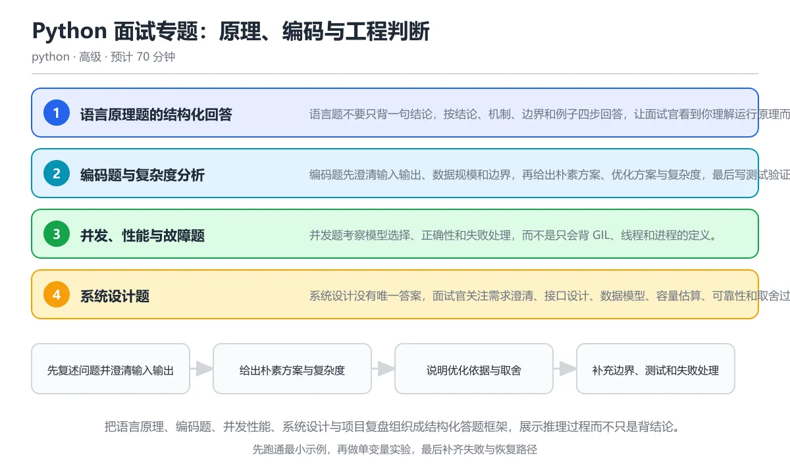

# Python 面试专题：原理、编码与工程判断

> 内容更新时间：2026-10-06 · 学习阶段：高级 · 预计用时：35 分钟

分类：python。关键词：复杂度、边界条件、系统设计、STAR、故障复盘。把语言原理、编码题、并发性能、系统设计与项目复盘组织成结构化答题框架，展示推理过程而不只是背结论。

学习建议：先通读《Python 面试专题：原理、编码与工程判断》的核心知识与关键流程，再运行可运行练习并完成测验；遇到不确定的结论，回到「故障现场」按症状、根因、修复、验证四步核对。



## 学习目标

- 能用结论、机制、边界和例子四段式回答语言原理题。
- 能在编码题中先澄清需求、分析复杂度并写测试。
- 能用取舍和指标讲述系统设计与项目复盘经历。

## 前置知识

- 已经掌握 Python 语法、数据结构、异常与模块。
- 理解并发、测试、数据库和网络的基础概念。
- 有至少一个可以完整讲述的项目经历。

## 核心知识

### 1. 语言原理题的结构化回答

语言题不要只背一句结论，按结论、机制、边界和例子四步回答，让面试官看到你理解运行原理而不只是记住答案。

先说核心结论，再解释解释器或数据结构如何实现，接着说明适用条件和反例，最后用一个自己项目中的场景收尾；如果版本不同，主动说明差异。

在Python 面试专题：原理、编码与工程判断里可以这样验证：回答可变默认参数时，先给出共享结论，再解释定义时求值机制，补充 None 哨兵修复，并举出测试互相污染的例子。

边界：不要为了显得全面而堆砌无关概念，也不要对不确定的细节编造答案；可以明确说明验证方法和需要查证的点。

工程视角：回答尽量落到可观测结果和工程后果，例如内存增长、竞态、部署失败，而不是停留在术语定义。

### 2. 编码题与复杂度分析

编码题先澄清输入输出、数据规模和边界，再给出朴素方案、优化方案与复杂度，最后写测试验证。

用少量例子确认理解，明确空输入、重复元素和极端值；先写正确性优先的实现，再根据瓶颈使用哈希、排序、双指针、堆或缓存优化。

在Python 面试专题：原理、编码与工程判断里可以这样验证：统计词频 Top-K 时用 Counter 计数，再按次数降序、字典序升序排序并截取前 K 项，说明时间复杂度。

边界：复杂度过高、修改输入、未处理空值或重复项都是常见扣分点；口头说明代码假设能减少歧义。

工程视角：写出可运行代码后补边界测试，说明可读性、内存和性能之间的取舍，不追求炫技。

### 3. 并发、性能与故障题

并发题考察模型选择、正确性和失败处理，而不是只会背 GIL、线程和进程的定义。

先判断任务瓶颈是 I/O 还是 CPU，再选择异步、线程、进程或队列；说明共享状态、锁、背压、超时、重试和幂等策略，最后给出测量与压测方法。

在Python 面试专题：原理、编码与工程判断里可以这样验证：面对爬虫大量请求的场景，先限制并发数与域名速率，再处理超时、重试和去重，并说明失败任务如何恢复。

边界：不能承诺没有验证过的性能数字；并发提高吞吐也可能增加下游压力，必须说明容量与降级策略。

工程视角：回答中带入监控指标、日志和回滚方案，展示生产思维。

### 4. 系统设计题

系统设计没有唯一答案，面试官关注需求澄清、接口设计、数据模型、容量估算、可靠性和取舍过程。

先确认功能与非功能需求，画出客户端、服务、存储和外部依赖的边界；估算 QPS、数据量和增长率，再讨论分区、缓存、一致性、故障恢复与安全。

在Python 面试专题：原理、编码与工程判断里可以这样验证：设计一个学习进度同步服务，说明离线写入、冲突合并、幂等接口和隐私保护。

边界：不要一上来堆技术名词，也不要忽略成本和运维复杂度；每个选择都要能说出放弃了什么。

工程视角：给出可观测指标、灰度方式和演进路线，先做能承载当前规模的简单方案。

### 5. 项目复盘与行为面

项目题用背景、任务、行动、结果结构讲述，重点是你如何发现问题、做取舍、协作并量化结果。

用 STAR 组织故事，补充关键指标、失败尝试和复盘结论；回答冲突题时展示倾听、验证和对事不对人的处理方式。

在Python 面试专题：原理、编码与工程判断里可以这样验证：讲一次性能优化：说明基线、剖析结论、改动、指标提升和遗留风险，而不是只说用了什么工具。

边界：不要夸大个人贡献或编造数据，也要避免把团队成果全部归为自己；细节要经得起追问。

工程视角：准备两三个不同主题的项目故事，覆盖技术难点、协作冲突和失败学习，并熟悉其中的代码与数据。

## 关键流程

```text
先复述问题并澄清输入输出 → 给出朴素方案与复杂度 → 说明优化依据与取舍 → 补充边界、测试和失败处理 → 用项目案例证明工程判断
```

1. 先复述问题并澄清输入输出
2. 给出朴素方案与复杂度
3. 说明优化依据与取舍
4. 补充边界、测试和失败处理
5. 用项目案例证明工程判断

## 动手练习

1. 选三个语言原理题，按结论、机制、边界、例子写出口述稿并控制在两分钟内。
2. 完成一道中等难度编码题，补齐空输入、重复项和大规模用例的复杂度说明。
3. 用容量估算设计一个学习进度同步服务，写出接口、存储、一致性和故障处理方案。
4. 用 STAR 结构整理一个性能优化或故障复盘故事，并准备数据与代码细节。

**验收标准**：留下输入、命令、输出和结论，能让别人按记录复现。

## 常见错误与排查

> 说明：本表由《Python 面试专题：原理、编码与工程判断》的核心知识整理（2026-10-06），人工复核进度见 docs/content_review_batches.md。

| 易错点 | 容易踩的做法 | 正确结论 |
| --- | --- | --- |
| 不澄清需求直接写代码 | 听到题目就立刻编码，忽略了输入范围、空值和重复元素等关键假设 | 先用两个例子复述输入输出，确认规模与边界后再给方案 |
| 只给结论不说边界 | 回答 GIL 让线程完全没用，忽略 I/O 等待会释放锁的事实 | 按结论、机制、边界和例子四步回答，说明适用条件 |
| 背诵答案却联系不上项目 | 能背出事务定义，却说不清自己项目里为什么选这个隔离级别 | 准备真实项目案例，说明问题、选择、指标和复盘 |
| 编码后没有测试 | 写完函数只跑一个正常样例，没有覆盖空输入和极端值 | 主动列出边界用例并口头验证，必要时写出测试代码 |

## 可运行练习

### 任务 1：先跑通，再解释

```python
from collections import Counter

def top_k(text: str, k: int) -> list[tuple[str, int]]:
    if k <= 0:
        return []
    counts = Counter(text.lower().split())
    return sorted(counts.items(), key=lambda item: (-item[1], item[0]))[:k]

sample = "python sql python asyncio sql python"
print(top_k(sample, 2))
print(top_k(sample, 0))
```

函数先处理非正数 K 的边界，再用 Counter 统计词频；排序键先按次数降序，再按单词字典序升序，保证结果稳定；最后截取前 K 项。面试中应补充时间复杂度、空输入、大小写和 Unicode 词边界等假设。

### 任务 2：只改一个条件

复制上面的示例，只改一个输入或参数再跑一次；先写下预测，再和真实输出对照，并说明差异来自Python 面试专题：原理、编码与工程判断的哪条机制。

### 任务 3：迁移到自己的数据

把《Python 面试专题：原理、编码与工程判断》里的示例换成你自己的一小段数据或场景，保持结构不变；如果换不动，说明还有哪条前提没有理解，回到核心知识对应小节。

## 故障现场

### 现场 1：不澄清需求直接写代码

**症状**：在《Python 面试专题：原理、编码与工程判断》里采用「听到题目就立刻编码，忽略了输入范围、空值和重复元素等关键假设」时，不澄清需求直接写代码会表现为错误结果、异常中断或状态不一致。

**根因**：这个做法没有执行与「不澄清需求直接写代码」对应的检查，问题被带到了后续步骤。

**修复**：先用两个例子复述输入输出，确认规模与边界后再给方案

**验证**：为「不澄清需求直接写代码」准备一个最小输入，确认修复前的失败可以复现，修复后的输出与本课示例一致，再补一个边界输入。

### 现场 2：只给结论不说边界

**症状**：在《Python 面试专题：原理、编码与工程判断》里采用「回答 GIL 让线程完全没用，忽略 I/O 等待会释放锁的事实」时，只给结论不说边界会表现为错误结果、异常中断或状态不一致。

**根因**：这个做法没有执行与「只给结论不说边界」对应的检查，问题被带到了后续步骤。

**修复**：按结论、机制、边界和例子四步回答，说明适用条件

**验证**：为「只给结论不说边界」准备一个最小输入，确认修复前的失败可以复现，修复后的输出与本课示例一致，再补一个边界输入。

### 现场 3：背诵答案却联系不上项目

**症状**：在《Python 面试专题：原理、编码与工程判断》里采用「能背出事务定义，却说不清自己项目里为什么选这个隔离级别」时，背诵答案却联系不上项目会表现为错误结果、异常中断或状态不一致。

**根因**：这个做法没有执行与「背诵答案却联系不上项目」对应的检查，问题被带到了后续步骤。

**修复**：准备真实项目案例，说明问题、选择、指标和复盘

**验证**：为「背诵答案却联系不上项目」准备一个最小输入，确认修复前的失败可以复现，修复后的输出与本课示例一致，再补一个边界输入。

### 现场 4：编码后没有测试

**症状**：在《Python 面试专题：原理、编码与工程判断》里采用「写完函数只跑一个正常样例，没有覆盖空输入和极端值」时，编码后没有测试会表现为错误结果、异常中断或状态不一致。

**根因**：这个做法没有执行与「编码后没有测试」对应的检查，问题被带到了后续步骤。

**修复**：主动列出边界用例并口头验证，必要时写出测试代码

**验证**：为「编码后没有测试」准备一个最小输入，确认修复前的失败可以复现，修复后的输出与本课示例一致，再补一个边界输入。

## 本课复习清单

离开本课前，逐项确认：

- [ ] 能用四段式回答语言原理题。
- [ ] 能在编码前澄清边界并分析复杂度。
- [ ] 能用指标与取舍讲述项目和系统设计。
- [ ] 至少运行一次本课示例，记录输入、输出和一个边界情况。
- [ ] 把本课最容易混淆的两个概念写成一句话对照。

| 复盘项 | 记录 |
| --- | --- |
| 已经能独立解释的考点 |  |
| 仍然说不清的概念 |  |
| 下一步验证动作 |  |

## 复习与自测

### 核心知识

遮住正文回答：Python 面试专题：原理、编码与工程判断解决什么问题、依赖哪些前提、失败时先看哪个信号？三问都能答清楚，再进入下一节。

### 动手练习

把《Python 面试专题：原理、编码与工程判断》里「只改一个条件」的练习再做一遍，这次先写预测再运行；预测和结果不一致的地方，就是需要回读的章节。

### 最小可运行示例

```python
from collections import Counter

def top_k(text: str, k: int) -> list[tuple[str, int]]:
    if k <= 0:
        return []
    counts = Counter(text.lower().split())
    return sorted(counts.items(), key=lambda item: (-item[1], item[0]))[:k]

sample = "python sql python asyncio sql python"
print(top_k(sample, 2))
print(top_k(sample, 0))
```

### 预期输出

```text
[('python', 3), ('sql', 2)]
[]
```

### 验证步骤

1. 确认输入数据与运行环境和示例一致。
2. 运行示例，记录输出与耗时等可观测指标。
3. 换一个边界输入重跑，确认结论仍然成立。
4. 把两次结果写成一句话结论，注明前提与局限。

## 术语速查

先遮住右列，尝试用自己的话解释，再回到正文核对。

| 术语 | 一句话说明 |
| --- | --- |
| `复杂度分析` | 用输入规模描述时间和空间增长趋势的方法，常以大 O 记号表示。 |
| `边界条件` | 空输入、极值、重复项和非法值等最容易暴露实现缺陷的输入。 |
| `STAR` | 按背景、任务、行动、结果组织行为面试回答的结构。 |
| `系统设计` | 在功能、容量、可靠性、成本和演进之间做取舍并描述组件关系的过程。 |
| `权衡` | 选择一种方案时明确获得的能力与放弃的代价。 |
| `故障复盘` | 在事故后还原时间线、根因、影响和改进项的系统性总结。 |

## 考点精讲

### 考点 1：回答 Python 语言原理题时，推荐的

题型：概念判断。题干：回答 Python 语言原理题时，推荐的结构是什么？

判断要点：结论、机制、边界、例子。先用一句话给结论，再解释底层机制，说明适用边界与反例，最后用项目例子落地，能同时展示记忆、理解和应用能力。只背定义无法应对追问，堆砌术语也会暴露对边界和工程后果理解不足。 正确选项「结论、机制、边界、例子」对应《Python 面试专题：原理、编码与工程判断》的要点「语言原理题的结构化回答」：语言题不要只背一句结论，按结论、机制、边界和例子四步回答，让面试官看到你理解运行原理而不只是记住答案。判断「语言原理题的结构化回答」时先确认前提是否成立，再回到《Python 面试专题：原理、编码与工程判断》的示例核对一次；把别的语言或框架的默认做法直接搬到语言原理题的结构化回答上，往往会在本课的边界条件里失效。

### 考点 2：拿到编码题后第一步应该做什么？

题型：概念判断。题干：拿到编码题后第一步应该做什么？

判断要点：澄清输入输出、规模和边界假设。先确认问题定义、数据规模、是否允许修改输入以及空值处理方式，可以避免整段方向错误；然后用小例子验证理解，给出朴素方案与优化方案，最后再编码并测试。直接写代码可能因为一个未澄清的约束全部返工。 正确选项「澄清输入输出、规模和边界假设」对应《Python 面试专题：原理、编码与工程判断》的要点「编码题与复杂度分析」：编码题先澄清输入输出、数据规模和边界，再给出朴素方案、优化方案与复杂度，最后写测试验证。判断「编码题与复杂度分析」时先确认前提是否成立，再回到《Python 面试专题：原理、编码与工程判断》的示例核对一次；借鉴相邻主题的经验之前，先核对编码题与复杂度分析的前提是否成立。

### 考点 3：系统设计回答中应该包含哪些内容？（多选）

题型：多选辨析。题干：系统设计回答中应该包含哪些内容？（多选）

判断要点：功能与非功能需求；容量估算与瓶颈分析；故障恢复与可观测性。需求澄清、容量估算和可靠性设计构成系统设计主线，每个组件选择都要说明代价和放弃的能力。只列技术名词无法证明你理解约束，面试官更关注你如何从简单方案逐步演进到满足规模的方案。 正确选项「功能与非功能需求；容量估算与瓶颈分析；故障恢复与可观测性」对应《Python 面试专题：原理、编码与工程判断》的要点「并发、性能与故障题」：并发题考察模型选择、正确性和失败处理，而不是只会背 GIL、线程和进程的定义。判断「并发、性能与故障题」时先确认前提是否成立，再回到《Python 面试专题：原理、编码与工程判断》的示例核对一次；记住并发、性能与故障题的结论之外还要记住适用条件，换一个输入往往就不成立了。

### 考点 4：阅读 top_k 代码，当 k 为 0 

题型：代码阅读。题干：阅读 top_k 代码，当 k 为 0 时返回什么？

判断要点：空列表 []。函数在最前面处理非正数 K 并返回空列表，避免切片出现意外语义；如果省略这个分支，Python 的切片 [:0] 同样返回空列表，但负数会返回除末尾之外的所有元素。显式边界处理能让行为清晰并方便测试。 正确选项「空列表 []」对应《Python 面试专题：原理、编码与工程判断》的要点「系统设计题」：系统设计没有唯一答案，面试官关注需求澄清、接口设计、数据模型、容量估算、可靠性和取舍过程。判断「系统设计题」时先确认前提是否成立，再回到《Python 面试专题：原理、编码与工程判断》的示例核对一次；干扰项常常是相邻主题里成立的结论，只有按系统设计题的输入与约束判断才能排除。

### 考点 5：项目复盘中哪种讲法最有说服力？

题型：排错。题干：项目复盘中哪种讲法最有说服力？

判断要点：先给基线和问题，再讲方案、指标变化与遗留风险。基线、问题、方案、指标和遗留风险构成完整因果链，能证明你真正参与并理解工程取舍；只堆技术名词或夸大贡献经不起追问。失败尝试和复盘同样有价值，能展示学习和协作能力。这道题对应面试中的故障复盘表达：用 STAR 讲清基线、方案、指标和遗留风险。 正确选项「先给基线和问题，再讲方案、指标变化与遗留风险」对应《Python 面试专题：原理、编码与工程判断》的要点「项目复盘与行为面」：项目题用背景、任务、行动、结果结构讲述，重点是你如何发现问题、做取舍、协作并量化结果。判断「项目复盘与行为面」时先确认前提是否成立，再回到《Python 面试专题：原理、编码与工程判断》的示例核对一次；把项目复盘与行为面的做法换到别的约束下未必成立，先确认边界再决定答案。

## English Overview

Python Interview Guide: Language, Coding and Engineering Judgment

This interview guide turns Python knowledge into structured answers: conclusion, mechanism, boundary and example for language questions; clarification, complexity and tests for coding; model selection and failure handling for concurrency; requirement, capacity and trade-off reasoning for system design; and STAR stories with measurable outcomes.

## 本课小结

- Python 面试专题：原理、编码与工程判断围绕复杂度、边界条件、系统设计展开，先建立基线再讨论优化。
- 语言题不要只背一句结论，按结论、机制、边界和例子四步回答，让面试官看到你理解运行原理而不只是记住答案。
- 遇到问题时按「症状 → 根因 → 修复 → 验证」的顺序处理，不跳过验证。

## 内容元数据

- 内容版本：v2.0
- 最后更新：2026-10-06
- 学习阶段：高级

| 字段 | 值 |
| --- | --- |
| 课程 ID | `python_interview` |
| 所属分类 | `python` |
| 难度 | 高级 |
| 预计用时 | 70 分钟 |
| 关键词 | 复杂度、边界条件、系统设计、STAR、故障复盘 |
| 配图 | `images/lesson_python_interview.webp` |
| 参考资料 | 4 条 |
| 内容更新时间 | 2026-10-06 |

## 参考资料与复核

- 最后复核：2026-10-04
- 下次复核：2026-11-10
- 复核范围：版本兼容、API 行为与工程实践

下面列出的资料用于核对本课结论，复习时可以对照阅读：
- [Python 官方 FAQ](https://docs.python.org/3/faq/)
- [Python 语言参考](https://docs.python.org/3/reference/)
- [Tech Interview Handbook](https://www.techinterviewhandbook.org/)
- [System Design Primer](https://github.com/donnemartin/system-design-primer)

> 复核提示：《Python 面试专题：原理、编码与工程判断》的结论如与资料冲突，以资料中的规范文本为准，并在笔记里记录差异与日期。

## 复习与迁移

### 概念复述

不看正文，把Python 面试专题：原理、编码与工程判断讲给一个没学过的同事：先讲它解决什么问题，再讲一个最小例子，最后说明一个不适用场景。

### 测验回顾

回到《Python 面试专题：原理、编码与工程判断》测验，只重做答错或犹豫的题；对每道题写一句「我为什么改选这个答案」，写不出理由就回到对应小节。

### 迁移练习

把《Python 面试专题：原理、编码与工程判断》的方法用到一个你自己的真实场景：说明输入、约束与验证方式，并列出仍然不确定、需要下一次实验回答的问题。

## 深度拓展与实战

这一节把Python 面试专题：原理、编码与工程判断的机制拆开验证：每一步都给出输入、判断标准和失败信号，便于在真实项目里复用。

### 机制拆解 1：语言原理题的结构化回答

先说核心结论，再解释解释器或数据结构如何实现，接着说明适用条件和反例，最后用一个自己项目中的场景收尾；如果版本不同，主动说明差异。

落地时先确认前提：不要为了显得全面而堆砌无关概念，也不要对不确定的细节编造答案；可以明确说明验证方法和需要查证的点。；再把结论写进检查表，让下一位同学可以按同样的输入复现。

工程做法：回答尽量落到可观测结果和工程后果，例如内存增长、竞态、部署失败，而不是停留在术语定义。

### 机制拆解 2：编码题与复杂度分析

用少量例子确认理解，明确空输入、重复元素和极端值；先写正确性优先的实现，再根据瓶颈使用哈希、排序、双指针、堆或缓存优化。

落地时先确认前提：复杂度过高、修改输入、未处理空值或重复项都是常见扣分点；口头说明代码假设能减少歧义。；再把结论写进检查表，让下一位同学可以按同样的输入复现。

工程做法：写出可运行代码后补边界测试，说明可读性、内存和性能之间的取舍，不追求炫技。

### 机制拆解 3：并发、性能与故障题

先判断任务瓶颈是 I/O 还是 CPU，再选择异步、线程、进程或队列；说明共享状态、锁、背压、超时、重试和幂等策略，最后给出测量与压测方法。

落地时先确认前提：不能承诺没有验证过的性能数字；并发提高吞吐也可能增加下游压力，必须说明容量与降级策略。；再把结论写进检查表，让下一位同学可以按同样的输入复现。

工程做法：回答中带入监控指标、日志和回滚方案，展示生产思维。

### 机制拆解 4：系统设计题

先确认功能与非功能需求，画出客户端、服务、存储和外部依赖的边界；估算 QPS、数据量和增长率，再讨论分区、缓存、一致性、故障恢复与安全。

落地时先确认前提：不要一上来堆技术名词，也不要忽略成本和运维复杂度；每个选择都要能说出放弃了什么。；再把结论写进检查表，让下一位同学可以按同样的输入复现。

工程做法：给出可观测指标、灰度方式和演进路线，先做能承载当前规模的简单方案。

### 机制拆解 5：项目复盘与行为面

用 STAR 组织故事，补充关键指标、失败尝试和复盘结论；回答冲突题时展示倾听、验证和对事不对人的处理方式。

落地时先确认前提：不要夸大个人贡献或编造数据，也要避免把团队成果全部归为自己；细节要经得起追问。；再把结论写进检查表，让下一位同学可以按同样的输入复现。

工程做法：准备两三个不同主题的项目故事，覆盖技术难点、协作冲突和失败学习，并熟悉其中的代码与数据。

### 机制对照表

| 概念 | 解决什么问题 | 关键前提 | 失败信号 |
| --- | --- | --- | --- |
| 语言原理题的结构化回答 | 语言题不要只背一句结论，按结论、机制、边界和例子四步回答，让面试官看到你理解运行 | 不要为了显得全面而堆砌无关概念，也不要对不确定的细节编造答案；可以明确说 | 回答尽量落到可观测结果和工程后果，例如内存增长、竞态、部署失败，而不是停 |
| 编码题与复杂度分析 | 编码题先澄清输入输出、数据规模和边界，再给出朴素方案、优化方案与复杂度，最后写测 | 复杂度过高、修改输入、未处理空值或重复项都是常见扣分点；口头说明代码假设 | 写出可运行代码后补边界测试，说明可读性、内存和性能之间的取舍，不追求炫技 |
| 并发、性能与故障题 | 并发题考察模型选择、正确性和失败处理，而不是只会背 GIL、线程和进程的定义。 | 不能承诺没有验证过的性能数字；并发提高吞吐也可能增加下游压力，必须说明容 | 回答中带入监控指标、日志和回滚方案，展示生产思维。 |
| 系统设计题 | 系统设计没有唯一答案，面试官关注需求澄清、接口设计、数据模型、容量估算、可靠性和 | 不要一上来堆技术名词，也不要忽略成本和运维复杂度；每个选择都要能说出放弃 | 给出可观测指标、灰度方式和演进路线，先做能承载当前规模的简单方案。 |
| 项目复盘与行为面 | 项目题用背景、任务、行动、结果结构讲述，重点是你如何发现问题、做取舍、协作并量化 | 不要夸大个人贡献或编造数据，也要避免把团队成果全部归为自己；细节要经得起 | 准备两三个不同主题的项目故事，覆盖技术难点、协作冲突和失败学习，并熟悉其 |

### 自测问答

**问 1**：回答 Python 语言原理题时，推荐的结构是什么？

**答**：结论、机制、边界、例子。先用一句话给结论，再解释底层机制，说明适用边界与反例，最后用项目例子落地，能同时展示记忆、理解和应用能力。只背定义无法应对追问，堆砌术语也会暴露对边界和工程后果理解不足。 正确选项「结论、机制、边界、例子」对应《Python 面试专题：原理、编码与工程判断》的要点「语言原理题的结构化回答」：语言题不要只背一句结论，按结论、机制、边界和例子四步回答，让面试官看到你理解运行原理而不只是记住答案。判断「语言原理题的结构化回答」时先确认前提是否成立，再回到《Python 面试专题：原理、编码与工程判断》的示例核对一次；把别的语言或框架的默认做法直接搬到语言原理题的结构化回答上，往往会在本课的边界条件里失效。

**问 2**：拿到编码题后第一步应该做什么？

**答**：澄清输入输出、规模和边界假设。先确认问题定义、数据规模、是否允许修改输入以及空值处理方式，可以避免整段方向错误；然后用小例子验证理解，给出朴素方案与优化方案，最后再编码并测试。直接写代码可能因为一个未澄清的约束全部返工。 正确选项「澄清输入输出、规模和边界假设」对应《Python 面试专题：原理、编码与工程判断》的要点「编码题与复杂度分析」：编码题先澄清输入输出、数据规模和边界，再给出朴素方案、优化方案与复杂度，最后写测试验证。判断「编码题与复杂度分析」时先确认前提是否成立，再回到《Python 面试专题：原理、编码与工程判断》的示例核对一次；借鉴相邻主题的经验之前，先核对编码题与复杂度分析的前提是否成立。

**问 3**：系统设计回答中应该包含哪些内容？（多选）

**答**：功能与非功能需求；容量估算与瓶颈分析；故障恢复与可观测性。需求澄清、容量估算和可靠性设计构成系统设计主线，每个组件选择都要说明代价和放弃的能力。只列技术名词无法证明你理解约束，面试官更关注你如何从简单方案逐步演进到满足规模的方案。 正确选项「功能与非功能需求；容量估算与瓶颈分析；故障恢复与可观测性」对应《Python 面试专题：原理、编码与工程判断》的要点「并发、性能与故障题」：并发题考察模型选择、正确性和失败处理，而不是只会背 GIL、线程和进程的定义。判断「并发、性能与故障题」时先确认前提是否成立，再回到《Python 面试专题：原理、编码与工程判断》的示例核对一次；记住并发、性能与故障题的结论之外还要记住适用条件，换一个输入往往就不成立了。

**问 4**：阅读 top_k 代码，当 k 为 0 时返回什么？

**答**：空列表 []。函数在最前面处理非正数 K 并返回空列表，避免切片出现意外语义；如果省略这个分支，Python 的切片 [:0] 同样返回空列表，但负数会返回除末尾之外的所有元素。显式边界处理能让行为清晰并方便测试。 正确选项「空列表 []」对应《Python 面试专题：原理、编码与工程判断》的要点「系统设计题」：系统设计没有唯一答案，面试官关注需求澄清、接口设计、数据模型、容量估算、可靠性和取舍过程。判断「系统设计题」时先确认前提是否成立，再回到《Python 面试专题：原理、编码与工程判断》的示例核对一次；干扰项常常是相邻主题里成立的结论，只有按系统设计题的输入与约束判断才能排除。

**问 5**：项目复盘中哪种讲法最有说服力？

**答**：先给基线和问题，再讲方案、指标变化与遗留风险。基线、问题、方案、指标和遗留风险构成完整因果链，能证明你真正参与并理解工程取舍；只堆技术名词或夸大贡献经不起追问。失败尝试和复盘同样有价值，能展示学习和协作能力。这道题对应面试中的故障复盘表达：用 STAR 讲清基线、方案、指标和遗留风险。 正确选项「先给基线和问题，再讲方案、指标变化与遗留风险」对应《Python 面试专题：原理、编码与工程判断》的要点「项目复盘与行为面」：项目题用背景、任务、行动、结果结构讲述，重点是你如何发现问题、做取舍、协作并量化结果。判断「项目复盘与行为面」时先确认前提是否成立，再回到《Python 面试专题：原理、编码与工程判断》的示例核对一次；把项目复盘与行为面的做法换到别的约束下未必成立，先确认边界再决定答案。

### 排错速查

- 看到「听到题目就立刻编码，忽略了输入范围、空值和重复元素等关键假设」时，先按「先用两个例子复述输入输出，确认规模与边界后再给方案」处理，再用Python 面试专题：原理、编码与工程判断的最小示例确认结论是否恢复。
- 看到「回答 GIL 让线程完全没用，忽略 I/O 等待会释放锁的事实」时，先按「按结论、机制、边界和例子四步回答，说明适用条件」处理，再用Python 面试专题：原理、编码与工程判断的最小示例确认结论是否恢复。
- 看到「能背出事务定义，却说不清自己项目里为什么选这个隔离级别」时，先按「准备真实项目案例，说明问题、选择、指标和复盘」处理，再用Python 面试专题：原理、编码与工程判断的最小示例确认结论是否恢复。
- 看到「写完函数只跑一个正常样例，没有覆盖空输入和极端值」时，先按「主动列出边界用例并口头验证，必要时写出测试代码」处理，再用Python 面试专题：原理、编码与工程判断的最小示例确认结论是否恢复。

### 工程检查表

- [ ] 先复述问题并澄清输入输出
- [ ] 给出朴素方案与复杂度
- [ ] 说明优化依据与取舍
- [ ] 补充边界、测试和失败处理
- [ ] 用项目案例证明工程判断
- [ ] 【语言原理题的结构化回答】回答尽量落到可观测结果和工程后果，例如内存增长、竞态、部署失败，而不是停留在术语定义。
- [ ] 【编码题与复杂度分析】写出可运行代码后补边界测试，说明可读性、内存和性能之间的取舍，不追求炫技。
- [ ] 【并发、性能与故障题】回答中带入监控指标、日志和回滚方案，展示生产思维。
- [ ] 【系统设计题】给出可观测指标、灰度方式和演进路线，先做能承载当前规模的简单方案。
- [ ] 【项目复盘与行为面】准备两三个不同主题的项目故事，覆盖技术难点、协作冲突和失败学习，并熟悉其中的代码与数据。

### 迁移练习

把Python 面试专题：原理、编码与工程判断的方法用到一个真实场景：写下复杂度、边界条件、系统设计在你的场景里分别对应什么，再记录一次失败尝试和它的恢复步骤。

### 延伸阅读与下一步

- 复习复杂度、边界条件、系统设计、STAR、故障复盘时，优先回看「语言原理题的结构化回答」与「项目复盘与行为面」两节。
- 把从「先复述问题并澄清输入输出」到「用项目案例证明工程判断」的流程画成一张图，放进自己的笔记。
- 一周后重做本课测验，只把答错的题留到下一轮复习。

### 结论与下一步

学完Python 面试专题：原理、编码与工程判断，应该能独立完成三件事：先用最小示例确认复杂度的行为，再用一个边界输入验证结论，最后把失败路径写成可重复的检查。下一步把本课术语加入复习清单，并在两周内用一次真实任务检验记忆是否牢固。
