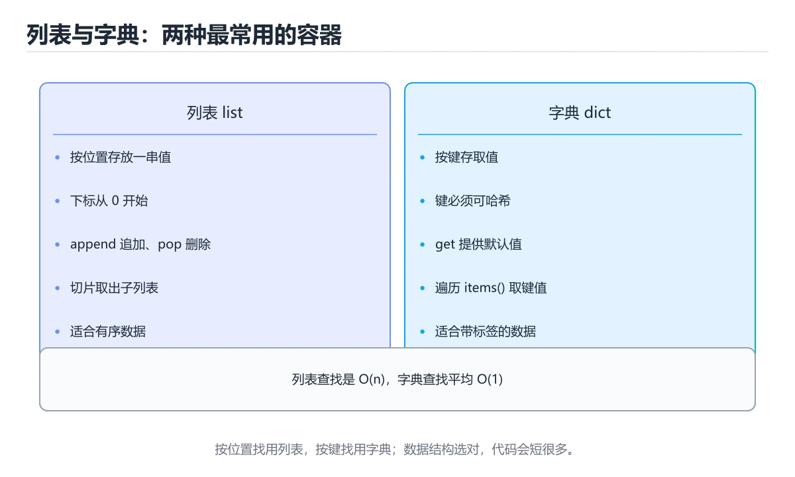
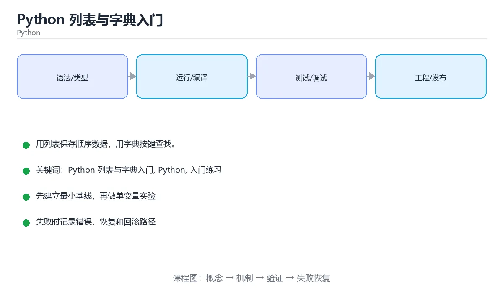

# Python 列表与字典入门

> 内容更新时间：2026-10-06 · 学习阶段：基础 · 预计用时：40 分钟





## 本节知识框架

**课程定位**：所属分类 `python`（Python），课程主题 `Python 列表与字典入门`，学习阶段 基础，建议用时 50 分钟。

本课主线：用列表保存顺序数据，用字典按键查找。

**学完本课应当能够**
- 说清 `列表（list）` 与 `字典（dict）` 的含义与区别，并各举一个正例和一个反例。
- 用本课示例验证 `索引` 的行为，记录输入、输出与失败条件。
- 遇到「遍历列表时修改列表」这类问题时，能说出触发条件与修复顺序。

### 从概念到验证的学习链条

1. `列表（list）`：先掌握 有序可变的序列，用下标访问，可增删元素，再用它解释 `字典（dict）` 为什么会出现。
2. `字典（dict）`：先掌握 键值对集合，按键查找，键必须可哈希且唯一，再用它解释 `索引` 为什么会出现。
3. `索引`：先掌握 用从 0 开始的位置取元素，负数下标表示从末尾倒数，再用它解释 `切片` 为什么会出现。
4. `切片`：先掌握 用 list[a:b] 取出一段子序列，区间左闭右开，再用它解释 `遍历` 为什么会出现。
5. `遍历`：先掌握 用 for 逐个访问元素，遍历字典时默认拿到键，再用它解释 `虚拟环境` 为什么会出现。
6. `虚拟环境`：先掌握 虚拟环境隔离项目依赖，requirements.txt、pyproject.toml 和锁文件记录依赖版本；不要依赖全局环境中的隐式包，再用它解释 本课示例的观察结果 为什么会出现。

**先修与衔接**：本课是「Python」分类的第 5 课。先修内容：《Python 循环入门》。《Python 循环入门》里的 `for 循环`、`while 循环` 是本课的前提。

### 完成判据

- **定义关**：不看正文也能说明 `列表（list）` 是 有序可变的序列，用下标访问，可增删元素，并指出一个反例。
- **机制关**：能按“输入 → 转换 → 输出 → 验证”复述 `Python 列表与字典入门`，而不是只背结论。
- **示例关**：能运行或推演 `Python 列表与字典入门` 的 `python` 示例，并说明一个真实出现的标识符或字面量。
- **证据关**：能指出 `Python 列表与字典入门` 示例里的 调用了 `print()`，并说明它支持或反驳了本课的哪一条结论。
- **排错关**：能复现 遍历列表时修改列表，记录现象并按 遍历副本，或先收集待删元素再处理 修复。
- **迁移关**：能把 `Python 列表与字典入门`、`Python`、`入门练习` 放进一个与 `Python 列表与字典入门` 不同的项目场景，并保持输入与验证条件可追踪。
- **复盘关**：学完 `Python 列表与字典入门` 后，用一句话写下仍然不确定的结论，并列出下一次验证需要的输入、环境和成功判据。

### 复习清单

- [ ] 能不看正文复述本课核心术语，并指出一个边界或反例。
- [ ] 能运行或推演本课示例，记录输入、输出与失败现象。
- [ ] 能完成一次自测，并把错题对照错误表定位原因。

## 核心概念定义

| 术语 | 操作性定义 | 常见边界与风险 |
| --- | --- | --- |
| 列表（list） | 有序可变的序列，用下标访问，可增删元素。 | 只在「有序可变的序列，用下标访问，可增删元素」这一前提下成立，换输入或换环境要重新验证。 |
| 字典（dict） | 键值对集合，按键查找，键必须可哈希且唯一。 | 只在「键值对集合，按键查找，键必须可哈希且唯一」这一前提下成立，换输入或换环境要重新验证。 |
| 索引 | 用从 0 开始的位置取元素，负数下标表示从末尾倒数。 | 只在「用从 0 开始的位置取元素，负数下标表示从末尾倒数」这一前提下成立，换输入或换环境要重新验证。 |
| 切片 | 用 list[a:b] 取出一段子序列，区间左闭右开。 | 只在「用 list[a:b] 取出一段子序列，区间左闭右开」这一前提下成立，换输入或换环境要重新验证。 |
| 遍历 | 用 for 逐个访问元素，遍历字典时默认拿到键。 | 易错：漏掉元素或下标错乱；正确做法是遍历副本，或先收集待删元素再处理。 |
| 虚拟环境 | 虚拟环境隔离项目依赖，requirements.txt、pyproject.toml 和锁文件记录依赖版本；不要依赖全局环境中的隐式包 | 不同版本与依赖组合的行为可能不同，升级或换环境前要按官方变更说明重新验证。 |

## 原理与运行机制

### 机制总览

**教材衔接：一句话入门**

用列表保存顺序数据，用字典按键查找。

**教材衔接：Python 基础机制速览**

### 解释器、模块与虚拟环境

Python 源码由解释器编译成字节码再执行，`.py` 文件可以直接运行或作为模块导入。`if __name__ == "__main__":` 用来区分“直接运行”和“被导入”，让模块既提供函数又保留命令行入口。虚拟环境隔离项目依赖，`requirements.txt`、`pyproject.toml` 和锁文件记录依赖版本；不要依赖全局环境中的隐式包。

### 动态类型、真值与对象模型

变量名只是对象的引用，类型属于对象而不是变量，因此同一个名字可以先后指向不同类型的对象。真值判断把空容器、0、空字符串和 None 视为假；需要区分 None 与空值时使用 `is None`。`is` 比较对象身份，`==` 比较值。整数、字符串和元组不可变，列表、字典和集合可变；可变对象作为默认参数会在多次调用间共享，应使用 None 作为占位再在函数内创建。

### 容器、切片与推导式

列表适合有序可变序列，元组适合固定结构，字典保存键值映射，集合用于去重和成员检查。切片 `start:stop:step` 产生新对象，负下标从末尾计数，越界切片通常不会报错但单个下标会抛 IndexError。推导式适合“从可迭代对象生成新容器”，但多层嵌套或带副作用的推导式会降低可读性，应改回普通循环。

### 函数、作用域与迭代

函数参数支持位置、关键字、默认值、`*args` 和 `**kwargs`，调用方要避免可变默认值陷阱。局部变量在函数内赋值后不会自动修改全局变量，需要 `global` 或 `nonlocal` 显式声明。生成器用 `yield` 惰性产生值，迭代器和 `itertools` 能处理大数据流。装饰器在不修改原函数签名的前提下增加日志、缓存、权限或重试逻辑。

### 异常、上下文管理与打包

异常用于表达无法正常继续的情况，使用 `try/except/else/finally` 精确包住可能失败的操作，避免捕获过宽。`with` 通过上下文管理器保证资源释放，文件、锁和数据库连接都应使用它。发布代码时要考虑包结构、入口点、类型标注、测试和性能分析；先用 profiler 找到瓶颈，再决定是优化算法、数据结构还是 I/O。

**教材衔接：版本与时效**

### 升级检查清单

- 先固定当前版本，跑通全部示例与测验，再升级工具链。
- 只改 Python 列表与字典入门 的版本变量，记录编译、测试与产物体积的变化。
- 回归范围锁定 minutes 的默认行为，并确认弃用警告是否出现在构建输出里。
- 升级完成后记录 Python 列表与字典入门 的新旧版本差异，并据此调整下次复核时间。

### 机制拆解：每一步的输入、动作与输出

#### 1. `列表（list）`
- 输入：`Python 列表与字典入门`；本步把 有序可变的序列，用下标访问，可增删元素 当作判断规则。
- 动作：围绕 `列表（list）` 保留中间状态，并记录它与 `字典（dict）` 的对应关系。
- 输出：`字典（dict）`，它可以被下一段代码、测试或记录继续使用。
- `列表（list）` 的失败条件：只在「有序可变的序列，用下标访问，可增删元素」这一前提下成立，换输入或换环境要重新验证。

#### 2. `字典（dict）`
- 输入：`列表（list）`；本步把 键值对集合，按键查找，键必须可哈希且唯一 当作判断规则。
- 动作：围绕 `字典（dict）` 保留中间状态，并记录它与 `索引` 的对应关系。
- 输出：`索引`，它可以被下一段代码、测试或记录继续使用。
- `字典（dict）` 的失败条件：只在「键值对集合，按键查找，键必须可哈希且唯一」这一前提下成立，换输入或换环境要重新验证。

#### 3. `索引`
- 输入：`字典（dict）`；本步把 用从 0 开始的位置取元素，负数下标表示从末尾倒数 当作判断规则。
- 动作：围绕 `索引` 保留中间状态，并记录它与 `切片` 的对应关系。
- 输出：`切片`，它可以被下一段代码、测试或记录继续使用。
- `索引` 的失败条件：只在「用从 0 开始的位置取元素，负数下标表示从末尾倒数」这一前提下成立，换输入或换环境要重新验证。

#### 4. `切片`
- 输入：`索引`；本步把 用 list[a:b] 取出一段子序列，区间左闭右开 当作判断规则。
- 动作：围绕 `切片` 保留中间状态，并记录它与 `遍历` 的对应关系。
- 输出：`遍历`，它可以被下一段代码、测试或记录继续使用。
- `切片` 的失败条件：只在「用 list[a:b] 取出一段子序列，区间左闭右开」这一前提下成立，换输入或换环境要重新验证。

#### 5. `遍历`
- 输入：`切片`；本步把 用 for 逐个访问元素，遍历字典时默认拿到键 当作判断规则。
- 动作：围绕 `遍历` 保留中间状态，并记录它与 `虚拟环境` 的对应关系。
- 输出：`虚拟环境`，它可以被下一段代码、测试或记录继续使用。
- `遍历` 的失败条件：当遍历列表时修改列表时，会出现漏掉元素或下标错乱。

#### 6. `虚拟环境`
- 输入：`遍历`；本步把 虚拟环境隔离项目依赖，requirements.txt、pyproject.toml 和锁文件记录依赖版本；不要依赖全局环境中的隐式包 当作判断规则。
- 动作：围绕 `虚拟环境` 保留中间状态，并记录它与 `print` 的对应关系。
- 输出：`print`，它可以被下一段代码、测试或记录继续使用。
- `虚拟环境` 的失败条件：不同版本与依赖组合的行为可能不同，升级或换环境前要按官方变更说明重新验证。

### 示例中的可观察事实

1. 调用了 `print()`；它对应的课程主题是 `Python 列表与字典入门`。
2. 出现字面量 `python-1`；它对应的课程主题是 `Python 列表与字典入门`。
3. 出现字面量 `minutes`；它对应的课程主题是 `Python 列表与字典入门`。
4. 出现字面量 `], lesson[`；它对应的课程主题是 `Python 列表与字典入门`。

### 复现实验记录

- 环境：`Python 列表与字典入门` 使用 `python` 示例，固定 `Python 列表与字典入门`、`Python`、`入门练习` 作为第一组条件。
- 首轮输入：先确认 调用了 `print()`，预测 `列表（list）` 会怎样变化。
- 基线观察：记录命令、输入、输出和错误原文，不用截图代替可复制的文本。
- 单变量修改：只改变 `Python 列表与字典入门`，观察 `虚拟环境` 是否仍满足定义。
- 失败注入：复现 遍历列表时修改列表，确认现象是 漏掉元素或下标错乱。
- 记录结论：把“修改前、修改后、预期变化、实际变化”写成四列表，这样复盘 `Python 列表与字典入门` 时才能区分概念错误与实现错误。

## 典型应用场景

**教材衔接：代码实验：把示例跑成证据**

### 实验一：建立基线

```python
lesson = {"id": "python-1", "minutes": 15}
print(lesson["id"], lesson["minutes"])
```

### 实验二：只改一个输入

沿用「Python 列表与字典入门」的最小示例做一次单变量实验：

做完后用一句话写出「Python 列表与字典入门」的结论：输入怎么变，结果才怎么变。

### 实验三：制造一个可控错误

把 minutes 的一个参数换成不兼容的类型，先预测报错位置再实际运行；预测与实际的差异就是本课的考点。

### 实验四：用三句话复述

1. 先写清 Python 列表与字典入门 的输入契约：类型、范围、缺省值与非法值分别怎么处理？
2. Python 列表与字典入门 按什么顺序处理输入，在哪一步产生了状态变化或副作用？
3. 输出如何验证，失败时第一条可观察证据是什么？

- **遍历列表时修改列表**：典型现象是漏掉元素或下标错乱；正确做法是遍历副本，或先收集待删元素再处理。
- **用不存在的键取值**：典型现象是直接抛出键错误；正确做法是用默认值取值，或先判断键是否存在。
- **用可变对象当默认参数**：典型现象是多次调用共享同一个对象；正确做法是用空值做默认参数，在函数内初始化。

### 最小验证场景

- 准备：保留 `python` 示例的原始输入，先记录 `Python 列表与字典入门` 的基线输出和完整运行命令。
- 观察：先核对 调用了 `print()`，再改变一个与 `列表（list）` 相关的条件。
- 判定：新结果与 `Python 列表与字典入门` 的基线不同不等于错误；只有当差异破坏了 `列表（list）` 的定义或错误表中的约束，才判定为失败。

### 选择与边界

- 使用 `列表（list）` 时，先满足它的定义：有序可变的序列，用下标访问，可增删元素；只在「有序可变的序列，用下标访问，可增删元素」这一前提下成立，换输入或换环境要重新验证。
- 使用 `字典（dict）` 时，先满足它的定义：键值对集合，按键查找，键必须可哈希且唯一；只在「键值对集合，按键查找，键必须可哈希且唯一」这一前提下成立，换输入或换环境要重新验证。
- 使用 `索引` 时，先满足它的定义：用从 0 开始的位置取元素，负数下标表示从末尾倒数；只在「用从 0 开始的位置取元素，负数下标表示从末尾倒数」这一前提下成立，换输入或换环境要重新验证。
- 使用 `切片` 时，先满足它的定义：用 list[a:b] 取出一段子序列，区间左闭右开；只在「用 list[a:b] 取出一段子序列，区间左闭右开」这一前提下成立，换输入或换环境要重新验证。
- 使用 `遍历` 时，先满足它的定义：用 for 逐个访问元素，遍历字典时默认拿到键；易错：漏掉元素或下标错乱；正确做法是遍历副本，或先收集待删元素再处理。

## 代码/协议/SQL 示例

### 最小可验证示例

**教材衔接：最小示例**

**教材衔接：预期输出**

```text
python-1 15
```

**教材衔接：零基础通俗讲：Python 列表与字典**

### 一句话说清它是什么

列表按顺序存放一串东西，用下标或循环取用；字典按名字存放键值对，用键直接找到对应的值。

### 用生活比喻理解

列表像排队的队伍，位置决定顺序，插队和离队都会影响前后关系；字典像手机通讯录，不关心第几个，只关心「名字」这个键能不能对到号码。

### 完整可运行代码

```python
fruits = ["苹果", "香蕉", "橘子"]
fruits.append("葡萄")

price = {
    "苹果": 6,
    "香蕉": 3,
    "葡萄": 12,
}

for fruit in fruits:
    unit_price = price[fruit]
    print(f"{fruit} 每斤 {unit_price} 元")

print(f"最贵的价格是 {max(price.values())} 元")
```

### 逐行拆开看

- `fruits = ["苹果", "香蕉", "橘子"]` 用方括号建立列表，元素之间用逗号分隔，顺序就是它们排列的顺序。
- `fruits.append("葡萄")` 把新元素加到列表末尾，列表长度从 3 变成 4。
- 花括号包围的 `price` 是字典，每一项都是 `键: 值`，这里用水果名当键、单价当值。
- `for fruit in fruits:` 逐个取出列表里的水果名，变量 `fruit` 每轮换一个值。
- `price[fruit]` 用方括号加键取出对应的价格；如果键不存在，会抛出 `KeyError`。
- `max(price.values())` 先取出所有价格，再从中找最大值。

### 把程序跑一遍

- 列表里先有苹果、香蕉、橘子，追加葡萄之后共四项。
- 第一轮 `fruit` 是苹果，查出价格 6，输出「苹果 每斤 6 元」。
- 之后依次输出香蕉和葡萄的价格；橘子不在字典里，这一轮会直接报 `KeyError` 中断程序。
- 若把字典补上橘子，四轮都能跑完，最后输出「最贵的价格是 12 元」。

### 新手最容易踩的坑

- 用 `fruits[4]` 访问第四个位置：下标从 0 开始，越界会报 `IndexError`。
- 字典取到不存在的键不放兜底：应该用 `price.get("橘子", 0)`，取不到时返回默认值而不是崩溃。
- 把列表当字典用：`fruits["苹果"]` 是类型错误，列表只接受整数下标。
- 在遍历列表的同时删除元素：会跳过部分元素，应该先生成新列表再替换。
- 忘记字典的键必须可哈希：列表不能当键，元组和字符串可以。

### 动手练一练

- 给字典补上「橘子」的价格，让程序跑完并核对输出。
- 用 `price.get("橘子", 0)` 替换直接取值，再把橘子价格删掉，比较两种写法的结果。
- 增加一个「统计有多少种水果」的输出，用 `len(fruits)` 验证答案。

### 本课速查卡

把下面八行抄进自己的笔记，复习时只看这一页就能回忆整课：

| 复习项 | 本课要点 |
| --- | --- |
| 核心结论 | 列表按顺序存放一串东西，用下标或循环取用；字典按名字存放键值对，用键直接找到对应的值。 |
| 最少要写的代码 | `fruits = ["苹果", "香蕉", "橘子"]` |
| 正确做法 | 列表里先有苹果、香蕉、橘子，追加葡萄之后共四项。 |
| 最常见的错误 | 用 `fruits[4]` 访问第四个位置：下标从 0 开始，越界会报 `IndexError`。 |
| 出错先查什么 | 先读第一条报错信息，再回到最小示例只改一个地方 |
| 怎么确认学会了 | 给字典补上「橘子」的价格，让程序跑完并核对输出。 |
| 和别的知识点的关系 | 本课打下的语法与思维方式会被后面每一课反复用到 |
| 接下来做什么 | 合上教程，凭记忆把上面的最小代码重写一遍再运行 |

**运行方式**：运行 `Python 列表与字典入门` 的示例时，保存为 `.py` 文件后用 `python 文件名.py` 运行；第三方依赖先在虚拟环境里安装。

### 示例精读：先找证据，再改一个条件

1. 调用了 `print()`；它出现在 `Python 列表与字典入门` 的示例中，阅读时先确认它前后各发生了什么。
2. 出现字面量 `python-1`；它出现在 `Python 列表与字典入门` 的示例中，阅读时先确认它前后各发生了什么。
3. 出现字面量 `minutes`；它出现在 `Python 列表与字典入门` 的示例中，阅读时先确认它前后各发生了什么。
4. 出现字面量 `], lesson[`；它出现在 `Python 列表与字典入门` 的示例中，阅读时先确认它前后各发生了什么。
- 在 `Python 列表与字典入门` 中与 `列表（list）` 对照：示例必须能支持 有序可变的序列，用下标访问，可增删元素，否则说明这一段还缺少实现或验证步骤。
- 在 `Python 列表与字典入门` 中与 `字典（dict）` 对照：示例必须能支持 键值对集合，按键查找，键必须可哈希且唯一，否则说明这一段还缺少实现或验证步骤。
- 在 `Python 列表与字典入门` 中与 `索引` 对照：示例必须能支持 用从 0 开始的位置取元素，负数下标表示从末尾倒数，否则说明这一段还缺少实现或验证步骤。
- 在 `Python 列表与字典入门` 中与 `切片` 对照：示例必须能支持 用 list[a:b] 取出一段子序列，区间左闭右开，否则说明这一段还缺少实现或验证步骤。

## 时间/空间复杂度或性能分析

**性能关注点（Python 列表与字典入门）**：解释执行与对象分配是主要成本：记录执行时间、内存峰值与 GC 次数，必要时对比其他实现。

**本课特有开销（Python 列表与字典入门 · Python 列表与字典入门）**：索引能减少扫描行数，但会增加写入与存储开销，需要同时记录读、写两侧代价。

**测量方法**：以 `Python 列表与字典入门` 的 `Python 列表与字典入门` 场景为对象，固定输入跑一遍记录基线，再把规模或并发度提高一个数量级复测；两次结果的差值与波动范围才是结论依据。

### 需要控制的变量与记录项

- `Python 列表与字典入门` 的 `Python 列表与字典入门`：固定它的版本、输入范围和资源上限，分别记录速度、内存与失败率的变化。
- `Python 列表与字典入门` 的 `Python`：固定它的版本、输入范围和资源上限，分别记录速度、内存与失败率的变化。
- `Python 列表与字典入门` 的 `入门练习`：固定它的版本、输入范围和资源上限，分别记录速度、内存与失败率的变化。
- `Python 列表与字典入门` 中 `列表（list）` 的边界：只在「有序可变的序列，用下标访问，可增删元素」这一前提下成立，换输入或换环境要重新验证。达到边界时不要外推，必须重新测量。
- `Python 列表与字典入门` 中 `字典（dict）` 的边界：只在「键值对集合，按键查找，键必须可哈希且唯一」这一前提下成立，换输入或换环境要重新验证。达到边界时不要外推，必须重新测量。
- `Python 列表与字典入门` 中 `索引` 的边界：只在「用从 0 开始的位置取元素，负数下标表示从末尾倒数」这一前提下成立，换输入或换环境要重新验证。达到边界时不要外推，必须重新测量。
- `Python 列表与字典入门` 中 `切片` 的边界：只在「用 list[a:b] 取出一段子序列，区间左闭右开」这一前提下成立，换输入或换环境要重新验证。达到边界时不要外推，必须重新测量。
- `Python 列表与字典入门` 中 `遍历` 的边界：易错：漏掉元素或下标错乱；正确做法是遍历副本，或先收集待删元素再处理。达到边界时不要外推，必须重新测量。
- `Python 列表与字典入门` 的代码证据：先验证 调用了 `print()`，再记录该路径的输入规模与耗时；只看代码行数不能推出复杂度。

## 常见误区与易错点

| 容易写错的做法 | 实际现象 | 原因与正确做法 |
| --- | --- | --- |
| 遍历列表时修改列表 | 漏掉元素或下标错乱。 | 遍历副本，或先收集待删元素再处理。 |
| 用不存在的键取值 | 直接抛出键错误。 | 用默认值取值，或先判断键是否存在。 |
| 用可变对象当默认参数 | 多次调用共享同一个对象。 | 用空值做默认参数，在函数内初始化。 |

### 现场 1：遍历列表时修改列表

**症状**：漏掉元素或下标错乱。

**根因与修复**：遍历副本，或先收集待删元素再处理。

**自检**：在本课示例里复现「遍历列表时修改列表」，改成遍历副本，或先收集待删元素再处理后重跑；如果症状消失且失败路径按预期变化，说明定位正确。

### 现场 2：用不存在的键取值

**症状**：直接抛出键错误。

**根因与修复**：用默认值取值，或先判断键是否存在。

**自检**：在本课示例里复现「用不存在的键取值」，改成用默认值取值，或先判断键是否存在后重跑；如果症状消失且失败路径按预期变化，说明定位正确。

### 现场 3：用可变对象当默认参数

**症状**：多次调用共享同一个对象。

**根因与修复**：用空值做默认参数，在函数内初始化。

**自检**：在本课示例里复现「用可变对象当默认参数」，改成用空值做默认参数，在函数内初始化后重跑；如果症状消失且失败路径按预期变化，说明定位正确。

## 与其他知识点的关系

**教材衔接：复习与迁移**

### 概念复述

- 用一句话说明「Python 列表与字典入门」解决什么问题：用列表保存顺序数据，用字典按键查找。
- 写出Python 列表与字典入门、Python、入门练习之间的关系，并各举一个例子。
- 说出本课最容易混淆的两个概念，以及区分它们的判据。

### 正文逐节复核

- **Python 基础机制速览**：Python 源码由解释器编译成字节码再执行，`.py` 文件可以直接运行或作为模块导入。


### 迁移练习

- **先修**：`Python 循环入门`。本课默认这些内容已经掌握。
- **术语归属**：`列表（list）`、`字典（dict）`、`索引` 的定义以本课「核心概念定义」为准，换到其他课程时先确认定义是否被改写。
- 同一分类的《Python 第一个脚本》也涉及 `Python`；两课衔接时先确认这个术语的定义是否一致。
- 同一分类的《Python 输入与输出》也涉及 `Python`；两课衔接时先确认这个术语的定义是否一致。

### 先修与后续术语接口

- `Python 循环入门`：共享术语 `虚拟环境`，共同关键词 `Python`、`入门练习`。

### 容易混淆的相邻概念

- `列表（list）` 与 `字典（dict）`：前者强调 有序可变的序列，用下标访问，可增删元素；后者强调 键值对集合，按键查找，键必须可哈希且唯一。判断时分别检查两条定义的适用范围，不要只看名称相似就互换。
- `字典（dict）` 与 `索引`：前者强调 键值对集合，按键查找，键必须可哈希且唯一；后者强调 用从 0 开始的位置取元素，负数下标表示从末尾倒数。判断时分别检查两条定义的适用范围，不要只看名称相似就互换。
- `索引` 与 `切片`：前者强调 用从 0 开始的位置取元素，负数下标表示从末尾倒数；后者强调 用 list[a:b] 取出一段子序列，区间左闭右开。判断时分别检查两条定义的适用范围，不要只看名称相似就互换。
- `切片` 与 `遍历`：前者强调 用 list[a:b] 取出一段子序列，区间左闭右开；后者强调 用 for 逐个访问元素，遍历字典时默认拿到键。判断时分别检查两条定义的适用范围，不要只看名称相似就互换。
- `遍历` 与 `虚拟环境`：前者强调 用 for 逐个访问元素，遍历字典时默认拿到键；后者强调 虚拟环境隔离项目依赖，requirements.txt、pyproject.toml 和锁文件记录依赖版本；不要依赖全局环境中的隐式包。判断时分别检查两条定义的适用范围，不要只看名称相似就互换。

## 自测题与参考答案

> 先独立作答，再对照参考答案；答案都能在本课正文、术语表或错误表里找到依据。

### 自测 1（概念复述）

不看正文，写出 `列表（list）` 的操作性定义，并说明它与 `字典（dict）` 的区别。

**参考答案**：有序可变的序列，用下标访问，可增删元素。

`字典（dict）` 的定位是：键值对集合，按键查找，键必须可哈希且唯一；两者的差别要从适用对象与失败模式上说明。

### 自测 2（排错）

本课错误表记录了「遍历列表时修改列表」这类做法。请写出它会出现的现象、根因，以及修复顺序。

**参考答案**：现象是漏掉元素或下标错乱；正确做法是遍历副本，或先收集待删元素再处理。修复时先复现现象并保留证据，再改动一处假设重跑，确认现象消失。

### 自测 3（动手验证）

运行本课的 `python` 示例，把其中的 `"id"` 换成一个边界值后重新运行，记录输出与错误信息。

**参考答案**：正常输入下 `python` 示例应当复现正文给出的结果；把 `"id"` 换成边界值后，如果结果改变或报错，先核对它是否满足 `Python 列表与字典入门` 中`列表（list）` 的适用范围，再检查错误表里是否有同类现象。

### 自测 4（代码阅读）

阅读本课开头的 `python` 示例，说明它体现了`列表（list）` 的哪一条性质，并指出改动哪个输入会让这条性质不再成立。

**参考答案**：`列表（list）` 的定义是 有序可变的序列，用下标访问，可增删元素，示例正是在实现这条定义。改动与 `列表（list）` 有关的一个输入后，如果结果不再符合 `Python 列表与字典入门` 的正文描述，就说明该性质只在当前前提成立。

### 自测 5（迁移）

把 `Python 列表与字典入门` 的方法迁移到自己的项目：围绕 `列表（list）` 写出一个与错误表同类的风险点，并说明触发条件和检验方式。

**参考答案**：例如「用可变对象当默认参数」，它会导致多次调用共享同一个对象；检验方式是按用空值做默认参数，在函数内初始化改一处再复现，确认现象消失且没有引入新的失败分支。

### 自测 6（对比）

用一个表格对比 `列表（list）` 与 `字典（dict）`：各写一行适用场景、一行失败表现。

**参考答案**：`列表（list）` 的定义是有序可变的序列，用下标访问，可增删元素；`字典（dict）` 的定义是键值对集合，按键查找，键必须可哈希且唯一。两者的失败表现分别对应本课错误表里与本术语相关的行。

### 自测 7（排错顺序）

面对「遍历列表时修改列表」引发的问题，请把“复现 漏掉元素或下标错乱 → 保留证据 → 遍历副本，或先收集待删元素再处理 → 回归验证”四步写成可执行的检查清单。

**参考答案**：第一步按漏掉元素或下标错乱复现；第二步记录输入、版本与完整报错；第三步按遍历副本，或先收集待删元素再处理只改一处；第四步重跑并确认失败路径也按预期变化。

### 自测 8（边界判断）

针对 `虚拟环境`，分别写出“可以使用”的条件和“结论不再成立”的条件。

**参考答案**：不同版本与依赖组合的行为可能不同，升级或换环境前要按官方变更说明重新验证。 同时要把 `虚拟环境` 的定义 虚拟环境隔离项目依赖，requirements.txt、pyproject.toml 和锁文件记录依赖版本；不要依赖全局环境中的隐式包 与实际输入逐项对照。

### 自测 9（机制重建）

不看正文，按输入、转换、输出、验证四段重建 `列表（list）` → `字典（dict）` → `索引` → `切片` 的作用链。

**参考答案**：起点是 `列表（list）` 的定义 有序可变的序列，用下标访问，可增删元素；中间每一步都保留可观察状态；终点由 `虚拟环境` 检查，失败时回到错误表定位第一个偏离定义的步骤。

### 自测 10（综合排错）

在 `Python 列表与字典入门` 中，现象是 多次调用共享同一个对象。请围绕 用可变对象当默认参数 写出最小复现、关键证据、修复动作和回归验证，并说明为什么不能只凭一次运行下结论。

**参考答案**：先复现 用可变对象当默认参数，记录输入与完整错误；再按 用空值做默认参数，在函数内初始化 只改一处。回归时同时跑正常路径和边界路径，只有两次结果都可解释，才把修复视为完成。

### 自测 11（一分钟复述）

用每分钟约 200 字的速度复述 `Python 列表与字典入门`：先给主问题，再按顺序说出 `列表（list）`、`字典（dict）`、`索引`、`切片`，最后给一个失败案例。

**自评标准**：主问题必须对应 用列表保存顺序数据，用字典按键查找；每个术语都要能接上一句定义或边界；失败案例必须写成可观察现象，不能用“可能有风险”代替证据。

## 术语速查

| 术语 | 一句话说明 |
| --- | --- |
| `列表（list）` | 有序可变的序列，用下标访问，可增删元素。 |
| `字典（dict）` | 键值对集合，按键查找，键必须可哈希且唯一。 |
| `索引` | 用从 0 开始的位置取元素，负数下标表示从末尾倒数。 |
| `切片` | 用 list[a:b] 取出一段子序列，区间左闭右开。 |
| `遍历` | 用 for 逐个访问元素，遍历字典时默认拿到键。 |
| `虚拟环境` | 虚拟环境隔离项目依赖，requirements.txt、pyproject.toml 和锁文件记录依赖版本；不要依赖全局环境中的隐式包。 |

**术语关系**：`列表（list）`（有序可变的序列） → `字典（dict）`（键值对集合） → `索引`（用从 0 开始的位置取元素） → `切片`（用 list[a:b] 取出一段子序列）。

## 考点精讲

`Python 列表与字典入门` 的题库有 5 道题，下面逐题给出题干、正确项与判断依据：先自己作答，再核对正确项，最后回到正文对应小节复核。

### 考点 1：第 1 题

- **题目**：围绕“Python 列表与字典入门”中的 Python 列表与字典入门、Python、入门练习，下列哪两项是本课强调的实践判断？
- **正确项**：验证 Python 时要固定版本并覆盖边界输入，结论才可复现；学习 Python 列表与字典入门 时要同时说明输入、输出和失败路径，不能只看正常流程
- **判断依据**：这道题检验本课主问题：用列表保存顺序数据，用字典按键查找。复习时先复述本课主问题，再举一个会让结论失效的输入。

### 考点 2：第 2 题

- **题目**：按“Python 列表与字典入门”中 Python 列表与字典入门、Python、入门练习 的实践顺序，把四个步骤排成从准备到复盘的合理顺序。
- **正确项**：先明确 Python 列表与字典入门 的输入、输出与约束 → 写出最小示例并核对 Python 的基线结果 → 只改一个变量，记录边界与失败路径的变化 → 固定版本与证据，把“Python 列表与字典入门”的结论写成可复现记录
- **判断依据**：这道题检验本课主问题：用列表保存顺序数据，用字典按键查找。复习时先复述本课主问题，再举一个会让结论失效的输入。

### 考点 3：第 3 题

- **题目**：读取字典中可能不存在的键时，较稳妥的写法是？
- **正确项**：用 dict.get(key, default) 提供默认值
- **判断依据**：这道题检验本课主问题：用列表保存顺序数据，用字典按键查找。复习时先复述本课主问题，再举一个会让结论失效的输入。

### 考点 4：第 4 题

- **题目**：运行下面的 Python 列表求和代码，控制台输出是什么？
- **正确项**：6
- **判断依据**：这道题检验本课主问题：用列表保存顺序数据，用字典按键查找。复习时先复述本课主问题，再举一个会让结论失效的输入。

### 考点 5：第 5 题

- **题目**：填空：补齐下面这段术语说明中的空缺。课程 `用列表保存顺序数据，用字典按键查找。`，这段说明是：`____`：用 list[a:b] 取出一段子序列，区间左闭右开。空缺处应填哪个术语？
- **正确项**：切片
- **判断依据**：这道题落在术语 `切片` 上：用 list[a:b] 取出一段子序列，区间左闭右开。复习时把 `切片` 的定义、适用边界和一个反例一起说清楚，再回到「核心概念定义」核对原文。

### 考点 6：`列表（list）`

- **要点**：有序可变的序列，用下标访问，可增删元素。
- **列表（list） 的边界**：只在「有序可变的序列，用下标访问，可增删元素」这一前提下成立，换输入或换环境要重新验证。

### 考点 7：`字典（dict）`

- **要点**：键值对集合，按键查找，键必须可哈希且唯一。
- **字典（dict） 的边界**：只在「键值对集合，按键查找，键必须可哈希且唯一」这一前提下成立，换输入或换环境要重新验证。

### 考点 8：`索引`

- **要点**：用从 0 开始的位置取元素，负数下标表示从末尾倒数。
- **索引 的边界**：只在「用从 0 开始的位置取元素，负数下标表示从末尾倒数」这一前提下成立，换输入或换环境要重新验证。

### 考点 9：`切片`

- **要点**：用 list[a:b] 取出一段子序列，区间左闭右开。
- **切片 的边界**：只在「用 list[a:b] 取出一段子序列，区间左闭右开」这一前提下成立，换输入或换环境要重新验证。

### 考点 10：`遍历`

- **要点**：用 for 逐个访问元素，遍历字典时默认拿到键。
- **遍历 的边界**：易错：漏掉元素或下标错乱；正确做法是遍历副本，或先收集待删元素再处理。

### 考点 11：`虚拟环境`

- **要点**：虚拟环境隔离项目依赖，requirements.txt、pyproject.toml 和锁文件记录依赖版本；不要依赖全局环境中的隐式包
- **虚拟环境 的边界**：不同版本与依赖组合的行为可能不同，升级或换环境前要按官方变更说明重新验证。

### 考点 12：排错——遍历列表时修改列表

- **现象**：漏掉元素或下标错乱。
- **处理**：遍历副本，或先收集待删元素再处理。

### 考点 13：排错——用不存在的键取值

- **现象**：直接抛出键错误。
- **处理**：用默认值取值，或先判断键是否存在。

### 考点 14：综合辨析——`列表（list）` 与 `虚拟环境`

- **辨析点**：`列表（list）` 的定义是 有序可变的序列，用下标访问，可增删元素；`虚拟环境` 的定义是 虚拟环境隔离项目依赖，requirements.txt、pyproject.toml 和锁文件记录依赖版本；不要依赖全局环境中的隐式包。
- **答题要求**：面对 `Python 列表与字典入门` 的题目，先判断描述的是 `列表（list）` 还是 `虚拟环境`，再归到对应定义，最后写出一个会让该定义失效的边界输入。

### 考点 15：排错评分点

- **现象分**：能写出 漏掉元素或下标错乱，而不是只写“程序有错”。
- **证据分**：保留触发 遍历列表时修改列表 的输入、版本和错误原文。
- **修复分**：按 遍历副本，或先收集待删元素再处理 只改一处，并同时回归正常路径与边界路径。

## 内容元数据

- 内容版本：v2.0
- 最后更新：2026-10-06
- 学习阶段：基础
- 适用环境：Python 3.12+；本课聚焦 Python 列表与字典入门。
- 内容来源：内置结构化课程与工程实践整理
- 相关主题：Python 列表与字典入门、Python、入门练习
- 质量版本：P0 测验标准 + P1 覆盖扩展 + P2 体验补全

## 参考资料与复核

- 最后复核：2026-10-04
- 下次复核：2026-11-10
- 复核范围：版本兼容、API 行为、安全建议与工程实践
- 来源性质：官方文档、标准或权威教材；本课核对关键词：Python 列表与字典入门、Python、入门练习。

| 参考资料 | 本课用途 |
| --- | --- |
| [Python 标准库](https://docs.python.org/3/library/) | 标准库 API 与模块 |
| [Python 教程](https://docs.python.org/3/tutorial/) | 语法、数据类型与控制流 |
| [unittest 文档](https://docs.python.org/3/library/unittest.html) | 测试组织与断言 |

| [本课术语索引：Python 列表与字典入门](#核心概念定义) | 按本课输入、术语边界和错误表现逐项核对 |
> 「Python 列表与字典入门」的链接用于离线阅读后的延伸核对；App 不会自动联网。