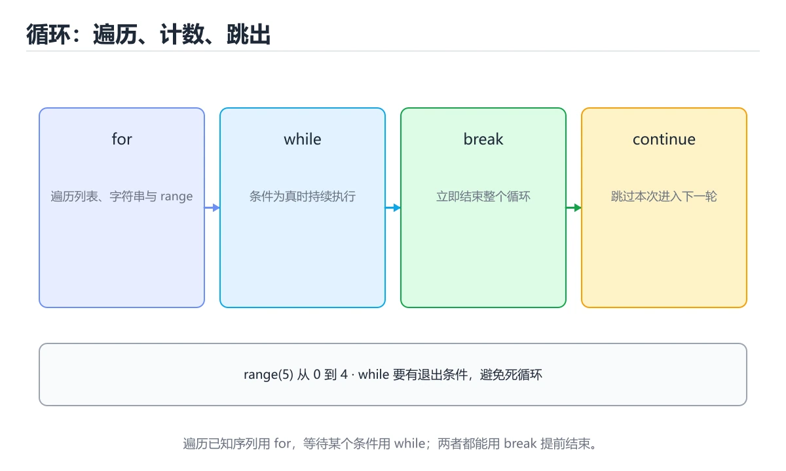
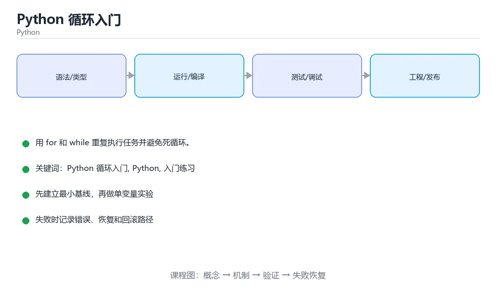

# Python 循环入门

> 内容更新时间：2026-10-06 · 学习阶段：入门 · 预计用时：40 分钟





## 学习目标

- 先认识Python 循环入门需要的工具、输入和输出。
- 按步骤运行最小示例，并记录结果与错误。
- 用一个边界输入验证自己是否真正掌握。

## 前置知识

- 会进行基本的文件或命令行操作。
- 不需要预先掌握「Python」的高级知识。

## 一句话入门

用 for 和 while 重复执行任务并避免死循环。

## 最小示例

```python
total = 0
for number in range(1, 6):
    total += number
print(f"total={total}")
```

## 预期输出

```text
total=15
```

## 常见错误与排查

> 说明：本表由《Python 循环入门》的核心知识整理（2026-10-07），人工复核进度见 docs/content_review_batches.md。

| 易错点 | 容易踩的做法 | 正确结论 |
| --- | --- | --- |
| 用下标遍历列表 | 代码冗长又容易越界 | 直接遍历元素，需要位置时用带索引的遍历 |
| 循环条件不收敛 | 程序陷入死循环 | 明确退出条件并保证循环变量会变化 |
| 循环里反复拼接字符串 | 不断创建新对象 | 收集到列表后一次拼接 |

## 动手练习

1. 原样运行最小示例，保存命令和输出。
2. 把数字 2 改成 10，预测并验证新结果。
3. 制造一个错误输入，写出错误信息和修复方法。

## 本课小结

- 入门阶段先保证能运行、能观察、能解释，再追求复杂功能。
- 每次只改一个变量，记录预测与实际结果。
- 遇到错误先看第一条错误信息，再回到最小示例。

## 代码实验：把示例跑成证据

### 实验一：建立基线

```python
total = 0
for number in range(1, 6):
    total += number
print(f"total={total}")
```

### 实验二：只改一个输入

沿用「Python 循环入门」的最小示例做一次单变量实验：

| 实验 | 改动 | 预测 | 实际 | 结论 |
| --- | --- | --- | --- | --- |
| 基线 | 保持「Python 循环入门」示例原样 |  |  |  |
| 边界 | 把Python 循环入门换成空值或极值 |  |  |  |
| 失败 | 给Python传入非法输入 |  |  |  |

做完后用一句话写出「Python 循环入门」的结论：输入怎么变，结果才怎么变。

### 实验三：制造一个可控错误

把 number 的输入推到越界值，记录错误信息与恢复动作。

| 实验 | 改动 | 预测 | 实际 | 结论 |
| --- | --- | --- | --- | --- |
| 基线 | 保持原样 |  |  |  |
| 边界 |  |  |  |  |
| 失败 |  |  |  |  |

### 实验四：用三句话复述

1. 先写清 Python 循环入门 的输入契约：类型、范围、缺省值与非法值分别怎么处理？
2. Python 循环入门 按什么顺序处理输入，在哪一步产生了状态变化或副作用？
3. 输出如何验证，失败时第一条可观察证据是什么？

## Python 基础机制速览

### 解释器、模块与虚拟环境

Python 源码由解释器编译成字节码再执行，`.py` 文件可以直接运行或作为模块导入。`if __name__ == "__main__":` 用来区分“直接运行”和“被导入”，让模块既提供函数又保留命令行入口。虚拟环境隔离项目依赖，`requirements.txt`、`pyproject.toml` 和锁文件记录依赖版本；不要依赖全局环境中的隐式包。

### 动态类型、真值与对象模型

变量名只是对象的引用，类型属于对象而不是变量，因此同一个名字可以先后指向不同类型的对象。真值判断把空容器、0、空字符串和 None 视为假；需要区分 None 与空值时使用 `is None`。`is` 比较对象身份，`==` 比较值。整数、字符串和元组不可变，列表、字典和集合可变；可变对象作为默认参数会在多次调用间共享，应使用 None 作为占位再在函数内创建。

### 容器、切片与推导式

列表适合有序可变序列，元组适合固定结构，字典保存键值映射，集合用于去重和成员检查。切片 `start:stop:step` 产生新对象，负下标从末尾计数，越界切片通常不会报错但单个下标会抛 IndexError。推导式适合“从可迭代对象生成新容器”，但多层嵌套或带副作用的推导式会降低可读性，应改回普通循环。

### 函数、作用域与迭代

函数参数支持位置、关键字、默认值、`*args` 和 `**kwargs`，调用方要避免可变默认值陷阱。局部变量在函数内赋值后不会自动修改全局变量，需要 `global` 或 `nonlocal` 显式声明。生成器用 `yield` 惰性产生值，迭代器和 `itertools` 能处理大数据流。装饰器在不修改原函数签名的前提下增加日志、缓存、权限或重试逻辑。

### 异常、上下文管理与打包

异常用于表达无法正常继续的情况，使用 `try/except/else/finally` 精确包住可能失败的操作，避免捕获过宽。`with` 通过上下文管理器保证资源释放，文件、锁和数据库连接都应使用它。发布代码时要考虑包结构、入口点、类型标注、测试和性能分析；先用 profiler 找到瓶颈，再决定是优化算法、数据结构还是 I/O。

## 复习与自测

本课测验检验 number 的判断依据。请把每个错误选项改写成一句反例，
说明它在哪个输入、边界或前提变化下会失败。

### 完成标准

- [ ] 能用具体输入复现 Python 循环入门 的最小示例，并逐行解释输入、处理与输出。
- [ ] 能预测 number 在边界输入下的输出，并用运行结果验证。
- [ ] 能复现 Python 的异常并说明恢复步骤。
- [ ] 能列出 Python 的两个失败场景与验证步骤。

### 复盘记录

| 项目 | 记录 |
| --- | --- |
| 学到的核心机制 |  |
| 仍然不确定的问题 |  |
| 下一步验证动作 |  |
对照 代码实验：把示例跑成证据 复述本课结论，答不上来的部分回到 number 的示例重跑一次。

### 一句话入门

自检：这一节的关键输入与输出分别是什么？

### 最小示例

```python
total = 0
for number in range(1, 6):
    total += number
print(f"total={total}")
```

自检：这一节与相邻主题的边界在哪里？

### 预期输出

```text
total=15
```

### 常见错误

自检：把这一节讲给没学过的人，最需要强调哪一点？

### 动手练习

自检：如果去掉这一节里的一个前提，结论会怎样变化？

## 可运行练习

### 任务 1：先跑通，再解释

```python
total = 0
for number in range(1, 6):
    total += number
print(f"total={total}")
```

### 任务 2：只改一个条件

把「Python 循环入门」的最小示例复制一份，只改一个条件再跑一次：

- 改动点：把 Python 换成边界值，其他输入保持原样。
- 预测：先写下「Python 循环入门」在改动后的输出或错误信息，再运行。
- 记录：对照改动前后的结果，指出差异出在哪一步。
- 验收：换回原条件能复现原结果，改动只影响Python 循环入门。

### 任务 3：迁移到自己的数据

用同一套思路处理一组你自己的 Python 循环入门 数据，保持输出格式与任务 1 一致。

## 故障现场

### 现场 1：用下标遍历列表

**症状**：在《Python 循环入门》的复现场景中，代码冗长又容易越界。

**根因**：当出现“用下标遍历列表”时，执行路径已经绕过了《Python 循环入门》的关键约束，最终以“代码冗长又容易越界”暴露出来；修复前必须先确认约束在哪里失效。

**修复**：针对《Python 循环入门》的问题，直接遍历元素，需要位置时用带索引的遍历。

**验证**：保留《Python 循环入门》里触发“代码冗长又容易越界”的输入、版本和日志，按“直接遍历元素，需要位置时用带索引的遍历”完成修改后原样重放；只有失败现象消失且相邻场景仍可解释，才保留改动。

### 现场 2：循环条件不收敛

**症状**：在《Python 循环入门》的复现场景中，程序陷入死循环。

**根因**：当出现“循环条件不收敛”时，执行路径已经绕过了《Python 循环入门》的关键约束，最终以“程序陷入死循环”暴露出来；修复前必须先确认约束在哪里失效。

**修复**：针对《Python 循环入门》的问题，明确退出条件并保证循环变量会变化。

**验证**：在《Python 循环入门》中按“明确退出条件并保证循环变量会变化”调整后，从“循环条件不收敛”的触发条件重放同一条路径，确认“程序陷入死循环”不再出现，并补一个相邻边界用例检查没有引入新问题。

### 现场 3：循环里反复拼接字符串

**症状**：在《Python 循环入门》的复现场景中，不断创建新对象。

**根因**：当出现“循环里反复拼接字符串”时，执行路径已经绕过了《Python 循环入门》的关键约束，最终以“不断创建新对象”暴露出来；修复前必须先确认约束在哪里失效。

**修复**：针对《Python 循环入门》的问题，收集到列表后一次拼接。

**验证**：先在《Python 循环入门》中记录“循环里反复拼接字符串”留下的失败证据，再执行“收集到列表后一次拼接”并重放；确认错误路径变为明确结果，且修复没有掩盖同类故障。

## 版本与时效

### 升级检查清单

- 先固定当前版本，跑通全部示例与测验，再升级工具链。
- 升级时只动一个依赖版本，用 number 记录构建与运行结果。
- 回归范围锁定 number 的默认行为，并确认弃用警告是否出现在构建输出里。
- 升级完成后更新本课「最后复核 / 下次复核」日期，并记录 Python 循环入门 的版本变化。

## 本课复习清单

离开本课前，逐项确认：

- [ ] 不看解析，能说出「range(1, 6) 会依次产生哪些整数？」的判断依据。
- [ ] 不看解析，能说出「while 循环可能变成死循环，最直接的原因是？」的判断依据。
- [ ] 不看解析，能说出「在循环中，break 与 continue 的区别是？」的判断依据。
- [ ] 不看解析，能说出「运行下面的 Python 循环代码，控制台输出是什么？」的判断依据。
- [ ] 至少运行一次 number 的示例，记录输入、输出和 Python 循环入门 的边界情况。
- [ ] 把本课最容易混淆的两个概念写成一句话对照。

| 复盘项 | 记录 |
| --- | --- |
| 已经能独立解释的考点 |  |
| 仍然说不清的概念 |  |
| 下一步验证动作 |  |

## 术语速查

把「Python 循环入门」里反复出现的术语集中放在一起。复习时先遮住右列，尝试用自己的话解释，再回到正文核对。

| 术语 | 一句话说明 |
| --- | --- |
| `for 循环` | 遍历序列或可迭代对象，次数由元素个数决定。 |
| `while 循环` | 条件为真时反复执行循环体，需要自己保证条件最终会变假。 |
| `range` | 生成整数序列，常用 range(n) 或 range(start, stop, step) 控制次数。 |
| `break 与 continue` | break 立即结束整个循环，continue 跳过本次进入下一轮。 |
| `死循环` | 条件永远为真导致循环无法结束，通常要检查更新语句是否被执行。 |
| `虚拟环境` | 虚拟环境隔离项目依赖，requirements.txt、pyproject.toml 和锁文件记录依赖版本；不要依赖全局环境中的隐式包 |

## 零基础精讲：把Python 循环入门真正讲透

### 先建立一个直觉

本课的摘要可以当作一张地图：用 for 和 while 重复执行任务并避免死循环。

### 逐步拆解

1. 澄清输入与目标。先写清「Python 循环入门」要解决的问题、合法输入范围和成功标准，再进入后续步骤。
2. 描述处理过程。把「Python 循环入门、Python、入门练习」映射到具体步骤，每步都要求能单独验证。
3. 定义输出。Python 循环入门 的输出不仅包括正常结果，还包括错误码、日志和资源释放状态。
4. 制造一次Python的失败输入，确认错误出现在「代码实验：把示例跑成证据」的哪一步，并写下恢复后如何验证状态已回到一致。
5. 把 number 的规模缩小到一眼能算清的程度，手动推导结果后再用程序验证，差异处就是理解漏洞。

### 把正文串成一条执行链

- **实验一：建立基线**：先原样运行 number 所在的示例，记录版本、命令、完整输出与退出状态。
- **实验三：制造一个可控错误**：在「Python 循环入门」里，「实验三：制造一个可控错误」这一步要先写清输入与预期，再记录实际结果和差异；结果不符时回到对应小节核对前提。
- **解释器、模块与虚拟环境**：Python 源码由解释器编译成字节码再执行，`.py` 文件可以直接运行或作为模块导入
- **动态类型、真值与对象模型**：在「Python 循环入门」里，「动态类型、真值与对象模型」这一步要先写清输入与预期，再记录实际结果和差异；结果不符时回到对应小节核对前提。

### 从测验反推易错点

**检查点 1：range(1, 6) 会依次产生哪些整数？**

- 参考判断：1、2、3、4、5，不包含结束值 6
- 自问：如果去掉题干里的一个限定词，结论还成立吗？

**检查点 2：while 循环可能变成死循环，最直接的原因是？**

- 参考判断：循环条件始终为真，循环体没有让它趋向结束

**检查点 3：在循环中，break 与 continue 的区别是？**

- 参考判断：break 立即结束整个循环，continue 只跳过本轮剩余语句

**检查点 4：运行下面的 Python 循环代码，控制台输出是什么？**

- 参考判断：0 换行 1 换行 2

### 工程排错顺序

| 先查什么 | 要得到的证据 | 判断标准 |
| --- | --- | --- |
| 输入与前提是否满足 | 日志、输入样例、测试或指标 | 能复现并解释，才算定位 |
| 核心步骤是否产生了预期中间结果 | 日志、输入样例、测试或指标 | 能复现并解释，才算定位 |
| 失败路径是否可观测、可恢复 | 日志、输入样例、测试或指标 | 能复现并解释，才算定位 |
| 资源、权限与成本是否在预算内 | 日志、输入样例、测试或指标 | 能复现并解释，才算定位 |

### 变式训练

1. 先用一个单文件示例验证 number，确认正确性后再引入框架或分布式组件。
2. 把 Python 循环入门 的输入规模扩大十倍，记录时间、内存和失败路径，找出第一个瓶颈。
3. 让 number 的外部依赖超时，确认系统能回滚或补偿，而不是留下脏数据。
5. 把「Python 循环入门」里最容易被省略的一步去掉，用测试或指标证明它不可省略，而不是凭感觉判断。
6. 限制 CPU 与内存上限后重跑 number，观察哪一项参数需要重新设定。

### 本课自测

- [ ] 能用一句话解释Python 循环入门在本课中的角色与边界。
- [ ] 能举出一个正常例子和一个失败例子。
- [ ] 能说出最小验证步骤，以及需要记录的证据。
- [ ] 能用一句话解释「Python」在本课中的角色与边界。
- [ ] 能用一句话解释 Python 循环入门 在「Python 循环入门」中的角色与边界。

### 迁移案例库

换一个 Python 约束重做一次，确认结论在新条件下是否仍然成立。

#### 迁移案例 1：围绕Python 循环入门做一次小实验

**目标**：在不改变课程主体的前提下，验证Python 循环入门中的一个关键判断。

**步骤**：
1. 复述当前方案对本课的假设，写成一句可证伪的话。
2. 设计一个正常输入和一个边界输入，分别预测输出。
3. 运行或逐步演算，记录实际输出、耗时和失败信息。
4. 只调整一个参数，比较前后差异并解释原因。
5. 补充一条测试或复习卡，确保下次能更快复现。

**验收**：结论要能追溯到正文的具体小节与代码位置，并记录Python相关的指标变化。

#### 迁移案例 2：围绕「Python」做一次小实验

**步骤**：
1. 复述当前方案对「Python」的假设，写成一句可证伪的话。

#### 迁移案例 3：围绕「入门练习」做一次小实验

**步骤**：
1. 把 number 依赖的前提写成一句可以被反例推翻的陈述。

#### 迁移案例 4：围绕Python 循环入门做一次小实验

**步骤**：

#### 迁移案例 5：围绕「Python」做一次小实验

**步骤**：

#### 迁移案例 6：围绕「入门练习」做一次小实验

**步骤**：

#### 迁移案例 7：围绕Python 循环入门做一次小实验

**步骤**：

#### 迁移案例 8：围绕「Python」做一次小实验

**步骤**：

#### 迁移案例 9：围绕「入门练习」做一次小实验

**步骤**：

#### 迁移案例 10：围绕Python 循环入门做一次小实验

**步骤**：

#### 迁移案例 11：围绕「Python」做一次小实验

**步骤**：

#### 迁移案例 12：围绕「入门练习」做一次小实验

**步骤**：

#### 迁移案例 13：围绕Python 循环入门做一次小实验

**步骤**：

#### 迁移案例 14：围绕「Python」做一次小实验

**步骤**：

#### 迁移案例 15：围绕「入门练习」做一次小实验

**步骤**：

#### 迁移案例 16：围绕Python 循环入门做一次小实验

**步骤**：

<!-- p0-depth-v2:end -->

## 考点精讲

### 考点 1：多选辨析·Python 循环入门

- **题目**：围绕“Python 循环入门”中的 Python 循环入门、Python、入门练习，下列哪两项是本课强调的实践判断？
- **判断依据**：题干的正确项是验证 Python 时要固定版本并覆盖边界输入，结论才可复现。学习 Python 循环入门 时要同时说明输入、输出和失败路径，不能只看正常流程。「Python 循环入门」要求先交代Python 循环入门、Python、入门练习的前提再下结论，所以“验证 Python 时要固定版本并覆盖边”只在题干“围绕Python 循环入门中的 Python 循环入门、Py”给定的条件下成立。

### 考点 2：概念判断·Python 循环入门

- **题目**：while 循环可能变成死循环，最直接的原因是？
- **判断依据**：在「Python 循环入门」里，循环条件始终为真，循环体没有让它趋向结束。while 在每轮开始前重新判断条件，只要条件一直为真就会继续执行。把“循环条件始终为真，循环体没有让它趋向结束”代回「Python 循环入门」里“while 循环可能变成死循环”的例子核对，条件一旦改变，结论就要用Python 循环入门、Python、入门练习重新推导。

### 考点 3：顺序排列·Python 循环入门

- **题目**：按“Python 循环入门”中 Python 循环入门、Python、入门练习 的实践顺序，把四个步骤排成从准备到复盘的合理顺序。
- **判断依据**：在「Python 循环入门」里，题干的正确项是写出最小示例并核对 Python 的基线结果。这个顺序把 Python 循环入门 的输入、输出和约束放在最前面，在Python 循环入门里避免概念没对齐就开始调参。第二步用 Python 建立可核对的基线，在Python 循环入门里第三步才允许改变一个变量并观察失败路径。

### 考点 4：代码补全·Python 循环入门

- **题目**：运行下面的 Python 循环代码，控制台输出是什么？
- **判断依据**：结论应落在「0 换行 1 换行 2」。2，这道题要结合 运行下面的 Python 循环代码，控制台输出是什么， 限定的语境来判断。range(3) 产生 0、1、2 三个整数，不包含终点 3。这道题要求区分概念与边界，「0 换行 1 换行 2」只有在题干给出的前提下才成立，而「1 2 3」、「3」缺少同一组条件。

### 考点 5：填空·Python 循环入门

- **题目**：补全代码：要遍历 1、2、3、4 这四个整数，应写成 for i in ____(1, 5):。
- **判断依据**：range(1, 5) 会生成从 1 开始、到 5 之前结束的整数序列，也就是 1、2、3、4 四个值。Python 循环入门 的正文示例用 range 控制 for 循环的迭代次数，起始值包含在下界里，终止值本身不会被取到；写成 range(1, 6) 会多循环一次，写成 range(5) 则从 0 开始。

## English Overview

**Title:** Python Loops

**Summary:** Repeat work with for and while loops.

**Category:** Python
**Level:** 入门
**Key terms:** Python 循环入门, Python, 入门练习

## 内容元数据

- 内容版本：v2.0
- 最后更新：2026-10-06
- 学习阶段：入门
- 适用环境：Python 3.12+；本课聚焦 Python 循环入门。
- 内容来源：内置结构化课程与工程实践整理
- 相关主题：Python 循环入门、Python、入门练习
- 质量版本：P0 测验标准 + P1 覆盖扩展 + P2 体验补全

## 参考资料与复核

- 最后复核：2026-10-04
- 下次复核：2027-04-24
- 复核范围：版本兼容、API 行为、安全建议与工程实践
- 来源性质：官方文档、标准或权威教材；正文为离线教学重组

| 参考资料 | 本课用途 |
| --- | --- |
| [Python 标准库](https://docs.python.org/3/library/) | 标准库 API 与模块 |
| [typing 文档](https://docs.python.org/3/library/typing.html) | 类型标注与泛型 |
| [unittest 文档](https://docs.python.org/3/library/unittest.html) | 测试组织与断言 |

> 「Python 循环入门」的链接用于离线阅读后的延伸核对；App 不会自动联网。

## 复习与迁移

复习目标：把「Python 循环入门」的判断标准放回可复现的例子里。先自己作答，再对照依据；如果结论正确但理由不完整，回到正文补足前提。

### 概念复述

- 用一句话说明「Python 循环入门」解决什么问题：用 for 和 while 重复执行任务并避免死循环。
- 写出Python 循环入门、Python、入门练习之间的关系，并各举一个例子。
- 说出本课最容易混淆的两个概念，以及区分它们的判据。

### 正文逐节复核

- **Python 基础机制速览**：Python 源码由解释器编译成字节码再执行，`.py` 文件可以直接运行或作为模块导入。

### 测验回顾

1. 围绕“Python 循环入门”中的 Python 循环入门、Python、入门练习，下列哪两项是本课强调的实践判断？
   - 依据：题干的正确项是验证 Python 时要固定版本并覆盖边界输入，结论才可复现。学习 Python 循环入门 时要同时说明输入、输出和失败路径，不能只看正常流程。「Python 循环入门」要求先交代Python 循环入门、Python、入门练习的前提再下结论，所以“验证 Python 时要固定版本并覆盖边”只在题干“围绕Python 循环入门中的 Python 循环入门、Py”给定的条件下成立。
2. while 循环可能变成死循环，最直接的原因是？
   - 依据：在「Python 循环入门」里，循环条件始终为真，循环体没有让它趋向结束。while 在每轮开始前重新判断条件，只要条件一直为真就会继续执行。把“循环条件始终为真，循环体没有让它趋向结束”代回「Python 循环入门」里“while 循环可能变成死循环”的例子核对，条件一旦改变，结论就要用Python 循环入门、Python、入门练习重新推导。
3. 按“Python 循环入门”中 Python 循环入门、Python、入门练习 的实践顺序，把四个步骤排成从准备到复盘的合理顺序。
   - 依据：在「Python 循环入门」里，题干的正确项是写出最小示例并核对 Python 的基线结果。这个顺序把 Python 循环入门 的输入、输出和约束放在最前面，在Python 循环入门里避免概念没对齐就开始调参。第二步用 Python 建立可核对的基线，在Python 循环入门里第三步才允许改变一个变量并观察失败路径。
4. 运行下面的 Python 循环代码，控制台输出是什么？
   - 依据：结论应落在「0 换行 1 换行 2」。2，这道题要结合 运行下面的 Python 循环代码，控制台输出是什么， 限定的语境来判断。range(3) 产生 0、1、2 三个整数，不包含终点 3。这道题要求区分概念与边界，「0 换行 1 换行 2」只有在题干给出的前提下才成立，而「1 2 3」、「3」缺少同一组条件。

### 迁移练习

把「Python 循环入门」的结论迁移到相邻主题，每次迁移都写清预测与证据：

1. 换输入：用Python 循环入门处理一组你自己的数据，对比教材示例的结果差异。
2. 换失败条件：制造一个Python相关的错误，说明如何从错误信息定位根因。
3. 换规模：把数据量或并发度提高一个数量级，说明「Python 循环入门」的结论是否仍成立。

## 工程化精练：决策、失败与验证

这一章把「Python 循环入门」从“看懂”推进到“能判断、能验证、能排错”。所有判断都围绕Python 循环入门、Python与入门练习展开，并与前文的示例、测验和失败现场互相对照。

### 一、Python 循环入门 的判断算法

| 步骤 | 要回答的问题 | 判断依据 | 记录什么 |
| --- | --- | --- | --- |
| 1. 定目标 | 「Python 循环入门」这一步要解决什么问题？ | 把Python 循环入门的目标写成一句可验证的结论 | 输入、约束、成功标准 |
| 2. 找边界 | Python在什么条件下失效？ | 先列空值、极值、重复和失败路径 | 反例与触发条件 |
| 3. 跑基线 | 原始示例的真实输出是什么？ | 命令、版本和环境必须可复现 | 命令、输出、耗时 |
| 4. 只改一处 | 把入门练习换成另一种取值会怎样？ | 预测写在运行之前 | 预测与实际的差异 |
| 5. 回写结论 | 结论能否被他人复现？ | 把判断写成清单或测试 | 结论、证据、遗留问题 |

这张表的用法不是从上到下浏览，而是每次只填一行：先用「Python 循环入门」前文的示例验证第 3 行，再故意破坏一个条件验证第 2 行。当你能在不看解析的情况下说出Python 循环入门的判断依据，才算真正掌握本课。

- 先从Python 循环入门入手：把它写成“输入是什么、输出是什么、哪一步最容易出错”。如果这三句话中有一句说不清，说明对「Python 循环入门」的理解还停留在术语层面，需要回到正文的最小示例重新观察一次。

- 再把Python当成对照实验的变量：固定其他条件，只改变它的取值，记录输出是否变化。结论“变”或“不变”都要写出理由，并说明这个理由能否被他人独立复现。

- 针对入门练习做一次失败演练：故意给出空值、极值或错误类型，观察「Python 循环入门」的报错位置和处理方式。错误信息只是入口，真正要定位的是哪一层假设被破坏。

- 把「Python 循环入门」的结论压缩成一条可执行清单：先检查输入，再检查版本与环境，然后跑最小用例，最后才扩大规模。顺序颠倒会让排错范围成倍增加。

- 如果结论依赖时间或规模，就把数据量提高一个数量级再跑一次。在「Python 循环入门」里，小样本成立不代表大样本成立，复杂度、资源占用和失败率都要重新记录。

- 如果结论依赖并发或共享状态，就固定输入并连续运行多次。结果不一致时，优先怀疑「Python 循环入门」中Python 循环入门相关步骤的隐藏状态，而不是先改代码。

- 把「Python 循环入门」的判断写成测试：一个正常用例、一个边界用例、一个失败用例。测试通过只是起点，还要确认失败用例确实以预期方式失败。

- 把本课与相邻主题连起来：Python 循环入门解决的是“怎么做”，Python回答“什么时候不适用”。两者都答得出来，迁移才算完成。

> 第 2 轮复核「Python 循环入门」：把上面的结论逐条改写为可验证的问题，并记录仍不确定的部分。

- 先从Python 循环入门入手：把它写成“输入是什么、输出是什么、哪一步最容易出错”。如果这三句话中有一句说不清，说明对「Python 循环入门」的理解还停留在术语层面，需要回到正文的最小示例重新观察一次。

- 再把Python当成对照实验的变量：固定其他条件，只改变它的取值，记录输出是否变化。结论“变”或“不变”都要写出理由，并说明这个理由能否被他人独立复现。

- 针对入门练习做一次失败演练：故意给出空值、极值或错误类型，观察「Python 循环入门」的报错位置和处理方式。错误信息只是入口，真正要定位的是哪一层假设被破坏。

- 把「Python 循环入门」的结论压缩成一条可执行清单：先检查输入，再检查版本与环境，然后跑最小用例，最后才扩大规模。顺序颠倒会让排错范围成倍增加。

- 如果结论依赖时间或规模，就把数据量提高一个数量级再跑一次。在「Python 循环入门」里，小样本成立不代表大样本成立，复杂度、资源占用和失败率都要重新记录。

- 如果结论依赖并发或共享状态，就固定输入并连续运行多次。结果不一致时，优先怀疑「Python 循环入门」中Python 循环入门相关步骤的隐藏状态，而不是先改代码。

- 把「Python 循环入门」的判断写成测试：一个正常用例、一个边界用例、一个失败用例。测试通过只是起点，还要确认失败用例确实以预期方式失败。

- 把本课与相邻主题连起来：Python 循环入门解决的是“怎么做”，Python回答“什么时候不适用”。两者都答得出来，迁移才算完成。

> 第 3 轮复核「Python 循环入门」：把上面的结论逐条改写为可验证的问题，并记录仍不确定的部分。

- 先从Python 循环入门入手：把它写成“输入是什么、输出是什么、哪一步最容易出错”。如果这三句话中有一句说不清，说明对「Python 循环入门」的理解还停留在术语层面，需要回到正文的最小示例重新观察一次。

- 再把Python当成对照实验的变量：固定其他条件，只改变它的取值，记录输出是否变化。结论“变”或“不变”都要写出理由，并说明这个理由能否被他人独立复现。

- 针对入门练习做一次失败演练：故意给出空值、极值或错误类型，观察「Python 循环入门」的报错位置和处理方式。错误信息只是入口，真正要定位的是哪一层假设被破坏。

- 把「Python 循环入门」的结论压缩成一条可执行清单：先检查输入，再检查版本与环境，然后跑最小用例，最后才扩大规模。顺序颠倒会让排错范围成倍增加。

- 如果结论依赖时间或规模，就把数据量提高一个数量级再跑一次。在「Python 循环入门」里，小样本成立不代表大样本成立，复杂度、资源占用和失败率都要重新记录。

- 如果结论依赖并发或共享状态，就固定输入并连续运行多次。结果不一致时，优先怀疑「Python 循环入门」中Python 循环入门相关步骤的隐藏状态，而不是先改代码。

- 把「Python 循环入门」的判断写成测试：一个正常用例、一个边界用例、一个失败用例。测试通过只是起点，还要确认失败用例确实以预期方式失败。

### 二、Python 循环入门 的机制拆解与自测

把本课考点还原成可回答的问题，再逐题写出依据：

**问题 1**：围绕“Python 循环入门”中的 Python 循环入门、Python、入门练习，下列哪两项是本课强调的实践判断？

- 关联术语：Python 循环入门
- 判断依据：验证 Python 时要固定版本并覆盖边界输入，结论才可复现
- 追问：如果把Python 循环入门的条件换成边界值，这个结论是否仍然成立？

**问题 2**：while 循环可能变成死循环，最直接的原因是？

- 关联术语：Python
- 判断依据：循环条件始终为真，循环体没有让它趋向结束
- 追问：如果把Python的条件换成边界值，这个结论是否仍然成立？

**问题 3**：按“Python 循环入门”中 Python 循环入门、Python、入门练习 的实践顺序，把四个步骤排成从准备到复盘的合理顺序。

- 关联术语：入门练习
- 判断依据：写出最小示例并核对 Python 的基线结果
- 追问：如果把 Python 循环入门 的条件换成边界值，这个结论是否仍然成立？

**问题 4**：运行下面的 Python 循环代码，控制台输出是什么？

- 关联术语：Python 循环入门
- 判断依据：回到「Python 循环入门」正文对应小节，先用最小示例验证再下结论。
- 追问：如果把Python 循环入门的条件换成边界值，这个结论是否仍然成立？

### 三、失败模式与修复顺序

| 失败信号 | 常见根因 | 先做什么 | 修复后如何确认 |
| --- | --- | --- | --- |
| 「Python 循环入门」中 Python 循环入门 相关步骤报错 | 输入、版本或前置条件与示例不一致 | 保留第一条错误信息，回到最小输入 | 用验证 Python 时要固定版本并覆盖边界输入，结论才可复现复跑，确认输出可复现 |
| 「Python 循环入门」中 Python 相关步骤报错 | 输入、版本或前置条件与示例不一致 | 保留第一条错误信息，回到最小输入 | 用循环条件始终为真，循环体没有让它趋向结束复跑，确认输出可复现 |
| 「Python 循环入门」中 入门练习 相关步骤报错 | 输入、版本或前置条件与示例不一致 | 保留第一条错误信息，回到最小输入 | 用写出最小示例并核对 Python 的基线结果复跑，确认输出可复现 |
- 检查点：固定版本与输入重跑《Python 循环入门》，记录两次差异并定位不稳定条件。
| 单次结果正确但规模一大就失效 | 只测了正常路径，没有覆盖边界 | 把数据量或并发度提高一个数量级 | 记录边界值、耗时与失败率 |

排错顺序固定为：先复现，再缩小输入，然后只改一个条件，最后把结论写成回归用例。对「Python 循环入门」来说，任何不能复现的“修好了”都不算完成。

### 四、离开本课前的验证清单

| 检查项 | 通过标准 | 证据 |
| --- | --- | --- |
| 能复述 | 用三句话说明「Python 循环入门」解决什么问题、边界在哪 | 不看解析写出的结论 |
| 能运行 | 最小示例在本机跑通 | 命令、输出与版本 |
| 能改条件 | 只改一个输入并解释差异 | 预测与实际的对照 |
| 能排错 | 至少制造并修复一个失败 | 错误信息与修复步骤 |
| 能迁移 | 把Python 循环入门、Python、入门练习用到新场景 | 一个自选练习的结论 |

完成标准：能不看解析说清「Python 循环入门」全部自测题的依据，并且至少有一条Python 循环入门相关的结论经过真实运行验证。如果某一步只停留在“感觉懂了”，就把它写成下一轮针对「Python 循环入门」的最小验证任务。

### 五、把结论写成可检查的证据

学习「Python 循环入门」时，最容易出现的情况是“听过、看懂了，但换一个输入就说不清”。下面把Python 循环入门与Python放进一条可检查的证据链：每一句结论都要能回答“从哪里来、在什么条件下成立、失败时怎么发现”。

| 证据类型 | 本课要求 | 不合格的表现 |
| --- | --- | --- |
| 概念证据 | 用一句话说明Python 循环入门的定义与适用场景 | 只背术语，说不出它解决什么问题 |
| 运行证据 | 能复现「Python 循环入门」的最小示例 | 输出与记录对不上，或换机器就不一致 |
| 对照证据 | 只改一个条件，说明差异来自哪里 | 一次改多个变量，无法归因 |
| 失败证据 | 故意制造错误并记录恢复步骤 | 只测正常路径，失败时靠猜 |
| 迁移证据 | 把Python用到自选场景 | 换一个例子就完全套不上 |

举例：验证 Python 时要固定版本并覆盖边界输入，结论才可复现。把这个结论代回「Python 循环入门」的正文，找出它对应的输入、处理步骤与输出；再换掉其中一个条件，观察结论是否仍然成立。能完成这一步，才说明这条知识已经从“记忆”变成“可用的判断”。

最后留一个自检问题：如果只能保留三条笔记，你会写下哪三句？把答案限定为「Python 循环入门」中的可验证结论，并给每条结论配一个反例。这三句加上对应反例，就是本课最值得带入后续课程的复习材料。

