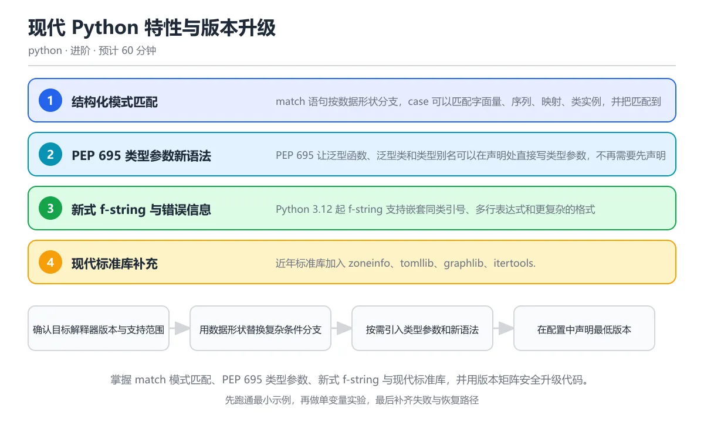

# 现代 Python 特性与版本升级

> 内容更新时间：2026-10-06 · 学习阶段：进阶 · 预计用时：40 分钟

分类：python。关键词：match、PEP 695、类型参数、f-string、版本兼容。掌握 match 模式匹配、PEP 695 类型参数、新式 f-string 与现代标准库，并用版本矩阵安全升级代码。

学习建议：先通读《现代 Python 特性与版本升级》的核心知识与关键流程，再运行可运行练习并完成测验；遇到不确定的结论，回到「故障现场」按症状、根因、修复、验证四步核对。



## 学习目标

- 能用 match 清晰解构字典、序列和对象消息。
- 能读懂并写出 PEP 695 的类型参数与类型别名。
- 能通过版本声明、特性检测和 CI 矩阵安全引入新语法。

## 前置知识

- 已经掌握函数、类、异常和类型注解基础。
- 用过 list、dict 和 dataclass 表示结构化数据。
- 能在 pyproject.toml 中查看项目配置。

## 核心知识

### 1. 结构化模式匹配

match 语句按数据形状分支，case 可以匹配字面量、序列、映射、类实例，并把匹配到的部分绑定到变量。

匹配从上到下尝试，序列模式检查长度，映射模式检查键，类模式检查类型与属性，guard 进一步用条件过滤；下划线表示通配但不会绑定变量。

在现代 Python 特性与版本升级里可以这样验证：用一个 describe 函数同时处理启动消息字典、重试列表和命令对象，最后用通配分支处理未知输入。

边界：match 不是所有 if/elif 的替代品，模式绑定变量只在对应分支生效；类模式依赖属性存在，鸭子类型对象要通过属性模式或显式检查。

工程视角：模式匹配适合协议消息、解析树和命令分派；分支要有兜底并记录未知形状，避免静默丢弃数据。

### 2. PEP 695 类型参数新语法

PEP 695 让泛型函数、泛型类和类型别名可以在声明处直接写类型参数，不再需要先声明 TypeVar 和 Generic 基类。

函数写成 def first[T](items: list[T]) -> T，类写成 class Box[T]，类型别名写成 type Pair[T] = tuple[T, T]；类型参数拥有明确作用域，静态检查器能提供更好的错误提示。

在现代 Python 特性与版本升级里可以这样验证：定义一个接受任意元素列表并返回首元素的泛型函数，再定义一个保存单个值的泛型容器类。

边界：新语法需要 Python 3.12 及以上解释器和支持它的类型检查器；运行时不检查类型，跨版本库仍需使用旧式写法或兼容分支。

工程视角：库的 requires-python 明确最低版本，类型检查器版本写入开发依赖，升级语法时同步更新 CI 矩阵。

### 3. 新式 f-string 与错误信息

Python 3.12 起 f-string 支持嵌套同类引号、多行表达式和更复杂的格式规格，同时解释器错误信息更贴近出错位置。

f-string 仍在编译阶段解析，但解析器改为更完整的表达式语法，因此可以复用同一类引号；调试等号可以同时显示表达式文本和值。

在现代 Python 特性与版本升级里可以这样验证：在 3.12 及以上版本中写带嵌套引号和条件的 f-string，并输出表达式与结果。

边界：旧解释器无法解析新语法，发布库不能无条件下调；复杂 f-string 会降低可读性，逻辑较多时先计算再插入。

工程视角：使用 ruff 或格式化工具统一风格，日志字段优先结构化，超长 f-string 拆成中间变量。

### 4. 现代标准库补充

近年标准库加入 zoneinfo、tomllib、graphlib、itertools.batched 和 contextlib 增强，让时区、配置、拓扑排序和批处理少依赖第三方库。

zoneinfo 读取系统时区数据库并创建时区对象，tomllib 以只读方式解析 TOML，graphlib.TopologicalSorter 处理依赖顺序，itertools.batched 把迭代器切成固定大小批次。

在现代 Python 特性与版本升级里可以这样验证：用 batched 把长序列切成三批，再用 TopologicalSorter 计算一个任务依赖图的执行顺序。

边界：tomllib 不能写回 TOML，需要生成配置时使用第三方库；时区数据库版本随系统或 tzdata 包更新，容器镜像要显式安装。

工程视角：优先使用标准库减少依赖面，跨版本项目通过兼容层封装差异，并在文档中标注最低版本。

### 5. 版本兼容与升级策略

语言升级不是一次性重写，而是先声明支持范围、再逐步替换语法和依赖，并用多版本 CI 证明兼容性。

requires-python 声明最低版本，classifiers 列出经过验证的版本，CI 矩阵在不同解释器上运行测试，特性检测用 sys.version_info 或能力探测而不是猜测。

在现代 Python 特性与版本升级里可以这样验证：把项目最低版本提升到 3.12，开启新语法检查，并在 3.12 与 3.13 两个版本上运行测试。

边界：升级依赖可能同时要求新解释器，平台轮子可用性也要检查；运行版本与开发版本不同会让本地通过、部署失败。

工程视角：制定弃用时间表，先发布兼容版本再移除旧路径；升级提交附带基准、测试结果与回滚方案。

## 关键流程

```text
确认目标解释器版本与支持范围 → 用数据形状替换复杂条件分支 → 按需引入类型参数和新语法 → 在配置中声明最低版本 → 用多版本 CI 与基准验证升级
```

1. 确认目标解释器版本与支持范围
2. 用数据形状替换复杂条件分支
3. 按需引入类型参数和新语法
4. 在配置中声明最低版本
5. 用多版本 CI 与基准验证升级

## 动手练习

1. 用 match 实现一个协议消息分流器，覆盖字典、列表、对象和未知形状，并为每个分支写测试。
2. 把一段旧式 TypeVar 泛型代码改写为 PEP 695 语法，再在支持版本的检查器上验证类型。
3. 用 itertools.batched 与 graphlib.TopologicalSorter 各完成一个小任务，记录它们替代了哪些手写逻辑。
4. 为一个最低版本升级创建检查清单，包含依赖轮子、CI 矩阵、文档和回滚方案。

**验收标准**：留下输入、命令、输出和结论，能让别人按记录复现。

## 常见错误与排查

> 说明：本表由《现代 Python 特性与版本升级》的核心知识整理（2026-10-06），人工复核进度见 docs/content_review_batches.md。

| 易错点 | 容易踩的做法 | 正确结论 |
| --- | --- | --- |
| 把 match 当成唯一分支工具 | 把简单的两个布尔条件也改写成多层 match，可读性反而下降 | 数据形状复杂时使用模式匹配，普通条件判断继续使用 if |
| 类模式依赖位置参数 | 用位置模式匹配对象，属性顺序变化后逻辑静默失效 | 优先使用关键字属性模式匹配，并在类中保持清晰的公开属性 |
| 使用新语法却未更新版本声明 | 代码写了 PEP 695 类型参数，但 pyproject 仍声明支持 Python 3.10 | 同步提升 requires-python 并在 CI 矩阵中验证所有支持版本 |
| 盲信类型注解运行期检查 | 以为标注类型后传入错误对象会立刻报错 | 使用静态检查器或运行时校验库，边界输入仍要显式验证 |

## 可运行练习

### 任务 1：先跑通，再解释

```python
from dataclasses import dataclass

@dataclass
class Command:
    name: str
    args: list[str]

def describe(message):
    match message:
        case {"type": "start", "id": int() as request_id}:
            return f"启动请求 {request_id}"
        case ["retry", int(attempt)] if attempt > 0:
            return f"第 {attempt} 次重试"
        case Command(name=name, args=args) if args:
            return f"命令 {name}: {','.join(args)}"
        case _:
            return "未知消息"

print(describe({"type": "start", "id": 7}))
print(describe(["retry", 3]))
print(describe(Command("build", ["--release"])))
print(describe(42))
```

describe 依次匹配启动字典、重试列表、命令对象和未知值；映射模式同时校验键与值的类型，序列模式校验长度与元素，类模式按属性解构，guard 进一步要求重试次数为正。每个分支返回明确文本，最后一个分支兜住所有未识别形状。

### 任务 2：只改一个条件

复制上面的示例，只改一个输入或参数再跑一次；先写下预测，再和真实输出对照，并说明差异来自现代 Python 特性与版本升级的哪条机制。

### 任务 3：迁移到自己的数据

把《现代 Python 特性与版本升级》里的示例换成你自己的一小段数据或场景，保持结构不变；如果换不动，说明还有哪条前提没有理解，回到核心知识对应小节。

## 故障现场

### 现场 1：把 match 当成唯一分支工具

**症状**：在《现代 Python 特性与版本升级》里采用「把简单的两个布尔条件也改写成多层 match，可读性反而下降」时，把 match 当成唯一分支工具会表现为错误结果、异常中断或状态不一致。

**根因**：这个做法没有执行与「把 match 当成唯一分支工具」对应的检查，问题被带到了后续步骤。

**修复**：数据形状复杂时使用模式匹配，普通条件判断继续使用 if

**验证**：为「把 match 当成唯一分支工具」准备一个最小输入，确认修复前的失败可以复现，修复后的输出与本课示例一致，再补一个边界输入。

### 现场 2：类模式依赖位置参数

**症状**：在《现代 Python 特性与版本升级》里采用「用位置模式匹配对象，属性顺序变化后逻辑静默失效」时，类模式依赖位置参数会表现为错误结果、异常中断或状态不一致。

**根因**：这个做法没有执行与「类模式依赖位置参数」对应的检查，问题被带到了后续步骤。

**修复**：优先使用关键字属性模式匹配，并在类中保持清晰的公开属性

**验证**：为「类模式依赖位置参数」准备一个最小输入，确认修复前的失败可以复现，修复后的输出与本课示例一致，再补一个边界输入。

### 现场 3：使用新语法却未更新版本声明

**症状**：在《现代 Python 特性与版本升级》里采用「代码写了 PEP 695 类型参数，但 pyproject 仍声明支持 Python 3.10」时，使用新语法却未更新版本声明会表现为错误结果、异常中断或状态不一致。

**根因**：这个做法没有执行与「使用新语法却未更新版本声明」对应的检查，问题被带到了后续步骤。

**修复**：同步提升 requires-python 并在 CI 矩阵中验证所有支持版本

**验证**：为「使用新语法却未更新版本声明」准备一个最小输入，确认修复前的失败可以复现，修复后的输出与本课示例一致，再补一个边界输入。

### 现场 4：盲信类型注解运行期检查

**症状**：在《现代 Python 特性与版本升级》里采用「以为标注类型后传入错误对象会立刻报错」时，盲信类型注解运行期检查会表现为错误结果、异常中断或状态不一致。

**根因**：这个做法没有执行与「盲信类型注解运行期检查」对应的检查，问题被带到了后续步骤。

**修复**：使用静态检查器或运行时校验库，边界输入仍要显式验证

**验证**：为「盲信类型注解运行期检查」准备一个最小输入，确认修复前的失败可以复现，修复后的输出与本课示例一致，再补一个边界输入。

## 本课复习清单

离开本课前，逐项确认：

- [ ] 能用 match 解构字典、序列和对象并保留兜底分支。
- [ ] 能写出 PEP 695 的泛型函数与类型别名。
- [ ] 能解释最低版本声明与多版本 CI 的必要性。
- [ ] 至少运行一次本课示例，记录输入、输出和一个边界情况。
- [ ] 把本课最容易混淆的两个概念写成一句话对照。

| 复盘项 | 记录 |
| --- | --- |
| 已经能独立解释的考点 |  |
| 仍然说不清的概念 |  |
| 下一步验证动作 |  |

## 复习与自测

### 核心知识

遮住正文回答：现代 Python 特性与版本升级解决什么问题、依赖哪些前提、失败时先看哪个信号？三问都能答清楚，再进入下一节。

### 动手练习

把《现代 Python 特性与版本升级》里「只改一个条件」的练习再做一遍，这次先写预测再运行；预测和结果不一致的地方，就是需要回读的章节。

### 最小可运行示例

```python
from dataclasses import dataclass

@dataclass
class Command:
    name: str
    args: list[str]

def describe(message):
    match message:
        case {"type": "start", "id": int() as request_id}:
            return f"启动请求 {request_id}"
        case ["retry", int(attempt)] if attempt > 0:
            return f"第 {attempt} 次重试"
        case Command(name=name, args=args) if args:
            return f"命令 {name}: {','.join(args)}"
        case _:
            return "未知消息"

print(describe({"type": "start", "id": 7}))
print(describe(["retry", 3]))
print(describe(Command("build", ["--release"])))
print(describe(42))
```

### 预期输出

```text
启动请求 7
第 3 次重试
命令 build: --release
未知消息
```

### 验证步骤

1. 确认输入数据与运行环境和示例一致。
2. 运行示例，记录输出与耗时等可观测指标。
3. 换一个边界输入重跑，确认结论仍然成立。
4. 把两次结果写成一句话结论，注明前提与局限。

## 术语速查

先遮住右列，尝试用自己的话解释，再回到正文核对。

| 术语 | 一句话说明 |
| --- | --- |
| `结构化模式匹配` | 根据数据的类型、形状和内容进行分支并绑定变量的语法。 |
| `捕获模式` | 把匹配到的值绑定到新变量名的模式，可能意外覆盖已有名称。 |
| `PEP 695` | 引入在声明处直接书写类型参数和类型别名的现代泛型语法。 |
| `类型参数` | 在泛型函数或类中代表具体类型的占位符，使用时由实参类型替换。 |
| `特性检测` | 在运行时检查解释器或库是否支持某项能力，而不是只比较版本号。 |
| `requires-python` | 项目元数据中声明的最低 Python 版本约束。 |

## 考点精讲

### 考点 1：match 语句中 case _ 的作用

题型：概念判断。题干：match 语句中 case _ 的作用是什么？

判断要点：匹配任意值且不绑定变量，常作为兜底分支。下划线是通配模式，匹配任何值但不会创建变量，因此适合处理未知消息并记录日志；如果一定要绑定值，可以使用其他名称。兜底分支能避免协议扩展后消息被静默丢弃，同时也提醒开发者哪些形状还没有专门处理。 正确选项「匹配任意值且不绑定变量，常作为兜底分支」对应《现代 Python 特性与版本升级》的要点「结构化模式匹配」：match 语句按数据形状分支，case 可以匹配字面量、序列、映射、类实例，并把匹配到的部分绑定到变量。判断「结构化模式匹配」时先确认前提是否成立，再回到《现代 Python 特性与版本升级》的示例核对一次；把别的语言或框架的默认做法直接搬到结构化模式匹配上，往往会在本课的边界条件里失效。

### 考点 2：PEP 695 相比旧式泛型写法的主要改

题型：概念判断。题干：PEP 695 相比旧式泛型写法的主要改进是什么？

判断要点：可以直接在函数和类声明处写类型参数，作用域更清晰。PEP 695 让泛型函数、类和类型别名在声明处直接写参数，减少 TypeVar 和 Generic 的样板代码，并带来更清晰的类型参数作用域。它不会让 Python 在运行时强制检查类型，仍需要类型检查器和边界校验配合。 正确选项「可以直接在函数和类声明处写类型参数，作用域更清晰」对应《现代 Python 特性与版本升级》的要点「PEP 695 类型参数新语法」：PEP 695 让泛型函数、泛型类和类型别名可以在声明处直接写类型参数，不再需要先声明 TypeVar 和 Generic 基类。判断「PEP 695 类型参数新语法」时先确认前提是否成立，再回到《现代 Python 特性与版本升级》的示例核对一次；借鉴相邻主题的经验之前，先核对PEP 695 类型参数新语法的前提是否成立。

### 考点 3：安全引入现代语法需要做哪些事情？（多选）

题型：多选辨析。题干：安全引入现代语法需要做哪些事情？（多选）

判断要点：更新 requires-python 与元数据声明；在 CI 中运行支持版本矩阵；为库用户提供弃用与迁移说明。最低版本声明、多版本测试和迁移说明共同保证用户知道兼容边界并有机会调整；假定所有人使用最新版本会让旧环境安装后立即失败。对于需要跨版本支持的库，还可以使用兼容层或发布主要版本升级。 正确选项「更新 requires-python 与元数据声明；在 CI 中运行支持版本矩阵；为库用户提供弃用与迁移说明」对应《现代 Python 特性与版本升级》的要点「新式 f-string 与错误信息」：Python 3.12 起 f-string 支持嵌套同类引号、多行表达式和更复杂的格式规格，同时解释器错误信息更贴近出错位置。判断「新式 f-string 与错误信息」时先确认前提是否成立，再回到《现代 Python 特性与版本升级》的示例核对一次；记住新式 f-string 与错误信息的结论之外还要记住适用条件，换一个输入往往就不成立了。

### 考点 4：阅读模式匹配代码，describe(['

题型：代码阅读。题干：阅读模式匹配代码，describe(['retry', 0]) 返回什么？

match message:
    case ['retry', int(attempt)] if attempt > 0:
        return f'第 {attempt} 次重试'
    case _:
        return '未知消息'

判断要点：未知消息。列表长度与元素类型都能匹配，但 guard 要求 attempt 大于零，0 不满足条件，因此该分支失败并落入通配分支，返回未知消息。guard 让模式匹配可以结合业务约束；失败时不会执行分支内的返回语句，也不会改变已匹配对象。 正确选项「未知消息」对应《现代 Python 特性与版本升级》的要点「现代标准库补充」：近年标准库加入 zoneinfo、tomllib、graphlib、itertools.batched 和 contextlib 增强，让时区、配置、拓扑排序和批处理少依赖第三方库。判断「现代标准库补充」时先确认前提是否成立，再回到《现代 Python 特性与版本升级》的示例核对一次；干扰项常常是相邻主题里成立的结论，只有按现代标准库补充的输入与约束判断才能排除。

### 考点 5：这个项目声明最低 Python 3.10

题型：排错。题干：这个项目声明最低 Python 3.10，但使用了哪种新语法会导致 3.10 无法解析？

判断要点：type 语句是 PEP 695 新语法，3.10 无法解析，需要提升最低版本或改用旧式别名。type 语句由 Python 3.12 引入，3.10 的解释器在解析阶段就会失败，因此声明的最低版本与实际代码不一致。可以提升 requires-python 和 CI 矩阵，也可以为旧版本使用 TypeAlias 与 TypeVar 的兼容写法，并在文档中说明迁移路径。这道题对应版本兼容策略：PEP 695 类型参数需要 Python 3.12，最低版本声明必须同步更新。 正确选项「type 语句是 PEP 695 新语法，3.10 无法解析，需要提升最低版本或改用旧式别名」对应《现代 Python 特性与版本升级》的要点「版本兼容与升级策略」：语言升级不是一次性重写，而是先声明支持范围、再逐步替换语法和依赖，并用多版本 CI 证明兼容性。判断「版本兼容与升级策略」时先确认前提是否成立，再回到《现代 Python 特性与版本升级》的示例核对一次；把版本兼容与升级策略的做法换到别的约束下未必成立，先确认边界再决定答案。

## English Overview

Modern Python Features and Upgrades

This lesson introduces modern Python: structural pattern matching, PEP 695 generic syntax, nested and multi-line f-strings, zoneinfo, tomllib, graphlib and batched. It closes with a practical upgrade strategy based on requires-python, feature detection and a multi-version CI matrix.

## 本课小结

- 现代 Python 特性与版本升级围绕match、PEP 695、类型参数展开，先建立基线再讨论优化。
- match 语句按数据形状分支，case 可以匹配字面量、序列、映射、类实例，并把匹配到的部分绑定到变量。
- 遇到问题时按「症状 → 根因 → 修复 → 验证」的顺序处理，不跳过验证。

## 内容元数据

- 内容版本：v2.0
- 最后更新：2026-10-06
- 学习阶段：进阶

| 字段 | 值 |
| --- | --- |
| 课程 ID | `python_modern_features` |
| 所属分类 | `python` |
| 难度 | 进阶 |
| 预计用时 | 60 分钟 |
| 关键词 | match、PEP 695、类型参数、f-string、版本兼容 |
| 配图 | `images/lesson_python_modern_features.webp` |
| 参考资料 | 4 条 |
| 内容更新时间 | 2026-10-06 |

## 参考资料与复核

- 最后复核：2026-10-04
- 下次复核：2026-12-10
- 复核范围：版本兼容、API 行为与工程实践

下面列出的资料用于核对本课结论，复习时可以对照阅读：
- [PEP 634：结构化模式匹配](https://peps.python.org/pep-0634/)
- [PEP 695：类型参数语法](https://peps.python.org/pep-0695/)
- [Python 3.12 新特性](https://docs.python.org/3/whatsnew/3.12.html)
- [Python typing 文档](https://docs.python.org/3/library/typing.html)

> 复核提示：《现代 Python 特性与版本升级》的结论如与资料冲突，以资料中的规范文本为准，并在笔记里记录差异与日期。

## 复习与迁移

### 概念复述

不看正文，把现代 Python 特性与版本升级讲给一个没学过的同事：先讲它解决什么问题，再讲一个最小例子，最后说明一个不适用场景。

### 测验回顾

回到《现代 Python 特性与版本升级》测验，只重做答错或犹豫的题；对每道题写一句「我为什么改选这个答案」，写不出理由就回到对应小节。

### 迁移练习

把《现代 Python 特性与版本升级》的方法用到一个你自己的真实场景：说明输入、约束与验证方式，并列出仍然不确定、需要下一次实验回答的问题。

## 深度拓展与实战

这一节把现代 Python 特性与版本升级的机制拆开验证：每一步都给出输入、判断标准和失败信号，便于在真实项目里复用。

### 机制拆解 1：结构化模式匹配

匹配从上到下尝试，序列模式检查长度，映射模式检查键，类模式检查类型与属性，guard 进一步用条件过滤；下划线表示通配但不会绑定变量。

落地时先确认前提：match 不是所有 if/elif 的替代品，模式绑定变量只在对应分支生效；类模式依赖属性存在，鸭子类型对象要通过属性模式或显式检查。；再把结论写进检查表，让下一位同学可以按同样的输入复现。

工程做法：模式匹配适合协议消息、解析树和命令分派；分支要有兜底并记录未知形状，避免静默丢弃数据。

### 机制拆解 2：PEP 695 类型参数新语法

函数写成 def first[T](items: list[T]) -> T，类写成 class Box[T]，类型别名写成 type Pair[T] = tuple[T, T]；类型参数拥有明确作用域，静态检查器能提供更好的错误提示。

落地时先确认前提：新语法需要 Python 3.12 及以上解释器和支持它的类型检查器；运行时不检查类型，跨版本库仍需使用旧式写法或兼容分支。；再把结论写进检查表，让下一位同学可以按同样的输入复现。

工程做法：库的 requires-python 明确最低版本，类型检查器版本写入开发依赖，升级语法时同步更新 CI 矩阵。

### 机制拆解 3：新式 f-string 与错误信息

f-string 仍在编译阶段解析，但解析器改为更完整的表达式语法，因此可以复用同一类引号；调试等号可以同时显示表达式文本和值。

落地时先确认前提：旧解释器无法解析新语法，发布库不能无条件下调；复杂 f-string 会降低可读性，逻辑较多时先计算再插入。；再把结论写进检查表，让下一位同学可以按同样的输入复现。

工程做法：使用 ruff 或格式化工具统一风格，日志字段优先结构化，超长 f-string 拆成中间变量。

### 机制拆解 4：现代标准库补充

zoneinfo 读取系统时区数据库并创建时区对象，tomllib 以只读方式解析 TOML，graphlib.TopologicalSorter 处理依赖顺序，itertools.batched 把迭代器切成固定大小批次。

落地时先确认前提：tomllib 不能写回 TOML，需要生成配置时使用第三方库；时区数据库版本随系统或 tzdata 包更新，容器镜像要显式安装。；再把结论写进检查表，让下一位同学可以按同样的输入复现。

工程做法：优先使用标准库减少依赖面，跨版本项目通过兼容层封装差异，并在文档中标注最低版本。

### 机制拆解 5：版本兼容与升级策略

requires-python 声明最低版本，classifiers 列出经过验证的版本，CI 矩阵在不同解释器上运行测试，特性检测用 sys.version_info 或能力探测而不是猜测。

落地时先确认前提：升级依赖可能同时要求新解释器，平台轮子可用性也要检查；运行版本与开发版本不同会让本地通过、部署失败。；再把结论写进检查表，让下一位同学可以按同样的输入复现。

工程做法：制定弃用时间表，先发布兼容版本再移除旧路径；升级提交附带基准、测试结果与回滚方案。

### 机制对照表

| 概念 | 解决什么问题 | 关键前提 | 失败信号 |
| --- | --- | --- | --- |
| 结构化模式匹配 | match 语句按数据形状分支，case 可以匹配字面量、序列、映射、类实例，并 | match 不是所有 if/elif 的替代品，模式绑定变量只在对应分支 | 模式匹配适合协议消息、解析树和命令分派；分支要有兜底并记录未知形状，避免 |
| PEP 695 类型参数新语法 | PEP 695 让泛型函数、泛型类和类型别名可以在声明处直接写类型参数，不再需要 | 新语法需要 Python 3.12 及以上解释器和支持它的类型检查器；运 | 库的 requires-python 明确最低版本，类型检查器版本写入开 |
| 新式 f-string 与错误信息 | Python 3.12 起 f-string 支持嵌套同类引号、多行表达式和更复 | 旧解释器无法解析新语法，发布库不能无条件下调；复杂 f-string 会 | 使用 ruff 或格式化工具统一风格，日志字段优先结构化，超长 f-st |
| 现代标准库补充 | 近年标准库加入 zoneinfo、tomllib、graphlib、iterto | tomllib 不能写回 TOML，需要生成配置时使用第三方库；时区数据 | 优先使用标准库减少依赖面，跨版本项目通过兼容层封装差异，并在文档中标注最 |
| 版本兼容与升级策略 | 语言升级不是一次性重写，而是先声明支持范围、再逐步替换语法和依赖，并用多版本 C | 升级依赖可能同时要求新解释器，平台轮子可用性也要检查；运行版本与开发版本 | 制定弃用时间表，先发布兼容版本再移除旧路径；升级提交附带基准、测试结果与 |

### 自测问答

**问 1**：match 语句中 case _ 的作用是什么？

**答**：匹配任意值且不绑定变量，常作为兜底分支。下划线是通配模式，匹配任何值但不会创建变量，因此适合处理未知消息并记录日志；如果一定要绑定值，可以使用其他名称。兜底分支能避免协议扩展后消息被静默丢弃，同时也提醒开发者哪些形状还没有专门处理。 正确选项「匹配任意值且不绑定变量，常作为兜底分支」对应《现代 Python 特性与版本升级》的要点「结构化模式匹配」：match 语句按数据形状分支，case 可以匹配字面量、序列、映射、类实例，并把匹配到的部分绑定到变量。判断「结构化模式匹配」时先确认前提是否成立，再回到《现代 Python 特性与版本升级》的示例核对一次；把别的语言或框架的默认做法直接搬到结构化模式匹配上，往往会在本课的边界条件里失效。

**问 2**：PEP 695 相比旧式泛型写法的主要改进是什么？

**答**：可以直接在函数和类声明处写类型参数，作用域更清晰。PEP 695 让泛型函数、类和类型别名在声明处直接写参数，减少 TypeVar 和 Generic 的样板代码，并带来更清晰的类型参数作用域。它不会让 Python 在运行时强制检查类型，仍需要类型检查器和边界校验配合。 正确选项「可以直接在函数和类声明处写类型参数，作用域更清晰」对应《现代 Python 特性与版本升级》的要点「PEP 695 类型参数新语法」：PEP 695 让泛型函数、泛型类和类型别名可以在声明处直接写类型参数，不再需要先声明 TypeVar 和 Generic 基类。判断「PEP 695 类型参数新语法」时先确认前提是否成立，再回到《现代 Python 特性与版本升级》的示例核对一次；借鉴相邻主题的经验之前，先核对PEP 695 类型参数新语法的前提是否成立。

**问 3**：安全引入现代语法需要做哪些事情？（多选）

**答**：更新 requires-python 与元数据声明；在 CI 中运行支持版本矩阵；为库用户提供弃用与迁移说明。最低版本声明、多版本测试和迁移说明共同保证用户知道兼容边界并有机会调整；假定所有人使用最新版本会让旧环境安装后立即失败。对于需要跨版本支持的库，还可以使用兼容层或发布主要版本升级。 正确选项「更新 requires-python 与元数据声明；在 CI 中运行支持版本矩阵；为库用户提供弃用与迁移说明」对应《现代 Python 特性与版本升级》的要点「新式 f-string 与错误信息」：Python 3.12 起 f-string 支持嵌套同类引号、多行表达式和更复杂的格式规格，同时解释器错误信息更贴近出错位置。判断「新式 f-string 与错误信息」时先确认前提是否成立，再回到《现代 Python 特性与版本升级》的示例核对一次；记住新式 f-string 与错误信息的结论之外还要记住适用条件，换一个输入往往就不成立了。

**问 4**：阅读模式匹配代码，describe(['retry', 0]) 返回什么？

match message:
    case ['retry', int(attempt)] if attempt > 0:
        return f'第 {attempt} 次重试'
    case _:
        return '未知消息'

**答**：未知消息。列表长度与元素类型都能匹配，但 guard 要求 attempt 大于零，0 不满足条件，因此该分支失败并落入通配分支，返回未知消息。guard 让模式匹配可以结合业务约束；失败时不会执行分支内的返回语句，也不会改变已匹配对象。 正确选项「未知消息」对应《现代 Python 特性与版本升级》的要点「现代标准库补充」：近年标准库加入 zoneinfo、tomllib、graphlib、itertools.batched 和 contextlib 增强，让时区、配置、拓扑排序和批处理少依赖第三方库。判断「现代标准库补充」时先确认前提是否成立，再回到《现代 Python 特性与版本升级》的示例核对一次；干扰项常常是相邻主题里成立的结论，只有按现代标准库补充的输入与约束判断才能排除。

**问 5**：这个项目声明最低 Python 3.10，但使用了哪种新语法会导致 3.10 无法解析？

**答**：type 语句是 PEP 695 新语法，3.10 无法解析，需要提升最低版本或改用旧式别名。type 语句由 Python 3.12 引入，3.10 的解释器在解析阶段就会失败，因此声明的最低版本与实际代码不一致。可以提升 requires-python 和 CI 矩阵，也可以为旧版本使用 TypeAlias 与 TypeVar 的兼容写法，并在文档中说明迁移路径。这道题对应版本兼容策略：PEP 695 类型参数需要 Python 3.12，最低版本声明必须同步更新。 正确选项「type 语句是 PEP 695 新语法，3.10 无法解析，需要提升最低版本或改用旧式别名」对应《现代 Python 特性与版本升级》的要点「版本兼容与升级策略」：语言升级不是一次性重写，而是先声明支持范围、再逐步替换语法和依赖，并用多版本 CI 证明兼容性。判断「版本兼容与升级策略」时先确认前提是否成立，再回到《现代 Python 特性与版本升级》的示例核对一次；把版本兼容与升级策略的做法换到别的约束下未必成立，先确认边界再决定答案。

### 排错速查

- 看到「把简单的两个布尔条件也改写成多层 match，可读性反而下降」时，先按「数据形状复杂时使用模式匹配，普通条件判断继续使用 if」处理，再用现代 Python 特性与版本升级的最小示例确认结论是否恢复。
- 看到「用位置模式匹配对象，属性顺序变化后逻辑静默失效」时，先按「优先使用关键字属性模式匹配，并在类中保持清晰的公开属性」处理，再用现代 Python 特性与版本升级的最小示例确认结论是否恢复。
- 看到「代码写了 PEP 695 类型参数，但 pyproject 仍声明支持 Python 3.10」时，先按「同步提升 requires-python 并在 CI 矩阵中验证所有支持版本」处理，再用现代 Python 特性与版本升级的最小示例确认结论是否恢复。
- 看到「以为标注类型后传入错误对象会立刻报错」时，先按「使用静态检查器或运行时校验库，边界输入仍要显式验证」处理，再用现代 Python 特性与版本升级的最小示例确认结论是否恢复。

### 工程检查表

- [ ] 确认目标解释器版本与支持范围
- [ ] 用数据形状替换复杂条件分支
- [ ] 按需引入类型参数和新语法
- [ ] 在配置中声明最低版本
- [ ] 用多版本 CI 与基准验证升级
- [ ] 【结构化模式匹配】模式匹配适合协议消息、解析树和命令分派；分支要有兜底并记录未知形状，避免静默丢弃数据。
- [ ] 【PEP 695 类型参数新语法】库的 requires-python 明确最低版本，类型检查器版本写入开发依赖，升级语法时同步更新 CI 矩阵。
- [ ] 【新式 f-string 与错误信息】使用 ruff 或格式化工具统一风格，日志字段优先结构化，超长 f-string 拆成中间变量。
- [ ] 【现代标准库补充】优先使用标准库减少依赖面，跨版本项目通过兼容层封装差异，并在文档中标注最低版本。
- [ ] 【版本兼容与升级策略】制定弃用时间表，先发布兼容版本再移除旧路径；升级提交附带基准、测试结果与回滚方案。

### 迁移练习

把现代 Python 特性与版本升级的方法用到一个真实场景：写下match、PEP 695、类型参数在你的场景里分别对应什么，再记录一次失败尝试和它的恢复步骤。

### 延伸阅读与下一步

- 复习match、PEP 695、类型参数、f-string、版本兼容时，优先回看「结构化模式匹配」与「版本兼容与升级策略」两节。
- 把从「确认目标解释器版本与支持范围」到「用多版本 CI 与基准验证升级」的流程画成一张图，放进自己的笔记。
- 一周后重做本课测验，只把答错的题留到下一轮复习。

### 结论与下一步

学完现代 Python 特性与版本升级，应该能独立完成三件事：先用最小示例确认match的行为，再用一个边界输入验证结论，最后把失败路径写成可重复的检查。下一步把本课术语加入复习清单，并在两周内用一次真实任务检验记忆是否牢固。
