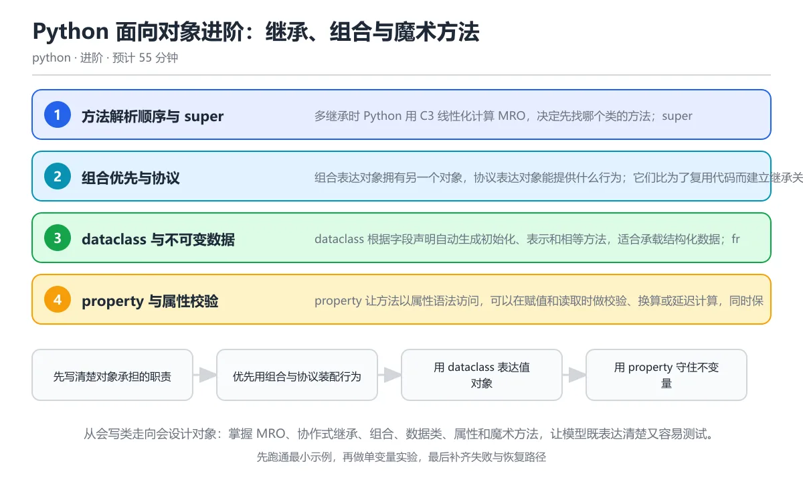

# Python 面向对象进阶：继承、组合与魔术方法

> 内容更新时间：2026-10-06 · 学习阶段：进阶 · 预计用时：40 分钟

分类：python。关键词：MRO、super、dataclass、property、魔术方法。从会写类走向会设计对象：掌握 MRO、协作式继承、组合、数据类、属性和魔术方法，让模型既表达清楚又容易测试。

学习建议：先通读《Python 面向对象进阶：继承、组合与魔术方法》的核心知识与关键流程，再运行可运行练习并完成测验；遇到不确定的结论，回到「故障现场」按症状、根因、修复、验证四步核对。



## 学习目标

- 能读懂多继承的 MRO 顺序并预测 super 的调用链。
- 能在继承、组合与协议之间做出有理由的选择。
- 能用 dataclass、property 和魔术方法写出可验证的领域对象。

## 前置知识

- 已经会定义类、实例化对象和写实例方法。
- 理解 self、实例属性与类属性的区别。
- 能用列表和字典保存对象集合。

## 核心知识

### 1. 方法解析顺序与 super

多继承时 Python 用 C3 线性化计算 MRO，决定先找哪个类的方法；super 沿 MRO 找下一个类，而不是简单地找直接父类。

类创建时生成 __mro__ 元组，方法查找按顺序进行；协作式继承要求每一层都调用 super，并把不认识的关键字参数继续向后传递，否则链会断掉。

在Python 面向对象进阶：继承、组合与魔术方法里可以这样验证：定义 B 和 C 都继承 A，让 D 同时继承 B 和 C，每层方法拼接自己的标记，观察调用链按 MRO 展开。

边界：MRO 不能解决职责混乱；菱形继承中如果某一层不调用 super，后面的实现就被跳过。

工程视角：优先使用单继承加协议，多继承只用于混入小而正交的能力，并用测试固定协作链行为。

### 2. 组合优先与协议

组合表达对象拥有另一个对象，协议表达对象能提供什么行为；它们比为了复用代码而建立继承关系更灵活。

把可变行为注入构造函数后，运行时可以替换实现，测试时可以传入假对象；typing.Protocol 用结构化类型描述接口，静态检查不需要真实继承。

在Python 面向对象进阶：继承、组合与魔术方法里可以这样验证：定义一个价格规则协议，把折扣对象注入订单，再在测试中换成不打折的规则验证总价。

边界：协议只描述形状，不会自动检查实现是否正确；运行时仍要处理方法缺失、返回值类型错误等边界。

工程视角：依赖抽象而不是具体类，构造和装配放在组合根，领域对象只依赖协议并保持可测试。

### 3. dataclass 与不可变数据

dataclass 根据字段声明自动生成初始化、表示和相等方法，适合承载结构化数据；frozen 与 slots 可以进一步收紧可变性和内存布局。

可变默认值必须用 field(default_factory=list) 创建，__post_init__ 可以在初始化后做校验或派生字段；frozen 会阻止字段重新赋值，slots 会移除实例字典。

在Python 面向对象进阶：继承、组合与魔术方法里可以这样验证：定义一个冻结的折扣数据类，再用默认工厂创建订单明细列表，验证两个实例的列表互不共享。

边界：frozen 只阻止字段重新绑定，字段内部的列表仍然可变；需要深层不可变时要选择元组或专门的不可变容器。

工程视角：值对象尽量小而不可变，实体用标识区分身份；数据类和业务行为可以分离，避免把所有逻辑塞进一个大类。

### 4. property 与属性校验

property 让方法以属性语法访问，可以在赋值和读取时做校验、换算或延迟计算，同时保持调用方代码简洁。

property 是描述符，读操作调用 getter，写操作调用 setter，删除调用 deleter；把内部值放在带下划线的属性里可以避免无限递归。

在Python 面向对象进阶：继承、组合与魔术方法里可以这样验证：给订单数量写一个属性，赋值时拒绝负数，读取时返回整数，再尝试写入非法值观察异常。

边界：属性不应隐藏昂贵的远程调用；setter 里做太多副作用会让赋值难以预测。

工程视角：校验失败要抛出明确异常并保留原始输入；派生属性的缓存需要失效策略和并发保护。

### 5. 魔术方法与语言协议

魔术方法让自定义对象接入 Python 的通用协议，例如长度、迭代、比较、算术运算、上下文管理和格式化。

len(obj) 调用 __len__，for 循环调用 __iter__，with 调用 __enter__ 和 __exit__，print 优先调用 __str__，调试显示调用 __repr__，运算符对应 __add__、__eq__ 等方法。

在Python 面向对象进阶：继承、组合与魔术方法里可以这样验证：给订单实现长度、表示和报价方法，让对象可以直接参与 len 与调试输出，而不必暴露内部列表。

边界：实现 __eq__ 后默认不再可哈希，需要时显式实现 __hash__；魔术方法应遵守 Python 的返回约定，否则其他库会工作异常。

工程视角：只实现真正需要的协议，并向语言内置语义对齐；__repr__ 要足以帮助定位问题且避免泄露敏感数据。

## 关键流程

```text
先写清楚对象承担的职责 → 优先用组合与协议装配行为 → 用 dataclass 表达值对象 → 用 property 守住不变量 → 按需实现魔术方法并补测试
```

1. 先写清楚对象承担的职责
2. 优先用组合与协议装配行为
3. 用 dataclass 表达值对象
4. 用 property 守住不变量
5. 按需实现魔术方法并补测试

## 动手练习

1. 设计一个 Shape 协议与两个实现，用组合方式计算一组图形的总面积，不建立继承层次。
2. 写一个带 property 校验的银行账户类，覆盖正常存取、负数金额与余额不足三种情况。
3. 定义三个参与协作式继承的混入类，打印 __mro__ 并验证每个实现的执行顺序。
4. 把一段字段很多的普通类改写成 frozen dataclass，并补上相等、哈希和默认工厂测试。

**验收标准**：留下输入、命令、输出和结论，能让别人按记录复现。

## 常见错误与排查

> 说明：本表由《Python 面向对象进阶：继承、组合与魔术方法》的核心知识整理（2026-10-06），人工复核进度见 docs/content_review_batches.md。

| 易错点 | 容易踩的做法 | 正确结论 |
| --- | --- | --- |
| 用继承复用代码 | 为了复用几个工具函数，让业务类继承一个庞大的基类，耦合不断扩散 | 把行为拆成独立组件，通过组合或协议注入，只保留真正的是一种关系 |
| 重写相等却不处理哈希 | 只实现 __eq__，随后对象放进集合或作为字典键时报 unhashable | 按相等语义同步实现 __hash__，或把对象声明为不可变值对象 |
| 数据类使用可变默认值 | 在 dataclass 字段上直接写 tags: list = []，定义阶段就报错或产生共享 | 使用 field(default_factory=list)，让每个实例创建独立容器 |
| super 调用链被中断 | 某一层重写方法后完全不调用 super，后面的混入逻辑被跳过 | 协作式继承中每一层都调用 super 并正确传递参数，用测试覆盖完整链 |

## 可运行练习

### 任务 1：先跑通，再解释

```python
from dataclasses import dataclass
from typing import Protocol

class PriceRule(Protocol):
    def final_price(self, amount: float) -> float: ...

@dataclass(frozen=True)
class Discount:
    percent: float

    def final_price(self, amount: float) -> float:
        return round(amount * (1 - self.percent / 100), 2)

class Order:
    def __init__(self, rule: PriceRule, items=None):
        self.rule = rule
        self._items = list(items or [])

    @property
    def total(self) -> float:
        return sum(self._items)

    def quote(self) -> float:
        return self.rule.final_price(self.total)

    def __len__(self):
        return len(self._items)

    def __repr__(self):
        return f"Order(items={self._items!r})"

class A:
    def hello(self):
        return "A"

class B(A):
    def hello(self):
        return "B+" + super().hello()

class C(A):
    def hello(self):
        return "C+" + super().hello()

class D(B, C):
    pass

print("MRO 调用链:", D().hello())
order = Order(Discount(10), [100, 50])
print("报价:", order.quote())
print("对象表示:", repr(order))
```

订单只依赖价格规则协议，折扣对象负责计算折后价；Order 用 property 暴露总价，用 len 和 repr 接入语言协议。下半部分构造菱形继承，B 与 C 都通过 super 调用下一层，最终输出展示了 D 到 B 到 C 到 A 的协作式调用链。

### 任务 2：只改一个条件

复制上面的示例，只改一个输入或参数再跑一次；先写下预测，再和真实输出对照，并说明差异来自Python 面向对象进阶：继承、组合与魔术方法的哪条机制。

### 任务 3：迁移到自己的数据

把《Python 面向对象进阶：继承、组合与魔术方法》里的示例换成你自己的一小段数据或场景，保持结构不变；如果换不动，说明还有哪条前提没有理解，回到核心知识对应小节。

## 故障现场

### 现场 1：用继承复用代码

**症状**：在《Python 面向对象进阶：继承、组合与魔术方法》里采用「为了复用几个工具函数，让业务类继承一个庞大的基类，耦合不断扩散」时，用继承复用代码会表现为错误结果、异常中断或状态不一致。

**根因**：这个做法没有执行与「用继承复用代码」对应的检查，问题被带到了后续步骤。

**修复**：把行为拆成独立组件，通过组合或协议注入，只保留真正的是一种关系

**验证**：为「用继承复用代码」准备一个最小输入，确认修复前的失败可以复现，修复后的输出与本课示例一致，再补一个边界输入。

### 现场 2：重写相等却不处理哈希

**症状**：在《Python 面向对象进阶：继承、组合与魔术方法》里采用「只实现 __eq__，随后对象放进集合或作为字典键时报 unhashable」时，重写相等却不处理哈希会表现为错误结果、异常中断或状态不一致。

**根因**：这个做法没有执行与「重写相等却不处理哈希」对应的检查，问题被带到了后续步骤。

**修复**：按相等语义同步实现 __hash__，或把对象声明为不可变值对象

**验证**：为「重写相等却不处理哈希」准备一个最小输入，确认修复前的失败可以复现，修复后的输出与本课示例一致，再补一个边界输入。

### 现场 3：数据类使用可变默认值

**症状**：在《Python 面向对象进阶：继承、组合与魔术方法》里采用「在 dataclass 字段上直接写 tags: list = []，定义阶段就报错或产生共享」时，数据类使用可变默认值会表现为错误结果、异常中断或状态不一致。

**根因**：这个做法没有执行与「数据类使用可变默认值」对应的检查，问题被带到了后续步骤。

**修复**：使用 field(default_factory=list)，让每个实例创建独立容器

**验证**：为「数据类使用可变默认值」准备一个最小输入，确认修复前的失败可以复现，修复后的输出与本课示例一致，再补一个边界输入。

### 现场 4：super 调用链被中断

**症状**：在《Python 面向对象进阶：继承、组合与魔术方法》里采用「某一层重写方法后完全不调用 super，后面的混入逻辑被跳过」时，super 调用链被中断会表现为错误结果、异常中断或状态不一致。

**根因**：这个做法没有执行与「super 调用链被中断」对应的检查，问题被带到了后续步骤。

**修复**：协作式继承中每一层都调用 super 并正确传递参数，用测试覆盖完整链

**验证**：为「super 调用链被中断」准备一个最小输入，确认修复前的失败可以复现，修复后的输出与本课示例一致，再补一个边界输入。

## 本课复习清单

离开本课前，逐项确认：

- [ ] 能根据 __mro__ 预测 super 调用链。
- [ ] 能用协议和组合替代为了复用而建立的继承。
- [ ] 能解释实现 __eq__ 后对象变成 unhashable 的原因。
- [ ] 至少运行一次本课示例，记录输入、输出和一个边界情况。
- [ ] 把本课最容易混淆的两个概念写成一句话对照。

| 复盘项 | 记录 |
| --- | --- |
| 已经能独立解释的考点 |  |
| 仍然说不清的概念 |  |
| 下一步验证动作 |  |

## 复习与自测

### 核心知识

遮住正文回答：Python 面向对象进阶：继承、组合与魔术方法解决什么问题、依赖哪些前提、失败时先看哪个信号？三问都能答清楚，再进入下一节。

### 动手练习

把《Python 面向对象进阶：继承、组合与魔术方法》里「只改一个条件」的练习再做一遍，这次先写预测再运行；预测和结果不一致的地方，就是需要回读的章节。

### 最小可运行示例

```python
from dataclasses import dataclass
from typing import Protocol

class PriceRule(Protocol):
    def final_price(self, amount: float) -> float: ...

@dataclass(frozen=True)
class Discount:
    percent: float

    def final_price(self, amount: float) -> float:
        return round(amount * (1 - self.percent / 100), 2)

class Order:
    def __init__(self, rule: PriceRule, items=None):
        self.rule = rule
        self._items = list(items or [])

    @property
    def total(self) -> float:
        return sum(self._items)

    def quote(self) -> float:
        return self.rule.final_price(self.total)

    def __len__(self):
        return len(self._items)

    def __repr__(self):
        return f"Order(items={self._items!r})"

class A:
    def hello(self):
        return "A"

class B(A):
    def hello(self):
        return "B+" + super().hello()

class C(A):
    def hello(self):
        return "C+" + super().hello()

class D(B, C):
    pass

print("MRO 调用链:", D().hello())
order = Order(Discount(10), [100, 50])
print("报价:", order.quote())
print("对象表示:", repr(order))
```

### 预期输出

```text
MRO 调用链: B+C+A
报价: 135.0
对象表示: Order(items=[100, 50])
```

### 验证步骤

1. 确认输入数据与运行环境和示例一致。
2. 运行示例，记录输出与耗时等可观测指标。
3. 换一个边界输入重跑，确认结论仍然成立。
4. 把两次结果写成一句话结论，注明前提与局限。

## 术语速查

先遮住右列，尝试用自己的话解释，再回到正文核对。

| 术语 | 一句话说明 |
| --- | --- |
| `MRO` | 类的方法解析顺序元组，决定属性与方法按什么顺序查找。 |
| `super` | 沿当前实例的 MRO 查找下一个实现的代理对象，用于协作式继承。 |
| `Protocol` | typing 提供的结构化接口描述，只关心对象是否具备某些方法。 |
| `dataclass` | 根据字段声明自动生成常用方法的装饰器，适合表达结构化数据。 |
| `property` | 把方法包装成属性访问的描述符，可分别定义读取、赋值和删除行为。 |
| `魔术方法` | 以双下划线包围的方法，由 Python 语法或内置函数自动调用以接入通用协议。 |

## 考点精讲

### 考点 1：D 继承 B 和 C，两者都继承 A 且

题型：概念判断。题干：D 继承 B 和 C，两者都继承 A 且每层调用 super，D().hello() 的输出是什么？

判断要点：B+C+A。MRO 是 D、B、C、A，调用 D 继承来的方法先进入 B，B 调用 super 进入 C，C 再调用 super 进入 A，因此逐层拼接得到 B+C+A。super 的语义是沿 MRO 找下一个实现，而不是直接回到直接父类，这也是协作式多继承能够逐层工作的原因。

### 考点 2：dataclass 中需要一个每个实例独

题型：概念判断。题干：dataclass 中需要一个每个实例独立的列表字段，正确写法是？

判断要点：items: list = field(default_factory=list)。正确写法是 field(default_factory=list)。列表是可变对象，直接写空列表会被所有实例共享，而且 dataclass 会阻止这种明显危险的默认值；默认工厂会在每次创建实例时调用一次，因此每个对象的列表互相独立，适合订单明细、标签等集合字段。 正确选项「items: list = field(default_factory=list)」对应《Python 面向对象进阶：继承、组合与魔术方法》的要点「组合优先与协议」：组合表达对象拥有另一个对象，协议表达对象能提供什么行为；它们比为了复用代码而建立继承关系更灵活。判断「组合优先与协议」时先确认前提是否成立，再回到《Python 面向对象进阶：继承、组合与魔术方法》的示例核对一次；借鉴相邻主题的经验之前，先核对组合优先与协议的前提是否成立。

### 考点 3：为什么组合和协议通常比深层继承更灵活？（

题型：多选辨析。题干：为什么组合和协议通常比深层继承更灵活？（多选）

判断要点：运行时可以替换具体实现；测试时可以注入假对象；避免把无关职责耦合进基类。组合允许在构造时注入不同实现，测试中可以用假对象隔离外部依赖，也避免为了复用一小段代码把所有职责拉进同一个基类。组合本身不会自动带来不可变或线程安全，这些性质仍需要数据结构和接口设计来保证。 正确选项「运行时可以替换具体实现；测试时可以注入假对象；避免把无关职责耦合进基类」对应《Python 面向对象进阶：继承、组合与魔术方法》的要点「dataclass 与不可变数据」：dataclass 根据字段声明自动生成初始化、表示和相等方法，适合承载结构化数据；frozen 与 slots 可以进一步收紧可变性和内存布局。判断「dataclass 与不可变数据」时先确认前提是否成立，再回到《Python 面向对象进阶：继承、组合与魔术方法》的示例核对一次；记住dataclass 与不可变数据的结论之外还要记住适用条件，换一个输入往往就不成立了。

### 考点 4：阅读类定义，哪个判断正确？

class

题型：代码阅读。题干：阅读类定义，哪个判断正确？

class Wallet:
    def __init__(self, cents):
        self._cents = cents
    @property
    def cents(self):
        return self._cents

判断要点：cents 是只读属性，外部赋值会抛 AttributeError。只定义 getter 的 property 是只读的，外部执行 wallet.cents = 10 会抛出 AttributeError，从而保护内部金额不被随意改写。下划线只是约定，仍然可以直接访问 _cents，因此真正的边界要靠只读属性、不可变对象或受控方法共同保证。 正确选项「cents 是只读属性，外部赋值会抛 AttributeError」对应《Python 面向对象进阶：继承、组合与魔术方法》的要点「property 与属性校验」：property 让方法以属性语法访问，可以在赋值和读取时做校验、换算或延迟计算，同时保持调用方代码简洁。判断「property 与属性校验」时先确认前提是否成立，再回到《Python 面向对象进阶：继承、组合与魔术方法》的示例核对一次；干扰项常常是相邻主题里成立的结论，只有按property 与属性校验的输入与约束判断才能排除。

### 考点 5：为什么这个类放进 set 后报 unha

题型：排错。题干：为什么这个类放进 set 后报 unhashable？

class Point:
    def __init__(self, x, y): self.x, self.y = x, y
    def __eq__(self, other): return (self.x, self.y) == (other.x, other.y)

判断要点：实现 __eq__ 后默认的 __hash__ 会被置空，需要显式实现或使用冻结数据类。Python 认为可变相等语义与默认身份哈希不一致，因此在类中定义 __eq__ 后会把 __hash__ 设为 None，实例不再可哈希。若 Point 是值对象，应把字段变成只读并显式实现基于元组的 __hash__，或者使用 frozen dataclass，让相等与哈希由同一组字段生成。 正确选项「实现 __eq__ 后默认的 __hash__ 会被置空，需要显式实现或使用冻结数据类」对应《Python 面向对象进阶：继承、组合与魔术方法》的要点「魔术方法与语言协议」：魔术方法让自定义对象接入 Python 的通用协议，例如长度、迭代、比较、算术运算、上下文管理和格式化。判断「魔术方法与语言协议」时先确认前提是否成立，再回到《Python 面向对象进阶：继承、组合与魔术方法》的示例核对一次；把魔术方法与语言协议的做法换到别的约束下未必成立，先确认边界再决定答案。

## English Overview

Advanced Python OOP: Inheritance, Composition and Dunder Methods

This lesson explains method resolution order and cooperative super calls, compares inheritance with composition and protocols, and shows how dataclasses, properties and dunder methods create expressive domain objects. It also covers mutable field defaults, equality and hashing contracts, and testing object collaboration.

## 本课小结

- Python 面向对象进阶：继承、组合与魔术方法围绕MRO、super、dataclass展开，先建立基线再讨论优化。
- 多继承时 Python 用 C3 线性化计算 MRO，决定先找哪个类的方法；super 沿 MRO 找下一个类，而不是简单地找直接父类。
- 遇到问题时按「症状 → 根因 → 修复 → 验证」的顺序处理，不跳过验证。

## 内容元数据

- 内容版本：v2.0
- 最后更新：2026-10-06
- 学习阶段：进阶

| 字段 | 值 |
| --- | --- |
| 课程 ID | `python_oop_advanced` |
| 所属分类 | `python` |
| 难度 | 进阶 |
| 预计用时 | 55 分钟 |
| 关键词 | MRO、super、dataclass、property、魔术方法 |
| 配图 | `images/lesson_python_oop_advanced.webp` |
| 参考资料 | 3 条 |
| 内容更新时间 | 2026-10-06 |

## 参考资料与复核

- 最后复核：2026-10-04
- 下次复核：2026-12-10
- 复核范围：版本兼容、API 行为与工程实践

下面列出的资料用于核对本课结论，复习时可以对照阅读：
- [Python 数据模型与魔术方法](https://docs.python.org/3/reference/datamodel.html)
- [Python dataclasses 文档](https://docs.python.org/3/library/dataclasses.html)
- [Python 类与 MRO 教程](https://docs.python.org/3/tutorial/classes.html)

> 复核提示：《Python 面向对象进阶：继承、组合与魔术方法》的结论如与资料冲突，以资料中的规范文本为准，并在笔记里记录差异与日期。

## 复习与迁移

### 概念复述

不看正文，把Python 面向对象进阶：继承、组合与魔术方法讲给一个没学过的同事：先讲它解决什么问题，再讲一个最小例子，最后说明一个不适用场景。

### 测验回顾

回到《Python 面向对象进阶：继承、组合与魔术方法》测验，只重做答错或犹豫的题；对每道题写一句「我为什么改选这个答案」，写不出理由就回到对应小节。

### 迁移练习

把《Python 面向对象进阶：继承、组合与魔术方法》的方法用到一个你自己的真实场景：说明输入、约束与验证方式，并列出仍然不确定、需要下一次实验回答的问题。

## 深度拓展与实战

这一节把Python 面向对象进阶：继承、组合与魔术方法的机制拆开验证：每一步都给出输入、判断标准和失败信号，便于在真实项目里复用。

### 机制拆解 1：方法解析顺序与 super

类创建时生成 __mro__ 元组，方法查找按顺序进行；协作式继承要求每一层都调用 super，并把不认识的关键字参数继续向后传递，否则链会断掉。

落地时先确认前提：MRO 不能解决职责混乱；菱形继承中如果某一层不调用 super，后面的实现就被跳过。；再把结论写进检查表，让下一位同学可以按同样的输入复现。

工程做法：优先使用单继承加协议，多继承只用于混入小而正交的能力，并用测试固定协作链行为。

### 机制拆解 2：组合优先与协议

把可变行为注入构造函数后，运行时可以替换实现，测试时可以传入假对象；typing.Protocol 用结构化类型描述接口，静态检查不需要真实继承。

落地时先确认前提：协议只描述形状，不会自动检查实现是否正确；运行时仍要处理方法缺失、返回值类型错误等边界。；再把结论写进检查表，让下一位同学可以按同样的输入复现。

工程做法：依赖抽象而不是具体类，构造和装配放在组合根，领域对象只依赖协议并保持可测试。

### 机制拆解 3：dataclass 与不可变数据

可变默认值必须用 field(default_factory=list) 创建，__post_init__ 可以在初始化后做校验或派生字段；frozen 会阻止字段重新赋值，slots 会移除实例字典。

落地时先确认前提：frozen 只阻止字段重新绑定，字段内部的列表仍然可变；需要深层不可变时要选择元组或专门的不可变容器。；再把结论写进检查表，让下一位同学可以按同样的输入复现。

工程做法：值对象尽量小而不可变，实体用标识区分身份；数据类和业务行为可以分离，避免把所有逻辑塞进一个大类。

### 机制拆解 4：property 与属性校验

property 是描述符，读操作调用 getter，写操作调用 setter，删除调用 deleter；把内部值放在带下划线的属性里可以避免无限递归。

落地时先确认前提：属性不应隐藏昂贵的远程调用；setter 里做太多副作用会让赋值难以预测。；再把结论写进检查表，让下一位同学可以按同样的输入复现。

工程做法：校验失败要抛出明确异常并保留原始输入；派生属性的缓存需要失效策略和并发保护。

### 机制拆解 5：魔术方法与语言协议

len(obj) 调用 __len__，for 循环调用 __iter__，with 调用 __enter__ 和 __exit__，print 优先调用 __str__，调试显示调用 __repr__，运算符对应 __add__、__eq__ 等方法。

落地时先确认前提：实现 __eq__ 后默认不再可哈希，需要时显式实现 __hash__；魔术方法应遵守 Python 的返回约定，否则其他库会工作异常。；再把结论写进检查表，让下一位同学可以按同样的输入复现。

工程做法：只实现真正需要的协议，并向语言内置语义对齐；__repr__ 要足以帮助定位问题且避免泄露敏感数据。

### 机制对照表

| 概念 | 解决什么问题 | 关键前提 | 失败信号 |
| --- | --- | --- | --- |
| 方法解析顺序与 super | 多继承时 Python 用 C3 线性化计算 MRO，决定先找哪个类的方法；su | MRO 不能解决职责混乱；菱形继承中如果某一层不调用 super，后面的 | 优先使用单继承加协议，多继承只用于混入小而正交的能力，并用测试固定协作链 |
| 组合优先与协议 | 组合表达对象拥有另一个对象，协议表达对象能提供什么行为；它们比为了复用代码而建立 | 协议只描述形状，不会自动检查实现是否正确；运行时仍要处理方法缺失、返回值 | 依赖抽象而不是具体类，构造和装配放在组合根，领域对象只依赖协议并保持可测 |
| dataclass 与不可变数据 | dataclass 根据字段声明自动生成初始化、表示和相等方法，适合承载结构化数 | frozen 只阻止字段重新绑定，字段内部的列表仍然可变；需要深层不可变 | 值对象尽量小而不可变，实体用标识区分身份；数据类和业务行为可以分离，避免 |
| property 与属性校验 | property 让方法以属性语法访问，可以在赋值和读取时做校验、换算或延迟计算 | 属性不应隐藏昂贵的远程调用；setter 里做太多副作用会让赋值难以预测 | 校验失败要抛出明确异常并保留原始输入；派生属性的缓存需要失效策略和并发保 |
| 魔术方法与语言协议 | 魔术方法让自定义对象接入 Python 的通用协议，例如长度、迭代、比较、算术运 | 实现 __eq__ 后默认不再可哈希，需要时显式实现 __hash__； | 只实现真正需要的协议，并向语言内置语义对齐；__repr__ 要足以帮助 |

### 自测问答

**问 1**：D 继承 B 和 C，两者都继承 A 且每层调用 super，D().hello() 的输出是什么？

**答**：B+C+A。MRO 是 D、B、C、A，调用 D 继承来的方法先进入 B，B 调用 super 进入 C，C 再调用 super 进入 A，因此逐层拼接得到 B+C+A。super 的语义是沿 MRO 找下一个实现，而不是直接回到直接父类，这也是协作式多继承能够逐层工作的原因。

**问 2**：dataclass 中需要一个每个实例独立的列表字段，正确写法是？

**答**：items: list = field(default_factory=list)。正确写法是 field(default_factory=list)。列表是可变对象，直接写空列表会被所有实例共享，而且 dataclass 会阻止这种明显危险的默认值；默认工厂会在每次创建实例时调用一次，因此每个对象的列表互相独立，适合订单明细、标签等集合字段。 正确选项「items: list = field(default_factory=list)」对应《Python 面向对象进阶：继承、组合与魔术方法》的要点「组合优先与协议」：组合表达对象拥有另一个对象，协议表达对象能提供什么行为；它们比为了复用代码而建立继承关系更灵活。判断「组合优先与协议」时先确认前提是否成立，再回到《Python 面向对象进阶：继承、组合与魔术方法》的示例核对一次；借鉴相邻主题的经验之前，先核对组合优先与协议的前提是否成立。

**问 3**：为什么组合和协议通常比深层继承更灵活？（多选）

**答**：运行时可以替换具体实现；测试时可以注入假对象；避免把无关职责耦合进基类。组合允许在构造时注入不同实现，测试中可以用假对象隔离外部依赖，也避免为了复用一小段代码把所有职责拉进同一个基类。组合本身不会自动带来不可变或线程安全，这些性质仍需要数据结构和接口设计来保证。 正确选项「运行时可以替换具体实现；测试时可以注入假对象；避免把无关职责耦合进基类」对应《Python 面向对象进阶：继承、组合与魔术方法》的要点「dataclass 与不可变数据」：dataclass 根据字段声明自动生成初始化、表示和相等方法，适合承载结构化数据；frozen 与 slots 可以进一步收紧可变性和内存布局。判断「dataclass 与不可变数据」时先确认前提是否成立，再回到《Python 面向对象进阶：继承、组合与魔术方法》的示例核对一次；记住dataclass 与不可变数据的结论之外还要记住适用条件，换一个输入往往就不成立了。

**问 4**：阅读类定义，哪个判断正确？

class Wallet:
    def __init__(self, cents):
        self._cents = cents
    @property
    def cents(self):
        return self._cents

**答**：cents 是只读属性，外部赋值会抛 AttributeError。只定义 getter 的 property 是只读的，外部执行 wallet.cents = 10 会抛出 AttributeError，从而保护内部金额不被随意改写。下划线只是约定，仍然可以直接访问 _cents，因此真正的边界要靠只读属性、不可变对象或受控方法共同保证。 正确选项「cents 是只读属性，外部赋值会抛 AttributeError」对应《Python 面向对象进阶：继承、组合与魔术方法》的要点「property 与属性校验」：property 让方法以属性语法访问，可以在赋值和读取时做校验、换算或延迟计算，同时保持调用方代码简洁。判断「property 与属性校验」时先确认前提是否成立，再回到《Python 面向对象进阶：继承、组合与魔术方法》的示例核对一次；干扰项常常是相邻主题里成立的结论，只有按property 与属性校验的输入与约束判断才能排除。

**问 5**：为什么这个类放进 set 后报 unhashable？

class Point:
    def __init__(self, x, y): self.x, self.y = x, y
    def __eq__(self, other): return (self.x, self.y) == (other.x, other.y)

**答**：实现 __eq__ 后默认的 __hash__ 会被置空，需要显式实现或使用冻结数据类。Python 认为可变相等语义与默认身份哈希不一致，因此在类中定义 __eq__ 后会把 __hash__ 设为 None，实例不再可哈希。若 Point 是值对象，应把字段变成只读并显式实现基于元组的 __hash__，或者使用 frozen dataclass，让相等与哈希由同一组字段生成。 正确选项「实现 __eq__ 后默认的 __hash__ 会被置空，需要显式实现或使用冻结数据类」对应《Python 面向对象进阶：继承、组合与魔术方法》的要点「魔术方法与语言协议」：魔术方法让自定义对象接入 Python 的通用协议，例如长度、迭代、比较、算术运算、上下文管理和格式化。判断「魔术方法与语言协议」时先确认前提是否成立，再回到《Python 面向对象进阶：继承、组合与魔术方法》的示例核对一次；把魔术方法与语言协议的做法换到别的约束下未必成立，先确认边界再决定答案。

### 排错速查

- 看到「为了复用几个工具函数，让业务类继承一个庞大的基类，耦合不断扩散」时，先按「把行为拆成独立组件，通过组合或协议注入，只保留真正的是一种关系」处理，再用Python 面向对象进阶：继承、组合与魔术方法的最小示例确认结论是否恢复。
- 看到「只实现 __eq__，随后对象放进集合或作为字典键时报 unhashable」时，先按「按相等语义同步实现 __hash__，或把对象声明为不可变值对象」处理，再用Python 面向对象进阶：继承、组合与魔术方法的最小示例确认结论是否恢复。
- 看到「在 dataclass 字段上直接写 tags: list = []，定义阶段就报错或产生共享」时，先按「使用 field(default_factory=list)，让每个实例创建独立容器」处理，再用Python 面向对象进阶：继承、组合与魔术方法的最小示例确认结论是否恢复。
- 看到「某一层重写方法后完全不调用 super，后面的混入逻辑被跳过」时，先按「协作式继承中每一层都调用 super 并正确传递参数，用测试覆盖完整链」处理，再用Python 面向对象进阶：继承、组合与魔术方法的最小示例确认结论是否恢复。

### 工程检查表

- [ ] 先写清楚对象承担的职责
- [ ] 优先用组合与协议装配行为
- [ ] 用 dataclass 表达值对象
- [ ] 用 property 守住不变量
- [ ] 按需实现魔术方法并补测试
- [ ] 【方法解析顺序与 super】优先使用单继承加协议，多继承只用于混入小而正交的能力，并用测试固定协作链行为。
- [ ] 【组合优先与协议】依赖抽象而不是具体类，构造和装配放在组合根，领域对象只依赖协议并保持可测试。
- [ ] 【dataclass 与不可变数据】值对象尽量小而不可变，实体用标识区分身份；数据类和业务行为可以分离，避免把所有逻辑塞进一个大类。
- [ ] 【property 与属性校验】校验失败要抛出明确异常并保留原始输入；派生属性的缓存需要失效策略和并发保护。
- [ ] 【魔术方法与语言协议】只实现真正需要的协议，并向语言内置语义对齐；__repr__ 要足以帮助定位问题且避免泄露敏感数据。

### 迁移练习

把Python 面向对象进阶：继承、组合与魔术方法的方法用到一个真实场景：写下MRO、super、dataclass在你的场景里分别对应什么，再记录一次失败尝试和它的恢复步骤。

### 延伸阅读与下一步

- 复习MRO、super、dataclass、property、魔术方法时，优先回看「方法解析顺序与 super」与「魔术方法与语言协议」两节。
- 把从「先写清楚对象承担的职责」到「按需实现魔术方法并补测试」的流程画成一张图，放进自己的笔记。
- 一周后重做本课测验，只把答错的题留到下一轮复习。

### 结论与下一步

学完Python 面向对象进阶：继承、组合与魔术方法，应该能独立完成三件事：先用最小示例确认MRO的行为，再用一个边界输入验证结论，最后把失败路径写成可重复的检查。下一步把本课术语加入复习清单，并在两周内用一次真实任务检验记忆是否牢固。
