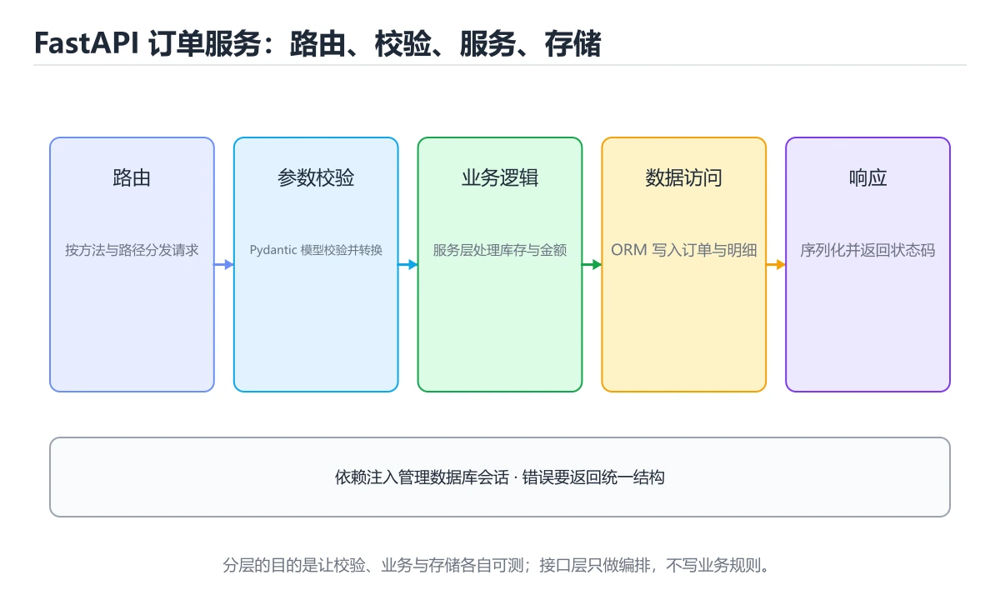
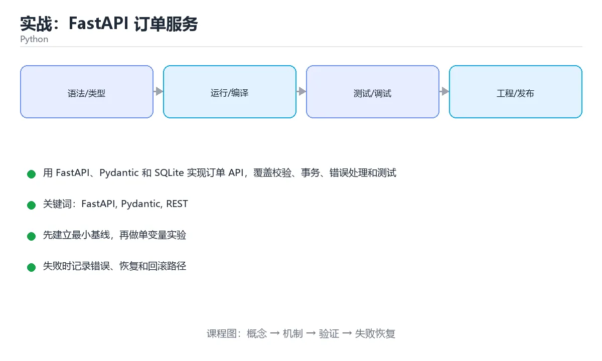

# 实战：FastAPI 订单服务





> 内容更新时间：2026-10-06 · 学习阶段：高级 · 预计用时：60 分钟

## 本节知识框架

**课程定位**：所属分类 `python`（Python），课程主题 `实战：FastAPI 订单服务`，学习阶段 高级，建议用时 70 分钟。

本课主线：用 FastAPI、Pydantic 和 SQLite 实现订单 API，覆盖校验、事务、错误处理和测试。

**学完本课应当能够**
- 说清 `FastAPI` 与 `REST` 的含义与区别，并各举一个正例和一个反例。
- 用本课示例验证 `pytest` 的行为，记录输入、输出与失败条件。
- 遇到「金额使用浮点数」这类问题时，能说出触发条件与修复顺序。

### 从概念到验证的学习链条

1. `FastAPI`：先掌握 基于类型注解的 Python Web 框架：自动校验请求并生成 OpenAPI 文档，原生支持异步，再用它解释 `REST` 为什么会出现。
2. `REST`：先掌握 以资源 URI、HTTP 方法和状态码组织接口的无状态风格，再用它解释 `pytest` 为什么会出现。
3. `pytest`：先掌握 把「步骤 6：用 pytest 和 TestClient 完成验收」改写成一条可执行的核对项，逐条验证输入、超时与失败路径，再用它解释 `依赖注入` 为什么会出现。
4. `依赖注入`：先掌握 FastAPI 用 Depends 声明路由需要的会话、配置与鉴权，便于替换与测试，再用它解释 `可观测性` 为什么会出现。
5. `可观测性`：先掌握 由日志、指标与链路追踪组成，能在不重启、不改代码的前提下问出新问题，再用它解释 本课示例的观察结果 为什么会出现。

**先修与衔接**：本课是「Python」分类的第 26 课。先修内容：《实战：爬虫与数据分析》。《实战：爬虫与数据分析》里的 `timeout`、`fillna` 是本课的前提。相关或后续课程：《实战：CSV 到 SQLite 的 ETL 流水线》、《实战：Node.js + Express REST API》、《实战：REST API 与 SQLite 事务服务》。

### 完成判据

- **定义关**：不看正文也能说明 `FastAPI` 是 基于类型注解的 Python Web 框架：自动校验请求并生成 OpenAPI 文档，原生支持异步，并指出一个反例。
- **机制关**：能按“输入 → 转换 → 输出 → 验证”复述 `实战：FastAPI 订单服务`，而不是只背结论。
- **示例关**：能运行或推演 `实战：FastAPI 订单服务` 的 `text` 示例，并说明一个真实出现的标识符或字面量。
- **证据关**：能从 `实战：FastAPI 订单服务` 的示例写出一个输入、处理、输出三元组，并说明它支持或反驳了本课的哪一条结论。
- **排错关**：能复现 金额使用浮点数，记录现象并按 使用整数分或 Decimal 修复。
- **迁移关**：能把 `FastAPI`、`Pydantic`、`REST`、`SQLite` 放进一个与 `实战：FastAPI 订单服务` 不同的项目场景，并保持输入与验证条件可追踪。
- **复盘关**：学完 `实战：FastAPI 订单服务` 后，用一句话写下仍然不确定的结论，并列出下一次验证需要的输入、环境和成功判据。

### 复习清单

- [ ] 能不看正文复述本课核心术语，并指出一个边界或反例。
- [ ] 能运行或推演本课示例，记录输入、输出与失败现象。
- [ ] 能完成一次自测，并把错题对照错误表定位原因。

## 核心概念定义

| 术语 | 操作性定义 | 常见边界与风险 |
| --- | --- | --- |
| FastAPI | 基于类型注解的 Python Web 框架：自动校验请求并生成 OpenAPI 文档，原生支持异步。 | 不同版本与依赖组合的行为可能不同，升级或换环境前要按官方变更说明重新验证。 |
| REST | 以资源 URI、HTTP 方法和状态码组织接口的无状态风格。 | 网络延迟、超时与版本协商会改变行为，只在真实链路或多版本客户端上验证才算数。 |
| pytest | 把「步骤 6：用 pytest 和 TestClient 完成验收」改写成一条可执行的核对项，逐条验证输入、超时与失败路径。 | 网络延迟、超时与版本协商会改变行为，只在真实链路或多版本客户端上验证才算数。 |
| 依赖注入 | FastAPI 用 Depends 声明路由需要的会话、配置与鉴权，便于替换与测试。 | 不同版本与依赖组合的行为可能不同，升级或换环境前要按官方变更说明重新验证。 |
| 可观测性 | 由日志、指标与链路追踪组成，能在不重启、不改代码的前提下问出新问题 | 只在「由日志、指标与链路追踪组成，能在不重启、不改代码的前提下问出新问题」这一前提下成立，换输入或换环境要重新验证。 |

## 原理与运行机制

### 机制总览

**教材衔接：技术栈**

- Python 3.12
- FastAPI
- Pydantic
- SQLite
- pytest
- uvicorn

**教材衔接：架构与数据流**

- 读路径要明确 FastAPI 的查询条件、分页方式和返回字段，避免一次加载全部数据。
- idempotency_key 的写入要以幂等键为准，失败后能补偿或安全重试。
- 外部调用要设置超时、重试上限和降级策略。
- 每个关键阶段都要留下日志、指标或测试证据。

**教材衔接：功能范围**

- [ ] 创建订单并校验商品数量与金额
- [ ] 按订单号查询订单详情
- [ ] 取消未支付订单并释放库存
- [ ] 用幂等键避免重复提交

**教材衔接：实施步骤**

### 步骤 1：定义 Pydantic 请求模型和统一错误响应

- 把 Pydantic 这一步的依赖与交付物写成两行清单，再开始实现。
- 验证方法：用最小请求或单元测试证明 FastAPI 这一步的结果正确。
- 失败处理：记录 FastAPI 的错误类型、回滚动作和重试条件，避免把问题带到下一步。
- 证据留存：保留命令、输出、日志或截图，方便评审与复盘。

### 步骤 2：建立 SQLite 表结构与仓储函数

- 定位：这一节说明步骤 2：建立 SQLite 表结构与仓储函数在「实战：FastAPI 订单服务」知识体系里的位置。
- 要点：能设计 REST 资源与状态码，并把请求校验放在边界层。
- 自检：能否用一个最小例子解释步骤 2：建立 SQLite 表结构与仓储函数？

### 步骤 3：实现创建、查询和取消三个接口

- 定位：这一节说明步骤 3：实现创建、查询和取消三个接口在「实战：FastAPI 订单服务」知识体系里的位置。
- 要点：本课涉及：FastAPI、Pydantic、REST、SQLite、pytest。
- 自检：能否用一个最小例子解释步骤 3：实现创建、查询和取消三个接口？

### 步骤 4：把库存扣减与订单写入放入同一事务

- 定位：这一节说明步骤 4：把库存扣减与订单写入放入同一事务在「实战：FastAPI 订单服务」知识体系里的位置。
- 要点：小型电商需要一个离线可运行的订单服务：创建订单、查询订单、取消订单，并对金额、库存和重复请求做校验。项目不依赖云服务，使用 SQLite 和本地测试即可完整验证。
- 自检：能否用一个最小例子解释步骤 4：把库存扣减与订单写入放入同一事务？

### 步骤 5：加入幂等键与重复请求测试

- 定位：这一节说明步骤 5：加入幂等键与重复请求测试在「实战：FastAPI 订单服务」知识体系里的位置。
- 要点：一句话摘要：用 FastAPI、Pydantic 和 SQLite 实现订单 API，覆盖校验、事务、错误处理和测试。
- 自检：能否用一个最小例子解释步骤 5：加入幂等键与重复请求测试？

### 步骤 6：用 pytest 和 TestClient 完成验收

把这条结论放回「实战：FastAPI 订单服务」的完整流程里展开：

- 正文依据：把 SQLite 替换为 PostgreSQL 并保持接口不变
- 落地检查：把「步骤 6：用 pytest 和 TestClient 完成验收」改写成一条可执行的核对项，逐条验证输入、超时与失败路径。

**教材衔接：建议目录结构**

**教材衔接：质量门禁**

- [ ] 格式化和静态检查通过，不遗留明显警告。
- [ ] 为 idempotency_key 补单元测试，并至少覆盖一条真实的外部依赖。
- [ ] 错误响应不泄露堆栈、SQL 和密钥。
- [ ] 配置来自环境变量或配置文件，不硬编码敏感信息。
- [ ] README 写清启动、测试、配置和回滚步骤。

**教材衔接：安全、成本与可观测性**

- 为 Pydantic 单独申请最小权限，并记录权限变更。
- 把 Pydantic 的输入约束写成白名单，并统一错误结构。
- 密钥通过环境变量或密钥管理服务注入，并记录轮换方式。
- 为 FastAPI 涉及的连接、线程或协程、队列与网络请求设置上限，避免资源耗尽。
- 至少记录 FastAPI 的请求量、错误率、P95/P99 延迟与资源使用趋势。
- 为 idempotency_key 的失败留下可检索的日志字段，能按请求定位到具体环节。

**教材衔接：扩展任务**

- 加入分页查询和按状态过滤
- 把 SQLite 替换为 PostgreSQL 并保持接口不变
- 增加 JWT 认证与用户级数据隔离

**教材衔接：实施记录与复盘**

每完成一步，记录以下内容：

1. 本步的输入、命令和输出是什么？
2. 遇到的最小失败是什么，如何定位和修复？
3. 哪个假设被验证或推翻？
4. 下一步的风险是什么，如何回滚？
5. 规模扩大 10 倍后，Pydantic 会先成为瓶颈还是先暴露一致性风险？

**教材衔接：完成标准**

- [ ] 能从干净环境按 README 启动项目。
- [ ] 至少 3 条 FastAPI 相关自动化测试通过，其中一条覆盖失败路径。
- [ ] 能演示一次错误、一次恢复和一次回滚。
- [ ] 有一份资源或性能基线，能说明瓶颈在哪里。
- [ ] 能说清一个尚未解决的问题和下一步验证方法。

**教材衔接：版本与时效**

### 升级检查清单

- 先固定当前版本，跑通全部示例与测验，再升级工具链。
- 升级时只动一个依赖版本，用 idempotency_key 记录构建与运行结果。
- 先回归 FastAPI 与 Pydantic 的默认行为和错误信息，再扩大测试范围。
- 升级完成后更新本课「最后复核 / 下次复核」日期，并记录 FastAPI 的版本变化。

**教材衔接：交付评审：评分表、决策记录与证据链**


### 四、「实战：FastAPI 订单服务」的验收指标

| 指标 | 目标值 | 测量方式 | 不达标时的动作 |
| --- | --- | --- | --- |
| 至少记录 FastAPI 的请求量、错误率、P95/P99 延迟与资源使用趋势。 | 用本课正文给出的阈值，没有就写实测基线 | 固定环境重复三次取中位数 | 回到对应小节定位，先修原因再重测 |
| | 延迟 | 记录 P50/P95/P99 | 用固定数据集逐步增加并发 | P99 持续上升或超时率增加 | | 用本课正文给出的阈值，没有就写实测基线 | 固定环境重复三次取中位数 | 回到对应小节定位，先修原因再重测 |
| | 存储 | 记录数据增长与索引大小 | 导入 10 倍数据并观察查询 | 磁盘、连接或锁等待成为瓶颈 | | 用本课正文给出的阈值，没有就写实测基线 | 固定环境重复三次取中位数 | 回到对应小节定位，先修原因再重测 |

### 五、评审记录模板

| 记录项 | 填写要求 |
| --- | --- |
| 项目标识 | `python_project_api` |
| 本次范围 | 说明这一轮交付了「实战：FastAPI 订单服务」的哪些部分 |
| 未完成项 | 列出与 FastAPI 相关但本轮未做的内容 |
| 证据位置 | 指向 evidence/ 目录下的具体文件 |
| 风险与回滚 | 写清剩余风险、回滚步骤和验证方式 |
| 结论 | 通过 / 有条件通过 / 不通过，三者选一 |

### 机制拆解：每一步的输入、动作与输出

#### 1. `FastAPI`
- 输入：`FastAPI`；本步把 基于类型注解的 Python Web 框架：自动校验请求并生成 OpenAPI 文档，原生支持异步 当作判断规则。
- 动作：围绕 `FastAPI` 保留中间状态，并记录它与 `REST` 的对应关系。
- 输出：`REST`，它可以被下一段代码、测试或记录继续使用。
- `FastAPI` 的失败条件：不同版本与依赖组合的行为可能不同，升级或换环境前要按官方变更说明重新验证。

#### 2. `REST`
- 输入：`FastAPI`；本步把 以资源 URI、HTTP 方法和状态码组织接口的无状态风格 当作判断规则。
- 动作：围绕 `REST` 保留中间状态，并记录它与 `pytest` 的对应关系。
- 输出：`pytest`，它可以被下一段代码、测试或记录继续使用。
- `REST` 的失败条件：网络延迟、超时与版本协商会改变行为，只在真实链路或多版本客户端上验证才算数。

#### 3. `pytest`
- 输入：`REST`；本步把 把「步骤 6：用 pytest 和 TestClient 完成验收」改写成一条可执行的核对项，逐条验证输入、超时与失败路径 当作判断规则。
- 动作：围绕 `pytest` 保留中间状态，并记录它与 `依赖注入` 的对应关系。
- 输出：`依赖注入`，它可以被下一段代码、测试或记录继续使用。
- `pytest` 的失败条件：网络延迟、超时与版本协商会改变行为，只在真实链路或多版本客户端上验证才算数。

#### 4. `依赖注入`
- 输入：`pytest`；本步把 FastAPI 用 Depends 声明路由需要的会话、配置与鉴权，便于替换与测试 当作判断规则。
- 动作：围绕 `依赖注入` 保留中间状态，并记录它与 `可观测性` 的对应关系。
- 输出：`可观测性`，它可以被下一段代码、测试或记录继续使用。
- `依赖注入` 的失败条件：不同版本与依赖组合的行为可能不同，升级或换环境前要按官方变更说明重新验证。

#### 5. `可观测性`
- 输入：`依赖注入`；本步把 由日志、指标与链路追踪组成，能在不重启、不改代码的前提下问出新问题 当作判断规则。
- 动作：围绕 `可观测性` 保留中间状态，并记录它与 `本课示例的最终结果` 的对应关系。
- 输出：`本课示例的最终结果`，它可以被下一段代码、测试或记录继续使用。
- `可观测性` 的失败条件：只在「由日志、指标与链路追踪组成，能在不重启、不改代码的前提下问出新问题」这一前提下成立，换输入或换环境要重新验证。

### 复现实验记录

- 环境：`实战：FastAPI 订单服务` 使用 `text` 示例，固定 `FastAPI`、`Pydantic`、`REST`、`SQLite` 作为第一组条件。
- 首轮输入：从示例中的第一个输入开始，预测 `FastAPI` 会怎样变化。
- 基线观察：记录命令、输入、输出和错误原文，不用截图代替可复制的文本。
- 单变量修改：只改变 `FastAPI`，观察 `可观测性` 是否仍满足定义。
- 失败注入：复现 金额使用浮点数，确认现象是 对账出现精度误差。
- 记录结论：把“修改前、修改后、预期变化、实际变化”写成四列表，这样复盘 `实战：FastAPI 订单服务` 时才能区分概念错误与实现错误。

## 典型应用场景

**教材衔接：项目背景**

小型电商需要一个离线可运行的订单服务：创建订单、查询订单、取消订单，并对金额、库存和重复请求做校验。项目不依赖云服务，使用 SQLite 和本地测试即可完整验证。

一句话摘要：用 FastAPI、Pydantic 和 SQLite 实现订单 API，覆盖校验、事务、错误处理和测试。

**教材衔接：项目专属规格：实战：FastAPI 订单服务**

### 核心场景

用 FastAPI、Pydantic 和 SQLite 实现订单 API，覆盖校验、事务、错误处理和测试。 项目目标是把「FastAPI、Pydantic、REST、SQLite、pytest」落实为可运行、可测试、可回滚的交付物。


### 验收场景

1. 正常路径：最小输入得到预期输出，并留下日志与指标。
2. 边界路径：把 idempotency_key 的输入推到上下限，确认返回结果可解释。
3. 失败路径：依赖超时或不可用时能快速失败、重试或降级。
4. 幂等路径：同一请求执行两次不会产生重复副作用。
5. 回滚路径：FastAPI 回滚后数据一致，且能说明恢复时间和影响范围。

**教材衔接：项目交付物**

### 建议仓库结构

```text
app/
  api/
  domain/
  infra/
tests/
README.md
```


### 验收数据

```json
{
  "project": "python_project_api",
  "scenario": "FastAPI的正常路径",
  "input": {"case": "normal", "value": "idempotency_key"},
  "expected": {"ok": true, "checks": ["FastAPI可复现", "Pydantic有记录"]},
  "failure_case": {"case": "Pydantic越界或缺失", "error": "validation_error"},
  "idempotency_key": "python_project_api-001"
}
```

### 复盘模板

- **金额使用浮点数**：典型现象是对账出现精度误差；正确做法是使用整数分或 Decimal。
- **接口先写订单再扣库存**：典型现象是失败时数据不一致；正确做法是同一事务内完成写入或回滚。
- **没有幂等键**：典型现象是重试生成重复订单；正确做法是使用唯一索引和幂等键。
- **只测正常请求**：典型现象是边界输入导致 500；正确做法是覆盖空值、负数、超长字符串和重复请求。

### 最小验证场景

- 准备：保留 `text` 示例的原始输入，先记录 `实战：FastAPI 订单服务` 的基线输出和完整运行命令。
- 判定：新结果与 `实战：FastAPI 订单服务` 的基线不同不等于错误；只有当差异破坏了 `FastAPI` 的定义或错误表中的约束，才判定为失败。

### 选择与边界

- 使用 `FastAPI` 时，先满足它的定义：基于类型注解的 Python Web 框架：自动校验请求并生成 OpenAPI 文档，原生支持异步；不同版本与依赖组合的行为可能不同，升级或换环境前要按官方变更说明重新验证。
- 使用 `REST` 时，先满足它的定义：以资源 URI、HTTP 方法和状态码组织接口的无状态风格；网络延迟、超时与版本协商会改变行为，只在真实链路或多版本客户端上验证才算数。
- 使用 `pytest` 时，先满足它的定义：把「步骤 6：用 pytest 和 TestClient 完成验收」改写成一条可执行的核对项，逐条验证输入、超时与失败路径；网络延迟、超时与版本协商会改变行为，只在真实链路或多版本客户端上验证才算数。
- 使用 `依赖注入` 时，先满足它的定义：FastAPI 用 Depends 声明路由需要的会话、配置与鉴权，便于替换与测试；不同版本与依赖组合的行为可能不同，升级或换环境前要按官方变更说明重新验证。
- 使用 `可观测性` 时，先满足它的定义：由日志、指标与链路追踪组成，能在不重启、不改代码的前提下问出新问题；只在「由日志、指标与链路追踪组成，能在不重启、不改代码的前提下问出新问题」这一前提下成立，换输入或换环境要重新验证。

## 代码/协议/SQL 示例

### 最小可验证示例

**教材衔接：示例数据与边界**

**教材衔接：关键代码**

```python
from fastapi import FastAPI, HTTPException
from pydantic import BaseModel, Field

app = FastAPI()

class CreateOrder(BaseModel):
    sku: str = Field(min_length=1)
    quantity: int = Field(gt=0, le=99)
    idempotency_key: str

@app.post('/orders', status_code=201)
def create_order(payload: CreateOrder):
    if payload.quantity <= 0:
        raise HTTPException(status_code=422, detail='quantity must be positive')
    return {'order_id': 'ord-1001', 'status': 'created'}
```

**教材衔接：验证命令与预期输出**

**教材衔接：测试与验收**

- 重复提交同一幂等键只生成一个订单
- 库存不足返回明确错误且不写入半条订单
- 取消已支付订单返回冲突状态码


### 示例精读：先找证据，再改一个条件

- 在 `实战：FastAPI 订单服务` 中与 `FastAPI` 对照：示例必须能支持 基于类型注解的 Python Web 框架：自动校验请求并生成 OpenAPI 文档，原生支持异步，否则说明这一段还缺少实现或验证步骤。
- 在 `实战：FastAPI 订单服务` 中与 `REST` 对照：示例必须能支持 以资源 URI、HTTP 方法和状态码组织接口的无状态风格，否则说明这一段还缺少实现或验证步骤。
- 在 `实战：FastAPI 订单服务` 中与 `pytest` 对照：示例必须能支持 把「步骤 6：用 pytest 和 TestClient 完成验收」改写成一条可执行的核对项，逐条验证输入、超时与失败路径，否则说明这一段还缺少实现或验证步骤。
- 在 `实战：FastAPI 订单服务` 中与 `依赖注入` 对照：示例必须能支持 FastAPI 用 Depends 声明路由需要的会话、配置与鉴权，便于替换与测试，否则说明这一段还缺少实现或验证步骤。
- `实战：FastAPI 订单服务` 的示例没有抽取到函数调用或字面量；按行记录输入、控制流和输出，避免只背代码外形。

## 时间/空间复杂度或性能分析

**性能关注点（实战：FastAPI 订单服务）**：解释执行与对象分配是主要成本：记录执行时间、内存峰值与 GC 次数，必要时对比其他实现。

**本课特有开销（实战：FastAPI 订单服务 · FastAPI）**：长事务会放大锁等待，记录事务持续时间与锁冲突次数。

**测量方法**：以 `实战：FastAPI 订单服务` 的 `FastAPI` 场景为对象，固定输入跑一遍记录基线，再把规模或并发度提高一个数量级复测；两次结果的差值与波动范围才是结论依据。

### 需要控制的变量与记录项

- `实战：FastAPI 订单服务` 的 `FastAPI`：固定它的版本、输入范围和资源上限，分别记录速度、内存与失败率的变化。
- `实战：FastAPI 订单服务` 的 `Pydantic`：固定它的版本、输入范围和资源上限，分别记录速度、内存与失败率的变化。
- `实战：FastAPI 订单服务` 的 `REST`：固定它的版本、输入范围和资源上限，分别记录速度、内存与失败率的变化。
- `实战：FastAPI 订单服务` 的 `SQLite`：固定它的版本、输入范围和资源上限，分别记录速度、内存与失败率的变化。
- `实战：FastAPI 订单服务` 的 `pytest`：固定它的版本、输入范围和资源上限，分别记录速度、内存与失败率的变化。
- `实战：FastAPI 订单服务` 中 `FastAPI` 的边界：不同版本与依赖组合的行为可能不同，升级或换环境前要按官方变更说明重新验证。达到边界时不要外推，必须重新测量。
- `实战：FastAPI 订单服务` 中 `REST` 的边界：网络延迟、超时与版本协商会改变行为，只在真实链路或多版本客户端上验证才算数。达到边界时不要外推，必须重新测量。
- `实战：FastAPI 订单服务` 中 `pytest` 的边界：网络延迟、超时与版本协商会改变行为，只在真实链路或多版本客户端上验证才算数。达到边界时不要外推，必须重新测量。
- `实战：FastAPI 订单服务` 中 `依赖注入` 的边界：不同版本与依赖组合的行为可能不同，升级或换环境前要按官方变更说明重新验证。达到边界时不要外推，必须重新测量。
- `实战：FastAPI 订单服务` 中 `可观测性` 的边界：只在「由日志、指标与链路追踪组成，能在不重启、不改代码的前提下问出新问题」这一前提下成立，换输入或换环境要重新验证。达到边界时不要外推，必须重新测量。

## 常见误区与易错点

| 容易写错的做法 | 实际现象 | 原因与正确做法 |
| --- | --- | --- |
| 金额使用浮点数 | 对账出现精度误差 | 使用整数分或 Decimal |
| 接口先写订单再扣库存 | 失败时数据不一致 | 同一事务内完成写入或回滚 |
| 没有幂等键 | 重试生成重复订单 | 使用唯一索引和幂等键 |
| 只测正常请求 | 边界输入导致 500 | 覆盖空值、负数、超长字符串和重复请求 |

### 现场 1：金额使用浮点数

**症状**：对账出现精度误差。

**根因与修复**：使用整数分或 Decimal。

**自检**：在本课示例里复现「金额使用浮点数」，改成使用整数分或 Decimal后重跑；如果症状消失且失败路径按预期变化，说明定位正确。

### 现场 2：接口先写订单再扣库存

**症状**：失败时数据不一致。

**根因与修复**：同一事务内完成写入或回滚。

**自检**：在本课示例里复现「接口先写订单再扣库存」，改成同一事务内完成写入或回滚后重跑；如果症状消失且失败路径按预期变化，说明定位正确。

### 现场 3：没有幂等键

**症状**：重试生成重复订单。

**根因与修复**：使用唯一索引和幂等键。

**自检**：在本课示例里复现「没有幂等键」，改成使用唯一索引和幂等键后重跑；如果症状消失且失败路径按预期变化，说明定位正确。

### 现场 4：只测正常请求

**症状**：边界输入导致 500。

**根因与修复**：覆盖空值、负数、超长字符串和重复请求。

**自检**：在本课示例里复现「只测正常请求」，改成覆盖空值、负数、超长字符串和重复请求后重跑；如果症状消失且失败路径按预期变化，说明定位正确。

## 与其他知识点的关系

**教材衔接：复习与迁移**

### 概念复述

- 用一句话说明「实战：FastAPI 订单服务」解决什么问题：用 FastAPI、Pydantic 和 SQLite 实现订单 API，覆盖校验、事务、错误处理和测试。
- 写出FastAPI、Pydantic、REST之间的关系，并各举一个例子。
- 说出本课最容易混淆的两个概念，以及区分它们的判据。

### 正文逐节复核

- **项目背景**：一句话摘要：用 FastAPI、Pydantic 和 SQLite 实现订单 API，覆盖校验、事务、错误处理和测试。
- **项目专属规格：实战：FastAPI 订单服务**：用 FastAPI、Pydantic 和 SQLite 实现订单 API，覆盖校验、事务、错误处理和测试。


### 迁移练习

- **先修**：`实战：爬虫与数据分析`。本课默认这些内容已经掌握。
- **相关或后续**：`实战：CSV 到 SQLite 的 ETL 流水线`、`实战：Node.js + Express REST API`、`实战：REST API 与 SQLite 事务服务`。本课术语会在这些课程里继续使用。
- **术语归属**：`FastAPI`、`REST`、`pytest` 的定义以本课「核心概念定义」为准，换到其他课程时先确认定义是否被改写。
- 同一分类的《类型注解与测试》也涉及 `pytest`；两课衔接时先确认这个术语的定义是否一致。
- 同一分类的《Python pytest 测试实战》也涉及 `pytest`；两课衔接时先确认这个术语的定义是否一致。

### 先修与后续术语接口

- `实战：爬虫与数据分析`：两者通过本分类的学习顺序衔接，阅读时重点比较各自的输入与失败条件。
- `实战：CSV 到 SQLite 的 ETL 流水线`：共享术语 `可观测性`，共同关键词 `SQLite`。
- `实战：Node.js + Express REST API`：共享术语 `可观测性`，共同关键词 `SQLite`、`REST`。
- `实战：REST API 与 SQLite 事务服务`：共享术语 `REST`，共同关键词 `REST`、`SQLite`。

### 容易混淆的相邻概念

- `FastAPI` 与 `REST`：前者强调 基于类型注解的 Python Web 框架：自动校验请求并生成 OpenAPI 文档，原生支持异步；后者强调 以资源 URI、HTTP 方法和状态码组织接口的无状态风格。判断时分别检查两条定义的适用范围，不要只看名称相似就互换。
- `REST` 与 `pytest`：前者强调 以资源 URI、HTTP 方法和状态码组织接口的无状态风格；后者强调 把「步骤 6：用 pytest 和 TestClient 完成验收」改写成一条可执行的核对项，逐条验证输入、超时与失败路径。判断时分别检查两条定义的适用范围，不要只看名称相似就互换。
- `pytest` 与 `依赖注入`：前者强调 把「步骤 6：用 pytest 和 TestClient 完成验收」改写成一条可执行的核对项，逐条验证输入、超时与失败路径；后者强调 FastAPI 用 Depends 声明路由需要的会话、配置与鉴权，便于替换与测试。判断时分别检查两条定义的适用范围，不要只看名称相似就互换。
- `依赖注入` 与 `可观测性`：前者强调 FastAPI 用 Depends 声明路由需要的会话、配置与鉴权，便于替换与测试；后者强调 由日志、指标与链路追踪组成，能在不重启、不改代码的前提下问出新问题。判断时分别检查两条定义的适用范围，不要只看名称相似就互换。

## 自测题与参考答案

> 先独立作答，再对照参考答案；答案都能在本课正文、术语表或错误表里找到依据。

### 自测 1（概念复述）

不看正文，写出 `FastAPI` 的操作性定义，并说明它与 `REST` 的区别。

**参考答案**：基于类型注解的 Python Web 框架：自动校验请求并生成 OpenAPI 文档，原生支持异步。

`REST` 的定位是：以资源 URI、HTTP 方法和状态码组织接口的无状态风格；两者的差别要从适用对象与失败模式上说明。

### 自测 2（排错）

本课错误表记录了「金额使用浮点数」这类做法。请写出它会出现的现象、根因，以及修复顺序。

**参考答案**：现象是对账出现精度误差；正确做法是使用整数分或 Decimal。修复时先复现现象并保留证据，再改动一处假设重跑，确认现象消失。

### 自测 3（动手验证）

运行本课的 `text` 示例，改动其中一个输入后重新运行，记录输出与错误信息。

**参考答案**：正常输入下 `text` 示例应当复现正文给出的结果；改动输入后，如果结果改变或报错，先核对它是否满足 `实战：FastAPI 订单服务` 中`FastAPI` 的适用范围，再检查错误表里是否有同类现象。

### 自测 4（代码阅读）

阅读本课开头的 `text` 示例，说明它体现了`FastAPI` 的哪一条性质，并指出改动哪个输入会让这条性质不再成立。

**参考答案**：`FastAPI` 的定义是 基于类型注解的 Python Web 框架：自动校验请求并生成 OpenAPI 文档，原生支持异步，示例正是在实现这条定义。改动与 `FastAPI` 有关的一个输入后，如果结果不再符合 `实战：FastAPI 订单服务` 的正文描述，就说明该性质只在当前前提成立。

### 自测 5（迁移）

把 `实战：FastAPI 订单服务` 的方法迁移到自己的项目：围绕 `FastAPI` 写出一个与错误表同类的风险点，并说明触发条件和检验方式。

**参考答案**：例如「只测正常请求」，它会导致边界输入导致 500；检验方式是按覆盖空值、负数、超长字符串和重复请求改一处再复现，确认现象消失且没有引入新的失败分支。

### 自测 6（对比）

用一个表格对比 `FastAPI` 与 `REST`：各写一行适用场景、一行失败表现。

**参考答案**：`FastAPI` 的定义是基于类型注解的 Python Web 框架：自动校验请求并生成 OpenAPI 文档，原生支持异步；`REST` 的定义是以资源 URI、HTTP 方法和状态码组织接口的无状态风格。两者的失败表现分别对应本课错误表里与本术语相关的行。

### 自测 7（排错顺序）

面对「金额使用浮点数」引发的问题，请把“复现 对账出现精度误差 → 保留证据 → 使用整数分或 Decimal → 回归验证”四步写成可执行的检查清单。

**参考答案**：第一步按对账出现精度误差复现；第二步记录输入、版本与完整报错；第三步按使用整数分或 Decimal只改一处；第四步重跑并确认失败路径也按预期变化。

### 自测 8（边界判断）

针对 `可观测性`，分别写出“可以使用”的条件和“结论不再成立”的条件。

**参考答案**：只在「由日志、指标与链路追踪组成，能在不重启、不改代码的前提下问出新问题」这一前提下成立，换输入或换环境要重新验证。 同时要把 `可观测性` 的定义 由日志、指标与链路追踪组成，能在不重启、不改代码的前提下问出新问题 与实际输入逐项对照。

### 自测 9（机制重建）

不看正文，按输入、转换、输出、验证四段重建 `FastAPI` → `REST` → `pytest` → `依赖注入` 的作用链。

**参考答案**：起点是 `FastAPI` 的定义 基于类型注解的 Python Web 框架：自动校验请求并生成 OpenAPI 文档，原生支持异步；中间每一步都保留可观察状态；终点由 `可观测性` 检查，失败时回到错误表定位第一个偏离定义的步骤。

### 自测 10（综合排错）

在 `实战：FastAPI 订单服务` 中，现象是 边界输入导致 500。请围绕 只测正常请求 写出最小复现、关键证据、修复动作和回归验证，并说明为什么不能只凭一次运行下结论。

**参考答案**：先复现 只测正常请求，记录输入与完整错误；再按 覆盖空值、负数、超长字符串和重复请求 只改一处。回归时同时跑正常路径和边界路径，只有两次结果都可解释，才把修复视为完成。

### 自测 11（一分钟复述）

用每分钟约 200 字的速度复述 `实战：FastAPI 订单服务`：先给主问题，再按顺序说出 `FastAPI`、`REST`、`pytest`、`依赖注入`，最后给一个失败案例。

**自评标准**：主问题必须对应 用 FastAPI、Pydantic 和 SQLite 实现订单 API，覆盖校验、事务、错误处理和测试；每个术语都要能接上一句定义或边界；失败案例必须写成可观察现象，不能用“可能有风险”代替证据。

## 术语速查

| 术语 | 一句话说明 |
| --- | --- |
| `FastAPI` | 基于类型注解的 Python Web 框架：自动校验请求并生成 OpenAPI 文档，原生支持异步。 |
| `REST` | 以资源 URI、HTTP 方法和状态码组织接口的无状态风格。 |
| `pytest` | 把「步骤 6：用 pytest 和 TestClient 完成验收」改写成一条可执行的核对项，逐条验证输入、超时与失败路径。 |
| `依赖注入` | FastAPI 用 Depends 声明路由需要的会话、配置与鉴权，便于替换与测试。 |
| `可观测性` | 由日志、指标与链路追踪组成，能在不重启、不改代码的前提下问出新问题。 |

**术语关系**：`FastAPI`（基于类型注解的 Python Web 框架：自动校验请求并生成 OpenAPI 文档） → `REST`（以资源 URI、HTTP 方法和状态码组织接口的无状态风格） → `pytest`（把「步骤 6：用 pytest 和 TestClient 完成验收」改写成一条可执行的核对项） → `依赖注入`（FastAPI 用 Depends 声明路由需要的会话、配置与鉴权）。

## 考点精讲

`实战：FastAPI 订单服务` 的题库有 6 道题，下面逐题给出题干、正确项与判断依据：先自己作答，再核对正确项，最后回到正文对应小节复核。

### 考点 1：第 1 题

- **题目**：围绕“实战：FastAPI 订单服务”中的 FastAPI、Pydantic、REST，下列哪两项是本课强调的实践判断？
- **正确项**：学习 FastAPI 时要同时说明输入、输出和失败路径，不能只看正常流程；验证 Pydantic 时要固定版本并覆盖边界输入，结论才可复现
- **判断依据**：这道题落在术语 `FastAPI` 上：基于类型注解的 Python Web 框架：自动校验请求并生成 OpenAPI 文档，原生支持异步。复习时把 `FastAPI` 的定义、适用边界和一个反例一起说清楚，再回到「核心概念定义」核对原文。

### 考点 2：第 2 题

- **题目**：幂等键的主要作用是什么？
- **正确项**：避免重复请求产生重复订单
- **判断依据**：这道题检验本课主问题：用 FastAPI、Pydantic 和 SQLite 实现订单 API，覆盖校验、事务、错误处理和测试。复习时先复述本课主问题，再举一个会让结论失效的输入。

### 考点 3：第 3 题

- **题目**：Pydantic 模型最适合承担什么职责？
- **正确项**：请求结构校验和类型转换
- **判断依据**：这道题检验本课主问题：用 FastAPI、Pydantic 和 SQLite 实现订单 API，覆盖校验、事务、错误处理和测试。复习时先复述本课主问题，再举一个会让结论失效的输入。

### 考点 4：第 4 题

- **题目**：取消已支付订单应该返回什么？
- **正确项**：409 Conflict 并说明状态不允许
- **判断依据**：这道题检验本课主问题：用 FastAPI、Pydantic 和 SQLite 实现订单 API，覆盖校验、事务、错误处理和测试。复习时先复述本课主问题，再举一个会让结论失效的输入。

### 考点 5：第 5 题

- **题目**：下面 FastAPI 代码中，请求 quantity 为 0 时会怎样？
- **正确项**：Pydantic 校验失败并返回 422
- **判断依据**：这道题落在术语 `FastAPI` 上：基于类型注解的 Python Web 框架：自动校验请求并生成 OpenAPI 文档，原生支持异步。复习时把 `FastAPI` 的定义、适用边界和一个反例一起说清楚，再回到「核心概念定义」核对原文。

### 考点 6：第 6 题

- **题目**：下面几项都与 `FastAPI` 有关，请按 `实战：FastAPI 订单服务` 的正文顺序排列；该课主线是用 FastAPI、Pydantic 和 SQLite 实现订单 API，覆盖校验、事务、错误处理和测试。
- **正确项**：项目背景 → 技术栈 → 架构与数据流 → 功能范围
- **判断依据**：这道题落在术语 `FastAPI` 上：基于类型注解的 Python Web 框架：自动校验请求并生成 OpenAPI 文档，原生支持异步。复习时把 `FastAPI` 的定义、适用边界和一个反例一起说清楚，再回到「核心概念定义」核对原文。

### 考点 7：`FastAPI`

- **要点**：基于类型注解的 Python Web 框架：自动校验请求并生成 OpenAPI 文档，原生支持异步。
- **FastAPI 的边界**：不同版本与依赖组合的行为可能不同，升级或换环境前要按官方变更说明重新验证。

### 考点 8：`REST`

- **要点**：以资源 URI、HTTP 方法和状态码组织接口的无状态风格。
- **REST 的边界**：网络延迟、超时与版本协商会改变行为，只在真实链路或多版本客户端上验证才算数。

### 考点 9：`pytest`

- **要点**：把「步骤 6：用 pytest 和 TestClient 完成验收」改写成一条可执行的核对项，逐条验证输入、超时与失败路径。
- **pytest 的边界**：网络延迟、超时与版本协商会改变行为，只在真实链路或多版本客户端上验证才算数。

### 考点 10：`依赖注入`

- **要点**：FastAPI 用 Depends 声明路由需要的会话、配置与鉴权，便于替换与测试。
- **依赖注入 的边界**：不同版本与依赖组合的行为可能不同，升级或换环境前要按官方变更说明重新验证。

### 考点 11：`可观测性`

- **要点**：由日志、指标与链路追踪组成，能在不重启、不改代码的前提下问出新问题
- **可观测性 的边界**：只在「由日志、指标与链路追踪组成，能在不重启、不改代码的前提下问出新问题」这一前提下成立，换输入或换环境要重新验证。

### 考点 12：排错——金额使用浮点数

- **现象**：对账出现精度误差。
- **处理**：使用整数分或 Decimal。

### 考点 13：排错——接口先写订单再扣库存

- **现象**：失败时数据不一致。
- **处理**：同一事务内完成写入或回滚。

### 考点 14：综合辨析——`FastAPI` 与 `可观测性`

- **辨析点**：`FastAPI` 的定义是 基于类型注解的 Python Web 框架：自动校验请求并生成 OpenAPI 文档，原生支持异步；`可观测性` 的定义是 由日志、指标与链路追踪组成，能在不重启、不改代码的前提下问出新问题。
- **答题要求**：面对 `实战：FastAPI 订单服务` 的题目，先判断描述的是 `FastAPI` 还是 `可观测性`，再归到对应定义，最后写出一个会让该定义失效的边界输入。

### 考点 15：排错评分点

- **现象分**：能写出 对账出现精度误差，而不是只写“程序有错”。
- **证据分**：保留触发 金额使用浮点数 的输入、版本和错误原文。
- **修复分**：按 使用整数分或 Decimal 只改一处，并同时回归正常路径与边界路径。

## 内容元数据

- 内容版本：v2.0
- 最后更新：2026-10-06
- 学习阶段：高级
- 适用环境：Python 3.12+；本课聚焦 FastAPI。
- 内容来源：内置结构化课程与工程实践整理
- 相关主题：FastAPI、Pydantic、REST、SQLite、pytest
- 质量版本：P0 测验标准 + P1 覆盖扩展 + P2 体验补全

## 参考资料与复核

- 最后复核：2026-10-04
- 下次复核：2026-12-10
- 复核范围：版本兼容、API 行为、安全建议与工程实践
- 来源性质：官方文档、标准或权威教材；本课核对关键词：FastAPI、Pydantic、REST、SQLite、pytest。

| 参考资料 | 本课用途 |
| --- | --- |
| [sqlite3 文档](https://docs.python.org/3/library/sqlite3.html) | SQLite 持久化与事务 |
| [unittest 文档](https://docs.python.org/3/library/unittest.html) | 测试组织与断言 |
| [Python 语言参考](https://docs.python.org/3/reference/) | 语言语义与数据模型 |

| [本课术语索引：实战：FastAPI 订单服务](#核心概念定义) | 按本课输入、术语边界和错误表现逐项核对 |
> 「实战：FastAPI 订单服务」的链接用于离线阅读后的延伸核对；App 不会自动联网。