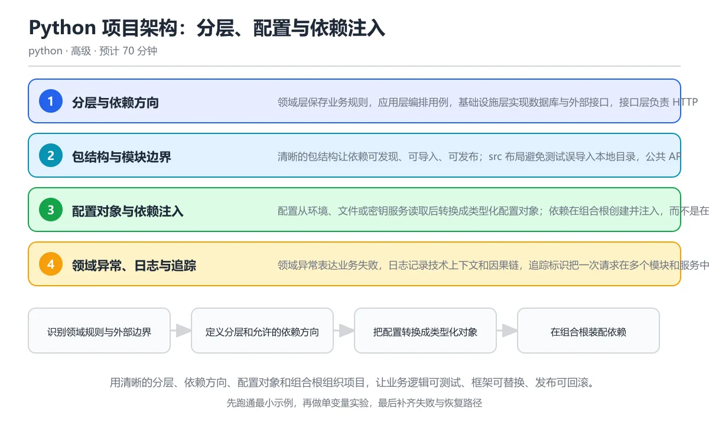

# Python 项目架构：分层、配置与依赖注入

> 内容更新时间：2026-10-06 · 学习阶段：高级 · 预计用时：60 分钟

分类：python。关键词：分层架构、依赖注入、配置、质量门禁、发布。用清晰的分层、依赖方向、配置对象和组合根组织项目，让业务逻辑可测试、框架可替换、发布可回滚。

学习建议：先通读《Python 项目架构：分层、配置与依赖注入》的核心知识与关键流程，再运行可运行练习并完成测验；遇到不确定的结论，回到「故障现场」按症状、根因、修复、验证四步核对。



## 学习目标

- 能划分领域、应用、基础设施和接口层并说明依赖方向。
- 能用配置对象和依赖注入消除全局状态，提升可测试性。
- 能建立包结构、质量门禁和发布流程，控制架构腐化。

## 前置知识

- 能写多模块 Python 项目并组织导入。
- 会用 pytest 写单元测试和 fixture。
- 理解异常、日志和配置读取基础。

## 核心知识

### 1. 分层与依赖方向

领域层保存业务规则，应用层编排用例，基础设施层实现数据库与外部接口，接口层负责 HTTP 或命令行；依赖只能从外向内。

内层定义协议与数据对象，外层提供实现并在启动时注入；领域代码不导入框架、数据库驱动或具体日志实现，因此可以脱离服务器运行测试。

在Python 项目架构：分层、配置与依赖注入里可以这样验证：定义价格规则协议，让订单用例只依赖协议，由基础设施提供折扣实现。

边界：分层不是按文件夹硬切，过度分层会让简单功能穿过五层；判断标准是业务规则能否独立测试和替换外部依赖。

工程视角：每层只暴露必要接口，跨层调用通过用例服务；架构测试可以检查禁止的导入关系。

### 2. 包结构与模块边界

清晰的包结构让依赖可发现、可导入、可发布；src 布局避免测试误导入本地目录，公共 API 通过 __init__ 或明确模块暴露。

包按领域能力组织而不是按技术类型堆文件，模块内部使用绝对导入，__all__ 声明公开名称，循环依赖通过协议或拆分模块消除。

在Python 项目架构：分层、配置与依赖注入里可以这样验证：把项目划分为 domain、application、infrastructure 和 interfaces 四个包，并画出允许的导入方向。

边界：过深的包层级会增加导航成本，过宽的模块会重新形成隐式耦合；公共 API 一旦发布就不能随意移动。

工程视角：用 ruff 或自定义检查限制禁止导入，包名与领域术语一致，变更公共接口需要版本说明。

### 3. 配置对象与依赖注入

配置从环境、文件或密钥服务读取后转换成类型化配置对象；依赖在组合根创建并注入，而不是在业务代码中随处读取全局变量。

配置对象在启动时校验必填项并给出清晰错误，依赖注入把数据库、时钟、客户端等实现作为参数传入；测试用内存实现或固定时钟替换外部资源。

在Python 项目架构：分层、配置与依赖注入里可以这样验证：定义一个 Clock 协议和固定时钟实现，把它注入用户服务并验证输出稳定可测。

边界：依赖注入不等于引入复杂容器，简单函数参数和构造函数注入通常已经足够；配置校验失败要阻止应用启动。

工程视角：组合根集中装配对象，生命周期明确的资源在应用关闭时释放，测试配置使用独立文件或覆盖值。

### 4. 领域异常、日志与追踪

领域异常表达业务失败，日志记录技术上下文和因果链，追踪标识把一次请求在多个模块和服务中的事件串起来。

基础设施把底层异常转换为领域异常，应用层决定是否重试或返回错误，接口层映射为 HTTP 状态码；结构化日志携带请求编号、用户标识和版本号。

在Python 项目架构：分层、配置与依赖注入里可以这样验证：让配置加载失败抛出 ConfigError 并记录路径和底层原因，接口层再把领域异常映射成用户可读错误。

边界：日志不能代替异常处理，也不能包含秘密；错误码一旦作为公共契约就不能随意改变含义。

工程视角：错误目录集中维护，日志字段命名统一，关键链路用追踪标识关联并在告警中引用。

### 5. 质量门禁与发布流程

格式检查、静态类型、单元测试、内容或安全扫描和构建产物验证构成质量门禁；发布流程保证版本可重复、可回滚。

pyproject 统一工具配置，CI 在干净环境按顺序执行检查、测试和构建，产物带版本号与校验和，发布说明记录变更与迁移步骤。

在Python 项目架构：分层、配置与依赖注入里可以这样验证：设计一个从提交到发布的流水线，列出每个阶段失败时的处理方式。

边界：门禁太多会拖慢反馈，太少会把缺陷放到生产；需要按风险和反馈时间分级，快速检查先跑、慢速集成测试后跑。

工程视角：关键分支要求门禁通过，发布使用不可变产物，回滚只需切换版本而不重新构建。

## 关键流程

```text
识别领域规则与外部边界 → 定义分层和允许的依赖方向 → 把配置转换成类型化对象 → 在组合根装配依赖 → 用质量门禁和可回滚版本发布
```

1. 识别领域规则与外部边界
2. 定义分层和允许的依赖方向
3. 把配置转换成类型化对象
4. 在组合根装配依赖
5. 用质量门禁和可回滚版本发布

## 动手练习

1. 为一个订单功能画出四层依赖图，标出每层允许和禁止的导入。
2. 把一段全局配置读取改造成启动时校验的配置对象，并补缺失配置测试。
3. 用协议与构造函数注入替换一个外部时间依赖，让测试输出完全可复现。
4. 设计一条 CI 质量门禁流水线，按反馈速度排序并说明失败处理策略。

**验收标准**：留下输入、命令、输出和结论，能让别人按记录复现。

## 常见错误与排查

> 说明：本表由《Python 项目架构：分层、配置与依赖注入》的核心知识整理（2026-10-06），人工复核进度见 docs/content_review_batches.md。

| 易错点 | 容易踩的做法 | 正确结论 |
| --- | --- | --- |
| 业务逻辑依赖框架对象 | 领域函数直接接收 HTTP Request、数据库 Session 或框架日志器，无法脱离运行环境测试 | 在接口层转换输入，领域层只接收普通数据与协议 |
| 全局单例散落各处 | 在模块导入时创建数据库连接和配置，测试很难替换且启动副作用不可控 | 在组合根创建对象并通过参数注入，模块导入保持无副作用 |
| 模块循环导入 | 模型导入服务、服务又导入模型，运行时报 partially initialized module | 把共享协议或数据对象下沉到更小的模块，明确依赖方向 |
| 配置读取逻辑散落 | 每个模块自行读取环境变量和默认值，缺失配置到运行中途才暴露 | 启动时集中加载并校验配置对象，必填项缺失立即失败 |

## 可运行练习

### 任务 1：先跑通，再解释

```python
from dataclasses import dataclass
from typing import Protocol

class Clock(Protocol):
    def now(self) -> str: ...

class UserService:
    def __init__(self, clock: Clock):
        self.clock = clock

    def greet(self, name: str) -> str:
        return f"你好 {name}，现在是 {self.clock.now()}"

@dataclass
class FixedClock:
    value: str

    def now(self) -> str:
        return self.value

service = UserService(FixedClock("2026-10-08 09:00"))
print(service.greet("Ada"))
print("依赖可替换:", isinstance(service.clock, FixedClock))
```

UserService 只依赖 Clock 协议，不关心时间来自系统、数据库还是测试替身；组合根创建固定时钟并注入服务，输出因此完全可复现。真实项目会把配置、数据库和外部客户端按同样方式装配，并让领域层不导入框架。

### 任务 2：只改一个条件

复制上面的示例，只改一个输入或参数再跑一次；先写下预测，再和真实输出对照，并说明差异来自Python 项目架构：分层、配置与依赖注入的哪条机制。

### 任务 3：迁移到自己的数据

把《Python 项目架构：分层、配置与依赖注入》里的示例换成你自己的一小段数据或场景，保持结构不变；如果换不动，说明还有哪条前提没有理解，回到核心知识对应小节。

## 项目专属规格

### 交付目标

用清晰的分层、依赖方向、配置对象和组合根组织项目，让业务逻辑可测试、框架可替换、发布可回滚。

### 里程碑

1. 识别领域规则与外部边界
2. 定义分层和允许的依赖方向
3. 把配置转换成类型化对象
4. 在组合根装配依赖
5. 用质量门禁和可回滚版本发布

### 输入与约束

- 输入：为一个订单功能画出四层依赖图，标出每层允许和禁止的导入。
- 约束：分层不是按文件夹硬切，过度分层会让简单功能穿过五层；判断标准是业务规则能否独立测试和替换外部依赖。
- 失败预算：在接口层转换输入，领域层只接收普通数据与协议

### 验收场景

1. 正常路径：跑通「可运行练习」里的最小示例并保存输出。
2. 边界路径：定义价格规则协议，让订单用例只依赖协议，由基础设施提供折扣实现。
3. 失败路径：出现「领域函数直接接收 HTTP Request、数据库 Session 或框架日志器，无法脱离运行环境测试」时按上面的失败预算恢复。

## 项目交付物

- 可运行代码：包含python源文件、依赖说明与启动入口。
- README：环境版本、启动命令、目录结构与已知限制。
- 测试记录：正常、边界与失败路径各至少一条，附命令与输出。
- 复盘记录：本次实现推翻了哪个假设，下一步验证动作是什么。

### 交付验收清单

- [ ] 能划分领域、应用、基础设施和接口层并说明依赖方向。
- [ ] 能用配置对象和依赖注入消除全局状态，提升可测试性。
- [ ] 能建立包结构、质量门禁和发布流程，控制架构腐化。

## 验证命令与预期输出

| 步骤 | 命令 | 预期输出 |
| --- | --- | --- |
| 准备环境 | 按 README 安装依赖 | 依赖安装完成且没有版本冲突 |
| 运行示例 | 运行「可运行练习」中的入口 | 你好 Ada，现在是 2026-10-08 09:00
依赖可替换: True |
| 边界输入 | 替换一个输入后重跑 | 结果仍能被正文机制解释 |
| 失败演练 | 按「故障现场」制造一次失败 | 能定位根因并恢复到正常输出 |

### 验收证据

- [ ] 保存一次成功运行的完整输出。
- [ ] 保存一次边界输入的输出与解释。
- [ ] 记录一次失败现象、根因与修复动作。

> 项目目标：Python 项目架构：分层、配置与依赖注入 的每一步都要能复现，做不到复现就先缩小范围。

## 故障现场

### 现场 1：业务逻辑依赖框架对象

**症状**：在《Python 项目架构：分层、配置与依赖注入》里采用「领域函数直接接收 HTTP Request、数据库 Session 或框架日志器，无法脱离运行环境测试」时，业务逻辑依赖框架对象会表现为错误结果、异常中断或状态不一致。

**根因**：这个做法没有执行与「业务逻辑依赖框架对象」对应的检查，问题被带到了后续步骤。

**修复**：在接口层转换输入，领域层只接收普通数据与协议

**验证**：为「业务逻辑依赖框架对象」准备一个最小输入，确认修复前的失败可以复现，修复后的输出与本课示例一致，再补一个边界输入。

### 现场 2：全局单例散落各处

**症状**：在《Python 项目架构：分层、配置与依赖注入》里采用「在模块导入时创建数据库连接和配置，测试很难替换且启动副作用不可控」时，全局单例散落各处会表现为错误结果、异常中断或状态不一致。

**根因**：这个做法没有执行与「全局单例散落各处」对应的检查，问题被带到了后续步骤。

**修复**：在组合根创建对象并通过参数注入，模块导入保持无副作用

**验证**：为「全局单例散落各处」准备一个最小输入，确认修复前的失败可以复现，修复后的输出与本课示例一致，再补一个边界输入。

### 现场 3：模块循环导入

**症状**：在《Python 项目架构：分层、配置与依赖注入》里采用「模型导入服务、服务又导入模型，运行时报 partially initialized module」时，模块循环导入会表现为错误结果、异常中断或状态不一致。

**根因**：这个做法没有执行与「模块循环导入」对应的检查，问题被带到了后续步骤。

**修复**：把共享协议或数据对象下沉到更小的模块，明确依赖方向

**验证**：为「模块循环导入」准备一个最小输入，确认修复前的失败可以复现，修复后的输出与本课示例一致，再补一个边界输入。

### 现场 4：配置读取逻辑散落

**症状**：在《Python 项目架构：分层、配置与依赖注入》里采用「每个模块自行读取环境变量和默认值，缺失配置到运行中途才暴露」时，配置读取逻辑散落会表现为错误结果、异常中断或状态不一致。

**根因**：这个做法没有执行与「配置读取逻辑散落」对应的检查，问题被带到了后续步骤。

**修复**：启动时集中加载并校验配置对象，必填项缺失立即失败

**验证**：为「配置读取逻辑散落」准备一个最小输入，确认修复前的失败可以复现，修复后的输出与本课示例一致，再补一个边界输入。

## 本课复习清单

离开本课前，逐项确认：

- [ ] 能画出依赖指向领域核心的分层图。
- [ ] 能用协议与注入消除全局状态。
- [ ] 能说明配置为什么要在启动时校验。
- [ ] 至少运行一次本课示例，记录输入、输出和一个边界情况。
- [ ] 把本课最容易混淆的两个概念写成一句话对照。

| 复盘项 | 记录 |
| --- | --- |
| 已经能独立解释的考点 |  |
| 仍然说不清的概念 |  |
| 下一步验证动作 |  |

## 复习与自测

### 核心知识

遮住正文回答：Python 项目架构：分层、配置与依赖注入解决什么问题、依赖哪些前提、失败时先看哪个信号？三问都能答清楚，再进入下一节。

### 动手练习

把《Python 项目架构：分层、配置与依赖注入》里「只改一个条件」的练习再做一遍，这次先写预测再运行；预测和结果不一致的地方，就是需要回读的章节。

### 最小可运行示例

```python
from dataclasses import dataclass
from typing import Protocol

class Clock(Protocol):
    def now(self) -> str: ...

class UserService:
    def __init__(self, clock: Clock):
        self.clock = clock

    def greet(self, name: str) -> str:
        return f"你好 {name}，现在是 {self.clock.now()}"

@dataclass
class FixedClock:
    value: str

    def now(self) -> str:
        return self.value

service = UserService(FixedClock("2026-10-08 09:00"))
print(service.greet("Ada"))
print("依赖可替换:", isinstance(service.clock, FixedClock))
```

### 预期输出

```text
你好 Ada，现在是 2026-10-08 09:00
依赖可替换: True
```

### 验证步骤

1. 确认输入数据与运行环境和示例一致。
2. 运行示例，记录输出与耗时等可观测指标。
3. 换一个边界输入重跑，确认结论仍然成立。
4. 把两次结果写成一句话结论，注明前提与局限。

## 术语速查

先遮住右列，尝试用自己的话解释，再回到正文核对。

| 术语 | 一句话说明 |
| --- | --- |
| `分层架构` | 按职责划分领域、应用、基础设施和接口并约束依赖方向的架构方式。 |
| `依赖倒置` | 高层策略定义抽象，低层实现依赖抽象而不是高层直接依赖具体实现。 |
| `组合根` | 在应用启动处集中创建并连接所有具体依赖的位置。 |
| `配置对象` | 把环境、文件和密钥转换为经过校验的强类型对象。 |
| `质量门禁` | 在合并或发布前必须通过的自动化检查集合。 |
| `不可变产物` | 构建后不再修改、通过版本或摘要唯一标识的发布包。 |

## 考点精讲

### 考点 1：分层架构中依赖应该指向哪个方向？

题型：概念判断。题干：分层架构中依赖应该指向哪个方向？

判断要点：从接口和基础设施指向领域核心。接口层和基础设施层是最容易变化的细节，应依赖稳定的领域抽象；如果领域层反过来导入框架或数据库，业务规则会被运行环境绑死，测试和替换都变困难。依赖倒置通过协议让内层定义接口、外层提供实现。 正确选项「从接口和基础设施指向领域核心」对应《Python 项目架构：分层、配置与依赖注入》的要点「分层与依赖方向」：领域层保存业务规则，应用层编排用例，基础设施层实现数据库与外部接口，接口层负责 HTTP 或命令行；依赖只能从外向内。判断「分层与依赖方向」时先确认前提是否成立，再回到《Python 项目架构：分层、配置与依赖注入》的示例核对一次；把别的语言或框架的默认做法直接搬到分层与依赖方向上，往往会在本课的边界条件里失效。

### 考点 2：组合根的主要职责是什么？

题型：概念判断。题干：组合根的主要职责是什么？

判断要点：在启动处集中创建并连接具体依赖。组合根是应用装配点，负责读取配置、创建数据库连接、客户端和服务，再按构造函数注入；业务代码只依赖抽象。把所有装配放在一个明确位置，可以避免模块导入副作用和散落的全局单例。 正确选项「在启动处集中创建并连接具体依赖」对应《Python 项目架构：分层、配置与依赖注入》的要点「包结构与模块边界」：清晰的包结构让依赖可发现、可导入、可发布；src 布局避免测试误导入本地目录，公共 API 通过 __init__ 或明确模块暴露。判断「包结构与模块边界」时先确认前提是否成立，再回到《Python 项目架构：分层、配置与依赖注入》的示例核对一次；借鉴相邻主题的经验之前，先核对包结构与模块边界的前提是否成立。

### 考点 3：以下哪些做法有助于保持模块边界？（多选）

题型：多选辨析。题干：以下哪些做法有助于保持模块边界？（多选）

判断要点：用绝对导入并声明公共 API；用架构测试禁止跨层导入；把共享协议放到更小的独立模块。明确公共 API、自动检查依赖方向和下沉共享协议能减少循环依赖与隐式耦合；允许任意互导会让项目退化为一张大网，任何修改都可能影响全局。包结构应按领域能力组织，而不是简单按文件类型堆放。 正确选项「用绝对导入并声明公共 API；用架构测试禁止跨层导入；把共享协议放到更小的独立模块」对应《Python 项目架构：分层、配置与依赖注入》的要点「配置对象与依赖注入」：配置从环境、文件或密钥服务读取后转换成类型化配置对象；依赖在组合根创建并注入，而不是在业务代码中随处读取全局变量。判断「配置对象与依赖注入」时先确认前提是否成立，再回到《Python 项目架构：分层、配置与依赖注入》的示例核对一次；记住配置对象与依赖注入的结论之外还要记住适用条件，换一个输入往往就不成立了。

### 考点 4：阅读代码，UserService 为什么

题型：代码阅读。题干：阅读代码，UserService 为什么更容易测试？

判断要点：它依赖 Clock 协议，可以注入固定时钟或假实现。构造函数注入让测试可以传入固定时钟、内存仓库或假客户端，不需要启动真实数据库或等待系统时间；生产环境由组合根传入真实实现。依赖抽象还能表达对象的真实需求，避免服务偷偷使用全局状态。 正确选项「它依赖 Clock 协议，可以注入固定时钟或假实现」对应《Python 项目架构：分层、配置与依赖注入》的要点「领域异常、日志与追踪」：领域异常表达业务失败，日志记录技术上下文和因果链，追踪标识把一次请求在多个模块和服务中的事件串起来。判断「领域异常、日志与追踪」时先确认前提是否成立，再回到《Python 项目架构：分层、配置与依赖注入》的示例核对一次；干扰项常常是相邻主题里成立的结论，只有按领域异常、日志与追踪的输入与约束判断才能排除。

### 考点 5：为什么在模块顶层创建数据库连接会带来问题

题型：排错。题干：为什么在模块顶层创建数据库连接会带来问题？

判断要点：导入模块就产生连接副作用，测试和 CLI 难以控制连接生命周期。导入模块时立即连接数据库会让单元测试被迫依赖外部服务，配置缺失时导入即失败，CLI 命令也可能创建不必要的连接。应把连接创建延迟到组合根或应用生命周期中，并提供关闭钩子。这道题对应项目架构中的组合根原则：配置与连接应在启动时集中装配，而不是导入即产生副作用。 正确选项「导入模块就产生连接副作用，测试和 CLI 难以控制连接生命周期」对应《Python 项目架构：分层、配置与依赖注入》的要点「质量门禁与发布流程」：格式检查、静态类型、单元测试、内容或安全扫描和构建产物验证构成质量门禁；发布流程保证版本可重复、可回滚。判断「质量门禁与发布流程」时先确认前提是否成立，再回到《Python 项目架构：分层、配置与依赖注入》的示例核对一次；把质量门禁与发布流程的做法换到别的约束下未必成立，先确认边界再决定答案。

## English Overview

Python Project Architecture: Layers, Configuration and Dependency Injection

This lesson organizes Python projects around dependency direction: domain, application, infrastructure and interface layers, src layout and module boundaries, typed configuration and dependency injection, domain errors with traceable logs, and quality gates with immutable releases.

## 本课小结

- Python 项目架构：分层、配置与依赖注入围绕分层架构、依赖注入、配置展开，先建立基线再讨论优化。
- 领域层保存业务规则，应用层编排用例，基础设施层实现数据库与外部接口，接口层负责 HTTP 或命令行；依赖只能从外向内。
- 遇到问题时按「症状 → 根因 → 修复 → 验证」的顺序处理，不跳过验证。

## 内容元数据

- 内容版本：v2.0
- 最后更新：2026-10-06
- 学习阶段：高级

| 字段 | 值 |
| --- | --- |
| 课程 ID | `python_project_architecture` |
| 所属分类 | `python` |
| 难度 | 高级 |
| 预计用时 | 70 分钟 |
| 关键词 | 分层架构、依赖注入、配置、质量门禁、发布 |
| 配图 | `images/lesson_python_project_architecture.webp` |
| 参考资料 | 4 条 |
| 内容更新时间 | 2026-10-06 |

## 参考资料与复核

- 最后复核：2026-10-04
- 下次复核：2026-12-10
- 复核范围：版本兼容、API 行为与工程实践

下面列出的资料用于核对本课结论，复习时可以对照阅读：
- [Python 打包：项目布局](https://packaging.python.org/en/latest/discussions/src-layout-vs-flat-layout/)
- [pyproject.toml 规范](https://packaging.python.org/en/latest/specifications/pyproject-toml/)
- [Ruff 文档](https://docs.astral.sh/ruff/)
- [mypy 文档](https://mypy.readthedocs.io/)

> 复核提示：《Python 项目架构：分层、配置与依赖注入》的结论如与资料冲突，以资料中的规范文本为准，并在笔记里记录差异与日期。

## 复习与迁移

### 概念复述

不看正文，把Python 项目架构：分层、配置与依赖注入讲给一个没学过的同事：先讲它解决什么问题，再讲一个最小例子，最后说明一个不适用场景。

### 测验回顾

回到《Python 项目架构：分层、配置与依赖注入》测验，只重做答错或犹豫的题；对每道题写一句「我为什么改选这个答案」，写不出理由就回到对应小节。

### 迁移练习

把《Python 项目架构：分层、配置与依赖注入》的方法用到一个你自己的真实场景：说明输入、约束与验证方式，并列出仍然不确定、需要下一次实验回答的问题。

## 深度拓展与实战

这一节把Python 项目架构：分层、配置与依赖注入的机制拆开验证：每一步都给出输入、判断标准和失败信号，便于在真实项目里复用。

### 机制拆解 1：分层与依赖方向

内层定义协议与数据对象，外层提供实现并在启动时注入；领域代码不导入框架、数据库驱动或具体日志实现，因此可以脱离服务器运行测试。

落地时先确认前提：分层不是按文件夹硬切，过度分层会让简单功能穿过五层；判断标准是业务规则能否独立测试和替换外部依赖。；再把结论写进检查表，让下一位同学可以按同样的输入复现。

工程做法：每层只暴露必要接口，跨层调用通过用例服务；架构测试可以检查禁止的导入关系。

### 机制拆解 2：包结构与模块边界

包按领域能力组织而不是按技术类型堆文件，模块内部使用绝对导入，__all__ 声明公开名称，循环依赖通过协议或拆分模块消除。

落地时先确认前提：过深的包层级会增加导航成本，过宽的模块会重新形成隐式耦合；公共 API 一旦发布就不能随意移动。；再把结论写进检查表，让下一位同学可以按同样的输入复现。

工程做法：用 ruff 或自定义检查限制禁止导入，包名与领域术语一致，变更公共接口需要版本说明。

### 机制拆解 3：配置对象与依赖注入

配置对象在启动时校验必填项并给出清晰错误，依赖注入把数据库、时钟、客户端等实现作为参数传入；测试用内存实现或固定时钟替换外部资源。

落地时先确认前提：依赖注入不等于引入复杂容器，简单函数参数和构造函数注入通常已经足够；配置校验失败要阻止应用启动。；再把结论写进检查表，让下一位同学可以按同样的输入复现。

工程做法：组合根集中装配对象，生命周期明确的资源在应用关闭时释放，测试配置使用独立文件或覆盖值。

### 机制拆解 4：领域异常、日志与追踪

基础设施把底层异常转换为领域异常，应用层决定是否重试或返回错误，接口层映射为 HTTP 状态码；结构化日志携带请求编号、用户标识和版本号。

落地时先确认前提：日志不能代替异常处理，也不能包含秘密；错误码一旦作为公共契约就不能随意改变含义。；再把结论写进检查表，让下一位同学可以按同样的输入复现。

工程做法：错误目录集中维护，日志字段命名统一，关键链路用追踪标识关联并在告警中引用。

### 机制拆解 5：质量门禁与发布流程

pyproject 统一工具配置，CI 在干净环境按顺序执行检查、测试和构建，产物带版本号与校验和，发布说明记录变更与迁移步骤。

落地时先确认前提：门禁太多会拖慢反馈，太少会把缺陷放到生产；需要按风险和反馈时间分级，快速检查先跑、慢速集成测试后跑。；再把结论写进检查表，让下一位同学可以按同样的输入复现。

工程做法：关键分支要求门禁通过，发布使用不可变产物，回滚只需切换版本而不重新构建。

### 机制对照表

| 概念 | 解决什么问题 | 关键前提 | 失败信号 |
| --- | --- | --- | --- |
| 分层与依赖方向 | 领域层保存业务规则，应用层编排用例，基础设施层实现数据库与外部接口，接口层负责  | 分层不是按文件夹硬切，过度分层会让简单功能穿过五层；判断标准是业务规则能 | 每层只暴露必要接口，跨层调用通过用例服务；架构测试可以检查禁止的导入关系 |
| 包结构与模块边界 | 清晰的包结构让依赖可发现、可导入、可发布；src 布局避免测试误导入本地目录，公 | 过深的包层级会增加导航成本，过宽的模块会重新形成隐式耦合；公共 API  | 用 ruff 或自定义检查限制禁止导入，包名与领域术语一致，变更公共接口 |
| 配置对象与依赖注入 | 配置从环境、文件或密钥服务读取后转换成类型化配置对象；依赖在组合根创建并注入，而 | 依赖注入不等于引入复杂容器，简单函数参数和构造函数注入通常已经足够；配置 | 组合根集中装配对象，生命周期明确的资源在应用关闭时释放，测试配置使用独立 |
| 领域异常、日志与追踪 | 领域异常表达业务失败，日志记录技术上下文和因果链，追踪标识把一次请求在多个模块和 | 日志不能代替异常处理，也不能包含秘密；错误码一旦作为公共契约就不能随意改 | 错误目录集中维护，日志字段命名统一，关键链路用追踪标识关联并在告警中引用 |
| 质量门禁与发布流程 | 格式检查、静态类型、单元测试、内容或安全扫描和构建产物验证构成质量门禁；发布流程 | 门禁太多会拖慢反馈，太少会把缺陷放到生产；需要按风险和反馈时间分级，快速 | 关键分支要求门禁通过，发布使用不可变产物，回滚只需切换版本而不重新构建。 |

### 自测问答

**问 1**：分层架构中依赖应该指向哪个方向？

**答**：从接口和基础设施指向领域核心。接口层和基础设施层是最容易变化的细节，应依赖稳定的领域抽象；如果领域层反过来导入框架或数据库，业务规则会被运行环境绑死，测试和替换都变困难。依赖倒置通过协议让内层定义接口、外层提供实现。 正确选项「从接口和基础设施指向领域核心」对应《Python 项目架构：分层、配置与依赖注入》的要点「分层与依赖方向」：领域层保存业务规则，应用层编排用例，基础设施层实现数据库与外部接口，接口层负责 HTTP 或命令行；依赖只能从外向内。判断「分层与依赖方向」时先确认前提是否成立，再回到《Python 项目架构：分层、配置与依赖注入》的示例核对一次；把别的语言或框架的默认做法直接搬到分层与依赖方向上，往往会在本课的边界条件里失效。

**问 2**：组合根的主要职责是什么？

**答**：在启动处集中创建并连接具体依赖。组合根是应用装配点，负责读取配置、创建数据库连接、客户端和服务，再按构造函数注入；业务代码只依赖抽象。把所有装配放在一个明确位置，可以避免模块导入副作用和散落的全局单例。 正确选项「在启动处集中创建并连接具体依赖」对应《Python 项目架构：分层、配置与依赖注入》的要点「包结构与模块边界」：清晰的包结构让依赖可发现、可导入、可发布；src 布局避免测试误导入本地目录，公共 API 通过 __init__ 或明确模块暴露。判断「包结构与模块边界」时先确认前提是否成立，再回到《Python 项目架构：分层、配置与依赖注入》的示例核对一次；借鉴相邻主题的经验之前，先核对包结构与模块边界的前提是否成立。

**问 3**：以下哪些做法有助于保持模块边界？（多选）

**答**：用绝对导入并声明公共 API；用架构测试禁止跨层导入；把共享协议放到更小的独立模块。明确公共 API、自动检查依赖方向和下沉共享协议能减少循环依赖与隐式耦合；允许任意互导会让项目退化为一张大网，任何修改都可能影响全局。包结构应按领域能力组织，而不是简单按文件类型堆放。 正确选项「用绝对导入并声明公共 API；用架构测试禁止跨层导入；把共享协议放到更小的独立模块」对应《Python 项目架构：分层、配置与依赖注入》的要点「配置对象与依赖注入」：配置从环境、文件或密钥服务读取后转换成类型化配置对象；依赖在组合根创建并注入，而不是在业务代码中随处读取全局变量。判断「配置对象与依赖注入」时先确认前提是否成立，再回到《Python 项目架构：分层、配置与依赖注入》的示例核对一次；记住配置对象与依赖注入的结论之外还要记住适用条件，换一个输入往往就不成立了。

**问 4**：阅读代码，UserService 为什么更容易测试？

**答**：它依赖 Clock 协议，可以注入固定时钟或假实现。构造函数注入让测试可以传入固定时钟、内存仓库或假客户端，不需要启动真实数据库或等待系统时间；生产环境由组合根传入真实实现。依赖抽象还能表达对象的真实需求，避免服务偷偷使用全局状态。 正确选项「它依赖 Clock 协议，可以注入固定时钟或假实现」对应《Python 项目架构：分层、配置与依赖注入》的要点「领域异常、日志与追踪」：领域异常表达业务失败，日志记录技术上下文和因果链，追踪标识把一次请求在多个模块和服务中的事件串起来。判断「领域异常、日志与追踪」时先确认前提是否成立，再回到《Python 项目架构：分层、配置与依赖注入》的示例核对一次；干扰项常常是相邻主题里成立的结论，只有按领域异常、日志与追踪的输入与约束判断才能排除。

**问 5**：为什么在模块顶层创建数据库连接会带来问题？

**答**：导入模块就产生连接副作用，测试和 CLI 难以控制连接生命周期。导入模块时立即连接数据库会让单元测试被迫依赖外部服务，配置缺失时导入即失败，CLI 命令也可能创建不必要的连接。应把连接创建延迟到组合根或应用生命周期中，并提供关闭钩子。这道题对应项目架构中的组合根原则：配置与连接应在启动时集中装配，而不是导入即产生副作用。 正确选项「导入模块就产生连接副作用，测试和 CLI 难以控制连接生命周期」对应《Python 项目架构：分层、配置与依赖注入》的要点「质量门禁与发布流程」：格式检查、静态类型、单元测试、内容或安全扫描和构建产物验证构成质量门禁；发布流程保证版本可重复、可回滚。判断「质量门禁与发布流程」时先确认前提是否成立，再回到《Python 项目架构：分层、配置与依赖注入》的示例核对一次；把质量门禁与发布流程的做法换到别的约束下未必成立，先确认边界再决定答案。

### 排错速查

- 看到「领域函数直接接收 HTTP Request、数据库 Session 或框架日志器，无法脱离运行环境测试」时，先按「在接口层转换输入，领域层只接收普通数据与协议」处理，再用Python 项目架构：分层、配置与依赖注入的最小示例确认结论是否恢复。
- 看到「在模块导入时创建数据库连接和配置，测试很难替换且启动副作用不可控」时，先按「在组合根创建对象并通过参数注入，模块导入保持无副作用」处理，再用Python 项目架构：分层、配置与依赖注入的最小示例确认结论是否恢复。
- 看到「模型导入服务、服务又导入模型，运行时报 partially initialized module」时，先按「把共享协议或数据对象下沉到更小的模块，明确依赖方向」处理，再用Python 项目架构：分层、配置与依赖注入的最小示例确认结论是否恢复。
- 看到「每个模块自行读取环境变量和默认值，缺失配置到运行中途才暴露」时，先按「启动时集中加载并校验配置对象，必填项缺失立即失败」处理，再用Python 项目架构：分层、配置与依赖注入的最小示例确认结论是否恢复。

### 工程检查表

- [ ] 识别领域规则与外部边界
- [ ] 定义分层和允许的依赖方向
- [ ] 把配置转换成类型化对象
- [ ] 在组合根装配依赖
- [ ] 用质量门禁和可回滚版本发布
- [ ] 【分层与依赖方向】每层只暴露必要接口，跨层调用通过用例服务；架构测试可以检查禁止的导入关系。
- [ ] 【包结构与模块边界】用 ruff 或自定义检查限制禁止导入，包名与领域术语一致，变更公共接口需要版本说明。
- [ ] 【配置对象与依赖注入】组合根集中装配对象，生命周期明确的资源在应用关闭时释放，测试配置使用独立文件或覆盖值。
- [ ] 【领域异常、日志与追踪】错误目录集中维护，日志字段命名统一，关键链路用追踪标识关联并在告警中引用。
- [ ] 【质量门禁与发布流程】关键分支要求门禁通过，发布使用不可变产物，回滚只需切换版本而不重新构建。

### 迁移练习

把Python 项目架构：分层、配置与依赖注入的方法用到一个真实场景：写下分层架构、依赖注入、配置在你的场景里分别对应什么，再记录一次失败尝试和它的恢复步骤。

### 延伸阅读与下一步

- 复习分层架构、依赖注入、配置、质量门禁、发布时，优先回看「分层与依赖方向」与「质量门禁与发布流程」两节。
- 把从「识别领域规则与外部边界」到「用质量门禁和可回滚版本发布」的流程画成一张图，放进自己的笔记。
- 一周后重做本课测验，只把答错的题留到下一轮复习。

### 结论与下一步

学完Python 项目架构：分层、配置与依赖注入，应该能独立完成三件事：先用最小示例确认分层架构的行为，再用一个边界输入验证结论，最后把失败路径写成可重复的检查。下一步把本课术语加入复习清单，并在两周内用一次真实任务检验记忆是否牢固。
