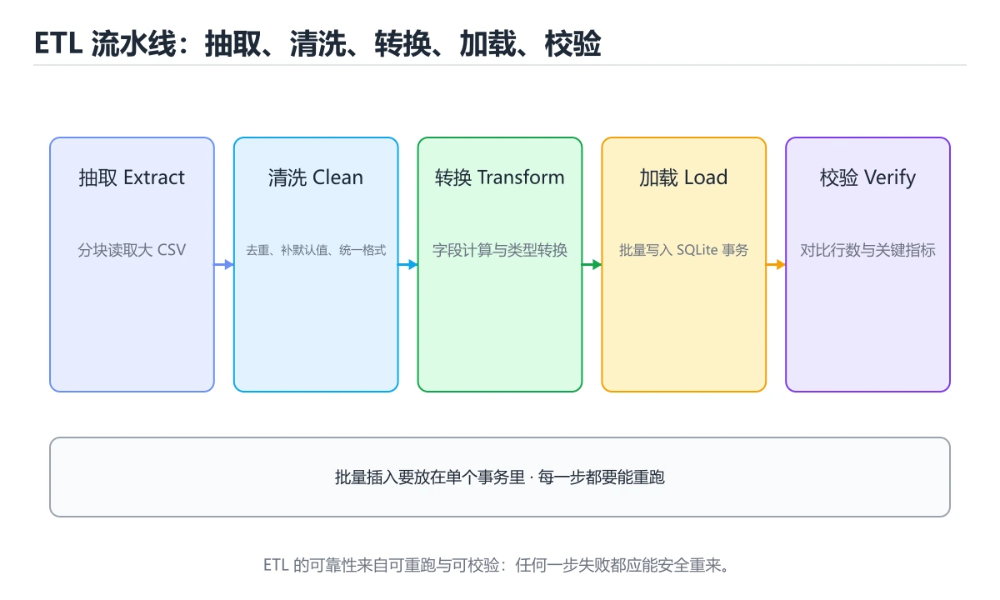
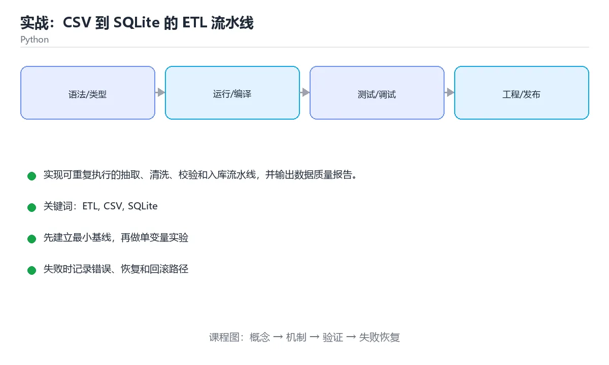

# 实战：CSV 到 SQLite 的 ETL 流水线





> 内容更新时间：2026-10-06 · 学习阶段：高级 · 预计用时：60 分钟

## 本节知识框架

**课程定位**：所属分类 `python`（Python），课程主题 `实战：CSV 到 SQLite 的 ETL 流水线`，学习阶段 高级，建议用时 70 分钟。

本课主线：实现可重复执行的抽取、清洗、校验和入库流水线，并输出数据质量报告。

**学完本课应当能够**
- 说清 `ETL` 与 `数据质量` 的含义与区别，并各举一个正例和一个反例。
- 用本课示例验证 `幂等` 的行为，记录输入、输出与失败条件。
- 遇到「边读边写数据库」这类问题时，能说出触发条件与修复顺序。

### 从概念到验证的学习链条

1. `ETL`：先掌握 抽取-转换-加载：把源数据取出、清洗转换后写入目标存储，是数据管道的基本形态，再用它解释 `数据质量` 为什么会出现。
2. `数据质量`：先掌握 实现可重复执行的抽取、清洗、校验和入库流水线，并输出数据质量报告，再用它解释 `幂等` 为什么会出现。
3. `幂等`：先掌握 本课涉及：ETL、CSV、SQLite、数据质量、幂等，再用它解释 `拒绝记录` 为什么会出现。
4. `拒绝记录`：先掌握 校验失败的行写入拒绝文件并附上原因，保证任务可重跑、坏数据可追溯，再用它解释 `可观测性` 为什么会出现。
5. `可观测性`：先掌握 由日志、指标与链路追踪组成，能在不重启、不改代码的前提下问出新问题，再用它解释 本课示例的观察结果 为什么会出现。

**先修与衔接**：本课是「Python」分类的第 27 课。先修内容：《实战：FastAPI 订单服务》。《实战：FastAPI 订单服务》里的 `FastAPI`、`REST` 是本课的前提。相关或后续课程：《Python 装饰器与生成器》、《Airflow 调度与数据质量》、《实战：REST API 与 SQLite 事务服务》。

### 完成判据

- **定义关**：不看正文也能说明 `ETL` 是 抽取-转换-加载：把源数据取出、清洗转换后写入目标存储，是数据管道的基本形态，并指出一个反例。
- **机制关**：能按“输入 → 转换 → 输出 → 验证”复述 `实战：CSV 到 SQLite 的 ETL 流水线`，而不是只背结论。
- **示例关**：能运行或推演 `实战：CSV 到 SQLite 的 ETL 流水线` 的 `text` 示例，并说明一个真实出现的标识符或字面量。
- **证据关**：能从 `实战：CSV 到 SQLite 的 ETL 流水线` 的示例写出一个输入、处理、输出三元组，并说明它支持或反驳了本课的哪一条结论。
- **排错关**：能复现 边读边写数据库，记录现象并按 先在内存/临时表校验再事务提交 修复。
- **迁移关**：能把 `ETL`、`CSV`、`SQLite`、`数据质量` 放进一个与 `实战：CSV 到 SQLite 的 ETL 流水线` 不同的项目场景，并保持输入与验证条件可追踪。
- **复盘关**：学完 `实战：CSV 到 SQLite 的 ETL 流水线` 后，用一句话写下仍然不确定的结论，并列出下一次验证需要的输入、环境和成功判据。

### 复习清单

- [ ] 能不看正文复述本课核心术语，并指出一个边界或反例。
- [ ] 能运行或推演本课示例，记录输入、输出与失败现象。
- [ ] 能完成一次自测，并把错题对照错误表定位原因。

## 核心概念定义

| 术语 | 操作性定义 | 常见边界与风险 |
| --- | --- | --- |
| ETL | 抽取-转换-加载：把源数据取出、清洗转换后写入目标存储，是数据管道的基本形态。 | 只在「抽取-转换-加载：把源数据取出、清洗转换后写入目标存储，是数据管道的基本形态」这一前提下成立，换输入或换环境要重新验证。 |
| 数据质量 | 实现可重复执行的抽取、清洗、校验和入库流水线，并输出数据质量报告。 | 只在「实现可重复执行的抽取、清洗、校验和入库流水线，并输出数据质量报告」这一前提下成立，换输入或换环境要重新验证。 |
| 幂等 | 本课涉及：ETL、CSV、SQLite、数据质量、幂等。 | 索引命中与数据分布决定实际开销，判断前先看执行计划而不是只看结果是否正确。 |
| 拒绝记录 | 校验失败的行写入拒绝文件并附上原因，保证任务可重跑、坏数据可追溯。 | 只在「校验失败的行写入拒绝文件并附上原因，保证任务可重跑、坏数据可追溯」这一前提下成立，换输入或换环境要重新验证。 |
| 可观测性 | 由日志、指标与链路追踪组成，能在不重启、不改代码的前提下问出新问题 | 只在「由日志、指标与链路追踪组成，能在不重启、不改代码的前提下问出新问题」这一前提下成立，换输入或换环境要重新验证。 |

## 原理与运行机制

### 机制总览

**教材衔接：技术栈**

- Python 3.12
- csv
- sqlite3
- dataclasses
- pytest

**教材衔接：架构与数据流**

- 查询 CSV 时限定字段与分页范围，把全表扫描留作最后手段。
- 写路径要明确 ETL 的事务边界、幂等键和失败补偿，不能留下半完成状态。
- 外部调用要设置超时、重试上限和降级策略。
- 每个关键阶段都要留下日志、指标或测试证据。

**教材衔接：功能范围**

- [ ] 读取多编码 CSV 并识别表头
- [ ] 校验必填字段、日期和金额
- [ ] 清洗后批量写入 SQLite
- [ ] 输出成功、跳过和失败记录统计

**教材衔接：实施步骤**

### 步骤 1：定义原始记录和目标表结构

- 先列出 amount_cents 这一步的输入、输出与中间产物，再动手实现。
- 为 CSV 补一个最小用例，明确通过标准再扩展规模。
- 出错时先记录 CSV 的错误信息与回滚结果，再决定是否重试。
- 证据留存：保留命令、输出、日志或截图，方便评审与复盘。

### 步骤 2：实现编码检测与表头校验

- 定位：这一节说明步骤 2：实现编码检测与表头校验在「实战：CSV 到 SQLite 的 ETL 流水线」知识体系里的位置。
- 要点：能把 ETL 拆成抽取、校验、转换和加载四个阶段。
- 自检：能否用一个最小例子解释步骤 2：实现编码检测与表头校验？

### 步骤 3：编写金额和日期转换函数

- 定位：这一节说明步骤 3：编写金额和日期转换函数在「实战：CSV 到 SQLite 的 ETL 流水线」知识体系里的位置。
- 要点：本课涉及：ETL、CSV、SQLite、数据质量、幂等。
- 自检：能否用一个最小例子解释步骤 3：编写金额和日期转换函数？

### 步骤 4：把错误记录写入拒绝文件

- 定位：这一节说明步骤 4：把错误记录写入拒绝文件在「实战：CSV 到 SQLite 的 ETL 流水线」知识体系里的位置。
- 要点：运营每天导出一份订单 CSV，字段可能缺失、日期格式不统一、金额带货币符号。你需要把数据清洗后写入 SQLite，并生成一份可追踪的质量报告。
- 自检：能否用一个最小例子解释步骤 4：把错误记录写入拒绝文件？

### 步骤 5：使用事务批量写入并支持重复运行

- 定位：这一节说明步骤 5：使用事务批量写入并支持重复运行在「实战：CSV 到 SQLite 的 ETL 流水线」知识体系里的位置。
- 要点：一句话摘要：实现可重复执行的抽取、清洗、校验和入库流水线，并输出数据质量报告。
- 自检：能否用一个最小例子解释步骤 5：使用事务批量写入并支持重复运行？

### 步骤 6：生成质量报告并补测试

- 定位：这一节说明步骤 6：生成质量报告并补测试在「实战：CSV 到 SQLite 的 ETL 流水线」知识体系里的位置。
- 要点：写路径要明确事务边界、幂等键和失败补偿，不能留下半完成状态。
- 自检：能否用一个最小例子解释步骤 6：生成质量报告并补测试？

**教材衔接：建议目录结构**

**教材衔接：质量门禁**

- [ ] 格式化和静态检查通过，不遗留明显警告。
- [ ] 单元测试覆盖 ETL 的核心规则，集成测试覆盖数据库或外部边界。
- [ ] 错误响应不泄露堆栈、SQL 和密钥。
- [ ] 配置来自环境变量或配置文件，不硬编码敏感信息。
- [ ] README 写清启动、测试、配置和回滚步骤。

**教材衔接：安全、成本与可观测性**

- amount_cents 的运行身份只保留完成任务所需的权限，越权请求应当被拒绝。
- amount_cents 的参数先校验再使用，错误响应里不出现堆栈或 SQL。
- 密钥通过环境变量或密钥管理服务注入，并记录轮换方式。
- 给 CSV 的资源使用设定配额，超出后降级而不是拖垮整个进程。
- 监控 CSV 的延迟与成本，出现拐点时能追溯到具体变更。
- ETL 出现异常时，要能从日志和指标还原时间线，而不是只看到「服务不可用」。

**教材衔接：扩展任务**

- 支持按日期增量导入
- 增加数据质量阈值和失败退出码
- 把 SQLite 换成 Parquet 并比较性能

**教材衔接：实施记录与复盘**

每完成一步，记录以下内容：

1. 本步的输入、命令和输出是什么？
2. 遇到的最小失败是什么，如何定位和修复？
3. 哪个假设被验证或推翻？
4. 下一步的风险是什么，如何回滚？
5. 把 amount_cents 的负载提高一个数量级，预期哪一项指标先触顶？

**教材衔接：完成标准**

- [ ] 能从干净环境按 README 启动项目。
- [ ] 自动化测试覆盖 CSV 的核心规则，并验证一次错误处理。
- [ ] 能演示一次错误、一次恢复和一次回滚。
- [ ] 有一份资源或性能基线，能说明瓶颈在哪里。
- [ ] 能说清一个尚未解决的问题和下一步验证方法。

**教材衔接：版本与时效**

### 升级检查清单

- 先固定当前版本，跑通全部示例与测验，再升级工具链。
- 只改 ETL 的版本变量，记录编译、测试与产物体积的变化。
- 回归范围锁定 amount_cents 的默认行为，并确认弃用警告是否出现在构建输出里。
- 升级完成后记录 ETL 的新旧版本差异，并据此调整下次复核时间。

**教材衔接：交付评审：评分表、决策记录与证据链**


### 四、「实战：CSV 到 SQLite 的 ETL 流水线」的验收指标

| 指标 | 目标值 | 测量方式 | 不达标时的动作 |
| --- | --- | --- | --- |
| | 延迟 | 记录 P50/P95/P99 | 用固定数据集逐步增加并发 | P99 持续上升或超时率增加 | | 用本课正文给出的阈值，没有就写实测基线 | 固定环境重复三次取中位数 | 回到对应小节定位，先修原因再重测 |
| | 存储 | 记录数据增长与索引大小 | 导入 10 倍数据并观察查询 | 磁盘、连接或锁等待成为瓶颈 | | 用本课正文给出的阈值，没有就写实测基线 | 固定环境重复三次取中位数 | 回到对应小节定位，先修原因再重测 |

### 五、评审记录模板

| 记录项 | 填写要求 |
| --- | --- |
| 项目标识 | `python_project_etl` |
| 本次范围 | 说明这一轮交付了「实战：CSV 到 SQLite 的 ETL 流水线」的哪些部分 |
| 未完成项 | 列出与 ETL 相关但本轮未做的内容 |
| 证据位置 | 指向 evidence/ 目录下的具体文件 |
| 风险与回滚 | 写清剩余风险、回滚步骤和验证方式 |
| 结论 | 通过 / 有条件通过 / 不通过，三者选一 |

### 机制拆解：每一步的输入、动作与输出

#### 1. `ETL`
- 输入：`ETL`；本步把 抽取-转换-加载：把源数据取出、清洗转换后写入目标存储，是数据管道的基本形态 当作判断规则。
- 动作：围绕 `ETL` 保留中间状态，并记录它与 `数据质量` 的对应关系。
- 输出：`数据质量`，它可以被下一段代码、测试或记录继续使用。
- `ETL` 的失败条件：只在「抽取-转换-加载：把源数据取出、清洗转换后写入目标存储，是数据管道的基本形态」这一前提下成立，换输入或换环境要重新验证。

#### 2. `数据质量`
- 输入：`ETL`；本步把 实现可重复执行的抽取、清洗、校验和入库流水线，并输出数据质量报告 当作判断规则。
- 动作：围绕 `数据质量` 保留中间状态，并记录它与 `幂等` 的对应关系。
- 输出：`幂等`，它可以被下一段代码、测试或记录继续使用。
- `数据质量` 的失败条件：只在「实现可重复执行的抽取、清洗、校验和入库流水线，并输出数据质量报告」这一前提下成立，换输入或换环境要重新验证。

#### 3. `幂等`
- 输入：`数据质量`；本步把 本课涉及：ETL、CSV、SQLite、数据质量、幂等 当作判断规则。
- 动作：围绕 `幂等` 保留中间状态，并记录它与 `拒绝记录` 的对应关系。
- 输出：`拒绝记录`，它可以被下一段代码、测试或记录继续使用。
- `幂等` 的失败条件：索引命中与数据分布决定实际开销，判断前先看执行计划而不是只看结果是否正确。

#### 4. `拒绝记录`
- 输入：`幂等`；本步把 校验失败的行写入拒绝文件并附上原因，保证任务可重跑、坏数据可追溯 当作判断规则。
- 动作：围绕 `拒绝记录` 保留中间状态，并记录它与 `可观测性` 的对应关系。
- 输出：`可观测性`，它可以被下一段代码、测试或记录继续使用。
- `拒绝记录` 的失败条件：只在「校验失败的行写入拒绝文件并附上原因，保证任务可重跑、坏数据可追溯」这一前提下成立，换输入或换环境要重新验证。

#### 5. `可观测性`
- 输入：`拒绝记录`；本步把 由日志、指标与链路追踪组成，能在不重启、不改代码的前提下问出新问题 当作判断规则。
- 动作：围绕 `可观测性` 保留中间状态，并记录它与 `本课示例的最终结果` 的对应关系。
- 输出：`本课示例的最终结果`，它可以被下一段代码、测试或记录继续使用。
- `可观测性` 的失败条件：只在「由日志、指标与链路追踪组成，能在不重启、不改代码的前提下问出新问题」这一前提下成立，换输入或换环境要重新验证。

### 复现实验记录

- 环境：`实战：CSV 到 SQLite 的 ETL 流水线` 使用 `text` 示例，固定 `ETL`、`CSV`、`SQLite`、`数据质量` 作为第一组条件。
- 首轮输入：从示例中的第一个输入开始，预测 `ETL` 会怎样变化。
- 基线观察：记录命令、输入、输出和错误原文，不用截图代替可复制的文本。
- 单变量修改：只改变 `ETL`，观察 `可观测性` 是否仍满足定义。
- 失败注入：复现 边读边写数据库，确认现象是 失败后留下部分数据。
- 记录结论：把“修改前、修改后、预期变化、实际变化”写成四列表，这样复盘 `实战：CSV 到 SQLite 的 ETL 流水线` 时才能区分概念错误与实现错误。

## 典型应用场景

**教材衔接：项目背景**

运营每天导出一份订单 CSV，字段可能缺失、日期格式不统一、金额带货币符号。你需要把数据清洗后写入 SQLite，并生成一份可追踪的质量报告。

一句话摘要：实现可重复执行的抽取、清洗、校验和入库流水线，并输出数据质量报告。

**教材衔接：项目专属规格：实战：CSV 到 SQLite 的 ETL 流水线**

### 核心场景

实现可重复执行的抽取、清洗、校验和入库流水线，并输出数据质量报告。 项目目标是把「ETL、CSV、SQLite、数据质量、幂等」落实为可运行、可测试、可回滚的交付物。


### 最小数据模型

| 对象 | 关键字段 | 约束 |
| --- | --- | --- |
| 输入实体 | ETL、时间、来源 | 必填校验、长度限制、幂等键 |
| 任务实体 | 状态、优先级、创建时间 | 状态迁移合法、不可重复执行 |
| 结果实体 | 输出、错误码、耗时 | 可序列化、错误可解释 |
| 审计记录 | 操作者、动作、结果、时间 | 不可篡改、可查询、脱敏 |

### 验收场景

1. 正常路径：最小输入得到预期输出，并留下日志与指标。
2. 边界路径：ETL 的空值、最大值、重复数据和超长内容都得到明确处理。
3. 失败路径：依赖超时或不可用时能快速失败、重试或降级。
4. 幂等路径：同一请求执行两次不会产生重复副作用。
5. 回滚路径：CSV 的失败能按预案恢复，并记录影响范围。

**教材衔接：项目交付物**

### 建议仓库结构

```text
app/
  api/
  domain/
  infra/
tests/
README.md
```


### 验收数据

```json
{
  "project": "python_project_etl",
  "scenario": "ETL的正常路径",
  "input": {"case": "normal", "value": "amount_cents"},
  "expected": {"ok": true, "checks": ["ETL可复现", "CSV有记录"]},
  "failure_case": {"case": "CSV越界或缺失", "error": "validation_error"},
  "idempotency_key": "python_project_etl-001"
}
```

### 复盘模板

> 项目验收围绕「ETL、CSV、SQLite」：至少完成一次正常路径、一次边界输入、一次失败恢复和一次幂等检查。

- **边读边写数据库**：典型现象是失败后留下部分数据；正确做法是先在内存/临时表校验再事务提交。
- **忽略文件编码**：典型现象是首行出现乱码；正确做法是使用 utf-8-sig 并处理异常样本。
- **重复运行产生重复数据**：典型现象是报表金额翻倍；正确做法是使用主键和 INSERT OR REPLACE。
- **只统计成功条数**：典型现象是无法定位脏数据；正确做法是记录拒绝原因和原始行号。

### 最小验证场景

- 准备：保留 `text` 示例的原始输入，先记录 `实战：CSV 到 SQLite 的 ETL 流水线` 的基线输出和完整运行命令。
- 判定：新结果与 `实战：CSV 到 SQLite 的 ETL 流水线` 的基线不同不等于错误；只有当差异破坏了 `ETL` 的定义或错误表中的约束，才判定为失败。

### 选择与边界

- 使用 `ETL` 时，先满足它的定义：抽取-转换-加载：把源数据取出、清洗转换后写入目标存储，是数据管道的基本形态；只在「抽取-转换-加载：把源数据取出、清洗转换后写入目标存储，是数据管道的基本形态」这一前提下成立，换输入或换环境要重新验证。
- 使用 `数据质量` 时，先满足它的定义：实现可重复执行的抽取、清洗、校验和入库流水线，并输出数据质量报告；只在「实现可重复执行的抽取、清洗、校验和入库流水线，并输出数据质量报告」这一前提下成立，换输入或换环境要重新验证。
- 使用 `幂等` 时，先满足它的定义：本课涉及：ETL、CSV、SQLite、数据质量、幂等；索引命中与数据分布决定实际开销，判断前先看执行计划而不是只看结果是否正确。
- 使用 `拒绝记录` 时，先满足它的定义：校验失败的行写入拒绝文件并附上原因，保证任务可重跑、坏数据可追溯；只在「校验失败的行写入拒绝文件并附上原因，保证任务可重跑、坏数据可追溯」这一前提下成立，换输入或换环境要重新验证。
- 使用 `可观测性` 时，先满足它的定义：由日志、指标与链路追踪组成，能在不重启、不改代码的前提下问出新问题；只在「由日志、指标与链路追踪组成，能在不重启、不改代码的前提下问出新问题」这一前提下成立，换输入或换环境要重新验证。

## 代码/协议/SQL 示例

### 最小可验证示例

**教材衔接：示例数据与边界**

**教材衔接：关键代码**

```python
import csv, sqlite3
from pathlib import Path

def read_rows(path: Path):
    with path.open(encoding='utf-8-sig', newline='') as f:
        yield from csv.DictReader(f)

def load(rows, db: sqlite3.Connection):
    with db:
        db.executemany(
            'INSERT OR REPLACE INTO orders(order_id, amount_cents) VALUES (?, ?)',
            rows,
        )
```

**教材衔接：验证命令与预期输出**

**教材衔接：测试与验收**

- 同一份 CSV 运行两次不会产生重复数据
- 缺少订单号的记录进入拒绝文件并计入报告
- 金额为空或非数字时不会写入目标表


### 示例精读：先找证据，再改一个条件

- 在 `实战：CSV 到 SQLite 的 ETL 流水线` 中与 `ETL` 对照：示例必须能支持 抽取-转换-加载：把源数据取出、清洗转换后写入目标存储，是数据管道的基本形态，否则说明这一段还缺少实现或验证步骤。
- 在 `实战：CSV 到 SQLite 的 ETL 流水线` 中与 `数据质量` 对照：示例必须能支持 实现可重复执行的抽取、清洗、校验和入库流水线，并输出数据质量报告，否则说明这一段还缺少实现或验证步骤。
- 在 `实战：CSV 到 SQLite 的 ETL 流水线` 中与 `幂等` 对照：示例必须能支持 本课涉及：ETL、CSV、SQLite、数据质量、幂等，否则说明这一段还缺少实现或验证步骤。
- 在 `实战：CSV 到 SQLite 的 ETL 流水线` 中与 `拒绝记录` 对照：示例必须能支持 校验失败的行写入拒绝文件并附上原因，保证任务可重跑、坏数据可追溯，否则说明这一段还缺少实现或验证步骤。
- `实战：CSV 到 SQLite 的 ETL 流水线` 的示例没有抽取到函数调用或字面量；按行记录输入、控制流和输出，避免只背代码外形。

## 时间/空间复杂度或性能分析

**性能关注点（实战：CSV 到 SQLite 的 ETL 流水线）**：解释执行与对象分配是主要成本：记录执行时间、内存峰值与 GC 次数，必要时对比其他实现。

**本课特有开销（实战：CSV 到 SQLite 的 ETL 流水线 · ETL）**：并发度提高后要观察是否出现拐点：延迟上升而吞吐不增，说明瓶颈已转移。

**测量方法**：以 `实战：CSV 到 SQLite 的 ETL 流水线` 的 `ETL` 场景为对象，固定输入跑一遍记录基线，再把规模或并发度提高一个数量级复测；两次结果的差值与波动范围才是结论依据。

### 需要控制的变量与记录项

- `实战：CSV 到 SQLite 的 ETL 流水线` 的 `ETL`：固定它的版本、输入范围和资源上限，分别记录速度、内存与失败率的变化。
- `实战：CSV 到 SQLite 的 ETL 流水线` 的 `CSV`：固定它的版本、输入范围和资源上限，分别记录速度、内存与失败率的变化。
- `实战：CSV 到 SQLite 的 ETL 流水线` 的 `SQLite`：固定它的版本、输入范围和资源上限，分别记录速度、内存与失败率的变化。
- `实战：CSV 到 SQLite 的 ETL 流水线` 的 `数据质量`：固定它的版本、输入范围和资源上限，分别记录速度、内存与失败率的变化。
- `实战：CSV 到 SQLite 的 ETL 流水线` 的 `幂等`：固定它的版本、输入范围和资源上限，分别记录速度、内存与失败率的变化。
- `实战：CSV 到 SQLite 的 ETL 流水线` 中 `ETL` 的边界：只在「抽取-转换-加载：把源数据取出、清洗转换后写入目标存储，是数据管道的基本形态」这一前提下成立，换输入或换环境要重新验证。达到边界时不要外推，必须重新测量。
- `实战：CSV 到 SQLite 的 ETL 流水线` 中 `数据质量` 的边界：只在「实现可重复执行的抽取、清洗、校验和入库流水线，并输出数据质量报告」这一前提下成立，换输入或换环境要重新验证。达到边界时不要外推，必须重新测量。
- `实战：CSV 到 SQLite 的 ETL 流水线` 中 `幂等` 的边界：索引命中与数据分布决定实际开销，判断前先看执行计划而不是只看结果是否正确。达到边界时不要外推，必须重新测量。
- `实战：CSV 到 SQLite 的 ETL 流水线` 中 `拒绝记录` 的边界：只在「校验失败的行写入拒绝文件并附上原因，保证任务可重跑、坏数据可追溯」这一前提下成立，换输入或换环境要重新验证。达到边界时不要外推，必须重新测量。
- `实战：CSV 到 SQLite 的 ETL 流水线` 中 `可观测性` 的边界：只在「由日志、指标与链路追踪组成，能在不重启、不改代码的前提下问出新问题」这一前提下成立，换输入或换环境要重新验证。达到边界时不要外推，必须重新测量。

## 常见误区与易错点

| 容易写错的做法 | 实际现象 | 原因与正确做法 |
| --- | --- | --- |
| 边读边写数据库 | 失败后留下部分数据 | 先在内存/临时表校验再事务提交 |
| 忽略文件编码 | 首行出现乱码 | 使用 utf-8-sig 并处理异常样本 |
| 重复运行产生重复数据 | 报表金额翻倍 | 使用主键和 INSERT OR REPLACE |
| 只统计成功条数 | 无法定位脏数据 | 记录拒绝原因和原始行号 |

### 现场 1：边读边写数据库

**症状**：失败后留下部分数据。

**根因与修复**：先在内存/临时表校验再事务提交。

**自检**：在本课示例里复现「边读边写数据库」，改成先在内存/临时表校验再事务提交后重跑；如果症状消失且失败路径按预期变化，说明定位正确。

### 现场 2：忽略文件编码

**症状**：首行出现乱码。

**根因与修复**：使用 utf-8-sig 并处理异常样本。

**自检**：在本课示例里复现「忽略文件编码」，改成使用 utf-8-sig 并处理异常样本后重跑；如果症状消失且失败路径按预期变化，说明定位正确。

### 现场 3：重复运行产生重复数据

**症状**：报表金额翻倍。

**根因与修复**：使用主键和 INSERT OR REPLACE。

**自检**：在本课示例里复现「重复运行产生重复数据」，改成使用主键和 INSERT OR REPLACE后重跑；如果症状消失且失败路径按预期变化，说明定位正确。

### 现场 4：只统计成功条数

**症状**：无法定位脏数据。

**根因与修复**：记录拒绝原因和原始行号。

**自检**：在本课示例里复现「只统计成功条数」，改成记录拒绝原因和原始行号后重跑；如果症状消失且失败路径按预期变化，说明定位正确。

## 与其他知识点的关系

**教材衔接：复习与迁移**

### 概念复述

- 用一句话说明「实战：CSV 到 SQLite 的 ETL 流水线」解决什么问题：实现可重复执行的抽取、清洗、校验和入库流水线，并输出数据质量报告。
- 写出ETL、CSV、SQLite之间的关系，并各举一个例子。
- 说出本课最容易混淆的两个概念，以及区分它们的判据。

### 正文逐节复核

- **项目背景**：运营每天导出一份订单 CSV，字段可能缺失、日期格式不统一、金额带货币符号。
- **项目专属规格：实战：CSV 到 SQLite 的 ETL 流水线**：实现可重复执行的抽取、清洗、校验和入库流水线，并输出数据质量报告。


### 迁移练习

- **先修**：`实战：FastAPI 订单服务`。本课默认这些内容已经掌握。
- **相关或后续**：`Python 装饰器与生成器`、`Airflow 调度与数据质量`、`实战：REST API 与 SQLite 事务服务`。本课术语会在这些课程里继续使用。
- **术语归属**：`ETL`、`数据质量`、`幂等` 的定义以本课「核心概念定义」为准，换到其他课程时先确认定义是否被改写。
- 同一分类的《Python CLI 与自动化实战》也涉及 `幂等`；两课衔接时先确认这个术语的定义是否一致。
- 同一分类的《实战：FastAPI 订单服务》也涉及 `SQLite`；两课衔接时先确认这个术语的定义是否一致。

### 先修与后续术语接口

- `实战：FastAPI 订单服务`：共享术语 `可观测性`，共同关键词 `SQLite`。
- `Python 装饰器与生成器`：两者通过本分类的学习顺序衔接，阅读时重点比较各自的输入与失败条件。
- `Airflow 调度与数据质量`：共享术语 `幂等`、`数据质量`，共同关键词 `幂等`、`数据质量`。
- `实战：REST API 与 SQLite 事务服务`：共同关键词 `SQLite`、`幂等`。

### 容易混淆的相邻概念

- `ETL` 与 `数据质量`：前者强调 抽取-转换-加载：把源数据取出、清洗转换后写入目标存储，是数据管道的基本形态；后者强调 实现可重复执行的抽取、清洗、校验和入库流水线，并输出数据质量报告。判断时分别检查两条定义的适用范围，不要只看名称相似就互换。
- `数据质量` 与 `幂等`：前者强调 实现可重复执行的抽取、清洗、校验和入库流水线，并输出数据质量报告；后者强调 本课涉及：ETL、CSV、SQLite、数据质量、幂等。判断时分别检查两条定义的适用范围，不要只看名称相似就互换。
- `幂等` 与 `拒绝记录`：前者强调 本课涉及：ETL、CSV、SQLite、数据质量、幂等；后者强调 校验失败的行写入拒绝文件并附上原因，保证任务可重跑、坏数据可追溯。判断时分别检查两条定义的适用范围，不要只看名称相似就互换。
- `拒绝记录` 与 `可观测性`：前者强调 校验失败的行写入拒绝文件并附上原因，保证任务可重跑、坏数据可追溯；后者强调 由日志、指标与链路追踪组成，能在不重启、不改代码的前提下问出新问题。判断时分别检查两条定义的适用范围，不要只看名称相似就互换。

## 自测题与参考答案

> 先独立作答，再对照参考答案；答案都能在本课正文、术语表或错误表里找到依据。

### 自测 1（概念复述）

不看正文，写出 `ETL` 的操作性定义，并说明它与 `数据质量` 的区别。

**参考答案**：抽取-转换-加载：把源数据取出、清洗转换后写入目标存储，是数据管道的基本形态。

`数据质量` 的定位是：实现可重复执行的抽取、清洗、校验和入库流水线，并输出数据质量报告；两者的差别要从适用对象与失败模式上说明。

### 自测 2（排错）

本课错误表记录了「边读边写数据库」这类做法。请写出它会出现的现象、根因，以及修复顺序。

**参考答案**：现象是失败后留下部分数据；正确做法是先在内存/临时表校验再事务提交。修复时先复现现象并保留证据，再改动一处假设重跑，确认现象消失。

### 自测 3（动手验证）

运行本课的 `text` 示例，改动其中一个输入后重新运行，记录输出与错误信息。

**参考答案**：正常输入下 `text` 示例应当复现正文给出的结果；改动输入后，如果结果改变或报错，先核对它是否满足 `实战：CSV 到 SQLite 的 ETL 流水线` 中`ETL` 的适用范围，再检查错误表里是否有同类现象。

### 自测 4（代码阅读）

阅读本课开头的 `text` 示例，说明它体现了`ETL` 的哪一条性质，并指出改动哪个输入会让这条性质不再成立。

**参考答案**：`ETL` 的定义是 抽取-转换-加载：把源数据取出、清洗转换后写入目标存储，是数据管道的基本形态，示例正是在实现这条定义。改动与 `ETL` 有关的一个输入后，如果结果不再符合 `实战：CSV 到 SQLite 的 ETL 流水线` 的正文描述，就说明该性质只在当前前提成立。

### 自测 5（迁移）

把 `实战：CSV 到 SQLite 的 ETL 流水线` 的方法迁移到自己的项目：围绕 `ETL` 写出一个与错误表同类的风险点，并说明触发条件和检验方式。

**参考答案**：例如「只统计成功条数」，它会导致无法定位脏数据；检验方式是按记录拒绝原因和原始行号改一处再复现，确认现象消失且没有引入新的失败分支。

### 自测 6（对比）

用一个表格对比 `ETL` 与 `数据质量`：各写一行适用场景、一行失败表现。

**参考答案**：`ETL` 的定义是抽取-转换-加载：把源数据取出、清洗转换后写入目标存储，是数据管道的基本形态；`数据质量` 的定义是实现可重复执行的抽取、清洗、校验和入库流水线，并输出数据质量报告。两者的失败表现分别对应本课错误表里与本术语相关的行。

### 自测 7（排错顺序）

面对「边读边写数据库」引发的问题，请把“复现 失败后留下部分数据 → 保留证据 → 先在内存/临时表校验再事务提交 → 回归验证”四步写成可执行的检查清单。

**参考答案**：第一步按失败后留下部分数据复现；第二步记录输入、版本与完整报错；第三步按先在内存/临时表校验再事务提交只改一处；第四步重跑并确认失败路径也按预期变化。

### 自测 8（边界判断）

针对 `可观测性`，分别写出“可以使用”的条件和“结论不再成立”的条件。

**参考答案**：只在「由日志、指标与链路追踪组成，能在不重启、不改代码的前提下问出新问题」这一前提下成立，换输入或换环境要重新验证。 同时要把 `可观测性` 的定义 由日志、指标与链路追踪组成，能在不重启、不改代码的前提下问出新问题 与实际输入逐项对照。

### 自测 9（机制重建）

不看正文，按输入、转换、输出、验证四段重建 `ETL` → `数据质量` → `幂等` → `拒绝记录` 的作用链。

**参考答案**：起点是 `ETL` 的定义 抽取-转换-加载：把源数据取出、清洗转换后写入目标存储，是数据管道的基本形态；中间每一步都保留可观察状态；终点由 `可观测性` 检查，失败时回到错误表定位第一个偏离定义的步骤。

### 自测 10（综合排错）

在 `实战：CSV 到 SQLite 的 ETL 流水线` 中，现象是 无法定位脏数据。请围绕 只统计成功条数 写出最小复现、关键证据、修复动作和回归验证，并说明为什么不能只凭一次运行下结论。

**参考答案**：先复现 只统计成功条数，记录输入与完整错误；再按 记录拒绝原因和原始行号 只改一处。回归时同时跑正常路径和边界路径，只有两次结果都可解释，才把修复视为完成。

### 自测 11（一分钟复述）

用每分钟约 200 字的速度复述 `实战：CSV 到 SQLite 的 ETL 流水线`：先给主问题，再按顺序说出 `ETL`、`数据质量`、`幂等`、`拒绝记录`，最后给一个失败案例。

**自评标准**：主问题必须对应 实现可重复执行的抽取、清洗、校验和入库流水线，并输出数据质量报告；每个术语都要能接上一句定义或边界；失败案例必须写成可观察现象，不能用“可能有风险”代替证据。

## 术语速查

| 术语 | 一句话说明 |
| --- | --- |
| `ETL` | 抽取-转换-加载：把源数据取出、清洗转换后写入目标存储，是数据管道的基本形态。 |
| `数据质量` | 实现可重复执行的抽取、清洗、校验和入库流水线，并输出数据质量报告。 |
| `幂等` | 本课涉及：ETL、CSV、SQLite、数据质量、幂等。 |
| `拒绝记录` | 校验失败的行写入拒绝文件并附上原因，保证任务可重跑、坏数据可追溯。 |
| `可观测性` | 由日志、指标与链路追踪组成，能在不重启、不改代码的前提下问出新问题。 |

**术语关系**：`ETL`（抽取-转换-加载：把源数据取出、清洗转换后写入目标存储） → `数据质量`（实现可重复执行的抽取、清洗、校验和入库流水线） → `幂等`（本课涉及：ETL、CSV、SQLite、数据质量、幂等） → `拒绝记录`（校验失败的行写入拒绝文件并附上原因）。

## 考点精讲

`实战：CSV 到 SQLite 的 ETL 流水线` 的题库有 6 道题，下面逐题给出题干、正确项与判断依据：先自己作答，再核对正确项，最后回到正文对应小节复核。

### 考点 1：第 1 题

- **题目**：为什么要把脏记录写入拒绝文件？
- **正确项**：便于定位和重新处理
- **判断依据**：这道题检验本课主问题：实现可重复执行的抽取、清洗、校验和入库流水线，并输出数据质量报告。复习时先复述本课主问题，再举一个会让结论失效的输入。

### 考点 2：第 2 题

- **题目**：围绕“实战：CSV 到 SQLite 的 ETL 流水线”中的 ETL、CSV、SQLite，下列哪两项是本课强调的实践判断？
- **正确项**：验证 CSV 时要固定版本并覆盖边界输入，结论才可复现；学习 ETL 时要同时说明输入、输出和失败路径，不能只看正常流程
- **判断依据**：这道题落在术语 `ETL` 上：抽取-转换-加载：把源数据取出、清洗转换后写入目标存储，是数据管道的基本形态。复习时把 `ETL` 的定义、适用边界和一个反例一起说清楚，再回到「核心概念定义」核对原文。

### 考点 3：第 3 题

- **题目**：金额字段在入库前最适合转换为什么？
- **正确项**：整数分
- **判断依据**：这道题检验本课主问题：实现可重复执行的抽取、清洗、校验和入库流水线，并输出数据质量报告。复习时先复述本课主问题，再举一个会让结论失效的输入。

### 考点 4：第 4 题

- **题目**：质量报告至少应包含什么？
- **正确项**：总记录，成功，跳过
- **判断依据**：这道题检验本课主问题：实现可重复执行的抽取、清洗、校验和入库流水线，并输出数据质量报告。复习时先复述本课主问题，再举一个会让结论失效的输入。

### 考点 5：第 5 题

- **题目**：同一份 CSV 重复执行这段写入代码，数据库中会发生什么？
- **正确项**：因为 INSERT OR REPLACE，相同主键会被覆盖不会重复
- **判断依据**：这道题检验本课主问题：实现可重复执行的抽取、清洗、校验和入库流水线，并输出数据质量报告。复习时先复述本课主问题，再举一个会让结论失效的输入。

### 考点 6：第 6 题

- **题目**：下面几项都与 `ETL` 有关，请按 `实战：CSV 到 SQLite 的 ETL 流水线` 的正文顺序排列；该课主线是实现可重复执行的抽取、清洗、校验和入库流水线，并输出数据质量报告。
- **正确项**：项目背景 → 技术栈 → 架构与数据流 → 功能范围
- **判断依据**：这道题落在术语 `ETL` 上：抽取-转换-加载：把源数据取出、清洗转换后写入目标存储，是数据管道的基本形态。复习时把 `ETL` 的定义、适用边界和一个反例一起说清楚，再回到「核心概念定义」核对原文。

### 考点 7：`ETL`

- **要点**：抽取-转换-加载：把源数据取出、清洗转换后写入目标存储，是数据管道的基本形态。
- **ETL 的边界**：只在「抽取-转换-加载：把源数据取出、清洗转换后写入目标存储，是数据管道的基本形态」这一前提下成立，换输入或换环境要重新验证。

### 考点 8：`数据质量`

- **要点**：实现可重复执行的抽取、清洗、校验和入库流水线，并输出数据质量报告。
- **数据质量 的边界**：只在「实现可重复执行的抽取、清洗、校验和入库流水线，并输出数据质量报告」这一前提下成立，换输入或换环境要重新验证。

### 考点 9：`幂等`

- **要点**：本课涉及：ETL、CSV、SQLite、数据质量、幂等。
- **幂等 的边界**：索引命中与数据分布决定实际开销，判断前先看执行计划而不是只看结果是否正确。

### 考点 10：`拒绝记录`

- **要点**：校验失败的行写入拒绝文件并附上原因，保证任务可重跑、坏数据可追溯。
- **拒绝记录 的边界**：只在「校验失败的行写入拒绝文件并附上原因，保证任务可重跑、坏数据可追溯」这一前提下成立，换输入或换环境要重新验证。

### 考点 11：`可观测性`

- **要点**：由日志、指标与链路追踪组成，能在不重启、不改代码的前提下问出新问题
- **可观测性 的边界**：只在「由日志、指标与链路追踪组成，能在不重启、不改代码的前提下问出新问题」这一前提下成立，换输入或换环境要重新验证。

### 考点 12：排错——边读边写数据库

- **现象**：失败后留下部分数据。
- **处理**：先在内存/临时表校验再事务提交。

### 考点 13：排错——忽略文件编码

- **现象**：首行出现乱码。
- **处理**：使用 utf-8-sig 并处理异常样本。

### 考点 14：综合辨析——`ETL` 与 `可观测性`

- **辨析点**：`ETL` 的定义是 抽取-转换-加载：把源数据取出、清洗转换后写入目标存储，是数据管道的基本形态；`可观测性` 的定义是 由日志、指标与链路追踪组成，能在不重启、不改代码的前提下问出新问题。
- **答题要求**：面对 `实战：CSV 到 SQLite 的 ETL 流水线` 的题目，先判断描述的是 `ETL` 还是 `可观测性`，再归到对应定义，最后写出一个会让该定义失效的边界输入。

### 考点 15：排错评分点

- **现象分**：能写出 失败后留下部分数据，而不是只写“程序有错”。
- **证据分**：保留触发 边读边写数据库 的输入、版本和错误原文。
- **修复分**：按 先在内存/临时表校验再事务提交 只改一处，并同时回归正常路径与边界路径。

## 内容元数据

- 内容版本：v2.0
- 最后更新：2026-10-06
- 学习阶段：高级
- 适用环境：Python 3.12+
；本课聚焦 ETL。
- 内容来源：内置结构化课程与工程实践整理
- 相关主题：ETL、CSV、SQLite、数据质量、幂等
- 质量版本：P0 测验标准 + P1 覆盖扩展 + P2 体验补全

## 参考资料与复核

- 最后复核：2026-10-04
- 下次复核：2026-12-10
- 复核范围：版本兼容、API 行为、安全建议与工程实践
- 来源性质：官方文档、标准或权威教材；本课核对关键词：ETL、CSV、SQLite、数据质量、幂等。

| 参考资料 | 本课用途 |
| --- | --- |
| [sqlite3 文档](https://docs.python.org/3/library/sqlite3.html) | SQLite 持久化与事务 |
| [Python 打包指南](https://packaging.python.org/) | 依赖、构建与发布 |
| [Python 语言参考](https://docs.python.org/3/reference/) | 语言语义与数据模型 |

| [本课术语索引：实战：CSV 到 SQLite 的 ETL 流水线](#核心概念定义) | 按本课输入、术语边界和错误表现逐项核对 |
> 「实战：CSV 到 SQLite 的 ETL 流水线」的链接用于离线阅读后的延伸核对；App 不会自动联网。