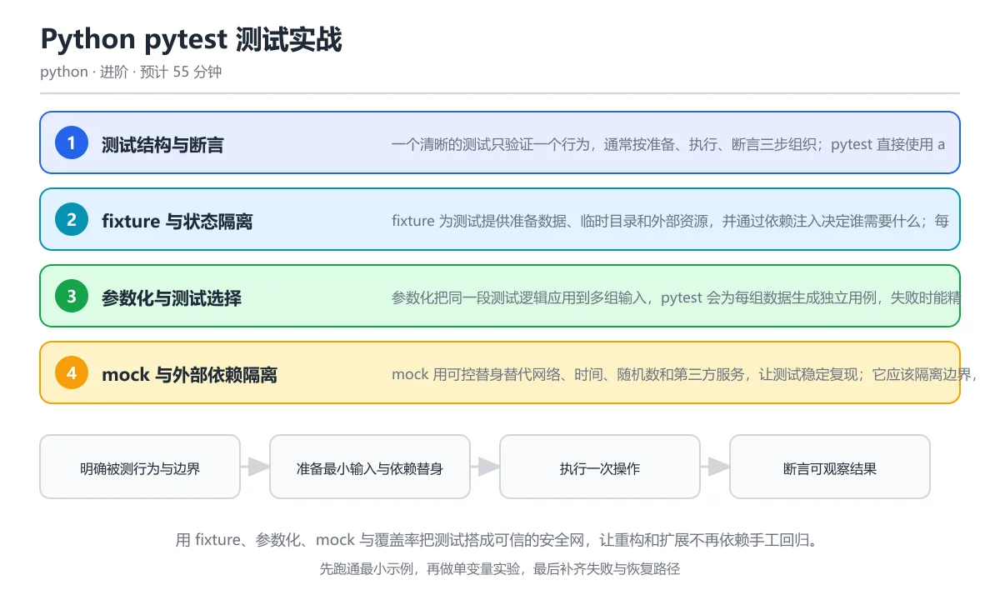

# Python pytest 测试实战

> 内容更新时间：2026-10-06 · 学习阶段：进阶 · 预计用时：60 分钟

分类：python。关键词：pytest、fixture、参数化、mock、覆盖率。用 fixture、参数化、mock 与覆盖率把测试搭成可信的安全网，让重构和扩展不再依赖手工回归。

学习建议：先通读《Python pytest 测试实战》的核心知识与关键流程，再运行可运行练习并完成测验；遇到不确定的结论，回到「故障现场」按症状、根因、修复、验证四步核对。



## 本节知识框架

**课程定位**：所属分类为「Python」，课程主题为「Python pytest 测试实战」，学习阶段为「进阶」，建议用时 60 分钟。

**本课要解决的主问题**：用 fixture、参数化、mock 与覆盖率把测试搭成可信的安全网，让重构和扩展不再依赖手工回归。

| 学习层次 | 要回答的问题 | 完成判据 |
| --- | --- | --- |
| 概念层 | 「Python pytest 测试实战」有哪些必须区分的对象与术语？ | 能用自己的话定义核心术语，并各举一个正例和一个反例。 |
| 机制层 | 这些对象按什么顺序发生作用，输入如何变成输出？ | 能画出或写出机制步骤，并说明每一步的失败条件。 |
| 应用层 | 什么场景适合使用「Python pytest 测试实战」，什么场景不适合？ | 能给出一个真实场景、一个最小示例和一个边界案例。 |
| 性能层 | 时间、空间、吞吐或延迟受哪些量影响？ | 能说出复杂度或性能瓶颈的证据来源；没有证据时明确写“材料未提供”。 |
| 复习层 | 怎样确认自己不是只记住了结论？ | 能独立完成本课自测，并把错误定位到概念、机制、示例或边界。 |

### 阅读路线

1. 先读「核心概念定义」，建立「pytest」等对象的精确定义。
2. 再读「原理与运行机制」，把定义串成可重复的过程。
3. 用「代码/协议/SQL 示例」验证过程，并只改一个条件观察结果变化。
4. 最后检查性能、易错点、知识关系与自测题，形成可复习的证据链。

**前置知识**：《类型注解与测试》

**学习位置**：本课位于《Python 异常、日志与文件 I/O 进阶》之后；如果前一课的自测不能通过，应先回补再继续。

**后续衔接**：下一课《现代 Python 特性与版本升级》会继续使用本课术语，学完后建议立即完成一次自测。

**教材衔接：学习目标**

- 能按准备、执行、断言结构写出可读的测试用例。
- 能用 fixture 与参数化消除重复并隔离状态。
- 能判断哪些依赖需要 mock，哪些应该用真实集成测试验证。

**教材衔接：前置知识**

- 已经会用 assert 和 unittest 风格写基本测试。
- 理解函数参数、异常和模块导入。
- 能运行 pytest 或 python -m pytest 并查看失败输出。

**教材衔接：本课小结**

- Python pytest 测试实战围绕pytest、fixture、参数化展开，先建立基线再讨论优化。
- 一个清晰的测试只验证一个行为，通常按准备、执行、断言三步组织；pytest 直接使用 assert，失败时会重写表达式并显示两侧的值。
- 遇到问题时按「症状 → 根因 → 修复 → 验证」的顺序处理，不跳过验证。

## 核心概念定义

> 阅读约定：本课先给「Python pytest 测试实战」相关术语的操作性定义与适用边界；正文里的口语化说法与定义冲突时，以定义和可复现示例为准。

| 术语 | 操作性定义 | 本课中的边界 |
| --- | --- | --- |
| fixture | pytest 提供的测试资源工厂，可为用例准备数据、依赖与环境并在结束后清理。 | 仅在「Python pytest 测试实战」明确给出的输入、版本与资源条件下成立。 |
| 参数化 | 用一组参数生成多个独立测试实例的机制，便于系统覆盖边界输入。 | 仅在「Python pytest 测试实战」明确给出的输入、版本与资源条件下成立。 |
| mock | 替代外部依赖的可控测试替身，可预设返回值并记录调用。 | 仅在「Python pytest 测试实战」明确给出的输入、版本与资源条件下成立。 |
| 覆盖率 | 测试执行到的代码比例，用于发现未覆盖路径但不能证明行为正确。 | 仅在「Python pytest 测试实战」明确给出的输入、版本与资源条件下成立。 |
| flaky 测试 | 同一代码和输入下时通过时失败的测试，通常由共享状态、时间或并发引起。 | 仅在「Python pytest 测试实战」明确给出的输入、版本与资源条件下成立。 |
| 测试金字塔 | 大量快速单元测试、适量集成测试和少量端到端测试的分层策略。 | 仅在「Python pytest 测试实战」明确给出的输入、版本与资源条件下成立。 |

### 定义如何使用

在「Python pytest 测试实战」中判断一个说法是否成立，先确认它使用的是哪个对象的定义，再检查输入规模、运行环境与失败路径。定义不是口号，而是后续推导、代码示例和自测题共享的约束。

## 原理与运行机制

### 机制总览

1. **建立输入**：把「fixture」按本课定义整理成可观察、可重复的输入条件。
2. **执行转换**：围绕「参数化」执行本课的核心步骤；每一步都记录中间状态，避免只看最终输出。
3. **产生输出**：得到「mock」后，用正文示例或协议/SQL 结果核对输出是否符合预期。
4. **改变一个条件**：只替换一个边界条件或环境参数，观察「Python pytest 测试实战」的结论是否仍然成立。

| 阶段 | 关注对象 | 失败时应检查 |
| --- | --- | --- |
| 输入 | fixture | 类型、范围、编码、版本或前置状态是否满足定义。 |
| 处理 | 参数化 | 顺序、可见性、锁、路由、事务或调度规则是否被破坏。 |
| 输出 | mock | 结果是否可复现，错误是否被正确传播而不是被吞掉。 |

本课的机制结论要用「Python pytest 测试实战」自己的示例验证。「Python pytest 测试实战」没有给出某个数量级、吞吐或内存数据时，本课把该判断标为“材料未提供”，不从相邻主题外推。

**教材衔接：核心知识**

### 1. 测试结构与断言

一个清晰的测试只验证一个行为，通常按准备、执行、断言三步组织；pytest 直接使用 assert，失败时会重写表达式并显示两侧的值。

pytest 收集 test_ 开头的文件和函数，为每个用例创建独立上下文；pytest.raises 捕获指定异常并支持匹配消息，pytest.approx 处理浮点数误差。

在Python pytest 测试实战里可以这样验证：给除法函数写三个参数化正常用例，再用 pytest.raises 验证除零异常的消息包含除数提示。

边界：一个测试塞进多个独立断言会让失败原因不明确；断言真实行为而不是实现细节，否则重构时测试会大面积误报。

工程视角：测试名称描述行为与条件，失败信息包含输入和期望值；公共准备逻辑抽成 fixture，而不是复制粘贴一大段代码。

### 2. fixture 与状态隔离

fixture 为测试提供准备数据、临时目录和外部资源，并通过依赖注入决定谁需要什么；每个测试默认拿到独立的新状态。

fixture 可以嵌套依赖，作用域控制创建频率，yield 之前的代码负责准备、之后的代码负责清理；tmp_path、monkeypatch 和 capsys 是内置 fixture 的常见例子。

在Python pytest 测试实战里可以这样验证：写一个返回列表的 fixture，在测试中修改它，再确认下一个测试拿到的仍是干净数据。

边界：会话级 fixture 共享数据库连接能提速，但测试之间可能互相污染；共享范围越大，隔离责任就越重。

工程视角：外部资源通过 fixture 统一创建和销毁，测试结束后必须清理文件、连接和临时环境变量。

### 3. 参数化与测试选择

参数化把同一段测试逻辑应用到多组输入，pytest 会为每组数据生成独立用例，失败时能精确定位是哪一组。

parametrize 装饰器接收参数名和值列表，ids 可以给每组数据起可读名称；mark 用来标记慢速、集成或跳过条件，命令行按表达式选择用例。

在Python pytest 测试实战里可以这样验证：为除法函数提供整数、小数和负数三组参数，观察一次运行产生三个独立测试结果。

边界：参数组合爆炸会拖慢测试；参数化适合行为相同而数据不同的场景，不适合把不同业务分支硬塞进一张表。

工程视角：边界值、空值与异常输入要进入参数集合；慢速集成测试单独标记，默认流水线只运行快速单元测试。

### 4. mock 与外部依赖隔离

mock 用可控替身替代网络、时间、随机数和第三方服务，让测试稳定复现；它应该隔离边界，而不是替代被测逻辑本身。

unittest.mock.patch 临时替换指定位置的属性，autospec 根据真实签名生成替身；MagicMock 记录调用参数并允许设置返回值与副作用。

在Python pytest 测试实战里可以这样验证：把返回当前时间的函数替换成固定时间，验证令牌过期判断在边界值上的行为。

边界：过度 mock 会把测试变成对调用顺序的断言，失去真实行为验证；协议、序列化和数据库查询最好用集成测试覆盖。

工程视角：只在进程边界使用替身，真实逻辑尽量直接执行；mock 的目标路径必须是被测模块看到的名字，而不是定义处的名字。

### 5. 覆盖率与测试分层

覆盖率揭示哪些代码没有被执行，但不能证明行为正确；单元、集成和端到端测试承担不同风险，需要组合使用。

coverage.py 收集语句和分支执行情况，报告缺失行；测试金字塔建议大量快速单元测试、适量集成测试和少量端到端测试。

在Python pytest 测试实战里可以这样验证：先运行 pytest 与覆盖率报告，找出未执行的分支，再为异常路径补一个针对性用例。

边界：追求百分之百覆盖率可能写出没有断言的测试；随机波动导致的 flaky 测试应被修复或移除，而不是反复重跑。

工程视角：覆盖率设置合理下限并关注新增代码，CI 中固定随机种子和时区，报告失败日志与最小复现输入。

**教材衔接：关键流程**

```text
明确被测行为与边界 → 准备最小输入与依赖替身 → 执行一次操作 → 断言可观察结果 → 补齐异常路径并检查覆盖缺口
```

1. 明确被测行为与边界
2. 准备最小输入与依赖替身
3. 执行一次操作
4. 断言可观察结果
5. 补齐异常路径并检查覆盖缺口

## 典型应用场景

| 场景 | 典型输入或前提 | 期望产物 |
| --- | --- | --- |
| 学习验证 | 使用本课最小示例和 pytest、fixture | 能复现正文结论，并解释每一步。 |
| 工程落地 | 把「Python pytest 测试实战」放入真实模块或服务边界 | 输出可观测、失败可定位、参数可配置。 |
| 故障排查 | 只改一个版本、规模、输入或依赖条件 | 能区分概念错误、实现错误和环境差异。 |

判断「Python pytest 测试实战」的场景是否成立，标准是能否写出输入、处理、输出和失败路径；材料中没有出现的数据在本课标注为“材料未提供”，不用推测替代证据。

**课程内置实验入口**：`sandbox:python`，用于动手验证《Python pytest 测试实战》的机制；实验结论不替代概念定义与复杂度分析。

**教材衔接：项目专属规格**

### 交付目标

用 fixture、参数化、mock 与覆盖率把测试搭成可信的安全网，让重构和扩展不再依赖手工回归。

### 里程碑

1. 明确被测行为与边界
2. 准备最小输入与依赖替身
3. 执行一次操作
4. 断言可观察结果
5. 补齐异常路径并检查覆盖缺口

### 输入与约束

- 输入：为字符串解析函数写参数化测试，覆盖空串、正常输入和包含分隔符的边界输入。
- 约束：一个测试塞进多个独立断言会让失败原因不明确；断言真实行为而不是实现细节，否则重构时测试会大面积误报。
- 失败预算：按行为拆分测试，让每个失败都指向一个清晰原因

### 验收场景

1. 正常路径：跑通「可运行练习」里的最小示例并保存输出。
2. 边界路径：给除法函数写三个参数化正常用例，再用 pytest.raises 验证除零异常的消息包含除数提示。
3. 失败路径：出现「在一个函数里连续断言解析、计算、写文件和发送通知，失败时不知道哪一步坏了」时按上面的失败预算恢复。

**教材衔接：项目交付物**

- 可运行代码：包含python源文件、依赖说明与启动入口。
- README：环境版本、启动命令、目录结构与已知限制。
- 测试记录：正常、边界与失败路径各至少一条，附命令与输出。
- 复盘记录：本次实现推翻了哪个假设，下一步验证动作是什么。

### 交付验收清单

- [ ] 能按准备、执行、断言结构写出可读的测试用例。
- [ ] 能用 fixture 与参数化消除重复并隔离状态。
- [ ] 能判断哪些依赖需要 mock，哪些应该用真实集成测试验证。

**教材衔接：深度拓展与实战**

这一节把Python pytest 测试实战的机制拆开验证：每一步都给出输入、判断标准和失败信号，便于在真实项目里复用。

### 机制拆解 1：测试结构与断言

pytest 收集 test_ 开头的文件和函数，为每个用例创建独立上下文；pytest.raises 捕获指定异常并支持匹配消息，pytest.approx 处理浮点数误差。

落地时先确认前提：一个测试塞进多个独立断言会让失败原因不明确；断言真实行为而不是实现细节，否则重构时测试会大面积误报。；再把结论写进检查表，让下一位同学可以按同样的输入复现。

工程做法：测试名称描述行为与条件，失败信息包含输入和期望值；公共准备逻辑抽成 fixture，而不是复制粘贴一大段代码。

### 机制拆解 2：fixture 与状态隔离

fixture 可以嵌套依赖，作用域控制创建频率，yield 之前的代码负责准备、之后的代码负责清理；tmp_path、monkeypatch 和 capsys 是内置 fixture 的常见例子。

落地时先确认前提：会话级 fixture 共享数据库连接能提速，但测试之间可能互相污染；共享范围越大，隔离责任就越重。；再把结论写进检查表，让下一位同学可以按同样的输入复现。

工程做法：外部资源通过 fixture 统一创建和销毁，测试结束后必须清理文件、连接和临时环境变量。

### 机制拆解 3：参数化与测试选择

parametrize 装饰器接收参数名和值列表，ids 可以给每组数据起可读名称；mark 用来标记慢速、集成或跳过条件，命令行按表达式选择用例。

落地时先确认前提：参数组合爆炸会拖慢测试；参数化适合行为相同而数据不同的场景，不适合把不同业务分支硬塞进一张表。；再把结论写进检查表，让下一位同学可以按同样的输入复现。

工程做法：边界值、空值与异常输入要进入参数集合；慢速集成测试单独标记，默认流水线只运行快速单元测试。

### 机制拆解 4：mock 与外部依赖隔离

unittest.mock.patch 临时替换指定位置的属性，autospec 根据真实签名生成替身；MagicMock 记录调用参数并允许设置返回值与副作用。

落地时先确认前提：过度 mock 会把测试变成对调用顺序的断言，失去真实行为验证；协议、序列化和数据库查询最好用集成测试覆盖。；再把结论写进检查表，让下一位同学可以按同样的输入复现。

工程做法：只在进程边界使用替身，真实逻辑尽量直接执行；mock 的目标路径必须是被测模块看到的名字，而不是定义处的名字。

### 机制拆解 5：覆盖率与测试分层

coverage.py 收集语句和分支执行情况，报告缺失行；测试金字塔建议大量快速单元测试、适量集成测试和少量端到端测试。

落地时先确认前提：追求百分之百覆盖率可能写出没有断言的测试；随机波动导致的 flaky 测试应被修复或移除，而不是反复重跑。；再把结论写进检查表，让下一位同学可以按同样的输入复现。

工程做法：覆盖率设置合理下限并关注新增代码，CI 中固定随机种子和时区，报告失败日志与最小复现输入。

### 机制对照表

| 概念 | 解决什么问题 | 关键前提 | 失败信号 |
| --- | --- | --- | --- |
| 测试结构与断言 | 一个清晰的测试只验证一个行为，通常按准备、执行、断言三步组织；pytest 直接 | 一个测试塞进多个独立断言会让失败原因不明确；断言真实行为而不是实现细节， | 测试名称描述行为与条件，失败信息包含输入和期望值；公共准备逻辑抽成 fi |
| fixture 与状态隔离 | fixture 为测试提供准备数据、临时目录和外部资源，并通过依赖注入决定谁需要 | 会话级 fixture 共享数据库连接能提速，但测试之间可能互相污染；共 | 外部资源通过 fixture 统一创建和销毁，测试结束后必须清理文件、连 |
| 参数化与测试选择 | 参数化把同一段测试逻辑应用到多组输入，pytest 会为每组数据生成独立用例，失 | 参数组合爆炸会拖慢测试；参数化适合行为相同而数据不同的场景，不适合把不同 | 边界值、空值与异常输入要进入参数集合；慢速集成测试单独标记，默认流水线只 |
| mock 与外部依赖隔离 | mock 用可控替身替代网络、时间、随机数和第三方服务，让测试稳定复现；它应该隔 | 过度 mock 会把测试变成对调用顺序的断言，失去真实行为验证；协议、序 | 只在进程边界使用替身，真实逻辑尽量直接执行；mock 的目标路径必须是被 |
| 覆盖率与测试分层 | 覆盖率揭示哪些代码没有被执行，但不能证明行为正确；单元、集成和端到端测试承担不同 | 追求百分之百覆盖率可能写出没有断言的测试；随机波动导致的 flaky 测 | 覆盖率设置合理下限并关注新增代码，CI 中固定随机种子和时区，报告失败日 |

### 自测问答

**问 1**：pytest 中验证函数抛出特定异常并检查消息，正确写法是？

**答**：with pytest.raises(ValueError, match='除数'): divide(1, 0)。pytest.raises 既是上下文管理器，也能在退出时确认异常类型，match 参数用正则表达式检查异常消息。直接比较返回值不会捕获异常，空的 except 会吞掉错误，自定义标记并不会执行异常断言；把异常类型和关键消息一起验证，测试失败时才能快速定位原因。 正确选项「with pytest.raises(ValueError, match='除数'): divide(1, 0)」对应《Python pytest 测试实战》的要点「测试结构与断言」：一个清晰的测试只验证一个行为，通常按准备、执行、断言三步组织；pytest 直接使用 assert，失败时会重写表达式并显示两侧的值。判断「测试结构与断言」时先确认前提是否成立，再回到《Python pytest 测试实战》的示例核对一次；把别的语言或框架的默认做法直接搬到测试结构与断言上，往往会在本课的边界条件里失效。

**问 2**：fixture 使用 yield 的主要目的是什么？

**答**：在测试前准备资源，在测试后执行清理。yield 之前的代码在测试开始前运行，产出的对象注入测试，测试结束后继续执行 yield 之后的清理代码，因此特别适合文件、连接和临时环境。没有清理的共享资源会让后续测试受到污染，表现为单独运行通过、整套运行偶发失败。 正确选项「在测试前准备资源，在测试后执行清理」对应《Python pytest 测试实战》的要点「fixture 与状态隔离」：fixture 为测试提供准备数据、临时目录和外部资源，并通过依赖注入决定谁需要什么；每个测试默认拿到独立的新状态。判断「fixture 与状态隔离」时先确认前提是否成立，再回到《Python pytest 测试实战》的示例核对一次；借鉴相邻主题的经验之前，先核对fixture 与状态隔离的前提是否成立。

**问 3**：关于 mock，哪些做法是合理的？（多选）

**答**：替换网络客户端以返回固定响应；替换当前时间让过期逻辑可复现；对真实数据库迁移使用集成测试而不是全量 mock。网络、时间和随机数属于不稳定边界，适合用替身控制；数据库迁移的行为、约束和事务语义应该在真实数据库上做集成测试。把被测函数本身替换成 mock 后，测试只能证明调用发生，无法证明业务结果正确，是常见的假安全感。 正确选项「替换网络客户端以返回固定响应；替换当前时间让过期逻辑可复现；对真实数据库迁移使用集成测试而不是全量 mock」对应《Python pytest 测试实战》的要点「参数化与测试选择」：参数化把同一段测试逻辑应用到多组输入，pytest 会为每组数据生成独立用例，失败时能精确定位是哪一组。判断「参数化与测试选择」时先确认前提是否成立，再回到《Python pytest 测试实战》的示例核对一次；记住参数化与测试选择的结论之外还要记住适用条件，换一个输入往往就不成立了。

**问 4**：参数化装饰器会生成几个测试用例？

@pytest.mark.parametrize('value', [1, 2, 3])
def test_double(value):
    assert value * 2 >= 2

**答**：3 个。参数列表有三个值，pytest 会生成三个独立用例，任何一个失败都能看到具体参数。参数化能避免复制粘贴三个几乎相同的函数，也能让增加边界输入变成修改一行数据；不适合把完全不同的业务流程塞进同一张参数表。 正确选项「3 个」对应《Python pytest 测试实战》的要点「mock 与外部依赖隔离」：mock 用可控替身替代网络、时间、随机数和第三方服务，让测试稳定复现；它应该隔离边界，而不是替代被测逻辑本身。判断「mock 与外部依赖隔离」时先确认前提是否成立，再回到《Python pytest 测试实战》的示例核对一次；干扰项常常是相邻主题里成立的结论，只有按mock 与外部依赖隔离的输入与约束判断才能排除。

**问 5**：为什么这个测试即使实现错了也可能通过？

**答**：它只验证 mock 被调用，没有执行真实创建逻辑。这里的 service 是 mock，调用它只会记录参数并返回另一个 mock，真实用户创建、校验和持久化都没有发生，因此测试无法发现业务缺陷。正确做法是执行真实服务或只 mock 最外层依赖，再断言返回对象、数据库状态或可观察副作用。这道题属于 pytest 测试设计问题：mock 只能隔离外部依赖，不能让被测逻辑绕过真实断言。 正确选项「它只验证 mock 被调用，没有执行真实创建逻辑」对应《Python pytest 测试实战》的要点「覆盖率与测试分层」：覆盖率揭示哪些代码没有被执行，但不能证明行为正确；单元、集成和端到端测试承担不同风险，需要组合使用。判断「覆盖率与测试分层」时先确认前提是否成立，再回到《Python pytest 测试实战》的示例核对一次；把覆盖率与测试分层的做法换到别的约束下未必成立，先确认边界再决定答案。

### 排错速查

- 看到「在一个函数里连续断言解析、计算、写文件和发送通知，失败时不知道哪一步坏了」时，先按「按行为拆分测试，让每个失败都指向一个清晰原因」处理，再用Python pytest 测试实战的最小示例确认结论是否恢复。
- 看到「第二个测试依赖第一个测试留下的全局变量或数据库记录」时，先按「用 fixture 在每个测试前后创建和清理状态，测试可以单独运行」处理，再用Python pytest 测试实战的最小示例确认结论是否恢复。
- 看到「把待测函数替换成 mock 后断言它被调用，测试没有验证任何真实逻辑」时，先按「只替换进程边界或外部依赖，让被测函数真实执行」处理，再用Python pytest 测试实战的最小示例确认结论是否恢复。
- 看到「为未覆盖的行补上无断言的调用，覆盖率上升但没有验证行为」时，先按「优先覆盖风险高的分支，并让每个测试都有有意义的断言」处理，再用Python pytest 测试实战的最小示例确认结论是否恢复。

### 工程检查表

- [ ] 明确被测行为与边界
- [ ] 准备最小输入与依赖替身
- [ ] 执行一次操作
- [ ] 断言可观察结果
- [ ] 补齐异常路径并检查覆盖缺口
- [ ] 【测试结构与断言】测试名称描述行为与条件，失败信息包含输入和期望值；公共准备逻辑抽成 fixture，而不是复制粘贴一大段代码。
- [ ] 【fixture 与状态隔离】外部资源通过 fixture 统一创建和销毁，测试结束后必须清理文件、连接和临时环境变量。
- [ ] 【参数化与测试选择】边界值、空值与异常输入要进入参数集合；慢速集成测试单独标记，默认流水线只运行快速单元测试。
- [ ] 【mock 与外部依赖隔离】只在进程边界使用替身，真实逻辑尽量直接执行；mock 的目标路径必须是被测模块看到的名字，而不是定义处的名字。
- [ ] 【覆盖率与测试分层】覆盖率设置合理下限并关注新增代码，CI 中固定随机种子和时区，报告失败日志与最小复现输入。

### 迁移练习

把Python pytest 测试实战的方法用到一个真实场景：写下pytest、fixture、参数化在你的场景里分别对应什么，再记录一次失败尝试和它的恢复步骤。

### 延伸阅读与下一步

- 复习pytest、fixture、参数化、mock、覆盖率时，优先回看「测试结构与断言」与「覆盖率与测试分层」两节。
- 把从「明确被测行为与边界」到「补齐异常路径并检查覆盖缺口」的流程画成一张图，放进自己的笔记。
- 一周后重做本课测验，只把答错的题留到下一轮复习。

### 结论与下一步

学完Python pytest 测试实战，应该能独立完成三件事：先用最小示例确认pytest的行为，再用一个边界输入验证结论，最后把失败路径写成可重复的检查。下一步把本课术语加入复习清单，并在两周内用一次真实任务检验记忆是否牢固。

## 代码/协议/SQL 示例

### 最小可验证示例

下面保留《Python pytest 测试实战》原文中的最小示例。先预测《Python pytest 测试实战》示例的输出，再按正文步骤运行或推演；示例依赖外部环境时，同时记录版本与输入。

```text
明确被测行为与边界 → 准备最小输入与依赖替身 → 执行一次操作 → 断言可观察结果 → 补齐异常路径并检查覆盖缺口
```

**教材衔接：验证命令与预期输出**

| 步骤 | 命令 | 预期输出 |
| --- | --- | --- |
| 准备环境 | 按 README 安装依赖 | 依赖安装完成且没有版本冲突 |
| 运行示例 | 运行「可运行练习」中的入口 | ....                                                                     [100%]
4 passed in 0.02s |
| 边界输入 | 替换一个输入后重跑 | 结果仍能被正文机制解释 |
| 失败演练 | 按「故障现场」制造一次失败 | 能定位根因并恢复到正常输出 |

### 验收证据

- [ ] 保存一次成功运行的完整输出。
- [ ] 保存一次边界输入的输出与解释。
- [ ] 记录一次失败现象、根因与修复动作。

> 项目目标：Python pytest 测试实战 的每一步都要能复现，做不到复现就先缩小范围。

**教材衔接：原文最小示例**

```text
明确被测行为与边界 → 准备最小输入与依赖替身 → 执行一次操作 → 断言可观察结果 → 补齐异常路径并检查覆盖缺口
```

## 时间/空间复杂度或性能分析

**复杂度证据**：「Python pytest 测试实战」的现有材料没有给出渐近时间或空间复杂度的明确结论，本课只做定性检查，不补写未经验证的 $O$ 记号。

| 维度 | 本课关注点 | 判断依据 |
| --- | --- | --- |
| 时间/延迟 | 「Python pytest 测试实战」的主要步骤是否会随输入规模、并发度或网络往返增长。 | 以正文复杂度、基准数据或可重复测量为准。 |
| 空间/内存 | 中间状态、缓存、副本、连接或索引是否随规模增长。 | 记录峰值内存与数据副本，不只看最终结果。 |
| 吞吐/资源 | 版本、调度、锁、IO、序列化或协议开销是否成为瓶颈。 | 固定环境做对照实验，改变一个变量。 |

评估「Python pytest 测试实战」时要区分“正确性成立”和“性能达标”两件事；材料没有给出基准时，本课只保留量级来源与测量方法，不写不可验证的绝对数字。

## 常见误区与易错点

> 复核《Python pytest 测试实战》的易错点时，优先保留原文的错误表、故障现场与排错路径；每条修正都要能用本课示例复验。

| 易错点 | 常见表现 | 正确做法 |
| --- | --- | --- |
| 只背结论 | 能复述「Python pytest 测试实战」的定义，却说不清输入、输出与边界。 | 回到机制步骤，用最小示例逐一验证。 |
| 混淆相邻概念 | 把本课对象与相邻主题的对象当成同一类。 | 先比较定义、资源归属、生命周期和失败模式。 |
| 忽略版本与环境 | 在开发机通过后直接外推到生产环境。 | 固定版本、输入和资源条件，再记录可复现结果。 |

**教材衔接：常见错误与排查**

> 说明：本表由《Python pytest 测试实战》的核心知识整理（2026-10-06），人工复核进度见 docs/content_review_batches.md。

| 易错点 | 容易踩的做法 | 正确结论 |
| --- | --- | --- |
| 一个测试验证多个行为 | 在一个函数里连续断言解析、计算、写文件和发送通知，失败时不知道哪一步坏了 | 按行为拆分测试，让每个失败都指向一个清晰原因 |
| 测试依赖执行顺序 | 第二个测试依赖第一个测试留下的全局变量或数据库记录 | 用 fixture 在每个测试前后创建和清理状态，测试可以单独运行 |
| mock 掉被测对象本身 | 把待测函数替换成 mock 后断言它被调用，测试没有验证任何真实逻辑 | 只替换进程边界或外部依赖，让被测函数真实执行 |
| 只追求覆盖率数字 | 为未覆盖的行补上无断言的调用，覆盖率上升但没有验证行为 | 优先覆盖风险高的分支，并让每个测试都有有意义的断言 |

**教材衔接：故障现场**

### 现场 1：一个测试验证多个行为

**症状**：在《Python pytest 测试实战》里采用「在一个函数里连续断言解析、计算、写文件和发送通知，失败时不知道哪一步坏了」时，一个测试验证多个行为会表现为错误结果、异常中断或状态不一致。

**根因**：这个做法没有执行与「一个测试验证多个行为」对应的检查，问题被带到了后续步骤。

**修复**：按行为拆分测试，让每个失败都指向一个清晰原因

**验证**：为「一个测试验证多个行为」准备一个最小输入，确认修复前的失败可以复现，修复后的输出与本课示例一致，再补一个边界输入。

### 现场 2：测试依赖执行顺序

**症状**：在《Python pytest 测试实战》里采用「第二个测试依赖第一个测试留下的全局变量或数据库记录」时，测试依赖执行顺序会表现为错误结果、异常中断或状态不一致。

**根因**：这个做法没有执行与「测试依赖执行顺序」对应的检查，问题被带到了后续步骤。

**修复**：用 fixture 在每个测试前后创建和清理状态，测试可以单独运行

**验证**：为「测试依赖执行顺序」准备一个最小输入，确认修复前的失败可以复现，修复后的输出与本课示例一致，再补一个边界输入。

### 现场 3：mock 掉被测对象本身

**症状**：在《Python pytest 测试实战》里采用「把待测函数替换成 mock 后断言它被调用，测试没有验证任何真实逻辑」时，mock 掉被测对象本身会表现为错误结果、异常中断或状态不一致。

**根因**：这个做法没有执行与「mock 掉被测对象本身」对应的检查，问题被带到了后续步骤。

**修复**：只替换进程边界或外部依赖，让被测函数真实执行

**验证**：为「mock 掉被测对象本身」准备一个最小输入，确认修复前的失败可以复现，修复后的输出与本课示例一致，再补一个边界输入。

### 现场 4：只追求覆盖率数字

**症状**：在《Python pytest 测试实战》里采用「为未覆盖的行补上无断言的调用，覆盖率上升但没有验证行为」时，只追求覆盖率数字会表现为错误结果、异常中断或状态不一致。

**根因**：这个做法没有执行与「只追求覆盖率数字」对应的检查，问题被带到了后续步骤。

**修复**：优先覆盖风险高的分支，并让每个测试都有有意义的断言

**验证**：为「只追求覆盖率数字」准备一个最小输入，确认修复前的失败可以复现，修复后的输出与本课示例一致，再补一个边界输入。

## 与其他知识点的关系

| 关系 | 课程 | 为什么 |
| --- | --- | --- |
| 先修 | 《类型注解与测试》 | 本课会直接使用它的概念或操作前提。 |
| 关联 | 《Python 项目架构：分层、配置与依赖注入》 | 用于横向比较或把本课结论迁移到相邻主题。 |
| 关联 | 《Python 数据库与 SQLAlchemy 2.x》 | 用于横向比较或把本课结论迁移到相邻主题。 |
| 前置顺序 | 《Python 异常、日志与文件 I/O 进阶》 | 同分类中安排在本课之前，建议先完成其自测。 |
| 后续顺序 | 《现代 Python 特性与版本升级》 | 同分类中安排在本课之后，会继续使用本课术语。 |

把「Python pytest 测试实战」放回知识体系时，不只要记住“前面学过什么”，还要说明两个主题在输入、机制、资源边界和失败模式上的差异。这样才能把单课知识迁移到项目、排障和后续课程。

**教材衔接：复习与迁移**

### 概念复述

不看正文，把Python pytest 测试实战讲给一个没学过的同事：先讲它解决什么问题，再讲一个最小例子，最后说明一个不适用场景。

### 测验回顾

回到《Python pytest 测试实战》测验，只重做答错或犹豫的题；对每道题写一句「我为什么改选这个答案」，写不出理由就回到对应小节。

### 迁移练习

把《Python pytest 测试实战》的方法用到一个你自己的真实场景：说明输入、约束与验证方式，并列出仍然不确定、需要下一次实验回答的问题。

## 自测题与参考答案

> 先独立作答《Python pytest 测试实战》的自测题，再对照答案与解析；每处判断都要能在本课正文或示例中找到依据。

### 自测 1

pytest 中验证函数抛出特定异常并检查消息，正确写法是？

A. with pytest.raises(ValueError, match='除数'): divide(1, 0)
B. assert divide(1, 0) == ValueError
C. try: divide(1, 0) except: pass
D. @pytest.mark.error(ValueError)

**参考答案**：with pytest.raises(ValueError, match='除数'): divide(1, 0)

**解析**：pytest.raises 既是上下文管理器，也能在退出时确认异常类型，match 参数用正则表达式检查异常消息。直接比较返回值不会捕获异常，空的 except 会吞掉错误，自定义标记并不会执行异常断言；把异常类型和关键消息一起验证，测试失败时才能快速定位原因。 正确选项「with pytest.raises(ValueError, match='除数'): divide(1, 0)」对应《Python pytest 测试实战》的要点「测试结构与断言」：一个清晰的测试只验证一个行为，通常按准备、执行、断言三步组织；pytest 直接使用 assert，失败时会重写表达式并显示两侧的值。判断「测试结构与断言」时先确认前提是否成立，再回到《Python pytest 测试实战》的示例核对一次；把别的语言或框架的默认做法直接搬到测试结构与断言上，往往会在本课的边界条件里失效。

### 自测 2

关于 mock，哪些做法是合理的？（多选）

A. 替换网络客户端以返回固定响应
B. 替换当前时间让过期逻辑可复现
C. 替换被测函数本身并只断言调用次数
D. 对真实数据库迁移使用集成测试而不是全量 mock

**参考答案**：替换网络客户端以返回固定响应；替换当前时间让过期逻辑可复现；对真实数据库迁移使用集成测试而不是全量 mock

**解析**：网络、时间和随机数属于不稳定边界，适合用替身控制；数据库迁移的行为、约束和事务语义应该在真实数据库上做集成测试。把被测函数本身替换成 mock 后，测试只能证明调用发生，无法证明业务结果正确，是常见的假安全感。 正确选项「替换网络客户端以返回固定响应；替换当前时间让过期逻辑可复现；对真实数据库迁移使用集成测试而不是全量 mock」对应《Python pytest 测试实战》的要点「参数化与测试选择」：参数化把同一段测试逻辑应用到多组输入，pytest 会为每组数据生成独立用例，失败时能精确定位是哪一组。判断「参数化与测试选择」时先确认前提是否成立，再回到《Python pytest 测试实战》的示例核对一次；记住参数化与测试选择的结论之外还要记住适用条件，换一个输入往往就不成立了。

### 自测 3

参数化装饰器会生成几个测试用例？

@pytest.mark.parametrize('value', [1, 2, 3])
def test_double(value):
    assert value * 2 >= 2

```python
@pytest.mark.parametrize('value', [1, 2, 3])
def test_double(value):
    assert value * 2 >= 2
```

A. 3 个
B. 1 个
C. 2 个
D. 0 个，因为缺少 fixture

**参考答案**：3 个

**解析**：参数列表有三个值，pytest 会生成三个独立用例，任何一个失败都能看到具体参数。参数化能避免复制粘贴三个几乎相同的函数，也能让增加边界输入变成修改一行数据；不适合把完全不同的业务流程塞进同一张参数表。 正确选项「3 个」对应《Python pytest 测试实战》的要点「mock 与外部依赖隔离」：mock 用可控替身替代网络、时间、随机数和第三方服务，让测试稳定复现；它应该隔离边界，而不是替代被测逻辑本身。判断「mock 与外部依赖隔离」时先确认前提是否成立，再回到《Python pytest 测试实战》的示例核对一次；干扰项常常是相邻主题里成立的结论，只有按mock 与外部依赖隔离的输入与约束判断才能排除。

**教材衔接：动手练习**

1. 为字符串解析函数写参数化测试，覆盖空串、正常输入和包含分隔符的边界输入。
2. 用 tmp_path fixture 测试一个读写 JSON 文件的函数，确认测试结束后临时目录自动清理。
3. 用 monkeypatch 替换环境变量，验证配置读取在不同环境下的默认值与错误信息。
4. 生成一次覆盖率报告，找出一个未覆盖分支并补上能真实失败的最小用例。

**验收标准**：留下输入、命令、输出和结论，能让别人按记录复现。

**教材衔接：可运行练习**

### 任务 1：先跑通，再解释

```python
# calculator.py
def divide(a: float, b: float) -> float:
    if b == 0:
        raise ValueError("除数不能为 0")
    return a / b

# test_calculator.py
import pytest
from calculator import divide

@pytest.mark.parametrize(
    ("a", "b", "expected"),
    [(10, 2, 5), (1, 4, 0.25), (-9, 3, -3)],
)
def test_divide(a, b, expected):
    assert divide(a, b) == pytest.approx(expected)

def test_divide_by_zero():
    with pytest.raises(ValueError, match="除数"):
        divide(1, 0)

@pytest.fixture
def records():
    data = [3, 1, 2]
    yield data
    data.clear()

def test_sorted(records):
    assert sorted(records) == [1, 2, 3]
```

三个正常用例被参数化成一个测试函数，失败时会显示具体参数组合；除零用例用 pytest.raises 同时验证异常类型与消息；records fixture 负责准备和清理共享数据，让测试结束后不留下状态。运行 pytest -q 应看到四个通过用例。

### 任务 2：只改一个条件

复制上面的示例，只改一个输入或参数再跑一次；先写下预测，再和真实输出对照，并说明差异来自Python pytest 测试实战的哪条机制。

### 任务 3：迁移到自己的数据

把《Python pytest 测试实战》里的示例换成你自己的一小段数据或场景，保持结构不变；如果换不动，说明还有哪条前提没有理解，回到核心知识对应小节。

**教材衔接：本课复习清单**

离开本课前，逐项确认：

- [ ] 能写出一件事一断言的可读测试。
- [ ] 能用 fixture 的 yield 保证资源清理。
- [ ] 能判断哪些依赖应该 mock，哪些需要真实集成测试。
- [ ] 至少运行一次本课示例，记录输入、输出和一个边界情况。
- [ ] 把本课最容易混淆的两个概念写成一句话对照。

| 复盘项 | 记录 |
| --- | --- |
| 已经能独立解释的考点 |  |
| 仍然说不清的概念 |  |
| 下一步验证动作 |  |

**教材衔接：复习与自测**

### 核心知识

遮住正文回答：Python pytest 测试实战解决什么问题、依赖哪些前提、失败时先看哪个信号？三问都能答清楚，再进入下一节。

### 动手练习

把《Python pytest 测试实战》里「只改一个条件」的练习再做一遍，这次先写预测再运行；预测和结果不一致的地方，就是需要回读的章节。

### 最小可运行示例

```python
# calculator.py
def divide(a: float, b: float) -> float:
    if b == 0:
        raise ValueError("除数不能为 0")
    return a / b

# test_calculator.py
import pytest
from calculator import divide

@pytest.mark.parametrize(
    ("a", "b", "expected"),
    [(10, 2, 5), (1, 4, 0.25), (-9, 3, -3)],
)
def test_divide(a, b, expected):
    assert divide(a, b) == pytest.approx(expected)

def test_divide_by_zero():
    with pytest.raises(ValueError, match="除数"):
        divide(1, 0)

@pytest.fixture
def records():
    data = [3, 1, 2]
    yield data
    data.clear()

def test_sorted(records):
    assert sorted(records) == [1, 2, 3]
```

### 预期输出

```text
....                                                                     [100%]
4 passed in 0.02s
```

### 验证步骤

1. 确认输入数据与运行环境和示例一致。
2. 运行示例，记录输出与耗时等可观测指标。
3. 换一个边界输入重跑，确认结论仍然成立。
4. 把两次结果写成一句话结论，注明前提与局限。

---

## 术语速查

先遮住右列，尝试用自己的话解释，再回到正文核对。

| 术语 | 一句话说明 |
| --- | --- |
| `fixture` | pytest 提供的测试资源工厂，可为用例准备数据、依赖与环境并在结束后清理。 |
| `参数化` | 用一组参数生成多个独立测试实例的机制，便于系统覆盖边界输入。 |
| `mock` | 替代外部依赖的可控测试替身，可预设返回值并记录调用。 |
| `覆盖率` | 测试执行到的代码比例，用于发现未覆盖路径但不能证明行为正确。 |
| `flaky 测试` | 同一代码和输入下时通过时失败的测试，通常由共享状态、时间或并发引起。 |
| `测试金字塔` | 大量快速单元测试、适量集成测试和少量端到端测试的分层策略。 |

## 考点精讲

### 考点 1：pytest 中验证函数抛出特定异常并检

题型：概念判断。题干：pytest 中验证函数抛出特定异常并检查消息，正确写法是？

判断要点：with pytest.raises(ValueError, match='除数'): divide(1, 0)。pytest.raises 既是上下文管理器，也能在退出时确认异常类型，match 参数用正则表达式检查异常消息。直接比较返回值不会捕获异常，空的 except 会吞掉错误，自定义标记并不会执行异常断言；把异常类型和关键消息一起验证，测试失败时才能快速定位原因。 正确选项「with pytest.raises(ValueError, match='除数'): divide(1, 0)」对应《Python pytest 测试实战》的要点「测试结构与断言」：一个清晰的测试只验证一个行为，通常按准备、执行、断言三步组织；pytest 直接使用 assert，失败时会重写表达式并显示两侧的值。判断「测试结构与断言」时先确认前提是否成立，再回到《Python pytest 测试实战》的示例核对一次；把别的语言或框架的默认做法直接搬到测试结构与断言上，往往会在本课的边界条件里失效。

### 考点 2：fixture 使用 yield 的主要

题型：概念判断。题干：fixture 使用 yield 的主要目的是什么？

判断要点：在测试前准备资源，在测试后执行清理。yield 之前的代码在测试开始前运行，产出的对象注入测试，测试结束后继续执行 yield 之后的清理代码，因此特别适合文件、连接和临时环境。没有清理的共享资源会让后续测试受到污染，表现为单独运行通过、整套运行偶发失败。 正确选项「在测试前准备资源，在测试后执行清理」对应《Python pytest 测试实战》的要点「fixture 与状态隔离」：fixture 为测试提供准备数据、临时目录和外部资源，并通过依赖注入决定谁需要什么；每个测试默认拿到独立的新状态。判断「fixture 与状态隔离」时先确认前提是否成立，再回到《Python pytest 测试实战》的示例核对一次；借鉴相邻主题的经验之前，先核对fixture 与状态隔离的前提是否成立。

### 考点 3：关于 mock，哪些做法是合理的？（多选

题型：多选辨析。题干：关于 mock，哪些做法是合理的？（多选）

判断要点：替换网络客户端以返回固定响应；替换当前时间让过期逻辑可复现；对真实数据库迁移使用集成测试而不是全量 mock。网络、时间和随机数属于不稳定边界，适合用替身控制；数据库迁移的行为、约束和事务语义应该在真实数据库上做集成测试。把被测函数本身替换成 mock 后，测试只能证明调用发生，无法证明业务结果正确，是常见的假安全感。 正确选项「替换网络客户端以返回固定响应；替换当前时间让过期逻辑可复现；对真实数据库迁移使用集成测试而不是全量 mock」对应《Python pytest 测试实战》的要点「参数化与测试选择」：参数化把同一段测试逻辑应用到多组输入，pytest 会为每组数据生成独立用例，失败时能精确定位是哪一组。判断「参数化与测试选择」时先确认前提是否成立，再回到《Python pytest 测试实战》的示例核对一次；记住参数化与测试选择的结论之外还要记住适用条件，换一个输入往往就不成立了。

### 考点 4：参数化装饰器会生成几个测试用例？

@p

题型：代码阅读。题干：参数化装饰器会生成几个测试用例？

@pytest.mark.parametrize('value', [1, 2, 3])
def test_double(value):
    assert value * 2 >= 2

判断要点：3 个。参数列表有三个值，pytest 会生成三个独立用例，任何一个失败都能看到具体参数。参数化能避免复制粘贴三个几乎相同的函数，也能让增加边界输入变成修改一行数据；不适合把完全不同的业务流程塞进同一张参数表。 正确选项「3 个」对应《Python pytest 测试实战》的要点「mock 与外部依赖隔离」：mock 用可控替身替代网络、时间、随机数和第三方服务，让测试稳定复现；它应该隔离边界，而不是替代被测逻辑本身。判断「mock 与外部依赖隔离」时先确认前提是否成立，再回到《Python pytest 测试实战》的示例核对一次；干扰项常常是相邻主题里成立的结论，只有按mock 与外部依赖隔离的输入与约束判断才能排除。

### 考点 5：为什么这个测试即使实现错了也可能通过？

题型：排错。题干：为什么这个测试即使实现错了也可能通过？

判断要点：它只验证 mock 被调用，没有执行真实创建逻辑。这里的 service 是 mock，调用它只会记录参数并返回另一个 mock，真实用户创建、校验和持久化都没有发生，因此测试无法发现业务缺陷。正确做法是执行真实服务或只 mock 最外层依赖，再断言返回对象、数据库状态或可观察副作用。这道题属于 pytest 测试设计问题：mock 只能隔离外部依赖，不能让被测逻辑绕过真实断言。 正确选项「它只验证 mock 被调用，没有执行真实创建逻辑」对应《Python pytest 测试实战》的要点「覆盖率与测试分层」：覆盖率揭示哪些代码没有被执行，但不能证明行为正确；单元、集成和端到端测试承担不同风险，需要组合使用。判断「覆盖率与测试分层」时先确认前提是否成立，再回到《Python pytest 测试实战》的示例核对一次；把覆盖率与测试分层的做法换到别的约束下未必成立，先确认边界再决定答案。

## English Overview

Practical Testing with Python pytest

This lesson turns Python testing into a dependable safety net. It covers arrange-act-assert structure, pytest assertions and raises, fixtures with yield cleanup, parametrized cases, mock boundaries, and layered coverage with unit, integration and end-to-end tests.

## 内容元数据

- 内容版本：v2.0
- 最后更新：2026-10-06
- 学习阶段：进阶

| 字段 | 值 |
| --- | --- |
| 课程 ID | `python_pytest` |
| 所属分类 | `python` |
| 难度 | 进阶 |
| 预计用时 | 55 分钟 |
| 关键词 | pytest、fixture、参数化、mock、覆盖率 |
| 配图 | `images/lesson_python_pytest.webp` |
| 参考资料 | 4 条 |
| 内容更新时间 | 2026-10-06 |

## 参考资料与复核

- 最后复核：2026-10-04
- 下次复核：2026-12-10
- 复核范围：版本兼容、API 行为与工程实践

下面列出的资料用于核对本课结论，复习时可以对照阅读：
- [pytest 官方文档](https://docs.pytest.org/en/stable/)
- [pytest fixture 指南](https://docs.pytest.org/en/stable/how-to/fixtures.html)
- [unittest.mock 文档](https://docs.python.org/3/library/unittest.mock.html)
- [coverage.py 文档](https://coverage.readthedocs.io/)

> 复核提示：《Python pytest 测试实战》的结论如与资料冲突，以资料中的规范文本为准，并在笔记里记录差异与日期。
