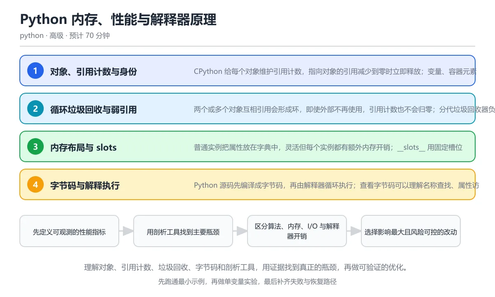

# Python 内存、性能与解释器原理

> 内容更新时间：2026-10-06 · 学习阶段：高级 · 预计用时：50 分钟

分类：python。关键词：引用计数、垃圾回收、字节码、性能剖析、__slots__。理解对象、引用计数、垃圾回收、字节码和剖析工具，用证据找到真正的瓶颈，再做可验证的优化。

学习建议：先通读《Python 内存、性能与解释器原理》的核心知识与关键流程，再运行可运行练习并完成测验；遇到不确定的结论，回到「故障现场」按症状、根因、修复、验证四步核对。



## 本节知识框架

**课程定位**：所属分类为「Python」，课程主题为「Python 内存、性能与解释器原理」，学习阶段为「高级」，建议用时 50 分钟。

**本课要解决的主问题**：理解对象、引用计数、垃圾回收、字节码和剖析工具，用证据找到真正的瓶颈，再做可验证的优化。

| 学习层次 | 要回答的问题 | 完成判据 |
| --- | --- | --- |
| 概念层 | 「Python 内存、性能与解释器原理」有哪些必须区分的对象与术语？ | 能用自己的话定义核心术语，并各举一个正例和一个反例。 |
| 机制层 | 这些对象按什么顺序发生作用，输入如何变成输出？ | 能画出或写出机制步骤，并说明每一步的失败条件。 |
| 应用层 | 什么场景适合使用「Python 内存、性能与解释器原理」，什么场景不适合？ | 能给出一个真实场景、一个最小示例和一个边界案例。 |
| 性能层 | 时间、空间、吞吐或延迟受哪些量影响？ | 能说出复杂度或性能瓶颈的证据来源；没有证据时明确写“材料未提供”。 |
| 复习层 | 怎样确认自己不是只记住了结论？ | 能独立完成本课自测，并把错误定位到概念、机制、示例或边界。 |

### 阅读路线

1. 先读「核心概念定义」，建立「引用计数」等对象的精确定义。
2. 再读「原理与运行机制」，把定义串成可重复的过程。
3. 用「代码/协议/SQL 示例」验证过程，并只改一个条件观察结果变化。
4. 最后检查性能、易错点、知识关系与自测题，形成可复习的证据链。

**前置知识**：《Python 打包、发布与性能》

**学习位置**：本课位于《Python 打包、发布与性能》之后；如果前一课的自测不能通过，应先回补再继续。

**后续衔接**：下一课《Python 数据处理：NumPy、pandas 与 Polars》会继续使用本课术语，学完后建议立即完成一次自测。

**教材衔接：学习目标**

- 能解释引用计数、循环垃圾回收和弱引用的作用。
- 能用 tracemalloc、timeit 与 cProfile 定位内存和 CPU 热点。
- 能在算法、数据结构、解释器开销与原生扩展之间做出优化取舍。

**教材衔接：前置知识**

- 会使用列表、字典、类和生成器。
- 知道时间复杂度与大 O 记号的基本含义。
- 能运行脚本并记录耗时。

**教材衔接：本课小结**

- Python 内存、性能与解释器原理围绕引用计数、垃圾回收、字节码展开，先建立基线再讨论优化。
- CPython 给每个对象维护引用计数，指向对象的引用减少到零时立即释放；变量、容器元素和函数参数都会增加引用。
- 遇到问题时按「症状 → 根因 → 修复 → 验证」的顺序处理，不跳过验证。

## 核心概念定义

> 阅读约定：本课先给「Python 内存、性能与解释器原理」相关术语的操作性定义与适用边界；正文里的口语化说法与定义冲突时，以定义和可复现示例为准。

| 术语 | 操作性定义 | 本课中的边界 |
| --- | --- | --- |
| 引用计数 | CPython 为每个对象维护的指向引用数量，降到零时立即释放对象。 | 仅在「Python 内存、性能与解释器原理」明确给出的输入、版本与资源条件下成立。 |
| 循环垃圾回收 | 发现并回收互相引用、引用计数不为零但已不可达对象图的机制。 | 仅在「Python 内存、性能与解释器原理」明确给出的输入、版本与资源条件下成立。 |
| 弱引用 | 不增加对象引用计数的引用，对象被回收后自动失效。 | 仅在「Python 内存、性能与解释器原理」明确给出的输入、版本与资源条件下成立。 |
| __slots__ | 用固定属性槽位替代实例字典的类声明，可降低单个实例的内存开销。 | 仅在「Python 内存、性能与解释器原理」明确给出的输入、版本与资源条件下成立。 |
| 字节码 | Python 源码编译后的中间指令，由虚拟机解释执行。 | 仅在「Python 内存、性能与解释器原理」明确给出的输入、版本与资源条件下成立。 |
| 火焰图 | 把采样得到的调用栈聚合展示的图形，宽度代表样本占比。 | 仅在「Python 内存、性能与解释器原理」明确给出的输入、版本与资源条件下成立。 |

### 定义如何使用

在「Python 内存、性能与解释器原理」中判断一个说法是否成立，先确认它使用的是哪个对象的定义，再检查输入规模、运行环境与失败路径。定义不是口号，而是后续推导、代码示例和自测题共享的约束。

## 原理与运行机制

### 机制总览

1. **建立输入**：把「引用计数」按本课定义整理成可观察、可重复的输入条件。
2. **执行转换**：围绕「循环垃圾回收」执行本课的核心步骤；每一步都记录中间状态，避免只看最终输出。
3. **产生输出**：得到「弱引用」后，用正文示例或协议/SQL 结果核对输出是否符合预期。
4. **改变一个条件**：只替换一个边界条件或环境参数，观察「Python 内存、性能与解释器原理」的结论是否仍然成立。

| 阶段 | 关注对象 | 失败时应检查 |
| --- | --- | --- |
| 输入 | 引用计数 | 类型、范围、编码、版本或前置状态是否满足定义。 |
| 处理 | 循环垃圾回收 | 顺序、可见性、锁、路由、事务或调度规则是否被破坏。 |
| 输出 | 弱引用 | 结果是否可复现，错误是否被正确传播而不是被吞掉。 |

本课的机制结论要用「Python 内存、性能与解释器原理」自己的示例验证。「Python 内存、性能与解释器原理」没有给出某个数量级、吞吐或内存数据时，本课把该判断标为“材料未提供”，不从相邻主题外推。

**教材衔接：核心知识**

### 1. 对象、引用计数与身份

CPython 给每个对象维护引用计数，指向对象的引用减少到零时立即释放；变量、容器元素和函数参数都会增加引用。

赋值增加引用，del、重新绑定和容器移除减少引用；sys.getrefcount 会临时增加一次计数，因此返回值比直觉多一。对象身份用 id 观察，is 比较身份，等于号比较值。

在Python 内存、性能与解释器原理里可以这样验证：创建对象后打印引用计数，把它放进列表再删除，观察计数变化与对象仍然存活。

边界：引用计数无法单独处理循环引用，需要垃圾回收器定期扫描；del 只是删除名字，不一定立即释放被其他对象引用的对象。

工程视角：资源释放优先使用上下文管理器，不依赖析构时机；长生命周期缓存要设置上限和失效策略。

### 2. 循环垃圾回收与弱引用

两个或多个对象互相引用会形成环，即使外部不再使用，引用计数也不会归零；分代垃圾回收器负责发现并回收这些环。

gc 模块按代扫描容器对象，找到不可达环后调用终结器并释放；weakref 持有不增加引用计数的引用，适合缓存和监听器。

在Python 内存、性能与解释器原理里可以这样验证：创建互相引用的对象，分别观察启用与禁用循环回收时的回收行为，再用弱引用观察对象是否存活。

边界：带有 __del__ 的对象在旧版本中可能延迟回收；频繁触发全量回收会造成停顿，实时系统要关注回收指标。

工程视角：缓存使用弱引用或显式淘汰，避免对象图过深；用 gc 统计和 tracemalloc 观察长期增长而不是猜测。

### 3. 内存布局与 slots

普通实例把属性放在字典中，灵活但每个实例都有额外内存开销；__slots__ 用固定槽位替代实例字典，降低内存并加快属性访问。

类声明 __slots__ 后实例不再拥有 __dict__，只能使用声明的属性；dataclass(slots=True) 可以自动生成对应结构，继承与多 slot 类需要按规则协作。

在Python 内存、性能与解释器原理里可以这样验证：定义一个使用 slots 的坐标类，确认实例没有 __dict__，再用 tracemalloc 比较大量实例的峰值内存。

边界：slots 会降低动态扩展能力，序列化和部分框架依赖 __dict__ 时可能不兼容；节省内存的收益随实例数量放大。

工程视角：只在对象数量大且属性固定的场景使用 slots，先在真实数据规模上测量收益，再决定是否引入约束。

### 4. 字节码与解释执行

Python 源码先编译成字节码，再由解释器循环执行；查看字节码可以理解名称查找、属性访问和函数调用的开销来自哪里。

dis 模块反汇编代码对象，显示 LOAD、STORE、CALL 等指令；局部变量通过数组索引访问，全局变量和属性需要字典查找，因此热点循环中局部化变量可能更快。

在Python 内存、性能与解释器原理里可以这样验证：反汇编一个简单赋值表达式并打印指令数量，观察名称加载与运算指令的顺序。

边界：单条字节码的成本随版本变化，微优化结论不能跨版本照搬；可读性明显下降而收益很小的改写不值得保留。

工程视角：先优化算法和 I/O，再考虑热点循环；性能改动必须有基准、注释和回退条件。

### 5. 剖析与性能优化闭环

性能优化从测量开始：timeit 测小段代码，cProfile 找函数级热点，tracemalloc 找内存分配，真实负载下的采样工具定位整机瓶颈。

cProfile 记录调用次数与累计耗时，采样剖析器按时间间隔抓取调用栈，火焰图把栈样本聚合成可视化；基准要固定输入、环境与重复次数，并比较分布而不是单次结果。

在Python 内存、性能与解释器原理里可以这样验证：对一个包含循环与字典操作的小函数运行 cProfile，找出耗时最多的函数并记录优化前的基线。

边界：剖析本身有开销，测试数据太小会放大噪声；优化后要防止把耗时转移到内存、I/O 或下游服务。

工程视角：建立可重复基准和性能预算，CI 只对关键路径做回归检测，优化提交附带测量数据和环境说明。

**教材衔接：关键流程**

```text
先定义可观测的性能指标 → 用剖析工具找到主要瓶颈 → 区分算法、内存、I/O 与解释器开销 → 选择影响最大且风险可控的改动 → 用同一基准验证收益与回归
```

1. 先定义可观测的性能指标
2. 用剖析工具找到主要瓶颈
3. 区分算法、内存、I/O 与解释器开销
4. 选择影响最大且风险可控的改动
5. 用同一基准验证收益与回归

## 典型应用场景

| 场景 | 典型输入或前提 | 期望产物 |
| --- | --- | --- |
| 学习验证 | 使用本课最小示例和 引用计数、垃圾回收 | 能复现正文结论，并解释每一步。 |
| 工程落地 | 把「Python 内存、性能与解释器原理」放入真实模块或服务边界 | 输出可观测、失败可定位、参数可配置。 |
| 故障排查 | 只改一个版本、规模、输入或依赖条件 | 能区分概念错误、实现错误和环境差异。 |

判断「Python 内存、性能与解释器原理」的场景是否成立，标准是能否写出输入、处理、输出和失败路径；材料中没有出现的数据在本课标注为“材料未提供”，不用推测替代证据。

**课程内置实验入口**：`sandbox:python`，用于动手验证《Python 内存、性能与解释器原理》的机制；实验结论不替代概念定义与复杂度分析。

**教材衔接：深度拓展与实战**

这一节把Python 内存、性能与解释器原理的机制拆开验证：每一步都给出输入、判断标准和失败信号，便于在真实项目里复用。

### 机制拆解 1：对象、引用计数与身份

赋值增加引用，del、重新绑定和容器移除减少引用；sys.getrefcount 会临时增加一次计数，因此返回值比直觉多一。对象身份用 id 观察，is 比较身份，等于号比较值。

落地时先确认前提：引用计数无法单独处理循环引用，需要垃圾回收器定期扫描；del 只是删除名字，不一定立即释放被其他对象引用的对象。；再把结论写进检查表，让下一位同学可以按同样的输入复现。

工程做法：资源释放优先使用上下文管理器，不依赖析构时机；长生命周期缓存要设置上限和失效策略。

### 机制拆解 2：循环垃圾回收与弱引用

gc 模块按代扫描容器对象，找到不可达环后调用终结器并释放；weakref 持有不增加引用计数的引用，适合缓存和监听器。

落地时先确认前提：带有 __del__ 的对象在旧版本中可能延迟回收；频繁触发全量回收会造成停顿，实时系统要关注回收指标。；再把结论写进检查表，让下一位同学可以按同样的输入复现。

工程做法：缓存使用弱引用或显式淘汰，避免对象图过深；用 gc 统计和 tracemalloc 观察长期增长而不是猜测。

### 机制拆解 3：内存布局与 slots

类声明 __slots__ 后实例不再拥有 __dict__，只能使用声明的属性；dataclass(slots=True) 可以自动生成对应结构，继承与多 slot 类需要按规则协作。

落地时先确认前提：slots 会降低动态扩展能力，序列化和部分框架依赖 __dict__ 时可能不兼容；节省内存的收益随实例数量放大。；再把结论写进检查表，让下一位同学可以按同样的输入复现。

工程做法：只在对象数量大且属性固定的场景使用 slots，先在真实数据规模上测量收益，再决定是否引入约束。

### 机制拆解 4：字节码与解释执行

dis 模块反汇编代码对象，显示 LOAD、STORE、CALL 等指令；局部变量通过数组索引访问，全局变量和属性需要字典查找，因此热点循环中局部化变量可能更快。

落地时先确认前提：单条字节码的成本随版本变化，微优化结论不能跨版本照搬；可读性明显下降而收益很小的改写不值得保留。；再把结论写进检查表，让下一位同学可以按同样的输入复现。

工程做法：先优化算法和 I/O，再考虑热点循环；性能改动必须有基准、注释和回退条件。

### 机制拆解 5：剖析与性能优化闭环

cProfile 记录调用次数与累计耗时，采样剖析器按时间间隔抓取调用栈，火焰图把栈样本聚合成可视化；基准要固定输入、环境与重复次数，并比较分布而不是单次结果。

落地时先确认前提：剖析本身有开销，测试数据太小会放大噪声；优化后要防止把耗时转移到内存、I/O 或下游服务。；再把结论写进检查表，让下一位同学可以按同样的输入复现。

工程做法：建立可重复基准和性能预算，CI 只对关键路径做回归检测，优化提交附带测量数据和环境说明。

### 机制对照表

| 概念 | 解决什么问题 | 关键前提 | 失败信号 |
| --- | --- | --- | --- |
| 对象、引用计数与身份 | CPython 给每个对象维护引用计数，指向对象的引用减少到零时立即释放；变量、 | 引用计数无法单独处理循环引用，需要垃圾回收器定期扫描；del 只是删除名 | 资源释放优先使用上下文管理器，不依赖析构时机；长生命周期缓存要设置上限和 |
| 循环垃圾回收与弱引用 | 两个或多个对象互相引用会形成环，即使外部不再使用，引用计数也不会归零；分代垃圾回 | 带有 __del__ 的对象在旧版本中可能延迟回收；频繁触发全量回收会造 | 缓存使用弱引用或显式淘汰，避免对象图过深；用 gc 统计和 tracem |
| 内存布局与 slots | 普通实例把属性放在字典中，灵活但每个实例都有额外内存开销；__slots__ 用 | slots 会降低动态扩展能力，序列化和部分框架依赖 __dict__  | 只在对象数量大且属性固定的场景使用 slots，先在真实数据规模上测量收 |
| 字节码与解释执行 | Python 源码先编译成字节码，再由解释器循环执行；查看字节码可以理解名称查找 | 单条字节码的成本随版本变化，微优化结论不能跨版本照搬；可读性明显下降而收 | 先优化算法和 I/O，再考虑热点循环；性能改动必须有基准、注释和回退条件 |
| 剖析与性能优化闭环 | 性能优化从测量开始：timeit 测小段代码，cProfile 找函数级热点，t | 剖析本身有开销，测试数据太小会放大噪声；优化后要防止把耗时转移到内存、I | 建立可重复基准和性能预算，CI 只对关键路径做回归检测，优化提交附带测量 |

### 自测问答

**问 1**：sys.getrefcount(obj) 的结果通常比预期多一，原因是什么？

**答**：函数参数本身会临时增加一次引用。把对象传给 getrefcount 时，参数绑定会临时增加一次引用，所以返回值通常比外部可见的引用数多一。理解这一点可以避免误判对象是否泄漏；观察引用变化时应比较相对值，并用弱引用回调验证对象是否真正被回收。 正确选项「函数参数本身会临时增加一次引用」对应《Python 内存、性能与解释器原理》的要点「对象、引用计数与身份」：CPython 给每个对象维护引用计数，指向对象的引用减少到零时立即释放；变量、容器元素和函数参数都会增加引用。判断「对象、引用计数与身份」时先确认前提是否成立，再回到《Python 内存、性能与解释器原理》的示例核对一次；把别的语言或框架的默认做法直接搬到对象、引用计数与身份上，往往会在本课的边界条件里失效。

**问 2**：使用 __slots__ 的主要收益是什么？

**答**：大量实例时减少每个对象的内存占用并限制动态属性。slots 让实例用固定槽位存储属性，不再为每个对象创建字典，因此实例数量大时能显著节省内存，属性访问也可能更快。它同时限制了运行时新增属性，可能与依赖动态属性的框架或序列化方式冲突；是否使用要以真实对象的数量和内存分布为依据。 正确选项「大量实例时减少每个对象的内存占用并限制动态属性」对应《Python 内存、性能与解释器原理》的要点「循环垃圾回收与弱引用」：两个或多个对象互相引用会形成环，即使外部不再使用，引用计数也不会归零；分代垃圾回收器负责发现并回收这些环。判断「循环垃圾回收与弱引用」时先确认前提是否成立，再回到《Python 内存、性能与解释器原理》的示例核对一次；借鉴相邻主题的经验之前，先核对循环垃圾回收与弱引用的前提是否成立。

**问 3**：性能优化前应该收集哪些证据？（多选）

**答**：函数级耗时与调用次数；内存分配与峰值；真实输入规模下的端到端延迟。CPU 剖析、内存跟踪和端到端延迟分别回答时间花在哪、内存是否增长、用户体验是否改善；只凭直觉优化容易改错位置。还要固定运行环境和输入规模，比较多次运行的分布，防止把噪声当成收益。 正确选项「函数级耗时与调用次数；内存分配与峰值；真实输入规模下的端到端延迟」对应《Python 内存、性能与解释器原理》的要点「内存布局与 slots」：普通实例把属性放在字典中，灵活但每个实例都有额外内存开销；__slots__ 用固定槽位替代实例字典，降低内存并加快属性访问。判断「内存布局与 slots」时先确认前提是否成立，再回到《Python 内存、性能与解释器原理》的示例核对一次；记住内存布局与 slots的结论之外还要记住适用条件，换一个输入往往就不成立了。

**问 4**：阅读代码，实例是否有 __dict__？

@dataclass(slots=True)
class Point:
    x: int
    y: int
print(hasattr(Point(1, 2), '__dict__'))

**答**：False。slots 数据类使用固定槽位保存 x 与 y，实例没有 __dict__，因此输出 False。这能减少大量小对象的内存开销，但也意味着不能在运行时随意添加属性；需要动态字段的对象不要盲目使用 slots。 正确选项「False」对应《Python 内存、性能与解释器原理》的要点「字节码与解释执行」：Python 源码先编译成字节码，再由解释器循环执行；查看字节码可以理解名称查找、属性访问和函数调用的开销来自哪里。判断「字节码与解释执行」时先确认前提是否成立，再回到《Python 内存、性能与解释器原理》的示例核对一次；干扰项常常是相邻主题里成立的结论，只有按字节码与解释执行的输入与约束判断才能排除。

**问 5**：为什么这段循环优化可能不值得保留？

**答**：收益通常很小，却明显降低了可读性，应先证明这是热点。把方法或函数缓存到局部变量确实可能减少少量查找开销，但效果取决于循环次数、版本和上下文，常常远小于算法与 I/O 的影响。没有剖析证据就采用这种写法，会让代码更难读、更难调试；只有在真实热点中验证收益后才值得保留。这道题对应性能剖析原则：没有火焰图和基准数据时，不要先做微优化。 正确选项「收益通常很小，却明显降低了可读性，应先证明这是热点」对应《Python 内存、性能与解释器原理》的要点「剖析与性能优化闭环」：性能优化从测量开始：timeit 测小段代码，cProfile 找函数级热点，tracemalloc 找内存分配，真实负载下的采样工具定位整机瓶颈。判断「剖析与性能优化闭环」时先确认前提是否成立，再回到《Python 内存、性能与解释器原理》的示例核对一次；把剖析与性能优化闭环的做法换到别的约束下未必成立，先确认边界再决定答案。

### 排错速查

- 看到「凭感觉重写热点代码，无法证明变快，也可能把瓶颈转移到别处」时，先按「先记录时间、内存和调用次数基线，再针对剖析结果修改并复测」处理，再用Python 内存、性能与解释器原理的最小示例确认结论是否恢复。
- 看到「执行 del obj 后认为内存一定归还操作系统，忽略其他引用和内存池」时，先按「理解 del 只删除名字，资源释放使用上下文管理器，内存归还由分配器决定」处理，再用Python 内存、性能与解释器原理的最小示例确认结论是否恢复。
- 看到「为了减少一条字节码牺牲可读性，却忽略算法复杂度或网络等待」时，先按「优先优化算法、批处理和 I/O，只在真实热点中做局部优化」处理，再用Python 内存、性能与解释器原理的最小示例确认结论是否恢复。
- 看到「把文件、锁和连接的释放逻辑放在 __del__ 中，回收时机不可控」时，先按「使用 with、try/finally 或显式 close，析构只作为最后兜底」处理，再用Python 内存、性能与解释器原理的最小示例确认结论是否恢复。

### 工程检查表

- [ ] 先定义可观测的性能指标
- [ ] 用剖析工具找到主要瓶颈
- [ ] 区分算法、内存、I/O 与解释器开销
- [ ] 选择影响最大且风险可控的改动
- [ ] 用同一基准验证收益与回归
- [ ] 【对象、引用计数与身份】资源释放优先使用上下文管理器，不依赖析构时机；长生命周期缓存要设置上限和失效策略。
- [ ] 【循环垃圾回收与弱引用】缓存使用弱引用或显式淘汰，避免对象图过深；用 gc 统计和 tracemalloc 观察长期增长而不是猜测。
- [ ] 【内存布局与 slots】只在对象数量大且属性固定的场景使用 slots，先在真实数据规模上测量收益，再决定是否引入约束。
- [ ] 【字节码与解释执行】先优化算法和 I/O，再考虑热点循环；性能改动必须有基准、注释和回退条件。
- [ ] 【剖析与性能优化闭环】建立可重复基准和性能预算，CI 只对关键路径做回归检测，优化提交附带测量数据和环境说明。

### 迁移练习

把Python 内存、性能与解释器原理的方法用到一个真实场景：写下引用计数、垃圾回收、字节码在你的场景里分别对应什么，再记录一次失败尝试和它的恢复步骤。

### 延伸阅读与下一步

- 复习引用计数、垃圾回收、字节码、性能剖析、__slots__时，优先回看「对象、引用计数与身份」与「剖析与性能优化闭环」两节。
- 把从「先定义可观测的性能指标」到「用同一基准验证收益与回归」的流程画成一张图，放进自己的笔记。
- 一周后重做本课测验，只把答错的题留到下一轮复习。

### 结论与下一步

学完Python 内存、性能与解释器原理，应该能独立完成三件事：先用最小示例确认引用计数的行为，再用一个边界输入验证结论，最后把失败路径写成可重复的检查。下一步把本课术语加入复习清单，并在两周内用一次真实任务检验记忆是否牢固。

## 代码/协议/SQL 示例

### 最小可验证示例

下面保留《Python 内存、性能与解释器原理》原文中的最小示例。先预测《Python 内存、性能与解释器原理》示例的输出，再按正文步骤运行或推演；示例依赖外部环境时，同时记录版本与输入。

```text
先定义可观测的性能指标 → 用剖析工具找到主要瓶颈 → 区分算法、内存、I/O 与解释器开销 → 选择影响最大且风险可控的改动 → 用同一基准验证收益与回归
```

**教材衔接：原文最小示例**

```text
先定义可观测的性能指标 → 用剖析工具找到主要瓶颈 → 区分算法、内存、I/O 与解释器开销 → 选择影响最大且风险可控的改动 → 用同一基准验证收益与回归
```

## 时间/空间复杂度或性能分析

**复杂度证据**：「Python 内存、性能与解释器原理」的现有材料没有给出渐近时间或空间复杂度的明确结论，本课只做定性检查，不补写未经验证的 $O$ 记号。

| 维度 | 本课关注点 | 判断依据 |
| --- | --- | --- |
| 时间/延迟 | 「Python 内存、性能与解释器原理」的主要步骤是否会随输入规模、并发度或网络往返增长。 | 以正文复杂度、基准数据或可重复测量为准。 |
| 空间/内存 | 中间状态、缓存、副本、连接或索引是否随规模增长。 | 记录峰值内存与数据副本，不只看最终结果。 |
| 吞吐/资源 | 版本、调度、锁、IO、序列化或协议开销是否成为瓶颈。 | 固定环境做对照实验，改变一个变量。 |

评估「Python 内存、性能与解释器原理」时要区分“正确性成立”和“性能达标”两件事；材料没有给出基准时，本课只保留量级来源与测量方法，不写不可验证的绝对数字。

## 常见误区与易错点

> 复核《Python 内存、性能与解释器原理》的易错点时，优先保留原文的错误表、故障现场与排错路径；每条修正都要能用本课示例复验。

| 易错点 | 常见表现 | 正确做法 |
| --- | --- | --- |
| 只背结论 | 能复述「Python 内存、性能与解释器原理」的定义，却说不清输入、输出与边界。 | 回到机制步骤，用最小示例逐一验证。 |
| 混淆相邻概念 | 把本课对象与相邻主题的对象当成同一类。 | 先比较定义、资源归属、生命周期和失败模式。 |
| 忽略版本与环境 | 在开发机通过后直接外推到生产环境。 | 固定版本、输入和资源条件，再记录可复现结果。 |

**教材衔接：常见错误与排查**

> 说明：本表由《Python 内存、性能与解释器原理》的核心知识整理（2026-10-06），人工复核进度见 docs/content_review_batches.md。

| 易错点 | 容易踩的做法 | 正确结论 |
| --- | --- | --- |
| 没有基线就直接优化 | 凭感觉重写热点代码，无法证明变快，也可能把瓶颈转移到别处 | 先记录时间、内存和调用次数基线，再针对剖析结果修改并复测 |
| 把 del 当成立即释放 | 执行 del obj 后认为内存一定归还操作系统，忽略其他引用和内存池 | 理解 del 只删除名字，资源释放使用上下文管理器，内存归还由分配器决定 |
| 过度使用微优化 | 为了减少一条字节码牺牲可读性，却忽略算法复杂度或网络等待 | 优先优化算法、批处理和 I/O，只在真实热点中做局部优化 |
| 依赖析构函数释放关键资源 | 把文件、锁和连接的释放逻辑放在 __del__ 中，回收时机不可控 | 使用 with、try/finally 或显式 close，析构只作为最后兜底 |

**教材衔接：故障现场**

### 现场 1：没有基线就直接优化

**症状**：在《Python 内存、性能与解释器原理》里采用「凭感觉重写热点代码，无法证明变快，也可能把瓶颈转移到别处」时，没有基线就直接优化会表现为错误结果、异常中断或状态不一致。

**根因**：这个做法没有执行与「没有基线就直接优化」对应的检查，问题被带到了后续步骤。

**修复**：先记录时间、内存和调用次数基线，再针对剖析结果修改并复测

**验证**：为「没有基线就直接优化」准备一个最小输入，确认修复前的失败可以复现，修复后的输出与本课示例一致，再补一个边界输入。

### 现场 2：把 del 当成立即释放

**症状**：在《Python 内存、性能与解释器原理》里采用「执行 del obj 后认为内存一定归还操作系统，忽略其他引用和内存池」时，把 del 当成立即释放会表现为错误结果、异常中断或状态不一致。

**根因**：这个做法没有执行与「把 del 当成立即释放」对应的检查，问题被带到了后续步骤。

**修复**：理解 del 只删除名字，资源释放使用上下文管理器，内存归还由分配器决定

**验证**：为「把 del 当成立即释放」准备一个最小输入，确认修复前的失败可以复现，修复后的输出与本课示例一致，再补一个边界输入。

### 现场 3：过度使用微优化

**症状**：在《Python 内存、性能与解释器原理》里采用「为了减少一条字节码牺牲可读性，却忽略算法复杂度或网络等待」时，过度使用微优化会表现为错误结果、异常中断或状态不一致。

**根因**：这个做法没有执行与「过度使用微优化」对应的检查，问题被带到了后续步骤。

**修复**：优先优化算法、批处理和 I/O，只在真实热点中做局部优化

**验证**：为「过度使用微优化」准备一个最小输入，确认修复前的失败可以复现，修复后的输出与本课示例一致，再补一个边界输入。

### 现场 4：依赖析构函数释放关键资源

**症状**：在《Python 内存、性能与解释器原理》里采用「把文件、锁和连接的释放逻辑放在 __del__ 中，回收时机不可控」时，依赖析构函数释放关键资源会表现为错误结果、异常中断或状态不一致。

**根因**：这个做法没有执行与「依赖析构函数释放关键资源」对应的检查，问题被带到了后续步骤。

**修复**：使用 with、try/finally 或显式 close，析构只作为最后兜底

**验证**：为「依赖析构函数释放关键资源」准备一个最小输入，确认修复前的失败可以复现，修复后的输出与本课示例一致，再补一个边界输入。

## 与其他知识点的关系

| 关系 | 课程 | 为什么 |
| --- | --- | --- |
| 先修 | 《Python 打包、发布与性能》 | 本课会直接使用它的概念或操作前提。 |
| 关联 | 《Python 并发模型、GIL 与线程进程选型》 | 用于横向比较或把本课结论迁移到相邻主题。 |
| 关联 | 《Python 与 C、C++、Rust 互操作》 | 用于横向比较或把本课结论迁移到相邻主题。 |
| 前置顺序 | 《Python 打包、发布与性能》 | 同分类中安排在本课之前，建议先完成其自测。 |
| 后续顺序 | 《Python 数据处理：NumPy、pandas 与 Polars》 | 同分类中安排在本课之后，会继续使用本课术语。 |

把「Python 内存、性能与解释器原理」放回知识体系时，不只要记住“前面学过什么”，还要说明两个主题在输入、机制、资源边界和失败模式上的差异。这样才能把单课知识迁移到项目、排障和后续课程。

**教材衔接：复习与迁移**

### 概念复述

不看正文，把Python 内存、性能与解释器原理讲给一个没学过的同事：先讲它解决什么问题，再讲一个最小例子，最后说明一个不适用场景。

### 测验回顾

回到《Python 内存、性能与解释器原理》测验，只重做答错或犹豫的题；对每道题写一句「我为什么改选这个答案」，写不出理由就回到对应小节。

### 迁移练习

把《Python 内存、性能与解释器原理》的方法用到一个你自己的真实场景：说明输入、约束与验证方式，并列出仍然不确定、需要下一次实验回答的问题。

## 自测题与参考答案

> 先独立作答《Python 内存、性能与解释器原理》的自测题，再对照答案与解析；每处判断都要能在本课正文或示例中找到依据。

### 自测 1

sys.getrefcount(obj) 的结果通常比预期多一，原因是什么？

A. 函数参数本身会临时增加一次引用
B. 解释器会永久缓存对象
C. getrefcount 会复制对象
D. 对象创建时引用计数从二开始

**参考答案**：函数参数本身会临时增加一次引用

**解析**：把对象传给 getrefcount 时，参数绑定会临时增加一次引用，所以返回值通常比外部可见的引用数多一。理解这一点可以避免误判对象是否泄漏；观察引用变化时应比较相对值，并用弱引用回调验证对象是否真正被回收。 正确选项「函数参数本身会临时增加一次引用」对应《Python 内存、性能与解释器原理》的要点「对象、引用计数与身份」：CPython 给每个对象维护引用计数，指向对象的引用减少到零时立即释放；变量、容器元素和函数参数都会增加引用。判断「对象、引用计数与身份」时先确认前提是否成立，再回到《Python 内存、性能与解释器原理》的示例核对一次；把别的语言或框架的默认做法直接搬到对象、引用计数与身份上，往往会在本课的边界条件里失效。

### 自测 2

性能优化前应该收集哪些证据？（多选）

A. 函数级耗时与调用次数
B. 内存分配与峰值
C. 真实输入规模下的端到端延迟
D. 同行的直觉猜测

**参考答案**：函数级耗时与调用次数；内存分配与峰值；真实输入规模下的端到端延迟

**解析**：CPU 剖析、内存跟踪和端到端延迟分别回答时间花在哪、内存是否增长、用户体验是否改善；只凭直觉优化容易改错位置。还要固定运行环境和输入规模，比较多次运行的分布，防止把噪声当成收益。 正确选项「函数级耗时与调用次数；内存分配与峰值；真实输入规模下的端到端延迟」对应《Python 内存、性能与解释器原理》的要点「内存布局与 slots」：普通实例把属性放在字典中，灵活但每个实例都有额外内存开销；__slots__ 用固定槽位替代实例字典，降低内存并加快属性访问。判断「内存布局与 slots」时先确认前提是否成立，再回到《Python 内存、性能与解释器原理》的示例核对一次；记住内存布局与 slots的结论之外还要记住适用条件，换一个输入往往就不成立了。

### 自测 3

阅读代码，实例是否有 __dict__？

@dataclass(slots=True)
class Point:
    x: int
    y: int
print(hasattr(Point(1, 2), '__dict__'))

```python
@dataclass(slots=True)
class Point:
    x: int
    y: int
print(hasattr(Point(1, 2), '__dict__'))
```

A. False
B. True
C. 取决于 Python 版本
D. 运行时抛异常

**参考答案**：False

**解析**：slots 数据类使用固定槽位保存 x 与 y，实例没有 __dict__，因此输出 False。这能减少大量小对象的内存开销，但也意味着不能在运行时随意添加属性；需要动态字段的对象不要盲目使用 slots。 正确选项「False」对应《Python 内存、性能与解释器原理》的要点「字节码与解释执行」：Python 源码先编译成字节码，再由解释器循环执行；查看字节码可以理解名称查找、属性访问和函数调用的开销来自哪里。判断「字节码与解释执行」时先确认前提是否成立，再回到《Python 内存、性能与解释器原理》的示例核对一次；干扰项常常是相邻主题里成立的结论，只有按字节码与解释执行的输入与约束判断才能排除。

**教材衔接：动手练习**

1. 用 tracemalloc 比较普通数据类与 slots 数据类创建一万个对象时的峰值内存。
2. 给一个重复计算函数建立 timeit 基线，再用 functools.cache 优化并记录命中率与耗时变化。
3. 用 cProfile 分析一个混合了循环、字典和文件读写的脚本，列出耗时前三的函数。
4. 构造循环引用与弱引用示例，验证垃圾回收后弱引用回调是否被触发。

**验收标准**：留下输入、命令、输出和结论，能让别人按记录复现。

**教材衔接：可运行练习**

### 任务 1：先跑通，再解释

```python
import dis
import sys
import tracemalloc
from dataclasses import dataclass

@dataclass(slots=True)
class Point:
    x: int
    y: int

point = Point(1, 2)
print("实例字典:", hasattr(point, "__dict__"))
print("引用计数:", sys.getrefcount(point) >= 2)
instructions = list(dis.get_instructions("total = a + b"))
print("字节码指令数大于零:", len(instructions) > 0)

tracemalloc.start()
items = [Point(i, i) for i in range(1000)]
current, peak = tracemalloc.get_traced_memory()
tracemalloc.stop()
print("对象数:", len(items))
print("峰值字节大于零:", peak > 0)
```

slots 数据类创建的实例没有 __dict__，因此结构更紧凑；引用计数查询验证对象仍被变量引用；dis 展示赋值表达式的字节码；tracemalloc 记录创建一千个对象时的当前与峰值内存。示例的重点是先获得可观测数据，再讨论优化。

### 任务 2：只改一个条件

复制上面的示例，只改一个输入或参数再跑一次；先写下预测，再和真实输出对照，并说明差异来自Python 内存、性能与解释器原理的哪条机制。

### 任务 3：迁移到自己的数据

把《Python 内存、性能与解释器原理》里的示例换成你自己的一小段数据或场景，保持结构不变；如果换不动，说明还有哪条前提没有理解，回到核心知识对应小节。

**教材衔接：本课复习清单**

离开本课前，逐项确认：

- [ ] 能解释引用计数为零与循环回收的区别。
- [ ] 能用 tracemalloc 或 cProfile 找到热点。
- [ ] 能判断微优化是否值得引入额外复杂度。
- [ ] 至少运行一次本课示例，记录输入、输出和一个边界情况。
- [ ] 把本课最容易混淆的两个概念写成一句话对照。

| 复盘项 | 记录 |
| --- | --- |
| 已经能独立解释的考点 |  |
| 仍然说不清的概念 |  |
| 下一步验证动作 |  |

**教材衔接：复习与自测**

### 核心知识

遮住正文回答：Python 内存、性能与解释器原理解决什么问题、依赖哪些前提、失败时先看哪个信号？三问都能答清楚，再进入下一节。

### 动手练习

把《Python 内存、性能与解释器原理》里「只改一个条件」的练习再做一遍，这次先写预测再运行；预测和结果不一致的地方，就是需要回读的章节。

### 最小可运行示例

```python
import dis
import sys
import tracemalloc
from dataclasses import dataclass

@dataclass(slots=True)
class Point:
    x: int
    y: int

point = Point(1, 2)
print("实例字典:", hasattr(point, "__dict__"))
print("引用计数:", sys.getrefcount(point) >= 2)
instructions = list(dis.get_instructions("total = a + b"))
print("字节码指令数大于零:", len(instructions) > 0)

tracemalloc.start()
items = [Point(i, i) for i in range(1000)]
current, peak = tracemalloc.get_traced_memory()
tracemalloc.stop()
print("对象数:", len(items))
print("峰值字节大于零:", peak > 0)
```

### 预期输出

```text
实例字典: False
引用计数: True
字节码指令数大于零: True
对象数: 1000
峰值字节大于零: True
```

### 验证步骤

1. 确认输入数据与运行环境和示例一致。
2. 运行示例，记录输出与耗时等可观测指标。
3. 换一个边界输入重跑，确认结论仍然成立。
4. 把两次结果写成一句话结论，注明前提与局限。

---

## 术语速查

先遮住右列，尝试用自己的话解释，再回到正文核对。

| 术语 | 一句话说明 |
| --- | --- |
| `引用计数` | CPython 为每个对象维护的指向引用数量，降到零时立即释放对象。 |
| `循环垃圾回收` | 发现并回收互相引用、引用计数不为零但已不可达对象图的机制。 |
| `弱引用` | 不增加对象引用计数的引用，对象被回收后自动失效。 |
| `__slots__` | 用固定属性槽位替代实例字典的类声明，可降低单个实例的内存开销。 |
| `字节码` | Python 源码编译后的中间指令，由虚拟机解释执行。 |
| `火焰图` | 把采样得到的调用栈聚合展示的图形，宽度代表样本占比。 |

## 考点精讲

### 考点 1：sys.getrefcount(obj)

题型：概念判断。题干：sys.getrefcount(obj) 的结果通常比预期多一，原因是什么？

判断要点：函数参数本身会临时增加一次引用。把对象传给 getrefcount 时，参数绑定会临时增加一次引用，所以返回值通常比外部可见的引用数多一。理解这一点可以避免误判对象是否泄漏；观察引用变化时应比较相对值，并用弱引用回调验证对象是否真正被回收。 正确选项「函数参数本身会临时增加一次引用」对应《Python 内存、性能与解释器原理》的要点「对象、引用计数与身份」：CPython 给每个对象维护引用计数，指向对象的引用减少到零时立即释放；变量、容器元素和函数参数都会增加引用。判断「对象、引用计数与身份」时先确认前提是否成立，再回到《Python 内存、性能与解释器原理》的示例核对一次；把别的语言或框架的默认做法直接搬到对象、引用计数与身份上，往往会在本课的边界条件里失效。

### 考点 2：使用 __slots__ 的主要收益是什

题型：概念判断。题干：使用 __slots__ 的主要收益是什么？

判断要点：大量实例时减少每个对象的内存占用并限制动态属性。slots 让实例用固定槽位存储属性，不再为每个对象创建字典，因此实例数量大时能显著节省内存，属性访问也可能更快。它同时限制了运行时新增属性，可能与依赖动态属性的框架或序列化方式冲突；是否使用要以真实对象的数量和内存分布为依据。 正确选项「大量实例时减少每个对象的内存占用并限制动态属性」对应《Python 内存、性能与解释器原理》的要点「循环垃圾回收与弱引用」：两个或多个对象互相引用会形成环，即使外部不再使用，引用计数也不会归零；分代垃圾回收器负责发现并回收这些环。判断「循环垃圾回收与弱引用」时先确认前提是否成立，再回到《Python 内存、性能与解释器原理》的示例核对一次；借鉴相邻主题的经验之前，先核对循环垃圾回收与弱引用的前提是否成立。

### 考点 3：性能优化前应该收集哪些证据？（多选）

题型：多选辨析。题干：性能优化前应该收集哪些证据？（多选）

判断要点：函数级耗时与调用次数；内存分配与峰值；真实输入规模下的端到端延迟。CPU 剖析、内存跟踪和端到端延迟分别回答时间花在哪、内存是否增长、用户体验是否改善；只凭直觉优化容易改错位置。还要固定运行环境和输入规模，比较多次运行的分布，防止把噪声当成收益。 正确选项「函数级耗时与调用次数；内存分配与峰值；真实输入规模下的端到端延迟」对应《Python 内存、性能与解释器原理》的要点「内存布局与 slots」：普通实例把属性放在字典中，灵活但每个实例都有额外内存开销；__slots__ 用固定槽位替代实例字典，降低内存并加快属性访问。判断「内存布局与 slots」时先确认前提是否成立，再回到《Python 内存、性能与解释器原理》的示例核对一次；记住内存布局与 slots的结论之外还要记住适用条件，换一个输入往往就不成立了。

### 考点 4：阅读代码，实例是否有 __dict__？

题型：代码阅读。题干：阅读代码，实例是否有 __dict__？

@dataclass(slots=True)
class Point:
    x: int
    y: int
print(hasattr(Point(1, 2), '__dict__'))

判断要点：False。slots 数据类使用固定槽位保存 x 与 y，实例没有 __dict__，因此输出 False。这能减少大量小对象的内存开销，但也意味着不能在运行时随意添加属性；需要动态字段的对象不要盲目使用 slots。 正确选项「False」对应《Python 内存、性能与解释器原理》的要点「字节码与解释执行」：Python 源码先编译成字节码，再由解释器循环执行；查看字节码可以理解名称查找、属性访问和函数调用的开销来自哪里。判断「字节码与解释执行」时先确认前提是否成立，再回到《Python 内存、性能与解释器原理》的示例核对一次；干扰项常常是相邻主题里成立的结论，只有按字节码与解释执行的输入与约束判断才能排除。

### 考点 5：为什么这段循环优化可能不值得保留？

题型：排错。题干：为什么这段循环优化可能不值得保留？

判断要点：收益通常很小，却明显降低了可读性，应先证明这是热点。把方法或函数缓存到局部变量确实可能减少少量查找开销，但效果取决于循环次数、版本和上下文，常常远小于算法与 I/O 的影响。没有剖析证据就采用这种写法，会让代码更难读、更难调试；只有在真实热点中验证收益后才值得保留。这道题对应性能剖析原则：没有火焰图和基准数据时，不要先做微优化。 正确选项「收益通常很小，却明显降低了可读性，应先证明这是热点」对应《Python 内存、性能与解释器原理》的要点「剖析与性能优化闭环」：性能优化从测量开始：timeit 测小段代码，cProfile 找函数级热点，tracemalloc 找内存分配，真实负载下的采样工具定位整机瓶颈。判断「剖析与性能优化闭环」时先确认前提是否成立，再回到《Python 内存、性能与解释器原理》的示例核对一次；把剖析与性能优化闭环的做法换到别的约束下未必成立，先确认边界再决定答案。

## English Overview

Python Memory, Performance and Interpreter Internals

This lesson connects Python objects, reference counting, cyclic garbage collection, weak references and slots to practical memory profiling. It then explains bytecode, cProfile, sampling, flame graphs and a measure-optimize-verify loop for evidence-based performance work.

## 内容元数据

- 内容版本：v2.0
- 最后更新：2026-10-06
- 学习阶段：高级

| 字段 | 值 |
| --- | --- |
| 课程 ID | `python_runtime_memory_performance` |
| 所属分类 | `python` |
| 难度 | 高级 |
| 预计用时 | 70 分钟 |
| 关键词 | 引用计数、垃圾回收、字节码、性能剖析、__slots__ |
| 配图 | `images/lesson_python_runtime_memory_performance.webp` |
| 参考资料 | 4 条 |
| 内容更新时间 | 2026-10-06 |

## 参考资料与复核

- 最后复核：2026-10-04
- 下次复核：2026-12-10
- 复核范围：版本兼容、API 行为与工程实践

下面列出的资料用于核对本课结论，复习时可以对照阅读：
- [Python dis 模块文档](https://docs.python.org/3/library/dis.html)
- [Python gc 模块文档](https://docs.python.org/3/library/gc.html)
- [Python tracemalloc 文档](https://docs.python.org/3/library/tracemalloc.html)
- [Python 性能分析手册](https://docs.python.org/3/library/profile.html)

> 复核提示：《Python 内存、性能与解释器原理》的结论如与资料冲突，以资料中的规范文本为准，并在笔记里记录差异与日期。
