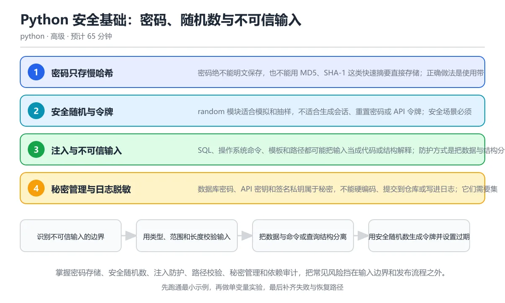

# Python 安全基础：密码、随机数与不可信输入

> 内容更新时间：2026-10-06 · 学习阶段：高级 · 预计用时：40 分钟

分类：python。关键词：密码哈希、secrets、注入、路径穿越、依赖审计。掌握密码存储、安全随机数、注入防护、路径校验、秘密管理和依赖审计，把常见风险挡在输入边界和发布流程之外。

学习建议：先通读《Python 安全基础：密码、随机数与不可信输入》的核心知识与关键流程，再运行可运行练习并完成测验；遇到不确定的结论，回到「故障现场」按症状、根因、修复、验证四步核对。



## 学习目标

- 能用慢哈希与盐正确存储和验证密码。
- 能区分伪随机数与密码学安全随机数，并安全管理令牌。
- 能识别 SQL 注入、命令注入、路径穿越和不安全反序列化风险。

## 前置知识

- 会用 hashlib、os、subprocess 等标准库模块。
- 理解函数边界与异常处理。
- 知道用户输入不能直接信任。

## 核心知识

### 1. 密码只存慢哈希

密码绝不能明文保存，也不能用 MD5、SHA-1 这类快速摘要直接存储；正确做法是使用带盐的慢哈希算法并支持参数升级。

盐让相同密码得到不同哈希，慢哈希通过计算成本抵抗离线暴力破解；验证时用恒定时间比较，避免根据耗时泄露信息。

在Python 安全基础：密码、随机数与不可信输入里可以这样验证：用标准库 scrypt 生成盐和哈希，再分别验证正确密码与错误密码。

边界：哈希不是加密，无法还原原文；算法参数要随硬件发展提升，升级时可在用户下次登录成功后重新计算。

工程视角：密码字段永不进入日志，验证失败统一返回模糊错误，数据库泄露时攻击者仍需为每个密码付出高成本。

### 2. 安全随机与令牌

random 模块适合模拟和抽样，不适合生成会话、重置密码或 API 令牌；安全场景必须使用 secrets。

secrets 从操作系统提供的密码学安全随机源取数，token_urlsafe 生成 URL 安全的随机文本；令牌要设置足够位数、有效期和一次性使用规则。

在Python 安全基础：密码、随机数与不可信输入里可以这样验证：生成一个 32 字节的 URL 安全令牌并打印长度，再比较 random 与 secrets 的用途。

边界：令牌强度不足或有效期过长都会增加被猜中风险；令牌泄露后要能撤销，不能只依赖随机性。

工程视角：令牌只在创建时返回一次，数据库保存哈希，日志只记录前缀与标识，定期轮换并提供撤销能力。

### 3. 注入与不可信输入

SQL、操作系统命令、模板和路径都可能把输入当成代码或结构解释；防护方式是把数据与结构分离，或使用严格白名单。

数据库使用绑定参数，subprocess 使用参数列表并保持 shell=False，模板启用自动转义，路径用 resolve 后检查是否仍在允许根目录内。

在Python 安全基础：密码、随机数与不可信输入里可以这样验证：把用户输入作为 subprocess 参数传给程序，再对比 shell=True 拼接时的命令注入风险。

边界：白名单也必须有类型与长度上限；文件名要做规范化，拒绝上跳片段、保留设备和超长路径。

工程视角：所有输入在边界统一校验，执行子进程使用最小权限和超时，危险操作记录审计日志而不是只写调试输出。

### 4. 秘密管理与日志脱敏

数据库密码、API 密钥和签名私钥属于秘密，不能硬编码、提交到仓库或写进日志；它们需要集中管理、最小权限和轮换。

本地开发通过环境变量或未提交的配置注入，生产环境使用密钥管理服务；代码只通过配置对象读取，日志中间件对敏感字段做统一脱敏。

在Python 安全基础：密码、随机数与不可信输入里可以这样验证：从环境变量读取密钥，缺失时立即失败；构造日志时只输出密钥名称与哈希前缀。

边界：环境变量也可能通过进程列表或崩溃转储泄露，高价值秘密优先使用专用服务与短期凭据。

工程视角：秘密有所有者和轮换周期，仓库启用秘密扫描，部署流水线使用最小权限身份。

### 5. 依赖与供应链安全

项目依赖的第三方包也是攻击面；锁定版本、审计漏洞、限制安装来源和权限可以降低供应链风险。

锁文件固定解析结果，依赖审计工具比对已知漏洞数据库，静态分析工具发现危险调用模式，最小化容器镜像减少可利用组件。

在Python 安全基础：密码、随机数与不可信输入里可以这样验证：运行依赖审计并查看报告，再把直接依赖与间接依赖的数量列出来评估维护成本。

边界：升级依赖可能引入破坏性变更，需要测试和分批发布；没有漏洞报告不代表包的行为一定可信。

工程视角：CI 中执行依赖审计与静态检查，生产环境只安装锁定依赖，关键服务对新增依赖做人工评审。

## 关键流程

```text
识别不可信输入的边界 → 用类型、范围和长度校验输入 → 把数据与命令或查询结构分离 → 用安全随机数生成令牌并设置过期 → 对依赖和秘密做持续审计
```

1. 识别不可信输入的边界
2. 用类型、范围和长度校验输入
3. 把数据与命令或查询结构分离
4. 用安全随机数生成令牌并设置过期
5. 对依赖和秘密做持续审计

## 动手练习

1. 实现密码注册与验证流程，保存盐、算法参数和摘要，并测试错误密码和空密码。
2. 用字符串拼接与参数列表分别执行一个外部命令，记录两者对特殊字符输入的行为差异。
3. 写一个安全的文件读取函数，只允许访问指定目录下的白名单扩展名并限制大小。
4. 为项目运行一次依赖漏洞审计，列出高风险依赖与升级或替代方案。

**验收标准**：留下输入、命令、输出和结论，能让别人按记录复现。

## 常见错误与排查

> 说明：本表由《Python 安全基础：密码、随机数与不可信输入》的核心知识整理（2026-10-06），人工复核进度见 docs/content_review_batches.md。

| 易错点 | 容易踩的做法 | 正确结论 |
| --- | --- | --- |
| 用 random 生成安全令牌 | 用 random.choice 拼接会话令牌，随机源可预测且不适合安全场景 | 改用 secrets.token_urlsafe 或 token_bytes 生成密码学安全随机值 |
| 用快速摘要存密码 | 直接存 md5(password) 或 sha1(password)，离线暴力破解速度极快 | 使用 scrypt、bcrypt 或 argon2 等带盐慢哈希，并设置合理成本参数 |
| 拼接命令执行用户输入 | subprocess.run('ping ' + host, shell=True)，输入可以注入额外命令 | 使用参数列表与 shell=False，并对主机名做白名单和格式校验 |
| 直接加载不可信序列化数据 | 用 pickle.loads 或 yaml.load 处理外部上传内容，可能执行任意代码 | 优先使用 JSON 等安全格式，YAML 使用 safe_load，绝不反序列化不可信 pickle |

## 可运行练习

### 任务 1：先跑通，再解释

```python
import hashlib
import hmac
import secrets

def hash_password(password: str, salt: bytes | None = None) -> tuple[bytes, bytes]:
    salt = salt or secrets.token_bytes(16)
    digest = hashlib.scrypt(password.encode("utf-8"), salt=salt, n=2**14, r=8, p=1)
    return salt, digest

def verify_password(password: str, salt: bytes, expected: bytes) -> bool:
    candidate = hashlib.scrypt(password.encode("utf-8"), salt=salt, n=2**14, r=8, p=1)
    return hmac.compare_digest(candidate, expected)

salt, stored = hash_password("correct horse battery staple")
print("正确密码:", verify_password("correct horse battery staple", salt, stored))
print("错误密码:", verify_password("wrong password", salt, stored))

token = secrets.token_urlsafe(32)
print("令牌长度足够:", len(token) >= 32)
print("令牌只返回一次:", token != secrets.token_urlsafe(32))
```

脚本用 scrypt 和随机盐派生密码哈希，验证时重新计算并用恒定时间比较，避免普通等于比较可能带来的时序差异；secrets 生成 URL 安全令牌，展示安全随机源的用途。真实系统还应把算法参数、盐和哈希一起持久化，并提供参数升级流程。

### 任务 2：只改一个条件

复制上面的示例，只改一个输入或参数再跑一次；先写下预测，再和真实输出对照，并说明差异来自Python 安全基础：密码、随机数与不可信输入的哪条机制。

### 任务 3：迁移到自己的数据

把《Python 安全基础：密码、随机数与不可信输入》里的示例换成你自己的一小段数据或场景，保持结构不变；如果换不动，说明还有哪条前提没有理解，回到核心知识对应小节。

## 故障现场

### 现场 1：用 random 生成安全令牌

**症状**：在《Python 安全基础：密码、随机数与不可信输入》里采用「用 random.choice 拼接会话令牌，随机源可预测且不适合安全场景」时，用 random 生成安全令牌会表现为错误结果、异常中断或状态不一致。

**根因**：这个做法没有执行与「用 random 生成安全令牌」对应的检查，问题被带到了后续步骤。

**修复**：改用 secrets.token_urlsafe 或 token_bytes 生成密码学安全随机值

**验证**：为「用 random 生成安全令牌」准备一个最小输入，确认修复前的失败可以复现，修复后的输出与本课示例一致，再补一个边界输入。

### 现场 2：用快速摘要存密码

**症状**：在《Python 安全基础：密码、随机数与不可信输入》里采用「直接存 md5(password) 或 sha1(password)，离线暴力破解速度极快」时，用快速摘要存密码会表现为错误结果、异常中断或状态不一致。

**根因**：这个做法没有执行与「用快速摘要存密码」对应的检查，问题被带到了后续步骤。

**修复**：使用 scrypt、bcrypt 或 argon2 等带盐慢哈希，并设置合理成本参数

**验证**：为「用快速摘要存密码」准备一个最小输入，确认修复前的失败可以复现，修复后的输出与本课示例一致，再补一个边界输入。

### 现场 3：拼接命令执行用户输入

**症状**：在《Python 安全基础：密码、随机数与不可信输入》里采用「subprocess.run('ping ' + host, shell=True)，输入可以注入额外命令」时，拼接命令执行用户输入会表现为错误结果、异常中断或状态不一致。

**根因**：这个做法没有执行与「拼接命令执行用户输入」对应的检查，问题被带到了后续步骤。

**修复**：使用参数列表与 shell=False，并对主机名做白名单和格式校验

**验证**：为「拼接命令执行用户输入」准备一个最小输入，确认修复前的失败可以复现，修复后的输出与本课示例一致，再补一个边界输入。

### 现场 4：直接加载不可信序列化数据

**症状**：在《Python 安全基础：密码、随机数与不可信输入》里采用「用 pickle.loads 或 yaml.load 处理外部上传内容，可能执行任意代码」时，直接加载不可信序列化数据会表现为错误结果、异常中断或状态不一致。

**根因**：这个做法没有执行与「直接加载不可信序列化数据」对应的检查，问题被带到了后续步骤。

**修复**：优先使用 JSON 等安全格式，YAML 使用 safe_load，绝不反序列化不可信 pickle

**验证**：为「直接加载不可信序列化数据」准备一个最小输入，确认修复前的失败可以复现，修复后的输出与本课示例一致，再补一个边界输入。

## 本课复习清单

离开本课前，逐项确认：

- [ ] 能说明盐和慢哈希各解决什么问题。
- [ ] 能识别 shell=True 与字符串拼接 SQL 的注入风险。
- [ ] 能解释日志中为什么不能出现完整秘密。
- [ ] 至少运行一次本课示例，记录输入、输出和一个边界情况。
- [ ] 把本课最容易混淆的两个概念写成一句话对照。

| 复盘项 | 记录 |
| --- | --- |
| 已经能独立解释的考点 |  |
| 仍然说不清的概念 |  |
| 下一步验证动作 |  |

## 复习与自测

### 核心知识

遮住正文回答：Python 安全基础：密码、随机数与不可信输入解决什么问题、依赖哪些前提、失败时先看哪个信号？三问都能答清楚，再进入下一节。

### 动手练习

把《Python 安全基础：密码、随机数与不可信输入》里「只改一个条件」的练习再做一遍，这次先写预测再运行；预测和结果不一致的地方，就是需要回读的章节。

### 最小可运行示例

```python
import hashlib
import hmac
import secrets

def hash_password(password: str, salt: bytes | None = None) -> tuple[bytes, bytes]:
    salt = salt or secrets.token_bytes(16)
    digest = hashlib.scrypt(password.encode("utf-8"), salt=salt, n=2**14, r=8, p=1)
    return salt, digest

def verify_password(password: str, salt: bytes, expected: bytes) -> bool:
    candidate = hashlib.scrypt(password.encode("utf-8"), salt=salt, n=2**14, r=8, p=1)
    return hmac.compare_digest(candidate, expected)

salt, stored = hash_password("correct horse battery staple")
print("正确密码:", verify_password("correct horse battery staple", salt, stored))
print("错误密码:", verify_password("wrong password", salt, stored))

token = secrets.token_urlsafe(32)
print("令牌长度足够:", len(token) >= 32)
print("令牌只返回一次:", token != secrets.token_urlsafe(32))
```

### 预期输出

```text
正确密码: True
错误密码: False
令牌长度足够: True
令牌只返回一次: True
```

### 验证步骤

1. 确认输入数据与运行环境和示例一致。
2. 运行示例，记录输出与耗时等可观测指标。
3. 换一个边界输入重跑，确认结论仍然成立。
4. 把两次结果写成一句话结论，注明前提与局限。

## 术语速查

先遮住右列，尝试用自己的话解释，再回到正文核对。

| 术语 | 一句话说明 |
| --- | --- |
| `盐` | 为每个密码单独生成的随机值，使相同密码得到不同哈希并阻止预计算攻击。 |
| `慢哈希` | 故意消耗较多计算资源的密码哈希算法，用于提高离线破解成本。 |
| `恒定时间比较` | 执行时间不随匹配前缀长度明显变化的比较方式，避免通过耗时泄露信息。 |
| `安全随机源` | 由操作系统提供、适合生成密钥和令牌的密码学安全随机数来源。 |
| `路径穿越` | 利用上跳目录片段访问允许范围之外文件的安全缺陷。 |
| `供应链安全` | 对第三方依赖、构建工具和发布流程进行审计与控制的安全实践。 |

## 考点精讲

### 考点 1：存储用户密码的正确方式是？

题型：概念判断。题干：存储用户密码的正确方式是？

判断要点：为每个密码生成随机盐并使用 scrypt 等慢哈希。慢哈希加随机盐能让相同密码得到不同摘要，并显著提高离线暴力破解成本；MD5 和 SHA-1 计算太快，加密如果把密钥和密文放在一起泄露后等于明文，明文存储则一次泄露就全量暴露。密码验证还应使用恒定时间比较并支持参数升级。 正确选项「为每个密码生成随机盐并使用 scrypt 等慢哈希」对应《Python 安全基础：密码、随机数与不可信输入》的要点「密码只存慢哈希」：密码绝不能明文保存，也不能用 MD5、SHA-1 这类快速摘要直接存储；正确做法是使用带盐的慢哈希算法并支持参数升级。判断「密码只存慢哈希」时先确认前提是否成立，再回到《Python 安全基础：密码、随机数与不可信输入》的示例核对一次；把别的语言或框架的默认做法直接搬到密码只存慢哈希上，往往会在本课的边界条件里失效。

### 考点 2：生成会话令牌应该使用哪个模块？

题型：概念判断。题干：生成会话令牌应该使用哪个模块？

判断要点：secrets。secrets 从操作系统密码学安全随机源取值，适合会话令牌、密钥和重置链接；random 的梅森旋转算法可预测，uuid1 还包含时间与节点信息。令牌还要具备足够长度、明确有效期、服务端可撤销，并且只在创建时返回一次。 正确选项「secrets」对应《Python 安全基础：密码、随机数与不可信输入》的要点「安全随机与令牌」：random 模块适合模拟和抽样，不适合生成会话、重置密码或 API 令牌；安全场景必须使用 secrets。判断「安全随机与令牌」时先确认前提是否成立，再回到《Python 安全基础：密码、随机数与不可信输入》的示例核对一次；借鉴相邻主题的经验之前，先核对安全随机与令牌的前提是否成立。

### 考点 3：以下哪些做法能降低注入风险？（多选）

题型：多选辨析。题干：以下哪些做法能降低注入风险？（多选）

判断要点：数据库使用绑定参数；subprocess 使用参数列表并保持 shell=False；对路径做规范化并检查允许根目录。绑定参数、参数列表和安全路径校验都把数据与结构分离；关闭模板自动转义会让用户输入被当成代码或标记执行，正是跨站脚本的常见来源。白名单、类型校验、长度限制和最小权限应同时使用。 正确选项「数据库使用绑定参数；subprocess 使用参数列表并保持 shell=False；对路径做规范化并检查允许根目录」对应《Python 安全基础：密码、随机数与不可信输入》的要点「注入与不可信输入」：SQL、操作系统命令、模板和路径都可能把输入当成代码或结构解释；防护方式是把数据与结构分离，或使用严格白名单。判断「注入与不可信输入」时先确认前提是否成立，再回到《Python 安全基础：密码、随机数与不可信输入》的示例核对一次；记住注入与不可信输入的结论之外还要记住适用条件，换一个输入往往就不成立了。

### 考点 4：阅读代码，正确密码与错误密码的输出分别是

题型：代码阅读。题干：阅读代码，正确密码与错误密码的输出分别是？

salt = secrets.token_bytes(16)
stored = hashlib.scrypt(b'secret', salt=salt, n=2**14, r=8, p=1)
print(verify('secret', salt, stored), verify('wrong', salt, stored))

判断要点：True False。相同密码和相同盐会得到相同派生值，因此正确密码验证为 True；错误密码得到不同派生值，结果为 False。验证函数应使用 hmac.compare_digest 等恒定时间比较，避免普通比较在极端情况下泄露信息，同时数据库需要保存盐、算法参数和摘要。 正确选项「True False」对应《Python 安全基础：密码、随机数与不可信输入》的要点「秘密管理与日志脱敏」：数据库密码、API 密钥和签名私钥属于秘密，不能硬编码、提交到仓库或写进日志；它们需要集中管理、最小权限和轮换。判断「秘密管理与日志脱敏」时先确认前提是否成立，再回到《Python 安全基础：密码、随机数与不可信输入》的示例核对一次；干扰项常常是相邻主题里成立的结论，只有按秘密管理与日志脱敏的输入与约束判断才能排除。

### 考点 5：下面依赖处理有什么风险？

题型：排错。题干：下面依赖处理有什么风险？

判断要点：shell=True 拼接用户输入存在命令注入，文件路径也缺少根目录限制。shell=True 会把整段字符串交给 shell 解释，文件名中的分号、管道或反引号可以执行额外命令；同时直接打开用户路径可能通过上跳片段访问任意文件。应使用参数列表、shell=False，并在允许根目录内规范化路径、限制扩展名和文件大小。这道题对应安全输入的信任边界：命令注入与路径穿越都要在执行前阻断。 正确选项「shell=True 拼接用户输入存在命令注入，文件路径也缺少根目录限制」对应《Python 安全基础：密码、随机数与不可信输入》的要点「依赖与供应链安全」：项目依赖的第三方包也是攻击面；锁定版本、审计漏洞、限制安装来源和权限可以降低供应链风险。判断「依赖与供应链安全」时先确认前提是否成立，再回到《Python 安全基础：密码、随机数与不可信输入》的示例核对一次；把依赖与供应链安全的做法换到别的约束下未必成立，先确认边界再决定答案。

## English Overview

Python Security Foundations: Passwords, Randomness and Untrusted Input

This lesson covers Python security fundamentals: salted password hashing, constant-time verification, cryptographically secure randomness, injection and path-traversal defense, secret management, log redaction, and dependency auditing in CI.

## 本课小结

- Python 安全基础：密码、随机数与不可信输入围绕密码哈希、secrets、注入展开，先建立基线再讨论优化。
- 密码绝不能明文保存，也不能用 MD5、SHA-1 这类快速摘要直接存储；正确做法是使用带盐的慢哈希算法并支持参数升级。
- 遇到问题时按「症状 → 根因 → 修复 → 验证」的顺序处理，不跳过验证。

## 内容元数据

- 内容版本：v2.0
- 最后更新：2026-10-06
- 学习阶段：高级

| 字段 | 值 |
| --- | --- |
| 课程 ID | `python_security` |
| 所属分类 | `python` |
| 难度 | 高级 |
| 预计用时 | 65 分钟 |
| 关键词 | 密码哈希、secrets、注入、路径穿越、依赖审计 |
| 配图 | `images/lesson_python_security.webp` |
| 参考资料 | 4 条 |
| 内容更新时间 | 2026-10-06 |

## 参考资料与复核

- 最后复核：2026-10-04
- 下次复核：2026-12-10
- 复核范围：版本兼容、API 行为与工程实践

下面列出的资料用于核对本课结论，复习时可以对照阅读：
- [OWASP 密码存储备忘单](https://cheatsheetseries.owasp.org/cheatsheets/Password_Storage_Cheat_Sheet.html)
- [Python secrets 文档](https://docs.python.org/3/library/secrets.html)
- [Python hashlib 文档](https://docs.python.org/3/library/hashlib.html)
- [Bandit 静态安全分析](https://bandit.readthedocs.io/)

> 复核提示：《Python 安全基础：密码、随机数与不可信输入》的结论如与资料冲突，以资料中的规范文本为准，并在笔记里记录差异与日期。

## 复习与迁移

### 概念复述

不看正文，把Python 安全基础：密码、随机数与不可信输入讲给一个没学过的同事：先讲它解决什么问题，再讲一个最小例子，最后说明一个不适用场景。

### 测验回顾

回到《Python 安全基础：密码、随机数与不可信输入》测验，只重做答错或犹豫的题；对每道题写一句「我为什么改选这个答案」，写不出理由就回到对应小节。

### 迁移练习

把《Python 安全基础：密码、随机数与不可信输入》的方法用到一个你自己的真实场景：说明输入、约束与验证方式，并列出仍然不确定、需要下一次实验回答的问题。

## 深度拓展与实战

这一节把Python 安全基础：密码、随机数与不可信输入的机制拆开验证：每一步都给出输入、判断标准和失败信号，便于在真实项目里复用。

### 机制拆解 1：密码只存慢哈希

盐让相同密码得到不同哈希，慢哈希通过计算成本抵抗离线暴力破解；验证时用恒定时间比较，避免根据耗时泄露信息。

落地时先确认前提：哈希不是加密，无法还原原文；算法参数要随硬件发展提升，升级时可在用户下次登录成功后重新计算。；再把结论写进检查表，让下一位同学可以按同样的输入复现。

工程做法：密码字段永不进入日志，验证失败统一返回模糊错误，数据库泄露时攻击者仍需为每个密码付出高成本。

### 机制拆解 2：安全随机与令牌

secrets 从操作系统提供的密码学安全随机源取数，token_urlsafe 生成 URL 安全的随机文本；令牌要设置足够位数、有效期和一次性使用规则。

落地时先确认前提：令牌强度不足或有效期过长都会增加被猜中风险；令牌泄露后要能撤销，不能只依赖随机性。；再把结论写进检查表，让下一位同学可以按同样的输入复现。

工程做法：令牌只在创建时返回一次，数据库保存哈希，日志只记录前缀与标识，定期轮换并提供撤销能力。

### 机制拆解 3：注入与不可信输入

数据库使用绑定参数，subprocess 使用参数列表并保持 shell=False，模板启用自动转义，路径用 resolve 后检查是否仍在允许根目录内。

落地时先确认前提：白名单也必须有类型与长度上限；文件名要做规范化，拒绝上跳片段、保留设备和超长路径。；再把结论写进检查表，让下一位同学可以按同样的输入复现。

工程做法：所有输入在边界统一校验，执行子进程使用最小权限和超时，危险操作记录审计日志而不是只写调试输出。

### 机制拆解 4：秘密管理与日志脱敏

本地开发通过环境变量或未提交的配置注入，生产环境使用密钥管理服务；代码只通过配置对象读取，日志中间件对敏感字段做统一脱敏。

落地时先确认前提：环境变量也可能通过进程列表或崩溃转储泄露，高价值秘密优先使用专用服务与短期凭据。；再把结论写进检查表，让下一位同学可以按同样的输入复现。

工程做法：秘密有所有者和轮换周期，仓库启用秘密扫描，部署流水线使用最小权限身份。

### 机制拆解 5：依赖与供应链安全

锁文件固定解析结果，依赖审计工具比对已知漏洞数据库，静态分析工具发现危险调用模式，最小化容器镜像减少可利用组件。

落地时先确认前提：升级依赖可能引入破坏性变更，需要测试和分批发布；没有漏洞报告不代表包的行为一定可信。；再把结论写进检查表，让下一位同学可以按同样的输入复现。

工程做法：CI 中执行依赖审计与静态检查，生产环境只安装锁定依赖，关键服务对新增依赖做人工评审。

### 机制对照表

| 概念 | 解决什么问题 | 关键前提 | 失败信号 |
| --- | --- | --- | --- |
| 密码只存慢哈希 | 密码绝不能明文保存，也不能用 MD5、SHA-1 这类快速摘要直接存储；正确做法 | 哈希不是加密，无法还原原文；算法参数要随硬件发展提升，升级时可在用户下次 | 密码字段永不进入日志，验证失败统一返回模糊错误，数据库泄露时攻击者仍需为 |
| 安全随机与令牌 | random 模块适合模拟和抽样，不适合生成会话、重置密码或 API 令牌；安全 | 令牌强度不足或有效期过长都会增加被猜中风险；令牌泄露后要能撤销，不能只依 | 令牌只在创建时返回一次，数据库保存哈希，日志只记录前缀与标识，定期轮换并 |
| 注入与不可信输入 | SQL、操作系统命令、模板和路径都可能把输入当成代码或结构解释；防护方式是把数据 | 白名单也必须有类型与长度上限；文件名要做规范化，拒绝上跳片段、保留设备和 | 所有输入在边界统一校验，执行子进程使用最小权限和超时，危险操作记录审计日 |
| 秘密管理与日志脱敏 | 数据库密码、API 密钥和签名私钥属于秘密，不能硬编码、提交到仓库或写进日志；它 | 环境变量也可能通过进程列表或崩溃转储泄露，高价值秘密优先使用专用服务与短 | 秘密有所有者和轮换周期，仓库启用秘密扫描，部署流水线使用最小权限身份。 |
| 依赖与供应链安全 | 项目依赖的第三方包也是攻击面；锁定版本、审计漏洞、限制安装来源和权限可以降低供应 | 升级依赖可能引入破坏性变更，需要测试和分批发布；没有漏洞报告不代表包的行 | CI 中执行依赖审计与静态检查，生产环境只安装锁定依赖，关键服务对新增依 |

### 自测问答

**问 1**：存储用户密码的正确方式是？

**答**：为每个密码生成随机盐并使用 scrypt 等慢哈希。慢哈希加随机盐能让相同密码得到不同摘要，并显著提高离线暴力破解成本；MD5 和 SHA-1 计算太快，加密如果把密钥和密文放在一起泄露后等于明文，明文存储则一次泄露就全量暴露。密码验证还应使用恒定时间比较并支持参数升级。 正确选项「为每个密码生成随机盐并使用 scrypt 等慢哈希」对应《Python 安全基础：密码、随机数与不可信输入》的要点「密码只存慢哈希」：密码绝不能明文保存，也不能用 MD5、SHA-1 这类快速摘要直接存储；正确做法是使用带盐的慢哈希算法并支持参数升级。判断「密码只存慢哈希」时先确认前提是否成立，再回到《Python 安全基础：密码、随机数与不可信输入》的示例核对一次；把别的语言或框架的默认做法直接搬到密码只存慢哈希上，往往会在本课的边界条件里失效。

**问 2**：生成会话令牌应该使用哪个模块？

**答**：secrets。secrets 从操作系统密码学安全随机源取值，适合会话令牌、密钥和重置链接；random 的梅森旋转算法可预测，uuid1 还包含时间与节点信息。令牌还要具备足够长度、明确有效期、服务端可撤销，并且只在创建时返回一次。 正确选项「secrets」对应《Python 安全基础：密码、随机数与不可信输入》的要点「安全随机与令牌」：random 模块适合模拟和抽样，不适合生成会话、重置密码或 API 令牌；安全场景必须使用 secrets。判断「安全随机与令牌」时先确认前提是否成立，再回到《Python 安全基础：密码、随机数与不可信输入》的示例核对一次；借鉴相邻主题的经验之前，先核对安全随机与令牌的前提是否成立。

**问 3**：以下哪些做法能降低注入风险？（多选）

**答**：数据库使用绑定参数；subprocess 使用参数列表并保持 shell=False；对路径做规范化并检查允许根目录。绑定参数、参数列表和安全路径校验都把数据与结构分离；关闭模板自动转义会让用户输入被当成代码或标记执行，正是跨站脚本的常见来源。白名单、类型校验、长度限制和最小权限应同时使用。 正确选项「数据库使用绑定参数；subprocess 使用参数列表并保持 shell=False；对路径做规范化并检查允许根目录」对应《Python 安全基础：密码、随机数与不可信输入》的要点「注入与不可信输入」：SQL、操作系统命令、模板和路径都可能把输入当成代码或结构解释；防护方式是把数据与结构分离，或使用严格白名单。判断「注入与不可信输入」时先确认前提是否成立，再回到《Python 安全基础：密码、随机数与不可信输入》的示例核对一次；记住注入与不可信输入的结论之外还要记住适用条件，换一个输入往往就不成立了。

**问 4**：阅读代码，正确密码与错误密码的输出分别是？

salt = secrets.token_bytes(16)
stored = hashlib.scrypt(b'secret', salt=salt, n=2**14, r=8, p=1)
print(verify('secret', salt, stored), verify('wrong', salt, stored))

**答**：True False。相同密码和相同盐会得到相同派生值，因此正确密码验证为 True；错误密码得到不同派生值，结果为 False。验证函数应使用 hmac.compare_digest 等恒定时间比较，避免普通比较在极端情况下泄露信息，同时数据库需要保存盐、算法参数和摘要。 正确选项「True False」对应《Python 安全基础：密码、随机数与不可信输入》的要点「秘密管理与日志脱敏」：数据库密码、API 密钥和签名私钥属于秘密，不能硬编码、提交到仓库或写进日志；它们需要集中管理、最小权限和轮换。判断「秘密管理与日志脱敏」时先确认前提是否成立，再回到《Python 安全基础：密码、随机数与不可信输入》的示例核对一次；干扰项常常是相邻主题里成立的结论，只有按秘密管理与日志脱敏的输入与约束判断才能排除。

**问 5**：下面依赖处理有什么风险？

**答**：shell=True 拼接用户输入存在命令注入，文件路径也缺少根目录限制。shell=True 会把整段字符串交给 shell 解释，文件名中的分号、管道或反引号可以执行额外命令；同时直接打开用户路径可能通过上跳片段访问任意文件。应使用参数列表、shell=False，并在允许根目录内规范化路径、限制扩展名和文件大小。这道题对应安全输入的信任边界：命令注入与路径穿越都要在执行前阻断。 正确选项「shell=True 拼接用户输入存在命令注入，文件路径也缺少根目录限制」对应《Python 安全基础：密码、随机数与不可信输入》的要点「依赖与供应链安全」：项目依赖的第三方包也是攻击面；锁定版本、审计漏洞、限制安装来源和权限可以降低供应链风险。判断「依赖与供应链安全」时先确认前提是否成立，再回到《Python 安全基础：密码、随机数与不可信输入》的示例核对一次；把依赖与供应链安全的做法换到别的约束下未必成立，先确认边界再决定答案。

### 排错速查

- 看到「用 random.choice 拼接会话令牌，随机源可预测且不适合安全场景」时，先按「改用 secrets.token_urlsafe 或 token_bytes 生成密码学安全随机值」处理，再用Python 安全基础：密码、随机数与不可信输入的最小示例确认结论是否恢复。
- 看到「直接存 md5(password) 或 sha1(password)，离线暴力破解速度极快」时，先按「使用 scrypt、bcrypt 或 argon2 等带盐慢哈希，并设置合理成本参数」处理，再用Python 安全基础：密码、随机数与不可信输入的最小示例确认结论是否恢复。
- 看到「subprocess.run('ping ' + host, shell=True)，输入可以注入额外命令」时，先按「使用参数列表与 shell=False，并对主机名做白名单和格式校验」处理，再用Python 安全基础：密码、随机数与不可信输入的最小示例确认结论是否恢复。
- 看到「用 pickle.loads 或 yaml.load 处理外部上传内容，可能执行任意代码」时，先按「优先使用 JSON 等安全格式，YAML 使用 safe_load，绝不反序列化不可信 pickle」处理，再用Python 安全基础：密码、随机数与不可信输入的最小示例确认结论是否恢复。

### 工程检查表

- [ ] 识别不可信输入的边界
- [ ] 用类型、范围和长度校验输入
- [ ] 把数据与命令或查询结构分离
- [ ] 用安全随机数生成令牌并设置过期
- [ ] 对依赖和秘密做持续审计
- [ ] 【密码只存慢哈希】密码字段永不进入日志，验证失败统一返回模糊错误，数据库泄露时攻击者仍需为每个密码付出高成本。
- [ ] 【安全随机与令牌】令牌只在创建时返回一次，数据库保存哈希，日志只记录前缀与标识，定期轮换并提供撤销能力。
- [ ] 【注入与不可信输入】所有输入在边界统一校验，执行子进程使用最小权限和超时，危险操作记录审计日志而不是只写调试输出。
- [ ] 【秘密管理与日志脱敏】秘密有所有者和轮换周期，仓库启用秘密扫描，部署流水线使用最小权限身份。
- [ ] 【依赖与供应链安全】CI 中执行依赖审计与静态检查，生产环境只安装锁定依赖，关键服务对新增依赖做人工评审。

### 迁移练习

把Python 安全基础：密码、随机数与不可信输入的方法用到一个真实场景：写下密码哈希、secrets、注入在你的场景里分别对应什么，再记录一次失败尝试和它的恢复步骤。

### 延伸阅读与下一步

- 复习密码哈希、secrets、注入、路径穿越、依赖审计时，优先回看「密码只存慢哈希」与「依赖与供应链安全」两节。
- 把从「识别不可信输入的边界」到「对依赖和秘密做持续审计」的流程画成一张图，放进自己的笔记。
- 一周后重做本课测验，只把答错的题留到下一轮复习。

### 结论与下一步

学完Python 安全基础：密码、随机数与不可信输入，应该能独立完成三件事：先用最小示例确认密码哈希的行为，再用一个边界输入验证结论，最后把失败路径写成可重复的检查。下一步把本课术语加入复习清单，并在两周内用一次真实任务检验记忆是否牢固。
