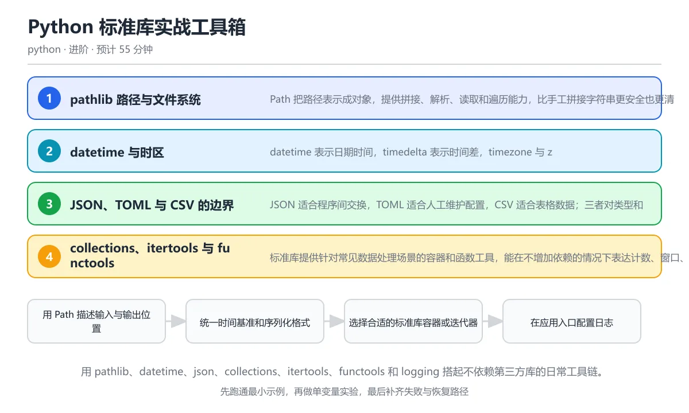

# Python 标准库实战工具箱

> 内容更新时间：2026-10-06 · 学习阶段：进阶 · 预计用时：60 分钟

分类：python。关键词：pathlib、datetime、json、collections、logging。用 pathlib、datetime、json、collections、itertools、functools 和 logging 搭起不依赖第三方库的日常工具链。

学习建议：先通读《Python 标准库实战工具箱》的核心知识与关键流程，再运行可运行练习并完成测验；遇到不确定的结论，回到「故障现场」按症状、根因、修复、验证四步核对。



## 本节知识框架

**课程定位**：所属分类为「Python」，课程主题为「Python 标准库实战工具箱」，学习阶段为「进阶」，建议用时 60 分钟。

**本课要解决的主问题**：用 pathlib、datetime、json、collections、itertools、functools 和 logging 搭起不依赖第三方库的日常工具链。

| 学习层次 | 要回答的问题 | 完成判据 |
| --- | --- | --- |
| 概念层 | 「Python 标准库实战工具箱」有哪些必须区分的对象与术语？ | 能用自己的话定义核心术语，并各举一个正例和一个反例。 |
| 机制层 | 这些对象按什么顺序发生作用，输入如何变成输出？ | 能画出或写出机制步骤，并说明每一步的失败条件。 |
| 应用层 | 什么场景适合使用「Python 标准库实战工具箱」，什么场景不适合？ | 能给出一个真实场景、一个最小示例和一个边界案例。 |
| 性能层 | 时间、空间、吞吐或延迟受哪些量影响？ | 能说出复杂度或性能瓶颈的证据来源；没有证据时明确写“材料未提供”。 |
| 复习层 | 怎样确认自己不是只记住了结论？ | 能独立完成本课自测，并把错误定位到概念、机制、示例或边界。 |

### 阅读路线

1. 先读「核心概念定义」，建立「pathlib」等对象的精确定义。
2. 再读「原理与运行机制」，把定义串成可重复的过程。
3. 用「代码/协议/SQL 示例」验证过程，并只改一个条件观察结果变化。
4. 最后检查性能、易错点、知识关系与自测题，形成可复习的证据链。

**前置知识**：《模块、包与虚拟环境》

**学习位置**：本课位于《Python 面向对象进阶：继承、组合与魔术方法》之后；如果前一课的自测不能通过，应先回补再继续。

**后续衔接**：下一课《Python 异常、日志与文件 I/O 进阶》会继续使用本课术语，学完后建议立即完成一次自测。

**教材衔接：学习目标**

- 能用 pathlib 写出跨平台的文件与目录操作。
- 能正确区分时间点、时区和时长，并安全序列化。
- 能为数据处理选择标准库中的容器、迭代器与日志工具。

**教材衔接：前置知识**

- 会导入模块并使用 from ... import 语法。
- 理解列表、字典和生成器的基本用法。
- 能用 try/except 处理文件不存在等常见异常。

**教材衔接：本课小结**

- Python 标准库实战工具箱围绕pathlib、datetime、json展开，先建立基线再讨论优化。
- Path 把路径表示成对象，提供拼接、解析、读取和遍历能力，比手工拼接字符串更安全也更清晰。
- 遇到问题时按「症状 → 根因 → 修复 → 验证」的顺序处理，不跳过验证。

## 核心概念定义

> 阅读约定：本课先给「Python 标准库实战工具箱」相关术语的操作性定义与适用边界；正文里的口语化说法与定义冲突时，以定义和可复现示例为准。

| 术语 | 操作性定义 | 本课中的边界 |
| --- | --- | --- |
| Path | pathlib 提供的路径对象，可跨平台完成拼接、解析与文件读写。 | 仅在「Python 标准库实战工具箱」明确给出的输入、版本与资源条件下成立。 |
| aware datetime | 携带时区信息且能定位到绝对时间点的 datetime 对象。 | 仅在「Python 标准库实战工具箱」明确给出的输入、版本与资源条件下成立。 |
| 序列化 | 把内存对象转换成可存储或传输格式，并在需要时反向还原的过程。 | 仅在「Python 标准库实战工具箱」明确给出的输入、版本与资源条件下成立。 |
| deque | 支持两端常数时间追加和弹出的双端队列，可设置最大长度形成滑动窗口。 | 仅在「Python 标准库实战工具箱」明确给出的输入、版本与资源条件下成立。 |
| lru_cache | 按最近最少使用策略缓存函数结果的装饰器，适合参数可哈希的纯函数。 | 仅在「Python 标准库实战工具箱」明确给出的输入、版本与资源条件下成立。 |
| logger 层级 | 按点分名称组织的日志记录器树，事件会向父记录器传播。 | 仅在「Python 标准库实战工具箱」明确给出的输入、版本与资源条件下成立。 |

### 定义如何使用

在「Python 标准库实战工具箱」中判断一个说法是否成立，先确认它使用的是哪个对象的定义，再检查输入规模、运行环境与失败路径。定义不是口号，而是后续推导、代码示例和自测题共享的约束。

## 原理与运行机制

### 机制总览

1. **建立输入**：把「Path」按本课定义整理成可观察、可重复的输入条件。
2. **执行转换**：围绕「aware datetime」执行本课的核心步骤；每一步都记录中间状态，避免只看最终输出。
3. **产生输出**：得到「序列化」后，用正文示例或协议/SQL 结果核对输出是否符合预期。
4. **改变一个条件**：只替换一个边界条件或环境参数，观察「Python 标准库实战工具箱」的结论是否仍然成立。

| 阶段 | 关注对象 | 失败时应检查 |
| --- | --- | --- |
| 输入 | Path | 类型、范围、编码、版本或前置状态是否满足定义。 |
| 处理 | aware datetime | 顺序、可见性、锁、路由、事务或调度规则是否被破坏。 |
| 输出 | 序列化 | 结果是否可复现，错误是否被正确传播而不是被吞掉。 |

本课的机制结论要用「Python 标准库实战工具箱」自己的示例验证。「Python 标准库实战工具箱」没有给出某个数量级、吞吐或内存数据时，本课把该判断标为“材料未提供”，不从相邻主题外推。

**教材衔接：核心知识**

### 1. pathlib 路径与文件系统

Path 把路径表示成对象，提供拼接、解析、读取和遍历能力，比手工拼接字符串更安全也更清晰。

斜杠运算符连接路径片段，resolve 计算绝对路径，glob 按模式匹配，read_text 与 write_text 封装文本读写；不同操作系统会自动使用正确的路径分隔符。

在Python 标准库实战工具箱里可以这样验证：在临时目录创建一份 JSON 报告，再用路径对象的 name、suffix 和 read_text 读取它。

边界：用户提供的相对路径可能包含上跳片段，用于访问受限目录前必须做规范化与根目录检查。

工程视角：路径只在程序边界转换成字符串，内部始终使用 Path；目录创建、编码指定和异常处理写在同一个模块里。

### 2. datetime 与时区

datetime 表示日期时间，timedelta 表示时间差，timezone 与 zoneinfo 提供时区信息；带时区的时间叫 aware，不带时区的叫 naive。

时间戳是从某个纪元起经过的秒数，绝对时间点应带时区；aware 与 naive 直接比较会抛 TypeError，跨时区展示时先统一到 UTC 再按目标时区转换。

在Python 标准库实战工具箱里可以这样验证：创建一个东八区时间并输出 ISO 8601 文本，再用 timedelta 计算三天后的同一时刻。

边界：夏令时切换会让本地时间出现重复或缺失，定时任务应保存 UTC 时间点并携带原始时区标识。

工程视角：数据库统一存 UTC，日志使用带偏移量的 ISO 格式，展示层才转换成本地时间并标注时区。

### 3. JSON、TOML 与 CSV 的边界

JSON 适合程序间交换，TOML 适合人工维护配置，CSV 适合表格数据；三者对类型和转义的支持不同，不能互相假设。

json.dumps 默认把非 ASCII 转义并把日期当成不支持对象，loads 只接受合法 JSON；tomllib 只负责读取，CSV 的字段始终是字符串，需要显式转换类型。

在Python 标准库实战工具箱里可以这样验证：把字典写成 UTF-8 JSON 文件再读回，给 datetime 提供 default 转换函数，避免序列化失败。

边界：JSON 没有日期、集合和二进制类型；CSV 没有类型信息；永远不要用 pickle 解析来自不可信来源的数据。

工程视角：为配置文件写版本号和默认值，序列化层集中处理类型转换，并对读写做往返测试。

### 4. collections、itertools 与 functools

标准库提供针对常见数据处理场景的容器和函数工具，能在不增加依赖的情况下表达计数、窗口、惰性迭代和缓存。

Counter 统计频率，deque 支持固定长度窗口，defaultdict 自动提供默认容器；itertools 通过生成器惰性组合序列；functools.lru_cache 按参数缓存纯函数结果。

在Python 标准库实战工具箱里可以这样验证：用 deque 维护最近三条记录，用 Counter 统计词频，再用 islice 只取生成器的前两项。

边界：lru_cache 要求参数可哈希且函数不能有副作用，缓存会占用内存；deque 的随机访问比列表慢，选型要看访问模式。

工程视角：把常用容器封装进领域函数，缓存大小显式设置，数据规模变化时用真实基准决定是否换实现。

### 5. logging 与诊断信息

logging 按级别和来源记录事件，支持格式化、轮转和多目标输出，比随处 print 更容易在真实环境定位问题。

logger 形成层级树，事件沿层级传播到 handler；formatter 决定文本布局，级别过滤在记录端和处理端都可能发生；exc_info 会把异常回溯一起写入日志。

在Python 标准库实战工具箱里可以这样验证：配置一个带时间、级别和模块名的日志格式，记录正常事件与一次捕获到的异常，观察回溯是否被保留。

边界：日志不能包含密码、令牌和完整个人信息；在库代码里调用 basicConfig 会污染宿主应用的配置。

工程视角：应用入口统一配置日志，库模块只获取 logger；结构化字段使用 extra 或 JSON 格式，关键事件保留请求标识便于串联。

**教材衔接：关键流程**

```text
用 Path 描述输入与输出位置 → 统一时间基准和序列化格式 → 选择合适的标准库容器或迭代器 → 在应用入口配置日志 → 为读写和边界输入补测试
```

1. 用 Path 描述输入与输出位置
2. 统一时间基准和序列化格式
3. 选择合适的标准库容器或迭代器
4. 在应用入口配置日志
5. 为读写和边界输入补测试

## 典型应用场景

| 场景 | 典型输入或前提 | 期望产物 |
| --- | --- | --- |
| 学习验证 | 使用本课最小示例和 pathlib、datetime | 能复现正文结论，并解释每一步。 |
| 工程落地 | 把「Python 标准库实战工具箱」放入真实模块或服务边界 | 输出可观测、失败可定位、参数可配置。 |
| 故障排查 | 只改一个版本、规模、输入或依赖条件 | 能区分概念错误、实现错误和环境差异。 |

判断「Python 标准库实战工具箱」的场景是否成立，标准是能否写出输入、处理、输出和失败路径；材料中没有出现的数据在本课标注为“材料未提供”，不用推测替代证据。

**课程内置实验入口**：`sandbox:python`，用于动手验证《Python 标准库实战工具箱》的机制；实验结论不替代概念定义与复杂度分析。

**教材衔接：项目专属规格**

### 交付目标

用 pathlib、datetime、json、collections、itertools、functools 和 logging 搭起不依赖第三方库的日常工具链。

### 里程碑

1. 用 Path 描述输入与输出位置
2. 统一时间基准和序列化格式
3. 选择合适的标准库容器或迭代器
4. 在应用入口配置日志
5. 为读写和边界输入补测试

### 输入与约束

- 输入：写一个目录巡检脚本，用 pathlib 统计指定目录下各类扩展名的文件数量和总大小。
- 约束：用户提供的相对路径可能包含上跳片段，用于访问受限目录前必须做规范化与根目录检查。
- 失败预算：改用 Path(base) / name，让路径库处理平台差异

### 验收场景

1. 正常路径：跑通「可运行练习」里的最小示例并保存输出。
2. 边界路径：在临时目录创建一份 JSON 报告，再用路径对象的 name、suffix 和 read_text 读取它。
3. 失败路径：出现「写 base + '/' + name 处理文件路径，换到 Windows 后分隔符和转义都出问题」时按上面的失败预算恢复。

**教材衔接：项目交付物**

- 可运行代码：包含python源文件、依赖说明与启动入口。
- README：环境版本、启动命令、目录结构与已知限制。
- 测试记录：正常、边界与失败路径各至少一条，附命令与输出。
- 复盘记录：本次实现推翻了哪个假设，下一步验证动作是什么。

### 交付验收清单

- [ ] 能用 pathlib 写出跨平台的文件与目录操作。
- [ ] 能正确区分时间点、时区和时长，并安全序列化。
- [ ] 能为数据处理选择标准库中的容器、迭代器与日志工具。

## 代码/协议/SQL 示例

### 最小可验证示例

下面保留《Python 标准库实战工具箱》原文中的最小示例。先预测《Python 标准库实战工具箱》示例的输出，再按正文步骤运行或推演；示例依赖外部环境时，同时记录版本与输入。

```text
用 Path 描述输入与输出位置 → 统一时间基准和序列化格式 → 选择合适的标准库容器或迭代器 → 在应用入口配置日志 → 为读写和边界输入补测试
```

**教材衔接：验证命令与预期输出**

| 步骤 | 命令 | 预期输出 |
| --- | --- | --- |
| 准备环境 | 按 README 安装依赖 | 依赖安装完成且没有版本冲突 |
| 运行示例 | 运行「可运行练习」中的入口 | 路径: report.json .json
内容: {'created': '2026-10-08', 'items': [1, 2, 3]}
时区: 2026-10-08T12:00:00+08:00
三天后: 2026-10-11
计数: [('a', 5), ('b', 2)]
滑动窗口: [3, 4, 5]
前两项: [0, 1] |
| 边界输入 | 替换一个输入后重跑 | 结果仍能被正文机制解释 |
| 失败演练 | 按「故障现场」制造一次失败 | 能定位根因并恢复到正常输出 |

### 验收证据

- [ ] 保存一次成功运行的完整输出。
- [ ] 保存一次边界输入的输出与解释。
- [ ] 记录一次失败现象、根因与修复动作。

> 项目目标：Python 标准库实战工具箱 的每一步都要能复现，做不到复现就先缩小范围。

**教材衔接：原文最小示例**

```text
用 Path 描述输入与输出位置 → 统一时间基准和序列化格式 → 选择合适的标准库容器或迭代器 → 在应用入口配置日志 → 为读写和边界输入补测试
```

## 时间/空间复杂度或性能分析

**复杂度证据**：「Python 标准库实战工具箱」的现有材料没有给出渐近时间或空间复杂度的明确结论，本课只做定性检查，不补写未经验证的 $O$ 记号。

| 维度 | 本课关注点 | 判断依据 |
| --- | --- | --- |
| 时间/延迟 | 「Python 标准库实战工具箱」的主要步骤是否会随输入规模、并发度或网络往返增长。 | 以正文复杂度、基准数据或可重复测量为准。 |
| 空间/内存 | 中间状态、缓存、副本、连接或索引是否随规模增长。 | 记录峰值内存与数据副本，不只看最终结果。 |
| 吞吐/资源 | 版本、调度、锁、IO、序列化或协议开销是否成为瓶颈。 | 固定环境做对照实验，改变一个变量。 |

评估「Python 标准库实战工具箱」时要区分“正确性成立”和“性能达标”两件事；材料没有给出基准时，本课只保留量级来源与测量方法，不写不可验证的绝对数字。

## 常见误区与易错点

> 复核《Python 标准库实战工具箱》的易错点时，优先保留原文的错误表、故障现场与排错路径；每条修正都要能用本课示例复验。

| 易错点 | 常见表现 | 正确做法 |
| --- | --- | --- |
| 只背结论 | 能复述「Python 标准库实战工具箱」的定义，却说不清输入、输出与边界。 | 回到机制步骤，用最小示例逐一验证。 |
| 混淆相邻概念 | 把本课对象与相邻主题的对象当成同一类。 | 先比较定义、资源归属、生命周期和失败模式。 |
| 忽略版本与环境 | 在开发机通过后直接外推到生产环境。 | 固定版本、输入和资源条件，再记录可复现结果。 |

**教材衔接：常见错误与排查**

> 说明：本表由《Python 标准库实战工具箱》的核心知识整理（2026-10-06），人工复核进度见 docs/content_review_batches.md。

| 易错点 | 容易踩的做法 | 正确结论 |
| --- | --- | --- |
| 用字符串拼接路径 | 写 base + '/' + name 处理文件路径，换到 Windows 后分隔符和转义都出问题 | 改用 Path(base) / name，让路径库处理平台差异 |
| 混用带时区与不带时区时间 | 把 datetime.now() 与带时区时间直接比较，运行时抛 TypeError | 明确统一到 UTC aware 时间，展示时再转换到目标时区 |
| JSON 直接序列化日期对象 | json.dumps({'created': datetime.now()}) 直接抛 TypeError | 在写入前转成 ISO 字符串，或给 default 参数提供统一转换函数 |
| 库模块擅自配置全局日志 | 在可复用模块里调用 logging.basicConfig，宿主应用的格式和级别被覆盖 | 库只获取 logger 并写日志，配置留给应用入口 |

**教材衔接：故障现场**

### 现场 1：用字符串拼接路径

**症状**：在《Python 标准库实战工具箱》里采用「写 base + '/' + name 处理文件路径，换到 Windows 后分隔符和转义都出问题」时，用字符串拼接路径会表现为错误结果、异常中断或状态不一致。

**根因**：这个做法没有执行与「用字符串拼接路径」对应的检查，问题被带到了后续步骤。

**修复**：改用 Path(base) / name，让路径库处理平台差异

**验证**：为「用字符串拼接路径」准备一个最小输入，确认修复前的失败可以复现，修复后的输出与本课示例一致，再补一个边界输入。

### 现场 2：混用带时区与不带时区时间

**症状**：在《Python 标准库实战工具箱》里采用「把 datetime.now() 与带时区时间直接比较，运行时抛 TypeError」时，混用带时区与不带时区时间会表现为错误结果、异常中断或状态不一致。

**根因**：这个做法没有执行与「混用带时区与不带时区时间」对应的检查，问题被带到了后续步骤。

**修复**：明确统一到 UTC aware 时间，展示时再转换到目标时区

**验证**：为「混用带时区与不带时区时间」准备一个最小输入，确认修复前的失败可以复现，修复后的输出与本课示例一致，再补一个边界输入。

### 现场 3：JSON 直接序列化日期对象

**症状**：在《Python 标准库实战工具箱》里采用「json.dumps({'created': datetime.now()}) 直接抛 TypeError」时，JSON 直接序列化日期对象会表现为错误结果、异常中断或状态不一致。

**根因**：这个做法没有执行与「JSON 直接序列化日期对象」对应的检查，问题被带到了后续步骤。

**修复**：在写入前转成 ISO 字符串，或给 default 参数提供统一转换函数

**验证**：为「JSON 直接序列化日期对象」准备一个最小输入，确认修复前的失败可以复现，修复后的输出与本课示例一致，再补一个边界输入。

### 现场 4：库模块擅自配置全局日志

**症状**：在《Python 标准库实战工具箱》里采用「在可复用模块里调用 logging.basicConfig，宿主应用的格式和级别被覆盖」时，库模块擅自配置全局日志会表现为错误结果、异常中断或状态不一致。

**根因**：这个做法没有执行与「库模块擅自配置全局日志」对应的检查，问题被带到了后续步骤。

**修复**：库只获取 logger 并写日志，配置留给应用入口

**验证**：为「库模块擅自配置全局日志」准备一个最小输入，确认修复前的失败可以复现，修复后的输出与本课示例一致，再补一个边界输入。

## 与其他知识点的关系

| 关系 | 课程 | 为什么 |
| --- | --- | --- |
| 先修 | 《模块、包与虚拟环境》 | 本课会直接使用它的概念或操作前提。 |
| 关联 | 《Python 异常、日志与文件 I/O 进阶》 | 用于横向比较或把本课结论迁移到相邻主题。 |
| 关联 | 《Python CLI 与自动化实战》 | 用于横向比较或把本课结论迁移到相邻主题。 |
| 前置顺序 | 《Python 面向对象进阶：继承、组合与魔术方法》 | 同分类中安排在本课之前，建议先完成其自测。 |
| 后续顺序 | 《Python 异常、日志与文件 I/O 进阶》 | 同分类中安排在本课之后，会继续使用本课术语。 |

把「Python 标准库实战工具箱」放回知识体系时，不只要记住“前面学过什么”，还要说明两个主题在输入、机制、资源边界和失败模式上的差异。这样才能把单课知识迁移到项目、排障和后续课程。

**教材衔接：复习与迁移**

### 概念复述

不看正文，把Python 标准库实战工具箱讲给一个没学过的同事：先讲它解决什么问题，再讲一个最小例子，最后说明一个不适用场景。

### 测验回顾

回到《Python 标准库实战工具箱》测验，只重做答错或犹豫的题；对每道题写一句「我为什么改选这个答案」，写不出理由就回到对应小节。

### 迁移练习

把《Python 标准库实战工具箱》的方法用到一个你自己的真实场景：说明输入、约束与验证方式，并列出仍然不确定、需要下一次实验回答的问题。

## 自测题与参考答案

> 先独立作答《Python 标准库实战工具箱》的自测题，再对照答案与解析；每处判断都要能在本课正文或示例中找到依据。

### 自测 1

创建跨平台路径最推荐的写法是？

A. Path(base) / name
B. base + '/' + name
C. base + '\\' + name
D. os.path.join(base, name) 后再强制转字符串

**参考答案**：Path(base) / name

**解析**：Path(base) / name 使用路径对象的斜杠运算符拼接，自动适配不同操作系统，也能继续调用 glob、resolve、read_text 等方法。手工拼接字符串容易产生多余或缺失的分隔符，反斜杠还会引入转义问题；早期代码可以使用 os.path，但新代码优先使用 pathlib。

### 自测 2

关于标准库容器与迭代器，哪些说法正确？（多选）

A. Counter 可统计可哈希元素的出现次数
B. deque 设置 maxlen 后会自动丢弃旧元素
C. islice 可以只取生成器的前若干项
D. lru_cache 可以安全缓存带随机的有副作用函数

**参考答案**：Counter 可统计可哈希元素的出现次数；deque 设置 maxlen 后会自动丢弃旧元素；islice 可以只取生成器的前若干项

**解析**：Counter、deque 的固定窗口和 islice 的惰性截取都是标准库常见用法。lru_cache 只适合参数可哈希、结果只由参数决定且没有副作用的函数；缓存有随机值或写文件、发请求的函数会返回过期结果并造成难以排查的行为。 正确选项「Counter 可统计可哈希元素的出现次数；deque 设置 maxlen 后会自动丢弃旧元素；islice 可以只取生成器的前若干项」对应《Python 标准库实战工具箱》的要点「JSON、TOML 与 CSV 的边界」：JSON 适合程序间交换，TOML 适合人工维护配置，CSV 适合表格数据；三者对类型和转义的支持不同，不能互相假设。判断「JSON、TOML 与 CSV 的边界」时先确认前提是否成立，再回到《Python 标准库实战工具箱》的示例核对一次；记住JSON、TOML 与 CSV 的边界的结论之外还要记住适用条件，换一个输入往往就不成立了。

### 自测 3

阅读代码，输出哪一项正确？

window = deque([1, 2, 3, 4], maxlen=3)
window.append(5)
print(list(window))

```python
window = deque([1, 2, 3, 4], maxlen=3)
window.append(5)
print(list(window))
```

A. [3, 4, 5]
B. [2, 3, 4]
C. [1, 2, 3]
D. [5, 1, 2]

**参考答案**：[3, 4, 5]

**解析**：初始化时只保留最后三个元素 2、3、4，追加 5 后最左边的 2 被丢弃，因此结果是 [3, 4, 5]。maxlen 适合实现最近 N 条记录、滑动平均和固定容量队列；如果还需要按位置频繁随机访问，列表往往比 deque 更合适。 正确选项「[3, 4, 5]」对应《Python 标准库实战工具箱》的要点「collections、itertools 与 functools」：标准库提供针对常见数据处理场景的容器和函数工具，能在不增加依赖的情况下表达计数、窗口、惰性迭代和缓存。判断「collections、itertools 与 functools」时先确认前提是否成立，再回到《Python 标准库实战工具箱》的示例核对一次；干扰项常常是相邻主题里成立的结论，只有按collections、itertools 与 functools的输入与约束判断才能排除。

**教材衔接：动手练习**

1. 写一个目录巡检脚本，用 pathlib 统计指定目录下各类扩展名的文件数量和总大小。
2. 把一组带时区的会议时间转换成 UTC 与本地时间，并输出 ISO 8601 字符串。
3. 对一份 JSON 配置做读写往返，加入版本字段和一份默认配置，给缺字段场景写测试。
4. 用 Counter 与 itertools.groupby 完成一份访问日志统计，说明两者分别适合什么数据形态。

**验收标准**：留下输入、命令、输出和结论，能让别人按记录复现。

**教材衔接：可运行练习**

### 任务 1：先跑通，再解释

```python
import json
from collections import Counter, deque
from datetime import datetime, timedelta, timezone
from itertools import islice
from pathlib import Path

base = Path("demo_data")
base.mkdir(exist_ok=True)
report = base / "report.json"
payload = {"created": "2026-10-08", "items": [1, 2, 3]}
report.write_text(json.dumps(payload, ensure_ascii=False), encoding="utf-8")
print("路径:", report.name, report.suffix)
print("内容:", json.loads(report.read_text(encoding="utf-8")))

tz = timezone(timedelta(hours=8))
now = datetime(2026, 10, 8, 12, 0, tzinfo=tz)
print("时区:", now.isoformat())
print("三天后:", (now + timedelta(days=3)).date().isoformat())

print("计数:", Counter("abracadabra").most_common(2))
window = deque([1, 2, 3, 4], maxlen=3)
window.append(5)
print("滑动窗口:", list(window))
print("前两项:", list(islice(range(10), 2)))
```

脚本用 Path 创建目录并完成 JSON 往返，演示 UTF-8 与 ensure_ascii 的作用；接着把东八区时间格式化为 ISO 文本并计算三天后的日期；最后用 Counter、deque 和 islice 处理频次、滑动窗口与惰性序列，覆盖四类最常见的数据处理需求。

### 任务 2：只改一个条件

复制上面的示例，只改一个输入或参数再跑一次；先写下预测，再和真实输出对照，并说明差异来自Python 标准库实战工具箱的哪条机制。

### 任务 3：迁移到自己的数据

把《Python 标准库实战工具箱》里的示例换成你自己的一小段数据或场景，保持结构不变；如果换不动，说明还有哪条前提没有理解，回到核心知识对应小节。

**教材衔接：本课复习清单**

离开本课前，逐项确认：

- [ ] 能用 Path 完成目录创建、读写与枚举。
- [ ] 能解释 aware 与 naive 时间不可直接比较的原因。
- [ ] 能为统计、窗口和惰性迭代选择合适的标准库工具。
- [ ] 至少运行一次本课示例，记录输入、输出和一个边界情况。
- [ ] 把本课最容易混淆的两个概念写成一句话对照。

| 复盘项 | 记录 |
| --- | --- |
| 已经能独立解释的考点 |  |
| 仍然说不清的概念 |  |
| 下一步验证动作 |  |

**教材衔接：复习与自测**

### 核心知识

遮住正文回答：Python 标准库实战工具箱解决什么问题、依赖哪些前提、失败时先看哪个信号？三问都能答清楚，再进入下一节。

### 动手练习

把《Python 标准库实战工具箱》里「只改一个条件」的练习再做一遍，这次先写预测再运行；预测和结果不一致的地方，就是需要回读的章节。

### 最小可运行示例

```python
import json
from collections import Counter, deque
from datetime import datetime, timedelta, timezone
from itertools import islice
from pathlib import Path

base = Path("demo_data")
base.mkdir(exist_ok=True)
report = base / "report.json"
payload = {"created": "2026-10-08", "items": [1, 2, 3]}
report.write_text(json.dumps(payload, ensure_ascii=False), encoding="utf-8")
print("路径:", report.name, report.suffix)
print("内容:", json.loads(report.read_text(encoding="utf-8")))

tz = timezone(timedelta(hours=8))
now = datetime(2026, 10, 8, 12, 0, tzinfo=tz)
print("时区:", now.isoformat())
print("三天后:", (now + timedelta(days=3)).date().isoformat())

print("计数:", Counter("abracadabra").most_common(2))
window = deque([1, 2, 3, 4], maxlen=3)
window.append(5)
print("滑动窗口:", list(window))
print("前两项:", list(islice(range(10), 2)))
```

### 预期输出

```text
路径: report.json .json
内容: {'created': '2026-10-08', 'items': [1, 2, 3]}
时区: 2026-10-08T12:00:00+08:00
三天后: 2026-10-11
计数: [('a', 5), ('b', 2)]
滑动窗口: [3, 4, 5]
前两项: [0, 1]
```

### 验证步骤

1. 确认输入数据与运行环境和示例一致。
2. 运行示例，记录输出与耗时等可观测指标。
3. 换一个边界输入重跑，确认结论仍然成立。
4. 把两次结果写成一句话结论，注明前提与局限。

---

## 术语速查

先遮住右列，尝试用自己的话解释，再回到正文核对。

| 术语 | 一句话说明 |
| --- | --- |
| `Path` | pathlib 提供的路径对象，可跨平台完成拼接、解析与文件读写。 |
| `aware datetime` | 携带时区信息且能定位到绝对时间点的 datetime 对象。 |
| `序列化` | 把内存对象转换成可存储或传输格式，并在需要时反向还原的过程。 |
| `deque` | 支持两端常数时间追加和弹出的双端队列，可设置最大长度形成滑动窗口。 |
| `lru_cache` | 按最近最少使用策略缓存函数结果的装饰器，适合参数可哈希的纯函数。 |
| `logger 层级` | 按点分名称组织的日志记录器树，事件会向父记录器传播。 |

## 考点精讲

### 考点 1：创建跨平台路径最推荐的写法是？

题型：概念判断。题干：创建跨平台路径最推荐的写法是？

判断要点：Path(base) / name。Path(base) / name 使用路径对象的斜杠运算符拼接，自动适配不同操作系统，也能继续调用 glob、resolve、read_text 等方法。手工拼接字符串容易产生多余或缺失的分隔符，反斜杠还会引入转义问题；早期代码可以使用 os.path，但新代码优先使用 pathlib。

### 考点 2：比较 datetime.now() 与带

题型：概念判断。题干：比较 datetime.now() 与带时区的 datetime 会发生什么？

判断要点：抛出 TypeError，因为 aware 与 naive 不能直接比较。naive 时间没有时区信息，无法确定绝对时间点，与 aware 时间比较会抛 TypeError，而不是猜测时区。跨系统传递时间时统一保存 UTC aware 时间，展示时再通过 zoneinfo 转换成本地时间，才能避免夏令时和服务器时区变化带来的错误。 正确选项「抛出 TypeError，因为 aware 与 naive 不能直接比较」对应《Python 标准库实战工具箱》的要点「datetime 与时区」：datetime 表示日期时间，timedelta 表示时间差，timezone 与 zoneinfo 提供时区信息；带时区的时间叫 aware，不带时区的叫 naive。判断「datetime 与时区」时先确认前提是否成立，再回到《Python 标准库实战工具箱》的示例核对一次；借鉴相邻主题的经验之前，先核对datetime 与时区的前提是否成立。

### 考点 3：关于标准库容器与迭代器，哪些说法正确？（

题型：多选辨析。题干：关于标准库容器与迭代器，哪些说法正确？（多选）

判断要点：Counter 可统计可哈希元素的出现次数；deque 设置 maxlen 后会自动丢弃旧元素；islice 可以只取生成器的前若干项。Counter、deque 的固定窗口和 islice 的惰性截取都是标准库常见用法。lru_cache 只适合参数可哈希、结果只由参数决定且没有副作用的函数；缓存有随机值或写文件、发请求的函数会返回过期结果并造成难以排查的行为。 正确选项「Counter 可统计可哈希元素的出现次数；deque 设置 maxlen 后会自动丢弃旧元素；islice 可以只取生成器的前若干项」对应《Python 标准库实战工具箱》的要点「JSON、TOML 与 CSV 的边界」：JSON 适合程序间交换，TOML 适合人工维护配置，CSV 适合表格数据；三者对类型和转义的支持不同，不能互相假设。判断「JSON、TOML 与 CSV 的边界」时先确认前提是否成立，再回到《Python 标准库实战工具箱》的示例核对一次；记住JSON、TOML 与 CSV 的边界的结论之外还要记住适用条件，换一个输入往往就不成立了。

### 考点 4：阅读代码，输出哪一项正确？

windo

题型：代码阅读。题干：阅读代码，输出哪一项正确？

window = deque([1, 2, 3, 4], maxlen=3)
window.append(5)
print(list(window))

判断要点：[3, 4, 5]。初始化时只保留最后三个元素 2、3、4，追加 5 后最左边的 2 被丢弃，因此结果是 [3, 4, 5]。maxlen 适合实现最近 N 条记录、滑动平均和固定容量队列；如果还需要按位置频繁随机访问，列表往往比 deque 更合适。 正确选项「[3, 4, 5]」对应《Python 标准库实战工具箱》的要点「collections、itertools 与 functools」：标准库提供针对常见数据处理场景的容器和函数工具，能在不增加依赖的情况下表达计数、窗口、惰性迭代和缓存。判断「collections、itertools 与 functools」时先确认前提是否成立，再回到《Python 标准库实战工具箱》的示例核对一次；干扰项常常是相邻主题里成立的结论，只有按collections、itertools 与 functools的输入与约束判断才能排除。

### 考点 5：这段日志代码在库模块中有什么问题？

i

题型：排错。题干：这段日志代码在库模块中有什么问题？

import logging
logging.basicConfig(level=logging.INFO)
logger = logging.getLogger(__name__)

判断要点：库模块不应擅自调用 basicConfig，会覆盖宿主应用的日志配置。basicConfig 只在根记录器没有处理器时生效，但库模块提前调用会改变宿主应用的全局配置，导致格式、级别和输出目标与预期不同。库代码只应执行 getLogger(__name__) 并写日志，真正的 handler、formatter 和级别配置由应用入口集中完成。 正确选项「库模块不应擅自调用 basicConfig，会覆盖宿主应用的日志配置」对应《Python 标准库实战工具箱》的要点「logging 与诊断信息」：logging 按级别和来源记录事件，支持格式化、轮转和多目标输出，比随处 print 更容易在真实环境定位问题。判断「logging 与诊断信息」时先确认前提是否成立，再回到《Python 标准库实战工具箱》的示例核对一次；把logging 与诊断信息的做法换到别的约束下未必成立，先确认边界再决定答案。

## English Overview

A Practical Tour of the Python Standard Library

This lesson tours the practical core of the Python standard library: pathlib for cross-platform paths, datetime and zoneinfo for time zones, json and tomllib for structured data, collections and itertools for everyday algorithms, and logging for diagnostics. Each tool is demonstrated with a runnable example and clear boundary rules.

## 内容元数据

- 内容版本：v2.0
- 最后更新：2026-10-06
- 学习阶段：进阶

| 字段 | 值 |
| --- | --- |
| 课程 ID | `python_stdlib` |
| 所属分类 | `python` |
| 难度 | 进阶 |
| 预计用时 | 55 分钟 |
| 关键词 | pathlib、datetime、json、collections、logging |
| 配图 | `images/lesson_python_stdlib.webp` |
| 参考资料 | 4 条 |
| 内容更新时间 | 2026-10-06 |

## 参考资料与复核

- 最后复核：2026-10-04
- 下次复核：2026-12-10
- 复核范围：版本兼容、API 行为与工程实践

下面列出的资料用于核对本课结论，复习时可以对照阅读：
- [Python pathlib 文档](https://docs.python.org/3/library/pathlib.html)
- [Python datetime 文档](https://docs.python.org/3/library/datetime.html)
- [Python logging 使用手册](https://docs.python.org/3/howto/logging.html)
- [Python collections 文档](https://docs.python.org/3/library/collections.html)

> 复核提示：《Python 标准库实战工具箱》的结论如与资料冲突，以资料中的规范文本为准，并在笔记里记录差异与日期。
