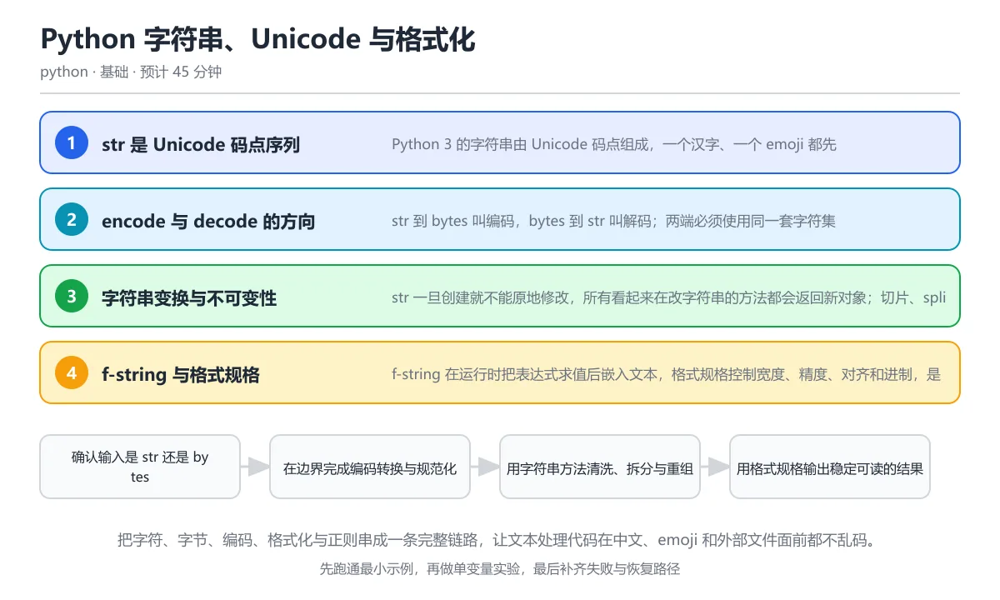

# Python 字符串、Unicode 与格式化

> 内容更新时间：2026-10-06 · 学习阶段：基础 · 预计用时：40 分钟

分类：python。关键词：Unicode、UTF-8、bytes、f-string、正则表达式。把字符、字节、编码、格式化与正则串成一条完整链路，让文本处理代码在中文、emoji 和外部文件面前都不乱码。

学习建议：先通读《Python 字符串、Unicode 与格式化》的核心知识与关键流程，再运行可运行练习并完成测验；遇到不确定的结论，回到「故障现场」按症状、根因、修复、验证四步核对。



## 学习目标

- 能区分 str、bytes 与编码后的字节序列，并解释乱码产生的每一步。
- 能用 f-string 的格式规格输出对齐、精度和千分位稳定的文本。
- 能用命名组正则提取结构化日志，并让非法输入明确失败。

## 前置知识

- 已经会创建字符串、调用 len 和使用 print。
- 知道列表、字典等容器的基本操作。
- 能运行一个 Python 脚本并查看异常回溯。

## 核心知识

### 1. str 是 Unicode 码点序列

Python 3 的字符串由 Unicode 码点组成，一个汉字、一个 emoji 都先被看成独立码点；len 统计的是码点数量，不是屏幕上占的列数。

解释器把源码按声明编码解码成 str，str 内部保存码点；打印时再由终端编码转换成字节。组合字符和零宽连接符会让一个视觉字符由多个码点构成，len 与显示宽度因此可能不一致。

在Python 字符串、Unicode 与格式化里可以这样验证：用字母 e 加上组合重音 chr(0x301) 组成 é，比较 len 的结果与过滤组合字符后得到的可见宽度。

边界：码点相等不代表字形等价；é 的预组合形式与分解形式需要先做 NFC 规范化，比较和查找才会稳定。

工程视角：需要按用户感知统计字数时，先做 unicodedata.normalize('NFC', text)，必要时再使用字素簇库。

### 2. encode 与 decode 的方向

str 到 bytes 叫编码，bytes 到 str 叫解码；两端必须使用同一套字符集，否则会出现乱码或抛出 UnicodeDecodeError。

UTF-8 用 1 到 4 个字节表示一个码点，ASCII 保持单字节，中文通常占 3 字节；解码时按首字节判断后续需要读几个字节，遇到非法序列就按 errors 策略处理。

在Python 字符串、Unicode 与格式化里可以这样验证：把包含重音、emoji 与中文的文本编码成 UTF-8，打印字节长度，再用 decode('utf-8') 还原成原字符串。

边界：errors='ignore' 或 'replace' 能让程序继续运行，但会静默丢字符，只适合展示层兜底，不适合数据校验。

工程视角：外部文件、网络响应和数据库文本都要显式声明编码；边界处保留 bytes，进入业务层后统一转成 str。

### 3. 字符串变换与不可变性

str 一旦创建就不能原地修改，所有看起来在改字符串的方法都会返回新对象；切片、split、join、strip 和 casefold 是最常用的变换。

字符串是不可变对象，可以安全地作为字典键或跨线程共享；反复用加号拼接会产生许多中间对象，把片段收集到列表再 join 更稳定。

在Python 字符串、Unicode 与格式化里可以这样验证：把一行逗号分隔的记录 split 成列表，清洗空白后重新 join，观察每一步返回的是新字符串还是列表。

边界：str.strip 去掉的是首尾空白而不是中间空格；大小写比较要用 casefold，lower 对某些语言并不准确。

工程视角：入口统一做 normalize 与 strip，内部只依赖规范形式，避免同一份文本在不同分支里反复清洗。

### 4. f-string 与格式规格

f-string 在运行时把表达式求值后嵌入文本，格式规格控制宽度、精度、对齐和进制，是日志与报表最常用的输出方式。

花括号里的表达式先求值，再交给 format 协议；大于号加宽度表示右对齐，点二表示保留两位小数，逗号表示千分位，等号可以同时打印表达式和结果。

在Python 字符串、Unicode 与格式化里可以这样验证：用格式规格输出右对齐的小数，再把大整数格式化成带千分位分隔的文本，观察宽度与精度分别由哪一段控制。

边界：f-string 会在求值阶段执行表达式，不能把不可信输入直接当成格式模板；自定义对象要实现 __format__ 才能响应规格。

工程视角：给人看的日志可以固定宽度便于扫描，给机器消费的日志应输出 JSON，避免用空格拼接后难以解析。

### 5. 正则表达式与整体校验

正则表达式用模式描述一类文本，适合提取和校验结构化字符串；Python 的 re 模块支持分组、命名组、查找和替换。

re.match 只从开头匹配，re.fullmatch 要求整个字符串匹配，re.search 扫描任意位置；量词默认贪婪，加问号变成非贪婪，命名组可以通过 groupdict 取字段。

在Python 字符串、Unicode 与格式化里可以这样验证：用命名组从一行日志中提取日期、用户编号和消息，再用 fullmatch 保证整行格式完全符合预期。

边界：复杂嵌套量词可能触发灾难性回溯，处理不可信长文本前要限制长度或改用解析器；模式里的反斜杠应放在原始字符串里减少转义层数。

工程视角：常用模式提前 re.compile，错误分支要区分未匹配与格式错误；对安全敏感的校验不要只靠正则。

## 关键流程

```text
确认输入是 str 还是 bytes → 在边界完成编码转换与规范化 → 用字符串方法清洗、拆分与重组 → 用格式规格输出稳定可读的结果 → 用正则提取或校验并覆盖失败分支
```

1. 确认输入是 str 还是 bytes
2. 在边界完成编码转换与规范化
3. 用字符串方法清洗、拆分与重组
4. 用格式规格输出稳定可读的结果
5. 用正则提取或校验并覆盖失败分支

## 动手练习

1. 读取任意一篇 Markdown 教程，分别统计码点数量、UTF-8 字节数量和行数，解释三个数字为什么不同。
2. 写一个日志解析函数，用命名组提取日期、级别与请求编号，并给合法行和非法行各写一条断言。
3. 用 f-string 输出一张包含百分数和千分位整数的对齐表格，再加入一个 emoji，记录错位现象与修复方案。
4. 为编码处理补四个测试：空字符串、组合字符、emoji 和非法 UTF-8 字节。

**验收标准**：留下输入、命令、输出和结论，能让别人按记录复现。

## 常见错误与排查

> 说明：本表由《Python 字符串、Unicode 与格式化》的核心知识整理（2026-10-06），人工复核进度见 docs/content_review_batches.md。

| 易错点 | 容易踩的做法 | 正确结论 |
| --- | --- | --- |
| 读写文本不指定编码 | open(path) 依赖系统默认编码，在中文 Windows 上写入后用 Linux 读取就可能乱码 | 读写文本统一写 encoding='utf-8'，需要兼容 BOM 时再用 utf-8-sig |
| 混淆 str 与 bytes | 把网络返回的 bytes 直接和字符串比较，或对 bytes 调用只存在于 str 的方法 | 先用正确编码 decode 成 str，或者在字节层统一比较 b'...' |
| 把 len 当成显示宽度 | 用 len(text) 对齐终端表格，遇到 emoji 和组合字符就错位 | 先做 NFC 规范化，再按字素簇或显示宽度库计算，必要时固定列宽 |
| 正则只匹配前缀 | 用 re.match 校验整行格式，尾部多余的字符也被当成合法输入 | 需要整体校验时用 re.fullmatch，或给模式加锚点并覆盖完整字符串 |

## 可运行练习

### 任务 1：先跑通，再解释

```python
import re
import unicodedata

text = "Café 😀 中文"
print("码点数量:", len(text))
print("UTF-8 字节:", len(text.encode("utf-8")))
print("规范化后比较:", unicodedata.normalize("NFC", "e" + chr(0x301)) == "é")

log = "2026-10-08 12:30:45 ERROR user=42 msg=timeout"
pattern = re.compile(
    r"^([0-9]{4}-[0-9]{2}-[0-9]{2}) [^ ]+ ERROR user=([0-9]+) msg=([A-Za-z]+)$"
)
match = pattern.fullmatch(log)
print("解析结果:", match.groups() if match else "未匹配")
print(f"{3.14159:>8.2f} | {1234567:,}")
```

脚本先打印同一段文本的码点数量与 UTF-8 字节数，看到中文和 emoji 在两套度量下的差异；随后把分解形式的 é 规范化为 NFC 再比较，最后用命名组正则解析日志并用格式规格输出对齐文本。运行前先预测两个长度，再和真实输出对照。

### 任务 2：只改一个条件

复制上面的示例，只改一个输入或参数再跑一次；先写下预测，再和真实输出对照，并说明差异来自Python 字符串、Unicode 与格式化的哪条机制。

### 任务 3：迁移到自己的数据

把《Python 字符串、Unicode 与格式化》里的示例换成你自己的一小段数据或场景，保持结构不变；如果换不动，说明还有哪条前提没有理解，回到核心知识对应小节。

## 故障现场

### 现场 1：读写文本不指定编码

**症状**：在《Python 字符串、Unicode 与格式化》里采用「open(path) 依赖系统默认编码，在中文 Windows 上写入后用 Linux 读取就可能乱码」时，读写文本不指定编码会表现为错误结果、异常中断或状态不一致。

**根因**：这个做法没有执行与「读写文本不指定编码」对应的检查，问题被带到了后续步骤。

**修复**：读写文本统一写 encoding='utf-8'，需要兼容 BOM 时再用 utf-8-sig

**验证**：为「读写文本不指定编码」准备一个最小输入，确认修复前的失败可以复现，修复后的输出与本课示例一致，再补一个边界输入。

### 现场 2：混淆 str 与 bytes

**症状**：在《Python 字符串、Unicode 与格式化》里采用「把网络返回的 bytes 直接和字符串比较，或对 bytes 调用只存在于 str 的方法」时，混淆 str 与 bytes会表现为错误结果、异常中断或状态不一致。

**根因**：这个做法没有执行与「混淆 str 与 bytes」对应的检查，问题被带到了后续步骤。

**修复**：先用正确编码 decode 成 str，或者在字节层统一比较 b'...'

**验证**：为「混淆 str 与 bytes」准备一个最小输入，确认修复前的失败可以复现，修复后的输出与本课示例一致，再补一个边界输入。

### 现场 3：把 len 当成显示宽度

**症状**：在《Python 字符串、Unicode 与格式化》里采用「用 len(text) 对齐终端表格，遇到 emoji 和组合字符就错位」时，把 len 当成显示宽度会表现为错误结果、异常中断或状态不一致。

**根因**：这个做法没有执行与「把 len 当成显示宽度」对应的检查，问题被带到了后续步骤。

**修复**：先做 NFC 规范化，再按字素簇或显示宽度库计算，必要时固定列宽

**验证**：为「把 len 当成显示宽度」准备一个最小输入，确认修复前的失败可以复现，修复后的输出与本课示例一致，再补一个边界输入。

### 现场 4：正则只匹配前缀

**症状**：在《Python 字符串、Unicode 与格式化》里采用「用 re.match 校验整行格式，尾部多余的字符也被当成合法输入」时，正则只匹配前缀会表现为错误结果、异常中断或状态不一致。

**根因**：这个做法没有执行与「正则只匹配前缀」对应的检查，问题被带到了后续步骤。

**修复**：需要整体校验时用 re.fullmatch，或给模式加锚点并覆盖完整字符串

**验证**：为「正则只匹配前缀」准备一个最小输入，确认修复前的失败可以复现，修复后的输出与本课示例一致，再补一个边界输入。

## 本课复习清单

离开本课前，逐项确认：

- [ ] 能解释 len(str) 与 UTF-8 字节数的区别。
- [ ] 能在文件读写和网络边界显式处理编码。
- [ ] 能用 fullmatch 与命名组完成整行校验。
- [ ] 至少运行一次本课示例，记录输入、输出和一个边界情况。
- [ ] 把本课最容易混淆的两个概念写成一句话对照。

| 复盘项 | 记录 |
| --- | --- |
| 已经能独立解释的考点 |  |
| 仍然说不清的概念 |  |
| 下一步验证动作 |  |

## 复习与自测

### 核心知识

遮住正文回答：Python 字符串、Unicode 与格式化解决什么问题、依赖哪些前提、失败时先看哪个信号？三问都能答清楚，再进入下一节。

### 动手练习

把《Python 字符串、Unicode 与格式化》里「只改一个条件」的练习再做一遍，这次先写预测再运行；预测和结果不一致的地方，就是需要回读的章节。

### 最小可运行示例

```python
import re
import unicodedata

text = "Café 😀 中文"
print("码点数量:", len(text))
print("UTF-8 字节:", len(text.encode("utf-8")))
print("规范化后比较:", unicodedata.normalize("NFC", "e" + chr(0x301)) == "é")

log = "2026-10-08 12:30:45 ERROR user=42 msg=timeout"
pattern = re.compile(
    r"^([0-9]{4}-[0-9]{2}-[0-9]{2}) [^ ]+ ERROR user=([0-9]+) msg=([A-Za-z]+)$"
)
match = pattern.fullmatch(log)
print("解析结果:", match.groups() if match else "未匹配")
print(f"{3.14159:>8.2f} | {1234567:,}")
```

### 预期输出

```text
码点数量: 9
UTF-8 字节: 17
规范化后比较: True
解析结果: ('2026-10-08', '42', 'timeout')
    3.14 | 1,234,567
```

### 验证步骤

1. 确认输入数据与运行环境和示例一致。
2. 运行示例，记录输出与耗时等可观测指标。
3. 换一个边界输入重跑，确认结论仍然成立。
4. 把两次结果写成一句话结论，注明前提与局限。

## 术语速查

先遮住右列，尝试用自己的话解释，再回到正文核对。

| 术语 | 一句话说明 |
| --- | --- |
| `Unicode 码点` | Unicode 标准给每个字符分配的数字编号，Python 的 str 以码点序列保存文本。 |
| `UTF-8` | 一种变长 Unicode 编码，ASCII 占一字节，中文通常占三字节，emoji 通常占四字节。 |
| `编码与解码` | 编码把 str 转成 bytes，解码把 bytes 还原成 str，两者必须约定同一字符集。 |
| `f-string` | 以 f 前缀开头的字符串字面量，可以在花括号中插入表达式和格式规格。 |
| `原始字符串` | 以 r 前缀声明的字符串，反斜杠不被当成转义序列，适合书写正则模式。 |
| `字素簇` | 用户感知为一个字符的最小文本单位，可能由多个 Unicode 码点组合而成。 |

## 考点精讲

### 考点 1：Python 3 中 len('中文😀

题型：概念判断。题干：Python 3 中 len('中文😀') 的结果是什么？

判断要点：3。结果是 3。Python 3 的 str 保存 Unicode 码点，中、文、😀 各算一个码点，len 返回码点数量而不是 UTF-8 字节数，也不受终端编码影响。该字符串用 UTF-8 编码后是 3 加 3 加 4 共 10 字节，所以把 len 当成字节数会在计算存储和网络包大小时产生偏差。

### 考点 2：读取一个需要跨平台交换的文本文件，最稳妥

题型：概念判断。题干：读取一个需要跨平台交换的文本文件，最稳妥的写法是？

判断要点：open(path, encoding='utf-8')。正确做法是显式传入 encoding='utf-8'。不指定编码时 Python 使用操作系统默认编码，同一个文件在中文 Windows 与 Linux 上可能得到不同结果；二进制模式返回 bytes，不能直接当 str 使用；写入模式还会截断原文件，因此与读取语义不同。 正确选项「open(path, encoding='utf-8')」对应《Python 字符串、Unicode 与格式化》的要点「encode 与 decode 的方向」：str 到 bytes 叫编码，bytes 到 str 叫解码；两端必须使用同一套字符集，否则会出现乱码或抛出 UnicodeDecodeError。判断「encode 与 decode 的方向」时先确认前提是否成立，再回到《Python 字符串、Unicode 与格式化》的示例核对一次；借鉴相邻主题的经验之前，先核对encode 与 decode 的方向的前提是否成立。

### 考点 3：以下哪些操作会在编码边界抛错或产生乱码？

题型：多选辨析。题干：以下哪些操作会在编码边界抛错或产生乱码？（多选）

判断要点：用 GBK 解码 UTF-8 字节；对 bytes 调用 str 独有的 format 方法；直接比较 bytes 与 str。用错误的字符集解码、对 bytes 调用 str 方法、把 bytes 与 str 直接比较都会失败或得到意外结果。显式用同一套 UTF-8 先编码再解码是正确往返，不会乱码。混淆类型时错误往往出现在边界层，因此要在读入和写出处集中处理编码。 正确选项「用 GBK 解码 UTF-8 字节；对 bytes 调用 str 独有的 format 方法；直接比较 bytes 与 str」对应《Python 字符串、Unicode 与格式化》的要点「字符串变换与不可变性」：str 一旦创建就不能原地修改，所有看起来在改字符串的方法都会返回新对象；切片、split、join、strip 和 casefold 是最常用的变换。判断「字符串变换与不可变性」时先确认前提是否成立，再回到《Python 字符串、Unicode 与格式化》的示例核对一次；记住字符串变换与不可变性的结论之外还要记住适用条件，换一个输入往往就不成立了。

### 考点 4：阅读代码，输出与结论哪一项正确？

te

题型：代码阅读。题干：阅读代码，输出与结论哪一项正确？

text = 'e' + chr(0x301)
print(len(text), text == 'é', unicodedata.normalize('NFC', text) == 'é')

判断要点：2 False True。结果是 2 False True。text 由字母 e 和组合重音两个码点组成，所以 len 为 2；直接与预组合形式的 é 比较不相等；NFC 规范化会把分解形式合并成预组合码点，因此规范化后比较为 True。要比较用户看到的字符，先统一规范化形式。这道题考察 Unicode 规范化：同一字符的不同码点序列必须先统一形式再比较。

### 考点 5：下面代码为什么没有拦住非法输入？

re

题型：排错。题干：下面代码为什么没有拦住非法输入？

re.match(r'[0-9]{4}-[0-9]{2}', '2026-10-08oops')

判断要点：match 只保证前缀匹配，尾部 oops 没有被校验，应改用 fullmatch。match 只要求模式从字符串开头匹配，不要求消耗整个字符串，所以 2026-10 这一段会成功，尾部的 oops 被忽略。需要整体校验时应使用 re.fullmatch，或在模式末尾补上锚点并覆盖完整内容；只看到匹配成功就放行是输入校验中的常见漏洞。 正确选项「match 只保证前缀匹配，尾部 oops 没有被校验，应改用 fullmatch」对应《Python 字符串、Unicode 与格式化》的要点「正则表达式与整体校验」：正则表达式用模式描述一类文本，适合提取和校验结构化字符串；Python 的 re 模块支持分组、命名组、查找和替换。判断「正则表达式与整体校验」时先确认前提是否成立，再回到《Python 字符串、Unicode 与格式化》的示例核对一次；把正则表达式与整体校验的做法换到别的约束下未必成立，先确认边界再决定答案。

## English Overview

Python Strings, Unicode and Formatting

Python 3 strings store Unicode code points, while bytes store encoded octets. This lesson explains encoding and decoding, NFC normalization, immutable string operations, f-string formatting, and full-string validation with regular expressions. It ends with a runnable log parser and practical rules for handling Chinese text, emoji and files across platforms.

## 本课小结

- Python 字符串、Unicode 与格式化围绕Unicode、UTF-8、bytes展开，先建立基线再讨论优化。
- Python 3 的字符串由 Unicode 码点组成，一个汉字、一个 emoji 都先被看成独立码点；len 统计的是码点数量，不是屏幕上占的列数。
- 遇到问题时按「症状 → 根因 → 修复 → 验证」的顺序处理，不跳过验证。

## 内容元数据

- 内容版本：v2.0
- 最后更新：2026-10-06
- 学习阶段：基础

| 字段 | 值 |
| --- | --- |
| 课程 ID | `python_strings_encoding` |
| 所属分类 | `python` |
| 难度 | 基础 |
| 预计用时 | 45 分钟 |
| 关键词 | Unicode、UTF-8、bytes、f-string、正则表达式 |
| 配图 | `images/lesson_python_strings_encoding.webp` |
| 参考资料 | 3 条 |
| 内容更新时间 | 2026-10-06 |

## 参考资料与复核

- 最后复核：2026-10-04
- 下次复核：2026-12-10
- 复核范围：版本兼容、API 行为与工程实践

下面列出的资料用于核对本课结论，复习时可以对照阅读：
- [Python 官方 Unicode HOWTO](https://docs.python.org/3/howto/unicode.html)
- [Python re 模块文档](https://docs.python.org/3/library/re.html)
- [字符串格式规格迷你语言](https://docs.python.org/3/library/string.html#format-specification-mini-language)

> 复核提示：《Python 字符串、Unicode 与格式化》的结论如与资料冲突，以资料中的规范文本为准，并在笔记里记录差异与日期。

## 复习与迁移

### 概念复述

不看正文，把Python 字符串、Unicode 与格式化讲给一个没学过的同事：先讲它解决什么问题，再讲一个最小例子，最后说明一个不适用场景。

### 测验回顾

回到《Python 字符串、Unicode 与格式化》测验，只重做答错或犹豫的题；对每道题写一句「我为什么改选这个答案」，写不出理由就回到对应小节。

### 迁移练习

把《Python 字符串、Unicode 与格式化》的方法用到一个你自己的真实场景：说明输入、约束与验证方式，并列出仍然不确定、需要下一次实验回答的问题。

## 深度拓展与实战

这一节把Python 字符串、Unicode 与格式化的机制拆开验证：每一步都给出输入、判断标准和失败信号，便于在真实项目里复用。

### 机制拆解 1：str 是 Unicode 码点序列

解释器把源码按声明编码解码成 str，str 内部保存码点；打印时再由终端编码转换成字节。组合字符和零宽连接符会让一个视觉字符由多个码点构成，len 与显示宽度因此可能不一致。

落地时先确认前提：码点相等不代表字形等价；é 的预组合形式与分解形式需要先做 NFC 规范化，比较和查找才会稳定。；再把结论写进检查表，让下一位同学可以按同样的输入复现。

工程做法：需要按用户感知统计字数时，先做 unicodedata.normalize('NFC', text)，必要时再使用字素簇库。

### 机制拆解 2：encode 与 decode 的方向

UTF-8 用 1 到 4 个字节表示一个码点，ASCII 保持单字节，中文通常占 3 字节；解码时按首字节判断后续需要读几个字节，遇到非法序列就按 errors 策略处理。

落地时先确认前提：errors='ignore' 或 'replace' 能让程序继续运行，但会静默丢字符，只适合展示层兜底，不适合数据校验。；再把结论写进检查表，让下一位同学可以按同样的输入复现。

工程做法：外部文件、网络响应和数据库文本都要显式声明编码；边界处保留 bytes，进入业务层后统一转成 str。

### 机制拆解 3：字符串变换与不可变性

字符串是不可变对象，可以安全地作为字典键或跨线程共享；反复用加号拼接会产生许多中间对象，把片段收集到列表再 join 更稳定。

落地时先确认前提：str.strip 去掉的是首尾空白而不是中间空格；大小写比较要用 casefold，lower 对某些语言并不准确。；再把结论写进检查表，让下一位同学可以按同样的输入复现。

工程做法：入口统一做 normalize 与 strip，内部只依赖规范形式，避免同一份文本在不同分支里反复清洗。

### 机制拆解 4：f-string 与格式规格

花括号里的表达式先求值，再交给 format 协议；大于号加宽度表示右对齐，点二表示保留两位小数，逗号表示千分位，等号可以同时打印表达式和结果。

落地时先确认前提：f-string 会在求值阶段执行表达式，不能把不可信输入直接当成格式模板；自定义对象要实现 __format__ 才能响应规格。；再把结论写进检查表，让下一位同学可以按同样的输入复现。

工程做法：给人看的日志可以固定宽度便于扫描，给机器消费的日志应输出 JSON，避免用空格拼接后难以解析。

### 机制拆解 5：正则表达式与整体校验

re.match 只从开头匹配，re.fullmatch 要求整个字符串匹配，re.search 扫描任意位置；量词默认贪婪，加问号变成非贪婪，命名组可以通过 groupdict 取字段。

落地时先确认前提：复杂嵌套量词可能触发灾难性回溯，处理不可信长文本前要限制长度或改用解析器；模式里的反斜杠应放在原始字符串里减少转义层数。；再把结论写进检查表，让下一位同学可以按同样的输入复现。

工程做法：常用模式提前 re.compile，错误分支要区分未匹配与格式错误；对安全敏感的校验不要只靠正则。

### 机制对照表

| 概念 | 解决什么问题 | 关键前提 | 失败信号 |
| --- | --- | --- | --- |
| str 是 Unicode 码点序列 | Python 3 的字符串由 Unicode 码点组成，一个汉字、一个 emoj | 码点相等不代表字形等价；é 的预组合形式与分解形式需要先做 NFC 规范 | 需要按用户感知统计字数时，先做 unicodedata.normaliz |
| encode 与 decode 的方向 | str 到 bytes 叫编码，bytes 到 str 叫解码；两端必须使用同一 | errors='ignore' 或 'replace' 能让程序继续运行 | 外部文件、网络响应和数据库文本都要显式声明编码；边界处保留 bytes， |
| 字符串变换与不可变性 | str 一旦创建就不能原地修改，所有看起来在改字符串的方法都会返回新对象；切片、 | str.strip 去掉的是首尾空白而不是中间空格；大小写比较要用 ca | 入口统一做 normalize 与 strip，内部只依赖规范形式，避免 |
| f-string 与格式规格 | f-string 在运行时把表达式求值后嵌入文本，格式规格控制宽度、精度、对齐和 | f-string 会在求值阶段执行表达式，不能把不可信输入直接当成格式模 | 给人看的日志可以固定宽度便于扫描，给机器消费的日志应输出 JSON，避免 |
| 正则表达式与整体校验 | 正则表达式用模式描述一类文本，适合提取和校验结构化字符串；Python 的 re | 复杂嵌套量词可能触发灾难性回溯，处理不可信长文本前要限制长度或改用解析器 | 常用模式提前 re.compile，错误分支要区分未匹配与格式错误；对安 |

### 自测问答

**问 1**：Python 3 中 len('中文😀') 的结果是什么？

**答**：3。结果是 3。Python 3 的 str 保存 Unicode 码点，中、文、😀 各算一个码点，len 返回码点数量而不是 UTF-8 字节数，也不受终端编码影响。该字符串用 UTF-8 编码后是 3 加 3 加 4 共 10 字节，所以把 len 当成字节数会在计算存储和网络包大小时产生偏差。

**问 2**：读取一个需要跨平台交换的文本文件，最稳妥的写法是？

**答**：open(path, encoding='utf-8')。正确做法是显式传入 encoding='utf-8'。不指定编码时 Python 使用操作系统默认编码，同一个文件在中文 Windows 与 Linux 上可能得到不同结果；二进制模式返回 bytes，不能直接当 str 使用；写入模式还会截断原文件，因此与读取语义不同。 正确选项「open(path, encoding='utf-8')」对应《Python 字符串、Unicode 与格式化》的要点「encode 与 decode 的方向」：str 到 bytes 叫编码，bytes 到 str 叫解码；两端必须使用同一套字符集，否则会出现乱码或抛出 UnicodeDecodeError。判断「encode 与 decode 的方向」时先确认前提是否成立，再回到《Python 字符串、Unicode 与格式化》的示例核对一次；借鉴相邻主题的经验之前，先核对encode 与 decode 的方向的前提是否成立。

**问 3**：以下哪些操作会在编码边界抛错或产生乱码？（多选）

**答**：用 GBK 解码 UTF-8 字节；对 bytes 调用 str 独有的 format 方法；直接比较 bytes 与 str。用错误的字符集解码、对 bytes 调用 str 方法、把 bytes 与 str 直接比较都会失败或得到意外结果。显式用同一套 UTF-8 先编码再解码是正确往返，不会乱码。混淆类型时错误往往出现在边界层，因此要在读入和写出处集中处理编码。 正确选项「用 GBK 解码 UTF-8 字节；对 bytes 调用 str 独有的 format 方法；直接比较 bytes 与 str」对应《Python 字符串、Unicode 与格式化》的要点「字符串变换与不可变性」：str 一旦创建就不能原地修改，所有看起来在改字符串的方法都会返回新对象；切片、split、join、strip 和 casefold 是最常用的变换。判断「字符串变换与不可变性」时先确认前提是否成立，再回到《Python 字符串、Unicode 与格式化》的示例核对一次；记住字符串变换与不可变性的结论之外还要记住适用条件，换一个输入往往就不成立了。

**问 4**：阅读代码，输出与结论哪一项正确？

text = 'e' + chr(0x301)
print(len(text), text == 'é', unicodedata.normalize('NFC', text) == 'é')

**答**：2 False True。结果是 2 False True。text 由字母 e 和组合重音两个码点组成，所以 len 为 2；直接与预组合形式的 é 比较不相等；NFC 规范化会把分解形式合并成预组合码点，因此规范化后比较为 True。要比较用户看到的字符，先统一规范化形式。这道题考察 Unicode 规范化：同一字符的不同码点序列必须先统一形式再比较。

**问 5**：下面代码为什么没有拦住非法输入？

re.match(r'[0-9]{4}-[0-9]{2}', '2026-10-08oops')

**答**：match 只保证前缀匹配，尾部 oops 没有被校验，应改用 fullmatch。match 只要求模式从字符串开头匹配，不要求消耗整个字符串，所以 2026-10 这一段会成功，尾部的 oops 被忽略。需要整体校验时应使用 re.fullmatch，或在模式末尾补上锚点并覆盖完整内容；只看到匹配成功就放行是输入校验中的常见漏洞。 正确选项「match 只保证前缀匹配，尾部 oops 没有被校验，应改用 fullmatch」对应《Python 字符串、Unicode 与格式化》的要点「正则表达式与整体校验」：正则表达式用模式描述一类文本，适合提取和校验结构化字符串；Python 的 re 模块支持分组、命名组、查找和替换。判断「正则表达式与整体校验」时先确认前提是否成立，再回到《Python 字符串、Unicode 与格式化》的示例核对一次；把正则表达式与整体校验的做法换到别的约束下未必成立，先确认边界再决定答案。

### 排错速查

- 看到「open(path) 依赖系统默认编码，在中文 Windows 上写入后用 Linux 读取就可能乱码」时，先按「读写文本统一写 encoding='utf-8'，需要兼容 BOM 时再用 utf-8-sig」处理，再用Python 字符串、Unicode 与格式化的最小示例确认结论是否恢复。
- 看到「把网络返回的 bytes 直接和字符串比较，或对 bytes 调用只存在于 str 的方法」时，先按「先用正确编码 decode 成 str，或者在字节层统一比较 b'...'」处理，再用Python 字符串、Unicode 与格式化的最小示例确认结论是否恢复。
- 看到「用 len(text) 对齐终端表格，遇到 emoji 和组合字符就错位」时，先按「先做 NFC 规范化，再按字素簇或显示宽度库计算，必要时固定列宽」处理，再用Python 字符串、Unicode 与格式化的最小示例确认结论是否恢复。
- 看到「用 re.match 校验整行格式，尾部多余的字符也被当成合法输入」时，先按「需要整体校验时用 re.fullmatch，或给模式加锚点并覆盖完整字符串」处理，再用Python 字符串、Unicode 与格式化的最小示例确认结论是否恢复。

### 工程检查表

- [ ] 确认输入是 str 还是 bytes
- [ ] 在边界完成编码转换与规范化
- [ ] 用字符串方法清洗、拆分与重组
- [ ] 用格式规格输出稳定可读的结果
- [ ] 用正则提取或校验并覆盖失败分支
- [ ] 【str 是 Unicode 码点序列】需要按用户感知统计字数时，先做 unicodedata.normalize('NFC', text)，必要时再使用字
- [ ] 【encode 与 decode 的方向】外部文件、网络响应和数据库文本都要显式声明编码；边界处保留 bytes，进入业务层后统一转成 str。
- [ ] 【字符串变换与不可变性】入口统一做 normalize 与 strip，内部只依赖规范形式，避免同一份文本在不同分支里反复清洗。
- [ ] 【f-string 与格式规格】给人看的日志可以固定宽度便于扫描，给机器消费的日志应输出 JSON，避免用空格拼接后难以解析。
- [ ] 【正则表达式与整体校验】常用模式提前 re.compile，错误分支要区分未匹配与格式错误；对安全敏感的校验不要只靠正则。

### 迁移练习

把Python 字符串、Unicode 与格式化的方法用到一个真实场景：写下Unicode、UTF-8、bytes在你的场景里分别对应什么，再记录一次失败尝试和它的恢复步骤。

### 延伸阅读与下一步

- 复习Unicode、UTF-8、bytes、f-string、正则表达式时，优先回看「str 是 Unicode 码点序列」与「正则表达式与整体校验」两节。
- 把从「确认输入是 str 还是 bytes」到「用正则提取或校验并覆盖失败分支」的流程画成一张图，放进自己的笔记。
- 一周后重做本课测验，只把答错的题留到下一轮复习。

### 结论与下一步

学完Python 字符串、Unicode 与格式化，应该能独立完成三件事：先用最小示例确认Unicode的行为，再用一个边界输入验证结论，最后把失败路径写成可重复的检查。下一步把本课术语加入复习清单，并在两周内用一次真实任务检验记忆是否牢固。
