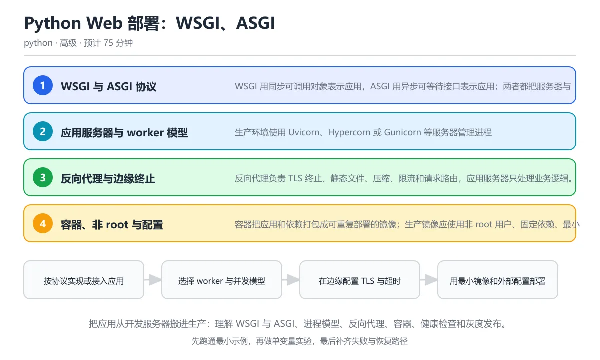

# Python Web 部署：WSGI、ASGI 与容器化

> 内容更新时间：2026-10-06 · 学习阶段：高级 · 预计用时：55 分钟

分类：python。关键词：WSGI、ASGI、Uvicorn、容器化、健康检查。把应用从开发服务器搬进生产：理解 WSGI 与 ASGI、进程模型、反向代理、容器、健康检查和灰度发布。

学习建议：先通读《Python Web 部署：WSGI、ASGI 与容器化》的核心知识与关键流程，再运行可运行练习并完成测验；遇到不确定的结论，回到「故障现场」按症状、根因、修复、验证四步核对。



## 本节知识框架

**课程定位**：所属分类为「Python」，课程主题为「Python Web 部署：WSGI、ASGI 与容器化」，学习阶段为「高级」，建议用时 55 分钟。

**本课要解决的主问题**：把应用从开发服务器搬进生产：理解 WSGI 与 ASGI、进程模型、反向代理、容器、健康检查和灰度发布。

| 学习层次 | 要回答的问题 | 完成判据 |
| --- | --- | --- |
| 概念层 | 「Python Web 部署：WSGI、ASGI 与容器化」有哪些必须区分的对象与术语？ | 能用自己的话定义核心术语，并各举一个正例和一个反例。 |
| 机制层 | 这些对象按什么顺序发生作用，输入如何变成输出？ | 能画出或写出机制步骤，并说明每一步的失败条件。 |
| 应用层 | 什么场景适合使用「Python Web 部署：WSGI、ASGI 与容器化」，什么场景不适合？ | 能给出一个真实场景、一个最小示例和一个边界案例。 |
| 性能层 | 时间、空间、吞吐或延迟受哪些量影响？ | 能说出复杂度或性能瓶颈的证据来源；没有证据时明确写“材料未提供”。 |
| 复习层 | 怎样确认自己不是只记住了结论？ | 能独立完成本课自测，并把错误定位到概念、机制、示例或边界。 |

### 阅读路线

1. 先读「核心概念定义」，建立「WSGI」等对象的精确定义。
2. 再读「原理与运行机制」，把定义串成可重复的过程。
3. 用「代码/协议/SQL 示例」验证过程，并只改一个条件观察结果变化。
4. 最后检查性能、易错点、知识关系与自测题，形成可复习的证据链。

**前置知识**：《实战：FastAPI 订单服务》

**学习位置**：本课位于《Python 数据处理：NumPy、pandas 与 Polars》之后；如果前一课的自测不能通过，应先回补再继续。

**后续衔接**：下一课《Python 与 C、C++、Rust 互操作》会继续使用本课术语，学完后建议立即完成一次自测。

**教材衔接：学习目标**

- 能解释 WSGI 与 ASGI 的调用约定和适用场景。
- 能按 CPU、内存和 I/O 特征设置 worker 与并发参数。
- 能写出非 root、可观测、可优雅停机的容器部署方案。

**教材衔接：前置知识**

- 已经用 FastAPI 或 Flask 写过可运行接口。
- 知道 HTTP 请求、响应和状态码。
- 能在命令行启动服务并用 curl 或浏览器访问。

**教材衔接：本课小结**

- Python Web 部署：WSGI、ASGI 与容器化围绕WSGI、ASGI、Uvicorn展开，先建立基线再讨论优化。
- WSGI 用同步可调用对象表示应用，ASGI 用异步可等待接口表示应用；两者都把服务器与框架解耦，让同一应用可以运行在不同服务器上。
- 遇到问题时按「症状 → 根因 → 修复 → 验证」的顺序处理，不跳过验证。

## 核心概念定义

> 阅读约定：本课先给「Python Web 部署：WSGI、ASGI 与容器化」相关术语的操作性定义与适用边界；正文里的口语化说法与定义冲突时，以定义和可复现示例为准。

| 术语 | 操作性定义 | 本课中的边界 |
| --- | --- | --- |
| WSGI | Python 同步 Web 服务器与应用之间的标准调用接口。 | 仅在「Python Web 部署：WSGI、ASGI 与容器化」明确给出的输入、版本与资源条件下成立。 |
| ASGI | 支持异步、WebSocket 与生命周期事件的新一代服务器应用接口。 | 仅在「Python Web 部署：WSGI、ASGI 与容器化」明确给出的输入、版本与资源条件下成立。 |
| worker | 独立加载应用并处理请求的进程或执行单元。 | 仅在「Python Web 部署：WSGI、ASGI 与容器化」明确给出的输入、版本与资源条件下成立。 |
| 反向代理 | 位于客户端与应用之间，负责转发、TLS、缓存和限流的服务器。 | 仅在「Python Web 部署：WSGI、ASGI 与容器化」明确给出的输入、版本与资源条件下成立。 |
| 健康检查 | 平台定期探测服务是否存活或已准备好接收流量的接口。 | 仅在「Python Web 部署：WSGI、ASGI 与容器化」明确给出的输入、版本与资源条件下成立。 |
| 优雅停机 | 停止接收新请求并等待正在处理的请求完成后再退出进程。 | 仅在「Python Web 部署：WSGI、ASGI 与容器化」明确给出的输入、版本与资源条件下成立。 |

### 定义如何使用

在「Python Web 部署：WSGI、ASGI 与容器化」中判断一个说法是否成立，先确认它使用的是哪个对象的定义，再检查输入规模、运行环境与失败路径。定义不是口号，而是后续推导、代码示例和自测题共享的约束。

## 原理与运行机制

### 机制总览

1. **建立输入**：把「WSGI」按本课定义整理成可观察、可重复的输入条件。
2. **执行转换**：围绕「ASGI」执行本课的核心步骤；每一步都记录中间状态，避免只看最终输出。
3. **产生输出**：得到「worker」后，用正文示例或协议/SQL 结果核对输出是否符合预期。
4. **改变一个条件**：只替换一个边界条件或环境参数，观察「Python Web 部署：WSGI、ASGI 与容器化」的结论是否仍然成立。

| 阶段 | 关注对象 | 失败时应检查 |
| --- | --- | --- |
| 输入 | WSGI | 类型、范围、编码、版本或前置状态是否满足定义。 |
| 处理 | ASGI | 顺序、可见性、锁、路由、事务或调度规则是否被破坏。 |
| 输出 | worker | 结果是否可复现，错误是否被正确传播而不是被吞掉。 |

本课的机制结论要用「Python Web 部署：WSGI、ASGI 与容器化」自己的示例验证。「Python Web 部署：WSGI、ASGI 与容器化」没有给出某个数量级、吞吐或内存数据时，本课把该判断标为“材料未提供”，不从相邻主题外推。

**教材衔接：核心知识**

### 1. WSGI 与 ASGI 协议

WSGI 用同步可调用对象表示应用，ASGI 用异步可等待接口表示应用；两者都把服务器与框架解耦，让同一应用可以运行在不同服务器上。

WSGI 接收 environ 与 start_response，逐个返回响应体字节块；ASGI 接收 scope、receive、send，通过事件消息支持 HTTP、WebSocket 和生命周期事件。

在Python Web 部署：WSGI、ASGI 与容器化里可以这样验证：手写一个最小 ASGI 应用，按协议发送响应开始和响应体两条消息。

边界：异步框架里执行阻塞代码会占住事件循环；同步框架在异步服务器中仍受 worker 数量限制，协议不会自动解决数据库连接和线程池问题。

工程视角：应用代码不依赖某个服务器的私有对象，中间件按协议编写，测试直接调用 ASGI 接口而不启动真实网络。

### 2. 应用服务器与 worker 模型

生产环境使用 Uvicorn、Hypercorn 或 Gunicorn 等服务器管理进程与连接；worker 数量决定并发能力，也决定内存占用。

每个 worker 独立加载应用并处理请求，主进程负责创建、监控和重启；异步 worker 在单进程内可以处理大量 I/O 并发，CPU 密集任务需要更多进程或独立任务队列。

在Python Web 部署：WSGI、ASGI 与容器化里可以这样验证：用四核机器上的两个异步 worker 启动服务，记录启动内存和并发请求下的 CPU 使用率。

边界：worker 不是越多越好，数据库连接数、文件描述符和内存会成倍增长；有状态会话不能依赖进程内存。

工程视角：并发参数从压测和资源上限反推，启动时预热连接，滚动重启时先摘流再退出。

### 3. 反向代理与边缘终止

反向代理负责 TLS 终止、静态文件、压缩、限流和请求路由，应用服务器只处理业务逻辑。

代理转发请求时添加 X-Forwarded-For、Host 等头，应用需要信任链和真实客户端解析；超时、上传大小和请求体限制要在边缘与应用两侧保持一致。

在Python Web 部署：WSGI、ASGI 与容器化里可以这样验证：配置代理转发到本地应用端口，并用带转发头的请求验证客户端地址解析。

边界：无条件信任客户端提供的转发头可以被伪造，必须只信任已知代理地址；代理超时短于应用超时会造成重复请求。

工程视角：边缘与应用共享超时预算，静态资源加缓存指纹，上传和 WebSocket 单独配置长连接。

### 4. 容器、非 root 与配置

容器把应用和依赖打包成可重复部署的镜像；生产镜像应使用非 root 用户、固定依赖、最小基础层和外部注入配置。

多阶段构建先在构建阶段安装编译工具和依赖，再把 wheel 复制到运行阶段；环境变量与密钥在运行时注入，健康检查暴露独立接口，停机信号触发应用停止接收新请求。

在Python Web 部署：WSGI、ASGI 与容器化里可以这样验证：查看一个多阶段 Dockerfile，确认最终镜像没有编译器、以非 root 运行且只包含运行依赖。

边界：镜像不应携带构建缓存和秘密；容器重启会丢失本地文件，状态必须放在数据库或对象存储。

工程视角：镜像标签使用版本或摘要，启动命令不含明文秘密，资源限制和健康检查写入部署清单。

### 5. 可观测性与渐进发布

生产系统需要日志、指标和追踪回答是否正常、哪里变慢以及影响哪些用户；发布策略决定新版本出问题时如何快速止损。

结构化日志带请求编号，指标记录延迟分位数、错误率、队列长度和资源使用，追踪贯穿代理到数据库；蓝绿发布切换流量，金丝雀先放小比例用户，指标异常自动回滚。

在Python Web 部署：WSGI、ASGI 与容器化里可以这样验证：为一次发布定义成功率、P95 延迟和错误率阈值，并说明指标超标时的回滚步骤。

边界：平均值会掩盖长尾延迟，日志过多会拖慢系统；发布窗口和回滚时间必须提前演练。

工程视角：每次发布有版本号、变更说明和回滚包，关键指标接入告警，数据库迁移保证新旧版本同时可用。

**教材衔接：关键流程**

```text
按协议实现或接入应用 → 选择 worker 与并发模型 → 在边缘配置 TLS 与超时 → 用最小镜像和外部配置部署 → 通过健康检查与指标完成灰度发布
```

1. 按协议实现或接入应用
2. 选择 worker 与并发模型
3. 在边缘配置 TLS 与超时
4. 用最小镜像和外部配置部署
5. 通过健康检查与指标完成灰度发布

## 典型应用场景

| 场景 | 典型输入或前提 | 期望产物 |
| --- | --- | --- |
| 学习验证 | 使用本课最小示例和 WSGI、ASGI | 能复现正文结论，并解释每一步。 |
| 工程落地 | 把「Python Web 部署：WSGI、ASGI 与容器化」放入真实模块或服务边界 | 输出可观测、失败可定位、参数可配置。 |
| 故障排查 | 只改一个版本、规模、输入或依赖条件 | 能区分概念错误、实现错误和环境差异。 |

判断「Python Web 部署：WSGI、ASGI 与容器化」的场景是否成立，标准是能否写出输入、处理、输出和失败路径；材料中没有出现的数据在本课标注为“材料未提供”，不用推测替代证据。

**课程内置实验入口**：`sandbox:python`，用于动手验证《Python Web 部署：WSGI、ASGI 与容器化》的机制；实验结论不替代概念定义与复杂度分析。

**教材衔接：深度拓展与实战**

这一节把Python Web 部署：WSGI、ASGI 与容器化的机制拆开验证：每一步都给出输入、判断标准和失败信号，便于在真实项目里复用。

### 机制拆解 1：WSGI 与 ASGI 协议

WSGI 接收 environ 与 start_response，逐个返回响应体字节块；ASGI 接收 scope、receive、send，通过事件消息支持 HTTP、WebSocket 和生命周期事件。

落地时先确认前提：异步框架里执行阻塞代码会占住事件循环；同步框架在异步服务器中仍受 worker 数量限制，协议不会自动解决数据库连接和线程池问题。；再把结论写进检查表，让下一位同学可以按同样的输入复现。

工程做法：应用代码不依赖某个服务器的私有对象，中间件按协议编写，测试直接调用 ASGI 接口而不启动真实网络。

### 机制拆解 2：应用服务器与 worker 模型

每个 worker 独立加载应用并处理请求，主进程负责创建、监控和重启；异步 worker 在单进程内可以处理大量 I/O 并发，CPU 密集任务需要更多进程或独立任务队列。

落地时先确认前提：worker 不是越多越好，数据库连接数、文件描述符和内存会成倍增长；有状态会话不能依赖进程内存。；再把结论写进检查表，让下一位同学可以按同样的输入复现。

工程做法：并发参数从压测和资源上限反推，启动时预热连接，滚动重启时先摘流再退出。

### 机制拆解 3：反向代理与边缘终止

代理转发请求时添加 X-Forwarded-For、Host 等头，应用需要信任链和真实客户端解析；超时、上传大小和请求体限制要在边缘与应用两侧保持一致。

落地时先确认前提：无条件信任客户端提供的转发头可以被伪造，必须只信任已知代理地址；代理超时短于应用超时会造成重复请求。；再把结论写进检查表，让下一位同学可以按同样的输入复现。

工程做法：边缘与应用共享超时预算，静态资源加缓存指纹，上传和 WebSocket 单独配置长连接。

### 机制拆解 4：容器、非 root 与配置

多阶段构建先在构建阶段安装编译工具和依赖，再把 wheel 复制到运行阶段；环境变量与密钥在运行时注入，健康检查暴露独立接口，停机信号触发应用停止接收新请求。

落地时先确认前提：镜像不应携带构建缓存和秘密；容器重启会丢失本地文件，状态必须放在数据库或对象存储。；再把结论写进检查表，让下一位同学可以按同样的输入复现。

工程做法：镜像标签使用版本或摘要，启动命令不含明文秘密，资源限制和健康检查写入部署清单。

### 机制拆解 5：可观测性与渐进发布

结构化日志带请求编号，指标记录延迟分位数、错误率、队列长度和资源使用，追踪贯穿代理到数据库；蓝绿发布切换流量，金丝雀先放小比例用户，指标异常自动回滚。

落地时先确认前提：平均值会掩盖长尾延迟，日志过多会拖慢系统；发布窗口和回滚时间必须提前演练。；再把结论写进检查表，让下一位同学可以按同样的输入复现。

工程做法：每次发布有版本号、变更说明和回滚包，关键指标接入告警，数据库迁移保证新旧版本同时可用。

### 机制对照表

| 概念 | 解决什么问题 | 关键前提 | 失败信号 |
| --- | --- | --- | --- |
| WSGI 与 ASGI 协议 | WSGI 用同步可调用对象表示应用，ASGI 用异步可等待接口表示应用；两者都把 | 异步框架里执行阻塞代码会占住事件循环；同步框架在异步服务器中仍受 wor | 应用代码不依赖某个服务器的私有对象，中间件按协议编写，测试直接调用 AS |
| 应用服务器与 worker 模型 | 生产环境使用 Uvicorn、Hypercorn 或 Gunicorn 等服务器 | worker 不是越多越好，数据库连接数、文件描述符和内存会成倍增长；有 | 并发参数从压测和资源上限反推，启动时预热连接，滚动重启时先摘流再退出。 |
| 反向代理与边缘终止 | 反向代理负责 TLS 终止、静态文件、压缩、限流和请求路由，应用服务器只处理业务 | 无条件信任客户端提供的转发头可以被伪造，必须只信任已知代理地址；代理超时 | 边缘与应用共享超时预算，静态资源加缓存指纹，上传和 WebSocket  |
| 容器、非 root 与配置 | 容器把应用和依赖打包成可重复部署的镜像；生产镜像应使用非 root 用户、固定依 | 镜像不应携带构建缓存和秘密；容器重启会丢失本地文件，状态必须放在数据库或 | 镜像标签使用版本或摘要，启动命令不含明文秘密，资源限制和健康检查写入部署 |
| 可观测性与渐进发布 | 生产系统需要日志、指标和追踪回答是否正常、哪里变慢以及影响哪些用户；发布策略决定 | 平均值会掩盖长尾延迟，日志过多会拖慢系统；发布窗口和回滚时间必须提前演练 | 每次发布有版本号、变更说明和回滚包，关键指标接入告警，数据库迁移保证新旧 |

### 自测问答

**问 1**：ASGI 应用通过哪组参数与服务器交互？

**答**：scope、receive、send。ASGI 使用 scope 描述连接类型与元数据，receive 读取事件，send 发送事件，因此可以统一支持 HTTP、WebSocket 和生命周期事件；environ 与 start_response 是 WSGI 的同步接口。理解协议边界有助于写出与具体服务器解耦的应用和中间件。 正确选项「scope、receive、send」对应《Python Web 部署：WSGI、ASGI 与容器化》的要点「WSGI 与 ASGI 协议」：WSGI 用同步可调用对象表示应用，ASGI 用异步可等待接口表示应用；两者都把服务器与框架解耦，让同一应用可以运行在不同服务器上。判断「WSGI 与 ASGI 协议」时先确认前提是否成立，再回到《Python Web 部署：WSGI、ASGI 与容器化》的示例核对一次；把别的语言或框架的默认做法直接搬到WSGI 与 ASGI 协议上，往往会在本课的边界条件里失效。

**问 2**：异步服务中 worker 数量不能盲目增加，最主要的原因是什么？

**答**：每个 worker 都会消耗内存和数据库连接等有限资源。worker 越多，应用内存、连接池、文件描述符和数据库连接都会成倍增长，可能先压垮数据库而不是提升吞吐。异步 worker 单进程已经能处理大量 I/O 并发，应该通过压测和资源上限确定数量，并为 CPU 密集任务使用独立进程或任务队列。 正确选项「每个 worker 都会消耗内存和数据库连接等有限资源」对应《Python Web 部署：WSGI、ASGI 与容器化》的要点「应用服务器与 worker 模型」：生产环境使用 Uvicorn、Hypercorn 或 Gunicorn 等服务器管理进程与连接；worker 数量决定并发能力，也决定内存占用。判断「应用服务器与 worker 模型」时先确认前提是否成立，再回到《Python Web 部署：WSGI、ASGI 与容器化》的示例核对一次；借鉴相邻主题的经验之前，先核对应用服务器与 worker 模型的前提是否成立。

**问 3**：生产容器部署应满足哪些要求？（多选）

**答**：最终镜像以非 root 用户运行；依赖版本固定且构建工具不进入运行镜像；配置和秘密在运行时注入。非 root、最小镜像和外部配置能减少攻击面并让同一镜像跨环境部署；秘密写入 Dockerfile 会永久留在镜像层和历史记录中。还要配合只读文件系统、资源限制、健康检查和优雅停机。 正确选项「最终镜像以非 root 用户运行；依赖版本固定且构建工具不进入运行镜像；配置和秘密在运行时注入」对应《Python Web 部署：WSGI、ASGI 与容器化》的要点「反向代理与边缘终止」：反向代理负责 TLS 终止、静态文件、压缩、限流和请求路由，应用服务器只处理业务逻辑。判断「反向代理与边缘终止」时先确认前提是否成立，再回到《Python Web 部署：WSGI、ASGI 与容器化》的示例核对一次；记住反向代理与边缘终止的结论之外还要记住适用条件，换一个输入往往就不成立了。

**问 4**：这个 ASGI 应用最先发送哪条消息？

**答**：http.response.start。响应必须先发送 http.response.start 声明状态码与头部，再发送一个或多个 http.response.body 消息；顺序颠倒会让服务器无法确定响应头。http.request 是服务器通过 receive 传给应用的请求事件，lifespan.startup 属于应用生命周期。这段代码展示的是 ASGI 协议的消息顺序，和 WSGI 的同步调用方式不同。

**问 5**：滚动发布时旧实例收到停机信号后立即被杀死，可能出现什么问题？

**答**：正在处理的请求被中断，客户端看到连接重置或重复提交。强制终止会让正在处理的请求丢失响应，写操作可能已经部分完成，客户端重试还可能造成重复提交。正确流程是先摘除流量、停止接收新请求、等待处理完成并设置最长宽限期，再退出进程；数据库迁移也要保证新旧版本兼容。这道题对应 ASGI 服务的优雅停机：容器终止前必须等健康检查和在途请求处理完成。 正确选项「正在处理的请求被中断，客户端看到连接重置或重复提交」对应《Python Web 部署：WSGI、ASGI 与容器化》的要点「可观测性与渐进发布」：生产系统需要日志、指标和追踪回答是否正常、哪里变慢以及影响哪些用户；发布策略决定新版本出问题时如何快速止损。判断「可观测性与渐进发布」时先确认前提是否成立，再回到《Python Web 部署：WSGI、ASGI 与容器化》的示例核对一次；把可观测性与渐进发布的做法换到别的约束下未必成立，先确认边界再决定答案。

### 排错速查

- 看到「直接运行框架自带的 reload 开发服务器对外提供服务」时，先按「使用经过生产验证的 ASGI 或 WSGI 服务器，关闭自动重载和调试模式」处理，再用Python Web 部署：WSGI、ASGI 与容器化的最小示例确认结论是否恢复。
- 看到「每个 CPU 核启动多个进程并复制数据库连接，资源和连接池迅速耗尽」时，先按「根据压测、内存和数据库连接上限设置 worker，异步服务优先提升单 worker 并发」处理，再用Python Web 部署：WSGI、ASGI 与容器化的最小示例确认结论是否恢复。
- 看到「最终镜像使用完整基础镜像、root 用户和未固定的依赖」时，先按「多阶段构建，固定依赖版本，使用非 root 用户和最小运行镜像」处理，再用Python Web 部署：WSGI、ASGI 与容器化的最小示例确认结论是否恢复。
- 看到「滚动更新时新实例尚未就绪就接收流量，旧实例被强制终止」时，先按「提供就绪与存活检查，停机时先摘流、停止接收请求并等待正在处理的请求结束」处理，再用Python Web 部署：WSGI、ASGI 与容器化的最小示例确认结论是否恢复。

### 工程检查表

- [ ] 按协议实现或接入应用
- [ ] 选择 worker 与并发模型
- [ ] 在边缘配置 TLS 与超时
- [ ] 用最小镜像和外部配置部署
- [ ] 通过健康检查与指标完成灰度发布
- [ ] 【WSGI 与 ASGI 协议】应用代码不依赖某个服务器的私有对象，中间件按协议编写，测试直接调用 ASGI 接口而不启动真实网络。
- [ ] 【应用服务器与 worker 模型】并发参数从压测和资源上限反推，启动时预热连接，滚动重启时先摘流再退出。
- [ ] 【反向代理与边缘终止】边缘与应用共享超时预算，静态资源加缓存指纹，上传和 WebSocket 单独配置长连接。
- [ ] 【容器、非 root 与配置】镜像标签使用版本或摘要，启动命令不含明文秘密，资源限制和健康检查写入部署清单。
- [ ] 【可观测性与渐进发布】每次发布有版本号、变更说明和回滚包，关键指标接入告警，数据库迁移保证新旧版本同时可用。

### 迁移练习

把Python Web 部署：WSGI、ASGI 与容器化的方法用到一个真实场景：写下WSGI、ASGI、Uvicorn在你的场景里分别对应什么，再记录一次失败尝试和它的恢复步骤。

### 延伸阅读与下一步

- 复习WSGI、ASGI、Uvicorn、容器化、健康检查时，优先回看「WSGI 与 ASGI 协议」与「可观测性与渐进发布」两节。
- 把从「按协议实现或接入应用」到「通过健康检查与指标完成灰度发布」的流程画成一张图，放进自己的笔记。
- 一周后重做本课测验，只把答错的题留到下一轮复习。

### 结论与下一步

学完Python Web 部署：WSGI、ASGI 与容器化，应该能独立完成三件事：先用最小示例确认WSGI的行为，再用一个边界输入验证结论，最后把失败路径写成可重复的检查。下一步把本课术语加入复习清单，并在两周内用一次真实任务检验记忆是否牢固。

## 代码/协议/SQL 示例

### 最小可验证示例

下面保留《Python Web 部署：WSGI、ASGI 与容器化》原文中的最小示例。先预测《Python Web 部署：WSGI、ASGI 与容器化》示例的输出，再按正文步骤运行或推演；示例依赖外部环境时，同时记录版本与输入。

```text
按协议实现或接入应用 → 选择 worker 与并发模型 → 在边缘配置 TLS 与超时 → 用最小镜像和外部配置部署 → 通过健康检查与指标完成灰度发布
```

**教材衔接：原文最小示例**

```text
按协议实现或接入应用 → 选择 worker 与并发模型 → 在边缘配置 TLS 与超时 → 用最小镜像和外部配置部署 → 通过健康检查与指标完成灰度发布
```

## 时间/空间复杂度或性能分析

**复杂度证据**：「Python Web 部署：WSGI、ASGI 与容器化」的现有材料没有给出渐近时间或空间复杂度的明确结论，本课只做定性检查，不补写未经验证的 $O$ 记号。

| 维度 | 本课关注点 | 判断依据 |
| --- | --- | --- |
| 时间/延迟 | 「Python Web 部署：WSGI、ASGI 与容器化」的主要步骤是否会随输入规模、并发度或网络往返增长。 | 以正文复杂度、基准数据或可重复测量为准。 |
| 空间/内存 | 中间状态、缓存、副本、连接或索引是否随规模增长。 | 记录峰值内存与数据副本，不只看最终结果。 |
| 吞吐/资源 | 版本、调度、锁、IO、序列化或协议开销是否成为瓶颈。 | 固定环境做对照实验，改变一个变量。 |

评估「Python Web 部署：WSGI、ASGI 与容器化」时要区分“正确性成立”和“性能达标”两件事；材料没有给出基准时，本课只保留量级来源与测量方法，不写不可验证的绝对数字。

## 常见误区与易错点

> 复核《Python Web 部署：WSGI、ASGI 与容器化》的易错点时，优先保留原文的错误表、故障现场与排错路径；每条修正都要能用本课示例复验。

| 易错点 | 常见表现 | 正确做法 |
| --- | --- | --- |
| 只背结论 | 能复述「Python Web 部署：WSGI、ASGI 与容器化」的定义，却说不清输入、输出与边界。 | 回到机制步骤，用最小示例逐一验证。 |
| 混淆相邻概念 | 把本课对象与相邻主题的对象当成同一类。 | 先比较定义、资源归属、生命周期和失败模式。 |
| 忽略版本与环境 | 在开发机通过后直接外推到生产环境。 | 固定版本、输入和资源条件，再记录可复现结果。 |

**教材衔接：常见错误与排查**

> 说明：本表由《Python Web 部署：WSGI、ASGI 与容器化》的核心知识整理（2026-10-06），人工复核进度见 docs/content_review_batches.md。

| 易错点 | 容易踩的做法 | 正确结论 |
| --- | --- | --- |
| 把开发服务器用于生产 | 直接运行框架自带的 reload 开发服务器对外提供服务 | 使用经过生产验证的 ASGI 或 WSGI 服务器，关闭自动重载和调试模式 |
| worker 数量盲目放大 | 每个 CPU 核启动多个进程并复制数据库连接，资源和连接池迅速耗尽 | 根据压测、内存和数据库连接上限设置 worker，异步服务优先提升单 worker 并发 |
| 容器以 root 运行且包含构建工具 | 最终镜像使用完整基础镜像、root 用户和未固定的依赖 | 多阶段构建，固定依赖版本，使用非 root 用户和最小运行镜像 |
| 没有健康检查和优雅停机 | 滚动更新时新实例尚未就绪就接收流量，旧实例被强制终止 | 提供就绪与存活检查，停机时先摘流、停止接收请求并等待正在处理的请求结束 |

**教材衔接：故障现场**

### 现场 1：把开发服务器用于生产

**症状**：在《Python Web 部署：WSGI、ASGI 与容器化》里采用「直接运行框架自带的 reload 开发服务器对外提供服务」时，把开发服务器用于生产会表现为错误结果、异常中断或状态不一致。

**根因**：这个做法没有执行与「把开发服务器用于生产」对应的检查，问题被带到了后续步骤。

**修复**：使用经过生产验证的 ASGI 或 WSGI 服务器，关闭自动重载和调试模式

**验证**：为「把开发服务器用于生产」准备一个最小输入，确认修复前的失败可以复现，修复后的输出与本课示例一致，再补一个边界输入。

### 现场 2：worker 数量盲目放大

**症状**：在《Python Web 部署：WSGI、ASGI 与容器化》里采用「每个 CPU 核启动多个进程并复制数据库连接，资源和连接池迅速耗尽」时，worker 数量盲目放大会表现为错误结果、异常中断或状态不一致。

**根因**：这个做法没有执行与「worker 数量盲目放大」对应的检查，问题被带到了后续步骤。

**修复**：根据压测、内存和数据库连接上限设置 worker，异步服务优先提升单 worker 并发

**验证**：为「worker 数量盲目放大」准备一个最小输入，确认修复前的失败可以复现，修复后的输出与本课示例一致，再补一个边界输入。

### 现场 3：容器以 root 运行且包含构建工具

**症状**：在《Python Web 部署：WSGI、ASGI 与容器化》里采用「最终镜像使用完整基础镜像、root 用户和未固定的依赖」时，容器以 root 运行且包含构建工具会表现为错误结果、异常中断或状态不一致。

**根因**：这个做法没有执行与「容器以 root 运行且包含构建工具」对应的检查，问题被带到了后续步骤。

**修复**：多阶段构建，固定依赖版本，使用非 root 用户和最小运行镜像

**验证**：为「容器以 root 运行且包含构建工具」准备一个最小输入，确认修复前的失败可以复现，修复后的输出与本课示例一致，再补一个边界输入。

### 现场 4：没有健康检查和优雅停机

**症状**：在《Python Web 部署：WSGI、ASGI 与容器化》里采用「滚动更新时新实例尚未就绪就接收流量，旧实例被强制终止」时，没有健康检查和优雅停机会表现为错误结果、异常中断或状态不一致。

**根因**：这个做法没有执行与「没有健康检查和优雅停机」对应的检查，问题被带到了后续步骤。

**修复**：提供就绪与存活检查，停机时先摘流、停止接收请求并等待正在处理的请求结束

**验证**：为「没有健康检查和优雅停机」准备一个最小输入，确认修复前的失败可以复现，修复后的输出与本课示例一致，再补一个边界输入。

## 与其他知识点的关系

| 关系 | 课程 | 为什么 |
| --- | --- | --- |
| 先修 | 《实战：FastAPI 订单服务》 | 本课会直接使用它的概念或操作前提。 |
| 关联 | 《Python HTTP 客户端工程：超时、重试与认证》 | 用于横向比较或把本课结论迁移到相邻主题。 |
| 关联 | 《Python 项目架构：分层、配置与依赖注入》 | 用于横向比较或把本课结论迁移到相邻主题。 |
| 前置顺序 | 《Python 数据处理：NumPy、pandas 与 Polars》 | 同分类中安排在本课之前，建议先完成其自测。 |
| 后续顺序 | 《Python 与 C、C++、Rust 互操作》 | 同分类中安排在本课之后，会继续使用本课术语。 |

把「Python Web 部署：WSGI、ASGI 与容器化」放回知识体系时，不只要记住“前面学过什么”，还要说明两个主题在输入、机制、资源边界和失败模式上的差异。这样才能把单课知识迁移到项目、排障和后续课程。

**教材衔接：复习与迁移**

### 概念复述

不看正文，把Python Web 部署：WSGI、ASGI 与容器化讲给一个没学过的同事：先讲它解决什么问题，再讲一个最小例子，最后说明一个不适用场景。

### 测验回顾

回到《Python Web 部署：WSGI、ASGI 与容器化》测验，只重做答错或犹豫的题；对每道题写一句「我为什么改选这个答案」，写不出理由就回到对应小节。

### 迁移练习

把《Python Web 部署：WSGI、ASGI 与容器化》的方法用到一个你自己的真实场景：说明输入、约束与验证方式，并列出仍然不确定、需要下一次实验回答的问题。

## 自测题与参考答案

> 先独立作答《Python Web 部署：WSGI、ASGI 与容器化》的自测题，再对照答案与解析；每处判断都要能在本课正文或示例中找到依据。

### 自测 1

ASGI 应用通过哪组参数与服务器交互？

A. scope、receive、send
B. environ、start_response
C. request、response、socket
D. argv、stdin、stdout

**参考答案**：scope、receive、send

**解析**：ASGI 使用 scope 描述连接类型与元数据，receive 读取事件，send 发送事件，因此可以统一支持 HTTP、WebSocket 和生命周期事件；environ 与 start_response 是 WSGI 的同步接口。理解协议边界有助于写出与具体服务器解耦的应用和中间件。 正确选项「scope、receive、send」对应《Python Web 部署：WSGI、ASGI 与容器化》的要点「WSGI 与 ASGI 协议」：WSGI 用同步可调用对象表示应用，ASGI 用异步可等待接口表示应用；两者都把服务器与框架解耦，让同一应用可以运行在不同服务器上。判断「WSGI 与 ASGI 协议」时先确认前提是否成立，再回到《Python Web 部署：WSGI、ASGI 与容器化》的示例核对一次；把别的语言或框架的默认做法直接搬到WSGI 与 ASGI 协议上，往往会在本课的边界条件里失效。

### 自测 2

生产容器部署应满足哪些要求？（多选）

A. 最终镜像以非 root 用户运行
B. 依赖版本固定且构建工具不进入运行镜像
C. 配置和秘密在运行时注入
D. 把数据库密码写进 Dockerfile 方便复用

**参考答案**：最终镜像以非 root 用户运行；依赖版本固定且构建工具不进入运行镜像；配置和秘密在运行时注入

**解析**：非 root、最小镜像和外部配置能减少攻击面并让同一镜像跨环境部署；秘密写入 Dockerfile 会永久留在镜像层和历史记录中。还要配合只读文件系统、资源限制、健康检查和优雅停机。 正确选项「最终镜像以非 root 用户运行；依赖版本固定且构建工具不进入运行镜像；配置和秘密在运行时注入」对应《Python Web 部署：WSGI、ASGI 与容器化》的要点「反向代理与边缘终止」：反向代理负责 TLS 终止、静态文件、压缩、限流和请求路由，应用服务器只处理业务逻辑。判断「反向代理与边缘终止」时先确认前提是否成立，再回到《Python Web 部署：WSGI、ASGI 与容器化》的示例核对一次；记住反向代理与边缘终止的结论之外还要记住适用条件，换一个输入往往就不成立了。

### 自测 3

这个 ASGI 应用最先发送哪条消息？

```python
await send({"type": "http.response.start", "status": 200, "headers": []})
await send({"type": "http.response.body", "body": b"ok"})
```

A. http.response.start
B. http.response.body
C. http.request
D. lifespan.startup

**参考答案**：http.response.start

**解析**：响应必须先发送 http.response.start 声明状态码与头部，再发送一个或多个 http.response.body 消息；顺序颠倒会让服务器无法确定响应头。http.request 是服务器通过 receive 传给应用的请求事件，lifespan.startup 属于应用生命周期。这段代码展示的是 ASGI 协议的消息顺序，和 WSGI 的同步调用方式不同。

**教材衔接：动手练习**

1. 实现一个最小 WSGI 或 ASGI 应用，直接在测试中调用协议接口并验证响应消息。
2. 为四核服务设计 worker 与连接池参数，写明依据并做一次小规模压力测试。
3. 编写多阶段 Dockerfile，构建后在容器内确认当前用户不是 root 且没有编译器。
4. 为一次发布定义成功率、P95 延迟与错误率阈值，写出灰度与回滚步骤。

**验收标准**：留下输入、命令、输出和结论，能让别人按记录复现。

**教材衔接：可运行练习**

### 任务 1：先跑通，再解释

```python
import asyncio

async def app(scope, receive, send):
    assert scope["type"] == "http"
    body = b"hello asgi"
    await send({
        "type": "http.response.start",
        "status": 200,
        "headers": [(b"content-type", b"text/plain; charset=utf-8")],
    })
    await send({"type": "http.response.body", "body": body})

async def main():
    messages = []

    async def receive():
        return {"type": "http.request", "body": b"", "more_body": False}

    async def send(message):
        messages.append(message)

    await app({"type": "http", "method": "GET", "path": "/"}, receive, send)
    print("状态:", messages[0]["status"])
    print("正文:", messages[1]["body"].decode("utf-8"))

asyncio.run(main())
```

应用实现最小 ASGI 协议：先发送响应开始消息和头部，再发送响应体消息；receive 和 send 由服务器提供，测试中用普通协程替代。真实部署时由 Uvicorn 等服务器调用这个应用，并在前面加反向代理和 TLS。

### 任务 2：只改一个条件

复制上面的示例，只改一个输入或参数再跑一次；先写下预测，再和真实输出对照，并说明差异来自Python Web 部署：WSGI、ASGI 与容器化的哪条机制。

### 任务 3：迁移到自己的数据

把《Python Web 部署：WSGI、ASGI 与容器化》里的示例换成你自己的一小段数据或场景，保持结构不变；如果换不动，说明还有哪条前提没有理解，回到核心知识对应小节。

**教材衔接：本课复习清单**

离开本课前，逐项确认：

- [ ] 能说明 WSGI 与 ASGI 的调用差异。
- [ ] 能根据资源上限确定 worker 和连接池。
- [ ] 能写出非 root、可健康检查、可优雅停机的部署方案。
- [ ] 至少运行一次本课示例，记录输入、输出和一个边界情况。
- [ ] 把本课最容易混淆的两个概念写成一句话对照。

| 复盘项 | 记录 |
| --- | --- |
| 已经能独立解释的考点 |  |
| 仍然说不清的概念 |  |
| 下一步验证动作 |  |

**教材衔接：复习与自测**

### 核心知识

遮住正文回答：Python Web 部署：WSGI、ASGI 与容器化解决什么问题、依赖哪些前提、失败时先看哪个信号？三问都能答清楚，再进入下一节。

### 动手练习

把《Python Web 部署：WSGI、ASGI 与容器化》里「只改一个条件」的练习再做一遍，这次先写预测再运行；预测和结果不一致的地方，就是需要回读的章节。

### 最小可运行示例

```python
import asyncio

async def app(scope, receive, send):
    assert scope["type"] == "http"
    body = b"hello asgi"
    await send({
        "type": "http.response.start",
        "status": 200,
        "headers": [(b"content-type", b"text/plain; charset=utf-8")],
    })
    await send({"type": "http.response.body", "body": body})

async def main():
    messages = []

    async def receive():
        return {"type": "http.request", "body": b"", "more_body": False}

    async def send(message):
        messages.append(message)

    await app({"type": "http", "method": "GET", "path": "/"}, receive, send)
    print("状态:", messages[0]["status"])
    print("正文:", messages[1]["body"].decode("utf-8"))

asyncio.run(main())
```

### 预期输出

```text
状态: 200
正文: hello asgi
```

### 验证步骤

1. 确认输入数据与运行环境和示例一致。
2. 运行示例，记录输出与耗时等可观测指标。
3. 换一个边界输入重跑，确认结论仍然成立。
4. 把两次结果写成一句话结论，注明前提与局限。

---

## 术语速查

先遮住右列，尝试用自己的话解释，再回到正文核对。

| 术语 | 一句话说明 |
| --- | --- |
| `WSGI` | Python 同步 Web 服务器与应用之间的标准调用接口。 |
| `ASGI` | 支持异步、WebSocket 与生命周期事件的新一代服务器应用接口。 |
| `worker` | 独立加载应用并处理请求的进程或执行单元。 |
| `反向代理` | 位于客户端与应用之间，负责转发、TLS、缓存和限流的服务器。 |
| `健康检查` | 平台定期探测服务是否存活或已准备好接收流量的接口。 |
| `优雅停机` | 停止接收新请求并等待正在处理的请求完成后再退出进程。 |

## 考点精讲

### 考点 1：ASGI 应用通过哪组参数与服务器交互？

题型：概念判断。题干：ASGI 应用通过哪组参数与服务器交互？

判断要点：scope、receive、send。ASGI 使用 scope 描述连接类型与元数据，receive 读取事件，send 发送事件，因此可以统一支持 HTTP、WebSocket 和生命周期事件；environ 与 start_response 是 WSGI 的同步接口。理解协议边界有助于写出与具体服务器解耦的应用和中间件。 正确选项「scope、receive、send」对应《Python Web 部署：WSGI、ASGI 与容器化》的要点「WSGI 与 ASGI 协议」：WSGI 用同步可调用对象表示应用，ASGI 用异步可等待接口表示应用；两者都把服务器与框架解耦，让同一应用可以运行在不同服务器上。判断「WSGI 与 ASGI 协议」时先确认前提是否成立，再回到《Python Web 部署：WSGI、ASGI 与容器化》的示例核对一次；把别的语言或框架的默认做法直接搬到WSGI 与 ASGI 协议上，往往会在本课的边界条件里失效。

### 考点 2：异步服务中 worker 数量不能盲目增

题型：概念判断。题干：异步服务中 worker 数量不能盲目增加，最主要的原因是什么？

判断要点：每个 worker 都会消耗内存和数据库连接等有限资源。worker 越多，应用内存、连接池、文件描述符和数据库连接都会成倍增长，可能先压垮数据库而不是提升吞吐。异步 worker 单进程已经能处理大量 I/O 并发，应该通过压测和资源上限确定数量，并为 CPU 密集任务使用独立进程或任务队列。 正确选项「每个 worker 都会消耗内存和数据库连接等有限资源」对应《Python Web 部署：WSGI、ASGI 与容器化》的要点「应用服务器与 worker 模型」：生产环境使用 Uvicorn、Hypercorn 或 Gunicorn 等服务器管理进程与连接；worker 数量决定并发能力，也决定内存占用。判断「应用服务器与 worker 模型」时先确认前提是否成立，再回到《Python Web 部署：WSGI、ASGI 与容器化》的示例核对一次；借鉴相邻主题的经验之前，先核对应用服务器与 worker 模型的前提是否成立。

### 考点 3：生产容器部署应满足哪些要求？（多选）

题型：多选辨析。题干：生产容器部署应满足哪些要求？（多选）

判断要点：最终镜像以非 root 用户运行；依赖版本固定且构建工具不进入运行镜像；配置和秘密在运行时注入。非 root、最小镜像和外部配置能减少攻击面并让同一镜像跨环境部署；秘密写入 Dockerfile 会永久留在镜像层和历史记录中。还要配合只读文件系统、资源限制、健康检查和优雅停机。 正确选项「最终镜像以非 root 用户运行；依赖版本固定且构建工具不进入运行镜像；配置和秘密在运行时注入」对应《Python Web 部署：WSGI、ASGI 与容器化》的要点「反向代理与边缘终止」：反向代理负责 TLS 终止、静态文件、压缩、限流和请求路由，应用服务器只处理业务逻辑。判断「反向代理与边缘终止」时先确认前提是否成立，再回到《Python Web 部署：WSGI、ASGI 与容器化》的示例核对一次；记住反向代理与边缘终止的结论之外还要记住适用条件，换一个输入往往就不成立了。

### 考点 4：这个 ASGI 应用最先发送哪条消息？

题型：代码阅读。题干：这个 ASGI 应用最先发送哪条消息？

判断要点：http.response.start。响应必须先发送 http.response.start 声明状态码与头部，再发送一个或多个 http.response.body 消息；顺序颠倒会让服务器无法确定响应头。http.request 是服务器通过 receive 传给应用的请求事件，lifespan.startup 属于应用生命周期。这段代码展示的是 ASGI 协议的消息顺序，和 WSGI 的同步调用方式不同。

### 考点 5：滚动发布时旧实例收到停机信号后立即被杀死

题型：排错。题干：滚动发布时旧实例收到停机信号后立即被杀死，可能出现什么问题？

判断要点：正在处理的请求被中断，客户端看到连接重置或重复提交。强制终止会让正在处理的请求丢失响应，写操作可能已经部分完成，客户端重试还可能造成重复提交。正确流程是先摘除流量、停止接收新请求、等待处理完成并设置最长宽限期，再退出进程；数据库迁移也要保证新旧版本兼容。这道题对应 ASGI 服务的优雅停机：容器终止前必须等健康检查和在途请求处理完成。 正确选项「正在处理的请求被中断，客户端看到连接重置或重复提交」对应《Python Web 部署：WSGI、ASGI 与容器化》的要点「可观测性与渐进发布」：生产系统需要日志、指标和追踪回答是否正常、哪里变慢以及影响哪些用户；发布策略决定新版本出问题时如何快速止损。判断「可观测性与渐进发布」时先确认前提是否成立，再回到《Python Web 部署：WSGI、ASGI 与容器化》的示例核对一次；把可观测性与渐进发布的做法换到别的约束下未必成立，先确认边界再决定答案。

## English Overview

Python Web Deployment with WSGI, ASGI and Containers

This lesson covers production Python web deployment: WSGI and ASGI contracts, worker sizing, reverse proxies and TLS, multi-stage containers with a non-root user, health checks, graceful shutdown, observability and progressive release with rollback.

## 内容元数据

- 内容版本：v2.0
- 最后更新：2026-10-06
- 学习阶段：高级

| 字段 | 值 |
| --- | --- |
| 课程 ID | `python_web_deployment` |
| 所属分类 | `python` |
| 难度 | 高级 |
| 预计用时 | 75 分钟 |
| 关键词 | WSGI、ASGI、Uvicorn、容器化、健康检查 |
| 配图 | `images/lesson_python_web_deployment.webp` |
| 参考资料 | 4 条 |
| 内容更新时间 | 2026-10-06 |

## 参考资料与复核

- 最后复核：2026-10-04
- 下次复核：2026-12-10
- 复核范围：版本兼容、API 行为与工程实践

下面列出的资料用于核对本课结论，复习时可以对照阅读：
- [ASGI 规范](https://asgi.readthedocs.io/en/latest/)
- [Uvicorn 部署文档](https://www.uvicorn.org/deployment/)
- [Gunicorn 设计文档](https://docs.gunicorn.org/en/stable/design.html)
- [Docker Python 镜像指南](https://docs.docker.com/language/python/)

> 复核提示：《Python Web 部署：WSGI、ASGI 与容器化》的结论如与资料冲突，以资料中的规范文本为准，并在笔记里记录差异与日期。
