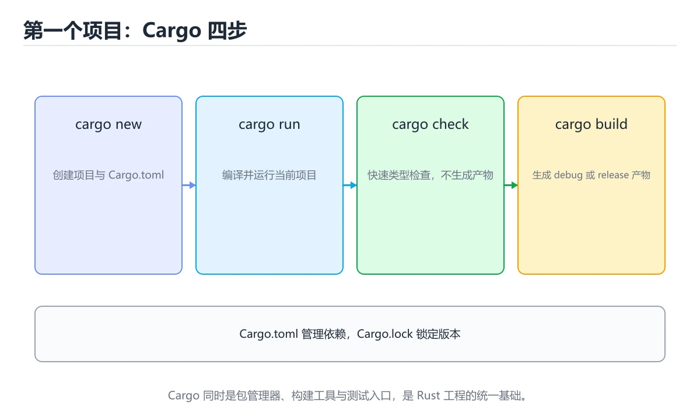
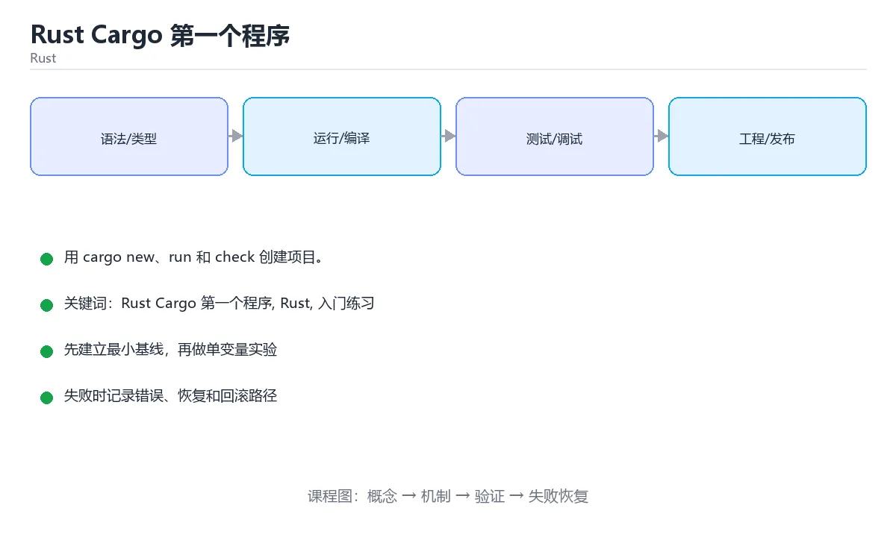

# Rust Cargo 第一个程序

> 内容更新时间：2026-10-06





## 学习目标

- 先认识Rust Cargo 第一个程序需要的工具、输入和输出。
- 按步骤运行最小示例，并记录结果与错误。
- 用一个边界输入验证自己是否真正掌握。

## 前置知识

- 会进行基本的文件或命令行操作。
- 不需要预先掌握「Rust」的高级知识。

## 一句话入门

用 cargo new、run 和 check 创建项目。

## 最小示例

```rust
fn main() {
    println!("hello from Rust");
}
```

## 预期输出

```text
hello from Rust
```

## 常见错误

- 变量没有声明 mut 就尝试修改，导致编译错误。
- 复制命令时遗漏空格、引号或必要参数。

## 动手练习

1. 原样运行最小示例，保存命令和输出。
2. 把数字 2 改成 10，预测并验证新结果。
3. 制造一个错误输入，写出错误信息和修复方法。

## 本课小结

- 入门阶段先保证能运行、能观察、能解释，再追求复杂功能。
- 每次只改一个变量，记录预测与实际结果。
- 遇到错误先看第一条错误信息，再回到最小示例。

## 代码实验：把示例跑成证据

### 实验一：建立基线

```rust
fn main() {
    println!("hello from Rust");
}
```

### 实验二：只改一个输入

沿用「Rust Cargo 第一个程序」的最小示例做一次单变量实验：

| 实验 | 改动 | 预测 | 实际 | 结论 |
| --- | --- | --- | --- | --- |
| 基线 | 保持「Rust Cargo 第一个程序」示例原样 |  |  |  |
| 边界 | 把Rust Cargo 第一个程序换成空值或极值 |  |  |  |
| 失败 | 给Rust传入非法输入 |  |  |  |

做完后用一句话写出「Rust Cargo 第一个程序」的结论：输入怎么变，结果才怎么变。

### 实验三：制造一个可控错误

在需要修改变量时去掉 mut，或者制造一次所有权转移后继续使用原变量。记录借用检查器的完整提示，理解它阻止了什么运行时错误。

| 实验 | 改动 | 预测 | 实际 | 结论 |
| --- | --- | --- | --- | --- |
| 基线 | 保持原样 |  |  |  |
| 边界 |  |  |  |  |
| 失败 |  |  |  |  |

### 实验四：用三句话复述

1. 输入是什么，哪些输入属于合法范围，哪些属于边界或非法范围？
2. 程序按什么顺序处理输入，在哪一步产生了状态变化或副作用？
3. 输出如何验证，失败时第一条可观察证据是什么？

## Rust 基础机制速览

### Cargo、crate 与模块

Cargo 负责创建项目、管理依赖、编译和测试。包由 crate 组成，库 crate 对外暴露 API，二进制 crate 提供可执行入口。模块用 `mod` 组织代码，`pub` 控制可见性，`use` 把路径引入当前作用域。`Cargo.toml` 声明依赖和版本，`Cargo.lock` 固定可复现的依赖解析结果。

### 所有权、借用与生命周期

Rust 用所有权在编译期管理内存：每个值有唯一所有者，所有者离开作用域时值被释放；赋值或传参会移动所有权，除非类型实现了 Copy。借用分为共享借用 `&T` 和可变借用 `&mut T`，同一时间要么多个共享借用，要么一个可变借用，不能同时存在。生命周期标注描述引用之间的关系，不是延长引用存活时间；大多数简单函数可以由编译器自动推导。

### 可变性、模式匹配与控制流

`let` 默认不可变，需要修改时加 `mut`。`if`、`match`、`while let` 和 `for` 都是表达式或控制结构，`match` 必须覆盖所有可能分支。`Option<T>` 表示可能有值，`Result<T,E>` 表示成功或失败，二者迫使调用方显式处理缺失和错误。`?` 运算符把错误向上传播，适合库函数；二进制入口可以决定是否记录并退出。

### 结构体、枚举与 trait

结构体组合数据，枚举表达互斥状态，trait 定义共享行为。泛型让函数和类型适用于多种具体类型，trait bound 约束泛型能力；单态化会在编译期为具体类型生成代码，因此运行时不牺牲性能但会增加二进制体积。迭代器是惰性的，`map`、`filter`、`collect` 等适配器可以组合成清晰的数据流水线，也要注意分配和借用限制。

### 并发与不安全代码

Rust 的类型系统能在编译期阻止数据竞争：`Send` 表示类型可以跨线程转移，`Sync` 表示可以安全共享引用。`Arc<Mutex<T>>` 是共享可变状态的常见组合，`Rc<RefCell<T>>` 只适合单线程。`unsafe` 不会关闭借用检查，而是把某些安全证明责任交给开发者；使用前必须写清前置条件、后置条件和失败后果。

## 本课自测清单与错误对照

本课测验以直接定义和步骤判断为主。请把每个错误选项改写成一句反例，
说明它在哪个输入、边界或前提变化下会失败。

### 完成标准

- [ ] 能用具体输入复现最小示例，并逐行解释输入、处理与输出。
- [ ] 能只改一个值完成边界实验，并让预测与实际结果一致。
- [ ] 能制造一个可控错误，读出第一条错误信息并完成修复。
- [ ] 能不看书说出本课至少两个易错点和对应的验证方法。

### 复盘记录

| 项目 | 记录 |
| --- | --- |
| 学到的核心机制 |  |
| 仍然不确定的问题 |  |
| 下一步验证动作 |  |

## 实践任务

本节围绕Rust Cargo 第一个程序安排 3 个可交付任务，每个任务都要求留下可以复查的记录。

### 任务 1：用自己的话画出结构

不看书，用一张图说清「Rust Cargo 第一个程序」的结构，画完再对照骨架：

- 主干：一句话入门 → 最小示例 → 预期输出 → 常见错误
- 连接线：在每条边上标出输入、输出与失败路径。
- 自检：能否用一句话说明Rust Cargo 第一个程序与Rust的关系？

### 任务 2：做一次对比实验

**验收标准**：表格里两个方案的结论不能完全一样；写下“在什么条件下应该换方案”。

### 任务 3：迁移到自己的场景

**验收标准**：至少有一个可复现的命令、代码片段或数据样例；结论能被别人独立检查。

## 故障现场

### 现场 1：本课的 Rust Cargo 第一个程序 常规用例通过，但边界用例失败

把这条结论放回「Rust Cargo 第一个程序」的完整流程里展开：

- 正文依据：症状：在本课的练习或生产场景里出现“本课的 Rust 结果在两次运行之间不一致”。
- 落地检查：把「现场 1：本课的 Rust Cargo 第一个程序 常规用例通过，但边界用例失败」改写成一条可执行的核对项，逐条验证输入、超时与失败路径。

### 现场 2：本课的 Rust 结果在两次运行之间不一致

**症状**：在本课的练习或生产场景里出现“本课的 Rust 结果在两次运行之间不一致”。

**复现**：准备一组最小输入，只保留触发“本课的 Rust 结果在两次运行之间不一致”的必要条件，连续运行两次确认结果稳定。

**定位**：围绕“Rust 依赖了当前版本、执行顺序或共享状态，单次运行无法暴露差异”检查调用链、输入数据和环境配置，先验证假设再改代码。

**预防**：把“本课的 Rust 结果在两次运行之间不一致”写成一条自动化用例，并在本课的验收清单里保留对应检查项。

### 现场 3：本课的验证只在开发机通过

**症状**：在本课的练习或生产场景里出现“本课的验证只在开发机通过”。

## 版本与时效

- Rust 2024 edition 已成为主流，编译器与标准库保持快速小步演进
- 异步运行时、trait 解析与借用检查规则的变化需要在 CI 中提前暴露
- 升级前用 cargo update、cargo clippy 与 MSRV 矩阵验证
- 官方发布说明：https://blog.rust-lang.org/

### 升级检查清单

- 先固定当前版本，跑通全部示例与测验，再升级工具链。
- 只改一个版本变量，记录编译、测试、性能与产物体积的变化。
- 重点回归默认值、弃用警告、序列化格式、并发语义和错误信息。
- 升级完成后更新本课的“最后复核 / 下次复核”日期与版本说明。

## 本课复习清单

离开本课前，逐项确认：

- [ ] 不看解析，能说出「Cargo 项目中，cargo run 与 cargo check 的区别是？」的判断依据。
- [ ] 不看解析，能说出「Cargo.toml 文件在项目中承担什么职责？」的判断依据。
- [ ] 不看解析，能说出「Rust 中 println!("hello") 末尾的感叹号表示什么？」的判断依据。
- [ ] 不看解析，能说出「Rust 可执行程序的入口是？」的判断依据。
- [ ] 不看解析，能说出「填空：Rust Cargo 第一个程序术语速查中，表示的判断依据。
- [ ] 至少运行一次本课示例，记录输入、输出和一个边界情况。
- [ ] 把本课最容易混淆的两个概念写成一句话对照。

| 复盘项 | 记录 |
| --- | --- |
| 已经能独立解释的考点 |  |
| 仍然说不清的概念 |  |
| 下一步验证动作 |  |

## 逐节复习与自检

下面按正文顺序回顾每一节，并给出一个自检问题；说不清的地方回到原章节补课。

### 一句话入门

自检：这一节的关键输入与输出分别是什么？

### 最小示例

```rust
fn main() {
    println!("hello from Rust");
}
```

自检：这一节与相邻主题的边界在哪里？

### 预期输出

```text
hello from Rust
```

### 常见错误

自检：把这一节讲给没学过的人，最需要强调哪一点？

### 动手练习

自检：如果去掉这一节里的一个前提，结论会怎样变化？

## 术语速查

把「Rust Cargo 第一个程序」里反复出现的术语集中放在一起。复习时先遮住右列，尝试用自己的话解释，再回到正文核对。

| 术语 | 本课语境 |
| --- | --- |
| `Rust` | 把「现场 1：本课的 Rust Cargo 第一个程序 常规用例通过，但边界用例失败」改写成一条可执行的核对项，逐条验证输入、超时与失败路径。 |
| `入门练习` | “Rust Cargo 第一个程序”中的 Rust Cargo 第一个程序、Rust、入门练习，下列哪两项是本课强调的实践判断。 |

## 考点精讲

### 考点 1：概念判断·Rust Cargo 第一个程序

- **题目**：Cargo 项目中，cargo run 与 cargo check 的区别是？
- **判断依据**：在「Rust Cargo 第一个程序」里，cargo run 编译并运行，cargo check 只做类型检查不生成产物。cargo run 先构建再执行二进制目标，适合验证功能。把“cargo run 编译并运行”代回「Rust Cargo 第一个程序」里“Cargo 项目中”的例子核对，条件一旦改变，结论就要用Rust Cargo 第一个程序、Rust、入门练习重新推导。

### 考点 2：概念判断·Rust Cargo 第一个程序

- **题目**：Cargo.toml 文件在项目中承担什么职责？
- **判断依据**：在「Rust Cargo 第一个程序」里，描述项目元数据与依赖。Cargo.toml 用 TOML 格式声明包名、版本、edition 与依赖，Cargo 读取它解析版本并组织构建。在「Rust Cargo 第一个程序」里判断这道题，要把Rust Cargo 第一个程序、Rust、入门练习的条件、过程与失败路径逐项对齐，换成“Cargo.toml 文件在项目中承”这个场景，只有满足前提的结论才成立。

### 考点 3：概念判断·Rust Cargo 第一个程序

- **题目**：Rust 中 println!("hello") 末尾的感叹号表示什么？
- **判断依据**：在「Rust Cargo 第一个程序」里，这是宏调用，编译期会展开成格式化代码。("hello")末尾的感叹号表示什么，判断时要把题干限定的输入、边界与目标逐项对齐。是标准库提供的宏，感叹号是宏调用的标志。在「Rust Cargo 第一个程序」里判断这道题，要把Rust Cargo 第一个程序、Rust、入门练习的条件、过程与失败路径逐项对齐，换成“Rust 中 println”这个场景，只有满足前提的结论才成立。

### 考点 4：多选辨析·Rust Cargo 第一个程序

- **题目**：围绕“Rust Cargo 第一个程序”中的 Rust Cargo 第一个程序、Rust、入门练习，下列哪两项是本课强调的实践判断？
- **判断依据**：题干的正确项是学习 Rust Cargo 第一个程序 时要同时说明输入、输出和失败路径，不能只看正常流程。在「Rust Cargo 第一个程序」里，验证 Rust 时要固定版本并覆盖边界输入，结论才可复现。结论应落在学习 Rust Cargo 第一个程序 时要同时说明输入、输出和失败路径。

### 考点 5：填空·____

- **题目**：填空：在「Rust Cargo 第一个程序」的术语速查里，「Cargo 负责创建项目、管理依赖、编译和测试。包由 crate 组成，库 crate 对外暴露 API，二进制 crate 提供可执行入口。模块用 `____` 组织代码，`pub` 控制可见性，`use` 把路径引入当前作用域。`Carg」描述的是哪个术语？
- **判断依据**：包由 crate 组成，库 crate 对外暴露 API，二进制 crate 提供可执行入口。把“mod”代回「Rust Cargo 第一个程序」里“在Rust Cargo 第一个程序的术语速查里”的例子核对，条件一旦改变，结论就要用Rust Cargo 第一个程序、Rust、入门练习重新推导。

### 考点 6：排错·Rust Cargo 第一个程序

- **题目**：阅读「Rust Cargo 第一个程序」的代码片段，下面哪项判断是正确的？
- **判断依据**：在「Rust Cargo 第一个程序」里，题干的正确项是cargo run 编译并运行，cargo check 只做类型检查不生成产物。在「Rust Cargo 第一个程序」里判断这道题，要把Rust Cargo 第一个程序、Rust、入门练习的条件、过程与失败路径逐项对齐，换成“阅读Rust Cargo 第一个程序”这个场景，只有满足前提的结论才成立。

## English Overview

**Title:** First Rust Cargo Program

**Summary:** Create and run a project with cargo.

**Category:** Rust
**Level:** 入门
**Key terms:** Rust Cargo 第一个程序, Rust, 入门练习

## 内容元数据

- 内容版本：v2.0
- 最后更新：2026-10-06
- 学习阶段：入门
- 适用环境：Rust 1.85+ / Cargo
- 内容来源：内置结构化课程与工程实践整理
- 相关主题：Rust Cargo 第一个程序、Rust、入门练习
- 质量版本：P0 测验标准 + P1 覆盖扩展 + P2 体验补全

## 参考资料与复核

- 最后复核：2026-10-04
- 下次复核：2027-04-04
- 复核范围：版本兼容、API 行为、安全建议与工程实践
- 来源性质：官方文档、标准或权威教材；正文为离线教学重组

| 参考资料 | 本课用途 |
| --- | --- |
| [Cargo Book](https://doc.rust-lang.org/cargo/) | 依赖、工作区与发布 |
| [Rust 标准库](https://doc.rust-lang.org/std/) | 标准库 API 与容器 |
| [Rust 测试](https://doc.rust-lang.org/book/ch11-00-testing.html) | 单元测试与集成测试 |

> 「Rust Cargo 第一个程序」的链接用于离线阅读后的延伸核对；App 不会自动联网。

## 复习与迁移

复习目标：把「Rust Cargo 第一个程序」的判断标准放回可复现的例子里。先自己作答，再对照依据；如果结论正确但理由不完整，回到正文补足前提。

### 概念复述

- 用一句话说明「Rust Cargo 第一个程序」解决什么问题：用 cargo new、run 和 check 创建项目。
- 写出Rust Cargo 第一个程序、Rust、入门练习之间的关系，并各举一个例子。
- 说出本课最容易混淆的两个概念，以及区分它们的判据。

### 正文逐节复核

- **Rust 基础机制速览**：Rust 用所有权在编译期管理内存：每个值有唯一所有者，所有者离开作用域时值被释放；赋值或传参会移动所有权，除非类型实现了 Copy。
- **实践任务**：本节围绕Rust Cargo 第一个程序安排 3 个可交付任务，每个任务都要求留下可以复查的记录。

### 测验回顾

1. Cargo 项目中，cargo run 与 cargo check 的区别是？
   - 依据：在「Rust Cargo 第一个程序」里，cargo run 编译并运行，cargo check 只做类型检查不生成产物。cargo run 先构建再执行二进制目标，适合验证功能。把“cargo run 编译并运行”代回「Rust Cargo 第一个程序」里“Cargo 项目中”的例子核对，条件一旦改变，结论就要用Rust Cargo 第一个程序、Rust、入门练习重新推导。
2. Cargo.toml 文件在项目中承担什么职责？
   - 依据：在「Rust Cargo 第一个程序」里，描述项目元数据与依赖。Cargo.toml 用 TOML 格式声明包名、版本、edition 与依赖，Cargo 读取它解析版本并组织构建。在「Rust Cargo 第一个程序」里判断这道题，要把Rust Cargo 第一个程序、Rust、入门练习的条件、过程与失败路径逐项对齐，换成“Cargo.toml 文件在项目中承”这个场景，只有满足前提的结论才成立。
3. Rust 中 println!("hello") 末尾的感叹号表示什么？
   - 依据：在「Rust Cargo 第一个程序」里，这是宏调用，编译期会展开成格式化代码。("hello")末尾的感叹号表示什么，判断时要把题干限定的输入、边界与目标逐项对齐。是标准库提供的宏，感叹号是宏调用的标志。在「Rust Cargo 第一个程序」里判断这道题，要把Rust Cargo 第一个程序、Rust、入门练习的条件、过程与失败路径逐项对齐，换成“Rust 中 println”这个场景，只有满足前提的结论才成立。
4. 围绕“Rust Cargo 第一个程序”中的 Rust Cargo 第一个程序、Rust、入门练习，下列哪两项是本课强调的实践判断？
   - 依据：题干的正确项是学习 Rust Cargo 第一个程序 时要同时说明输入、输出和失败路径，不能只看正常流程。在「Rust Cargo 第一个程序」里，验证 Rust 时要固定版本并覆盖边界输入，结论才可复现。结论应落在学习 Rust Cargo 第一个程序 时要同时说明输入、输出和失败路径。
5. 填空：在「Rust Cargo 第一个程序」的术语速查里，「Cargo 负责创建项目、管理依赖、编译和测试。包由 crate 组成，库 crate 对外暴露 API，二进制 crate 提供可执行入口。模块用 `____` 组织代码，`pub` 控制可见性，`use` 把路径引入当前作用域。`Carg」描述的是哪个术语？
   - 依据：包由 crate 组成，库 crate 对外暴露 API，二进制 crate 提供可执行入口。把“mod”代回「Rust Cargo 第一个程序」里“在Rust Cargo 第一个程序的术语速查里”的例子核对，条件一旦改变，结论就要用Rust Cargo 第一个程序、Rust、入门练习重新推导。
6. 阅读「Rust Cargo 第一个程序」的代码片段，下面哪项判断是正确的？
   - 依据：在「Rust Cargo 第一个程序」里，题干的正确项是cargo run 编译并运行，cargo check 只做类型检查不生成产物。在「Rust Cargo 第一个程序」里判断这道题，要把Rust Cargo 第一个程序、Rust、入门练习的条件、过程与失败路径逐项对齐，换成“阅读Rust Cargo 第一个程序”这个场景，只有满足前提的结论才成立。

### 迁移练习

把「Rust Cargo 第一个程序」的结论迁移到相邻主题，每次迁移都写清预测与证据：

1. 换输入：用Rust Cargo 第一个程序处理一组你自己的数据，对比教材示例的结果差异。
2. 换失败条件：制造一个Rust相关的错误，说明如何从错误信息定位根因。
3. 换规模：把数据量或并发度提高一个数量级，说明「Rust Cargo 第一个程序」的结论是否仍成立。

## 工程化精练：决策、失败与验证

这一章把「Rust Cargo 第一个程序」从“看懂”推进到“能判断、能验证、能排错”。所有判断都围绕Rust Cargo 第一个程序、Rust与入门练习展开，并与前文的示例、测验和失败现场互相对照。

### 一、Rust Cargo 第一个程序 的判断算法

| 步骤 | 要回答的问题 | 判断依据 | 记录什么 |
| --- | --- | --- | --- |
| 1. 定目标 | 「Rust Cargo 第一个程序」这一步要解决什么问题？ | 把Rust Cargo 第一个程序的目标写成一句可验证的结论 | 输入、约束、成功标准 |
| 2. 找边界 | Rust在什么条件下失效？ | 先列空值、极值、重复和失败路径 | 反例与触发条件 |
| 3. 跑基线 | 原始示例的真实输出是什么？ | 命令、版本和环境必须可复现 | 命令、输出、耗时 |
| 4. 只改一处 | 把入门练习换成另一种取值会怎样？ | 预测写在运行之前 | 预测与实际的差异 |
| 5. 回写结论 | 结论能否被他人复现？ | 把判断写成清单或测试 | 结论、证据、遗留问题 |

这张表的用法不是从上到下浏览，而是每次只填一行：先用「Rust Cargo 第一个程序」前文的示例验证第 3 行，再故意破坏一个条件验证第 2 行。当你能在不看解析的情况下说出Rust Cargo 第一个程序的判断依据，才算真正掌握本课。

- 先从Rust Cargo 第一个程序入手：把它写成“输入是什么、输出是什么、哪一步最容易出错”。如果这三句话中有一句说不清，说明对「Rust Cargo 第一个程序」的理解还停留在术语层面，需要回到正文的最小示例重新观察一次。

- 再把Rust当成对照实验的变量：固定其他条件，只改变它的取值，记录输出是否变化。结论“变”或“不变”都要写出理由，并说明这个理由能否被他人独立复现。

- 针对入门练习做一次失败演练：故意给出空值、极值或错误类型，观察「Rust Cargo 第一个程序」的报错位置和处理方式。错误信息只是入口，真正要定位的是哪一层假设被破坏。

- 把「Rust Cargo 第一个程序」的结论压缩成一条可执行清单：先检查输入，再检查版本与环境，然后跑最小用例，最后才扩大规模。顺序颠倒会让排错范围成倍增加。

- 如果结论依赖时间或规模，就把数据量提高一个数量级再跑一次。在「Rust Cargo 第一个程序」里，小样本成立不代表大样本成立，复杂度、资源占用和失败率都要重新记录。

- 如果结论依赖并发或共享状态，就固定输入并连续运行多次。结果不一致时，优先怀疑「Rust Cargo 第一个程序」中Rust Cargo 第一个程序相关步骤的隐藏状态，而不是先改代码。

- 把「Rust Cargo 第一个程序」的判断写成测试：一个正常用例、一个边界用例、一个失败用例。测试通过只是起点，还要确认失败用例确实以预期方式失败。

- 把本课与相邻主题连起来：Rust Cargo 第一个程序解决的是“怎么做”，Rust回答“什么时候不适用”。两者都答得出来，迁移才算完成。

> 第 2 轮复核「Rust Cargo 第一个程序」：把上面的结论逐条改写为可验证的问题，并记录仍不确定的部分。

- 先从Rust Cargo 第一个程序入手：把它写成“输入是什么、输出是什么、哪一步最容易出错”。如果这三句话中有一句说不清，说明对「Rust Cargo 第一个程序」的理解还停留在术语层面，需要回到正文的最小示例重新观察一次。

- 再把Rust当成对照实验的变量：固定其他条件，只改变它的取值，记录输出是否变化。结论“变”或“不变”都要写出理由，并说明这个理由能否被他人独立复现。

- 针对入门练习做一次失败演练：故意给出空值、极值或错误类型，观察「Rust Cargo 第一个程序」的报错位置和处理方式。错误信息只是入口，真正要定位的是哪一层假设被破坏。

- 把「Rust Cargo 第一个程序」的结论压缩成一条可执行清单：先检查输入，再检查版本与环境，然后跑最小用例，最后才扩大规模。顺序颠倒会让排错范围成倍增加。

- 如果结论依赖时间或规模，就把数据量提高一个数量级再跑一次。在「Rust Cargo 第一个程序」里，小样本成立不代表大样本成立，复杂度、资源占用和失败率都要重新记录。

- 如果结论依赖并发或共享状态，就固定输入并连续运行多次。结果不一致时，优先怀疑「Rust Cargo 第一个程序」中Rust Cargo 第一个程序相关步骤的隐藏状态，而不是先改代码。

### 二、Rust Cargo 第一个程序 的机制拆解与自测

把本课考点还原成可回答的问题，再逐题写出依据：

**问题 1**：Cargo 项目中，cargo run 与 cargo check 的区别是？

- 关联术语：Rust Cargo 第一个程序
- 判断依据：cargo run 编译并运行，cargo check 只做类型检查不生成产物
- 追问：如果把Rust Cargo 第一个程序的条件换成边界值，这个结论是否仍然成立？

**问题 2**：Cargo.toml 文件在项目中承担什么职责？

- 关联术语：Rust
- 判断依据：描述项目元数据与依赖
- 追问：如果把Rust的条件换成边界值，这个结论是否仍然成立？

**问题 3**：Rust 中 println!("hello") 末尾的感叹号表示什么？

- 关联术语：入门练习
- 判断依据：这是宏调用，编译期会展开成格式化代码
- 追问：如果把入门练习的条件换成边界值，这个结论是否仍然成立？

**问题 4**：围绕“Rust Cargo 第一个程序”中的 Rust Cargo 第一个程序、Rust、入门练习，下列哪两项是本课强调的实践判断？

- 关联术语：Rust Cargo 第一个程序
- 判断依据：学习 Rust Cargo 第一个程序 时要同时说明输入、输出和失败路径，不能只看正常流程
- 追问：如果把Rust Cargo 第一个程序的条件换成边界值，这个结论是否仍然成立？

**问题 5**：填空：在「Rust Cargo 第一个程序」的术语速查里，「Cargo 负责创建项目、管理依赖、编译和测试。包由 crate 组成，库 crate 对外暴露 API，二进制 crate 提供可执行入口。模块用 `____` 组织代码，`pub` 控制可见性，`use` 把路径引入当前作用域。`Carg」描述的是哪个术语？

- 关联术语：Rust
- 判断依据：回到「Rust Cargo 第一个程序」正文对应小节，先用最小示例验证再下结论。
- 追问：如果把Rust的条件换成边界值，这个结论是否仍然成立？

**问题 6**：阅读「Rust Cargo 第一个程序」的代码片段，下面哪项判断是正确的？

- 关联术语：入门练习
- 判断依据：回到「Rust Cargo 第一个程序」正文对应小节，先用最小示例验证再下结论。
- 追问：如果把入门练习的条件换成边界值，这个结论是否仍然成立？

### 三、失败模式与修复顺序

| 失败信号 | 常见根因 | 先做什么 | 修复后如何确认 |
| --- | --- | --- | --- |
| 「Rust Cargo 第一个程序」中 Rust Cargo 第一个程序 相关步骤报错 | 输入、版本或前置条件与示例不一致 | 保留第一条错误信息，回到最小输入 | 用cargo run 编译并运行，cargo check 只做类型检查不生成产物复跑，确认输出可复现 |
| 「Rust Cargo 第一个程序」中 Rust 相关步骤报错 | 输入、版本或前置条件与示例不一致 | 保留第一条错误信息，回到最小输入 | 用描述项目元数据与依赖复跑，确认输出可复现 |
| 「Rust Cargo 第一个程序」中 入门练习 相关步骤报错 | 输入、版本或前置条件与示例不一致 | 保留第一条错误信息，回到最小输入 | 用这是宏调用，编译期会展开成格式化代码复跑，确认输出可复现 |
| 结果在两次运行之间不一致 | 隐藏状态、并发或环境差异 | 固定版本与输入，记录随机因素 | 连续运行三次得到同一结论 |
| 单次结果正确但规模一大就失效 | 只测了正常路径，没有覆盖边界 | 把数据量或并发度提高一个数量级 | 记录边界值、耗时与失败率 |

排错顺序固定为：先复现，再缩小输入，然后只改一个条件，最后把结论写成回归用例。对「Rust Cargo 第一个程序」来说，任何不能复现的“修好了”都不算完成。

### 四、离开本课前的验证清单

| 检查项 | 通过标准 | 证据 |
| --- | --- | --- |
| 能复述 | 用三句话说明「Rust Cargo 第一个程序」解决什么问题、边界在哪 | 不看解析写出的结论 |
| 能运行 | 最小示例在本机跑通 | 命令、输出与版本 |
| 能改条件 | 只改一个输入并解释差异 | 预测与实际的对照 |
| 能排错 | 至少制造并修复一个失败 | 错误信息与修复步骤 |
| 能迁移 | 把Rust Cargo 第一个程序、Rust、入门练习用到新场景 | 一个自选练习的结论 |

完成标准：能不看解析说清「Rust Cargo 第一个程序」全部自测题的依据，并且至少有一条Rust Cargo 第一个程序相关的结论经过真实运行验证。如果某一步只停留在“感觉懂了”，就把它写成下一轮针对「Rust Cargo 第一个程序」的最小验证任务。

### 五、把结论写成可检查的证据

学习「Rust Cargo 第一个程序」时，最容易出现的情况是“听过、看懂了，但换一个输入就说不清”。下面把Rust Cargo 第一个程序与Rust放进一条可检查的证据链：每一句结论都要能回答“从哪里来、在什么条件下成立、失败时怎么发现”。

| 证据类型 | 本课要求 | 不合格的表现 |
| --- | --- | --- |
| 概念证据 | 用一句话说明Rust Cargo 第一个程序的定义与适用场景 | 只背术语，说不出它解决什么问题 |
| 运行证据 | 能复现「Rust Cargo 第一个程序」的最小示例 | 输出与记录对不上，或换机器就不一致 |
| 对照证据 | 只改一个条件，说明差异来自哪里 | 一次改多个变量，无法归因 |
| 失败证据 | 故意制造错误并记录恢复步骤 | 只测正常路径，失败时靠猜 |
| 迁移证据 | 把Rust用到自选场景 | 换一个例子就完全套不上 |

举例：cargo run 编译并运行，cargo check 只做类型检查不生成产物。把这个结论代回「Rust Cargo 第一个程序」的正文，找出它对应的输入、处理步骤与输出；再换掉其中一个条件，观察结论是否仍然成立。能完成这一步，才说明这条知识已经从“记忆”变成“可用的判断”。

最后留一个自检问题：如果只能保留三条笔记，你会写下哪三句？把答案限定为「Rust Cargo 第一个程序」中的可验证结论，并给每条结论配一个反例。这三句加上对应反例，就是本课最值得带入后续课程的复习材料。
