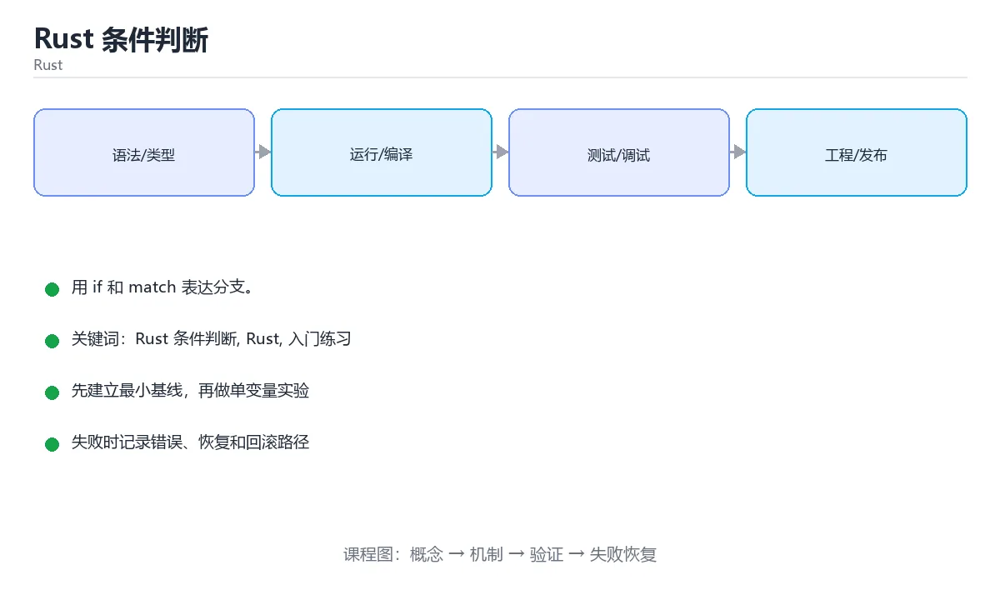

# Rust 条件判断




> 内容更新时间：2026-10-03 · 学习阶段：入门 · 预计用时：15 分钟

## 学习目标

- 先认识「Rust 条件判断」需要的工具、输入和输出。
- 按步骤运行最小示例，并记录结果与错误。
- 用一个边界输入验证自己是否真正掌握。

## 前置知识

- 会进行基本的文件或命令行操作。
- 不需要预先掌握「Rust」的高级知识。

## 一句话入门

用 if 和 match 表达分支。

## 最小示例

```rust
fn main() {
    let temperature = 31;
    let state = if temperature > 30 { "hot" } else { "normal" };
    println!("{state}");
}
```

## 预期输出

```text
hot
```

## 常见错误

- 变量没有声明 mut 就尝试修改，导致编译错误。
- 复制命令时遗漏空格、引号或必要参数。

## 动手练习

1. 原样运行最小示例，保存命令和输出。
2. 把数字 2 改成 10，预测并验证新结果。
3. 制造一个错误输入，写出错误信息和修复方法。

## 本课小结

- 入门阶段先保证能运行、能观察、能解释，再追求复杂功能。
- 每次只改一个变量，记录预测与实际结果。
- 遇到错误先看第一条错误信息，再回到最小示例。


## 代码实验：把示例跑成证据

这一节不引入新语法，而是把「Rust 条件判断」的最小示例变成可以复现、可以对照的实验。每次只改变一个条件，先写预测，再运行，最后解释差异。

### 实验一：建立基线

```rust
fn main() {
    let temperature = 31;
    let state = if temperature > 30 { "hot" } else { "normal" };
    println!("{state}");
}
```

先原样运行上面的代码，记录命令、完整输出和退出状态。然后把输出与正文的预期输出逐字对照，不要用“看起来差不多”代替核对；空格、大小写、换行和错误流向都可能暴露环境差异。

### 实验二：只改一个输入

从代码中选一个会影响结果的字面量、参数或输入，把它替换成边界值：数值可尝试 0、1、最大值和最小值，字符串可尝试空串和超长文本，集合可尝试空集合、单元素和重复元素。先写出预测，再运行并记录实际结果。

### 实验三：制造一个可控错误

在需要修改变量时去掉 mut，或者制造一次所有权转移后继续使用原变量。记录借用检查器的完整提示，理解它阻止了什么运行时错误。

| 实验 | 改动 | 预测 | 实际 | 结论 |
| --- | --- | --- | --- | --- |
| 基线 | 保持原样 |  |  |  |
| 边界 |  |  |  |  |
| 失败 |  |  |  |  |

### 实验四：用三句话复述

1. 输入是什么，哪些输入属于合法范围，哪些属于边界或非法范围？
2. 程序按什么顺序处理输入，在哪一步产生了状态变化或副作用？
3. 输出如何验证，失败时第一条可观察证据是什么？

## Rust 基础机制速览

### Cargo、crate 与模块

Cargo 负责创建项目、管理依赖、编译和测试。包由 crate 组成，库 crate 对外暴露 API，二进制 crate 提供可执行入口。模块用 `mod` 组织代码，`pub` 控制可见性，`use` 把路径引入当前作用域。`Cargo.toml` 声明依赖和版本，`Cargo.lock` 固定可复现的依赖解析结果。

### 所有权、借用与生命周期

Rust 用所有权在编译期管理内存：每个值有唯一所有者，所有者离开作用域时值被释放；赋值或传参会移动所有权，除非类型实现了 Copy。借用分为共享借用 `&T` 和可变借用 `&mut T`，同一时间要么多个共享借用，要么一个可变借用，不能同时存在。生命周期标注描述引用之间的关系，不是延长引用存活时间；大多数简单函数可以由编译器自动推导。

### 可变性、模式匹配与控制流

`let` 默认不可变，需要修改时加 `mut`。`if`、`match`、`while let` 和 `for` 都是表达式或控制结构，`match` 必须覆盖所有可能分支。`Option<T>` 表示可能有值，`Result<T,E>` 表示成功或失败，二者迫使调用方显式处理缺失和错误。`?` 运算符把错误向上传播，适合库函数；二进制入口可以决定是否记录并退出。

### 结构体、枚举与 trait

结构体组合数据，枚举表达互斥状态，trait 定义共享行为。泛型让函数和类型适用于多种具体类型，trait bound 约束泛型能力；单态化会在编译期为具体类型生成代码，因此运行时不牺牲性能但会增加二进制体积。迭代器是惰性的，`map`、`filter`、`collect` 等适配器可以组合成清晰的数据流水线，也要注意分配和借用限制。

### 并发与不安全代码

Rust 的类型系统能在编译期阻止数据竞争：`Send` 表示类型可以跨线程转移，`Sync` 表示可以安全共享引用。`Arc<Mutex<T>>` 是共享可变状态的常见组合，`Rc<RefCell<T>>` 只适合单线程。`unsafe` 不会关闭借用检查，而是把某些安全证明责任交给开发者；使用前必须写清前置条件、后置条件和失败后果。

## 本课自测清单与错误对照

下面把「Rust 条件判断」最容易混淆的选项集中起来。不要只记正确答案，要能说明错误选项在什么条件下看似合理、又为什么不能满足题干。

本课测验以直接定义和步骤判断为主。请把每个错误选项改写成一句反例，
说明它在哪个输入、边界或前提变化下会失败。

### 完成标准

- [ ] 能用具体输入复现最小示例，并逐行解释输入、处理与输出。
- [ ] 能只改一个值完成边界实验，并让预测与实际结果一致。
- [ ] 能制造一个可控错误，读出第一条错误信息并完成修复。
- [ ] 能不看书说出本课至少两个易错点和对应的验证方法。

### 复盘记录

| 项目 | 记录 |
| --- | --- |
| 学到的核心机制 |  |
| 仍然不确定的问题 |  |
| 下一步验证动作 |  |


## 实践任务

本节围绕“Rust 条件判断”安排 3 个可交付任务，每个任务都要求留下可以复查的记录。

### 任务 1：用自己的话画出结构

合上教程，用 5 句话说明“Rust 条件判断”解决什么问题、输入是什么、输出是什么、失败时会怎样、与相邻概念的边界在哪里。画一张流程图或状态图，把每个节点标注成“输入 / 处理 / 输出 / 失败路径”之一。

**验收标准**：图里至少有 5 个节点和 1 条失败路径；每个节点都能在正文中找到依据。

### 任务 2：做一次对比实验

从正文里选两个差异最小的方案，列成 4 列表格：方案、前提、代价、适用边界。然后只改变一个条件（数据规模、并发度、精度或资源上限），记录结果变化。

**验收标准**：表格里两个方案的结论不能完全一样；写下“在什么条件下应该换方案”。

### 任务 3：迁移到自己的场景

把“Rust 条件判断”的核心方法用到你熟悉的一个真实场景，写出一份 300 字以内的实施记录：目标、步骤、验证方式、仍然不确定的问题。

**验收标准**：至少有一个可复现的命令、代码片段或数据样例；结论能被别人独立检查。


## 故障现场

这一节把“Rust 条件判断”最常见的失败方式还原成现场记录，练习时按“症状 → 复现 → 定位 → 修复 → 预防”的顺序排查。

### 现场 1：“Rust 条件判断”的 Rust 条件判断 常规用例通过，但边界用例失败

**症状**：在“Rust 条件判断”的练习或生产场景里出现““Rust 条件判断”的 Rust 条件判断 常规用例通过，但边界用例失败”。

**复现**：准备一组最小输入，只保留触发““Rust 条件判断”的 Rust 条件判断 常规用例通过，但边界用例失败”的必要条件，连续运行两次确认结果稳定。

**定位**：围绕“Rust 条件判断 的前置条件与取值边界没有写进代码，默认值掩盖了空值和极值”检查调用链、输入数据和环境配置，先验证假设再改代码。

**修复**：为“Rust 条件判断”补一条空值或极值用例，把前置条件写成断言，并让失败信息直接指出是哪个输入越界

**预防**：把““Rust 条件判断”的 Rust 条件判断 常规用例通过，但边界用例失败”写成一条自动化用例，并在“Rust 条件判断”的验收清单里保留对应检查项。


### 现场 2：“Rust 条件判断”的 Rust 结果在两次运行之间不一致

**症状**：在“Rust 条件判断”的练习或生产场景里出现““Rust 条件判断”的 Rust 结果在两次运行之间不一致”。

**复现**：准备一组最小输入，只保留触发““Rust 条件判断”的 Rust 结果在两次运行之间不一致”的必要条件，连续运行两次确认结果稳定。

**定位**：围绕“Rust 依赖了当前版本、执行顺序或共享状态，单次运行无法暴露差异”检查调用链、输入数据和环境配置，先验证假设再改代码。

**修复**：固定“Rust 条件判断”使用的版本与随机种子，记录两次运行的完整输入和输出，再逐项消除非确定性来源

**预防**：把““Rust 条件判断”的 Rust 结果在两次运行之间不一致”写成一条自动化用例，并在“Rust 条件判断”的验收清单里保留对应检查项。


### 现场 3：“Rust 条件判断”的验证只在开发机通过

**症状**：在“Rust 条件判断”的练习或生产场景里出现““Rust 条件判断”的验证只在开发机通过”。

**复现**：准备一组最小输入，只保留触发““Rust 条件判断”的验证只在开发机通过”的必要条件，连续运行两次确认结果稳定。

**定位**：围绕“环境版本、配置和输入规模与目标环境不同，Rust 条件判断 缺少可重复的验证记录”检查调用链、输入数据和环境配置，先验证假设再改代码。

**修复**：把“Rust 条件判断”的运行环境、输入样本和预期输出写成清单，并在另一套环境复跑同一条命令

**预防**：把““Rust 条件判断”的验证只在开发机通过”写成一条自动化用例，并在“Rust 条件判断”的验收清单里保留对应检查项。


## 版本与时效

这一节记录“Rust 条件判断”涉及的版本基线与升级检查点，避免把某个版本的默认行为当成永久结论。

- Rust 2024 edition 已成为主流，编译器与标准库保持快速小步演进
- 异步运行时、trait 解析与借用检查规则的变化需要在 CI 中提前暴露
- 升级前用 cargo update、cargo clippy 与 MSRV 矩阵验证
- 官方发布说明：https://blog.rust-lang.org/

### 升级检查清单

- 先固定当前版本，跑通全部示例与测验，再升级工具链。
- 只改一个版本变量，记录编译、测试、性能与产物体积的变化。
- 重点回归默认值、弃用警告、序列化格式、并发语义和错误信息。
- 升级完成后更新本课的“最后复核 / 下次复核”日期与版本说明。


## 考点精讲：把测验题还原成判断过程

本课有 5 个判断点。先自己作答，再看「判断依据」；如果结论正确但理由不完整，回到正文对应章节补足概念。

### 考点 1：Rust 中 let state = if temperature > 30 { "hot" } else { "normal" }; 说明什么？

- **正确判断**：if 是表达式，分支的值可以直接赋给变量
- **判断依据**：正确答案是「if 是表达式，分支的值可以直接赋给变量」，这道题在问Rust中letstate=iftemperatur…}else{"normal"};说明什么，判断时要把题干限定的输入、边界与目标逐项对齐。Rust 的 if 是表达式，两个分支的值类型必须一致，整体结果可以赋给变量或直接参与运算。
- **迁移检查**：把题干里的一个条件换成边界值，原来的结论还成立吗？写出判断过程。

### 考点 2：Rust 中 if 条件的位置要求是什么？

- **正确判断**：条件必须是 bool 类型，不能直接写整数或指针
- **判断依据**：正确答案是「条件必须是 bool 类型，不能直接写整数或指针」，这道题在问Rust中if条件的位置要求是什么，判断时要把题干限定的输入、边界与目标逐项对齐。Rust 要求条件表达式的类型严格为 bool，因此 if count 这类写法会直接编译失败，必须写成 if count != 0 或 if !items.isempty()。
- **迁移检查**：把题干里的一个条件换成边界值，原来的结论还成立吗？写出判断过程。

### 考点 3：Rust 的 match 表达式有什么特点？

- **正确判断**：必须覆盖所有可能情况，否则编译报错
- **判断依据**：正确答案是「必须覆盖所有可能情况，否则编译报错」，这道题在问Rust的match表达式有什么特点，判断时要把题干限定的输入、边界与目标逐项对齐。match 要求穷尽所有模式，可以显式列出或用 兜底，编译器会检查遗漏，因此它常用于处理枚举与 Option、Result。
- **迁移检查**：遮住选项，只根据定义复述一次答案，再回来看哪个选项与复述一致。

### 考点 4：Rust 条件判断示例中，温度为 31 时程序输出什么？

- **正确判断**：hot，if 表达式返回第一个分支的字符串
- **判断依据**：正确答案是「hot，if 表达式返回第一个分支的字符串」，这道题在问Rust条件判断示例中，温度为31时程序输出什么，判断时要把题干限定的输入、边界与目标逐项对齐。31 > 30 成立，if 表达式返回 "hot" 并赋给 state，println! 用 {state} 输出该值。
- **迁移检查**：把题干里的一个条件换成边界值，原来的结论还成立吗？写出判断过程。

### 考点 5：填空：「Rust 条件判断」术语速查中，表示「Cargo 负责创建项目、管理依赖、编译和测试。包由 crate 组成，库 crate 对外暴露 API，二进制 crate 提供可执行入口。模块用 `____` 组织代码，`pub` 控制可见性，`use` 把路径引入当前作用域。`Carg…」的术语是什么？

- **正确判断**：mod
- **判断依据**：正确答案是「mod」，这道题在问填空：Rust条件判断术语速查中，表示Cargo负责…引入当前作用域，`Carg…的术语是什么，判断时要把题干限定的输入、边界与目标逐项对齐。课程摘要指出用 if 和 match 表达分支，本课要判断的正是填空：Rust条件判断术语速查中，表示Cargo负责…引入当前作用域，`Carg…的术语是什么。
- **迁移检查**：把答案换成另一种等价写法，是否仍然正确？说明依据。

### 补充自测（2 题）

1. 围绕“Rust 条件判断”中的 Rust 条件判断、Rust、入门练习，下列哪两项是本课强调的实践判断？
2. 下面这段 Rust 代码复现了“Rust 条件判断”中 Rust 条件判断、Rust、入门练习 相关的一个常见故障，哪一项最准确地解释了问题？

这些题按“先定位概念、再排除边界错误、最后核对答案”的顺序作答；每题解析都给出了判断依据。


## 本课复习清单

离开本课前，逐项确认：

- [ ] 不看解析，能说出「Rust 中 let state = if temperature > 30 {…」的判断依据。
- [ ] 不看解析，能说出「Rust 中 if 条件的位置要求是什么？」的判断依据。
- [ ] 不看解析，能说出「Rust 的 match 表达式有什么特点？」的判断依据。
- [ ] 不看解析，能说出「Rust 条件判断示例中，温度为 31 时程序输出什么？」的判断依据。
- [ ] 不看解析，能说出「填空：「Rust 条件判断」术语速查中，表示「Cargo 负责创建项目、管理依赖…」的判断依据。
- [ ] 至少运行一次本课示例，记录输入、输出和一个边界情况。
- [ ] 把本课最容易混淆的两个概念写成一句话对照。

| 复盘项 | 记录 |
| --- | --- |
| 已经能独立解释的考点 |  |
| 仍然说不清的概念 |  |
| 下一步验证动作 |  |

## 逐节复习与自检

下面按正文顺序回顾每一节，并给出一个自检问题；说不清的地方回到原章节补课。

### 最小示例

```rust
fn main() {
    let temperature = 31;
    let state = if temperature > 30 { "hot" } else { "normal" };
    println!("{state}");
}
```

自检：这一节与相邻主题的边界在哪里？

### 预期输出

```text
hot
```

自检：这一节与相邻主题的边界在哪里？

### 常见错误

变量没有声明 mut 就尝试修改，导致编译错误。

自检：把这一节讲给没学过的人，最需要强调哪一点？

### 动手练习

把数字 2 改成 10，预测并验证新结果。制造一个错误输入，写出错误信息和修复方法。

自检：如果去掉这一节里的一个前提，结论会怎样变化？

## 术语速查

把本课反复出现的术语集中放在一起。复习时先遮住右列，尝试用自己的话解释，再回到正文核对。

| 术语 | 本课语境 |
| --- | --- |
| `mod` | Cargo 负责创建项目、管理依赖、编译和测试。包由 crate 组成，库 crate 对外暴露 API，二进制 crate 提供可执行入口。模块用 `mod` 组织代码，`pub` 控制可见性，`use` 把路径引入当… |
| `pub` | Cargo 负责创建项目、管理依赖、编译和测试。包由 crate 组成，库 crate 对外暴露 API，二进制 crate 提供可执行入口。模块用 `mod` 组织代码，`pub` 控制可见性，`use` 把路径引入当… |
| `use` | Cargo 负责创建项目、管理依赖、编译和测试。包由 crate 组成，库 crate 对外暴露 API，二进制 crate 提供可执行入口。模块用 `mod` 组织代码，`pub` 控制可见性，`use` 把路径引入当… |
| `Cargo.toml` | Cargo 负责创建项目、管理依赖、编译和测试。包由 crate 组成，库 crate 对外暴露 API，二进制 crate 提供可执行入口。模块用 `mod` 组织代码，`pub` 控制可见性，`use` 把路径引入当… |
| `Cargo.lock` | Cargo 负责创建项目、管理依赖、编译和测试。包由 crate 组成，库 crate 对外暴露 API，二进制 crate 提供可执行入口。模块用 `mod` 组织代码，`pub` 控制可见性，`use` 把路径引入当… |
| `&T` | Rust 用所有权在编译期管理内存：每个值有唯一所有者，所有者离开作用域时值被释放；赋值或传参会移动所有权，除非类型实现了 Copy。借用分为共享借用 `&T` 和可变借用 `&mut T`，同一时间要么多个共享借用，要… |
| `&mut T` | Rust 用所有权在编译期管理内存：每个值有唯一所有者，所有者离开作用域时值被释放；赋值或传参会移动所有权，除非类型实现了 Copy。借用分为共享借用 `&T` 和可变借用 `&mut T`，同一时间要么多个共享借用，要… |
| `let` | `let` 默认不可变，需要修改时加 `mut`。`if`、`match`、`while let` 和 `for` 都是表达式或控制结构，`match` 必须覆盖所有可能分支。`Option<T>` 表示可能有值，`Re… |
| `mut` | `let` 默认不可变，需要修改时加 `mut`。`if`、`match`、`while let` 和 `for` 都是表达式或控制结构，`match` 必须覆盖所有可能分支。`Option<T>` 表示可能有值，`Re… |
| `if` | `let` 默认不可变，需要修改时加 `mut`。`if`、`match`、`while let` 和 `for` 都是表达式或控制结构，`match` 必须覆盖所有可能分支。`Option<T>` 表示可能有值，`Re… |
| `match` | `let` 默认不可变，需要修改时加 `mut`。`if`、`match`、`while let` 和 `for` 都是表达式或控制结构，`match` 必须覆盖所有可能分支。`Option<T>` 表示可能有值，`Re… |
| `while let` | `let` 默认不可变，需要修改时加 `mut`。`if`、`match`、`while let` 和 `for` 都是表达式或控制结构，`match` 必须覆盖所有可能分支。`Option<T>` 表示可能有值，`Re… |

## 面试问答与自测

下面把本课考点换成面试追问。先口述自己的答案，
再对照参考回答检查是否遗漏了前提、边界或失败路径。

### 追问 1：Rust 中 let state = if temperature > 30 { "hot" } else { "normal" }; 说明什么？

**参考回答**：正确答案是「if 是表达式，分支的值可以直接赋给变量」，这道题在问Rust中letstate=iftemperatur…}else{"normal"};说明什么，判断时要把题干限定的输入、边界与目标逐项对齐。Rust 的 if 是表达式，两个分支的值类型必须一致，整体结果可以赋给变量或直接参与运算。

### 追问 2：Rust 中 if 条件的位置要求是什么？

**参考回答**：正确答案是「条件必须是 bool 类型，不能直接写整数或指针」，这道题在问Rust中if条件的位置要求是什么，判断时要把题干限定的输入、边界与目标逐项对齐。Rust 要求条件表达式的类型严格为 bool，因此 if count 这类写法会直接编译失败，必须写成 if count != 0 或 if !items.isempty()。

### 追问 3：Rust 的 match 表达式有什么特点？

**参考回答**：正确答案是「必须覆盖所有可能情况，否则编译报错」，这道题在问Rust的match表达式有什么特点，判断时要把题干限定的输入、边界与目标逐项对齐。match 要求穷尽所有模式，可以显式列出或用 兜底，编译器会检查遗漏，因此它常用于处理枚举与 Option、Result。

### 追问 4：Rust 条件判断示例中，温度为 31 时程序输出什么？

**参考回答**：正确答案是「hot，if 表达式返回第一个分支的字符串」，这道题在问Rust条件判断示例中，温度为31时程序输出什么，判断时要把题干限定的输入、边界与目标逐项对齐。31 > 30 成立，if 表达式返回 "hot" 并赋给 state，println! 用 {state} 输出该值。

### 追问 5：填空：「Rust 条件判断」术语速查中，表示「Cargo 负责创建项目、管理依赖、编译和测试。包由 crate 组成，库 crate 对外暴露 API，二进制 crate 提供可执行入口。模块用 `____` 组织代码，`pub` 控制可见性，`use` 把路径引入当前作用域。`Carg…」的术语是什么？

**参考回答**：正确答案是「mod」，这道题在问填空：Rust条件判断术语速查中，表示Cargo负责…引入当前作用域，`Carg…的术语是什么，判断时要把题干限定的输入、边界与目标逐项对齐。课程摘要指出用 if 和 match 表达分支，本课要判断的正是填空：Rust条件判断术语速查中，表示Cargo负责…引入当前作用域，`Carg…的术语是什么。

<!-- p0-depth-v2:start -->
## 零基础精讲：把「Rust 条件判断」真正讲透

### 先建立一个直觉

把「Rust 条件判断」看成一个有输入、处理、输出和失败边界的工程问题。先定义什么叫正确，再讨论性能和扩展。

本课的摘要可以当作一张地图：用 if 和 match 表达分支。

阅读时不要只记结论，先问三个问题：它解决什么问题？依赖哪些前提？在什么条件下会失效？

### 逐步拆解

1. 识别输入。先写清数据类型、取值范围、空值策略，以及输入来自用户、文件还是另一个服务。
2. 描述处理过程。把「Rust 条件判断、Rust、入门练习」映射到具体步骤，每步都要求能单独验证。
3. 定义输出。输出不仅包括正常结果，还包括错误码、日志、指标和资源释放状态。
4. 找出一条失败路径。让错误尽早暴露，并说明重试、降级、回滚或人工处理的边界。
5. 用一个小例子贯穿全过程。先手算或预测结果，再运行代码或实验，最后解释差异。

### 把正文串成一条执行链

- **实验一：建立基线**：先原样运行上面的代码，记录命令、完整输出和退出状态
- **实验二：只改一个输入**：从代码中选一个会影响结果的字面量、参数或输入，把它替换成边界值：数值可尝试 0、1、最大值和最小值，字符串可尝试空串和超长文本，集合可尝试空集合、单元素和重复元素
- **实验三：制造一个可控错误**：实验三：制造一个可控错误
- **实验四：用三句话复述**：1. 输入是什么，哪些输入属于合法范围，哪些属于边界或非法范围
- **Cargo、crate 与模块**：Cargo、crate 与模块
- **所有权、借用与生命周期**：Rust 用所有权在编译期管理内存：每个值有唯一所有者，所有者离开作用域时值被释放；赋值或传参会移动所有权，除非类型实现了 Copy

### 从测验反推易错点

**检查点 1：Rust 中 let state = if temperature > 30 { "hot" } else …**

- 参考判断：if 是表达式，分支的值可以直接赋给变量
- 解析：正确答案是「if 是表达式，分支的值可以直接赋给变量」，这道题在问Rust中letstate=iftemperatur…}else{"normal"};说明什么，判断时要把题干限定的输入、边界与目标逐项对齐。Rust 的 if 是表达式，两个分支的值类型必须一致，整体结果可以赋给变量或直接参与运算。
- 自问：如果去掉题干里的一个限定词，结论还成立吗？

**检查点 2：Rust 中 if 条件的位置要求是什么？**

- 参考判断：条件必须是 bool 类型，不能直接写整数或指针
- 解析：正确答案是「条件必须是 bool 类型，不能直接写整数或指针」，这道题在问Rust中if条件的位置要求是什么，判断时要把题干限定的输入、边界与目标逐项对齐。Rust 要求条件表达式的类型严格为 bool，因此 if count 这类写法会直接编译失败，必须写成 if count != 0 或 if !items.isempty()。
- 自问：如果去掉题干里的一个限定词，结论还成立吗？

**检查点 3：Rust 的 match 表达式有什么特点？**

- 参考判断：必须覆盖所有可能情况，否则编译报错
- 解析：正确答案是「必须覆盖所有可能情况，否则编译报错」，这道题在问Rust的match表达式有什么特点，判断时要把题干限定的输入、边界与目标逐项对齐。match 要求穷尽所有模式，可以显式列出或用 兜底，编译器会检查遗漏，因此它常用于处理枚举与 Option、Result。
- 自问：如果去掉题干里的一个限定词，结论还成立吗？

**检查点 4：Rust 条件判断示例中，温度为 31 时程序输出什么？**

- 参考判断：hot，if 表达式返回第一个分支的字符串
- 解析：正确答案是「hot，if 表达式返回第一个分支的字符串」，这道题在问Rust条件判断示例中，温度为31时程序输出什么，判断时要把题干限定的输入、边界与目标逐项对齐。31 > 30 成立，if 表达式返回 "hot" 并赋给 state，println! 用 {state} 输出该值。
- 自问：如果去掉题干里的一个限定词，结论还成立吗？

**检查点 5：填空：「Rust 条件判断」术语速查中，表示「Cargo 负责创建项目、管理依赖、编译和测试。包由 crat…**

- 参考判断：mod
- 解析：正确答案是「mod」，这道题在问填空：Rust条件判断术语速查中，表示Cargo负责…引入当前作用域，`Carg…的术语是什么，判断时要把题干限定的输入、边界与目标逐项对齐。课程摘要指出用 if 和 match 表达分支，本课要判断的正是填空：Rust条件判断术语速查中，表示Cargo负责…引入当前作用域，`Carg…的术语是什么。
- 自问：如果去掉题干里的一个限定词，结论还成立吗？

### 工程排错顺序

| 先查什么 | 要得到的证据 | 判断标准 |
| --- | --- | --- |
| 输入与前提是否满足 | 日志、输入样例、测试或指标 | 能复现并解释，才算定位 |
| 核心步骤是否产生了预期中间结果 | 日志、输入样例、测试或指标 | 能复现并解释，才算定位 |
| 失败路径是否可观测、可恢复 | 日志、输入样例、测试或指标 | 能复现并解释，才算定位 |
| 资源、权限与成本是否在预算内 | 日志、输入样例、测试或指标 | 能复现并解释，才算定位 |

排查顺序应遵循「先复现、再缩小范围、再验证假设、最后修改」。不要同时改多个变量，否则即使问题消失，也无法知道真正原因。

### 变式训练

1. 把它放进一个只有单机、没有额外依赖的小项目，先保证正确，再考虑扩展。
2. 把输入规模扩大十倍，记录时间、内存和失败路径，找出第一个真正瓶颈。
3. 制造一次依赖超时或错误输入，要求系统给出可解释错误并且不留下半完成状态。
4. 让另一个同学只读接口说明和测试用例，复现你的结论；无法复现的部分继续补文档或测试。
5. 删掉一个看似必要的步骤，观察哪个测试或指标先失败，用证据说明它为什么必要。
6. 把方案切换到低资源设备，重新评估默认参数、超时和降级策略。

每道变式都写下：预测、实际结果、差异、下一步。没有留下证据的练习，很难迁移到真实项目。

### 本课自测

- [ ] 能用一句话解释「Rust 条件判断」在本课中的角色与边界。
- [ ] 能举出一个正常例子和一个失败例子。
- [ ] 能说出最小验证步骤，以及需要记录的证据。
- [ ] 能用一句话解释「Rust」在本课中的角色与边界。
- [ ] 能举出一个正常例子和一个失败例子。
- [ ] 能说出最小验证步骤，以及需要记录的证据。
- [ ] 能用一句话解释「入门练习」在本课中的角色与边界。
- [ ] 能举出一个正常例子和一个失败例子。
- [ ] 能说出最小验证步骤，以及需要记录的证据。
- [ ] 能用一句话解释「Rust 条件判断」在本课中的角色与边界。
- [ ] 能举出一个正常例子和一个失败例子。
- [ ] 能说出最小验证步骤，以及需要记录的证据。
- [ ] 能用一句话解释「Rust」在本课中的角色与边界。
- [ ] 能举出一个正常例子和一个失败例子。
- [ ] 能说出最小验证步骤，以及需要记录的证据。

### 迁移案例库

下面用不同约束重复同一套方法。每完成一轮，都把结论写进笔记，并只改变一个变量。

#### 迁移案例 1：围绕「Rust 条件判断」做一次小实验

**目标**：在不改变课程主体的前提下，验证「Rust 条件判断」中的一个关键判断。

**步骤**：
1. 复述当前方案对「Rust 条件判断」的假设，写成一句可证伪的话。
2. 设计一个正常输入和一个边界输入，分别预测输出。
3. 运行或逐步演算，记录实际输出、耗时和失败信息。
4. 只调整一个参数，比较前后差异并解释原因。
5. 补充一条测试或复习卡，确保下次能更快复现。

**验收**：结论有证据、差异可解释、失败可恢复；如果做不到，说明还需要缩小问题范围。

#### 迁移案例 2：围绕「Rust」做一次小实验

**目标**：在不改变课程主体的前提下，验证「Rust 条件判断」中的一个关键判断。

**步骤**：
1. 复述当前方案对「Rust」的假设，写成一句可证伪的话。
2. 设计一个正常输入和一个边界输入，分别预测输出。
3. 运行或逐步演算，记录实际输出、耗时和失败信息。
4. 只调整一个参数，比较前后差异并解释原因。
5. 补充一条测试或复习卡，确保下次能更快复现。

**验收**：结论有证据、差异可解释、失败可恢复；如果做不到，说明还需要缩小问题范围。

#### 迁移案例 3：围绕「入门练习」做一次小实验

**目标**：在不改变课程主体的前提下，验证「Rust 条件判断」中的一个关键判断。

**步骤**：
1. 复述当前方案对「入门练习」的假设，写成一句可证伪的话。
2. 设计一个正常输入和一个边界输入，分别预测输出。
3. 运行或逐步演算，记录实际输出、耗时和失败信息。
4. 只调整一个参数，比较前后差异并解释原因。
5. 补充一条测试或复习卡，确保下次能更快复现。

**验收**：结论有证据、差异可解释、失败可恢复；如果做不到，说明还需要缩小问题范围。

#### 迁移案例 4：围绕「Rust 条件判断」做一次小实验

**目标**：在不改变课程主体的前提下，验证「Rust 条件判断」中的一个关键判断。

**步骤**：
1. 复述当前方案对「Rust 条件判断」的假设，写成一句可证伪的话。
2. 设计一个正常输入和一个边界输入，分别预测输出。
3. 运行或逐步演算，记录实际输出、耗时和失败信息。
4. 只调整一个参数，比较前后差异并解释原因。
5. 补充一条测试或复习卡，确保下次能更快复现。

**验收**：结论有证据、差异可解释、失败可恢复；如果做不到，说明还需要缩小问题范围。

#### 迁移案例 5：围绕「Rust」做一次小实验

**目标**：在不改变课程主体的前提下，验证「Rust 条件判断」中的一个关键判断。

**步骤**：
1. 复述当前方案对「Rust」的假设，写成一句可证伪的话。
2. 设计一个正常输入和一个边界输入，分别预测输出。
3. 运行或逐步演算，记录实际输出、耗时和失败信息。
4. 只调整一个参数，比较前后差异并解释原因。
5. 补充一条测试或复习卡，确保下次能更快复现。

**验收**：结论有证据、差异可解释、失败可恢复；如果做不到，说明还需要缩小问题范围。

#### 迁移案例 6：围绕「入门练习」做一次小实验

**目标**：在不改变课程主体的前提下，验证「Rust 条件判断」中的一个关键判断。

**步骤**：
1. 复述当前方案对「入门练习」的假设，写成一句可证伪的话。
2. 设计一个正常输入和一个边界输入，分别预测输出。
3. 运行或逐步演算，记录实际输出、耗时和失败信息。
4. 只调整一个参数，比较前后差异并解释原因。
5. 补充一条测试或复习卡，确保下次能更快复现。

**验收**：结论有证据、差异可解释、失败可恢复；如果做不到，说明还需要缩小问题范围。

#### 迁移案例 7：围绕「Rust 条件判断」做一次小实验

**目标**：在不改变课程主体的前提下，验证「Rust 条件判断」中的一个关键判断。

**步骤**：
1. 复述当前方案对「Rust 条件判断」的假设，写成一句可证伪的话。
2. 设计一个正常输入和一个边界输入，分别预测输出。
3. 运行或逐步演算，记录实际输出、耗时和失败信息。
4. 只调整一个参数，比较前后差异并解释原因。
5. 补充一条测试或复习卡，确保下次能更快复现。

**验收**：结论有证据、差异可解释、失败可恢复；如果做不到，说明还需要缩小问题范围。

#### 迁移案例 8：围绕「Rust」做一次小实验

**目标**：在不改变课程主体的前提下，验证「Rust 条件判断」中的一个关键判断。

**步骤**：
1. 复述当前方案对「Rust」的假设，写成一句可证伪的话。
2. 设计一个正常输入和一个边界输入，分别预测输出。
3. 运行或逐步演算，记录实际输出、耗时和失败信息。
4. 只调整一个参数，比较前后差异并解释原因。
5. 补充一条测试或复习卡，确保下次能更快复现。

**验收**：结论有证据、差异可解释、失败可恢复；如果做不到，说明还需要缩小问题范围。

#### 迁移案例 9：围绕「入门练习」做一次小实验

**目标**：在不改变课程主体的前提下，验证「Rust 条件判断」中的一个关键判断。

**步骤**：
1. 复述当前方案对「入门练习」的假设，写成一句可证伪的话。
2. 设计一个正常输入和一个边界输入，分别预测输出。
3. 运行或逐步演算，记录实际输出、耗时和失败信息。
4. 只调整一个参数，比较前后差异并解释原因。
5. 补充一条测试或复习卡，确保下次能更快复现。

**验收**：结论有证据、差异可解释、失败可恢复；如果做不到，说明还需要缩小问题范围。

#### 迁移案例 10：围绕「Rust 条件判断」做一次小实验

**目标**：在不改变课程主体的前提下，验证「Rust 条件判断」中的一个关键判断。

**步骤**：
1. 复述当前方案对「Rust 条件判断」的假设，写成一句可证伪的话。
2. 设计一个正常输入和一个边界输入，分别预测输出。
3. 运行或逐步演算，记录实际输出、耗时和失败信息。
4. 只调整一个参数，比较前后差异并解释原因。
5. 补充一条测试或复习卡，确保下次能更快复现。

**验收**：结论有证据、差异可解释、失败可恢复；如果做不到，说明还需要缩小问题范围。

#### 迁移案例 11：围绕「Rust」做一次小实验

**目标**：在不改变课程主体的前提下，验证「Rust 条件判断」中的一个关键判断。

**步骤**：
1. 复述当前方案对「Rust」的假设，写成一句可证伪的话。
2. 设计一个正常输入和一个边界输入，分别预测输出。
3. 运行或逐步演算，记录实际输出、耗时和失败信息。
4. 只调整一个参数，比较前后差异并解释原因。
5. 补充一条测试或复习卡，确保下次能更快复现。

**验收**：结论有证据、差异可解释、失败可恢复；如果做不到，说明还需要缩小问题范围。

#### 迁移案例 12：围绕「入门练习」做一次小实验

**目标**：在不改变课程主体的前提下，验证「Rust 条件判断」中的一个关键判断。

**步骤**：
1. 复述当前方案对「入门练习」的假设，写成一句可证伪的话。
2. 设计一个正常输入和一个边界输入，分别预测输出。
3. 运行或逐步演算，记录实际输出、耗时和失败信息。
4. 只调整一个参数，比较前后差异并解释原因。
5. 补充一条测试或复习卡，确保下次能更快复现。

**验收**：结论有证据、差异可解释、失败可恢复；如果做不到，说明还需要缩小问题范围。

#### 迁移案例 13：围绕「Rust 条件判断」做一次小实验

**目标**：在不改变课程主体的前提下，验证「Rust 条件判断」中的一个关键判断。

**步骤**：
1. 复述当前方案对「Rust 条件判断」的假设，写成一句可证伪的话。
2. 设计一个正常输入和一个边界输入，分别预测输出。
3. 运行或逐步演算，记录实际输出、耗时和失败信息。
4. 只调整一个参数，比较前后差异并解释原因。
5. 补充一条测试或复习卡，确保下次能更快复现。

**验收**：结论有证据、差异可解释、失败可恢复；如果做不到，说明还需要缩小问题范围。

#### 迁移案例 14：围绕「Rust」做一次小实验

**目标**：在不改变课程主体的前提下，验证「Rust 条件判断」中的一个关键判断。

**步骤**：
1. 复述当前方案对「Rust」的假设，写成一句可证伪的话。
2. 设计一个正常输入和一个边界输入，分别预测输出。
3. 运行或逐步演算，记录实际输出、耗时和失败信息。
4. 只调整一个参数，比较前后差异并解释原因。
5. 补充一条测试或复习卡，确保下次能更快复现。

**验收**：结论有证据、差异可解释、失败可恢复；如果做不到，说明还需要缩小问题范围。

#### 迁移案例 15：围绕「入门练习」做一次小实验

**目标**：在不改变课程主体的前提下，验证「Rust 条件判断」中的一个关键判断。

**步骤**：
1. 复述当前方案对「入门练习」的假设，写成一句可证伪的话。
2. 设计一个正常输入和一个边界输入，分别预测输出。
3. 运行或逐步演算，记录实际输出、耗时和失败信息。
4. 只调整一个参数，比较前后差异并解释原因。
5. 补充一条测试或复习卡，确保下次能更快复现。

**验收**：结论有证据、差异可解释、失败可恢复；如果做不到，说明还需要缩小问题范围。

#### 迁移案例 16：围绕「Rust 条件判断」做一次小实验

**目标**：在不改变课程主体的前提下，验证「Rust 条件判断」中的一个关键判断。

**步骤**：
1. 复述当前方案对「Rust 条件判断」的假设，写成一句可证伪的话。
2. 设计一个正常输入和一个边界输入，分别预测输出。
3. 运行或逐步演算，记录实际输出、耗时和失败信息。
4. 只调整一个参数，比较前后差异并解释原因。
5. 补充一条测试或复习卡，确保下次能更快复现。

**验收**：结论有证据、差异可解释、失败可恢复；如果做不到，说明还需要缩小问题范围。

<!-- p0-depth-v2:end -->

## English Overview

**Title:** Rust Conditionals

**Summary:** Express branches with if and match.

**Category:** Rust  
**Level:** 入门  
**Key terms:** Rust 条件判断, Rust, 入门练习

> The full tutorial is written in Chinese. This bilingual overview helps English readers identify the topic, scope and key terms before studying the detailed examples.

## 内容元数据

- 内容版本：v2.0
- 最后更新：2026-10-03
- 学习阶段：入门
- 适用环境：Rust 1.85+ / Cargo
- 内容来源：内置结构化课程与工程实践整理
- 相关主题：Rust 条件判断、Rust、入门练习
- 质量版本：P0 测验标准 + P1 覆盖扩展 + P2 体验补全


## 参考资料与复核

- 最后复核：2026-10-04
- 下次复核：2027-04-04
- 复核范围：版本兼容、API 行为、安全建议与工程实践
- 来源性质：官方文档与标准；本课正文为离线教学重组，不复制原文

| 参考资料 | 本课用途 |
| --- | --- |
| [The Rust Book](https://doc.rust-lang.org/book/) | 所有权、类型与工程实践 |
| [Rust 标准库](https://doc.rust-lang.org/std/) | 标准库与并发 API |

> 本课主题：用 if 和 match 表达分支。

> App 完全离线展示文字链接，不会自动联网；需要延伸阅读时可复制链接到浏览器。

<!-- code-practice:v1:start -->

## 代码练习（6 题）

下面题目与课程测验同源：覆盖代码输出、排错与场景判断。建议先自己写出答案，再到「测验」里核对成绩。

### 练习 1 · 代码输出

在 Rust 课程“Rust 条件判断”的错误处理实验里，这段代码运行后输出什么？

```rust
fn main() {
    let mut total = 0;
    for i in 1..=4 {
        total += i;
    }
    println!("{}", total);
}
```

- A. 11
- B. 10
- C. 20
- D. 9

**参考答案**：B. 10
**参考输出**：`10`

**解析**

在 Rust 课程“Rust 条件判断”的错误处理代码实验里，程序先完成赋值、循环或函数调用，再把结果写到标准输出，因此正确结果是 10。
判断 Rust 课程“Rust 条件判断”的代码输出时，要把“源码写了什么”和“运行时实际打印什么”分开；变量值和循环边界都会直接改变最终结果。
把 10 当作基线后，可以只改一个输入或一个边界，再观察 Rust 课程“Rust 条件判断”的输出如何变化，这就是验证掌握程度的方法。

### 练习 2 · 代码输出

在 Rust 课程“Rust 条件判断”的条件实验里，这段代码运行后输出什么？

```rust
fn main() {
    let x = 5;
    println!("{}", x);
}
```

- A. 6
- B. 4
- C. 5
- D. 10

**参考答案**：C. 5
**参考输出**：`5`

**解析**

在 Rust 课程“Rust 条件判断”的条件代码实验里，程序先完成赋值、循环或函数调用，再把结果写到标准输出，因此正确结果是 5。
判断 Rust 课程“Rust 条件判断”的代码输出时，要把“源码写了什么”和“运行时实际打印什么”分开；变量值和循环边界都会直接改变最终结果。
把 5 当作基线后，可以只改一个输入或一个边界，再观察 Rust 课程“Rust 条件判断”的输出如何变化，这就是验证掌握程度的方法。

### 练习 3 · 代码输出

在 Rust 课程“Rust 条件判断”的输入输出实验里，这段代码运行后输出什么？

```rust
fn double(value: i32) -> i32 {
    value * 2
}

fn main() {
    println!("{}", double(4));
}
```

- A. 9
- B. 16
- C. 7
- D. 8

**参考答案**：D. 8
**参考输出**：`8`

**解析**

在 Rust 课程“Rust 条件判断”的输入输出代码实验里，程序先完成赋值、循环或函数调用，再把结果写到标准输出，因此正确结果是 8。
判断 Rust 课程“Rust 条件判断”的代码输出时，要把“源码写了什么”和“运行时实际打印什么”分开；变量值和循环边界都会直接改变最终结果。
把 8 当作基线后，可以只改一个输入或一个边界，再观察 Rust 课程“Rust 条件判断”的输出如何变化，这就是验证掌握程度的方法。

### 练习 4 · 代码排错

Rust 课程“Rust 条件判断”的下面这段代码无法运行，最可能的修复是什么？

```rust
fn main() {
    let x = 5
    println!("{}", x);
}
```

- A. 重新安装运行时并清空所有缓存
- B. 把输出语句整段删除，代码就会自动修复
- C. 把变量名改成另一个单词即可
- D. 在 let x = 5 这一行末尾补上分号

**参考答案**：D. 在 let x = 5 这一行末尾补上分号

**解析**

Rust 课程“Rust 条件判断”里的这段代码无法通过编译或解析，关键原因是缺少了必要语法结构，正确修复是在 let x = 5 这一行末尾补上分号。
在 Rust 课程“Rust 条件判断”中，错误信息通常会指出出错行和期望符号；先读第一条错误，再检查这一行的括号、冒号、分号或花括号。
修复后还要重新运行 Rust 课程“Rust 条件判断”的最小示例，确认输出恢复，并记录这次问题属于语法错误而不是逻辑错误。

### 练习 5 · 代码排错

Rust 课程“Rust 条件判断”的这段代码结果偏小，应该怎样修改？

```rust
fn main() {
    let mut total = 0;
    for i in 1..4 {
        total += i;
    }
    println!("{}", total);
}
```

- A. 把 1..4 改成 1..=4
- B. 把输出语句移到循环体内部
- C. 把循环变量从 1 改成 0，其余保持不变
- D. 把累加操作改成减法操作

**参考答案**：A. 把 1..4 改成 1..=4
**修复后输出**：`10`

**解析**

Rust 课程“Rust 条件判断”里的循环边界少算了最后一项，当前输出是 6，而完整求和应为 10。
正确修复是把 1..4 改成 1..=4；这类错误属于边界问题，代码能运行但结果偏离，所以比语法错误更隐蔽。
验证 Rust 课程“Rust 条件判断”时至少选择首项、中间值和末尾值三个输入，比较手算结果与程序输出，才能发现类似偏差。

### 练习 6 · 概念判断

在 Rust 课程“Rust 条件判断”的学习或项目场景中，哪种做法最有助于得到可验证、可迁移的结果？

- A. 先围绕「Rust 条件判断」写最小可运行示例，再用边界输入验证“Rust 条件判断”的结果
- B. 只背下「Rust 条件判断」的结论，遇到新输入时凭感觉修改代码
- C. 一次改完所有变量和依赖，再统一观察是否报错
- D. 跳过错误信息，直接复制另一段代码直到能运行

**参考答案**：A. 先围绕「Rust 条件判断」写最小可运行示例，再用边界输入验证“Rust 条件判断”的结果

**解析**

在 Rust 课程“Rust 条件判断”里，Rust 条件判断不是孤立的名词，而是一组可以用输入、过程、输出和边界验证的行为。
对 Rust 课程“Rust 条件判断”来说，先写最小可运行示例，再逐步增加边界输入，能把“感觉会了”转化成可以重复的证据。
如果只背结论或一次改很多变量，出错时就无法判断是哪一步破坏了 Rust 课程“Rust 条件判断”的预期；先把变化隔离出来才容易定位。

<!-- code-practice:v1:end -->
