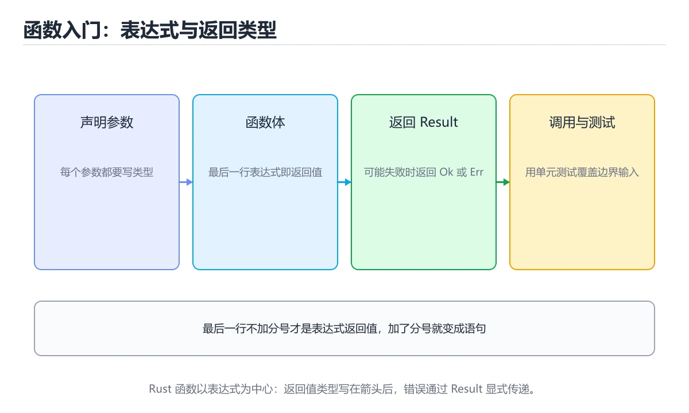
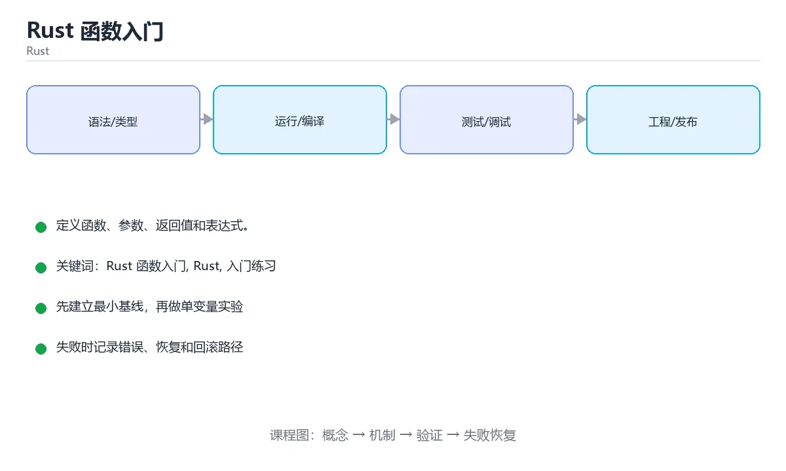

# Rust 函数入门

> 内容更新时间：2026-10-06 · 学习阶段：基础 · 预计用时：40 分钟





## 学习目标

- 先认识Rust 函数入门需要的工具、输入和输出。
- 按步骤运行最小示例，并记录结果与错误。
- 用一个边界输入验证自己是否真正掌握。

## 前置知识

- 会进行基本的文件或命令行操作。
- 不需要预先掌握「Rust」的高级知识。

## 一句话入门

定义函数、参数、返回值和表达式。

## 最小示例

```rust
fn square(n: i32) -> i32 {
    n * n
}

fn main() {
    println!("square(7)={}", square(7));
}
```

## 预期输出

```text
square(7)=49
```

## 常见错误与排查

> 说明：本表由《Rust 函数入门》的核心知识整理（2026-10-07），人工复核进度见 docs/content_review_batches.md。

| 易错点 | 容易踩的做法 | 正确结论 |
| --- | --- | --- |
| 返回局部数据的引用 | 生命周期不足导致编译失败 | 返回拥有所有权的值，或明确标注生命周期 |
| 同时存在可变与不可变借用 | 借用检查报错 | 缩小借用范围，把读写分开 |
| 用克隆绕过借用检查 | 性能下降却看不出原因 | 先重构数据流，确有必要时再克隆 |

## 动手练习

1. 原样运行最小示例，保存命令和输出。
2. 把数字 2 改成 10，预测并验证新结果。
3. 制造一个错误输入，写出错误信息和修复方法。

## 本课小结

- 入门阶段先保证能运行、能观察、能解释，再追求复杂功能。
- 每次只改一个变量，记录预测与实际结果。
- 遇到错误先看第一条错误信息，再回到最小示例。

## 代码实验：把示例跑成证据

### 实验一：建立基线

```rust
fn square(n: i32) -> i32 {
    n * n
}

fn main() {
    println!("square(7)={}", square(7));
}
```

### 实验二：只改一个输入

沿用「Rust 函数入门」的最小示例做一次单变量实验：

| 实验 | 改动 | 预测 | 实际 | 结论 |
| --- | --- | --- | --- | --- |
| 基线 | 保持「Rust 函数入门」示例原样 |  |  |  |
| 边界 | 把Rust 函数入门换成空值或极值 |  |  |  |
| 失败 | 给Rust传入非法输入 |  |  |  |

做完后用一句话写出「Rust 函数入门」的结论：输入怎么变，结果才怎么变。

### 实验三：制造一个可控错误

在需要修改变量时去掉 mut，或者制造一次所有权转移后继续使用原变量。记录借用检查器的完整提示，理解它阻止了什么运行时错误。

| 实验 | 改动 | 预测 | 实际 | 结论 |
| --- | --- | --- | --- | --- |
| 基线 | 保持原样 |  |  |  |
| 边界 |  |  |  |  |
| 失败 |  |  |  |  |

### 实验四：用三句话复述

1. Rust 函数入门 的输入是什么，哪些取值合法，哪些属于边界或非法范围？
2. 在 代码实验：把示例跑成证据 里，Rust 的状态是在什么条件下被改变的？
3. 输出如何验证，失败时第一条可观察证据是什么？

## Rust 基础机制速览

### Cargo、crate 与模块

Cargo 负责创建项目、管理依赖、编译和测试。包由 crate 组成，库 crate 对外暴露 API，二进制 crate 提供可执行入口。模块用 `mod` 组织代码，`pub` 控制可见性，`use` 把路径引入当前作用域。`Cargo.toml` 声明依赖和版本，`Cargo.lock` 固定可复现的依赖解析结果。

### 所有权、借用与生命周期

Rust 用所有权在编译期管理内存：每个值有唯一所有者，所有者离开作用域时值被释放；赋值或传参会移动所有权，除非类型实现了 Copy。借用分为共享借用 `&T` 和可变借用 `&mut T`，同一时间要么多个共享借用，要么一个可变借用，不能同时存在。生命周期标注描述引用之间的关系，不是延长引用存活时间；大多数简单函数可以由编译器自动推导。

### 可变性、模式匹配与控制流

`let` 默认不可变，需要修改时加 `mut`。`if`、`match`、`while let` 和 `for` 都是表达式或控制结构，`match` 必须覆盖所有可能分支。`Option<T>` 表示可能有值，`Result<T,E>` 表示成功或失败，二者迫使调用方显式处理缺失和错误。`?` 运算符把错误向上传播，适合库函数；二进制入口可以决定是否记录并退出。

### 结构体、枚举与 trait

结构体组合数据，枚举表达互斥状态，trait 定义共享行为。泛型让函数和类型适用于多种具体类型，trait bound 约束泛型能力；单态化会在编译期为具体类型生成代码，因此运行时不牺牲性能但会增加二进制体积。迭代器是惰性的，`map`、`filter`、`collect` 等适配器可以组合成清晰的数据流水线，也要注意分配和借用限制。

### 并发与不安全代码

Rust 的类型系统能在编译期阻止数据竞争：`Send` 表示类型可以跨线程转移，`Sync` 表示可以安全共享引用。`Arc<Mutex<T>>` 是共享可变状态的常见组合，`Rc<RefCell<T>>` 只适合单线程。`unsafe` 不会关闭借用检查，而是把某些安全证明责任交给开发者；使用前必须写清前置条件、后置条件和失败后果。

## 复习与自测

本课测验检验 square 的判断依据。请把每个错误选项改写成一句反例，
说明它在哪个输入、边界或前提变化下会失败。

### 完成标准

- [ ] 能用具体输入复现 Rust 函数入门 的最小示例，并逐行解释输入、处理与输出。
- [ ] 能预测 square 在边界输入下的输出，并用运行结果验证。
- [ ] 能复现 Rust 的异常并说明恢复步骤。
- [ ] 能不看书说出 Rust 函数入门 的两个易错点和对应验证方法。

### 复盘记录

| 项目 | 记录 |
| --- | --- |
| 学到的核心机制 |  |
| 仍然不确定的问题 |  |
| 下一步验证动作 |  |
下面按正文顺序回顾「Rust 函数入门」的每一节；说不清的地方回到 代码实验：把示例跑成证据 补课。

### 最小示例

```rust
fn square(n: i32) -> i32 {
    n * n
}

fn main() {
    println!("square(7)={}", square(7));
}
```

自检：这一节与相邻主题的边界在哪里？

### 预期输出

```text
square(7)=49
```

### 常见错误

自检：把这一节讲给没学过的人，最需要强调哪一点？

### 动手练习

自检：如果去掉这一节里的一个前提，结论会怎样变化？

## 可运行练习

本节围绕Rust 函数入门安排 3 个可交付任务，每个任务都要求留下可以复查的记录。

### 任务 1：用自己的话画出结构

不看书，用一张图说清「Rust 函数入门」的结构，画完再对照骨架：

- 主干：square 的输入 → 处理 → 输出 → 失败路径
- 连接线：在每条边上标出输入、输出与失败路径。
- 自检：能否用一句话说明Rust 函数入门与Rust的关系？

### 任务 2：做一次对比实验

**验收标准**：用 square 做一次真实对照，结论要说明在「Rust 函数入门」的哪个前提下成立。

### 任务 3：迁移到自己的场景

**验收标准**：把自己的判断写成可检查的形式——输入、步骤、输出、差异各一条，其中输入必须包含 Rust 函数入门。

## 故障现场

### 现场 1：返回局部数据的引用

**症状**：在《Rust 函数入门》的复现场景中，生命周期不足导致编译失败。

**根因**：“生命周期不足导致编译失败”只是表层结果。向上追溯会落到“返回局部数据的引用”这一步，因为它省略了《Rust 函数入门》的约束，使实现行为和预期模型发生了偏离。

**修复**：针对《Rust 函数入门》的问题，返回拥有所有权的值，或明确标注生命周期。

**验证**：先在《Rust 函数入门》中记录“返回局部数据的引用”留下的失败证据，再执行“返回拥有所有权的值，或明确标注生命周期”并重放；确认错误路径变为明确结果，且修复没有掩盖同类故障。

### 现场 2：同时存在可变与不可变借用

**症状**：在《Rust 函数入门》的复现场景中，借用检查报错。

**根因**：“借用检查报错”只是表层结果。向上追溯会落到“同时存在可变与不可变借用”这一步，因为它省略了《Rust 函数入门》的约束，使实现行为和预期模型发生了偏离。

**修复**：针对《Rust 函数入门》的问题，缩小借用范围，把读写分开。

**验证**：先在《Rust 函数入门》中记录“同时存在可变与不可变借用”留下的失败证据，再执行“缩小借用范围，把读写分开”并重放；确认错误路径变为明确结果，且修复没有掩盖同类故障。

### 现场 3：用克隆绕过借用检查

**症状**：在《Rust 函数入门》的复现场景中，性能下降却看不出原因。

**根因**：触发点是把“用克隆绕过借用检查”当成安全做法。它没有满足《Rust 函数入门》要求的前提，因此先表现为“性能下降却看不出原因”；排查时先完整复现这一段，再核对输入、配置与依赖。

**修复**：针对《Rust 函数入门》的问题，先重构数据流，确有必要时再克隆。

**验证**：先在《Rust 函数入门》中记录“用克隆绕过借用检查”留下的失败证据，再执行“先重构数据流，确有必要时再克隆”并重放；确认错误路径变为明确结果，且修复没有掩盖同类故障。

## 版本与时效

- 版本提示：Rust 函数入门 的行为在最近几个大版本里有过调整，升级「Rust 函数入门」前先用 square 复现当前输出，再对照官方发布说明逐条核对。
- 异步运行时与借用检查规则的变化会影响 Rust 函数入门，要在 CI 中提前暴露。
- 升级前先用 square 建立基线：记录版本、命令和输出，升级后只比较这些可观察量。
- 官方发布说明：https://blog.rust-lang.org/

### 升级检查清单

- 先固定当前版本，跑通全部示例与测验，再升级工具链。
- 升级时只动一个依赖版本，用 square 记录构建与运行结果。
- 先回归 Rust 函数入门 与 Rust 的默认行为和错误信息，再扩大测试范围。
- 升级完成后更新本课「最后复核 / 下次复核」日期，并记录 Rust 函数入门 的版本变化。

## 本课复习清单

离开本课前，逐项确认：

- [ ] 不看解析，能说出「Rust 函数体最后一个表达式不加分号，表示什么？」的判断依据。
- [ ] 不看解析，能说出「Rust 函数示例运行后，控制台输出是什么？」的判断依据。
- [ ] 不看解析，能说出「填空：Rust 函数入门术语速查中，表示的判断依据。
- [ ] 跑通「Rust 函数入门」的最小示例，并记录一次失败输入的处理方式。
- [ ] 把本课最容易混淆的两个概念写成一句话对照。

| 复盘项 | 记录 |
| --- | --- |
| 已经能独立解释的考点 |  |
| 仍然说不清的概念 |  |
| 下一步验证动作 |  |

## 术语速查

把「Rust 函数入门」里反复出现的术语集中放在一起。复习时先遮住右列，尝试用自己的话解释，再回到正文核对。

| 术语 | 一句话说明 |
| --- | --- |
| `fn` | 声明函数的关键字，参数与返回类型都要标注。 |
| `表达式与语句` | 表达式有值，语句没有；函数体最后一个表达式作为返回值。 |
| `返回值与分号` | 末尾表达式后加分号会变成语句，导致返回值类型不匹配。 |
| `所有权入门` | 值有唯一所有者，离开作用域即释放，移动后原变量不可再用。 |
| `借用与引用` | 用 &T 借用而不取得所有权，同一作用域内可变借用只能有一个。 |
| `Cargo` | Cargo 负责创建项目、管理依赖、编译和测试 |

## 考点精讲

### 考点 1：多选辨析·Rust 函数入门

- **题目**：围绕“Rust 函数入门”中的 Rust 函数入门、Rust、入门练习，下列哪两项是本课强调的实践判断？
- **判断依据**：题干的正确项是学习 Rust 函数入门 时要同时说明输入、输出和失败路径，不能只看正常流程；在「Rust 函数入门」里，验证 Rust 时要固定版本并覆盖边界输入，结论才可复现。回到「Rust 函数入门」的正文示例，用“围绕Rust 函数入门中的 Rust”走一遍Rust 函数入门、Rust、入门练习的完整流程，能复现的结论才可以保留。

### 考点 2：概念判断·Rust 函数入门

- **题目**：Rust 函数体最后一个表达式不加分号，表示什么？
- **判断依据**：在「Rust 函数入门」里，把该表达式的值作为函数返回值。Rust 区分表达式与语句：末尾不带分号的表达式会作为整个块的值返回。「Rust 函数入门」要求先交代Rust 函数入门、Rust、入门练习的前提再下结论，所以“把该表达式的值作为函数返回值”只在题干“Rust 函数体最后一个表达式不加分号”给定的条件下成立。

### 考点 3：概念判断·Rust 函数入门

- **题目**：Rust 中给函数参数传入 String 时，为什么常见做法是传 &str 或 &String？
- **判断依据**：在「Rust 函数入门」里，借用可以避免转移所有权，调用方仍能继续使用原值。String 按值传入会把所有权转移给函数，调用方之后不能再使用。“Rust”与「Rust 函数入门」的术语表相呼应，只有符合Rust 函数入门、Rust、入门练习约束的“借用可以避免转移所有权”才是正文支持的结论。

### 考点 4：代码补全·Rust 函数入门

- **题目**：这段 Rust 代码是「Rust 函数入门」的示例片段，下面哪一项描述与它一致？
- **判断依据**：在「Rust 函数入门」里，题干的正确项是这段代码把主要逻辑封装在函数或方法里，需要被调用才会执行，在「Rust 函数入门」里封装边界决定Rust 函数入门从哪一步开始生效。「Rust 函数入门」要求先交代Rust 函数入门、Rust、入门练习的前提再下结论，所以“这段代码把主要逻辑封装在函数或方法里”只在题干“这段 Rust 代码是Rust 函数入门的示例片段”给定的条件下成立。

### 考点 5：填空·____

- **题目**：填空：在「Rust 函数入门」的术语速查里，「Cargo 负责创建项目、管理依赖、编译和测试。包由 crate 组成，库 crate 对外暴露 API，二进制 crate 提供可执行入口。模块用 `____` 组织代码，`pub` 控制可见性，`use` 把路径引入当前作用域。`Carg」描述的是哪个术语？
- **判断依据**：题干的正确项是mod。回到「Rust 函数入门」的正文示例，用“填空”走一遍Rust 函数入门、Rust、入门练习的完整流程，能复现的结论才可以保留。在「Rust 函数入门」里判断这道题，要把Rust 函数入门、Rust、入门练习的条件、过程与失败路径逐项对齐，换成“在Rust”这个场景，只有满足前提的结论才成立。

## English Overview

**Title:** Rust Functions

**Summary:** Define functions with parameters and returns.

**Category:** Rust
**Level:** 入门
**Key terms:** Rust 函数入门, Rust, 入门练习

## 内容元数据

- 内容版本：v2.0
- 最后更新：2026-10-06
- 学习阶段：基础
- 适用环境：Rust 1.85+ / Cargo；本课聚焦 Rust 函数入门。
- 内容来源：内置结构化课程与工程实践整理
- 相关主题：Rust 函数入门、Rust、入门练习
- 质量版本：P0 测验标准 + P1 覆盖扩展 + P2 体验补全

## 参考资料与复核

- 最后复核：2026-10-04
- 下次复核：2027-06-24
- 复核范围：版本兼容、API 行为、安全建议与工程实践
- 来源性质：官方文档、标准或权威教材；正文为离线教学重组

| 参考资料 | 本课用途 |
| --- | --- |
| [Cargo Book](https://doc.rust-lang.org/cargo/) | 依赖、工作区与发布 |
| [Rust 标准库](https://doc.rust-lang.org/std/) | 标准库 API 与容器 |
| [Tokio 文档](https://tokio.rs/tokio/tutorial) | 异步运行时与任务 |

> 「Rust 函数入门」的链接用于离线阅读后的延伸核对；App 不会自动联网。

## 复习与迁移

复习目标：把「Rust 函数入门」的判断标准放回可复现的例子里。先自己作答，再对照依据；如果结论正确但理由不完整，回到正文补足前提。

### 概念复述

- 用一句话说明「Rust 函数入门」解决什么问题：定义函数、参数、返回值和表达式。
- 写出Rust 函数入门、Rust、入门练习之间的关系，并各举一个例子。
- 说出本课最容易混淆的两个概念，以及区分它们的判据。

### 正文逐节复核

- **Rust 基础机制速览**：Rust 用所有权在编译期管理内存：每个值有唯一所有者，所有者离开作用域时值被释放；赋值或传参会移动所有权，除非类型实现了 Copy。
- **实践任务**：本节围绕Rust 函数入门安排 3 个可交付任务，每个任务都要求留下可以复查的记录。

### 测验回顾

1. 围绕“Rust 函数入门”中的 Rust 函数入门、Rust、入门练习，下列哪两项是本课强调的实践判断？
   - 依据：题干的正确项是学习 Rust 函数入门 时要同时说明输入、输出和失败路径，不能只看正常流程；在「Rust 函数入门」里，验证 Rust 时要固定版本并覆盖边界输入，结论才可复现。回到「Rust 函数入门」的正文示例，用“围绕Rust 函数入门中的 Rust”走一遍Rust 函数入门、Rust、入门练习的完整流程，能复现的结论才可以保留。
2. Rust 函数体最后一个表达式不加分号，表示什么？
   - 依据：在「Rust 函数入门」里，把该表达式的值作为函数返回值。Rust 区分表达式与语句：末尾不带分号的表达式会作为整个块的值返回。「Rust 函数入门」要求先交代Rust 函数入门、Rust、入门练习的前提再下结论，所以“把该表达式的值作为函数返回值”只在题干“Rust 函数体最后一个表达式不加分号”给定的条件下成立。
3. Rust 中给函数参数传入 String 时，为什么常见做法是传 &str 或 &String？
   - 依据：在「Rust 函数入门」里，借用可以避免转移所有权，调用方仍能继续使用原值。String 按值传入会把所有权转移给函数，调用方之后不能再使用。“Rust”与「Rust 函数入门」的术语表相呼应，只有符合Rust 函数入门、Rust、入门练习约束的“借用可以避免转移所有权”才是正文支持的结论。
4. 这段 Rust 代码是「Rust 函数入门」的示例片段，下面哪一项描述与它一致？
   - 依据：在「Rust 函数入门」里，题干的正确项是这段代码把主要逻辑封装在函数或方法里，需要被调用才会执行，在「Rust 函数入门」里封装边界决定Rust 函数入门从哪一步开始生效。「Rust 函数入门」要求先交代Rust 函数入门、Rust、入门练习的前提再下结论，所以“这段代码把主要逻辑封装在函数或方法里”只在题干“这段 Rust 代码是Rust 函数入门的示例片段”给定的条件下成立。
5. 填空：在「Rust 函数入门」的术语速查里，「Cargo 负责创建项目、管理依赖、编译和测试。包由 crate 组成，库 crate 对外暴露 API，二进制 crate 提供可执行入口。模块用 `____` 组织代码，`pub` 控制可见性，`use` 把路径引入当前作用域。`Carg」描述的是哪个术语？
   - 依据：题干的正确项是mod。回到「Rust 函数入门」的正文示例，用“填空”走一遍Rust 函数入门、Rust、入门练习的完整流程，能复现的结论才可以保留。在「Rust 函数入门」里判断这道题，要把Rust 函数入门、Rust、入门练习的条件、过程与失败路径逐项对齐，换成“在Rust”这个场景，只有满足前提的结论才成立。

### 迁移练习

把「Rust 函数入门」的结论迁移到相邻主题，每次迁移都写清预测与证据：

1. 换输入：用Rust 函数入门处理一组你自己的数据，对比教材示例的结果差异。
2. 换失败条件：制造一个Rust相关的错误，说明如何从错误信息定位根因。
3. 换规模：把数据量或并发度提高一个数量级，说明「Rust 函数入门」的结论是否仍成立。

## 工程化精练：决策、失败与验证

这一章把「Rust 函数入门」从“看懂”推进到“能判断、能验证、能排错”。所有判断都围绕Rust 函数入门、Rust与入门练习展开，并与前文的示例、测验和失败现场互相对照。

### 一、Rust 函数入门 的判断算法

| 步骤 | 要回答的问题 | 判断依据 | 记录什么 |
| --- | --- | --- | --- |
| 1. 定目标 | 「Rust 函数入门」这一步要解决什么问题？ | 把Rust 函数入门的目标写成一句可验证的结论 | 输入、约束、成功标准 |
| 2. 找边界 | Rust在什么条件下失效？ | 先列空值、极值、重复和失败路径 | 反例与触发条件 |
| 3. 跑基线 | 原始示例的真实输出是什么？ | 命令、版本和环境必须可复现 | 命令、输出、耗时 |
| 4. 只改一处 | 把入门练习换成另一种取值会怎样？ | 预测写在运行之前 | 预测与实际的差异 |
| 5. 回写结论 | 结论能否被他人复现？ | 把判断写成清单或测试 | 结论、证据、遗留问题 |

这张表的用法不是从上到下浏览，而是每次只填一行：先用「Rust 函数入门」前文的示例验证第 3 行，再故意破坏一个条件验证第 2 行。当你能在不看解析的情况下说出Rust 函数入门的判断依据，才算真正掌握本课。

- 先从Rust 函数入门入手：把它写成“输入是什么、输出是什么、哪一步最容易出错”。如果这三句话中有一句说不清，说明对「Rust 函数入门」的理解还停留在术语层面，需要回到正文的最小示例重新观察一次。

- 再把Rust当成对照实验的变量：固定其他条件，只改变它的取值，记录输出是否变化。结论“变”或“不变”都要写出理由，并说明这个理由能否被他人独立复现。

- 针对入门练习做一次失败演练：故意给出空值、极值或错误类型，观察「Rust 函数入门」的报错位置和处理方式。错误信息只是入口，真正要定位的是哪一层假设被破坏。

- 把「Rust 函数入门」的结论压缩成一条可执行清单：先检查输入，再检查版本与环境，然后跑最小用例，最后才扩大规模。顺序颠倒会让排错范围成倍增加。

- 如果结论依赖时间或规模，就把数据量提高一个数量级再跑一次。在「Rust 函数入门」里，小样本成立不代表大样本成立，复杂度、资源占用和失败率都要重新记录。

- 如果结论依赖并发或共享状态，就固定输入并连续运行多次。结果不一致时，优先怀疑「Rust 函数入门」中Rust 函数入门相关步骤的隐藏状态，而不是先改代码。

- 把「Rust 函数入门」的判断写成测试：一个正常用例、一个边界用例、一个失败用例。测试通过只是起点，还要确认失败用例确实以预期方式失败。

- 把本课与相邻主题连起来：Rust 函数入门解决的是“怎么做”，Rust回答“什么时候不适用”。两者都答得出来，迁移才算完成。

> 第 2 轮复核「Rust 函数入门」：把上面的结论逐条改写为可验证的问题，并记录仍不确定的部分。

- 先从Rust 函数入门入手：把它写成“输入是什么、输出是什么、哪一步最容易出错”。如果这三句话中有一句说不清，说明对「Rust 函数入门」的理解还停留在术语层面，需要回到正文的最小示例重新观察一次。

- 再把Rust当成对照实验的变量：固定其他条件，只改变它的取值，记录输出是否变化。结论“变”或“不变”都要写出理由，并说明这个理由能否被他人独立复现。

- 针对入门练习做一次失败演练：故意给出空值、极值或错误类型，观察「Rust 函数入门」的报错位置和处理方式。错误信息只是入口，真正要定位的是哪一层假设被破坏。

- 把「Rust 函数入门」的结论压缩成一条可执行清单：先检查输入，再检查版本与环境，然后跑最小用例，最后才扩大规模。顺序颠倒会让排错范围成倍增加。

- 如果结论依赖时间或规模，就把数据量提高一个数量级再跑一次。在「Rust 函数入门」里，小样本成立不代表大样本成立，复杂度、资源占用和失败率都要重新记录。

- 如果结论依赖并发或共享状态，就固定输入并连续运行多次。结果不一致时，优先怀疑「Rust 函数入门」中Rust 函数入门相关步骤的隐藏状态，而不是先改代码。

- 把「Rust 函数入门」的判断写成测试：一个正常用例、一个边界用例、一个失败用例。测试通过只是起点，还要确认失败用例确实以预期方式失败。

### 二、Rust 函数入门 的机制拆解与自测

把本课考点还原成可回答的问题，再逐题写出依据：

**问题 1**：围绕“Rust 函数入门”中的 Rust 函数入门、Rust、入门练习，下列哪两项是本课强调的实践判断？

- 关联术语：Rust 函数入门
- 判断依据：学习 Rust 函数入门 时要同时说明输入、输出和失败路径，不能只看正常流程
- 追问：如果把Rust 函数入门的条件换成边界值，这个结论是否仍然成立？

**问题 2**：Rust 函数体最后一个表达式不加分号，表示什么？

- 关联术语：Rust
- 判断依据：把该表达式的值作为函数返回值
- 追问：如果把Rust的条件换成边界值，这个结论是否仍然成立？

**问题 3**：Rust 中给函数参数传入 String 时，为什么常见做法是传 &str 或 &String？

- 关联术语：入门练习
- 判断依据：借用可以避免转移所有权，调用方仍能继续使用原值
- 追问：当 square 的输入越过合法范围时，本课结论还成立吗？

**问题 4**：这段 Rust 代码是「Rust 函数入门」的示例片段，下面哪一项描述与它一致？

- 关联术语：Rust 函数入门
- 判断依据：回到「Rust 函数入门」正文对应小节，先用最小示例验证再下结论。
- 追问：如果把Rust 函数入门的条件换成边界值，这个结论是否仍然成立？

**问题 5**：填空：在「Rust 函数入门」的术语速查里，「Cargo 负责创建项目、管理依赖、编译和测试。包由 crate 组成，库 crate 对外暴露 API，二进制 crate 提供可执行入口。模块用 `____` 组织代码，`pub` 控制可见性，`use` 把路径引入当前作用域。`Carg」描述的是哪个术语？

- 关联术语：Rust
- 判断依据：回到「Rust 函数入门」正文对应小节，先用最小示例验证再下结论。
- 追问：如果把Rust的条件换成边界值，这个结论是否仍然成立？

### 三、失败模式与修复顺序

| 失败信号 | 常见根因 | 先做什么 | 修复后如何确认 |
| --- | --- | --- | --- |
| 「Rust 函数入门」中 Rust 函数入门 相关步骤报错 | 输入、版本或前置条件与示例不一致 | 保留第一条错误信息，回到最小输入 | 用学习 Rust 函数入门 时要同时说明输入、输出和失败路径，不能只看正常流程复跑，确认输出可复现 |
| 「Rust 函数入门」中 Rust 相关步骤报错 | 输入、版本或前置条件与示例不一致 | 保留第一条错误信息，回到最小输入 | 用把该表达式的值作为函数返回值复跑，确认输出可复现 |
| 「Rust 函数入门」中 入门练习 相关步骤报错 | 输入、版本或前置条件与示例不一致 | 保留第一条错误信息，回到最小输入 | 用借用可以避免转移所有权，调用方仍能继续使用原值复跑，确认输出可复现 |
- 检查点：固定版本与输入重跑《Rust 函数入门》，记录两次差异并定位不稳定条件。
| 单次结果正确但规模一大就失效 | 只测了正常路径，没有覆盖边界 | 把数据量或并发度提高一个数量级 | 记录边界值、耗时与失败率 |

排错顺序固定为：先复现，再缩小输入，然后只改一个条件，最后把结论写成回归用例。对「Rust 函数入门」来说，任何不能复现的“修好了”都不算完成。

### 四、离开本课前的验证清单

| 检查项 | 通过标准 | 证据 |
| --- | --- | --- |
| 能复述 | 用三句话说明「Rust 函数入门」解决什么问题、边界在哪 | 不看解析写出的结论 |
| 能运行 | 最小示例在本机跑通 | 命令、输出与版本 |
| 能改条件 | 只改一个输入并解释差异 | 预测与实际的对照 |
| 能排错 | 至少制造并修复一个失败 | 错误信息与修复步骤 |
| 能迁移 | 把Rust 函数入门、Rust、入门练习用到新场景 | 一个自选练习的结论 |

完成标准：能不看解析说清「Rust 函数入门」全部自测题的依据，并且至少有一条Rust 函数入门相关的结论经过真实运行验证。如果某一步只停留在“感觉懂了”，就把它写成下一轮针对「Rust 函数入门」的最小验证任务。

### 五、把结论写成可检查的证据

学习「Rust 函数入门」时，最容易出现的情况是“听过、看懂了，但换一个输入就说不清”。下面把Rust 函数入门与Rust放进一条可检查的证据链：每一句结论都要能回答“从哪里来、在什么条件下成立、失败时怎么发现”。

| 证据类型 | 本课要求 | 不合格的表现 |
| --- | --- | --- |
| 概念证据 | 用一句话说明Rust 函数入门的定义与适用场景 | 只背术语，说不出它解决什么问题 |
| 运行证据 | 能复现「Rust 函数入门」的最小示例 | 输出与记录对不上，或换机器就不一致 |
| 对照证据 | 只改一个条件，说明差异来自哪里 | 一次改多个变量，无法归因 |
| 失败证据 | 故意制造错误并记录恢复步骤 | 只测正常路径，失败时靠猜 |
| 迁移证据 | 把Rust用到自选场景 | 换一个例子就完全套不上 |

举例：学习 Rust 函数入门 时要同时说明输入、输出和失败路径，不能只看正常流程。把这个结论代回「Rust 函数入门」的正文，找出它对应的输入、处理步骤与输出；再换掉其中一个条件，观察结论是否仍然成立。能完成这一步，才说明这条知识已经从“记忆”变成“可用的判断”。

最后留一个自检问题：如果只能保留三条笔记，你会写下哪三句？把答案限定为「Rust 函数入门」中的可验证结论，并给每条结论配一个反例。这三句加上对应反例，就是本课最值得带入后续课程的复习材料。

<!-- language-intro-deep-dive:start -->

## 零基础通俗讲：Rust 函数入门

### 一句话说清它是什么

Rust 函数用 fn 声明，参数和返回值都必须写类型；函数体最后一个不带分号的表达式就是返回值。

### 用生活比喻理解

把不带分号的最后一行想成快递单上的签收栏：它是函数交出去的东西。一旦在末尾加了分号，签收栏就变成一张废纸，函数什么都不交。

### 完整可运行代码

```rust
fn add(a: i32, b: i32) -> i32 {
    a + b
}

fn print_result(value: i32) {
    println!("结果是 {value}");
}

fn main() {
    print_result(add(3, 4));
    print_result(add(10, 20));
}
```

### 逐行拆开看

- `fn add(a: i32, b: i32) -> i32` 声明函数，箭头后面是返回类型。
- 函数体里 `a + b` 没有分号，作为表达式直接成为返回值。
- `fn print_result(value: i32)` 没有箭头，返回类型是单元类型，相当于不返回值。
- 调用 `add(3, 4)` 得到 7，作为实参传给 print_result。
- Rust 函数名的命名规范是全小写加下划线，这也是编译器会提醒的风格。
- 参数默认按值移动或复制，借用需要显式写引用符号。


### 把程序跑一遍

- `add(3, 4)` 进入函数体，表达式求值为 7 并返回。
- 7 传给 print_result，输出「结果是 7」。
- 第二次调用得到 30，输出「结果是 30」。
- main 返回单元类型，进程退出。


### 新手最容易踩的坑

- 在最后一行加分号：返回值变成单元类型，调用处类型不匹配。
- 参数不写类型：Rust 不允许在函数签名里省略类型。
- 函数名用驼峰：编译能过，但编译器给出命名风格警告。
- 把 String 直接传进函数后又想使用原变量：所有权已经移动，需要传引用或克隆。
- 忘记写 return 又想提前返回：非末尾位置必须显式写 return。


### 动手练一练

- 增加一个 `fn multiply(a: i32, b: i32) -> i32` 并调用。
- 故意在表达式末尾加分号，观察编译器的报错信息。
- 写一个返回 String 的函数，说明所有权如何转移给调用方。


### 本课速查卡

把下面八行抄进自己的笔记，复习时只看这一页就能回忆整课：

| 复习项 | 本课要点 |
| --- | --- |
| 核心结论 | Rust 函数用 fn 声明，参数和返回值都必须写类型；函数体最后一个不带分号的表达式就是返回值。 |
| 最少要写的代码 | `fn add(a: i32, b: i32) -> i32 {` |
| 正确做法 | `add(3, 4)` 进入函数体，表达式求值为 7 并返回。 |
| 最常见的错误 | 在最后一行加分号：返回值变成单元类型，调用处类型不匹配。 |
| 出错先查什么 | 先读第一条报错信息，再回到最小示例只改一个地方 |
| 怎么确认学会了 | 增加一个 `fn multiply(a: i32, b: i32) -> i32` 并调用。 |
| 和别的知识点的关系 | 本课打下的语法与思维方式会被后面每一课反复用到 |
| 接下来做什么 | 合上教程，凭记忆把上面的最小代码重写一遍再运行 |
