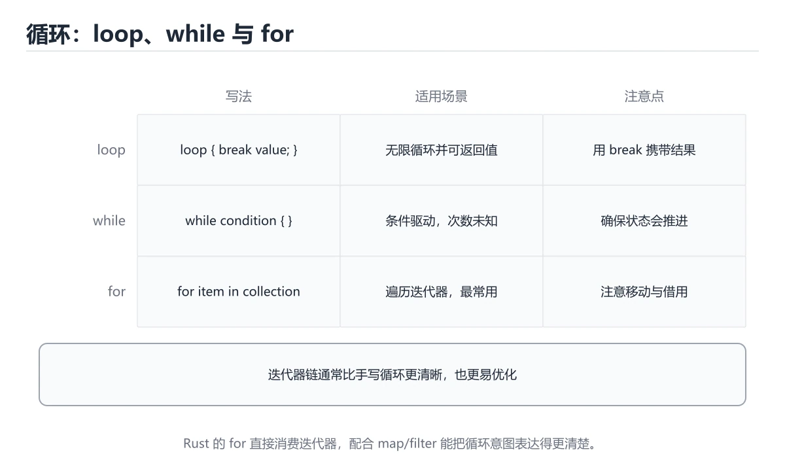

# Rust 循环入门

> 内容更新时间：2026-10-06 · 学习阶段：入门 · 预计用时：40 分钟




## 本节知识框架

**课程定位**：所属分类 `rust`（Rust），课程主题 `Rust 循环入门`，学习阶段 入门，建议用时 50 分钟。

本课主线：用 loop、while 和 for 遍历数据。

**学完本课应当能够**
- 说清 `loop` 与 `while 循环` 的含义与区别，并各举一个正例和一个反例。
- 用本课示例验证 `for 与区间` 的行为，记录输入、输出与失败条件。
- 遇到「遍历时修改集合」这类问题时，能说出触发条件与修复顺序。

### 从概念到验证的学习链条

1. `loop`：先掌握 无条件循环，用 break 退出，可以带值返回，再用它解释 `while 循环` 为什么会出现。
2. `while 循环`：先掌握 条件为真时执行，适合次数不确定的场景，再用它解释 `for 与区间` 为什么会出现。
3. `for 与区间`：先掌握 for i in 0..5 遍历左闭右开区间，是推荐的计数写法，再用它解释 `迭代器` 为什么会出现。
4. `迭代器`：先掌握 iter()、into_iter() 配合 map、filter 完成声明式遍历，再用它解释 `break 与 continue` 为什么会出现。
5. `break 与 continue`：先掌握 break 结束整个循环，continue 跳过本轮剩余语句，再用它解释 `Cargo` 为什么会出现。
6. `Cargo`：先掌握 Cargo 负责创建项目、管理依赖、编译和测试，再用它解释 本课示例的观察结果 为什么会出现。

**先修与衔接**：本课是「Rust」分类的第 4 课。先修内容：《Rust 条件判断》。《Rust 条件判断》里的 `bool`、`if 是表达式` 是本课的前提。相关或后续课程：《Rust 函数入门》。

### 完成判据

- **定义关**：不看正文也能说明 `loop` 是 无条件循环，用 break 退出，可以带值返回，并指出一个反例。
- **机制关**：能按“输入 → 转换 → 输出 → 验证”复述 `Rust 循环入门`，而不是只背结论。
- **示例关**：能运行或推演 `Rust 循环入门` 的 `rust` 示例，并说明一个真实出现的标识符或字面量。
- **证据关**：能指出 `Rust 循环入门` 示例里的 调用了 `main()`，并说明它支持或反驳了本课的哪一条结论。
- **排错关**：能复现 遍历时修改集合，记录现象并按 先收集要修改的内容，循环结束后统一处理 修复。
- **迁移关**：能把 `Rust 循环入门`、`Rust`、`入门练习` 放进一个与 `Rust 循环入门` 不同的项目场景，并保持输入与验证条件可追踪。
- **复盘关**：学完 `Rust 循环入门` 后，用一句话写下仍然不确定的结论，并列出下一次验证需要的输入、环境和成功判据。

### 复习清单

- [ ] 能不看正文复述本课核心术语，并指出一个边界或反例。
- [ ] 能运行或推演本课示例，记录输入、输出与失败现象。
- [ ] 能完成一次自测，并把错题对照错误表定位原因。

## 核心概念定义

| 术语 | 操作性定义 | 常见边界与风险 |
| --- | --- | --- |
| loop | 无条件循环，用 break 退出，可以带值返回。 | 只在「无条件循环，用 break 退出，可以带值返回」这一前提下成立，换输入或换环境要重新验证。 |
| while 循环 | 条件为真时执行，适合次数不确定的场景。 | 只在「条件为真时执行，适合次数不确定的场景」这一前提下成立，换输入或换环境要重新验证。 |
| for 与区间 | for i in 0..5 遍历左闭右开区间，是推荐的计数写法。 | 只在「for i in 0..5 遍历左闭右开区间，是推荐的计数写法」这一前提下成立，换输入或换环境要重新验证。 |
| 迭代器 | iter()、into_iter() 配合 map、filter 完成声明式遍历。 | 易错：触发借用冲突；正确做法是用迭代器与组合方法改写。 |
| break 与 continue | break 结束整个循环，continue 跳过本轮剩余语句。 | 只在「break 结束整个循环，continue 跳过本轮剩余语句」这一前提下成立，换输入或换环境要重新验证。 |
| Cargo | Cargo 负责创建项目、管理依赖、编译和测试 | 不同版本与依赖组合的行为可能不同，升级或换环境前要按官方变更说明重新验证。 |

## 原理与运行机制

### 机制总览

**教材衔接：一句话入门**

用 loop、while 和 for 遍历数据。

**教材衔接：Rust 基础机制速览**

### Cargo、crate 与模块

Cargo 负责创建项目、管理依赖、编译和测试。包由 crate 组成，库 crate 对外暴露 API，二进制 crate 提供可执行入口。模块用 `mod` 组织代码，`pub` 控制可见性，`use` 把路径引入当前作用域。`Cargo.toml` 声明依赖和版本，`Cargo.lock` 固定可复现的依赖解析结果。

### 所有权、借用与生命周期

Rust 用所有权在编译期管理内存：每个值有唯一所有者，所有者离开作用域时值被释放；赋值或传参会移动所有权，除非类型实现了 Copy。借用分为共享借用 `&T` 和可变借用 `&mut T`，同一时间要么多个共享借用，要么一个可变借用，不能同时存在。生命周期标注描述引用之间的关系，不是延长引用存活时间；大多数简单函数可以由编译器自动推导。

### 可变性、模式匹配与控制流

`let` 默认不可变，需要修改时加 `mut`。`if`、`match`、`while let` 和 `for` 都是表达式或控制结构，`match` 必须覆盖所有可能分支。`Option<T>` 表示可能有值，`Result<T,E>` 表示成功或失败，二者迫使调用方显式处理缺失和错误。`?` 运算符把错误向上传播，适合库函数；二进制入口可以决定是否记录并退出。

### 结构体、枚举与 trait

结构体组合数据，枚举表达互斥状态，trait 定义共享行为。泛型让函数和类型适用于多种具体类型，trait bound 约束泛型能力；单态化会在编译期为具体类型生成代码，因此运行时不牺牲性能但会增加二进制体积。迭代器是惰性的，`map`、`filter`、`collect` 等适配器可以组合成清晰的数据流水线，也要注意分配和借用限制。

### 并发与不安全代码

Rust 的类型系统能在编译期阻止数据竞争：`Send` 表示类型可以跨线程转移，`Sync` 表示可以安全共享引用。`Arc<Mutex<T>>` 是共享可变状态的常见组合，`Rc<RefCell<T>>` 只适合单线程。`unsafe` 不会关闭借用检查，而是把某些安全证明责任交给开发者；使用前必须写清前置条件、后置条件和失败后果。

**教材衔接：版本与时效**

- 版本提示：Rust 循环入门 的行为在最近几个大版本里有过调整，升级「Rust 循环入门」前先用 total 复现当前输出，再对照官方发布说明逐条核对。
- 把 Rust 的编译告警当作错误处理，升级后才能避免行为漂移。
- 升级「Rust 循环入门」涉及的依赖前，先用 total 复现当前行为，再逐项核对版本说明与破坏性变更。
- 官方发布说明：https://blog.rust-lang.org/

### 升级检查清单

- 先固定当前版本，跑通全部示例与测验，再升级工具链。
- 一次只改一个版本条件，把 Rust 循环入门 相关的差异单独记成一条结论。
- 先回归 Rust 循环入门 与 Rust 的默认行为和错误信息，再扩大测试范围。
- 升级完成后记录 Rust 循环入门 的新旧版本差异，并据此调整下次复核时间。

### 机制拆解：每一步的输入、动作与输出

#### 1. `loop`
- 输入：`Rust 循环入门`；本步把 无条件循环，用 break 退出，可以带值返回 当作判断规则。
- 动作：围绕 `loop` 保留中间状态，并记录它与 `while 循环` 的对应关系。
- 输出：`while 循环`，它可以被下一段代码、测试或记录继续使用。
- `loop` 的失败条件：只在「无条件循环，用 break 退出，可以带值返回」这一前提下成立，换输入或换环境要重新验证。

#### 2. `while 循环`
- 输入：`loop`；本步把 条件为真时执行，适合次数不确定的场景 当作判断规则。
- 动作：围绕 `while 循环` 保留中间状态，并记录它与 `for 与区间` 的对应关系。
- 输出：`for 与区间`，它可以被下一段代码、测试或记录继续使用。
- `while 循环` 的失败条件：只在「条件为真时执行，适合次数不确定的场景」这一前提下成立，换输入或换环境要重新验证。

#### 3. `for 与区间`
- 输入：`while 循环`；本步把 for i in 0..5 遍历左闭右开区间，是推荐的计数写法 当作判断规则。
- 动作：围绕 `for 与区间` 保留中间状态，并记录它与 `迭代器` 的对应关系。
- 输出：`迭代器`，它可以被下一段代码、测试或记录继续使用。
- `for 与区间` 的失败条件：只在「for i in 0..5 遍历左闭右开区间，是推荐的计数写法」这一前提下成立，换输入或换环境要重新验证。

#### 4. `迭代器`
- 输入：`for 与区间`；本步把 iter()、into_iter() 配合 map、filter 完成声明式遍历 当作判断规则。
- 动作：围绕 `迭代器` 保留中间状态，并记录它与 `break 与 continue` 的对应关系。
- 输出：`break 与 continue`，它可以被下一段代码、测试或记录继续使用。
- `迭代器` 的失败条件：当用下标反复取元素时，会出现触发借用冲突。

#### 5. `break 与 continue`
- 输入：`迭代器`；本步把 break 结束整个循环，continue 跳过本轮剩余语句 当作判断规则。
- 动作：围绕 `break 与 continue` 保留中间状态，并记录它与 `Cargo` 的对应关系。
- 输出：`Cargo`，它可以被下一段代码、测试或记录继续使用。
- `break 与 continue` 的失败条件：只在「break 结束整个循环，continue 跳过本轮剩余语句」这一前提下成立，换输入或换环境要重新验证。

#### 6. `Cargo`
- 输入：`break 与 continue`；本步把 Cargo 负责创建项目、管理依赖、编译和测试 当作判断规则。
- 动作：围绕 `Cargo` 保留中间状态，并记录它与 `main` 的对应关系。
- 输出：`main`，它可以被下一段代码、测试或记录继续使用。
- `Cargo` 的失败条件：不同版本与依赖组合的行为可能不同，升级或换环境前要按官方变更说明重新验证。

### 示例中的可观察事实

1. 调用了 `main()`；它对应的课程主题是 `Rust 循环入门`。
2. 出现字面量 `total={total}`；它对应的课程主题是 `Rust 循环入门`。

### 复现实验记录

- 环境：`Rust 循环入门` 使用 `rust` 示例，固定 `Rust 循环入门`、`Rust`、`入门练习` 作为第一组条件。
- 首轮输入：先确认 调用了 `main()`，预测 `loop` 会怎样变化。
- 基线观察：记录命令、输入、输出和错误原文，不用截图代替可复制的文本。
- 单变量修改：只改变 `Rust 循环入门`，观察 `Cargo` 是否仍满足定义。
- 失败注入：复现 遍历时修改集合，确认现象是 借用规则不允许或需要额外处理。
- 记录结论：把“修改前、修改后、预期变化、实际变化”写成四列表，这样复盘 `Rust 循环入门` 时才能区分概念错误与实现错误。

## 典型应用场景

**课程内置实验入口**：`sandbox:rust`，用于动手验证《Rust 循环入门》的机制；实验结论不替代概念定义与复杂度分析。

**教材衔接：代码实验：把示例跑成证据**

### 实验一：建立基线

```rust
fn main() {
    let mut total = 0;
    for i in 1..=5 {
        total += i;
    }
    println!("total={total}");
}
```

### 实验二：只改一个输入

沿用「Rust 循环入门」的最小示例做一次单变量实验：

做完后用一句话写出「Rust 循环入门」的结论：输入怎么变，结果才怎么变。

### 实验三：制造一个可控错误

在需要修改变量时去掉 mut，或者制造一次所有权转移后继续使用原变量。记录借用检查器的完整提示，理解它阻止了什么运行时错误。

### 实验四：用三句话复述

1. 先写清 Rust 循环入门 的输入契约：类型、范围、缺省值与非法值分别怎么处理？
2. 在 代码实验：把示例跑成证据 里，Rust 的状态是在什么条件下被改变的？
3. 输出如何验证，失败时第一条可观察证据是什么？

- **遍历时修改集合**：典型现象是借用规则不允许或需要额外处理；正确做法是先收集要修改的内容，循环结束后统一处理。
- **嵌套循环缺少标签**：典型现象是只跳出内层循环；正确做法是用循环标签明确指出要跳出的层级。
- **用下标反复取元素**：典型现象是触发借用冲突；正确做法是用迭代器与组合方法改写。

### 最小验证场景

- 准备：保留 `rust` 示例的原始输入，先记录 `Rust 循环入门` 的基线输出和完整运行命令。
- 观察：先核对 调用了 `main()`，再改变一个与 `loop` 相关的条件。
- 判定：新结果与 `Rust 循环入门` 的基线不同不等于错误；只有当差异破坏了 `loop` 的定义或错误表中的约束，才判定为失败。

### 选择与边界

- 使用 `loop` 时，先满足它的定义：无条件循环，用 break 退出，可以带值返回；只在「无条件循环，用 break 退出，可以带值返回」这一前提下成立，换输入或换环境要重新验证。
- 使用 `while 循环` 时，先满足它的定义：条件为真时执行，适合次数不确定的场景；只在「条件为真时执行，适合次数不确定的场景」这一前提下成立，换输入或换环境要重新验证。
- 使用 `for 与区间` 时，先满足它的定义：for i in 0..5 遍历左闭右开区间，是推荐的计数写法；只在「for i in 0..5 遍历左闭右开区间，是推荐的计数写法」这一前提下成立，换输入或换环境要重新验证。
- 使用 `迭代器` 时，先满足它的定义：iter()、into_iter() 配合 map、filter 完成声明式遍历；易错：触发借用冲突；正确做法是用迭代器与组合方法改写。
- 使用 `break 与 continue` 时，先满足它的定义：break 结束整个循环，continue 跳过本轮剩余语句；只在「break 结束整个循环，continue 跳过本轮剩余语句」这一前提下成立，换输入或换环境要重新验证。

## 代码/协议/SQL 示例

### 最小可验证示例

**教材衔接：最小示例**

**教材衔接：预期输出**

```text
total=15
```

**教材衔接：零基础通俗讲：Rust 循环**

### 一句话说清它是什么

Rust 有 for、while 和 loop 三种循环；loop 是无限循环，但可以带 break 返回值，非常适合重试逻辑。

### 用生活比喻理解

loop 像一个带投币口的抓娃娃机：一直运转，直到你按下停止，而按下的一瞬间机器还能把奖品交给你。

### 完整可运行代码

```rust
fn main() {
    let mut total = 0;

    for i in 1..=5 {
        total += i;
        println!("加入 {i} 后累计 {total}");
    }

    while total < 20 {
        total += 5;
    }

    println!("最终结果：{total}");
}
```

### 逐行拆开看

- `let mut total = 0;` 必须写 mut，因为循环里要修改它。
- `for i in 1..=5` 中两个点表示范围，等号表示包含终点，所以 i 依次是 1 到 5。
- `total += i;` 每轮累加，分号不能省。
- 循环体里的 println 用花括号直接引用 i 和 total。
- `while total < 20 {` 每轮开始前判断条件。
- 循环外的 println 只执行一次，输出最终结果。

### 把程序跑一遍

- for 五轮结束后 total 是 15。
- while 第一轮把 15 加到 20。
- 再判断条件不成立，循环结束。
- 输出「最终结果：20」；如果写成 `1..5` 则不含 5，结果会少 5。

### 新手最容易踩的坑

- 把 `1..=5` 写成 `1..5`：右开区间不包含终点，累加结果不同。
- 忘记 mut：循环里修改累加器会编译失败。
- 在 for 里修改被遍历的集合：借用检查器会拒绝，需要先收集或用索引。
- 用 loop 却没有 break：程序永远不会结束。
- 在循环里持有可变借用又读取同一个值：借用规则会直接报错。

### 动手练一练

- 把范围改成 `1..=100`，先估算结果再运行。
- 用 loop 改写 while，并用 break 返回累计值。
- 在循环里加 `if i == 3 { continue; }`，解释总和的变化。

### 本课速查卡

把下面八行抄进自己的笔记，复习时只看这一页就能回忆整课：

| 复习项 | 本课要点 |
| --- | --- |
| 核心结论 | Rust 有 for、while 和 loop 三种循环；loop 是无限循环，但可以带 break 返回值，非常适合重试逻辑。 |
| 最少要写的代码 | `fn main() {` |
| 正确做法 | for 五轮结束后 total 是 15。 |
| 最常见的错误 | 把 `1..=5` 写成 `1..5`：右开区间不包含终点，累加结果不同。 |
| 出错先查什么 | 先读第一条报错信息，再回到最小示例只改一个地方 |
| 怎么确认学会了 | 把范围改成 `1..=100`，先估算结果再运行。 |
| 和别的知识点的关系 | 本课打下的语法与思维方式会被后面每一课反复用到 |
| 接下来做什么 | 合上教程，凭记忆把上面的最小代码重写一遍再运行 |

**运行方式**：运行 `Rust 循环入门` 的示例时，用 `cargo run` 运行；编译期报错会直接指出所有权或类型问题。

### 示例精读：先找证据，再改一个条件

1. 调用了 `main()`；它出现在 `Rust 循环入门` 的示例中，阅读时先确认它前后各发生了什么。
2. 出现字面量 `total={total}`；它出现在 `Rust 循环入门` 的示例中，阅读时先确认它前后各发生了什么。
- 在 `Rust 循环入门` 中与 `loop` 对照：示例必须能支持 无条件循环，用 break 退出，可以带值返回，否则说明这一段还缺少实现或验证步骤。
- 在 `Rust 循环入门` 中与 `while 循环` 对照：示例必须能支持 条件为真时执行，适合次数不确定的场景，否则说明这一段还缺少实现或验证步骤。
- 在 `Rust 循环入门` 中与 `for 与区间` 对照：示例必须能支持 for i in 0..5 遍历左闭右开区间，是推荐的计数写法，否则说明这一段还缺少实现或验证步骤。
- 在 `Rust 循环入门` 中与 `迭代器` 对照：示例必须能支持 iter()、into_iter() 配合 map、filter 完成声明式遍历，否则说明这一段还缺少实现或验证步骤。

## 时间/空间复杂度或性能分析

**性能关注点（Rust 循环入门）**：零成本抽象不等于零开销：记录运行时间、内存峰值与编译时间。

**本课特有开销（Rust 循环入门 · Rust 循环入门）**：小文件看元数据开销，大文件看吞吐，两者要分别测量。

**测量方法**：以 `Rust 循环入门` 的 `Rust 循环入门` 场景为对象，固定输入跑一遍记录基线，再把规模或并发度提高一个数量级复测；两次结果的差值与波动范围才是结论依据。

### 需要控制的变量与记录项

- `Rust 循环入门` 的 `Rust 循环入门`：固定它的版本、输入范围和资源上限，分别记录速度、内存与失败率的变化。
- `Rust 循环入门` 的 `Rust`：固定它的版本、输入范围和资源上限，分别记录速度、内存与失败率的变化。
- `Rust 循环入门` 的 `入门练习`：固定它的版本、输入范围和资源上限，分别记录速度、内存与失败率的变化。
- `Rust 循环入门` 中 `loop` 的边界：只在「无条件循环，用 break 退出，可以带值返回」这一前提下成立，换输入或换环境要重新验证。达到边界时不要外推，必须重新测量。
- `Rust 循环入门` 中 `while 循环` 的边界：只在「条件为真时执行，适合次数不确定的场景」这一前提下成立，换输入或换环境要重新验证。达到边界时不要外推，必须重新测量。
- `Rust 循环入门` 中 `for 与区间` 的边界：只在「for i in 0..5 遍历左闭右开区间，是推荐的计数写法」这一前提下成立，换输入或换环境要重新验证。达到边界时不要外推，必须重新测量。
- `Rust 循环入门` 中 `迭代器` 的边界：易错：触发借用冲突；正确做法是用迭代器与组合方法改写。达到边界时不要外推，必须重新测量。
- `Rust 循环入门` 中 `break 与 continue` 的边界：只在「break 结束整个循环，continue 跳过本轮剩余语句」这一前提下成立，换输入或换环境要重新验证。达到边界时不要外推，必须重新测量。
- `Rust 循环入门` 的代码证据：先验证 调用了 `main()`，再记录该路径的输入规模与耗时；只看代码行数不能推出复杂度。

## 常见误区与易错点

| 容易写错的做法 | 实际现象 | 原因与正确做法 |
| --- | --- | --- |
| 遍历时修改集合 | 借用规则不允许或需要额外处理。 | 先收集要修改的内容，循环结束后统一处理。 |
| 嵌套循环缺少标签 | 只跳出内层循环。 | 用循环标签明确指出要跳出的层级。 |
| 用下标反复取元素 | 触发借用冲突。 | 用迭代器与组合方法改写。 |

### 现场 1：遍历时修改集合

**症状**：借用规则不允许或需要额外处理。

**根因与修复**：先收集要修改的内容，循环结束后统一处理。

**自检**：在本课示例里复现「遍历时修改集合」，改成先收集要修改的内容，循环结束后统一处理后重跑；如果症状消失且失败路径按预期变化，说明定位正确。

### 现场 2：嵌套循环缺少标签

**症状**：只跳出内层循环。

**根因与修复**：用循环标签明确指出要跳出的层级。

**自检**：在本课示例里复现「嵌套循环缺少标签」，改成用循环标签明确指出要跳出的层级后重跑；如果症状消失且失败路径按预期变化，说明定位正确。

### 现场 3：用下标反复取元素

**症状**：触发借用冲突。

**根因与修复**：用迭代器与组合方法改写。

**自检**：在本课示例里复现「用下标反复取元素」，改成用迭代器与组合方法改写后重跑；如果症状消失且失败路径按预期变化，说明定位正确。

## 与其他知识点的关系

**教材衔接：复习与迁移**

### 概念复述

- 用一句话说明「Rust 循环入门」解决什么问题：用 loop、while 和 for 遍历数据。
- 写出Rust 循环入门、Rust、入门练习之间的关系，并各举一个例子。
- 说出本课最容易混淆的两个概念，以及区分它们的判据。

### 正文逐节复核

- **Rust 基础机制速览**：Rust 用所有权在编译期管理内存：每个值有唯一所有者，所有者离开作用域时值被释放；赋值或传参会移动所有权，除非类型实现了 Copy。
- **实践任务**：本节围绕Rust 循环入门安排 3 个可交付任务，每个任务都要求留下可以复查的记录。


### 迁移练习

把「Rust 循环入门」的结论迁移到相邻主题，每次迁移都写清预测与证据：

- **先修**：`Rust 条件判断`。本课默认这些内容已经掌握。
- **相关或后续**：`Rust 函数入门`。本课术语会在这些课程里继续使用。
- **术语归属**：`loop`、`while 循环`、`for 与区间` 的定义以本课「核心概念定义」为准，换到其他课程时先确认定义是否被改写。
- 同一分类的《Rust Cargo 第一个程序》也涉及 `Rust`；两课衔接时先确认这个术语的定义是否一致。
- 同一分类的《Rust 变量与可变性》也涉及 `Rust`；两课衔接时先确认这个术语的定义是否一致。

### 先修与后续术语接口

- `Rust 条件判断`：共享术语 `Cargo`，共同关键词 `Rust`、`入门练习`。
- `Rust 函数入门`：共享术语 `Cargo`，共同关键词 `Rust`、`入门练习`。

### 容易混淆的相邻概念

- `loop` 与 `while 循环`：前者强调 无条件循环，用 break 退出，可以带值返回；后者强调 条件为真时执行，适合次数不确定的场景。判断时分别检查两条定义的适用范围，不要只看名称相似就互换。
- `while 循环` 与 `for 与区间`：前者强调 条件为真时执行，适合次数不确定的场景；后者强调 for i in 0..5 遍历左闭右开区间，是推荐的计数写法。判断时分别检查两条定义的适用范围，不要只看名称相似就互换。
- `for 与区间` 与 `迭代器`：前者强调 for i in 0..5 遍历左闭右开区间，是推荐的计数写法；后者强调 iter()、into_iter() 配合 map、filter 完成声明式遍历。判断时分别检查两条定义的适用范围，不要只看名称相似就互换。
- `迭代器` 与 `break 与 continue`：前者强调 iter()、into_iter() 配合 map、filter 完成声明式遍历；后者强调 break 结束整个循环，continue 跳过本轮剩余语句。判断时分别检查两条定义的适用范围，不要只看名称相似就互换。
- `break 与 continue` 与 `Cargo`：前者强调 break 结束整个循环，continue 跳过本轮剩余语句；后者强调 Cargo 负责创建项目、管理依赖、编译和测试。判断时分别检查两条定义的适用范围，不要只看名称相似就互换。

## 自测题与参考答案

> 先独立作答，再对照参考答案；答案都能在本课正文、术语表或错误表里找到依据。

### 自测 1（概念复述）

不看正文，写出 `loop` 的操作性定义，并说明它与 `while 循环` 的区别。

**参考答案**：无条件循环，用 break 退出，可以带值返回。

`while 循环` 的定位是：条件为真时执行，适合次数不确定的场景；两者的差别要从适用对象与失败模式上说明。

### 自测 2（排错）

本课错误表记录了「遍历时修改集合」这类做法。请写出它会出现的现象、根因，以及修复顺序。

**参考答案**：现象是借用规则不允许或需要额外处理；正确做法是先收集要修改的内容，循环结束后统一处理。修复时先复现现象并保留证据，再改动一处假设重跑，确认现象消失。

### 自测 3（动手验证）

运行本课的 `rust` 示例，把其中的 `"total={total}"` 换成一个边界值后重新运行，记录输出与错误信息。

**参考答案**：正常输入下 `rust` 示例应当复现正文给出的结果；把 `"total={total}"` 换成边界值后，如果结果改变或报错，先核对它是否满足 `Rust 循环入门` 中`loop` 的适用范围，再检查错误表里是否有同类现象。

### 自测 4（代码阅读）

阅读本课开头的 `rust` 示例，说明它体现了`loop` 的哪一条性质，并指出改动哪个输入会让这条性质不再成立。

**参考答案**：`loop` 的定义是 无条件循环，用 break 退出，可以带值返回，示例正是在实现这条定义。改动与 `loop` 有关的一个输入后，如果结果不再符合 `Rust 循环入门` 的正文描述，就说明该性质只在当前前提成立。

### 自测 5（迁移）

把 `Rust 循环入门` 的方法迁移到自己的项目：围绕 `loop` 写出一个与错误表同类的风险点，并说明触发条件和检验方式。

**参考答案**：例如「用下标反复取元素」，它会导致触发借用冲突；检验方式是按用迭代器与组合方法改写改一处再复现，确认现象消失且没有引入新的失败分支。

### 自测 6（对比）

用一个表格对比 `loop` 与 `while 循环`：各写一行适用场景、一行失败表现。

**参考答案**：`loop` 的定义是无条件循环，用 break 退出，可以带值返回；`while 循环` 的定义是条件为真时执行，适合次数不确定的场景。两者的失败表现分别对应本课错误表里与本术语相关的行。

### 自测 7（排错顺序）

面对「遍历时修改集合」引发的问题，请把“复现 借用规则不允许或需要额外处理 → 保留证据 → 先收集要修改的内容，循环结束后统一处理 → 回归验证”四步写成可执行的检查清单。

**参考答案**：第一步按借用规则不允许或需要额外处理复现；第二步记录输入、版本与完整报错；第三步按先收集要修改的内容，循环结束后统一处理只改一处；第四步重跑并确认失败路径也按预期变化。

### 自测 8（边界判断）

针对 `Cargo`，分别写出“可以使用”的条件和“结论不再成立”的条件。

**参考答案**：不同版本与依赖组合的行为可能不同，升级或换环境前要按官方变更说明重新验证。 同时要把 `Cargo` 的定义 Cargo 负责创建项目、管理依赖、编译和测试 与实际输入逐项对照。

### 自测 9（机制重建）

不看正文，按输入、转换、输出、验证四段重建 `loop` → `while 循环` → `for 与区间` → `迭代器` 的作用链。

**参考答案**：起点是 `loop` 的定义 无条件循环，用 break 退出，可以带值返回；中间每一步都保留可观察状态；终点由 `Cargo` 检查，失败时回到错误表定位第一个偏离定义的步骤。

### 自测 10（综合排错）

在 `Rust 循环入门` 中，现象是 触发借用冲突。请围绕 用下标反复取元素 写出最小复现、关键证据、修复动作和回归验证，并说明为什么不能只凭一次运行下结论。

**参考答案**：先复现 用下标反复取元素，记录输入与完整错误；再按 用迭代器与组合方法改写 只改一处。回归时同时跑正常路径和边界路径，只有两次结果都可解释，才把修复视为完成。

### 自测 11（一分钟复述）

用每分钟约 200 字的速度复述 `Rust 循环入门`：先给主问题，再按顺序说出 `loop`、`while 循环`、`for 与区间`、`迭代器`，最后给一个失败案例。

**自评标准**：主问题必须对应 用 loop、while 和 for 遍历数据；每个术语都要能接上一句定义或边界；失败案例必须写成可观察现象，不能用“可能有风险”代替证据。

## 术语速查

| 术语 | 一句话说明 |
| --- | --- |
| `loop` | 无条件循环，用 break 退出，可以带值返回。 |
| `while 循环` | 条件为真时执行，适合次数不确定的场景。 |
| `for 与区间` | for i in 0..5 遍历左闭右开区间，是推荐的计数写法。 |
| `迭代器` | iter()、into_iter() 配合 map、filter 完成声明式遍历。 |
| `break 与 continue` | break 结束整个循环，continue 跳过本轮剩余语句。 |
| `Cargo` | Cargo 负责创建项目、管理依赖、编译和测试。 |

**术语关系**：`loop`（无条件循环） → `while 循环`（条件为真时执行） → `for 与区间`（for i in 0..5 遍历左闭右开区间） → `迭代器`（iter()、into_iter() 配合 map、filter 完成声明式遍历）。

## 考点精讲

`Rust 循环入门` 的题库有 5 道题，下面逐题给出题干、正确项与判断依据：先自己作答，再核对正确项，最后回到正文对应小节复核。

### 考点 1：第 1 题

- **题目**：Rust 中 1..=5 与 1..5 的区别是？
- **正确项**：前者包含 5，后者不包含 5
- **判断依据**：这道题检验本课主问题：用 loop、while 和 for 遍历数据。复习时先复述本课主问题，再举一个会让结论失效的输入。

### 考点 2：第 2 题

- **题目**：围绕“Rust 循环入门”中的 Rust 循环入门、Rust、入门练习，下列哪两项是本课强调的实践判断？
- **正确项**：验证 Rust 时要固定版本并覆盖边界输入，结论才可复现；学习 Rust 循环入门 时要同时说明输入、输出和失败路径，不能只看正常流程
- **判断依据**：这道题检验本课主问题：用 loop、while 和 for 遍历数据。复习时先复述本课主问题，再举一个会让结论失效的输入。

### 考点 3：第 3 题

- **题目**：示例中 for i in 1..=5 累加后的输出是什么？
- **正确项**：total=15，循环累加 1 到 5 五个整数
- **判断依据**：这道题检验本课主问题：用 loop、while 和 for 遍历数据。复习时先复述本课主问题，再举一个会让结论失效的输入。

### 考点 4：第 4 题

- **题目**：代码语言为 `rust`，选自 `Rust 循环入门` 的 `loop` 部分。课程问题为用 loop、while 和 for 遍历数据。哪一项描述与代码一致？
- **正确项**：出现字面量 `total={total}`
- **判断依据**：这道题落在术语 `loop` 上：无条件循环，用 break 退出，可以带值返回。复习时把 `loop` 的定义、适用边界和一个反例一起说清楚，再回到「核心概念定义」核对原文。

### 考点 5：第 5 题

- **题目**：填空：补齐下面这段术语说明中的空缺。课程 `用 loop、while 和 for 遍历数据。`，这段说明是：`____` 负责创建项目、管理依赖、编译和测试。空缺处应填哪个术语？
- **正确项**：Cargo
- **判断依据**：这道题落在术语 `loop` 上：无条件循环，用 break 退出，可以带值返回。复习时把 `loop` 的定义、适用边界和一个反例一起说清楚，再回到「核心概念定义」核对原文。

### 考点 6：`loop`

- **要点**：无条件循环，用 break 退出，可以带值返回。
- **loop 的边界**：只在「无条件循环，用 break 退出，可以带值返回」这一前提下成立，换输入或换环境要重新验证。

### 考点 7：`while 循环`

- **要点**：条件为真时执行，适合次数不确定的场景。
- **while 循环 的边界**：只在「条件为真时执行，适合次数不确定的场景」这一前提下成立，换输入或换环境要重新验证。

### 考点 8：`for 与区间`

- **要点**：for i in 0..5 遍历左闭右开区间，是推荐的计数写法。
- **for 与区间 的边界**：只在「for i in 0..5 遍历左闭右开区间，是推荐的计数写法」这一前提下成立，换输入或换环境要重新验证。

### 考点 9：`迭代器`

- **要点**：iter()、into_iter() 配合 map、filter 完成声明式遍历。
- **迭代器 的边界**：易错：触发借用冲突；正确做法是用迭代器与组合方法改写。

### 考点 10：`break 与 continue`

- **要点**：break 结束整个循环，continue 跳过本轮剩余语句。
- **break 与 continue 的边界**：只在「break 结束整个循环，continue 跳过本轮剩余语句」这一前提下成立，换输入或换环境要重新验证。

### 考点 11：`Cargo`

- **要点**：Cargo 负责创建项目、管理依赖、编译和测试
- **Cargo 的边界**：不同版本与依赖组合的行为可能不同，升级或换环境前要按官方变更说明重新验证。

### 考点 12：排错——遍历时修改集合

- **现象**：借用规则不允许或需要额外处理。
- **处理**：先收集要修改的内容，循环结束后统一处理。

### 考点 13：排错——嵌套循环缺少标签

- **现象**：只跳出内层循环。
- **处理**：用循环标签明确指出要跳出的层级。

### 考点 14：综合辨析——`loop` 与 `Cargo`

- **辨析点**：`loop` 的定义是 无条件循环，用 break 退出，可以带值返回；`Cargo` 的定义是 Cargo 负责创建项目、管理依赖、编译和测试。
- **答题要求**：面对 `Rust 循环入门` 的题目，先判断描述的是 `loop` 还是 `Cargo`，再归到对应定义，最后写出一个会让该定义失效的边界输入。

### 考点 15：排错评分点

- **现象分**：能写出 借用规则不允许或需要额外处理，而不是只写“程序有错”。
- **证据分**：保留触发 遍历时修改集合 的输入、版本和错误原文。
- **修复分**：按 先收集要修改的内容，循环结束后统一处理 只改一处，并同时回归正常路径与边界路径。

## 内容元数据

- 内容版本：v2.0
- 最后更新：2026-10-06
- 学习阶段：入门
- 适用环境：Rust 1.85+ / Cargo；本课聚焦 Rust 循环入门。
- 内容来源：内置结构化课程与工程实践整理
- 相关主题：Rust 循环入门、Rust、入门练习
- 质量版本：P0 测验标准 + P1 覆盖扩展 + P2 体验补全

## 参考资料与复核

- 最后复核：2026-10-04
- 下次复核：2027-06-10
- 复核范围：版本兼容、API 行为、安全建议与工程实践
- 来源性质：官方文档、标准或权威教材；本课核对关键词：Rust 循环入门、Rust、入门练习。

| 参考资料 | 本课用途 |
| --- | --- |
| [Cargo Book](https://doc.rust-lang.org/cargo/) | 依赖、工作区与发布 |
| [Rust 标准库](https://doc.rust-lang.org/std/) | 标准库 API 与容器 |
| [Rustonomicon](https://doc.rust-lang.org/nomicon/) | unsafe 与内存布局 |

| [本课术语索引：Rust 循环入门](#核心概念定义) | 按本课输入、术语边界和错误表现逐项核对 |
> 「Rust 循环入门」的链接用于离线阅读后的延伸核对；App 不会自动联网。