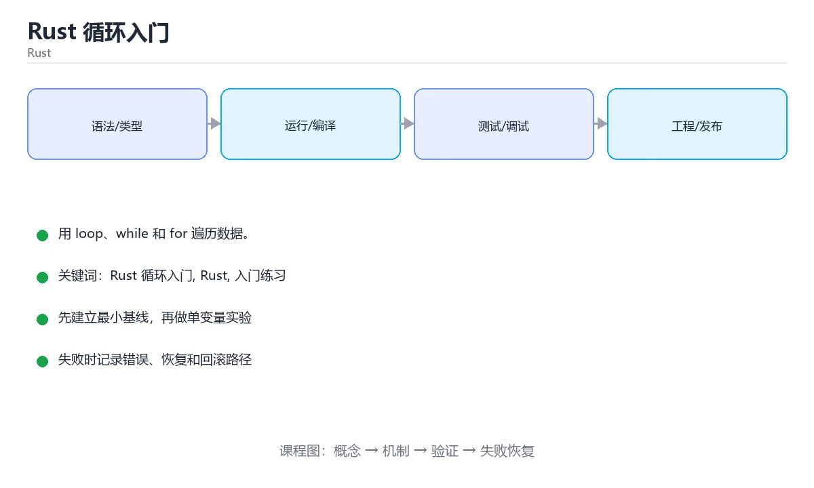

# Rust 循环入门



> 内容更新时间：2026-10-03 · 学习阶段：入门 · 预计用时：15 分钟

## 学习目标

- 先认识「Rust 循环入门」需要的工具、输入和输出。
- 按步骤运行最小示例，并记录结果与错误。
- 用一个边界输入验证自己是否真正掌握。

## 前置知识

- 会进行基本的文件或命令行操作。
- 不需要预先掌握「Rust」的高级知识。

## 一句话入门

用 loop、while 和 for 遍历数据。

## 最小示例

```rust
fn main() {
    let mut total = 0;
    for i in 1..=5 {
        total += i;
    }
    println!("total={total}");
}
```

## 预期输出

```text
total=15
```

## 常见错误

- 变量没有声明 mut 就尝试修改，导致编译错误。
- 复制命令时遗漏空格、引号或必要参数。

## 动手练习

1. 原样运行最小示例，保存命令和输出。
2. 把数字 2 改成 10，预测并验证新结果。
3. 制造一个错误输入，写出错误信息和修复方法。

## 本课小结

- 入门阶段先保证能运行、能观察、能解释，再追求复杂功能。
- 每次只改一个变量，记录预测与实际结果。
- 遇到错误先看第一条错误信息，再回到最小示例。


## 代码实验：把示例跑成证据

这一节不引入新语法，而是把「Rust 循环入门」的最小示例变成可以复现、可以对照的实验。每次只改变一个条件，先写预测，再运行，最后解释差异。

### 实验一：建立基线

```rust
fn main() {
    let mut total = 0;
    for i in 1..=5 {
        total += i;
    }
    println!("total={total}");
}
```

先原样运行上面的代码，记录命令、完整输出和退出状态。然后把输出与正文的预期输出逐字对照，不要用“看起来差不多”代替核对；空格、大小写、换行和错误流向都可能暴露环境差异。

### 实验二：只改一个输入

从代码中选一个会影响结果的字面量、参数或输入，把它替换成边界值：数值可尝试 0、1、最大值和最小值，字符串可尝试空串和超长文本，集合可尝试空集合、单元素和重复元素。先写出预测，再运行并记录实际结果。

### 实验三：制造一个可控错误

在需要修改变量时去掉 mut，或者制造一次所有权转移后继续使用原变量。记录借用检查器的完整提示，理解它阻止了什么运行时错误。

| 实验 | 改动 | 预测 | 实际 | 结论 |
| --- | --- | --- | --- | --- |
| 基线 | 保持原样 |  |  |  |
| 边界 |  |  |  |  |
| 失败 |  |  |  |  |

### 实验四：用三句话复述

1. 输入是什么，哪些输入属于合法范围，哪些属于边界或非法范围？
2. 程序按什么顺序处理输入，在哪一步产生了状态变化或副作用？
3. 输出如何验证，失败时第一条可观察证据是什么？

## Rust 基础机制速览

### Cargo、crate 与模块

Cargo 负责创建项目、管理依赖、编译和测试。包由 crate 组成，库 crate 对外暴露 API，二进制 crate 提供可执行入口。模块用 `mod` 组织代码，`pub` 控制可见性，`use` 把路径引入当前作用域。`Cargo.toml` 声明依赖和版本，`Cargo.lock` 固定可复现的依赖解析结果。

### 所有权、借用与生命周期

Rust 用所有权在编译期管理内存：每个值有唯一所有者，所有者离开作用域时值被释放；赋值或传参会移动所有权，除非类型实现了 Copy。借用分为共享借用 `&T` 和可变借用 `&mut T`，同一时间要么多个共享借用，要么一个可变借用，不能同时存在。生命周期标注描述引用之间的关系，不是延长引用存活时间；大多数简单函数可以由编译器自动推导。

### 可变性、模式匹配与控制流

`let` 默认不可变，需要修改时加 `mut`。`if`、`match`、`while let` 和 `for` 都是表达式或控制结构，`match` 必须覆盖所有可能分支。`Option<T>` 表示可能有值，`Result<T,E>` 表示成功或失败，二者迫使调用方显式处理缺失和错误。`?` 运算符把错误向上传播，适合库函数；二进制入口可以决定是否记录并退出。

### 结构体、枚举与 trait

结构体组合数据，枚举表达互斥状态，trait 定义共享行为。泛型让函数和类型适用于多种具体类型，trait bound 约束泛型能力；单态化会在编译期为具体类型生成代码，因此运行时不牺牲性能但会增加二进制体积。迭代器是惰性的，`map`、`filter`、`collect` 等适配器可以组合成清晰的数据流水线，也要注意分配和借用限制。

### 并发与不安全代码

Rust 的类型系统能在编译期阻止数据竞争：`Send` 表示类型可以跨线程转移，`Sync` 表示可以安全共享引用。`Arc<Mutex<T>>` 是共享可变状态的常见组合，`Rc<RefCell<T>>` 只适合单线程。`unsafe` 不会关闭借用检查，而是把某些安全证明责任交给开发者；使用前必须写清前置条件、后置条件和失败后果。

## 本课自测清单与错误对照

下面把「Rust 循环入门」最容易混淆的选项集中起来。不要只记正确答案，要能说明错误选项在什么条件下看似合理、又为什么不能满足题干。

本课测验以直接定义和步骤判断为主。请把每个错误选项改写成一句反例，
说明它在哪个输入、边界或前提变化下会失败。

### 完成标准

- [ ] 能用具体输入复现最小示例，并逐行解释输入、处理与输出。
- [ ] 能只改一个值完成边界实验，并让预测与实际结果一致。
- [ ] 能制造一个可控错误，读出第一条错误信息并完成修复。
- [ ] 能不看书说出本课至少两个易错点和对应的验证方法。

### 复盘记录

| 项目 | 记录 |
| --- | --- |
| 学到的核心机制 |  |
| 仍然不确定的问题 |  |
| 下一步验证动作 |  |


## 考点精讲：把测验题还原成判断过程

本课有 5 个判断点。先自己作答，再看「判断依据」；如果结论正确但理由不完整，回到正文对应章节补足概念。

### 考点 1：Rust 中 1..=5 与 1..5 的区别是？

- **正确判断**：前者包含 5，后者不包含 5，是左闭右开区间
- **判断依据**：正确答案是「前者包含 5，后者不包含 5，是左闭右开区间」，这道题在问Rust中1..=5与1..5的区别是，判断时要把题干限定的输入、边界与目标逐项对齐。..= 是包含右端点的闭区间，1..=5 得到 1 到 5。课程摘要指出用 loop，while 和 for 遍历数据，本课要判断的正是Rust中1..=5与1..5的区别是。
- **迁移检查**：遮住选项，只根据定义复述一次答案，再回来看哪个选项与复述一致。

### 考点 2：Rust 的 loop 循环有什么独特能力？

- **正确判断**：可以用 break 带出一个值
- **判断依据**：正确答案是「可以用 break 带出一个值」，本课在「一句话入门」中说明：用 loop、while 和 for 遍历数据。loop 是没有条件的循环，也是表达式，可以用 break value 结束并返回值，常见于「不断重试直到成功」的流程。
- **迁移检查**：遮住选项，只根据定义复述一次答案，再回来看哪个选项与复述一致。

### 考点 3：示例中 for i in 1..=5 累加后的输出是什么？

- **正确判断**：total=15，循环累加 1 到 5 五个整数
- **判断依据**：正确答案是「total=15，循环累加 1 到 5 五个整数」，这道题在问示例中foriin1..=5累加后的输出是什么，判断时要把题干限定的输入、边界与目标逐项对齐。闭区间 1..=5 让 i 依次取 1 到 5，每轮执行 total += i，得到 15。
- **迁移检查**：把题干里的一个条件换成边界值，原来的结论还成立吗？写出判断过程。

### 考点 4：在 Rust 中，遍历集合最推荐的方式通常是？

- **正确判断**：使用 for item in &collection
- **判断依据**：正确答案是「使用 for item in &collection」，本课在「一句话入门」中说明：用 loop、while 和 for 遍历数据。for 直接遍历集合的迭代器，借用检查器会保证在遍历期间不会出现冲突的可变借用，代码也不容易越界。
- **迁移检查**：遮住选项，只根据定义复述一次答案，再回来看哪个选项与复述一致。

### 考点 5：填空：「Rust 循环入门」术语速查中，表示「Cargo 负责创建项目、管理依赖、编译和测试。包由 crate 组成，库 crate 对外暴露 API，二进制 crate 提供可执行入口。模块用 `____` 组织代码，`pub` 控制可见性，`use` 把路径引入当前作用域。`Carg…」的术语是什么？

- **正确判断**：mod
- **判断依据**：正确答案是「mod」，这道题在问填空：Rust循环入门术语速查中，表示Cargo负责…引入当前作用域，`Carg…的术语是什么，判断时要把题干限定的输入、边界与目标逐项对齐。课程摘要指出用 loop，while 和 for 遍历数据，本课要判断的正是填空：Rust循环入门术语速查中，表示Cargo负责…引入当前作用域，`Carg…的术语是什么。
- **迁移检查**：不看题干，用自己的话补全这句话，再与标准答案对照。

## 本课复习清单

离开本课前，逐项确认：

- [ ] 不看解析，能说出「Rust 中 1..=5 与 1..5 的区别是？」的判断依据。
- [ ] 不看解析，能说出「Rust 的 loop 循环有什么独特能力？」的判断依据。
- [ ] 不看解析，能说出「示例中 for i in 1..=5 累加后的输出是什么？」的判断依据。
- [ ] 不看解析，能说出「在 Rust 中，遍历集合最推荐的方式通常是？」的判断依据。
- [ ] 不看解析，能说出「填空：「Rust 循环入门」术语速查中，表示「Cargo 负责创建项目、管理依赖…」的判断依据。
- [ ] 至少运行一次本课示例，记录输入、输出和一个边界情况。
- [ ] 把本课最容易混淆的两个概念写成一句话对照。

| 复盘项 | 记录 |
| --- | --- |
| 已经能独立解释的考点 |  |
| 仍然说不清的概念 |  |
| 下一步验证动作 |  |

## 逐节复习与自检

下面按正文顺序回顾每一节，并给出一个自检问题；说不清的地方回到原章节补课。

### 一句话入门

用 loop、while 和 for 遍历数据。

自检：这一节的关键输入与输出分别是什么？

### 最小示例

```rust
fn main() {
    let mut total = 0;
    for i in 1..=5 {
        total += i;
    }
    println!("total={total}");
}
```

自检：这一节与相邻主题的边界在哪里？

### 预期输出

```text
total=15
```

自检：这一节与相邻主题的边界在哪里？

### 常见错误

变量没有声明 mut 就尝试修改，导致编译错误。

自检：把这一节讲给没学过的人，最需要强调哪一点？

### 动手练习

把数字 2 改成 10，预测并验证新结果。制造一个错误输入，写出错误信息和修复方法。

自检：如果去掉这一节里的一个前提，结论会怎样变化？

## 术语速查

| 术语 | 本课语境 |
| --- | --- |
| `mod` | Cargo 负责创建项目、管理依赖、编译和测试。包由 crate 组成，库 crate 对外暴露 API，二进制 crate 提供可执行入口。模块用 `mod` 组织代码，`pub` 控制可见性，`use` 把路径引入当前作用域。`Carg… |
| `pub` | Cargo 负责创建项目、管理依赖、编译和测试。包由 crate 组成，库 crate 对外暴露 API，二进制 crate 提供可执行入口。模块用 `mod` 组织代码，`pub` 控制可见性，`use` 把路径引入当前作用域。`Carg… |
| `use` | Cargo 负责创建项目、管理依赖、编译和测试。包由 crate 组成，库 crate 对外暴露 API，二进制 crate 提供可执行入口。模块用 `mod` 组织代码，`pub` 控制可见性，`use` 把路径引入当前作用域。`Carg… |
| `Cargo.toml` | Cargo 负责创建项目、管理依赖、编译和测试。包由 crate 组成，库 crate 对外暴露 API，二进制 crate 提供可执行入口。模块用 `mod` 组织代码，`pub` 控制可见性，`use` 把路径引入当前作用域。`Carg… |
| `Cargo.lock` | Cargo 负责创建项目、管理依赖、编译和测试。包由 crate 组成，库 crate 对外暴露 API，二进制 crate 提供可执行入口。模块用 `mod` 组织代码，`pub` 控制可见性，`use` 把路径引入当前作用域。`Carg… |
| `&T` | Rust 用所有权在编译期管理内存：每个值有唯一所有者，所有者离开作用域时值被释放；赋值或传参会移动所有权，除非类型实现了 Copy。借用分为共享借用 `&T` 和可变借用 `&mut T`，同一时间要么多个共享借用，要么一个可变借用，不能… |
| `&mut T` | Rust 用所有权在编译期管理内存：每个值有唯一所有者，所有者离开作用域时值被释放；赋值或传参会移动所有权，除非类型实现了 Copy。借用分为共享借用 `&T` 和可变借用 `&mut T`，同一时间要么多个共享借用，要么一个可变借用，不能… |
| `let` | `let` 默认不可变，需要修改时加 `mut`。`if`、`match`、`while let` 和 `for` 都是表达式或控制结构，`match` 必须覆盖所有可能分支。`Option<T>` 表示可能有值，`Result<T,E>`… |
| `mut` | `let` 默认不可变，需要修改时加 `mut`。`if`、`match`、`while let` 和 `for` 都是表达式或控制结构，`match` 必须覆盖所有可能分支。`Option<T>` 表示可能有值，`Result<T,E>`… |
| `if` | `let` 默认不可变，需要修改时加 `mut`。`if`、`match`、`while let` 和 `for` 都是表达式或控制结构，`match` 必须覆盖所有可能分支。`Option<T>` 表示可能有值，`Result<T,E>`… |
| `match` | `let` 默认不可变，需要修改时加 `mut`。`if`、`match`、`while let` 和 `for` 都是表达式或控制结构，`match` 必须覆盖所有可能分支。`Option<T>` 表示可能有值，`Result<T,E>`… |
| `while let` | `let` 默认不可变，需要修改时加 `mut`。`if`、`match`、`while let` 和 `for` 都是表达式或控制结构，`match` 必须覆盖所有可能分支。`Option<T>` 表示可能有值，`Result<T,E>`… |

## English Overview

**Title:** Rust Loops

**Summary:** Iterate with loop, while and for.

**Category:** Rust  
**Level:** 入门  
**Key terms:** Rust 循环入门, Rust, 入门练习

> The full tutorial is written in Chinese. This bilingual overview helps English readers identify the topic, scope and key terms before studying the detailed examples.

## 内容元数据

- 内容版本：v2.0
- 最后更新：2026-10-03
- 学习阶段：入门
- 适用环境：Rust 1.85+ / Cargo
- 内容来源：内置结构化课程与工程实践整理
- 相关主题：Rust 循环入门、Rust、入门练习
- 质量版本：P0 测验标准 + P1 覆盖扩展 + P2 体验补全


## 参考资料与复核

- 最后复核：2026-10-04
- 下次复核：2027-04-04
- 复核范围：版本兼容、API 行为、安全建议与工程实践
- 来源性质：官方文档与标准；本课正文为离线教学重组，不复制原文

| 参考资料 | 本课用途 |
| --- | --- |
| [The Rust Book](https://doc.rust-lang.org/book/) | 所有权、类型与工程实践 |
| [Rust 标准库](https://doc.rust-lang.org/std/) | 标准库与并发 API |

> 本课主题：用 loop、while 和 for 遍历数据。

> App 完全离线展示文字链接，不会自动联网；需要延伸阅读时可复制链接到浏览器。
