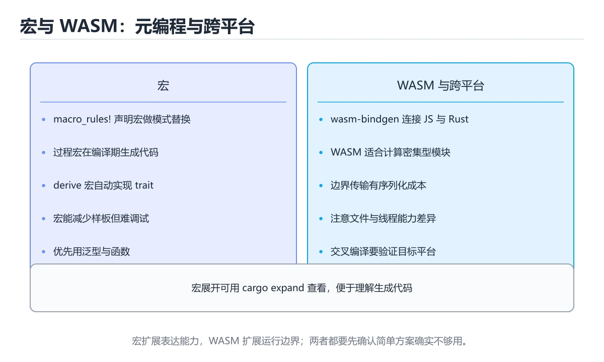
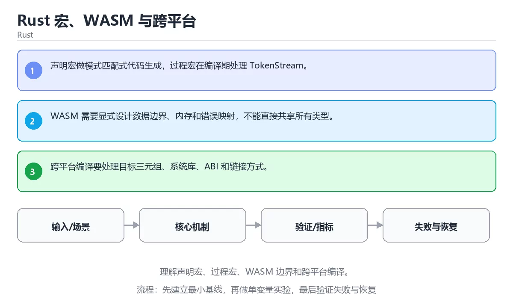

# Rust 宏、WASM 与跨平台





> 内容更新时间：2026-10-03 · 学习阶段：高级 · 预计用时：25 分钟

## 学习目标

- 能用自己的话解释：声明宏做模式匹配式代码生成，过程宏在编译期处理 TokenStream。
- 能用自己的话解释：WASM 需要显式设计数据边界、内存和错误映射，不能直接共享所有类型。
- 能用自己的话解释：跨平台编译要处理目标三元组、系统库、ABI 和链接方式。
- 能把本课知识放回「Rust」，并完成练习与测验。

## 前置知识

- 已完成「Rust」的基础课程，能运行正文中的最小示例。
- 本课关键词：宏、WASM、跨平台、FFI。
- 遇到不熟悉的术语先记录问题，完成练习后再回读。

## 核心知识

### 1. 声明宏做模式匹配式代码生成，过程宏在编译期处理 TokenStream。

- 它解决的问题：把「声明宏做模式匹配式代码生成，过程宏在编译期处理 TokenStream。」放回真实场景，说明不做它会带来什么后果。
- 关键做法：先用最小示例建立基线，再逐步加入边界、失败和性能条件。
- 验证标准：结果可复现、错误可解释、边界有测试、失败能恢复。

### 2. WASM 需要显式设计数据边界、内存和错误映射，不能直接共享所有类型。

- 它解决的问题：把「WASM 需要显式设计数据边界、内存和错误映射，不能直接共享所有类型。」放回真实场景，说明不做它会带来什么后果。
- 关键做法：先用最小示例建立基线，再逐步加入边界、失败和性能条件。
- 验证标准：结果可复现、错误可解释、边界有测试、失败能恢复。

### 3. 跨平台编译要处理目标三元组、系统库、ABI 和链接方式。

- 它解决的问题：把「跨平台编译要处理目标三元组、系统库、ABI 和链接方式。」放回真实场景，说明不做它会带来什么后果。
- 关键做法：先用最小示例建立基线，再逐步加入边界、失败和性能条件。
- 验证标准：结果可复现、错误可解释、边界有测试、失败能恢复。

## 关键流程

```text
输入 → 校验 → 核心处理 → 验证 → 记录指标 → 失败恢复
```

## 实践路径

1. 用一句话复述本课要解决的问题。
2. 跑通正文中的最小示例并记录基线。
3. 只改变一个输入或参数，预测并验证结果。
4. 补一个失败路径，记录错误、恢复和指标。
5. 把结论写成可复现的笔记或测试。

## 常见误区

| 误区 | 后果 | 修正 |
| --- | --- | --- |
| 只记术语不做实验 | 遇到真实问题无法判断 | 用最小输入跑通并记录结果 |
| 只测正常路径 | 边界和故障上线才暴露 | 补空值、极值和依赖失败 |
| 没有基线就优化 | 无法证明改进有效 | 先测量再修改 |
| 忽略成本与安全 | 性能和风险失控 | 同时记录资源、权限与失败代价 |

## 动手练习

1. 合上教程，用 3～5 句话解释「Rust 宏、WASM 与跨平台」。
2. 从正文选一个例子，改变一个条件并预测结果。
3. 设计一个失败场景，写出止损与恢复步骤。

**验收标准**：留下输入、命令、输出、差异和下一步问题。

## 本课小结

- 本课属于「Rust」，核心关键词是 宏、WASM、跨平台、FFI。
- 先保证正确与可复现，再讨论性能和扩展。
- 完成练习和测验后，把仍然不确定的问题写成下一轮验证清单。

> 本课由 P1 内容扩展生成，重点补充原有课程缺失的主题与工程边界。


## 实践任务

本节围绕“Rust 宏、WASM 与跨平台”安排 3 个可交付任务，每个任务都要求留下可以复查的记录。

### 任务 1：用自己的话画出结构

合上教程，用 5 句话说明“Rust 宏、WASM 与跨平台”解决什么问题、输入是什么、输出是什么、失败时会怎样、与相邻概念的边界在哪里。画一张流程图或状态图，把每个节点标注成“输入 / 处理 / 输出 / 失败路径”之一。

**验收标准**：图里至少有 5 个节点和 1 条失败路径；每个节点都能在正文中找到依据。

### 任务 2：做一次对比实验

从正文里选两个差异最小的方案，列成 4 列表格：方案、前提、代价、适用边界。然后只改变一个条件（数据规模、并发度、精度或资源上限），记录结果变化。

**验收标准**：表格里两个方案的结论不能完全一样；写下“在什么条件下应该换方案”。

### 任务 3：迁移到自己的场景

把“Rust 宏、WASM 与跨平台”的核心方法用到你熟悉的一个真实场景，写出一份 300 字以内的实施记录：目标、步骤、验证方式、仍然不确定的问题。

**验收标准**：至少有一个可复现的命令、代码片段或数据样例；结论能被别人独立检查。


## 故障现场

这一节把“Rust 宏、WASM 与跨平台”最常见的失败方式还原成现场记录，练习时按“症状 → 复现 → 定位 → 修复 → 预防”的顺序排查。

### 现场 1：“Rust 宏、WASM 与跨平台”的 宏 常规用例通过，但边界用例失败

**症状**：在“Rust 宏、WASM 与跨平台”的练习或生产场景里出现““Rust 宏、WASM 与跨平台”的 宏 常规用例通过，但边界用例失败”。

**复现**：准备一组最小输入，只保留触发““Rust 宏、WASM 与跨平台”的 宏 常规用例通过，但边界用例失败”的必要条件，连续运行两次确认结果稳定。

**定位**：围绕“宏 的前置条件与取值边界没有写进代码，默认值掩盖了空值和极值”检查调用链、输入数据和环境配置，先验证假设再改代码。

**修复**：为“Rust 宏、WASM 与跨平台”补一条空值或极值用例，把前置条件写成断言，并让失败信息直接指出是哪个输入越界

**预防**：把““Rust 宏、WASM 与跨平台”的 宏 常规用例通过，但边界用例失败”写成一条自动化用例，并在“Rust 宏、WASM 与跨平台”的验收清单里保留对应检查项。


### 现场 2：“Rust 宏、WASM 与跨平台”的 WASM 结果在两次运行之间不一致

**症状**：在“Rust 宏、WASM 与跨平台”的练习或生产场景里出现““Rust 宏、WASM 与跨平台”的 WASM 结果在两次运行之间不一致”。

**复现**：准备一组最小输入，只保留触发““Rust 宏、WASM 与跨平台”的 WASM 结果在两次运行之间不一致”的必要条件，连续运行两次确认结果稳定。

**定位**：围绕“WASM 依赖了当前版本、执行顺序或共享状态，单次运行无法暴露差异”检查调用链、输入数据和环境配置，先验证假设再改代码。

**修复**：固定“Rust 宏、WASM 与跨平台”使用的版本与随机种子，记录两次运行的完整输入和输出，再逐项消除非确定性来源

**预防**：把““Rust 宏、WASM 与跨平台”的 WASM 结果在两次运行之间不一致”写成一条自动化用例，并在“Rust 宏、WASM 与跨平台”的验收清单里保留对应检查项。


### 现场 3：“Rust 宏、WASM 与跨平台”的验证只在开发机通过

**症状**：在“Rust 宏、WASM 与跨平台”的练习或生产场景里出现““Rust 宏、WASM 与跨平台”的验证只在开发机通过”。

**复现**：准备一组最小输入，只保留触发““Rust 宏、WASM 与跨平台”的验证只在开发机通过”的必要条件，连续运行两次确认结果稳定。

**定位**：围绕“环境版本、配置和输入规模与目标环境不同，宏 缺少可重复的验证记录”检查调用链、输入数据和环境配置，先验证假设再改代码。

**修复**：把“Rust 宏、WASM 与跨平台”的运行环境、输入样本和预期输出写成清单，并在另一套环境复跑同一条命令

**预防**：把““Rust 宏、WASM 与跨平台”的验证只在开发机通过”写成一条自动化用例，并在“Rust 宏、WASM 与跨平台”的验收清单里保留对应检查项。


## 版本与时效

这一节记录“Rust 宏、WASM 与跨平台”涉及的版本基线与升级检查点，避免把某个版本的默认行为当成永久结论。

- Rust 2024 edition 已成为主流，编译器与标准库保持快速小步演进
- 异步运行时、trait 解析与借用检查规则的变化需要在 CI 中提前暴露
- 升级前用 cargo update、cargo clippy 与 MSRV 矩阵验证
- 官方发布说明：https://blog.rust-lang.org/

### 升级检查清单

- 先固定当前版本，跑通全部示例与测验，再升级工具链。
- 只改一个版本变量，记录编译、测试、性能与产物体积的变化。
- 重点回归默认值、弃用警告、序列化格式、并发语义和错误信息。
- 升级完成后更新本课的“最后复核 / 下次复核”日期与版本说明。


## 考点精讲：把测验题还原成判断过程

本课有 5 个判断点。先自己作答，再看「判断依据」；如果结论正确但理由不完整，回到正文对应章节补足概念。

### 考点 1：关于「声明宏做模式匹配式代码生成 过程宏在…」，下列说法正确的是？

- **正确判断**：声明宏做模式匹配式代码生成，过程宏在编译期处理 TokenStream。
- **判断依据**：正确答案是「声明宏做模式匹配式代码生成，过程宏在编译期处理 TokenStream。」，本课在「核心知识」中说明：它解决的问题：把WASM 需要显式设计数据边界、内存和错误映射，不能直接共享所有类型。，本课在「核心知识」中说明：它解决的问题：把声明宏做模式匹配式代码生成，过程宏在编译期处理 TokenStream。，本课在「核心知识」中说明：它解决的问题：把跨平台编译要处理目标三元组、系统库、ABI 和链接方式。
- **迁移检查**：如果给某个错误选项去掉一个限定词，它会不会变成正确？说明理由。

### 考点 2：关于「WASM 需要显式设计数据边界、内存…」，下列说法正确的是？

- **正确判断**：WASM 需要显式设计数据边界、内存和错误映射，不能直接共享所有类型。
- **判断依据**：正确答案是「WASM 需要显式设计数据边界、内存和错误映射，不能直接共享所有类型。」，本课在「本课小结」中说明：本课属于「Rust」，核心关键词是 宏、WASM、跨平台、FFI。，本课在「核心知识」中说明：它解决的问题：把WASM 需要显式设计数据边界、内存和错误映射，不能直接共享所有类型。，本课在「核心知识」中说明：它解决的问题：把跨平台编译要处理目标三元组、系统库、ABI 和链接方式。
- **迁移检查**：遮住选项，只根据定义复述一次答案，再回来看哪个选项与复述一致。

### 考点 3：关于「跨平台编译要处理目标三元组、系统库、…」，下列说法正确的是？

- **正确判断**：跨平台编译要处理目标三元组、系统库、ABI 和链接方式。
- **判断依据**：正确答案是「跨平台编译要处理目标三元组、系统库、ABI 和链接方式。」，本课在「核心知识」中说明：它解决的问题：把跨平台编译要处理目标三元组、系统库、ABI 和链接方式。，本课在「核心知识」中说明：它解决的问题：把声明宏做模式匹配式代码生成，过程宏在编译期处理 TokenStream。，本课在「本课小结」中说明：本课属于「Rust」，核心关键词是 宏、WASM、跨平台、FFI。
- **迁移检查**：把题干里的一个条件换成边界值，原来的结论还成立吗？写出判断过程。

### 考点 4：「Rust 宏、WASM 与跨平台」的核心学习目标是什么？

- **正确判断**：理解声明宏、过程宏、WASM 边界和跨平台编译。
- **判断依据**：正确答案是「理解声明宏、过程宏、WASM 边界和跨平台编译。」，本课在「本课小结」中说明：本课属于「Rust」，核心关键词是 宏、WASM、跨平台、FFI。，本课在核心知识中说明：它解决的问题：把跨平台编译要处理目标三元组、系统库、ABI 和链接方式。本课还在核心知识中说明：它解决的问题：把声明宏做模式匹配式代码生成，过程宏在编译期处理 TokenStream。
- **迁移检查**：如果给某个错误选项去掉一个限定词，它会不会变成正确？说明理由。

### 考点 5：以下哪些术语与「Rust 宏、WASM 与跨平台」直接相关？（多选）

- **正确判断**：WASM、跨平台
- **判断依据**：正确答案是「WASM、跨平台」，本课在「核心知识」中说明：它解决的问题：把跨平台编译要处理目标三元组、系统库、ABI 和链接方式。本课还在「核心知识」中说明：它解决的问题：把声明宏做模式匹配式代码生成，过程宏在编译期处理 TokenStream。
- **迁移检查**：只选其中一项时会漏掉哪个必要条件？把它补进自己的答案。

### 补充考点 1：阅读「Rust 宏、WASM 与跨平台」的代码片段，下面哪项判断是正确的？

- **正确判断**：声明宏做模式匹配式代码生成，过程宏在编译期处理 TokenStream。
- **判断依据**：正确答案是「声明宏做模式匹配式代码生成，过程宏在编译期处理 TokenStream。」。这段代码来自「Rust 宏、WASM 与跨平台」的示例，判断时先看输入与输出，再检查条件、循环和边界。正确答案是「声明宏做模式匹配式代码生成，过程宏在编译期处理 TokenStream。」，本课在「核心知识」中说明：它解决的问题：把声明宏做模式匹配式代码生成，过程宏在编译期处理 TokenStream…在「Rust 宏、WASM 与跨平台」中，如果只改一个条件，输出通常会随之改变，因此不能脱离代码前提作答。

### 补充自测（1 题）

1. 按“Rust 宏、WASM 与跨平台”中 宏、WASM、跨平台 的实践顺序，把四个步骤排成从准备到复盘的合理顺序。

这些题按“先定位概念、再排除边界错误、最后核对答案”的顺序作答；每题解析都给出了判断依据。


## 本课复习清单

离开本课前，逐项确认：

- [ ] 不看解析，能说出「关于「声明宏做模式匹配式代码生成 过程宏在…」，下列说法正确的是？」的判断依据。
- [ ] 不看解析，能说出「关于「WASM 需要显式设计数据边界、内存…」，下列说法正确的是？」的判断依据。
- [ ] 不看解析，能说出「关于「跨平台编译要处理目标三元组、系统库、…」，下列说法正确的是？」的判断依据。
- [ ] 不看解析，能说出「「Rust 宏、WASM 与跨平台」的核心学习目标是什么？」的判断依据。
- [ ] 不看解析，能说出「以下哪些术语与「Rust 宏、WASM 与跨平台」直接相关？（多选）」的判断依据。
- [ ] 至少运行一次本课示例，记录输入、输出和一个边界情况。
- [ ] 把本课最容易混淆的两个概念写成一句话对照。

| 复盘项 | 记录 |
| --- | --- |
| 已经能独立解释的考点 |  |
| 仍然说不清的概念 |  |
| 下一步验证动作 |  |

## 逐节复习与自检

下面按正文顺序回顾每一节，并给出一个自检问题；说不清的地方回到原章节补课。

### 核心知识

」放回真实场景，说明不做它会带来什么后果。关键做法：先用最小示例建立基线，再逐步加入边界、失败和性能条件。

自检：这一节与相邻主题的边界在哪里？

### 动手练习

合上教程，用 3～5 句话解释「Rust 宏、WASM 与跨平台」。从正文选一个例子，改变一个条件并预测结果。

自检：如果去掉这一节里的一个前提，结论会怎样变化？

### 最小可运行示例

```rust
macro_rules! twice {
    ($value:expr) => {
        $value * 2
    };
}

fn main() {
    println!("{}", twice!(21));
}
```

自检：把这一节讲给没学过的人，最需要强调哪一点？

### 预期输出

```text
42
```

自检：这一节与相邻主题的边界在哪里？

### 验证步骤

制造一次错误输入，记录错误信息与修复方式。

自检：如果去掉这一节里的一个前提，结论会怎样变化？

## 易错点回顾

下面把本课最容易判断错的地方集中成一张清单，复习时先自己回答，再对照解析补全理由。

- **关于「声明宏做模式匹配式代码生成 过程宏在…」，下列说法正确的是？**：正确答案是「声明宏做模式匹配式代码生成，过程宏在编译期处理 TokenStream。
- **关于「WASM 需要显式设计数据边界、内存…」，下列说法正确的是？**：正确答案是「WASM 需要显式设计数据边界、内存和错误映射，不能直接共享所有类型。
- **关于「跨平台编译要处理目标三元组、系统库、…」，下列说法正确的是？**：正确答案是「跨平台编译要处理目标三元组、系统库、ABI 和链接方式。
- **「Rust 宏、WASM 与跨平台」的核心学习目标是什么？**：正确答案是「理解声明宏、过程宏、WASM 边界和跨平台编译。
- **以下哪些术语与「Rust 宏、WASM 与跨平台」直接相关？（多选）**：正确答案是「WASM、跨平台」，本课在「核心知识」中说明：它解决的问题：把跨平台编译要处理目标三元组、系统库、ABI 和链接方式。

## 深度追问与自测

下面把本课考点换一个角度再问一遍。先合上上一节，写出自己的判断，再对照答案与检查点补全理由。

### 追问 1：关于「声明宏做模式匹配式代码生成 过程宏在…」，下列说法正确的是？

- 先写下判断，再对照：声明宏做模式匹配式代码生成，过程宏在编译期处理 TokenStream。
- 检查点：如果输入换成边界值，这个结论还需要补充哪个前提？

### 追问 2：关于「WASM 需要显式设计数据边界、内存…」，下列说法正确的是？

- 先写下判断，再对照：WASM 需要显式设计数据边界、内存和错误映射，不能直接共享所有类型。
- 检查点：如果输入换成边界值，这个结论还需要补充哪个前提？

### 追问 3：关于「跨平台编译要处理目标三元组、系统库、…」，下列说法正确的是？

- 先写下判断，再对照：跨平台编译要处理目标三元组、系统库、ABI 和链接方式。
- 检查点：如果输入换成边界值，这个结论还需要补充哪个前提？

## 术语速查

把本课反复出现的术语集中放在一起。复习时先遮住右列，尝试用自己的话解释，再回到正文核对。

| 术语 | 本课语境 |
| --- | --- |
| `宏` | 本课围绕该主题展开，结合正文与代码示例理解它的适用边界。 |
| `WASM` | 本课围绕该主题展开，结合正文与代码示例理解它的适用边界。 |
| `跨平台` | 本课围绕该主题展开，结合正文与代码示例理解它的适用边界。 |
| `FFI` | 本课围绕该主题展开，结合正文与代码示例理解它的适用边界。 |

## 面试问答与自测

下面把本课考点换成面试追问。先口述自己的答案，
再对照参考回答检查是否遗漏了前提、边界或失败路径。

### 追问 1：关于「声明宏做模式匹配式代码生成 过程宏在…」，下列说法正确的是？

**参考回答**：正确答案是「声明宏做模式匹配式代码生成，过程宏在编译期处理 TokenStream。」，本课在「核心知识」中说明：它解决的问题：把声明宏做模式匹配式代码生成，过程宏在编译期处理 TokenStream。，本课在「深度追问与自测」中说明：先写下判断，再对照：声明宏做模式匹配式代码生成，过程宏在编译期处理 TokenStream。，本课在「核心知识」中说明：它解决的问题：把WASM 需要显式设计数据边界、内存和错误映射，不能直接共享所有类型。

### 追问 2：关于「WASM 需要显式设计数据边界、内存…」，下列说法正确的是？

**参考回答**：正确答案是「WASM 需要显式设计数据边界、内存和错误映射，不能直接共享所有类型。」，本课在「核心知识」中说明：它解决的问题：把WASM 需要显式设计数据边界、内存和错误映射，不能直接共享所有类型。，本课在「深度追问与自测」中说明：先写下判断，再对照：WASM 需要显式设计数据边界、内存和错误映射，不能直接共享所有类型。，本课在「本课小结」中说明：本课属于「Rust」，核心关键词是 宏、WASM、跨平台、FFI。本课还在「核心知识」中说明：它解决的问题：把跨平台编译要处理目标三元组、系统库、ABI 和链接方式。

### 追问 3：关于「跨平台编译要处理目标三元组、系统库、…」，下列说法正确的是？

**参考回答**：正确答案是「跨平台编译要处理目标三元组、系统库、ABI 和链接方式。」，本课在「本课小结」中说明：本课属于「Rust」，核心关键词是 宏、WASM、跨平台、FFI。，本课在「深度追问与自测」中说明：先写下判断，再对照：跨平台编译要处理目标三元组、系统库、ABI 和链接方式。，本课在「核心知识」中说明：它解决的问题：把跨平台编译要处理目标三元组、系统库、ABI 和链接方式。

### 追问 4：「Rust 宏、WASM 与跨平台」的核心学习目标是什么？

**参考回答**：正确答案是「理解声明宏、过程宏、WASM 边界和跨平台编译。」，本课在「深度追问与自测」中说明：先写下判断，再对照：声明宏做模式匹配式代码生成，过程宏在编译期处理 TokenStream。，本课在「深度追问与自测」中说明：先写下判断，再对照：跨平台编译要处理目标三元组、系统库、ABI 和链接方式。，本课在核心知识中说明：它解决的问题：把跨平台编译要处理目标三元组、系统库、ABI 和链接方式。

### 追问 5：以下哪些术语与「Rust 宏、WASM 与跨平台」直接相关？（多选）

**参考回答**：正确答案是「WASM、跨平台」，本课在「本课小结」中说明：本课属于「Rust」，核心关键词是 宏、WASM、跨平台、FFI。本课还在「深度追问与自测」中说明：先写下判断，再对照：跨平台编译要处理目标三元组、系统库、ABI 和链接方式。本课还在「核心知识」中说明：它解决的问题：把跨平台编译要处理目标三元组、系统库、ABI 和链接方式。

<!-- p0-depth-v2:start -->
## 零基础精讲：把「Rust 宏、WASM 与跨平台」真正讲透

### 先建立一个直觉

把「Rust 宏、WASM 与跨平台」看成一个有输入、处理、输出和失败边界的工程问题。先定义什么叫正确，再讨论性能和扩展。

本课的摘要可以当作一张地图：理解声明宏、过程宏、WASM 边界和跨平台编译。

阅读时不要只记结论，先问三个问题：它解决什么问题？依赖哪些前提？在什么条件下会失效？

### 逐步拆解

1. 识别输入。先写清数据类型、取值范围、空值策略，以及输入来自用户、文件还是另一个服务。
2. 描述处理过程。把「宏、WASM、跨平台、FFI」映射到具体步骤，每步都要求能单独验证。
3. 定义输出。输出不仅包括正常结果，还包括错误码、日志、指标和资源释放状态。
4. 找出一条失败路径。让错误尽早暴露，并说明重试、降级、回滚或人工处理的边界。
5. 用一个小例子贯穿全过程。先手算或预测结果，再运行代码或实验，最后解释差异。

### 把正文串成一条执行链

- **1. 声明宏做模式匹配式代码生成，过程宏在编译期处理 TokenStream。**：1. 声明宏做模式匹配式代码生成，过程宏在编译期处理 TokenStream
- **2. WASM 需要显式设计数据边界、内存和错误映射，不能直接共享所有类型。**：2. WASM 需要显式设计数据边界、内存和错误映射，不能直接共享所有类型
- **3. 跨平台编译要处理目标三元组、系统库、ABI 和链接方式。**：3. 跨平台编译要处理目标三元组、系统库、ABI 和链接方式
- **考点 1：关于「声明宏做模式匹配式代码生成 过程宏在…」，下列说法正确的是？**：考点 1：关于「声明宏做模式匹配式代码生成 过程宏在…」，下列说法正确的是
- **考点 2：关于「WASM 需要显式设计数据边界、内存…」，下列说法正确的是？**：考点 2：关于「WASM 需要显式设计数据边界、内存…」，下列说法正确的是
- **考点 3：关于「跨平台编译要处理目标三元组、系统库、…」，下列说法正确的是？**：考点 3：关于「跨平台编译要处理目标三元组、系统库、…」，下列说法正确的是

### 从测验反推易错点

**检查点 1：关于「声明宏做模式匹配式代码生成 过程宏在…」，下列说法正确的是？**

- 参考判断：声明宏做模式匹配式代码生成，过程宏在编译期处理 TokenStream。
- 解析：正确答案是「声明宏做模式匹配式代码生成，过程宏在编译期处理 TokenStream。」，本课在「核心知识」中说明：它解决的问题：把声明宏做模式匹配式代码生成，过程宏在编译期处理 TokenStream。，本课在「深度追问与自测」中说明：先写下判断，再对照：声明宏做模式匹配式代码生成，过程宏在编译期处理 TokenStream。，本课在「核心知识」中说明：它解决的问题：把WASM 需要显式设计数据边界、内存和错误映射，不能直接共享所有类型。
- 自问：如果去掉题干里的一个限定词，结论还成立吗？

**检查点 2：关于「WASM 需要显式设计数据边界、内存…」，下列说法正确的是？**

- 参考判断：WASM 需要显式设计数据边界、内存和错误映射，不能直接共享所有类型。
- 解析：正确答案是「WASM 需要显式设计数据边界、内存和错误映射，不能直接共享所有类型。」，本课在「核心知识」中说明：它解决的问题：把WASM 需要显式设计数据边界、内存和错误映射，不能直接共享所有类型。，本课在「深度追问与自测」中说明：先写下判断，再对照：WASM 需要显式设计数据边界、内存和错误映射，不能直接共享所有类型。，本课在「本课小结」中说明：本课属于「Rust」，核心关键词是 宏、WASM、跨平台、FFI。本课还在「核心知识」中说明：它解决的问题：把跨平台编译要处理目标三元组、系统库、ABI 和链接方式。
- 自问：如果去掉题干里的一个限定词，结论还成立吗？

**检查点 3：关于「跨平台编译要处理目标三元组、系统库、…」，下列说法正确的是？**

- 参考判断：跨平台编译要处理目标三元组、系统库、ABI 和链接方式。
- 解析：正确答案是「跨平台编译要处理目标三元组、系统库、ABI 和链接方式。」，本课在「本课小结」中说明：本课属于「Rust」，核心关键词是 宏、WASM、跨平台、FFI。，本课在「深度追问与自测」中说明：先写下判断，再对照：跨平台编译要处理目标三元组、系统库、ABI 和链接方式。，本课在「核心知识」中说明：它解决的问题：把跨平台编译要处理目标三元组、系统库、ABI 和链接方式。
- 自问：如果去掉题干里的一个限定词，结论还成立吗？

**检查点 4：「Rust 宏、WASM 与跨平台」的核心学习目标是什么？**

- 参考判断：理解声明宏、过程宏、WASM 边界和跨平台编译。
- 解析：正确答案是「理解声明宏、过程宏、WASM 边界和跨平台编译。」，本课在「深度追问与自测」中说明：先写下判断，再对照：声明宏做模式匹配式代码生成，过程宏在编译期处理 TokenStream。，本课在「深度追问与自测」中说明：先写下判断，再对照：跨平台编译要处理目标三元组、系统库、ABI 和链接方式。，本课在核心知识中说明：它解决的问题：把跨平台编译要处理目标三元组、系统库、ABI 和链接方式。
- 自问：如果去掉题干里的一个限定词，结论还成立吗？

**检查点 5：以下哪些术语与「Rust 宏、WASM 与跨平台」直接相关？（多选）**

- 参考判断：WASM、跨平台
- 解析：正确答案是「WASM、跨平台」，本课在「本课小结」中说明：本课属于「Rust」，核心关键词是 宏、WASM、跨平台、FFI。本课还在「深度追问与自测」中说明：先写下判断，再对照：跨平台编译要处理目标三元组、系统库、ABI 和链接方式。本课还在「核心知识」中说明：它解决的问题：把跨平台编译要处理目标三元组、系统库、ABI 和链接方式。
- 自问：如果去掉题干里的一个限定词，结论还成立吗？

### 工程排错顺序

| 先查什么 | 要得到的证据 | 判断标准 |
| --- | --- | --- |
| 输入与前提是否满足 | 日志、输入样例、测试或指标 | 能复现并解释，才算定位 |
| 核心步骤是否产生了预期中间结果 | 日志、输入样例、测试或指标 | 能复现并解释，才算定位 |
| 失败路径是否可观测、可恢复 | 日志、输入样例、测试或指标 | 能复现并解释，才算定位 |
| 资源、权限与成本是否在预算内 | 日志、输入样例、测试或指标 | 能复现并解释，才算定位 |

排查顺序应遵循「先复现、再缩小范围、再验证假设、最后修改」。不要同时改多个变量，否则即使问题消失，也无法知道真正原因。

### 变式训练

1. 把它放进一个只有单机、没有额外依赖的小项目，先保证正确，再考虑扩展。
2. 把输入规模扩大十倍，记录时间、内存和失败路径，找出第一个真正瓶颈。
3. 制造一次依赖超时或错误输入，要求系统给出可解释错误并且不留下半完成状态。
4. 让另一个同学只读接口说明和测试用例，复现你的结论；无法复现的部分继续补文档或测试。
5. 删掉一个看似必要的步骤，观察哪个测试或指标先失败，用证据说明它为什么必要。
6. 把方案切换到低资源设备，重新评估默认参数、超时和降级策略。

每道变式都写下：预测、实际结果、差异、下一步。没有留下证据的练习，很难迁移到真实项目。

### 本课自测

- [ ] 能用一句话解释「宏」在本课中的角色与边界。
- [ ] 能举出一个正常例子和一个失败例子。
- [ ] 能说出最小验证步骤，以及需要记录的证据。
- [ ] 能用一句话解释「WASM」在本课中的角色与边界。
- [ ] 能举出一个正常例子和一个失败例子。
- [ ] 能说出最小验证步骤，以及需要记录的证据。
- [ ] 能用一句话解释「跨平台」在本课中的角色与边界。
- [ ] 能举出一个正常例子和一个失败例子。
- [ ] 能说出最小验证步骤，以及需要记录的证据。
- [ ] 能用一句话解释「FFI」在本课中的角色与边界。
- [ ] 能举出一个正常例子和一个失败例子。
- [ ] 能说出最小验证步骤，以及需要记录的证据。
- [ ] 能用一句话解释「宏」在本课中的角色与边界。
- [ ] 能举出一个正常例子和一个失败例子。
- [ ] 能说出最小验证步骤，以及需要记录的证据。

### 迁移案例库

下面用不同约束重复同一套方法。每完成一轮，都把结论写进笔记，并只改变一个变量。

#### 迁移案例 1：围绕「宏」做一次小实验

**目标**：在不改变课程主体的前提下，验证「Rust 宏、WASM 与跨平台」中的一个关键判断。

**步骤**：
1. 复述当前方案对「宏」的假设，写成一句可证伪的话。
2. 设计一个正常输入和一个边界输入，分别预测输出。
3. 运行或逐步演算，记录实际输出、耗时和失败信息。
4. 只调整一个参数，比较前后差异并解释原因。
5. 补充一条测试或复习卡，确保下次能更快复现。

**验收**：结论有证据、差异可解释、失败可恢复；如果做不到，说明还需要缩小问题范围。

#### 迁移案例 2：围绕「WASM」做一次小实验

**目标**：在不改变课程主体的前提下，验证「Rust 宏、WASM 与跨平台」中的一个关键判断。

**步骤**：
1. 复述当前方案对「WASM」的假设，写成一句可证伪的话。
2. 设计一个正常输入和一个边界输入，分别预测输出。
3. 运行或逐步演算，记录实际输出、耗时和失败信息。
4. 只调整一个参数，比较前后差异并解释原因。
5. 补充一条测试或复习卡，确保下次能更快复现。

**验收**：结论有证据、差异可解释、失败可恢复；如果做不到，说明还需要缩小问题范围。

#### 迁移案例 3：围绕「跨平台」做一次小实验

**目标**：在不改变课程主体的前提下，验证「Rust 宏、WASM 与跨平台」中的一个关键判断。

**步骤**：
1. 复述当前方案对「跨平台」的假设，写成一句可证伪的话。
2. 设计一个正常输入和一个边界输入，分别预测输出。
3. 运行或逐步演算，记录实际输出、耗时和失败信息。
4. 只调整一个参数，比较前后差异并解释原因。
5. 补充一条测试或复习卡，确保下次能更快复现。

**验收**：结论有证据、差异可解释、失败可恢复；如果做不到，说明还需要缩小问题范围。

#### 迁移案例 4：围绕「FFI」做一次小实验

**目标**：在不改变课程主体的前提下，验证「Rust 宏、WASM 与跨平台」中的一个关键判断。

**步骤**：
1. 复述当前方案对「FFI」的假设，写成一句可证伪的话。
2. 设计一个正常输入和一个边界输入，分别预测输出。
3. 运行或逐步演算，记录实际输出、耗时和失败信息。
4. 只调整一个参数，比较前后差异并解释原因。
5. 补充一条测试或复习卡，确保下次能更快复现。

**验收**：结论有证据、差异可解释、失败可恢复；如果做不到，说明还需要缩小问题范围。

#### 迁移案例 5：围绕「宏」做一次小实验

**目标**：在不改变课程主体的前提下，验证「Rust 宏、WASM 与跨平台」中的一个关键判断。

**步骤**：
1. 复述当前方案对「宏」的假设，写成一句可证伪的话。
2. 设计一个正常输入和一个边界输入，分别预测输出。
3. 运行或逐步演算，记录实际输出、耗时和失败信息。
4. 只调整一个参数，比较前后差异并解释原因。
5. 补充一条测试或复习卡，确保下次能更快复现。

**验收**：结论有证据、差异可解释、失败可恢复；如果做不到，说明还需要缩小问题范围。

#### 迁移案例 6：围绕「WASM」做一次小实验

**目标**：在不改变课程主体的前提下，验证「Rust 宏、WASM 与跨平台」中的一个关键判断。

**步骤**：
1. 复述当前方案对「WASM」的假设，写成一句可证伪的话。
2. 设计一个正常输入和一个边界输入，分别预测输出。
3. 运行或逐步演算，记录实际输出、耗时和失败信息。
4. 只调整一个参数，比较前后差异并解释原因。
5. 补充一条测试或复习卡，确保下次能更快复现。

**验收**：结论有证据、差异可解释、失败可恢复；如果做不到，说明还需要缩小问题范围。

#### 迁移案例 7：围绕「跨平台」做一次小实验

**目标**：在不改变课程主体的前提下，验证「Rust 宏、WASM 与跨平台」中的一个关键判断。

**步骤**：
1. 复述当前方案对「跨平台」的假设，写成一句可证伪的话。
2. 设计一个正常输入和一个边界输入，分别预测输出。
3. 运行或逐步演算，记录实际输出、耗时和失败信息。
4. 只调整一个参数，比较前后差异并解释原因。
5. 补充一条测试或复习卡，确保下次能更快复现。

**验收**：结论有证据、差异可解释、失败可恢复；如果做不到，说明还需要缩小问题范围。

#### 迁移案例 8：围绕「FFI」做一次小实验

**目标**：在不改变课程主体的前提下，验证「Rust 宏、WASM 与跨平台」中的一个关键判断。

**步骤**：
1. 复述当前方案对「FFI」的假设，写成一句可证伪的话。
2. 设计一个正常输入和一个边界输入，分别预测输出。
3. 运行或逐步演算，记录实际输出、耗时和失败信息。
4. 只调整一个参数，比较前后差异并解释原因。
5. 补充一条测试或复习卡，确保下次能更快复现。

**验收**：结论有证据、差异可解释、失败可恢复；如果做不到，说明还需要缩小问题范围。

#### 迁移案例 9：围绕「宏」做一次小实验

**目标**：在不改变课程主体的前提下，验证「Rust 宏、WASM 与跨平台」中的一个关键判断。

**步骤**：
1. 复述当前方案对「宏」的假设，写成一句可证伪的话。
2. 设计一个正常输入和一个边界输入，分别预测输出。
3. 运行或逐步演算，记录实际输出、耗时和失败信息。
4. 只调整一个参数，比较前后差异并解释原因。
5. 补充一条测试或复习卡，确保下次能更快复现。

**验收**：结论有证据、差异可解释、失败可恢复；如果做不到，说明还需要缩小问题范围。

#### 迁移案例 10：围绕「WASM」做一次小实验

**目标**：在不改变课程主体的前提下，验证「Rust 宏、WASM 与跨平台」中的一个关键判断。

**步骤**：
1. 复述当前方案对「WASM」的假设，写成一句可证伪的话。
2. 设计一个正常输入和一个边界输入，分别预测输出。
3. 运行或逐步演算，记录实际输出、耗时和失败信息。
4. 只调整一个参数，比较前后差异并解释原因。
5. 补充一条测试或复习卡，确保下次能更快复现。

**验收**：结论有证据、差异可解释、失败可恢复；如果做不到，说明还需要缩小问题范围。

#### 迁移案例 11：围绕「跨平台」做一次小实验

**目标**：在不改变课程主体的前提下，验证「Rust 宏、WASM 与跨平台」中的一个关键判断。

**步骤**：
1. 复述当前方案对「跨平台」的假设，写成一句可证伪的话。
2. 设计一个正常输入和一个边界输入，分别预测输出。
3. 运行或逐步演算，记录实际输出、耗时和失败信息。
4. 只调整一个参数，比较前后差异并解释原因。
5. 补充一条测试或复习卡，确保下次能更快复现。

**验收**：结论有证据、差异可解释、失败可恢复；如果做不到，说明还需要缩小问题范围。

#### 迁移案例 12：围绕「FFI」做一次小实验

**目标**：在不改变课程主体的前提下，验证「Rust 宏、WASM 与跨平台」中的一个关键判断。

**步骤**：
1. 复述当前方案对「FFI」的假设，写成一句可证伪的话。
2. 设计一个正常输入和一个边界输入，分别预测输出。
3. 运行或逐步演算，记录实际输出、耗时和失败信息。
4. 只调整一个参数，比较前后差异并解释原因。
5. 补充一条测试或复习卡，确保下次能更快复现。

**验收**：结论有证据、差异可解释、失败可恢复；如果做不到，说明还需要缩小问题范围。

#### 迁移案例 13：围绕「宏」做一次小实验

**目标**：在不改变课程主体的前提下，验证「Rust 宏、WASM 与跨平台」中的一个关键判断。

**步骤**：
1. 复述当前方案对「宏」的假设，写成一句可证伪的话。
2. 设计一个正常输入和一个边界输入，分别预测输出。
3. 运行或逐步演算，记录实际输出、耗时和失败信息。
4. 只调整一个参数，比较前后差异并解释原因。
5. 补充一条测试或复习卡，确保下次能更快复现。

**验收**：结论有证据、差异可解释、失败可恢复；如果做不到，说明还需要缩小问题范围。

#### 迁移案例 14：围绕「WASM」做一次小实验

**目标**：在不改变课程主体的前提下，验证「Rust 宏、WASM 与跨平台」中的一个关键判断。

**步骤**：
1. 复述当前方案对「WASM」的假设，写成一句可证伪的话。
2. 设计一个正常输入和一个边界输入，分别预测输出。
3. 运行或逐步演算，记录实际输出、耗时和失败信息。
4. 只调整一个参数，比较前后差异并解释原因。
5. 补充一条测试或复习卡，确保下次能更快复现。

**验收**：结论有证据、差异可解释、失败可恢复；如果做不到，说明还需要缩小问题范围。

#### 迁移案例 15：围绕「跨平台」做一次小实验

**目标**：在不改变课程主体的前提下，验证「Rust 宏、WASM 与跨平台」中的一个关键判断。

**步骤**：
1. 复述当前方案对「跨平台」的假设，写成一句可证伪的话。
2. 设计一个正常输入和一个边界输入，分别预测输出。
3. 运行或逐步演算，记录实际输出、耗时和失败信息。
4. 只调整一个参数，比较前后差异并解释原因。
5. 补充一条测试或复习卡，确保下次能更快复现。

**验收**：结论有证据、差异可解释、失败可恢复；如果做不到，说明还需要缩小问题范围。

#### 迁移案例 16：围绕「FFI」做一次小实验

**目标**：在不改变课程主体的前提下，验证「Rust 宏、WASM 与跨平台」中的一个关键判断。

**步骤**：
1. 复述当前方案对「FFI」的假设，写成一句可证伪的话。
2. 设计一个正常输入和一个边界输入，分别预测输出。
3. 运行或逐步演算，记录实际输出、耗时和失败信息。
4. 只调整一个参数，比较前后差异并解释原因。
5. 补充一条测试或复习卡，确保下次能更快复现。

**验收**：结论有证据、差异可解释、失败可恢复；如果做不到，说明还需要缩小问题范围。

<!-- p0-depth-v2:end -->

## English Overview

**Title:** Rust Macros, WASM and Cross-Platform

**Summary:** Learn declarative macros, procedural macros, WASM boundaries and cross compilation.

**Category:** Rust  
**Level:** 高级  
**Key terms:** 宏, WASM, 跨平台, FFI

> The full tutorial is written in Chinese. This bilingual overview helps English readers identify the topic, scope and key terms before studying the detailed examples.

## 内容元数据

- 内容版本：v2.0
- 最后更新：2026-10-03
- 学习阶段：高级
- 适用环境：Rust 1.85+ / Cargo
- 内容来源：内置结构化课程与工程实践整理
- 相关主题：宏、WASM、跨平台、FFI
- 质量版本：P0 测验标准 + P1 覆盖扩展 + P2 体验补全


## 最小可运行示例

下面示例用于验证「Rust 宏、WASM 与跨平台」的最小输入、处理和输出。先原样运行，再只修改一个值：

```rust
macro_rules! twice {
    ($value:expr) => {
        $value * 2
    };
}

fn main() {
    println!("{}", twice!(21));
}
```

## 预期输出

```text
42
```

## 验证步骤

1. 记录运行环境、命令和真实输出。
2. 修改一个输入，先写预测再运行。
3. 制造一次错误输入，记录错误信息与修复方式。
4. 把结论写回本课笔记或测试用例。


## 参考资料与复核

- 最后复核：2026-10-04
- 下次复核：2027-04-04
- 复核范围：版本兼容、API 行为、安全建议与工程实践
- 来源性质：官方文档与标准；本课正文为离线教学重组，不复制原文

| 参考资料 | 本课用途 |
| --- | --- |
| [The Rust Book](https://doc.rust-lang.org/book/) | 所有权、类型与工程实践 |
| [Rust 标准库](https://doc.rust-lang.org/std/) | 标准库与并发 API |

> 本课主题：理解声明宏、过程宏、WASM 边界和跨平台编译。

> App 完全离线展示文字链接，不会自动联网；需要延伸阅读时可复制链接到浏览器。
