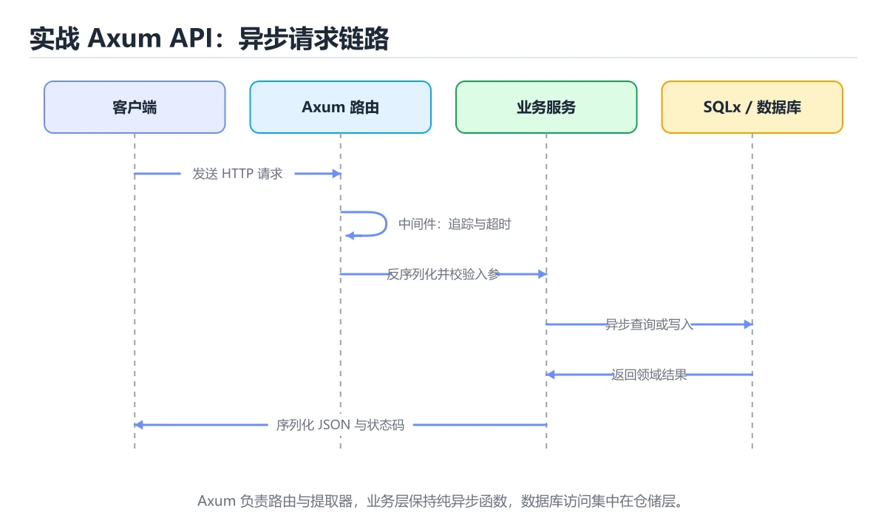
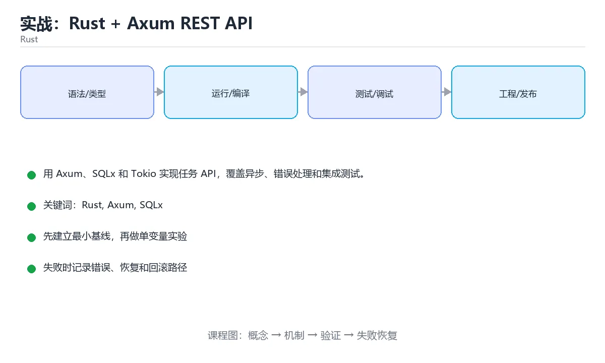

# 实战：Rust + Axum REST API





> 内容更新时间：2026-10-06 · 学习阶段：高级 · 预计用时：60 分钟

## 本节知识框架

**课程定位**：所属分类 `rust`（Rust），课程主题 `实战：Rust + Axum REST API`，学习阶段 高级，建议用时 70 分钟。

本课主线：用 Axum、SQLx 和 Tokio 实现任务 API，覆盖异步、错误处理和集成测试。

**学完本课应当能够**
- 说清 `Rust` 与 `异步` 的含义与区别，并各举一个正例和一个反例。
- 用本课示例验证 `提取器` 的行为，记录输入、输出与失败条件。
- 遇到「在异步 handler 中使用阻塞 IO」这类问题时，能说出触发条件与修复顺序。

### 从概念到验证的学习链条

1. `Rust`：先掌握 静态编译的系统级语言：所有权与借用检查在编译期消除数据竞争，无 GC，适合高性能服务，再用它解释 `异步` 为什么会出现。
2. `异步`：先掌握 用 Axum、SQLx 和 Tokio 实现任务 API，覆盖异步、错误处理和集成测试，再用它解释 `提取器` 为什么会出现。
3. `提取器`：先掌握 Axum 从请求里解析 JSON、路径参数或状态并注入 handler，解析失败直接返回错误响应，再用它解释 `连接池` 为什么会出现。
4. `连接池`：先掌握 复用一批数据库连接，池大小要与数据库的承载能力匹配，过大会把数据库压垮，再用它解释 `可观测性` 为什么会出现。
5. `可观测性`：先掌握 由日志、指标与链路追踪组成，能在不重启、不改代码的前提下问出新问题，再用它解释 本课示例的观察结果 为什么会出现。

**先修与衔接**：本课是「Rust」分类的第 14 课。先修内容：《Rust 异步编程与 tokio》。《Rust 异步编程与 tokio》里的 `Rust`、`异步` 是本课的前提。相关或后续课程：《实战：Rust 并发下载器》。

### 完成判据

- **定义关**：不看正文也能说明 `Rust` 是 静态编译的系统级语言：所有权与借用检查在编译期消除数据竞争，无 GC，适合高性能服务，并指出一个反例。
- **机制关**：能按“输入 → 转换 → 输出 → 验证”复述 `实战：Rust + Axum REST API`，而不是只背结论。
- **示例关**：能运行或推演 `实战：Rust + Axum REST API` 的 `text` 示例，并说明一个真实出现的标识符或字面量。
- **证据关**：能从 `实战：Rust + Axum REST API` 的示例写出一个输入、处理、输出三元组，并说明它支持或反驳了本课的哪一条结论。
- **排错关**：能复现 在异步 handler 中使用阻塞 IO，记录现象并按 使用异步库或把阻塞工作放到专用线程池 修复。
- **迁移关**：能把 `Rust`、`Axum`、`SQLx`、`Tokio` 放进一个与 `实战：Rust + Axum REST API` 不同的项目场景，并保持输入与验证条件可追踪。
- **复盘关**：学完 `实战：Rust + Axum REST API` 后，用一句话写下仍然不确定的结论，并列出下一次验证需要的输入、环境和成功判据。

### 复习清单

- [ ] 能不看正文复述本课核心术语，并指出一个边界或反例。
- [ ] 能运行或推演本课示例，记录输入、输出与失败现象。
- [ ] 能完成一次自测，并把错题对照错误表定位原因。

## 核心概念定义

| 术语 | 操作性定义 | 常见边界与风险 |
| --- | --- | --- |
| Rust | 静态编译的系统级语言：所有权与借用检查在编译期消除数据竞争，无 GC，适合高性能服务。 | 结论随输入规模变化，小规模成立不代表大规模成立，需要重新测量。 |
| 异步 | 用 Axum、SQLx 和 Tokio 实现任务 API，覆盖异步、错误处理和集成测试。 | 易错：拖慢整个运行时；正确做法是使用异步库或把阻塞工作放到专用线程池。 |
| 提取器 | Axum 从请求里解析 JSON、路径参数或状态并注入 handler，解析失败直接返回错误响应。 | 网络延迟、超时与版本协商会改变行为，只在真实链路或多版本客户端上验证才算数。 |
| 连接池 | 复用一批数据库连接，池大小要与数据库的承载能力匹配，过大会把数据库压垮。 | 索引命中与数据分布决定实际开销，判断前先看执行计划而不是只看结果是否正确。 |
| 可观测性 | 由日志、指标与链路追踪组成，能在不重启、不改代码的前提下问出新问题 | 只在「由日志、指标与链路追踪组成，能在不重启、不改代码的前提下问出新问题」这一前提下成立，换输入或换环境要重新验证。 |

## 原理与运行机制

### 机制总览

**教材衔接：技术栈**

- Rust 1.85
- Axum
- Tokio
- SQLx
- serde
- tracing

**教材衔接：架构与数据流**

- TcpListener 的读取接口必须写清过滤条件与分页，不能默认全量返回。
- TcpListener 的写入要以幂等键为准，失败后能补偿或安全重试。
- 外部调用要设置超时、重试上限和降级策略。
- 每个关键阶段都要留下日志、指标或测试证据。

**教材衔接：功能范围**

- [ ] 创建任务
- [ ] 按 ID 查询
- [ ] 更新任务状态
- [ ] 健康检查和结构化日志

**教材衔接：实施步骤**

### 步骤 1：定义领域模型和错误类型

- 输入与产出：先写清 Rust 依赖的配置、数据和最终产物，再开始编码。
- 验证方法：用最小请求或单元测试证明 Rust 这一步的结果正确。
- 出错时先记录 Axum 的错误信息与回滚结果，再决定是否重试。
- 证据留存：保留命令、输出、日志或截图，方便评审与复盘。

### 步骤 2：初始化 SQLx 连接池和迁移

- 定位：这一节说明步骤 2：初始化 SQLx 连接池和迁移在「实战：Rust + Axum REST API」知识体系里的位置。
- 要点：本课涉及：Rust、Axum、SQLx、Tokio、异步。
- 自检：能否用一个最小例子解释步骤 2：初始化 SQLx 连接池和迁移？

### 步骤 3：实现 handler 与路由

- 定位：这一节说明步骤 3：实现 handler 与路由在「实战：Rust + Axum REST API」知识体系里的位置。
- 要点：需要一个类型安全、可本地运行的 Rust 任务服务，支持创建、查询和更新状态；数据库使用 SQLite，异步请求不能阻塞运行时。
- 自检：能否用一个最小例子解释步骤 3：实现 handler 与路由？

### 步骤 4：加入 serde 校验和统一错误响应

- 定位：这一节说明步骤 4：加入 serde 校验和统一错误响应在「实战：Rust + Axum REST API」知识体系里的位置。
- 要点：一句话摘要：用 Axum、SQLx 和 Tokio 实现任务 API，覆盖异步、错误处理和集成测试。
- 自检：能否用一个最小例子解释步骤 4：加入 serde 校验和统一错误响应？

### 步骤 5：补异步测试

- 定位：这一节说明步骤 5：补异步测试在「实战：Rust + Axum REST API」知识体系里的位置。
- 检查点：用空值、极值和依赖失败各跑一次《实战：Rust + Axum REST API》，确认边界行为与正文一致。
- 自检：能否用一个最小例子解释步骤 5：补异步测试？

### 步骤 6：用 tracing 和优雅关闭收尾

- 定位：这一节说明步骤 6：用 tracing 和优雅关闭收尾在「实战：Rust + Axum REST API」知识体系里的位置。
- 检查点：用空值、极值和依赖失败各跑一次《实战：Rust + Axum REST API》，确认边界行为与正文一致。
- 自检：能否用一个最小例子解释步骤 6：用 tracing 和优雅关闭收尾？

**教材衔接：建议目录结构**

**教材衔接：质量门禁**

- [ ] 格式化和静态检查通过，不遗留明显警告。
- [ ] 测试分层：核心规则用单元测试，Axum 的边界用集成测试。
- [ ] 错误响应不泄露堆栈、SQL 和密钥。
- [ ] 配置来自环境变量或配置文件，不硬编码敏感信息。
- [ ] README 写清启动、测试、配置和回滚步骤。

**教材衔接：安全、成本与可观测性**

- TcpListener 的运行身份只保留完成任务所需的权限，越权请求应当被拒绝。
- TcpListener 的参数先校验再使用，错误响应里不出现堆栈或 SQL。
- 密钥通过环境变量或密钥管理服务注入，并记录轮换方式。
- TcpListener 的并发度要有上限，并在达到上限时给出可解释的拒绝。
- 至少记录 Rust 的请求量、错误率、P95/P99 延迟与资源使用趋势。
- Rust 出现异常时，要能从日志和指标还原时间线，而不是只看到「服务不可用」。

**教材衔接：扩展任务**

- 加入 JWT 认证
- 用 PostgreSQL 替换 SQLite
- 接入 OpenTelemetry 链路追踪

**教材衔接：实施记录与复盘**

每完成一步，记录以下内容：

1. 本步的输入、命令和输出是什么？
2. 遇到的最小失败是什么，如何定位和修复？
3. 哪个假设被验证或推翻？
4. 下一步的风险是什么，如何回滚？
5. 如果 Rust 的数据量或并发扩大 10 倍，最先出现的瓶颈在哪里？

**教材衔接：完成标准**

- [ ] 能从干净环境按 README 启动项目。
- [ ] 至少 3 条 Rust 相关自动化测试通过，其中一条覆盖失败路径。
- [ ] 能演示一次错误、一次恢复和一次回滚。
- [ ] 有一份资源或性能基线，能说明瓶颈在哪里。
- [ ] 能说清一个尚未解决的问题和下一步验证方法。

**教材衔接：版本与时效**

- 版本提示：Rust 的行为在最近几个大版本里有过调整，升级「实战：Rust + Axum REST API」前先用 TcpListener 复现当前输出，再对照官方发布说明逐条核对。
- 把 Axum 的编译告警当作错误处理，升级后才能避免行为漂移。
- 升级「实战：Rust + Axum REST API」涉及的依赖前，先用 rust_project_axum_api 复现当前行为，再逐项核对版本说明与破坏性变更。
- 官方发布说明：https://blog.rust-lang.org/

### 升级检查清单

- 先固定当前版本，跑通全部示例与测验，再升级工具链。
- 升级时只动一个依赖版本，用 TcpListener 记录构建与运行结果。
- 回归范围锁定 TcpListener 的默认行为，并确认弃用警告是否出现在构建输出里。
- 升级后把 TcpListener 的实测版本写进「内容元数据」，再更新复核日期。

**教材衔接：交付评审：评分表、决策记录与证据链**


### 四、「实战：Rust + Axum REST API」的验收指标

| 指标 | 目标值 | 测量方式 | 不达标时的动作 |
| --- | --- | --- | --- |
| 至少记录 Rust 的请求量、错误率、P95/P99 延迟与资源使用趋势。 | 用本课正文给出的阈值，没有就写实测基线 | 固定环境重复三次取中位数 | 回到对应小节定位，先修原因再重测 |
| | 延迟 | 记录 P50/P95/P99 | 用固定数据集逐步增加并发 | P99 持续上升或超时率增加 | | 用本课正文给出的阈值，没有就写实测基线 | 固定环境重复三次取中位数 | 回到对应小节定位，先修原因再重测 |
| | 存储 | 记录数据增长与索引大小 | 导入 10 倍数据并观察查询 | 磁盘、连接或锁等待成为瓶颈 | | 用本课正文给出的阈值，没有就写实测基线 | 固定环境重复三次取中位数 | 回到对应小节定位，先修原因再重测 |

### 五、评审记录模板

| 记录项 | 填写要求 |
| --- | --- |
| 项目标识 | `rust_project_axum_api` |
| 本次范围 | 说明这一轮交付了「实战：Rust + Axum REST API」的哪些部分 |
| 未完成项 | 列出与 Rust 相关但本轮未做的内容 |
| 证据位置 | 指向 evidence/ 目录下的具体文件 |
| 风险与回滚 | 写清剩余风险、回滚步骤和验证方式 |
| 结论 | 通过 / 有条件通过 / 不通过，三者选一 |

### 机制拆解：每一步的输入、动作与输出

#### 1. `Rust`
- 输入：`Rust`；本步把 静态编译的系统级语言：所有权与借用检查在编译期消除数据竞争，无 GC，适合高性能服务 当作判断规则。
- 动作：围绕 `Rust` 保留中间状态，并记录它与 `异步` 的对应关系。
- 输出：`异步`，它可以被下一段代码、测试或记录继续使用。
- `Rust` 的失败条件：结论随输入规模变化，小规模成立不代表大规模成立，需要重新测量。

#### 2. `异步`
- 输入：`Rust`；本步把 用 Axum、SQLx 和 Tokio 实现任务 API，覆盖异步、错误处理和集成测试 当作判断规则。
- 动作：围绕 `异步` 保留中间状态，并记录它与 `提取器` 的对应关系。
- 输出：`提取器`，它可以被下一段代码、测试或记录继续使用。
- `异步` 的失败条件：当在异步 handler 中使用阻塞 IO时，会出现拖慢整个运行时。

#### 3. `提取器`
- 输入：`异步`；本步把 Axum 从请求里解析 JSON、路径参数或状态并注入 handler，解析失败直接返回错误响应 当作判断规则。
- 动作：围绕 `提取器` 保留中间状态，并记录它与 `连接池` 的对应关系。
- 输出：`连接池`，它可以被下一段代码、测试或记录继续使用。
- `提取器` 的失败条件：网络延迟、超时与版本协商会改变行为，只在真实链路或多版本客户端上验证才算数。

#### 4. `连接池`
- 输入：`提取器`；本步把 复用一批数据库连接，池大小要与数据库的承载能力匹配，过大会把数据库压垮 当作判断规则。
- 动作：围绕 `连接池` 保留中间状态，并记录它与 `可观测性` 的对应关系。
- 输出：`可观测性`，它可以被下一段代码、测试或记录继续使用。
- `连接池` 的失败条件：索引命中与数据分布决定实际开销，判断前先看执行计划而不是只看结果是否正确。

#### 5. `可观测性`
- 输入：`连接池`；本步把 由日志、指标与链路追踪组成，能在不重启、不改代码的前提下问出新问题 当作判断规则。
- 动作：围绕 `可观测性` 保留中间状态，并记录它与 `本课示例的最终结果` 的对应关系。
- 输出：`本课示例的最终结果`，它可以被下一段代码、测试或记录继续使用。
- `可观测性` 的失败条件：只在「由日志、指标与链路追踪组成，能在不重启、不改代码的前提下问出新问题」这一前提下成立，换输入或换环境要重新验证。

### 复现实验记录

- 环境：`实战：Rust + Axum REST API` 使用 `text` 示例，固定 `Rust`、`Axum`、`SQLx`、`Tokio` 作为第一组条件。
- 首轮输入：从示例中的第一个输入开始，预测 `Rust` 会怎样变化。
- 基线观察：记录命令、输入、输出和错误原文，不用截图代替可复制的文本。
- 单变量修改：只改变 `Rust`，观察 `可观测性` 是否仍满足定义。
- 失败注入：复现 在异步 handler 中使用阻塞 IO，确认现象是 拖慢整个运行时。
- 记录结论：把“修改前、修改后、预期变化、实际变化”写成四列表，这样复盘 `实战：Rust + Axum REST API` 时才能区分概念错误与实现错误。

## 典型应用场景

**课程内置实验入口**：`sandbox:rust`，用于动手验证《实战：Rust + Axum REST API》的机制；实验结论不替代概念定义与复杂度分析。

**教材衔接：项目背景**

需要一个类型安全、可本地运行的 Rust 任务服务，支持创建、查询和更新状态；数据库使用 SQLite，异步请求不能阻塞运行时。

一句话摘要：用 Axum、SQLx 和 Tokio 实现任务 API，覆盖异步、错误处理和集成测试。

**教材衔接：项目专属规格：实战：Rust + Axum REST API**

### 核心场景

用 Axum、SQLx 和 Tokio 实现任务 API，覆盖异步、错误处理和集成测试。 项目目标是把「Rust、Axum、SQLx、Tokio、异步」落实为可运行、可测试、可回滚的交付物。


### 验收场景

1. 正常路径：最小输入得到预期输出，并留下日志与指标。
2. 边界路径：Rust 的空值、最大值、重复数据和超长内容都得到明确处理。
3. 失败路径：依赖超时或不可用时能快速失败、重试或降级。
4. 幂等路径：同一请求执行两次不会产生重复副作用。
5. 回滚路径：Axum 的失败能按预案恢复，并记录影响范围。

**教材衔接：项目交付物**

### 建议仓库结构

```text
src/main.rs
src/domain/
src/infra/
tests/
Cargo.toml
```


### 验收数据

```json
{
  "project": "rust_project_axum_api",
  "scenario": "Rust的正常路径",
  "input": {"case": "normal", "value": "TcpListener"},
  "expected": {"ok": true, "checks": ["Rust可复现", "Axum有记录"]},
  "failure_case": {"case": "Axum越界或缺失", "error": "validation_error"},
  "idempotency_key": "rust_project_axum_api-001"
}
```

### 复盘模板

- **在异步 handler 中使用阻塞 IO**：典型现象是拖慢整个运行时；正确做法是使用异步库或把阻塞工作放到专用线程池。
- **unwrap 满天飞**：典型现象是请求导致进程 panic；正确做法是把错误转换为 Result 并返回响应。
- **SQL 字符串拼接**：典型现象是注入和转义问题；正确做法是使用 SQLx 参数绑定。
- **测试共用数据库**：典型现象是状态污染；正确做法是每个测试使用独立临时库或事务回滚。

### 最小验证场景

- 准备：保留 `text` 示例的原始输入，先记录 `实战：Rust + Axum REST API` 的基线输出和完整运行命令。
- 判定：新结果与 `实战：Rust + Axum REST API` 的基线不同不等于错误；只有当差异破坏了 `Rust` 的定义或错误表中的约束，才判定为失败。

### 选择与边界

- 使用 `Rust` 时，先满足它的定义：静态编译的系统级语言：所有权与借用检查在编译期消除数据竞争，无 GC，适合高性能服务；结论随输入规模变化，小规模成立不代表大规模成立，需要重新测量。
- 使用 `异步` 时，先满足它的定义：用 Axum、SQLx 和 Tokio 实现任务 API，覆盖异步、错误处理和集成测试；易错：拖慢整个运行时；正确做法是使用异步库或把阻塞工作放到专用线程池。
- 使用 `提取器` 时，先满足它的定义：Axum 从请求里解析 JSON、路径参数或状态并注入 handler，解析失败直接返回错误响应；网络延迟、超时与版本协商会改变行为，只在真实链路或多版本客户端上验证才算数。
- 使用 `连接池` 时，先满足它的定义：复用一批数据库连接，池大小要与数据库的承载能力匹配，过大会把数据库压垮；索引命中与数据分布决定实际开销，判断前先看执行计划而不是只看结果是否正确。
- 使用 `可观测性` 时，先满足它的定义：由日志、指标与链路追踪组成，能在不重启、不改代码的前提下问出新问题；只在「由日志、指标与链路追踪组成，能在不重启、不改代码的前提下问出新问题」这一前提下成立，换输入或换环境要重新验证。

## 代码/协议/SQL 示例

### 最小可验证示例

**教材衔接：示例数据与边界**

**教材衔接：关键代码**

```rust
use axum::{routing::get, Router, Json};
use serde_json::json;

#[tokio::main]
async fn main() {
    let app = Router::new().route("/health", get(|| async { Json(json!({"status":"ok"})) }));
    let listener = tokio::net::TcpListener::bind("0.0.0.0:8080").await.unwrap();
    axum::serve(listener, app).await.unwrap();
}
```

**教材衔接：验证命令与预期输出**

**教材衔接：测试与验收**

- 非法状态转换返回 422
- 不存在任务返回 404
- 数据库错误不会泄露内部 SQL


### 示例精读：先找证据，再改一个条件

- 在 `实战：Rust + Axum REST API` 中与 `Rust` 对照：示例必须能支持 静态编译的系统级语言：所有权与借用检查在编译期消除数据竞争，无 GC，适合高性能服务，否则说明这一段还缺少实现或验证步骤。
- 在 `实战：Rust + Axum REST API` 中与 `异步` 对照：示例必须能支持 用 Axum、SQLx 和 Tokio 实现任务 API，覆盖异步、错误处理和集成测试，否则说明这一段还缺少实现或验证步骤。
- 在 `实战：Rust + Axum REST API` 中与 `提取器` 对照：示例必须能支持 Axum 从请求里解析 JSON、路径参数或状态并注入 handler，解析失败直接返回错误响应，否则说明这一段还缺少实现或验证步骤。
- 在 `实战：Rust + Axum REST API` 中与 `连接池` 对照：示例必须能支持 复用一批数据库连接，池大小要与数据库的承载能力匹配，过大会把数据库压垮，否则说明这一段还缺少实现或验证步骤。
- `实战：Rust + Axum REST API` 的示例没有抽取到函数调用或字面量；按行记录输入、控制流和输出，避免只背代码外形。

## 时间/空间复杂度或性能分析

**性能关注点（实战：Rust + Axum REST API）**：零成本抽象不等于零开销：记录运行时间、内存峰值与编译时间。

**本课特有开销（实战：Rust + Axum REST API · Rust）**：并发度提高后要观察是否出现拐点：延迟上升而吞吐不增，说明瓶颈已转移。

**测量方法**：以 `实战：Rust + Axum REST API` 的 `Rust` 场景为对象，固定输入跑一遍记录基线，再把规模或并发度提高一个数量级复测；两次结果的差值与波动范围才是结论依据。

### 需要控制的变量与记录项

- `实战：Rust + Axum REST API` 的 `Rust`：固定它的版本、输入范围和资源上限，分别记录速度、内存与失败率的变化。
- `实战：Rust + Axum REST API` 的 `Axum`：固定它的版本、输入范围和资源上限，分别记录速度、内存与失败率的变化。
- `实战：Rust + Axum REST API` 的 `SQLx`：固定它的版本、输入范围和资源上限，分别记录速度、内存与失败率的变化。
- `实战：Rust + Axum REST API` 的 `Tokio`：固定它的版本、输入范围和资源上限，分别记录速度、内存与失败率的变化。
- `实战：Rust + Axum REST API` 的 `异步`：固定它的版本、输入范围和资源上限，分别记录速度、内存与失败率的变化。
- `实战：Rust + Axum REST API` 中 `Rust` 的边界：结论随输入规模变化，小规模成立不代表大规模成立，需要重新测量。达到边界时不要外推，必须重新测量。
- `实战：Rust + Axum REST API` 中 `异步` 的边界：易错：拖慢整个运行时；正确做法是使用异步库或把阻塞工作放到专用线程池。达到边界时不要外推，必须重新测量。
- `实战：Rust + Axum REST API` 中 `提取器` 的边界：网络延迟、超时与版本协商会改变行为，只在真实链路或多版本客户端上验证才算数。达到边界时不要外推，必须重新测量。
- `实战：Rust + Axum REST API` 中 `连接池` 的边界：索引命中与数据分布决定实际开销，判断前先看执行计划而不是只看结果是否正确。达到边界时不要外推，必须重新测量。
- `实战：Rust + Axum REST API` 中 `可观测性` 的边界：只在「由日志、指标与链路追踪组成，能在不重启、不改代码的前提下问出新问题」这一前提下成立，换输入或换环境要重新验证。达到边界时不要外推，必须重新测量。

## 常见误区与易错点

| 容易写错的做法 | 实际现象 | 原因与正确做法 |
| --- | --- | --- |
| 在异步 handler 中使用阻塞 IO | 拖慢整个运行时 | 使用异步库或把阻塞工作放到专用线程池 |
| unwrap 满天飞 | 请求导致进程 panic | 把错误转换为 Result 并返回响应 |
| SQL 字符串拼接 | 注入和转义问题 | 使用 SQLx 参数绑定 |
| 测试共用数据库 | 状态污染 | 每个测试使用独立临时库或事务回滚 |

### 现场 1：在异步 handler 中使用阻塞 IO

**症状**：拖慢整个运行时。

**根因与修复**：使用异步库或把阻塞工作放到专用线程池。

**自检**：在本课示例里复现「在异步 handler 中使用阻塞 IO」，改成使用异步库或把阻塞工作放到专用线程池后重跑；如果症状消失且失败路径按预期变化，说明定位正确。

### 现场 2：unwrap 满天飞

**症状**：请求导致进程 panic。

**根因与修复**：把错误转换为 Result 并返回响应。

**自检**：在本课示例里复现「unwrap 满天飞」，改成把错误转换为 Result 并返回响应后重跑；如果症状消失且失败路径按预期变化，说明定位正确。

### 现场 3：SQL 字符串拼接

**症状**：注入和转义问题。

**根因与修复**：使用 SQLx 参数绑定。

**自检**：在本课示例里复现「SQL 字符串拼接」，改成使用 SQLx 参数绑定后重跑；如果症状消失且失败路径按预期变化，说明定位正确。

### 现场 4：测试共用数据库

**症状**：状态污染。

**根因与修复**：每个测试使用独立临时库或事务回滚。

**自检**：在本课示例里复现「测试共用数据库」，改成每个测试使用独立临时库或事务回滚后重跑；如果症状消失且失败路径按预期变化，说明定位正确。

## 与其他知识点的关系

**教材衔接：复习与迁移**

### 概念复述

- 用一句话说明「实战：Rust + Axum REST API」解决什么问题：用 Axum、SQLx 和 Tokio 实现任务 API，覆盖异步、错误处理和集成测试。
- 写出Rust、Axum、SQLx之间的关系，并各举一个例子。
- 说出本课最容易混淆的两个概念，以及区分它们的判据。

### 正文逐节复核

- **项目背景**：需要一个类型安全、可本地运行的 Rust 任务服务，支持创建、查询和更新状态；数据库使用 SQLite，异步请求不能阻塞运行时。
- **项目专属规格：实战：Rust + Axum REST API**：用 Axum、SQLx 和 Tokio 实现任务 API，覆盖异步、错误处理和集成测试。


### 迁移练习

- **先修**：`Rust 异步编程与 tokio`。本课默认这些内容已经掌握。
- **相关或后续**：`实战：Rust 并发下载器`。本课术语会在这些课程里继续使用。
- **术语归属**：`Rust`、`异步`、`提取器` 的定义以本课「核心概念定义」为准，换到其他课程时先确认定义是否被改写。
- 同一分类的《Rust Cargo 第一个程序》也涉及 `Rust`；两课衔接时先确认这个术语的定义是否一致。
- 同一分类的《Rust 变量与可变性》也涉及 `Rust`；两课衔接时先确认这个术语的定义是否一致。

### 先修与后续术语接口

- `Rust 异步编程与 tokio`：共享术语 `Rust`、`异步`，共同关键词 `Rust`、`异步`。
- `实战：Rust 并发下载器`：共享术语 `Rust`，共同关键词 `Tokio`。

### 容易混淆的相邻概念

- `Rust` 与 `异步`：前者强调 静态编译的系统级语言：所有权与借用检查在编译期消除数据竞争，无 GC，适合高性能服务；后者强调 用 Axum、SQLx 和 Tokio 实现任务 API，覆盖异步、错误处理和集成测试。判断时分别检查两条定义的适用范围，不要只看名称相似就互换。
- `异步` 与 `提取器`：前者强调 用 Axum、SQLx 和 Tokio 实现任务 API，覆盖异步、错误处理和集成测试；后者强调 Axum 从请求里解析 JSON、路径参数或状态并注入 handler，解析失败直接返回错误响应。判断时分别检查两条定义的适用范围，不要只看名称相似就互换。
- `提取器` 与 `连接池`：前者强调 Axum 从请求里解析 JSON、路径参数或状态并注入 handler，解析失败直接返回错误响应；后者强调 复用一批数据库连接，池大小要与数据库的承载能力匹配，过大会把数据库压垮。判断时分别检查两条定义的适用范围，不要只看名称相似就互换。
- `连接池` 与 `可观测性`：前者强调 复用一批数据库连接，池大小要与数据库的承载能力匹配，过大会把数据库压垮；后者强调 由日志、指标与链路追踪组成，能在不重启、不改代码的前提下问出新问题。判断时分别检查两条定义的适用范围，不要只看名称相似就互换。

## 自测题与参考答案

> 先独立作答，再对照参考答案；答案都能在本课正文、术语表或错误表里找到依据。

### 自测 1（概念复述）

不看正文，写出 `Rust` 的操作性定义，并说明它与 `异步` 的区别。

**参考答案**：静态编译的系统级语言：所有权与借用检查在编译期消除数据竞争，无 GC，适合高性能服务。

`异步` 的定位是：用 Axum、SQLx 和 Tokio 实现任务 API，覆盖异步、错误处理和集成测试；两者的差别要从适用对象与失败模式上说明。

### 自测 2（排错）

本课错误表记录了「在异步 handler 中使用阻塞 IO」这类做法。请写出它会出现的现象、根因，以及修复顺序。

**参考答案**：现象是拖慢整个运行时；正确做法是使用异步库或把阻塞工作放到专用线程池。修复时先复现现象并保留证据，再改动一处假设重跑，确认现象消失。

### 自测 3（动手验证）

运行本课的 `text` 示例，改动其中一个输入后重新运行，记录输出与错误信息。

**参考答案**：正常输入下 `text` 示例应当复现正文给出的结果；改动输入后，如果结果改变或报错，先核对它是否满足 `实战：Rust + Axum REST API` 中`Rust` 的适用范围，再检查错误表里是否有同类现象。

### 自测 4（代码阅读）

阅读本课开头的 `text` 示例，说明它体现了`Rust` 的哪一条性质，并指出改动哪个输入会让这条性质不再成立。

**参考答案**：`Rust` 的定义是 静态编译的系统级语言：所有权与借用检查在编译期消除数据竞争，无 GC，适合高性能服务，示例正是在实现这条定义。改动与 `Rust` 有关的一个输入后，如果结果不再符合 `实战：Rust + Axum REST API` 的正文描述，就说明该性质只在当前前提成立。

### 自测 5（迁移）

把 `实战：Rust + Axum REST API` 的方法迁移到自己的项目：围绕 `Rust` 写出一个与错误表同类的风险点，并说明触发条件和检验方式。

**参考答案**：例如「测试共用数据库」，它会导致状态污染；检验方式是按每个测试使用独立临时库或事务回滚改一处再复现，确认现象消失且没有引入新的失败分支。

### 自测 6（对比）

用一个表格对比 `Rust` 与 `异步`：各写一行适用场景、一行失败表现。

**参考答案**：`Rust` 的定义是静态编译的系统级语言：所有权与借用检查在编译期消除数据竞争，无 GC，适合高性能服务；`异步` 的定义是用 Axum、SQLx 和 Tokio 实现任务 API，覆盖异步、错误处理和集成测试。两者的失败表现分别对应本课错误表里与本术语相关的行。

### 自测 7（排错顺序）

面对「在异步 handler 中使用阻塞 IO」引发的问题，请把“复现 拖慢整个运行时 → 保留证据 → 使用异步库或把阻塞工作放到专用线程池 → 回归验证”四步写成可执行的检查清单。

**参考答案**：第一步按拖慢整个运行时复现；第二步记录输入、版本与完整报错；第三步按使用异步库或把阻塞工作放到专用线程池只改一处；第四步重跑并确认失败路径也按预期变化。

### 自测 8（边界判断）

针对 `可观测性`，分别写出“可以使用”的条件和“结论不再成立”的条件。

**参考答案**：只在「由日志、指标与链路追踪组成，能在不重启、不改代码的前提下问出新问题」这一前提下成立，换输入或换环境要重新验证。 同时要把 `可观测性` 的定义 由日志、指标与链路追踪组成，能在不重启、不改代码的前提下问出新问题 与实际输入逐项对照。

### 自测 9（机制重建）

不看正文，按输入、转换、输出、验证四段重建 `Rust` → `异步` → `提取器` → `连接池` 的作用链。

**参考答案**：起点是 `Rust` 的定义 静态编译的系统级语言：所有权与借用检查在编译期消除数据竞争，无 GC，适合高性能服务；中间每一步都保留可观察状态；终点由 `可观测性` 检查，失败时回到错误表定位第一个偏离定义的步骤。

### 自测 10（综合排错）

在 `实战：Rust + Axum REST API` 中，现象是 状态污染。请围绕 测试共用数据库 写出最小复现、关键证据、修复动作和回归验证，并说明为什么不能只凭一次运行下结论。

**参考答案**：先复现 测试共用数据库，记录输入与完整错误；再按 每个测试使用独立临时库或事务回滚 只改一处。回归时同时跑正常路径和边界路径，只有两次结果都可解释，才把修复视为完成。

### 自测 11（一分钟复述）

用每分钟约 200 字的速度复述 `实战：Rust + Axum REST API`：先给主问题，再按顺序说出 `Rust`、`异步`、`提取器`、`连接池`，最后给一个失败案例。

**自评标准**：主问题必须对应 用 Axum、SQLx 和 Tokio 实现任务 API，覆盖异步、错误处理和集成测试；每个术语都要能接上一句定义或边界；失败案例必须写成可观察现象，不能用“可能有风险”代替证据。

## 术语速查

| 术语 | 一句话说明 |
| --- | --- |
| `Rust` | 静态编译的系统级语言：所有权与借用检查在编译期消除数据竞争，无 GC，适合高性能服务。 |
| `异步` | 用 Axum、SQLx 和 Tokio 实现任务 API，覆盖异步、错误处理和集成测试。 |
| `提取器` | Axum 从请求里解析 JSON、路径参数或状态并注入 handler，解析失败直接返回错误响应。 |
| `连接池` | 复用一批数据库连接，池大小要与数据库的承载能力匹配，过大会把数据库压垮。 |
| `可观测性` | 由日志、指标与链路追踪组成，能在不重启、不改代码的前提下问出新问题。 |

**术语关系**：`Rust`（静态编译的系统级语言：所有权与借用检查在编译期消除数据竞争） → `异步`（用 Axum、SQLx 和 Tokio 实现任务 API） → `提取器`（Axum 从请求里解析 JSON、路径参数或状态并注入 handler） → `连接池`（复用一批数据库连接）。

## 考点精讲

`实战：Rust + Axum REST API` 的题库有 6 道题，下面逐题给出题干、正确项与判断依据：先自己作答，再核对正确项，最后回到正文对应小节复核。

### 考点 1：第 1 题

- **题目**：SQLx 参数绑定主要防止什么？
- **正确项**：SQL 注入和转义错误
- **判断依据**：这道题检验本课主问题：用 Axum、SQLx 和 Tokio 实现任务 API，覆盖异步、错误处理和集成测试。复习时先复述本课主问题，再举一个会让结论失效的输入。

### 考点 2：第 2 题

- **题目**：Rust 中处理可恢复错误最适合返回什么？
- **正确项**：Result
- **判断依据**：这道题落在术语 `Rust` 上：静态编译的系统级语言：所有权与借用检查在编译期消除数据竞争，无 GC，适合高性能服务。复习时把 `Rust` 的定义、适用边界和一个反例一起说清楚，再回到「核心概念定义」核对原文。

### 考点 3：第 3 题

- **题目**：围绕“实战：Rust + Axum REST API”中的 Rust、Axum、SQLx，下列哪两项是本课强调的实践判断？
- **正确项**：验证 Axum 时要固定版本并覆盖边界输入，结论才可复现；学习 Rust 时要同时说明输入、输出和失败路径，不能只看正常流程
- **判断依据**：这道题落在术语 `Rust` 上：静态编译的系统级语言：所有权与借用检查在编译期消除数据竞争，无 GC，适合高性能服务。复习时把 `Rust` 的定义、适用边界和一个反例一起说清楚，再回到「核心概念定义」核对原文。

### 考点 4：第 4 题

- **题目**：优雅关闭需要做什么？
- **正确项**：停止接收请求并等待在途任务
- **判断依据**：这道题检验本课主问题：用 Axum、SQLx 和 Tokio 实现任务 API，覆盖异步、错误处理和集成测试。复习时先复述本课主问题，再举一个会让结论失效的输入。

### 考点 5：第 5 题

- **题目**：访问这段 Axum 服务的 /health 路由会得到什么？
- **正确项**：JSON {"status":"ok"} 和 200
- **判断依据**：这道题检验本课主问题：用 Axum、SQLx 和 Tokio 实现任务 API，覆盖异步、错误处理和集成测试。复习时先复述本课主问题，再举一个会让结论失效的输入。

### 考点 6：第 6 题

- **题目**：下面几项都与 `Rust` 有关，请按 `实战：Rust + Axum REST API` 的正文顺序排列；该课主线是用 Axum、SQLx 和 Tokio 实现任务 API，覆盖异步、错误处理和集成测试。
- **正确项**：项目背景 → 技术栈 → 架构与数据流 → 功能范围
- **判断依据**：这道题落在术语 `Rust` 上：静态编译的系统级语言：所有权与借用检查在编译期消除数据竞争，无 GC，适合高性能服务。复习时把 `Rust` 的定义、适用边界和一个反例一起说清楚，再回到「核心概念定义」核对原文。

### 考点 7：`Rust`

- **要点**：静态编译的系统级语言：所有权与借用检查在编译期消除数据竞争，无 GC，适合高性能服务。
- **Rust 的边界**：结论随输入规模变化，小规模成立不代表大规模成立，需要重新测量。

### 考点 8：`异步`

- **要点**：用 Axum、SQLx 和 Tokio 实现任务 API，覆盖异步、错误处理和集成测试。
- **异步 的边界**：易错：拖慢整个运行时；正确做法是使用异步库或把阻塞工作放到专用线程池。

### 考点 9：`提取器`

- **要点**：Axum 从请求里解析 JSON、路径参数或状态并注入 handler，解析失败直接返回错误响应。
- **提取器 的边界**：网络延迟、超时与版本协商会改变行为，只在真实链路或多版本客户端上验证才算数。

### 考点 10：`连接池`

- **要点**：复用一批数据库连接，池大小要与数据库的承载能力匹配，过大会把数据库压垮。
- **连接池 的边界**：索引命中与数据分布决定实际开销，判断前先看执行计划而不是只看结果是否正确。

### 考点 11：`可观测性`

- **要点**：由日志、指标与链路追踪组成，能在不重启、不改代码的前提下问出新问题
- **可观测性 的边界**：只在「由日志、指标与链路追踪组成，能在不重启、不改代码的前提下问出新问题」这一前提下成立，换输入或换环境要重新验证。

### 考点 12：排错——在异步 handler 中使用阻塞 IO

- **现象**：拖慢整个运行时。
- **处理**：使用异步库或把阻塞工作放到专用线程池。

### 考点 13：排错——unwrap 满天飞

- **现象**：请求导致进程 panic。
- **处理**：把错误转换为 Result 并返回响应。

### 考点 14：综合辨析——`Rust` 与 `可观测性`

- **辨析点**：`Rust` 的定义是 静态编译的系统级语言：所有权与借用检查在编译期消除数据竞争，无 GC，适合高性能服务；`可观测性` 的定义是 由日志、指标与链路追踪组成，能在不重启、不改代码的前提下问出新问题。
- **答题要求**：面对 `实战：Rust + Axum REST API` 的题目，先判断描述的是 `Rust` 还是 `可观测性`，再归到对应定义，最后写出一个会让该定义失效的边界输入。

### 考点 15：排错评分点

- **现象分**：能写出 拖慢整个运行时，而不是只写“程序有错”。
- **证据分**：保留触发 在异步 handler 中使用阻塞 IO 的输入、版本和错误原文。
- **修复分**：按 使用异步库或把阻塞工作放到专用线程池 只改一处，并同时回归正常路径与边界路径。

## 内容元数据

- 内容版本：v2.0
- 最后更新：2026-10-06
- 学习阶段：高级
- 适用环境：Rust 1.85+ / Cargo；本课聚焦 Rust。
- 内容来源：内置结构化课程与工程实践整理
- 相关主题：Rust、Axum、SQLx、Tokio、异步
- 质量版本：P0 测验标准 + P1 覆盖扩展 + P2 体验补全

## 参考资料与复核

- 最后复核：2026-10-04
- 下次复核：2027-06-10
- 复核范围：版本兼容、API 行为、安全建议与工程实践
- 来源性质：官方文档、标准或权威教材；本课核对关键词：Rust、Axum、SQLx、Tokio、异步。

| 参考资料 | 本课用途 |
| --- | --- |
| [Tokio 文档](https://tokio.rs/tokio/tutorial) | 异步运行时与任务 |
| [Axum 文档](https://docs.rs/axum/latest/axum/) | Web 路由与提取器 |
| [Rust 标准库](https://doc.rust-lang.org/std/) | 标准库 API 与容器 |

| [本课术语索引：实战：Rust + Axum REST API](#核心概念定义) | 按本课输入、术语边界和错误表现逐项核对 |
> 「实战：Rust + Axum REST API」的链接用于离线阅读后的延伸核对；App 不会自动联网。