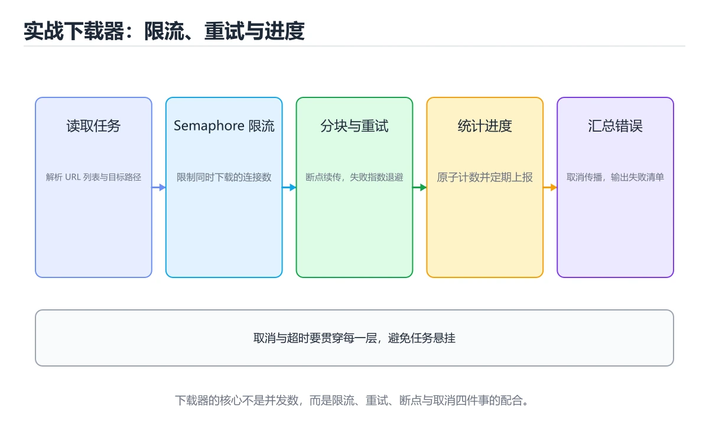
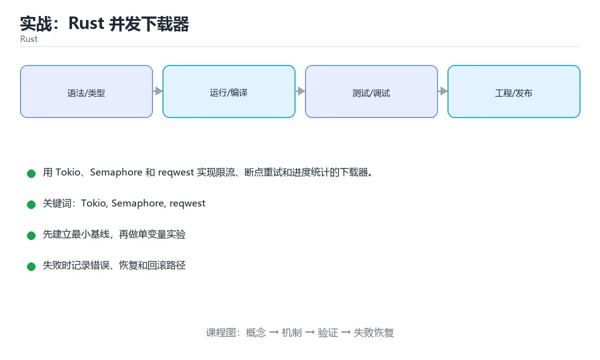

# 实战：Rust 并发下载器





> 内容更新时间：2026-10-03 · 学习阶段：高级 · 预计用时：110 分钟

## 学习目标

- 能用 Semaphore 限制并发。
- 能用 tokio::select 处理超时和取消。
- 能把任务结果汇总成可检查报告。

## 前置知识

- 已完成本分类的基础与进阶课程，能独立运行正文中的最小示例。
- 熟悉命令行、依赖管理、测试和 Git 基本操作。
- 本课涉及：Tokio、Semaphore、reqwest、并发、重试。

## 项目背景

需要从清单文件批量下载文件，限制并发数，失败重试，支持超时和取消，并输出每个文件的大小与耗时。

一句话摘要：用 Tokio、Semaphore 和 reqwest 实现限流、断点重试和进度统计的下载器。

## 技术栈

- Rust 1.85
- Tokio
- reqwest
- futures
- indicatif

## 架构与数据流

```text
输入 → 参数校验 → 业务处理 → 持久化/外部调用 → 结果输出 → 指标与日志
                 ↘ 失败分类 → 重试/回滚 → 错误响应
```

- 读路径要明确查询条件、分页方式和返回字段，避免一次加载全部数据。
- 写路径要明确事务边界、幂等键和失败补偿，不能留下半完成状态。
- 外部调用要设置超时、重试上限和降级策略。
- 每个关键阶段都要留下日志、指标或测试证据。

## 功能范围

- [ ] 读取下载清单
- [ ] 限制并发数
- [ ] 失败重试和退避
- [ ] 输出成功、失败和耗时统计

## 示例数据与边界

| 场景 | 输入 | 期望结果 | 检查点 |
| --- | --- | --- | --- |
| 正常路径 | 合法的最小数据集 | 成功返回并写入正确数据 | 状态码、数据库记录、日志 |
| 边界值 | 最大值、最小值或空集合 | 明确成功或给出可理解错误 | 不崩溃、不越界、不写半条数据 |
| 非法输入 | 类型错误、缺字段、超长内容 | 返回校验错误并指出字段 | 错误结构统一且不泄露内部信息 |
| 依赖失败 | 数据库不可用、超时、网络抖动 | 重试、降级或快速失败 | 可恢复、可观测、无重复副作用 |

## 实施步骤

### 步骤 1：定义任务和结果结构

- 输入与产出：先写清本步依赖的配置、数据和最终产物，再开始编码。
- 验证方法：用最小请求、最小数据集或单元测试证明本步结果正确。
- 失败处理：记录错误类型、回滚动作和重试条件，避免把问题带到下一步。
- 证据留存：保留命令、输出、日志或截图，方便评审与复盘。

### 步骤 2：创建异步 HTTP 客户端

- 输入与产出：先写清本步依赖的配置、数据和最终产物，再开始编码。
- 验证方法：用最小请求、最小数据集或单元测试证明本步结果正确。
- 失败处理：记录错误类型、回滚动作和重试条件，避免把问题带到下一步。
- 证据留存：保留命令、输出、日志或截图，方便评审与复盘。

### 步骤 3：用 Semaphore 限制并发

- 输入与产出：先写清本步依赖的配置、数据和最终产物，再开始编码。
- 验证方法：用最小请求、最小数据集或单元测试证明本步结果正确。
- 失败处理：记录错误类型、回滚动作和重试条件，避免把问题带到下一步。
- 证据留存：保留命令、输出、日志或截图，方便评审与复盘。

### 步骤 4：加入超时、重试和错误分类

- 输入与产出：先写清本步依赖的配置、数据和最终产物，再开始编码。
- 验证方法：用最小请求、最小数据集或单元测试证明本步结果正确。
- 失败处理：记录错误类型、回滚动作和重试条件，避免把问题带到下一步。
- 证据留存：保留命令、输出、日志或截图，方便评审与复盘。

### 步骤 5：写入临时文件后原子重命名

- 输入与产出：先写清本步依赖的配置、数据和最终产物，再开始编码。
- 验证方法：用最小请求、最小数据集或单元测试证明本步结果正确。
- 失败处理：记录错误类型、回滚动作和重试条件，避免把问题带到下一步。
- 证据留存：保留命令、输出、日志或截图，方便评审与复盘。

### 步骤 6：汇总报告并补测试

- 输入与产出：先写清本步依赖的配置、数据和最终产物，再开始编码。
- 验证方法：用最小请求、最小数据集或单元测试证明本步结果正确。
- 失败处理：记录错误类型、回滚动作和重试条件，避免把问题带到下一步。
- 证据留存：保留命令、输出、日志或截图，方便评审与复盘。

## 关键代码

```rust
let semaphore = Arc::new(Semaphore::new(8));
let mut tasks = Vec::new();
for url in urls {
    let permit = semaphore.clone().acquire_owned().await?;
    tasks.push(tokio::spawn(async move {
        let _permit = permit;
        download(url).await
    }));
}
for task in tasks { println!("{:?}", task.await?); }
```

## 验证命令与预期输出

先在干净环境执行启动和测试命令，再把真实输出记录到项目 README 或实施记录中。

```text
1. 安装依赖并启动项目
2. 执行至少 3 条自动化测试，其中包含 1 条失败路径
3. 用正常请求验证成功响应
4. 用非法输入验证错误响应
5. 重复执行一次，确认没有重复写入或副作用
```

预期输出必须包含：启动成功标志、测试通过数量、成功请求结果、错误状态码和重复执行的幂等结论。只写“运行正常”不算验收证据。

## 建议目录结构

```text
src/
  entry/        启动与配置
  domain/       业务模型与规则
  service/      用例编排
  infra/        数据库、HTTP、消息等适配器
tests/          单元、集成与接口测试
```

目录可以按语言习惯调整，但输入边界、业务规则和外部适配必须分层，不能全部堆在入口文件。

## 质量门禁

- [ ] 格式化和静态检查通过，不遗留明显警告。
- [ ] 单元测试覆盖核心规则，集成测试覆盖数据库或外部边界。
- [ ] 错误响应不泄露堆栈、SQL 和密钥。
- [ ] 配置来自环境变量或配置文件，不硬编码敏感信息。
- [ ] README 写清启动、测试、配置和回滚步骤。

## 安全、成本与可观测性

- 权限遵循最小授权，数据库账号、云资源和接口令牌都不能使用管理员默认权限。
- 所有外部输入都要校验、限长并转义，错误信息不能泄露内部路径和 SQL。
- 密钥通过环境变量或密钥管理服务注入，并记录轮换方式。
- 为数据库连接、线程/协程、队列、文件和网络请求设置上限，避免资源耗尽。
- 至少记录请求量、错误率、P95/P99 延迟、资源使用和成本趋势。
- 出现异常时能从日志和指标还原时间线，而不是只看到一句“服务不可用”。

## 测试与验收

- 并发数不超过 Semaphore 上限
- 单个 URL 超时不会阻塞其他任务
- 失败任务按次数重试后进入失败列表

### 验收记录表

| 检查项 | 证据 | 结果 | 备注 |
| --- | --- | --- | --- |
| 最小路径可运行 | 启动命令与输出 |  |  |
| 失败路径可恢复 | 错误日志与重试 |  |  |
| 自动化测试通过 | 测试报告 |  |  |
| 配置和密钥安全 | 配置检查 |  |  |

## 常见问题

| 问题 | 原因 | 解决 |
| --- | --- | --- |
| 无限 spawn | 连接和内存耗尽 | 使用 Semaphore 或 JoinSet 限制 |
| 直接覆盖目标文件 | 下载失败留下损坏文件 | 写临时文件后原子重命名 |
| 错误类型不分类 | 无法决定是否重试 | 区分网络、HTTP 和磁盘错误 |
| 忽略取消 | 退出时任务悬挂 | 使用 select 和取消令牌 |

## 扩展任务

- 支持断点续传
- 加入并发进度条
- 把清单和结果写入 SQLite

## 性能、容量与故障演练

| 维度 | 基线 | 压测方法 | 失败信号 |
| --- | --- | --- | --- |
| 延迟 | 记录 P50/P95/P99 | 用固定数据集逐步增加并发 | P99 持续上升或超时率增加 |
| 吞吐 | 记录每秒处理量 | 逐步加压直到资源打满 | 队列积压、CPU/内存饱和 |
| 存储 | 记录数据增长与索引大小 | 导入 10 倍数据并观察查询 | 磁盘、连接或锁等待成为瓶颈 |
| 恢复 | 记录故障恢复时间 | 停止数据库、注入延迟或重复请求 | 数据不一致、重复副作用、无法回滚 |

至少完成一次故障演练：先写下预期行为，再注入故障，最后对比真实行为并修正监控或代码。没有演练的容错设计只能算假设。

## 实施记录与复盘

每完成一步，记录以下内容：

1. 本步的输入、命令和输出是什么？
2. 遇到的最小失败是什么，如何定位和修复？
3. 哪个假设被验证或推翻？
4. 下一步的风险是什么，如何回滚？
5. 如果数据量或并发扩大 10 倍，最先出现的瓶颈在哪里？

## 动手练习

### 练习 1：最小可运行版本（30 分钟）

只实现最核心的一条路径，确保能启动、能返回结果、能运行测试。

**验收标准**：留下启动命令、请求示例和成功输出。

### 练习 2：失败路径（30 分钟）

制造一次输入错误、依赖失败或超时，记录系统如何报错、如何恢复。

**验收标准**：错误信息清晰，且不会破坏已有数据。

### 练习 3：扩展一个功能（60 分钟）

从扩展任务中选一项实现，并补一条自动化测试。

**验收标准**：新功能通过测试，且原有测试不回归。

## 本课小结

- 项目课的核心不是堆功能，而是把输入、状态、错误和验收标准连接起来。
- 先跑通最小路径，再补失败处理、测试和文档，最后才做性能优化。
- 每个阶段都要留下可复现证据：命令、输出、测试和变更记录。
- 完成后用扩展任务检验迁移能力，而不是只复制示例代码。

## 完成标准

- [ ] 能从干净环境按 README 启动项目。
- [ ] 至少 3 条自动化测试通过，且包含一条失败路径。
- [ ] 能演示一次错误、一次恢复和一次回滚。
- [ ] 有一份资源或性能基线，能说明瓶颈在哪里。
- [ ] 能说清一个尚未解决的问题和下一步验证方法。


## 可运行练习

下面 3 个任务围绕“实战：Rust 并发下载器”展开，代码可以直接粘贴到 App 的离线沙箱里运行；如果示例会读取标准输入，请按代码注释在沙箱的 stdin 区域填入同样格式的数据。

### 任务 1：先跑通，再解释

```json
{
  "project": "rust_project_downloader",
  "input": {"case": "normal", "value": 5},
  "expected": {"ok": true, "result": 5},
  "failure_case": {"value": -1, "error": "validation_error"},
  "idempotency_key": "demo-001"
}
```

**预期输出**：沙箱会解析并格式化“实战：Rust 并发下载器”中的这段 JSON；请重点检查键名、嵌套层级和数组元素。

**验收标准**：代码能正常运行；逐行解释每个变量的值如何变化，并指出哪一行决定了最终结果。

### 任务 2：只改一个条件

复制上面的代码，只修改一个输入、边界或参数（例如空值、最大值、循环次数、过滤条件），先写出你的预测，再实际运行。

**验收标准**：留下“原结果 → 改动 → 预测 → 实际结果 → 差异原因”五步记录；如果预测错误，要写出修正后的心智模型。

### 任务 3：迁移到自己的数据

用同一套思路处理一组你自己的数据或场景，保持输出格式与任务 1 一致。

**验收标准**：代码不少于 10 行，至少包含 1 个边界检查；把代码和运行结果保存到笔记或片段库。


## 故障现场

这一节把“实战：Rust 并发下载器”最常见的失败方式还原成现场记录，练习时按“症状 → 复现 → 定位 → 修复 → 预防”的顺序排查。

### 现场 1：“实战：Rust 并发下载器”的 Tokio 常规用例通过，但边界用例失败

**症状**：在“实战：Rust 并发下载器”的练习或生产场景里出现““实战：Rust 并发下载器”的 Tokio 常规用例通过，但边界用例失败”。

**复现**：准备一组最小输入，只保留触发““实战：Rust 并发下载器”的 Tokio 常规用例通过，但边界用例失败”的必要条件，连续运行两次确认结果稳定。

**定位**：围绕“Tokio 的前置条件与取值边界没有写进代码，默认值掩盖了空值和极值”检查调用链、输入数据和环境配置，先验证假设再改代码。

**修复**：为“实战：Rust 并发下载器”补一条空值或极值用例，把前置条件写成断言，并让失败信息直接指出是哪个输入越界

**预防**：把““实战：Rust 并发下载器”的 Tokio 常规用例通过，但边界用例失败”写成一条自动化用例，并在“实战：Rust 并发下载器”的验收清单里保留对应检查项。


### 现场 2：“实战：Rust 并发下载器”的 Semaphore 结果在两次运行之间不一致

**症状**：在“实战：Rust 并发下载器”的练习或生产场景里出现““实战：Rust 并发下载器”的 Semaphore 结果在两次运行之间不一致”。

**复现**：准备一组最小输入，只保留触发““实战：Rust 并发下载器”的 Semaphore 结果在两次运行之间不一致”的必要条件，连续运行两次确认结果稳定。

**定位**：围绕“Semaphore 依赖了当前版本、执行顺序或共享状态，单次运行无法暴露差异”检查调用链、输入数据和环境配置，先验证假设再改代码。

**修复**：固定“实战：Rust 并发下载器”使用的版本与随机种子，记录两次运行的完整输入和输出，再逐项消除非确定性来源

**预防**：把““实战：Rust 并发下载器”的 Semaphore 结果在两次运行之间不一致”写成一条自动化用例，并在“实战：Rust 并发下载器”的验收清单里保留对应检查项。


### 现场 3：“实战：Rust 并发下载器”的验证只在开发机通过

**症状**：在“实战：Rust 并发下载器”的练习或生产场景里出现““实战：Rust 并发下载器”的验证只在开发机通过”。

**复现**：准备一组最小输入，只保留触发““实战：Rust 并发下载器”的验证只在开发机通过”的必要条件，连续运行两次确认结果稳定。

**定位**：围绕“环境版本、配置和输入规模与目标环境不同，Tokio 缺少可重复的验证记录”检查调用链、输入数据和环境配置，先验证假设再改代码。

**修复**：把“实战：Rust 并发下载器”的运行环境、输入样本和预期输出写成清单，并在另一套环境复跑同一条命令

**预防**：把““实战：Rust 并发下载器”的验证只在开发机通过”写成一条自动化用例，并在“实战：Rust 并发下载器”的验收清单里保留对应检查项。


## 版本与时效

这一节记录“实战：Rust 并发下载器”涉及的版本基线与升级检查点，避免把某个版本的默认行为当成永久结论。

- Rust 2024 edition 已成为主流，编译器与标准库保持快速小步演进
- 异步运行时、trait 解析与借用检查规则的变化需要在 CI 中提前暴露
- 升级前用 cargo update、cargo clippy 与 MSRV 矩阵验证
- 官方发布说明：https://blog.rust-lang.org/

### 升级检查清单

- 先固定当前版本，跑通全部示例与测验，再升级工具链。
- 只改一个版本变量，记录编译、测试、性能与产物体积的变化。
- 重点回归默认值、弃用警告、序列化格式、并发语义和错误信息。
- 升级完成后更新本课的“最后复核 / 下次复核”日期与版本说明。


## 考点精讲：把测验题还原成判断过程

本课有 6 个判断点。先自己作答，再看「判断依据」；如果结论正确但理由不完整，回到正文对应章节补足概念。

### 考点 1：Semaphore 许可被耗尽时，新下载任务会怎样？

- **正确判断**：等待已有任务释放许可后再开始
- **判断依据**：正确答案是「等待已有任务释放许可后再开始」，本课在「项目背景」中说明：一句话摘要：用 Tokio、Semaphore 和 reqwest 实现限流、断点重试和进度统计的下载器。acquireowned 在许可耗尽时会异步等待，直到某个任务完成并释放 permit。本课还在「项目背景」中说明：需要从清单文件批量下载文件，限制并发数，失败重试，支持超时和取消，并输出每个文件的大小与耗时。
- **迁移检查**：遮住选项，只根据定义复述一次答案，再回来看哪个选项与复述一致。

### 考点 2：下载写入为什么先写临时文件？

- **正确判断**：失败时避免留下损坏的最终文件
- **判断依据**：正确答案是「失败时避免留下损坏的最终文件」，本课在「项目专属规格：实战：Rust 并发下载器」中说明：用 Tokio、Semaphore 和 reqwest 实现限流、断点重试和进度统计的下载器。临时文件完整写入后再原子重命名，保证最终文件可用。本课还在「项目背景」中说明：需要从清单文件批量下载文件，限制并发数，失败重试，支持超时和取消，并输出每个文件的大小与耗时。
- **迁移检查**：遮住选项，只根据定义复述一次答案，再回来看哪个选项与复述一致。

### 考点 3：哪些错误通常适合重试？

- **正确判断**：临时网络超时和 5xx
- **判断依据**：正确答案是「临时网络超时和 5xx」，本课在「项目背景」中说明：一句话摘要：用 Tokio、Semaphore 和 reqwest 实现限流、断点重试和进度统计的下载器。瞬时错误可重试，永久错误重试只会浪费时间。课程摘要指出用 Tokio，Semaphore 和 reqwest 实现限流，断点重试和进度统计的下载器，本课要判断的正是哪些错误通常适合重试。
- **迁移检查**：遮住选项，只根据定义复述一次答案，再回来看哪个选项与复述一致。

### 考点 4：tokio::select 的作用是什么？

- **正确判断**：同时等待多个 future 并响应第一个完成
- **判断依据**：正确答案是「同时等待多个 future 并响应第一个完成」，本课在「项目专属规格：实战：Rust 并发下载器」中说明：用 Tokio、Semaphore 和 reqwest 实现限流、断点重试和进度统计的下载器。select 常用于超时、取消和多路事件竞争。
- **迁移检查**：把题干里的一个条件换成边界值，原来的结论还成立吗？写出判断过程。

### 考点 5：并发下载最需要监控什么？

- **正确判断**：并发数，成功率
- **判断依据**：正确答案是「并发数，成功率」，这道题在问并发下载最需要监控什么，判断时要把题干限定的输入、边界与目标逐项对齐。这些指标能反映限流是否有效以及下游是否过载。课程摘要指出用 Tokio，Semaphore 和 reqwest 实现限流，断点重试和进度统计的下载器，本课要判断的正是并发下载最需要监控什么。
- **迁移检查**：把题干里的一个条件换成边界值，原来的结论还成立吗？写出判断过程。

### 考点 6：补全代码：「实战：Rust 并发下载器」示例中，下面这行代码缺少哪个关键字或函数名？请填入 ____。 `"project": "____",`

- **正确判断**：rust_project_downloader
- **判断依据**：正确答案是「rust_project_downloader」，这道题在问补全代码：实战：Rust并发下载器示例中，下面这行代…，`"project":"____",`，判断时要把题干限定的输入、边界与目标逐项对齐。本课示例中还能看到 `"project": "rust_project_downloader",` 这样的用法，说明该关键字在本课代码中承担实际功能。
- **迁移检查**：把答案换成另一种等价写法，是否仍然正确？说明依据。

### 补充自测（2 题）

1. 围绕“实战：Rust 并发下载器”中的 Tokio、Semaphore、reqwest，下列哪两项是本课强调的实践判断？
2. 下面这段 Rust 代码复现了“实战：Rust 并发下载器”中 Tokio、Semaphore、reqwest 相关的一个常见故障，哪一项最准确地解释了问题？

这些题按“先定位概念、再排除边界错误、最后核对答案”的顺序作答；每题解析都给出了判断依据。


## 本课复习清单

离开本课前，逐项确认：

- [ ] 不看解析，能说出「Semaphore 许可被耗尽时，新下载任务会怎样？」的判断依据。
- [ ] 不看解析，能说出「下载写入为什么先写临时文件？」的判断依据。
- [ ] 不看解析，能说出「哪些错误通常适合重试？」的判断依据。
- [ ] 不看解析，能说出「tokio::select 的作用是什么？」的判断依据。
- [ ] 不看解析，能说出「并发下载最需要监控什么？」的判断依据。
- [ ] 不看解析，能说出「补全代码：「实战：Rust 并发下载器」示例中，下面这行代码缺少哪个关键字或函数…」的判断依据。
- [ ] 至少运行一次本课示例，记录输入、输出和一个边界情况。
- [ ] 把本课最容易混淆的两个概念写成一句话对照。

| 复盘项 | 记录 |
| --- | --- |
| 已经能独立解释的考点 |  |
| 仍然说不清的概念 |  |
| 下一步验证动作 |  |

## 术语速查

把本课反复出现的术语集中放在一起。复习时先遮住右列，尝试用自己的话解释，再回到正文核对。

| 术语 | 本课语境 |
| --- | --- |
| `"project":"____",` | 判断依据**：正确答案是「rust_project_downloader」，这道题在问补全代码：实战：Rust并发下载器示例中，下面这行代…，`"project":"____",`，判断时要把题干限定的输入、边界与目标逐… |
| `Tokio` | 本课围绕该主题展开，结合正文与代码示例理解它的适用边界。 |
| `Semaphore` | 本课围绕该主题展开，结合正文与代码示例理解它的适用边界。 |
| `reqwest` | 本课围绕该主题展开，结合正文与代码示例理解它的适用边界。 |
| `并发` | 本课围绕该主题展开，结合正文与代码示例理解它的适用边界。 |
| `重试` | 本课围绕该主题展开，结合正文与代码示例理解它的适用边界。 |

## 面试问答与自测

下面把本课考点换成面试追问。先口述自己的答案，
再对照参考回答检查是否遗漏了前提、边界或失败路径。

### 追问 1：Semaphore 许可被耗尽时，新下载任务会怎样？

**参考回答**：正确答案是「等待已有任务释放许可后再开始」，本课在「项目背景」中说明：一句话摘要：用 Tokio、Semaphore 和 reqwest 实现限流、断点重试和进度统计的下载器。acquireowned 在许可耗尽时会异步等待，直到某个任务完成并释放 permit。本课还在「项目背景」中说明：需要从清单文件批量下载文件，限制并发数，失败重试，支持超时和取消，并输出每个文件的大小与耗时。

### 追问 2：下载写入为什么先写临时文件？

**参考回答**：正确答案是「失败时避免留下损坏的最终文件」，本课在「项目专属规格·实战·Rust 并发下载器」中说明：用 Tokio、Semaphore 和 reqwest 实现限流、断点重试和进度统计的下载器。临时文件完整写入后再原子重命名，保证最终文件可用。本课还在「项目背景」中说明：需要从清单文件批量下载文件，限制并发数，失败重试，支持超时和取消，并输出每个文件的大小与耗时。

### 追问 3：哪些错误通常适合重试？

**参考回答**：正确答案是「临时网络超时和 5xx」，本课在「项目背景」中说明：一句话摘要：用 Tokio、Semaphore 和 reqwest 实现限流、断点重试和进度统计的下载器。瞬时错误可重试，永久错误重试只会浪费时间。课程摘要指出用 Tokio，Semaphore 和 reqwest 实现限流，断点重试和进度统计的下载器，本课要判断的正是哪些错误通常适合重试。

### 追问 4：tokio::select 的作用是什么？

**参考回答**：正确答案是「同时等待多个 future 并响应第一个完成」，本课在「项目专属规格·实战·Rust 并发下载器」中说明：用 Tokio、Semaphore 和 reqwest 实现限流、断点重试和进度统计的下载器。select 常用于超时、取消和多路事件竞争。

### 追问 5：并发下载最需要监控什么？

**参考回答**：正确答案是「并发数，成功率」，这道题在问并发下载最需要监控什么，判断时要把题干限定的输入、边界与目标逐项对齐。这些指标能反映限流是否有效以及下游是否过载。课程摘要指出用 Tokio，Semaphore 和 reqwest 实现限流，断点重试和进度统计的下载器，本课要判断的正是并发下载最需要监控什么。

## English Overview

**Title:** Project: Rust Concurrent Downloader

**Summary:** Build a concurrent downloader with Tokio, Semaphore and retries.

**Category:** Rust  
**Level:** 高级  
**Key terms:** Tokio, Semaphore, reqwest, 并发, 重试

> The full tutorial is written in Chinese. This bilingual overview helps English readers identify the topic, scope and key terms before studying the detailed examples.

## 内容元数据

- 内容版本：v2.0
- 最后更新：2026-10-03
- 学习阶段：高级
- 适用环境：Rust 1.85+ / Cargo
- 内容来源：内置结构化课程与工程实践整理
- 相关主题：Tokio、Semaphore、reqwest、并发、重试
- 质量版本：P0 测验标准 + P1 覆盖扩展 + P2 体验补全

## 项目专属规格：实战：Rust 并发下载器

### 核心场景

用 Tokio、Semaphore 和 reqwest 实现限流、断点重试和进度统计的下载器。 项目目标是把「Tokio、Semaphore、reqwest、并发、重试」落实为可运行、可测试、可回滚的交付物。

### 架构与数据流

```text
用户/输入 → 接口或命令 → 领域逻辑 → 存储/外部依赖 → 输出与监控
                         ↘ 失败分类 → 重试/补偿 → 回滚
```

### 最小数据模型

| 对象 | 关键字段 | 约束 |
| --- | --- | --- |
| 输入实体 | Tokio、时间、来源 | 必填校验、长度限制、幂等键 |
| 任务实体 | 状态、优先级、创建时间 | 状态迁移合法、不可重复执行 |
| 结果实体 | 输出、错误码、耗时 | 可序列化、错误可解释 |
| 审计记录 | 操作者、动作、结果、时间 | 不可篡改、可查询、脱敏 |

### 验收场景

1. 正常路径：最小输入得到预期输出，并留下日志与指标。
2. 边界路径：空值、最大值、重复数据和超长内容得到明确处理。
3. 失败路径：依赖超时或不可用时能快速失败、重试或降级。
4. 幂等路径：同一请求执行两次不会产生重复副作用。
5. 回滚路径：回滚后数据一致，且能说明恢复时间和影响范围。


## 项目交付物

### 建议仓库结构

```text
src/main.rs
src/domain/
src/infra/
tests/
Cargo.toml
```

### 测试矩阵

| 层级 | 覆盖内容 | 最低数量 | 通过标准 |
| --- | --- | ---: | --- |
| 单元测试 | 领域规则、边界和错误分类 | 8 | 正常、边界、失败路径全部通过 |
| 集成测试 | 数据库、网络、文件或平台边界 | 3 | 使用真实边界且可重复运行 |
| 端到端测试 | 核心用户路径 | 1 | 从输入到输出完整跑通 |
| 手动验收 | 文档中列出的 5 个场景 | 5 | 有命令、输出和结论记录 |

### 验收数据

```json
{
  "project": "rust_project_downloader",
  "input": {"case": "normal", "value": 5},
  "expected": {"ok": true, "result": 5},
  "failure_case": {"value": -1, "error": "validation_error"},
  "idempotency_key": "demo-001"
}
```

### 复盘模板

| 问题 | 记录 |
| --- | --- |
| 原目标是什么？ | 用一句话描述可验收目标 |
| 实际发生了什么？ | 时间线、指标和关键日志 |
| 哪个假设被推翻？ | 根因与促成因素 |
| 如何回滚？ | 步骤、耗时和数据校验 |
| 下一步做什么？ | 负责人、期限和验证方式 |

> 项目验收围绕「Tokio、Semaphore、reqwest」：至少完成一次正常路径、一次边界输入、一次失败恢复和一次幂等检查。


## 参考资料与复核

- 最后复核：2026-10-04
- 下次复核：2027-04-04
- 复核范围：版本兼容、API 行为、安全建议与工程实践
- 来源性质：官方文档与标准；本课正文为离线教学重组，不复制原文

| 参考资料 | 本课用途 |
| --- | --- |
| [The Rust Book](https://doc.rust-lang.org/book/) | 所有权、类型与工程实践 |
| [Rust 标准库](https://doc.rust-lang.org/std/) | 标准库与并发 API |

> 本课主题：用 Tokio、Semaphore 和 reqwest 实现限流、断点重试和进度统计的下载器。

> App 完全离线展示文字链接，不会自动联网；需要延伸阅读时可复制链接到浏览器。
