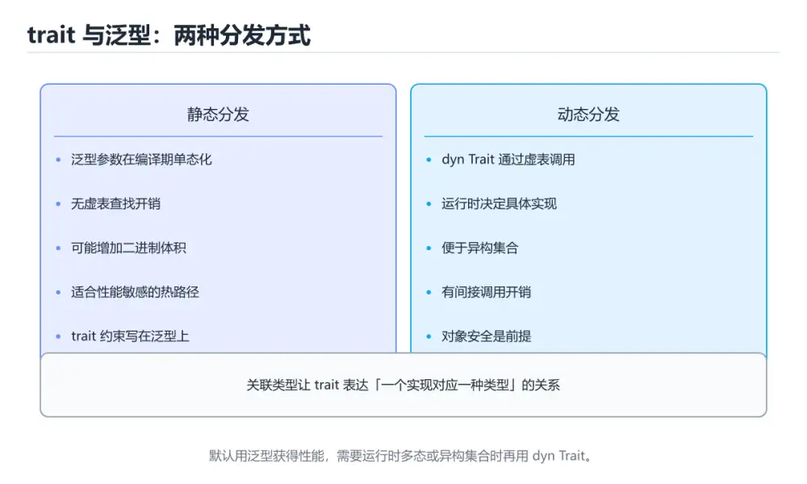
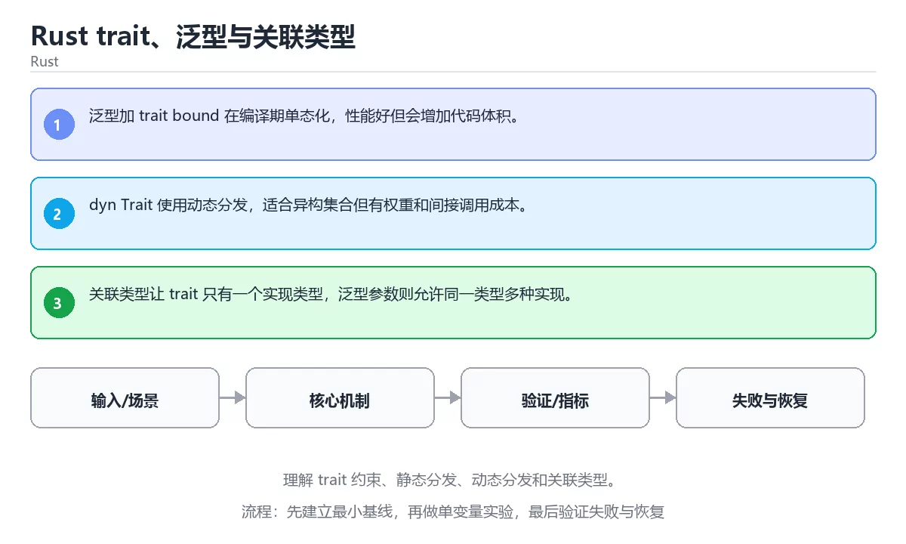

# Rust trait、泛型与关联类型

> 内容更新时间：2026-10-06 · 学习阶段：高级 · 预计用时：40 分钟





## 本节知识框架

**课程定位**：所属分类 `rust`（Rust），课程主题 `Rust trait、泛型与关联类型`，学习阶段 高级，建议用时 45 分钟。

本课主线：理解 trait 约束、静态分发、动态分发和关联类型。

**学完本课应当能够**
- 说清 `trait` 与 `泛型` 的含义与区别，并各举一个正例和一个反例。
- 用本课示例验证 `dyn` 的行为，记录输入、输出与失败条件。
- 遇到「热点路径使用动态分发」这类问题时，能说出触发条件与修复顺序。

### 从概念到验证的学习链条

1. `trait`：先掌握 Rust 的行为抽象：定义一组方法签名，类型实现后即可被泛型约束或作为 dyn 动态调用，再用它解释 `泛型` 为什么会出现。
2. `泛型`：先掌握 把类型作为参数复用同一套逻辑，同时让编译器保留类型检查，再用它解释 `dyn` 为什么会出现。
3. `dyn`：先掌握 把「2. dyn Trait 使用动态分发，适合异构集合但有权重和间接调用成本，再用它解释 `关联类型` 为什么会出现。
4. `关联类型`：先掌握 关联类型让 trait 只有一个实现类型，泛型参数则允许同一类型多种实现，再用它解释 `Rust` 为什么会出现。
5. `Rust`：先掌握 Rust 是系统级语言，用编译期检查替代垃圾回收，做到内存安全与零成本抽象，再用它解释 本课示例的观察结果 为什么会出现。

**先修与衔接**：本课是「Rust」分类的第 16 课。先修内容：《实战：Rust 并发下载器》。《实战：Rust 并发下载器》里的 `Tokio`、`并发` 是本课的前提。相关或后续课程：《Rust 智能指针与内部可变性》、《Swift 集合与泛型》。

### 完成判据

- **定义关**：不看正文也能说明 `trait` 是 Rust 的行为抽象：定义一组方法签名，类型实现后即可被泛型约束或作为 dyn 动态调用，并指出一个反例。
- **机制关**：能按“输入 → 转换 → 输出 → 验证”复述 `Rust trait、泛型与关联类型`，而不是只背结论。
- **示例关**：能运行或推演 `Rust trait、泛型与关联类型` 的 `text` 示例，并说明一个真实出现的标识符或字面量。
- **证据关**：能指出 `Rust trait、泛型与关联类型` 示例里的 调用了 `double()`，并说明它支持或反驳了本课的哪一条结论。
- **排错关**：能复现 热点路径使用动态分发，记录现象并按 性能敏感路径改用静态分发 修复。
- **迁移关**：能把 `trait`、`泛型`、`dyn`、`关联类型` 放进一个与 `Rust trait、泛型与关联类型` 不同的项目场景，并保持输入与验证条件可追踪。
- **复盘关**：学完 `Rust trait、泛型与关联类型` 后，用一句话写下仍然不确定的结论，并列出下一次验证需要的输入、环境和成功判据。

### 复习清单

- [ ] 能不看正文复述本课核心术语，并指出一个边界或反例。
- [ ] 能运行或推演本课示例，记录输入、输出与失败现象。
- [ ] 能完成一次自测，并把错题对照错误表定位原因。

## 核心概念定义

| 术语 | 操作性定义 | 常见边界与风险 |
| --- | --- | --- |
| trait | Rust 的行为抽象：定义一组方法签名，类型实现后即可被泛型约束或作为 dyn 动态调用。 | 易错：编译错误信息晦涩难懂；正确做法是用 trait 约束精确描述所需能力。 |
| 泛型 | 把类型作为参数复用同一套逻辑，同时让编译器保留类型检查。 | 易错：类型推断失败；正确做法是按是否需要多重实现选择关联类型或泛型参数。 |
| dyn | 把「2. dyn Trait 使用动态分发，适合异构集合但有权重和间接调用成本。 | 只在「把「2. dyn Trait 使用动态分发，适合异构集合但有权重和间接调用成本」这一前提下成立，换输入或换环境要重新验证。 |
| 关联类型 | 关联类型让 trait 只有一个实现类型，泛型参数则允许同一类型多种实现。 | 易错：类型推断失败；正确做法是按是否需要多重实现选择关联类型或泛型参数。 |
| Rust | Rust 是系统级语言，用编译期检查替代垃圾回收，做到内存安全与零成本抽象 | 静态检查只在编译期成立，运行期输入仍需校验。 |
| 输入与前提是否满足 | 日志、输入样例、测试或指标 | 只在「日志、输入样例、测试或指标」这一前提下成立，换输入或换环境要重新验证。 |
| 核心步骤是否产生了预期中间结果 | 日志、输入样例、测试或指标 | 只在「日志、输入样例、测试或指标」这一前提下成立，换输入或换环境要重新验证。 |
| 失败路径是否可观测、可恢复 | 日志、输入样例、测试或指标 | 只在「日志、输入样例、测试或指标」这一前提下成立，换输入或换环境要重新验证。 |
| 资源、权限与成本是否在预算内 | 日志、输入样例、测试或指标 | 只在「日志、输入样例、测试或指标」这一前提下成立，换输入或换环境要重新验证。 |

## 原理与运行机制

### 机制总览

**教材衔接：核心知识**

### 1. 泛型加 trait bound 在编译期单态化，性能好但会增加代码体积。

- 关键做法：先用 Doubler 建立 trait 的基线，再逐步加入边界与失败条件。
- 验证标准：Doubler 的输出能被他人复现，边界输入有对应用例。

### 2. dyn Trait 使用动态分发，适合异构集合但有权重和间接调用成本。

把这条结论放回「Rust trait、泛型与关联类型」的完整流程里展开：

- 正文依据：能用自己的话解释：泛型加 trait bound 在编译期单态化，性能好但会增加代码体积。
- 落地检查：把「2. dyn Trait 使用动态分发，适合异构集合但有权重和间接调用成本。」改写成一条可执行的核对项，逐条验证输入、超时与失败路径。

### 3. 关联类型让 trait 只有一个实现类型，泛型参数则允许同一类型多种实现。

把这条结论放回「Rust trait、泛型与关联类型」的完整流程里展开：

- 正文依据：能用自己的话解释：dyn Trait 使用动态分发，适合异构集合但有权重和间接调用成本。
- 落地检查：把「3. 关联类型让 trait 只有一个实现类型，泛型参数则允许同一类型多种实现。」改写成一条可执行的核对项，逐条验证输入、超时与失败路径。

**教材衔接：关键流程**

**教材衔接：实践路径**

**教材衔接：版本与时效**

- 版本提示：trait 的行为在最近几个大版本里有过调整，升级「Rust trait、泛型与关联类型」前先用 Doubler 复现当前输出，再对照官方发布说明逐条核对。
- Doubler 涉及的 trait 解析差异应先用最小仓库验证，再升级主工程。
- 升级前确认 trait 的兼容范围，把不可回退的改动单独拆成一次提交。
- 官方发布说明：https://blog.rust-lang.org/

### 升级检查清单

- 先固定当前版本，跑通全部示例与测验，再升级工具链。
- 一次只改一个版本条件，把 trait 相关的差异单独记成一条结论。
- 升级后重点回归 trait 的默认值、警告信息与错误格式。
- 升级后把 Doubler 的实测版本写进「内容元数据」，再更新复核日期。

**教材衔接：验证步骤**

### 机制拆解：每一步的输入、动作与输出

#### 1. `trait`
- 输入：`trait`；本步把 Rust 的行为抽象：定义一组方法签名，类型实现后即可被泛型约束或作为 dyn 动态调用 当作判断规则。
- 动作：围绕 `trait` 保留中间状态，并记录它与 `泛型` 的对应关系。
- 输出：`泛型`，它可以被下一段代码、测试或记录继续使用。
- `trait` 的失败条件：当约束写得过宽时，会出现编译错误信息晦涩难懂。

#### 2. `泛型`
- 输入：`trait`；本步把 把类型作为参数复用同一套逻辑，同时让编译器保留类型检查 当作判断规则。
- 动作：围绕 `泛型` 保留中间状态，并记录它与 `dyn` 的对应关系。
- 输出：`dyn`，它可以被下一段代码、测试或记录继续使用。
- `泛型` 的失败条件：当关联类型与泛型参数混用不当时，会出现类型推断失败。

#### 3. `dyn`
- 输入：`泛型`；本步把 把「2. dyn Trait 使用动态分发，适合异构集合但有权重和间接调用成本 当作判断规则。
- 动作：围绕 `dyn` 保留中间状态，并记录它与 `关联类型` 的对应关系。
- 输出：`关联类型`，它可以被下一段代码、测试或记录继续使用。
- `dyn` 的失败条件：只在「把「2. dyn Trait 使用动态分发，适合异构集合但有权重和间接调用成本」这一前提下成立，换输入或换环境要重新验证。

#### 4. `关联类型`
- 输入：`dyn`；本步把 关联类型让 trait 只有一个实现类型，泛型参数则允许同一类型多种实现 当作判断规则。
- 动作：围绕 `关联类型` 保留中间状态，并记录它与 `Rust` 的对应关系。
- 输出：`Rust`，它可以被下一段代码、测试或记录继续使用。
- `关联类型` 的失败条件：当关联类型与泛型参数混用不当时，会出现类型推断失败。

#### 5. `Rust`
- 输入：`关联类型`；本步把 Rust 是系统级语言，用编译期检查替代垃圾回收，做到内存安全与零成本抽象 当作判断规则。
- 动作：围绕 `Rust` 保留中间状态，并记录它与 `double` 的对应关系。
- 输出：`double`，它可以被下一段代码、测试或记录继续使用。
- `Rust` 的失败条件：静态检查只在编译期成立，运行期输入仍需校验。

### 示例中的可观察事实

1. 调用了 `double()`；它对应的课程主题是 `Rust trait、泛型与关联类型`。
2. 调用了 `main()`；它对应的课程主题是 `Rust trait、泛型与关联类型`。

### 复现实验记录

- 环境：`Rust trait、泛型与关联类型` 使用 `text` 示例，固定 `trait`、`泛型`、`dyn`、`关联类型` 作为第一组条件。
- 首轮输入：先确认 调用了 `double()`，预测 `trait` 会怎样变化。
- 基线观察：记录命令、输入、输出和错误原文，不用截图代替可复制的文本。
- 单变量修改：只改变 `trait`，观察 `Rust` 是否仍满足定义。
- 失败注入：复现 热点路径使用动态分发，确认现象是 虚调用带来额外开销。
- 记录结论：把“修改前、修改后、预期变化、实际变化”写成四列表，这样复盘 `Rust trait、泛型与关联类型` 时才能区分概念错误与实现错误。

## 典型应用场景

**课程内置实验入口**：`sandbox:rust`，用于动手验证《Rust trait、泛型与关联类型》的机制；实验结论不替代概念定义与复杂度分析。

**教材衔接：深度拓展与实战**

这一节把「Rust trait、泛型与关联类型」正文里的定义、代码和失败模式串成一条可操作的复习路线。

### 机制拆解

- **1. 泛型加 trait bound 在编译期单态化，性能好但会增加代码体积。**：在「Rust trait、泛型与关联类型」里，「1. 泛型加 trait bound 在编译期单态化，性能好但会增加代码体积。」这一步要先写清输入与预期，再记录实际结果和差异；结果不符时回到对应小节核对前提。
- **2. dyn Trait 使用动态分发，适合异构集合但有权重和间接调用成本。**：在「Rust trait、泛型与关联类型」里，「2. dyn Trait 使用动态分发，适合异构集合但有权重和间接调用成本。」这一步要先写清输入与预期，再记录实际结果和差异；结果不符时回到对应小节核对前提。
- **3. 关联类型让 trait 只有一个实现类型，泛型参数则允许同一类型多种实现。**：在「Rust trait、泛型与关联类型」里，「3. 关联类型让 trait 只有一个实现类型，泛型参数则允许同一类型多种实现。」这一步要先写清输入与预期，再记录实际结果和差异；结果不符时回到对应小节核对前提。
- **考点 1：核心知识 的代码阅读题**：先独立作答，再回到本课正文核对 Doubler 的执行路径；答错时记录是哪一个前提被忽略。
- **考点 2：关于「dyn Trait 使用动态分发，适合异构集合但有权重和间接调用成本。」，下列说法正确的是？**：先独立作答，再回到本课对应小节核对判断依据；答错时记录是哪一个前提被忽略。


### 工程检查表

- [ ] 能否用自己的话说明Rust trait、泛型与关联类型解决什么问题，以及它不负责什么？
- [ ] 能否说明 trait 的正常输出，以及失败时留下的错误信息？
- [ ] 能否解释本课关键词在真实项目中的边界与取舍？
- [ ] 能否说明 泛型 在新场景下需要补充什么前提？

### 迁移练习

1. 保持正文示例不变，写出它的输入、处理步骤和预期输出。
2. 固定其他输入，只调整 Doubler 的一个参数，先写预测再验证。
3. 结合trait、泛型、dyn、关联类型，写出一个真实项目中的使用场景。
4. 写下一个反例，说明它在什么条件下会使朴素做法失效。

<!-- p0-depth-v2:start -->

- **热点路径使用动态分发**：典型现象是虚调用带来额外开销；正确做法是性能敏感路径改用静态分发。
- **约束写得过宽**：典型现象是编译错误信息晦涩难懂；正确做法是用 trait 约束精确描述所需能力。
- **关联类型与泛型参数混用不当**：典型现象是类型推断失败；正确做法是按是否需要多重实现选择关联类型或泛型参数。

### 最小验证场景

- 准备：保留 `text` 示例的原始输入，先记录 `Rust trait、泛型与关联类型` 的基线输出和完整运行命令。
- 观察：先核对 调用了 `double()`，再改变一个与 `trait` 相关的条件。
- 判定：新结果与 `Rust trait、泛型与关联类型` 的基线不同不等于错误；只有当差异破坏了 `trait` 的定义或错误表中的约束，才判定为失败。

### 选择与边界

- 使用 `trait` 时，先满足它的定义：Rust 的行为抽象：定义一组方法签名，类型实现后即可被泛型约束或作为 dyn 动态调用；易错：编译错误信息晦涩难懂；正确做法是用 trait 约束精确描述所需能力。
- 使用 `泛型` 时，先满足它的定义：把类型作为参数复用同一套逻辑，同时让编译器保留类型检查；易错：类型推断失败；正确做法是按是否需要多重实现选择关联类型或泛型参数。
- 使用 `dyn` 时，先满足它的定义：把「2. dyn Trait 使用动态分发，适合异构集合但有权重和间接调用成本；只在「把「2. dyn Trait 使用动态分发，适合异构集合但有权重和间接调用成本」这一前提下成立，换输入或换环境要重新验证。
- 使用 `关联类型` 时，先满足它的定义：关联类型让 trait 只有一个实现类型，泛型参数则允许同一类型多种实现；易错：类型推断失败；正确做法是按是否需要多重实现选择关联类型或泛型参数。
- 使用 `Rust` 时，先满足它的定义：Rust 是系统级语言，用编译期检查替代垃圾回收，做到内存安全与零成本抽象；静态检查只在编译期成立，运行期输入仍需校验。

## 代码/协议/SQL 示例

### 最小可验证示例

**教材衔接：最小可运行示例**

先用下面的示例确认 trait 的基线，再只改一个与 泛型 相关的值：

```rust
trait Doubler {
    fn double(&self) -> Self;
}

impl Doubler for i32 {
    fn double(&self) -> i32 {
        self * 2
    }
}

fn main() {
    println!("{}", 21.double());
}
```

**教材衔接：预期输出**

```text
42
```

### 示例精读：先找证据，再改一个条件

1. 调用了 `double()`；它出现在 `Rust trait、泛型与关联类型` 的示例中，阅读时先确认它前后各发生了什么。
2. 调用了 `main()`；它出现在 `Rust trait、泛型与关联类型` 的示例中，阅读时先确认它前后各发生了什么。
- 在 `Rust trait、泛型与关联类型` 中与 `trait` 对照：示例必须能支持 Rust 的行为抽象：定义一组方法签名，类型实现后即可被泛型约束或作为 dyn 动态调用，否则说明这一段还缺少实现或验证步骤。
- 在 `Rust trait、泛型与关联类型` 中与 `泛型` 对照：示例必须能支持 把类型作为参数复用同一套逻辑，同时让编译器保留类型检查，否则说明这一段还缺少实现或验证步骤。
- 在 `Rust trait、泛型与关联类型` 中与 `dyn` 对照：示例必须能支持 把「2. dyn Trait 使用动态分发，适合异构集合但有权重和间接调用成本，否则说明这一段还缺少实现或验证步骤。
- 在 `Rust trait、泛型与关联类型` 中与 `关联类型` 对照：示例必须能支持 关联类型让 trait 只有一个实现类型，泛型参数则允许同一类型多种实现，否则说明这一段还缺少实现或验证步骤。

## 时间/空间复杂度或性能分析

**性能关注点（Rust trait、泛型与关联类型）**：零成本抽象不等于零开销：记录运行时间、内存峰值与编译时间。

**本课特有开销（Rust trait、泛型与关联类型 · trait）**：并发度提高后要观察是否出现拐点：延迟上升而吞吐不增，说明瓶颈已转移。

**测量方法**：以 `Rust trait、泛型与关联类型` 的 `trait` 场景为对象，固定输入跑一遍记录基线，再把规模或并发度提高一个数量级复测；两次结果的差值与波动范围才是结论依据。

### 需要控制的变量与记录项

- `Rust trait、泛型与关联类型` 的 `trait`：固定它的版本、输入范围和资源上限，分别记录速度、内存与失败率的变化。
- `Rust trait、泛型与关联类型` 的 `泛型`：固定它的版本、输入范围和资源上限，分别记录速度、内存与失败率的变化。
- `Rust trait、泛型与关联类型` 的 `dyn`：固定它的版本、输入范围和资源上限，分别记录速度、内存与失败率的变化。
- `Rust trait、泛型与关联类型` 的 `关联类型`：固定它的版本、输入范围和资源上限，分别记录速度、内存与失败率的变化。
- `Rust trait、泛型与关联类型` 中 `trait` 的边界：易错：编译错误信息晦涩难懂；正确做法是用 trait 约束精确描述所需能力。达到边界时不要外推，必须重新测量。
- `Rust trait、泛型与关联类型` 中 `泛型` 的边界：易错：类型推断失败；正确做法是按是否需要多重实现选择关联类型或泛型参数。达到边界时不要外推，必须重新测量。
- `Rust trait、泛型与关联类型` 中 `dyn` 的边界：只在「把「2. dyn Trait 使用动态分发，适合异构集合但有权重和间接调用成本」这一前提下成立，换输入或换环境要重新验证。达到边界时不要外推，必须重新测量。
- `Rust trait、泛型与关联类型` 中 `关联类型` 的边界：易错：类型推断失败；正确做法是按是否需要多重实现选择关联类型或泛型参数。达到边界时不要外推，必须重新测量。
- `Rust trait、泛型与关联类型` 中 `Rust` 的边界：静态检查只在编译期成立，运行期输入仍需校验。达到边界时不要外推，必须重新测量。
- `Rust trait、泛型与关联类型` 的代码证据：先验证 调用了 `double()`，再记录该路径的输入规模与耗时；只看代码行数不能推出复杂度。

## 常见误区与易错点

| 容易写错的做法 | 实际现象 | 原因与正确做法 |
| --- | --- | --- |
| 热点路径使用动态分发 | 虚调用带来额外开销。 | 性能敏感路径改用静态分发。 |
| 约束写得过宽 | 编译错误信息晦涩难懂。 | 用 trait 约束精确描述所需能力。 |
| 关联类型与泛型参数混用不当 | 类型推断失败。 | 按是否需要多重实现选择关联类型或泛型参数。 |

### 现场 1：热点路径使用动态分发

**症状**：虚调用带来额外开销。

**根因与修复**：性能敏感路径改用静态分发。

**自检**：在本课示例里复现「热点路径使用动态分发」，改成性能敏感路径改用静态分发后重跑；如果症状消失且失败路径按预期变化，说明定位正确。

### 现场 2：约束写得过宽

**症状**：编译错误信息晦涩难懂。

**根因与修复**：用 trait 约束精确描述所需能力。

**自检**：在本课示例里复现「约束写得过宽」，改成用 trait 约束精确描述所需能力后重跑；如果症状消失且失败路径按预期变化，说明定位正确。

### 现场 3：关联类型与泛型参数混用不当

**症状**：类型推断失败。

**根因与修复**：按是否需要多重实现选择关联类型或泛型参数。

**自检**：在本课示例里复现「关联类型与泛型参数混用不当」，改成按是否需要多重实现选择关联类型或泛型参数后重跑；如果症状消失且失败路径按预期变化，说明定位正确。

## 与其他知识点的关系

**教材衔接：复习与迁移**

### 概念复述

- 用一句话说明「Rust trait、泛型与关联类型」解决什么问题：理解 trait 约束、静态分发、动态分发和关联类型。
- 写出trait、泛型、dyn之间的关系，并各举一个例子。
- 说出本课最容易混淆的两个概念，以及区分它们的判据。

### 正文逐节复核

- **实践任务**：本节围绕Rust trait、泛型与关联类型安排 3 个可交付任务，每个任务都要求留下可以复查的记录。
- **零基础精讲：把Rust trait、泛型与关联类型真正讲透**：本课的摘要可以当作一张地图：理解 trait 约束、静态分发、动态分发和关联类型。


### 迁移练习

- **先修**：`实战：Rust 并发下载器`。本课默认这些内容已经掌握。
- **相关或后续**：`Rust 智能指针与内部可变性`、`Swift 集合与泛型`。本课术语会在这些课程里继续使用。
- **术语归属**：`trait`、`泛型`、`dyn` 的定义以本课「核心概念定义」为准，换到其他课程时先确认定义是否被改写。
- 同一分类的《Rust 类型系统：Option、Result 与 trait》也涉及 `trait`；两课衔接时先确认这个术语的定义是否一致。

### 先修与后续术语接口

- `Swift 集合与泛型`：共享术语 `泛型`、`关联类型`，共同关键词 `泛型`、`关联类型`。
- `实战：Rust 并发下载器`：共享术语 `Rust`。
- `Rust 智能指针与内部可变性`：共享术语 `Rust`。

### 容易混淆的相邻概念

- `trait` 与 `泛型`：前者强调 Rust 的行为抽象：定义一组方法签名，类型实现后即可被泛型约束或作为 dyn 动态调用；后者强调 把类型作为参数复用同一套逻辑，同时让编译器保留类型检查。判断时分别检查两条定义的适用范围，不要只看名称相似就互换。
- `泛型` 与 `dyn`：前者强调 把类型作为参数复用同一套逻辑，同时让编译器保留类型检查；后者强调 把「2. dyn Trait 使用动态分发，适合异构集合但有权重和间接调用成本。判断时分别检查两条定义的适用范围，不要只看名称相似就互换。
- `dyn` 与 `关联类型`：前者强调 把「2. dyn Trait 使用动态分发，适合异构集合但有权重和间接调用成本；后者强调 关联类型让 trait 只有一个实现类型，泛型参数则允许同一类型多种实现。判断时分别检查两条定义的适用范围，不要只看名称相似就互换。
- `关联类型` 与 `Rust`：前者强调 关联类型让 trait 只有一个实现类型，泛型参数则允许同一类型多种实现；后者强调 Rust 是系统级语言，用编译期检查替代垃圾回收，做到内存安全与零成本抽象。判断时分别检查两条定义的适用范围，不要只看名称相似就互换。

## 自测题与参考答案

> 先独立作答，再对照参考答案；答案都能在本课正文、术语表或错误表里找到依据。

### 自测 1（概念复述）

不看正文，写出 `trait` 的操作性定义，并说明它与 `泛型` 的区别。

**参考答案**：Rust 的行为抽象：定义一组方法签名，类型实现后即可被泛型约束或作为 dyn 动态调用。

`泛型` 的定位是：把类型作为参数复用同一套逻辑，同时让编译器保留类型检查；两者的差别要从适用对象与失败模式上说明。

### 自测 2（排错）

本课错误表记录了「热点路径使用动态分发」这类做法。请写出它会出现的现象、根因，以及修复顺序。

**参考答案**：现象是虚调用带来额外开销；正确做法是性能敏感路径改用静态分发。修复时先复现现象并保留证据，再改动一处假设重跑，确认现象消失。

### 自测 3（动手验证）

运行本课的 `text` 示例，改动其中一个输入后重新运行，记录输出与错误信息。

**参考答案**：正常输入下 `text` 示例应当复现正文给出的结果；改动输入后，如果结果改变或报错，先核对它是否满足 `Rust trait、泛型与关联类型` 中`trait` 的适用范围，再检查错误表里是否有同类现象。

### 自测 4（代码阅读）

阅读本课开头的 `text` 示例，说明它体现了`trait` 的哪一条性质，并指出改动哪个输入会让这条性质不再成立。

**参考答案**：`trait` 的定义是 Rust 的行为抽象：定义一组方法签名，类型实现后即可被泛型约束或作为 dyn 动态调用，示例正是在实现这条定义。改动与 `trait` 有关的一个输入后，如果结果不再符合 `Rust trait、泛型与关联类型` 的正文描述，就说明该性质只在当前前提成立。

### 自测 5（迁移）

把 `Rust trait、泛型与关联类型` 的方法迁移到自己的项目：围绕 `trait` 写出一个与错误表同类的风险点，并说明触发条件和检验方式。

**参考答案**：例如「关联类型与泛型参数混用不当」，它会导致类型推断失败；检验方式是按按是否需要多重实现选择关联类型或泛型参数改一处再复现，确认现象消失且没有引入新的失败分支。

### 自测 6（对比）

用一个表格对比 `trait` 与 `泛型`：各写一行适用场景、一行失败表现。

**参考答案**：`trait` 的定义是Rust 的行为抽象：定义一组方法签名，类型实现后即可被泛型约束或作为 dyn 动态调用；`泛型` 的定义是把类型作为参数复用同一套逻辑，同时让编译器保留类型检查。两者的失败表现分别对应本课错误表里与本术语相关的行。

### 自测 7（排错顺序）

面对「热点路径使用动态分发」引发的问题，请把“复现 虚调用带来额外开销 → 保留证据 → 性能敏感路径改用静态分发 → 回归验证”四步写成可执行的检查清单。

**参考答案**：第一步按虚调用带来额外开销复现；第二步记录输入、版本与完整报错；第三步按性能敏感路径改用静态分发只改一处；第四步重跑并确认失败路径也按预期变化。

### 自测 8（边界判断）

针对 `Rust`，分别写出“可以使用”的条件和“结论不再成立”的条件。

**参考答案**：静态检查只在编译期成立，运行期输入仍需校验。 同时要把 `Rust` 的定义 Rust 是系统级语言，用编译期检查替代垃圾回收，做到内存安全与零成本抽象 与实际输入逐项对照。

### 自测 9（机制重建）

不看正文，按输入、转换、输出、验证四段重建 `trait` → `泛型` → `dyn` → `关联类型` 的作用链。

**参考答案**：起点是 `trait` 的定义 Rust 的行为抽象：定义一组方法签名，类型实现后即可被泛型约束或作为 dyn 动态调用；中间每一步都保留可观察状态；终点由 `Rust` 检查，失败时回到错误表定位第一个偏离定义的步骤。

### 自测 10（综合排错）

在 `Rust trait、泛型与关联类型` 中，现象是 类型推断失败。请围绕 关联类型与泛型参数混用不当 写出最小复现、关键证据、修复动作和回归验证，并说明为什么不能只凭一次运行下结论。

**参考答案**：先复现 关联类型与泛型参数混用不当，记录输入与完整错误；再按 按是否需要多重实现选择关联类型或泛型参数 只改一处。回归时同时跑正常路径和边界路径，只有两次结果都可解释，才把修复视为完成。

### 自测 11（一分钟复述）

用每分钟约 200 字的速度复述 `Rust trait、泛型与关联类型`：先给主问题，再按顺序说出 `trait`、`泛型`、`dyn`、`关联类型`，最后给一个失败案例。

**自评标准**：主问题必须对应 理解 trait 约束、静态分发、动态分发和关联类型；每个术语都要能接上一句定义或边界；失败案例必须写成可观察现象，不能用“可能有风险”代替证据。

## 术语速查

| 术语 | 一句话说明 |
| --- | --- |
| `trait` | Rust 的行为抽象：定义一组方法签名，类型实现后即可被泛型约束或作为 dyn 动态调用。 |
| `泛型` | 把类型作为参数复用同一套逻辑，同时让编译器保留类型检查。 |
| `dyn` | 把「2. dyn Trait 使用动态分发，适合异构集合但有权重和间接调用成本。 |
| `关联类型` | 关联类型让 trait 只有一个实现类型，泛型参数则允许同一类型多种实现。 |
| `Rust` | Rust 是系统级语言，用编译期检查替代垃圾回收，做到内存安全与零成本抽象。 |

**术语关系**：`trait`（Rust 的行为抽象：定义一组方法签名） → `泛型`（把类型作为参数复用同一套逻辑） → `dyn`（把「2. dyn Trait 使用动态分发） → `关联类型`（关联类型让 trait 只有一个实现类型）。

## 考点精讲

`Rust trait、泛型与关联类型` 的题库有 6 道题，下面逐题给出题干、正确项与判断依据：先自己作答，再核对正确项，最后回到正文对应小节复核。

### 考点 1：第 1 题

- **题目**：下面这段 `rust` 代码来自 `Rust trait、泛型与关联类型`。课程主线是理解 trait 约束、静态分发、动态分发和关联类型。代码与 `trait` 有关。哪一项是代码里真实出现的内容？
- **正确项**：调用了 `double()`
- **判断依据**：这道题落在术语 `trait` 上：Rust 的行为抽象：定义一组方法签名，类型实现后即可被泛型约束或作为 dyn 动态调用。复习时把 `trait` 的定义、适用边界和一个反例一起说清楚，再回到「核心概念定义」核对原文。

### 考点 2：第 2 题

- **题目**：在 `Rust trait、泛型与关联类型` 里，与 `trait` 有关的说法中，哪一项最符合理解 trait 约束、静态分发、动态分发和关联类型。？
- **正确项**：dyn Trait 使用动态分发，适合异构集合但有权重和间接调用成本。
- **判断依据**：这道题落在术语 `trait` 上：Rust 的行为抽象：定义一组方法签名，类型实现后即可被泛型约束或作为 dyn 动态调用。复习时把 `trait` 的定义、适用边界和一个反例一起说清楚，再回到「核心概念定义」核对原文。

### 考点 3：第 3 题

- **题目**：在 `Rust trait、泛型与关联类型` 里，与 `trait` 有关的说法中，哪一项最符合理解 trait 约束、静态分发、动态分发和关联类型。？（Rust trait、泛型与关联类型·Rust 第 3 题）
- **正确项**：关联类型让 trait 只有一个实现类型，泛型参数则允许同一类型多种实现。
- **判断依据**：这道题落在术语 `trait` 上：Rust 的行为抽象：定义一组方法签名，类型实现后即可被泛型约束或作为 dyn 动态调用。复习时把 `trait` 的定义、适用边界和一个反例一起说清楚，再回到「核心概念定义」核对原文。

### 考点 4：第 4 题

- **题目**：`Rust trait、泛型与关联类型` 的主线是：理解 trait 约束、静态分发、动态分发和关联类型。下面哪一项与这条主线一致？
- **正确项**：理解 trait 约束、静态分发、动态分发和关联类型。
- **判断依据**：这道题落在术语 `trait` 上：Rust 的行为抽象：定义一组方法签名，类型实现后即可被泛型约束或作为 dyn 动态调用。复习时把 `trait` 的定义、适用边界和一个反例一起说清楚，再回到「核心概念定义」核对原文。

### 考点 5：第 5 题

- **题目**：课程 `理解 trait 约束、静态分发、动态分发和关联类型。`。在 `Rust trait、泛型与关联类型` 里，`trait`、`泛型` 与下面哪些选项属于同一层概念？（多选）
- **正确项**：trait；泛型
- **判断依据**：这道题落在术语 `trait` 上：Rust 的行为抽象：定义一组方法签名，类型实现后即可被泛型约束或作为 dyn 动态调用。复习时把 `trait` 的定义、适用边界和一个反例一起说清楚，再回到「核心概念定义」核对原文。

### 考点 6：第 6 题

- **题目**：下面几项都与 `trait` 有关，请按 `Rust trait、泛型与关联类型` 的正文顺序排列；该课主线是理解 trait 约束、静态分发、动态分发和关联类型。
- **正确项**：核心知识 → 关键流程 → 实践路径 → 常见误区
- **判断依据**：这道题落在术语 `trait` 上：Rust 的行为抽象：定义一组方法签名，类型实现后即可被泛型约束或作为 dyn 动态调用。复习时把 `trait` 的定义、适用边界和一个反例一起说清楚，再回到「核心概念定义」核对原文。

### 考点 7：`trait`

- **要点**：Rust 的行为抽象：定义一组方法签名，类型实现后即可被泛型约束或作为 dyn 动态调用。
- **trait 的边界**：易错：编译错误信息晦涩难懂；正确做法是用 trait 约束精确描述所需能力。

### 考点 8：`泛型`

- **要点**：把类型作为参数复用同一套逻辑，同时让编译器保留类型检查。
- **泛型 的边界**：易错：类型推断失败；正确做法是按是否需要多重实现选择关联类型或泛型参数。

### 考点 9：`dyn`

- **要点**：把「2. dyn Trait 使用动态分发，适合异构集合但有权重和间接调用成本。
- **dyn 的边界**：只在「把「2. dyn Trait 使用动态分发，适合异构集合但有权重和间接调用成本」这一前提下成立，换输入或换环境要重新验证。

### 考点 10：`关联类型`

- **要点**：关联类型让 trait 只有一个实现类型，泛型参数则允许同一类型多种实现。
- **关联类型 的边界**：易错：类型推断失败；正确做法是按是否需要多重实现选择关联类型或泛型参数。

### 考点 11：`Rust`

- **要点**：Rust 是系统级语言，用编译期检查替代垃圾回收，做到内存安全与零成本抽象
- **Rust 的边界**：静态检查只在编译期成立，运行期输入仍需校验。

### 考点 12：排错——热点路径使用动态分发

- **现象**：虚调用带来额外开销。
- **处理**：性能敏感路径改用静态分发。

### 考点 13：排错——约束写得过宽

- **现象**：编译错误信息晦涩难懂。
- **处理**：用 trait 约束精确描述所需能力。

### 考点 14：综合辨析——`trait` 与 `Rust`

- **辨析点**：`trait` 的定义是 Rust 的行为抽象：定义一组方法签名，类型实现后即可被泛型约束或作为 dyn 动态调用；`Rust` 的定义是 Rust 是系统级语言，用编译期检查替代垃圾回收，做到内存安全与零成本抽象。
- **答题要求**：面对 `Rust trait、泛型与关联类型` 的题目，先判断描述的是 `trait` 还是 `Rust`，再归到对应定义，最后写出一个会让该定义失效的边界输入。

### 考点 15：排错评分点

- **现象分**：能写出 虚调用带来额外开销，而不是只写“程序有错”。
- **证据分**：保留触发 热点路径使用动态分发 的输入、版本和错误原文。
- **修复分**：按 性能敏感路径改用静态分发 只改一处，并同时回归正常路径与边界路径。

## 内容元数据

- 内容版本：v2.0
- 最后更新：2026-10-06
- 学习阶段：高级
- 适用环境：Rust 1.85+ / Cargo；本课聚焦 trait。
- 内容来源：内置结构化课程与工程实践整理
- 相关主题：trait、泛型、dyn、关联类型
- 质量版本：P0 测验标准 + P1 覆盖扩展 + P2 体验补全

## 参考资料与复核

- 最后复核：2026-10-04
- 下次复核：2027-06-10
- 复核范围：版本兼容、API 行为、安全建议与工程实践
- 来源性质：官方文档、标准或权威教材；本课核对关键词：trait、泛型、dyn、关联类型。

| 参考资料 | 本课用途 |
| --- | --- |
| [The Rust Book](https://doc.rust-lang.org/book/) | 所有权、类型与工程实践 |
| [Clippy 文档](https://doc.rust-lang.org/clippy/) | Lint 与惯用写法 |
| [Rust 标准库](https://doc.rust-lang.org/std/) | 标准库 API 与容器 |

| [本课术语索引：Rust trait、泛型与关联类型](#核心概念定义) | 按本课输入、术语边界和错误表现逐项核对 |
> 「Rust trait、泛型与关联类型」的链接用于离线阅读后的延伸核对；App 不会自动联网。