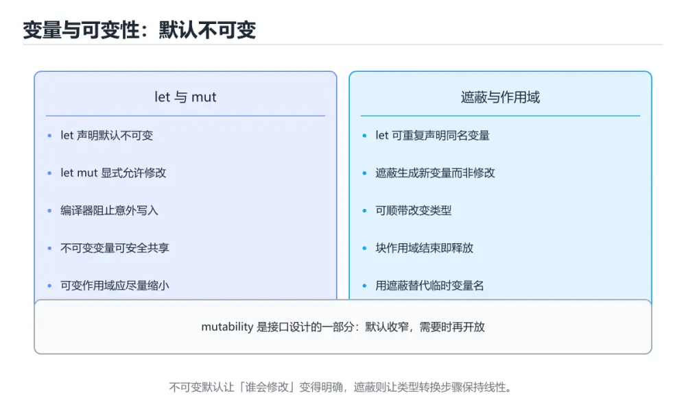
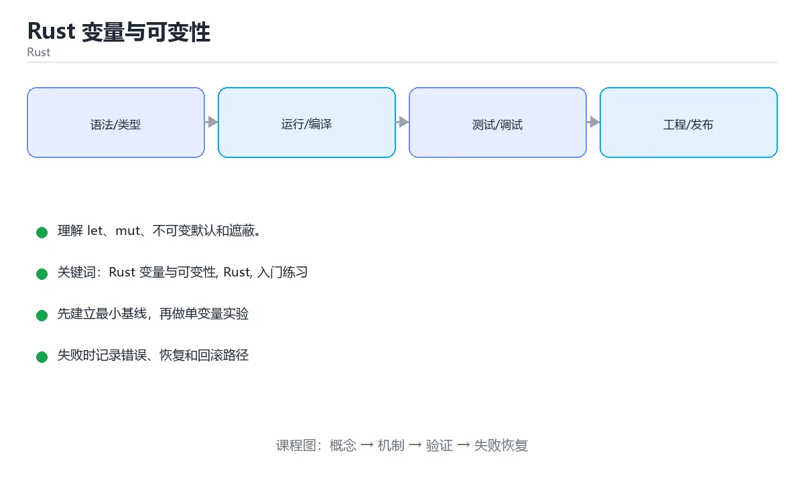

# Rust 变量与可变性

> 内容更新时间：2026-10-06 · 学习阶段：入门 · 预计用时：50 分钟





## 本节知识框架

**课程定位**：所属分类为「Rust」，课程主题为「Rust 变量与可变性」，学习阶段为「入门」，建议用时 50 分钟。

**本课要解决的主问题**：理解 let、mut、不可变默认和遮蔽。

| 学习层次 | 要回答的问题 | 完成判据 |
| --- | --- | --- |
| 概念层 | 「Rust 变量与可变性」有哪些必须区分的对象与术语？ | 能用自己的话定义核心术语，并各举一个正例和一个反例。 |
| 机制层 | 这些对象按什么顺序发生作用，输入如何变成输出？ | 能画出或写出机制步骤，并说明每一步的失败条件。 |
| 应用层 | 什么场景适合使用「Rust 变量与可变性」，什么场景不适合？ | 能给出一个真实场景、一个最小示例和一个边界案例。 |
| 性能层 | 时间、空间、吞吐或延迟受哪些量影响？ | 能说出复杂度或性能瓶颈的证据来源；没有证据时明确写“材料未提供”。 |
| 复习层 | 怎样确认自己不是只记住了结论？ | 能独立完成本课自测，并把错误定位到概念、机制、示例或边界。 |

### 阅读路线

1. 先读「核心概念定义」，建立「Rust 变量与可变性」等对象的精确定义。
2. 再读「原理与运行机制」，把定义串成可重复的过程。
3. 用「代码/协议/SQL 示例」验证过程，并只改一个条件观察结果变化。
4. 最后检查性能、易错点、知识关系与自测题，形成可复习的证据链。

**前置知识**：《Rust Cargo 第一个程序》

**学习位置**：本课位于《Rust Cargo 第一个程序》之后；如果前一课的自测不能通过，应先回补再继续。

**后续衔接**：下一课《Rust 条件判断》会继续使用本课术语，学完后建议立即完成一次自测。

**教材衔接：学习目标**

- 先认识Rust 变量与可变性需要的工具、输入和输出。
- 按步骤运行最小示例，并记录结果与错误。
- 用一个边界输入验证自己是否真正掌握。

**教材衔接：前置知识**

- 会进行基本的文件或命令行操作。
- 不需要预先掌握「Rust」的高级知识。

**教材衔接：本课小结**

- 入门阶段先保证能运行、能观察、能解释，再追求复杂功能。
- 每次只改一个变量，记录预测与实际结果。
- 遇到错误先看第一条错误信息，再回到最小示例。

## 核心概念定义

> 阅读约定：本课先给「Rust 变量与可变性」相关术语的操作性定义与适用边界；正文里的口语化说法与定义冲突时，以定义和可复现示例为准。

| 术语 | 操作性定义 | 本课中的边界 |
| --- | --- | --- |
| let 默认不可变 | Rust 变量默认不能重新赋值，这是编译期保证的一部分。 | 仅在「Rust 变量与可变性」明确给出的输入、版本与资源条件下成立。 |
| let mut | 加 mut 才能修改，可变性越小越容易推理。 | 仅在「Rust 变量与可变性」明确给出的输入、版本与资源条件下成立。 |
| 类型推断与标注 | 编译器通常能推断类型，必要时用 : 显式标注。 | 仅在「Rust 变量与可变性」明确给出的输入、版本与资源条件下成立。 |
| 遮蔽（shadowing） | 用同名 let 重新绑定，可以改变类型，与 mut 赋值不同。 | 仅在「Rust 变量与可变性」明确给出的输入、版本与资源条件下成立。 |
| const 常量 | 编译期求值，必须写类型，命名习惯是全大写。 | 仅在「Rust 变量与可变性」明确给出的输入、版本与资源条件下成立。 |
| Cargo | Cargo 负责创建项目、管理依赖、编译和测试 | 仅在「Rust 变量与可变性」明确给出的输入、版本与资源条件下成立。 |

### 定义如何使用

在「Rust 变量与可变性」中判断一个说法是否成立，先确认它使用的是哪个对象的定义，再检查输入规模、运行环境与失败路径。定义不是口号，而是后续推导、代码示例和自测题共享的约束。

**教材衔接：零基础通俗讲：Rust 变量与可变性**

### 一句话说清它是什么

Rust 的变量默认不可变，要修改必须写 mut；这种默认值让编译器帮你挡住大量意外改写。

### 用生活比喻理解

默认不可变像合同上的条款：想改必须先在合同上标明「此处可修改」。没标注的地方被改了，审查员（编译器）立刻拦下。

### 完整可运行代码

```rust
fn main() {
    let name: &str = "小明";
    let mut age: u32 = 18;
    let height: f64 = 1.75;

    age += 1;

    println!("{name} 明年 {age} 岁，身高 {height} 米");
}
```

### 逐行拆开看

- `let name: &str = "小明";` 声明一个字符串切片引用，类型标注写在冒号后面。
- `let mut age: u32 = 18;` 加 mut 才是可变的，u32 表示 32 位无符号整数。
- `let height: f64 = 1.75;` f64 是 64 位浮点数，也是 Rust 的默认浮点类型。
- `age += 1;` 因为声明时写了 mut，这行才合法；去掉 mut 会编译失败。
- `println!("{name} 明年 {age} 岁")` 用花括号直接引用变量名，这是较新的格式化语法。
- 同名变量可以再次 let 覆盖，这叫遮蔽，类型甚至可以改变。

### 把程序跑一遍

- 三个变量依次绑定：name 不可变，age 可变，height 不可变。
- age 从 18 加到 19。
- println 依次填入 name、age、height 的值。
- 输出「小明 明年 19 岁，身高 1.75 米」；如果删掉 mut，编译阶段就会报错。

### 新手最容易踩的坑

- 忘记 mut：想修改不可变变量时编译器直接报错，这是 Rust 新手最常见的问题。
- 整数类型选太小：u8 只能装 0 到 255，溢出在调试构建会直接 panic。
- 变量未使用：编译器给出警告，提醒你可能写错了名字。
- 整数除法丢失精度：`5 / 2` 得到 2，要小数必须先把类型转成 f64。
- 混淆字符串和字符串切片：String 可增长，&str 是借用的视图，用途不同。

### 动手练一练

- 去掉一个 mut，记录完整的编译错误。
- 把 age 的类型改成 u8 并赋值 300，观察编译器的报错。
- 用遮蔽重新绑定同名变量并改变类型，说明和 mut 的区别。

### 本课速查卡

把下面八行抄进自己的笔记，复习时只看这一页就能回忆整课：

| 复习项 | 本课要点 |
| --- | --- |
| 核心结论 | Rust 的变量默认不可变，要修改必须写 mut；这种默认值让编译器帮你挡住大量意外改写。 |
| 最少要写的代码 | `fn main() {` |
| 正确做法 | 三个变量依次绑定：name 不可变，age 可变，height 不可变。 |
| 最常见的错误 | 忘记 mut：想修改不可变变量时编译器直接报错，这是 Rust 新手最常见的问题。 |
| 出错先查什么 | 先读第一条报错信息，再回到最小示例只改一个地方 |
| 怎么确认学会了 | 去掉一个 mut，记录完整的编译错误。 |
| 和别的知识点的关系 | 本课打下的语法与思维方式会被后面每一课反复用到 |
| 接下来做什么 | 合上教程，凭记忆把上面的最小代码重写一遍再运行 |

## 原理与运行机制

### 机制总览

1. **建立输入**：把「let 默认不可变」按本课定义整理成可观察、可重复的输入条件。
2. **执行转换**：围绕「let mut」执行本课的核心步骤；每一步都记录中间状态，避免只看最终输出。
3. **产生输出**：得到「类型推断与标注」后，用正文示例或协议/SQL 结果核对输出是否符合预期。
4. **改变一个条件**：只替换一个边界条件或环境参数，观察「Rust 变量与可变性」的结论是否仍然成立。

| 阶段 | 关注对象 | 失败时应检查 |
| --- | --- | --- |
| 输入 | let 默认不可变 | 类型、范围、编码、版本或前置状态是否满足定义。 |
| 处理 | let mut | 顺序、可见性、锁、路由、事务或调度规则是否被破坏。 |
| 输出 | 类型推断与标注 | 结果是否可复现，错误是否被正确传播而不是被吞掉。 |

本课的机制结论要用「Rust 变量与可变性」自己的示例验证。「Rust 变量与可变性」没有给出某个数量级、吞吐或内存数据时，本课把该判断标为“材料未提供”，不从相邻主题外推。

**教材衔接：一句话入门**

理解 let、mut、不可变默认和遮蔽。

**教材衔接：Rust 基础机制速览**

### Cargo、crate 与模块

Cargo 负责创建项目、管理依赖、编译和测试。包由 crate 组成，库 crate 对外暴露 API，二进制 crate 提供可执行入口。模块用 `mod` 组织代码，`pub` 控制可见性，`use` 把路径引入当前作用域。`Cargo.toml` 声明依赖和版本，`Cargo.lock` 固定可复现的依赖解析结果。

### 所有权、借用与生命周期

Rust 用所有权在编译期管理内存：每个值有唯一所有者，所有者离开作用域时值被释放；赋值或传参会移动所有权，除非类型实现了 Copy。借用分为共享借用 `&T` 和可变借用 `&mut T`，同一时间要么多个共享借用，要么一个可变借用，不能同时存在。生命周期标注描述引用之间的关系，不是延长引用存活时间；大多数简单函数可以由编译器自动推导。

### 可变性、模式匹配与控制流

`let` 默认不可变，需要修改时加 `mut`。`if`、`match`、`while let` 和 `for` 都是表达式或控制结构，`match` 必须覆盖所有可能分支。`Option<T>` 表示可能有值，`Result<T,E>` 表示成功或失败，二者迫使调用方显式处理缺失和错误。`?` 运算符把错误向上传播，适合库函数；二进制入口可以决定是否记录并退出。

### 结构体、枚举与 trait

结构体组合数据，枚举表达互斥状态，trait 定义共享行为。泛型让函数和类型适用于多种具体类型，trait bound 约束泛型能力；单态化会在编译期为具体类型生成代码，因此运行时不牺牲性能但会增加二进制体积。迭代器是惰性的，`map`、`filter`、`collect` 等适配器可以组合成清晰的数据流水线，也要注意分配和借用限制。

### 并发与不安全代码

Rust 的类型系统能在编译期阻止数据竞争：`Send` 表示类型可以跨线程转移，`Sync` 表示可以安全共享引用。`Arc<Mutex<T>>` 是共享可变状态的常见组合，`Rc<RefCell<T>>` 只适合单线程。`unsafe` 不会关闭借用检查，而是把某些安全证明责任交给开发者；使用前必须写清前置条件、后置条件和失败后果。

**教材衔接：版本与时效**

- 版本提示：Rust 变量与可变性 的行为在最近几个大版本里有过调整，升级「Rust 变量与可变性」前先用 count 复现当前输出，再对照官方发布说明逐条核对。
- 把 Rust 的编译告警当作错误处理，升级后才能避免行为漂移。
- 升级前先用 count 建立基线：记录版本、命令和输出，升级后只比较这些可观察量。
- 官方发布说明：https://blog.rust-lang.org/

### 升级检查清单

- 先固定当前版本，跑通全部示例与测验，再升级工具链。
- 一次只改一个版本条件，把 Rust 变量与可变性 相关的差异单独记成一条结论。
- 回归范围锁定 count 的默认行为，并确认弃用警告是否出现在构建输出里。
- 升级完成后记录 Rust 变量与可变性 的新旧版本差异，并据此调整下次复核时间。

## 典型应用场景

| 场景 | 典型输入或前提 | 期望产物 |
| --- | --- | --- |
| 学习验证 | 使用本课最小示例和 Rust 变量与可变性、Rust | 能复现正文结论，并解释每一步。 |
| 工程落地 | 把「Rust 变量与可变性」放入真实模块或服务边界 | 输出可观测、失败可定位、参数可配置。 |
| 故障排查 | 只改一个版本、规模、输入或依赖条件 | 能区分概念错误、实现错误和环境差异。 |

判断「Rust 变量与可变性」的场景是否成立，标准是能否写出输入、处理、输出和失败路径；材料中没有出现的数据在本课标注为“材料未提供”，不用推测替代证据。

**课程内置实验入口**：`sandbox:rust`，用于动手验证《Rust 变量与可变性》的机制；实验结论不替代概念定义与复杂度分析。

**教材衔接：代码实验：把示例跑成证据**

### 实验一：建立基线

```rust
fn main() {
    let mut count = 0;
    count += 1;
    println!("count={count}");
}
```

### 实验二：只改一个输入

沿用「Rust 变量与可变性」的最小示例做一次单变量实验：

| 实验 | 改动 | 预测 | 实际 | 结论 |
| --- | --- | --- | --- | --- |
| 基线 | 保持「Rust 变量与可变性」示例原样 |  |  |  |
| 边界 | 把Rust 变量与可变性换成空值或极值 |  |  |  |
| 失败 | 给Rust传入非法输入 |  |  |  |

做完后用一句话写出「Rust 变量与可变性」的结论：输入怎么变，结果才怎么变。

### 实验三：制造一个可控错误

在需要修改变量时去掉 mut，或者制造一次所有权转移后继续使用原变量。记录借用检查器的完整提示，理解它阻止了什么运行时错误。

| 实验 | 改动 | 预测 | 实际 | 结论 |
| --- | --- | --- | --- | --- |
| 基线 | 保持原样 |  |  |  |
| 边界 |  |  |  |  |
| 失败 |  |  |  |  |

### 实验四：用三句话复述

1. 在「Rust 变量与可变性」里，count 接受哪些输入，非法输入应该在哪里被挡住？
2. Rust 变量与可变性 按什么顺序处理输入，在哪一步产生了状态变化或副作用？
3. 输出如何验证，失败时第一条可观察证据是什么？

## 代码/协议/SQL 示例

### 最小可验证示例

下面保留《Rust 变量与可变性》原文中的最小示例。先预测《Rust 变量与可变性》示例的输出，再按正文步骤运行或推演；示例依赖外部环境时，同时记录版本与输入。

```rust
fn main() {
    let mut count = 0;
    count += 1;
    println!("count={count}");
}
```

**教材衔接：最小示例**

```rust
fn main() {
    let mut count = 0;
    count += 1;
    println!("count={count}");
}
```

**教材衔接：预期输出**

```text
count=1
```

## 时间/空间复杂度或性能分析

**复杂度证据**：「Rust 变量与可变性」的现有材料没有给出渐近时间或空间复杂度的明确结论，本课只做定性检查，不补写未经验证的 $O$ 记号。

| 维度 | 本课关注点 | 判断依据 |
| --- | --- | --- |
| 时间/延迟 | 「Rust 变量与可变性」的主要步骤是否会随输入规模、并发度或网络往返增长。 | 以正文复杂度、基准数据或可重复测量为准。 |
| 空间/内存 | 中间状态、缓存、副本、连接或索引是否随规模增长。 | 记录峰值内存与数据副本，不只看最终结果。 |
| 吞吐/资源 | 版本、调度、锁、IO、序列化或协议开销是否成为瓶颈。 | 固定环境做对照实验，改变一个变量。 |

评估「Rust 变量与可变性」时要区分“正确性成立”和“性能达标”两件事；材料没有给出基准时，本课只保留量级来源与测量方法，不写不可验证的绝对数字。

## 常见误区与易错点

> 复核《Rust 变量与可变性》的易错点时，优先保留原文的错误表、故障现场与排错路径；每条修正都要能用本课示例复验。

| 易错点 | 常见表现 | 正确做法 |
| --- | --- | --- |
| 只背结论 | 能复述「Rust 变量与可变性」的定义，却说不清输入、输出与边界。 | 回到机制步骤，用最小示例逐一验证。 |
| 混淆相邻概念 | 把本课对象与相邻主题的对象当成同一类。 | 先比较定义、资源归属、生命周期和失败模式。 |
| 忽略版本与环境 | 在开发机通过后直接外推到生产环境。 | 固定版本、输入和资源条件，再记录可复现结果。 |

**教材衔接：常见错误与排查**

> 说明：本表由《Rust 变量与可变性》的核心知识整理（2026-10-07），人工复核进度见 docs/content_review_batches.md。

| 易错点 | 容易踩的做法 | 正确结论 |
| --- | --- | --- |
| 默认不可变的变量直接修改 | 编译直接失败 | 确实需要修改时显式声明可变 |
| 遮蔽与赋值混用 | 变量类型变化难以追踪 | 明确是遮蔽出新变量还是重新赋值 |
| 可变借用范围过大 | 后续无法再借用 | 缩小可变借用的作用域 |

**教材衔接：故障现场**

### 现场 1：默认不可变的变量直接修改

**症状**：在《Rust 变量与可变性》的复现场景中，编译直接失败。

**根因**：“编译直接失败”只是表层结果。向上追溯会落到“默认不可变的变量直接修改”这一步，因为它省略了《Rust 变量与可变性》的约束，使实现行为和预期模型发生了偏离。

**修复**：针对《Rust 变量与可变性》的问题，确实需要修改时显式声明可变。

**验证**：保留《Rust 变量与可变性》里触发“编译直接失败”的输入、版本和日志，按“确实需要修改时显式声明可变”完成修改后原样重放；只有失败现象消失且相邻场景仍可解释，才保留改动。

### 现场 2：遮蔽与赋值混用

**症状**：在《Rust 变量与可变性》的复现场景中，变量类型变化难以追踪。

**根因**：当出现“遮蔽与赋值混用”时，执行路径已经绕过了《Rust 变量与可变性》的关键约束，最终以“变量类型变化难以追踪”暴露出来；修复前必须先确认约束在哪里失效。

**修复**：针对《Rust 变量与可变性》的问题，明确是遮蔽出新变量还是重新赋值。

**验证**：在《Rust 变量与可变性》中按“明确是遮蔽出新变量还是重新赋值”调整后，从“遮蔽与赋值混用”的触发条件重放同一条路径，确认“变量类型变化难以追踪”不再出现，并补一个相邻边界用例检查没有引入新问题。

### 现场 3：可变借用范围过大

**症状**：在《Rust 变量与可变性》的复现场景中，后续无法再借用。

**根因**：“后续无法再借用”只是表层结果。向上追溯会落到“可变借用范围过大”这一步，因为它省略了《Rust 变量与可变性》的约束，使实现行为和预期模型发生了偏离。

**修复**：针对《Rust 变量与可变性》的问题，缩小可变借用的作用域。

**验证**：在《Rust 变量与可变性》中按“缩小可变借用的作用域”调整后，从“可变借用范围过大”的触发条件重放同一条路径，确认“后续无法再借用”不再出现，并补一个相邻边界用例检查没有引入新问题。

**教材衔接：工程化精练：决策、失败与验证**

这一章把「Rust 变量与可变性」从“看懂”推进到“能判断、能验证、能排错”。所有判断都围绕Rust 变量与可变性、Rust与入门练习展开，并与前文的示例、测验和失败现场互相对照。

### 一、Rust 变量与可变性 的判断算法

| 步骤 | 要回答的问题 | 判断依据 | 记录什么 |
| --- | --- | --- | --- |
| 1. 定目标 | 「Rust 变量与可变性」这一步要解决什么问题？ | 把Rust 变量与可变性的目标写成一句可验证的结论 | 输入、约束、成功标准 |
| 2. 找边界 | Rust在什么条件下失效？ | 先列空值、极值、重复和失败路径 | 反例与触发条件 |
| 3. 跑基线 | 原始示例的真实输出是什么？ | 命令、版本和环境必须可复现 | 命令、输出、耗时 |
| 4. 只改一处 | 把入门练习换成另一种取值会怎样？ | 预测写在运行之前 | 预测与实际的差异 |
| 5. 回写结论 | 结论能否被他人复现？ | 把判断写成清单或测试 | 结论、证据、遗留问题 |

这张表的用法不是从上到下浏览，而是每次只填一行：先用「Rust 变量与可变性」前文的示例验证第 3 行，再故意破坏一个条件验证第 2 行。当你能在不看解析的情况下说出Rust 变量与可变性的判断依据，才算真正掌握本课。

- 先从Rust 变量与可变性入手：把它写成“输入是什么、输出是什么、哪一步最容易出错”。如果这三句话中有一句说不清，说明对「Rust 变量与可变性」的理解还停留在术语层面，需要回到正文的最小示例重新观察一次。

- 再把Rust当成对照实验的变量：固定其他条件，只改变它的取值，记录输出是否变化。结论“变”或“不变”都要写出理由，并说明这个理由能否被他人独立复现。

- 针对入门练习做一次失败演练：故意给出空值、极值或错误类型，观察「Rust 变量与可变性」的报错位置和处理方式。错误信息只是入口，真正要定位的是哪一层假设被破坏。

- 把「Rust 变量与可变性」的结论压缩成一条可执行清单：先检查输入，再检查版本与环境，然后跑最小用例，最后才扩大规模。顺序颠倒会让排错范围成倍增加。

- 如果结论依赖时间或规模，就把数据量提高一个数量级再跑一次。在「Rust 变量与可变性」里，小样本成立不代表大样本成立，复杂度、资源占用和失败率都要重新记录。

- 如果结论依赖并发或共享状态，就固定输入并连续运行多次。结果不一致时，优先怀疑「Rust 变量与可变性」中Rust 变量与可变性相关步骤的隐藏状态，而不是先改代码。

- 把「Rust 变量与可变性」的判断写成测试：一个正常用例、一个边界用例、一个失败用例。测试通过只是起点，还要确认失败用例确实以预期方式失败。

- 把本课与相邻主题连起来：Rust 变量与可变性解决的是“怎么做”，Rust回答“什么时候不适用”。两者都答得出来，迁移才算完成。

> 第 2 轮复核「Rust 变量与可变性」：把上面的结论逐条改写为可验证的问题，并记录仍不确定的部分。

- 先从Rust 变量与可变性入手：把它写成“输入是什么、输出是什么、哪一步最容易出错”。如果这三句话中有一句说不清，说明对「Rust 变量与可变性」的理解还停留在术语层面，需要回到正文的最小示例重新观察一次。

- 再把Rust当成对照实验的变量：固定其他条件，只改变它的取值，记录输出是否变化。结论“变”或“不变”都要写出理由，并说明这个理由能否被他人独立复现。

- 针对入门练习做一次失败演练：故意给出空值、极值或错误类型，观察「Rust 变量与可变性」的报错位置和处理方式。错误信息只是入口，真正要定位的是哪一层假设被破坏。

- 把「Rust 变量与可变性」的结论压缩成一条可执行清单：先检查输入，再检查版本与环境，然后跑最小用例，最后才扩大规模。顺序颠倒会让排错范围成倍增加。

- 如果结论依赖时间或规模，就把数据量提高一个数量级再跑一次。在「Rust 变量与可变性」里，小样本成立不代表大样本成立，复杂度、资源占用和失败率都要重新记录。

- 如果结论依赖并发或共享状态，就固定输入并连续运行多次。结果不一致时，优先怀疑「Rust 变量与可变性」中Rust 变量与可变性相关步骤的隐藏状态，而不是先改代码。

- 把「Rust 变量与可变性」的判断写成测试：一个正常用例、一个边界用例、一个失败用例。测试通过只是起点，还要确认失败用例确实以预期方式失败。

- 把本课与相邻主题连起来：Rust 变量与可变性解决的是“怎么做”，Rust回答“什么时候不适用”。两者都答得出来，迁移才算完成。

> 第 3 轮复核「Rust 变量与可变性」：把上面的结论逐条改写为可验证的问题，并记录仍不确定的部分。

- 先从Rust 变量与可变性入手：把它写成“输入是什么、输出是什么、哪一步最容易出错”。如果这三句话中有一句说不清，说明对「Rust 变量与可变性」的理解还停留在术语层面，需要回到正文的最小示例重新观察一次。

### 二、Rust 变量与可变性 的机制拆解与自测

把本课考点还原成可回答的问题，再逐题写出依据：

**问题 1**：Rust 中默认声明的变量具有什么性质？

- 关联术语：Rust 变量与可变性
- 判断依据：默认不可变，需要修改时必须加 mut 关键字
- 追问：如果把Rust 变量与可变性的条件换成边界值，这个结论是否仍然成立？

**问题 2**：示例中 let mut count = 0; count += 1; 的输出是什么？

- 关联术语：Rust
- 判断依据：count=1，可变绑定允许累加后输出新值
- 追问：如果把Rust的条件换成边界值，这个结论是否仍然成立？

**问题 3**：Rust 的变量遮蔽（shadowing）指的是？

- 关联术语：入门练习
- 判断依据：用新的 let 声明同名变量
- 追问：如果把 Rust 变量与可变性 的条件换成边界值，这个结论是否仍然成立？

**问题 4**：围绕“Rust 变量与可变性”中的 Rust 变量与可变性、Rust、入门练习，下列哪两项是本课强调的实践判断？

- 关联术语：Rust 变量与可变性
- 判断依据：学习 Rust 变量与可变性 时要同时说明输入、输出和失败路径，不能只看正常流程
- 追问：如果把Rust 变量与可变性的条件换成边界值，这个结论是否仍然成立？

**问题 5**：填空：在「Rust 变量与可变性」的术语速查里，「Cargo 负责创建项目、管理依赖、编译和测试。包由 crate 组成，库 crate 对外暴露 API，二进制 crate 提供可执行入口。模块用 `____` 组织代码，`pub` 控制可见性，`use` 把路径引入当前作用域。`Carg」描述的是哪个术语？

- 关联术语：Rust
- 判断依据：回到「Rust 变量与可变性」正文对应小节，先用最小示例验证再下结论。
- 追问：如果把Rust的条件换成边界值，这个结论是否仍然成立？

**问题 6**：阅读「Rust 变量与可变性」的代码片段，下面哪项判断是正确的？

- 关联术语：入门练习
- 判断依据：回到「Rust 变量与可变性」正文对应小节，先用最小示例验证再下结论。
- 追问：如果把 Rust 变量与可变性 的条件换成边界值，这个结论是否仍然成立？

### 三、失败模式与修复顺序

| 失败信号 | 常见根因 | 先做什么 | 修复后如何确认 |
| --- | --- | --- | --- |
| 「Rust 变量与可变性」中 Rust 变量与可变性 相关步骤报错 | 输入、版本或前置条件与示例不一致 | 保留第一条错误信息，回到最小输入 | 用默认不可变，需要修改时必须加 mut 关键字复跑，确认输出可复现 |
| 「Rust 变量与可变性」中 Rust 相关步骤报错 | 输入、版本或前置条件与示例不一致 | 保留第一条错误信息，回到最小输入 | 用count=1，可变绑定允许累加后输出新值复跑，确认输出可复现 |
| 「Rust 变量与可变性」中 入门练习 相关步骤报错 | 输入、版本或前置条件与示例不一致 | 保留第一条错误信息，回到最小输入 | 用用新的 let 声明同名变量复跑，确认输出可复现 |
- 检查点：固定版本与输入重跑《Rust 变量与可变性》，记录两次差异并定位不稳定条件。
| 单次结果正确但规模一大就失效 | 只测了正常路径，没有覆盖边界 | 把数据量或并发度提高一个数量级 | 记录边界值、耗时与失败率 |

排错顺序固定为：先复现，再缩小输入，然后只改一个条件，最后把结论写成回归用例。对「Rust 变量与可变性」来说，任何不能复现的“修好了”都不算完成。

### 四、离开本课前的验证清单

| 检查项 | 通过标准 | 证据 |
| --- | --- | --- |
| 能复述 | 用三句话说明「Rust 变量与可变性」解决什么问题、边界在哪 | 不看解析写出的结论 |
| 能运行 | 最小示例在本机跑通 | 命令、输出与版本 |
| 能改条件 | 只改一个输入并解释差异 | 预测与实际的对照 |
| 能排错 | 至少制造并修复一个失败 | 错误信息与修复步骤 |
| 能迁移 | 把Rust 变量与可变性、Rust、入门练习用到新场景 | 一个自选练习的结论 |

完成标准：能不看解析说清「Rust 变量与可变性」全部自测题的依据，并且至少有一条Rust 变量与可变性相关的结论经过真实运行验证。如果某一步只停留在“感觉懂了”，就把它写成下一轮针对「Rust 变量与可变性」的最小验证任务。

### 五、把结论写成可检查的证据

学习「Rust 变量与可变性」时，最容易出现的情况是“听过、看懂了，但换一个输入就说不清”。下面把Rust 变量与可变性与Rust放进一条可检查的证据链：每一句结论都要能回答“从哪里来、在什么条件下成立、失败时怎么发现”。

| 证据类型 | 本课要求 | 不合格的表现 |
| --- | --- | --- |
| 概念证据 | 用一句话说明Rust 变量与可变性的定义与适用场景 | 只背术语，说不出它解决什么问题 |
| 运行证据 | 能复现「Rust 变量与可变性」的最小示例 | 输出与记录对不上，或换机器就不一致 |
| 对照证据 | 只改一个条件，说明差异来自哪里 | 一次改多个变量，无法归因 |
| 失败证据 | 故意制造错误并记录恢复步骤 | 只测正常路径，失败时靠猜 |
| 迁移证据 | 把Rust用到自选场景 | 换一个例子就完全套不上 |

举例：默认不可变，需要修改时必须加 mut 关键字。把这个结论代回「Rust 变量与可变性」的正文，找出它对应的输入、处理步骤与输出；再换掉其中一个条件，观察结论是否仍然成立。能完成这一步，才说明这条知识已经从“记忆”变成“可用的判断”。

最后留一个自检问题：如果只能保留三条笔记，你会写下哪三句？把答案限定为「Rust 变量与可变性」中的可验证结论，并给每条结论配一个反例。这三句加上对应反例，就是本课最值得带入后续课程的复习材料。

<!-- language-intro-deep-dive:start -->

## 与其他知识点的关系

| 关系 | 课程 | 为什么 |
| --- | --- | --- |
| 先修 | 《Rust Cargo 第一个程序》 | 本课会直接使用它的概念或操作前提。 |
| 关联 | 《Rust 条件判断》 | 用于横向比较或把本课结论迁移到相邻主题。 |
| 前置顺序 | 《Rust Cargo 第一个程序》 | 同分类中安排在本课之前，建议先完成其自测。 |
| 后续顺序 | 《Rust 条件判断》 | 同分类中安排在本课之后，会继续使用本课术语。 |

把「Rust 变量与可变性」放回知识体系时，不只要记住“前面学过什么”，还要说明两个主题在输入、机制、资源边界和失败模式上的差异。这样才能把单课知识迁移到项目、排障和后续课程。

**教材衔接：复习与迁移**

复习目标：把「Rust 变量与可变性」的判断标准放回可复现的例子里。先自己作答，再对照依据；如果结论正确但理由不完整，回到正文补足前提。

### 概念复述

- 用一句话说明「Rust 变量与可变性」解决什么问题：理解 let、mut、不可变默认和遮蔽。
- 写出Rust 变量与可变性、Rust、入门练习之间的关系，并各举一个例子。
- 说出本课最容易混淆的两个概念，以及区分它们的判据。

### 正文逐节复核

- **Rust 基础机制速览**：Rust 用所有权在编译期管理内存：每个值有唯一所有者，所有者离开作用域时值被释放；赋值或传参会移动所有权，除非类型实现了 Copy。
- **实践任务**：本节围绕Rust 变量与可变性安排 3 个可交付任务，每个任务都要求留下可以复查的记录。

### 测验回顾

1. Rust 中默认声明的变量具有什么性质？
   - 依据：在「Rust 变量与可变性」里，默认不可变，需要修改时必须加 mut 关键字。let 声明的绑定默认不可变，尝试重新赋值会在编译期报错。「Rust 变量与可变性」要求先交代Rust 变量与可变性、Rust、入门练习的前提再下结论，所以“默认不可变，需要修改时必须加 mut 关”只在题干“Rust 中默认声明的变量具有什么性质”给定的条件下成立。
2. 示例中 let mut count = 0; count += 1; 的输出是什么？
   - 依据：在「Rust 变量与可变性」里，count=1，可变绑定允许累加后输出新值。的输出是什么，判断时要把题干限定的输入、边界与目标逐项对齐。mut 让绑定可变，count += 1 把 0 更新为 1，随后 println。在「Rust 变量与可变性」里判断这道题，要把Rust 变量与可变性、Rust、入门练习的条件、过程与失败路径逐项对齐，换成“示例中 let mut count”这个场景，只有满足前提的结论才成立。
3. Rust 的变量遮蔽（shadowing）指的是？
   - 依据：在「Rust 变量与可变性」里，用新的 let 声明同名变量。再次对同名变量使用 let 会创建新的绑定，旧绑定被遮蔽但不会失效，只是无法继续通过名字访问。「Rust 变量与可变性」要求先交代Rust 变量与可变性、Rust、入门练习的前提再下结论，所以“用新的 let 声明同名变量”只在题干“Rust 的变量遮蔽（shadowing）指的是”给定的条件下成立。
4. 围绕“Rust 变量与可变性”中的 Rust 变量与可变性、Rust、入门练习，下列哪两项是本课强调的实践判断？
   - 依据：题干的正确项是学习 Rust 变量与可变性 时要同时说明输入、输出和失败路径，不能只看正常流程；在「Rust 变量与可变性」里，验证 Rust 时要固定版本并覆盖边界输入，结论才可复现。回到「Rust 变量与可变性」的正文示例，用“围绕Rust 变量与可变性中的 Ru”走一遍Rust 变量与可变性、Rust、入门练习的完整流程，能复现的结论才可以保留。
5. 填空：在「Rust 变量与可变性」的术语速查里，「Cargo 负责创建项目、管理依赖、编译和测试。包由 crate 组成，库 crate 对外暴露 API，二进制 crate 提供可执行入口。模块用 `____` 组织代码，`pub` 控制可见性，`use` 把路径引入当前作用域。`Carg」描述的是哪个术语？
   - 依据：包由 crate 组成，库 crate 对外暴露 API，二进制 crate 提供可执行入口。把“mod”代回「Rust 变量与可变性」里“在Rust 变量与可变性的术语速查里”的例子核对，条件一旦改变，结论就要用Rust 变量与可变性、Rust、入门练习重新推导。
6. 阅读「Rust 变量与可变性」的代码片段，下面哪项判断是正确的？
   - 依据：在「Rust 变量与可变性」里，题干的正确项是默认不可变，需要修改时必须加 mut 关键字。回到「Rust 变量与可变性」的正文示例，用“阅读Rust 变量与可变性的代码片段”走一遍Rust 变量与可变性、Rust、入门练习的完整流程，能复现的结论才可以保留。判断这道题时，要把Rust 变量与可变性、Rust、入门练习的条件、过程与失败路径逐项对齐，换成“阅读Rust”这个场景，只有满足前提的结论才成立。

### 迁移练习

把「Rust 变量与可变性」的结论迁移到相邻主题，每次迁移都写清预测与证据：

1. 换输入：用Rust 变量与可变性处理一组你自己的数据，对比教材示例的结果差异。
2. 换失败条件：制造一个Rust相关的错误，说明如何从错误信息定位根因。
3. 换规模：把数据量或并发度提高一个数量级，说明「Rust 变量与可变性」的结论是否仍成立。

## 自测题与参考答案

> 先独立作答《Rust 变量与可变性》的自测题，再对照答案与解析；每处判断都要能在本课正文或示例中找到依据。

### 自测 1

Rust 中默认声明的变量具有什么性质？

A. 默认可变，需要禁止修改时加 const
B. 默认不可变，需要修改时必须加 mut 关键字
C. 默认是常量，编译期必须能求值
D. 默认是引用，必须绑定到堆内存

**参考答案**：默认不可变，需要修改时必须加 mut 关键字

**解析**：在「Rust 变量与可变性」里，默认不可变，需要修改时必须加 mut 关键字。let 声明的绑定默认不可变，尝试重新赋值会在编译期报错。「Rust 变量与可变性」要求先交代Rust 变量与可变性、Rust、入门练习的前提再下结论，所以“默认不可变，需要修改时必须加 mut 关”只在题干“Rust 中默认声明的变量具有什么性质”给定的条件下成立。

### 自测 2

围绕“Rust 变量与可变性”中的 Rust 变量与可变性、Rust、入门练习，下列哪两项是本课强调的实践判断？

A. 把 Rust 的单次运行结果当成所有版本和规模都成立
B. 学习 Rust 变量与可变性 时要同时说明输入、输出和失败路径，不能只看正常流程
C. 只要 Rust 变量与可变性 的常规示例通过，就可以跳过边界与异常路径
D. 验证 Rust 时要固定版本并覆盖边界输入，结论才可复现

**参考答案**：学习 Rust 变量与可变性 时要同时说明输入、输出和失败路径，不能只看正常流程；验证 Rust 时要固定版本并覆盖边界输入，结论才可复现

**解析**：题干的正确项是学习 Rust 变量与可变性 时要同时说明输入、输出和失败路径，不能只看正常流程；在「Rust 变量与可变性」里，验证 Rust 时要固定版本并覆盖边界输入，结论才可复现。回到「Rust 变量与可变性」的正文示例，用“围绕Rust 变量与可变性中的 Ru”走一遍Rust 变量与可变性、Rust、入门练习的完整流程，能复现的结论才可以保留。

### 自测 3

填空：在「Rust 变量与可变性」的术语速查里，「Cargo 负责创建项目、管理依赖、编译和测试。包由 crate 组成，库 crate 对外暴露 API，二进制 crate 提供可执行入口。模块用 `____` 组织代码，`pub` 控制可见性，`use` 把路径引入当前作用域。`Carg」描述的是哪个术语？

**参考答案**：mod

**解析**：包由 crate 组成，库 crate 对外暴露 API，二进制 crate 提供可执行入口。把“mod”代回「Rust 变量与可变性」里“在Rust 变量与可变性的术语速查里”的例子核对，条件一旦改变，结论就要用Rust 变量与可变性、Rust、入门练习重新推导。

**教材衔接：动手练习**

1. 原样运行最小示例，保存命令和输出。
2. 把数字 2 改成 10，预测并验证新结果。
3. 制造一个错误输入，写出错误信息和修复方法。

**教材衔接：复习与自测**

本课测验围绕 Rust 变量与可变性 展开。请把每个错误选项改写成一句反例，
说明它在哪个输入、边界或前提变化下会失败。

### 完成标准

- [ ] 能用具体输入复现 Rust 变量与可变性 的最小示例，并逐行解释输入、处理与输出。
- [ ] 能只改 Rust 变量与可变性 的一个值完成边界实验，并让预测与实际一致。
- [ ] 能复现 Rust 的异常并说明恢复步骤。
- [ ] 能列出 Rust 的两个失败场景与验证步骤。

### 复盘记录

| 项目 | 记录 |
| --- | --- |
| 学到的核心机制 |  |
| 仍然不确定的问题 |  |
| 下一步验证动作 |  |
逐节自检：能说清 Rust 变量与可变性 的输入、输出与失败路径才算通过，否则回到原文。

### 最小示例

```rust
fn main() {
    let mut count = 0;
    count += 1;
    println!("count={count}");
}
```

自检：这一节与相邻主题的边界在哪里？

### 预期输出

```text
count=1
```

### 常见错误

自检：把这一节讲给没学过的人，最需要强调哪一点？

### 动手练习

自检：如果去掉这一节里的一个前提，结论会怎样变化？

**教材衔接：可运行练习**

本节围绕Rust 变量与可变性安排 3 个可交付任务，每个任务都要求留下可以复查的记录。

### 任务 1：用自己的话画出结构

不看书，用一张图说清「Rust 变量与可变性」的结构，画完再对照骨架：

- 主干：代码实验：把示例跑成证据 → 可运行示例 → 边界实验 → 复盘
- 连接线：在每条边上标出输入、输出与失败路径。
- 自检：能否用一句话说明Rust 变量与可变性与Rust的关系？

### 任务 2：做一次对比实验

**验收标准**：对照表里只能用 count 这类可观察的指标做结论，并给出Rust从优到劣的转折条件。

### 任务 3：迁移到自己的场景

**验收标准**：结论要附带 count 的可复现记录，并说明 Rust 变量与可变性 在「代码实验：把示例跑成证据」里的位置。

**教材衔接：本课复习清单**

离开本课前，逐项确认：

- [ ] 不看解析，能说出「Rust 中默认声明的变量具有什么性质？」的判断依据。
- [ ] 不看解析，能说出「Rust 的变量遮蔽（shadowing）指的是？」的判断依据。
- [ ] 不看解析，能说出「Rust 中类型标注的常见写法是？」的判断依据。
- [ ] 不看解析，能说出「填空：Rust 变量与可变性术语速查中，表示的判断依据。
- [ ] 跑通「Rust 变量与可变性」的最小示例，并记录一次失败输入的处理方式。
- [ ] 把本课最容易混淆的两个概念写成一句话对照。

| 复盘项 | 记录 |
| --- | --- |
| 已经能独立解释的考点 |  |
| 仍然说不清的概念 |  |
| 下一步验证动作 |  |

---

## 术语速查

把「Rust 变量与可变性」里反复出现的术语集中放在一起。复习时先遮住右列，尝试用自己的话解释，再回到正文核对。

| 术语 | 一句话说明 |
| --- | --- |
| `let 默认不可变` | Rust 变量默认不能重新赋值，这是编译期保证的一部分。 |
| `let mut` | 加 mut 才能修改，可变性越小越容易推理。 |
| `类型推断与标注` | 编译器通常能推断类型，必要时用 : 显式标注。 |
| `遮蔽（shadowing）` | 用同名 let 重新绑定，可以改变类型，与 mut 赋值不同。 |
| `const 常量` | 编译期求值，必须写类型，命名习惯是全大写。 |
| `Cargo` | Cargo 负责创建项目、管理依赖、编译和测试 |

## 考点精讲

### 考点 1：概念判断·Rust 变量与可变性

- **题目**：Rust 中默认声明的变量具有什么性质？
- **判断依据**：在「Rust 变量与可变性」里，默认不可变，需要修改时必须加 mut 关键字。let 声明的绑定默认不可变，尝试重新赋值会在编译期报错。「Rust 变量与可变性」要求先交代Rust 变量与可变性、Rust、入门练习的前提再下结论，所以“默认不可变，需要修改时必须加 mut 关”只在题干“Rust 中默认声明的变量具有什么性质”给定的条件下成立。

### 考点 2：概念判断·Rust 变量与可变性

- **题目**：示例中 let mut count = 0; count += 1; 的输出是什么？
- **判断依据**：在「Rust 变量与可变性」里，count=1，可变绑定允许累加后输出新值。的输出是什么，判断时要把题干限定的输入、边界与目标逐项对齐。mut 让绑定可变，count += 1 把 0 更新为 1，随后 println。在「Rust 变量与可变性」里判断这道题，要把Rust 变量与可变性、Rust、入门练习的条件、过程与失败路径逐项对齐，换成“示例中 let mut count”这个场景，只有满足前提的结论才成立。

### 考点 3：概念判断·Rust 变量与可变性

- **题目**：Rust 的变量遮蔽（shadowing）指的是？
- **判断依据**：在「Rust 变量与可变性」里，用新的 let 声明同名变量。再次对同名变量使用 let 会创建新的绑定，旧绑定被遮蔽但不会失效，只是无法继续通过名字访问。「Rust 变量与可变性」要求先交代Rust 变量与可变性、Rust、入门练习的前提再下结论，所以“用新的 let 声明同名变量”只在题干“Rust 的变量遮蔽（shadowing）指的是”给定的条件下成立。

### 考点 4：多选辨析·Rust 变量与可变性

- **题目**：围绕“Rust 变量与可变性”中的 Rust 变量与可变性、Rust、入门练习，下列哪两项是本课强调的实践判断？
- **判断依据**：题干的正确项是学习 Rust 变量与可变性 时要同时说明输入、输出和失败路径，不能只看正常流程；在「Rust 变量与可变性」里，验证 Rust 时要固定版本并覆盖边界输入，结论才可复现。回到「Rust 变量与可变性」的正文示例，用“围绕Rust 变量与可变性中的 Ru”走一遍Rust 变量与可变性、Rust、入门练习的完整流程，能复现的结论才可以保留。

### 考点 5：填空·____

- **题目**：填空：在「Rust 变量与可变性」的术语速查里，「Cargo 负责创建项目、管理依赖、编译和测试。包由 crate 组成，库 crate 对外暴露 API，二进制 crate 提供可执行入口。模块用 `____` 组织代码，`pub` 控制可见性，`use` 把路径引入当前作用域。`Carg」描述的是哪个术语？
- **判断依据**：包由 crate 组成，库 crate 对外暴露 API，二进制 crate 提供可执行入口。把“mod”代回「Rust 变量与可变性」里“在Rust 变量与可变性的术语速查里”的例子核对，条件一旦改变，结论就要用Rust 变量与可变性、Rust、入门练习重新推导。

### 考点 6：排错·Rust 变量与可变性

- **题目**：阅读「Rust 变量与可变性」的代码片段，下面哪项判断是正确的？
- **判断依据**：在「Rust 变量与可变性」里，题干的正确项是默认不可变，需要修改时必须加 mut 关键字。回到「Rust 变量与可变性」的正文示例，用“阅读Rust 变量与可变性的代码片段”走一遍Rust 变量与可变性、Rust、入门练习的完整流程，能复现的结论才可以保留。判断这道题时，要把Rust 变量与可变性、Rust、入门练习的条件、过程与失败路径逐项对齐，换成“阅读Rust”这个场景，只有满足前提的结论才成立。

## English Overview

**Title:** Rust Variables and Mutability

**Summary:** Learn let, mut, immutability and shadowing.

**Category:** Rust
**Level:** 入门
**Key terms:** Rust 变量与可变性, Rust, 入门练习

## 内容元数据

- 内容版本：v2.0
- 最后更新：2026-10-06
- 学习阶段：入门
- 适用环境：Rust 1.85+ / Cargo；本课聚焦 Rust 变量与可变性。
- 内容来源：内置结构化课程与工程实践整理
- 相关主题：Rust 变量与可变性、Rust、入门练习
- 质量版本：P0 测验标准 + P1 覆盖扩展 + P2 体验补全

## 参考资料与复核

- 最后复核：2026-10-04
- 下次复核：2027-06-10
- 复核范围：版本兼容、API 行为、安全建议与工程实践
- 来源性质：官方文档、标准或权威教材；正文为离线教学重组

| 参考资料 | 本课用途 |
| --- | --- |
| [Cargo Book](https://doc.rust-lang.org/cargo/) | 依赖、工作区与发布 |
| [Rustonomicon](https://doc.rust-lang.org/nomicon/) | unsafe 与内存布局 |
| [Tokio 文档](https://tokio.rs/tokio/tutorial) | 异步运行时与任务 |

> 「Rust 变量与可变性」的链接用于离线阅读后的延伸核对；App 不会自动联网。
