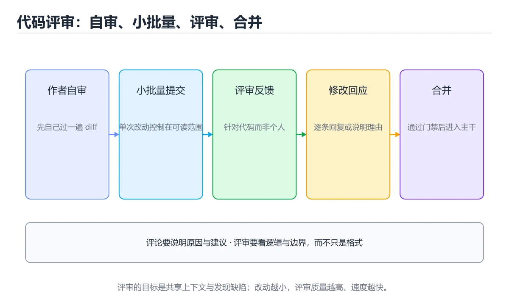
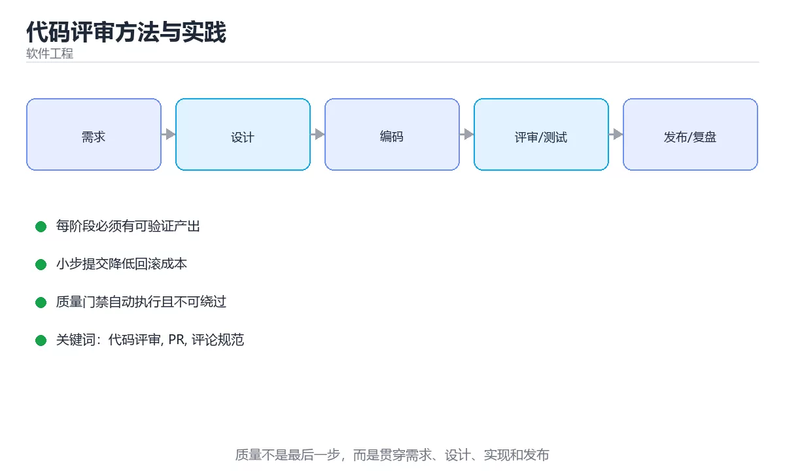

# 代码评审方法与实践





> 内容更新时间：2026-10-03 · 学习阶段：基础 · 预计用时：16 分钟

## 学习目标

- 能用自己的话解释「代码评审方法与实践」解决了什么问题，而不是只背术语。
- 能说清 「代码评审」、「PR」、「评论规范」、「变更规模」 之间的关系，并分别举出一个例子。
- 能把本课知识放回「软件工程」的知识体系，说明它和相邻主题的边界。
- 能完成本课练习，并用验收标准检查自己的结果。

> 一句话摘要：评审清单、评论写法、变更规模控制与作者侧准备。

## 前置知识

- 先完成上一课《安全开发生命周期（SDL）》；如果已经掌握，可以直接用本课练习自测。
- 本课阶段：基础。建议会读写简单代码或命令，并理解变量、输入输出等基本概念。
- 开始前先复习：代码评审、PR、评论规范。
- 如果某一步看不懂，先记录具体卡点，完成练习后再回头读一遍。


## 评审要解决的问题

代码评审不是「找茬」，而是三件事：**提前发现缺陷**、**传播设计共识**、**降低知识集中度**。它的收益与变更规模强相关——单次改动越大，评审质量越低。

| 变更规模 | 评审效果 | 建议 |
| --- | --- | --- |
| 小于 200 行 | 最佳 | 大多数 PR 应落在这个区间 |
| 200 到 400 行 | 可接受 | 拆分为逻辑独立的多个 PR |
| 400 到 1000 行 | 明显下降 | 必须拆分或安排结对评审 |
| 超过 1000 行 | 基本无效 | 只做形式审查，风险无法覆盖 |

## 评审清单速查

| 维度 | 检查点 |
| --- | --- |
| 正确性 | 边界条件、空值、并发、错误处理、幂等 |
| 安全性 | 输入校验、权限校验、注入风险、密钥不落库 |
| 可读性 | 命名达意、函数短小、无重复、无死代码 |
| 可测试性 | 依赖可替换、逻辑与 IO 分离 |
| 性能 | 复杂度、N+1 查询、无谓分配与循环内 IO |
| 兼容性 | 接口变更向后兼容、数据迁移可回滚 |
| 可观测性 | 关键路径有日志、指标与追踪 ID |
| 测试 | 覆盖关键分支与异常路径，断言有效 |

## 评论的写法

建设性评论的结构：**指出问题 + 说明影响 + 给出建议 + 标明优先级**。

```text
[P1] 这里用 list.remove 在循环里删除会漏元素
     影响：批量清理时约有 1/3 的项不会被删除
     建议：改成倒序遍历，或用列表推导式重建
     参考：本仓库 src/utils/cleanup.py 里有类似写法
```

优先级约定示例：`P0` 阻断（必须改）、`P1` 重要（合并前处理）、`P2` 建议（可另开任务）、`P3` 风格（不强求）。

```python
from dataclasses import dataclass, field
from enum import Enum

class Severity(Enum):
    BLOCKER = 0
    MAJOR = 1
    MINOR = 2
    NIT = 3

@dataclass
class ReviewComment:
    file: str
    line: int
    severity: Severity
    problem: str
    impact: str
    suggestion: str

    def render(self) -> str:
        return (
            f"[{self.severity.name}] {self.file}:{self.line}\n"
            f"问题：{self.problem}\n影响：{self.impact}\n建议：{self.suggestion}"
        )

@dataclass
class ReviewSummary:
    comments: list = field(default_factory=list)
    changed_lines: int = 0

    def blocking(self) -> list:
        return [c for c in self.comments if c.severity in (Severity.BLOCKER, Severity.MAJOR)]

    def verdict(self) -> str:
        if self.changed_lines > 800:
            return "变更过大：建议拆分后再评审"
        if self.blocking():
            return f"存在 {len(self.blocking())} 条阻断问题，需修改后重审"
        return "通过（建议另开后续任务处理次要问题）"

    def density(self) -> float:
        """每百行评论数：过高说明质量差，过低可能是评审不足。"""
        if self.changed_lines == 0:
            return 0.0
        return round(len(self.comments) * 100 / self.changed_lines, 2)

summary = ReviewSummary(changed_lines=180)
summary.comments.append(ReviewComment(
    "src/order.py", 42, Severity.MAJOR,
    "库存扣减未做条件判断", "并发下会超卖", "用条件更新 WHERE stock >= n"))
print(summary.verdict(), summary.density())
```

## 作者侧的准备

| 做法 | 收益 |
| --- | --- |
| PR 描述写清背景、方案与验证方式 | 评审者不必猜意图 |
| 自评一遍再邀请评审 | 明显问题先自己清掉 |
| 一次只做一件事 | 评审聚焦，回滚清晰 |
| 大重构与功能改动分开 | 避免逻辑与格式混淆 |
| 附上测试与压测结果 | 证明改动有效 |
| 主动标注风险点 | 把评审注意力引到关键处 |

## 常见错误对照表

| 容易踩的做法 | 实际现象 | 原因与正确做法 |
| --- | --- | --- |
| 一次性提交上千行 | 评审流于形式 | 拆成多个可独立评审的小 PR |
| 评论只说「这样不好」 | 作者不知如何改 | 给出问题、影响与具体建议 |
| 混入大量格式化改动 | 真实改动被淹没 | 格式化单独提交 |
| 只挑风格问题 | 关键缺陷漏过 | 优先正确性、安全与测试 |
| 评审拖延数天 | 上下文丢失、分支冲突 | 约定响应时限并轮值 reviewer |
| 无优先级标注 | 作者分不清轻重 | 用 P0 到 P3 约定 |
| 评审意见无后续跟踪 | 问题被遗忘 | 阻断项必须解决，次要项开工单 |
| 只看代码不看测试改动 | 断言被弱化 | 重点审查测试改动 |

## 自测清单

- [ ] 单次 PR 控制在 200 到 400 行以内。
- [ ] 评论包含问题、影响、建议与优先级。
- [ ] 评审优先关注正确性、安全与测试，而非风格。
- [ ] 阻断项解决后才允许合并。
- [ ] 测试改动会被重点审查。


## 补充：评审的四种形式与分歧处理

### 四种评审形式怎么选

| 形式 | 参与方式 | 适合 | 成本 |
| --- | --- | --- | --- |
| 异步评审（PR） | 线上留言，异步处理 | 日常改动 | 低 |
| 结对编程 | 两人同时写 | 复杂逻辑、关键模块 | 高（两人工时） |
| 走查（Walkthrough） | 作者讲解，团队提问 | 新人代码、架构变更 | 中 |
| 正式审查（Inspection） | 按检查清单逐项核对 | 安全敏感、合规场景 | 很高 |

```text
经验配比
  · 90% 的改动走异步评审
  · 核心模块（支付、权限、数据迁移）加一次结对或走查
  · 正式审查只在合规要求下使用，否则成本过高
```

### 评审检查清单（按优先级）

```text
第一层：正确性（必须看）
  □ 边界条件：空集合、单元素、最大值、负数
  □ 异常路径：失败时是否回滚、是否释放资源
  □ 并发：共享状态是否有保护
  □ 幂等：重试会不会重复产生副作用

第二层：安全性（必须看）
  □ 输入校验：外部数据是否都校验
  □ 权限：是否做了资源级鉴权
  □ 密钥与敏感信息：是否出现在代码或日志
  □ 依赖：新增依赖是否可信、版本是否固定

第三层：可维护性（重要）
  □ 命名是否表达意图
  □ 是否有未使用的代码与调试残留
  □ 复杂逻辑是否有注释解释「为什么」
  □ 是否补了测试，失败路径是否覆盖
```

### 一次有效的异步评审怎么做

```text
作者侧
  ① PR 描述写清「改了什么 / 为什么 / 怎么验证」
  ② 自己先过一遍 diff，删掉无关改动
  ③ 主动标注需要重点看的位置（评论里写「这里我想确认并发安全」）

评审者侧
  ① 先看描述与整体结构，再看细节
  ② 区分「必须改」与「建议」：用前缀标注 [must] / [suggest] / [nit]
  ③ 给出可执行建议，必要时附示例代码
  ④ 半小时内看完 200 行的改动；超长就要求拆分
```

### 分歧怎么处理

| 分歧类型 | 处理方式 |
| --- | --- |
| 风格偏好 | 交给格式化工具与 lint 决定，不在评审里争论 |
| 技术方案不同 | 列出约束与取舍，必要时开 15 分钟同步会 |
| 对需求理解不同 | 回到验收标准，找需求方确认 |
| 评审者要求超出本次范围 | 开 issue 记录，另开 PR 处理 |

```text
三条原则
  · 对事不对人：评论指向代码与设计，不评价作者
  · 不阻塞：非关键分歧不应卡住合并，可以后续跟进
  · 有结论：讨论结束要明确「改 / 不改 / 另开 issue」
```

### 评审的度量（只用于改进流程）

| 指标 | 含义 | 健康区间 |
| --- | --- | --- |
| 首次响应时间 | 提交到第一条评论 | 数小时内 |
| 评审耗时 | 从开 PR 到合并 | 数小时到两天 |
| 单次改动规模 | 行数 | 200 行以内 |
| 评审发现率 | 评审阶段发现的问题占比 | 越高越好（说明拦住了） |

**不要统计「每人评论条数」**：这会诱导无效评论与形式主义。

### 自查清单

- [ ] 单次改动在 200 行以内
- [ ] PR 描述包含改了什么、为什么、怎么验证
- [ ] 评审意见区分必须改与建议
- [ ] 分歧有明确结论，不悬空
- [ ] 核心模块额外做了结对或走查

## 动手练习


> 本课练习重点：围绕「代码评审、PR、评论规范」完成复述、实验和交付，每个结果都要能被别人检查。

先写验收标准，再做最小交付，最后用评审、测试或复盘验证。

### 练习 1：建立心智模型（10 分钟）

合上教程，用 3～5 句话回答：

1. 「代码评审方法与实践」解决了什么问题？
2. 如果没有它，会出现什么具体后果？
3. 它和「PR」是什么关系？

**验收标准**：至少出现一个本课关键词，并写出一个反例、边界条件或失效场景。

### 练习 2：做一次可控实验（20 分钟）

从正文中选一个最小示例，完成以下操作：

1. 先预测修改一个参数、输入或步骤后的结果。
2. 再实际执行或逐步推演，记录真实结果。
3. 如果结果与预测不同，写出差异原因。

**验收标准**：留下「原例 → 改动 → 预测 → 结果 → 原因」五步记录。

### 练习 3：交付一个小结果（30 分钟）

为一个真实小功能写一页设计、检查表或评审记录，并让同伴能照着执行。

任务要求：

- 结果必须能被别人检查，不能只写“我已经理解了”。
- 至少覆盖「代码评审」和「PR」两个关键词。
- 写出 1 个仍然不确定的问题，以及下一步如何验证。

> 提示：时间有限时优先做练习 1 和练习 2；练习 3 可以拆成两次完成。

## 本课小结

- 核心问题：「代码评审方法与实践」不是孤立术语，而是在「软件工程」中解决一类具体问题。
- 关键关系：先分清「代码评审」与「PR」的职责，再理解「评论规范」的适用边界。
- 判断标准：能解释正常场景、边界条件和失败场景，才算真正掌握。
- 下一步：完成练习后，用自己的话写下 3 条要点，再去做本课测验。


## 考点精讲：把测验题还原成判断过程

本课有 6 个判断点。先自己作答，再看「判断依据」；如果结论正确但理由不完整，回到正文对应章节补足概念。

### 考点 1：单次代码评审的变更规模，最有利于发现缺陷的是？

- **正确判断**：小于 200 行
- **判断依据**：正确答案是「小于 200 行」，本课在「评审要解决的问题」中说明：代码评审不是「找茬」，而是三件事：提前发现缺陷、传播设计共识、降低知识集中度。评审质量随规模下降，200 行以内最容易保持专注与上下文完整。本课还在「评审要解决的问题」中说明：它的收益与变更规模强相关——单次改动越大，评审质量越低。本课还在「评论的写法」中说明：建设性评论的结构：指出问题 + 说明影响 + 给出建议 + 标明优先级。
- **迁移检查**：把题干里的一个条件换成边界值，原来的结论还成立吗？写出判断过程。

### 考点 2：一条好的评审评论应该包含？

- **正确判断**：问题、影响、建议与优先级
- **判断依据**：正确答案是「问题、影响、建议与优先级」，本课在「评审要解决的问题」中说明：它的收益与变更规模强相关——单次改动越大，评审质量越低。作者需要知道问题是什么、会造成什么后果、怎么改，以及是否必须改。本课还在「评审要解决的问题」中说明：代码评审不是「找茬」，而是三件事：提前发现缺陷、传播设计共识、降低知识集中度。本课还在「评论的写法」中说明：建设性评论的结构：指出问题 + 说明影响 + 给出建议 + 标明优先级。
- **迁移检查**：遮住选项，只根据定义复述一次答案，再回来看哪个选项与复述一致。

### 考点 3：评审时最应该优先关注的是？

- **正确判断**：正确性、安全性与测试有效性
- **判断依据**：正确答案是「正确性、安全性与测试有效性」，本课在「补充：评审的四种形式与分歧处理」中说明：PR 描述包含改了什么、为什么、怎么验证。评审时间有限，应优先覆盖会带来故障与风险的维度。本课还在「评论的写法」中说明：优先级约定示例：P0 阻断（必须改）、P1 重要（合并前处理）、P2 建议（可另开任务）、P3 风格（不强求）。本课还在「补充：评审的四种形式与分歧处理」中说明：不要统计「每人评论条数」：这会诱导无效评论与形式主义。
- **迁移检查**：遮住选项，只根据定义复述一次答案，再回来看哪个选项与复述一致。

### 考点 4：作者在提交 PR 前做哪件事最能提升评审效率？

- **正确判断**：自评一遍并在描述里写清背景
- **判断依据**：正确答案是「自评一遍并在描述里写清背景」，这道题在问作者在提交PR前做哪件事最能提升评审效率，判断时要把题干限定的输入、边界与目标逐项对齐。自评能清掉明显问题，描述能让评审者快速理解意图与验证方式。课程摘要指出评审清单，评论写法，变更规模控制与作者侧准备，本课要判断的正是作者在提交PR前做哪件事最能提升评审效率。
- **迁移检查**：遮住选项，只根据定义复述一次答案，再回来看哪个选项与复述一致。

### 考点 5：关于测试改动的评审，正确做法是？

- **正确判断**：重点审查是否弱化了断言或删除了用例
- **判断依据**：正确答案是「重点审查是否弱化了断言或删除了用例」，这道题在问关于测试改动的评审，正确做法是，判断时要把题干限定的输入、边界与目标逐项对齐。为了让 CI 通过而放宽断言是高危操作，会掩盖真实缺陷。课程摘要指出评审清单，评论写法，变更规模控制与作者侧准备，本课要判断的正是关于测试改动的评审，正确做法是。
- **迁移检查**：把题干里的一个条件换成边界值，原来的结论还成立吗？写出判断过程。

### 考点 6：阅读下面的评审场景，哪项判断是正确的？

- **正确判断**：放宽断言会掩盖真实缺陷，应重点审查测试改动并要求作者说明原因
- **判断依据**：正确答案是「放宽断言会掩盖真实缺陷，应重点审查测试改动并要求作者说明原因」。本课在「评审清单速查」和「常见错误对照表」中说明：审查测试改动时要重点看去掉了哪些断言、是否删除了用例；为了让 CI 通过而放宽断言属于高风险操作，必须先确认产品行为而不是直接放行。
- **迁移检查**：把错误代码中的关键条件换一个，结论是否还成立？写出判断过程。

## 本课复习清单

离开本课前，逐项确认：

- [ ] 不看解析，能说出「单次代码评审的变更规模，最有利于发现缺陷的是？」的判断依据。
- [ ] 不看解析，能说出「一条好的评审评论应该包含？」的判断依据。
- [ ] 不看解析，能说出「评审时最应该优先关注的是？」的判断依据。
- [ ] 不看解析，能说出「作者在提交 PR 前做哪件事最能提升评审效率？」的判断依据。
- [ ] 不看解析，能说出「关于测试改动的评审，正确做法是？」的判断依据。
- [ ] 不看解析，能说出「补全代码：「代码评审方法与实践」示例中，下面这行代码缺少哪个关键字或函数名？请填…」的判断依据。
- [ ] 至少运行一次本课示例，记录输入、输出和一个边界情况。
- [ ] 把本课最容易混淆的两个概念写成一句话对照。

| 复盘项 | 记录 |
| --- | --- |
| 已经能独立解释的考点 |  |
| 仍然说不清的概念 |  |
| 下一步验证动作 |  |

## 术语速查

把本课反复出现的术语集中放在一起。复习时先遮住右列，尝试用自己的话解释，再回到正文核对。

| 术语 | 本课语境 |
| --- | --- |
| `P0` | 优先级约定示例：`P0` 阻断（必须改）、`P1` 重要（合并前处理）、`P2` 建议（可另开任务）、`P3` 风格（不强求）。 |
| `P1` | 优先级约定示例：`P0` 阻断（必须改）、`P1` 重要（合并前处理）、`P2` 建议（可另开任务）、`P3` 风格（不强求）。 |
| `P2` | 优先级约定示例：`P0` 阻断（必须改）、`P1` 重要（合并前处理）、`P2` 建议（可另开任务）、`P3` 风格（不强求）。 |
| `P3` | 优先级约定示例：`P0` 阻断（必须改）、`P1` 重要（合并前处理）、`P2` 建议（可另开任务）、`P3` 风格（不强求）。 |
| `，判断时要把题干限定的输入、边界与目标逐项对齐。本课示例中还能看到` | 判断依据**：正确答案是「summary」，这道题在问补全代码：代码评审方法与实践示例中，下面这行代码缺少…pend(ReviewComment(`，判断时要把题干限定的输入、边界与目标逐项对齐。本课示例中还能看到 `c… |

## 面试问答与自测

下面把本课考点换成面试追问。先口述自己的答案，
再对照参考回答检查是否遗漏了前提、边界或失败路径。

### 追问 1：单次代码评审的变更规模，最有利于发现缺陷的是？

**参考回答**：正确答案是「小于 200 行」，本课在「评审要解决的问题」中说明：代码评审不是「找茬」，而是三件事：提前发现缺陷、传播设计共识、降低知识集中度。评审质量随规模下降，200 行以内最容易保持专注与上下文完整。本课还在「评审要解决的问题」中说明：它的收益与变更规模强相关——单次改动越大，评审质量越低。本课还在「评论的写法」中说明：建设性评论的结构：指出问题 + 说明影响 + 给出建议 + 标明优先级。

### 追问 2：一条好的评审评论应该包含？

**参考回答**：正确答案是「问题、影响、建议与优先级」，本课在「评审要解决的问题」中说明：它的收益与变更规模强相关——单次改动越大，评审质量越低。作者需要知道问题是什么、会造成什么后果、怎么改，以及是否必须改。本课还在「评审要解决的问题」中说明：代码评审不是「找茬」，而是三件事：提前发现缺陷、传播设计共识、降低知识集中度。本课还在「评论的写法」中说明：建设性评论的结构：指出问题 + 说明影响 + 给出建议 + 标明优先级。

### 追问 3：评审时最应该优先关注的是？

**参考回答**：正确答案是「正确性、安全性与测试有效性」，本课在「补充·评审的四种形式与分歧处理」中说明：PR 描述包含改了什么、为什么、怎么验证。评审时间有限，应优先覆盖会带来故障与风险的维度。本课还在「评论的写法」中说明：优先级约定示例：P0 阻断（必须改）、P1 重要（合并前处理）、P2 建议（可另开任务）、P3 风格（不强求）。本课还在「补充·评审的四种形式与分歧处理」中说明：不要统计「每人评论条数」：这会诱导无效评论与形式主义。

### 追问 4：作者在提交 PR 前做哪件事最能提升评审效率？

**参考回答**：正确答案是「自评一遍并在描述里写清背景」，这道题在问作者在提交PR前做哪件事最能提升评审效率，判断时要把题干限定的输入、边界与目标逐项对齐。自评能清掉明显问题，描述能让评审者快速理解意图与验证方式。课程摘要指出评审清单，评论写法，变更规模控制与作者侧准备，本课要判断的正是作者在提交PR前做哪件事最能提升评审效率。

### 追问 5：关于测试改动的评审，正确做法是？

**参考回答**：正确答案是「重点审查是否弱化了断言或删除了用例」，这道题在问关于测试改动的评审，正确做法是，判断时要把题干限定的输入、边界与目标逐项对齐。为了让 CI 通过而放宽断言是高危操作，会掩盖真实缺陷。课程摘要指出评审清单，评论写法，变更规模控制与作者侧准备，本课要判断的正是关于测试改动的评审，正确做法是。

## English Overview

**Title:** Code Review

**Summary:** Review checklist, comment style and change size control.

**Category:** Software Engineering  
**Level:** 基础  
**Key terms:** 代码评审, PR, 评论规范, 变更规模, 评审清单

> The full tutorial is written in Chinese. This bilingual overview helps English readers identify the topic, scope and key terms before studying the detailed examples.

## 内容元数据

- 内容版本：v2.0
- 最后更新：2026-10-03
- 学习阶段：基础
- 适用环境：通用软件工程实践
- 内容来源：内置结构化课程与工程实践整理
- 相关主题：代码评审、PR、评论规范、变更规模、评审清单
- 质量版本：P0 测验标准 + P1 覆盖扩展 + P2 体验补全


## 参考资料与复核

- 最后复核：2026-10-04
- 下次复核：2027-04-04
- 复核范围：版本兼容、API 行为、安全建议与工程实践
- 来源性质：官方文档与标准；本课正文为离线教学重组，不复制原文

| 参考资料 | 本课用途 |
| --- | --- |
| [Martin Fowler](https://martinfowler.com/) | 架构、重构与持续交付 |
| [Google SWE Book Resources](https://abseil.io/resources/swe-book) | 代码评审与工程规范 |

> 本课主题：评审清单、评论写法、变更规模控制与作者侧准备。

> App 完全离线展示文字链接，不会自动联网；需要延伸阅读时可复制链接到浏览器。
