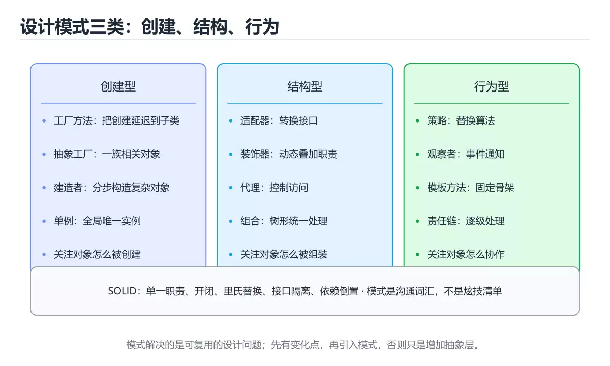
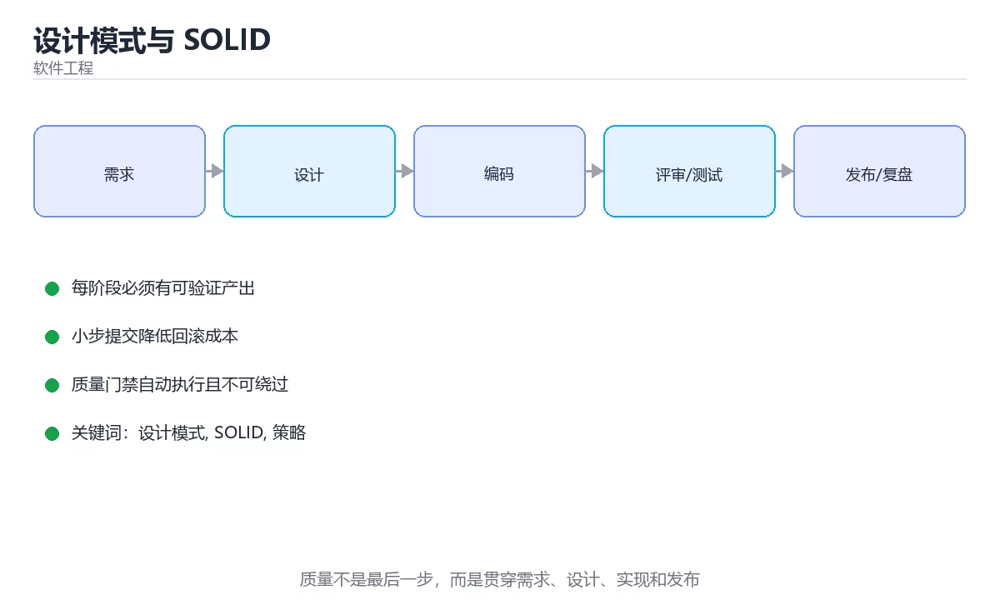

# 设计模式与 SOLID





> 内容更新时间：2026-10-06 · 学习阶段：入门 · 预计用时：30 分钟

## 学习目标

- 能用自己的话解释设计模式与 SOLID解决了什么问题，而不是只背术语。
- 能说清 「设计模式」、「SOLID」、「策略」、「观察者」 之间的关系，并分别举出一个例子。
- 能把本课知识放回「软件工程」的知识体系，说明它和相邻主题的边界。
- 能完成本课练习，并用验收标准检查自己的结果。

> 一句话摘要：SOLID 五原则与创建/结构/行为型常用模式。

## 前置知识

- 会进行基本的文件、命令行或浏览器操作；遇到不熟悉的术语先查本课关键词。
- 本课阶段：入门。只需要基本计算机操作，不要求编程经验。
- 开始前先复习：设计模式、SOLID、策略。
- 如果某一步看不懂，先记录具体卡点，完成练习后再回头读一遍。

## SOLID 五原则

| 原则 | 含义 |
| --- | --- |
| 单一职责 | 一个类只承担一个变化原因 |
| 开闭原则 | 对扩展开放、对修改关闭 |
| 里氏替换 | 子类可替换父类而不破坏调用方 |
| 接口隔离 | 接口要小而专，不强迫实现无用方法 |
| 依赖倒置 | 依赖抽象而非具体实现 |

SOLID 的目标是**降低修改成本**：让新增需求尽量通过「新增代码」而不是「改动旧代码」完成。

## 三类设计模式

| 类型 | 模式 | 解决的问题 |
| --- | --- | --- |
| 创建型 | 单例、工厂方法、抽象工厂、建造者、原型 | 对象创建复杂或需要控制实例 |
| 结构型 | 适配器、装饰器、代理、外观、组合、享元 | 组合与包装已有结构 |
| 行为型 | 策略、观察者、模板方法、责任链、命令、状态 | 解耦算法、通知与流程 |

高频实用模式：

1. **策略**：if-else 分支过多时，把每个分支封成策略类（支付方式、计费规则）。
2. **观察者 / 发布订阅**：事件驱动解耦（订单完成后通知库存、积分、风控）。
3. **装饰器**：在不改原类的前提下叠加能力（日志、缓存、重试）。
4. **责任链**：审批流、过滤器链、拦截器。
5. **工厂**：屏蔽创建细节，按配置或类型返回不同实现。

## 常见错误与排查

上帝类（万能 Manager）、过度抽象（为未来不存在的需求加层次）、贫血模型（数据与行为分离）、隐式依赖（在方法内直接 new 依赖导致无法测试）、循环依赖。
| 反模式 | 表现 | 后果 |
| --- | --- | --- |
| 上帝类 | 一个类几千行、职责混杂 | 难测试、易冲突 |
| 过度设计 | 为假想需求加抽象层 | 复杂度上升、交付变慢 |
| 撒手不管的单例 | 到处全局可变状态 | 测试困难、隐式耦合 |
| 复制粘贴 | 相似逻辑散落多处 | 改一处漏一处 |
| 贫血模型 | 只有 getter/setter | 业务逻辑散落服务层 |
| 隐式依赖 | 方法内部 new 具体实现 | 无法替换与测试 |
| 容易踩的做法 | 实际现象 | 原因与正确做法 |
| 一开始就套用大量模式 | 代码晦涩、改动变慢 | 先写清晰实现，出现变化点再重构 |
| 用模式名当注释 | 看不出真实意图 | 命名体现业务语义 |
| 单例到处用 | 无法测试、状态互相影响 | 依赖注入替代 |
| 为复用强加继承 | 层级僵化 | 优先组合 |
| 接口膨胀 | 实现类写空方法 | 拆小接口 |
| 抽象层只为转发 | 无价值间接层 | 合并或延后抽象 |
| 忽略并发安全 | 单例下出现竞态 | 明确线程安全或改为无状态 |
| 模式滥用导致循环依赖 | 启动报错 | 明确依赖方向 |
| 不做单元测试 | 重构无安全网 | 行为测试先行 |
| 只追求设计模式数量 | 复杂度上升、收益不明 | 以可读性与可测试性为准 |

## 使用原则

模式是**沟通词汇与经验总结**，不是目标。判断标准是：引入后**修改成本是否下降、可测试性是否提升**。若只是让代码层数变多，就不要用。

## 本课小结

先记 SOLID 的思想，再按「创建 / 结构 / 行为」三类挑常用模式；**模式服务于可维护性，不要为了模式而模式**。

## 常用模式速查

| 模式 | 解决问题 | 适用信号 |
| --- | --- | --- |
| 工厂方法 | 创建逻辑集中 | 构造函数分支变多 |
| 抽象工厂 | 一族相关对象的创建 | 多套实现需整体替换 |
| 建造者 | 复杂对象的组装 | 构造参数过多 |
| 单例 | 全局唯一实例 | 慎用，优先依赖注入 |
| 适配器 | 接口不兼容 | 对接第三方或遗留系统 |
| 装饰器 | 动态叠加能力 | 日志、缓存、鉴权等横切 |
| 代理 | 控制访问 | 懒加载、远程调用、权限 |
| 策略 | 算法可替换 | 大量 `if/else` 分支 |
| 观察者 | 状态变化通知 | 事件驱动、UI 更新 |
| 模板方法 | 固定流程、可变步骤 | 流程骨架复用 |
| 责任链 | 依次处理请求 | 中间件、审批流 |
| 状态机 | 状态与转移显式化 | 订单、工单流转 |

## SOLID 速查

| 原则 | 一句话 | 违反信号 |
| --- | --- | --- |
| 单一职责 | 一个类只有一个变化原因 | 一个类被多个需求频繁改动 |
| 开闭原则 | 对扩展开放、对修改关闭 | 新增类型要改大量分支 |
| 里氏替换 | 子类可替换父类且行为一致 | 子类抛异常或改变语义 |
| 接口隔离 | 接口小而专一 | 实现类被迫写空方法 |
| 依赖倒置 | 依赖抽象而非实现 | 高层直接 new 具体实现 |

```python
from abc import ABC, abstractmethod
from dataclasses import dataclass

# 策略模式：把分支判断换成可替换对象
class DiscountStrategy(ABC):
    @abstractmethod
    def apply(self, amount: float) -> float: ...

class NoDiscount(DiscountStrategy):
    def apply(self, amount: float) -> float:
        return amount

class VipDiscount(DiscountStrategy):
    def apply(self, amount: float) -> float:
        return round(amount * 0.8, 2)

class CouponDiscount(DiscountStrategy):
    def __init__(self, value: float):
        self.value = value

    def apply(self, amount: float) -> float:
        return max(0.0, amount - self.value)

@dataclass
class Order:
    amount: float
    strategy: DiscountStrategy

    def payable(self) -> float:
        return self.strategy.apply(self.amount)

# 依赖倒置：高层依赖抽象的通知接口
class Notifier(ABC):
    @abstractmethod
    def send(self, message: str) -> None: ...

class EmailNotifier(Notifier):
    def __init__(self):
        self.sent = []

    def send(self, message: str) -> None:
        self.sent.append(message)

class OrderService:
    def __init__(self, notifier: Notifier):
        self.notifier = notifier            # 注入而非内部 new

    def place(self, order: Order) -> float:
        total = order.payable()
        self.notifier.send(f"订单已创建，应付 {total}")
        return total

notifier = EmailNotifier()
service = OrderService(notifier)
print(service.place(Order(200, VipDiscount())), len(notifier.sent))
```

## 复习与自测

- [ ] 能列出五个以上模式及适用信号。
- [ ] 能用策略模式替代大量条件分支。
- [ ] 依赖抽象、构造器注入，避免内部 new。
- [ ] 知道常见反模式及其后果。
- [ ] 抽象只在出现真实变化点时引入。

## 动手练习

> 本课练习重点：围绕「设计模式、SOLID、策略」完成复述、实验和交付，每个结果都要能被别人检查。

先写验收标准，再做最小交付，最后用评审、测试或复盘验证。

### 练习 1：建立心智模型（10 分钟）

合上教程，用 3～5 句话回答：

1. 设计模式与 SOLID解决了什么问题？
2. 如果没有它，会出现什么具体后果？
3. 它和「SOLID」是什么关系？

**验收标准**：至少出现一个本课关键词，并写出一个反例、边界条件或失效场景。

### 练习 2：做一次可控实验（20 分钟）

从正文中选一个最小示例，完成以下操作：

1. 先预测修改一个参数、输入或步骤后的结果。
2. 再实际执行或逐步推演，记录真实结果。
3. 如果结果与预测不同，写出差异原因。

**验收标准**：留下「原例 → 改动 → 预测 → 结果 → 原因」五步记录。

### 练习 3：交付一个小结果（30 分钟）

为一个真实小功能写一页设计、检查表或评审记录，并让同伴能照着执行。

任务要求：

- 结果必须能被别人检查，不能只写“我已经理解了”。
- 至少覆盖「设计模式」和「SOLID」两个关键词。
- 写出 1 个仍然不确定的问题，以及下一步如何验证。

> 提示：时间有限时优先做练习 1 和练习 2；练习 3 可以拆成两次完成。

## 可运行练习

本节围绕设计模式与 SOLID安排 3 个可交付任务，每个任务都要求留下可以复查的记录。

### 任务 1：用自己的话画出结构

不看书，用一张图说清「设计模式与 SOLID」的结构，画完再对照骨架：

- 主干：SOLID 五原则 → 三类设计模式 → 反模式 → 使用原则
- 连接线：在每条边上标出输入、输出与失败路径。
- 自检：能否用一句话说明设计模式与SOLID的关系？

### 任务 2：做一次对比实验

**验收标准**：表格里两个方案的结论不能完全一样；写下“在什么条件下应该换方案”。

### 任务 3：迁移到自己的场景

**验收标准**：至少有一个可复现的命令、代码片段或数据样例；结论能被别人独立检查。

## 故障现场

### 现场 1：本课的 设计模式 常规用例通过，但边界用例失败

**症状**：在本课的练习或生产场景里出现“本课的 设计模式 常规用例通过，但边界用例失败”。

**复现**：准备一组最小输入，只保留触发“本课的 设计模式 常规用例通过，但边界用例失败”的必要条件，连续运行两次确认结果稳定。

**定位**：围绕“设计模式 的前置条件与取值边界没有写进代码，默认值掩盖了空值和极值”检查调用链、输入数据和环境配置，先验证假设再改代码。

**预防**：把“本课的 设计模式 常规用例通过，但边界用例失败”写成一条自动化用例，并在本课的验收清单里保留对应检查项。

### 现场 2：本课的 SOLID 结果在两次运行之间不一致

**症状**：在本课的练习或生产场景里出现“本课的 SOLID 结果在两次运行之间不一致”。

**复现**：准备一组最小输入，只保留触发“本课的 SOLID 结果在两次运行之间不一致”的必要条件，连续运行两次确认结果稳定。

**定位**：围绕“SOLID 依赖了当前版本、执行顺序或共享状态，单次运行无法暴露差异”检查调用链、输入数据和环境配置，先验证假设再改代码。

**预防**：把“本课的 SOLID 结果在两次运行之间不一致”写成一条自动化用例，并在本课的验收清单里保留对应检查项。

### 现场 3：需求反复变更，代码越改越难验证

**症状**：在本课的练习或生产场景里出现“需求反复变更，代码越改越难验证”。

**复现**：准备一组最小输入，只保留触发“需求反复变更，代码越改越难验证”的必要条件，连续运行两次确认结果稳定。

**定位**：围绕“设计模式 的接口边界没有写清楚，SOLID 缺少可自动执行的验收条件”检查调用链、输入数据和环境配置，先验证假设再改代码。

**修复**：为设计模式与 SOLID补一份最小验收清单，把接口、数据和失败路径写成测试，再开始重构

**预防**：把“需求反复变更，代码越改越难验证”写成一条自动化用例，并在本课的验收清单里保留对应检查项。

## 深入补充：设计模式与 SOLID 的取舍与边界

### 一、把概念放回真实约束

学习设计模式与 SOLID时，最容易只记住结论而忽略前提。先写出三个约束：数据规模、时间预算、可接受的失败方式；再判断 设计模式 与 SOLID 在这些约束下是否仍然成立。只要约束改变，原来的最优解就可能变成错误解。

| 做法 | 适用规模 | 成本 | 主要风险 |
| --- | --- | --- | --- |
| 先写测试再改 | 任何规模 | 前期较慢 | 测试本身失真 |
| 小步提交与评审 | 多人协作 | 评审开销 | 批次过大 |
| 自动化质量门禁 | 持续交付 | 维护流水线 | 门禁形同虚设 |

### 二、三个容易混淆的边界

1. 澄清输入与目标。先写清「设计模式与 SOLID」要解决的问题、合法输入范围和成功标准，再进入后续步骤。
2. **把“平均值”当成“全部”**：设计模式 的指标好看，不代表尾部请求、冷启动或失败重试也好看。
3. **把“当前版本”当成“永久行为”**：SOLID 依赖的默认值、API 或性能特征都可能随版本变化，需要固定版本并保留回归用例。

### 三、一个生产场景

假设团队要在真实系统里使用设计模式与 SOLID：第一周先做小流量验证，记录 设计模式 的基线与异常；第二周扩大输入规模，观察 SOLID 是否成为瓶颈；第三周再做故障演练，主动注入超时、重复请求和依赖不可用，确认系统能降级、能重试、能恢复。每一步都要留下指标、日志和结论，而不是只留下“感觉更快了”。

### 四、自测清单

- 能否用一句话说出设计模式与 SOLID解决的核心问题与不适用场景？
- 能否画出 设计模式 的数据流或状态变化，并标出失败路径？
- 能否给出一个反例，证明某个看似合理的结论在边界条件下不成立？
- 能否写出一条可复现的验证命令，让别人独立得到相同结论？

## 本课复习清单

离开本课前，逐项确认：

- [ ] 不看解析，能说出「策略模式主要解决什么问题？」的判断依据。
- [ ] 不看解析，能说出「依赖倒置原则的含义是？」的判断依据。
- [ ] 不看解析，能说出「下面哪项属于反模式？」的判断依据。
- [ ] 不看解析，能说出「观察者模式与发布订阅模式的区别是？」的判断依据。
- [ ] 不看解析，能说出「单一职责原则的判断标准是？」的判断依据。
- [ ] 至少运行一次本课示例，记录输入、输出和一个边界情况。
- [ ] 把本课最容易混淆的两个概念写成一句话对照。

| 复盘项 | 记录 |
| --- | --- |
| 已经能独立解释的考点 |  |
| 仍然说不清的概念 |  |
| 下一步验证动作 |  |

## 术语速查

| 术语 | 一句话说明 |
| --- | --- |
| `if/else` | \| 策略 \| 算法可替换 \| 大量 `if/else` 分支 \| |
| `设计模式` | 围绕“设计模式 的接口边界没有写清楚，SOLID 缺少可自动执行的验收条件”检查调用链、输入数据和环境配置，先验证假设再改代码。 |
| `SOLID` | 围绕“SOLID 依赖了当前版本、执行顺序或共享状态，单次运行无法暴露差异”检查调用链、输入数据和环境配置，先验证假设再改代码。 |
| `策略` | 策略：if-else 分支过多时，把每个分支封成策略类（支付方式、计费规则）。 |
| `观察者` | 观察者 / 发布订阅：事件驱动解耦（订单完成后通知库存、积分、风控）。 |
| `反模式` | SOLID 五原则 → 三类设计模式 → 反模式 → 使用原则。 |

## 零基础精讲：把设计模式与 SOLID真正讲透

### 先建立一个直觉

把软件工程看成降低变更成本：用需求、接口、测试、评审和监控把不确定性逐步收敛，而不是一次写出完美代码。

本课的摘要可以当作一张地图：SOLID 五原则与创建/结构/行为型常用模式。

### 逐步拆解

1. 澄清输入与目标。先写清「设计模式与 SOLID」要解决的问题、合法输入范围和成功标准，再进入后续步骤。
2. 描述处理过程。把「设计模式、SOLID、策略、观察者、反模式」映射到具体步骤，每步都要求能单独验证。
3. 定义输出。输出不仅包括正常结果，还包括错误码、日志、指标和资源释放状态。
4. 找出一条失败路径。让错误尽早暴露，并说明重试、降级、回滚或人工处理的边界。
5. 用一个小例子贯穿全过程。先手算或预测结果，再运行代码或实验，最后解释差异。

### 把正文串成一条执行链

- **练习 1：建立心智模型（10 分钟）**：在「设计模式与 SOLID」里，「练习 1：建立心智模型（10 分钟）」这一步要先写清输入与预期，再记录实际结果和差异；结果不符时回到对应小节核对前提。
- **练习 2：做一次可控实验（20 分钟）**：在「设计模式与 SOLID」里，「练习 2：做一次可控实验（20 分钟）」这一步要先写清输入与预期，再记录实际结果和差异；结果不符时回到对应小节核对前提。
- **练习 3：交付一个小结果（30 分钟）**：在「设计模式与 SOLID」里，「练习 3：交付一个小结果（30 分钟）」这一步要先写清输入与预期，再记录实际结果和差异；结果不符时回到对应小节核对前提。
- **考点 1：策略模式主要解决什么问题？**：针对「设计模式与 SOLID」，先自问「策略模式主要解决什么问题」；作答后回到对应考点核对判断依据。
- **考点 2：依赖倒置原则的含义是？**：针对「设计模式与 SOLID」，先自问「依赖倒置原则的含义是」；作答后回到对应考点核对判断依据。
- **考点 3：下面哪项属于反模式？**：针对「设计模式与 SOLID」，先自问「下面哪项属于反模式」；作答后回到对应考点核对判断依据。

### 从测验反推易错点

**检查点 1：策略模式主要解决什么问题？**

- 参考判断：大量 if-else 分支的算法替换
- 自问：如果去掉题干里的一个限定词，结论还成立吗？

**检查点 2：依赖倒置原则的含义是？**

- 参考判断：依赖抽象而不是具体实现

**检查点 3：下面哪项属于反模式？**

- 参考判断：为不存在的未来需求增加抽象层

**检查点 4：观察者模式与发布订阅模式的区别是？**

- 参考判断：观察者由主题直接持有引用

**检查点 5：单一职责原则的判断标准是？**

- 参考判断：一个类只有一个引起它变化的原因（一个变化方向）

### 工程排错顺序

| 先查什么 | 要得到的证据 | 判断标准 |
| --- | --- | --- |
| 输入与前提是否满足 | 日志、输入样例、测试或指标 | 能复现并解释，才算定位 |
| 核心步骤是否产生了预期中间结果 | 日志、输入样例、测试或指标 | 能复现并解释，才算定位 |
| 失败路径是否可观测、可恢复 | 日志、输入样例、测试或指标 | 能复现并解释，才算定位 |
| 资源、权限与成本是否在预算内 | 日志、输入样例、测试或指标 | 能复现并解释，才算定位 |

### 变式训练

1. 把它放进一个只有单机、没有额外依赖的小项目，先保证正确，再考虑扩展。
2. 把输入规模扩大十倍，记录时间、内存和失败路径，找出第一个真正瓶颈。
3. 制造一次依赖超时或错误输入，要求系统给出可解释错误并且不留下半完成状态。
5. 删掉一个看似必要的步骤，观察哪个测试或指标先失败，用证据说明它为什么必要。
6. 把方案切换到低资源设备，重新评估默认参数、超时和降级策略。

### 本课自测

- [ ] 能用一句话解释「设计模式」在本课中的角色与边界。
- [ ] 能举出一个正常例子和一个失败例子。
- [ ] 能说出最小验证步骤，以及需要记录的证据。
- [ ] 能用一句话解释「SOLID」在本课中的角色与边界。
- [ ] 能用一句话解释「策略」在本课中的角色与边界。
- [ ] 能用一句话解释「观察者」在本课中的角色与边界。
- [ ] 能用一句话解释「反模式」在本课中的角色与边界。

### 迁移案例库

下面用不同约束重复同一套方法。每完成一轮，都把结论写进笔记，并只改变一个变量。

#### 迁移案例 1：围绕「设计模式」做一次小实验

**目标**：在不改变课程主体的前提下，验证设计模式与 SOLID中的一个关键判断。

**步骤**：
1. 复述当前方案对「设计模式」的假设，写成一句可证伪的话。
2. 设计一个正常输入和一个边界输入，分别预测输出。
3. 运行或逐步演算，记录实际输出、耗时和失败信息。
4. 只调整一个参数，比较前后差异并解释原因。
5. 补充一条测试或复习卡，确保下次能更快复现。

**验收**：结论有证据、差异可解释、失败可恢复；如果做不到，说明还需要缩小问题范围。

#### 迁移案例 2：围绕「SOLID」做一次小实验

**步骤**：
1. 复述当前方案对「SOLID」的假设，写成一句可证伪的话。

#### 迁移案例 3：围绕「策略」做一次小实验

**步骤**：
1. 复述当前方案对「策略」的假设，写成一句可证伪的话。

#### 迁移案例 4：围绕「观察者」做一次小实验

**步骤**：
1. 复述当前方案对「观察者」的假设，写成一句可证伪的话。

#### 迁移案例 5：围绕「反模式」做一次小实验

**步骤**：
1. 复述当前方案对「反模式」的假设，写成一句可证伪的话。

#### 迁移案例 6：围绕「设计模式」做一次小实验

**步骤**：

#### 迁移案例 7：围绕「SOLID」做一次小实验

**步骤**：

#### 迁移案例 8：围绕「策略」做一次小实验

**步骤**：

#### 迁移案例 9：围绕「观察者」做一次小实验

**步骤**：

#### 迁移案例 10：围绕「反模式」做一次小实验

**步骤**：

#### 迁移案例 11：围绕「设计模式」做一次小实验

**步骤**：

#### 迁移案例 12：围绕「SOLID」做一次小实验

**步骤**：

#### 迁移案例 13：围绕「策略」做一次小实验

**步骤**：

#### 迁移案例 14：围绕「观察者」做一次小实验

**步骤**：

#### 迁移案例 15：围绕「反模式」做一次小实验

**步骤**：

#### 迁移案例 16：围绕「设计模式」做一次小实验

**步骤**：

<!-- p0-depth-v2:end -->

## 代码对照与验证

这一节把设计模式还原成「问题、结构、代价」三段，并给出可运行的策略模式实现。

### 对照一：策略模式消除条件分支

```python
from dataclasses import dataclass
from typing import Callable

@dataclass
class Order:
    amount: float
    kind: str

pricing: dict[str, Callable[[Order], float]] = {
    "normal": lambda order: order.amount,
    "vip": lambda order: order.amount * 0.9,
    "promo": lambda order: order.amount - 20,
}

def total(order: Order) -> float:
    return pricing[order.kind](order)

print(total(Order(100, "vip")))
print(total(Order(100, "promo")))
```

把变化点封装成策略，新增折扣只需要注册一个函数，而不是修改调用方的分支。

### 对照二：模式选型速查

| 模式 | 解决的问题 | 引入的代价 |
| --- | --- | --- |
| 策略 | 多种算法可替换 | 类或函数数量增加 |
| 工厂 | 创建逻辑集中 | 需要维护注册表 |
| 观察者 | 一对多通知 | 事件顺序与内存泄漏风险 |
| 装饰器 | 动态叠加职责 | 调试时调用链变长 |

### 对照三：不该用模式的时候

```text
只有一个实现，且短期内不会变化      -> 直接写函数
需求尚未稳定，分支少于三处          -> 先用简单条件
模式引入的间接层无法被测试覆盖      -> 说明抽象收益不成立
```

模式是为了隔离已确认的变化点；在没有变化点的地方引入抽象，只会增加阅读成本。

### 验证清单

- 每个模式都能对应到一个具体的扩展场景。
- 新增一种实现无需修改既有调用方。
- 抽象层的单元测试覆盖了各分支，而不是只测正常路径。

## 考点精讲

### 考点 1：概念判断·设计模式

- **题目**：「设计模式与 SOLID」的核心结论是什么？
- **判断依据**：题干的正确项是设计模式与 SOLID：SOLID 五原则与创建/结构/行为型常用模式。“设计模式与”与术语表相呼应，只有符合设计模式、SOLID、策略约束的“设计模式与 SOLID”才是正文支持的结论。「设计模式与 SOLID」要求先交代设计模式、SOLID、策略的前提再下结论，所以“设计模式与 SOLID”只在题干“设计模式与”给定的条件下成立。

### 考点 2：概念判断·设计模式

- **题目**：依赖倒置原则的含义是？
- **判断依据**：在「设计模式与 SOLID」里，依赖抽象而不是具体实现。抽象稳定、实现易变，依赖抽象可降低修改成本并便于测试。在「设计模式与 SOLID」里判断这道题，要把设计模式、SOLID、策略的条件、过程与失败路径逐项对齐，换成“依赖倒置原则的含义是”这个场景，只有满足前提的结论才成立。回到「设计模式与 SOLID」的正文示例，用“依赖倒置原则的含义是”走一遍设计模式、SOLID、策略的完整流程，能复现的结论才可以保留。

### 考点 3：概念判断·设计模式

- **题目**：下面哪项属于反模式？
- **判断依据**：在「设计模式与 SOLID」里，作答时，先用设计模式建立输入与输出的基线，再把为不存在的未来需求增加抽象层代入边界条件核对，结论才能复现。在「设计模式与 SOLID」里判断这道题，要把设计模式、SOLID、策略的条件、过程与失败路径逐项对齐，换成“下面哪项属于反模式”这个场景，只有满足前提的结论才成立。

### 考点 4：顺序排列·设计模式

- **题目**：按“设计模式与 SOLID”中 设计模式、SOLID、策略 的实践顺序，把四个步骤排成从准备到复盘的合理顺序。
- **判断依据**：题干的正确项是固定版本与证据，把“设计模式与 SOLID”的结论写成可复现记录。在「设计模式与 SOLID」里，在本课的练习里，顺序应当是：先明确 设计模式 的输入、输出与约束 → 写出最小示例并核对 SOLID 的基线结果 → 只改一个变量，记录边界与失败路径的变化 → 固定版本与证据，把本课的结论写成可复现记录。这个顺序把 设计模式 的输入、输出和约束放在最前面，在设计模式与 SOLID里避免概念没对齐就开始调参。第二步用 SOLID 建立可核对的基线，在设计模式与 SOLID里第三步才允许改变一个变量并观察失败路径。

### 考点 5：概念判断·设计模式

- **题目**：单一职责原则的判断标准是？
- **判断依据**：在「设计模式与 SOLID」里，一个类只有一个引起它变化的原因（一个变化方向）。按「谁的需求会促使它改变」来划分，比按代码行数判断更本质。回到「设计模式与 SOLID」的正文示例，用“单一职责原则的判断标准是”走一遍设计模式、SOLID、策略的完整流程，能复现的结论才可以保留。

### 考点 6：多选辨析·设计模式

- **题目**：以下哪些术语与「设计模式与 SOLID」直接相关？（多选）
- **判断依据**：SOLID是否完整覆盖题干的输入、输出和失败路径，并排除设计模式、GDB这类相邻概念。这道题的关键在「设计模式与 SOLID」的设计模式、SOLID、策略：先确认题干“以下哪些术语与设计模式与 SOLID”问的是哪一步，再排除偷换前提的选项。

## English Overview

**Title:** Design Patterns & SOLID

**Summary:** SOLID and creational/structural/behavioral patterns.

**Category:** Software Engineering
**Level:** 入门
**Key terms:** 设计模式, SOLID, 策略, 观察者, 反模式

## 内容元数据

- 内容版本：v2.0
- 最后更新：2026-10-06
- 学习阶段：入门
- 适用环境：通用软件工程实践
- 内容来源：内置结构化课程与工程实践整理
- 相关主题：设计模式、SOLID、策略、观察者、反模式
- 质量版本：P0 测验标准 + P1 覆盖扩展 + P2 体验补全

## 参考资料与复核

- 最后复核：2026-10-04
- 下次复核：2027-04-04
- 复核范围：版本兼容、API 行为、安全建议与工程实践
- 来源性质：官方文档、标准或权威教材；正文为离线教学重组

| 参考资料 | 本课用途 |
| --- | --- |
| [Martin Fowler 架构](https://martinfowler.com/architecture/) | 架构、重构与演进 |
| [Refactoring Catalog](https://refactoring.com/catalog/) | 重构手法与代码坏味道 |
| [The Twelve-Factor App](https://12factor.net/) | 可部署应用设计原则 |

> 「设计模式与 SOLID」的链接用于离线阅读后的延伸核对；App 不会自动联网。
