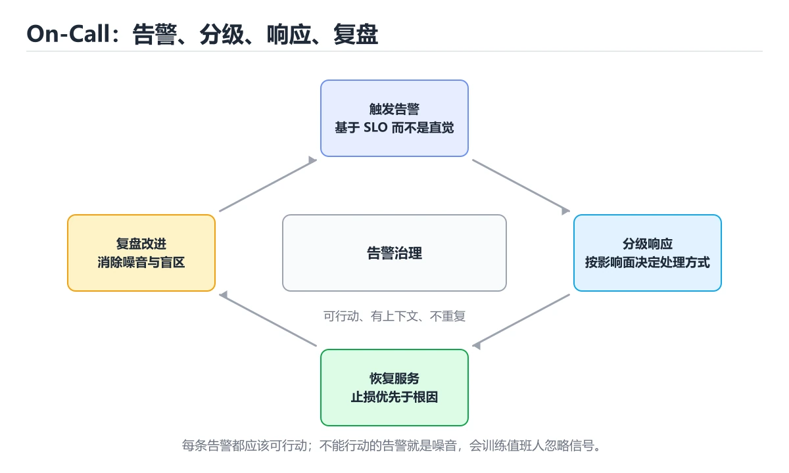
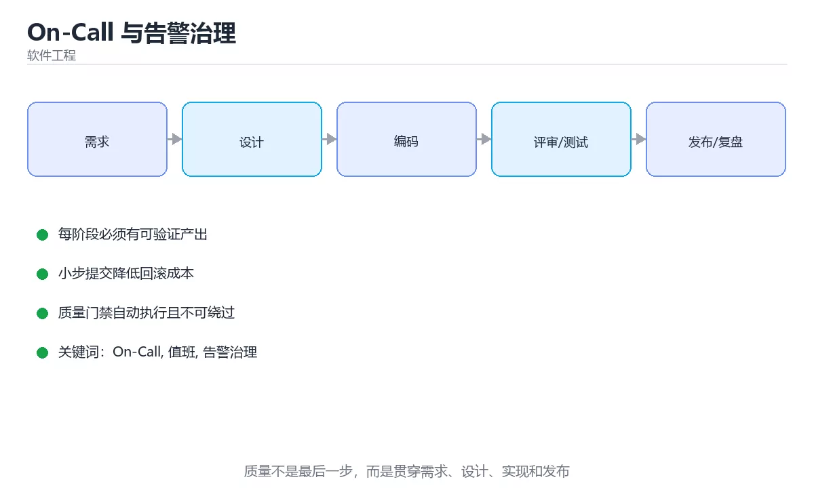

# On-Call 与告警治理





> 内容更新时间：2026-10-03 · 学习阶段：进阶 · 预计用时：16 分钟

## 学习目标

- 能用自己的话解释「On-Call 与告警治理」解决了什么问题，而不是只背术语。
- 能说清 「On-Call」、「值班」、「告警治理」、「误报」 之间的关系，并分别举出一个例子。
- 能把本课知识放回「软件工程」的知识体系，说明它和相邻主题的边界。
- 能完成本课练习，并用验收标准检查自己的结果。

> 一句话摘要：值班体系、告警质量指标、分级路由与噪声治理。

## 前置知识

- 先完成上一课《故障复盘与事故管理》；如果已经掌握，可以直接用本课练习自测。
- 本课阶段：进阶。建议先掌握同一分类的基础课程，并能独立运行正文中的最小示例。
- 开始前先复习：On-Call、值班、告警治理。
- 如果某一步看不懂，先记录具体卡点，完成练习后再回头读一遍。


## 值班体系速查

| 要素 | 做法 |
| --- | --- |
| 轮值周期 | 一周一轮较常见，跨时区用跟单式交接 |
| 交接内容 | 进行中的问题、脆弱点、即将上线的变更 |
| 响应时限 | P0/P1 15 分钟内确认，P2/P3 工作时间内处理 |
| 升级路径 | 明确「多久没解决就找谁」，避免单点扛 |
| 补偿机制 | 值班调休或补贴，保证可持续 |
| 新人保护 | 先跟班，再参与辅助值守，最后独立值班 |

## 告警质量评估

| 指标 | 含义 | 健康方向 |
| --- | --- | --- |
| 告警总量 | 单位时间触发的告警数 | 稳定或下降 |
| 有效率 | 需要人处理的告警占比 | 越高越好（一般目标 大于 70%） |
| 误报率 | 无需处理的占比 | 越低越好 |
| 平均确认时间 | 从触发到有人响应 | 分钟级 |
| 重复告警占比 | 同一问题反复触发 | 越低越好 |
| 无人处理告警数 | 长期未关闭的告警 | 应为 0 |

关键判断：**如果一个告警连续多次没人处理，要么它不该存在，要么响应流程有问题。**

## 告警设计原则

| 原则 | 说明 |
| --- | --- |
| 面向症状 | 告警用户可感知的问题，而非单一技术指标 |
| 基于 SLO | 用错误预算消耗速率触发，减少噪声 |
| 可执行 | 每条告警都有对应 Runbook |
| 分级路由 | 不同级别走不同通道（电话、群、工单） |
| 抑制与聚合 | 同源告警合并，避免风暴 |
| 持续时长 | 要求持续 N 分钟才触发，过滤抖动 |
| 定期评审 | 每季度清理无效告警 |

```python
from dataclasses import dataclass, field
from enum import Enum

class Channel(Enum):
    PHONE = "电话"
    CHAT = "群消息"
    TICKET = "工单"

@dataclass
class AlertRule:
    name: str
    severity: str                # P0 / P1 / P2 / P3
    channel: Channel
    duration_seconds: int        # 持续多久才触发，用于抑制抖动
    runbook: str = ""
    enabled: bool = True

    def is_actionable(self) -> bool:
        """可执行性：没有 Runbook 的告警在半夜只会制造恐慌。"""
        return bool(self.runbook.strip())

@dataclass
class AlertAudit:
    """告警审计：找出无效告警与噪声来源。"""

    rules: list = field(default_factory=list)
    triggered: dict = field(default_factory=dict)   # 名称 -> 触发次数
    acted: dict = field(default_factory=dict)       # 名称 -> 被处理的次数

    def noise_ratio(self) -> float:
        total = sum(self.triggered.values())
        handled = sum(self.acted.values())
        if total == 0:
            return 0.0
        return round(1 - handled / total, 4)

    def problems(self) -> list:
        issues = []
        for rule in self.rules:
            if rule.enabled and not rule.is_actionable():
                issues.append(f"{rule.name}：缺少 Runbook")
            if rule.severity == "P2" and rule.channel is Channel.PHONE:
                issues.append(f"{rule.name}：低优先级却走电话通道")
            if self.triggered.get(rule.name, 0) >= 10 and self.acted.get(rule.name, 0) == 0:
                issues.append(f"{rule.name}：长期无人处理，建议下线或改造")
            if rule.enabled and rule.duration_seconds == 0:
                issues.append(f"{rule.name}：未设置持续时长，容易抖动误报")
        return issues

audit = AlertAudit(
    rules=[AlertRule("接口错误率", "P1", Channel.CHAT, 300, "runbook/api-error.md")],
    triggered={"接口错误率": 12},
    acted={"接口错误率": 3},
)
print(audit.noise_ratio(), audit.problems())
```

## 值班体验速查

| 问题 | 对策 |
| --- | --- |
| 半夜被吵醒但无需处理 | 提高触发门槛、改通道、加抑制 |
| 告警太多看不过来 | 做告警分级与聚合，删无效项 |
| 不知道从哪查 | 每条告警配 Runbook 与看板链接 |
| 长期高压 | 轮值周期缩短、增加人手、补偿调休 |
| 新人不敢动 | 提供演练环境与决策树 |

## 常见错误对照表

| 容易踩的做法 | 实际现象 | 原因与正确做法 |
| --- | --- | --- |
| 每个指标都配告警 | 告警疲劳，真问题被淹没 | 只对症状与 SLO 告警 |
| 告警没有 Runbook | 收到后不知从何下手 | 每条告警绑定处理步骤 |
| 单点指标直接触发电话 | 半夜误报频发 | 加持续时长与聚合，分级路由 |
| 无人处理也不清理 | 噪声长期存在 | 定期审计并下线无效告警 |
| 不记录响应时长 | 无法评估值班质量 | 统计确认时间与处理时长 |
| 让一个人长期值班 | 倦怠、离职风险 | 轮值 + 补偿 + 升级路径 |
| 交接只说「没什么事」 | 隐藏风险 | 交接进行中问题与脆弱点 |

## 自测清单

- [ ] 值班有轮值、交接、响应时限与升级路径。
- [ ] 告警面向症状与 SLO，而不是所有指标。
- [ ] 每条告警绑定 Runbook 并分级路由。
- [ ] 定期审计告警有效率与噪声比例。
- [ ] 值班强度可持续，有补偿与新人保护机制。

## 动手练习


> 本课练习重点：围绕「On-Call、值班、告警治理」完成复述、实验和交付，每个结果都要能被别人检查。

先写验收标准，再做最小交付，最后用评审、测试或复盘验证。

### 练习 1：建立心智模型（10 分钟）

合上教程，用 3～5 句话回答：

1. 「On-Call 与告警治理」解决了什么问题？
2. 如果没有它，会出现什么具体后果？
3. 它和「值班」是什么关系？

**验收标准**：至少出现一个本课关键词，并写出一个反例、边界条件或失效场景。

### 练习 2：做一次可控实验（20 分钟）

从正文中选一个最小示例，完成以下操作：

1. 先预测修改一个参数、输入或步骤后的结果。
2. 再实际执行或逐步推演，记录真实结果。
3. 如果结果与预测不同，写出差异原因。

**验收标准**：留下「原例 → 改动 → 预测 → 结果 → 原因」五步记录。

### 练习 3：交付一个小结果（30 分钟）

为一个真实小功能写一页设计、检查表或评审记录，并让同伴能照着执行。

任务要求：

- 结果必须能被别人检查，不能只写“我已经理解了”。
- 至少覆盖「On-Call」和「值班」两个关键词。
- 写出 1 个仍然不确定的问题，以及下一步如何验证。

> 提示：时间有限时优先做练习 1 和练习 2；练习 3 可以拆成两次完成。

## 本课小结

- 核心问题：「On-Call 与告警治理」不是孤立术语，而是在「软件工程」中解决一类具体问题。
- 关键关系：先分清「On-Call」与「值班」的职责，再理解「告警治理」的适用边界。
- 判断标准：能解释正常场景、边界条件和失败场景，才算真正掌握。
- 下一步：完成练习后，用自己的话写下 3 条要点，再去做本课测验。


## 深入补充：On-Call 与告警治理

前面已经建立了基本概念。这一节换一个角度，把「On-Call 与告警治理」放进真实工程里，
重点回答三件事：它为什么存在、内部如何运转、什么时候会失效。

### 一、核心模型

On-Call 的目标不是让工程师一直救火，而是通过告警分级、值班流程、故障响应和复盘治理，把系统从“人盯人”逐步变成“可自愈、可预警、可追责”。

```text
监控采集 → 告警规则 → 分级路由 → 值班响应 → 止损与恢复 → 沟通同步 → 复盘改进 → 规则优化
```

### 二、关键机制拆解

1. 告警必须可行动：每条告警都应说明影响、严重程度、排查入口和负责人。
2. 告警分级通常按用户影响和紧急程度划分，避免所有问题都打成 P0。
3. 值班表要明确主备、交接班、升级路径和响应时限，不能让问题无人接手。
4. 故障响应先止损再定位，常见手段包括回滚、限流、降级、切流和扩容。
5. 沟通要有固定频道、固定模板和固定节奏，避免多头指挥和信息丢失。
6. 无指责复盘关注系统和流程改进，不追究个人，但必须产出可验证的行动项。
7. 告警治理要持续降低噪声，否则值班人员会产生告警疲劳并忽略真正问题。

### 三、对照表：抓住容易混淆的边界

| 维度 | 一侧 | 另一侧 |
| --- | --- | --- |
| 监控 | 采集指标、日志和链路 | 回答系统现在发生了什么 |
| 告警 | 根据阈值或异常触发通知 | 回答什么时候需要人介入 |
| 止损 | 先恢复用户可用性 | 可能暂时牺牲部分功能 |
| 根因分析 | 事后定位根本原因 | 不应阻塞紧急恢复 |

### 四、工作示例

支付接口错误率升到 5%，值班先确认影响范围并回滚最近发布；随后查看日志和链路定位到数据库连接池耗尽；恢复后补充连接池监控、容量压测和发布前检查。

### 五、常见误区与失效边界

| 错误做法或假设 | 后果 | 正确做法 |
| --- | --- | --- |
| 所有告警都发到同一个群 | 噪声淹没严重问题 | 按影响分级并设置静默和聚合 |
| 故障时先追根因不止损 | 用户影响持续扩大 | 先回滚、限流或降级恢复服务 |
| 值班没有升级路径 | 问题卡在单人手里 | 明确主备、升级时限和联系方式 |
| 复盘只写结论不改系统 | 同类事故重复发生 | 行动项必须有负责人、期限和验证方式 |

### 六、场景推演

凌晨收到磁盘告警，值班先确认是否是预测性告警；若预计 30 分钟内写满，立即扩容或清理日志；同时通知相关方并记录时间线。恢复后分析日志增长原因，调整保留策略和容量预警阈值。

### 七、自测问答

**Q1：一条好告警必须具备什么？**

可行动、有影响说明、有分级、有排查入口和负责人。

**Q2：为什么先止损再定位？**

用户影响在持续扩大，恢复可用性优先于找到完整根因。

**Q3：无指责复盘的核心是什么？**

关注系统、流程和工具改进，而不是追究个人责任。

**Q4：告警疲劳如何治理？**

降低噪声、聚合重复告警、调整阈值并定期清理无效规则。

### 八、小项目：把知识变成可检查的产出

为一个虚构服务设计 On-Call 方案：监控指标、P0～P3 告警规则、值班表、升级路径、故障沟通模板和复盘行动项；用一次模拟故障演练验证流程是否可用。

### 九、适用边界

On-Call 流程不能替代系统可靠性设计。真正的目标是通过容量规划、灰度发布、自动回滚和可观测性减少需要人工介入的次数。

### 十、完成检查清单

- [ ] 能区分监控、告警和值班职责
- [ ] 能为告警设计分级与路由
- [ ] 能按先止损后定位处理故障
- [ ] 能组织一次无指责复盘
- [ ] 能持续治理告警噪声

### 十一、复习顺序

1. 先不看资料复述“核心模型”，确认能说出它解决的三个问题。
2. 再对照表逐行解释容易混淆的概念，每个概念补一个反例。
3. 跟着工作示例做一遍，改变一个条件并预测结果。
4. 用自测问答检查理解，错题回到对应小节重新阅读。
5. 最后完成小项目，把结果、失败记录和复查清单整理成一份可提交产物。

> 复习不是重读一遍，而是离开原文重新产出：复述、改写、验证、复盘。


## 可运行练习

下面 3 个任务围绕“On-Call 与告警治理”展开，代码可以直接粘贴到 App 的离线沙箱里运行；如果示例会读取标准输入，请按代码注释在沙箱的 stdin 区域填入同样格式的数据。

### 任务 1：先跑通，再解释

```python
from dataclasses import dataclass, field
from enum import Enum

class Channel(Enum):
    PHONE = "电话"
    CHAT = "群消息"
    TICKET = "工单"

@dataclass
class AlertRule:
    name: str
    severity: str                # P0 / P1 / P2 / P3
    channel: Channel
    duration_seconds: int        # 持续多久才触发，用于抑制抖动
    runbook: str = ""
    enabled: bool = True

    def is_actionable(self) -> bool:
        """可执行性：没有 Runbook 的告警在半夜只会制造恐慌。"""
        return bool(self.runbook.strip())

@dataclass
class AlertAudit:
    """告警审计：找出无效告警与噪声来源。"""

    rules: list = field(default_factory=list)
    triggered: dict = field(default_factory=dict)   # 名称 -> 触发次数
    acted: dict = field(default_factory=dict)       # 名称 -> 被处理的次数

    def noise_ratio(self) -> float:
        total = sum(self.triggered.values())
        handled = sum(self.acted.values())
        if total == 0:
            return 0.0
        return round(1 - handled / total, 4)

    def problems(self) -> list:
        issues = []
        for rule in self.rules:
            if rule.enabled and not rule.is_actionable():
                issues.append(f"{rule.name}：缺少 Runbook")
            if rule.severity == "P2" and rule.channel is Channel.PHONE:
                issues.append(f"{rule.name}：低优先级却走电话通道")
            if self.triggered.get(rule.name, 0) >= 10 and self.acted.get(rule.name, 0) == 0:
                issues.append(f"{rule.name}：长期无人处理，建议下线或改造")
            if rule.enabled and rule.duration_seconds == 0:
                issues.append(f"{rule.name}：未设置持续时长，容易抖动误报")
        return issues

audit = AlertAudit(
    rules=[AlertRule("接口错误率", "P1", Channel.CHAT, 300, "runbook/api-error.md")],
    triggered={"接口错误率": 12},
    acted={"接口错误率": 3},
)
print(audit.noise_ratio(), audit.problems())
```

**预期输出**：运行后会输出与“On-Call 与告警治理”相关的关键结果；请重点核对输出行数、最后一个数值和异常提示。

**验收标准**：代码能正常运行；逐行解释每个变量的值如何变化，并指出哪一行决定了最终结果。

### 任务 2：只改一个条件

复制上面的代码，只修改一个输入、边界或参数（例如空值、最大值、循环次数、过滤条件），先写出你的预测，再实际运行。

**验收标准**：留下“原结果 → 改动 → 预测 → 实际结果 → 差异原因”五步记录；如果预测错误，要写出修正后的心智模型。

### 任务 3：迁移到自己的数据

用同一套思路处理一组你自己的数据或场景，保持输出格式与任务 1 一致。

**验收标准**：代码不少于 10 行，至少包含 1 个边界检查；把代码和运行结果保存到笔记或片段库。


## 故障现场

这一节把“On-Call 与告警治理”最常见的失败方式还原成现场记录，练习时按“症状 → 复现 → 定位 → 修复 → 预防”的顺序排查。

### 现场 1：“On-Call 与告警治理”的 On-Call 常规用例通过，但边界用例失败

**症状**：在“On-Call 与告警治理”的练习或生产场景里出现““On-Call 与告警治理”的 On-Call 常规用例通过，但边界用例失败”。

**复现**：准备一组最小输入，只保留触发““On-Call 与告警治理”的 On-Call 常规用例通过，但边界用例失败”的必要条件，连续运行两次确认结果稳定。

**定位**：围绕“On-Call 的前置条件与取值边界没有写进代码，默认值掩盖了空值和极值”检查调用链、输入数据和环境配置，先验证假设再改代码。

**修复**：为“On-Call 与告警治理”补一条空值或极值用例，把前置条件写成断言，并让失败信息直接指出是哪个输入越界

**预防**：把““On-Call 与告警治理”的 On-Call 常规用例通过，但边界用例失败”写成一条自动化用例，并在“On-Call 与告警治理”的验收清单里保留对应检查项。


### 现场 2：“On-Call 与告警治理”的 值班 结果在两次运行之间不一致

**症状**：在“On-Call 与告警治理”的练习或生产场景里出现““On-Call 与告警治理”的 值班 结果在两次运行之间不一致”。

**复现**：准备一组最小输入，只保留触发““On-Call 与告警治理”的 值班 结果在两次运行之间不一致”的必要条件，连续运行两次确认结果稳定。

**定位**：围绕“值班 依赖了当前版本、执行顺序或共享状态，单次运行无法暴露差异”检查调用链、输入数据和环境配置，先验证假设再改代码。

**修复**：固定“On-Call 与告警治理”使用的版本与随机种子，记录两次运行的完整输入和输出，再逐项消除非确定性来源

**预防**：把““On-Call 与告警治理”的 值班 结果在两次运行之间不一致”写成一条自动化用例，并在“On-Call 与告警治理”的验收清单里保留对应检查项。


### 现场 3：需求反复变更，代码越改越难验证

**症状**：在“On-Call 与告警治理”的练习或生产场景里出现“需求反复变更，代码越改越难验证”。

**复现**：准备一组最小输入，只保留触发“需求反复变更，代码越改越难验证”的必要条件，连续运行两次确认结果稳定。

**定位**：围绕“On-Call 的接口边界没有写清楚，值班 缺少可自动执行的验收条件”检查调用链、输入数据和环境配置，先验证假设再改代码。

**修复**：为“On-Call 与告警治理”补一份最小验收清单，把接口、数据和失败路径写成测试，再开始重构

**预防**：把“需求反复变更，代码越改越难验证”写成一条自动化用例，并在“On-Call 与告警治理”的验收清单里保留对应检查项。


## 考点精讲：把测验题还原成判断过程

本课有 6 个判断点。先自己作答，再看「判断依据」；如果结论正确但理由不完整，回到正文对应章节补足概念。

### 考点 1：告警设计应该面向什么？

- **正确判断**：用户可感知的症状与 SLO
- **判断依据**：正确答案是「用户可感知的症状与 SLO」，本课在「深入补充：On-Call 与告警治理」中说明：告警治理要持续降低噪声，否则值班人员会产生告警疲劳并忽略真正问题。面向症状才能减少噪声，让被叫醒的人一定是处理真问题。本课还在「深入补充：On-Call 与告警治理」中说明：为一个虚构服务设计 On-Call 方案：监控指标、P0～P3 告警规则、值班表、升级路径、故障沟通模板和复盘行动项。本课还在「深入补充：On-Call 与告警治理」中说明：On-Call 的目标不是让工程师一直救火，而是通过告警分级、值班流程、故障响应和复盘治理，把系统从“人盯人”逐步变成“可自愈、可预警、可追责”。
- **迁移检查**：把题干里的一个条件换成边界值，原来的结论还成立吗？写出判断过程。

### 考点 2：某告警长期触发但从未有人处理，正确处理是？

- **正确判断**：下线或改造它，使其可执行或不再触发
- **判断依据**：正确答案是「下线或改造它，使其可执行或不再触发」，本课在「深入补充：On-Call 与告警治理」中说明：告警治理要持续降低噪声，否则值班人员会产生告警疲劳并忽略真正问题。永远不处理的告警要么无价值、要么流程有问题，会训练团队忽略告警。本课还在「告警质量评估」中说明：关键判断：如果一个告警连续多次没人处理，要么它不该存在，要么响应流程有问题。本课还在「深入补充：On-Call 与告警治理」中说明：凌晨收到磁盘告警，值班先确认是否是预测性告警。
- **迁移检查**：把题干里的一个条件换成边界值，原来的结论还成立吗？写出判断过程。

### 考点 3：低优先级告警应该走哪个通道？

- **正确判断**：工单或工作时间内的群消息
- **判断依据**：正确答案是「工单或工作时间内的群消息」，本课在「深入补充：On-Call 与告警治理」中说明：On-Call 的目标不是让工程师一直救火，而是通过告警分级、值班流程、故障响应和复盘治理，把系统从“人盯人”逐步变成“可自愈、可预警、可追责”。响应强度要与影响匹配，低优先级用异步通道，避免破坏睡眠与专注。本课还在「深入补充：On-Call 与告警治理」中说明：告警必须可行动：每条告警都应说明影响、严重程度、排查入口和负责人。
- **迁移检查**：把题干里的一个条件换成边界值，原来的结论还成立吗？写出判断过程。

### 考点 4：为了减少抖动导致的误报，告警通常需要配置？

- **正确判断**：持续时长（例如持续 5 分钟才触发）
- **判断依据**：正确答案是「持续时长（例如持续 5 分钟才触发）」，本课在「深入补充：On-Call 与告警治理」中说明：告警分级通常按用户影响和紧急程度划分，避免所有问题都打成 P0。要求异常持续一段时间再触发，可以过滤瞬时抖动，显著降低误报。本课还在「深入补充：On-Call 与告警治理」中说明：降低噪声、聚合重复告警、调整阈值并定期清理无效规则。本课还在「深入补充：On-Call 与告警治理」中说明：值班表要明确主备、交接班、升级路径和响应时限，不能让问题无人接手。
- **迁移检查**：如果给某个错误选项去掉一个限定词，它会不会变成正确？说明理由。

### 考点 5：值班体系可持续的关键是？

- **正确判断**：轮值、明确升级路径，并给足补偿与新人保护
- **判断依据**：正确答案是「轮值、明确升级路径，并给足补偿与新人保护」，本课在「深入补充：On-Call 与告警治理」中说明：值班表要明确主备、交接班、升级路径和响应时限，不能让问题无人接手。轮值避免倦怠，升级路径避免单点硬扛，补偿与跟班机制保证长期可持续。本课还在「深入补充：On-Call 与告警治理」中说明：为一个虚构服务设计 On-Call 方案：监控指标、P0～P3 告警规则、值班表、升级路径、故障沟通模板和复盘行动项。
- **迁移检查**：遮住选项，只根据定义复述一次答案，再回来看哪个选项与复述一致。

### 考点 6：补全代码：「On-Call 与告警治理」示例中，下面这行代码缺少哪个关键字或函数名？请填入 ____。 `return bool(self.____.strip())`

- **正确判断**：runbook
- **判断依据**：正确答案是「runbook」，本课在「深入补充：On-Call 与告警治理」中说明：支付接口错误率升到 5%，值班先确认影响范围并回滚最近发布。本课示例中还能看到 `runbook: str = ""` 这样的用法，说明该关键字在本课代码中承担实际功能。
- **迁移检查**：如果填成相近的另一个函数或关键字，程序会在哪一步出错？

### 补充考点 1：阅读「On-Call 与告警治理」的代码片段，下面哪项判断是正确的？

- **正确判断**：用户可感知的症状与 SLO
- **判断依据**：正确答案是「用户可感知的症状与 SLO」。这段代码来自「On-Call 与告警治理」的示例，判断时先看输入与输出，再检查条件、循环和边界。正确答案是「用户可感知的症状与 SLO」，本课在「深入补充·On-Call 与告警治理」中说明：告警治理要持续降低噪声，否则值班人员会产生告警疲劳并忽略真正问题。面向症状才能减少噪声，让被叫醒的人一定…在「On-Call 与告警治理」中，如果只改一个条件，输出通常会随之改变，因此不能脱离代码前提作答。

### 补充自测（2 题）

1. 围绕“On-Call 与告警治理”中的 On-Call、值班、告警治理，下列哪两项是本课强调的实践判断？
2. 按“On-Call 与告警治理”中 On-Call、值班、告警治理 的实践顺序，把四个步骤排成从准备到复盘的合理顺序。

这些题按“先定位概念、再排除边界错误、最后核对答案”的顺序作答；每题解析都给出了判断依据。


## 本课复习清单

离开本课前，逐项确认：

- [ ] 不看解析，能说出「告警设计应该面向什么？」的判断依据。
- [ ] 不看解析，能说出「某告警长期触发但从未有人处理，正确处理是？」的判断依据。
- [ ] 不看解析，能说出「低优先级告警应该走哪个通道？」的判断依据。
- [ ] 不看解析，能说出「为了减少抖动导致的误报，告警通常需要配置？」的判断依据。
- [ ] 不看解析，能说出「值班体系可持续的关键是？」的判断依据。
- [ ] 不看解析，能说出「补全代码：「On-Call 与告警治理」示例中，下面这行代码缺少哪个关键字或函数…」的判断依据。
- [ ] 至少运行一次本课示例，记录输入、输出和一个边界情况。
- [ ] 把本课最容易混淆的两个概念写成一句话对照。

| 复盘项 | 记录 |
| --- | --- |
| 已经能独立解释的考点 |  |
| 仍然说不清的概念 |  |
| 下一步验证动作 |  |

## 术语速查

把本课反复出现的术语集中放在一起。复习时先遮住右列，尝试用自己的话解释，再回到正文核对。

| 术语 | 本课语境 |
| --- | --- |
| `runbook: str = ""` | 判断依据**：正确答案是「runbook」，本课在「深入补充：On-Call 与告警治理」中说明：支付接口错误率升到 5%，值班先确认影响范围并回滚最近发布。本课示例中还能看到 `runbook: str = ""` 这… |
| `On-Call` | 本课围绕该主题展开，结合正文与代码示例理解它的适用边界。 |
| `值班` | 本课围绕该主题展开，结合正文与代码示例理解它的适用边界。 |
| `告警治理` | 本课围绕该主题展开，结合正文与代码示例理解它的适用边界。 |
| `误报` | 本课围绕该主题展开，结合正文与代码示例理解它的适用边界。 |
| `SLO` | 本课围绕该主题展开，结合正文与代码示例理解它的适用边界。 |
| `Runbook` | 本课围绕该主题展开，结合正文与代码示例理解它的适用边界。 |

## 面试问答与自测

下面把本课考点换成面试追问。先口述自己的答案，
再对照参考回答检查是否遗漏了前提、边界或失败路径。

### 追问 1：告警设计应该面向什么？

**参考回答**：正确答案是「用户可感知的症状与 SLO」，本课在「深入补充·On-Call 与告警治理」中说明：告警治理要持续降低噪声，否则值班人员会产生告警疲劳并忽略真正问题。面向症状才能减少噪声，让被叫醒的人一定是处理真问题。本课还在「深入补充·On-Call 与告警治理」中说明：为一个虚构服务设计 On-Call 方案：监控指标、P0～P3 告警规则、值班表、升级路径、故障沟通模板和复盘行动项。本课还在「深入补充·On-Call 与告警治理」中说明：On-Call 的目标不是让工程师一直救火，而是通过告警分级、值班流程、故障响应和复盘治理，把系统从“人盯人”逐步变成“可自愈、可预警、可追责”。

### 追问 2：某告警长期触发但从未有人处理，正确处理是？

**参考回答**：正确答案是「下线或改造它，使其可执行或不再触发」，本课在「深入补充·On-Call 与告警治理」中说明：告警治理要持续降低噪声，否则值班人员会产生告警疲劳并忽略真正问题。永远不处理的告警要么无价值、要么流程有问题，会训练团队忽略告警。本课还在「告警质量评估」中说明：关键判断：如果一个告警连续多次没人处理，要么它不该存在，要么响应流程有问题。本课还在「深入补充·On-Call 与告警治理」中说明：凌晨收到磁盘告警，值班先确认是否是预测性告警。

### 追问 3：低优先级告警应该走哪个通道？

**参考回答**：正确答案是「工单或工作时间内的群消息」，本课在「深入补充·On-Call 与告警治理」中说明：On-Call 的目标不是让工程师一直救火，而是通过告警分级、值班流程、故障响应和复盘治理，把系统从“人盯人”逐步变成“可自愈、可预警、可追责”。响应强度要与影响匹配，低优先级用异步通道，避免破坏睡眠与专注。本课还在「深入补充·On-Call 与告警治理」中说明：告警必须可行动：每条告警都应说明影响、严重程度、排查入口和负责人。

### 追问 4：为了减少抖动导致的误报，告警通常需要配置？

**参考回答**：正确答案是「持续时长（例如持续 5 分钟才触发）」，本课在「深入补充·On-Call 与告警治理」中说明：告警分级通常按用户影响和紧急程度划分，避免所有问题都打成 P0。要求异常持续一段时间再触发，可以过滤瞬时抖动，显著降低误报。本课还在「深入补充·On-Call 与告警治理」中说明：降低噪声、聚合重复告警、调整阈值并定期清理无效规则。本课还在「深入补充·On-Call 与告警治理」中说明：值班表要明确主备、交接班、升级路径和响应时限，不能让问题无人接手。

### 追问 5：值班体系可持续的关键是？

**参考回答**：正确答案是「轮值、明确升级路径，并给足补偿与新人保护」，本课在「深入补充·On-Call 与告警治理」中说明：值班表要明确主备、交接班、升级路径和响应时限，不能让问题无人接手。轮值避免倦怠，升级路径避免单点硬扛，补偿与跟班机制保证长期可持续。本课还在「深入补充·On-Call 与告警治理」中说明：为一个虚构服务设计 On-Call 方案：监控指标、P0～P3 告警规则、值班表、升级路径、故障沟通模板和复盘行动项。

## English Overview

**Title:** On-Call & Alert Hygiene

**Summary:** On-call rotation, alert quality metrics and noise reduction.

**Category:** Software Engineering  
**Level:** 进阶  
**Key terms:** On-Call, 值班, 告警治理, 误报, SLO, Runbook

> The full tutorial is written in Chinese. This bilingual overview helps English readers identify the topic, scope and key terms before studying the detailed examples.

## 内容元数据

- 内容版本：v2.0
- 最后更新：2026-10-03
- 学习阶段：进阶
- 适用环境：通用软件工程实践
- 内容来源：内置结构化课程与工程实践整理
- 相关主题：On-Call、值班、告警治理、误报、SLO、Runbook
- 质量版本：P0 测验标准 + P1 覆盖扩展 + P2 体验补全


## 参考资料与复核

- 最后复核：2026-10-04
- 下次复核：2027-04-04
- 复核范围：版本兼容、API 行为、安全建议与工程实践
- 来源性质：官方文档与标准；本课正文为离线教学重组，不复制原文

| 参考资料 | 本课用途 |
| --- | --- |
| [Martin Fowler](https://martinfowler.com/) | 架构、重构与持续交付 |
| [Google SWE Book Resources](https://abseil.io/resources/swe-book) | 代码评审与工程规范 |

> 本课主题：值班体系、告警质量指标、分级路由与噪声治理。

> App 完全离线展示文字链接，不会自动联网；需要延伸阅读时可复制链接到浏览器。
