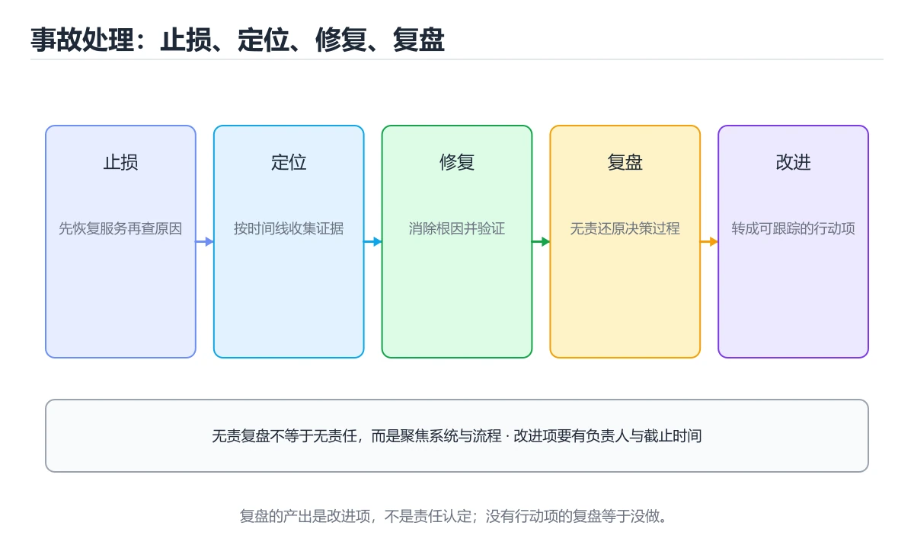
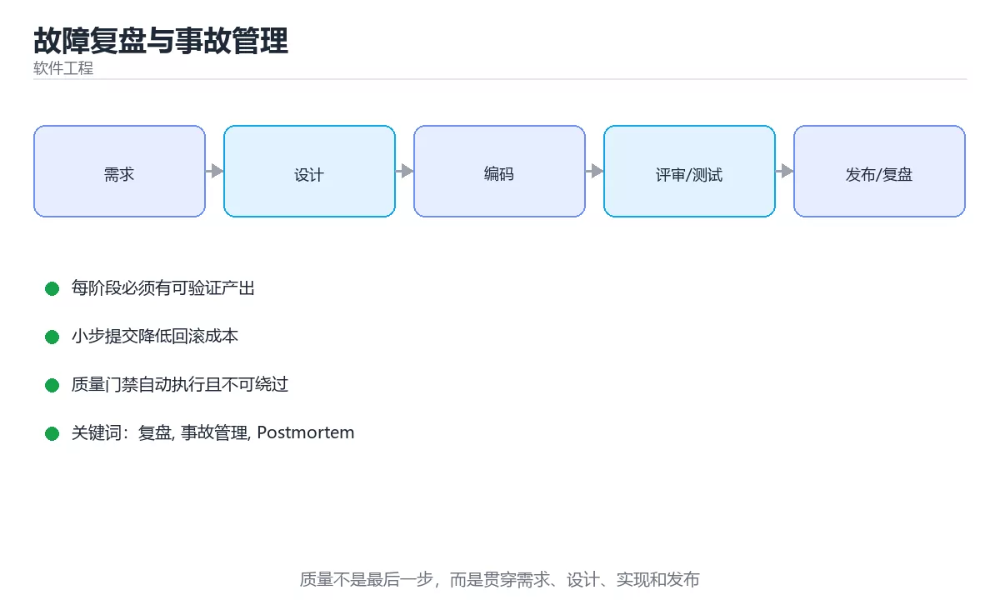

# 故障复盘与事故管理





> 内容更新时间：2026-10-03 · 学习阶段：进阶 · 预计用时：16 分钟

## 学习目标

- 能用自己的话解释「故障复盘与事故管理」解决了什么问题，而不是只背术语。
- 能说清 「复盘」、「事故管理」、「Postmortem」、「时间线」 之间的关系，并分别举出一个例子。
- 能把本课知识放回「软件工程」的知识体系，说明它和相邻主题的边界。
- 能完成本课练习，并用验收标准检查自己的结果。

> 一句话摘要：事故分级、时间线记录、多因归因与改进项闭环。

## 前置知识

- 先完成上一课《技术写作与文档工程》；如果已经掌握，可以直接用本课练习自测。
- 本课阶段：进阶。建议先掌握同一分类的基础课程，并能独立运行正文中的最小示例。
- 开始前先复习：复盘、事故管理、Postmortem。
- 如果某一步看不懂，先记录具体卡点，完成练习后再回头读一遍。


## 事故分级速查

| 级别 | 影响范围 | 响应要求 | 复盘要求 |
| --- | --- | --- | --- |
| P0 | 全站不可用或数据丢失 | 立即全员响应 | 必须复盘，24 小时内出初稿 |
| P1 | 核心功能大面积受影响 | 15 分钟内响应 | 必须复盘 |
| P2 | 部分用户受影响 | 1 小时内响应 | 视情况复盘 |
| P3 | 体验下降、无实质损失 | 工作时间处理 | 记录即可 |

分级的目的是让响应强度与影响匹配，避免小事惊动全员、大事无人牵头。

## 复盘原则速查

| 原则 | 说明 |
| --- | --- |
| 对事不对人 | 目标是改进系统，不是追责个人 |
| 时间线优先 | 先把事实按时间排出来，再讨论原因 |
| 多因归因 | 事故通常是多个条件叠加，避免单一「根本原因」 |
| 关注系统 | 问「为什么这个错误能造成这么大影响」 |
| 可验证结论 | 改进项必须可检查、有负责人与期限 |
| 公开透明 | 报告团队可见，避免同类问题重复发生 |

## 时间线模板

```text
T0    (10:02) 变更发布，监控无异常
T0+3m (10:05) 错误率从 0.1% 升至 4%，告警触发
T0+5m (10:07) 值班同学确认告警并开始排查
T0+12m(10:14) 定位到新版本引入的缓存键冲突
T0+15m(10:17) 决定回滚
T0+20m(10:22) 回滚完成，错误率回落到 0.2%
T0+30m(10:32) 确认数据一致性，事故结束
```

时间线要记录**决策点**（为什么回滚而不是修复）与**信息缺口**（哪段时间没有监控覆盖）。

```python
from dataclasses import dataclass, field
from datetime import datetime, timedelta

@dataclass
class TimelineEvent:
    offset_minutes: int
    description: str
    is_decision: bool = False

@dataclass
class ActionItem:
    description: str
    owner: str
    due_days: int
    category: str                # detect / mitigate / prevent

    def priority(self) -> str:
        return {"detect": "P0", "mitigate": "P1", "prevent": "P2"}.get(self.category, "P2")

@dataclass
class Postmortem:
    title: str
    severity: str
    started_at: datetime
    duration_minutes: int = 0
    events: list = field(default_factory=list)
    actions: list = field(default_factory=list)

    def add_event(self, offset: int, description: str, is_decision: bool = False) -> None:
        self.events.append(TimelineEvent(offset, description, is_decision))

    def add_action(self, description: str, owner: str, due_days: int, category: str) -> None:
        self.actions.append(ActionItem(description, owner, due_days, category))

    def detector_lag(self) -> int:
        """发现时延：从事故发生到告警的时间，衡量监控能力。"""
        for event in sorted(self.events, key=lambda e: e.offset_minutes):
            if "告警" in event.description or "发现" in event.description:
                return event.offset_minutes
        return self.duration_minutes

    def quality_check(self) -> list:
        """复盘质量自检：没有改进项的复盘等于没做。"""
        problems = []
        if len(self.events) < 3:
            problems.append("时间线过于简略")
        if not any(event.is_decision for event in self.events):
            problems.append("未记录关键决策点")
        if not self.actions:
            problems.append("缺少改进项")
        if not any(action.category == "detect" for action in self.actions):
            problems.append("未改进发现能力（监控与告警）")
        return problems

report = Postmortem("缓存键冲突导致错误率上升", "P1", datetime.now(), duration_minutes=30)
report.add_event(3, "错误率升高，告警触发")
report.add_event(12, "定位到缓存键冲突", is_decision=True)
report.add_event(20, "回滚完成，指标恢复")
report.add_action("缓存键加入环境前缀", "张三", 3, "prevent")
print(report.detector_lag(), report.quality_check())
```

## 改进项分类速查

| 类别 | 目标 | 示例 |
| --- | --- | --- |
| 发现（detect） | 更早发现 | 增加关键路径监控、缩短告警延迟 |
| 缓解（mitigate） | 更快恢复 | 一键回滚、限流开关、降级预案 |
| 预防（prevent） | 降低发生概率 | 修复根因、增加测试与校验 |

健康的改进结构应三者都有；只做「预防」而忽略发现与缓解，意味着下次仍会长时间不可用。

## 常见错误对照表

| 容易踩的做法 | 实际现象 | 原因与正确做法 |
| --- | --- | --- |
| 复盘变成追责会 | 信息隐瞒、无人敢报 | 对事不对人，聚焦系统改进 |
| 只写一个「根本原因」 | 同类问题再次发生 | 多因归因，检查为何没被挡住 |
| 改进项没有负责人与期限 | 永远是待办 | 每条改进项有 owner 与截止时间 |
| 只做预防不做发现与缓解 | 下次仍然长时间失血 | 三类改进都要有 |
| 事故期间不记录时间点 | 复盘靠回忆、失真 | 值班时同步记录时间线 |
| 复盘报告不公开 | 其他团队重复踩坑 | 团队可见并归档 |
| 恢复后立刻关闭跟踪 | 改进项烂尾 | 定期回顾改进项完成率 |

## 自测清单

- [ ] 事故分级明确，响应强度与影响匹配。
- [ ] 复盘报告含时间线、决策点与信息缺口。
- [ ] 改进项覆盖发现、缓解、预防三类。
- [ ] 每条改进项有负责人与期限并可跟踪。
- [ ] 复盘对事不对人，报告团队可见。

## 动手练习


> 本课练习重点：围绕「复盘、事故管理、Postmortem」完成复述、实验和交付，每个结果都要能被别人检查。

先写验收标准，再做最小交付，最后用评审、测试或复盘验证。

### 练习 1：建立心智模型（10 分钟）

合上教程，用 3～5 句话回答：

1. 「故障复盘与事故管理」解决了什么问题？
2. 如果没有它，会出现什么具体后果？
3. 它和「事故管理」是什么关系？

**验收标准**：至少出现一个本课关键词，并写出一个反例、边界条件或失效场景。

### 练习 2：做一次可控实验（20 分钟）

从正文中选一个最小示例，完成以下操作：

1. 先预测修改一个参数、输入或步骤后的结果。
2. 再实际执行或逐步推演，记录真实结果。
3. 如果结果与预测不同，写出差异原因。

**验收标准**：留下「原例 → 改动 → 预测 → 结果 → 原因」五步记录。

### 练习 3：交付一个小结果（30 分钟）

为一个真实小功能写一页设计、检查表或评审记录，并让同伴能照着执行。

任务要求：

- 结果必须能被别人检查，不能只写“我已经理解了”。
- 至少覆盖「复盘」和「事故管理」两个关键词。
- 写出 1 个仍然不确定的问题，以及下一步如何验证。

> 提示：时间有限时优先做练习 1 和练习 2；练习 3 可以拆成两次完成。

## 本课小结

- 核心问题：「故障复盘与事故管理」不是孤立术语，而是在「软件工程」中解决一类具体问题。
- 关键关系：先分清「复盘」与「事故管理」的职责，再理解「Postmortem」的适用边界。
- 判断标准：能解释正常场景、边界条件和失败场景，才算真正掌握。
- 下一步：完成练习后，用自己的话写下 3 条要点，再去做本课测验。


## 实践任务

本节围绕“故障复盘与事故管理”安排 3 个可交付任务，每个任务都要求留下可以复查的记录。

### 任务 1：用自己的话画出结构

合上教程，用 5 句话说明“故障复盘与事故管理”解决什么问题、输入是什么、输出是什么、失败时会怎样、与相邻概念的边界在哪里。画一张流程图或状态图，把每个节点标注成“输入 / 处理 / 输出 / 失败路径”之一。

**验收标准**：图里至少有 5 个节点和 1 条失败路径；每个节点都能在正文中找到依据。

### 任务 2：做一次对比实验

从正文里选两个差异最小的方案，列成 4 列表格：方案、前提、代价、适用边界。然后只改变一个条件（数据规模、并发度、精度或资源上限），记录结果变化。

**验收标准**：表格里两个方案的结论不能完全一样；写下“在什么条件下应该换方案”。

### 任务 3：迁移到自己的场景

把“故障复盘与事故管理”的核心方法用到你熟悉的一个真实场景，写出一份 300 字以内的实施记录：目标、步骤、验证方式、仍然不确定的问题。

**验收标准**：至少有一个可复现的命令、代码片段或数据样例；结论能被别人独立检查。


## 故障现场

这一节把“故障复盘与事故管理”最常见的失败方式还原成现场记录，练习时按“症状 → 复现 → 定位 → 修复 → 预防”的顺序排查。

### 现场 1：“故障复盘与事故管理”的 复盘 常规用例通过，但边界用例失败

**症状**：在“故障复盘与事故管理”的练习或生产场景里出现““故障复盘与事故管理”的 复盘 常规用例通过，但边界用例失败”。

**复现**：准备一组最小输入，只保留触发““故障复盘与事故管理”的 复盘 常规用例通过，但边界用例失败”的必要条件，连续运行两次确认结果稳定。

**定位**：围绕“复盘 的前置条件与取值边界没有写进代码，默认值掩盖了空值和极值”检查调用链、输入数据和环境配置，先验证假设再改代码。

**修复**：为“故障复盘与事故管理”补一条空值或极值用例，把前置条件写成断言，并让失败信息直接指出是哪个输入越界

**预防**：把““故障复盘与事故管理”的 复盘 常规用例通过，但边界用例失败”写成一条自动化用例，并在“故障复盘与事故管理”的验收清单里保留对应检查项。


### 现场 2：“故障复盘与事故管理”的 事故管理 结果在两次运行之间不一致

**症状**：在“故障复盘与事故管理”的练习或生产场景里出现““故障复盘与事故管理”的 事故管理 结果在两次运行之间不一致”。

**复现**：准备一组最小输入，只保留触发““故障复盘与事故管理”的 事故管理 结果在两次运行之间不一致”的必要条件，连续运行两次确认结果稳定。

**定位**：围绕“事故管理 依赖了当前版本、执行顺序或共享状态，单次运行无法暴露差异”检查调用链、输入数据和环境配置，先验证假设再改代码。

**修复**：固定“故障复盘与事故管理”使用的版本与随机种子，记录两次运行的完整输入和输出，再逐项消除非确定性来源

**预防**：把““故障复盘与事故管理”的 事故管理 结果在两次运行之间不一致”写成一条自动化用例，并在“故障复盘与事故管理”的验收清单里保留对应检查项。


### 现场 3：需求反复变更，代码越改越难验证

**症状**：在“故障复盘与事故管理”的练习或生产场景里出现“需求反复变更，代码越改越难验证”。

**复现**：准备一组最小输入，只保留触发“需求反复变更，代码越改越难验证”的必要条件，连续运行两次确认结果稳定。

**定位**：围绕“复盘 的接口边界没有写清楚，事故管理 缺少可自动执行的验收条件”检查调用链、输入数据和环境配置，先验证假设再改代码。

**修复**：为“故障复盘与事故管理”补一份最小验收清单，把接口、数据和失败路径写成测试，再开始重构

**预防**：把“需求反复变更，代码越改越难验证”写成一条自动化用例，并在“故障复盘与事故管理”的验收清单里保留对应检查项。


## 深入补充：故障复盘与事故管理 的取舍与边界

### 一、把概念放回真实约束

学习“故障复盘与事故管理”时，最容易只记住结论而忽略前提。先写出三个约束：数据规模、时间预算、可接受的失败方式；再判断 复盘 与 事故管理 在这些约束下是否仍然成立。只要约束改变，原来的最优解就可能变成错误解。

| 做法 | 适用规模 | 成本 | 主要风险 |
| --- | --- | --- | --- |
| 先写测试再改 | 任何规模 | 前期较慢 | 测试本身失真 |
| 小步提交与评审 | 多人协作 | 评审开销 | 批次过大 |
| 自动化质量门禁 | 持续交付 | 维护流水线 | 门禁形同虚设 |

### 二、三个容易混淆的边界

1. **把“能跑”当成“正确”**：故障复盘与事故管理 的示例通过，只说明这条输入路径可用；还要用空值、极值和并发路径验证。
2. **把“平均值”当成“全部”**：复盘 的指标好看，不代表尾部请求、冷启动或失败重试也好看。
3. **把“当前版本”当成“永久行为”**：事故管理 依赖的默认值、API 或性能特征都可能随版本变化，需要固定版本并保留回归用例。

### 三、一个生产场景

假设团队要在真实系统里使用“故障复盘与事故管理”：第一周先做小流量验证，记录 复盘 的基线与异常；第二周扩大输入规模，观察 事故管理 是否成为瓶颈；第三周再做故障演练，主动注入超时、重复请求和依赖不可用，确认系统能降级、能重试、能恢复。每一步都要留下指标、日志和结论，而不是只留下“感觉更快了”。

### 四、自测清单

- 能否用一句话说出“故障复盘与事故管理”解决的核心问题与不适用场景？
- 能否画出 复盘 的数据流或状态变化，并标出失败路径？
- 能否给出一个反例，证明某个看似合理的结论在边界条件下不成立？
- 能否写出一条可复现的验证命令，让别人独立得到相同结论？


## 考点精讲：把测验题还原成判断过程

本课有 6 个判断点。先自己作答，再看「判断依据」；如果结论正确但理由不完整，回到正文对应章节补足概念。

### 考点 1：复盘的核心原则是？

- **正确判断**：对事不对人，聚焦系统改进
- **判断依据**：正确答案是「对事不对人，聚焦系统改进」，本课在「时间线模板」中说明：时间线要记录决策点（为什么回滚而不是修复）与信息缺口（哪段时间没有监控覆盖）。追责会导致隐瞒信息，只有把注意力放在系统与流程上，才能拿到真实时间线与改进点。本课还在「改进项分类速查」中说明：只做「预防」而忽略发现与缓解，意味着下次仍会长时间不可用。
- **迁移检查**：遮住选项，只根据定义复述一次答案，再回来看哪个选项与复述一致。

### 考点 2：健康的事故改进项应该覆盖？

- **正确判断**：发现、缓解、预防三类都要有
- **判断依据**：正确答案是「发现、缓解、预防三类都要有」，本课在「时间线模板」中说明：时间线要记录决策点（为什么回滚而不是修复）与信息缺口（哪段时间没有监控覆盖）。预防降低发生概率，发现缩短感知时间，缓解缩短恢复时间，三者缺一都会让下次事故影响更大。本课还在「改进项分类速查」中说明：只做「预防」而忽略发现与缓解，意味着下次仍会长时间不可用。
- **迁移检查**：把题干里的一个条件换成边界值，原来的结论还成立吗？写出判断过程。

### 考点 3：时间线里特别需要记录的是什么？

- **正确判断**：关键决策点与信息缺口
- **判断依据**：正确答案是「关键决策点与信息缺口」，这道题在问时间线里特别需要记录的是什么，判断时要把题干限定的输入、边界与目标逐项对齐。记录「为什么当时选择回滚而不是修复」以及「哪段时间没有监控覆盖」，才能定位流程与观测能力的短板。课程摘要指出事故分级，时间线记录，多因归因与改进项闭环，本课要判断的正是时间线里特别需要记录的是什么。
- **迁移检查**：如果给某个错误选项去掉一个限定词，它会不会变成正确？说明理由。

### 考点 4：为什么复盘不推荐只写一个「根本原因」？

- **正确判断**：因为事故通常是多个条件叠加
- **判断依据**：正确答案是「因为事故通常是多个条件叠加」，这道题在问为什么复盘不推荐只写一个根本原因，判断时要把题干限定的输入、边界与目标逐项对齐。事故多由技术缺陷、流程缺失与观测不足共同导致，只写一个原因会导致防线没有补全。课程摘要指出事故分级，时间线记录，多因归因与改进项闭环，本课要判断的正是为什么复盘不推荐只写一个根本原因。
- **迁移检查**：把题干里的一个条件换成边界值，原来的结论还成立吗？写出判断过程。

### 考点 5：改进项要能落地，必须有？

- **正确判断**：负责人与截止时间
- **判断依据**：正确答案是「负责人与截止时间」，这道题在问改进项要能落地，必须有，判断时要把题干限定的输入、边界与目标逐项对齐。没有 owner 与期限的改进项等同于没有改进项，需要纳入常规跟踪并定期回顾完成率。课程摘要指出事故分级，时间线记录，多因归因与改进项闭环，本课要判断的正是改进项要能落地，必须有。
- **迁移检查**：把题干里的一个条件换成边界值，原来的结论还成立吗？写出判断过程。

### 考点 6：补全代码：「故障复盘与事故管理」示例中，下面这行代码缺少哪个关键字或函数名？请填入 ____。 `report = ____("缓存键冲突导致错误率上升", "P1", datetime.now(), duration_minutes=30)`

- **正确判断**：Postmortem / postmortem
- **判断依据**：正确答案是「Postmortem」，这道题在问补全代码：故障复盘与事故管理示例中，下面这行代码缺少…uration_minutes=30)`，判断时要把题干限定的输入、边界与目标逐项对齐。本课示例中还能看到 `class Postmortem:` 这样的用法，说明该关键字在本课代码中承担实际功能。
- **迁移检查**：不看题干，用自己的话补全这句话，再与标准答案对照。

### 补充自测（2 题）

1. 围绕“故障复盘与事故管理”中的 复盘、事故管理、Postmortem，下列哪两项是本课强调的实践判断？
2. 下面这段 Python 代码复现了“故障复盘与事故管理”中 复盘、事故管理、Postmortem 相关的一个常见故障，哪一项最准确地解释了问题？

这些题按“先定位概念、再排除边界错误、最后核对答案”的顺序作答；每题解析都给出了判断依据。


## 本课复习清单

离开本课前，逐项确认：

- [ ] 不看解析，能说出「复盘的核心原则是？」的判断依据。
- [ ] 不看解析，能说出「健康的事故改进项应该覆盖？」的判断依据。
- [ ] 不看解析，能说出「时间线里特别需要记录的是什么？」的判断依据。
- [ ] 不看解析，能说出「为什么复盘不推荐只写一个「根本原因」？」的判断依据。
- [ ] 不看解析，能说出「改进项要能落地，必须有？」的判断依据。
- [ ] 不看解析，能说出「补全代码：「故障复盘与事故管理」示例中，下面这行代码缺少哪个关键字或函数名？请填…」的判断依据。
- [ ] 至少运行一次本课示例，记录输入、输出和一个边界情况。
- [ ] 把本课最容易混淆的两个概念写成一句话对照。

| 复盘项 | 记录 |
| --- | --- |
| 已经能独立解释的考点 |  |
| 仍然说不清的概念 |  |
| 下一步验证动作 |  |

## 术语速查

把本课反复出现的术语集中放在一起。复习时先遮住右列，尝试用自己的话解释，再回到正文核对。

| 术语 | 本课语境 |
| --- | --- |
| `，判断时要把题干限定的输入、边界与目标逐项对齐。本课示例中还能看到` | 判断依据**：正确答案是「Postmortem」，这道题在问补全代码：故障复盘与事故管理示例中，下面这行代码缺少…uration_minutes=30)`，判断时要把题干限定的输入、边界与目标逐项对齐。本课示例中还能看到… |
| `复盘` | 本课围绕该主题展开，结合正文与代码示例理解它的适用边界。 |
| `事故管理` | 本课围绕该主题展开，结合正文与代码示例理解它的适用边界。 |
| `Postmortem` | 本课围绕该主题展开，结合正文与代码示例理解它的适用边界。 |
| `时间线` | 本课围绕该主题展开，结合正文与代码示例理解它的适用边界。 |
| `改进项` | 本课围绕该主题展开，结合正文与代码示例理解它的适用边界。 |
| `SLO` | 本课围绕该主题展开，结合正文与代码示例理解它的适用边界。 |

## 面试问答与自测

下面把本课考点换成面试追问。先口述自己的答案，
再对照参考回答检查是否遗漏了前提、边界或失败路径。

### 追问 1：复盘的核心原则是？

**参考回答**：正确答案是「对事不对人，聚焦系统改进」，本课在「时间线模板」中说明：时间线要记录决策点（为什么回滚而不是修复）与信息缺口（哪段时间没有监控覆盖）。追责会导致隐瞒信息，只有把注意力放在系统与流程上，才能拿到真实时间线与改进点。本课还在「改进项分类速查」中说明：只做「预防」而忽略发现与缓解，意味着下次仍会长时间不可用。

### 追问 2：健康的事故改进项应该覆盖？

**参考回答**：正确答案是「发现、缓解、预防三类都要有」，本课在「时间线模板」中说明：时间线要记录决策点（为什么回滚而不是修复）与信息缺口（哪段时间没有监控覆盖）。预防降低发生概率，发现缩短感知时间，缓解缩短恢复时间，三者缺一都会让下次事故影响更大。本课还在「改进项分类速查」中说明：只做「预防」而忽略发现与缓解，意味着下次仍会长时间不可用。

### 追问 3：时间线里特别需要记录的是什么？

**参考回答**：正确答案是「关键决策点与信息缺口」，这道题在问时间线里特别需要记录的是什么，判断时要把题干限定的输入、边界与目标逐项对齐。记录「为什么当时选择回滚而不是修复」以及「哪段时间没有监控覆盖」，才能定位流程与观测能力的短板。课程摘要指出事故分级，时间线记录，多因归因与改进项闭环，本课要判断的正是时间线里特别需要记录的是什么。

### 追问 4：为什么复盘不推荐只写一个「根本原因」？

**参考回答**：正确答案是「因为事故通常是多个条件叠加」，这道题在问为什么复盘不推荐只写一个根本原因，判断时要把题干限定的输入、边界与目标逐项对齐。事故多由技术缺陷、流程缺失与观测不足共同导致，只写一个原因会导致防线没有补全。课程摘要指出事故分级，时间线记录，多因归因与改进项闭环，本课要判断的正是为什么复盘不推荐只写一个根本原因。

### 追问 5：改进项要能落地，必须有？

**参考回答**：正确答案是「负责人与截止时间」，这道题在问改进项要能落地，必须有，判断时要把题干限定的输入、边界与目标逐项对齐。没有 owner 与期限的改进项等同于没有改进项，需要纳入常规跟踪并定期回顾完成率。课程摘要指出事故分级，时间线记录，多因归因与改进项闭环，本课要判断的正是改进项要能落地，必须有。

<!-- p0-depth-v2:start -->
## 零基础精讲：把「故障复盘与事故管理」真正讲透

### 先建立一个直觉

把软件工程看成降低变更成本：用需求、接口、测试、评审和监控把不确定性逐步收敛，而不是一次写出完美代码。

本课的摘要可以当作一张地图：事故分级、时间线记录、多因归因与改进项闭环。

阅读时不要只记结论，先问三个问题：它解决什么问题？依赖哪些前提？在什么条件下会失效？

### 逐步拆解

1. 识别输入。先写清数据类型、取值范围、空值策略，以及输入来自用户、文件还是另一个服务。
2. 描述处理过程。把「复盘、事故管理、Postmortem、时间线、改进项、SLO」映射到具体步骤，每步都要求能单独验证。
3. 定义输出。输出不仅包括正常结果，还包括错误码、日志、指标和资源释放状态。
4. 找出一条失败路径。让错误尽早暴露，并说明重试、降级、回滚或人工处理的边界。
5. 用一个小例子贯穿全过程。先手算或预测结果，再运行代码或实验，最后解释差异。

### 把正文串成一条执行链

- **练习 1：建立心智模型（10 分钟）**：练习 1：建立心智模型（10 分钟）
- **练习 2：做一次可控实验（20 分钟）**：练习 2：做一次可控实验（20 分钟）
- **练习 3：交付一个小结果（30 分钟）**：练习 3：交付一个小结果（30 分钟）
- **考点 1：复盘的核心原则是？**：考点 1：复盘的核心原则是
- **考点 2：健康的事故改进项应该覆盖？**：考点 2：健康的事故改进项应该覆盖
- **考点 3：时间线里特别需要记录的是什么？**：考点 3：时间线里特别需要记录的是什么

### 从测验反推易错点

**检查点 1：复盘的核心原则是？**

- 参考判断：对事不对人，聚焦系统改进
- 解析：正确答案是「对事不对人，聚焦系统改进」，本课在「时间线模板」中说明：时间线要记录决策点（为什么回滚而不是修复）与信息缺口（哪段时间没有监控覆盖）。追责会导致隐瞒信息，只有把注意力放在系统与流程上，才能拿到真实时间线与改进点。本课还在「改进项分类速查」中说明：只做「预防」而忽略发现与缓解，意味着下次仍会长时间不可用。
- 自问：如果去掉题干里的一个限定词，结论还成立吗？

**检查点 2：健康的事故改进项应该覆盖？**

- 参考判断：发现、缓解、预防三类都要有
- 解析：正确答案是「发现、缓解、预防三类都要有」，本课在「时间线模板」中说明：时间线要记录决策点（为什么回滚而不是修复）与信息缺口（哪段时间没有监控覆盖）。预防降低发生概率，发现缩短感知时间，缓解缩短恢复时间，三者缺一都会让下次事故影响更大。本课还在「改进项分类速查」中说明：只做「预防」而忽略发现与缓解，意味着下次仍会长时间不可用。
- 自问：如果去掉题干里的一个限定词，结论还成立吗？

**检查点 3：时间线里特别需要记录的是什么？**

- 参考判断：关键决策点与信息缺口
- 解析：正确答案是「关键决策点与信息缺口」，这道题在问时间线里特别需要记录的是什么，判断时要把题干限定的输入、边界与目标逐项对齐。记录「为什么当时选择回滚而不是修复」以及「哪段时间没有监控覆盖」，才能定位流程与观测能力的短板。课程摘要指出事故分级，时间线记录，多因归因与改进项闭环，本课要判断的正是时间线里特别需要记录的是什么。
- 自问：如果去掉题干里的一个限定词，结论还成立吗？

**检查点 4：为什么复盘不推荐只写一个「根本原因」？**

- 参考判断：因为事故通常是多个条件叠加
- 解析：正确答案是「因为事故通常是多个条件叠加」，这道题在问为什么复盘不推荐只写一个根本原因，判断时要把题干限定的输入、边界与目标逐项对齐。事故多由技术缺陷、流程缺失与观测不足共同导致，只写一个原因会导致防线没有补全。课程摘要指出事故分级，时间线记录，多因归因与改进项闭环，本课要判断的正是为什么复盘不推荐只写一个根本原因。
- 自问：如果去掉题干里的一个限定词，结论还成立吗？

**检查点 5：改进项要能落地，必须有？**

- 参考判断：负责人与截止时间
- 解析：正确答案是「负责人与截止时间」，这道题在问改进项要能落地，必须有，判断时要把题干限定的输入、边界与目标逐项对齐。没有 owner 与期限的改进项等同于没有改进项，需要纳入常规跟踪并定期回顾完成率。课程摘要指出事故分级，时间线记录，多因归因与改进项闭环，本课要判断的正是改进项要能落地，必须有。
- 自问：如果去掉题干里的一个限定词，结论还成立吗？

### 工程排错顺序

| 先查什么 | 要得到的证据 | 判断标准 |
| --- | --- | --- |
| 输入与前提是否满足 | 日志、输入样例、测试或指标 | 能复现并解释，才算定位 |
| 核心步骤是否产生了预期中间结果 | 日志、输入样例、测试或指标 | 能复现并解释，才算定位 |
| 失败路径是否可观测、可恢复 | 日志、输入样例、测试或指标 | 能复现并解释，才算定位 |
| 资源、权限与成本是否在预算内 | 日志、输入样例、测试或指标 | 能复现并解释，才算定位 |

排查顺序应遵循「先复现、再缩小范围、再验证假设、最后修改」。不要同时改多个变量，否则即使问题消失，也无法知道真正原因。

### 变式训练

1. 把它放进一个只有单机、没有额外依赖的小项目，先保证正确，再考虑扩展。
2. 把输入规模扩大十倍，记录时间、内存和失败路径，找出第一个真正瓶颈。
3. 制造一次依赖超时或错误输入，要求系统给出可解释错误并且不留下半完成状态。
4. 让另一个同学只读接口说明和测试用例，复现你的结论；无法复现的部分继续补文档或测试。
5. 删掉一个看似必要的步骤，观察哪个测试或指标先失败，用证据说明它为什么必要。
6. 把方案切换到低资源设备，重新评估默认参数、超时和降级策略。

每道变式都写下：预测、实际结果、差异、下一步。没有留下证据的练习，很难迁移到真实项目。

### 本课自测

- [ ] 能用一句话解释「复盘」在本课中的角色与边界。
- [ ] 能举出一个正常例子和一个失败例子。
- [ ] 能说出最小验证步骤，以及需要记录的证据。
- [ ] 能用一句话解释「事故管理」在本课中的角色与边界。
- [ ] 能举出一个正常例子和一个失败例子。
- [ ] 能说出最小验证步骤，以及需要记录的证据。
- [ ] 能用一句话解释「Postmortem」在本课中的角色与边界。
- [ ] 能举出一个正常例子和一个失败例子。
- [ ] 能说出最小验证步骤，以及需要记录的证据。
- [ ] 能用一句话解释「时间线」在本课中的角色与边界。
- [ ] 能举出一个正常例子和一个失败例子。
- [ ] 能说出最小验证步骤，以及需要记录的证据。
- [ ] 能用一句话解释「改进项」在本课中的角色与边界。
- [ ] 能举出一个正常例子和一个失败例子。
- [ ] 能说出最小验证步骤，以及需要记录的证据。

### 迁移案例库

下面用不同约束重复同一套方法。每完成一轮，都把结论写进笔记，并只改变一个变量。

#### 迁移案例 1：围绕「复盘」做一次小实验

**目标**：在不改变课程主体的前提下，验证「故障复盘与事故管理」中的一个关键判断。

**步骤**：
1. 复述当前方案对「复盘」的假设，写成一句可证伪的话。
2. 设计一个正常输入和一个边界输入，分别预测输出。
3. 运行或逐步演算，记录实际输出、耗时和失败信息。
4. 只调整一个参数，比较前后差异并解释原因。
5. 补充一条测试或复习卡，确保下次能更快复现。

**验收**：结论有证据、差异可解释、失败可恢复；如果做不到，说明还需要缩小问题范围。

#### 迁移案例 2：围绕「事故管理」做一次小实验

**目标**：在不改变课程主体的前提下，验证「故障复盘与事故管理」中的一个关键判断。

**步骤**：
1. 复述当前方案对「事故管理」的假设，写成一句可证伪的话。
2. 设计一个正常输入和一个边界输入，分别预测输出。
3. 运行或逐步演算，记录实际输出、耗时和失败信息。
4. 只调整一个参数，比较前后差异并解释原因。
5. 补充一条测试或复习卡，确保下次能更快复现。

**验收**：结论有证据、差异可解释、失败可恢复；如果做不到，说明还需要缩小问题范围。

#### 迁移案例 3：围绕「Postmortem」做一次小实验

**目标**：在不改变课程主体的前提下，验证「故障复盘与事故管理」中的一个关键判断。

**步骤**：
1. 复述当前方案对「Postmortem」的假设，写成一句可证伪的话。
2. 设计一个正常输入和一个边界输入，分别预测输出。
3. 运行或逐步演算，记录实际输出、耗时和失败信息。
4. 只调整一个参数，比较前后差异并解释原因。
5. 补充一条测试或复习卡，确保下次能更快复现。

**验收**：结论有证据、差异可解释、失败可恢复；如果做不到，说明还需要缩小问题范围。

#### 迁移案例 4：围绕「时间线」做一次小实验

**目标**：在不改变课程主体的前提下，验证「故障复盘与事故管理」中的一个关键判断。

**步骤**：
1. 复述当前方案对「时间线」的假设，写成一句可证伪的话。
2. 设计一个正常输入和一个边界输入，分别预测输出。
3. 运行或逐步演算，记录实际输出、耗时和失败信息。
4. 只调整一个参数，比较前后差异并解释原因。
5. 补充一条测试或复习卡，确保下次能更快复现。

**验收**：结论有证据、差异可解释、失败可恢复；如果做不到，说明还需要缩小问题范围。

#### 迁移案例 5：围绕「改进项」做一次小实验

**目标**：在不改变课程主体的前提下，验证「故障复盘与事故管理」中的一个关键判断。

**步骤**：
1. 复述当前方案对「改进项」的假设，写成一句可证伪的话。
2. 设计一个正常输入和一个边界输入，分别预测输出。
3. 运行或逐步演算，记录实际输出、耗时和失败信息。
4. 只调整一个参数，比较前后差异并解释原因。
5. 补充一条测试或复习卡，确保下次能更快复现。

**验收**：结论有证据、差异可解释、失败可恢复；如果做不到，说明还需要缩小问题范围。

#### 迁移案例 6：围绕「SLO」做一次小实验

**目标**：在不改变课程主体的前提下，验证「故障复盘与事故管理」中的一个关键判断。

**步骤**：
1. 复述当前方案对「SLO」的假设，写成一句可证伪的话。
2. 设计一个正常输入和一个边界输入，分别预测输出。
3. 运行或逐步演算，记录实际输出、耗时和失败信息。
4. 只调整一个参数，比较前后差异并解释原因。
5. 补充一条测试或复习卡，确保下次能更快复现。

**验收**：结论有证据、差异可解释、失败可恢复；如果做不到，说明还需要缩小问题范围。

#### 迁移案例 7：围绕「复盘」做一次小实验

**目标**：在不改变课程主体的前提下，验证「故障复盘与事故管理」中的一个关键判断。

**步骤**：
1. 复述当前方案对「复盘」的假设，写成一句可证伪的话。
2. 设计一个正常输入和一个边界输入，分别预测输出。
3. 运行或逐步演算，记录实际输出、耗时和失败信息。
4. 只调整一个参数，比较前后差异并解释原因。
5. 补充一条测试或复习卡，确保下次能更快复现。

**验收**：结论有证据、差异可解释、失败可恢复；如果做不到，说明还需要缩小问题范围。

#### 迁移案例 8：围绕「事故管理」做一次小实验

**目标**：在不改变课程主体的前提下，验证「故障复盘与事故管理」中的一个关键判断。

**步骤**：
1. 复述当前方案对「事故管理」的假设，写成一句可证伪的话。
2. 设计一个正常输入和一个边界输入，分别预测输出。
3. 运行或逐步演算，记录实际输出、耗时和失败信息。
4. 只调整一个参数，比较前后差异并解释原因。
5. 补充一条测试或复习卡，确保下次能更快复现。

**验收**：结论有证据、差异可解释、失败可恢复；如果做不到，说明还需要缩小问题范围。

#### 迁移案例 9：围绕「Postmortem」做一次小实验

**目标**：在不改变课程主体的前提下，验证「故障复盘与事故管理」中的一个关键判断。

**步骤**：
1. 复述当前方案对「Postmortem」的假设，写成一句可证伪的话。
2. 设计一个正常输入和一个边界输入，分别预测输出。
3. 运行或逐步演算，记录实际输出、耗时和失败信息。
4. 只调整一个参数，比较前后差异并解释原因。
5. 补充一条测试或复习卡，确保下次能更快复现。

**验收**：结论有证据、差异可解释、失败可恢复；如果做不到，说明还需要缩小问题范围。

#### 迁移案例 10：围绕「时间线」做一次小实验

**目标**：在不改变课程主体的前提下，验证「故障复盘与事故管理」中的一个关键判断。

**步骤**：
1. 复述当前方案对「时间线」的假设，写成一句可证伪的话。
2. 设计一个正常输入和一个边界输入，分别预测输出。
3. 运行或逐步演算，记录实际输出、耗时和失败信息。
4. 只调整一个参数，比较前后差异并解释原因。
5. 补充一条测试或复习卡，确保下次能更快复现。

**验收**：结论有证据、差异可解释、失败可恢复；如果做不到，说明还需要缩小问题范围。

#### 迁移案例 11：围绕「改进项」做一次小实验

**目标**：在不改变课程主体的前提下，验证「故障复盘与事故管理」中的一个关键判断。

**步骤**：
1. 复述当前方案对「改进项」的假设，写成一句可证伪的话。
2. 设计一个正常输入和一个边界输入，分别预测输出。
3. 运行或逐步演算，记录实际输出、耗时和失败信息。
4. 只调整一个参数，比较前后差异并解释原因。
5. 补充一条测试或复习卡，确保下次能更快复现。

**验收**：结论有证据、差异可解释、失败可恢复；如果做不到，说明还需要缩小问题范围。

#### 迁移案例 12：围绕「SLO」做一次小实验

**目标**：在不改变课程主体的前提下，验证「故障复盘与事故管理」中的一个关键判断。

**步骤**：
1. 复述当前方案对「SLO」的假设，写成一句可证伪的话。
2. 设计一个正常输入和一个边界输入，分别预测输出。
3. 运行或逐步演算，记录实际输出、耗时和失败信息。
4. 只调整一个参数，比较前后差异并解释原因。
5. 补充一条测试或复习卡，确保下次能更快复现。

**验收**：结论有证据、差异可解释、失败可恢复；如果做不到，说明还需要缩小问题范围。

#### 迁移案例 13：围绕「复盘」做一次小实验

**目标**：在不改变课程主体的前提下，验证「故障复盘与事故管理」中的一个关键判断。

**步骤**：
1. 复述当前方案对「复盘」的假设，写成一句可证伪的话。
2. 设计一个正常输入和一个边界输入，分别预测输出。
3. 运行或逐步演算，记录实际输出、耗时和失败信息。
4. 只调整一个参数，比较前后差异并解释原因。
5. 补充一条测试或复习卡，确保下次能更快复现。

**验收**：结论有证据、差异可解释、失败可恢复；如果做不到，说明还需要缩小问题范围。

#### 迁移案例 14：围绕「事故管理」做一次小实验

**目标**：在不改变课程主体的前提下，验证「故障复盘与事故管理」中的一个关键判断。

**步骤**：
1. 复述当前方案对「事故管理」的假设，写成一句可证伪的话。
2. 设计一个正常输入和一个边界输入，分别预测输出。
3. 运行或逐步演算，记录实际输出、耗时和失败信息。
4. 只调整一个参数，比较前后差异并解释原因。
5. 补充一条测试或复习卡，确保下次能更快复现。

**验收**：结论有证据、差异可解释、失败可恢复；如果做不到，说明还需要缩小问题范围。

#### 迁移案例 15：围绕「Postmortem」做一次小实验

**目标**：在不改变课程主体的前提下，验证「故障复盘与事故管理」中的一个关键判断。

**步骤**：
1. 复述当前方案对「Postmortem」的假设，写成一句可证伪的话。
2. 设计一个正常输入和一个边界输入，分别预测输出。
3. 运行或逐步演算，记录实际输出、耗时和失败信息。
4. 只调整一个参数，比较前后差异并解释原因。
5. 补充一条测试或复习卡，确保下次能更快复现。

**验收**：结论有证据、差异可解释、失败可恢复；如果做不到，说明还需要缩小问题范围。

#### 迁移案例 16：围绕「时间线」做一次小实验

**目标**：在不改变课程主体的前提下，验证「故障复盘与事故管理」中的一个关键判断。

**步骤**：
1. 复述当前方案对「时间线」的假设，写成一句可证伪的话。
2. 设计一个正常输入和一个边界输入，分别预测输出。
3. 运行或逐步演算，记录实际输出、耗时和失败信息。
4. 只调整一个参数，比较前后差异并解释原因。
5. 补充一条测试或复习卡，确保下次能更快复现。

**验收**：结论有证据、差异可解释、失败可恢复；如果做不到，说明还需要缩小问题范围。

<!-- p0-depth-v2:end -->

## English Overview

**Title:** Postmortem & Incident Management

**Summary:** Severity levels, timelines, blameless analysis and action items.

**Category:** Software Engineering  
**Level:** 进阶  
**Key terms:** 复盘, 事故管理, Postmortem, 时间线, 改进项, SLO

> The full tutorial is written in Chinese. This bilingual overview helps English readers identify the topic, scope and key terms before studying the detailed examples.

## 内容元数据

- 内容版本：v2.0
- 最后更新：2026-10-03
- 学习阶段：进阶
- 适用环境：通用软件工程实践
- 内容来源：内置结构化课程与工程实践整理
- 相关主题：复盘、事故管理、Postmortem、时间线、改进项、SLO
- 质量版本：P0 测验标准 + P1 覆盖扩展 + P2 体验补全


## 参考资料与复核

- 最后复核：2026-10-04
- 下次复核：2027-04-04
- 复核范围：版本兼容、API 行为、安全建议与工程实践
- 来源性质：官方文档与标准；本课正文为离线教学重组，不复制原文

| 参考资料 | 本课用途 |
| --- | --- |
| [Martin Fowler](https://martinfowler.com/) | 架构、重构与持续交付 |
| [Google SWE Book Resources](https://abseil.io/resources/swe-book) | 代码评审与工程规范 |

> 本课主题：事故分级、时间线记录、多因归因与改进项闭环。

> App 完全离线展示文字链接，不会自动联网；需要延伸阅读时可复制链接到浏览器。
