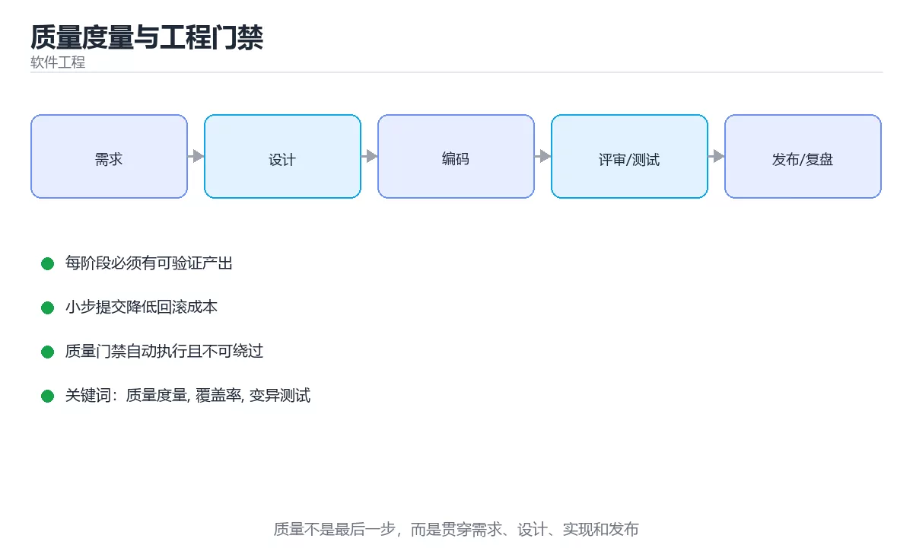

# 质量度量与工程门禁



> 内容更新时间：2026-10-03 · 学习阶段：基础 · 预计用时：15 分钟

## 学习目标

- 能用自己的话解释「质量度量与工程门禁」解决了什么问题，而不是只背术语。
- 能说清 「质量度量」、「覆盖率」、「变异测试」、「门禁」 之间的关系，并分别举出一个例子。
- 能把本课知识放回「软件工程」的知识体系，说明它和相邻主题的边界。
- 能完成本课练习，并用验收标准检查自己的结果。

> 一句话摘要：覆盖率与变异测试、缺陷指标、CI 门禁与度量文化。

## 前置知识

- 先完成上一课《TDD 与重构》；如果已经掌握，可以直接用本课练习自测。
- 本课阶段：基础。建议会读写简单代码或命令，并理解变量、输入输出等基本概念。
- 开始前先复习：质量度量、覆盖率、变异测试。
- 如果某一步看不懂，先记录具体卡点，完成练习后再回头读一遍。


## 该度量什么

| 维度 | 指标 | 说明 |
| --- | --- | --- |
| 测试有效性 | 分支覆盖率、变异测试存活率 | 覆盖率看广度，变异测试看断言强度 |
| 缺陷 | 缺陷密度、逃逸率、平均修复时长 | 逃逸到生产的缺陷最有价值 |
| 变更质量 | 变更失败率、回滚率 | 反映发布流程成熟度 |
| 性能 | P95/P99 延迟、错误率 | 用户体验的直接体现 |
| 维护性 | 圈复杂度、重复率、依赖更新滞后 | 影响长期迭代成本 |

只看覆盖率会误导：**没有断言的测试也能拉高覆盖率**。建议把"变异测试存活率"和"生产逃逸缺陷数"作为主要参考。

## 质量门禁

在 CI 中设置硬门槛，未达标即阻断合并：

1. lint 与类型检查零错误。
2. 单元测试全通过，分支覆盖率不低于基线（如 70%）。
3. 高危依赖漏洞为 0（SCA 扫描）。
4. 构建产物体积不超过阈值（前端）。
5. 关键接口性能回归不超过基线 10%。

门禁要**可解释、可修复**：失败信息要指出具体文件与原因，否则团队会用 `--force` 绕过。

## 度量文化

度量用于改进而不是考核个人：把缺陷数与个人绩效绑定，只会导致隐瞒与数据造假。推荐做法是**按团队与流程维度观察趋势**，并在复盘中定位系统性原因（缺失用例、评审不足、环境差异）。

## 常见坑

1. 用代码行数、提交数衡量产出。
2. 覆盖率作为唯一目标，导致写"凑数测试"。
3. 门禁太严又不给修复时间，最终被整体绕过。
4. 只看平均值，忽略 P95/P99 与长尾。

## 门禁配置与指标看板

**CI 门禁清单**（可直接对照实现）：

| 检查 | 阈值建议 | 失败处理 |
| --- | --- | --- |
| 格式与 lint | 零错误 | 阻断合并，本地一键修复 |
| 类型检查 | 零错误 | 阻断合并 |
| 单元测试 | 全通过 | 阻断合并 |
| 分支覆盖率 | 不低于基线（如 70%，允许小幅波动） | 提示但不一定阻断 |
| 高危依赖漏洞 | 0 | 阻断合并，要求升级或说明豁免 |
| 构建产物体积 | 不超过基线 5%~10% | 提示，超阈值阻断 |
| 关键接口性能 | 回归不超过基线 10% | 阻断发布，人工复核 |

**指标看板建议分四块**：交付（发布频率、从提交到上线时长）、质量（逃逸缺陷数、缺陷修复时长）、稳定性（错误率、P95 延迟、可用性）、效率（CI 平均时长、构建失败率）。看板目的是让问题可见，**不是给人排名**。

落地顺序建议：先上 lint + 测试 + 类型检查（投入小、收益立竿见影），再加覆盖率与漏洞扫描，最后才做性能回归门禁（需要稳定的压测环境）。

## 指标从哪来与落地节奏

| 指标 | 数据来源 | 采集方式 |
| --- | --- | --- |
| CI 时长、构建失败率 | CI 平台 API | 每日定时抓取，存入看板 |
| 覆盖率、变异存活率 | 测试框架报告（如 JaCoCo、coverage.py、PIT） | CI 产物上传后解析 |
| 逃逸缺陷数 | 缺陷管理系统（Jira 等）的"生产环境"标签 | 按周统计并与发布版本关联 |
| P95 延迟、错误率 | APM 或 Prometheus | 直接读监控数据源 |
| 依赖漏洞 | SCA 扫描器（Dependabot/Snyk） | CI 每次运行并记录趋势 |

**落地节奏建议**：第一阶段只做"可见"（把 CI 时长、测试通过率、覆盖率画到一块看板上）；第二阶段做"有门禁"（lint/测试/类型检查阻断合并）；第三阶段才做"能驱动改进"（把逃逸缺陷与用例设计挂钩，用数据决定质量投入方向）。**跳过前两个阶段直接上复杂度量，通常会被团队抵制而失败。**

## 本课小结
质量度量服务于**减少生产缺陷与加速交付**：用少量稳定指标看趋势，用门禁守住底线，用复盘改进流程。


## 常用质量指标速查

| 指标 | 含义 | 使用注意 |
| --- | --- | --- |
| 测试覆盖率 | 被测试执行的代码比例 | 需结合断言质量与变异测试 |
| 变异测试得分 | 故意注入缺陷被测试发现的比例 | 衡量测试有效性 |
| 缺陷逃逸率 | 上线后发现、本应被拦住的缺陷比例 | 衡量测试与评审效果 |
| 平均修复时间（MTTR） | 从发现到恢复的时长 | 反映响应能力 |
| 变更失败率 | 发布导致故障的比例 | 衡量发布质量 |
| 部署频率 | 单位时间发布次数 | 反映交付能力 |
| 领先时间 | 从提交到上线的时长 | 反映流程效率 |

注意：**度量用于改进流程，不用于考核个人**，否则会导致数据造假与隐瞒。

## CI 门禁速查

| 门禁 | 建议阈值 |
| --- | --- |
| 单元测试 | 全部通过 |
| 静态检查 | 无 error 级问题 |
| 类型检查 | 通过 |
| 依赖漏洞 | 高危为 0 |
| 密钥扫描 | 无命中 |
| 覆盖率 | 不低于基线（不强制 100%） |
| 端到端冒烟 | 核心路径通过 |
| 性能基线 | 关键接口无显著回归 |

```python
from dataclasses import dataclass, field

@dataclass
class QualityGate:
    """质量门禁评估：任一硬门禁失败即阻止合并。"""

    tests_passed: bool = True
    lint_errors: int = 0
    type_errors: int = 0
    high_vulns: int = 0
    secrets_found: int = 0
    coverage: float = 0.0
    coverage_baseline: float = 0.0
    perf_regression: float = 0.0

    def hard_failures(self) -> list:
        failures = []
        if not self.tests_passed:
            failures.append("测试未全部通过")
        if self.lint_errors:
            failures.append(f"静态检查 error {self.lint_errors} 个")
        if self.type_errors:
            failures.append(f"类型错误 {self.type_errors} 个")
        if self.high_vulns:
            failures.append(f"高危漏洞 {self.high_vulns} 个")
        if self.secrets_found:
            failures.append(f"疑似密钥 {self.secrets_found} 处")
        return failures

    def soft_warnings(self) -> list:
        warnings = []
        if self.coverage + 1e-9 < self.coverage_baseline:
            warnings.append(f"覆盖率低于基线 {self.coverage_baseline:.2%}")
        if self.perf_regression > 0.2:
            warnings.append(f"性能回退 {self.perf_regression:.0%}")
        return warnings

    def verdict(self) -> dict:
        hard = self.hard_failures()
        soft = self.soft_warnings()
        return {
            "pass": not hard,
            "blocking": hard,
            "warnings": soft,
            "decision": "阻止合并" if hard else ("允许合并但需关注" if soft else "允许合并"),
        }

gate = QualityGate(tests_passed=True, coverage=0.72, coverage_baseline=0.75, perf_regression=0.05)
print(gate.verdict())
```

## 代码评审速查

| 关注点 | 具体检查 |
| --- | --- |
| 正确性 | 边界、异常、并发、错误处理 |
| 可维护性 | 命名、职责、重复、复杂度 |
| 安全性 | 输入校验、权限、密钥、注入 |
| 性能 | 复杂度、N+1、无谓分配 |
| 测试 | 覆盖关键路径与异常分支 |
| 兼容性 | 接口变更是否向后兼容 |
| 可观测性 | 日志、指标、追踪是否充分 |

评审规模建议：单次变更控制在几百行以内，超过则拆分。

## 常见错误对照表

| 容易踩的做法 | 实际现象 | 原因与正确做法 |
| --- | --- | --- |
| 用覆盖率考核个人 | 写无断言测试刷指标 | 度量用于流程改进 |
| 覆盖率 100% 就放心 | 关键缺陷仍漏出 | 结合变异测试与缺陷逃逸率 |
| 门禁阈值定得过严 | 大量时间花在修指标 | 阈值以可修复、与质量相关为准 |
| 门禁只跑一次 | 新问题无人拦 | 每次提交与合并都跑 |
| 只看速度不看失败率 | 上线故障增多 | 质量与效率指标一起看 |
| 大 PR 一次评审 | 评审质量下降 | 小批量频繁评审 |
| 不记录缺陷根因 | 同类问题重复发生 | 做根因分析与改进项跟踪 |
| 指标只看单点 | 趋势无法判断 | 看趋势与基线对比 |
| 忽略测试稳定性 | flaky 用例被忽略 | 优先修复不稳定用例 |
| 只统计不行动 | 指标没有价值 | 每个指标对应改进行动 |

## 自测清单

- [ ] 质量指标用于流程改进而非个人考核。
- [ ] 覆盖率与变异测试、缺陷逃逸率结合使用。
- [ ] CI 门禁覆盖测试、静态检查、漏洞与密钥扫描。
- [ ] 评审关注正确性、安全、性能与测试。
- [ ] 每个指标都有对应的改进行动与跟踪。

## 动手练习


> 本课练习重点：围绕「质量度量、覆盖率、变异测试」完成复述、实验和交付，每个结果都要能被别人检查。

先写验收标准，再做最小交付，最后用评审、测试或复盘验证。

### 练习 1：建立心智模型（10 分钟）

合上教程，用 3～5 句话回答：

1. 「质量度量与工程门禁」解决了什么问题？
2. 如果没有它，会出现什么具体后果？
3. 它和「覆盖率」是什么关系？

**验收标准**：至少出现一个本课关键词，并写出一个反例、边界条件或失效场景。

### 练习 2：做一次可控实验（20 分钟）

从正文中选一个最小示例，完成以下操作：

1. 先预测修改一个参数、输入或步骤后的结果。
2. 再实际执行或逐步推演，记录真实结果。
3. 如果结果与预测不同，写出差异原因。

**验收标准**：留下「原例 → 改动 → 预测 → 结果 → 原因」五步记录。

### 练习 3：交付一个小结果（30 分钟）

为一个真实小功能写一页设计、检查表或评审记录，并让同伴能照着执行。

任务要求：

- 结果必须能被别人检查，不能只写“我已经理解了”。
- 至少覆盖「质量度量」和「覆盖率」两个关键词。
- 写出 1 个仍然不确定的问题，以及下一步如何验证。

> 提示：时间有限时优先做练习 1 和练习 2；练习 3 可以拆成两次完成。


## 考点精讲：把测验题还原成判断过程

本课有 6 个判断点。先自己作答，再看「判断依据」；如果结论正确但理由不完整，回到正文对应章节补足概念。

### 考点 1：变更失败率（Change Failure Rate）主要衡量什么？

- **正确判断**：进入生产环境的变更中需要回滚或紧急修复的比例
- **判断依据**：正确答案是「进入生产环境的变更中需要回滚或紧急修复的比例」，本课在「质量门禁」中说明：单元测试全通过，分支覆盖率不低于基线（如 70%）。变更失败率反映交付质量：变更进入生产后有多少导致故障、回滚或热修。本课还在「本课小结」中说明：质量度量服务于减少生产缺陷与加速交付：用少量稳定指标看趋势，用门禁守住底线，用复盘改进流程。本课还在「该度量什么」中说明：建议把"变异测试存活率"和"生产逃逸缺陷数"作为主要参考。
- **迁移检查**：遮住选项，只根据定义复述一次答案，再回来看哪个选项与复述一致。

### 考点 2：下面哪项适合作为 CI 硬门禁？

- **正确判断**：高危依赖漏洞为 0
- **判断依据**：正确答案是「高危依赖漏洞为 0」，本课在「该度量什么」中说明：建议把"变异测试存活率"和"生产逃逸缺陷数"作为主要参考。门禁要客观、可修复，且与质量直接相关。本课还在「本课小结」中说明：质量度量服务于减少生产缺陷与加速交付：用少量稳定指标看趋势，用门禁守住底线，用复盘改进流程。本课还在「门禁配置与指标看板」中说明：落地顺序建议：先上 lint + 测试 + 类型检查（投入小、收益立竿见影），再加覆盖率与漏洞扫描，最后才做性能回归门禁（需要稳定的压测环境）。
- **迁移检查**：把题干里的一个条件换成边界值，原来的结论还成立吗？写出判断过程。

### 考点 3：质量度量的正确用途是？

- **正确判断**：观察团队与流程趋势并驱动改进
- **判断依据**：正确答案是「观察团队与流程趋势并驱动改进」，本课在「度量文化」中说明：度量用于改进而不是考核个人：把缺陷数与个人绩效绑定，只会导致隐瞒与数据造假。与个人绩效绑定会导致隐瞒与数据造假。本课还在「度量文化」中说明：推荐做法是按团队与流程维度观察趋势，并在复盘中定位系统性原因（缺失用例、评审不足、环境差异）。本课还在「常用质量指标速查」中说明：注意：度量用于改进流程，不用于考核个人，否则会导致数据造假与隐瞒。
- **迁移检查**：如果给某个错误选项去掉一个限定词，它会不会变成正确？说明理由。

### 考点 4：缺陷逃逸率（escaped defect rate）的含义是？

- **正确判断**：上线后被发现
- **判断依据**：正确答案是「上线后被发现」，本课在「门禁配置与指标看板」中说明：指标看板建议分四块：交付（发布频率、从提交到上线时长）、质量（逃逸缺陷数、缺陷修复时长）、稳定性（错误率、P95 延迟、可用性）、效率（CI 平均时长、构建失败率）。它衡量测试有效性，比覆盖率更贴近「漏了多少问题」。本课还在「该度量什么」中说明：只看覆盖率会误导：没有断言的测试也能拉高覆盖率。本课还在「指标从哪来与落地节奏」中说明：落地节奏建议：第一阶段只做"可见"（把 CI 时长、测试通过率、覆盖率画到一块看板上）。
- **迁移检查**：遮住选项，只根据定义复述一次答案，再回来看哪个选项与复述一致。

### 考点 5：关于代码评审（Code Review），正确的做法是？

- **正确判断**：关注正确性与可维护性
- **判断依据**：正确答案是「关注正确性与可维护性」，本课在「门禁配置与指标看板」中说明：落地顺序建议：先上 lint + 测试 + 类型检查（投入小、收益立竿见影），再加覆盖率与漏洞扫描，最后才做性能回归门禁（需要稳定的压测环境）。小批量变更的评审质量最高，也能更快发现设计问题。本课还在「指标从哪来与落地节奏」中说明：第二阶段做"有门禁"（lint/测试/类型检查阻断合并）。本课还在「该度量什么」中说明：只看覆盖率会误导：没有断言的测试也能拉高覆盖率。
- **迁移检查**：如果给某个错误选项去掉一个限定词，它会不会变成正确？说明理由。

### 考点 6：补全代码：「质量度量与工程门禁」示例中，下面这行代码缺少哪个关键字或函数名？请填入 ____。 `____: float = 0.0`

- **正确判断**：coverage
- **判断依据**：正确答案是「coverage」，本课在「质量门禁」中说明：单元测试全通过，分支覆盖率不低于基线（如 70%）。本课还在「指标从哪来与落地节奏」中说明：落地节奏建议：第一阶段只做"可见"（把 CI 时长、测试通过率、覆盖率画到一块看板上）。本课还在「质量门禁」中说明：门禁要可解释、可修复：失败信息要指出具体文件与原因，否则团队会用 --force 绕过。
- **迁移检查**：如果填成相近的另一个函数或关键字，程序会在哪一步出错？

## 本课复习清单

离开本课前，逐项确认：

- [ ] 不看解析，能说出「变更失败率（Change Failure Rate）主要衡量什么？」的判断依据。
- [ ] 不看解析，能说出「下面哪项适合作为 CI 硬门禁？」的判断依据。
- [ ] 不看解析，能说出「质量度量的正确用途是？」的判断依据。
- [ ] 不看解析，能说出「缺陷逃逸率（escaped defect rate）的含义是？」的判断依据。
- [ ] 不看解析，能说出「关于代码评审（Code Review），正确的做法是？」的判断依据。
- [ ] 不看解析，能说出「补全代码：「质量度量与工程门禁」示例中，下面这行代码缺少哪个关键字或函数名？请填…」的判断依据。
- [ ] 至少运行一次本课示例，记录输入、输出和一个边界情况。
- [ ] 把本课最容易混淆的两个概念写成一句话对照。

| 复盘项 | 记录 |
| --- | --- |
| 已经能独立解释的考点 |  |
| 仍然说不清的概念 |  |
| 下一步验证动作 |  |

## English Overview

**Title:** Quality Metrics & Gates

**Summary:** Coverage, mutation tests, defect metrics and CI gates.

**Category:** Software Engineering  
**Level:** 基础  
**Key terms:** 质量度量, 覆盖率, 变异测试, 门禁, CI

> The full tutorial is written in Chinese. This bilingual overview helps English readers identify the topic, scope and key terms before studying the detailed examples.

## 内容元数据

- 内容版本：v2.0
- 最后更新：2026-10-03
- 学习阶段：基础
- 适用环境：通用软件工程实践
- 内容来源：内置结构化课程与工程实践整理
- 相关主题：质量度量、覆盖率、变异测试、门禁、CI
- 质量版本：P0 测验标准 + P1 覆盖扩展 + P2 体验补全


## 参考资料与复核

- 最后复核：2026-10-04
- 下次复核：2027-04-04
- 复核范围：版本兼容、API 行为、安全建议与工程实践
- 来源性质：官方文档与标准；本课正文为离线教学重组，不复制原文

| 参考资料 | 本课用途 |
| --- | --- |
| [Martin Fowler](https://martinfowler.com/) | 架构、重构与持续交付 |
| [Google SWE Book Resources](https://abseil.io/resources/swe-book) | 代码评审与工程规范 |

> 本课主题：覆盖率与变异测试、缺陷指标、CI 门禁与度量文化。

> App 完全离线展示文字链接，不会自动联网；需要延伸阅读时可复制链接到浏览器。

