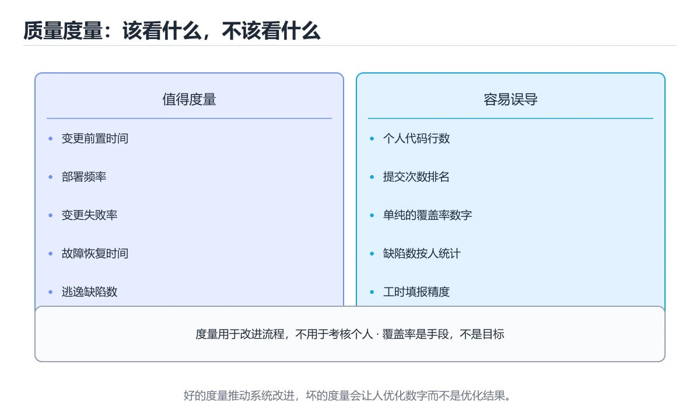

# 质量度量与工程门禁




> 内容更新时间：2026-10-06 · 学习阶段：基础 · 预计用时：35 分钟

## 本节知识框架

**课程定位**：所属分类为「软件工程」，课程主题为「质量度量与工程门禁」，学习阶段为「基础」，建议用时 35 分钟。

**本课要解决的主问题**：覆盖率与变异测试、缺陷指标、CI 门禁与度量文化。

| 学习层次 | 要回答的问题 | 完成判据 |
| --- | --- | --- |
| 概念层 | 「质量度量与工程门禁」有哪些必须区分的对象与术语？ | 能用自己的话定义核心术语，并各举一个正例和一个反例。 |
| 机制层 | 这些对象按什么顺序发生作用，输入如何变成输出？ | 能画出或写出机制步骤，并说明每一步的失败条件。 |
| 应用层 | 什么场景适合使用「质量度量与工程门禁」，什么场景不适合？ | 能给出一个真实场景、一个最小示例和一个边界案例。 |
| 性能层 | 时间、空间、吞吐或延迟受哪些量影响？ | 能说出复杂度或性能瓶颈的证据来源；没有证据时明确写“材料未提供”。 |
| 复习层 | 怎样确认自己不是只记住了结论？ | 能独立完成本课自测，并把错误定位到概念、机制、示例或边界。 |

### 阅读路线

1. 先读「核心概念定义」，建立「质量度量」等对象的精确定义。
2. 再读「原理与运行机制」，把定义串成可重复的过程。
3. 用「代码/协议/SQL 示例」验证过程，并只改一个条件观察结果变化。
4. 最后检查性能、易错点、知识关系与自测题，形成可复习的证据链。

**前置知识**：《TDD 与重构》

**学习位置**：本课位于《TDD 与重构》之后；如果前一课的自测不能通过，应先回补再继续。

**后续衔接**：下一课《代码评审方法与实践》会继续使用本课术语，学完后建议立即完成一次自测。

**教材衔接：学习目标**

- 能用自己的话解释质量度量与工程门禁解决了什么问题，而不是只背术语。
- 能说清 「质量度量」、「覆盖率」、「变异测试」、「门禁」 之间的关系，并分别举出一个例子。
- 能把 质量度量 放回「质量度量与工程门禁」的知识体系，说明它和 覆盖率 的边界。
- 能完成本课练习，并用验收标准检查自己的结果。

> 一句话摘要：覆盖率与变异测试、缺陷指标、CI 门禁与度量文化。

**教材衔接：前置知识**

- 先完成上一课《TDD 与重构》；如果已经掌握，可以直接用本课练习自测。
- 本课阶段：基础。建议先完成「TDD 与重构」，或确认自己能独立跑通正文里的 coverage_baseline 示例。
- 开始前先复习：质量度量、覆盖率、变异测试。
- 卡在 质量度量 上时不要跳过：把输入、预期和实际输出写成三行，再回头读正文。

**教材衔接：本课小结**

质量度量服务于**减少生产缺陷与加速交付**：用少量稳定指标看趋势，用门禁守住底线，用复盘改进流程。

## 核心概念定义

> 在阅读《质量度量与工程门禁》时，术语第一次出现先给操作性定义，再给边界；正文说法与这里冲突时，以定义和可复现示例为准。

| 术语 | 操作性定义 | 本课中的边界 |
| --- | --- | --- |
| 质量度量 | 用可重复指标衡量缺陷、测试、交付或运行质量。 | 仅在「质量度量与工程门禁」明确给出的输入、版本与资源条件下成立。 |
| 覆盖率 | 测试执行到的代码、分支或需求占总量的比例。 | 仅在「质量度量与工程门禁」明确给出的输入、版本与资源条件下成立。 |
| 变异测试 | 故意给代码注入小缺陷，再检查测试是否能发现，用来衡量测试断言的有效性。 | 仅在「质量度量与工程门禁」明确给出的输入、版本与资源条件下成立。 |
| 门禁 | 自动检查质量、安全或测试结果，不满足条件就阻止合并或发布。 | 仅在「质量度量与工程门禁」明确给出的输入、版本与资源条件下成立。 |
| CI | 指标看板建议分四块：交付（发布频率、从提交到上线时长）、质量（逃逸缺陷数、缺陷修复时长）、稳定性（错误率、P95 延迟、可用性）、效率（CI 平均时长、构建失败率）。 | 仅在「质量度量与工程门禁」明确给出的输入、版本与资源条件下成立。 |

### 定义如何使用

在「质量度量与工程门禁」中判断一个说法是否成立，先确认它使用的是哪个对象的定义，再检查输入规模、运行环境与失败路径。定义不是口号，而是后续推导、代码示例和自测题共享的约束。

## 原理与运行机制

### 机制总览

1. **建立输入**：把「质量度量」按本课定义整理成可观察、可重复的输入条件。
2. **执行转换**：围绕「覆盖率」执行本课的核心步骤；每一步都记录中间状态，避免只看最终输出。
3. **产生输出**：得到「变异测试」后，用正文示例或协议/SQL 结果核对输出是否符合预期。
4. **改变一个条件**：只替换一个边界条件或环境参数，观察「质量度量与工程门禁」的结论是否仍然成立。

| 阶段 | 关注对象 | 失败时应检查 |
| --- | --- | --- |
| 输入 | 质量度量 | 类型、范围、编码、版本或前置状态是否满足定义。 |
| 处理 | 覆盖率 | 顺序、可见性、锁、路由、事务或调度规则是否被破坏。 |
| 输出 | 变异测试 | 结果是否可复现，错误是否被正确传播而不是被吞掉。 |

本课的机制结论要用「质量度量与工程门禁」自己的示例验证。「质量度量与工程门禁」没有给出某个数量级、吞吐或内存数据时，本课把该判断标为“材料未提供”，不从相邻主题外推。

**教材衔接：该度量什么**

| 维度 | 指标 | 说明 |
| --- | --- | --- |
| 测试有效性 | 分支覆盖率、变异测试存活率 | 覆盖率看广度，变异测试看断言强度 |
| 缺陷 | 缺陷密度、逃逸率、平均修复时长 | 逃逸到生产的缺陷最有价值 |
| 变更质量 | 变更失败率、回滚率 | 反映发布流程成熟度 |
| 性能 | P95/P99 延迟、错误率 | 用户体验的直接体现 |
| 维护性 | 圈复杂度、重复率、依赖更新滞后 | 影响长期迭代成本 |

只看覆盖率会误导：**没有断言的测试也能拉高覆盖率**。建议把"变异测试存活率"和"生产逃逸缺陷数"作为主要参考。

**教材衔接：质量门禁**

在 CI 中设置硬门槛，未达标即阻断合并：

1. lint 与类型检查零错误。
2. 单元测试全通过，分支覆盖率不低于基线（如 70%）。
3. 高危依赖漏洞为 0（SCA 扫描）。
4. 构建产物体积不超过阈值（前端）。
5. 关键接口性能回归不超过基线 10%。

门禁要**可解释、可修复**：失败信息要指出具体文件与原因，否则团队会用 `--force` 绕过。

**教材衔接：度量文化**

度量用于改进而不是考核个人：把缺陷数与个人绩效绑定，只会导致隐瞒与数据造假。推荐做法是**按团队与流程维度观察趋势**，并在复盘中定位系统性原因（缺失用例、评审不足、环境差异）。

**教材衔接：指标从哪来与落地节奏**

| 指标 | 数据来源 | 采集方式 |
| --- | --- | --- |
| CI 时长、构建失败率 | CI 平台 API | 每日定时抓取，存入看板 |
| 覆盖率、变异存活率 | 测试框架报告（如 JaCoCo、coverage.py、PIT） | CI 产物上传后解析 |
| 逃逸缺陷数 | 缺陷管理系统（Jira 等）的"生产环境"标签 | 按周统计并与发布版本关联 |
| P95 延迟、错误率 | APM 或 Prometheus | 直接读监控数据源 |
| 依赖漏洞 | SCA 扫描器（Dependabot/Snyk） | CI 每次运行并记录趋势 |

**落地节奏建议**：第一阶段只做"可见"（把 CI 时长、测试通过率、覆盖率画到一块看板上）；第二阶段做"有门禁"（lint/测试/类型检查阻断合并）；第三阶段才做"能驱动改进"（把逃逸缺陷与用例设计挂钩，用数据决定质量投入方向）。**跳过前两个阶段直接上复杂度量，通常会被团队抵制而失败。**

**教材衔接：常用质量指标速查**

| 指标 | 含义 | 使用注意 |
| --- | --- | --- |
| 测试覆盖率 | 被测试执行的代码比例 | 需结合断言质量与变异测试 |
| 变异测试得分 | 故意注入缺陷被测试发现的比例 | 衡量测试有效性 |
| 缺陷逃逸率 | 上线后发现、本应被拦住的缺陷比例 | 衡量测试与评审效果 |
| 平均修复时间（MTTR） | 从发现到恢复的时长 | 反映响应能力 |
| 变更失败率 | 发布导致故障的比例 | 衡量发布质量 |
| 部署频率 | 单位时间发布次数 | 反映交付能力 |
| 领先时间 | 从提交到上线的时长 | 反映流程效率 |

注意：**度量用于改进流程，不用于考核个人**，否则会导致数据造假与隐瞒。

**教材衔接：深入补充：质量度量与工程门禁 的取舍与边界**

### 一、把概念放回真实约束

学习质量度量与工程门禁时，最容易只记住结论而忽略前提。先写出三个约束：数据规模、时间预算、可接受的失败方式；再判断 质量度量 与 覆盖率 在这些约束下是否仍然成立。只要约束改变，原来的最优解就可能变成错误解。

| 做法 | 适用规模 | 成本 | 主要风险 |
| --- | --- | --- | --- |
| 先写测试再改 | 任何规模 | 前期较慢 | 测试本身失真 |
| 小步提交与评审 | 多人协作 | 评审开销 | 批次过大 |
| 自动化质量门禁 | 持续交付 | 维护流水线 | 门禁形同虚设 |

### 二、三个容易混淆的边界

1. 澄清输入与目标。先写清「质量度量与工程门禁」要解决的问题、合法输入范围和成功标准，再进入后续步骤。
2. **把“平均值”当成“全部”**：质量度量 的指标好看，不代表尾部请求、冷启动或失败重试也好看。
3. **把“当前版本”当成“永久行为”**：覆盖率 依赖的默认值、API 或性能特征都可能随版本变化，需要固定版本并保留回归用例。

### 三、一个生产场景

假设团队要在真实系统里使用质量度量与工程门禁：第一周先做小流量验证，记录 质量度量 的基线与异常；第二周扩大输入规模，观察 覆盖率 是否成为瓶颈；第三周再做故障演练，主动注入超时、重复请求和依赖不可用，确认系统能降级、能重试、能恢复。每一步都要留下指标、日志和结论，而不是只留下“感觉更快了”。

### 四、自测清单

- 能否用一句话说出质量度量与工程门禁解决的核心问题与不适用场景？
- 能否画出 质量度量 的数据流或状态变化，并标出失败路径？
- 构造一个 覆盖率 的反例，证明「总是成立」的说法不成立。
- 能否写出一条可复现的验证命令，让别人独立得到相同结论？

## 典型应用场景

| 场景 | 典型输入或前提 | 期望产物 |
| --- | --- | --- |
| 学习验证 | 使用本课最小示例和 质量度量、覆盖率 | 能复现正文结论，并解释每一步。 |
| 工程落地 | 把「质量度量与工程门禁」放入真实模块或服务边界 | 输出可观测、失败可定位、参数可配置。 |
| 故障排查 | 只改一个版本、规模、输入或依赖条件 | 能区分概念错误、实现错误和环境差异。 |

判断「质量度量与工程门禁」的场景是否成立，标准是能否写出输入、处理、输出和失败路径；材料中没有出现的数据在本课标注为“材料未提供”，不用推测替代证据。

## 代码/协议/SQL 示例

以下代码、协议或 SQL 片段来自《质量度量与工程门禁》原文，保留原有语言标记与上下文；先预测《质量度量与工程门禁》示例的输出，再按正文步骤运行或推演，示例依赖外部环境时同时记录版本与输入。

**教材衔接：门禁配置与指标看板**

**CI 门禁清单**（可直接对照实现）：

| 检查 | 阈值建议 | 失败处理 |
| --- | --- | --- |
| 格式与 lint | 零错误 | 阻断合并，本地一键修复 |
| 类型检查 | 零错误 | 阻断合并 |
| 单元测试 | 全通过 | 阻断合并 |
| 分支覆盖率 | 不低于基线（如 70%，允许小幅波动） | 提示但不一定阻断 |
| 高危依赖漏洞 | 0 | 阻断合并，要求升级或说明豁免 |
| 构建产物体积 | 不超过基线 5%~10% | 提示，超阈值阻断 |
| 关键接口性能 | 回归不超过基线 10% | 阻断发布，人工复核 |

**指标看板建议分四块**：交付（发布频率、从提交到上线时长）、质量（逃逸缺陷数、缺陷修复时长）、稳定性（错误率、P95 延迟、可用性）、效率（CI 平均时长、构建失败率）。看板目的是让问题可见，**不是给人排名**。

落地顺序建议：先上 lint + 测试 + 类型检查（投入小、收益立竿见影），再加覆盖率与漏洞扫描，最后才做性能回归门禁（需要稳定的压测环境）。

**教材衔接：CI 门禁速查**

| 门禁 | 建议阈值 |
| --- | --- |
| 单元测试 | 全部通过 |
| 静态检查 | 无 error 级问题 |
| 类型检查 | 通过 |
| 依赖漏洞 | 高危为 0 |
| 密钥扫描 | 无命中 |
| 覆盖率 | 不低于基线（不强制 100%） |
| 端到端冒烟 | 核心路径通过 |
| 性能基线 | 关键接口无显著回归 |

```python
from dataclasses import dataclass, field

@dataclass
class QualityGate:
    """质量门禁评估：任一硬门禁失败即阻止合并。"""

    tests_passed: bool = True
    lint_errors: int = 0
    type_errors: int = 0
    high_vulns: int = 0
    secrets_found: int = 0
    coverage: float = 0.0
    coverage_baseline: float = 0.0
    perf_regression: float = 0.0

    def hard_failures(self) -> list:
        failures = []
        if not self.tests_passed:
            failures.append("测试未全部通过")
        if self.lint_errors:
            failures.append(f"静态检查 error {self.lint_errors} 个")
        if self.type_errors:
            failures.append(f"类型错误 {self.type_errors} 个")
        if self.high_vulns:
            failures.append(f"高危漏洞 {self.high_vulns} 个")
        if self.secrets_found:
            failures.append(f"疑似密钥 {self.secrets_found} 处")
        return failures

    def soft_warnings(self) -> list:
        warnings = []
        if self.coverage + 1e-9 < self.coverage_baseline:
            warnings.append(f"覆盖率低于基线 {self.coverage_baseline:.2%}")
        if self.perf_regression > 0.2:
            warnings.append(f"性能回退 {self.perf_regression:.0%}")
        return warnings

    def verdict(self) -> dict:
        hard = self.hard_failures()
        soft = self.soft_warnings()
        return {
            "pass": not hard,
            "blocking": hard,
            "warnings": soft,
            "decision": "阻止合并" if hard else ("允许合并但需关注" if soft else "允许合并"),
        }

gate = QualityGate(tests_passed=True, coverage=0.72, coverage_baseline=0.75, perf_regression=0.05)
print(gate.verdict())
```

**教材衔接：代码评审速查**

| 关注点 | 具体检查 |
| --- | --- |
| 正确性 | 边界、异常、并发、错误处理 |
| 可维护性 | 命名、职责、重复、复杂度 |
| 安全性 | 输入校验、权限、密钥、注入 |
| 性能 | 复杂度、N+1、无谓分配 |
| 测试 | 覆盖关键路径与异常分支 |
| 兼容性 | 接口变更是否向后兼容 |
| 可观测性 | 日志、指标、追踪是否充分 |

评审规模建议：单次变更控制在几百行以内，超过则拆分。

## 时间/空间复杂度或性能分析

**复杂度证据**：「质量度量与工程门禁」的现有材料没有给出渐近时间或空间复杂度的明确结论，本课只做定性检查，不补写未经验证的 $O$ 记号。

| 维度 | 本课关注点 | 判断依据 |
| --- | --- | --- |
| 时间/延迟 | 「质量度量与工程门禁」的主要步骤是否会随输入规模、并发度或网络往返增长。 | 以正文复杂度、基准数据或可重复测量为准。 |
| 空间/内存 | 中间状态、缓存、副本、连接或索引是否随规模增长。 | 记录峰值内存与数据副本，不只看最终结果。 |
| 吞吐/资源 | 版本、调度、锁、IO、序列化或协议开销是否成为瓶颈。 | 固定环境做对照实验，改变一个变量。 |

评估「质量度量与工程门禁」时要区分“正确性成立”和“性能达标”两件事；材料没有给出基准时，本课只保留量级来源与测量方法，不写不可验证的绝对数字。

## 常见误区与易错点

> 复核《质量度量与工程门禁》的易错点时，优先保留原文的错误表、故障现场与排错路径；每条修正都要能用本课示例复验。

| 易错点 | 常见表现 | 正确做法 |
| --- | --- | --- |
| 只背结论 | 能复述「质量度量与工程门禁」的定义，却说不清输入、输出与边界。 | 回到机制步骤，用最小示例逐一验证。 |
| 混淆相邻概念 | 把本课对象与相邻主题的对象当成同一类。 | 先比较定义、资源归属、生命周期和失败模式。 |
| 忽略版本与环境 | 在开发机通过后直接外推到生产环境。 | 固定版本、输入和资源条件，再记录可复现结果。 |

**教材衔接：常见错误与排查**

1. 用代码行数、提交数衡量产出。
2. 覆盖率作为唯一目标，导致写"凑数测试"。
3. 门禁太严又不给修复时间，最终被整体绕过。
4. 只看平均值，忽略 P95/P99 与长尾。
| 容易踩的做法 | 实际现象 | 原因与正确做法 |
| --- | --- | --- |
| 用覆盖率考核个人 | 写无断言测试刷指标 | 度量用于流程改进 |
| 覆盖率 100% 就放心 | 关键缺陷仍漏出 | 结合变异测试与缺陷逃逸率 |
| 门禁阈值定得过严 | 大量时间花在修指标 | 阈值以可修复、与质量相关为准 |
| 门禁只跑一次 | 新问题无人拦 | 每次提交与合并都跑 |
| 只看速度不看失败率 | 上线故障增多 | 质量与效率指标一起看 |
| 大 PR 一次评审 | 评审质量下降 | 小批量频繁评审 |
| 不记录缺陷根因 | 同类问题重复发生 | 做根因分析与改进项跟踪 |
| 指标只看单点 | 趋势无法判断 | 看趋势与基线对比 |
| 忽略测试稳定性 | flaky 用例被忽略 | 优先修复不稳定用例 |
| 只统计不行动 | 指标没有价值 | 每个指标对应改进行动 |

**教材衔接：故障现场**

### 现场 1：用覆盖率考核个人

**症状**：在《质量度量与工程门禁》的复现场景中，写无断言测试刷指标。

**根因**：“写无断言测试刷指标”只是表层结果。向上追溯会落到“用覆盖率考核个人”这一步，因为它省略了《质量度量与工程门禁》的约束，使实现行为和预期模型发生了偏离。

**修复**：针对《质量度量与工程门禁》的问题，度量用于流程改进。

**验证**：先在《质量度量与工程门禁》中记录“用覆盖率考核个人”留下的失败证据，再执行“度量用于流程改进”并重放；确认错误路径变为明确结果，且修复没有掩盖同类故障。

### 现场 2：覆盖率 100% 就放心

**症状**：在《质量度量与工程门禁》的复现场景中，关键缺陷仍漏出。

**根因**：当出现“覆盖率 100% 就放心”时，执行路径已经绕过了《质量度量与工程门禁》的关键约束，最终以“关键缺陷仍漏出”暴露出来；修复前必须先确认约束在哪里失效。

**修复**：针对《质量度量与工程门禁》的问题，结合变异测试与缺陷逃逸率。

**验证**：在《质量度量与工程门禁》中按“结合变异测试与缺陷逃逸率”调整后，从“覆盖率 100% 就放心”的触发条件重放同一条路径，确认“关键缺陷仍漏出”不再出现，并补一个相邻边界用例检查没有引入新问题。

### 现场 3：门禁阈值定得过严

**症状**：在《质量度量与工程门禁》的复现场景中，大量时间花在修指标。

**根因**：当出现“门禁阈值定得过严”时，执行路径已经绕过了《质量度量与工程门禁》的关键约束，最终以“大量时间花在修指标”暴露出来；修复前必须先确认约束在哪里失效。

**修复**：针对《质量度量与工程门禁》的问题，阈值以可修复、与质量相关为准。

**验证**：先在《质量度量与工程门禁》中记录“门禁阈值定得过严”留下的失败证据，再执行“阈值以可修复、与质量相关为准”并重放；确认错误路径变为明确结果，且修复没有掩盖同类故障。

## 与其他知识点的关系

| 关系 | 课程 | 为什么 |
| --- | --- | --- |
| 先修 | 《TDD 与重构》 | 本课会直接使用它的概念或操作前提。 |
| 关联 | 《安全开发生命周期（SDL）》 | 用于横向比较或把本课结论迁移到相邻主题。 |
| 关联 | 《CI 流水线配置：九种生态横向对照》 | 用于横向比较或把本课结论迁移到相邻主题。 |
| 关联 | 《测试与质量门禁：把问题挡在上线前》 | 用于横向比较或把本课结论迁移到相邻主题。 |
| 前置顺序 | 《TDD 与重构》 | 同分类中安排在本课之前，建议先完成其自测。 |
| 后续顺序 | 《代码评审方法与实践》 | 同分类中安排在本课之后，会继续使用本课术语。 |

把「质量度量与工程门禁」放回知识体系时，不只要记住“前面学过什么”，还要说明两个主题在输入、机制、资源边界和失败模式上的差异。这样才能把单课知识迁移到项目、排障和后续课程。

## 自测题与参考答案

> 先独立完成《质量度量与工程门禁》的自测，再核对答案与解析。答案必须能在本课正文或示例中找到依据，不能只凭语感。

### 自测 1

变更失败率（Change Failure Rate）主要衡量什么？

A. 进入生产环境的变更中需要回滚或紧急修复的比例
B. 单元测试数量，但这会掩盖真实的缺陷，同时这会拖慢反馈速度
C. 开发者人数
D. 代码总行数

**参考答案**：进入生产环境的变更中需要回滚或紧急修复的比例

**解析**：在「质量度量与工程门禁」里，进入生产环境的变更中需要回滚或紧急修复的比例。变更失败率反映交付质量：变更进入生产后有多少导致故障、回滚或热修。「质量度量与工程门禁」要求先交代质量度量、覆盖率、变异测试的前提再下结论，所以“进入生产环境的变更中需要回滚或紧急修复的”只在题干“变更失败率（Change Failure Rate）主要衡量”给定的条件下成立。

### 自测 2

按“质量度量与工程门禁”中 质量度量、覆盖率、变异测试 的实践顺序，把四个步骤排成从准备到复盘的合理顺序。

A. 固定版本与证据，把“质量度量与工程门禁”的结论写成可复现记录
B. 先明确 质量度量 的输入、输出与约束
C. 写出最小示例并核对 覆盖率 的基线结果
D. 只改一个变量，记录边界与失败路径的变化

**参考答案**：先明确 质量度量 的输入、输出与约束 → 写出最小示例并核对 覆盖率 的基线结果 → 只改一个变量，记录边界与失败路径的变化 → 固定版本与证据，把“质量度量与工程门禁”的结论写成可复现记录

**解析**：题干的正确项是固定版本与证据，把“质量度量与工程门禁”的结论写成可复现记录。在「质量度量与工程门禁」里，在本课的练习里，顺序应当是：先明确 质量度量 的输入、输出与约束 → 写出最小示例并核对 覆盖率 的基线结果 → 只改一个变量，记录边界与失败路径的变化 → 固定版本与证据，把本课的结论写成可复现记录。这个顺序把 质量度量 的输入、输出和约束放在最前面，在质量度量与工程门禁里避免概念没对齐就开始调参。第二步用 覆盖率 建立可核对的基线，在质量度量与工程门禁里第三步才允许改变一个变量并观察失败路径。

### 自测 3

围绕“质量度量与工程门禁”中的 质量度量、覆盖率、变异测试，下列哪两项是本课强调的实践判断？

A. 学习 质量度量 时要同时说明输入、输出和失败路径，不能只看正常流程
B. 只要 质量度量 的常规示例通过，就可以跳过边界与异常路径
C. 验证 覆盖率 时要固定版本并覆盖边界输入，结论才可复现
D. 把 覆盖率 的单次运行结果当成所有版本和规模都成立

**参考答案**：学习 质量度量 时要同时说明输入、输出和失败路径，不能只看正常流程；验证 覆盖率 时要固定版本并覆盖边界输入，结论才可复现

**解析**：结论应落在学习 质量度量 时要同时说明输入、输出和失败路径。本课把质量度量与工程门禁拆成概念、示例与故障现场三部分，因此判断 质量度量 时必须同时交代输入、输出和失败路径，这使“学习 质量度量 时要同时说明输入、输出和失败路径，不能只看正常流程”成立。在质量度量与工程门禁里，判断 覆盖率 时要固定版本与边界输入，所以“验证 覆盖率 时要固定版本并覆盖边界输入，结论才可复现”才可复现。

**教材衔接：复习与自测**

- [ ] 质量指标用于流程改进而非个人考核。
- [ ] 覆盖率与变异测试、缺陷逃逸率结合使用。
- [ ] CI 门禁覆盖测试、静态检查、漏洞与密钥扫描。
- [ ] 评审关注正确性、安全、性能与测试。
- [ ] 每个指标都有对应的改进行动与跟踪。

**教材衔接：动手练习**

> 本课练习重点：围绕「质量度量、覆盖率、变异测试」完成复述、实验和交付，每个结果都要能被别人检查。

先写验收标准，再做最小交付，最后用评审、测试或复盘验证。

### 练习 1：建立心智模型（10 分钟）

合上教程，用 3～5 句话回答：

1. 质量度量与工程门禁解决了什么问题？
2. 如果没有它，会出现什么具体后果？
3. 它和「覆盖率」是什么关系？

验收标准：说明 质量度量 与 覆盖率 的分工，并写出一个失效场景。

### 练习 2：做一次可控实验（20 分钟）

从正文中选一个最小示例，完成以下操作：

1. 先预测修改一个参数、输入或步骤后的结果。
2. 再实际执行或逐步推演，记录真实结果。
3. 如果结果与预测不同，写出差异原因。

**验收标准**：先原样跑通正文里的 `coverage_baseline`，再只改质量度量相关的输入，按「原例 → 改动 → 预测 → 结果 → 原因」记录；预测必须写在实际运行之前。

### 练习 3：交付一个小结果（30 分钟）

为 质量度量 写一页设计或评审记录，并让同伴能照着执行。

任务要求：

- 结果必须能被别人检查，不能只写“我已经理解了”。
- 至少覆盖「质量度量」和「覆盖率」两个关键词。
- 写出 1 个仍然不确定的问题，以及下一步如何验证。

> 提示：时间有限时优先做练习 1 和练习 2；练习 3 可以拆成两次完成。

**教材衔接：可运行练习**

### 任务 1：先跑通，再解释

```python
from dataclasses import dataclass, field

@dataclass
class QualityGate:
    """质量门禁评估：任一硬门禁失败即阻止合并。"""

    tests_passed: bool = True
    lint_errors: int = 0
    type_errors: int = 0
    high_vulns: int = 0
    secrets_found: int = 0
    coverage: float = 0.0
    coverage_baseline: float = 0.0
    perf_regression: float = 0.0

    def hard_failures(self) -> list:
        failures = []
        if not self.tests_passed:
            failures.append("测试未全部通过")
        if self.lint_errors:
            failures.append(f"静态检查 error {self.lint_errors} 个")
        if self.type_errors:
            failures.append(f"类型错误 {self.type_errors} 个")
        if self.high_vulns:
            failures.append(f"高危漏洞 {self.high_vulns} 个")
        if self.secrets_found:
            failures.append(f"疑似密钥 {self.secrets_found} 处")
        return failures

    def soft_warnings(self) -> list:
        warnings = []
        if self.coverage + 1e-9 < self.coverage_baseline:
            warnings.append(f"覆盖率低于基线 {self.coverage_baseline:.2%}")
        if self.perf_regression > 0.2:
            warnings.append(f"性能回退 {self.perf_regression:.0%}")
        return warnings

    def verdict(self) -> dict:
        hard = self.hard_failures()
        soft = self.soft_warnings()
        return {
            "pass": not hard,
            "blocking": hard,
            "warnings": soft,
            "decision": "阻止合并" if hard else ("允许合并但需关注" if soft else "允许合并"),
        }

gate = QualityGate(tests_passed=True, coverage=0.72, coverage_baseline=0.75, perf_regression=0.05)
print(gate.verdict())
```

### 任务 2：只改一个条件

把「质量度量与工程门禁」的最小示例复制一份，只改一个条件再跑一次：

- 改动点：只调整 coverage_baseline 的一个参数，其余条件一律不动。
- 预测：先写下「质量度量与工程门禁」在改动后的输出或错误信息，再运行。
- 记录：对照改动前后的结果，指出差异出在哪一步。
- 验收：换回原条件能复现原结果，改动只影响质量度量。

### 任务 3：迁移到自己的数据

把 coverage_baseline 换成你自己的输入，先保持步骤不变，再比较输出差异。

**教材衔接：本课复习清单**

离开本课前，逐项确认：

- [ ] 不看解析，能说出「变更失败率（Change Failure Rate）主要衡量什么？」的判断依据。
- [ ] 不看解析，能说出「下面哪项适合作为 CI 硬门禁？」的判断依据。
- [ ] 不看解析，能说出「质量度量的正确用途是？」的判断依据。
- [ ] 不看解析，能说出「缺陷逃逸率（escaped defect rate）的含义是？」的判断依据。
- [ ] 不看解析，能说出「关于代码评审（Code Review），正确的做法是？」的判断依据。
- [ ] 至少运行一次 coverage_baseline 的示例，记录输入、输出和 质量度量 的边界情况。
- [ ] 把本课最容易混淆的两个概念写成一句话对照。

| 复盘项 | 记录 |
| --- | --- |
| 已经能独立解释的考点 |  |
| 仍然说不清的概念 |  |
| 下一步验证动作 |  |

---

## 术语速查

| 术语 | 一句话说明 |
| --- | --- |
| `质量度量` | 用可重复指标衡量缺陷、测试、交付或运行质量。 |
| `覆盖率` | 测试执行到的代码、分支或需求占总量的比例。 |
| `变异测试` | 故意给代码注入小缺陷，再检查测试是否能发现，用来衡量测试断言的有效性。 |
| `门禁` | 自动检查质量、安全或测试结果，不满足条件就阻止合并或发布。 |
| `CI` | 指标看板建议分四块：交付（发布频率、从提交到上线时长）、质量（逃逸缺陷数、缺陷修复时长）、稳定性（错误率、P95 延迟、可用性）、效率（CI 平均时长、构建失败率）。 |

## 考点精讲

### 考点 1：概念判断·质量度量

- **题目**：变更失败率（Change Failure Rate）主要衡量什么？
- **判断依据**：在「质量度量与工程门禁」里，进入生产环境的变更中需要回滚或紧急修复的比例。变更失败率反映交付质量：变更进入生产后有多少导致故障、回滚或热修。「质量度量与工程门禁」要求先交代质量度量、覆盖率、变异测试的前提再下结论，所以“进入生产环境的变更中需要回滚或紧急修复的”只在题干“变更失败率（Change Failure Rate）主要衡量”给定的条件下成立。

### 考点 2：顺序排列·质量度量

- **题目**：按“质量度量与工程门禁”中 质量度量、覆盖率、变异测试 的实践顺序，把四个步骤排成从准备到复盘的合理顺序。
- **判断依据**：题干的正确项是固定版本与证据，把“质量度量与工程门禁”的结论写成可复现记录。在「质量度量与工程门禁」里，在本课的练习里，顺序应当是：先明确 质量度量 的输入、输出与约束 → 写出最小示例并核对 覆盖率 的基线结果 → 只改一个变量，记录边界与失败路径的变化 → 固定版本与证据，把本课的结论写成可复现记录。这个顺序把 质量度量 的输入、输出和约束放在最前面，在质量度量与工程门禁里避免概念没对齐就开始调参。第二步用 覆盖率 建立可核对的基线，在质量度量与工程门禁里第三步才允许改变一个变量并观察失败路径。

### 考点 3：概念判断·质量度量

- **题目**：质量度量的正确用途是？
- **判断依据**：在「质量度量与工程门禁」里，作答时，先用质量度量建立输入与输出的基线，再把观察团队与流程趋势并驱动改进代入边界条件核对，结论才能复现。这道题的关键在「质量度量与工程门禁」的质量度量、覆盖率、变异测试：先确认题干“质量度量的正确用途是”问的是哪一步，再排除偷换前提的选项。

### 考点 4：多选辨析·质量度量

- **题目**：围绕“质量度量与工程门禁”中的 质量度量、覆盖率、变异测试，下列哪两项是本课强调的实践判断？
- **判断依据**：结论应落在学习 质量度量 时要同时说明输入、输出和失败路径。本课把质量度量与工程门禁拆成概念、示例与故障现场三部分，因此判断 质量度量 时必须同时交代输入、输出和失败路径，这使“学习 质量度量 时要同时说明输入、输出和失败路径，不能只看正常流程”成立。在质量度量与工程门禁里，判断 覆盖率 时要固定版本与边界输入，所以“验证 覆盖率 时要固定版本并覆盖边界输入，结论才可复现”才可复现。

### 考点 5：概念判断·质量度量

- **题目**：关于代码评审（Code Review），正确的做法是？
- **判断依据**：在「质量度量与工程门禁」里，关注正确性与可维护性。小批量变更的评审质量最高，也能更快发现设计问题。在「质量度量与工程门禁」里判断这道题，要把质量度量、覆盖率、变异测试的条件、过程与失败路径逐项对齐，换成“关于代码评审（Code Review”这个场景，只有满足前提的结论才成立。“代码评审（Code”与「质量度量与工程门禁」的术语表相呼应，只有符合质量度量、覆盖率、变异测试约束的“关注正确性与可维护性”才是正文支持的结论。

### 考点 6：排错·质量度量

- **题目**：阅读「质量度量与工程门禁」的代码片段，下面哪项判断是正确的？
- **判断依据**：在「质量度量与工程门禁」里，题干的正确项是进入生产环境的变更中需要回滚或紧急修复的比例。“阅读质量度量与工程门禁的代码片段”与「质量度量与工程门禁」的术语表相呼应，只有符合质量度量、覆盖率、变异测试约束的“进入生产环境的变更中需要回滚或紧急修复的”才是正文支持的结论。

## English Overview

**Title:** Quality Metrics & Gates

**Summary:** Coverage, mutation tests, defect metrics and CI gates.

**Category:** Software Engineering
**Level:** 基础
**Key terms:** 质量度量, 覆盖率, 变异测试, 门禁, CI

## 内容元数据

- 内容版本：v2.0
- 最后更新：2026-10-06
- 学习阶段：基础
- 适用环境：通用软件工程实践；本课聚焦 质量度量。
- 内容来源：内置结构化课程与工程实践整理
- 相关主题：质量度量、覆盖率、变异测试、门禁、CI
- 质量版本：P0 测验标准 + P1 覆盖扩展 + P2 体验补全

## 参考资料与复核

- 最后复核：2026-10-04
- 下次复核：2027-10-24
- 复核范围：版本兼容、API 行为、安全建议与工程实践
- 来源性质：官方文档、标准或权威教材；正文为离线教学重组

| 参考资料 | 本课用途 |
| --- | --- |
| [DORA 能力模型](https://dora.dev/) | 交付性能与工程效能 |
| [ADR 文档](https://adr.github.io/) | 架构决策记录 |
| [The Twelve-Factor App](https://12factor.net/) | 可部署应用设计原则 |

> 「质量度量与工程门禁」的链接用于离线阅读后的延伸核对；App 不会自动联网。
