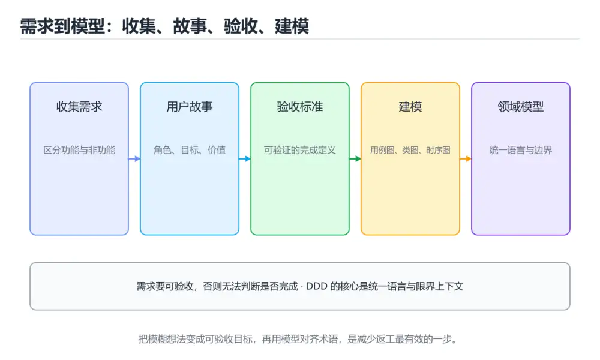
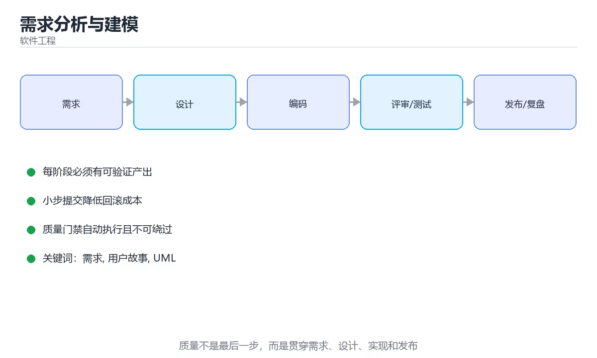

# 需求分析与建模

> 内容更新时间：2026-10-06 · 学习阶段：入门 · 预计用时：40 分钟





## 本节知识框架

**课程定位**：所属分类 `software_engineering`（软件工程），课程主题 `需求分析与建模`，学习阶段 入门，建议用时 35 分钟。

本课主线：功能/非功能需求、用户故事、UML 与 DDD、ADR。

**学完本课应当能够**
- 说清 `需求` 与 `用户故事` 的含义与区别，并各举一个正例和一个反例。
- 用本课示例验证 `UML` 的行为，记录输入、输出与失败条件。
- 遇到「只记录功能不记录质量指标」这类问题时，能说出触发条件与修复顺序。

### 从概念到验证的学习链条

1. `需求`：先掌握 用户或业务希望系统解决的问题、约束和验收标准，再用它解释 `用户故事` 为什么会出现。
2. `用户故事`：先掌握 从用户价值出发描述需求、场景和验收条件的小型需求单元，再用它解释 `UML` 为什么会出现。
3. `UML`：先掌握 统一建模语言：用类图、时序图等表达设计与交互，重点是沟通而不是图画得多漂亮，再用它解释 `ADR` 为什么会出现。
4. `ADR`：先掌握 ADR（架构决策记录）用简短结构化文本记录：背景、决策、备选方案、后果，再用它解释 本课示例的观察结果 为什么会出现。

**先修与衔接**：本课是「软件工程」分类的第 3 课。先修内容：《测试策略》。《测试策略》里的 `测试`、`单元测试` 是本课的前提。相关或后续课程：《测试用例设计方法》。

### 完成判据

- **定义关**：不看正文也能说明 `需求` 是 用户或业务希望系统解决的问题、约束和验收标准，并指出一个反例。
- **机制关**：能按“输入 → 转换 → 输出 → 验证”复述 `需求分析与建模`，而不是只背结论。
- **示例关**：能运行或推演 `需求分析与建模` 的 `python` 示例，并说明一个真实出现的标识符或字面量。
- **证据关**：能指出 `需求分析与建模` 示例里的 调用了 `text()`，并说明它支持或反驳了本课的哪一条结论。
- **排错关**：能复现 只记录功能不记录质量指标，记录现象并按 把非功能需求写成可测量指标 修复。
- **迁移关**：能把 `需求`、`用户故事`、`UML`、`DDD` 放进一个与 `需求分析与建模` 不同的项目场景，并保持输入与验证条件可追踪。
- **复盘关**：学完 `需求分析与建模` 后，用一句话写下仍然不确定的结论，并列出下一次验证需要的输入、环境和成功判据。

### 复习清单

- [ ] 能不看正文复述本课核心术语，并指出一个边界或反例。
- [ ] 能运行或推演本课示例，记录输入、输出与失败现象。
- [ ] 能完成一次自测，并把错题对照错误表定位原因。

## 核心概念定义

| 术语 | 操作性定义 | 常见边界与风险 |
| --- | --- | --- |
| 需求 | 用户或业务希望系统解决的问题、约束和验收标准。 | 易错：上线后性能和可用性无人负责；正确做法是把非功能需求写成可测量指标。 |
| 用户故事 | 从用户价值出发描述需求、场景和验收条件的小型需求单元。 | 只在「从用户价值出发描述需求、场景和验收条件的小型需求单元」这一前提下成立，换输入或换环境要重新验证。 |
| UML | 统一建模语言：用类图、时序图等表达设计与交互，重点是沟通而不是图画得多漂亮。 | 只在「统一建模语言：用类图、时序图等表达设计与交互，重点是沟通而不是图画得多漂亮」这一前提下成立，换输入或换环境要重新验证。 |
| ADR | ADR（架构决策记录）用简短结构化文本记录：背景、决策、备选方案、后果。 | 易错：没人阅读；正确做法是小步迭代 + 图表 + ADR。 |
| 功能需求 | 用户可以下单 | 易错：上线后性能和可用性无人负责；正确做法是把非功能需求写成可测量指标。 |
| 非功能需求 | P95 延迟低于 200 毫秒 | 易错：上线后性能和可用性无人负责；正确做法是把非功能需求写成可测量指标。 |
| 约束 | 必须使用现有数据库 | 索引命中与数据分布决定实际开销，判断前先看执行计划而不是只看结果是否正确。 |
| 假设 | 用户量不会超过 10 万 | 易错：假设失效无人发现；正确做法是显式列出并定期验证。 |

## 原理与运行机制

### 机制总览

**教材衔接：用户故事与验收标准**

格式：作为「角色」，我希望「功能」，以便「价值」。每个故事都应有可验证的验收标准（Given 前置条件 / When 操作 / Then 结果），否则无法判断完成。

好的故事满足 INVEST：独立、可协商、有价值、可估算、小、可测试。

**教材衔接：常用 UML 图**

| 图 | 用途 |
| --- | --- |
| 用例图 | 谁与系统交互、有哪些功能边界 |
| 类图 | 领域模型、类之间的关系（继承/组合/依赖） |
| 时序图 | 一次调用在对象间的消息顺序，排查交互设计 |
| 活动图 | 业务流程与分支条件 |
| 状态图 | 对象生命周期状态迁移（订单状态机） |
| 部署图 | 服务与基础设施拓扑 |

工程中不必画全，**时序图与状态图**对复杂业务最有价值。

**教材衔接：领域驱动设计（DDD）要点**

限界上下文（业务边界，不同上下文中「订单」含义可不同）、聚合与聚合根（一致性边界，一次事务只改一个聚合）、值对象（不可变、无标识，如金额）、领域事件（业务发生了什么，用于解耦）、防腐层（隔离外部模型）。

**教材衔接：文档与决策记录**

ADR（架构决策记录）用简短结构化文本记录：背景、决策、备选方案、后果。它的价值在于**让半年后的人知道当时为什么这么选**，避免反复推翻同一决策。

### 机制拆解：每一步的输入、动作与输出

#### 1. `需求`
- 输入：`需求`；本步把 用户或业务希望系统解决的问题、约束和验收标准 当作判断规则。
- 动作：围绕 `需求` 保留中间状态，并记录它与 `用户故事` 的对应关系。
- 输出：`用户故事`，它可以被下一段代码、测试或记录继续使用。
- `需求` 的失败条件：当只记录功能不记录质量指标时，会出现上线后性能和可用性无人负责。

#### 2. `用户故事`
- 输入：`需求`；本步把 从用户价值出发描述需求、场景和验收条件的小型需求单元 当作判断规则。
- 动作：围绕 `用户故事` 保留中间状态，并记录它与 `UML` 的对应关系。
- 输出：`UML`，它可以被下一段代码、测试或记录继续使用。
- `用户故事` 的失败条件：只在「从用户价值出发描述需求、场景和验收条件的小型需求单元」这一前提下成立，换输入或换环境要重新验证。

#### 3. `UML`
- 输入：`用户故事`；本步把 统一建模语言：用类图、时序图等表达设计与交互，重点是沟通而不是图画得多漂亮 当作判断规则。
- 动作：围绕 `UML` 保留中间状态，并记录它与 `ADR` 的对应关系。
- 输出：`ADR`，它可以被下一段代码、测试或记录继续使用。
- `UML` 的失败条件：只在「统一建模语言：用类图、时序图等表达设计与交互，重点是沟通而不是图画得多漂亮」这一前提下成立，换输入或换环境要重新验证。

#### 4. `ADR`
- 输入：`UML`；本步把 ADR（架构决策记录）用简短结构化文本记录：背景、决策、备选方案、后果 当作判断规则。
- 动作：围绕 `ADR` 保留中间状态，并记录它与 `text` 的对应关系。
- 输出：`text`，它可以被下一段代码、测试或记录继续使用。
- `ADR` 的失败条件：当一次写超长需求文档时，会出现没人阅读。

### 示例中的可观察事实

1. 调用了 `text()`；它对应的课程主题是 `需求分析与建模`。
2. 调用了 `field()`；它对应的课程主题是 `需求分析与建模`。
3. 调用了 `statement()`；它对应的课程主题是 `需求分析与建模`。
4. 调用了 `is_ready()`；它对应的课程主题是 `需求分析与建模`。
5. 调用了 `render()`；它对应的课程主题是 `需求分析与建模`。
6. 调用了 `join()`；它对应的课程主题是 `需求分析与建模`。
7. 调用了 `UserStory()`；它对应的课程主题是 `需求分析与建模`。
8. 调用了 `AcceptanceCriterion()`；它对应的课程主题是 `需求分析与建模`。

### 复现实验记录

- 环境：`需求分析与建模` 使用 `python` 示例，固定 `需求`、`用户故事`、`UML`、`DDD` 作为第一组条件。
- 首轮输入：先确认 调用了 `text()`，预测 `需求` 会怎样变化。
- 基线观察：记录命令、输入、输出和错误原文，不用截图代替可复制的文本。
- 单变量修改：只改变 `需求`，观察 `ADR` 是否仍满足定义。
- 失败注入：复现 只记录功能不记录质量指标，确认现象是 上线后性能和可用性无人负责。
- 记录结论：把“修改前、修改后、预期变化、实际变化”写成四列表，这样复盘 `需求分析与建模` 时才能区分概念错误与实现错误。

## 典型应用场景

- **只记录功能不记录质量指标**：典型现象是上线后性能和可用性无人负责；正确做法是把非功能需求写成可测量指标。
- **需求文档只写正常流程**：典型现象是异常和边界上线后才发现；正确做法是补齐失败、超时、重试和权限场景。
- **范围没有“不做什么”**：典型现象是项目不断膨胀；正确做法是明确范围外事项和变更流程。
- **模型追求大而全**：典型现象是文档没人维护；正确做法是只建立能驱动决策和验收的模型。

### 最小验证场景

- 准备：保留 `python` 示例的原始输入，先记录 `需求分析与建模` 的基线输出和完整运行命令。
- 观察：先核对 调用了 `text()`，再改变一个与 `需求` 相关的条件。
- 判定：新结果与 `需求分析与建模` 的基线不同不等于错误；只有当差异破坏了 `需求` 的定义或错误表中的约束，才判定为失败。

### 选择与边界

- 使用 `需求` 时，先满足它的定义：用户或业务希望系统解决的问题、约束和验收标准；易错：上线后性能和可用性无人负责；正确做法是把非功能需求写成可测量指标。
- 使用 `用户故事` 时，先满足它的定义：从用户价值出发描述需求、场景和验收条件的小型需求单元；只在「从用户价值出发描述需求、场景和验收条件的小型需求单元」这一前提下成立，换输入或换环境要重新验证。
- 使用 `UML` 时，先满足它的定义：统一建模语言：用类图、时序图等表达设计与交互，重点是沟通而不是图画得多漂亮；只在「统一建模语言：用类图、时序图等表达设计与交互，重点是沟通而不是图画得多漂亮」这一前提下成立，换输入或换环境要重新验证。
- 使用 `ADR` 时，先满足它的定义：ADR（架构决策记录）用简短结构化文本记录：背景、决策、备选方案、后果；易错：没人阅读；正确做法是小步迭代 + 图表 + ADR。

## 代码/协议/SQL 示例

**教材衔接：建模工具速查**

| 图 | 表达什么 | 什么时候用 |
| --- | --- | --- |
| 用例图 | 角色与系统功能关系 | 对齐范围 |
| 类图 | 领域对象与关系 | 领域建模 |
| 时序图 | 一次调用的消息顺序 | 交互设计 |
| 活动图 | 业务流程分支 | 复杂流程 |
| 状态图 | 状态与迁移 | 订单、审批 |
| ER 图 | 数据实体与关系 | 数据库设计 |
| C4 图 | 系统与容器上下文 | 架构沟通 |

```python
from dataclasses import dataclass, field

@dataclass
class AcceptanceCriterion:
    given: str
    when: str
    then: str

    def text(self) -> str:
        return f"假如 {self.given}，当 {self.when}，那么 {self.then}"

@dataclass
class UserStory:
    role: str
    goal: str
    value: str
    criteria: list = field(default_factory=list)
    non_functional: list = field(default_factory=list)

    def statement(self) -> str:
        return f"作为{self.role}，我想要{self.goal}，以便{self.value}"

    def is_ready(self) -> tuple[bool, str]:
        """就绪检查：验收标准、非功能需求与规模是否明确。"""
        if not self.criteria:
            return False, "缺少验收标准"
        if not self.non_functional:
            return False, "缺少非功能需求（性能、安全等）"
        return True, "就绪"

@dataclass
class DecisionRecord:
    """ADR：记录决策背景与后果，避免反复推翻。"""

    title: str
    context: str
    decision: str
    consequences: list
    status: str = "accepted"

    def render(self) -> str:
        items = "\n".join(f"- {item}" for item in self.consequences)
        return (
            f"# {self.title}\n\n状态：{self.status}\n\n"
            f"背景：{self.context}\n\n决策：{self.decision}\n\n后果：\n{items}"
        )

story = UserStory(
    role="学习者",
    goal="离线查看教程",
    value="在地铁上也能学习",
    criteria=[AcceptanceCriterion("无网络", "打开教程", "内容正常显示")],
    non_functional=["首屏加载小于 1 秒"],
)
print(story.statement(), story.is_ready())
```

**教材衔接：深入补充：需求分析与建模**

前面已经建立了基本概念。这一节换一个角度，把需求分析与建模放进真实工程里，
重点回答三件事：需求的两种类型 的机制、代价与边界。

### 一、核心模型

需求分析与建模把模糊想法转成可验证、可拆分、可验收的描述。关键不是画更多图，而是找到真正的利益相关者，明确边界、规则、异常和优先级。

```text
收集原始诉求 → 识别角色与目标 → 定义范围与约束 → 建立场景/用例 → 写验收标准 → 评审与变更管理
```

### 二、关键机制拆解

1. 功能需求描述系统做什么，非功能需求描述性能、可靠性、安全、可用性和可维护性等质量属性。
2. 用户故事强调角色、目标、价值，验收标准强调可观察结果，两者必须配合使用。
3. 用例从外部角色视角描述完整交互，包含前置条件、主流程、异常流程和后置条件。
4. 领域模型用实体、值对象、聚合和关系表达业务规则，不应直接照搬数据库表结构。
5. 需求必须可验证：出现“快速”“友好”“尽量”等词时，要转成具体指标。
6. 范围边界要写清“不做什么”，否则项目后期会被隐性需求不断扩张。
7. 需求变更要记录原因、影响、优先级和验收方式，不能只靠口头同步。

### 三、对照表：抓住容易混淆的边界

| 维度 | 一侧 | 另一侧 |
| --- | --- | --- |
| 功能需求 | 系统提供什么能力 | 回答“做什么” |
| 非功能需求 | 系统达到什么质量指标 | 回答“做到什么程度” |
| 用户故事 | 角色、目标与价值 | 适合迭代拆分和沟通 |
| 用例 | 完整交互与异常流程 | 适合覆盖复杂业务场景 |

### 四、工作示例

原始需求“登录要快”不可验收。改写为：“95% 的登录请求在 500ms 内完成；连续失败 5 次锁定 10 分钟；锁定期间返回 429 并提示剩余时间。”这样才可测试、可实现、可监控。

### 五、常见误区与失效边界

| 错误做法或假设 | 后果 | 正确做法 |
| --- | --- | --- |
| 只记录功能不记录质量指标 | 上线后性能和可用性无人负责 | 把非功能需求写成可测量指标 |
| 需求文档只写正常流程 | 异常和边界上线后才发现 | 补齐失败、超时、重试和权限场景 |
| 范围没有“不做什么” | 项目不断膨胀 | 明确范围外事项和变更流程 |
| 模型追求大而全 | 文档没人维护 | 只建立能驱动决策和验收的模型 |

### 六、场景推演

做一个退款功能，需求评审必须回答：谁可以发起、哪些订单可退、部分退款是否允许、退款失败如何重试、资金何时到账、重复请求如何幂等、如何审计。缺少任何一项都可能造成资金或合规事故。

### 七、自测问答

**Q1：用户故事为什么需要验收标准？**

故事描述价值，验收标准提供可测试的完成条件。

**Q2：非功能需求如何变得可验证？**

转成明确的指标、阈值、测量方法和观测窗口。

**Q3：领域模型和数据库模型有什么区别？**

领域模型表达业务规则，数据库模型还要考虑存储和性能。

**Q4：为什么要写范围外事项？**

它明确了预期边界，减少后期隐性扩张和争议。

### 八、小项目：把知识变成可检查的产出

选择一个你熟悉的小功能，写出一页需求：角色、目标、主流程、三条异常流程、五条验收标准、两项非功能指标和三条范围外事项；请另一位同学按文档复述并指出歧义。

### 九、适用边界

需求建模不能替代产品决策，也不能保证需求本身正确。它的作用是把假设显式化，让团队能在开发前发现冲突、遗漏和不可验证的描述。

### 十、完成检查清单

- [ ] 能区分功能与非功能需求
- [ ] 能为用户故事写可验证的验收标准
- [ ] 能用用例覆盖异常流程
- [ ] 能识别需求中的模糊词和隐藏假设
- [ ] 能维护变更记录与范围边界

### 十一、复习顺序

1. 合上教程复述 需求，确认能说出它解决的三个问题。
2. 再对照表逐行解释容易混淆的概念，每个概念补一个反例。
3. 跟着工作示例做一遍，改变一个条件并预测结果。
4. 用自测问答检查理解，错题回到对应小节重新阅读。
5. 把 用户故事 的实现、测试与复盘整理成一份可提交的产物。

> 复习不是重读一遍，而是离开原文重新产出：复述、改写、验证、复盘。

**运行方式**：运行 `需求分析与建模` 的示例时，保存为 `.py` 文件后用 `python 文件名.py` 运行；第三方依赖先在虚拟环境里安装。

### 示例精读：先找证据，再改一个条件

1. 调用了 `text()`；它出现在 `需求分析与建模` 的示例中，阅读时先确认它前后各发生了什么。
2. 调用了 `field()`；它出现在 `需求分析与建模` 的示例中，阅读时先确认它前后各发生了什么。
3. 调用了 `statement()`；它出现在 `需求分析与建模` 的示例中，阅读时先确认它前后各发生了什么。
4. 调用了 `is_ready()`；它出现在 `需求分析与建模` 的示例中，阅读时先确认它前后各发生了什么。
5. 调用了 `render()`；它出现在 `需求分析与建模` 的示例中，阅读时先确认它前后各发生了什么。
6. 调用了 `join()`；它出现在 `需求分析与建模` 的示例中，阅读时先确认它前后各发生了什么。
7. 调用了 `UserStory()`；它出现在 `需求分析与建模` 的示例中，阅读时先确认它前后各发生了什么。
8. 调用了 `AcceptanceCriterion()`；它出现在 `需求分析与建模` 的示例中，阅读时先确认它前后各发生了什么。
- 在 `需求分析与建模` 中与 `需求` 对照：示例必须能支持 用户或业务希望系统解决的问题、约束和验收标准，否则说明这一段还缺少实现或验证步骤。
- 在 `需求分析与建模` 中与 `用户故事` 对照：示例必须能支持 从用户价值出发描述需求、场景和验收条件的小型需求单元，否则说明这一段还缺少实现或验证步骤。
- 在 `需求分析与建模` 中与 `UML` 对照：示例必须能支持 统一建模语言：用类图、时序图等表达设计与交互，重点是沟通而不是图画得多漂亮，否则说明这一段还缺少实现或验证步骤。
- 在 `需求分析与建模` 中与 `ADR` 对照：示例必须能支持 ADR（架构决策记录）用简短结构化文本记录：背景、决策、备选方案、后果，否则说明这一段还缺少实现或验证步骤。

## 时间/空间复杂度或性能分析

**性能关注点（需求分析与建模）**：质量成本体现在返工：记录缺陷发现阶段、评审耗时与自动化覆盖比例。

**测量方法**：以 `需求分析与建模` 的 `需求` 场景为对象，固定输入跑一遍记录基线，再把规模或并发度提高一个数量级复测；两次结果的差值与波动范围才是结论依据。

### 需要控制的变量与记录项

- `需求分析与建模` 的 `需求`：固定它的版本、输入范围和资源上限，分别记录速度、内存与失败率的变化。
- `需求分析与建模` 的 `用户故事`：固定它的版本、输入范围和资源上限，分别记录速度、内存与失败率的变化。
- `需求分析与建模` 的 `UML`：固定它的版本、输入范围和资源上限，分别记录速度、内存与失败率的变化。
- `需求分析与建模` 的 `DDD`：固定它的版本、输入范围和资源上限，分别记录速度、内存与失败率的变化。
- `需求分析与建模` 的 `ADR`：固定它的版本、输入范围和资源上限，分别记录速度、内存与失败率的变化。
- `需求分析与建模` 中 `需求` 的边界：易错：上线后性能和可用性无人负责；正确做法是把非功能需求写成可测量指标。达到边界时不要外推，必须重新测量。
- `需求分析与建模` 中 `用户故事` 的边界：只在「从用户价值出发描述需求、场景和验收条件的小型需求单元」这一前提下成立，换输入或换环境要重新验证。达到边界时不要外推，必须重新测量。
- `需求分析与建模` 中 `UML` 的边界：只在「统一建模语言：用类图、时序图等表达设计与交互，重点是沟通而不是图画得多漂亮」这一前提下成立，换输入或换环境要重新验证。达到边界时不要外推，必须重新测量。
- `需求分析与建模` 中 `ADR` 的边界：易错：没人阅读；正确做法是小步迭代 + 图表 + ADR。达到边界时不要外推，必须重新测量。
- `需求分析与建模` 的代码证据：先验证 调用了 `text()`，再记录该路径的输入规模与耗时；只看代码行数不能推出复杂度。

## 常见误区与易错点

| 容易写错的做法 | 实际现象 | 原因与正确做法 |
| --- | --- | --- |
| 只记录功能不记录质量指标 | 上线后性能和可用性无人负责 | 把非功能需求写成可测量指标 |
| 需求文档只写正常流程 | 异常和边界上线后才发现 | 补齐失败、超时、重试和权限场景 |
| 范围没有“不做什么” | 项目不断膨胀 | 明确范围外事项和变更流程 |
| 模型追求大而全 | 文档没人维护 | 只建立能驱动决策和验收的模型 |
| 只有功能需求 | 上线后性能不达标 | 同步定义非功能需求与验收阈值 |
| 验收标准模糊 | 完成标准争议 | 用可断言的条件描述 |
| 一次写超长需求文档 | 没人阅读 | 小步迭代 + 图表 + ADR |
| 不记录假设 | 假设失效无人发现 | 显式列出并定期验证 |
| 不记录决策记录 | 反复推翻同一决策 | 写 ADR 并纳入版本管理 |
| 跳过建模直接编码 | 返工多 | 复杂逻辑先画时序或状态图 |
| 需求与测试脱节 | 漏测关键场景 | 验收标准直接转为测试用例 |
| 不做干系人对齐 | 上线后需求变化 | 关键角色评审确认 |
| 忽略合规与隐私 | 上线被拦 | 需求阶段纳入合规检查 |
| 文档写完不维护 | 与实际不符 | 与代码同仓更新 |

### 现场 1：只记录功能不记录质量指标

**症状**：上线后性能和可用性无人负责。

**根因与修复**：把非功能需求写成可测量指标。

**自检**：在本课示例里复现「只记录功能不记录质量指标」，改成把非功能需求写成可测量指标后重跑；如果症状消失且失败路径按预期变化，说明定位正确。

### 现场 2：需求文档只写正常流程

**症状**：异常和边界上线后才发现。

**根因与修复**：补齐失败、超时、重试和权限场景。

**自检**：在本课示例里复现「需求文档只写正常流程」，改成补齐失败、超时、重试和权限场景后重跑；如果症状消失且失败路径按预期变化，说明定位正确。

### 现场 3：范围没有“不做什么”

**症状**：项目不断膨胀。

**根因与修复**：明确范围外事项和变更流程。

**自检**：在本课示例里复现「范围没有“不做什么”」，改成明确范围外事项和变更流程后重跑；如果症状消失且失败路径按预期变化，说明定位正确。

### 现场 4：模型追求大而全

**症状**：文档没人维护。

**根因与修复**：只建立能驱动决策和验收的模型。

**自检**：在本课示例里复现「模型追求大而全」，改成只建立能驱动决策和验收的模型后重跑；如果症状消失且失败路径按预期变化，说明定位正确。

### 现场 5：只有功能需求

**症状**：上线后性能不达标。

**根因与修复**：同步定义非功能需求与验收阈值。

**自检**：在本课示例里复现「只有功能需求」，改成同步定义非功能需求与验收阈值后重跑；如果症状消失且失败路径按预期变化，说明定位正确。

### 现场 6：验收标准模糊

**症状**：完成标准争议。

**根因与修复**：用可断言的条件描述。

**自检**：在本课示例里复现「验收标准模糊」，改成用可断言的条件描述后重跑；如果症状消失且失败路径按预期变化，说明定位正确。

### 现场 7：一次写超长需求文档

**症状**：没人阅读。

**根因与修复**：小步迭代 + 图表 + ADR。

**自检**：在本课示例里复现「一次写超长需求文档」，改成小步迭代 + 图表 + ADR后重跑；如果症状消失且失败路径按预期变化，说明定位正确。

### 现场 8：不记录假设

**症状**：假设失效无人发现。

**根因与修复**：显式列出并定期验证。

**自检**：在本课示例里复现「不记录假设」，改成显式列出并定期验证后重跑；如果症状消失且失败路径按预期变化，说明定位正确。

### 现场 9：不记录决策记录

**症状**：反复推翻同一决策。

**根因与修复**：写 ADR 并纳入版本管理。

**自检**：在本课示例里复现「不记录决策记录」，改成写 ADR 并纳入版本管理后重跑；如果症状消失且失败路径按预期变化，说明定位正确。

## 与其他知识点的关系

- **先修**：`测试策略`。本课默认这些内容已经掌握。
- **相关或后续**：`测试用例设计方法`。本课术语会在这些课程里继续使用。
- **术语归属**：`需求`、`用户故事`、`UML` 的定义以本课「核心概念定义」为准，换到其他课程时先确认定义是否被改写。
- 同一分类的《技术写作与文档工程》也涉及 `ADR`；两课衔接时先确认这个术语的定义是否一致。

### 先修与后续术语接口

- `测试策略`：两者通过本分类的学习顺序衔接，阅读时重点比较各自的输入与失败条件。
- `测试用例设计方法`：两者通过本分类的学习顺序衔接，阅读时重点比较各自的输入与失败条件。

### 容易混淆的相邻概念

- `需求` 与 `用户故事`：前者强调 用户或业务希望系统解决的问题、约束和验收标准；后者强调 从用户价值出发描述需求、场景和验收条件的小型需求单元。判断时分别检查两条定义的适用范围，不要只看名称相似就互换。
- `用户故事` 与 `UML`：前者强调 从用户价值出发描述需求、场景和验收条件的小型需求单元；后者强调 统一建模语言：用类图、时序图等表达设计与交互，重点是沟通而不是图画得多漂亮。判断时分别检查两条定义的适用范围，不要只看名称相似就互换。
- `UML` 与 `ADR`：前者强调 统一建模语言：用类图、时序图等表达设计与交互，重点是沟通而不是图画得多漂亮；后者强调 ADR（架构决策记录）用简短结构化文本记录：背景、决策、备选方案、后果。判断时分别检查两条定义的适用范围，不要只看名称相似就互换。

## 自测题与参考答案

> 先独立作答，再对照参考答案；答案都能在本课正文、术语表或错误表里找到依据。

### 自测 1（概念复述）

不看正文，写出 `需求` 的操作性定义，并说明它与 `用户故事` 的区别。

**参考答案**：用户或业务希望系统解决的问题、约束和验收标准。

`用户故事` 的定位是：从用户价值出发描述需求、场景和验收条件的小型需求单元；两者的差别要从适用对象与失败模式上说明。

### 自测 2（排错）

本课错误表记录了「只记录功能不记录质量指标」这类做法。请写出它会出现的现象、根因，以及修复顺序。

**参考答案**：现象是上线后性能和可用性无人负责；正确做法是把非功能需求写成可测量指标。修复时先复现现象并保留证据，再改动一处假设重跑，确认现象消失。

### 自测 3（动手验证）

运行本课的 `python` 示例，把其中的 `"就绪检查：验收标准、非功能需求与规模是否明确。"` 换成一个边界值后重新运行，记录输出与错误信息。

**参考答案**：正常输入下 `python` 示例应当复现正文给出的结果；把 `"就绪检查：验收标准、非功能需求与规模是否明确。"` 换成边界值后，如果结果改变或报错，先核对它是否满足 `需求分析与建模` 中`需求` 的适用范围，再检查错误表里是否有同类现象。

### 自测 4（代码阅读）

阅读本课开头的 `python` 示例，说明它体现了`需求` 的哪一条性质，并指出改动哪个输入会让这条性质不再成立。

**参考答案**：`需求` 的定义是 用户或业务希望系统解决的问题、约束和验收标准，示例正是在实现这条定义。改动与 `需求` 有关的一个输入后，如果结果不再符合 `需求分析与建模` 的正文描述，就说明该性质只在当前前提成立。

### 自测 5（迁移）

把 `需求分析与建模` 的方法迁移到自己的项目：围绕 `需求` 写出一个与错误表同类的风险点，并说明触发条件和检验方式。

**参考答案**：例如「文档写完不维护」，它会导致与实际不符；检验方式是按与代码同仓更新改一处再复现，确认现象消失且没有引入新的失败分支。

### 自测 6（对比）

用一个表格对比 `需求` 与 `用户故事`：各写一行适用场景、一行失败表现。

**参考答案**：`需求` 的定义是用户或业务希望系统解决的问题、约束和验收标准；`用户故事` 的定义是从用户价值出发描述需求、场景和验收条件的小型需求单元。两者的失败表现分别对应本课错误表里与本术语相关的行。

### 自测 7（排错顺序）

面对「只记录功能不记录质量指标」引发的问题，请把“复现 上线后性能和可用性无人负责 → 保留证据 → 把非功能需求写成可测量指标 → 回归验证”四步写成可执行的检查清单。

**参考答案**：第一步按上线后性能和可用性无人负责复现；第二步记录输入、版本与完整报错；第三步按把非功能需求写成可测量指标只改一处；第四步重跑并确认失败路径也按预期变化。

### 自测 8（边界判断）

针对 `ADR`，分别写出“可以使用”的条件和“结论不再成立”的条件。

**参考答案**：易错：没人阅读；正确做法是小步迭代 + 图表 + ADR。 同时要把 `ADR` 的定义 ADR（架构决策记录）用简短结构化文本记录：背景、决策、备选方案、后果 与实际输入逐项对照。

### 自测 9（机制重建）

不看正文，按输入、转换、输出、验证四段重建 `需求` → `用户故事` → `UML` → `ADR` 的作用链。

**参考答案**：起点是 `需求` 的定义 用户或业务希望系统解决的问题、约束和验收标准；中间每一步都保留可观察状态；终点由 `ADR` 检查，失败时回到错误表定位第一个偏离定义的步骤。

### 自测 10（综合排错）

在 `需求分析与建模` 中，现象是 与实际不符。请围绕 文档写完不维护 写出最小复现、关键证据、修复动作和回归验证，并说明为什么不能只凭一次运行下结论。

**参考答案**：先复现 文档写完不维护，记录输入与完整错误；再按 与代码同仓更新 只改一处。回归时同时跑正常路径和边界路径，只有两次结果都可解释，才把修复视为完成。

### 自测 11（一分钟复述）

用每分钟约 200 字的速度复述 `需求分析与建模`：先给主问题，再按顺序说出 `需求`、`用户故事`、`UML`、`ADR`，最后给一个失败案例。

**自评标准**：主问题必须对应 功能/非功能需求、用户故事、UML 与 DDD、ADR；每个术语都要能接上一句定义或边界；失败案例必须写成可观察现象，不能用“可能有风险”代替证据。

## 术语速查

| 术语 | 一句话说明 |
| --- | --- |
| `需求` | 用户或业务希望系统解决的问题、约束和验收标准。 |
| `用户故事` | 从用户价值出发描述需求、场景和验收条件的小型需求单元。 |
| `UML` | 统一建模语言：用类图、时序图等表达设计与交互，重点是沟通而不是图画得多漂亮。 |
| `ADR` | ADR（架构决策记录）用简短结构化文本记录：背景、决策、备选方案、后果。 |

**术语关系**：`需求`（用户或业务希望系统解决的问题、约束和验收标准） → `用户故事`（从用户价值出发描述需求、场景和验收条件的小型需求单元） → `UML`（统一建模语言：用类图、时序图等表达设计与交互） → `ADR`（ADR（架构决策记录）用简短结构化文本记录：背景、决策、备选方案、后果）。

## 考点精讲

`需求分析与建模` 的题库有 6 道题，下面逐题给出题干、正确项与判断依据：先自己作答，再核对正确项，最后回到正文对应小节复核。

### 考点 1：第 1 题

- **题目**：阅读这条验收标准模板，下面哪项判断是正确的？
- **正确项**：用假如、当、那么写清前提、动作与预期结果，验收标准才能被测试化
- **判断依据**：这道题检验本课主问题：功能/非功能需求、用户故事、UML 与 DDD、ADR。复习时先复述本课主问题，再举一个会让结论失效的输入。

### 考点 2：第 2 题

- **题目**：想表达一次调用在多个对象间的消息顺序，应使用？
- **正确项**：时序图
- **判断依据**：这道题检验本课主问题：功能/非功能需求、用户故事、UML 与 DDD、ADR。复习时先复述本课主问题，再举一个会让结论失效的输入。

### 考点 3：第 3 题

- **题目**：ADR（架构决策记录）的价值是？
- **正确项**：记录决策背景与后果
- **判断依据**：这道题落在术语 `ADR` 上：ADR（架构决策记录）用简短结构化文本记录：背景、决策、备选方案、后果。复习时把 `ADR` 的定义、适用边界和一个反例一起说清楚，再回到「核心概念定义」核对原文。

### 考点 4：第 4 题

- **题目**：用户故事的标准格式是？
- **正确项**：「作为<角色>，我想要<目标>
- **判断依据**：这道题落在术语 `用户故事` 上：从用户价值出发描述需求、场景和验收条件的小型需求单元。复习时把 `用户故事` 的定义、适用边界和一个反例一起说清楚，再回到「核心概念定义」核对原文。

### 考点 5：第 5 题

- **题目**：围绕“需求分析与建模”中的 需求、用户故事、UML，下列哪两项是本课强调的实践判断？
- **正确项**：验证 用户故事 时要固定版本并覆盖边界输入，结论才可复现；学习 需求 时要同时说明输入、输出和失败路径，不能只看正常流程
- **判断依据**：这道题落在术语 `需求` 上：用户或业务希望系统解决的问题、约束和验收标准。复习时把 `需求` 的定义、适用边界和一个反例一起说清楚，再回到「核心概念定义」核对原文。

### 考点 6：第 6 题

- **题目**：下面几项都与 `需求` 有关，请按 `需求分析与建模` 的正文顺序排列；该课主线是功能/非功能需求、用户故事、UML 与 DDD、ADR。
- **正确项**：需求的两种类型 → 用户故事与验收标准 → 常用 UML 图 → 领域驱动设计（DDD）要点
- **判断依据**：这道题落在术语 `需求` 上：用户或业务希望系统解决的问题、约束和验收标准。复习时把 `需求` 的定义、适用边界和一个反例一起说清楚，再回到「核心概念定义」核对原文。

### 考点 7：`需求`

- **要点**：用户或业务希望系统解决的问题、约束和验收标准。
- **需求 的边界**：易错：上线后性能和可用性无人负责；正确做法是把非功能需求写成可测量指标。

### 考点 8：`用户故事`

- **要点**：从用户价值出发描述需求、场景和验收条件的小型需求单元。
- **用户故事 的边界**：只在「从用户价值出发描述需求、场景和验收条件的小型需求单元」这一前提下成立，换输入或换环境要重新验证。

### 考点 9：`UML`

- **要点**：统一建模语言：用类图、时序图等表达设计与交互，重点是沟通而不是图画得多漂亮。
- **UML 的边界**：只在「统一建模语言：用类图、时序图等表达设计与交互，重点是沟通而不是图画得多漂亮」这一前提下成立，换输入或换环境要重新验证。

### 考点 10：`ADR`

- **要点**：ADR（架构决策记录）用简短结构化文本记录：背景、决策、备选方案、后果。
- **ADR 的边界**：易错：没人阅读；正确做法是小步迭代 + 图表 + ADR。

### 考点 11：排错——只记录功能不记录质量指标

- **现象**：上线后性能和可用性无人负责。
- **处理**：把非功能需求写成可测量指标。

### 考点 12：排错——需求文档只写正常流程

- **现象**：异常和边界上线后才发现。
- **处理**：补齐失败、超时、重试和权限场景。

### 考点 13：综合辨析——`需求` 与 `ADR`

- **辨析点**：`需求` 的定义是 用户或业务希望系统解决的问题、约束和验收标准；`ADR` 的定义是 ADR（架构决策记录）用简短结构化文本记录：背景、决策、备选方案、后果。
- **答题要求**：面对 `需求分析与建模` 的题目，先判断描述的是 `需求` 还是 `ADR`，再归到对应定义，最后写出一个会让该定义失效的边界输入。

### 考点 14：排错评分点

- **现象分**：能写出 上线后性能和可用性无人负责，而不是只写“程序有错”。
- **证据分**：保留触发 只记录功能不记录质量指标 的输入、版本和错误原文。
- **修复分**：按 把非功能需求写成可测量指标 只改一处，并同时回归正常路径与边界路径。

## 内容元数据

- 内容版本：v2.0
- 最后更新：2026-10-06
- 学习阶段：入门
- 适用环境：通用软件工程实践；本课聚焦 需求。
- 内容来源：内置结构化课程与工程实践整理
- 相关主题：需求、用户故事、UML、DDD、ADR
- 质量版本：P0 测验标准 + P1 覆盖扩展 + P2 体验补全

## 参考资料与复核

- 最后复核：2026-10-04
- 下次复核：2027-10-24
- 复核范围：版本兼容、API 行为、安全建议与工程实践
- 来源性质：官方文档、标准或权威教材；本课核对关键词：需求、用户故事、UML、DDD、ADR。

| 参考资料 | 本课用途 |
| --- | --- |
| [ADR 文档](https://adr.github.io/) | 架构决策记录 |
| [Google SWE Book](https://abseil.io/resources/swe-book) | 工程规范、评审与维护 |
| [OWASP SAMM](https://owaspsamm.org/) | 软件安全成熟度 |

| [本课术语索引：需求分析与建模](#核心概念定义) | 按本课输入、术语边界和错误表现逐项核对 |
> 「需求分析与建模」的链接用于离线阅读后的延伸核对；App 不会自动联网。