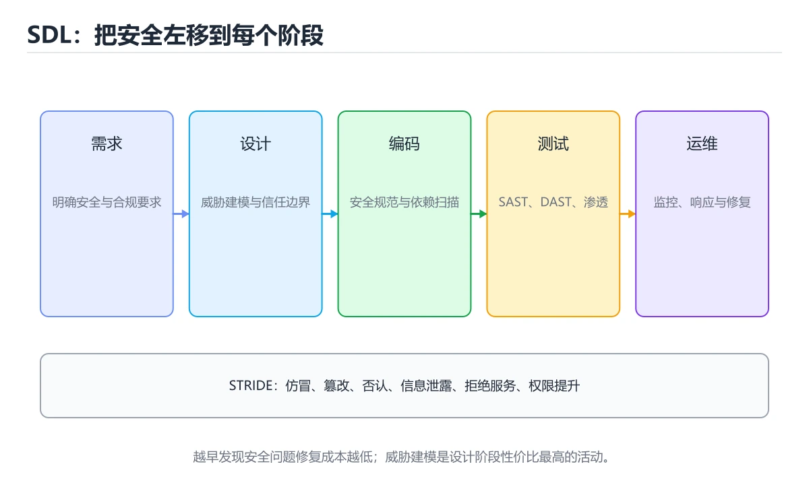

# 安全开发生命周期（SDL）

> 内容更新时间：2026-10-06 · 学习阶段：进阶 · 预计用时：40 分钟




## 本节知识框架

**课程定位**：所属分类 `software_engineering`（软件工程），课程主题 `安全开发生命周期（SDL）`，学习阶段 进阶，建议用时 35 分钟。

本课主线：六阶段安全活动、STRIDE 威胁建模与落地要点。

**学完本课应当能够**
- 说清 `SDL` 与 `威胁建模` 的含义与区别，并各举一个正例和一个反例。
- 用本课示例验证 `STRIDE` 的行为，记录输入、输出与失败条件。
- 遇到「上线前才做安全测试」这类问题时，能说出触发条件与修复顺序。

### 从概念到验证的学习链条

1. `SDL`：先掌握 SDL 的本质是把安全变成流程的一部分：需求定要求、设计做威胁建模、编码有规范与扫描、测试做验证、运营能响应，形成闭环而不是一次性检查，再用它解释 `威胁建模` 为什么会出现。
2. `威胁建模`：先掌握 系统化识别资产、攻击者、入口、信任边界和缓解措施，先于漏洞出现前设计控制，再用它解释 `STRIDE` 为什么会出现。
3. `STRIDE`：先掌握 威胁建模清单：从仿冒、篡改、抵赖、信息泄露、拒绝服务、提权六类威胁逐项检查设计，再用它解释 `SAST` 为什么会出现。
4. `SAST`：先掌握 把安全检查接入 CI：SAST、依赖漏洞、密钥扫描（gitleaks）三类必备，再用它解释 `密钥管理` 为什么会出现。
5. `密钥管理`：先掌握 密钥管理：禁止硬编码，用 KMS/Vault，支持轮换与最小权限，再用它解释 本课示例的观察结果 为什么会出现。

**先修与衔接**：本课是「软件工程」分类的第 9 课。先修内容：《质量度量与工程门禁》。《质量度量与工程门禁》里的 `质量度量`、`覆盖率` 是本课的前提。相关或后续课程：《代码评审方法与实践》、《威胁建模与 STRIDE》。

### 完成判据

- **定义关**：不看正文也能说明 `SDL` 是 SDL 的本质是把安全变成流程的一部分：需求定要求、设计做威胁建模、编码有规范与扫描、测试做验证、运营能响应，形成闭环而不是一次性检查，并指出一个反例。
- **机制关**：能按“输入 → 转换 → 输出 → 验证”复述 `安全开发生命周期（SDL）`，而不是只背结论。
- **示例关**：能运行或推演 `安全开发生命周期（SDL）` 的 `python` 示例，并说明一个真实出现的标识符或字面量。
- **证据关**：能指出 `安全开发生命周期（SDL）` 示例里的 调用了 `risk()`，并说明它支持或反驳了本课的哪一条结论。
- **排错关**：能复现 上线前才做安全测试，记录现象并按 需求与设计阶段就介入 修复。
- **迁移关**：能把 `SDL`、`威胁建模`、`STRIDE`、`SAST` 放进一个与 `安全开发生命周期（SDL）` 不同的项目场景，并保持输入与验证条件可追踪。
- **复盘关**：学完 `安全开发生命周期（SDL）` 后，用一句话写下仍然不确定的结论，并列出下一次验证需要的输入、环境和成功判据。

### 复习清单

- [ ] 能不看正文复述本课核心术语，并指出一个边界或反例。
- [ ] 能运行或推演本课示例，记录输入、输出与失败现象。
- [ ] 能完成一次自测，并把错题对照错误表定位原因。

## 核心概念定义

| 术语 | 操作性定义 | 常见边界与风险 |
| --- | --- | --- |
| SDL | SDL 的本质是把安全变成流程的一部分：需求定要求、设计做威胁建模、编码有规范与扫描、测试做验证、运营能响应，形成闭环而不是一次性检查。 | 换编码、换字节序或换平台都可能改变结果，处理前先固定输入编码。 |
| 威胁建模 | 系统化识别资产、攻击者、入口、信任边界和缓解措施，先于漏洞出现前设计控制。 | 易错：业务逻辑漏洞漏掉；正确做法是结合威胁建模与人工审计。 |
| STRIDE | 威胁建模清单：从仿冒、篡改、抵赖、信息泄露、拒绝服务、提权六类威胁逐项检查设计。 | 易错：遗漏重要威胁；正确做法是设计阶段做 STRIDE。 |
| SAST | 把安全检查接入 CI：SAST、依赖漏洞、密钥扫描（gitleaks）三类必备。 | 不同版本与依赖组合的行为可能不同，升级或换环境前要按官方变更说明重新验证。 |
| 密钥管理 | 密钥管理：禁止硬编码，用 KMS/Vault，支持轮换与最小权限。 | 易错：泄漏与轮换困难；正确做法是集中密钥管理并定期轮换。 |

## 原理与运行机制

### 机制总览

**教材衔接：把安全左移**

缺陷发现得越晚，修复成本越高：需求阶段改一句话 vs 上线后被利用。SDL 的核心是**在每个阶段嵌入安全活动**，而不是上线前做一次扫描。

| 阶段 | 安全活动 | 产出 |
| --- | --- | --- |
| 需求 | 识别资产与合规要求、明确安全需求 | 安全需求清单 |
| 设计 | 威胁建模（STRIDE）、架构评审 | 威胁清单与缓解措施 |
| 编码 | 安全编码规范、SAST、依赖扫描 | 静态检查报告 |
| 测试 | DAST、渗透测试、模糊测试 | 漏洞清单与修复验证 |
| 发布 | 安全配置基线、密钥检查、回滚预案 | 上线检查单 |
| 运营 | 监控告警、漏洞响应、应急演练 | 事件复盘与改进项 |

**教材衔接：威胁建模：STRIDE 六类**

| 威胁 | 含义 | 典型缓解 |
| --- | --- | --- |
| Spoofing 伪装 | 冒充他人身份 | 强认证、多因素 |
| Tampering 篡改 | 修改数据或传输内容 | 签名、完整性校验 |
| Repudiation 抵赖 | 否认操作 | 审计日志、数字签名 |
| Information disclosure 泄露 | 数据被未授权读取 | 加密、最小权限 |
| Denial of service 拒绝服务 | 服务不可用 | 限流、熔断、弹性扩容 |
| Elevation of privilege 提权 | 获得更高权限 | 最小权限、隔离、输入校验 |

做法：画出数据流图 → 标出信任边界 → 对每条跨越边界的流依次套用 STRIDE → 为每个威胁给缓解措施与责任人。**一次 1~2 小时的威胁建模，通常能发现设计层面的高危问题**。

**教材衔接：落地要点**

1. 把安全检查接入 CI：SAST、依赖漏洞、密钥扫描（gitleaks）三类必备。
2. 建立漏洞响应流程：分级、修复时限（P0 24 小时内）、复测闭环。
3. 密钥管理：禁止硬编码，用 KMS/Vault，支持轮换与最小权限。
4. 安全需求可测试化：如"登录失败 5 次锁定 15 分钟"要能写成用例。
5. 定期演练：把历史漏洞转成回归用例与规则，避免同类问题复发。

**教材衔接：SDL 阶段速查**

| 阶段 | 安全活动 | 产出 |
| --- | --- | --- |
| 需求 | 安全需求、合规确认 | 安全需求清单 |
| 设计 | 威胁建模（STRIDE）、架构评审 | 威胁与缓解措施 |
| 编码 | 安全编码规范、代码评审 | 评审记录 |
| 测试 | SAST、依赖扫描、渗透测试 | 漏洞清单与修复 |
| 发布 | 密钥检查、配置基线 | 发布检查表 |
| 运维 | 监控、应急响应、补丁 | 事件记录与复盘 |

**教材衔接：CI 安全检查速查**

| 检查 | 目标 | 工具类型 |
| --- | --- | --- |
| SAST | 代码层漏洞（注入、路径穿越） | 静态分析 |
| SCA | 第三方依赖已知漏洞 | 依赖扫描 |
| 密钥扫描 | 硬编码密钥与令牌 | 正则加熵检测 |
| DAST | 运行时接口漏洞 | 动态扫描 |
| 镜像扫描 | 容器基础镜像漏洞 | 镜像扫描 |
| IaC 扫描 | 云资源配置错误 | 配置检查 |
| 许可证合规 | 依赖许可证风险 | 许可证检查 |

**教材衔接：深入补充：安全开发生命周期（SDL） 的取舍与边界**

### 一、把概念放回真实约束

| 做法 | 适用规模 | 成本 | 主要风险 |
| --- | --- | --- | --- |
| 先写测试再改 | 任何规模 | 前期较慢 | 测试本身失真 |
| 小步提交与评审 | 多人协作 | 评审开销 | 批次过大 |
| 自动化质量门禁 | 持续交付 | 维护流水线 | 门禁形同虚设 |


### 机制拆解：每一步的输入、动作与输出

#### 1. `SDL`
- 输入：`SDL`；本步把 SDL 的本质是把安全变成流程的一部分：需求定要求、设计做威胁建模、编码有规范与扫描、测试做验证、运营能响应，形成闭环而不是一次性检查 当作判断规则。
- 动作：围绕 `SDL` 保留中间状态，并记录它与 `威胁建模` 的对应关系。
- 输出：`威胁建模`，它可以被下一段代码、测试或记录继续使用。
- `SDL` 的失败条件：换编码、换字节序或换平台都可能改变结果，处理前先固定输入编码。

#### 2. `威胁建模`
- 输入：`SDL`；本步把 系统化识别资产、攻击者、入口、信任边界和缓解措施，先于漏洞出现前设计控制 当作判断规则。
- 动作：围绕 `威胁建模` 保留中间状态，并记录它与 `STRIDE` 的对应关系。
- 输出：`STRIDE`，它可以被下一段代码、测试或记录继续使用。
- `威胁建模` 的失败条件：当只靠扫描器时，会出现业务逻辑漏洞漏掉。

#### 3. `STRIDE`
- 输入：`威胁建模`；本步把 威胁建模清单：从仿冒、篡改、抵赖、信息泄露、拒绝服务、提权六类威胁逐项检查设计 当作判断规则。
- 动作：围绕 `STRIDE` 保留中间状态，并记录它与 `SAST` 的对应关系。
- 输出：`SAST`，它可以被下一段代码、测试或记录继续使用。
- `STRIDE` 的失败条件：当不做威胁建模时，会出现遗漏重要威胁。

#### 4. `SAST`
- 输入：`STRIDE`；本步把 把安全检查接入 CI：SAST、依赖漏洞、密钥扫描（gitleaks）三类必备 当作判断规则。
- 动作：围绕 `SAST` 保留中间状态，并记录它与 `密钥管理` 的对应关系。
- 输出：`密钥管理`，它可以被下一段代码、测试或记录继续使用。
- `SAST` 的失败条件：不同版本与依赖组合的行为可能不同，升级或换环境前要按官方变更说明重新验证。

#### 5. `密钥管理`
- 输入：`SAST`；本步把 密钥管理：禁止硬编码，用 KMS/Vault，支持轮换与最小权限 当作判断规则。
- 动作：围绕 `密钥管理` 保留中间状态，并记录它与 `risk` 的对应关系。
- 输出：`risk`，它可以被下一段代码、测试或记录继续使用。
- `密钥管理` 的失败条件：当密钥散落各处时，会出现泄漏与轮换困难。

### 示例中的可观察事实

1. 调用了 `risk()`；它对应的课程主题是 `安全开发生命周期（SDL）`。
2. 调用了 `priority()`；它对应的课程主题是 `安全开发生命周期（SDL）`。
3. 调用了 `field()`；它对应的课程主题是 `安全开发生命周期（SDL）`。
4. 调用了 `add()`；它对应的课程主题是 `安全开发生命周期（SDL）`。
5. 调用了 `append()`；它对应的课程主题是 `安全开发生命周期（SDL）`。
6. 调用了 `unmitigated()`；它对应的课程主题是 `安全开发生命周期（SDL）`。
7. 调用了 `report()`；它对应的课程主题是 `安全开发生命周期（SDL）`。
8. 调用了 `sorted()`；它对应的课程主题是 `安全开发生命周期（SDL）`。

### 复现实验记录

- 环境：`安全开发生命周期（SDL）` 使用 `python` 示例，固定 `SDL`、`威胁建模`、`STRIDE`、`SAST` 作为第一组条件。
- 首轮输入：先确认 调用了 `risk()`，预测 `SDL` 会怎样变化。
- 基线观察：记录命令、输入、输出和错误原文，不用截图代替可复制的文本。
- 单变量修改：只改变 `SDL`，观察 `密钥管理` 是否仍满足定义。
- 失败注入：复现 上线前才做安全测试，确认现象是 问题发现太晚、成本高。
- 记录结论：把“修改前、修改后、预期变化、实际变化”写成四列表，这样复盘 `安全开发生命周期（SDL）` 时才能区分概念错误与实现错误。

## 典型应用场景

- **上线前才做安全测试**：典型现象是问题发现太晚、成本高；正确做法是需求与设计阶段就介入。
- **只靠扫描器**：典型现象是业务逻辑漏洞漏掉；正确做法是结合威胁建模与人工审计。
- **扫描告警不修**：典型现象是漏洞长期存在；正确做法是高危阻断、中低排期修复。
- **密钥散落各处**：典型现象是泄漏与轮换困难；正确做法是集中密钥管理并定期轮换。

### 最小验证场景

- 准备：保留 `python` 示例的原始输入，先记录 `安全开发生命周期（SDL）` 的基线输出和完整运行命令。
- 观察：先核对 调用了 `risk()`，再改变一个与 `SDL` 相关的条件。
- 判定：新结果与 `安全开发生命周期（SDL）` 的基线不同不等于错误；只有当差异破坏了 `SDL` 的定义或错误表中的约束，才判定为失败。

### 选择与边界

- 使用 `SDL` 时，先满足它的定义：SDL 的本质是把安全变成流程的一部分：需求定要求、设计做威胁建模、编码有规范与扫描、测试做验证、运营能响应，形成闭环而不是一次性检查；换编码、换字节序或换平台都可能改变结果，处理前先固定输入编码。
- 使用 `威胁建模` 时，先满足它的定义：系统化识别资产、攻击者、入口、信任边界和缓解措施，先于漏洞出现前设计控制；易错：业务逻辑漏洞漏掉；正确做法是结合威胁建模与人工审计。
- 使用 `STRIDE` 时，先满足它的定义：威胁建模清单：从仿冒、篡改、抵赖、信息泄露、拒绝服务、提权六类威胁逐项检查设计；易错：遗漏重要威胁；正确做法是设计阶段做 STRIDE。
- 使用 `SAST` 时，先满足它的定义：把安全检查接入 CI：SAST、依赖漏洞、密钥扫描（gitleaks）三类必备；不同版本与依赖组合的行为可能不同，升级或换环境前要按官方变更说明重新验证。
- 使用 `密钥管理` 时，先满足它的定义：密钥管理：禁止硬编码，用 KMS/Vault，支持轮换与最小权限；易错：泄漏与轮换困难；正确做法是集中密钥管理并定期轮换。

## 代码/协议/SQL 示例

**教材衔接：STRIDE 威胁速查**

| 威胁 | 含义 | 典型缓解 |
| --- | --- | --- |
| Spoofing 伪装 | 冒充身份 | 强认证、多因素 |
| Tampering 篡改 | 修改数据或代码 | 完整性校验、签名 |
| Repudiation 抵赖 | 否认操作 | 审计日志、数字签名 |
| Information disclosure 信息泄露 | 数据被读取 | 加密、最小权限、脱敏 |
| Denial of service 拒绝服务 | 服务不可用 | 限流、弹性、隔离 |
| Elevation of privilege 提权 | 获得更高权限 | 最小权限、输入校验 |

```python
from dataclasses import dataclass, field

@dataclass
class Threat:
    category: str            # STRIDE 之一
    asset: str
    scenario: str
    likelihood: int          # 1 到 5
    impact: int              # 1 到 5
    mitigation: str = ""

    def risk(self) -> int:
        return self.likelihood * self.impact

    def priority(self) -> str:
        score = self.risk()
        if score >= 20:
            return "P0：必须在设计阶段解决"
        if score >= 12:
            return "P1：编码阶段落实缓解"
        if score >= 6:
            return "P2：纳入测试与监控"
        return "P3：记录并观察"

@dataclass
class SecurityReview:
    threats: list = field(default_factory=list)

    def add(self, threat: Threat) -> None:
        self.threats.append(threat)

    def unmitigated(self) -> list:
        return [t for t in self.threats if not t.mitigation]

    def report(self) -> dict:
        ordered = sorted(self.threats, key=lambda t: -t.risk())
        return {
            "total": len(self.threats),
            "unmitigated": len(self.unmitigated()),
            "top": [(t.scenario, t.priority()) for t in ordered[:3]],
            "blocking": [t.scenario for t in self.threats if t.priority() == "P0：必须在设计阶段解决"],
        }

review = SecurityReview()
review.add(Threat("Information disclosure", "用户数据库", "越权读取他人订单", 4, 5))
review.add(Threat("Denial of service", "下单接口", "无限制刷单", 3, 3, "按用户与 IP 限流"))
print(review.report())
```

**运行方式**：运行 `安全开发生命周期（SDL）` 的示例时，保存为 `.py` 文件后用 `python 文件名.py` 运行；第三方依赖先在虚拟环境里安装。

### 示例精读：先找证据，再改一个条件

1. 调用了 `risk()`；它出现在 `安全开发生命周期（SDL）` 的示例中，阅读时先确认它前后各发生了什么。
2. 调用了 `priority()`；它出现在 `安全开发生命周期（SDL）` 的示例中，阅读时先确认它前后各发生了什么。
3. 调用了 `field()`；它出现在 `安全开发生命周期（SDL）` 的示例中，阅读时先确认它前后各发生了什么。
4. 调用了 `add()`；它出现在 `安全开发生命周期（SDL）` 的示例中，阅读时先确认它前后各发生了什么。
5. 调用了 `append()`；它出现在 `安全开发生命周期（SDL）` 的示例中，阅读时先确认它前后各发生了什么。
6. 调用了 `unmitigated()`；它出现在 `安全开发生命周期（SDL）` 的示例中，阅读时先确认它前后各发生了什么。
7. 调用了 `report()`；它出现在 `安全开发生命周期（SDL）` 的示例中，阅读时先确认它前后各发生了什么。
8. 调用了 `sorted()`；它出现在 `安全开发生命周期（SDL）` 的示例中，阅读时先确认它前后各发生了什么。
- 在 `安全开发生命周期（SDL）` 中与 `SDL` 对照：示例必须能支持 SDL 的本质是把安全变成流程的一部分：需求定要求、设计做威胁建模、编码有规范与扫描、测试做验证、运营能响应，形成闭环而不是一次性检查，否则说明这一段还缺少实现或验证步骤。
- 在 `安全开发生命周期（SDL）` 中与 `威胁建模` 对照：示例必须能支持 系统化识别资产、攻击者、入口、信任边界和缓解措施，先于漏洞出现前设计控制，否则说明这一段还缺少实现或验证步骤。
- 在 `安全开发生命周期（SDL）` 中与 `STRIDE` 对照：示例必须能支持 威胁建模清单：从仿冒、篡改、抵赖、信息泄露、拒绝服务、提权六类威胁逐项检查设计，否则说明这一段还缺少实现或验证步骤。
- 在 `安全开发生命周期（SDL）` 中与 `SAST` 对照：示例必须能支持 把安全检查接入 CI：SAST、依赖漏洞、密钥扫描（gitleaks）三类必备，否则说明这一段还缺少实现或验证步骤。

## 时间/空间复杂度或性能分析

**性能关注点（安全开发生命周期（SDL））**：质量成本体现在返工：记录缺陷发现阶段、评审耗时与自动化覆盖比例。

**测量方法**：以 `安全开发生命周期（SDL）` 的 `SDL` 场景为对象，固定输入跑一遍记录基线，再把规模或并发度提高一个数量级复测；两次结果的差值与波动范围才是结论依据。

### 需要控制的变量与记录项

- `安全开发生命周期（SDL）` 的 `SDL`：固定它的版本、输入范围和资源上限，分别记录速度、内存与失败率的变化。
- `安全开发生命周期（SDL）` 的 `威胁建模`：固定它的版本、输入范围和资源上限，分别记录速度、内存与失败率的变化。
- `安全开发生命周期（SDL）` 的 `STRIDE`：固定它的版本、输入范围和资源上限，分别记录速度、内存与失败率的变化。
- `安全开发生命周期（SDL）` 的 `SAST`：固定它的版本、输入范围和资源上限，分别记录速度、内存与失败率的变化。
- `安全开发生命周期（SDL）` 的 `密钥管理`：固定它的版本、输入范围和资源上限，分别记录速度、内存与失败率的变化。
- `安全开发生命周期（SDL）` 中 `SDL` 的边界：换编码、换字节序或换平台都可能改变结果，处理前先固定输入编码。达到边界时不要外推，必须重新测量。
- `安全开发生命周期（SDL）` 中 `威胁建模` 的边界：易错：业务逻辑漏洞漏掉；正确做法是结合威胁建模与人工审计。达到边界时不要外推，必须重新测量。
- `安全开发生命周期（SDL）` 中 `STRIDE` 的边界：易错：遗漏重要威胁；正确做法是设计阶段做 STRIDE。达到边界时不要外推，必须重新测量。
- `安全开发生命周期（SDL）` 中 `SAST` 的边界：不同版本与依赖组合的行为可能不同，升级或换环境前要按官方变更说明重新验证。达到边界时不要外推，必须重新测量。
- `安全开发生命周期（SDL）` 中 `密钥管理` 的边界：易错：泄漏与轮换困难；正确做法是集中密钥管理并定期轮换。达到边界时不要外推，必须重新测量。
- `安全开发生命周期（SDL）` 的代码证据：先验证 调用了 `risk()`，再记录该路径的输入规模与耗时；只看代码行数不能推出复杂度。

## 常见误区与易错点

| 容易写错的做法 | 实际现象 | 原因与正确做法 |
| --- | --- | --- |
| 上线前才做安全测试 | 问题发现太晚、成本高 | 需求与设计阶段就介入 |
| 只靠扫描器 | 业务逻辑漏洞漏掉 | 结合威胁建模与人工审计 |
| 扫描告警不修 | 漏洞长期存在 | 高危阻断、中低排期修复 |
| 密钥散落各处 | 泄漏与轮换困难 | 集中密钥管理并定期轮换 |
| 无审计日志 | 事件无法追溯 | 关键操作记录不可篡改日志 |
| 依赖不更新 | 已知漏洞长期暴露 | 定期扫描与升级 |
| 权限过大 | 一处失守全线崩溃 | 最小权限与网络分段 |
| 无应急响应流程 | 事件处理混乱 | 预案 + 演练 + 分工 |
| 不做威胁建模 | 遗漏重要威胁 | 设计阶段做 STRIDE |
| 安全需求无验收 | 无法验证是否落实 | 转化为可测的安全用例 |

### 现场 1：上线前才做安全测试

**症状**：问题发现太晚、成本高。

**根因与修复**：需求与设计阶段就介入。

**自检**：在本课示例里复现「上线前才做安全测试」，改成需求与设计阶段就介入后重跑；如果症状消失且失败路径按预期变化，说明定位正确。

### 现场 2：只靠扫描器

**症状**：业务逻辑漏洞漏掉。

**根因与修复**：结合威胁建模与人工审计。

**自检**：在本课示例里复现「只靠扫描器」，改成结合威胁建模与人工审计后重跑；如果症状消失且失败路径按预期变化，说明定位正确。

### 现场 3：扫描告警不修

**症状**：漏洞长期存在。

**根因与修复**：高危阻断、中低排期修复。

**自检**：在本课示例里复现「扫描告警不修」，改成高危阻断、中低排期修复后重跑；如果症状消失且失败路径按预期变化，说明定位正确。

### 现场 4：密钥散落各处

**症状**：泄漏与轮换困难。

**根因与修复**：集中密钥管理并定期轮换。

**自检**：在本课示例里复现「密钥散落各处」，改成集中密钥管理并定期轮换后重跑；如果症状消失且失败路径按预期变化，说明定位正确。

### 现场 5：无审计日志

**症状**：事件无法追溯。

**根因与修复**：关键操作记录不可篡改日志。

**自检**：在本课示例里复现「无审计日志」，改成关键操作记录不可篡改日志后重跑；如果症状消失且失败路径按预期变化，说明定位正确。

### 现场 6：依赖不更新

**症状**：已知漏洞长期暴露。

**根因与修复**：定期扫描与升级。

**自检**：在本课示例里复现「依赖不更新」，改成定期扫描与升级后重跑；如果症状消失且失败路径按预期变化，说明定位正确。

### 现场 7：权限过大

**症状**：一处失守全线崩溃。

**根因与修复**：最小权限与网络分段。

**自检**：在本课示例里复现「权限过大」，改成最小权限与网络分段后重跑；如果症状消失且失败路径按预期变化，说明定位正确。

### 现场 8：无应急响应流程

**症状**：事件处理混乱。

**根因与修复**：预案 + 演练 + 分工。

**自检**：在本课示例里复现「无应急响应流程」，改成预案 + 演练 + 分工后重跑；如果症状消失且失败路径按预期变化，说明定位正确。

### 现场 9：不做威胁建模

**症状**：遗漏重要威胁。

**根因与修复**：设计阶段做 STRIDE。

**自检**：在本课示例里复现「不做威胁建模」，改成设计阶段做 STRIDE后重跑；如果症状消失且失败路径按预期变化，说明定位正确。

## 与其他知识点的关系

- **先修**：`质量度量与工程门禁`。本课默认这些内容已经掌握。
- **相关或后续**：`代码评审方法与实践`、`威胁建模与 STRIDE`。本课术语会在这些课程里继续使用。
- **术语归属**：`SDL`、`威胁建模`、`STRIDE` 的定义以本课「核心概念定义」为准，换到其他课程时先确认定义是否被改写。

### 先修与后续术语接口

- `威胁建模与 STRIDE`：共享术语 `威胁建模`、`STRIDE`，共同关键词 `威胁建模`、`STRIDE`。
- `质量度量与工程门禁`：两者通过本分类的学习顺序衔接，阅读时重点比较各自的输入与失败条件。
- `代码评审方法与实践`：两者通过本分类的学习顺序衔接，阅读时重点比较各自的输入与失败条件。

### 容易混淆的相邻概念

- `SDL` 与 `威胁建模`：前者强调 SDL 的本质是把安全变成流程的一部分：需求定要求、设计做威胁建模、编码有规范与扫描、测试做验证、运营能响应，形成闭环而不是一次性检查；后者强调 系统化识别资产、攻击者、入口、信任边界和缓解措施，先于漏洞出现前设计控制。判断时分别检查两条定义的适用范围，不要只看名称相似就互换。
- `威胁建模` 与 `STRIDE`：前者强调 系统化识别资产、攻击者、入口、信任边界和缓解措施，先于漏洞出现前设计控制；后者强调 威胁建模清单：从仿冒、篡改、抵赖、信息泄露、拒绝服务、提权六类威胁逐项检查设计。判断时分别检查两条定义的适用范围，不要只看名称相似就互换。
- `STRIDE` 与 `SAST`：前者强调 威胁建模清单：从仿冒、篡改、抵赖、信息泄露、拒绝服务、提权六类威胁逐项检查设计；后者强调 把安全检查接入 CI：SAST、依赖漏洞、密钥扫描（gitleaks）三类必备。判断时分别检查两条定义的适用范围，不要只看名称相似就互换。
- `SAST` 与 `密钥管理`：前者强调 把安全检查接入 CI：SAST、依赖漏洞、密钥扫描（gitleaks）三类必备；后者强调 密钥管理：禁止硬编码，用 KMS/Vault，支持轮换与最小权限。判断时分别检查两条定义的适用范围，不要只看名称相似就互换。

## 自测题与参考答案

> 先独立作答，再对照参考答案；答案都能在本课正文、术语表或错误表里找到依据。

### 自测 1（概念复述）

不看正文，写出 `SDL` 的操作性定义，并说明它与 `威胁建模` 的区别。

**参考答案**：SDL 的本质是把安全变成流程的一部分：需求定要求、设计做威胁建模、编码有规范与扫描、测试做验证、运营能响应，形成闭环而不是一次性检查。

`威胁建模` 的定位是：系统化识别资产、攻击者、入口、信任边界和缓解措施，先于漏洞出现前设计控制；两者的差别要从适用对象与失败模式上说明。

### 自测 2（排错）

本课错误表记录了「上线前才做安全测试」这类做法。请写出它会出现的现象、根因，以及修复顺序。

**参考答案**：现象是问题发现太晚、成本高；正确做法是需求与设计阶段就介入。修复时先复现现象并保留证据，再改动一处假设重跑，确认现象消失。

### 自测 3（动手验证）

运行本课的 `python` 示例，把其中的 `"P0：必须在设计阶段解决"` 换成一个边界值后重新运行，记录输出与错误信息。

**参考答案**：正常输入下 `python` 示例应当复现正文给出的结果；把 `"P0：必须在设计阶段解决"` 换成边界值后，如果结果改变或报错，先核对它是否满足 `安全开发生命周期（SDL）` 中`SDL` 的适用范围，再检查错误表里是否有同类现象。

### 自测 4（代码阅读）

阅读本课开头的 `python` 示例，说明它体现了`SDL` 的哪一条性质，并指出改动哪个输入会让这条性质不再成立。

**参考答案**：`SDL` 的定义是 SDL 的本质是把安全变成流程的一部分：需求定要求、设计做威胁建模、编码有规范与扫描、测试做验证、运营能响应，形成闭环而不是一次性检查，示例正是在实现这条定义。改动与 `SDL` 有关的一个输入后，如果结果不再符合 `安全开发生命周期（SDL）` 的正文描述，就说明该性质只在当前前提成立。

### 自测 5（迁移）

把 `安全开发生命周期（SDL）` 的方法迁移到自己的项目：围绕 `SDL` 写出一个与错误表同类的风险点，并说明触发条件和检验方式。

**参考答案**：例如「安全需求无验收」，它会导致无法验证是否落实；检验方式是按转化为可测的安全用例改一处再复现，确认现象消失且没有引入新的失败分支。

### 自测 6（对比）

用一个表格对比 `SDL` 与 `威胁建模`：各写一行适用场景、一行失败表现。

**参考答案**：`SDL` 的定义是SDL 的本质是把安全变成流程的一部分：需求定要求、设计做威胁建模、编码有规范与扫描、测试做验证、运营能响应，形成闭环而不是一次性检查；`威胁建模` 的定义是系统化识别资产、攻击者、入口、信任边界和缓解措施，先于漏洞出现前设计控制。两者的失败表现分别对应本课错误表里与本术语相关的行。

### 自测 7（排错顺序）

面对「上线前才做安全测试」引发的问题，请把“复现 问题发现太晚、成本高 → 保留证据 → 需求与设计阶段就介入 → 回归验证”四步写成可执行的检查清单。

**参考答案**：第一步按问题发现太晚、成本高复现；第二步记录输入、版本与完整报错；第三步按需求与设计阶段就介入只改一处；第四步重跑并确认失败路径也按预期变化。

### 自测 8（边界判断）

针对 `密钥管理`，分别写出“可以使用”的条件和“结论不再成立”的条件。

**参考答案**：易错：泄漏与轮换困难；正确做法是集中密钥管理并定期轮换。 同时要把 `密钥管理` 的定义 密钥管理：禁止硬编码，用 KMS/Vault，支持轮换与最小权限 与实际输入逐项对照。

### 自测 9（机制重建）

不看正文，按输入、转换、输出、验证四段重建 `SDL` → `威胁建模` → `STRIDE` → `SAST` 的作用链。

**参考答案**：起点是 `SDL` 的定义 SDL 的本质是把安全变成流程的一部分：需求定要求、设计做威胁建模、编码有规范与扫描、测试做验证、运营能响应，形成闭环而不是一次性检查；中间每一步都保留可观察状态；终点由 `密钥管理` 检查，失败时回到错误表定位第一个偏离定义的步骤。

### 自测 10（综合排错）

在 `安全开发生命周期（SDL）` 中，现象是 无法验证是否落实。请围绕 安全需求无验收 写出最小复现、关键证据、修复动作和回归验证，并说明为什么不能只凭一次运行下结论。

**参考答案**：先复现 安全需求无验收，记录输入与完整错误；再按 转化为可测的安全用例 只改一处。回归时同时跑正常路径和边界路径，只有两次结果都可解释，才把修复视为完成。

### 自测 11（一分钟复述）

用每分钟约 200 字的速度复述 `安全开发生命周期（SDL）`：先给主问题，再按顺序说出 `SDL`、`威胁建模`、`STRIDE`、`SAST`，最后给一个失败案例。

**自评标准**：主问题必须对应 六阶段安全活动、STRIDE 威胁建模与落地要点；每个术语都要能接上一句定义或边界；失败案例必须写成可观察现象，不能用“可能有风险”代替证据。

## 术语速查

| 术语 | 一句话说明 |
| --- | --- |
| `SDL` | SDL 的本质是把安全变成流程的一部分：需求定要求、设计做威胁建模、编码有规范与扫描、测试做验证、运营能响应，形成闭环而不是一次性检查。 |
| `威胁建模` | 系统化识别资产、攻击者、入口、信任边界和缓解措施，先于漏洞出现前设计控制。 |
| `STRIDE` | 威胁建模清单：从仿冒、篡改、抵赖、信息泄露、拒绝服务、提权六类威胁逐项检查设计。 |
| `SAST` | 把安全检查接入 CI：SAST、依赖漏洞、密钥扫描（gitleaks）三类必备。 |
| `密钥管理` | 密钥管理：禁止硬编码，用 KMS/Vault，支持轮换与最小权限。 |

**术语关系**：`SDL`（SDL 的本质是把安全变成流程的一部分：需求定要求、设计做威胁建模、编码有规范与扫描、测试做验证、运营能响应） → `威胁建模`（系统化识别资产、攻击者、入口、信任边界和缓解措施） → `STRIDE`（威胁建模清单：从仿冒、篡改、抵赖、信息泄露、拒绝服务、提权六类威胁逐项检查设计） → `SAST`（把安全检查接入 CI：SAST、依赖漏洞、密钥扫描（gitleaks）三类必备）。

## 考点精讲

`安全开发生命周期（SDL）` 的题库有 6 道题，下面逐题给出题干、正确项与判断依据：先自己作答，再核对正确项，最后回到正文对应小节复核。

### 考点 1：第 1 题

- **题目**：阅读这份威胁建模数据，下面哪项判断是正确的？
- **正确项**：按资产梳理威胁场景、评估可能性与影响并给出缓解措施，优先处理高风险项
- **判断依据**：这道题落在术语 `威胁建模` 上：系统化识别资产、攻击者、入口、信任边界和缓解措施，先于漏洞出现前设计控制。复习时把 `威胁建模` 的定义、适用边界和一个反例一起说清楚，再回到「核心概念定义」核对原文。

### 考点 2：第 2 题

- **题目**：围绕“安全开发生命周期（SDL）”中的 SDL、威胁建模、STRIDE，下列哪两项是本课强调的实践判断？
- **正确项**：验证 威胁建模 时要固定版本并覆盖边界输入，结论才可复现；学习 SDL 时要同时说明输入、输出和失败路径，不能只看正常流程
- **判断依据**：这道题落在术语 `SDL` 上：SDL 的本质是把安全变成流程的一部分：需求定要求、设计做威胁建模、编码有规范与扫描、测试做验证、运营能响应，形成闭环而不是一次性检查。复习时把 `SDL` 的定义、适用边界和一个反例一起说清楚，再回到「核心概念定义」核对原文。

### 考点 3：第 3 题

- **题目**：下面哪项应该接入 CI 作为必备安全检查？
- **正确项**：SAST，依赖漏洞扫描
- **判断依据**：这道题落在术语 `SAST` 上：把安全检查接入 CI：SAST、依赖漏洞、密钥扫描（gitleaks）三类必备。复习时把 `SAST` 的定义、适用边界和一个反例一起说清楚，再回到「核心概念定义」核对原文。

### 考点 4：第 4 题

- **题目**：依赖漏洞扫描（SCA）主要解决什么问题？
- **正确项**：发现第三方库中的已知漏洞与许可证风险
- **判断依据**：这道题检验本课主问题：六阶段安全活动、STRIDE 威胁建模与落地要点。复习时先复述本课主问题，再举一个会让结论失效的输入。

### 考点 5：第 5 题

- **题目**：密钥管理的正确做法是？
- **正确项**：集中存放在密钥管理服务中
- **判断依据**：这道题落在术语 `密钥管理` 上：密钥管理：禁止硬编码，用 KMS/Vault，支持轮换与最小权限。复习时把 `密钥管理` 的定义、适用边界和一个反例一起说清楚，再回到「核心概念定义」核对原文。

### 考点 6：第 6 题

- **题目**：填空：补齐下面这段术语说明中的空缺。课程 `六阶段安全活动、STRIDE 威胁建模与落地要点。`，这段说明是：`____`：系统化识别资产、攻击者、入口、信任边界和缓解措施，先于漏洞出现前设计控制。空缺处应填哪个术语？
- **正确项**：威胁建模
- **判断依据**：这道题落在术语 `威胁建模` 上：系统化识别资产、攻击者、入口、信任边界和缓解措施，先于漏洞出现前设计控制。复习时把 `威胁建模` 的定义、适用边界和一个反例一起说清楚，再回到「核心概念定义」核对原文。

### 考点 7：`SDL`

- **要点**：SDL 的本质是把安全变成流程的一部分：需求定要求、设计做威胁建模、编码有规范与扫描、测试做验证、运营能响应，形成闭环而不是一次性检查。
- **SDL 的边界**：换编码、换字节序或换平台都可能改变结果，处理前先固定输入编码。

### 考点 8：`威胁建模`

- **要点**：系统化识别资产、攻击者、入口、信任边界和缓解措施，先于漏洞出现前设计控制。
- **威胁建模 的边界**：易错：业务逻辑漏洞漏掉；正确做法是结合威胁建模与人工审计。

### 考点 9：`STRIDE`

- **要点**：威胁建模清单：从仿冒、篡改、抵赖、信息泄露、拒绝服务、提权六类威胁逐项检查设计。
- **STRIDE 的边界**：易错：遗漏重要威胁；正确做法是设计阶段做 STRIDE。

### 考点 10：`SAST`

- **要点**：把安全检查接入 CI：SAST、依赖漏洞、密钥扫描（gitleaks）三类必备。
- **SAST 的边界**：不同版本与依赖组合的行为可能不同，升级或换环境前要按官方变更说明重新验证。

### 考点 11：`密钥管理`

- **要点**：密钥管理：禁止硬编码，用 KMS/Vault，支持轮换与最小权限。
- **密钥管理 的边界**：易错：泄漏与轮换困难；正确做法是集中密钥管理并定期轮换。

### 考点 12：排错——上线前才做安全测试

- **现象**：问题发现太晚、成本高。
- **处理**：需求与设计阶段就介入。

### 考点 13：排错——只靠扫描器

- **现象**：业务逻辑漏洞漏掉。
- **处理**：结合威胁建模与人工审计。

### 考点 14：综合辨析——`SDL` 与 `密钥管理`

- **辨析点**：`SDL` 的定义是 SDL 的本质是把安全变成流程的一部分：需求定要求、设计做威胁建模、编码有规范与扫描、测试做验证、运营能响应，形成闭环而不是一次性检查；`密钥管理` 的定义是 密钥管理：禁止硬编码，用 KMS/Vault，支持轮换与最小权限。
- **答题要求**：面对 `安全开发生命周期（SDL）` 的题目，先判断描述的是 `SDL` 还是 `密钥管理`，再归到对应定义，最后写出一个会让该定义失效的边界输入。

### 考点 15：排错评分点

- **现象分**：能写出 问题发现太晚、成本高，而不是只写“程序有错”。
- **证据分**：保留触发 上线前才做安全测试 的输入、版本和错误原文。
- **修复分**：按 需求与设计阶段就介入 只改一处，并同时回归正常路径与边界路径。

## 内容元数据

- 内容版本：v2.0
- 最后更新：2026-10-06
- 学习阶段：进阶
- 适用环境：通用软件工程实践；本课聚焦 SDL。
- 内容来源：内置结构化课程与工程实践整理
- 相关主题：SDL、威胁建模、STRIDE、SAST、密钥管理
- 质量版本：P0 测验标准 + P1 覆盖扩展 + P2 体验补全

## 参考资料与复核

- 最后复核：2026-10-04
- 下次复核：2027-10-24
- 复核范围：版本兼容、API 行为、安全建议与工程实践
- 来源性质：官方文档、标准或权威教材；本课核对关键词：SDL、威胁建模、STRIDE、SAST、密钥管理。

| 参考资料 | 本课用途 |
| --- | --- |
| [OWASP SAMM](https://owaspsamm.org/) | 软件安全成熟度 |
| [ADR 文档](https://adr.github.io/) | 架构决策记录 |
| [C4 Model](https://c4model.com/) | 架构图与系统上下文 |

| [本课术语索引：安全开发生命周期（SDL）](#核心概念定义) | 按本课输入、术语边界和错误表现逐项核对 |
> 「安全开发生命周期（SDL）」的链接用于离线阅读后的延伸核对；App 不会自动联网。