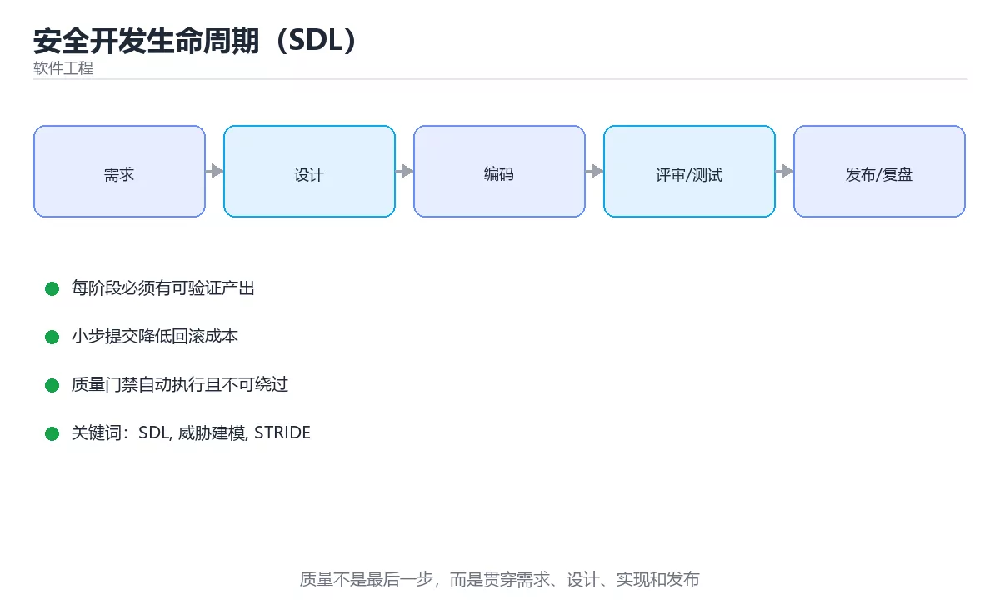

# 安全开发生命周期（SDL）



> 内容更新时间：2026-10-03 · 学习阶段：进阶 · 预计用时：15 分钟

## 学习目标

- 能用自己的话解释「安全开发生命周期（SDL）」解决了什么问题，而不是只背术语。
- 能说清 「SDL」、「威胁建模」、「STRIDE」、「SAST」 之间的关系，并分别举出一个例子。
- 能把本课知识放回「软件工程」的知识体系，说明它和相邻主题的边界。
- 能完成本课练习，并用验收标准检查自己的结果。

> 一句话摘要：六阶段安全活动、STRIDE 威胁建模与落地要点。

## 前置知识

- 先完成上一课《质量度量与工程门禁》；如果已经掌握，可以直接用本课练习自测。
- 本课阶段：进阶。建议先掌握同一分类的基础课程，并能独立运行正文中的最小示例。
- 开始前先复习：SDL、威胁建模、STRIDE。
- 如果某一步看不懂，先记录具体卡点，完成练习后再回头读一遍。


## 把安全左移

缺陷发现得越晚，修复成本越高：需求阶段改一句话 vs 上线后被利用。SDL 的核心是**在每个阶段嵌入安全活动**，而不是上线前做一次扫描。

| 阶段 | 安全活动 | 产出 |
| --- | --- | --- |
| 需求 | 识别资产与合规要求、明确安全需求 | 安全需求清单 |
| 设计 | 威胁建模（STRIDE）、架构评审 | 威胁清单与缓解措施 |
| 编码 | 安全编码规范、SAST、依赖扫描 | 静态检查报告 |
| 测试 | DAST、渗透测试、模糊测试 | 漏洞清单与修复验证 |
| 发布 | 安全配置基线、密钥检查、回滚预案 | 上线检查单 |
| 运营 | 监控告警、漏洞响应、应急演练 | 事件复盘与改进项 |

## 威胁建模：STRIDE 六类

| 威胁 | 含义 | 典型缓解 |
| --- | --- | --- |
| Spoofing 伪装 | 冒充他人身份 | 强认证、多因素 |
| Tampering 篡改 | 修改数据或传输内容 | 签名、完整性校验 |
| Repudiation 抵赖 | 否认操作 | 审计日志、数字签名 |
| Information disclosure 泄露 | 数据被未授权读取 | 加密、最小权限 |
| Denial of service 拒绝服务 | 服务不可用 | 限流、熔断、弹性扩容 |
| Elevation of privilege 提权 | 获得更高权限 | 最小权限、隔离、输入校验 |

做法：画出数据流图 → 标出信任边界 → 对每条跨越边界的流依次套用 STRIDE → 为每个威胁给缓解措施与责任人。**一次 1~2 小时的威胁建模，通常能发现设计层面的高危问题**。

## 落地要点

1. 把安全检查接入 CI：SAST、依赖漏洞、密钥扫描（gitleaks）三类必备。
2. 建立漏洞响应流程：分级、修复时限（P0 24 小时内）、复测闭环。
3. 密钥管理：禁止硬编码，用 KMS/Vault，支持轮换与最小权限。
4. 安全需求可测试化：如"登录失败 5 次锁定 15 分钟"要能写成用例。
5. 定期演练：把历史漏洞转成回归用例与规则，避免同类问题复发。

## 本课小结
SDL 的本质是**把安全变成流程的一部分**：需求定要求、设计做威胁建模、编码有规范与扫描、测试做验证、运营能响应，形成闭环而不是一次性检查。


## SDL 阶段速查

| 阶段 | 安全活动 | 产出 |
| --- | --- | --- |
| 需求 | 安全需求、合规确认 | 安全需求清单 |
| 设计 | 威胁建模（STRIDE）、架构评审 | 威胁与缓解措施 |
| 编码 | 安全编码规范、代码评审 | 评审记录 |
| 测试 | SAST、依赖扫描、渗透测试 | 漏洞清单与修复 |
| 发布 | 密钥检查、配置基线 | 发布检查表 |
| 运维 | 监控、应急响应、补丁 | 事件记录与复盘 |

## STRIDE 威胁速查

| 威胁 | 含义 | 典型缓解 |
| --- | --- | --- |
| Spoofing 伪装 | 冒充身份 | 强认证、多因素 |
| Tampering 篡改 | 修改数据或代码 | 完整性校验、签名 |
| Repudiation 抵赖 | 否认操作 | 审计日志、数字签名 |
| Information disclosure 信息泄露 | 数据被读取 | 加密、最小权限、脱敏 |
| Denial of service 拒绝服务 | 服务不可用 | 限流、弹性、隔离 |
| Elevation of privilege 提权 | 获得更高权限 | 最小权限、输入校验 |

```python
from dataclasses import dataclass, field

@dataclass
class Threat:
    category: str            # STRIDE 之一
    asset: str
    scenario: str
    likelihood: int          # 1 到 5
    impact: int              # 1 到 5
    mitigation: str = ""

    def risk(self) -> int:
        return self.likelihood * self.impact

    def priority(self) -> str:
        score = self.risk()
        if score >= 20:
            return "P0：必须在设计阶段解决"
        if score >= 12:
            return "P1：编码阶段落实缓解"
        if score >= 6:
            return "P2：纳入测试与监控"
        return "P3：记录并观察"

@dataclass
class SecurityReview:
    threats: list = field(default_factory=list)

    def add(self, threat: Threat) -> None:
        self.threats.append(threat)

    def unmitigated(self) -> list:
        return [t for t in self.threats if not t.mitigation]

    def report(self) -> dict:
        ordered = sorted(self.threats, key=lambda t: -t.risk())
        return {
            "total": len(self.threats),
            "unmitigated": len(self.unmitigated()),
            "top": [(t.scenario, t.priority()) for t in ordered[:3]],
            "blocking": [t.scenario for t in self.threats if t.priority() == "P0：必须在设计阶段解决"],
        }

review = SecurityReview()
review.add(Threat("Information disclosure", "用户数据库", "越权读取他人订单", 4, 5))
review.add(Threat("Denial of service", "下单接口", "无限制刷单", 3, 3, "按用户与 IP 限流"))
print(review.report())
```

## CI 安全检查速查

| 检查 | 目标 | 工具类型 |
| --- | --- | --- |
| SAST | 代码层漏洞（注入、路径穿越） | 静态分析 |
| SCA | 第三方依赖已知漏洞 | 依赖扫描 |
| 密钥扫描 | 硬编码密钥与令牌 | 正则加熵检测 |
| DAST | 运行时接口漏洞 | 动态扫描 |
| 镜像扫描 | 容器基础镜像漏洞 | 镜像扫描 |
| IaC 扫描 | 云资源配置错误 | 配置检查 |
| 许可证合规 | 依赖许可证风险 | 许可证检查 |

## 常见错误对照表

| 容易踩的做法 | 实际现象 | 原因与正确做法 |
| --- | --- | --- |
| 上线前才做安全测试 | 问题发现太晚、成本高 | 需求与设计阶段就介入 |
| 只靠扫描器 | 业务逻辑漏洞漏掉 | 结合威胁建模与人工审计 |
| 扫描告警不修 | 漏洞长期存在 | 高危阻断、中低排期修复 |
| 密钥散落各处 | 泄漏与轮换困难 | 集中密钥管理并定期轮换 |
| 无审计日志 | 事件无法追溯 | 关键操作记录不可篡改日志 |
| 依赖不更新 | 已知漏洞长期暴露 | 定期扫描与升级 |
| 权限过大 | 一处失守全线崩溃 | 最小权限与网络分段 |
| 无应急响应流程 | 事件处理混乱 | 预案 + 演练 + 分工 |
| 不做威胁建模 | 遗漏重要威胁 | 设计阶段做 STRIDE |
| 安全需求无验收 | 无法验证是否落实 | 转化为可测的安全用例 |

## 自测清单

- [ ] 需求与设计阶段就开展安全活动（安全左移）。
- [ ] 用 STRIDE 做威胁建模并给出缓解措施。
- [ ] CI 集成 SAST、SCA、密钥与镜像扫描。
- [ ] 密钥集中管理并定期轮换。
- [ ] 有应急响应预案与演练记录。

## 动手练习


> 本课练习重点：围绕「SDL、威胁建模、STRIDE」完成复述、实验和交付，每个结果都要能被别人检查。

先写验收标准，再做最小交付，最后用评审、测试或复盘验证。

### 练习 1：建立心智模型（10 分钟）

合上教程，用 3～5 句话回答：

1. 「安全开发生命周期（SDL）」解决了什么问题？
2. 如果没有它，会出现什么具体后果？
3. 它和「威胁建模」是什么关系？

**验收标准**：至少出现一个本课关键词，并写出一个反例、边界条件或失效场景。

### 练习 2：做一次可控实验（20 分钟）

从正文中选一个最小示例，完成以下操作：

1. 先预测修改一个参数、输入或步骤后的结果。
2. 再实际执行或逐步推演，记录真实结果。
3. 如果结果与预测不同，写出差异原因。

**验收标准**：留下「原例 → 改动 → 预测 → 结果 → 原因」五步记录。

### 练习 3：交付一个小结果（30 分钟）

为一个真实小功能写一页设计、检查表或评审记录，并让同伴能照着执行。

任务要求：

- 结果必须能被别人检查，不能只写“我已经理解了”。
- 至少覆盖「SDL」和「威胁建模」两个关键词。
- 写出 1 个仍然不确定的问题，以及下一步如何验证。

> 提示：时间有限时优先做练习 1 和练习 2；练习 3 可以拆成两次完成。


## 考点精讲：把测验题还原成判断过程

本课有 5 个判断点。先自己作答，再看「判断依据」；如果结论正确但理由不完整，回到正文对应章节补足概念。

### 考点 1：SDL 倡导「安全左移」的含义是？

- **正确判断**：在需求与设计阶段就开展安全活动
- **判断依据**：越早发现安全缺陷，修复成本越低。其他选项：安全不是运维独有职责，也不是把检查集中到上线前或只做渗透测试。安全左移要求在需求与设计阶段就开展安全工作。正确项「在需求与设计阶段就开展安全活动」抓住了题干的核心条件，是经得起边界检验的表述。错误项「把安全检查放到上线前」把不同概念混在一起，缺少题干限定的前提。错误项「由运维负责安全」只看到了表面现象，没有解释题干真正考查的机制。把题干「SDL 倡导「安全左移」的含义是？」放回《安全开发生命周期（SDL）》的「六阶段安全活动、STRIDE 威胁建模与落地要点」语境，逐项对照定义与边界条件，就能排除其余说法。
- **迁移检查**：把题干里的一个条件换成边界值，原来的结论还成立吗？写出判断过程。

### 考点 2：STRIDE 中 I 代表哪类威胁？

- **正确判断**：信息泄露
- **判断依据**：STRIDE = 伪装、篡改、抵赖、信息泄露、拒绝服务、提权。其他选项：完整性对应 I 的是误解（那是 Tampering），提权对应 E，身份伪造对应 S。STRIDE 中的 I 是信息泄露。正确项「信息泄露」既符合定义也满足题干限定的场景，因此应当选择。把题干「STRIDE 中 I 代表哪类威胁？」放回《安全开发生命周期（SDL）》的「六阶段安全活动、STRIDE 威胁建模与落地要点」语境，逐项对照定义与边界条件，就能排除其余说法。
- **迁移检查**：遮住选项，只根据定义复述一次答案，再回来看哪个选项与复述一致。

### 考点 3：下面哪项应该接入 CI 作为必备安全检查？

- **正确判断**：SAST，依赖漏洞扫描
- **判断依据**：这三类检查成本低、可自动化，是最小安全基线。其他选项：只做渗透、仅人工评审、只格式化代码都无法持续拦截。SAST、依赖扫描与密钥扫描才适合作为 CI 必备基线。正确项「SAST，依赖漏洞扫描」既符合定义也满足题干限定的场景，因此应当选择。错误项「只做代码格式化」把因果关系颠倒了，不能作为正确结论。错误项「只有渗透测试」属于相邻主题的说法，范围与本题要求不一致。把题干「下面哪项应该接入 CI 作为必备安全检查？」放回《安全开发生命周期（SDL）》的「六阶段安全活动、STRIDE 威胁建模与落地要点」语境，逐项对照定义与边界条件，就能排除其余说法。
- **迁移检查**：把题干里的一个条件换成边界值，原来的结论还成立吗？写出判断过程。

### 考点 4：依赖漏洞扫描（SCA）主要解决什么问题？

- **正确判断**：发现第三方库中的已知漏洞与许可证风险
- **判断依据**：SCA 的输出要结合可达性判断优先级，避免被大量无关告警淹没。其他选项：业务逻辑漏洞靠人工与动态测试，加密与密钥生成属于其他领域。SCA 解决的是第三方库的已知漏洞与许可证风险。正确项「发现第三方库中的已知漏洞与许可证风险」抓住了题干的核心条件，是经得起边界检验的表述。错误项「加密数据库」把不同概念混在一起，缺少题干限定的前提。错误项「生成密钥」与课程给出的定义相冲突，不能回答题目所问。错误项「检测业务逻辑漏洞（仅部分场景成立）」在边界或失败路径上会得出错误结果。把题干「依赖漏洞扫描（SCA）主要解决什么问题？」放回《安全开发生命周期（SDL）》的「六阶段安全活动、STRIDE 威胁建模与落地要点」语境，逐项对照定义与边界条件，就能排除其余说法。
- **迁移检查**：把题干里的一个条件换成边界值，原来的结论还成立吗？写出判断过程。

### 考点 5：密钥管理的正确做法是？

- **正确判断**：集中存放在密钥管理服务中
- **判断依据**：一旦密钥进入 Git 历史就很难彻底清除，必须配合轮换与吊销。其他选项：聊天工具分发、硬编码与提交到仓库都会导致泄露。正确做法是集中托管、最小权限访问并定期轮换。正确项「集中存放在密钥管理服务中」描述正确，能够解释题干场景中的现象与结果。错误项「硬编码在代码中」与课程给出的定义相冲突，不能回答题目所问。错误项「写在配置文件里提交到仓库」只看到了表面现象，没有解释题干真正考查的机制。错误项「通过聊天工具分发」在边界或失败路径上会得出错误结果。把题干「密钥管理的正确做法是？」放回《安全开发生命周期（SDL）》的「六阶段安全活动、STRIDE 威胁建模与落地要点」语境，逐项对照定义与边界条件，就能排除其余说法。
- **迁移检查**：把题干里的一个条件换成边界值，原来的结论还成立吗？写出判断过程。

## 本课复习清单

离开本课前，逐项确认：

- [ ] 不看解析，能说出「SDL 倡导「安全左移」的含义是？」的判断依据。
- [ ] 不看解析，能说出「STRIDE 中 I 代表哪类威胁？」的判断依据。
- [ ] 不看解析，能说出「下面哪项应该接入 CI 作为必备安全检查？」的判断依据。
- [ ] 不看解析，能说出「依赖漏洞扫描（SCA）主要解决什么问题？」的判断依据。
- [ ] 不看解析，能说出「密钥管理的正确做法是？」的判断依据。
- [ ] 至少运行一次本课示例，记录输入、输出和一个边界情况。
- [ ] 把本课最容易混淆的两个概念写成一句话对照。

| 复盘项 | 记录 |
| --- | --- |
| 已经能独立解释的考点 |  |
| 仍然说不清的概念 |  |
| 下一步验证动作 |  |

## English Overview

**Title:** Secure SDLC

**Summary:** Six-phase security activities and STRIDE modeling.

**Category:** Software Engineering  
**Level:** 进阶  
**Key terms:** SDL, 威胁建模, STRIDE, SAST, 密钥管理

> The full tutorial is written in Chinese. This bilingual overview helps English readers identify the topic, scope and key terms before studying the detailed examples.

## 内容元数据

- 内容版本：v2.0
- 最后更新：2026-10-03
- 学习阶段：进阶
- 适用环境：通用软件工程实践
- 内容来源：内置结构化课程与工程实践整理
- 相关主题：SDL、威胁建模、STRIDE、SAST、密钥管理
- 质量版本：P0 测验标准 + P1 覆盖扩展 + P2 体验补全


## 参考资料与复核

- 最后复核：2026-10-04
- 下次复核：2027-04-04
- 复核范围：版本兼容、API 行为、安全建议与工程实践
- 来源性质：官方文档与标准；本课正文为离线教学重组，不复制原文

| 参考资料 | 本课用途 |
| --- | --- |
| [Martin Fowler](https://martinfowler.com/) | 架构、重构与持续交付 |
| [Google SWE Book Resources](https://abseil.io/resources/swe-book) | 代码评审与工程规范 |

> 本课主题：六阶段安全活动、STRIDE 威胁建模与落地要点。

> App 完全离线展示文字链接，不会自动联网；需要延伸阅读时可复制链接到浏览器。

