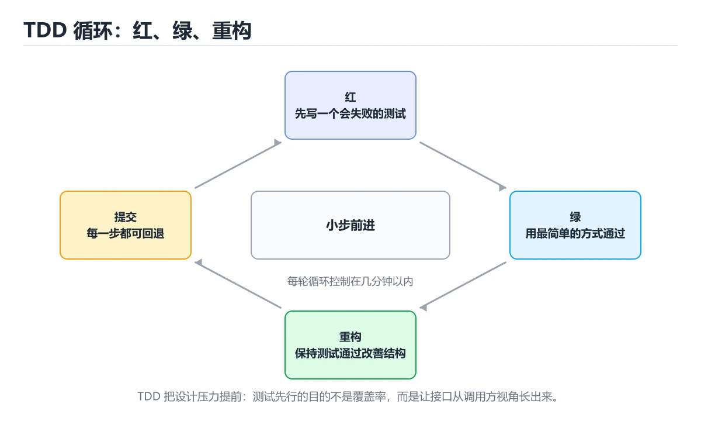
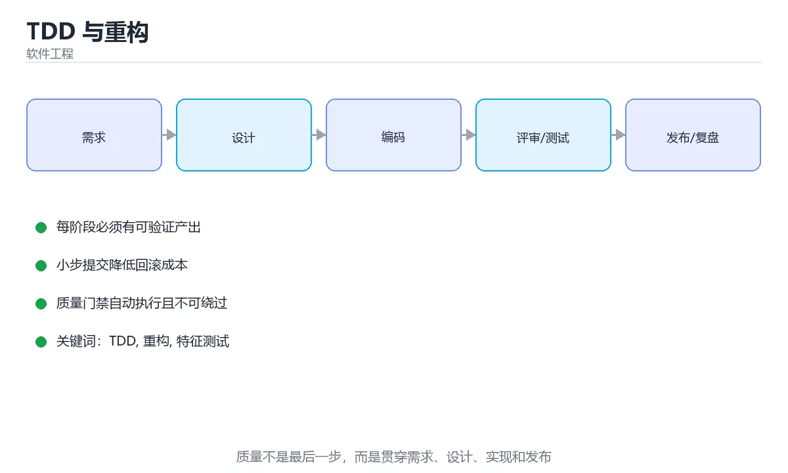

# TDD 与重构





> 内容更新时间：2026-10-03 · 学习阶段：基础 · 预计用时：15 分钟

## 学习目标

- 能用自己的话解释「TDD 与重构」解决了什么问题，而不是只背术语。
- 能说清 「TDD」、「重构」、「特征测试」、「遗留代码」 之间的关系，并分别举出一个例子。
- 能把本课知识放回「软件工程」的知识体系，说明它和相邻主题的边界。
- 能完成本课练习，并用验收标准检查自己的结果。

> 一句话摘要：红绿重构循环、遗留代码特征测试与常用重构手法。

## 前置知识

- 先完成上一课《测试用例设计方法》；如果已经掌握，可以直接用本课练习自测。
- 本课阶段：基础。建议会读写简单代码或命令，并理解变量、输入输出等基本概念。
- 开始前先复习：TDD、重构、特征测试。
- 如果某一步看不懂，先记录具体卡点，完成练习后再回头读一遍。


## 红-绿-重构循环

1. **红**：先写一个失败的测试，明确期望行为。
2. **绿**：用最简实现让它通过（可以"脏"，先跑通）。
3. **重构**：在不断测试的前提下改善结构，消除重复。

每轮 5~15 分钟，小步前进，随时保持可运行状态。TDD 的真正收益不是测试本身，而是**倒逼接口设计**：先想清楚怎么调用，再想怎么实现。

## 三种测试的先后策略

| 策略 | 说明 |
| --- | --- |
| 测试先行 | 新功能、逻辑清晰的模块 |
| 测试后补 | 探索性代码，先跑通再补特征测试 |
| 只做集成测试 | UI 或依赖极重的部分，成本收益权衡后 |

## 遗留代码怎么下手

1. **先加特征测试**（characterization test）：把当前行为（哪怕是 bug）固定下来，形成安全网。
2. 找接缝（seam）：把依赖注入、把静态调用换成接口，让代码可测。
3. 小步重构：先提取方法，再移动代码，最后改名，每步跑测试。
4. 不要重写：重写会丢失隐藏的业务规则，优先就地改造。

## 常见重构手法

提取函数/类、内联临时变量、以查询替代临时变量、搬移函数、以多态替换条件表达式、拆分循环、引入参数对象、消除重复代码。每次只做一种，且要有测试保护。

## 常见坑

1. 测试依赖实现细节，重构即失败——应测行为而非结构。
2. 循环太长，十几步都不跑测试，出了错难以定位。
3. 只重构不加测试，等于在没有安全网时动手术。
4. 追求 100% 覆盖而写出无断言的测试。

## 一次完整的 TDD 演练

需求：实现 `calculateDiscount(level, amount)`，黄金会员满 200 打 8 折，其余不打折。

| 轮次 | 先写的测试 | 最简实现 | 重构动作 |
| --- | --- | --- | --- |
| 1 | 普通会员 100 → 100 | 直接 return amount | 无 |
| 2 | 黄金会员 300 → 240 | 加 if 判断等级与金额 | 提取常量 GOLD_THRESHOLD、GOLD_RATE |
| 3 | 黄金会员 199.99 → 199.99 | 补边界判断 | 把判断抽成 canDiscount 方法 |
| 4 | 白银会员 300 → 300 | 无需改实现（测试即通过） | 发现需求歧义，与业务确认 |

四轮走完，代码只有十几行，但**每条规则与边界都有对应测试**。注意第 4 轮的测试直接通过是好事：说明实现是正确的，测试的价值在于固化为文档与回归保护。

演练要点：每轮只加一个失败测试；实现要"最简"（可以硬编码，下一轮再抽象）；重构只在绿灯时进行；提交粒度可以是每轮一次，便于回滚。

## 重构安全网与遗留代码接缝

**开工前的安全网清单**：① 关键路径有测试（没有就先补特征测试）；② 版本控制干净（可随时回退）；③ 知道如何本地运行与验证；④ 明确"不改变外部行为"的边界；⑤ 小步提交，每步可独立回滚。缺任何一条都先补齐再动手。

**遗留代码的四种接缝**（让代码可测的切入点）：

| 接缝类型 | 做法 |
| --- | --- |
| 参数注入 | 把 new 出来的依赖改成构造参数传入 |
| 提取并覆盖 | 把难测的静态调用抽成方法，子类覆写（测试子类） |
| 接口隔离 | 为外部依赖定义接口，测试时用假实现 |
| 时间与随机源注入 | 把 now()/random() 抽成可注入的时钟与随机源 |

顺序建议：**先补测试再动结构**，每次只做一种重构手法（提取方法→移动→改名），每步跑测试；遇到"改完发现测试挂了但说不清是不是 bug"，说明测试覆盖的是实现细节，应补行为级断言。

## 本课小结
TDD 提供节奏，重构提供手段，**两者共同的前提是有一层能快速反馈的自动化测试**；遗留代码先从特征测试与接缝入手。


## TDD 循环速查

| 阶段 | 动作 | 要求 |
| --- | --- | --- |
| 红 | 先写一个失败的测试 | 测试因功能缺失而失败，而非语法错误 |
| 绿 | 用最简实现让测试通过 | 不追求优雅，先跑通 |
| 重构 | 在测试保护下改善结构 | 行为不变，小步前进 |

节奏建议：每轮几分钟到十几分钟，测试与实现都保持小而聚焦。

## 重构手法速查

| 坏味道 | 手法 |
| --- | --- |
| 长函数 | 提取函数 |
| 重复代码 | 提取公共方法或抽象 |
| 深层嵌套 | 提前返回或卫语句 |
| 长参数列表 | 引入参数对象 |
| 发散式变化 | 按变化原因拆分 |
| 数据泥团 | 提取值对象 |
| 特性依恋 | 把方法移到数据所在类 |
| 基本类型偏执 | 引入值对象封装概念 |

```python
from dataclasses import dataclass

# 重构前：深层嵌套 + 魔法数字 + 多职责
def fee_bad(amount, is_vip, days):
    if amount > 0:
        if is_vip:
            if days <= 3:
                return amount * 0.95
            else:
                return amount * 0.9
        else:
            if days <= 3:
                return amount
            else:
                return amount * 0.98
    return 0

# 重构后：策略表 + 提前返回 + 值对象
@dataclass(frozen=True)
class FeePolicy:
    vip_rate: float = 0.9
    normal_rate: float = 0.98
    short_window_days: int = 3
    short_bonus: float = 0.05

    def rate(self, is_vip: bool, days: int) -> float:
        base = self.vip_rate if is_vip else self.normal_rate
        if days <= self.short_window_days:
            base = min(1.0, base + self.short_bonus)
        return base

def fee(amount: float, is_vip: bool, days: int, policy: FeePolicy | None = None) -> float:
    if amount <= 0:
        return 0.0
    policy = policy or FeePolicy()
    return round(amount * policy.rate(is_vip, days), 2)

assert fee(100, True, 2) == round(fee_bad(100, True, 2), 2)
assert fee(100, False, 10) == round(fee_bad(100, False, 10), 2)
print("行为一致")
```

## 遗留代码改造速查

| 步骤 | 动作 |
| --- | --- |
| 1 找接缝 | 定位可替换的边界（依赖注入点） |
| 2 补特征测试 | 固定当前行为，包括怪异行为 |
| 3 小步重构 | 每次改动后测试必须通过 |
| 4 引入新设计 | 用策略、适配器等替换旧逻辑 |
| 5 删除死代码 | 有测试保护后再清理 |

原则：**先固定行为，再改结构**。特征测试是遗留代码的安全网。

## 常见错误对照表

| 容易踩的做法 | 实际现象 | 原因与正确做法 |
| --- | --- | --- |
| 先写实现再补测试 | 测试只是为了通过 | 先写测试驱动设计 |
| 一次写很大的测试 | 失败原因难定位 | 小而聚焦，一次一个行为 |
| 绿阶段过度设计 | 反馈变慢 | 先最简实现，重构阶段优化 |
| 重构与功能改动混在一起 | 出问题无法归因 | 分两次提交 |
| 测试断言实现细节 | 重构后大量失败 | 断言可观察行为 |
| 遗留代码直接重写 | 风险极高 | 先补特征测试再逐步替换 |
| 只跑单个测试 | 回归漏掉 | 提交前跑完整套件 |
| 测试依赖外部服务 | 不稳定且慢 | 用替身隔离 |
| 无版本控制小步提交 | 无法回退 | 每轮循环提交一次 |
| 忽略覆盖率盲区 | 关键分支未测 | 看未覆盖分支补用例 |

## 自测清单

- [ ] 遵循红、绿、重构三步且节奏小步。
- [ ] 测试断言行为而非实现细节。
- [ ] 重构与功能改动分开提交。
- [ ] 遗留代码先补特征测试再改造。
- [ ] 每轮循环结束跑完整测试套件。

## 动手练习


> 本课练习重点：围绕「TDD、重构、特征测试」完成复述、实验和交付，每个结果都要能被别人检查。

先写验收标准，再做最小交付，最后用评审、测试或复盘验证。

### 练习 1：建立心智模型（10 分钟）

合上教程，用 3～5 句话回答：

1. 「TDD 与重构」解决了什么问题？
2. 如果没有它，会出现什么具体后果？
3. 它和「重构」是什么关系？

**验收标准**：至少出现一个本课关键词，并写出一个反例、边界条件或失效场景。

### 练习 2：做一次可控实验（20 分钟）

从正文中选一个最小示例，完成以下操作：

1. 先预测修改一个参数、输入或步骤后的结果。
2. 再实际执行或逐步推演，记录真实结果。
3. 如果结果与预测不同，写出差异原因。

**验收标准**：留下「原例 → 改动 → 预测 → 结果 → 原因」五步记录。

### 练习 3：交付一个小结果（30 分钟）

为一个真实小功能写一页设计、检查表或评审记录，并让同伴能照着执行。

任务要求：

- 结果必须能被别人检查，不能只写“我已经理解了”。
- 至少覆盖「TDD」和「重构」两个关键词。
- 写出 1 个仍然不确定的问题，以及下一步如何验证。

> 提示：时间有限时优先做练习 1 和练习 2；练习 3 可以拆成两次完成。


## 考点精讲：把测验题还原成判断过程

本课有 6 个判断点。先自己作答，再看「判断依据」；如果结论正确但理由不完整，回到正文对应章节补足概念。

### 考点 1：TDD 的三步循环是？

- **正确判断**：红（失败测试）→ 绿（最简实现）→ 重构
- **判断依据**：正确答案是「红（失败测试）→ 绿（最简实现）→ 重构」，本课在「红-绿-重构循环」中说明：绿：用最简实现让它通过（可以"脏"，先跑通）。小步前进并始终保持在可运行状态。本课还在「遗留代码怎么下手」中说明：先加特征测试（characterization test）：把当前行为（哪怕是 bug）固定下来，形成安全网。本课还在「重构安全网与遗留代码接缝」中说明：开工前的安全网清单：① 关键路径有测试（没有就先补特征测试）。
- **迁移检查**：如果给某个错误选项去掉一个限定词，它会不会变成正确？说明理由。

### 考点 2：改造遗留代码的第一步通常是？

- **正确判断**：先补特征测试固定当前行为
- **判断依据**：正确答案是「先补特征测试固定当前行为」，本课在「遗留代码怎么下手」中说明：先加特征测试（characterization test）：把当前行为（哪怕是 bug）固定下来，形成安全网。特征测试形成安全网，之后的重构才有保障。本课还在「重构安全网与遗留代码接缝」中说明：开工前的安全网清单：① 关键路径有测试（没有就先补特征测试）。本课还在「重构安全网与遗留代码接缝」中说明：遗留代码的四种接缝（让代码可测的切入点）。
- **迁移检查**：把题干里的一个条件换成边界值，原来的结论还成立吗？写出判断过程。

### 考点 3：好的测试应该断言？

- **正确判断**：外部可观察的行为
- **判断依据**：正确答案是「外部可观察的行为」，本课在「常见坑」中说明：测试依赖实现细节，重构即失败——应测行为而非结构。测行为才能在重构后保持通过。本课还在「重构安全网与遗留代码接缝」中说明：遇到"改完发现测试挂了但说不清是不是 bug"，说明测试覆盖的是实现细节，应补行为级断言。本课还在「重构安全网与遗留代码接缝」中说明：遗留代码的四种接缝（让代码可测的切入点）。
- **迁移检查**：把题干里的一个条件换成边界值，原来的结论还成立吗？写出判断过程。

### 考点 4：重构的准确定义是？

- **正确判断**：在不改变外部可观察行为的前提下改善内部结构
- **判断依据**：正确答案是「在不改变外部可观察行为的前提下改善内部结构」，本课在「红-绿-重构循环」中说明：重构：在不断测试的前提下改善结构，消除重复。正因为不改变行为，测试才能成为重构期间的安全网。本课还在「本课小结」中说明：TDD 提供节奏，重构提供手段，两者共同的前提是有一层能快速反馈的自动化测试。本课还在「遗留代码怎么下手」中说明：小步重构：先提取方法，再移动代码，最后改名，每步跑测试。
- **迁移检查**：把题干里的一个条件换成边界值，原来的结论还成立吗？写出判断过程。

### 考点 5：测试替身中的 fake 指的是？

- **正确判断**：有可运行的简化实现
- **判断依据**：正确答案是「有可运行的简化实现」，本课在「红-绿-重构循环」中说明：每轮 5~15 分钟，小步前进，随时保持可运行状态。fake 保留了真实对象的部分行为，因此在集成测试里也常常有用。本课还在「红-绿-重构循环」中说明：TDD 的真正收益不是测试本身，而是倒逼接口设计：先想清楚怎么调用，再想怎么实现。本课还在「遗留代码怎么下手」中说明：找接缝（seam）：把依赖注入、把静态调用换成接口，让代码可测。
- **迁移检查**：遮住选项，只根据定义复述一次答案，再回来看哪个选项与复述一致。

### 考点 6：补全代码：「TDD 与重构」示例中，下面这行代码缺少哪个关键字或函数名？请填入 ____。 `return round(amount * policy.____(is_vip, days), 2)`

- **正确判断**：rate
- **判断依据**：正确答案是「rate」，本课在「常见重构手法」中说明：提取函数/类、内联临时变量、以查询替代临时变量、搬移函数、以多态替换条件表达式、拆分循环、引入参数对象、消除重复代码。本课还在「常见坑」中说明：只重构不加测试，等于在没有安全网时动手术。本课还在「一次完整的 TDD 演练」中说明：需求：实现 calculateDiscount(level, amount)，黄金会员满 200 打 8 折，其余不打折。
- **迁移检查**：把答案换成另一种等价写法，是否仍然正确？说明依据。

### 补充考点 1：按照「TDD 与重构」从概念到实践的讲解顺序排列下列主题。

- **正确判断**：红-绿-重构循环 → 三种测试的先后策略 → 遗留代码怎么下手 → 常见重构手法
- **判断依据**：在「TDD 与重构」中，正确顺序是：1. 红-绿-重构循环 → 2. 三种测试的先后策略 → 3. 遗留代码怎么下手 → 4. 常见重构手法。「TDD 与重构」先建立概念，再解释运行机制，随后进入代码与工程实践，最后处理失败路径。在「TDD 与重构」里，如果把后一步放到前面，通常会缺少前一步产生的定义、输入或验证结果。

## 本课复习清单

离开本课前，逐项确认：

- [ ] 不看解析，能说出「TDD 的三步循环是？」的判断依据。
- [ ] 不看解析，能说出「改造遗留代码的第一步通常是？」的判断依据。
- [ ] 不看解析，能说出「好的测试应该断言？」的判断依据。
- [ ] 不看解析，能说出「重构的准确定义是？」的判断依据。
- [ ] 不看解析，能说出「测试替身中的 fake 指的是？」的判断依据。
- [ ] 不看解析，能说出「补全代码：「TDD 与重构」示例中，下面这行代码缺少哪个关键字或函数名？请填入 …」的判断依据。
- [ ] 至少运行一次本课示例，记录输入、输出和一个边界情况。
- [ ] 把本课最容易混淆的两个概念写成一句话对照。

| 复盘项 | 记录 |
| --- | --- |
| 已经能独立解释的考点 |  |
| 仍然说不清的概念 |  |
| 下一步验证动作 |  |

## 术语速查

把本课反复出现的术语集中放在一起。复习时先遮住右列，尝试用自己的话解释，再回到正文核对。

| 术语 | 本课语境 |
| --- | --- |
| `calculateDiscount(level, amount)` | 需求：实现 `calculateDiscount(level, amount)`，黄金会员满 200 打 8 折，其余不打折。 |
| `TDD` | 本课围绕该主题展开，结合正文与代码示例理解它的适用边界。 |
| `重构` | 本课围绕该主题展开，结合正文与代码示例理解它的适用边界。 |
| `特征测试` | 本课围绕该主题展开，结合正文与代码示例理解它的适用边界。 |
| `遗留代码` | 本课围绕该主题展开，结合正文与代码示例理解它的适用边界。 |

## 面试问答与自测

下面把本课考点换成面试追问。先口述自己的答案，
再对照参考回答检查是否遗漏了前提、边界或失败路径。

### 追问 1：TDD 的三步循环是？

**参考回答**：正确答案是「红（失败测试）→ 绿（最简实现）→ 重构」，本课在「红-绿-重构循环」中说明：绿：用最简实现让它通过（可以"脏"，先跑通）。小步前进并始终保持在可运行状态。本课还在「遗留代码怎么下手」中说明：先加特征测试（characterization test）：把当前行为（哪怕是 bug）固定下来，形成安全网。本课还在「重构安全网与遗留代码接缝」中说明：开工前的安全网清单：① 关键路径有测试（没有就先补特征测试）。

### 追问 2：改造遗留代码的第一步通常是？

**参考回答**：正确答案是「先补特征测试固定当前行为」，本课在「遗留代码怎么下手」中说明：先加特征测试（characterization test）：把当前行为（哪怕是 bug）固定下来，形成安全网。特征测试形成安全网，之后的重构才有保障。本课还在「重构安全网与遗留代码接缝」中说明：开工前的安全网清单：① 关键路径有测试（没有就先补特征测试）。本课还在「重构安全网与遗留代码接缝」中说明：遗留代码的四种接缝（让代码可测的切入点）。

### 追问 3：好的测试应该断言？

**参考回答**：正确答案是「外部可观察的行为」，本课在「常见坑」中说明：测试依赖实现细节，重构即失败——应测行为而非结构。测行为才能在重构后保持通过。本课还在「重构安全网与遗留代码接缝」中说明：遇到"改完发现测试挂了但说不清是不是 bug"，说明测试覆盖的是实现细节，应补行为级断言。本课还在「重构安全网与遗留代码接缝」中说明：遗留代码的四种接缝（让代码可测的切入点）。

### 追问 4：重构的准确定义是？

**参考回答**：正确答案是「在不改变外部可观察行为的前提下改善内部结构」，本课在「红-绿-重构循环」中说明：重构：在不断测试的前提下改善结构，消除重复。正因为不改变行为，测试才能成为重构期间的安全网。本课还在「本课小结」中说明：TDD 提供节奏，重构提供手段，两者共同的前提是有一层能快速反馈的自动化测试。本课还在「遗留代码怎么下手」中说明：小步重构：先提取方法，再移动代码，最后改名，每步跑测试。

### 追问 5：测试替身中的 fake 指的是？

**参考回答**：正确答案是「有可运行的简化实现」，本课在「红-绿-重构循环」中说明：每轮 5~15 分钟，小步前进，随时保持可运行状态。fake 保留了真实对象的部分行为，因此在集成测试里也常常有用。本课还在「红-绿-重构循环」中说明：TDD 的真正收益不是测试本身，而是倒逼接口设计：先想清楚怎么调用，再想怎么实现。本课还在「遗留代码怎么下手」中说明：找接缝（seam）：把依赖注入、把静态调用换成接口，让代码可测。

## English Overview

**Title:** TDD & Refactoring

**Summary:** Red-green-refactor, characterization tests and refactoring.

**Category:** Software Engineering  
**Level:** 基础  
**Key terms:** TDD, 重构, 特征测试, 遗留代码

> The full tutorial is written in Chinese. This bilingual overview helps English readers identify the topic, scope and key terms before studying the detailed examples.

## 内容元数据

- 内容版本：v2.0
- 最后更新：2026-10-03
- 学习阶段：基础
- 适用环境：通用软件工程实践
- 内容来源：内置结构化课程与工程实践整理
- 相关主题：TDD、重构、特征测试、遗留代码
- 质量版本：P0 测验标准 + P1 覆盖扩展 + P2 体验补全


## 参考资料与复核

- 最后复核：2026-10-04
- 下次复核：2027-04-04
- 复核范围：版本兼容、API 行为、安全建议与工程实践
- 来源性质：官方文档与标准；本课正文为离线教学重组，不复制原文

| 参考资料 | 本课用途 |
| --- | --- |
| [Martin Fowler](https://martinfowler.com/) | 架构、重构与持续交付 |
| [Google SWE Book Resources](https://abseil.io/resources/swe-book) | 代码评审与工程规范 |

> 本课主题：红绿重构循环、遗留代码特征测试与常用重构手法。

> App 完全离线展示文字链接，不会自动联网；需要延伸阅读时可复制链接到浏览器。
