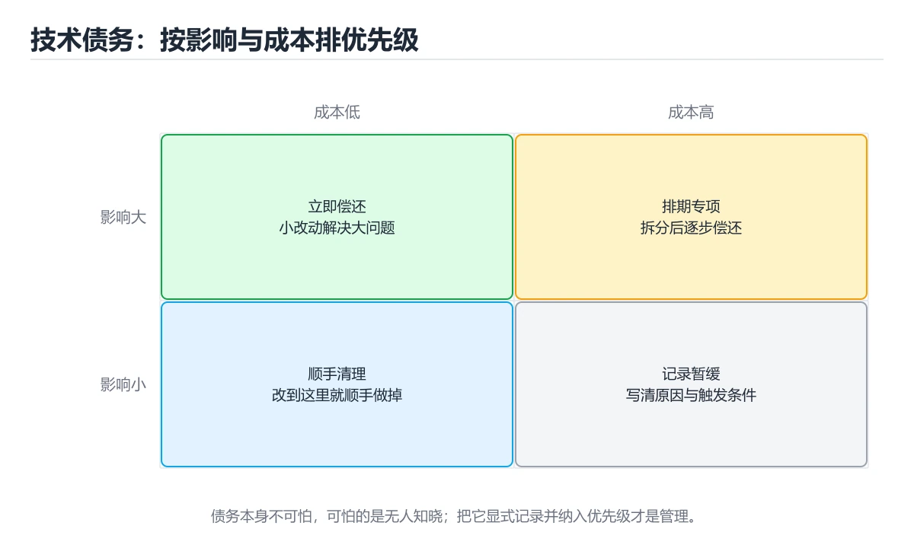
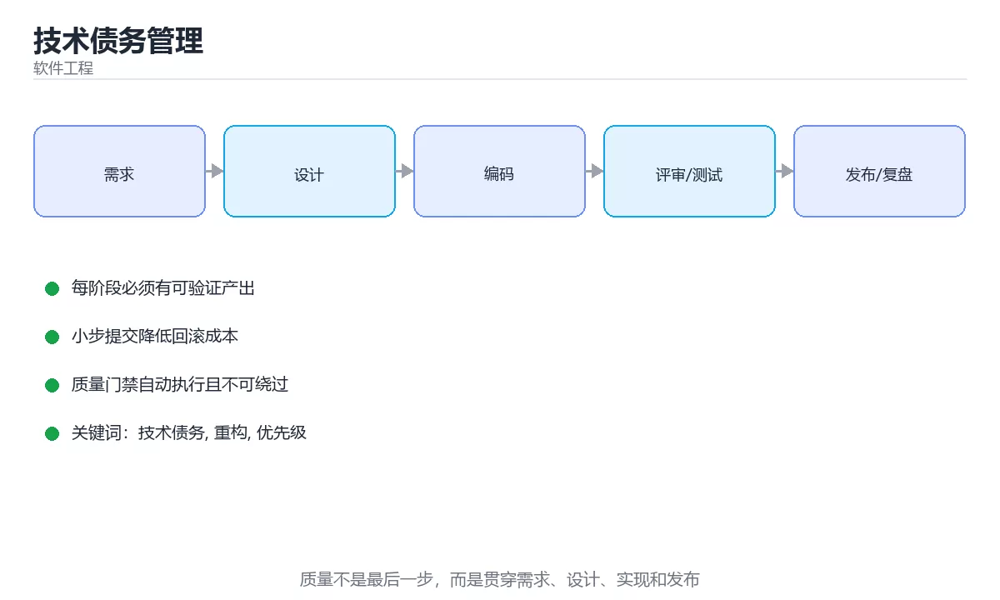

# 技术债务管理





> 内容更新时间：2026-10-03 · 学习阶段：进阶 · 预计用时：16 分钟

## 学习目标

- 能用自己的话解释「技术债务管理」解决了什么问题，而不是只背术语。
- 能说清 「技术债务」、「重构」、「优先级」、「绞杀者模式」 之间的关系，并分别举出一个例子。
- 能把本课知识放回「软件工程」的知识体系，说明它和相邻主题的边界。
- 能完成本课练习，并用验收标准检查自己的结果。

> 一句话摘要：债务分类、量化排序、偿还策略与业务沟通方式。

## 前置知识

- 先完成上一课《On-Call 与告警治理》；如果已经掌握，可以直接用本课练习自测。
- 本课阶段：进阶。建议先掌握同一分类的基础课程，并能独立运行正文中的最小示例。
- 开始前先复习：技术债务、重构、优先级。
- 如果某一步看不懂，先记录具体卡点，完成练习后再回头读一遍。


## 债务类型速查

| 类型 | 表现 | 典型来源 |
| --- | --- | --- |
| 代码债务 | 重复、长函数、命名混乱 | 赶工期、缺少评审 |
| 设计债务 | 模块耦合、职责不清 | 需求快速变化、缺少设计 |
| 测试债务 | 覆盖不足、用例脆弱 | 先上线后补测试 |
| 文档债务 | 文档过期、缺少 Runbook | 只改代码不改文档 |
| 依赖债务 | 版本老旧、存在漏洞 | 长期不升级 |
| 基础设施债务 | 手工部署、无监控 | 缺少平台投入 |

关键认知：**债务不是「坏代码」的同义词，而是「未来需要额外成本」的选择。** 有意识借债可接受，无意识积累才是风险。

## 量化与优先级

| 维度 | 评估方式 |
| --- | --- |
| 影响面 | 涉及多少模块与团队 |
| 变更频率 | 该区域多久改一次（改得越多，债务代价越大） |
| 风险 | 是否影响稳定性、安全或数据正确性 |
| 修复成本 | 人日估算与依赖条件 |
| 拖延成本 | 不修的代价：缺陷率、交付速度、值班负担 |

优先级经验法则：**高频改动 + 高风险的债务优先偿还**；低频且稳定的老模块可以长期保留债务。

```python
from dataclasses import dataclass, field

@dataclass
class DebtItem:
    name: str
    area: str
    risk: int              # 1 到 5：稳定性与安全风险
    change_frequency: int  # 1 到 5：改动频率
    fix_cost_days: float   # 修复人日
    drag_cost_days: float  # 每月因此额外消耗的人日

    def score(self) -> float:
        """优先级得分：风险与变更频率相乘，除以修复成本。"""
        if self.fix_cost_days <= 0:
            raise ValueError("修复成本必须为正")
        return round(self.risk * self.change_frequency / self.fix_cost_days, 3)

    def payback_months(self) -> float:
        """回本月数：额外消耗越少，回本越慢。"""
        if self.drag_cost_days <= 0:
            return float("inf")
        return round(self.fix_cost_days / self.drag_cost_days, 1)

    def verdict(self) -> str:
        if self.risk >= 4 and self.change_frequency >= 4:
            return "立即偿还：高风险且频繁改动"
        if self.payback_months() <= 3:
            return "本季度偿还：回本快"
        if self.change_frequency <= 2 and self.risk <= 2:
            return "可长期保留：低频低风险"
        return "排入待办：按容量逐步处理"

@dataclass
class DebtBacklog:
    items: list = field(default_factory=list)

    def ranked(self) -> list:
        return sorted(self.items, key=lambda item: -item.score())

    def total_drag(self) -> float:
        """每月总拖累：用于向业务解释偿还债务的收益。"""
        return round(sum(item.drag_cost_days for item in self.items), 1)

    def report(self) -> list:
        return [
            (item.name, round(item.score(), 2), item.verdict())
            for item in self.ranked()
        ]

backlog = DebtBacklog([
    DebtItem("订单模块重复逻辑", "order", risk=4, change_frequency=5,
             fix_cost_days=8, drag_cost_days=3),
    DebtItem("遗留报表脚本", "report", risk=1, change_frequency=1,
             fix_cost_days=6, drag_cost_days=0.2),
])
print(backlog.report())
print("每月总拖累（人日）：", backlog.total_drag())
```

## 偿还策略速查

| 策略 | 说明 | 适用 |
| --- | --- | --- |
| 顺路偿还 | 改动该模块时顺手清理 | 小范围、低风险债务 |
| 专项偿还 | 单独排期集中处理 | 高风险、跨模块债务 |
| 隔离封装 | 用适配层包住旧实现，新代码不再依赖 | 短期无法重写 |
| 重写替换 | 逐步迁移到新实现，双跑验证 | 旧实现无法维护 |
| 接受并记录 | 明确不修，记录原因与风险 | 低频低风险 |

反模式：**「重写整条链路」这种大爆炸式改动**往往以失败告终，优先选择绞杀者模式（逐步替换）。

## 与业务沟通的要点

| 业务关心 | 表达方式 |
| --- | --- |
| 交付速度 | 「该模块现在改一次要 3 天，偿还后约 1 天」 |
| 稳定性 | 「上季度 3 次故障中有 2 次源于这里」 |
| 成本 | 「每月额外消耗约 3 人日，偿还需 8 人日」 |
| 风险 | 「不修会持续累积，且新需求叠加后成本翻倍」 |

用数据说话，避免「代码太烂」这类主观表述。

## 常见错误对照表

| 容易踩的做法 | 实际现象 | 原因与正确做法 |
| --- | --- | --- |
| 把所有不喜欢的代码都叫债务 | 排期永远排不完 | 只记录有实际代价的问题 |
| 只做重写不做验证 | 上线后行为不一致 | 新旧双跑 + 灰度切换 |
| 不量化拖累成本 | 业务无法判断优先级 | 用人日与故障次数表达 |
| 债务清单无人维护 | 积压后失效 | 定期评审并绑定负责人 |
| 无容量预算 | 债务永远排在需求之后 | 每个迭代固定留出偿还容量 |
| 只清代码不改测试与文档 | 很快再次腐化 | 一并补齐测试与 Runbook |
| 大爆炸重写 | 长期无交付、风险集中 | 用绞杀者模式逐步替换 |

## 自测清单

- [ ] 债务按风险、变更频率与成本量化排序。
- [ ] 每个迭代预留固定容量偿还债务。
- [ ] 高风险高频模块优先处理，低频低风险可接受保留。
- [ ] 重写采用逐步替换并配双跑验证。
- [ ] 能用数据向业务说明偿还收益。

## 动手练习


> 本课练习重点：围绕「技术债务、重构、优先级」完成复述、实验和交付，每个结果都要能被别人检查。

先写验收标准，再做最小交付，最后用评审、测试或复盘验证。

### 练习 1：建立心智模型（10 分钟）

合上教程，用 3～5 句话回答：

1. 「技术债务管理」解决了什么问题？
2. 如果没有它，会出现什么具体后果？
3. 它和「重构」是什么关系？

**验收标准**：至少出现一个本课关键词，并写出一个反例、边界条件或失效场景。

### 练习 2：做一次可控实验（20 分钟）

从正文中选一个最小示例，完成以下操作：

1. 先预测修改一个参数、输入或步骤后的结果。
2. 再实际执行或逐步推演，记录真实结果。
3. 如果结果与预测不同，写出差异原因。

**验收标准**：留下「原例 → 改动 → 预测 → 结果 → 原因」五步记录。

### 练习 3：交付一个小结果（30 分钟）

为一个真实小功能写一页设计、检查表或评审记录，并让同伴能照着执行。

任务要求：

- 结果必须能被别人检查，不能只写“我已经理解了”。
- 至少覆盖「技术债务」和「重构」两个关键词。
- 写出 1 个仍然不确定的问题，以及下一步如何验证。

> 提示：时间有限时优先做练习 1 和练习 2；练习 3 可以拆成两次完成。

## 本课小结

- 核心问题：「技术债务管理」不是孤立术语，而是在「软件工程」中解决一类具体问题。
- 关键关系：先分清「技术债务」与「重构」的职责，再理解「优先级」的适用边界。
- 判断标准：能解释正常场景、边界条件和失败场景，才算真正掌握。
- 下一步：完成练习后，用自己的话写下 3 条要点，再去做本课测验。


## 深入补充：技术债务管理

前面已经建立了基本概念。这一节换一个角度，把「技术债务管理」放进真实工程里，
重点回答三件事：它为什么存在、内部如何运转、什么时候会失效。

### 一、核心模型

技术债务是为了短期收益做出的设计妥协，未来需要额外成本偿还；管理债务的关键不是清零，而是让债务可见、有主人、有优先级，并与业务目标对齐。

```text
识别债务 → 记录影响与证据 → 评估偿还成本 → 排优先级 → 小步偿还 → 验证收益 → 防止新增
```

### 二、关键机制拆解

1. 债务包括代码复杂度、缺失测试、过期依赖、架构耦合、文档缺失和运维手工步骤。
2. 债务不一定都是坏事，有意识、可控、带偿还计划的妥协可以换取速度。
3. 识别债务要基于证据：缺陷率、变更周期、故障次数、开发者体验和客户影响。
4. 偿还优先级按风险和收益排序，而不是按“代码看起来丑”排序。
5. 小步重构、绞杀者模式和特性开关能在不影响交付的情况下逐步替换旧系统。
6. 每个债务项应有负责人、触发条件、预估成本和验收标准。
7. 防止新增债务要在评审、测试、架构决策和发布流程中设置门禁。

### 三、对照表：抓住容易混淆的边界

| 维度 | 一侧 | 另一侧 |
| --- | --- | --- |
| 战略债务 | 有意识地为速度妥协 | 有计划偿还，可能带来收益 |
| 无意债务 | 团队未察觉的设计问题 | 风险不可见，容易累积 |
| 重构 | 改善内部结构不改变行为 | 依赖测试保护 |
| 重写 | 替换实现甚至改变架构 | 风险高，通常应分阶段 |

### 四、工作示例

一个单体模块每次修改都引发回归。团队先补关键路径测试，再用绞杀者模式把新功能放到独立模块，逐步迁移旧逻辑；每次发布都验证行为一致，避免一次性重写。

### 五、常见误区与失效边界

| 错误做法或假设 | 后果 | 正确做法 |
| --- | --- | --- |
| 把所有不喜欢的代码都叫债务 | 优先级失焦 | 用数据说明风险、成本和影响 |
| 只记录不偿还 | 债务清单变成摆设 | 把偿还项纳入迭代和验收 |
| 一次性大重写 | 长期无法交付且风险集中 | 使用小步迁移和双跑验证 |
| 没有负责人 | 问题长期搁置 | 每项债务指定所有者和触发条件 |

### 六、场景推演

支付模块依赖一个已停止维护的库。团队评估安全风险、升级成本和替代方案后，先加隔离层阻止扩散，再用两个迭代替换关键调用，最后移除旧依赖并补回归测试。

### 七、自测问答

**Q1：技术债务一定是坏事吗？**

不一定，有意识且可控的妥协可以换取速度，但必须有偿还计划。

**Q2：如何判断债务优先级？**

根据风险、影响范围、发生频率和偿还收益排序。

**Q3：绞杀者模式适合什么场景？**

逐步替换旧系统，在不中断交付的情况下迁移能力。

**Q4：如何防止新增债务？**

在评审、测试、架构决策和发布流程中设置质量门禁。

### 八、小项目：把知识变成可检查的产出

为一个小项目建立技术债务台账：记录 10 项债务、证据、影响、成本、负责人和触发条件；选出 2 项在本迭代偿还，并用变更周期或缺陷率验证效果。

### 九、适用边界

技术债务管理不是追求完美代码，而是在有限资源下控制风险。偿还必须服务于业务目标，不能脱离交付节奏进行无止境重构。

### 十、完成检查清单

- [ ] 能识别并分类技术债务
- [ ] 能用证据评估风险与收益
- [ ] 能制定小步偿还计划
- [ ] 能为每项债务指定负责人
- [ ] 能通过流程门禁防止新增债务

### 十一、复习顺序

1. 先不看资料复述“核心模型”，确认能说出它解决的三个问题。
2. 再对照表逐行解释容易混淆的概念，每个概念补一个反例。
3. 跟着工作示例做一遍，改变一个条件并预测结果。
4. 用自测问答检查理解，错题回到对应小节重新阅读。
5. 最后完成小项目，把结果、失败记录和复查清单整理成一份可提交产物。

> 复习不是重读一遍，而是离开原文重新产出：复述、改写、验证、复盘。


## 考点精讲：把测验题还原成判断过程

本课有 6 个判断点。先自己作答，再看「判断依据」；如果结论正确但理由不完整，回到正文对应章节补足概念。

### 考点 1：技术债务的准确定义是？

- **正确判断**：为了短期收益而选择带来未来额外成本的设计与实现
- **判断依据**：正确答案是「为了短期收益而选择带来未来额外成本的设计与实现」，本课在「深入补充：技术债务管理」中说明：技术债务是为了短期收益做出的设计妥协，未来需要额外成本偿还。债务的关键是「未来需要额外成本」，它可能是有意识的选择，也可能是无意积累。本课还在「深入补充：技术债务管理」中说明：技术债务管理不是追求完美代码，而是在有限资源下控制风险。本课还在「偿还策略速查」中说明：反模式：「重写整条链路」这种大爆炸式改动往往以失败告终，优先选择绞杀者模式（逐步替换）。
- **迁移检查**：遮住选项，只根据定义复述一次答案，再回来看哪个选项与复述一致。

### 考点 2：优先偿还哪类债务？

- **正确判断**：高风险且改动频繁的部分
- **判断依据**：正确答案是「高风险且改动频繁的部分」，本课在「深入补充：技术债务管理」中说明：技术债务管理不是追求完美代码，而是在有限资源下控制风险。改动频率决定了债务被反复支付的次数，风险决定后果严重程度，两者都高时收益最大。本课还在「量化与优先级」中说明：优先级经验法则：高频改动 + 高风险的债务优先偿还。本课还在「深入补充：技术债务管理」中说明：小步重构、绞杀者模式和特性开关能在不影响交付的情况下逐步替换旧系统。
- **迁移检查**：遮住选项，只根据定义复述一次答案，再回来看哪个选项与复述一致。

### 考点 3：想向业务说明偿还债务的价值，最有效的表达是？

- **正确判断**：「这个模块改一次要 3 天
- **判断依据**：正确答案是「「这个模块改一次要 3 天」，本课在「深入补充：技术债务管理」中说明：团队先补关键路径测试，再用绞杀者模式把新功能放到独立模块，逐步迁移旧逻辑。用交付速度、故障次数与人日成本表达，业务才能做优先级判断。本课还在「偿还策略速查」中说明：反模式：「重写整条链路」这种大爆炸式改动往往以失败告终，优先选择绞杀者模式（逐步替换）。本课还在「深入补充：技术债务管理」中说明：小步重构、绞杀者模式和特性开关能在不影响交付的情况下逐步替换旧系统。
- **迁移检查**：遮住选项，只根据定义复述一次答案，再回来看哪个选项与复述一致。

### 考点 4：无法短期重写的旧实现，推荐采用的策略是？

- **正确判断**：用适配层隔离旧实现，新代码不再依赖它
- **判断依据**：正确答案是「用适配层隔离旧实现，新代码不再依赖它」，本课在「深入补充：技术债务管理」中说明：团队先补关键路径测试，再用绞杀者模式把新功能放到独立模块，逐步迁移旧逻辑。绞杀者模式通过封装与逐步迁移控制风险，同时保持业务连续。本课还在「深入补充：技术债务管理」中说明：技术债务是为了短期收益做出的设计妥协，未来需要额外成本偿还。本课还在「深入补充：技术债务管理」中说明：为一个小项目建立技术债务台账：记录 10 项债务、证据、影响、成本、负责人和触发条件。
- **迁移检查**：把题干里的一个条件换成边界值，原来的结论还成立吗？写出判断过程。

### 考点 5：为了避免债务永远排在需求之后，团队应该？

- **正确判断**：每个迭代预留固定容量用于偿还
- **判断依据**：正确答案是「每个迭代预留固定容量用于偿还」，本课在「深入补充：技术债务管理」中说明：为一个小项目建立技术债务台账：记录 10 项债务、证据、影响、成本、负责人和触发条件。把偿还能力制度化（如每迭代固定比例工时）才能持续减少债务。本课还在「深入补充：技术债务管理」中说明：管理债务的关键不是清零，而是让债务可见、有主人、有优先级，并与业务目标对齐。本课还在「深入补充：技术债务管理」中说明：偿还优先级按风险和收益排序，而不是按“代码看起来丑”排序。
- **迁移检查**：如果给某个错误选项去掉一个限定词，它会不会变成正确？说明理由。

### 考点 6：以下哪些术语与「技术债务管理」直接相关？（多选）

- **正确判断**：技术债务、重构
- **判断依据**：正确答案是「技术债务、重构」，本课在「量化与优先级」中说明：优先级经验法则：高频改动 + 高风险的债务优先偿还。本课还在「深入补充：技术债务管理」中说明：管理债务的关键不是清零，而是让债务可见、有主人、有优先级，并与业务目标对齐。本课还在「深入补充：技术债务管理」中说明：偿还优先级按风险和收益排序，而不是按“代码看起来丑”排序。
- **迁移检查**：只选其中一项时会漏掉哪个必要条件？把它补进自己的答案。

## 本课复习清单

离开本课前，逐项确认：

- [ ] 不看解析，能说出「技术债务的准确定义是？」的判断依据。
- [ ] 不看解析，能说出「优先偿还哪类债务？」的判断依据。
- [ ] 不看解析，能说出「想向业务说明偿还债务的价值，最有效的表达是？」的判断依据。
- [ ] 不看解析，能说出「无法短期重写的旧实现，推荐采用的策略是？」的判断依据。
- [ ] 不看解析，能说出「为了避免债务永远排在需求之后，团队应该？」的判断依据。
- [ ] 不看解析，能说出「以下哪些术语与「技术债务管理」直接相关？（多选）」的判断依据。
- [ ] 至少运行一次本课示例，记录输入、输出和一个边界情况。
- [ ] 把本课最容易混淆的两个概念写成一句话对照。

| 复盘项 | 记录 |
| --- | --- |
| 已经能独立解释的考点 |  |
| 仍然说不清的概念 |  |
| 下一步验证动作 |  |

## 术语速查

把本课反复出现的术语集中放在一起。复习时先遮住右列，尝试用自己的话解释，再回到正文核对。

| 术语 | 本课语境 |
| --- | --- |
| `技术债务` | 本课围绕该主题展开，结合正文与代码示例理解它的适用边界。 |
| `重构` | 本课围绕该主题展开，结合正文与代码示例理解它的适用边界。 |
| `优先级` | 本课围绕该主题展开，结合正文与代码示例理解它的适用边界。 |
| `绞杀者模式` | 本课围绕该主题展开，结合正文与代码示例理解它的适用边界。 |
| `偿还策略` | 本课围绕该主题展开，结合正文与代码示例理解它的适用边界。 |

## 面试问答与自测

下面把本课考点换成面试追问。先口述自己的答案，
再对照参考回答检查是否遗漏了前提、边界或失败路径。

### 追问 1：技术债务的准确定义是？

**参考回答**：正确答案是「为了短期收益而选择带来未来额外成本的设计与实现」，本课在「深入补充·技术债务管理」中说明：技术债务是为了短期收益做出的设计妥协，未来需要额外成本偿还。债务的关键是「未来需要额外成本」，它可能是有意识的选择，也可能是无意积累。本课还在「深入补充·技术债务管理」中说明：技术债务管理不是追求完美代码，而是在有限资源下控制风险。本课还在「偿还策略速查」中说明：反模式：「重写整条链路」这种大爆炸式改动往往以失败告终，优先选择绞杀者模式（逐步替换）。

### 追问 2：优先偿还哪类债务？

**参考回答**：正确答案是「高风险且改动频繁的部分」，本课在「深入补充·技术债务管理」中说明：技术债务管理不是追求完美代码，而是在有限资源下控制风险。改动频率决定了债务被反复支付的次数，风险决定后果严重程度，两者都高时收益最大。本课还在「量化与优先级」中说明：优先级经验法则：高频改动 + 高风险的债务优先偿还。本课还在「深入补充·技术债务管理」中说明：小步重构、绞杀者模式和特性开关能在不影响交付的情况下逐步替换旧系统。

### 追问 3：想向业务说明偿还债务的价值，最有效的表达是？

**参考回答**：正确答案是「「这个模块改一次要 3 天」，本课在「深入补充·技术债务管理」中说明：团队先补关键路径测试，再用绞杀者模式把新功能放到独立模块，逐步迁移旧逻辑。用交付速度、故障次数与人日成本表达，业务才能做优先级判断。本课还在「偿还策略速查」中说明：反模式：「重写整条链路」这种大爆炸式改动往往以失败告终，优先选择绞杀者模式（逐步替换）。本课还在「深入补充·技术债务管理」中说明：小步重构、绞杀者模式和特性开关能在不影响交付的情况下逐步替换旧系统。

### 追问 4：无法短期重写的旧实现，推荐采用的策略是？

**参考回答**：正确答案是「用适配层隔离旧实现，新代码不再依赖它」，本课在「深入补充·技术债务管理」中说明：团队先补关键路径测试，再用绞杀者模式把新功能放到独立模块，逐步迁移旧逻辑。绞杀者模式通过封装与逐步迁移控制风险，同时保持业务连续。本课还在「深入补充·技术债务管理」中说明：技术债务是为了短期收益做出的设计妥协，未来需要额外成本偿还。本课还在「深入补充·技术债务管理」中说明：为一个小项目建立技术债务台账：记录 10 项债务、证据、影响、成本、负责人和触发条件。

### 追问 5：为了避免债务永远排在需求之后，团队应该？

**参考回答**：正确答案是「每个迭代预留固定容量用于偿还」，本课在「深入补充·技术债务管理」中说明：为一个小项目建立技术债务台账：记录 10 项债务、证据、影响、成本、负责人和触发条件。把偿还能力制度化（如每迭代固定比例工时）才能持续减少债务。本课还在「深入补充·技术债务管理」中说明：管理债务的关键不是清零，而是让债务可见、有主人、有优先级，并与业务目标对齐。本课还在「深入补充·技术债务管理」中说明：偿还优先级按风险和收益排序，而不是按“代码看起来丑”排序。

## English Overview

**Title:** Technical Debt Management

**Summary:** Debt taxonomy, scoring, repayment strategies and communication.

**Category:** Software Engineering  
**Level:** 进阶  
**Key terms:** 技术债务, 重构, 优先级, 绞杀者模式, 偿还策略

> The full tutorial is written in Chinese. This bilingual overview helps English readers identify the topic, scope and key terms before studying the detailed examples.

## 内容元数据

- 内容版本：v2.0
- 最后更新：2026-10-03
- 学习阶段：进阶
- 适用环境：通用软件工程实践
- 内容来源：内置结构化课程与工程实践整理
- 相关主题：技术债务、重构、优先级、绞杀者模式、偿还策略
- 质量版本：P0 测验标准 + P1 覆盖扩展 + P2 体验补全


## 参考资料与复核

- 最后复核：2026-10-04
- 下次复核：2027-04-04
- 复核范围：版本兼容、API 行为、安全建议与工程实践
- 来源性质：官方文档与标准；本课正文为离线教学重组，不复制原文

| 参考资料 | 本课用途 |
| --- | --- |
| [Martin Fowler](https://martinfowler.com/) | 架构、重构与持续交付 |
| [Google SWE Book Resources](https://abseil.io/resources/swe-book) | 代码评审与工程规范 |

> 本课主题：债务分类、量化排序、偿还策略与业务沟通方式。

> App 完全离线展示文字链接，不会自动联网；需要延伸阅读时可复制链接到浏览器。
