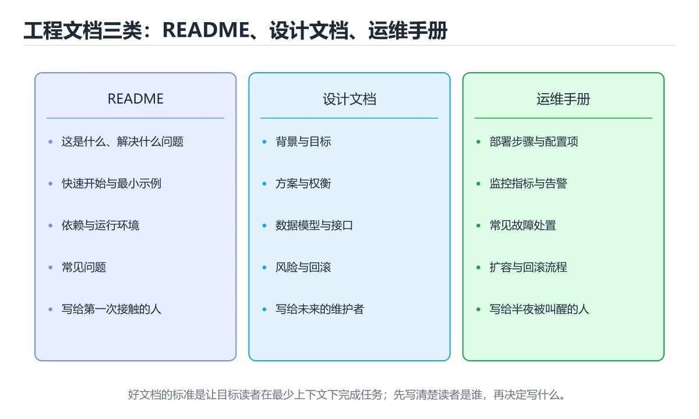
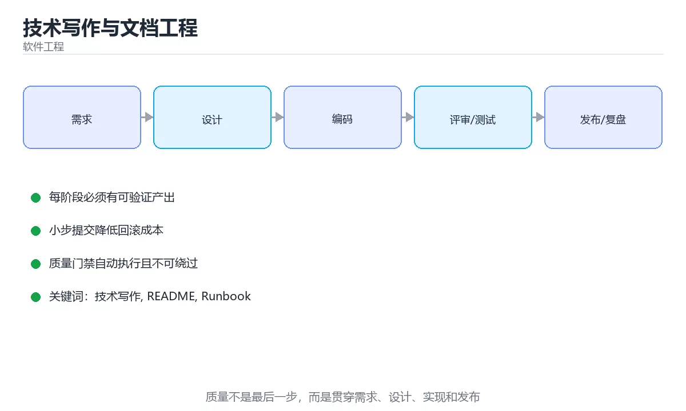

# 技术写作与文档工程





> 内容更新时间：2026-10-06 · 学习阶段：基础 · 预计用时：35 分钟

## 学习目标

- 能用自己的话解释技术写作与文档工程解决了什么问题，而不是只背术语。
- 能说清 「技术写作」、「README」、「Runbook」、「ADR」 之间的关系，并分别举出一个例子。
- 能把本课知识放回「软件工程」的知识体系，说明它和相邻主题的边界。
- 能完成本课练习，并用验收标准检查自己的结果。

> 一句话摘要：文档类型分工、README 与 Runbook 模板、写作品质原则。

## 前置知识

- 先完成上一课《代码评审方法与实践》；如果已经掌握，可以直接用本课练习自测。
- 本课阶段：基础。建议会读写简单代码或命令，并理解变量、输入输出等基本概念。
- 开始前先复习：技术写作、README、Runbook。
- 如果某一步看不懂，先记录具体卡点，完成练习后再回头读一遍。

## 文档类型速查

| 类型 | 读者 | 目的 | 寿命 |
| --- | --- | --- | --- |
| README | 新同事与使用者 | 5 分钟跑起来 | 长 |
| 设计文档 | 评审者与后续维护者 | 说明方案与取舍 | 中长 |
| API 文档 | 调用方 | 说明接口契约 | 长 |
| 运行手册（Runbook） | 值班同学 | 故障时照着做 | 长 |
| 决策记录（ADR） | 团队 | 记录为什么这样选 | 长 |
| 变更日志（CHANGELOG） | 使用者 | 说明版本变化 | 长 |
| 注释 | 读代码的人 | 解释非显然之处 | 随代码 |

## 写作原则速查

| 原则 | 说明 |
| --- | --- |
| 先结论后细节 | 读者先知道「是什么、能不能用」 |
| 面向任务 | 按「我要做什么」组织，而不是按模块罗列 |
| 可复制可执行 | 命令直接能粘贴运行，参数写真实值 |
| 明确前提 | 版本、环境、依赖写清楚 |
| 一图胜千言 | 流程与架构用图，别用长文字描述 |
| 消歧义 | 代词少用，明确指代对象 |
| 保持单一事实源 | 同一信息只维护一处，其他位置链接过去 |

## README 模板

````markdown
# 项目名

一句话说明它解决什么问题。

## 快速开始

```bash
git clone <repo>
cd <dir>
make setup && make run
```text

## 环境要求

| 依赖 | 版本 |
| --- | --- |
| Flutter | 3.47+ |
| Dart | 3.13+ |

## 常用命令

| 目的 | 命令 |
| --- | --- |
| 跑测试 | `flutter test` |
| 构建 | `flutter build apk --release` |

## 目录结构

简要说明关键目录的职责。

## 常见问题

- 报错 A：原因是 B，解决办法是 C。
````

```python
from dataclasses import dataclass, field

@dataclass
class RunbookStep:
    action: str
    command: str
    expected: str
    if_failed: str = ""

@dataclass
class Runbook:
    """运行手册：每一步都有可执行命令、预期结果与失败处理。"""

    title: str
    symptoms: list = field(default_factory=list)
    steps: list = field(default_factory=list)

    def add(self, action: str, command: str, expected: str, if_failed: str = "") -> None:
        self.steps.append(RunbookStep(action, command, expected, if_failed))

    def validate(self) -> list:
        """自检：缺命令或缺预期结果的手册在故障时不可用。"""
        problems = []
        if not self.symptoms:
            problems.append("未描述症状：值班同学无法判断是否适用")
        for index, step in enumerate(self.steps, start=1):
            if not step.command.strip():
                problems.append(f"第 {index} 步缺少可执行命令")
            if not step.expected.strip():
                problems.append(f"第 {index} 步缺少预期结果")
        return problems

    def render(self) -> str:
        lines = [f"# {self.title}", "", "## 适用症状", ""]
        lines += [f"- {item}" for item in self.symptoms]
        lines += ["", "## 处理步骤", ""]
        for index, step in enumerate(self.steps, start=1):
            lines.append(f"{index}. {step.action}")
            lines.append(f"   - 命令：`{step.command}`")
            lines.append(f"   - 预期：{step.expected}")
            if step.if_failed:
                lines.append(f"   - 失败处理：{step.if_failed}")
        return "\n".join(lines)

runbook = Runbook("接口延迟升高")
runbook.add("确认是否全站", "curl -w '%{time_total}' -o /dev/null -s https://api/health",
            "耗时小于 0.5 秒", "若超时，检查网关与上游")
print(runbook.validate())
print(runbook.render().splitlines()[0])
```

## 注释与文档的分工

| 内容 | 放哪里 |
| --- | --- |
| 为什么这样写（权衡、坑） | 代码注释 |
| 怎么用（用法、参数、示例） | API 文档 |
| 整体设计（架构与取舍） | 设计文档 / ADR |
| 出问题怎么办 | Runbook |

原则：**注释解释「为什么」，代码本身解释「是什么」。** 能靠命名与结构表达清楚的，不要写注释。

## 常见错误对照表

| 容易踩的做法 | 实际现象 | 原因与正确做法 |
| --- | --- | --- |
| README 只写「本项目很简单」 | 新人跑不起来 | 写清环境、命令与常见问题 |
| 命令里用占位符不说明 | 无法直接执行 | 给真实示例值并解释含义 |
| 文档与代码分家 | 文档长期过期 | 文档与代码同仓、同 PR 更新 |
| Runbook 只有描述没有命令 | 故障时无法执行 | 每步给出可复制命令与预期 |
| 到处复制同一说明 | 改一处漏一处 | 单一事实源 + 链接 |
| 注释复述代码 | 噪声大、易过期 | 注释写原因与坑 |
| 缺少版本前提 | 按旧版操作失败 | 标注适用版本与时间 |

## 自测清单

- [ ] 项目 README 能让新人在 5 分钟内跑起来。
- [ ] 关键流程有设计文档或 ADR 记录取舍。
- [ ] 高频故障有 Runbook，且每步含命令与预期。
- [ ] 文档与代码同仓并在同一 PR 更新。
- [ ] 注释解释原因，不复述代码。

## 动手练习

> 本课练习重点：围绕「技术写作、README、Runbook」完成复述、实验和交付，每个结果都要能被别人检查。

先写验收标准，再做最小交付，最后用评审、测试或复盘验证。

### 练习 1：建立心智模型（10 分钟）

合上教程，用 3～5 句话回答：

1. 技术写作与文档工程解决了什么问题？
2. 如果没有它，会出现什么具体后果？
3. 它和「README」是什么关系？

**验收标准**：至少出现一个本课关键词，并写出一个反例、边界条件或失效场景。

### 练习 2：做一次可控实验（20 分钟）

从正文中选一个最小示例，完成以下操作：

1. 先预测修改一个参数、输入或步骤后的结果。
2. 再实际执行或逐步推演，记录真实结果。
3. 如果结果与预测不同，写出差异原因。

**验收标准**：留下「原例 → 改动 → 预测 → 结果 → 原因」五步记录。

### 练习 3：交付一个小结果（30 分钟）

为一个真实小功能写一页设计、检查表或评审记录，并让同伴能照着执行。

任务要求：

- 结果必须能被别人检查，不能只写“我已经理解了”。
- 至少覆盖「技术写作」和「README」两个关键词。
- 写出 1 个仍然不确定的问题，以及下一步如何验证。

> 提示：时间有限时优先做练习 1 和练习 2；练习 3 可以拆成两次完成。

## 本课小结

- 核心问题：技术写作与文档工程不是孤立术语，而是在「软件工程」中解决一类具体问题。
- 关键关系：先分清「技术写作」与「README」的职责，再理解「Runbook」的适用边界。
- 判断标准：能解释正常场景、边界条件和失败场景，才算真正掌握。
- 下一步：完成练习后，用自己的话写下 3 条要点，再去做本课测验。

## 深入补充：技术写作与文档工程

前面已经建立了基本概念。这一节换一个角度，把技术写作与文档工程放进真实工程里，
重点回答三件事：它为什么存在、内部如何运转、什么时候会失效。

### 一、核心模型

技术写作把复杂系统转化为读者能执行、能验证、能维护的文档；核心是明确读者与任务，先给结论和步骤，再补背景、边界和参考。

```text
明确读者与目标 → 收集事实 → 组织结构 → 写结论与步骤 → 加入示例和验证 → 评审 → 更新维护
```

### 二、关键机制拆解

1. 文档类型包括教程、操作指南、参考和解释，四种类型服务不同读者需求。
2. 先写结论和最短可行路径，再展开原理，能显著降低读者理解成本。
3. 命令和示例必须可复制执行，变量用明确占位符并解释取值范围。
4. 文档要写明前置条件、成功标志、失败处理和回滚方式。
5. 图表用于表达结构、流程和状态，不应只是装饰。
6. 版本、适用范围和最后更新时间决定读者能否信任文档。
7. 文档需要像代码一样评审和测试，过期内容比没有内容更危险。

### 三、对照表：抓住容易混淆的边界

| 维度 | 一侧 | 另一侧 |
| --- | --- | --- |
| 教程 | 带读者完成一次学习 | 面向初学者，强调可完成 |
| 操作指南 | 解决一个具体任务 | 面向执行者，强调步骤清晰 |
| 参考 | 精确描述接口和参数 | 面向查阅，强调完整准确 |
| 解释 | 说明为什么这样设计 | 面向理解，强调背景和取舍 |

### 四、工作示例

部署文档开头写“5 分钟完成本地部署”，随后列出前置条件、三条命令、预期输出、常见错误和回滚命令；最后才解释架构和参数含义。读者可以先完成再理解。

### 五、常见误区与失效边界

| 错误做法或假设 | 后果 | 正确做法 |
| --- | --- | --- |
| 先讲背景不告诉读者做什么 | 读者失去耐心 | 先给目标和最短路径 |
| 示例不可复制 | 读者反复试错 | 提供完整命令和预期输出 |
| 没有版本和更新时间 | 内容过期仍被信任 | 标注适用版本和维护责任 |
| 文档只在发布时写一次 | 很快与代码不一致 | 把文档更新纳入变更流程 |

### 六、场景推演

新成员按文档部署失败。排查发现文档漏写了环境变量，且使用了旧版本命令。修复方式是补齐前置条件、固定版本、加入一键检查脚本和 CI 文档测试，确保下次变更同步更新。

### 七、自测问答

**Q1：技术文档应该先写什么？**

先写读者目标和最短可行路径，再补背景和原理。

**Q2：教程和操作指南有什么区别？**

教程带读者学习，操作指南帮助读者完成具体任务。

**Q3：为什么文档要写回滚？**

部署或操作失败时，读者需要明确的恢复路径。

**Q4：如何防止文档过期？**

标注版本和更新时间，纳入代码评审和自动化检查。

### 八、小项目：把知识变成可检查的产出

为一个小工具写四类文档各一页：入门教程、部署指南、参数参考和设计解释；邀请一位未接触过项目的人按文档执行，记录所有卡点并迭代修改。

### 九、适用边界

技术写作不是把代码注释堆在一起，也不能替代清晰的接口和错误信息。文档的目标是降低读者完成任务的成本，而不是展示作者知道多少。

### 十、完成检查清单

- [ ] 能识别四类文档的读者与目标
- [ ] 能写出可复制执行的步骤
- [ ] 能标注前置条件、预期结果和回滚
- [ ] 能用图表表达复杂结构
- [ ] 能建立文档评审与更新机制

### 十一、复习顺序

1. 先不看资料复述“核心模型”，确认能说出它解决的三个问题。
2. 再对照表逐行解释容易混淆的概念，每个概念补一个反例。
3. 跟着工作示例做一遍，改变一个条件并预测结果。
4. 用自测问答检查理解，错题回到对应小节重新阅读。
5. 最后完成小项目，把结果、失败记录和复查清单整理成一份可提交产物。

> 复习不是重读一遍，而是离开原文重新产出：复述、改写、验证、复盘。

## 可运行练习

### 任务 1：先跑通，再解释

```python
from dataclasses import dataclass, field

@dataclass
class RunbookStep:
    action: str
    command: str
    expected: str
    if_failed: str = ""

@dataclass
class Runbook:
    """运行手册：每一步都有可执行命令、预期结果与失败处理。"""

    title: str
    symptoms: list = field(default_factory=list)
    steps: list = field(default_factory=list)

    def add(self, action: str, command: str, expected: str, if_failed: str = "") -> None:
        self.steps.append(RunbookStep(action, command, expected, if_failed))

    def validate(self) -> list:
        """自检：缺命令或缺预期结果的手册在故障时不可用。"""
        problems = []
        if not self.symptoms:
            problems.append("未描述症状：值班同学无法判断是否适用")
        for index, step in enumerate(self.steps, start=1):
            if not step.command.strip():
                problems.append(f"第 {index} 步缺少可执行命令")
            if not step.expected.strip():
                problems.append(f"第 {index} 步缺少预期结果")
        return problems

    def render(self) -> str:
        lines = [f"# {self.title}", "", "## 适用症状", ""]
        lines += [f"- {item}" for item in self.symptoms]
        lines += ["", "## 处理步骤", ""]
        for index, step in enumerate(self.steps, start=1):
            lines.append(f"{index}. {step.action}")
            lines.append(f"   - 命令：`{step.command}`")
            lines.append(f"   - 预期：{step.expected}")
            if step.if_failed:
                lines.append(f"   - 失败处理：{step.if_failed}")
        return "\n".join(lines)

runbook = Runbook("接口延迟升高")
runbook.add("确认是否全站", "curl -w '%{time_total}' -o /dev/null -s https://api/health",
            "耗时小于 0.5 秒", "若超时，检查网关与上游")
print(runbook.validate())
print(runbook.render().splitlines()[0])
```

### 任务 2：只改一个条件

把「技术写作与文档工程」的最小示例复制一份，只改一个条件再跑一次：

- 改动点：只把技术写作的输入换成空值、极值或错误输入，其余保持不变。
- 预测：先写下「技术写作与文档工程」在改动后的输出或错误信息，再运行。
- 记录：对照改动前后的结果，指出差异出在哪一步。
- 验收：换回原条件能复现原结果，改动只影响技术写作。

### 任务 3：迁移到自己的数据

用同一套思路处理一组你自己的数据或场景，保持输出格式与任务 1 一致。

## 故障现场

### 现场 1：本课的 技术写作 常规用例通过，但边界用例失败

**症状**：在本课的练习或生产场景里出现“本课的 技术写作 常规用例通过，但边界用例失败”。

**复现**：准备一组最小输入，只保留触发“本课的 技术写作 常规用例通过，但边界用例失败”的必要条件，连续运行两次确认结果稳定。

**定位**：围绕“技术写作 的前置条件与取值边界没有写进代码，默认值掩盖了空值和极值”检查调用链、输入数据和环境配置，先验证假设再改代码。

**预防**：把“本课的 技术写作 常规用例通过，但边界用例失败”写成一条自动化用例，并在本课的验收清单里保留对应检查项。

### 现场 2：本课的 README 结果在两次运行之间不一致

**症状**：在本课的练习或生产场景里出现“本课的 README 结果在两次运行之间不一致”。

**复现**：准备一组最小输入，只保留触发“本课的 README 结果在两次运行之间不一致”的必要条件，连续运行两次确认结果稳定。

**定位**：围绕“README 依赖了当前版本、执行顺序或共享状态，单次运行无法暴露差异”检查调用链、输入数据和环境配置，先验证假设再改代码。

**预防**：把“本课的 README 结果在两次运行之间不一致”写成一条自动化用例，并在本课的验收清单里保留对应检查项。

### 现场 3：需求反复变更，代码越改越难验证

**症状**：在本课的练习或生产场景里出现“需求反复变更，代码越改越难验证”。

**复现**：准备一组最小输入，只保留触发“需求反复变更，代码越改越难验证”的必要条件，连续运行两次确认结果稳定。

**定位**：围绕“技术写作 的接口边界没有写清楚，README 缺少可自动执行的验收条件”检查调用链、输入数据和环境配置，先验证假设再改代码。

**修复**：为技术写作与文档工程补一份最小验收清单，把接口、数据和失败路径写成测试，再开始重构

**预防**：把“需求反复变更，代码越改越难验证”写成一条自动化用例，并在本课的验收清单里保留对应检查项。

## 本课复习清单

离开本课前，逐项确认：

- [ ] 不看解析，能说出「故障时值班同学最需要哪种文档？」的判断依据。
- [ ] 不看解析，能说出「好的 README 应该首先让读者知道什么？」的判断依据。
- [ ] 不看解析，能说出「文档最容易被写坏的方式是？」的判断依据。
- [ ] 不看解析，能说出「代码注释应该重点说明什么？」的判断依据。
- [ ] 不看解析，能说出「关于 Runbook 中的命令，正确做法是？」的判断依据。
- [ ] 至少运行一次本课示例，记录输入、输出和一个边界情况。
- [ ] 把本课最容易混淆的两个概念写成一句话对照。

| 复盘项 | 记录 |
| --- | --- |
| 已经能独立解释的考点 |  |
| 仍然说不清的概念 |  |
| 下一步验证动作 |  |

## 术语速查

| 术语 | 本课语境 |
| --- | --- |
| `技术写作` | 围绕“技术写作 的接口边界没有写清楚，README 缺少可自动执行的验收条件”检查调用链、输入数据和环境配置，先验证假设再改代码。 |
| `README` | Summary: Doc types, README and runbook templates, writing principles.。 |
| `Runbook` | Summary: Doc types, README and runbook templates, writing principles.。 |
| `ADR` | [ ] 关键流程有设计文档或 ADR 记录取舍。 |
| `文档工程` | 它在「技术写作与文档工程」里是理解「文档工程」的关键术语，用来解释定义、适用条件与失败路径；它与技术写作、README共同决定这一节的判断边界。复习时回到正文示例核对输入、输出和验证方式。 |

## 考点精讲

### 考点 1：多选辨析·技术写作

- **题目**：围绕“技术写作与文档工程”中的 技术写作、README、Runbook，下列哪两项是本课强调的实践判断？
- **判断依据**：本课把技术写作与文档工程拆成概念、示例与故障现场三部分，因此判断 技术写作 时必须同时交代输入、输出和失败路径，这使“学习 技术写作 时要同时说明输入、输出和失败路径，不能只看正常流程”成立。在技术写作与文档工程里，判断 README 时要固定版本与边界输入，所以“验证 README 时要固定版本并覆盖边界输入，结论才可复现”才可复现。

### 考点 2：概念判断·技术写作

- **题目**：好的 README 应该首先让读者知道什么？
- **判断依据**：在「技术写作与文档工程」里，这个项目解决什么问题。读者最先想知道「能不能用」与「怎么开始」，细节应由其他文档承载。这道题的关键在「技术写作与文档工程」的技术写作、README、Runbook：先确认题干“好的 README 应该首先让读者知”问的是哪一步，再排除偷换前提的选项。把“这个项目解决什么问题”代回「技术写作与文档工程」里“好的 README 应该首先让读者知道什么”的例子核对，条件一旦改变，结论就要用技术写作、README、Runbook重新推导。

### 考点 3：概念判断·技术写作

- **题目**：「技术写作与文档工程」的核心结论是什么？
- **判断依据**：题干的正确项是技术写作与文档工程：文档类型分工、README 与 Runbook 模板、写作品质原则。在「技术写作与文档工程」里，把技术写作、README、Runbook放进最小示例验证，换成空值或极值后结论仍要成立。这道题的关键在「技术写作与文档工程」的技术写作、README、Runbook：先确认题干“技术写作与文档工程的核心结论是什么”问的是哪一步，再排除偷换前提的选项。

### 考点 4：概念判断·技术写作

- **题目**：代码注释应该重点说明什么？
- **判断依据**：在「技术写作与文档工程」里，结论应落在「为什么这样写，以及背后的权衡与坑」。代码本身表达「是什么」，注释补充无法从代码直接读出的原因与取舍。在「技术写作与文档工程」里，这道题要求区分概念与边界，「为什么这样写，以及背后的权衡与坑」只有在题干给出的前提下才成立，而「作者姓名与修改日期」、「变量的类型定义」缺少同一组条件。

### 考点 5：概念判断·技术写作

- **题目**：关于 Runbook 中的命令，正确做法是？
- **判断依据**：在「技术写作与文档工程」里，给出可复制执行的命令与预期结果。应急场景下要减少思考成本，命令必须可直接执行，并说明预期输出以便判断是否正常。在「技术写作与文档工程」里判断这道题，要把技术写作、README、Runbook的条件、过程与失败路径逐项对齐，换成“关于 Runbook 中的命令”这个场景，只有满足前提的结论才成立。

### 考点 6：填空·技术写作

- **题目**：补全代码：「技术写作与文档工程」示例中，下面这行代码缺少哪个关键字或函数名？请填入 ____。 `____.add("确认是否全站", "curl -w '%{time_total}' -o /dev/null -s https://api/health",`
- **判断依据**：在「技术写作与文档工程」里，runbook。这道题的关键在「技术写作与文档工程」的技术写作、README、Runbook：先确认题干“补全代码”问的是哪一步，再排除偷换前提的选项。回到技术写作、README、Runbook本身再看一遍：只有“runbook”与题干“runbook”的前提一致，结论才成立。

## English Overview

**Title:** Technical Writing

**Summary:** Doc types, README and runbook templates, writing principles.

**Category:** Software Engineering
**Level:** 基础
**Key terms:** 技术写作, README, Runbook, ADR, 文档工程

## 内容元数据

- 内容版本：v2.0
- 最后更新：2026-10-06
- 学习阶段：基础
- 适用环境：通用软件工程实践
- 内容来源：内置结构化课程与工程实践整理
- 相关主题：技术写作、README、Runbook、ADR、文档工程
- 质量版本：P0 测验标准 + P1 覆盖扩展 + P2 体验补全

## 参考资料与复核

- 最后复核：2026-10-04
- 下次复核：2027-04-04
- 复核范围：版本兼容、API 行为、安全建议与工程实践
- 来源性质：官方文档、标准或权威教材；正文为离线教学重组

| 参考资料 | 本课用途 |
| --- | --- |
| [ADR 文档](https://adr.github.io/) | 架构决策记录 |
| [Google SWE Book](https://abseil.io/resources/swe-book) | 工程规范、评审与维护 |
| [Martin Fowler 架构](https://martinfowler.com/architecture/) | 架构、重构与演进 |

> 「技术写作与文档工程」的链接用于离线阅读后的延伸核对；App 不会自动联网。
