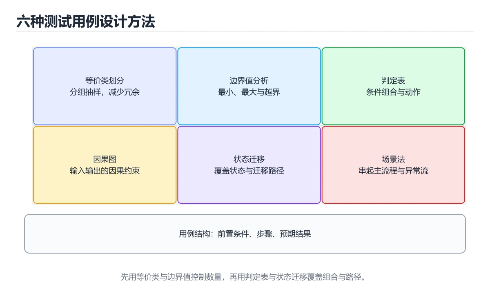
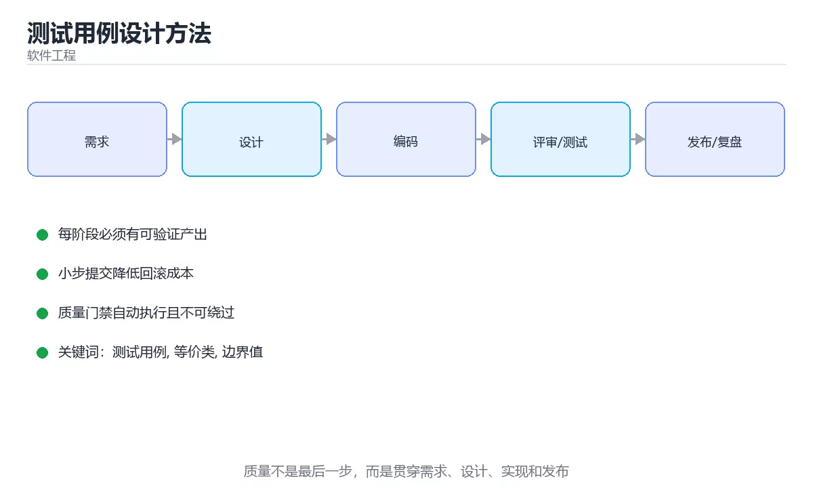

# 测试用例设计方法





> 内容更新时间：2026-10-03 · 学习阶段：基础 · 预计用时：15 分钟

## 学习目标

- 能用自己的话解释测试用例设计方法解决了什么问题，而不是只背术语。
- 能说清 「测试用例」、「等价类」、「边界值」、「判定表」 之间的关系，并分别举出一个例子。
- 能把本课知识放回「软件工程」的知识体系，说明它和相邻主题的边界。
- 能完成本课练习，并用验收标准检查自己的结果。

> 一句话摘要：等价类、边界值、判定表、状态迁移与优先级。

## 前置知识

- 先完成上一课《需求分析与建模》；如果已经掌握，可以直接用本课练习自测。
- 本课阶段：基础。建议会读写简单代码或命令，并理解变量、输入输出等基本概念。
- 开始前先复习：测试用例、等价类、边界值。
- 如果某一步看不懂，先记录具体卡点，完成练习后再回头读一遍。

## 六种经典方法

| 方法 | 做法 | 适用 |
| --- | --- | --- |
| 等价类划分 | 把输入分为有效/无效类，每类取代表值 | 输入范围明确的表单、接口参数 |
| 边界值分析 | 取边界与边界±1 | 数值范围、长度限制 |
| 判定表 | 列举条件组合与对应动作 | 多条件业务规则（费率、风控） |
| 状态迁移 | 覆盖状态与合法/非法迁移 | 订单状态机、支付流程 |
| 场景法 | 按用户操作路径设计主流程与异常流 | 端到端用例 |
| 错误推测 | 凭经验列出易错点 | 补充遗漏（空值、重复提交、超时） |

实践顺序通常是：等价类 + 边界值打底，判定表/状态迁移覆盖规则，场景法串主流程，错误推测补边界。

## 用例的结构

每条用例写清：**前置条件、操作步骤、输入数据、预期结果、优先级**。预期结果必须可断言（状态码、字段值、数据库变化），"页面正常"不是预期结果。

## 优先级划分

用 P0~P2 标注：P0 是核心链路（下单、支付、登录），每次提交都跑；P1 是重要分支，合并前跑；P2 是长尾与展示类，按需回归。**用例数量不等于覆盖率**，优先级决定回归时间可控。

## 常见坑

1. 只测正常流程，不测异常与并发（重复提交、超时、断电）。
2. 用例之间共享状态导致顺序依赖，无法单独执行。
3. 断言太弱（只看不报错），无法发现逻辑错误。
4. 用真实时间/随机数导致结果不可复现。

## 一个完整的判定表实例

需求：会员等级（普通/白银/黄金）× 是否有优惠券 × 订单金额是否满 200，决定折扣率。

| 规则 | 会员等级 | 有券 | 满 200 | 折扣 |
| --- | --- | --- | --- | --- |
| R1 | 黄金 | 是 | 是 | 25% |
| R2 | 黄金 | 否 | 是 | 20% |
| R3 | 白银 | 是 | 是 | 15% |
| R4 | 白银 | 否 | 是 | 10% |
| R5 | 普通 | 是 | 是 | 8% |
| R6 | 其余情况 | — | 否 | 0% |

设计要点：**先穷尽条件组合，再合并等价规则**（上表中金额不满 200 的三类可合并为 R6），这样既保证覆盖又不产生爆炸式用例。每一条规则至少一个用例，边界值（199.99 / 200.00）必须单独覆盖。

**状态迁移用例清单**（以订单为例）：待支付→已支付（正常）、待支付→已取消（超时）、已支付→已发货、已发货→已完成、已完成→退款中→已退款，以及非法迁移（已完成→待支付应被拒绝）。每条迁移都要有对应用例，非法迁移同样重要——很多线上问题正是"状态机没拦住不合法的跳转"。

## 回归选择与缺陷根因分析

**回归选择策略**（全量回归太慢时的取舍）：① 按代码变更影响面选（改了支付逻辑就跑支付相关用例）；② 按优先级选（P0 每次必跑）；③ 按历史缺陷热区选（常出问题的模块加大覆盖）；④ 按风险选（涉及资金、权限、数据的用例优先）。四者叠加，通常能用 20% 的用例覆盖 80% 的风险。

**缺陷根因分类**（用于改进用例设计）：

| 根因 | 占比较高 | 对应的预防手段 |
| --- | --- | --- |
| 需求理解偏差 | 常见 | 验收标准写清 + 用例评审 |
| 边界与异常未覆盖 | 最常见 | 边界值 + 异常流用例强制补齐 |
| 集成问题（接口/时序） | 常见 | 契约测试 + 集成测试 |
| 并发与状态问题 | 难发现 | 状态迁移用例 + 并发压测 |
| 环境与配置差异 | 常见 | 环境一致性校验 + 配置用例 |

做法：每季度把线上缺陷按上表分类统计，**哪一类最多就加强哪一类用例的设计**——这是让测试投入产出比最高的方法。

## 本课小结
好的用例设计是**用有限用例覆盖无限输入**：等价类与边界值压缩输入空间，状态迁移覆盖流程分支，错误推测补齐经验盲区。

## 用例设计方法速查

| 方法 | 适用 | 产出 |
| --- | --- | --- |
| 等价类划分 | 输入范围明确的接口 | 有效与无效等价类 |
| 边界值分析 | 数值、长度、时间边界 | 边界与邻近值用例 |
| 判定表 | 多条件组合决定动作 | 条件组合到动作的映射 |
| 状态迁移 | 状态驱动的业务 | 状态与事件迁移覆盖 |
| 场景法 | 端到端用户流程 | 主流程与备选流程 |
| 正交实验 | 多因素多水平 | 少量高覆盖组合 |
| 错误推测 | 经验补充 | 高风险点清单 |

组合取舍：先覆盖单因素边界与等价类，再覆盖两两组合，最后补充高风险组合。

## 用例要素速查

| 要素 | 要求 |
| --- | --- |
| 前置条件 | 数据与状态可复现 |
| 操作步骤 | 具体到接口或界面元素 |
| 预期结果 | 可断言（状态码、字段值、数据变化） |
| 优先级 | 核心流程 P0，异常路径 P1，边界 P2 |
| 可追溯 | 关联需求或验收标准编号 |

```python
from itertools import combinations
from dataclasses import dataclass, field

def boundary_cases(low: int, high: int) -> list:
    """边界值：边界本身与紧邻值，外加典型无效值。"""
    return [low - 1, low, low + 1, high - 1, high, high + 1]

def equivalence_classes(value_range: tuple, invalid: list) -> dict:
    """等价类：有效区间与各类无效输入。"""
    low, high = value_range
    return {
        "valid": [low, (low + high) // 2, high],
        "invalid_too_small": [low - 1],
        "invalid_too_large": [high + 1],
        "invalid_type": invalid,
    }

def pairwise(params: dict) -> list:
    """两两组合：在因素较多时控制用例数量。"""
    names = list(params)
    cases = []
    for a, b in combinations(names, 2):
        for va in params[a]:
            for vb in params[b]:
                cases.append({a: va, b: vb})
    return cases

@dataclass
class TestCase:
    case_id: str
    title: str
    precondition: str
    steps: list
    expected: str
    priority: str = "P1"
    tags: list = field(default_factory=list)

    def is_assertable(self) -> bool:
        """预期结果必须包含可断言要素。"""
        hints = ("=", "返回", "状态码", "字段", "记录", "提示")
        return any(hint in self.expected for hint in hints)

print(boundary_cases(1, 100))
print(pairwise({"浏览器": ["Chrome", "Safari"], "网络": ["4G", "WiFi"]})[:4])
case = TestCase("TC-1", "创建订单", "用户已登录", ["提交订单"], "返回 201 且订单表新增 1 条记录")
print(case.is_assertable())
```

## 常见错误对照表

| 容易踩的做法 | 实际现象 | 原因与正确做法 |
| --- | --- | --- |
| 只测正常值 | 边界缺陷漏到线上 | 必测边界与邻近值 |
| 预期结果写「正常」 | 无法自动断言 | 写成具体状态码与字段 |
| 用例依赖前置数据手工准备 | 无法自动执行 | 前置条件可脚本化 |
| 全组合穷举 | 用例爆炸 | 用两两组合 + 高风险补充 |
| 不标优先级 | 时间不足时乱测 | 按业务影响排序 |
| 用例与需求脱节 | 覆盖不到验收点 | 与需求编号双向追溯 |
| 状态迁移遗漏非法迁移 | 出现不可能状态 | 既测合法也测非法迁移 |
| 复制粘贴用例 | 维护成本高 | 参数化生成用例 |
| 只写步骤不写下预期 | 结果判断主观 | 每步或整体给可断言结果 |
| 回归不更新用例 | 覆盖面逐步失效 | 需求变更同步更新 |

## 自测清单

- [ ] 会用等价类与边界值设计输入类用例。
- [ ] 多条件场景使用判定表或两两组合。
- [ ] 状态驱动业务覆盖合法与非法迁移。
- [ ] 每条用例预期结果可自动断言。
- [ ] 用例与需求双向可追溯并有优先级。

## 动手练习

> 本课练习重点：围绕「测试用例、等价类、边界值」完成复述、实验和交付，每个结果都要能被别人检查。

先写验收标准，再做最小交付，最后用评审、测试或复盘验证。

### 练习 1：建立心智模型（10 分钟）

合上教程，用 3～5 句话回答：

1. 测试用例设计方法解决了什么问题？
2. 如果没有它，会出现什么具体后果？
3. 它和「等价类」是什么关系？

**验收标准**：至少出现一个本课关键词，并写出一个反例、边界条件或失效场景。

### 练习 2：做一次可控实验（20 分钟）

从正文中选一个最小示例，完成以下操作：

1. 先预测修改一个参数、输入或步骤后的结果。
2. 再实际执行或逐步推演，记录真实结果。
3. 如果结果与预测不同，写出差异原因。

**验收标准**：留下「原例 → 改动 → 预测 → 结果 → 原因」五步记录。

### 练习 3：交付一个小结果（30 分钟）

为一个真实小功能写一页设计、检查表或评审记录，并让同伴能照着执行。

任务要求：

- 结果必须能被别人检查，不能只写“我已经理解了”。
- 至少覆盖「测试用例」和「等价类」两个关键词。
- 写出 1 个仍然不确定的问题，以及下一步如何验证。

> 提示：时间有限时优先做练习 1 和练习 2；练习 3 可以拆成两次完成。

## 可运行练习

### 任务 1：先跑通，再解释

```python
from itertools import combinations
from dataclasses import dataclass, field

def boundary_cases(low: int, high: int) -> list:
    """边界值：边界本身与紧邻值，外加典型无效值。"""
    return [low - 1, low, low + 1, high - 1, high, high + 1]

def equivalence_classes(value_range: tuple, invalid: list) -> dict:
    """等价类：有效区间与各类无效输入。"""
    low, high = value_range
    return {
        "valid": [low, (low + high) // 2, high],
        "invalid_too_small": [low - 1],
        "invalid_too_large": [high + 1],
        "invalid_type": invalid,
    }

def pairwise(params: dict) -> list:
    """两两组合：在因素较多时控制用例数量。"""
    names = list(params)
    cases = []
    for a, b in combinations(names, 2):
        for va in params[a]:
            for vb in params[b]:
                cases.append({a: va, b: vb})
    return cases

@dataclass
class TestCase:
    case_id: str
    title: str
    precondition: str
    steps: list
    expected: str
    priority: str = "P1"
    tags: list = field(default_factory=list)

    def is_assertable(self) -> bool:
        """预期结果必须包含可断言要素。"""
        hints = ("=", "返回", "状态码", "字段", "记录", "提示")
        return any(hint in self.expected for hint in hints)

print(boundary_cases(1, 100))
print(pairwise({"浏览器": ["Chrome", "Safari"], "网络": ["4G", "WiFi"]})[:4])
case = TestCase("TC-1", "创建订单", "用户已登录", ["提交订单"], "返回 201 且订单表新增 1 条记录")
print(case.is_assertable())
```

### 任务 2：只改一个条件

把「测试用例设计方法」的最小示例复制一份，只改一个条件再跑一次：

- 改动点：只把测试用例的输入换成空值、极值或错误输入，其余保持不变。
- 预测：先写下「测试用例设计方法」在改动后的输出或错误信息，再运行。
- 记录：对照改动前后的结果，指出差异出在哪一步。
- 验收：换回原条件能复现原结果，改动只影响测试用例。

### 任务 3：迁移到自己的数据

用同一套思路处理一组你自己的数据或场景，保持输出格式与任务 1 一致。

## 故障现场

### 现场 1：本课的 测试用例 常规用例通过，但边界用例失败

**症状**：在本课的练习或生产场景里出现“本课的 测试用例 常规用例通过，但边界用例失败”。

**复现**：准备一组最小输入，只保留触发“本课的 测试用例 常规用例通过，但边界用例失败”的必要条件，连续运行两次确认结果稳定。

**定位**：围绕“测试用例 的前置条件与取值边界没有写进代码，默认值掩盖了空值和极值”检查调用链、输入数据和环境配置，先验证假设再改代码。

**预防**：把“本课的 测试用例 常规用例通过，但边界用例失败”写成一条自动化用例，并在本课的验收清单里保留对应检查项。

### 现场 2：本课的 等价类 结果在两次运行之间不一致

**症状**：在本课的练习或生产场景里出现“本课的 等价类 结果在两次运行之间不一致”。

**复现**：准备一组最小输入，只保留触发“本课的 等价类 结果在两次运行之间不一致”的必要条件，连续运行两次确认结果稳定。

**定位**：围绕“等价类 依赖了当前版本、执行顺序或共享状态，单次运行无法暴露差异”检查调用链、输入数据和环境配置，先验证假设再改代码。

**预防**：把“本课的 等价类 结果在两次运行之间不一致”写成一条自动化用例，并在本课的验收清单里保留对应检查项。

### 现场 3：需求反复变更，代码越改越难验证

**症状**：在本课的练习或生产场景里出现“需求反复变更，代码越改越难验证”。

**复现**：准备一组最小输入，只保留触发“需求反复变更，代码越改越难验证”的必要条件，连续运行两次确认结果稳定。

**定位**：围绕“测试用例 的接口边界没有写清楚，等价类 缺少可自动执行的验收条件”检查调用链、输入数据和环境配置，先验证假设再改代码。

**修复**：为测试用例设计方法补一份最小验收清单，把接口、数据和失败路径写成测试，再开始重构

**预防**：把“需求反复变更，代码越改越难验证”写成一条自动化用例，并在本课的验收清单里保留对应检查项。

## 深入补充：测试用例设计方法 的取舍与边界

### 一、把概念放回真实约束

学习测试用例设计方法时，最容易只记住结论而忽略前提。先写出三个约束：数据规模、时间预算、可接受的失败方式；再判断 测试用例 与 等价类 在这些约束下是否仍然成立。只要约束改变，原来的最优解就可能变成错误解。

| 做法 | 适用规模 | 成本 | 主要风险 |
| --- | --- | --- | --- |
| 先写测试再改 | 任何规模 | 前期较慢 | 测试本身失真 |
| 小步提交与评审 | 多人协作 | 评审开销 | 批次过大 |
| 自动化质量门禁 | 持续交付 | 维护流水线 | 门禁形同虚设 |

### 二、三个容易混淆的边界

1. 澄清输入与目标。先写清「测试用例设计方法」要解决的问题、合法输入范围和成功标准，再进入后续步骤。
2. **把“平均值”当成“全部”**：测试用例 的指标好看，不代表尾部请求、冷启动或失败重试也好看。
3. **把“当前版本”当成“永久行为”**：等价类 依赖的默认值、API 或性能特征都可能随版本变化，需要固定版本并保留回归用例。

### 三、一个生产场景

假设团队要在真实系统里使用测试用例设计方法：第一周先做小流量验证，记录 测试用例 的基线与异常；第二周扩大输入规模，观察 等价类 是否成为瓶颈；第三周再做故障演练，主动注入超时、重复请求和依赖不可用，确认系统能降级、能重试、能恢复。每一步都要留下指标、日志和结论，而不是只留下“感觉更快了”。

### 四、自测清单

- 能否用一句话说出测试用例设计方法解决的核心问题与不适用场景？
- 能否画出 测试用例 的数据流或状态变化，并标出失败路径？
- 能否给出一个反例，证明某个看似合理的结论在边界条件下不成立？
- 能否写出一条可复现的验证命令，让别人独立得到相同结论？

## 本课复习清单

离开本课前，逐项确认：

- [ ] 不看解析，能说出「输入范围明确的接口参数，优先用哪些方法？」的判断依据。
- [ ] 不看解析，能说出「多个条件组合决定业务动作（如费率计算），适合用？」的判断依据。
- [ ] 不看解析，能说出「用例的「预期结果」必须满足什么要求？」的判断依据。
- [ ] 不看解析，能说出「状态迁移测试适合哪类需求？」的判断依据。
- [ ] 不看解析，能说出「正交实验法在设计用例时的作用是？」的判断依据。
- [ ] 至少运行一次本课示例，记录输入、输出和一个边界情况。
- [ ] 把本课最容易混淆的两个概念写成一句话对照。

| 复盘项 | 记录 |
| --- | --- |
| 已经能独立解释的考点 |  |
| 仍然说不清的概念 |  |
| 下一步验证动作 |  |

## 术语速查

| 术语 | 本课语境 |
| --- | --- |
| `测试用例` | 围绕“测试用例 的前置条件与取值边界没有写进代码，默认值掩盖了空值和极值”检查调用链、输入数据和环境配置，先验证假设再改代码。 |
| `等价类` | 围绕“等价类 依赖了当前版本、执行顺序或共享状态，单次运行无法暴露差异”检查调用链、输入数据和环境配置，先验证假设再改代码。 |
| `边界值` | 它在「测试用例设计方法」里是理解「边界值」的关键术语，用来解释定义、适用条件与失败路径；它与测试用例、等价类共同决定这一节的判断边界。复习时回到正文示例核对输入、输出和验证方式。 |
| `判定表` | 实践顺序通常是：等价类 + 边界值打底，判定表/状态迁移覆盖规则，场景法串主流程，错误推测补边界。 |
| `状态迁移` | 它在「测试用例设计方法」里是理解「状态迁移」的关键术语，用来解释定义、适用条件与失败路径；它与测试用例、等价类共同决定这一节的判断边界。复习时回到正文示例核对输入、输出和验证方式。 |

## 考点精讲

### 考点 1：概念判断·测试用例

- **题目**：「测试用例设计方法」的核心结论是什么？
- **判断依据**：题干的正确项是测试用例设计方法：等价类、边界值、判定表、状态迁移与优先级。在「测试用例设计方法」里，把测试用例、等价类、边界值放进最小示例验证，换成空值或极值后结论仍要成立。这道题的关键在「测试用例设计方法」的测试用例、等价类、边界值：先确认题干“测试用例设计方法的核心结论是什么”问的是哪一步，再排除偷换前提的选项。

### 考点 2：概念判断·测试用例

- **题目**：多个条件组合决定业务动作（如费率计算），适合用？
- **判断依据**：判定表能穷尽条件组合与对应动作，避免遗漏规则。其他选项：场景法适合业务流程，边界值针对数值范围，状态迁移图针对状态变化。「测试用例设计方法」要求先交代测试用例、等价类、边界值的前提再下结论，所以“判定表”只在题干“多个条件组合决定业务动作（如费率计算）”给定的条件下成立。把“判定表”代回「测试用例设计方法」里“多个条件组合决定业务动作（如费率计算）”的例子核对，条件一旦改变，结论就要用测试用例、等价类、边界值重新推导。

### 考点 3：概念判断·预期结果

- **题目**：用例的「预期结果」必须满足什么要求？
- **判断依据**：在「测试用例设计方法」里，作答时，先用测试用例建立输入与输出的基线，再把可断言（状态码、字段值、数据变化）代入边界条件核对，结论才能复现。在「测试用例设计方法」里，如果只凭关键词作答，很容易把「描述页面正常」、「由开发判断」与「可断言（状态码、字段值、数据变化）」混在一起；回到「测试用例设计方法」的正文示例，用“用例的预期结果必须满足什么要求”走一遍测试用例、等价类、边界值的完整流程，能复现的结论才可以保留。

### 考点 4：顺序排列·测试用例

- **题目**：按“测试用例设计方法”中 测试用例、等价类、边界值 的实践顺序，把四个步骤排成从准备到复盘的合理顺序。
- **判断依据**：题干的正确项是固定版本与证据，把“测试用例设计方法”的结论写成可复现记录。在「测试用例设计方法」里，在本课的练习里，顺序应当是：先明确 测试用例 的输入、输出与约束 → 写出最小示例并核对 等价类 的基线结果 → 只改一个变量，记录边界与失败路径的变化 → 固定版本与证据，把本课的结论写成可复现记录。这个顺序把 测试用例 的输入、输出和约束放在最前面，在测试用例设计方法里避免概念没对齐就开始调参。第二步用 等价类 建立可核对的基线，在测试用例设计方法里第三步才允许改变一个变量并观察失败路径。

### 考点 5：概念判断·测试用例

- **题目**：正交实验法在设计用例时的作用是？
- **判断依据**：在「测试用例设计方法」里，用较少的组合覆盖多个因素及其交互，控制用例数量。适合参数维度多但两两组合即可暴露大部分缺陷的场景。回到「测试用例设计方法」的正文示例，用“正交实验法在设计用例时的作用是”走一遍测试用例、等价类、边界值的完整流程，能复现的结论才可以保留。

### 考点 6：多选辨析·测试用例

- **题目**：以下哪些术语与「测试用例设计方法」直接相关？（多选）
- **判断依据**：等价类是否完整覆盖题干的输入、输出和失败路径，并排除测试用例、缩进这类相邻概念。在「测试用例设计方法」里判断这道题，要把测试用例、等价类、边界值的条件、过程与失败路径逐项对齐，换成“以下哪些术语与测试用例设计方法直接相”这个场景，只有满足前提的结论才成立。

## English Overview

**Title:** Test Case Design

**Summary:** Equivalence, boundaries, decision tables and state transitions.

**Category:** Software Engineering
**Level:** 基础
**Key terms:** 测试用例, 等价类, 边界值, 判定表, 状态迁移

## 内容元数据

- 内容版本：v2.0
- 最后更新：2026-10-03
- 学习阶段：基础
- 适用环境：通用软件工程实践
- 内容来源：内置结构化课程与工程实践整理
- 相关主题：测试用例、等价类、边界值、判定表、状态迁移
- 质量版本：P0 测验标准 + P1 覆盖扩展 + P2 体验补全

## 参考资料与复核

- 最后复核：2026-10-04
- 下次复核：2027-04-04
- 复核范围：版本兼容、API 行为、安全建议与工程实践
- 来源性质：官方文档、标准或权威教材；正文为离线教学重组

| 参考资料 | 本课用途 |
| --- | --- |
| [DORA 能力模型](https://dora.dev/) | 交付性能与工程效能 |
| [Martin Fowler 架构](https://martinfowler.com/architecture/) | 架构、重构与演进 |
| [ADR 文档](https://adr.github.io/) | 架构决策记录 |

> 「测试用例设计方法」的链接用于离线阅读后的延伸核对；App 不会自动联网。
