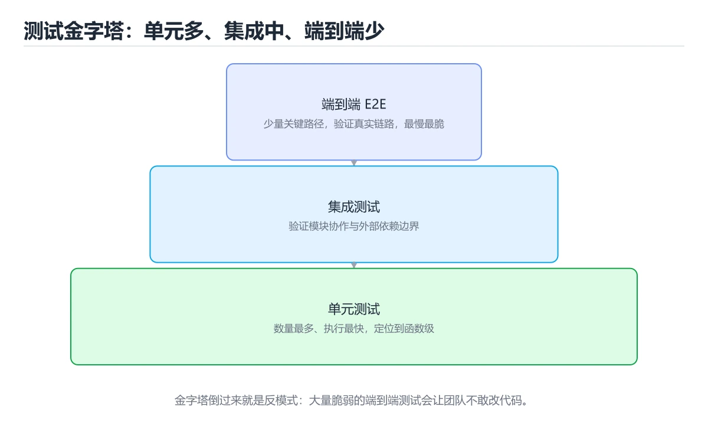
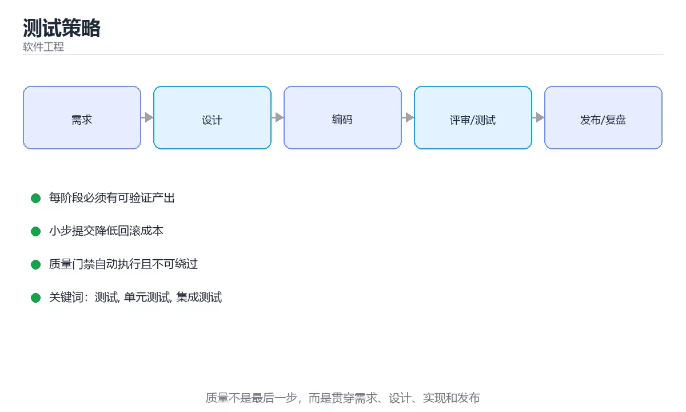

# 测试策略





> 内容更新时间：2026-10-06 · 学习阶段：入门 · 预计用时：40 分钟

## 本节知识框架

**课程定位**：所属分类 `software_engineering`（软件工程），课程主题 `测试策略`，学习阶段 入门，建议用时 35 分钟。

本课主线：测试金字塔、测试替身、覆盖率陷阱与契约测试。

**学完本课应当能够**
- 说清 `测试` 与 `单元测试` 的含义与区别，并各举一个正例和一个反例。
- 用本课示例验证 `集成测试` 的行为，记录输入、输出与失败条件。
- 遇到「只追求覆盖率数字」这类问题时，能说出触发条件与修复顺序。

### 从概念到验证的学习链条

1. `测试`：先掌握 用可重复的输入和断言验证代码行为是否符合预期，再用它解释 `单元测试` 为什么会出现。
2. `单元测试`：先掌握 在隔离范围内验证一个函数或类的最小行为，运行快且失败定位直接，再用它解释 `集成测试` 为什么会出现。
3. `集成测试`：先掌握 把多个模块或真实依赖组合起来验证交互，覆盖单元测试看不到的边界，再用它解释 `覆盖率` 为什么会出现。
4. `覆盖率`：先掌握 测试执行到的代码、分支或需求占总量的比例，再用它解释 `契约测试` 为什么会出现。
5. `契约测试`：先掌握 契约测试（消费者与提供者接口约定，避免联调才暴露问题）、变异测试（故意改代码看测试是否失败，检验测试有效性）、属性测试（用随机输入验证不变式）、性能测试（压测与基准回归）、安全测试（SAST/DAST/依赖扫描），再用它解释 本课示例的观察结果 为什么会出现。

**先修与衔接**：本课是「软件工程」分类的第 2 课。先修内容：《设计模式与 SOLID》。《设计模式与 SOLID》里的 `设计模式`、`SOLID` 是本课的前提。相关或后续课程：《需求分析与建模》、《Go 测试进阶：基准、模糊与集成》、《测试与质量门禁：把问题挡在上线前》。

### 完成判据

- **定义关**：不看正文也能说明 `测试` 是 用可重复的输入和断言验证代码行为是否符合预期，并指出一个反例。
- **机制关**：能按“输入 → 转换 → 输出 → 验证”复述 `测试策略`，而不是只背结论。
- **示例关**：能运行或推演 `测试策略` 的 `python` 示例，并说明一个真实出现的标识符或字面量。
- **证据关**：能指出 `测试策略` 示例里的 调用了 `field()`，并说明它支持或反驳了本课的哪一条结论。
- **排错关**：能复现 只追求覆盖率数字，记录现象并按 关注断言质量与关键路径 修复。
- **迁移关**：能把 `测试`、`单元测试`、`集成测试`、`覆盖率` 放进一个与 `测试策略` 不同的项目场景，并保持输入与验证条件可追踪。
- **复盘关**：学完 `测试策略` 后，用一句话写下仍然不确定的结论，并列出下一次验证需要的输入、环境和成功判据。

### 复习清单

- [ ] 能不看正文复述本课核心术语，并指出一个边界或反例。
- [ ] 能运行或推演本课示例，记录输入、输出与失败现象。
- [ ] 能完成一次自测，并把错题对照错误表定位原因。

## 核心概念定义

| 术语 | 操作性定义 | 常见边界与风险 |
| --- | --- | --- |
| 测试 | 用可重复的输入和断言验证代码行为是否符合预期。 | 易错：单跑通过、全跑失败；正确做法是每个用例独立准备数据。 |
| 单元测试 | 在隔离范围内验证一个函数或类的最小行为，运行快且失败定位直接。 | 隔离级别与并发事务会影响可见性，换级别或换存储引擎后要重新验证。 |
| 集成测试 | 把多个模块或真实依赖组合起来验证交互，覆盖单元测试看不到的边界。 | 不同版本与依赖组合的行为可能不同，升级或换环境前要按官方变更说明重新验证。 |
| 覆盖率 | 测试执行到的代码、分支或需求占总量的比例。 | 易错：覆盖率高压不住缺陷；正确做法是关注断言质量与关键路径。 |
| 契约测试 | 契约测试（消费者与提供者接口约定，避免联调才暴露问题）、变异测试（故意改代码看测试是否失败，检验测试有效性）、属性测试（用随机输入验证不变式）、性能测试（压测与基准回归）、安全测试（SAST/DAST/依赖扫描）。 | 易错：接口变更线上炸；正确做法是消费方契约测试。 |

## 原理与运行机制

### 机制总览

**教材衔接：进阶实践**

契约测试（消费者与提供者接口约定，避免联调才暴露问题）、变异测试（故意改代码看测试是否失败，检验测试有效性）、属性测试（用随机输入验证不变式）、性能测试（压测与基准回归）、安全测试（SAST/DAST/依赖扫描）。

**教材衔接：各层的工具与用例比例**

| 层级 | 典型工具 | 建议占比 | 单条耗时 |
| --- | --- | --- | --- |
| 单元测试 | JUnit / pytest / vitest / Go testing | 60%~70% | 毫秒级 |
| 集成测试 | Testcontainers / 内存数据库 / WireMock | 20%~30% | 秒级 |
| 端到端 | Playwright / Cypress / Appium | 5%~10% | 十秒~分钟 |
| 性能与安全 | k6 / JMeter、SAST/DAST/依赖扫描 | 少量但必须有 | 按需 |

比例不是硬指标，而是**反馈速度的体现**：单测越多，CI 越快、定位越准；E2E 越多，越容易出现"改一处坏一片"的脆弱测试。

**教材衔接：每个层级各测什么**

1. **单元**：分支逻辑、边界条件、异常路径、纯函数计算。不 mock 就没有依赖，是最好的测试。
2. **集成**：数据库读写（用真实或容器化数据库）、HTTP 接口契约、事务与并发、消息投递。
3. **端到端**：只覆盖核心用户旅程（注册→下单→支付→查询），每条都要有稳定数据与环境隔离。
4. **回归**：把线上事故转化为自动化用例，防止同一问题再次出现。

### 机制拆解：每一步的输入、动作与输出

#### 1. `测试`
- 输入：`测试`；本步把 用可重复的输入和断言验证代码行为是否符合预期 当作判断规则。
- 动作：围绕 `测试` 保留中间状态，并记录它与 `单元测试` 的对应关系。
- 输出：`单元测试`，它可以被下一段代码、测试或记录继续使用。
- `测试` 的失败条件：当测试依赖执行顺序时，会出现单跑通过、全跑失败。

#### 2. `单元测试`
- 输入：`测试`；本步把 在隔离范围内验证一个函数或类的最小行为，运行快且失败定位直接 当作判断规则。
- 动作：围绕 `单元测试` 保留中间状态，并记录它与 `集成测试` 的对应关系。
- 输出：`集成测试`，它可以被下一段代码、测试或记录继续使用。
- `单元测试` 的失败条件：隔离级别与并发事务会影响可见性，换级别或换存储引擎后要重新验证。

#### 3. `集成测试`
- 输入：`单元测试`；本步把 把多个模块或真实依赖组合起来验证交互，覆盖单元测试看不到的边界 当作判断规则。
- 动作：围绕 `集成测试` 保留中间状态，并记录它与 `覆盖率` 的对应关系。
- 输出：`覆盖率`，它可以被下一段代码、测试或记录继续使用。
- `集成测试` 的失败条件：不同版本与依赖组合的行为可能不同，升级或换环境前要按官方变更说明重新验证。

#### 4. `覆盖率`
- 输入：`集成测试`；本步把 测试执行到的代码、分支或需求占总量的比例 当作判断规则。
- 动作：围绕 `覆盖率` 保留中间状态，并记录它与 `契约测试` 的对应关系。
- 输出：`契约测试`，它可以被下一段代码、测试或记录继续使用。
- `覆盖率` 的失败条件：当只追求覆盖率数字时，会出现覆盖率高压不住缺陷。

#### 5. `契约测试`
- 输入：`覆盖率`；本步把 契约测试（消费者与提供者接口约定，避免联调才暴露问题）、变异测试（故意改代码看测试是否失败，检验测试有效性）、属性测试（用随机输入验证不变式）、性能测试（压测与基准回归）、安全测试（SAST/DAST/依赖扫描） 当作判断规则。
- 动作：围绕 `契约测试` 保留中间状态，并记录它与 `field` 的对应关系。
- 输出：`field`，它可以被下一段代码、测试或记录继续使用。
- `契约测试` 的失败条件：当无契约测试时，会出现接口变更线上炸。

### 示例中的可观察事实

1. 调用了 `field()`；它对应的课程主题是 `测试策略`。
2. 调用了 `total()`；它对应的课程主题是 `测试策略`。
3. 调用了 `shape_ratio()`；它对应的课程主题是 `测试策略`。
4. 调用了 `max()`；它对应的课程主题是 `测试策略`。
5. 调用了 `round()`；它对应的课程主题是 `测试策略`。
6. 调用了 `flaky_rate()`；它对应的课程主题是 `测试策略`。
7. 调用了 `p95_seconds()`；它对应的课程主题是 `测试策略`。
8. 调用了 `sorted()`；它对应的课程主题是 `测试策略`。

### 复现实验记录

- 环境：`测试策略` 使用 `python` 示例，固定 `测试`、`单元测试`、`集成测试`、`覆盖率` 作为第一组条件。
- 首轮输入：先确认 调用了 `field()`，预测 `测试` 会怎样变化。
- 基线观察：记录命令、输入、输出和错误原文，不用截图代替可复制的文本。
- 单变量修改：只改变 `测试`，观察 `契约测试` 是否仍满足定义。
- 失败注入：复现 只追求覆盖率数字，确认现象是 覆盖率高压不住缺陷。
- 记录结论：把“修改前、修改后、预期变化、实际变化”写成四列表，这样复盘 `测试策略` 时才能区分概念错误与实现错误。

## 典型应用场景

- **只追求覆盖率数字**：典型现象是覆盖率高压不住缺陷；正确做法是关注断言质量与关键路径。
- **大量端到端用例**：典型现象是慢且不稳定；正确做法是用例下移到低层。
- **测试依赖执行顺序**：典型现象是单跑通过、全跑失败；正确做法是每个用例独立准备数据。
- **共享可变测试数据**：典型现象是偶发失败；正确做法是自建自清理或用夹具。

### 最小验证场景

- 准备：保留 `python` 示例的原始输入，先记录 `测试策略` 的基线输出和完整运行命令。
- 观察：先核对 调用了 `field()`，再改变一个与 `测试` 相关的条件。
- 判定：新结果与 `测试策略` 的基线不同不等于错误；只有当差异破坏了 `测试` 的定义或错误表中的约束，才判定为失败。

### 选择与边界

- 使用 `测试` 时，先满足它的定义：用可重复的输入和断言验证代码行为是否符合预期；易错：单跑通过、全跑失败；正确做法是每个用例独立准备数据。
- 使用 `单元测试` 时，先满足它的定义：在隔离范围内验证一个函数或类的最小行为，运行快且失败定位直接；隔离级别与并发事务会影响可见性，换级别或换存储引擎后要重新验证。
- 使用 `集成测试` 时，先满足它的定义：把多个模块或真实依赖组合起来验证交互，覆盖单元测试看不到的边界；不同版本与依赖组合的行为可能不同，升级或换环境前要按官方变更说明重新验证。
- 使用 `覆盖率` 时，先满足它的定义：测试执行到的代码、分支或需求占总量的比例；易错：覆盖率高压不住缺陷；正确做法是关注断言质量与关键路径。
- 使用 `契约测试` 时，先满足它的定义：契约测试（消费者与提供者接口约定，避免联调才暴露问题）、变异测试（故意改代码看测试是否失败，检验测试有效性）、属性测试（用随机输入验证不变式）、性能测试（压测与基准回归）、安全测试（SAST/DAST/依赖扫描）；易错：接口变更线上炸；正确做法是消费方契约测试。

## 代码/协议/SQL 示例

**教材衔接：测试类型速查**

| 类型 | 目的 | 触发时机 |
| --- | --- | --- |
| 冒烟测试 | 核心路径是否可用 | 每次部署 |
| 回归测试 | 新改动是否破坏旧功能 | 每次提交 |
| 探索性测试 | 人工发现意外缺陷 | 版本前期 |
| 混沌测试 | 验证容错假设 | 定期演练 |
| 安全测试 | 发现漏洞 | 上线前与定期 |
| 兼容性测试 | 多端多版本可用 | 发布前 |

```python
from dataclasses import dataclass, field

@dataclass
class TestSuite:
    """测试套件统计：关注分布与稳定性，而非单纯覆盖率。"""

    unit: int = 0
    integration: int = 0
    e2e: int = 0
    flaky: int = 0
    durations: list = field(default_factory=list)

    def total(self) -> int:
        return self.unit + self.integration + self.e2e

    def shape_ratio(self) -> dict:
        total = max(1, self.total())
        return {
            "unit": round(self.unit / total, 2),
            "integration": round(self.integration / total, 2),
            "e2e": round(self.e2e / total, 2),
        }

    def flaky_rate(self) -> float:
        return round(self.flaky / max(1, self.total()), 4)

    def p95_seconds(self) -> float:
        if not self.durations:
            return 0.0
        ordered = sorted(self.durations)
        return ordered[int(len(ordered) * 0.95) - 1]

    def verdict(self) -> str:
        ratio = self.shape_ratio()
        if ratio["e2e"] > 0.25:
            return "端到端比例偏高：下移部分用例到单元或集成层"
        if self.flaky_rate() > 0.02:
            return "不稳定用例过多：先修稳定性再扩覆盖"
        if self.p95_seconds() > 600:
            return "反馈过慢：并行化或拆分套件"
        return "结构健康"

suite = TestSuite(unit=140, integration=40, e2e=20, flaky=3, durations=[12, 18, 25, 300, 420])
print(suite.shape_ratio(), suite.flaky_rate(), suite.verdict())
```

**教材衔接：测试金字塔**

| 层级 | 数量 | 速度 | 说明 |
| --- | --- | --- | --- |
| 单元测试 | 最多 | 毫秒级 | 只测一个函数/类，依赖用替身 |
| 集成测试 | 中等 | 秒级 | 验证模块协同时是否正确（数据库、HTTP） |
| 端到端测试 | 最少 | 分钟级 | 从用户视角跑完整流程，脆弱且慢 |

倒金字塔（大量 E2E、少量单测）会导致反馈慢、维护成本高。

**教材衔接：测试替身**

Stub 提供固定返回值、Mock 校验调用行为、Fake 是轻量可用实现（内存数据库）、Spy 记录调用。原则：**只在必要处 mock**，过度 mock 会让测试与实现细节耦合，重构即失败。

**教材衔接：好测试的特征**

快速、独立（不依赖执行顺序与共享状态）、可重复（不依赖时间与随机）、自验证（无需人工判断）、及时（与代码同步编写）。

命名建议「被测方法_场景_期望结果」，一个用例只断言一件事，失败信息要能定位原因。

**教材衔接：测试与 CI**

提交时跑快速的单元测试；合并前跑集成测试；发布前跑 E2E 与性能回归。测试失败必须阻断合并，且要**快速失败、明确报错、可本地复现**。

**教材衔接：让测试跑得快的四个手段**

1. 测试数据用工厂/构造器创建，避免共享环境与顺序依赖。
2. 并行执行（pytest-xdist、JUnit 并行、vitest 多线程），注意隔离随机端口与临时库。
3. 只对必要的边界打桩，其余走真实实现（过度的 mock 既不真实又慢）。
4. 分层触发：提交跑单元、合并跑集成、发布前跑 E2E，而不是每次都全量。

**教材衔接：测试层级速查**

| 层级 | 范围 | 数量占比 | 速度 | 稳定性 |
| --- | --- | --- | --- | --- |
| 单元测试 | 单个函数或类 | 约 70% | 毫秒级 | 高 |
| 集成测试 | 多个模块与外部依赖 | 约 20% | 秒级 | 中 |
| 端到端测试 | 完整用户流程 | 约 10% | 分钟级 | 较低 |
| 契约测试 | 服务间接口约定 | 按接口数 | 秒级 | 高 |
| 性能测试 | 吞吐与延迟 | 按场景 | 分钟级 | 中 |

原则：**在能覆盖风险的最低层级写测试**，越高层越慢、越脆、越贵。

**教材衔接：测试数据与替身速查**

| 替身 | 行为 | 适用 |
| --- | --- | --- |
| Stub | 返回固定值 | 提供可预测输入 |
| Spy | 记录调用 | 验证是否被调用 |
| Mock | 预设期望 | 交互行为验证 |
| Fake | 简化可用实现 | 内存版仓库 |
| 真实依赖 | 完整行为 | 集成测试 |

测试数据原则：每个用例自建自清理、不依赖执行顺序、可重复运行、敏感数据脱敏。

**教材衔接：深入补充：测试策略 的取舍与边界**

### 一、把概念放回真实约束

| 做法 | 适用规模 | 成本 | 主要风险 |
| --- | --- | --- | --- |
| 先写测试再改 | 任何规模 | 前期较慢 | 测试本身失真 |
| 小步提交与评审 | 多人协作 | 评审开销 | 批次过大 |
| 自动化质量门禁 | 持续交付 | 维护流水线 | 门禁形同虚设 |


### 四、自测清单

- 能否用一句话说出测试策略解决的核心问题与不适用场景？
- 能否画出 测试 的数据流或状态变化，并标出失败路径？
- 把 default_factory 的输入推到边界，说明本课哪一条结论会先失效。
- 能否写出一条可复现的验证命令，让别人独立得到相同结论？

**运行方式**：运行 `测试策略` 的示例时，保存为 `.py` 文件后用 `python 文件名.py` 运行；第三方依赖先在虚拟环境里安装。

### 示例精读：先找证据，再改一个条件

1. 调用了 `field()`；它出现在 `测试策略` 的示例中，阅读时先确认它前后各发生了什么。
2. 调用了 `total()`；它出现在 `测试策略` 的示例中，阅读时先确认它前后各发生了什么。
3. 调用了 `shape_ratio()`；它出现在 `测试策略` 的示例中，阅读时先确认它前后各发生了什么。
4. 调用了 `max()`；它出现在 `测试策略` 的示例中，阅读时先确认它前后各发生了什么。
5. 调用了 `round()`；它出现在 `测试策略` 的示例中，阅读时先确认它前后各发生了什么。
6. 调用了 `flaky_rate()`；它出现在 `测试策略` 的示例中，阅读时先确认它前后各发生了什么。
7. 调用了 `p95_seconds()`；它出现在 `测试策略` 的示例中，阅读时先确认它前后各发生了什么。
8. 调用了 `sorted()`；它出现在 `测试策略` 的示例中，阅读时先确认它前后各发生了什么。
- 在 `测试策略` 中与 `测试` 对照：示例必须能支持 用可重复的输入和断言验证代码行为是否符合预期，否则说明这一段还缺少实现或验证步骤。
- 在 `测试策略` 中与 `单元测试` 对照：示例必须能支持 在隔离范围内验证一个函数或类的最小行为，运行快且失败定位直接，否则说明这一段还缺少实现或验证步骤。
- 在 `测试策略` 中与 `集成测试` 对照：示例必须能支持 把多个模块或真实依赖组合起来验证交互，覆盖单元测试看不到的边界，否则说明这一段还缺少实现或验证步骤。
- 在 `测试策略` 中与 `覆盖率` 对照：示例必须能支持 测试执行到的代码、分支或需求占总量的比例，否则说明这一段还缺少实现或验证步骤。

## 时间/空间复杂度或性能分析

**性能关注点（测试策略）**：质量成本体现在返工：记录缺陷发现阶段、评审耗时与自动化覆盖比例。

**测量方法**：以 `测试策略` 的 `测试` 场景为对象，固定输入跑一遍记录基线，再把规模或并发度提高一个数量级复测；两次结果的差值与波动范围才是结论依据。

### 需要控制的变量与记录项

- `测试策略` 的 `测试`：固定它的版本、输入范围和资源上限，分别记录速度、内存与失败率的变化。
- `测试策略` 的 `单元测试`：固定它的版本、输入范围和资源上限，分别记录速度、内存与失败率的变化。
- `测试策略` 的 `集成测试`：固定它的版本、输入范围和资源上限，分别记录速度、内存与失败率的变化。
- `测试策略` 的 `覆盖率`：固定它的版本、输入范围和资源上限，分别记录速度、内存与失败率的变化。
- `测试策略` 的 `契约测试`：固定它的版本、输入范围和资源上限，分别记录速度、内存与失败率的变化。
- `测试策略` 中 `测试` 的边界：易错：单跑通过、全跑失败；正确做法是每个用例独立准备数据。达到边界时不要外推，必须重新测量。
- `测试策略` 中 `单元测试` 的边界：隔离级别与并发事务会影响可见性，换级别或换存储引擎后要重新验证。达到边界时不要外推，必须重新测量。
- `测试策略` 中 `集成测试` 的边界：不同版本与依赖组合的行为可能不同，升级或换环境前要按官方变更说明重新验证。达到边界时不要外推，必须重新测量。
- `测试策略` 中 `覆盖率` 的边界：易错：覆盖率高压不住缺陷；正确做法是关注断言质量与关键路径。达到边界时不要外推，必须重新测量。
- `测试策略` 中 `契约测试` 的边界：易错：接口变更线上炸；正确做法是消费方契约测试。达到边界时不要外推，必须重新测量。
- `测试策略` 的代码证据：先验证 调用了 `field()`，再记录该路径的输入规模与耗时；只看代码行数不能推出复杂度。

## 常见误区与易错点

| 容易写错的做法 | 实际现象 | 原因与正确做法 |
| --- | --- | --- |
| 只追求覆盖率数字 | 覆盖率高压不住缺陷 | 关注断言质量与关键路径 |
| 大量端到端用例 | 慢且不稳定 | 用例下移到低层 |
| 测试依赖执行顺序 | 单跑通过、全跑失败 | 每个用例独立准备数据 |
| 共享可变测试数据 | 偶发失败 | 自建自清理或用夹具 |
| 过度 Mock | 测试通过但线上失败 | 只替身外部依赖，核心逻辑用真实实现 |
| 忽略不稳定用例 | CI 反复失败被忽略 | 优先修复 flaky 用例 |
| 不测异常与边界 | 线上才发现 | 覆盖空值、边界、并发与失败路径 |
| 测试里 sleep 等待 | 慢且不稳定 | 用轮询条件或可控时钟 |
| 无契约测试 | 接口变更线上炸 | 消费方契约测试 |
| 测试环境与生产差异大 | 结论不可迁移 | 用容器化环境对齐 |

### 现场 1：只追求覆盖率数字

**症状**：覆盖率高压不住缺陷。

**根因与修复**：关注断言质量与关键路径。

**自检**：在本课示例里复现「只追求覆盖率数字」，改成关注断言质量与关键路径后重跑；如果症状消失且失败路径按预期变化，说明定位正确。

### 现场 2：大量端到端用例

**症状**：慢且不稳定。

**根因与修复**：用例下移到低层。

**自检**：在本课示例里复现「大量端到端用例」，改成用例下移到低层后重跑；如果症状消失且失败路径按预期变化，说明定位正确。

### 现场 3：测试依赖执行顺序

**症状**：单跑通过、全跑失败。

**根因与修复**：每个用例独立准备数据。

**自检**：在本课示例里复现「测试依赖执行顺序」，改成每个用例独立准备数据后重跑；如果症状消失且失败路径按预期变化，说明定位正确。

### 现场 4：共享可变测试数据

**症状**：偶发失败。

**根因与修复**：自建自清理或用夹具。

**自检**：在本课示例里复现「共享可变测试数据」，改成自建自清理或用夹具后重跑；如果症状消失且失败路径按预期变化，说明定位正确。

### 现场 5：过度 Mock

**症状**：测试通过但线上失败。

**根因与修复**：只替身外部依赖，核心逻辑用真实实现。

**自检**：在本课示例里复现「过度 Mock」，改成只替身外部依赖，核心逻辑用真实实现后重跑；如果症状消失且失败路径按预期变化，说明定位正确。

### 现场 6：忽略不稳定用例

**症状**：CI 反复失败被忽略。

**根因与修复**：优先修复 flaky 用例。

**自检**：在本课示例里复现「忽略不稳定用例」，改成优先修复 flaky 用例后重跑；如果症状消失且失败路径按预期变化，说明定位正确。

### 现场 7：不测异常与边界

**症状**：线上才发现。

**根因与修复**：覆盖空值、边界、并发与失败路径。

**自检**：在本课示例里复现「不测异常与边界」，改成覆盖空值、边界、并发与失败路径后重跑；如果症状消失且失败路径按预期变化，说明定位正确。

### 现场 8：测试里 sleep 等待

**症状**：慢且不稳定。

**根因与修复**：用轮询条件或可控时钟。

**自检**：在本课示例里复现「测试里 sleep 等待」，改成用轮询条件或可控时钟后重跑；如果症状消失且失败路径按预期变化，说明定位正确。

### 现场 9：无契约测试

**症状**：接口变更线上炸。

**根因与修复**：消费方契约测试。

**自检**：在本课示例里复现「无契约测试」，改成消费方契约测试后重跑；如果症状消失且失败路径按预期变化，说明定位正确。

## 与其他知识点的关系

- **先修**：`设计模式与 SOLID`。本课默认这些内容已经掌握。
- **相关或后续**：`需求分析与建模`、`Go 测试进阶：基准、模糊与集成`、`测试与质量门禁：把问题挡在上线前`。本课术语会在这些课程里继续使用。
- **术语归属**：`测试`、`单元测试`、`集成测试` 的定义以本课「核心概念定义」为准，换到其他课程时先确认定义是否被改写。
- 同一分类的《质量度量与工程门禁》也涉及 `覆盖率`；两课衔接时先确认这个术语的定义是否一致。

### 先修与后续术语接口

- `Go 测试进阶：基准、模糊与集成`：共享术语 `集成测试`、`覆盖率`，共同关键词 `集成测试`、`覆盖率`。
- `设计模式与 SOLID`：两者通过本分类的学习顺序衔接，阅读时重点比较各自的输入与失败条件。
- `需求分析与建模`：两者通过本分类的学习顺序衔接，阅读时重点比较各自的输入与失败条件。
- `测试与质量门禁：把问题挡在上线前`：共享术语 `测试`、`覆盖率`，共同关键词 `测试`、`覆盖率`。

### 容易混淆的相邻概念

- `测试` 与 `单元测试`：前者强调 用可重复的输入和断言验证代码行为是否符合预期；后者强调 在隔离范围内验证一个函数或类的最小行为，运行快且失败定位直接。判断时分别检查两条定义的适用范围，不要只看名称相似就互换。
- `单元测试` 与 `集成测试`：前者强调 在隔离范围内验证一个函数或类的最小行为，运行快且失败定位直接；后者强调 把多个模块或真实依赖组合起来验证交互，覆盖单元测试看不到的边界。判断时分别检查两条定义的适用范围，不要只看名称相似就互换。
- `集成测试` 与 `覆盖率`：前者强调 把多个模块或真实依赖组合起来验证交互，覆盖单元测试看不到的边界；后者强调 测试执行到的代码、分支或需求占总量的比例。判断时分别检查两条定义的适用范围，不要只看名称相似就互换。
- `覆盖率` 与 `契约测试`：前者强调 测试执行到的代码、分支或需求占总量的比例；后者强调 契约测试（消费者与提供者接口约定，避免联调才暴露问题）、变异测试（故意改代码看测试是否失败，检验测试有效性）、属性测试（用随机输入验证不变式）、性能测试（压测与基准回归）、安全测试（SAST/DAST/依赖扫描）。判断时分别检查两条定义的适用范围，不要只看名称相似就互换。

## 自测题与参考答案

> 先独立作答，再对照参考答案；答案都能在本课正文、术语表或错误表里找到依据。

### 自测 1（概念复述）

不看正文，写出 `测试` 的操作性定义，并说明它与 `单元测试` 的区别。

**参考答案**：用可重复的输入和断言验证代码行为是否符合预期。

`单元测试` 的定位是：在隔离范围内验证一个函数或类的最小行为，运行快且失败定位直接；两者的差别要从适用对象与失败模式上说明。

### 自测 2（排错）

本课错误表记录了「只追求覆盖率数字」这类做法。请写出它会出现的现象、根因，以及修复顺序。

**参考答案**：现象是覆盖率高压不住缺陷；正确做法是关注断言质量与关键路径。修复时先复现现象并保留证据，再改动一处假设重跑，确认现象消失。

### 自测 3（动手验证）

运行本课的 `python` 示例，把其中的 `"测试套件统计：关注分布与稳定性，而非单纯覆盖率。"` 换成一个边界值后重新运行，记录输出与错误信息。

**参考答案**：正常输入下 `python` 示例应当复现正文给出的结果；把 `"测试套件统计：关注分布与稳定性，而非单纯覆盖率。"` 换成边界值后，如果结果改变或报错，先核对它是否满足 `测试策略` 中`测试` 的适用范围，再检查错误表里是否有同类现象。

### 自测 4（代码阅读）

阅读本课开头的 `python` 示例，说明它体现了`测试` 的哪一条性质，并指出改动哪个输入会让这条性质不再成立。

**参考答案**：`测试` 的定义是 用可重复的输入和断言验证代码行为是否符合预期，示例正是在实现这条定义。改动与 `测试` 有关的一个输入后，如果结果不再符合 `测试策略` 的正文描述，就说明该性质只在当前前提成立。

### 自测 5（迁移）

把 `测试策略` 的方法迁移到自己的项目：围绕 `测试` 写出一个与错误表同类的风险点，并说明触发条件和检验方式。

**参考答案**：例如「测试环境与生产差异大」，它会导致结论不可迁移；检验方式是按用容器化环境对齐改一处再复现，确认现象消失且没有引入新的失败分支。

### 自测 6（对比）

用一个表格对比 `测试` 与 `单元测试`：各写一行适用场景、一行失败表现。

**参考答案**：`测试` 的定义是用可重复的输入和断言验证代码行为是否符合预期；`单元测试` 的定义是在隔离范围内验证一个函数或类的最小行为，运行快且失败定位直接。两者的失败表现分别对应本课错误表里与本术语相关的行。

### 自测 7（排错顺序）

面对「只追求覆盖率数字」引发的问题，请把“复现 覆盖率高压不住缺陷 → 保留证据 → 关注断言质量与关键路径 → 回归验证”四步写成可执行的检查清单。

**参考答案**：第一步按覆盖率高压不住缺陷复现；第二步记录输入、版本与完整报错；第三步按关注断言质量与关键路径只改一处；第四步重跑并确认失败路径也按预期变化。

### 自测 8（边界判断）

针对 `契约测试`，分别写出“可以使用”的条件和“结论不再成立”的条件。

**参考答案**：易错：接口变更线上炸；正确做法是消费方契约测试。 同时要把 `契约测试` 的定义 契约测试（消费者与提供者接口约定，避免联调才暴露问题）、变异测试（故意改代码看测试是否失败，检验测试有效性）、属性测试（用随机输入验证不变式）、性能测试（压测与基准回归）、安全测试（SAST/DAST/依赖扫描） 与实际输入逐项对照。

### 自测 9（机制重建）

不看正文，按输入、转换、输出、验证四段重建 `测试` → `单元测试` → `集成测试` → `覆盖率` 的作用链。

**参考答案**：起点是 `测试` 的定义 用可重复的输入和断言验证代码行为是否符合预期；中间每一步都保留可观察状态；终点由 `契约测试` 检查，失败时回到错误表定位第一个偏离定义的步骤。

### 自测 10（综合排错）

在 `测试策略` 中，现象是 结论不可迁移。请围绕 测试环境与生产差异大 写出最小复现、关键证据、修复动作和回归验证，并说明为什么不能只凭一次运行下结论。

**参考答案**：先复现 测试环境与生产差异大，记录输入与完整错误；再按 用容器化环境对齐 只改一处。回归时同时跑正常路径和边界路径，只有两次结果都可解释，才把修复视为完成。

### 自测 11（一分钟复述）

用每分钟约 200 字的速度复述 `测试策略`：先给主问题，再按顺序说出 `测试`、`单元测试`、`集成测试`、`覆盖率`，最后给一个失败案例。

**自评标准**：主问题必须对应 测试金字塔、测试替身、覆盖率陷阱与契约测试；每个术语都要能接上一句定义或边界；失败案例必须写成可观察现象，不能用“可能有风险”代替证据。

## 术语速查

| 术语 | 一句话说明 |
| --- | --- |
| `测试` | 用可重复的输入和断言验证代码行为是否符合预期。 |
| `单元测试` | 在隔离范围内验证一个函数或类的最小行为，运行快且失败定位直接。 |
| `集成测试` | 把多个模块或真实依赖组合起来验证交互，覆盖单元测试看不到的边界。 |
| `覆盖率` | 测试执行到的代码、分支或需求占总量的比例。 |
| `契约测试` | 契约测试（消费者与提供者接口约定，避免联调才暴露问题）、变异测试（故意改代码看测试是否失败，检验测试有效性）、属性测试（用随机输入验证不变式）、性能测试（压测与基准回归）、安全测试（SAST/DAST/依赖扫描）。 |

**术语关系**：`测试`（用可重复的输入和断言验证代码行为是否符合预期） → `单元测试`（在隔离范围内验证一个函数或类的最小行为） → `集成测试`（把多个模块或真实依赖组合起来验证交互） → `覆盖率`（测试执行到的代码、分支或需求占总量的比例）。

## 考点精讲

`测试策略` 的题库有 6 道题，下面逐题给出题干、正确项与判断依据：先自己作答，再核对正确项，最后回到正文对应小节复核。

### 考点 1：第 1 题

- **题目**：测试金字塔的正确结构是？
- **正确项**：单元测试最多，E2E 最少
- **判断依据**：这道题落在术语 `测试` 上：用可重复的输入和断言验证代码行为是否符合预期。复习时把 `测试` 的定义、适用边界和一个反例一起说清楚，再回到「核心概念定义」核对原文。

### 考点 2：第 2 题

- **题目**：关于覆盖率，正确的认识是？
- **正确项**：高覆盖不等于高质量
- **判断依据**：这道题落在术语 `覆盖率` 上：测试执行到的代码、分支或需求占总量的比例。复习时把 `覆盖率` 的定义、适用边界和一个反例一起说清楚，再回到「核心概念定义」核对原文。

### 考点 3：第 3 题

- **题目**：阅读这份测试套件统计，下面哪项判断是正确的？
- **正确项**：除数量外还要跟踪不稳定用例与执行时长，用测试金字塔控制各层比例
- **判断依据**：这道题落在术语 `测试` 上：用可重复的输入和断言验证代码行为是否符合预期。复习时把 `测试` 的定义、适用边界和一个反例一起说清楚，再回到「核心概念定义」核对原文。

### 考点 4：第 4 题

- **题目**：围绕“测试策略”中的 测试、单元测试、集成测试，下列哪两项是本课强调的实践判断？
- **正确项**：学习 测试 时要同时说明输入、输出和失败路径，不能只看正常流程；验证 单元测试 时要固定版本并覆盖边界输入，结论才可复现
- **判断依据**：这道题落在术语 `测试` 上：用可重复的输入和断言验证代码行为是否符合预期。复习时把 `测试` 的定义、适用边界和一个反例一起说清楚，再回到「核心概念定义」核对原文。

### 考点 5：第 5 题

- **题目**：测试数据应如何构造？
- **正确项**：每个用例自行构造并在结束时清理
- **判断依据**：这道题落在术语 `测试` 上：用可重复的输入和断言验证代码行为是否符合预期。复习时把 `测试` 的定义、适用边界和一个反例一起说清楚，再回到「核心概念定义」核对原文。

### 考点 6：第 6 题

- **题目**：下面几项都与 `测试` 有关，请按 `测试策略` 的正文顺序排列；该课主线是测试金字塔、测试替身、覆盖率陷阱与契约测试。
- **正确项**：测试金字塔 → 测试替身 → 好测试的特征 → 覆盖率的意义与陷阱
- **判断依据**：这道题落在术语 `测试` 上：用可重复的输入和断言验证代码行为是否符合预期。复习时把 `测试` 的定义、适用边界和一个反例一起说清楚，再回到「核心概念定义」核对原文。

### 考点 7：`测试`

- **要点**：用可重复的输入和断言验证代码行为是否符合预期。
- **测试 的边界**：易错：单跑通过、全跑失败；正确做法是每个用例独立准备数据。

### 考点 8：`单元测试`

- **要点**：在隔离范围内验证一个函数或类的最小行为，运行快且失败定位直接。
- **单元测试 的边界**：隔离级别与并发事务会影响可见性，换级别或换存储引擎后要重新验证。

### 考点 9：`集成测试`

- **要点**：把多个模块或真实依赖组合起来验证交互，覆盖单元测试看不到的边界。
- **集成测试 的边界**：不同版本与依赖组合的行为可能不同，升级或换环境前要按官方变更说明重新验证。

### 考点 10：`覆盖率`

- **要点**：测试执行到的代码、分支或需求占总量的比例。
- **覆盖率 的边界**：易错：覆盖率高压不住缺陷；正确做法是关注断言质量与关键路径。

### 考点 11：`契约测试`

- **要点**：契约测试（消费者与提供者接口约定，避免联调才暴露问题）、变异测试（故意改代码看测试是否失败，检验测试有效性）、属性测试（用随机输入验证不变式）、性能测试（压测与基准回归）、安全测试（SAST/DAST/依赖扫描）。
- **契约测试 的边界**：易错：接口变更线上炸；正确做法是消费方契约测试。

### 考点 12：排错——只追求覆盖率数字

- **现象**：覆盖率高压不住缺陷。
- **处理**：关注断言质量与关键路径。

### 考点 13：排错——大量端到端用例

- **现象**：慢且不稳定。
- **处理**：用例下移到低层。

### 考点 14：综合辨析——`测试` 与 `契约测试`

- **辨析点**：`测试` 的定义是 用可重复的输入和断言验证代码行为是否符合预期；`契约测试` 的定义是 契约测试（消费者与提供者接口约定，避免联调才暴露问题）、变异测试（故意改代码看测试是否失败，检验测试有效性）、属性测试（用随机输入验证不变式）、性能测试（压测与基准回归）、安全测试（SAST/DAST/依赖扫描）。
- **答题要求**：面对 `测试策略` 的题目，先判断描述的是 `测试` 还是 `契约测试`，再归到对应定义，最后写出一个会让该定义失效的边界输入。

### 考点 15：排错评分点

- **现象分**：能写出 覆盖率高压不住缺陷，而不是只写“程序有错”。
- **证据分**：保留触发 只追求覆盖率数字 的输入、版本和错误原文。
- **修复分**：按 关注断言质量与关键路径 只改一处，并同时回归正常路径与边界路径。

## 内容元数据

- 内容版本：v2.0
- 最后更新：2026-10-06
- 学习阶段：入门
- 适用环境：通用软件工程实践；本课聚焦 测试。
- 内容来源：内置结构化课程与工程实践整理
- 相关主题：测试、单元测试、集成测试、覆盖率、契约测试
- 质量版本：P0 测验标准 + P1 覆盖扩展 + P2 体验补全

## 参考资料与复核

- 最后复核：2026-10-04
- 下次复核：2027-10-24
- 复核范围：版本兼容、API 行为、安全建议与工程实践
- 来源性质：官方文档、标准或权威教材；本课核对关键词：测试、单元测试、集成测试、覆盖率、契约测试。

| 参考资料 | 本课用途 |
| --- | --- |
| [Google SWE Book](https://abseil.io/resources/swe-book) | 工程规范、评审与维护 |
| [Martin Fowler 架构](https://martinfowler.com/architecture/) | 架构、重构与演进 |
| [OWASP SAMM](https://owaspsamm.org/) | 软件安全成熟度 |

| [本课术语索引：测试策略](#核心概念定义) | 按本课输入、术语边界和错误表现逐项核对 |
> 「测试策略」的链接用于离线阅读后的延伸核对；App 不会自动联网。