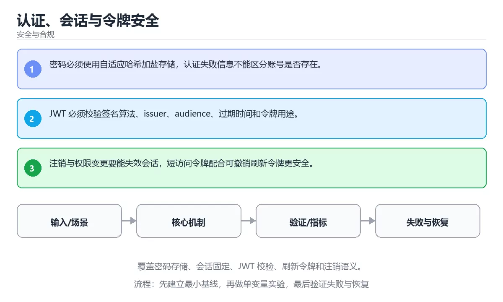

# 认证、会话与令牌安全



> 内容更新时间：2026-10-03 · 学习阶段：高级 · 预计用时：25 分钟

## 学习目标

- 能用自己的话解释：密码必须使用自适应哈希加盐存储，认证失败信息不能区分账号是否存在。
- 能用自己的话解释：JWT 必须校验签名算法、issuer、audience、过期时间和令牌用途。
- 能用自己的话解释：注销与权限变更要能失效会话，短访问令牌配合可撤销刷新令牌更安全。
- 能把本课知识放回「安全与合规」，并完成练习与测验。

## 前置知识

- 已完成「安全与合规」的基础课程，能运行正文中的最小示例。
- 本课关键词：认证、会话、JWT、刷新令牌。
- 遇到不熟悉的术语先记录问题，完成练习后再回读。

## 核心知识

### 1. 密码必须使用自适应哈希加盐存储，认证失败信息不能区分账号是否存在。

- 它解决的问题：把「密码必须使用自适应哈希加盐存储，认证失败信息不能区分账号是否存在。」放回真实场景，说明不做它会带来什么后果。
- 关键做法：先用最小示例建立基线，再逐步加入边界、失败和性能条件。
- 验证标准：结果可复现、错误可解释、边界有测试、失败能恢复。

### 2. JWT 必须校验签名算法、issuer、audience、过期时间和令牌用途。

- 它解决的问题：把「JWT 必须校验签名算法、issuer、audience、过期时间和令牌用途。」放回真实场景，说明不做它会带来什么后果。
- 关键做法：先用最小示例建立基线，再逐步加入边界、失败和性能条件。
- 验证标准：结果可复现、错误可解释、边界有测试、失败能恢复。

### 3. 注销与权限变更要能失效会话，短访问令牌配合可撤销刷新令牌更安全。

- 它解决的问题：把「注销与权限变更要能失效会话，短访问令牌配合可撤销刷新令牌更安全。」放回真实场景，说明不做它会带来什么后果。
- 关键做法：先用最小示例建立基线，再逐步加入边界、失败和性能条件。
- 验证标准：结果可复现、错误可解释、边界有测试、失败能恢复。

## 关键流程

```text
输入 → 校验 → 核心处理 → 验证 → 记录指标 → 失败恢复
```

## 实践路径

1. 用一句话复述本课要解决的问题。
2. 跑通正文中的最小示例并记录基线。
3. 只改变一个输入或参数，预测并验证结果。
4. 补一个失败路径，记录错误、恢复和指标。
5. 把结论写成可复现的笔记或测试。

## 常见误区

| 误区 | 后果 | 修正 |
| --- | --- | --- |
| 只记术语不做实验 | 遇到真实问题无法判断 | 用最小输入跑通并记录结果 |
| 只测正常路径 | 边界和故障上线才暴露 | 补空值、极值和依赖失败 |
| 没有基线就优化 | 无法证明改进有效 | 先测量再修改 |
| 忽略成本与安全 | 性能和风险失控 | 同时记录资源、权限与失败代价 |

## 动手练习

1. 合上教程，用 3～5 句话解释「认证、会话与令牌安全」。
2. 从正文选一个例子，改变一个条件并预测结果。
3. 设计一个失败场景，写出止损与恢复步骤。

**验收标准**：留下输入、命令、输出、差异和下一步问题。

## 本课小结

- 本课属于「安全与合规」，核心关键词是 认证、会话、JWT、刷新令牌。
- 先保证正确与可复现，再讨论性能和扩展。
- 完成练习和测验后，把仍然不确定的问题写成下一轮验证清单。

> 本课由 P1 内容扩展生成，重点补充原有课程缺失的主题与工程边界。

<!-- domain-supplement:v1 -->

## 安全落地补充：认证、会话与令牌安全

### 一、资产、边界与信任

先回答：保护哪些数据、谁可以访问、哪些组件是信任边界、攻击者能从哪些入口进入。围绕「认证、会话、JWT、刷新令牌」列出至少 3 个入口和对应的最小权限。

### 二、威胁 → 控制 → 验证

| 威胁 | 预防控制 | 检测方式 | 验证证据 |
| --- | --- | --- | --- |
| 输入被污染 | schema、白名单、编码 | 异常输入日志和告警 | 越权与注入测试 |
| 权限过大 | 最小权限、临时凭证 | 权限审计和异常调用 | 权限边界测试 |
| 密钥泄露 | 密钥管理、轮换 | 仓库和日志扫描 | 轮换与影响范围记录 |
| 操作不可追溯 | 结构化审计日志 | 关键动作告警 | 审计查询和复盘 |
| 恢复失败 | 备份、回滚、演练 | 恢复指标监控 | 演练时间与数据校验 |

### 三、上线前安全清单

- [ ] 所有外部输入经过校验和输出编码。
- [ ] 认证、授权和会话失效逻辑有测试。
- [ ] 密钥不进入源码、镜像和日志。
- [ ] 依赖漏洞、许可证和来源已审查。
- [ ] 高风险操作有确认、审计和回滚。
- [ ] 安全事件有联系人和升级路径。

### 四、事件响应演练

构造一次凭证泄露或越权访问，按发现、隔离、轮换、取证、恢复、复盘六步执行，记录时间线和剩余风险。

<!-- p0-thicken:v1 -->

## 考点精讲：把选择题还原成判断过程

下面不是答案速查，而是把本课测验里每个选项背后的判断标准展开。先自己作答，再对照解析检查推理链；如果结论正确但理由不完整，仍然需要回到正文补足概念。

### 考点 1：关于「密码必须使用自适应哈希加盐存储 认证…」，下列说法正确的是？

- **正确判断**：密码必须使用自适应哈希加盐存储，认证失败信息不能区分账号是否存在。
- **解析**：正确选项直接描述了本课要点。其他选项来自相邻主题，混淆了概念边界或适用条件；判断时要回到定义、输入和失败场景。学习《认证、会话与令牌安全》时应把该要点与「认证」一起理解。
- **迁移检查**：把题目中的一个输入换成边界值，原来的结论还成立吗？为什么？

### 考点 2：关于「JWT 必须校验签名算法、issue…」，下列说法正确的是？

- **正确判断**：JWT 必须校验签名算法、issuer、audience、过期时间和令牌用途。
- **解析**：正确选项直接描述了本课要点。其他选项来自相邻主题，混淆了概念边界或适用条件；判断时要回到定义、输入和失败场景。学习《认证、会话与令牌安全》时应把该要点与「认证」一起理解。
- **迁移检查**：如果去掉一个限制条件，哪个选项会变成正确？请写出判断过程。

### 考点 3：关于「注销与权限变更要能失效会话 短访问令…」，下列说法正确的是？

- **正确判断**：注销与权限变更要能失效会话，短访问令牌配合可撤销刷新令牌更安全。
- **解析**：正确选项直接描述了本课要点。其他选项来自相邻主题，混淆了概念边界或适用条件；判断时要回到定义、输入和失败场景。学习《认证、会话与令牌安全》时应把该要点与「认证」一起理解。
- **迁移检查**：把这道题改写成一次可运行或可人工验证的实验，并记录预期输出。

### 考点 4：「认证、会话与令牌安全」的核心学习目标是什么？

- **正确判断**：覆盖密码存储、会话固定、JWT 校验、刷新令牌和注销语义。
- **解析**：正确选项概括了本课目标。其他选项描述的是其他主题的目标或手段，不能回答本题；学习时应先明确目标，再用练习验证是否真正掌握。正确答案「覆盖密码存储、会话固定、JWT 校验、刷新令牌和注销语义。」直接满足题干给出的条件和范围，是唯一与定义一致的选项。「用资产、边界、攻击面和 STRIDE 分类在编码前识别安全风险。」只看到了表面现象，没有解释题干真正考查的机制。「理解访问控制、注入、加密失败、配置错误等常见 Web 风险的成因与修复。」把因果关系颠倒了，不能作为正确结论。把本题放回《认证、会话与令牌安全》的「认证、会话、JWT」语境，能更清楚地看出每个选项的边界。
- **迁移检查**：用自己的话写出正确项和两个错误项的适用边界。

<!-- p2-enrichment:v1 -->

## English Overview

**Title:** Authentication, Sessions and Tokens

**Summary:** Cover password storage, session fixation, JWT validation and token revocation.

**Category:** Security & Compliance  
**Level:** 高级  
**Key terms:** 认证, 会话, JWT, 刷新令牌

> The full tutorial is written in Chinese. This bilingual overview helps English readers identify the topic, scope and key terms before studying the detailed examples.

## 内容元数据

- 内容版本：v2.0
- 最后更新：2026-10-03
- 学习阶段：高级
- 适用环境：OWASP、云原生与合规安全实践
- 内容来源：内置结构化课程与工程实践整理
- 相关主题：认证、会话、JWT、刷新令牌
- 质量版本：P0 测验标准 + P1 覆盖扩展 + P2 体验补全

<!-- minimal-code:v1 -->

## 最小可运行示例

下面示例用于验证「认证、会话与令牌安全」的最小输入、处理和输出。先原样运行，再只修改一个值：

```python
import hashlib

digest = hashlib.sha256(b"password").hexdigest()
print(digest[:12])
```

## 预期输出

```text
5e884898da28
```

## 验证步骤

1. 记录运行环境、命令和真实输出。
2. 修改一个输入，先写预测再运行。
3. 制造一次错误输入，记录错误信息与修复方式。
4. 把结论写回本课笔记或测试用例。

<!-- top50-rewrite:v1 -->

## 课程专属精读：认证、会话与令牌安全

### 一、知识地图

| 主题 | 核心要点 | 验证方式 |
| --- | --- | --- |
| 核心知识 | ### 1. 密码必须使用自适应哈希加盐存储，认证失败信息不能区分账号是否存在。 | 复述要点 + 举一个反例 |
| 关键流程 | 输入 → 校验 → 核心处理 → 验证 → 记录指标 → 失败恢复 | 运行示例 + 换一个边界输入 |
| 实践路径 | 用一句话复述本课要解决的问题。 | 复述要点 + 举一个反例 |
| 安全落地补充：认证、会话与令牌安全 | ### 一、资产、边界与信任 | 复述要点 + 举一个反例 |

### 二、机制与验证

1. **核心知识**：### 1. 密码必须使用自适应哈希加盐存储，认证失败信息不能区分账号是否存在。 验证方式：先复述要点，再举一个反例说明边界。
2. **关键流程**：输入 → 校验 → 核心处理 → 验证 → 记录指标 → 失败恢复 验证方式：先原样运行示例，再把输入换成边界值，对照输出差异。
3. **实践路径**：用一句话复述本课要解决的问题。 验证方式：先复述要点，再举一个反例说明边界。
4. **安全落地补充：认证、会话与令牌安全**：### 一、资产、边界与信任 验证方式：先复述要点，再举一个反例说明边界。

### 三、专属检查问题

1. 「核心知识」要解决什么问题？请用一句话说明，并给出一个具体例子。
2. 「关键流程」的输入和输出分别是什么？
3. 「实践路径」最常见的失败方式是什么？如何定位？
4. 「安全落地补充：认证、会话与令牌安全」的适用边界在哪里？什么情况下不该使用？

### 四、故障排查

1. 固定输入和环境，确认问题能稳定复现。
2. 找到第一个异常状态，不从最终错误倒推。
3. 每次只改一个变量，记录预测和真实结果。
4. 修复后补边界、失败与重复执行三类测试。

## 专属复习题库

**问：核心知识的核心要点是什么？**

答：### 1. 密码必须使用自适应哈希加盐存储，认证失败信息不能区分账号是否存在。

**问：关键流程的核心要点是什么？**

答：输入 → 校验 → 核心处理 → 验证 → 记录指标 → 失败恢复

**问：实践路径的核心要点是什么？**

答：用一句话复述本课要解决的问题。

**问：安全落地补充：认证、会话与令牌安全的核心要点是什么？**

答：### 一、资产、边界与信任

## 逐步练习：认证、会话与令牌安全

### 练习 1：核心知识

1. 不看原文，用自己的话复述：### 1. 密码必须使用自适应哈希加盐存储，认证失败信息不能区分账号是否存在。
2. 举一个正例和一个反例，说明边界在哪里。
3. 把结论写成两行笔记：一行结论，一行验证方式。

### 练习 2：关键流程

1. 不看原文，用自己的话复述：输入 → 校验 → 核心处理 → 验证 → 记录指标 → 失败恢复
2. 跑通本课示例，再把其中一个输入换成边界值，记录输出差异。
3. 把结论写成两行笔记：一行结论，一行验证方式。

### 练习 3：实践路径

1. 不看原文，用自己的话复述：用一句话复述本课要解决的问题。
2. 举一个正例和一个反例，说明边界在哪里。
3. 把结论写成两行笔记：一行结论，一行验证方式。

### 练习 4：安全落地补充：认证、会话与令牌安全

1. 不看原文，用自己的话复述：### 一、资产、边界与信任
2. 举一个正例和一个反例，说明边界在哪里。
3. 把结论写成两行笔记：一行结论，一行验证方式。

## 故障排查手册：认证、会话与令牌安全

| 现象 | 优先检查 | 修复动作 |
| --- | --- | --- |
| 「核心知识」的结果与预期不符 | 输入、环境、依赖版本、日志里的第一条错误 | 固定最小复现，只改一个变量并回归 |
| 「关键流程」的结果与预期不符 | 输入、环境、依赖版本、日志里的第一条错误 | 固定最小复现，只改一个变量并回归 |
| 「实践路径」的结果与预期不符 | 输入、环境、依赖版本、日志里的第一条错误 | 固定最小复现，只改一个变量并回归 |
| 「安全落地补充：认证、会话与令牌安全」的结果与预期不符 | 输入、环境、依赖版本、日志里的第一条错误 | 固定最小复现，只改一个变量并回归 |

## 自测与面试：认证、会话与令牌安全

1. 「核心知识」的输入和输出分别是什么？
2. 「关键流程」最常见的失败方式是什么？如何定位？
3. 「实践路径」的适用边界在哪里？什么情况下不该使用？
4. 「安全落地补充：认证、会话与令牌安全」和相邻主题相比，最关键的差别是什么？

## 专属进阶任务 5：认证、会话与令牌安全

把本课 4 个主题串成一个小练习：选其中一个主题做出可运行的例子，再为另外两个主题各写一条边界用例，最后用一句话说明你的验证结论。

### 验收标准

- 例子可以独立运行，输出与预期一致。
- 两条边界用例都说清了输入、预期与实际结果。
- 验证结论用一句话写清，不依赖“感觉正确”。

<!-- p2-references:v1 -->
## 参考资料与复核

- 最后复核：2026-10-04
- 下次复核：2027-04-04
- 复核范围：版本兼容、API 行为、安全建议与工程实践
- 来源性质：官方文档与标准；本课正文为离线教学重组，不复制原文

| 参考资料 | 本课用途 |
| --- | --- |
| [OWASP Cheat Sheets](https://cheatsheetseries.owasp.org/) | 应用安全实践 |
| [NIST Cybersecurity](https://www.nist.gov/cyberframework) | 风险治理框架 |

> 本课主题：覆盖密码存储、会话固定、JWT 校验、刷新令牌和注销语义。

> App 完全离线展示文字链接，不会自动联网；需要延伸阅读时可复制链接到浏览器。

