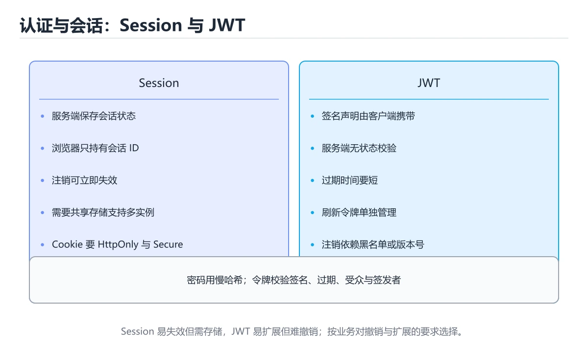

# 认证、会话与令牌安全

> 内容更新时间：2026-10-06 · 学习阶段：进阶 · 预计用时：40 分钟




## 本节知识框架

**课程定位**：所属分类 `security`（安全与合规），课程主题 `认证、会话与令牌安全`，学习阶段 进阶，建议用时 40 分钟。

本课主线：覆盖密码存储、会话固定、JWT 校验、刷新令牌和注销语义。

**学完本课应当能够**
- 说清 `认证` 与 `会话` 的含义与区别，并各举一个正例和一个反例。
- 用本课示例验证 `JWT` 的行为，记录输入、输出与失败条件。
- 遇到「会话令牌长期有效」这类问题时，能说出触发条件与修复顺序。

### 从概念到验证的学习链条

1. `认证`：先掌握 验证用户或服务的身份是否真实，再用它解释 `会话` 为什么会出现。
2. `会话`：先掌握 服务端或客户端为一段连续交互保存的状态与身份上下文，再用它解释 `JWT` 为什么会出现。
3. `JWT`：先掌握 JSON Web Token：把声明签名后交给客户端保存；服务端要校验签名、过期时间与算法，且无法直接撤销，再用它解释 `刷新令牌` 为什么会出现。
4. `刷新令牌`：先掌握 用于在访问令牌过期后获取新令牌的长期凭证，需要安全存储和轮换，再用它解释 本课示例的观察结果 为什么会出现。

**先修与衔接**：本课是「安全与合规」分类的第 6 课。先修内容：《安全编码与输入校验》。《安全编码与输入校验》里的 `输入校验`、`输出编码` 是本课的前提。相关或后续课程：《密钥与配置安全》、《认证与授权》。

### 完成判据

- **定义关**：不看正文也能说明 `认证` 是 验证用户或服务的身份是否真实，并指出一个反例。
- **机制关**：能按“输入 → 转换 → 输出 → 验证”复述 `认证、会话与令牌安全`，而不是只背结论。
- **示例关**：能运行或推演 `认证、会话与令牌安全` 的 `text` 示例，并说明一个真实出现的标识符或字面量。
- **证据关**：能指出 `认证、会话与令牌安全` 示例里的 调用了 `sha256()`，并说明它支持或反驳了本课的哪一条结论。
- **排错关**：能复现 会话令牌长期有效，记录现象并按 设置较短有效期并支持主动吊销 修复。
- **迁移关**：能把 `认证`、`会话`、`JWT`、`刷新令牌` 放进一个与 `认证、会话与令牌安全` 不同的项目场景，并保持输入与验证条件可追踪。
- **复盘关**：学完 `认证、会话与令牌安全` 后，用一句话写下仍然不确定的结论，并列出下一次验证需要的输入、环境和成功判据。

### 复习清单

- [ ] 能不看正文复述本课核心术语，并指出一个边界或反例。
- [ ] 能运行或推演本课示例，记录输入、输出与失败现象。
- [ ] 能完成一次自测，并把错题对照错误表定位原因。

## 核心概念定义

| 术语 | 操作性定义 | 常见边界与风险 |
| --- | --- | --- |
| 认证 | 验证用户或服务的身份是否真实。 | 只在「验证用户或服务的身份是否真实」这一前提下成立，换输入或换环境要重新验证。 |
| 会话 | 服务端或客户端为一段连续交互保存的状态与身份上下文。 | 易错：一旦泄露可长期使用；正确做法是设置较短有效期并支持主动吊销。 |
| JWT | JSON Web Token：把声明签名后交给客户端保存；服务端要校验签名、过期时间与算法，且无法直接撤销。 | 只在「JSON Web Token：把声明签名后交给客户端保存；服务端要校验签名、过期时间与算法，且无法直接撤销」这一前提下成立，换输入或换环境要重新验证。 |
| 刷新令牌 | 用于在访问令牌过期后获取新令牌的长期凭证，需要安全存储和轮换。 | 权限与密钥策略变化会让结论失效，按最小权限并用真实凭据流程复验。 |

## 原理与运行机制

### 机制总览

**教材衔接：核心知识**

### 1. 密码必须使用自适应哈希加盐存储，认证失败信息不能区分账号是否存在。

- 关键做法：先用 e884898da28 建立 认证 的基线，再逐步加入边界与失败条件。
- 验证标准：会话 的异常路径有明确错误信息与恢复动作。

### 2. JWT 必须校验签名算法、issuer、audience、过期时间和令牌用途。

把这条结论放回「认证、会话与令牌安全」的完整流程里展开：

- 正文依据：能用自己的话解释：密码必须使用自适应哈希加盐存储，认证失败信息不能区分账号是否存在。
- 落地检查：把「2. JWT 必须校验签名算法、issuer、audience、过期时间和令牌用途。」改写成一条可执行的核对项，逐条验证输入、超时与失败路径。

### 3. 注销与权限变更要能失效会话，短访问令牌配合可撤销刷新令牌更安全。

把这条结论放回「认证、会话与令牌安全」的完整流程里展开：

- 正文依据：能用自己的话解释：JWT 必须校验签名算法、issuer、audience、过期时间和令牌用途。
- 落地检查：把「3. 注销与权限变更要能失效会话，短访问令牌配合可撤销刷新令牌更安全。」改写成一条可执行的核对项，逐条验证输入、超时与失败路径。

**教材衔接：关键流程**

**教材衔接：实践路径**

**教材衔接：安全落地补充：认证、会话与令牌安全**

### 一、资产、边界与信任

先回答：保护哪些数据、谁可以访问、哪些组件是信任边界、攻击者能从哪些入口进入。围绕「认证、会话、JWT、刷新令牌」列出至少 3 个入口和对应的最小权限。


### 三、上线前安全清单

- [ ] 所有外部输入经过校验和输出编码。
- [ ] 认证、授权和会话失效逻辑有测试。
- [ ] 密钥不进入源码、镜像和日志。
- [ ] 依赖漏洞、许可证和来源已审查。
- [ ] 高风险操作有确认、审计和回滚。
- [ ] 安全事件有联系人和升级路径。

### 四、事件响应演练

围绕「认证、会话与令牌安全」构造一次 认证 相关的越权或泄露场景，按发现、隔离、轮换、取证、恢复、复盘六步执行，记录时间线与剩余风险。

**教材衔接：零基础精讲：把认证、会话与令牌安全真正讲透**

### 先建立一个直觉

把「认证、会话与令牌安全」看成一条防线：先识别资产与威胁，再围绕 认证 限制权限、验证输入、记录审计，并为失败准备隔离与恢复方案。

本课的摘要可以当作一张地图：覆盖密码存储、会话固定、JWT 校验、刷新令牌和注销语义。

### 逐步拆解

1. 澄清输入与目标。先写清「认证、会话与令牌安全」要解决的问题、合法输入范围和成功标准，再进入后续步骤。
2. 描述处理过程。把「认证、会话、JWT、刷新令牌」映射到具体步骤，每步都要求能单独验证。
3. 定义输出。认证 的输出不仅包括正常结果，还包括错误码、日志和资源释放状态。
4. 构造一次认证越界，记录系统是拒绝、降级还是静默出错；三者对应的修复策略完全不同。
5. 把「核心知识」里的最小示例抄成 e884898da28 一行的输入，先手算结果再执行，确认两者一致。

### 把正文串成一条执行链

- 三、上线前安全清单：- [ ] 认证 的所有外部输入经过校验和输出编码

### 从测验反推易错点

- 参考判断：密码必须使用自适应哈希加盐存储，认证失败信息不能区分账号是否存在。
- 自问：如果去掉题干里的一个限定词，结论还成立吗？

- 参考判断：JWT 必须校验签名算法、issuer、audience、过期时间和令牌用途。

- 参考判断：注销与权限变更要能失效会话，短访问令牌配合可撤销刷新令牌更安全。

**检查点 4：本课的核心学习目标是什么？**

- 参考判断：覆盖密码存储、会话固定、JWT 校验、刷新令牌和注销语义。

- 参考判断：password

### 工程排错顺序

| 先查什么 | 要得到的证据 | 判断标准 |
| --- | --- | --- |
| 资产、威胁和行为主体是否明确？ | 日志、输入样例、测试或指标 | 能复现并解释，才算定位 |
| 权限是否默认拒绝并最小化？ | 日志、输入样例、测试或指标 | 能复现并解释，才算定位 |
| 输入、输出与审计是否都有控制？ | 日志、输入样例、测试或指标 | 能复现并解释，才算定位 |
| 发现绕过时能否快速隔离和恢复？ | 日志、输入样例、测试或指标 | 能复现并解释，才算定位 |

### 变式训练

1. 把 认证 放进一个只有单机、没有额外依赖的小项目，先保证正确再扩展。
2. 扩大 会话 的规模，记录本课结论在哪一个量级开始不成立。
3. 让 e884898da28 的外部依赖超时，确认系统能回滚或补偿，而不是留下脏数据。
5. 在 核心知识 这一步去掉一个前提，观察 认证 的输出怎样变化，并写出「认证、会话与令牌安全」里哪条假设被破坏。
6. 限制 CPU 与内存上限后重跑 e884898da28，观察哪一项参数需要重新设定。


### 迁移案例库

围绕 e884898da28 重复同一套方法，每完成一轮就把差异写进笔记。

#### 迁移案例 1：围绕「认证」做一次小实验

**验收**：结论要能追溯到正文的具体小节与代码位置，并记录会话相关的指标变化。

#### 迁移案例 2：围绕「会话」做一次小实验

**步骤**：
1. 复述当前方案对「会话」的假设，写成一句可证伪的话。

#### 迁移案例 3：围绕「JWT」做一次小实验

**步骤**：
1. 复述当前方案对「JWT」的假设，写成一句可证伪的话。

#### 迁移案例 4：围绕「刷新令牌」做一次小实验

**步骤**：
1. 复述当前方案对「刷新令牌」的假设，写成一句可证伪的话。

#### 迁移案例 5：围绕「认证」做一次小实验

**步骤**：

#### 迁移案例 6：围绕「会话」做一次小实验

**步骤**：

#### 迁移案例 7：围绕「JWT」做一次小实验

**步骤**：

#### 迁移案例 8：围绕「刷新令牌」做一次小实验

**步骤**：

#### 迁移案例 9：围绕「认证」做一次小实验

**步骤**：

#### 迁移案例 10：围绕「会话」做一次小实验

**步骤**：

#### 迁移案例 11：围绕「JWT」做一次小实验

**步骤**：

#### 迁移案例 12：围绕「刷新令牌」做一次小实验

**步骤**：

#### 迁移案例 13：围绕「认证」做一次小实验

**步骤**：

#### 迁移案例 14：围绕「会话」做一次小实验

**步骤**：

#### 迁移案例 15：围绕「JWT」做一次小实验

**步骤**：

#### 迁移案例 16：围绕「刷新令牌」做一次小实验

**步骤**：

<!-- p0-depth-v2:end -->

**教材衔接：验证步骤**

### 机制拆解：每一步的输入、动作与输出

#### 1. `认证`
- 输入：`认证`；本步把 验证用户或服务的身份是否真实 当作判断规则。
- 动作：围绕 `认证` 保留中间状态，并记录它与 `会话` 的对应关系。
- 输出：`会话`，它可以被下一段代码、测试或记录继续使用。
- `认证` 的失败条件：只在「验证用户或服务的身份是否真实」这一前提下成立，换输入或换环境要重新验证。

#### 2. `会话`
- 输入：`认证`；本步把 服务端或客户端为一段连续交互保存的状态与身份上下文 当作判断规则。
- 动作：围绕 `会话` 保留中间状态，并记录它与 `JWT` 的对应关系。
- 输出：`JWT`，它可以被下一段代码、测试或记录继续使用。
- `会话` 的失败条件：当会话令牌长期有效时，会出现一旦泄露可长期使用。

#### 3. `JWT`
- 输入：`会话`；本步把 JSON Web Token：把声明签名后交给客户端保存；服务端要校验签名、过期时间与算法，且无法直接撤销 当作判断规则。
- 动作：围绕 `JWT` 保留中间状态，并记录它与 `刷新令牌` 的对应关系。
- 输出：`刷新令牌`，它可以被下一段代码、测试或记录继续使用。
- `JWT` 的失败条件：只在「JSON Web Token：把声明签名后交给客户端保存；服务端要校验签名、过期时间与算法，且无法直接撤销」这一前提下成立，换输入或换环境要重新验证。

#### 4. `刷新令牌`
- 输入：`JWT`；本步把 用于在访问令牌过期后获取新令牌的长期凭证，需要安全存储和轮换 当作判断规则。
- 动作：围绕 `刷新令牌` 保留中间状态，并记录它与 `sha256` 的对应关系。
- 输出：`sha256`，它可以被下一段代码、测试或记录继续使用。
- `刷新令牌` 的失败条件：权限与密钥策略变化会让结论失效，按最小权限并用真实凭据流程复验。

### 示例中的可观察事实

1. 调用了 `sha256()`；它对应的课程主题是 `认证、会话与令牌安全`。
2. 调用了 `hexdigest()`；它对应的课程主题是 `认证、会话与令牌安全`。
3. 调用了 `print()`；它对应的课程主题是 `认证、会话与令牌安全`。
4. 出现字面量 `password`；它对应的课程主题是 `认证、会话与令牌安全`。

### 复现实验记录

- 环境：`认证、会话与令牌安全` 使用 `text` 示例，固定 `认证`、`会话`、`JWT`、`刷新令牌` 作为第一组条件。
- 首轮输入：先确认 调用了 `sha256()`，预测 `认证` 会怎样变化。
- 基线观察：记录命令、输入、输出和错误原文，不用截图代替可复制的文本。
- 单变量修改：只改变 `认证`，观察 `刷新令牌` 是否仍满足定义。
- 失败注入：复现 会话令牌长期有效，确认现象是 一旦泄露可长期使用。
- 记录结论：把“修改前、修改后、预期变化、实际变化”写成四列表，这样复盘 `认证、会话与令牌安全` 时才能区分概念错误与实现错误。

## 典型应用场景

**教材衔接：深度拓展与实战**

这一节把 认证 的定义、e884898da28 的代码与常见失败串成一条复习路线。

### 机制拆解

- **1. 密码必须使用自适应哈希加盐存储，认证失败信息不能区分账号是否存在。**：在「认证、会话与令牌安全」里，「1. 密码必须使用自适应哈希加盐存储，认证失败信息不能区分账号是否存在。」这一步要先写清输入与预期，再记录实际结果和差异；结果不符时回到对应小节核对前提。
- **2. JWT 必须校验签名算法、issuer、audience、过期时间和令牌用途。**：在「认证、会话与令牌安全」里，「2. JWT 必须校验签名算法、issuer、audience、过期时间和令牌用途。」这一步要先写清输入与预期，再记录实际结果和差异；结果不符时回到对应小节核对前提。
- **3. 注销与权限变更要能失效会话，短访问令牌配合可撤销刷新令牌更安全。**：在「认证、会话与令牌安全」里，「3. 注销与权限变更要能失效会话，短访问令牌配合可撤销刷新令牌更安全。」这一步要先写清输入与预期，再记录实际结果和差异；结果不符时回到对应小节核对前提。
- 一、资产、边界与信任：先回答 认证 保护哪些数据、谁能访问、攻击者从哪里进入。
- **二、威胁 → 控制 → 验证**：在「认证、会话与令牌安全」里，「二、威胁 → 控制 → 验证」这一步要先写清输入与预期，再记录实际结果和差异；结果不符时回到对应小节核对前提。

### 边界条件与常见反例

「认证、会话与令牌安全」的边界不只包括最大最小值，还要覆盖空、重复和失败：

### 工程检查表

- [ ] 能否用自己的话说明认证、会话与令牌安全解决什么问题，以及它不负责什么？
- [ ] 能否用「认证、会话与令牌安全」的最小示例复现一次失败并解释原因？
- [ ] 能否解释本课关键词在真实项目中的边界与取舍？
- [ ] 能否说明 会话 在新场景下需要补充什么前提？

### 迁移练习

1. 保持正文示例不变，写出它的输入、处理步骤和预期输出。
2. 固定其他输入，只调整 e884898da28 的一个参数，先写预测再验证。
3. 结合认证、会话、JWT、刷新令牌，写出一个真实项目中的使用场景。
4. 写下一个反例，说明它在什么条件下会使朴素做法失效。

<!-- p0-depth-v2:start -->

- **会话令牌长期有效**：典型现象是一旦泄露可长期使用；正确做法是设置较短有效期并支持主动吊销。
- **令牌存在脚本可读位置**：典型现象是跨站脚本可直接窃取；正确做法是存放在脚本不可读的存储中并配合安全属性。
- **登录后不更换会话标识**：典型现象是会话固定攻击可以复用旧标识；正确做法是登录成功后重新生成会话标识。

### 最小验证场景

- 准备：保留 `text` 示例的原始输入，先记录 `认证、会话与令牌安全` 的基线输出和完整运行命令。
- 观察：先核对 调用了 `sha256()`，再改变一个与 `认证` 相关的条件。
- 判定：新结果与 `认证、会话与令牌安全` 的基线不同不等于错误；只有当差异破坏了 `认证` 的定义或错误表中的约束，才判定为失败。

### 选择与边界

- 使用 `认证` 时，先满足它的定义：验证用户或服务的身份是否真实；只在「验证用户或服务的身份是否真实」这一前提下成立，换输入或换环境要重新验证。
- 使用 `会话` 时，先满足它的定义：服务端或客户端为一段连续交互保存的状态与身份上下文；易错：一旦泄露可长期使用；正确做法是设置较短有效期并支持主动吊销。
- 使用 `JWT` 时，先满足它的定义：JSON Web Token：把声明签名后交给客户端保存；服务端要校验签名、过期时间与算法，且无法直接撤销；只在「JSON Web Token：把声明签名后交给客户端保存；服务端要校验签名、过期时间与算法，且无法直接撤销」这一前提下成立，换输入或换环境要重新验证。
- 使用 `刷新令牌` 时，先满足它的定义：用于在访问令牌过期后获取新令牌的长期凭证，需要安全存储和轮换；权限与密钥策略变化会让结论失效，按最小权限并用真实凭据流程复验。

## 代码/协议/SQL 示例

### 最小可验证示例

**教材衔接：最小可运行示例**

下面示例用于验证 认证 的最小输入、处理和输出。先原样运行，再只修改一个值：

```python
import hashlib

digest = hashlib.sha256(b"password").hexdigest()
print(digest[:12])
```

**教材衔接：预期输出**

```text
5e884898da28
```

### 示例精读：先找证据，再改一个条件

1. 调用了 `sha256()`；它出现在 `认证、会话与令牌安全` 的示例中，阅读时先确认它前后各发生了什么。
2. 调用了 `hexdigest()`；它出现在 `认证、会话与令牌安全` 的示例中，阅读时先确认它前后各发生了什么。
3. 调用了 `print()`；它出现在 `认证、会话与令牌安全` 的示例中，阅读时先确认它前后各发生了什么。
4. 出现字面量 `password`；它出现在 `认证、会话与令牌安全` 的示例中，阅读时先确认它前后各发生了什么。
- 在 `认证、会话与令牌安全` 中与 `认证` 对照：示例必须能支持 验证用户或服务的身份是否真实，否则说明这一段还缺少实现或验证步骤。
- 在 `认证、会话与令牌安全` 中与 `会话` 对照：示例必须能支持 服务端或客户端为一段连续交互保存的状态与身份上下文，否则说明这一段还缺少实现或验证步骤。
- 在 `认证、会话与令牌安全` 中与 `JWT` 对照：示例必须能支持 JSON Web Token：把声明签名后交给客户端保存；服务端要校验签名、过期时间与算法，且无法直接撤销，否则说明这一段还缺少实现或验证步骤。
- 在 `认证、会话与令牌安全` 中与 `刷新令牌` 对照：示例必须能支持 用于在访问令牌过期后获取新令牌的长期凭证，需要安全存储和轮换，否则说明这一段还缺少实现或验证步骤。

## 时间/空间复杂度或性能分析

**性能关注点（认证、会话与令牌安全）**：加解密与校验开销随数据量增长：记录处理耗时、密钥长度与内存占用。

**测量方法**：以 `认证、会话与令牌安全` 的 `认证` 场景为对象，固定输入跑一遍记录基线，再把规模或并发度提高一个数量级复测；两次结果的差值与波动范围才是结论依据。

### 需要控制的变量与记录项

- `认证、会话与令牌安全` 的 `认证`：固定它的版本、输入范围和资源上限，分别记录速度、内存与失败率的变化。
- `认证、会话与令牌安全` 的 `会话`：固定它的版本、输入范围和资源上限，分别记录速度、内存与失败率的变化。
- `认证、会话与令牌安全` 的 `JWT`：固定它的版本、输入范围和资源上限，分别记录速度、内存与失败率的变化。
- `认证、会话与令牌安全` 的 `刷新令牌`：固定它的版本、输入范围和资源上限，分别记录速度、内存与失败率的变化。
- `认证、会话与令牌安全` 中 `认证` 的边界：只在「验证用户或服务的身份是否真实」这一前提下成立，换输入或换环境要重新验证。达到边界时不要外推，必须重新测量。
- `认证、会话与令牌安全` 中 `会话` 的边界：易错：一旦泄露可长期使用；正确做法是设置较短有效期并支持主动吊销。达到边界时不要外推，必须重新测量。
- `认证、会话与令牌安全` 中 `JWT` 的边界：只在「JSON Web Token：把声明签名后交给客户端保存；服务端要校验签名、过期时间与算法，且无法直接撤销」这一前提下成立，换输入或换环境要重新验证。达到边界时不要外推，必须重新测量。
- `认证、会话与令牌安全` 中 `刷新令牌` 的边界：权限与密钥策略变化会让结论失效，按最小权限并用真实凭据流程复验。达到边界时不要外推，必须重新测量。
- `认证、会话与令牌安全` 的代码证据：先验证 调用了 `sha256()`，再记录该路径的输入规模与耗时；只看代码行数不能推出复杂度。

## 常见误区与易错点

| 容易写错的做法 | 实际现象 | 原因与正确做法 |
| --- | --- | --- |
| 会话令牌长期有效 | 一旦泄露可长期使用。 | 设置较短有效期并支持主动吊销。 |
| 令牌存在脚本可读位置 | 跨站脚本可直接窃取。 | 存放在脚本不可读的存储中并配合安全属性。 |
| 登录后不更换会话标识 | 会话固定攻击可以复用旧标识。 | 登录成功后重新生成会话标识。 |

### 现场 1：会话令牌长期有效

**症状**：一旦泄露可长期使用。

**根因与修复**：设置较短有效期并支持主动吊销。

**自检**：在本课示例里复现「会话令牌长期有效」，改成设置较短有效期并支持主动吊销后重跑；如果症状消失且失败路径按预期变化，说明定位正确。

### 现场 2：令牌存在脚本可读位置

**症状**：跨站脚本可直接窃取。

**根因与修复**：存放在脚本不可读的存储中并配合安全属性。

**自检**：在本课示例里复现「令牌存在脚本可读位置」，改成存放在脚本不可读的存储中并配合安全属性后重跑；如果症状消失且失败路径按预期变化，说明定位正确。

### 现场 3：登录后不更换会话标识

**症状**：会话固定攻击可以复用旧标识。

**根因与修复**：登录成功后重新生成会话标识。

**自检**：在本课示例里复现「登录后不更换会话标识」，改成登录成功后重新生成会话标识后重跑；如果症状消失且失败路径按预期变化，说明定位正确。

## 与其他知识点的关系

**教材衔接：复习与迁移**

### 概念复述

- 用一句话说明「认证、会话与令牌安全」解决什么问题：覆盖密码存储、会话固定、JWT 校验、刷新令牌和注销语义。
- 写出认证、会话、JWT之间的关系，并各举一个例子。
- 说出本课最容易混淆的两个概念，以及区分它们的判据。

### 正文逐节复核

- **零基础精讲：把认证、会话与令牌安全真正讲透**：本课的摘要可以当作一张地图：覆盖密码存储、会话固定、JWT 校验、刷新令牌和注销语义。

### 测验回顾

1. 关于「密码必须使用自适应哈希加盐存储，认证失败信息不能区分账号是否存在。」，下列说法正确的是？
   - 依据：在「认证、会话与令牌安全」里，密码必须使用自适应哈希加盐存储，认证失败信息不能区分账号是否存在。「认证、会话与令牌安全」要求先交代认证、会话、JWT的前提再下结论，所以“密码必须使用自适应哈希加盐存储”只在题干“密码必须使用自适应哈希加盐存储”给定的条件下成立。把“密码必须使用自适应哈希加盐存储”代回「认证、会话与令牌安全」里“密码必须使用自适应哈希加盐存储”的例子核对，条件一旦改变，结论就要用认证、会话、JWT重新推导。
2. 关于「JWT 必须校验签名算法、issuer、audience、过期时间和令牌用途。」，下列说法正确的是？
   - 依据：在「认证、会话与令牌安全」里，JWT 必须校验签名算法、issuer、audience、过期时间和令牌用途。「认证、会话与令牌安全」要求先交代认证、会话、JWT的前提再下结论，所以“JWT 必须校验签名算法、issuer”只在题干“JWT 必须校验签名算法、issuer、audience、过”给定的条件下成立。
3. 围绕“认证、会话与令牌安全”中的 认证、会话、JWT，下列哪两项是本课强调的实践判断？
   - 依据：本课把认证、会话与令牌安全拆成概念、示例与故障现场三部分，因此判断 认证 时必须同时交代输入、输出和失败路径，这使“学习 认证 时要同时说明输入、输出和失败路径，不能只看正常流程”成立。在认证、会话与令牌安全里，判断 会话 时要固定版本与边界输入，所以“验证 会话 时要固定版本并覆盖边界输入，结论才可复现”才可复现。
4. 「认证、会话与令牌安全」的核心学习目标是什么？
   - 依据：在「认证、会话与令牌安全」里，结论应落在「覆盖密码存储、会话固定、JWT 校验、刷新令牌和注销语义」。在「认证、会话与令牌安全」里，结论应落在覆盖密码存储、会话固定、JWT 校验、刷新令牌和注销语义。在「认证、会话与令牌安全」里，这道题要求区分概念与边界，覆盖密码存储、会话固定、JWT 校验、刷新令牌和注销语义。
5. 补全代码：「认证、会话与令牌安全」示例中，下面这行代码缺少哪个关键字或函数名？请填入 ____。

### 迁移练习

把「认证、会话与令牌安全」的结论迁移到相邻主题，每次迁移都写清预测与证据：

- **先修**：`安全编码与输入校验`。本课默认这些内容已经掌握。
- **相关或后续**：`密钥与配置安全`、`认证与授权`。本课术语会在这些课程里继续使用。
- **术语归属**：`认证`、`会话`、`JWT` 的定义以本课「核心概念定义」为准，换到其他课程时先确认定义是否被改写。

### 先修与后续术语接口

- `认证与授权`：共享术语 `认证`、`JWT`，共同关键词 `认证`、`JWT`。
- `安全编码与输入校验`：两者通过本分类的学习顺序衔接，阅读时重点比较各自的输入与失败条件。
- `密钥与配置安全`：两者通过本分类的学习顺序衔接，阅读时重点比较各自的输入与失败条件。

### 容易混淆的相邻概念

- `认证` 与 `会话`：前者强调 验证用户或服务的身份是否真实；后者强调 服务端或客户端为一段连续交互保存的状态与身份上下文。判断时分别检查两条定义的适用范围，不要只看名称相似就互换。
- `会话` 与 `JWT`：前者强调 服务端或客户端为一段连续交互保存的状态与身份上下文；后者强调 JSON Web Token：把声明签名后交给客户端保存；服务端要校验签名、过期时间与算法，且无法直接撤销。判断时分别检查两条定义的适用范围，不要只看名称相似就互换。
- `JWT` 与 `刷新令牌`：前者强调 JSON Web Token：把声明签名后交给客户端保存；服务端要校验签名、过期时间与算法，且无法直接撤销；后者强调 用于在访问令牌过期后获取新令牌的长期凭证，需要安全存储和轮换。判断时分别检查两条定义的适用范围，不要只看名称相似就互换。

## 自测题与参考答案

> 先独立作答，再对照参考答案；答案都能在本课正文、术语表或错误表里找到依据。

### 自测 1（概念复述）

不看正文，写出 `认证` 的操作性定义，并说明它与 `会话` 的区别。

**参考答案**：验证用户或服务的身份是否真实。

`会话` 的定位是：服务端或客户端为一段连续交互保存的状态与身份上下文；两者的差别要从适用对象与失败模式上说明。

### 自测 2（排错）

本课错误表记录了「会话令牌长期有效」这类做法。请写出它会出现的现象、根因，以及修复顺序。

**参考答案**：现象是一旦泄露可长期使用；正确做法是设置较短有效期并支持主动吊销。修复时先复现现象并保留证据，再改动一处假设重跑，确认现象消失。

### 自测 3（动手验证）

运行本课的 `text` 示例，改动其中一个输入后重新运行，记录输出与错误信息。

**参考答案**：正常输入下 `text` 示例应当复现正文给出的结果；改动输入后，如果结果改变或报错，先核对它是否满足 `认证、会话与令牌安全` 中`认证` 的适用范围，再检查错误表里是否有同类现象。

### 自测 4（代码阅读）

阅读本课开头的 `text` 示例，说明它体现了`认证` 的哪一条性质，并指出改动哪个输入会让这条性质不再成立。

**参考答案**：`认证` 的定义是 验证用户或服务的身份是否真实，示例正是在实现这条定义。改动与 `认证` 有关的一个输入后，如果结果不再符合 `认证、会话与令牌安全` 的正文描述，就说明该性质只在当前前提成立。

### 自测 5（迁移）

把 `认证、会话与令牌安全` 的方法迁移到自己的项目：围绕 `认证` 写出一个与错误表同类的风险点，并说明触发条件和检验方式。

**参考答案**：例如「登录后不更换会话标识」，它会导致会话固定攻击可以复用旧标识；检验方式是按登录成功后重新生成会话标识改一处再复现，确认现象消失且没有引入新的失败分支。

### 自测 6（对比）

用一个表格对比 `认证` 与 `会话`：各写一行适用场景、一行失败表现。

**参考答案**：`认证` 的定义是验证用户或服务的身份是否真实；`会话` 的定义是服务端或客户端为一段连续交互保存的状态与身份上下文。两者的失败表现分别对应本课错误表里与本术语相关的行。

### 自测 7（排错顺序）

面对「会话令牌长期有效」引发的问题，请把“复现 一旦泄露可长期使用 → 保留证据 → 设置较短有效期并支持主动吊销 → 回归验证”四步写成可执行的检查清单。

**参考答案**：第一步按一旦泄露可长期使用复现；第二步记录输入、版本与完整报错；第三步按设置较短有效期并支持主动吊销只改一处；第四步重跑并确认失败路径也按预期变化。

### 自测 8（边界判断）

针对 `刷新令牌`，分别写出“可以使用”的条件和“结论不再成立”的条件。

**参考答案**：权限与密钥策略变化会让结论失效，按最小权限并用真实凭据流程复验。 同时要把 `刷新令牌` 的定义 用于在访问令牌过期后获取新令牌的长期凭证，需要安全存储和轮换 与实际输入逐项对照。

### 自测 9（机制重建）

不看正文，按输入、转换、输出、验证四段重建 `认证` → `会话` → `JWT` → `刷新令牌` 的作用链。

**参考答案**：起点是 `认证` 的定义 验证用户或服务的身份是否真实；中间每一步都保留可观察状态；终点由 `刷新令牌` 检查，失败时回到错误表定位第一个偏离定义的步骤。

### 自测 10（综合排错）

在 `认证、会话与令牌安全` 中，现象是 会话固定攻击可以复用旧标识。请围绕 登录后不更换会话标识 写出最小复现、关键证据、修复动作和回归验证，并说明为什么不能只凭一次运行下结论。

**参考答案**：先复现 登录后不更换会话标识，记录输入与完整错误；再按 登录成功后重新生成会话标识 只改一处。回归时同时跑正常路径和边界路径，只有两次结果都可解释，才把修复视为完成。

### 自测 11（一分钟复述）

用每分钟约 200 字的速度复述 `认证、会话与令牌安全`：先给主问题，再按顺序说出 `认证`、`会话`、`JWT`、`刷新令牌`，最后给一个失败案例。

**自评标准**：主问题必须对应 覆盖密码存储、会话固定、JWT 校验、刷新令牌和注销语义；每个术语都要能接上一句定义或边界；失败案例必须写成可观察现象，不能用“可能有风险”代替证据。

## 术语速查

| 术语 | 一句话说明 |
| --- | --- |
| `认证` | 验证用户或服务的身份是否真实。 |
| `会话` | 服务端或客户端为一段连续交互保存的状态与身份上下文。 |
| `JWT` | JSON Web Token：把声明签名后交给客户端保存；服务端要校验签名、过期时间与算法，且无法直接撤销。 |
| `刷新令牌` | 用于在访问令牌过期后获取新令牌的长期凭证，需要安全存储和轮换。 |

**术语关系**：`认证`（验证用户或服务的身份是否真实） → `会话`（服务端或客户端为一段连续交互保存的状态与身份上下文） → `JWT`（JSON Web Token：把声明签名后交给客户端保存） → `刷新令牌`（用于在访问令牌过期后获取新令牌的长期凭证）。

## 考点精讲

`认证、会话与令牌安全` 的题库有 6 道题，下面逐题给出题干、正确项与判断依据：先自己作答，再核对正确项，最后回到正文对应小节复核。

### 考点 1：第 1 题

- **题目**：在 `认证、会话与令牌安全` 里，与 `认证` 有关的说法中，哪一项最符合覆盖密码存储、会话固定、JWT 校验、刷新令牌和注销语义。？
- **正确项**：密码必须使用自适应哈希加盐存储，认证失败信息不能区分账号是否存在。
- **判断依据**：这道题落在术语 `认证` 上：验证用户或服务的身份是否真实。复习时把 `认证` 的定义、适用边界和一个反例一起说清楚，再回到「核心概念定义」核对原文。

### 考点 2：第 2 题

- **题目**：在 `认证、会话与令牌安全` 里，与 `认证` 有关的说法中，哪一项最符合覆盖密码存储、会话固定、JWT 校验、刷新令牌和注销语义。？（认证、会话与令牌安全·安全与合规 第 2 题）
- **正确项**：JWT 必须校验签名算法、issuer、audience、过期时间和令牌用途。
- **判断依据**：这道题落在术语 `认证` 上：验证用户或服务的身份是否真实。复习时把 `认证` 的定义、适用边界和一个反例一起说清楚，再回到「核心概念定义」核对原文。

### 考点 3：第 3 题

- **题目**：围绕“认证、会话与令牌安全”中的 认证、会话、JWT，下列哪两项是本课强调的实践判断？
- **正确项**：学习 认证 时要同时说明输入、输出和失败路径，不能只看正常流程；验证 会话 时要固定版本并覆盖边界输入，结论才可复现
- **判断依据**：这道题落在术语 `认证` 上：验证用户或服务的身份是否真实。复习时把 `认证` 的定义、适用边界和一个反例一起说清楚，再回到「核心概念定义」核对原文。

### 考点 4：第 4 题

- **题目**：`认证、会话与令牌安全` 的主线是：覆盖密码存储、会话固定、JWT 校验、刷新令牌和注销语义。下面哪一项与这条主线一致？
- **正确项**：覆盖密码存储、会话固定、JWT 校验、刷新令牌和注销语义。
- **判断依据**：这道题落在术语 `认证` 上：验证用户或服务的身份是否真实。复习时把 `认证` 的定义、适用边界和一个反例一起说清楚，再回到「核心概念定义」核对原文。

### 考点 5：第 5 题

- **题目**：填空：补齐下面这段术语说明中的空缺。课程 `覆盖密码存储、会话固定、JWT 校验、刷新令牌和注销语义。`，这段说明是：`____`：JSON Web Token：把声明签名后交给客户端保存；服务端要校验签名、过期时间与算法，且无法直接撤销。空缺处应填哪个术语？
- **正确项**：JWT
- **判断依据**：这道题落在术语 `会话` 上：服务端或客户端为一段连续交互保存的状态与身份上下文。复习时把 `会话` 的定义、适用边界和一个反例一起说清楚，再回到「核心概念定义」核对原文。

### 考点 6：第 6 题

- **题目**：阅读 JWT 校验伪代码，下面哪项判断是正确的？
- **正确项**：必须固定允许的签名算法，并校验 issuer、audience、过期时间和令牌用途
- **判断依据**：这道题落在术语 `JWT` 上：JSON Web Token：把声明签名后交给客户端保存，服务端要校验签名、过期时间与算法，且无法直接撤销。复习时把 `JWT` 的定义、适用边界和一个反例一起说清楚，再回到「核心概念定义」核对原文。

### 考点 7：`认证`

- **要点**：验证用户或服务的身份是否真实。
- **认证 的边界**：只在「验证用户或服务的身份是否真实」这一前提下成立，换输入或换环境要重新验证。

### 考点 8：`会话`

- **要点**：服务端或客户端为一段连续交互保存的状态与身份上下文。
- **会话 的边界**：易错：一旦泄露可长期使用；正确做法是设置较短有效期并支持主动吊销。

### 考点 9：`JWT`

- **要点**：JSON Web Token：把声明签名后交给客户端保存；服务端要校验签名、过期时间与算法，且无法直接撤销。
- **JWT 的边界**：只在「JSON Web Token：把声明签名后交给客户端保存；服务端要校验签名、过期时间与算法，且无法直接撤销」这一前提下成立，换输入或换环境要重新验证。

### 考点 10：`刷新令牌`

- **要点**：用于在访问令牌过期后获取新令牌的长期凭证，需要安全存储和轮换。
- **刷新令牌 的边界**：权限与密钥策略变化会让结论失效，按最小权限并用真实凭据流程复验。

### 考点 11：排错——会话令牌长期有效

- **现象**：一旦泄露可长期使用。
- **处理**：设置较短有效期并支持主动吊销。

### 考点 12：排错——令牌存在脚本可读位置

- **现象**：跨站脚本可直接窃取。
- **处理**：存放在脚本不可读的存储中并配合安全属性。

### 考点 13：综合辨析——`认证` 与 `刷新令牌`

- **辨析点**：`认证` 的定义是 验证用户或服务的身份是否真实；`刷新令牌` 的定义是 用于在访问令牌过期后获取新令牌的长期凭证，需要安全存储和轮换。
- **答题要求**：面对 `认证、会话与令牌安全` 的题目，先判断描述的是 `认证` 还是 `刷新令牌`，再归到对应定义，最后写出一个会让该定义失效的边界输入。

### 考点 14：排错评分点

- **现象分**：能写出 一旦泄露可长期使用，而不是只写“程序有错”。
- **证据分**：保留触发 会话令牌长期有效 的输入、版本和错误原文。
- **修复分**：按 设置较短有效期并支持主动吊销 只改一处，并同时回归正常路径与边界路径。

## 内容元数据

- 内容版本：v2.0
- 最后更新：2026-10-06
- 学习阶段：进阶
- 适用环境：OWASP、云原生与合规安全实践；本课聚焦 认证。
- 内容来源：内置结构化课程与工程实践整理
- 相关主题：认证、会话、JWT、刷新令牌
- 质量版本：P0 测验标准 + P1 覆盖扩展 + P2 体验补全

## 参考资料与复核

- 最后复核：2026-10-04
- 下次复核：2026-11-24
- 复核范围：版本兼容、API 行为、安全建议与工程实践
- 来源性质：官方文档、标准或权威教材；本课核对关键词：认证、会话、JWT、刷新令牌。

| 参考资料 | 本课用途 |
| --- | --- |
| [OWASP Cheat Sheets](https://cheatsheetseries.owasp.org/) | 认证、授权与安全编码 |
| [NIST 密码标准](https://csrc.nist.gov/projects/cryptographic-standards-and-guidelines) | 密码算法与协议 |
| [OWASP Top 10](https://owasp.org/www-project-top-ten/) | 常见 Web 安全风险 |

| [本课术语索引：认证、会话与令牌安全](#核心概念定义) | 按本课输入、术语边界和错误表现逐项核对 |
> 「认证、会话与令牌安全」的链接用于离线阅读后的延伸核对；App 不会自动联网。