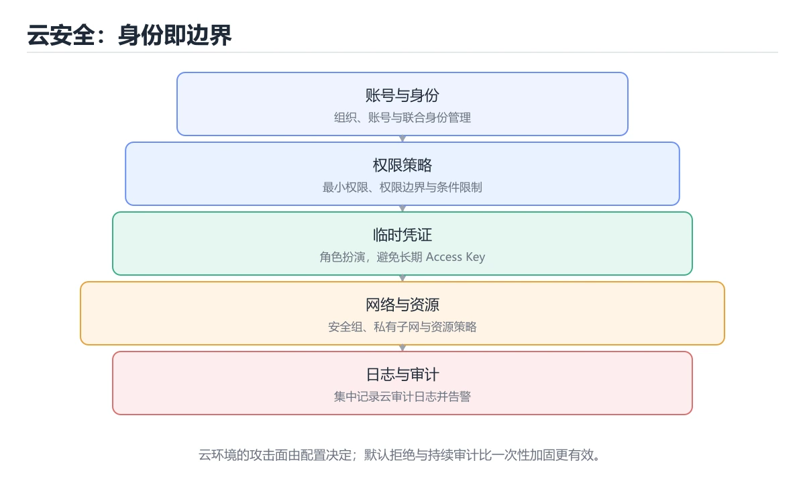
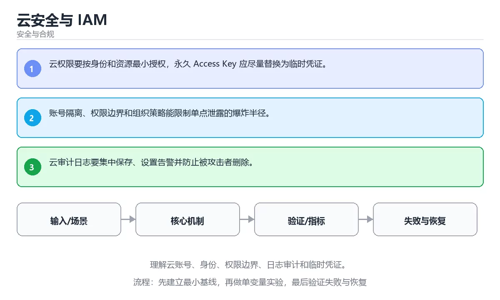

# 云安全与 IAM

> 内容更新时间：2026-10-06 · 学习阶段：高级 · 预计用时：30 分钟





## 学习目标

- 能用自己的话解释：云权限要按身份和资源最小授权，永久 Access Key 应尽量替换为临时凭证。
- 能用自己的话解释：账号隔离、权限边界和组织策略能限制单点泄露的爆炸半径。
- 能用自己的话解释：云审计日志要集中保存、设置告警并防止被攻击者删除。
- 能把本课知识放回「安全与合规」，并完成练习与测验。

## 前置知识

- 能运行 e884898da28 所在的示例环境，并读懂报错信息。
- 本课关键词：云安全、IAM、临时凭证、审计。
- 遇到不熟悉的术语先记录问题，完成练习后再回读。

## 核心知识

### 1. 云权限要按身份和资源最小授权，永久 Access Key 应尽量替换为临时凭证。

- 关键做法：先用 e884898da28 建立 云安全 的基线，再逐步加入边界与失败条件。
- 验证标准：云安全 的结果可复现、错误可解释、失败能恢复。

### 2. 账号隔离、权限边界和组织策略能限制单点泄露的爆炸半径。

把这条结论放回「云安全与 IAM」的完整流程里展开：

- 正文依据：能用自己的话解释：云权限要按身份和资源最小授权，永久 Access Key 应尽量替换为临时凭证。
- 落地检查：把「2. 账号隔离、权限边界和组织策略能限制单点泄露的爆炸半径。」改写成一条可执行的核对项，逐条验证输入、超时与失败路径。

### 3. 云审计日志要集中保存、设置告警并防止被攻击者删除。

把这条结论放回「云安全与 IAM」的完整流程里展开：

- 正文依据：能用自己的话解释：云审计日志要集中保存、设置告警并防止被攻击者删除。
- 落地检查：把「3. 云审计日志要集中保存、设置告警并防止被攻击者删除。」改写成一条可执行的核对项，逐条验证输入、超时与失败路径。

## 关键流程

```text
输入 → 校验 → 核心处理 → 验证 → 记录指标 → 失败恢复
```

## 实践路径

1. 用一句话复述本课要解决的问题。
2. 跑通正文中的最小示例并记录基线。
3. 只改变一个输入或参数，预测并验证结果。
4. 补一个失败路径，记录错误、恢复和指标。
5. 把结论写成可复现的笔记或测试。

## 常见错误与排查

> 说明：本表由《云安全与 IAM》的核心知识整理（2026-10-07），人工复核进度见 docs/content_review_batches.md。

| 易错点 | 容易踩的做法 | 正确结论 |
| --- | --- | --- |
| 使用长期访问密钥 | 泄露后长期有效 | 改用临时凭据与角色扮演 |
| 权限授予过宽 | 一处泄露波及全部资源 | 按最小权限与资源范围授权 |
| 云审计日志没打开 | 事件无法追溯 | 打开审计并把日志集中保存 |

## 动手练习

1. 合上教程，用 3～5 句话解释云安全与 IAM。
2. 从正文选一个例子，改变一个条件并预测结果。
3. 设计一个失败场景，写出止损与恢复步骤。

**验收标准**：留下输入、命令、输出、差异和下一步问题。

## 本课小结

- 本课围绕 云安全、IAM、临时凭证、审计 展开，复习时重点核对它们的输入、输出和失败路径。
- 完成练习和测验后，把 云安全 上仍然不确定的问题写成下一轮验证清单。


## 安全落地补充：云安全与 IAM

### 一、资产、边界与信任

先回答：保护哪些数据、谁可以访问、哪些组件是信任边界、攻击者能从哪些入口进入。围绕「云安全、IAM、临时凭证、审计」列出至少 3 个入口和对应的最小权限。

### 二、威胁 → 控制 → 验证

| 威胁 | 预防控制 | 检测方式 | 验证证据 |
| --- | --- | --- | --- |
| 输入被污染 | schema、白名单、编码 | 异常输入日志和告警 | 越权与注入测试 |
| 权限过大 | 最小权限、临时凭证 | 权限审计和异常调用 | 权限边界测试 |
| 密钥泄露 | 密钥管理、轮换 | 仓库和日志扫描 | 轮换与影响范围记录 |
| 操作不可追溯 | 结构化审计日志 | 关键动作告警 | 审计查询和复盘 |
| 恢复失败 | 备份、回滚、演练 | 恢复指标监控 | 演练时间与数据校验 |

### 三、上线前安全清单

- [ ] 所有外部输入经过校验和输出编码。
- [ ] 认证、授权和会话失效逻辑有测试。
- [ ] 密钥不进入源码、镜像和日志。
- [ ] 依赖漏洞、许可证和来源已审查。
- [ ] 高风险操作有确认、审计和回滚。
- [ ] 安全事件有联系人和升级路径。

### 四、事件响应演练

围绕「云安全与 IAM」构造一次 云安全 相关的越权或泄露场景，按发现、隔离、轮换、取证、恢复、复盘六步执行，记录时间线与剩余风险。

## 可运行练习

### 任务 1：先跑通，再解释

```python
import hashlib

digest = hashlib.sha256(b"password").hexdigest()
print(digest[:12])
```

### 任务 2：只改一个条件

把「云安全与 IAM」的最小示例复制一份，只改一个条件再跑一次：

- 改动点：把 IAM 换成边界值，其他输入保持原样。
- 预测：先写下「云安全与 IAM」在改动后的输出或错误信息，再运行。
- 记录：对照改动前后的结果，指出差异出在哪一步。
- 验收：换回原条件能复现原结果，改动只影响云安全。

### 任务 3：迁移到自己的数据

把 e884898da28 换成你自己的输入，先保持步骤不变，再比较输出差异。

## 故障现场

### 现场 1：使用长期访问密钥

**症状**：在《云安全与 IAM》的复现场景中，泄露后长期有效。

**根因**：当出现“使用长期访问密钥”时，执行路径已经绕过了《云安全与 IAM》的关键约束，最终以“泄露后长期有效”暴露出来；修复前必须先确认约束在哪里失效。

**修复**：针对《云安全与 IAM》的问题，改用临时凭据与角色扮演。

**验证**：先在《云安全与 IAM》中记录“使用长期访问密钥”留下的失败证据，再执行“改用临时凭据与角色扮演”并重放；确认错误路径变为明确结果，且修复没有掩盖同类故障。

### 现场 2：权限授予过宽

**症状**：在《云安全与 IAM》的复现场景中，一处泄露波及全部资源。

**根因**：当出现“权限授予过宽”时，执行路径已经绕过了《云安全与 IAM》的关键约束，最终以“一处泄露波及全部资源”暴露出来；修复前必须先确认约束在哪里失效。

**修复**：针对《云安全与 IAM》的问题，按最小权限与资源范围授权。

**验证**：先在《云安全与 IAM》中记录“权限授予过宽”留下的失败证据，再执行“按最小权限与资源范围授权”并重放；确认错误路径变为明确结果，且修复没有掩盖同类故障。

### 现场 3：云审计日志没打开

**症状**：在《云安全与 IAM》的复现场景中，事件无法追溯。

**根因**：“事件无法追溯”只是表层结果。向上追溯会落到“云审计日志没打开”这一步，因为它省略了《云安全与 IAM》的约束，使实现行为和预期模型发生了偏离。

**修复**：针对《云安全与 IAM》的问题，打开审计并把日志集中保存。

**验证**：先在《云安全与 IAM》中记录“云审计日志没打开”留下的失败证据，再执行“打开审计并把日志集中保存”并重放；确认错误路径变为明确结果，且修复没有掩盖同类故障。

## 本课复习清单


离开本课前，逐项确认：

- [ ] 不看解析，能说出「关于「云权限要按身份和资源最小授权」，下列说法正确的是？」的判断依据。
- [ ] 不看解析，能说出「关于「账号隔离、权限边界和组织策略能限制单点泄露的爆炸半径。」，下列说法正确的是？」的判断依据。
- [ ] 不看解析，能说出「这段 Python 代码是「云安全与 IAM」的示例片段，下面哪一项描述与它一致？」的判断依据。
- [ ] 至少运行一次《云安全与 IAM》的示例，记录输入、输出和一个边界情况。
- [ ] 把本课最容易混淆的两个概念写成一句话对照。

| 复盘项 | 记录 |
| --- | --- |
| 已经能独立解释的考点 |  |
| 仍然说不清的概念 |  |
| 下一步验证动作 |  |

## 复习与自测

下面按正文顺序回顾「云安全与 IAM」的每一节；说不清的地方回到 核心知识 补课。

### 核心知识

自检：这一节与相邻主题的边界在哪里？

### 动手练习

自检：如果去掉这一节里的一个前提，结论会怎样变化？

### 安全落地补充：云安全与 IAM

自检：用自己的话复述这一节，并举一个反例。

### 验证步骤

制造一次错误输入，记录错误信息与修复方式。

## 术语速查

| 术语 | 一句话说明 |
| --- | --- |
| `云安全` | 保护云账号、网络、容器、数据和密钥，重点是多租户边界与错误配置。 |
| `IAM` | 身份与访问管理，负责账号、角色、策略和权限边界。 |
| `临时凭证` | 按“云安全与 IAM”中 云安全、IAM、临时凭证 的实践顺序，把四个步骤排成从准备到复盘的合理顺序。 |
| `审计` | 记录谁在何时对什么资源做了什么，并保证日志可追溯、不可随意篡改。 |

## 深度拓展与实战

这一节把 云安全 的定义、e884898da28 的代码与常见失败串成一条复习路线。

### 机制拆解

- **1. 云权限要按身份和资源最小授权，永久 Access Key 应尽量替换为临时凭证。**：在「云安全与 IAM」里，「1. 云权限要按身份和资源最小授权，永久 Access Key 应尽量替换为临时凭证。」这一步要先写清输入与预期，再记录实际结果和差异；结果不符时回到对应小节核对前提。
- **2. 账号隔离、权限边界和组织策略能限制单点泄露的爆炸半径。**：在「云安全与 IAM」里，「2. 账号隔离、权限边界和组织策略能限制单点泄露的爆炸半径。」这一步要先写清输入与预期，再记录实际结果和差异；结果不符时回到对应小节核对前提。
- **3. 云审计日志要集中保存、设置告警并防止被攻击者删除。**：在「云安全与 IAM」里，「3. 云审计日志要集中保存、设置告警并防止被攻击者删除。」这一步要先写清输入与预期，再记录实际结果和差异；结果不符时回到对应小节核对前提。
- 一、资产、边界与信任：明确 IAM 的权限范围与越权后果。
- **二、威胁 → 控制 → 验证**：在「云安全与 IAM」里，「二、威胁 → 控制 → 验证」这一步要先写清输入与预期，再记录实际结果和差异；结果不符时回到对应小节核对前提。

### 边界条件与常见反例

「云安全与 IAM」的边界不只包括最大最小值，还要覆盖空、重复和失败：

| 条件 | 常见反例 | 处理方式 |
| --- | --- | --- |
| 空输入 | 云安全 没有任何取值 | 先判空，给出明确错误而不是继续执行 |
| 边界值 | IAM 取最小或最大 | 用最小值、最大值和越界值各跑一次 |
| 重复执行 | 同一输入被执行两次 | 保证结果可重复，必要时加锁或去重 |
| 失败路径 | 云安全 相关步骤报错 | 保留原始错误，确认回滚或重试行为 |

### 工程检查表

- [ ] 能否用自己的话说明云安全与 IAM解决什么问题，以及它不负责什么？
- [ ] 能否用「云安全与 IAM」的最小示例复现一次失败并解释原因？
- [ ] 能否解释本课关键词在真实项目中的边界与取舍？
- [ ] 换一个输入后，e884898da28 的判断依据是否仍然成立？

### 迁移练习

1. 保持正文示例不变，写出它的输入、处理步骤和预期输出。
2. 固定其他输入，只调整 e884898da28 的一个参数，先写预测再验证。
3. 结合云安全、IAM、临时凭证、审计，写出一个真实项目中的使用场景。
4. 写下一个反例，说明它在什么条件下会使朴素做法失效。

<!-- p0-depth-v2:start -->

## 零基础精讲：把云安全与 IAM真正讲透

### 先建立一个直觉

把「云安全与 IAM」看成一条防线：先识别资产与威胁，再围绕 云安全 限制权限、验证输入、记录审计，并为失败准备隔离与恢复方案。

本课的摘要可以当作一张地图：理解云账号、身份、权限边界、日志审计和临时凭证。

### 逐步拆解

1. 澄清输入与目标。先写清「云安全与 IAM」要解决的问题、合法输入范围和成功标准，再进入后续步骤。
2. 描述处理过程。把「云安全、IAM、临时凭证、审计」映射到具体步骤，每步都要求能单独验证。
3. 定义输出。云安全 的输出不仅包括正常结果，还包括错误码、日志和资源释放状态。
4. 构造一次云安全越界，记录系统是拒绝、降级还是静默出错；三者对应的修复策略完全不同。
5. 用 e884898da28 构造一个最小反例，证明「云安全与 IAM」的结论有边界。

### 把正文串成一条执行链

- 三、上线前安全清单：- [ ] 云安全 的所有外部输入经过校验和输出编码

### 从测验反推易错点

**检查点 1：关于「云权限要按身份和资源最小授权」，下列说法正确的是？**

- 参考判断：云权限要按身份和资源最小授权
- 自问：如果去掉题干里的一个限定词，结论还成立吗？

**检查点 2：关于「账号隔离、权限边界和组织策略能限制单点泄露的爆炸半径。」，下列说法正确的是？**

- 参考判断：账号隔离、权限边界和组织策略能限制单点泄露的爆炸半径。

**检查点 3：关于「云审计日志要集中保存、设置告警并防止被攻击者删除。」，下列说法正确的是？**

- 参考判断：云审计日志要集中保存、设置告警并防止被攻击者删除。

**检查点 4：本课的核心学习目标是什么？**

- 参考判断：理解云账号、身份、权限边界、日志审计和临时凭证。

**检查点 5：以下哪些术语与云安全与 IAM直接相关？（多选）**

- 参考判断：云安全、IAM

### 工程排错顺序

| 先查什么 | 要得到的证据 | 判断标准 |
| --- | --- | --- |
| 资产、威胁和行为主体是否明确？ | 日志、输入样例、测试或指标 | 能复现并解释，才算定位 |
| 权限是否默认拒绝并最小化？ | 日志、输入样例、测试或指标 | 能复现并解释，才算定位 |
| 输入、输出与审计是否都有控制？ | 日志、输入样例、测试或指标 | 能复现并解释，才算定位 |
| 发现绕过时能否快速隔离和恢复？ | 日志、输入样例、测试或指标 | 能复现并解释，才算定位 |

### 变式训练

1. 把 云安全 的实现压缩到一个进程内，去掉所有外部依赖后再谈扩展。
2. 扩大 IAM 的规模，记录本课结论在哪一个量级开始不成立。
3. 让 e884898da28 的外部依赖超时，确认系统能回滚或补偿，而不是留下脏数据。
5. 在 核心知识 这一步去掉一个前提，观察 云安全 的输出怎样变化，并写出「云安全与 IAM」里哪条假设被破坏。
6. 限制 CPU 与内存上限后重跑 e884898da28，观察哪一项参数需要重新设定。

### 本课自测

- [ ] 能用一句话解释「云安全」在本课中的角色与边界。
- [ ] 能举出一个正常例子和一个失败例子。
- [ ] 能说出最小验证步骤，以及需要记录的证据。
- [ ] 能用一句话解释「IAM」在本课中的角色与边界。
- [ ] 能用一句话解释「临时凭证」在本课中的角色与边界。
- [ ] 能用一句话解释「审计」在本课中的角色与边界。

### 迁移案例库

围绕 e884898da28 重复同一套方法，每完成一轮就把差异写进笔记。

#### 迁移案例 1：围绕「云安全」做一次小实验

**目标**：在不改变课程主体的前提下，验证云安全与 IAM中的一个关键判断。

**步骤**：
1. 复述当前方案对「云安全」的假设，写成一句可证伪的话。
2. 设计一个正常输入和一个边界输入，分别预测输出。
3. 运行或逐步演算，记录实际输出、耗时和失败信息。
4. 只调整一个参数，比较前后差异并解释原因。
5. 补充一条测试或复习卡，确保下次能更快复现。

**验收**：把「云安全与 IAM」的判断依据写成可复现步骤，换一台机器或换一个输入仍能得到同一结论。

#### 迁移案例 2：围绕「IAM」做一次小实验

**步骤**：
1. 复述当前方案对「IAM」的假设，写成一句可证伪的话。

#### 迁移案例 3：围绕「临时凭证」做一次小实验

**步骤**：
1. 复述当前方案对「临时凭证」的假设，写成一句可证伪的话。

#### 迁移案例 4：围绕「审计」做一次小实验

**步骤**：
1. 复述当前方案对「审计」的假设，写成一句可证伪的话。

#### 迁移案例 5：围绕「云安全」做一次小实验

**步骤**：

#### 迁移案例 6：围绕「IAM」做一次小实验

**步骤**：

#### 迁移案例 7：围绕「临时凭证」做一次小实验

**步骤**：

#### 迁移案例 8：围绕「审计」做一次小实验

**步骤**：

#### 迁移案例 9：围绕「云安全」做一次小实验

**步骤**：

#### 迁移案例 10：围绕「IAM」做一次小实验

**步骤**：

#### 迁移案例 11：围绕「临时凭证」做一次小实验

**步骤**：

#### 迁移案例 12：围绕「审计」做一次小实验

**步骤**：

#### 迁移案例 13：围绕「云安全」做一次小实验

**步骤**：

#### 迁移案例 14：围绕「IAM」做一次小实验

**步骤**：

#### 迁移案例 15：围绕「临时凭证」做一次小实验

**步骤**：

#### 迁移案例 16：围绕「审计」做一次小实验

**步骤**：

<!-- p0-depth-v2:end -->

## 考点精讲

### 考点 1：概念判断·云权限要按身份和资源最小授权

- **题目**：关于「云权限要按身份和资源最小授权」，下列说法正确的是？
- **判断依据**：在「云安全与 IAM」里，云权限要按身份和资源最小授权。回到「云安全与 IAM」的正文示例，用“关于云权限要按身份和资源最小授权”走一遍云安全、IAM、临时凭证的完整流程，能复现的结论才可以保留。在「云安全与 IAM」里，回到云安全、IAM、临时凭证本身再看一遍：只有“云权限要按身份和资源最小授权”与题干“云权限要按身份和资源最小授权”的前提一致，结论才成立。

### 考点 2：概念判断·云安全

- **题目**：关于「账号隔离、权限边界和组织策略能限制单点泄露的爆炸半径。」，下列说法正确的是？
- **判断依据**：在「云安全与 IAM」里，账号隔离、权限边界和组织策略能限制单点泄露的爆炸半径。回到「云安全与 IAM」的正文示例，用“关于账号隔离、权限边界和组织策略能限”走一遍云安全、IAM、临时凭证的完整流程，能复现的结论才可以保留。回到云安全、IAM、临时凭证本身再看一遍：只有“账号隔离、权限边界和组织策略能限制单点泄”与题干“账号隔离”的前提一致，结论才成立。

### 考点 3：代码补全·云安全

- **题目**：这段 Python 代码是「云安全与 IAM」的示例片段，下面哪一项描述与它一致？
- **判断依据**：题干的正确项是这段代码会产生可观察的输出，运行后能看到结果，在「云安全与 IAM」里要结合云安全核对输出是否符合预期。这段代码出自「云安全与 IAM」的正文示例，围绕云安全、IAM、临时凭证展开；把输入或边界换成空值、极值或失败情况后，结论要以「云安全与 IAM」的实际运行结果为准。在「云安全与 IAM」里判断这道题，要把云安全、IAM、临时凭证的条件、过程与失败路径逐项对齐，换成“这段 Python 代码是云安全与”这个场景，只有满足前提的结论才成立。

### 考点 4：顺序排列·云安全

- **题目**：按“云安全与 IAM”中 云安全、IAM、临时凭证 的实践顺序，把四个步骤排成从准备到复盘的合理顺序。
- **判断依据**：题干的正确项是固定版本与证据，把“云安全与 IAM”的结论写成可复现记录。在「云安全与 IAM」里，在本课的练习里，顺序应当是：先明确 云安全 的输入、输出与约束 → 写出最小示例并核对 IAM 的基线结果 → 只改一个变量，记录边界与失败路径的变化 → 固定版本与证据，把本课的结论写成可复现记录。这个顺序把 云安全 的输入、输出和约束放在最前面，在云安全与 IAM里避免概念没对齐就开始调参。第二步用 IAM 建立可核对的基线，在云安全与 IAM里第三步才允许改变一个变量并观察失败路径。

### 考点 5：多选辨析·云安全

- **题目**：以下哪些术语与「云安全与 IAM」直接相关？（多选）
- **判断依据**：把“云安全”代回「云安全与 IAM」里“以下哪些术语与云安全与 IAM直接相关”的例子核对，条件一旦改变，结论就要用云安全、IAM、临时凭证重新推导。回到云安全、IAM、临时凭证本身再看一遍：只有“云安全”与题干“以下哪些术语与云安全与”的前提一致，结论才成立。

## English Overview

**Title:** Cloud Security and IAM

**Summary:** Understand cloud accounts, identities, permission boundaries and temporary credentials.

**Category:** Security & Compliance
**Level:** 高级
**Key terms:** 云安全, IAM, 临时凭证, 审计

## 内容元数据

- 内容版本：v2.0
- 最后更新：2026-10-06
- 学习阶段：高级
- 适用环境：OWASP、云原生与合规安全实践；本课聚焦 云安全。
- 内容来源：内置结构化课程与工程实践整理
- 相关主题：云安全、IAM、临时凭证、审计
- 质量版本：P0 测验标准 + P1 覆盖扩展 + P2 体验补全

## 最小可运行示例

先用 e884898da28 跑通最小示例，然后只改一个与 云安全 相关的取值：

```python
import hashlib

digest = hashlib.sha256(b"password").hexdigest()
print(digest[:12])
```

## 预期输出

```text
5e884898da28
```

## 验证步骤

1. 记录运行环境、命令和真实输出。
2. 修改一个输入，先写预测再运行。
4. 把结论写回本课笔记或测试用例。

## 参考资料与复核

- 最后复核：2026-10-04
- 下次复核：2026-11-17
- 复核范围：版本兼容、API 行为、安全建议与工程实践
- 来源性质：官方文档、标准或权威教材；正文为离线教学重组

| 参考资料 | 本课用途 |
| --- | --- |
| [OWASP ASVS](https://owasp.org/www-project-application-security-verification-standard/) | 应用安全验证要求 |
| [NIST 密码标准](https://csrc.nist.gov/projects/cryptographic-standards-and-guidelines) | 密码算法与协议 |
| [OWASP Cheat Sheets](https://cheatsheetseries.owasp.org/) | 认证、授权与安全编码 |

> 「云安全与 IAM」的链接用于离线阅读后的延伸核对；App 不会自动联网。

## 复习与迁移

复习目标：把「云安全与 IAM」的判断标准放回可复现的例子里。先自己作答，再对照依据；如果结论正确但理由不完整，回到正文补足前提。

### 概念复述

- 用一句话说明「云安全与 IAM」解决什么问题：理解云账号、身份、权限边界、日志审计和临时凭证。
- 写出云安全、IAM、临时凭证之间的关系，并各举一个例子。
- 说出本课最容易混淆的两个概念，以及区分它们的判据。

### 正文逐节复核

- **零基础精讲：把云安全与 IAM真正讲透**：把安全看成一条防线：先识别资产与威胁，再限制权限、验证输入、记录审计，并为失败准备隔离和恢复方案。

### 测验回顾

1. 关于「云权限要按身份和资源最小授权」，下列说法正确的是？
   - 依据：在「云安全与 IAM」里，云权限要按身份和资源最小授权。回到「云安全与 IAM」的正文示例，用“关于云权限要按身份和资源最小授权”走一遍云安全、IAM、临时凭证的完整流程，能复现的结论才可以保留。在「云安全与 IAM」里，回到云安全、IAM、临时凭证本身再看一遍：只有“云权限要按身份和资源最小授权”与题干“云权限要按身份和资源最小授权”的前提一致，结论才成立。
2. 关于「账号隔离、权限边界和组织策略能限制单点泄露的爆炸半径。」，下列说法正确的是？
   - 依据：在「云安全与 IAM」里，账号隔离、权限边界和组织策略能限制单点泄露的爆炸半径。回到「云安全与 IAM」的正文示例，用“关于账号隔离、权限边界和组织策略能限”走一遍云安全、IAM、临时凭证的完整流程，能复现的结论才可以保留。回到云安全、IAM、临时凭证本身再看一遍：只有“账号隔离、权限边界和组织策略能限制单点泄”与题干“账号隔离”的前提一致，结论才成立。
3. 这段 Python 代码是「云安全与 IAM」的示例片段，下面哪一项描述与它一致？
   - 依据：题干的正确项是这段代码会产生可观察的输出，运行后能看到结果，在「云安全与 IAM」里要结合云安全核对输出是否符合预期。这段代码出自「云安全与 IAM」的正文示例，围绕云安全、IAM、临时凭证展开；把输入或边界换成空值、极值或失败情况后，结论要以「云安全与 IAM」的实际运行结果为准。在「云安全与 IAM」里判断这道题，要把云安全、IAM、临时凭证的条件、过程与失败路径逐项对齐，换成“这段 Python 代码是云安全与”这个场景，只有满足前提的结论才成立。
4. 按“云安全与 IAM”中 云安全、IAM、临时凭证 的实践顺序，把四个步骤排成从准备到复盘的合理顺序。
   - 依据：题干的正确项是固定版本与证据，把“云安全与 IAM”的结论写成可复现记录。在「云安全与 IAM」里，在本课的练习里，顺序应当是：先明确 云安全 的输入、输出与约束 → 写出最小示例并核对 IAM 的基线结果 → 只改一个变量，记录边界与失败路径的变化 → 固定版本与证据，把本课的结论写成可复现记录。这个顺序把 云安全 的输入、输出和约束放在最前面，在云安全与 IAM里避免概念没对齐就开始调参。第二步用 IAM 建立可核对的基线，在云安全与 IAM里第三步才允许改变一个变量并观察失败路径。
5. 以下哪些术语与「云安全与 IAM」直接相关？（多选）
   - 依据：把“云安全”代回「云安全与 IAM」里“以下哪些术语与云安全与 IAM直接相关”的例子核对，条件一旦改变，结论就要用云安全、IAM、临时凭证重新推导。回到云安全、IAM、临时凭证本身再看一遍：只有“云安全”与题干“以下哪些术语与云安全与”的前提一致，结论才成立。

### 迁移练习

把「云安全与 IAM」的结论迁移到相邻主题，每次迁移都写清预测与证据：

1. 换输入：用云安全处理一组你自己的数据，对比教材示例的结果差异。
2. 换失败条件：制造一个IAM相关的错误，说明如何从错误信息定位根因。
3. 换规模：把数据量或并发度提高一个数量级，说明「云安全与 IAM」的结论是否仍成立。
