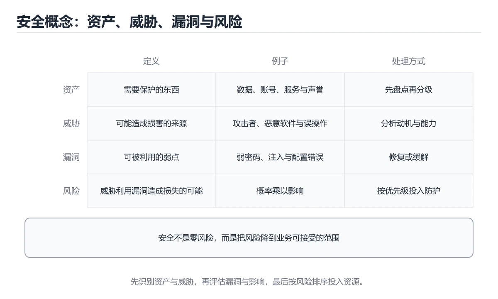

# 安全概念入门




> 内容更新时间：2026-10-03 · 学习阶段：入门 · 预计用时：15 分钟

## 学习目标

- 先认识「安全概念入门」需要的工具、输入和输出。
- 按步骤运行最小示例，并记录结果与错误。
- 用一个边界输入验证自己是否真正掌握。

## 前置知识

- 会进行基本的文件或命令行操作。
- 不需要预先掌握「安全与合规」的高级知识。

## 一句话入门

理解资产、威胁、漏洞、风险和缓解。

## 最小示例

```python
asset = {"name": "用户数据库", "value": 5}
threat = {"name": "弱口令", "likelihood": 4}
vulnerability = {"name": "未启用多因素认证", "severity": 5}
risk = threat["likelihood"] * vulnerability["severity"]
print(asset["name"], threat["name"], risk)
```

## 预期输出

```text
用户数据库 弱口令 20
```

## 常见错误

- 输入或环境与示例不一致，导致结果不符合预期。
- 复制命令时遗漏空格、引号或必要参数。

## 动手练习

1. 原样运行最小示例，保存命令和输出。
2. 把数字 2 改成 10，预测并验证新结果。
3. 制造一个错误输入，写出错误信息和修复方法。

## 本课小结

- 入门阶段先保证能运行、能观察、能解释，再追求复杂功能。
- 每次只改一个变量，记录预测与实际结果。
- 遇到错误先看第一条错误信息，再回到最小示例。


## 代码实验：把示例跑成证据

这一节不引入新语法，而是把「安全概念入门」的最小示例变成可以复现、可以对照的实验。每次只改变一个条件，先写预测，再运行，最后解释差异。

### 实验一：建立基线

```python
asset = {"name": "用户数据库", "value": 5}
threat = {"name": "弱口令", "likelihood": 4}
vulnerability = {"name": "未启用多因素认证", "severity": 5}
risk = threat["likelihood"] * vulnerability["severity"]
print(asset["name"], threat["name"], risk)
```

先原样运行上面的代码，记录命令、完整输出和退出状态。然后把输出与正文的预期输出逐字对照，不要用“看起来差不多”代替核对；空格、大小写、换行和错误流向都可能暴露环境差异。

### 实验二：只改一个输入

从代码中选一个会影响结果的字面量、参数或输入，把它替换成边界值：数值可尝试 0、1、最大值和最小值，字符串可尝试空串和超长文本，集合可尝试空集合、单元素和重复元素。先写出预测，再运行并记录实际结果。

### 实验三：制造一个可控错误

把复合语句末尾的冒号删掉，或者把字符串直接参与数值运算。先记录解释器报出的第一行错误和行号，再修复并重跑基线。

| 实验 | 改动 | 预测 | 实际 | 结论 |
| --- | --- | --- | --- | --- |
| 基线 | 保持原样 |  |  |  |
| 边界 |  |  |  |  |
| 失败 |  |  |  |  |

### 实验四：用三句话复述

1. 输入是什么，哪些输入属于合法范围，哪些属于边界或非法范围？
2. 程序按什么顺序处理输入，在哪一步产生了状态变化或副作用？
3. 输出如何验证，失败时第一条可观察证据是什么？

## 安全基础机制速览

### 资产、威胁、漏洞与风险

安全工作的起点是资产：数据、账号、服务、代码和声誉都有价值。威胁是可能造成损害的事件或攻击者，漏洞是系统可被利用的弱点，风险是威胁利用漏洞造成损失的可能性和影响。风险 = 可能性 × 影响，控制措施通过降低概率或影响来管理风险。安全不是“消灭所有风险”，而是把风险降到可接受范围并保留证据。

### 机密性、完整性与可用性

CIA 三元组是安全目标的基础：机密性防止未授权读取，完整性防止未授权修改，可用性保证授权用户能及时访问。认证回答“你是谁”，授权回答“你能做什么”，审计记录“你做过什么”。身份验证应使用强密码、多因素认证和安全的会话管理；授权应遵循最小权限和职责分离。日志要记录关键决策，但不能泄露密码、令牌和敏感数据。

### 加密、哈希与密钥

加密用密钥把明文变成密文，对称加密速度快，非对称加密便于密钥交换和签名。哈希把任意长度输入映射成固定长度摘要，用于完整性校验；密码存储必须使用专门的慢哈希算法并加盐，不能用普通 SHA-256 直接保存密码。盐防止彩虹表，pepper 是额外的服务端秘密，密钥必须放在安全的密钥管理系统中，不能提交到代码仓库。

### 输入校验、注入与防御纵深

所有外部输入都不可信，包括表单、URL、Header、文件、第三方 API 和模型输出。输入校验应在边界层完成，输出编码要匹配目标上下文，SQL、命令、模板和日志都有不同的注入风险；参数化查询和最小权限是防止注入的核心。防御纵深要求网络、主机、应用和数据层各自有控制，不能只依赖一道防火墙或一次前端校验。

### 供应链、隐私与事件响应

依赖、构建工具、容器镜像和 CI 凭据都属于供应链范围。锁定版本、校验来源、扫描漏洞、限制发布权限，并保留可复现构建记录。隐私要求最小收集、明确目的、限制保留期限和可删除。发生安全事件时按准备、发现、遏制、根除、恢复和复盘推进，先止损再调查，保留证据链，最后把根因转化为可验证的改进项。

## 可运行练习

下面 3 个任务围绕“安全概念入门”展开，代码可以直接粘贴到 App 的离线沙箱里运行；如果示例会读取标准输入，请按代码注释在沙箱的 stdin 区域填入同样格式的数据。

### 任务 1：先跑通，再解释

```python
asset = {"name": "用户数据库", "value": 5}
threat = {"name": "弱口令", "likelihood": 4}
vulnerability = {"name": "未启用多因素认证", "severity": 5}
risk = threat["likelihood"] * vulnerability["severity"]
print(asset["name"], threat["name"], risk)
```

**预期输出**：运行后会输出与“安全概念入门”相关的关键结果；请重点核对输出行数、最后一个数值和异常提示。

**验收标准**：代码能正常运行；逐行解释每个变量的值如何变化，并指出哪一行决定了最终结果。

### 任务 2：只改一个条件

复制上面的代码，只修改一个输入、边界或参数（例如空值、最大值、循环次数、过滤条件），先写出你的预测，再实际运行。

**验收标准**：留下“原结果 → 改动 → 预测 → 实际结果 → 差异原因”五步记录；如果预测错误，要写出修正后的心智模型。

### 任务 3：迁移到自己的数据

用同一套思路处理一组你自己的数据或场景，保持输出格式与任务 1 一致。

**验收标准**：代码不少于 10 行，至少包含 1 个边界检查；把代码和运行结果保存到笔记或片段库。


## 故障现场

这一节把“安全概念入门”最常见的失败方式还原成现场记录，练习时按“症状 → 复现 → 定位 → 修复 → 预防”的顺序排查。

### 现场 1：“安全概念入门”的 安全概念入门 常规用例通过，但边界用例失败

**症状**：在“安全概念入门”的练习或生产场景里出现““安全概念入门”的 安全概念入门 常规用例通过，但边界用例失败”。

**复现**：准备一组最小输入，只保留触发““安全概念入门”的 安全概念入门 常规用例通过，但边界用例失败”的必要条件，连续运行两次确认结果稳定。

**定位**：围绕“安全概念入门 的前置条件与取值边界没有写进代码，默认值掩盖了空值和极值”检查调用链、输入数据和环境配置，先验证假设再改代码。

**修复**：为“安全概念入门”补一条空值或极值用例，把前置条件写成断言，并让失败信息直接指出是哪个输入越界

**预防**：把““安全概念入门”的 安全概念入门 常规用例通过，但边界用例失败”写成一条自动化用例，并在“安全概念入门”的验收清单里保留对应检查项。


### 现场 2：“安全概念入门”的 安全与合规 结果在两次运行之间不一致

**症状**：在“安全概念入门”的练习或生产场景里出现““安全概念入门”的 安全与合规 结果在两次运行之间不一致”。

**复现**：准备一组最小输入，只保留触发““安全概念入门”的 安全与合规 结果在两次运行之间不一致”的必要条件，连续运行两次确认结果稳定。

**定位**：围绕“安全与合规 依赖了当前版本、执行顺序或共享状态，单次运行无法暴露差异”检查调用链、输入数据和环境配置，先验证假设再改代码。

**修复**：固定“安全概念入门”使用的版本与随机种子，记录两次运行的完整输入和输出，再逐项消除非确定性来源

**预防**：把““安全概念入门”的 安全与合规 结果在两次运行之间不一致”写成一条自动化用例，并在“安全概念入门”的验收清单里保留对应检查项。


### 现场 3：功能测试全部通过，但越权请求仍然拿到了数据

**症状**：在“安全概念入门”的练习或生产场景里出现“功能测试全部通过，但越权请求仍然拿到了数据”。

**复现**：准备一组最小输入，只保留触发“功能测试全部通过，但越权请求仍然拿到了数据”的必要条件，连续运行两次确认结果稳定。

**定位**：围绕“权限校验只做在界面层，安全概念入门 对应的接口缺少服务端鉴权与输入约束”检查调用链、输入数据和环境配置，先验证假设再改代码。

**修复**：为“安全概念入门”补一组越权、重放和畸形输入用例，把校验放在服务端入口并记录审计日志

**预防**：把“功能测试全部通过，但越权请求仍然拿到了数据”写成一条自动化用例，并在“安全概念入门”的验收清单里保留对应检查项。


## 考点精讲：把测验题还原成判断过程

本课有 5 个判断点。先自己作答，再看「判断依据」；如果结论正确但理由不完整，回到正文对应章节补足概念。

### 考点 1：在安全分析中，资产、威胁与漏洞的关系是？

- **正确判断**：资产是需要保护的对象，威胁可能利用漏洞造成损害
- **判断依据**：正确答案是「资产是需要保护的对象，威胁可能利用漏洞造成损害」，本课在「安全基础机制速览」中说明：威胁是可能造成损害的事件或攻击者，漏洞是系统可被利用的弱点，风险是威胁利用漏洞造成损失的可能性和影响。资产是值得保护的数据、服务或设备。本课还在「安全基础机制速览」中说明：盐防止彩虹表，pepper 是额外的服务端秘密，密钥必须放在安全的密钥管理系统中，不能提交到代码仓库。本课还在「安全基础机制速览」中说明：安全工作的起点是资产：数据、账号、服务、代码和声誉都有价值。
- **迁移检查**：遮住选项，只根据定义复述一次答案，再回来看哪个选项与复述一致。

### 考点 2：示例中 risk 由 likelihood 与 severity 相乘得到，这体现了什么思路？

- **正确判断**：用发生可能性与影响程度综合评估风险等级
- **判断依据**：正确答案是「用发生可能性与影响程度综合评估风险等级」，本课在「安全基础机制速览」中说明：威胁是可能造成损害的事件或攻击者，漏洞是系统可被利用的弱点，风险是威胁利用漏洞造成损失的可能性和影响。风险通常用「发生的可能性 × 造成的影响」来度量：可能性低但影响极大的事件仍值得关注，可能性高但影响很小的事件也未必优先处理。本课还在「安全基础机制速览」中说明：风险 = 可能性 × 影响，控制措施通过降低概率或影响来管理风险。
- **迁移检查**：把题干里的一个条件换成边界值，原来的结论还成立吗？写出判断过程。

### 考点 3：针对「未启用多因素认证」这一漏洞，最直接的缓解措施是？

- **正确判断**：为关键账户启用多因素认证并强制强密码策略
- **判断依据**：正确答案是「为关键账户启用多因素认证并强制强密码策略」，本课在「安全基础机制速览」中说明：身份验证应使用强密码、多因素认证和安全的会话管理。缓解措施要针对漏洞本身：多因素认证能在口令泄露后继续提供一道防线，配合强密码与登录次数限制可以显著降低账户被攻破的可能性。本课还在「安全基础机制速览」中说明：日志要记录关键决策，但不能泄露密码、令牌和敏感数据。本课还在「安全基础机制速览」中说明：密码存储必须使用专门的慢哈希算法并加盐，不能用普通 SHA-256 直接保存密码。
- **迁移检查**：如果给某个错误选项去掉一个限定词，它会不会变成正确？说明理由。

### 考点 4：「漏洞」与「威胁」在概念上的区别是？

- **正确判断**：漏洞是系统自身的弱点，威胁是可能利用它的外部因素
- **判断依据**：正确答案是「漏洞是系统自身的弱点，威胁是可能利用它的外部因素」，本课在「安全基础机制速览」中说明：防御纵深要求网络、主机、应用和数据层各自有控制，不能只依赖一道防火墙或一次前端校验。漏洞是系统或流程中存在的可被利用的缺陷，例如未打补丁的组件、弱口令或错误配置。本课还在「安全基础机制速览」中说明：所有外部输入都不可信，包括表单、URL、Header、文件、第三方 API 和模型输出。本课还在「安全基础机制速览」中说明：安全不是“消灭所有风险”，而是把风险降到可接受范围并保留证据。
- **迁移检查**：如果给某个错误选项去掉一个限定词，它会不会变成正确？说明理由。

### 考点 5：补全代码：「安全概念入门」示例中，下面这行代码缺少哪个关键字或函数名？请填入 ____。 `threat = {"name": "弱口令", "____": 4}`

- **正确判断**：likelihood
- **判断依据**：正确答案是「likelihood」，本课在「安全基础机制速览」中说明：CIA 三元组是安全目标的基础：机密性防止未授权读取，完整性防止未授权修改，可用性保证授权用户能及时访问。本课还在「安全基础机制速览」中说明：发生安全事件时按准备、发现、遏制、根除、恢复和复盘推进，先止损再调查，保留证据链，最后把根因转化为可验证的改进项。本课还在「安全基础机制速览」中说明：安全工作的起点是资产：数据、账号、服务、代码和声誉都有价值。
- **迁移检查**：不看题干，用自己的话补全这句话，再与标准答案对照。

### 补充考点 1：阅读「安全概念入门」的代码片段，下面哪项判断是正确的？

- **正确判断**：资产是需要保护的对象，威胁可能利用漏洞造成损害
- **判断依据**：正确答案是「资产是需要保护的对象，威胁可能利用漏洞造成损害」。这段代码来自「安全概念入门」的示例，判断时先看输入与输出，再检查条件、循环和边界。正确答案是「资产是需要保护的对象，威胁可能利用漏洞造成损害」，本课在「安全基础机制速览」中说明：威胁是可能造成损害的事件或攻击者，漏洞是系统可被利用的弱点，风险是威胁利用漏洞造成损失的可能性和影响。资…在「安全概念入门」中，如果只改一个条件，输出通常会随之改变，因此不能脱离代码前提作答。

### 补充自测（1 题）

1. 围绕“安全概念入门”中的 安全概念入门、安全与合规、入门练习，下列哪两项是本课强调的实践判断？

这些题按“先定位概念、再排除边界错误、最后核对答案”的顺序作答；每题解析都给出了判断依据。


## 本课复习清单

离开本课前，逐项确认：

- [ ] 不看解析，能说出「在安全分析中，资产、威胁与漏洞的关系是？」的判断依据。
- [ ] 不看解析，能说出「示例中 risk 由 likelihood 与 severity 相乘得到，这体…」的判断依据。
- [ ] 不看解析，能说出「针对「未启用多因素认证」这一漏洞，最直接的缓解措施是？」的判断依据。
- [ ] 不看解析，能说出「「漏洞」与「威胁」在概念上的区别是？」的判断依据。
- [ ] 不看解析，能说出「补全代码：「安全概念入门」示例中，下面这行代码缺少哪个关键字或函数名？请填入 _…」的判断依据。
- [ ] 至少运行一次本课示例，记录输入、输出和一个边界情况。
- [ ] 把本课最容易混淆的两个概念写成一句话对照。

| 复盘项 | 记录 |
| --- | --- |
| 已经能独立解释的考点 |  |
| 仍然说不清的概念 |  |
| 下一步验证动作 |  |

## 逐节复习与自检

下面按正文顺序回顾每一节，并给出一个自检问题；说不清的地方回到原章节补课。

### 最小示例

```python
asset = {"name": "用户数据库", "value": 5}
threat = {"name": "弱口令", "likelihood": 4}
vulnerability = {"name": "未启用多因素认证", "severity": 5}
risk = threat["likelihood"] * vulnerability["severity"]
print(asset["name"], threat["name"], risk)
```

自检：这一节与相邻主题的边界在哪里？

### 预期输出

```text
用户数据库 弱口令 20
```

自检：这一节与相邻主题的边界在哪里？

### 常见错误

输入或环境与示例不一致，导致结果不符合预期。

自检：把这一节讲给没学过的人，最需要强调哪一点？

### 动手练习

把数字 2 改成 10，预测并验证新结果。制造一个错误输入，写出错误信息和修复方法。

自检：如果去掉这一节里的一个前提，结论会怎样变化？

### 安全落地补充：安全概念入门

先回答：保护哪些数据、谁可以访问、哪些组件是信任边界、攻击者能从哪些入口进入。围绕「安全概念入门、安全与合规、入门练习」列出至少 3 个入口和对应的最小权限。

自检：把这一节讲给没学过的人，最需要强调哪一点？

## 术语速查

把本课反复出现的术语集中放在一起。复习时先遮住右列，尝试用自己的话解释，再回到正文核对。

| 术语 | 本课语境 |
| --- | --- |
| `安全概念入门` | 本课围绕该主题展开，结合正文与代码示例理解它的适用边界。 |
| `安全与合规` | 本课围绕该主题展开，结合正文与代码示例理解它的适用边界。 |
| `入门练习` | 本课围绕该主题展开，结合正文与代码示例理解它的适用边界。 |

## 面试问答与自测

下面把本课考点换成面试追问。先口述自己的答案，
再对照参考回答检查是否遗漏了前提、边界或失败路径。

### 追问 1：在安全分析中，资产、威胁与漏洞的关系是？

**参考回答**：正确答案是「资产是需要保护的对象，威胁可能利用漏洞造成损害」，本课在「安全基础机制速览」中说明：威胁是可能造成损害的事件或攻击者，漏洞是系统可被利用的弱点，风险是威胁利用漏洞造成损失的可能性和影响。资产是值得保护的数据、服务或设备。本课还在「安全基础机制速览」中说明：盐防止彩虹表，pepper 是额外的服务端秘密，密钥必须放在安全的密钥管理系统中，不能提交到代码仓库。本课还在「安全基础机制速览」中说明：安全工作的起点是资产：数据、账号、服务、代码和声誉都有价值。

### 追问 2：示例中 risk 由 likelihood 与 severity 相乘得到，这体现了什么思路？

**参考回答**：正确答案是「用发生可能性与影响程度综合评估风险等级」，本课在「安全基础机制速览」中说明：威胁是可能造成损害的事件或攻击者，漏洞是系统可被利用的弱点，风险是威胁利用漏洞造成损失的可能性和影响。风险通常用「发生的可能性 × 造成的影响」来度量：可能性低但影响极大的事件仍值得关注，可能性高但影响很小的事件也未必优先处理。本课还在「安全基础机制速览」中说明：风险 = 可能性 × 影响，控制措施通过降低概率或影响来管理风险。

### 追问 3：针对「未启用多因素认证」这一漏洞，最直接的缓解措施是？

**参考回答**：正确答案是「为关键账户启用多因素认证并强制强密码策略」，本课在「安全基础机制速览」中说明：身份验证应使用强密码、多因素认证和安全的会话管理。缓解措施要针对漏洞本身：多因素认证能在口令泄露后继续提供一道防线，配合强密码与登录次数限制可以显著降低账户被攻破的可能性。本课还在「安全基础机制速览」中说明：日志要记录关键决策，但不能泄露密码、令牌和敏感数据。本课还在「安全基础机制速览」中说明：密码存储必须使用专门的慢哈希算法并加盐，不能用普通 SHA-256 直接保存密码。

### 追问 4：「漏洞」与「威胁」在概念上的区别是？

**参考回答**：正确答案是「漏洞是系统自身的弱点，威胁是可能利用它的外部因素」，本课在「安全基础机制速览」中说明：防御纵深要求网络、主机、应用和数据层各自有控制，不能只依赖一道防火墙或一次前端校验。漏洞是系统或流程中存在的可被利用的缺陷，例如未打补丁的组件、弱口令或错误配置。本课还在「安全基础机制速览」中说明：所有外部输入都不可信，包括表单、URL、Header、文件、第三方 API 和模型输出。本课还在「安全基础机制速览」中说明：安全不是“消灭所有风险”，而是把风险降到可接受范围并保留证据。

### 追问 5：补全代码：「安全概念入门」示例中，下面这行代码缺少哪个关键字或函数名？请填入 ____。 `threat = {"name": "弱口令", "____": 4}`

**参考回答**：正确答案是「likelihood」，本课在「安全基础机制速览」中说明：CIA 三元组是安全目标的基础：机密性防止未授权读取，完整性防止未授权修改，可用性保证授权用户能及时访问。本课还在「安全基础机制速览」中说明：发生安全事件时按准备、发现、遏制、根除、恢复和复盘推进，先止损再调查，保留证据链，最后把根因转化为可验证的改进项。本课还在「安全基础机制速览」中说明：安全工作的起点是资产：数据、账号、服务、代码和声誉都有价值。

<!-- p0-depth-v2:start -->
## 零基础精讲：把「安全概念入门」真正讲透

### 先建立一个直觉

把安全看成一条防线：先识别资产与威胁，再限制权限、验证输入、记录审计，并为失败准备隔离和恢复方案。

本课的摘要可以当作一张地图：理解资产、威胁、漏洞、风险和缓解。

阅读时不要只记结论，先问三个问题：它解决什么问题？依赖哪些前提？在什么条件下会失效？

### 逐步拆解

1. 识别输入。先写清数据类型、取值范围、空值策略，以及输入来自用户、文件还是另一个服务。
2. 描述处理过程。把「安全概念入门、安全与合规、入门练习」映射到具体步骤，每步都要求能单独验证。
3. 定义输出。输出不仅包括正常结果，还包括错误码、日志、指标和资源释放状态。
4. 找出一条失败路径。让错误尽早暴露，并说明重试、降级、回滚或人工处理的边界。
5. 用一个小例子贯穿全过程。先手算或预测结果，再运行代码或实验，最后解释差异。

### 把正文串成一条执行链

- **实验一：建立基线**：先原样运行上面的代码，记录命令、完整输出和退出状态
- **实验二：只改一个输入**：从代码中选一个会影响结果的字面量、参数或输入，把它替换成边界值：数值可尝试 0、1、最大值和最小值，字符串可尝试空串和超长文本，集合可尝试空集合、单元素和重复元素
- **实验三：制造一个可控错误**：实验三：制造一个可控错误
- **实验四：用三句话复述**：1. 输入是什么，哪些输入属于合法范围，哪些属于边界或非法范围
- **资产、威胁、漏洞与风险**：安全工作的起点是资产：数据、账号、服务、代码和声誉都有价值
- **机密性、完整性与可用性**：CIA 三元组是安全目标的基础：机密性防止未授权读取，完整性防止未授权修改，可用性保证授权用户能及时访问

### 从测验反推易错点

**检查点 1：在安全分析中，资产、威胁与漏洞的关系是？**

- 参考判断：资产是需要保护的对象，威胁可能利用漏洞造成损害
- 解析：正确答案是「资产是需要保护的对象，威胁可能利用漏洞造成损害」，本课在「安全基础机制速览」中说明：威胁是可能造成损害的事件或攻击者，漏洞是系统可被利用的弱点，风险是威胁利用漏洞造成损失的可能性和影响。资产是值得保护的数据、服务或设备。本课还在「安全基础机制速览」中说明：盐防止彩虹表，pepper 是额外的服务端秘密，密钥必须放在安全的密钥管理系统中，不能提交到代码仓库。本课还在「安全基础机制速览」中说明：安全工作的起点是资产：数据、账号、服务、代码和声誉都有价值。
- 自问：如果去掉题干里的一个限定词，结论还成立吗？

**检查点 2：示例中 risk 由 likelihood 与 severity 相乘得到，这体现了什么思路？**

- 参考判断：用发生可能性与影响程度综合评估风险等级
- 解析：正确答案是「用发生可能性与影响程度综合评估风险等级」，本课在「安全基础机制速览」中说明：威胁是可能造成损害的事件或攻击者，漏洞是系统可被利用的弱点，风险是威胁利用漏洞造成损失的可能性和影响。风险通常用「发生的可能性 × 造成的影响」来度量：可能性低但影响极大的事件仍值得关注，可能性高但影响很小的事件也未必优先处理。本课还在「安全基础机制速览」中说明：风险 = 可能性 × 影响，控制措施通过降低概率或影响来管理风险。
- 自问：如果去掉题干里的一个限定词，结论还成立吗？

**检查点 3：针对「未启用多因素认证」这一漏洞，最直接的缓解措施是？**

- 参考判断：为关键账户启用多因素认证并强制强密码策略
- 解析：正确答案是「为关键账户启用多因素认证并强制强密码策略」，本课在「安全基础机制速览」中说明：身份验证应使用强密码、多因素认证和安全的会话管理。缓解措施要针对漏洞本身：多因素认证能在口令泄露后继续提供一道防线，配合强密码与登录次数限制可以显著降低账户被攻破的可能性。本课还在「安全基础机制速览」中说明：日志要记录关键决策，但不能泄露密码、令牌和敏感数据。本课还在「安全基础机制速览」中说明：密码存储必须使用专门的慢哈希算法并加盐，不能用普通 SHA-256 直接保存密码。
- 自问：如果去掉题干里的一个限定词，结论还成立吗？

**检查点 4：「漏洞」与「威胁」在概念上的区别是？**

- 参考判断：漏洞是系统自身的弱点，威胁是可能利用它的外部因素
- 解析：正确答案是「漏洞是系统自身的弱点，威胁是可能利用它的外部因素」，本课在「安全基础机制速览」中说明：防御纵深要求网络、主机、应用和数据层各自有控制，不能只依赖一道防火墙或一次前端校验。漏洞是系统或流程中存在的可被利用的缺陷，例如未打补丁的组件、弱口令或错误配置。本课还在「安全基础机制速览」中说明：所有外部输入都不可信，包括表单、URL、Header、文件、第三方 API 和模型输出。本课还在「安全基础机制速览」中说明：安全不是“消灭所有风险”，而是把风险降到可接受范围并保留证据。
- 自问：如果去掉题干里的一个限定词，结论还成立吗？

**检查点 5：补全代码：「安全概念入门」示例中，下面这行代码缺少哪个关键字或函数名？请填入 ____。 `threat =…**

- 参考判断：likelihood
- 解析：正确答案是「likelihood」，本课在「安全基础机制速览」中说明：CIA 三元组是安全目标的基础：机密性防止未授权读取，完整性防止未授权修改，可用性保证授权用户能及时访问。本课还在「安全基础机制速览」中说明：发生安全事件时按准备、发现、遏制、根除、恢复和复盘推进，先止损再调查，保留证据链，最后把根因转化为可验证的改进项。本课还在「安全基础机制速览」中说明：安全工作的起点是资产：数据、账号、服务、代码和声誉都有价值。
- 自问：如果去掉题干里的一个限定词，结论还成立吗？

### 工程排错顺序

| 先查什么 | 要得到的证据 | 判断标准 |
| --- | --- | --- |
| 资产、威胁和行为主体是否明确？ | 日志、输入样例、测试或指标 | 能复现并解释，才算定位 |
| 权限是否默认拒绝并最小化？ | 日志、输入样例、测试或指标 | 能复现并解释，才算定位 |
| 输入、输出与审计是否都有控制？ | 日志、输入样例、测试或指标 | 能复现并解释，才算定位 |
| 发现绕过时能否快速隔离和恢复？ | 日志、输入样例、测试或指标 | 能复现并解释，才算定位 |

排查顺序应遵循「先复现、再缩小范围、再验证假设、最后修改」。不要同时改多个变量，否则即使问题消失，也无法知道真正原因。

### 变式训练

1. 把它放进一个只有单机、没有额外依赖的小项目，先保证正确，再考虑扩展。
2. 把输入规模扩大十倍，记录时间、内存和失败路径，找出第一个真正瓶颈。
3. 制造一次依赖超时或错误输入，要求系统给出可解释错误并且不留下半完成状态。
4. 让另一个同学只读接口说明和测试用例，复现你的结论；无法复现的部分继续补文档或测试。
5. 删掉一个看似必要的步骤，观察哪个测试或指标先失败，用证据说明它为什么必要。
6. 把方案切换到低资源设备，重新评估默认参数、超时和降级策略。

每道变式都写下：预测、实际结果、差异、下一步。没有留下证据的练习，很难迁移到真实项目。

### 本课自测

- [ ] 能用一句话解释「安全概念入门」在本课中的角色与边界。
- [ ] 能举出一个正常例子和一个失败例子。
- [ ] 能说出最小验证步骤，以及需要记录的证据。
- [ ] 能用一句话解释「安全与合规」在本课中的角色与边界。
- [ ] 能举出一个正常例子和一个失败例子。
- [ ] 能说出最小验证步骤，以及需要记录的证据。
- [ ] 能用一句话解释「入门练习」在本课中的角色与边界。
- [ ] 能举出一个正常例子和一个失败例子。
- [ ] 能说出最小验证步骤，以及需要记录的证据。
- [ ] 能用一句话解释「安全概念入门」在本课中的角色与边界。
- [ ] 能举出一个正常例子和一个失败例子。
- [ ] 能说出最小验证步骤，以及需要记录的证据。
- [ ] 能用一句话解释「安全与合规」在本课中的角色与边界。
- [ ] 能举出一个正常例子和一个失败例子。
- [ ] 能说出最小验证步骤，以及需要记录的证据。

### 迁移案例库

下面用不同约束重复同一套方法。每完成一轮，都把结论写进笔记，并只改变一个变量。

#### 迁移案例 1：围绕「安全概念入门」做一次小实验

**目标**：在不改变课程主体的前提下，验证「安全概念入门」中的一个关键判断。

**步骤**：
1. 复述当前方案对「安全概念入门」的假设，写成一句可证伪的话。
2. 设计一个正常输入和一个边界输入，分别预测输出。
3. 运行或逐步演算，记录实际输出、耗时和失败信息。
4. 只调整一个参数，比较前后差异并解释原因。
5. 补充一条测试或复习卡，确保下次能更快复现。

**验收**：结论有证据、差异可解释、失败可恢复；如果做不到，说明还需要缩小问题范围。

#### 迁移案例 2：围绕「安全与合规」做一次小实验

**目标**：在不改变课程主体的前提下，验证「安全概念入门」中的一个关键判断。

**步骤**：
1. 复述当前方案对「安全与合规」的假设，写成一句可证伪的话。
2. 设计一个正常输入和一个边界输入，分别预测输出。
3. 运行或逐步演算，记录实际输出、耗时和失败信息。
4. 只调整一个参数，比较前后差异并解释原因。
5. 补充一条测试或复习卡，确保下次能更快复现。

**验收**：结论有证据、差异可解释、失败可恢复；如果做不到，说明还需要缩小问题范围。

#### 迁移案例 3：围绕「入门练习」做一次小实验

**目标**：在不改变课程主体的前提下，验证「安全概念入门」中的一个关键判断。

**步骤**：
1. 复述当前方案对「入门练习」的假设，写成一句可证伪的话。
2. 设计一个正常输入和一个边界输入，分别预测输出。
3. 运行或逐步演算，记录实际输出、耗时和失败信息。
4. 只调整一个参数，比较前后差异并解释原因。
5. 补充一条测试或复习卡，确保下次能更快复现。

**验收**：结论有证据、差异可解释、失败可恢复；如果做不到，说明还需要缩小问题范围。

#### 迁移案例 4：围绕「安全概念入门」做一次小实验

**目标**：在不改变课程主体的前提下，验证「安全概念入门」中的一个关键判断。

**步骤**：
1. 复述当前方案对「安全概念入门」的假设，写成一句可证伪的话。
2. 设计一个正常输入和一个边界输入，分别预测输出。
3. 运行或逐步演算，记录实际输出、耗时和失败信息。
4. 只调整一个参数，比较前后差异并解释原因。
5. 补充一条测试或复习卡，确保下次能更快复现。

**验收**：结论有证据、差异可解释、失败可恢复；如果做不到，说明还需要缩小问题范围。

#### 迁移案例 5：围绕「安全与合规」做一次小实验

**目标**：在不改变课程主体的前提下，验证「安全概念入门」中的一个关键判断。

**步骤**：
1. 复述当前方案对「安全与合规」的假设，写成一句可证伪的话。
2. 设计一个正常输入和一个边界输入，分别预测输出。
3. 运行或逐步演算，记录实际输出、耗时和失败信息。
4. 只调整一个参数，比较前后差异并解释原因。
5. 补充一条测试或复习卡，确保下次能更快复现。

**验收**：结论有证据、差异可解释、失败可恢复；如果做不到，说明还需要缩小问题范围。

#### 迁移案例 6：围绕「入门练习」做一次小实验

**目标**：在不改变课程主体的前提下，验证「安全概念入门」中的一个关键判断。

**步骤**：
1. 复述当前方案对「入门练习」的假设，写成一句可证伪的话。
2. 设计一个正常输入和一个边界输入，分别预测输出。
3. 运行或逐步演算，记录实际输出、耗时和失败信息。
4. 只调整一个参数，比较前后差异并解释原因。
5. 补充一条测试或复习卡，确保下次能更快复现。

**验收**：结论有证据、差异可解释、失败可恢复；如果做不到，说明还需要缩小问题范围。

#### 迁移案例 7：围绕「安全概念入门」做一次小实验

**目标**：在不改变课程主体的前提下，验证「安全概念入门」中的一个关键判断。

**步骤**：
1. 复述当前方案对「安全概念入门」的假设，写成一句可证伪的话。
2. 设计一个正常输入和一个边界输入，分别预测输出。
3. 运行或逐步演算，记录实际输出、耗时和失败信息。
4. 只调整一个参数，比较前后差异并解释原因。
5. 补充一条测试或复习卡，确保下次能更快复现。

**验收**：结论有证据、差异可解释、失败可恢复；如果做不到，说明还需要缩小问题范围。

#### 迁移案例 8：围绕「安全与合规」做一次小实验

**目标**：在不改变课程主体的前提下，验证「安全概念入门」中的一个关键判断。

**步骤**：
1. 复述当前方案对「安全与合规」的假设，写成一句可证伪的话。
2. 设计一个正常输入和一个边界输入，分别预测输出。
3. 运行或逐步演算，记录实际输出、耗时和失败信息。
4. 只调整一个参数，比较前后差异并解释原因。
5. 补充一条测试或复习卡，确保下次能更快复现。

**验收**：结论有证据、差异可解释、失败可恢复；如果做不到，说明还需要缩小问题范围。

#### 迁移案例 9：围绕「入门练习」做一次小实验

**目标**：在不改变课程主体的前提下，验证「安全概念入门」中的一个关键判断。

**步骤**：
1. 复述当前方案对「入门练习」的假设，写成一句可证伪的话。
2. 设计一个正常输入和一个边界输入，分别预测输出。
3. 运行或逐步演算，记录实际输出、耗时和失败信息。
4. 只调整一个参数，比较前后差异并解释原因。
5. 补充一条测试或复习卡，确保下次能更快复现。

**验收**：结论有证据、差异可解释、失败可恢复；如果做不到，说明还需要缩小问题范围。

#### 迁移案例 10：围绕「安全概念入门」做一次小实验

**目标**：在不改变课程主体的前提下，验证「安全概念入门」中的一个关键判断。

**步骤**：
1. 复述当前方案对「安全概念入门」的假设，写成一句可证伪的话。
2. 设计一个正常输入和一个边界输入，分别预测输出。
3. 运行或逐步演算，记录实际输出、耗时和失败信息。
4. 只调整一个参数，比较前后差异并解释原因。
5. 补充一条测试或复习卡，确保下次能更快复现。

**验收**：结论有证据、差异可解释、失败可恢复；如果做不到，说明还需要缩小问题范围。

#### 迁移案例 11：围绕「安全与合规」做一次小实验

**目标**：在不改变课程主体的前提下，验证「安全概念入门」中的一个关键判断。

**步骤**：
1. 复述当前方案对「安全与合规」的假设，写成一句可证伪的话。
2. 设计一个正常输入和一个边界输入，分别预测输出。
3. 运行或逐步演算，记录实际输出、耗时和失败信息。
4. 只调整一个参数，比较前后差异并解释原因。
5. 补充一条测试或复习卡，确保下次能更快复现。

**验收**：结论有证据、差异可解释、失败可恢复；如果做不到，说明还需要缩小问题范围。

#### 迁移案例 12：围绕「入门练习」做一次小实验

**目标**：在不改变课程主体的前提下，验证「安全概念入门」中的一个关键判断。

**步骤**：
1. 复述当前方案对「入门练习」的假设，写成一句可证伪的话。
2. 设计一个正常输入和一个边界输入，分别预测输出。
3. 运行或逐步演算，记录实际输出、耗时和失败信息。
4. 只调整一个参数，比较前后差异并解释原因。
5. 补充一条测试或复习卡，确保下次能更快复现。

**验收**：结论有证据、差异可解释、失败可恢复；如果做不到，说明还需要缩小问题范围。

#### 迁移案例 13：围绕「安全概念入门」做一次小实验

**目标**：在不改变课程主体的前提下，验证「安全概念入门」中的一个关键判断。

**步骤**：
1. 复述当前方案对「安全概念入门」的假设，写成一句可证伪的话。
2. 设计一个正常输入和一个边界输入，分别预测输出。
3. 运行或逐步演算，记录实际输出、耗时和失败信息。
4. 只调整一个参数，比较前后差异并解释原因。
5. 补充一条测试或复习卡，确保下次能更快复现。

**验收**：结论有证据、差异可解释、失败可恢复；如果做不到，说明还需要缩小问题范围。

#### 迁移案例 14：围绕「安全与合规」做一次小实验

**目标**：在不改变课程主体的前提下，验证「安全概念入门」中的一个关键判断。

**步骤**：
1. 复述当前方案对「安全与合规」的假设，写成一句可证伪的话。
2. 设计一个正常输入和一个边界输入，分别预测输出。
3. 运行或逐步演算，记录实际输出、耗时和失败信息。
4. 只调整一个参数，比较前后差异并解释原因。
5. 补充一条测试或复习卡，确保下次能更快复现。

**验收**：结论有证据、差异可解释、失败可恢复；如果做不到，说明还需要缩小问题范围。

#### 迁移案例 15：围绕「入门练习」做一次小实验

**目标**：在不改变课程主体的前提下，验证「安全概念入门」中的一个关键判断。

**步骤**：
1. 复述当前方案对「入门练习」的假设，写成一句可证伪的话。
2. 设计一个正常输入和一个边界输入，分别预测输出。
3. 运行或逐步演算，记录实际输出、耗时和失败信息。
4. 只调整一个参数，比较前后差异并解释原因。
5. 补充一条测试或复习卡，确保下次能更快复现。

**验收**：结论有证据、差异可解释、失败可恢复；如果做不到，说明还需要缩小问题范围。

#### 迁移案例 16：围绕「安全概念入门」做一次小实验

**目标**：在不改变课程主体的前提下，验证「安全概念入门」中的一个关键判断。

**步骤**：
1. 复述当前方案对「安全概念入门」的假设，写成一句可证伪的话。
2. 设计一个正常输入和一个边界输入，分别预测输出。
3. 运行或逐步演算，记录实际输出、耗时和失败信息。
4. 只调整一个参数，比较前后差异并解释原因。
5. 补充一条测试或复习卡，确保下次能更快复现。

**验收**：结论有证据、差异可解释、失败可恢复；如果做不到，说明还需要缩小问题范围。

<!-- p0-depth-v2:end -->

## English Overview

**Title:** Security Concepts Basics

**Summary:** Understand assets, threats, vulnerabilities and risk.

**Category:** Security & Compliance  
**Level:** 基础  
**Key terms:** 安全概念入门, 安全与合规, 入门练习

> The full tutorial is written in Chinese. This bilingual overview helps English readers identify the topic, scope and key terms before studying the detailed examples.

## 内容元数据

- 内容版本：v2.0
- 最后更新：2026-10-03
- 学习阶段：基础
- 适用环境：OWASP、云原生与合规安全实践
- 内容来源：内置结构化课程与工程实践整理
- 相关主题：安全概念入门、安全与合规、入门练习
- 质量版本：P0 测验标准 + P1 覆盖扩展 + P2 体验补全


## 安全落地补充：安全概念入门

### 一、资产、边界与信任

先回答：保护哪些数据、谁可以访问、哪些组件是信任边界、攻击者能从哪些入口进入。围绕「安全概念入门、安全与合规、入门练习」列出至少 3 个入口和对应的最小权限。

### 二、威胁 → 控制 → 验证

| 威胁 | 预防控制 | 检测方式 | 验证证据 |
| --- | --- | --- | --- |
| 输入被污染 | schema、白名单、编码 | 异常输入日志和告警 | 越权与注入测试 |
| 权限过大 | 最小权限、临时凭证 | 权限审计和异常调用 | 权限边界测试 |
| 密钥泄露 | 密钥管理、轮换 | 仓库和日志扫描 | 轮换与影响范围记录 |
| 操作不可追溯 | 结构化审计日志 | 关键动作告警 | 审计查询和复盘 |
| 恢复失败 | 备份、回滚、演练 | 恢复指标监控 | 演练时间与数据校验 |

### 三、上线前安全清单

- [ ] 所有外部输入经过校验和输出编码。
- [ ] 认证、授权和会话失效逻辑有测试。
- [ ] 密钥不进入源码、镜像和日志。
- [ ] 依赖漏洞、许可证和来源已审查。
- [ ] 高风险操作有确认、审计和回滚。
- [ ] 安全事件有联系人和升级路径。

### 四、事件响应演练

构造一次凭证泄露或越权访问，按发现、隔离、轮换、取证、恢复、复盘六步执行，记录时间线和剩余风险。


## 参考资料与复核

- 最后复核：2026-10-04
- 下次复核：2027-04-04
- 复核范围：版本兼容、API 行为、安全建议与工程实践
- 来源性质：官方文档与标准；本课正文为离线教学重组，不复制原文

| 参考资料 | 本课用途 |
| --- | --- |
| [OWASP Cheat Sheets](https://cheatsheetseries.owasp.org/) | 应用安全实践 |
| [NIST Cybersecurity](https://www.nist.gov/cyberframework) | 风险治理框架 |

> 本课主题：理解资产、威胁、漏洞、风险和缓解。

> App 完全离线展示文字链接，不会自动联网；需要延伸阅读时可复制链接到浏览器。
